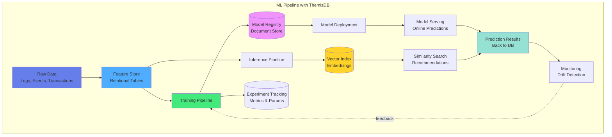

# Kapitel 18: Machine Learning Integration

## Überblick

ThemisDB bietet umfassende Integration mit Machine-Learning-Frameworks und -Workflows. Als Multi-Model-Datenbank mit nativem Vector-Support eignet sich ThemisDB ideal als:

- **ML Feature Store** - Speicherung und Verwaltung von Features für Training und Inference
- **Model Serving Platform** - Online und Batch Predictions
- **Experiment Tracking** - Versionierung von Models, Metriken und Hyperparametern
- **Training Data Management** - Effiziente Speicherung großer Datasets

Die Kombination aus relationalen Daten, Graphen, Dokumenten und Vektoren macht ThemisDB zur idealen Plattform für ML-Pipelines.



Abb. 18.1: ML-Pipeline-Architektur

## 18.1 ML Feature Store

### Feature Engineering mit ThemisDB

**Feature-Definition:**

**Feature-Definition:**

Ein Feature Store in ThemisDB speichert vorberechnete ML-Features für verschiedene Entities (Kunden, Produkte, etc.). Die Features werden versioniert und mit Timestamps versehen, sodass Point-in-Time-Lookups für Training und Inference möglich sind. Dies vermeidet Training-Serving-Skew, ein häufiges Problem in ML-Systemen.

> **📁 Vollständiger Code:** `examples/18_ml_features/feature_store.py` (ca. 120 Zeilen)

**Feature Store Schema:**

```python
from themisdb import ThemisDB
import pandas as pd

db = ThemisDB(host='localhost', port=8529)

# Feature Store mit Versionierung
db.execute("""
    CREATE TABLE ml_features (
        feature_id STRING PRIMARY KEY,
        entity_id STRING,
        entity_type STRING,
        feature_name STRING,
        feature_value VARIANT,  -- Flexibler Typ für verschiedene Features
        feature_type STRING,
        computed_at TIMESTAMP,
        version INTEGER,
        
        INDEX idx_entity (entity_id, entity_type),
        INDEX idx_feature (feature_name, computed_at)
    )
""")
```

**Feature-Berechnung (Konzept):**

```python
def compute_customer_features(customer_id):
    """Berechnet ML-Features für einen Kunden"""
    
    # Transaktions-Historie aggregieren
    transaction_features = db.query("""
        FOR txn IN transactions
            FILTER txn.customer_id == @customer_id
            COLLECT AGGREGATE
                total_spent = SUM(txn.amount),
                num_transactions = COUNT(1),
                avg_transaction = AVG(txn.amount),
                days_since_last = DATE_DIFF(NOW(), MAX(txn.date), 'day')
            RETURN {
                total_spent,
                num_transactions,
                avg_transaction,
                days_since_last
            }
    """, bind_vars={'customer_id': customer_id})[0]
    
    # Weitere Features: RFM-Score, Category-Preferences, etc.
    # ... (siehe vollständige Implementierung)
    
    # Features in Store speichern
    for feature_name, value in transaction_features.items():
        store_feature(
            entity_id=customer_id,
            entity_type='customer',
            feature_name=feature_name,
            feature_value=value,
            version=1
        )
```

**Point-in-Time Feature Lookup:**

```python
def get_feature_vector(entity_id, feature_names, as_of_time=None):
    """
    Holt Feature-Vector zu einem bestimmten Zeitpunkt.
    Kritisch für Training: Features dürfen nur Daten bis 'as_of_time' nutzen!
    """
    if as_of_time is None:
        as_of_time = datetime.now()
    
    features = []
    for feature_name in feature_names:
        # Neueste Version VOR as_of_time
        result = db.query("""
            FOR f IN ml_features
                FILTER f.entity_id == @entity_id
                   AND f.feature_name == @feature_name
                   AND f.computed_at <= @as_of_time
                SORT f.computed_at DESC
                LIMIT 1
                RETURN f.feature_value
        """, bind_vars={
            'entity_id': entity_id,
            'feature_name': feature_name,
            'as_of_time': as_of_time
        })
        
        features.append(result[0] if result else None)
    
    return features
```

**Wichtige Konzepte:**

1. **Point-in-Time Correctness**: Features zum Training-Zeitpunkt müssen mit Inference-Features übereinstimmen
2. **Versionierung**: Ermöglicht A/B-Tests verschiedener Feature-Definitionen
3. **VARIANT Type**: Speichert unterschiedliche Datentypen (Float, String, Array) in einer Spalte
4. **Efficient Aggregation**: AQL `COLLECT AGGREGATE` für schnelle Feature-Berechnung
5. **Incremental Updates**: Nur neue Daten müssen berechnet werden

Die vollständige Implementierung enthält zusätzlich:
- Batch-Feature-Berechnung für alle Entities
- Feature-Monitoring (Drift-Detection)
- Feature-Lineage-Tracking
- Online-Feature-Store-API für Echtzeit-Inference

### Online Feature Store (Low-Latency)

**Feature Retrieval:**
```python
class FeatureStore:
    def __init__(self, db):
        self.db = db
        self.cache = {}  # In-memory cache
        
    def get_features(self, entity_id, feature_names, use_cache=True):
        """Retrieve features with caching"""
        cache_key = f"{entity_id}:{','.join(sorted(feature_names))}"
        
        if use_cache and cache_key in self.cache:
            return self.cache[cache_key]
        
        result = self.db.execute("""
            FOR feature IN ml_features
                FILTER feature.entity_id == @entity_id
                FILTER feature.feature_name IN @feature_names
                SORT feature.version DESC
                COLLECT feature_name = feature.feature_name
                INTO group = feature
                RETURN {
                    feature_name: group[0].feature.feature_value
                }
        """, bind_vars={
            'entity_id': entity_id,
            'feature_names': feature_names
        })
        
        features = {item['feature_name']: item['feature_value'] 
                   for item in result}
        
        if use_cache:
            self.cache[cache_key] = features
        
        return features
    
    def get_feature_vector(self, entity_id, feature_order):
        """Get ordered feature vector for ML model"""
        features = self.get_features(entity_id, feature_order)
        return [features.get(fname, None) for fname in feature_order]

# Verwendung
feature_store = FeatureStore(db)

# Online Prediction
feature_names = ['total_orders', 'total_spent', 'days_since_last_order', 
                'friend_count', 'avg_order_value']
features = feature_store.get_feature_vector('customer_12345', feature_names)
```

## 16.2 Model Training Integration

### Scikit-Learn Integration

**Daten laden und Model trainieren:**
```python
from sklearn.ensemble import RandomForestClassifier
from sklearn.model_selection import train_test_split
from sklearn.metrics import classification_report
import numpy as np

# Training Data aus ThemisDB laden
def load_training_data():
    result = db.execute("""
        FOR customer IN customers
            LET features = (
                FOR feature IN ml_features
                    FILTER feature.entity_id == customer._id
                    FILTER feature.version == 1
                    RETURN {
                        [feature.feature_name]: feature.feature_value
                    }
            )
            
            LET label = customer.churned ? 1 : 0
            
            RETURN {
                customer_id: customer._id,
                features: MERGE(features),
                label: label
            }
    """)
    
    # DataFrame erstellen
    data = []
    for row in result:
        features = row['features']
        features['label'] = row['label']
        data.append(features)
    
    df = pd.DataFrame(data)
    return df

# Training
df = load_training_data()

feature_columns = ['total_orders', 'total_spent', 'avg_order_value', 
                   'days_since_last_order', 'friend_count']

X = df[feature_columns].fillna(0)
y = df['label']

X_train, X_test, y_train, y_test = train_test_split(
    X, y, test_size=0.2, random_state=42
)

# Model trainieren
model = RandomForestClassifier(n_estimators=100, random_state=42)
model.fit(X_train, y_train)

# Evaluation
y_pred = model.predict(X_test)
print(classification_report(y_test, y_pred))

# Feature Importance
feature_importance = pd.DataFrame({
    'feature': feature_columns,
    'importance': model.feature_importances_
}).sort_values('importance', ascending=False)

print(feature_importance)
```

### TensorFlow/Keras Integration

**Neural Network Training:**
```python
import tensorflow as tf
from tensorflow import keras
from tensorflow.keras import layers

# Deep Learning Dataset
class ThemisDataset(tf.data.Dataset):
    def _generator(customer_ids, feature_store, feature_names):
        for customer_id in customer_ids:
            features = feature_store.get_feature_vector(customer_id, feature_names)
            
            # Label laden
            result = db.execute("""
                FOR customer IN customers
                    FILTER customer._id == @customer_id
                    RETURN customer.churned ? 1 : 0
            """, bind_vars={'customer_id': customer_id})
            
            label = result[0] if result else 0
            
            yield (tf.constant(features, dtype=tf.float32), 
                   tf.constant(label, dtype=tf.int32))
    
    def __new__(cls, customer_ids, feature_store, feature_names):
        return tf.data.Dataset.from_generator(
            lambda: cls._generator(customer_ids, feature_store, feature_names),
            output_signature=(
                tf.TensorSpec(shape=(len(feature_names),), dtype=tf.float32),
                tf.TensorSpec(shape=(), dtype=tf.int32)
            )
        )

# Alle Customer IDs laden
customer_ids = db.execute("FOR c IN customers RETURN c._id")

# Dataset erstellen
dataset = ThemisDataset(customer_ids, feature_store, feature_names)
dataset = dataset.batch(32).prefetch(tf.data.AUTOTUNE)

# Neural Network
model = keras.Sequential([
    layers.Dense(64, activation='relu', input_shape=(len(feature_names),)),
    layers.Dropout(0.3),
    layers.Dense(32, activation='relu'),
    layers.Dropout(0.3),
    layers.Dense(16, activation='relu'),
    layers.Dense(1, activation='sigmoid')
])

model.compile(
    optimizer='adam',
    loss='binary_crossentropy',
    metrics=['accuracy', 'AUC']
)

# Training
history = model.fit(
    dataset,
    epochs=10,
    validation_split=0.2
)

# Model speichern
model.save('models/churn_prediction_v1.h5')
```

### PyTorch Integration

**Custom Dataset und Training:**

**Custom Dataset und Training:**

PyTorch-Integration mit ThemisDB ermöglicht direktes Training aus der Datenbank ohne CSV-Export. Der `ThemisDataset` lädt Features on-the-fly, was bei großen Datasets Speicher spart. Die direkte DB-Integration stellt sicher, dass Training und Inference dieselbe Datenpipeline nutzen.

> **📁 Vollständiger Code:** `examples/18_ml_pytorch/train_model.py` (ca. 100 Zeilen)

**Custom PyTorch Dataset:**

```python
import torch
from torch.utils.data import Dataset, DataLoader
import torch.nn as nn

class ThemisDataset(Dataset):
    """PyTorch Dataset das Features direkt aus ThemisDB lädt"""
    
    def __init__(self, db, feature_names, label_column='churn'):
        self.db = db
        self.feature_names = feature_names
        self.label_column = label_column
        
        # Entity IDs laden (lazy loading von Features)
        self.customer_ids = db.execute(
            "FOR c IN customers RETURN c._id"
        )
    
    def __len__(self):
        return len(self.customer_ids)
    
    def __getitem__(self, idx):
        customer_id = self.customer_ids[idx]
        
        # Features aus Feature Store laden
        features = feature_store.get_feature_vector(
            customer_id, 
            self.feature_names
        )
        features = [f if f is not None else 0.0 for f in features]
        
        # Label laden
        label = db.query("""
            FOR c IN customers
                FILTER c._id == @customer_id
                RETURN c[@label_column]
        """, bind_vars={
            'customer_id': customer_id,
            'label_column': self.label_column
        })[0]
        
        return (
            torch.tensor(features, dtype=torch.float32),
            torch.tensor(label, dtype=torch.float32)
        )
```

**Model-Definition und Training:**

```python
# Einfaches Neural Network
class ChurnPredictor(nn.Module):
    def __init__(self, input_dim):
        super().__init__()
        self.layers = nn.Sequential(
            nn.Linear(input_dim, 64),
            nn.ReLU(),
            nn.Dropout(0.3),
            nn.Linear(64, 32),
            nn.ReLU(),
            nn.Dropout(0.3),
            nn.Linear(32, 1),
            nn.Sigmoid()
        )
    
    def forward(self, x):
        return self.layers(x)

# Training Loop
def train_model(db, feature_names, epochs=10, batch_size=32):
    # Dataset erstellen
    dataset = ThemisDataset(db, feature_names)
    dataloader = DataLoader(dataset, batch_size=batch_size, shuffle=True)
    
    # Model initialisieren
    model = ChurnPredictor(input_dim=len(feature_names))
    criterion = nn.BCELoss()
    optimizer = optim.Adam(model.parameters(), lr=0.001)
    
    # Training
    for epoch in range(epochs):
        total_loss = 0
        for batch_features, batch_labels in dataloader:
            optimizer.zero_grad()
            
            # Forward pass
            predictions = model(batch_features)
            loss = criterion(predictions.squeeze(), batch_labels)
            
            # Backward pass
            loss.backward()
            optimizer.step()
            
            total_loss += loss.item()
        
        print(f"Epoch {epoch+1}/{epochs}, Loss: {total_loss/len(dataloader):.4f}")
    
    return model
```

**Model in DB speichern:**

```python
def save_model_to_db(model, model_name, metadata):
    """Speichert trainiertes Model zurück in ThemisDB"""
    
    # Model als Binary serialisieren
    model_bytes = io.BytesIO()
    torch.save(model.state_dict(), model_bytes)
    model_bytes.seek(0)
    
    db.execute("""
        INSERT INTO ml_models {
            model_name: @model_name,
            model_binary: @model_binary,
            framework: 'pytorch',
            input_features: @features,
            metrics: @metrics,
            trained_at: @timestamp,
            version: @version
        }
    """, bind_vars={
        'model_name': model_name,
        'model_binary': model_bytes.read(),
        'features': metadata['features'],
        'metrics': metadata['metrics'],
        'timestamp': datetime.now(),
        'version': metadata['version']
    })
```

**Vorteile der DB-Integration:**

| Vorteil | Beschreibung |
|---------|--------------|
| **Keine CSV-Exports** | Features direkt aus DB geladen |
| **Lazy Loading** | Speicher-effizient bei großen Datasets |
| **Konsistenz** | Training & Inference nutzen gleiche Pipeline |
| **Versionierung** | Models und Features zusammen versioniert |
| **Reproducibility** | Komplette Lineage in einer DB |

Die vollständige Implementierung enthält zusätzlich:
- Train/Val/Test Split direkt in DB
- Distributed Training über mehrere Nodes
- Model-Registry mit A/B-Testing
- Feature-Importance-Tracking
- Hyperparameter-Tuning-History

## 16.3 Model Serving

### Online Predictions (REST API)

**FastAPI Model Server:**
```python
from fastapi import FastAPI, HTTPException
from pydantic import BaseModel
import joblib
import numpy as np

app = FastAPI()

# Model laden
model = joblib.load('models/churn_model.pkl')
feature_store = FeatureStore(db)

class PredictionRequest(BaseModel):
    customer_id: str
    
class PredictionResponse(BaseModel):
    customer_id: str
    churn_probability: float
    churn_prediction: bool
    features_used: dict

@app.post("/predict/churn", response_model=PredictionResponse)
async def predict_churn(request: PredictionRequest):
    try:
        # Features laden
        feature_names = ['total_orders', 'total_spent', 'avg_order_value', 
                        'days_since_last_order', 'friend_count']
        
        features = feature_store.get_features(request.customer_id, feature_names)
        feature_vector = [features.get(fn, 0) for fn in feature_names]
        
        # Prediction
        churn_prob = model.predict_proba([feature_vector])[0][1]
        churn_pred = churn_prob > 0.5
        
        # Prediction in DB speichern
        db.execute("""
            INSERT {
                customer_id: @customer_id,
                prediction_type: 'churn',
                probability: @probability,
                prediction: @prediction,
                features: @features,
                model_version: 'v1',
                predicted_at: DATE_NOW()
            } INTO predictions
        """, bind_vars={
            'customer_id': request.customer_id,
            'probability': float(churn_prob),
            'prediction': churn_pred,
            'features': features
        })
        
        return PredictionResponse(
            customer_id=request.customer_id,
            churn_probability=float(churn_prob),
            churn_prediction=churn_pred,
            features_used=features
        )
        
    except Exception as e:
        raise HTTPException(status_code=500, detail=str(e))

@app.get("/model/info")
async def model_info():
    return {
        "model_type": "RandomForestClassifier",
        "version": "v1",
        "features": feature_names,
        "trained_at": "2024-01-15"
    }
```

### Batch Predictions

**Batch Inference für alle Kunden:**
```python
def batch_predict_churn(model, batch_size=1000):
    # Alle Customer IDs
    customer_ids = db.execute("FOR c IN customers RETURN c._id")
    
    total = len(customer_ids)
    processed = 0
    
    for i in range(0, total, batch_size):
        batch_ids = customer_ids[i:i+batch_size]
        
        # Batch Features laden
        batch_features = []
        for customer_id in batch_ids:
            features = feature_store.get_feature_vector(customer_id, feature_names)
            batch_features.append(features)
        
        # Batch Prediction
        predictions = model.predict_proba(batch_features)[:, 1]
        
        # Bulk Insert
        docs = []
        for customer_id, prob in zip(batch_ids, predictions):
            docs.append({
                'customer_id': customer_id,
                'prediction_type': 'churn',
                'probability': float(prob),
                'prediction': prob > 0.5,
                'model_version': 'v1',
                'predicted_at': datetime.now().isoformat()
            })
        
        db.bulk_insert('predictions', docs)
        
        processed += len(batch_ids)
        print(f'Processed {processed}/{total} customers')

# Ausführen
batch_predict_churn(model)
```

## 16.4 MLOps - Experiment Tracking

### Experiment Management

**Model Versioning:**
```python
class MLExperiment:
    def __init__(self, db, experiment_name):
        self.db = db
        self.experiment_name = experiment_name
        self.experiment_id = self._create_experiment()
        
    def _create_experiment(self):
        result = self.db.execute("""
            INSERT {
                experiment_name: @name,
                created_at: DATE_NOW(),
                status: 'running'
            } INTO ml_experiments
            RETURN NEW._id
        """, bind_vars={'name': self.experiment_name})
        
        return result[0]
    
    def log_params(self, params):
        """Log hyperparameters"""
        self.db.execute("""
            UPDATE @experiment_id WITH {
                params: @params
            } IN ml_experiments
        """, bind_vars={
            'experiment_id': self.experiment_id,
            'params': params
        })
    
    def log_metrics(self, metrics, step=None):
        """Log training metrics"""
        self.db.execute("""
            INSERT {
                experiment_id: @experiment_id,
                metrics: @metrics,
                step: @step,
                logged_at: DATE_NOW()
            } INTO ml_metrics
        """, bind_vars={
            'experiment_id': self.experiment_id,
            'metrics': metrics,
            'step': step
        })
    
    def log_model(self, model_path, metadata=None):
        """Register trained model"""
        self.db.execute("""
            UPDATE @experiment_id WITH {
                model_path: @model_path,
                model_metadata: @metadata,
                status: 'completed',
                completed_at: DATE_NOW()
            } IN ml_experiments
        """, bind_vars={
            'experiment_id': self.experiment_id,
            'model_path': model_path,
            'metadata': metadata or {}
        })

# Verwendung
experiment = MLExperiment(db, 'churn_prediction_rf_v2')

# Hyperparameters loggen
experiment.log_params({
    'n_estimators': 100,
    'max_depth': 10,
    'min_samples_split': 5,
    'random_state': 42
})

# Training mit Metric Logging
for epoch in range(10):
    # ... Training ...
    
    experiment.log_metrics({
        'train_loss': train_loss,
        'val_loss': val_loss,
        'train_accuracy': train_acc,
        'val_accuracy': val_acc
    }, step=epoch)

# Model registrieren
experiment.log_model(
    model_path='models/churn_rf_v2.pkl',
    metadata={
        'feature_importance': feature_importance.to_dict(),
        'test_accuracy': 0.87,
        'test_auc': 0.92
    }
)
```

### Model Registry

**Zentrales Model Management:**
```python
class ModelRegistry:
    def __init__(self, db):
        self.db = db
        
    def register_model(self, name, version, model_path, metadata):
        """Register a new model version"""
        self.db.execute("""
            INSERT {
                model_name: @name,
                version: @version,
                model_path: @model_path,
                metadata: @metadata,
                status: 'staged',
                registered_at: DATE_NOW()
            } INTO model_registry
        """, bind_vars={
            'name': name,
            'version': version,
            'model_path': model_path,
            'metadata': metadata
        })
    
    def promote_to_production(self, name, version):
        """Promote model to production"""
        # Alte Production Models auf 'archived' setzen
        self.db.execute("""
            FOR model IN model_registry
                FILTER model.model_name == @name
                FILTER model.status == 'production'
                UPDATE model WITH {
                    status: 'archived',
                    archived_at: DATE_NOW()
                } IN model_registry
        """, bind_vars={'name': name})
        
        # Neue Version auf 'production' setzen
        self.db.execute("""
            FOR model IN model_registry
                FILTER model.model_name == @name
                FILTER model.version == @version
                UPDATE model WITH {
                    status: 'production',
                    promoted_at: DATE_NOW()
                } IN model_registry
        """, bind_vars={'name': name, 'version': version})
    
    def get_production_model(self, name):
        """Get current production model"""
        result = self.db.execute("""
            FOR model IN model_registry
                FILTER model.model_name == @name
                FILTER model.status == 'production'
                RETURN model
        """, bind_vars={'name': name})
        
        return result[0] if result else None
    
    def list_versions(self, name):
        """List all versions of a model"""
        return self.db.execute("""
            FOR model IN model_registry
                FILTER model.model_name == @name
                SORT model.version DESC
                RETURN {
                    version: model.version,
                    status: model.status,
                    metadata: model.metadata,
                    registered_at: model.registered_at
                }
        """, bind_vars={'name': name})

# Verwendung
registry = ModelRegistry(db)

# Model registrieren
registry.register_model(
    name='churn_predictor',
    version='v2.1',
    model_path='models/churn_rf_v2.1.pkl',
    metadata={
        'algorithm': 'RandomForest',
        'test_accuracy': 0.89,
        'test_auc': 0.94,
        'feature_count': 5
    }
)

# Zu Production promoten
registry.promote_to_production('churn_predictor', 'v2.1')

# Production Model laden
prod_model = registry.get_production_model('churn_predictor')
```

## 16.5 Model Monitoring

### Prediction Drift Detection

**Model Performance Monitoring:**
```python
class ModelMonitor:
    def __init__(self, db, model_name):
        self.db = db
        self.model_name = model_name
        
    def log_prediction(self, prediction_id, features, prediction, actual=None):
        """Log prediction for monitoring"""
        self.db.execute("""
            INSERT {
                prediction_id: @prediction_id,
                model_name: @model_name,
                features: @features,
                prediction: @prediction,
                actual: @actual,
                timestamp: DATE_NOW()
            } INTO prediction_logs
        """, bind_vars={
            'prediction_id': prediction_id,
            'model_name': self.model_name,
            'features': features,
            'prediction': prediction,
            'actual': actual
        })
    
    def update_actual(self, prediction_id, actual):
        """Update with actual outcome"""
        self.db.execute("""
            UPDATE @prediction_id WITH {
                actual: @actual,
                updated_at: DATE_NOW()
            } IN prediction_logs
        """, bind_vars={
            'prediction_id': prediction_id,
            'actual': actual
        })
    
    def calculate_metrics(self, time_window_days=7):
        """Calculate recent model performance"""
        result = self.db.execute("""
            LET cutoff_date = DATE_SUBTRACT(DATE_NOW(), @days, 'day')
            
            FOR log IN prediction_logs
                FILTER log.model_name == @model_name
                FILTER log.timestamp >= cutoff_date
                FILTER log.actual != null
                
                COLLECT AGGREGATE
                    total = COUNT(1),
                    correct = SUM(log.prediction == log.actual ? 1 : 0),
                    false_positives = SUM(log.prediction == true AND log.actual == false ? 1 : 0),
                    false_negatives = SUM(log.prediction == false AND log.actual == true ? 1 : 0)
                
                LET accuracy = correct / total
                LET precision = correct / (correct + false_positives)
                LET recall = correct / (correct + false_negatives)
                LET f1_score = 2 * (precision * recall) / (precision + recall)
                
                RETURN {
                    accuracy,
                    precision,
                    recall,
                    f1_score,
                    total_predictions: total
                }
        """, bind_vars={
            'model_name': self.model_name,
            'days': time_window_days
        })
        
        return result[0] if result else None
    
    def detect_feature_drift(self, feature_name, time_window_days=7):
        """Detect drift in feature distribution"""
        result = self.db.execute("""
            LET cutoff_date = DATE_SUBTRACT(DATE_NOW(), @days, 'day')
            
            LET recent_stats = (
                FOR log IN prediction_logs
                    FILTER log.model_name == @model_name
                    FILTER log.timestamp >= cutoff_date
                    COLLECT AGGREGATE
                        mean = AVG(log.features[@feature_name]),
                        stddev = STDDEV(log.features[@feature_name]),
                        min = MIN(log.features[@feature_name]),
                        max = MAX(log.features[@feature_name])
                    RETURN {mean, stddev, min, max}
            )
            
            LET baseline_stats = (
                FOR log IN prediction_logs
                    FILTER log.model_name == @model_name
                    FILTER log.timestamp < cutoff_date
                    LIMIT 10000
                    COLLECT AGGREGATE
                        mean = AVG(log.features[@feature_name]),
                        stddev = STDDEV(log.features[@feature_name])
                    RETURN {mean, stddev}
            )
            
            LET mean_diff = ABS(recent_stats[0].mean - baseline_stats[0].mean)
            LET drift_score = mean_diff / baseline_stats[0].stddev
            
            RETURN {
                feature_name: @feature_name,
                baseline: baseline_stats[0],
                recent: recent_stats[0],
                drift_score: drift_score,
                drift_detected: drift_score > 2.0
            }
        """, bind_vars={
            'model_name': self.model_name,
            'feature_name': feature_name,
            'days': time_window_days
        })
        
        return result[0] if result else None

# Verwendung
monitor = ModelMonitor(db, 'churn_predictor')

# Performance überwachen
metrics = monitor.calculate_metrics(time_window_days=7)
print(f"7-Day Accuracy: {metrics['accuracy']:.2%}")
print(f"7-Day F1 Score: {metrics['f1_score']:.2f}")

# Feature Drift prüfen
for feature in feature_names:
    drift = monitor.detect_feature_drift(feature)
    if drift['drift_detected']:
        print(f"⚠️ Drift detected in {feature}: {drift['drift_score']:.2f}")
```

## 16.6 Praktische Anwendungsfälle

### Use Case 1: Fraud Detection

**Echtzeit-Betrug-Erkennung:**
```python
# Training Data mit Graph Features
def prepare_fraud_training_data():
    result = db.execute("""
        FOR txn IN transactions
            LET user = DOCUMENT('users', txn.user_id)
            
            LET graph_features = (
                FOR v, e, p IN 1..2 OUTBOUND txn.user_id GRAPH 'user_network'
                    COLLECT AGGREGATE
                        network_size = COUNT(1),
                        fraud_neighbors = SUM(v.is_fraudster ? 1 : 0)
                    RETURN {network_size, fraud_neighbors}
            )[0]
            
            LET velocity_features = (
                FOR t IN transactions
                    FILTER t.user_id == txn.user_id
                    FILTER DATE_DIFF(t.timestamp, txn.timestamp, 'hour') <= 24
                    COLLECT AGGREGATE
                        txn_count_24h = COUNT(1),
                        total_amount_24h = SUM(t.amount)
                    RETURN {txn_count_24h, total_amount_24h}
            )[0]
            
            RETURN {
                transaction_id: txn._id,
                amount: txn.amount,
                user_age_days: DATE_DIFF(user.created_at, txn.timestamp, 'day'),
                network_size: graph_features.network_size,
                fraud_neighbors: graph_features.fraud_neighbors,
                txn_count_24h: velocity_features.txn_count_24h,
                total_amount_24h: velocity_features.total_amount_24h,
                is_fraud: txn.is_fraud
            }
    """)
    
    return pd.DataFrame(result)

# XGBoost Model
import xgboost as xgb

df = prepare_fraud_training_data()

feature_cols = ['amount', 'user_age_days', 'network_size', 
                'fraud_neighbors', 'txn_count_24h', 'total_amount_24h']

X = df[feature_cols]
y = df['is_fraud']

dtrain = xgb.DMatrix(X, label=y)

params = {
    'max_depth': 6,
    'eta': 0.1,
    'objective': 'binary:logistic',
    'eval_metric': 'auc'
}

model = xgb.train(params, dtrain, num_boost_round=100)

# Real-time Fraud Scoring
def score_transaction(txn_id):
    features = compute_transaction_features(txn_id)
    dtest = xgb.DMatrix([features])
    fraud_score = model.predict(dtest)[0]
    
    if fraud_score > 0.8:
        # Block transaction
        db.execute("""
            UPDATE @txn_id WITH {
                status: 'blocked',
                fraud_score: @score,
                blocked_at: DATE_NOW()
            } IN transactions
        """, bind_vars={'txn_id': txn_id, 'score': float(fraud_score)})
        
        return {'blocked': True, 'score': fraud_score}
    
    return {'blocked': False, 'score': fraud_score}
```

### Use Case 2: Product Recommendations

**Collaborative Filtering mit Vector Embeddings:**
```python
from sklearn.decomposition import TruncatedSVD

# User-Item Matrix erstellen
def create_user_item_matrix():
    result = db.execute("""
        FOR order IN orders
            FOR item IN order.items
                RETURN {
                    user_id: order.customer_id,
                    product_id: item.product_id,
                    rating: item.quantity * item.price
                }
    """)
    
    df = pd.DataFrame(result)
    matrix = df.pivot_table(
        index='user_id',
        columns='product_id',
        values='rating',
        fill_value=0
    )
    
    return matrix

# Matrix Factorization
matrix = create_user_item_matrix()

svd = TruncatedSVD(n_components=50, random_state=42)
user_embeddings = svd.fit_transform(matrix)
product_embeddings = svd.components_.T

# Embeddings in ThemisDB speichern
for idx, user_id in enumerate(matrix.index):
    embedding = user_embeddings[idx].tolist()
    
    db.execute("""
        UPDATE @user_id WITH {
            embedding: @embedding,
            embedding_version: 'v1'
        } IN users
    """, bind_vars={'user_id': user_id, 'embedding': embedding})

# Recommendations via Vector Similarity
def get_recommendations(user_id, top_k=10):
    result = db.execute("""
        LET user = DOCUMENT('users', @user_id)
        
        FOR product IN products
            FILTER product.embedding != null
            
            LET similarity = COSINE_SIMILARITY(user.embedding, product.embedding)
            
            SORT similarity DESC
            LIMIT @top_k
            
            RETURN {
                product_id: product._id,
                product_name: product.name,
                similarity_score: similarity
            }
    """, bind_vars={'user_id': user_id, 'top_k': top_k})
    
    return result
```

## 16.7 Best Practices

### Performance-Optimierung

**1. Feature Store Optimierung:**
```python
# Composite Index für schnelle Feature-Lookups
db.execute("""
    CREATE INDEX idx_feature_lookup ON ml_features (
        entity_id, feature_name, version
    )
""")

# Materialized View für häufige Aggregationen
db.execute("""
    CREATE MATERIALIZED VIEW customer_features_latest AS
        FOR feature IN ml_features
            SORT feature.version DESC
            COLLECT entity_id = feature.entity_id, feature_name = feature.feature_name
            INTO group = feature
            RETURN {
                entity_id: group[0].feature.entity_id,
                feature_name: group[0].feature.feature_name,
                feature_value: group[0].feature.feature_value,
                computed_at: group[0].feature.computed_at
            }
""")
```

**2. Batch Processing:**
```python
# Parallele Feature-Berechnung
from concurrent.futures import ThreadPoolExecutor

def parallel_feature_computation(customer_ids, n_workers=8):
    with ThreadPoolExecutor(max_workers=n_workers) as executor:
        futures = [executor.submit(compute_customer_features, cid) 
                  for cid in customer_ids]
        
        results = [f.result() for f in futures]
    
    return results
```

**3. Model Caching:**
```python
import pickle
from functools import lru_cache

@lru_cache(maxsize=10)
def load_model(model_path):
    """Cache loaded models in memory"""
    with open(model_path, 'rb') as f:
        return pickle.load(f)
```

### Monitoring & Alerts

**Automated Alerts:**
```python
def check_model_health():
    monitor = ModelMonitor(db, 'churn_predictor')
    
    # Performance Check
    metrics = monitor.calculate_metrics(time_window_days=1)
    
    if metrics['accuracy'] < 0.80:
        send_alert(f"Model accuracy dropped to {metrics['accuracy']:.2%}")
    
    # Drift Check
    for feature in feature_names:
        drift = monitor.detect_feature_drift(feature, time_window_days=7)
        
        if drift['drift_detected']:
            send_alert(f"Feature drift detected: {feature} (score: {drift['drift_score']:.2f})")
    
    # Prediction Volume Check
    recent_count = db.execute("""
        LET cutoff = DATE_SUBTRACT(DATE_NOW(), 1, 'hour')
        FOR log IN prediction_logs
            FILTER log.timestamp >= cutoff
            COLLECT WITH COUNT INTO count
            RETURN count
    """)[0]
    
    if recent_count < 100:
        send_alert(f"Low prediction volume: {recent_count} in last hour")

# Scheduled Check (z.B. mit Cron)
import schedule

schedule.every(1).hour.do(check_model_health)
```

## Zusammenfassung

ThemisDB bietet eine vollständige ML-Plattform:

✅ **Feature Store** - Effiziente Feature-Verwaltung mit MVCC  
✅ **Multi-Framework Support** - Scikit-learn, TensorFlow, PyTorch, XGBoost  
✅ **Model Serving** - Online und Batch Predictions  
✅ **MLOps** - Experiment Tracking, Model Registry, Monitoring  
✅ **Drift Detection** - Automatische Erkennung von Feature/Model Drift  
✅ **Graph ML** - Native Graph-Features für komplexe Beziehungen  
✅ **Vector Embeddings** - HNSW-basierte Similarity Search  

Die Multi-Model-Architektur ermöglicht komplexe ML-Pipelines mit relationalen Features, Graph-Analysen und Vector-Embeddings in einer einzigen Datenbank.
