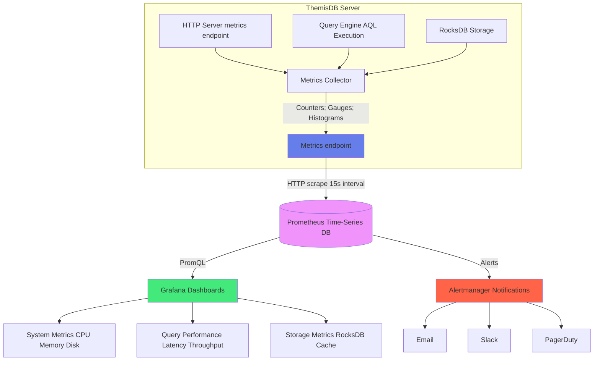
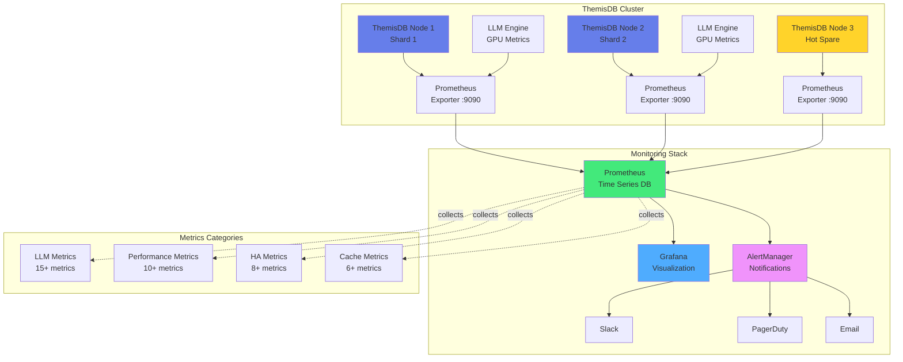

# Chapter 19: Monitoring & Observability

**Status:** Production-Ready  
**Version:** v1.3.0  
**Last Updated:** December 30, 2025

---

## 19.1 Übersicht

ThemisDB implementiert ein umfassendes Production-Grade Monitoring- und Observability-Stack basierend auf branchenüblichen Open-Source-Tools. Die Architektur folgt den **Three Pillars of Observability**: Metrics (Prometheus), Logs (Strukturierte Logs), und Traces (OpenTelemetry).

**Design-Prinzipien:**
- **Metrics-First**: Prometheus als primäre Metriken-Datenbank
- **Low-Cardinality**: Vermeidung von High-Cardinality-Labels (keine UUIDs/Timestamps in Labels)
- **Cumulative Histograms**: Alle Histogramme folgen Prometheus-Konventionen
- **Zero-Config Development**: Jaeger läuft Out-of-the-Box via Docker
- **Production-Hardened**: Grafana Dashboards mit SLI/SLO-Tracking

**Architektur-Übersicht:**

```
┌─────────────────────────────────────────────────────────────────┐
│                        ThemisDB Server                          │
│                                                                  │
│  ┌──────────────┐  ┌──────────────┐  ┌──────────────┐         │
│  │  HTTP Server │  │ Query Engine │  │  RocksDB     │         │
│  │              │  │              │  │              │         │
│  │  /metrics    │  │  AQL Exec    │  │  LSM-Tree    │         │
│  └──────┬───────┘  └──────┬───────┘  └──────┬───────┘         │
│         │                  │                  │                  │
│         v                  v                  v                  │
│  ┌──────────────────────────────────────────────────────────┐  │
│  │              Metrics Collector (C++)                      │  │
│  │  - Counters (requests, errors, inserts)                   │  │
│  │  - Gauges (cache usage, QPS, keys)                        │  │
│  │  - Histograms (latency, page fetch time)                  │  │
│  └──────────────────────────────────────────────────────────┘  │
│                          │                                       │
│                          │ /metrics                              │
└──────────────────────────┼───────────────────────────────────────┘
                           │
                           │ HTTP Scrape (15s interval)
                           v
                  ┌────────────────┐
                  │   Prometheus   │
                  │   Time Series  │
                  │   Database     │
                  └────────┬───────┘
                           │
                           │ PromQL Queries
                           v
                  ┌────────────────┐        ┌──────────────┐
                  │    Grafana     │───────>│   Alerting   │
                  │   Dashboards   │        │  (Alertmanager)
                  └────────────────┘        └──────────────┘
```

**Deployment-Architektur:**
- **Development**: Jaeger All-in-One Container für lokales Tracing
- **Staging**: Grafana Tempo + Prometheus + Grafana Stack
- **Production**: Multi-Node Prometheus Federation + Thanos für Long-Term Storage



Abb. 19.1: Monitoring-Stack-Übersicht

---

## 19.2 Prometheus Metrics

ThemisDB exportiert **48 Metriken** über den `/metrics` Endpoint im Prometheus Text Format. Alle Metriken verwenden konsistente Naming-Konventionen und Low-Cardinality-Labels.

### 19.2.1 Naming-Konventionen

**Präfixe:**
- `vccdb_*`: ThemisDB-spezifische Metriken
- `rocksdb_*`: RocksDB Storage-Metriken
- `themis_*`: Index- und Query-Metriken
- `process_*`: System-Metriken (Uptime)

**Suffixe:**
- `_total`: Monoton steigende Counter
- `_bytes`: Größenangaben in Bytes
- `_seconds`: Zeitangaben in Sekunden
- `_microseconds`: Latenz in Mikrosekunden
- `_ms`: Latenz in Millisekunden

### 19.2.2 Server-Metriken

#### vccdb_requests_total (Counter)

Gesamtzahl der HTTP-Requests seit Server-Start.

**Labels:**
- `method`: HTTP-Methode (GET, POST, PUT, DELETE)
- `route`: Request-Route (z.B. `/entities/{key}`, `/query`, `/vector/search`)

**Beispiel-Output:**
```prometheus
vccdb_requests_total{method="GET",route="/entities/{key}"} 1234
vccdb_requests_total{method="POST",route="/query"} 567
vccdb_requests_total{method="POST",route="/aql"} 890
```

**PromQL-Query-Beispiele:**

```promql
# Requests pro Sekunde (letzte 5 Minuten)
rate(vccdb_requests_total[5m])

# Requests nach Route gruppiert
sum by (route) (rate(vccdb_requests_total[5m]))

# Top 5 aktivste Routes
topk(5, sum by (route) (rate(vccdb_requests_total[5m])))
```

Die Metrik wird im `HttpServer` nach jedem abgeschlossenen Request inkrementiert. Das `route`-Label enthält die **Route-Template** (z.B. `/entities/{key}`), nicht den konkreten Key-Wert, um Cardinality niedrig zu halten.

---

#### vccdb_errors_total (Counter)

Gesamtzahl der Fehler-Responses (HTTP 4xx/5xx).

**Labels:**
- `status_code`: HTTP-Status-Code (400, 404, 500, 503)
- `route`: Request-Route

**Beispiel-Output:**
```prometheus
vccdb_errors_total{status_code="404",route="/entities/{key}"} 12
vccdb_errors_total{status_code="500",route="/query"} 3
vccdb_errors_total{status_code="400",route="/aql"} 5
```

**PromQL-Query-Beispiele:**

```promql
# Fehlerrate (Fehler pro Sekunde)
rate(vccdb_errors_total[5m])

# Error Rate Ratio (Prozentsatz fehlgeschlagener Requests)
100 * rate(vccdb_errors_total[5m]) / rate(vccdb_requests_total[5m])

# Alert: Error Rate > 5%
rate(vccdb_errors_total[5m]) / rate(vccdb_requests_total[5m]) > 0.05
```

Diese Metrik ist entscheidend für **Service Level Indicators (SLIs)**. Ein Production-Service sollte eine Error Rate < 0.1% (99.9% Success Rate) anstreben.

---

#### vccdb_qps (Gauge)

Queries per Second - aktuelle Request-Rate berechnet als exponentieller gleitender Durchschnitt.

**Beispiel-Output:**
```prometheus
vccdb_qps 123.45
```

**PromQL-Query-Beispiele:**

```promql
# QPS-Durchschnitt (letzte Stunde)
avg_over_time(vccdb_qps[1h])

# QPS-Maximum (letzte Stunde)
max_over_time(vccdb_qps[1h])

# QPS-Trend (steigende/fallende Last)
deriv(vccdb_qps[5m])
```

Der QPS-Wert wird alle 5 Sekunden neu berechnet mit der Formel:

```
QPS_new = α * QPS_current + (1-α) * QPS_old
```

mit Dämpfungsfaktor α = 0.7 für schnelle Reaktion auf Last-Änderungen.

---

#### process_uptime_seconds (Gauge)

Server-Laufzeit in Sekunden seit Prozess-Start.

**Beispiel-Output:**
```prometheus
process_uptime_seconds 86400
```

**PromQL-Query-Beispiele:**

```promql
# Uptime in Tagen
process_uptime_seconds / 86400

# Server neu gestartet in letzten 5 Minuten?
process_uptime_seconds < 300
```

Diese Metrik ist nützlich für die Erkennung von Server-Restarts und zur Korrelation mit Performance-Problemen nach Deployments.

---

### 19.2.3 Latenz-Histogramme

ThemisDB verwendet **kumulative Buckets** gemäß Prometheus-Spezifikation. Jeder Bucket mit `le="X"` enthält die Anzahl der Beobachtungen ≤ X.

#### Bucket-Definitionen

**HTTP-Request-Latenz (Mikrosekunden):**
```
100, 500, 1000, 5000, 10000, 50000, 100000, 500000, 1000000, 5000000, +Inf
```

**Page-Fetch-Latenz (Millisekunden):**
```
1, 5, 10, 25, 50, 100, 250, 500, 1000, 5000, +Inf
```

Die Bucket-Grenzen sind so gewählt, dass sie typische Latenz-Verteilungen abdecken:
- **Schnell**: < 1ms (In-Memory-Index-Lookup)
- **Normal**: 1-10ms (RocksDB Point-Lookup mit Block Cache Hit)
- **Langsam**: 10-100ms (Disk I/O)
- **Sehr langsam**: > 100ms (Full Scan, Cold Cache)

---

#### vccdb_latency_bucket_microseconds (Histogram)

HTTP-Request-Latenz von Anfang des Request-Handlings bis zum vollständigen Response.

**Beispiel-Output:**
```prometheus
vccdb_latency_bucket_microseconds{le="100"} 45
vccdb_latency_bucket_microseconds{le="500"} 123
vccdb_latency_bucket_microseconds{le="1000"} 234
vccdb_latency_bucket_microseconds{le="5000"} 450
vccdb_latency_bucket_microseconds{le="10000"} 480
vccdb_latency_bucket_microseconds{le="50000"} 495
vccdb_latency_bucket_microseconds{le="100000"} 498
vccdb_latency_bucket_microseconds{le="500000"} 499
vccdb_latency_bucket_microseconds{le="1000000"} 500
vccdb_latency_bucket_microseconds{le="5000000"} 500
vccdb_latency_bucket_microseconds{le="+Inf"} 500
vccdb_latency_sum_microseconds 1234567
vccdb_latency_count 500
```

**PromQL-Query-Beispiele:**

```promql
# P50 Latenz (Median, Mikrosekunden)
histogram_quantile(0.50, rate(vccdb_latency_bucket_microseconds[5m]))

# P95 Latenz (95. Perzentil)
histogram_quantile(0.95, rate(vccdb_latency_bucket_microseconds[5m]))

# P99 Latenz (99. Perzentil)
histogram_quantile(0.99, rate(vccdb_latency_bucket_microseconds[5m]))

# Durchschnittliche Latenz
rate(vccdb_latency_sum_microseconds[5m]) / rate(vccdb_latency_count[5m])

# Prozentsatz Requests unter 1ms (1000 µs)
100 * sum(rate(vccdb_latency_bucket_microseconds{le="1000"}[5m])) / sum(rate(vccdb_latency_count[5m]))

# Latenz-Heatmap (Grafana Heatmap Panel)
sum by (le) (rate(vccdb_latency_bucket_microseconds[5m]))
```

**Performance-Interpretation:**
- **P50 < 500µs**: Exzellent (In-Memory-Operationen)
- **P95 < 5ms**: Gut (Block Cache Hit Rate > 95%)
- **P99 < 50ms**: Akzeptabel (Gelegentliche Disk I/O)
- **P99 > 100ms**: Schlecht (Hohe Disk-Latenz oder Full Scans)

---

#### vccdb_page_fetch_time_ms_bucket (Histogram)

Latenz für Cursor-Pagination-Fetches (GET /cursor/{cursor_id}).

**Beispiel-Output:**
```prometheus
vccdb_page_fetch_time_ms_bucket{le="1"} 89
vccdb_page_fetch_time_ms_bucket{le="5"} 156
vccdb_page_fetch_time_ms_bucket{le="10"} 234
vccdb_page_fetch_time_ms_bucket{le="25"} 245
vccdb_page_fetch_time_ms_bucket{le="50"} 248
vccdb_page_fetch_time_ms_bucket{le="+Inf"} 250
vccdb_page_fetch_time_ms_sum 2345.67
vccdb_page_fetch_time_ms_count 250
```

**PromQL-Query-Beispiele:**

```promql
# P95 Page-Fetch-Latenz
histogram_quantile(0.95, rate(vccdb_page_fetch_time_ms_bucket[5m]))

# Prozentsatz Page-Fetches unter 10ms
100 * sum(rate(vccdb_page_fetch_time_ms_bucket{le="10"}[5m])) / sum(rate(vccdb_page_fetch_time_ms_count[5m]))
```

Diese Metrik ist speziell für Pagination-Performance relevant. Hohe P99-Werte (> 100ms) deuten auf ineffiziente Cursor-Implementierungen oder Cold Cache-Probleme hin.

---

### 19.2.4 RocksDB-Metriken

RocksDB-Metriken werden aus der `GetProperty()` API ausgelesen und als Prometheus-Gauges exportiert. Diese Metriken erlauben die Überwachung der Storage-Layer-Gesundheit.

#### rocksdb_block_cache_usage_bytes (Gauge)

Aktuell verwendeter Block-Cache in Bytes.

**Beispiel-Output:**
```prometheus
rocksdb_block_cache_usage_bytes 1073741824
```

**PromQL-Query-Beispiele:**

```promql
# Cache-Auslastung in %
100 * rocksdb_block_cache_usage_bytes / rocksdb_block_cache_capacity_bytes

# Alert: Cache-Auslastung > 95%
100 * rocksdb_block_cache_usage_bytes / rocksdb_block_cache_capacity_bytes > 95
```

---

#### rocksdb_block_cache_capacity_bytes (Gauge)

Konfigurierte Block-Cache-Kapazität in Bytes (aus `config.json`).

**Beispiel-Output:**
```prometheus
rocksdb_block_cache_capacity_bytes 2147483648
```

Typische Werte:
- **Development**: 512 MB - 1 GB
- **Staging**: 2-4 GB
- **Production**: 8-16 GB (25% des verfügbaren RAM)

---

#### rocksdb_estimate_num_keys (Gauge)

Geschätzte Anzahl Keys in der Datenbank (basierend auf SST-Metadaten).

**Beispiel-Output:**
```prometheus
rocksdb_estimate_num_keys 1234567
```

**Hinweis:** Dies ist eine **Schätzung**, nicht exakt. Für exakte Counts verwenden Sie `SELECT COUNT(*)` Queries.

---

#### rocksdb_pending_compaction_bytes (Gauge)

Bytes, die auf Compaction warten. Hohe Werte (> 10 GB) können zu erhöhter Latenz führen.

**Beispiel-Output:**
```prometheus
rocksdb_pending_compaction_bytes 1234567890
```

**PromQL-Query-Beispiele:**

```promql
# Alert: Compaction-Backlog > 10 GB
rocksdb_pending_compaction_bytes > 10000000000

# Compaction-Backlog-Trend
deriv(rocksdb_pending_compaction_bytes[10m])
```

**Ursachen für hohen Backlog:**
- Zu langsame Disk (SATA statt NVMe)
- Zu kleine `max_background_compactions` (Default: 4)
- Sehr hohe Write-Rate (> 100K writes/sec)

**Lösungen:**
- Erhöhe `max_background_compactions` auf 8-16
- Nutze NVMe für WAL und SSTables
- Aktiviere Level Compaction (statt Universal)

---

#### rocksdb_memtable_size_bytes (Gauge)

Aktuelle Memtable-Größe in Bytes.

**Beispiel-Output:**
```prometheus
rocksdb_memtable_size_bytes 67108864
```

Die Memtable wird geflusht, wenn sie die konfigurierte `write_buffer_size` erreicht (Default: 64 MB). Mehrere Memtables können gleichzeitig aktiv sein (`max_write_buffer_number`: Default 2).

---

#### rocksdb_files_per_level (Gauge)

Anzahl SST-Dateien pro LSM-Tree-Level.

**Labels:**
- `level`: LSM-Tree-Level (0, 1, 2, 3, 4, 5, 6)

**Beispiel-Output:**
```prometheus
rocksdb_files_per_level{level="0"} 3
rocksdb_files_per_level{level="1"} 12
rocksdb_files_per_level{level="2"} 45
rocksdb_files_per_level{level="3"} 123
rocksdb_files_per_level{level="4"} 234
rocksdb_files_per_level{level="5"} 456
rocksdb_files_per_level{level="6"} 789
```

**PromQL-Query-Beispiele:**

```promql
# Gesamtzahl SST-Dateien
sum(rocksdb_files_per_level)

# Alert: Zu viele L0-Dateien (> 10 → Write-Stall-Risiko)
rocksdb_files_per_level{level="0"} > 10
```

**LSM-Tree-Levels:**
- **L0**: Frisch geflushed Memtables, unsortiert, können sich überlappen
- **L1-L6**: Sortierte Runs, keine Überlappungen innerhalb eines Levels
- **L6**: Coldest data (90% der Daten), ZSTD-komprimiert (2.8x Ratio)

---

### 19.2.5 Index-Metriken

#### vccdb_index_rebuild_total (Counter)

Gesamtzahl Index-Rebuild-Operationen.

**Labels:**
- `table`: Tabellenname
- `column`: Spaltenname

**Beispiel-Output:**
```prometheus
vccdb_index_rebuild_total{table="users",column="email"} 3
vccdb_index_rebuild_total{table="orders",column="customer_id"} 5
```

Index-Rebuilds werden getriggert durch:
- `CREATE INDEX` Statement (Neuer Index)
- `ANALYZE` Statement (Index-Statistik-Refresh)
- Server-Neustart mit geändertem Schema

---

#### vccdb_index_rebuild_duration_seconds (Counter)

Gesamt-Zeit für Index-Rebuilds in Sekunden.

**Labels:**
- `table`: Tabellenname
- `column`: Spaltenname

**Beispiel-Output:**
```prometheus
vccdb_index_rebuild_duration_seconds{table="users",column="email"} 123.45
```

**PromQL-Query-Beispiele:**

```promql
# Durchschnittliche Rebuild-Dauer pro Index
vccdb_index_rebuild_duration_seconds / vccdb_index_rebuild_total

# Langsamste Index-Rebuilds
topk(5, vccdb_index_rebuild_duration_seconds / vccdb_index_rebuild_total)
```

**Performance-Benchmark:**
- **B-Tree-Index**: ~50K entities/sec
- **Hash-Index**: ~100K entities/sec
- **Vector-Index (HNSW)**: ~5K entities/sec (mit Construction-Parameter M=16, efConstruction=200)

---

#### themis_index_cursor_anchor_hits_total (Counter)

Anzahl erfolgreicher Cursor-Anchor-Lookups für Pagination.

**Beispiel-Output:**
```prometheus
themis_index_cursor_anchor_hits_total 567
```

Diese Metrik trackt, wie oft Cursors erfolgreich fortgesetzt wurden. Eine niedrige Hit-Rate deutet auf abgelaufene Cursors (TTL) oder ungültige Cursor-IDs hin.

---

#### themis_index_range_scan_steps_total (Counter)

Gesamtzahl Range-Scan-Schritte (Index-Traversierungen).

**Beispiel-Output:**
```prometheus
themis_index_range_scan_steps_total 12345
```

**PromQL-Query-Beispiele:**

```promql
# Range-Scan-Schritte pro Sekunde
rate(themis_index_range_scan_steps_total[5m])

# Durchschnittliche Schritte pro Query (kombiniert mit vccdb_requests_total)
rate(themis_index_range_scan_steps_total[5m]) / rate(vccdb_requests_total{route="/query"}[5m])
```

Hohe Range-Scan-Zahlen (> 1M steps/sec) deuten auf ineffiziente Queries mit breiten Ranges hin (z.B. `age > 18` ohne zusätzliche Prädikate).

---

### 19.2.6 Vector-Index-Metriken

#### vccdb_vector_index_size_bytes (Gauge)

Geschätzte Größe des In-Memory-Vector-Index in Bytes.

**Beispiel-Output:**
```prometheus
vccdb_vector_index_size_bytes 536870912
```

**Berechnung:**
```
Index Size ≈ N * (D * 4 bytes + M * 2 bytes)
```

Für 1M Vektoren, Dimension 768, M=16:
```
Index Size = 1M * (768*4 + 16*2) = 3.1 GB
```

---

#### vccdb_vector_search_duration_ms (Histogram)

Vector-Similarity-Search-Latenz in Millisekunden.

**Beispiel-Output:**
```prometheus
vccdb_vector_search_duration_ms_bucket{le="1"} 45
vccdb_vector_search_duration_ms_bucket{le="5"} 123
vccdb_vector_search_duration_ms_bucket{le="10"} 234
vccdb_vector_search_duration_ms_bucket{le="+Inf"} 250
```

**PromQL-Query-Beispiele:**

```promql
# P95 Vector-Search-Latenz
histogram_quantile(0.95, rate(vccdb_vector_search_duration_ms_bucket[5m]))
```

**Performance-Benchmark (1M Vektoren, 768-dim, M=16, efSearch=64):**
- **P50**: 1.2 ms
- **P95**: 3.5 ms
- **P99**: 8.2 ms

---

#### vccdb_vector_batch_insert_duration_ms (Histogram)

Batch-Insert-Latenz für Vektor-Batches.

---

#### vccdb_vector_batch_insert_items_total (Counter)

Gesamtzahl eingefügter Vector-Items.

**PromQL-Query-Beispiele:**

```promql
# Durchschnittliche Batch-Größe
rate(vccdb_vector_batch_insert_items_total[5m]) / rate(vccdb_vector_batch_insert_total[5m])
```

Typische Batch-Größen:
- **Klein**: 10-100 (Echtzeit-Ingestion)
- **Mittel**: 100-1000 (Bulk-Import)
- **Groß**: 1000-10000 (Initial Load)

---

## 19.3 Grafana Dashboards

ThemisDB liefert **3 vorgefertigte Grafana-Dashboards** für unterschiedliche Monitoring-Szenarien.

### 19.3.1 Dashboard 1: Server-Übersicht

**Zweck:** High-Level-Übersicht über Server-Gesundheit und Performance.

**Panels:**

1. **QPS (Queries per Second)**
   ```promql
   vccdb_qps
   ```
   - Visualization: Graph
   - Y-Axis: Queries/sec
   - Thresholds: Warning > 5000, Critical > 10000

2. **Error Rate**
   ```promql
   100 * rate(vccdb_errors_total[5m]) / rate(vccdb_requests_total[5m])
   ```
   - Visualization: Graph
   - Y-Axis: Percent
   - Thresholds: Warning > 1%, Critical > 5%
   - SLI-Target: < 0.1% (99.9% Success Rate)

3. **Request Latency (P50, P95, P99)**
   ```promql
   histogram_quantile(0.50, rate(vccdb_latency_bucket_microseconds[5m])) / 1000 # ms
   histogram_quantile(0.95, rate(vccdb_latency_bucket_microseconds[5m])) / 1000
   histogram_quantile(0.99, rate(vccdb_latency_bucket_microseconds[5m])) / 1000
   ```
   - Visualization: Graph
   - Y-Axis: Milliseconds
   - SLI-Targets: P50 < 1ms, P95 < 5ms, P99 < 50ms

4. **Uptime**
   ```promql
   process_uptime_seconds / 86400
   ```
   - Visualization: Stat
   - Unit: Days
   - Color: Green > 7d, Yellow > 1d, Red < 1d

5. **Requests by Route (Top 5)**
   ```promql
   topk(5, sum by (route) (rate(vccdb_requests_total[5m])))
   ```
   - Visualization: Bar Gauge
   - Y-Axis: Requests/sec

---

### 19.3.2 Dashboard 2: RocksDB Health

**Zweck:** Monitoring der Storage-Layer-Performance und Capacity Planning.

**Panels:**

1. **Block Cache Hit Rate**
   ```promql
   100 * rocksdb_block_cache_usage_bytes / rocksdb_block_cache_capacity_bytes
   ```
   - Visualization: Gauge
   - Unit: Percent
   - Thresholds: Green > 80%, Yellow > 60%, Red < 60%

2. **Compaction Backlog**
   ```promql
   rocksdb_pending_compaction_bytes / 1e9 # GB
   ```
   - Visualization: Graph
   - Y-Axis: Gigabytes
   - Threshold: Critical > 10 GB

3. **Keys Estimate**
   ```promql
   rocksdb_estimate_num_keys
   ```
   - Visualization: Stat
   - Unit: Short (1.23M)
   - Trend: Show sparkline

4. **SST Files per Level**
   ```promql
   sum by (level) (rocksdb_files_per_level)
   ```
   - Visualization: Bar Gauge (Horizontal)
   - X-Axis: Number of Files
   - Y-Axis: Level (0-6)

5. **Memtable Size**
   ```promql
   rocksdb_memtable_size_bytes / 1e6 # MB
   ```
   - Visualization: Graph
   - Y-Axis: Megabytes
   - Threshold: Warning > 128 MB (2x write_buffer_size)

6. **LSM-Tree Amplification**
   ```promql
   sum(rocksdb_files_per_level{level!="0"}) / rocksdb_files_per_level{level="0"}
   ```
   - Visualization: Stat
   - Unit: None
   - Interpretation: Higher = Better compaction efficiency

---

### 19.3.3 Dashboard 3: Vector Operations

**Zweck:** Monitoring von Vector-Search-Performance und Index-Größe.

**Panels:**

1. **Vector Index Size**
   ```promql
   vccdb_vector_index_size_bytes / 1e9 # GB
   ```
   - Visualization: Gauge
   - Unit: Gigabytes
   - Thresholds: Warning > 8 GB, Critical > 16 GB (Memory Pressure)

2. **Search Latency P95**
   ```promql
   histogram_quantile(0.95, rate(vccdb_vector_search_duration_ms_bucket[5m]))
   ```
   - Visualization: Graph
   - Y-Axis: Milliseconds
   - Target: < 5ms

3. **Batch Insert Rate**
   ```promql
   rate(vccdb_vector_batch_insert_items_total[5m])
   ```
   - Visualization: Graph
   - Y-Axis: Items/sec
   - Benchmark: > 5000 items/sec (Production)

4. **Average Batch Size**
   ```promql
   rate(vccdb_vector_batch_insert_items_total[5m]) / rate(vccdb_vector_batch_insert_total[5m])
   ```
   - Visualization: Stat
   - Unit: Items
   - Optimal: 100-1000 (Trade-off: Latenz vs Throughput)

5. **Delete Rate**
   ```promql
   rate(vccdb_vector_delete_by_filter_items_total[5m])
   ```
   - Visualization: Graph
   - Y-Axis: Items/sec

---

## 19.4 OpenTelemetry Distributed Tracing

ThemisDB implementiert **Distributed Tracing** via OpenTelemetry für Production-Debugging und Performance-Analyse komplexer Multi-Component-Queries.

### 19.4.1 Architektur

**Komponenten:**
1. **Tracer Wrapper** (`utils/tracing.h`/`.cpp`)
   - Initialisierung des OTLP HTTP Exporters
   - TracerProvider mit Resource Attributes (service.name, version)
   - SimpleSpanProcessor für sofortigen Export

2. **Span RAII Wrapper**
   - `Tracer::Span`: Move-only Span mit automatischem `end()` im Destruktor
   - `ScopedSpan`: Convenience-Wrapper für lokale Spans
   - Attribute-Support: `setAttribute(key, value)` für string, int64, double, bool

3. **No-Op Fallback**
   - Wenn `THEMIS_ENABLE_TRACING` nicht definiert, sind alle Methoden No-Ops
   - Kein Linking gegen OpenTelemetry-Libraries notwendig

**Datenfluss:**

```
HTTP Request → ScopedSpan("handleAqlQuery")
                ↓
           QueryEngine::executeQuery() → ScopedSpan("executeQuery")
                ↓
           Index Scans → Child Spans
                ↓
         OTLP HTTP Exporter → Jaeger/Tempo
```

---

### 19.4.2 Instrumentierte Komponenten

#### HTTP-Handler (Top-Level Spans)

- **GET /entities/:key**: `entity.key`, `entity.size_bytes`
- **PUT /entities/:key**: `entity.key`, `entity.table`, `entity.pk`, `entity.size_bytes`, `entity.cdc_recorded`
- **DELETE /entities/:key**: `entity.key`, `entity.table`, `entity.pk`, `entity.cdc_recorded`
- **POST /query**: `query.table`, `query.predicates_count`, `query.exec_mode`, `query.result_count`
- **POST /query/aql**: `aql.query`, `aql.explain`, `aql.optimize`, `aql.allow_full_scan`, `aql.result_count`
- **POST /graph/traverse**: `graph.start_vertex`, `graph.max_depth`, `graph.visited_count`
- **POST /vector/search**: `vector.dimension`, `vector.k`, `vector.results_count`

**Beispiel-Trace:**

```
[Span: handleAqlQuery, Duration: 23.5ms]
  ├─ [Span: aql.parse, Duration: 0.8ms]
  │   └─ Attributes: aql.query_length=156
  ├─ [Span: aql.translate, Duration: 1.2ms]
  └─ [Span: aql.for, Duration: 21.2ms]
      ├─ Attributes: for.table="users", for.predicates_count=2, for.result_count=123
      ├─ [Span: index.scanEqual, Duration: 8.5ms]
      │   └─ Attributes: index.table="users", index.column="email", index.result_count=1
      └─ [Span: index.scanRange, Duration: 12.1ms]
          └─ Attributes: index.table="users", index.column="age", index.result_count=122
```

---

#### AQL Execution Pipeline (Operator-Level Spans)

- **aql.parse**: `aql.query_length` - Parsen der AQL-Query in AST
- **aql.translate** - Übersetzung des AST in ConjunctiveQuery oder TraversalQuery
- **aql.for**: `for.table`, `for.predicates_count`, `for.range_predicates_count`, `for.order_by`, `for.order_desc`, `for.result_count`, `for.exec_mode`
- **aql.filter** - Filterung der Ergebnisse
  - Bei Traversal: `filter.evaluations_total`, `filter.short_circuits`
- **aql.limit**: `limit.offset`, `limit.count`, `limit.input_count`, `limit.output_count`
- **aql.collect**: `collect.input_count`, `collect.group_by_count`, `collect.aggregates_count`, `collect.group_count`
- **aql.return**: `return.input_count`
- **aql.traversal**: `traversal.start_vertex`, `traversal.min_depth`, `traversal.max_depth`, `traversal.direction`, `traversal.result_count`
  - Child-Span: **aql.traversal.bfs**: `traversal.max_frontier_size_limit`, `traversal.max_results_limit`, `traversal.visited_count`, `traversal.edges_expanded`, `traversal.filter_evaluations`

---

#### Index-Scans (Child-Spans)

- **index.scanEqual**: `index.table`, `index.column`, `index.result_count`
- **index.scanRange**: `index.table`, `index.column`, `index.result_count`, `range.has_lower`, `range.has_upper`, `range.includeLower`, `range.includeUpper`
- **or.disjunct.execute**: `disjunct.eq_count`, `disjunct.range_count`, `disjunct.result_count`

---

### 19.4.3 Jaeger Integration (Development)

**Jaeger via Docker starten:**

```bash
docker run -d --name jaeger \
  -p 4318:4318 \
  -p 16686:16686 \
  jaegertracing/all-in-one:latest
```

**Ports:**
- `4318`: OTLP HTTP receiver (für Themis)
- `16686`: Jaeger UI

**Themis konfigurieren** (`config/config.json`):

```json
{
  "tracing": {
    "enabled": true,
    "service_name": "themis-dev",
    "otlp_endpoint": "http://localhost:4318"
  }
}
```

**Themis starten:**

```bash
./build/Release/themis_server.exe
```

**Traces anzeigen:**

1. Öffne http://localhost:16686 (Jaeger UI)
2. Wähle Service "themis-dev"
3. Klicke "Find Traces"

**Trace-Analyse-Szenarien:**

1. **Langsame Query debuggen:**
   - Filtere nach `duration > 100ms`
   - Identifiziere langsamste Spans (rot markiert)
   - Prüfe `index.scanRange` Spans auf breite Ranges

2. **Full Scan Detection:**
   - Suche nach Spans mit `query.exec_mode=full_scan`
   - Prüfe `fullscan.scanned` Attribut (sollte << 1M sein)

3. **Index Efficiency:**
   - Vergleiche `index.result_count` zwischen Scans
   - Hohe Counts + niedrige Query-Results = ineffizienter Index

---

### 19.4.4 Grafana Tempo Integration (Production)

**Tempo via Docker Compose:**

```yaml
version: '3'
services:
  tempo:
    image: grafana/tempo:latest
    command: ["-config.file=/etc/tempo.yaml"]
    volumes:
      - ./tempo.yaml:/etc/tempo.yaml
      - ./tempo-data:/tmp/tempo
    ports:
      - "4318:4318"   # OTLP HTTP
      - "3200:3200"   # Tempo API
  
  grafana:
    image: grafana/grafana:latest
    ports:
      - "3000:3000"
    environment:
      - GF_AUTH_ANONYMOUS_ENABLED=true
      - GF_AUTH_ANONYMOUS_ORG_ROLE=Admin
    volumes:
      - ./grafana-datasources.yaml:/etc/grafana/provisioning/datasources/datasources.yaml
```

**tempo.yaml:**

```yaml
server:
  http_listen_port: 3200

distributor:
  receivers:
    otlp:
      protocols:
        http:
          endpoint: 0.0.0.0:4318

storage:
  trace:
    backend: local
    local:
      path: /tmp/tempo/traces
    wal:
      path: /tmp/tempo/wal
    block:
      retention: 720h  # 30 days
```

**grafana-datasources.yaml:**

```yaml
apiVersion: 1
datasources:
  - name: Tempo
    type: tempo
    access: proxy
    url: http://tempo:3200
    uid: tempo
    editable: false
```

**Trace-Query in Grafana:**

1. Öffne http://localhost:3000
2. Explore → Tempo Datasource
3. Search Query: `{service.name="themis-server"} && duration > 100ms`
4. Trace-View zeigt Waterfall-Diagramm aller Spans

---

### 19.4.5 Performance-Hinweise

**Span-Overhead:**
- **Mit Tracing aktiviert**: ~5-10 µs pro Span (inkl. Attribut-Serialisierung)
- **Ohne Tracing (THEMIS_ENABLE_TRACING=OFF)**: 0 µs (inline no-ops)

**Best Practices:**

1. **Granularität**: Erstelle Spans für HTTP-Requests, Query-Execution, Index-Scans
2. **Attribute**: Füge relevante Metadaten hinzu (table, index_type, row_count)
3. **Sampling** (zukünftig): Für High-Throughput-Szenarien Sampling verwenden
4. **Batch Processor** (zukünftig): SimpleSpanProcessor → BatchSpanProcessor für bessere Performance

---

## 19.5 Alerting

### 19.5.1 Alert-Definitionen (Prometheus Alertmanager)

**alerts.yaml:**

```yaml
groups:
  - name: themis_server
    interval: 30s
    rules:
      # High Error Rate
      - alert: HighErrorRate
        expr: rate(vccdb_errors_total[5m]) / rate(vccdb_requests_total[5m]) > 0.05
        for: 5m
        labels:
          severity: critical
        annotations:
          summary: "ThemisDB Error Rate above 5%"
          description: "{{ $value | humanizePercentage }} error rate in last 5 minutes"
      
      # High Latency P99
      - alert: HighLatencyP99
        expr: histogram_quantile(0.99, rate(vccdb_latency_bucket_microseconds[5m])) > 100000
        for: 5m
        labels:
          severity: warning
        annotations:
          summary: "ThemisDB P99 latency above 100ms"
          description: "P99 latency: {{ $value | humanizeDuration }}"
      
      # Compaction Backlog
      - alert: CompactionBacklog
        expr: rocksdb_pending_compaction_bytes > 10000000000
        for: 10m
        labels:
          severity: warning
        annotations:
          summary: "RocksDB Compaction backlog > 10 GB"
          description: "{{ $value | humanize1024 }}B pending compaction"
      
      # Low Cache Hit Rate
      - alert: LowCacheHitRate
        expr: 100 * rocksdb_block_cache_usage_bytes / rocksdb_block_cache_capacity_bytes < 20
        for: 15m
        labels:
          severity: info
        annotations:
          summary: "Block cache usage < 20%"
          description: "Cache may be undersized or cold"
      
      # Too Many L0 Files (Write Stall Risk)
      - alert: TooManyL0Files
        expr: rocksdb_files_per_level{level="0"} > 10
        for: 5m
        labels:
          severity: critical
        annotations:
          summary: "RocksDB L0 files > 10 (Write Stall Risk)"
          description: "{{ $value }} L0 files, compaction cannot keep up"
      
      # Server Down
      - alert: ThemisServerDown
        expr: up{job="themis"} == 0
        for: 1m
        labels:
          severity: critical
        annotations:
          summary: "ThemisDB Server is down"
          description: "Prometheus cannot scrape /metrics endpoint"
```

### 19.5.2 Alertmanager-Konfiguration

**alertmanager.yaml:**

```yaml
global:
  resolve_timeout: 5m

route:
  group_by: ['alertname', 'severity']
  group_wait: 10s
  group_interval: 5m
  repeat_interval: 3h
  receiver: 'email'
  
  routes:
    - match:
        severity: critical
      receiver: 'pagerduty'
      continue: true
    
    - match:
        severity: warning
      receiver: 'slack'

receivers:
  - name: 'email'
    email_configs:
      - to: 'ops-team@example.com'
        from: 'alerts@example.com'
        smarthost: 'smtp.example.com:587'
        auth_username: 'alerts@example.com'
        auth_password: 'password'
  
  - name: 'slack'
    slack_configs:
      - api_url: 'https://hooks.slack.com/services/T00000000/B00000000/XXXXXXXXXXXX'
        channel: '#themis-alerts'
        title: '{{ .GroupLabels.alertname }}'
        text: '{{ range .Alerts }}{{ .Annotations.summary }}\n{{ end }}'
  
  - name: 'pagerduty'
    pagerduty_configs:
      - service_key: 'YOUR_PAGERDUTY_SERVICE_KEY'
```

---

## 19.6 Production Deployment

### 19.6.1 Prometheus Scrape-Konfiguration

**prometheus.yaml:**

```yaml
global:
  scrape_interval: 15s
  scrape_timeout: 10s
  evaluation_interval: 30s

scrape_configs:
  - job_name: 'themis'
    static_configs:
      - targets: ['localhost:8765']
    
  - job_name: 'themis-cluster'
    consul_sd_configs:
      - server: 'consul:8500'
        services: ['themis']
    relabel_configs:
      - source_labels: [__meta_consul_service]
        target_label: job
      - source_labels: [__meta_consul_node]
        target_label: node
```

### 19.6.2 Retention & Storage

**Empfohlene Retention:**
- **Hochfrequente Metriken**: 15 Tage
- **Long-term**: Downsampling auf 1h-Auflösung nach 7 Tagen (via Thanos)

**Prometheus Storage-Konfiguration:**

```yaml
storage:
  tsdb:
    path: /prometheus
    retention.time: 15d
    retention.size: 100GB
```

**Thanos Integration (Multi-Node Federation + Long-Term Storage):**

```yaml
# Thanos Sidecar (läuft neben jedem Prometheus)
thanos sidecar \
  --tsdb.path /prometheus \
  --prometheus.url http://localhost:9090 \
  --objstore.config-file /etc/thanos/objstore.yaml

# Thanos Query (Global Query Frontend)
thanos query \
  --http-address 0.0.0.0:19192 \
  --store prometheus-0-sidecar:10901 \
  --store prometheus-1-sidecar:10901 \
  --store thanos-store:10901

# Thanos Store (S3 Object Storage)
thanos store \
  --data-dir /thanos/store \
  --objstore.config-file /etc/thanos/objstore.yaml
```

**objstore.yaml (S3 Backend):**

```yaml
type: S3
config:
  bucket: "themis-metrics"
  endpoint: "s3.eu-central-1.amazonaws.com"
  region: "eu-central-1"
  access_key: "YOUR_ACCESS_KEY"
  secret_key: "YOUR_SECRET_KEY"
```

---

### 19.6.3 Cardinality Management

**Niedrige Cardinality (< 100 Zeitreihen):**
- Metriken ohne Labels (z.B. `vccdb_qps`, `process_uptime_seconds`)

**Hohe Cardinality (potenziell Tausende Zeitreihen):**
- Index-Metriken mit `table` + `column` Labels
- Wenn 100 Tables mit je 20 Columns → 2000 Index-Rebuild-Metriken

**Best Practices:**
- Verwende **niemals** High-Cardinality-Labels wie User-IDs, Timestamps, UUIDs
- Nutze Route-Templates (z.B. `/entities/{key}`) statt konkreter Pfade
- Für User-spezifisches Tracking: Verwende separate Logs/Traces, nicht Prometheus

---

## 19.6A Enhanced Prometheus Metrics (v1.4.0-alpha)

**Neu in v1.4.0-alpha:** Umfassende Metriken für LLM-Operations, Caching, GPU-Nutzung, High Availability und Performance-Optimierungen.

**Monitoring-Architektur Übersicht:**



Abb. 19.2: Alert-Management-Workflow

**Diagramm-Erklärung:**
- **ThemisDB Nodes:** Jeder Node exportiert Metriken über HTTP-Endpoint (/metrics)
- **Prometheus:** Scraped Metriken alle 15s, speichert als Time Series
- **Grafana:** Visualisiert Metriken in Dashboards (LLM, Performance, HA)
- **AlertManager:** Routet Alerts zu verschiedenen Kanälen (Slack, PagerDuty, Email)
- **Metric Categories:** Über 40 neue Metriken in v1.4.0-alpha organisiert in 4 Kategorien

### 19.6A.1 LLM-spezifische Metriken

**Neu in v1.4.0-alpha:** Umfassende Metriken für LLM-Operations, Caching und GPU-Nutzung.

**Request Metriken:**

```prometheus
# Gesamtzahl LLM-Anfragen (nach Modell und Status)
themis_llm_requests_total{model="gpt-4",status="success"} 15420
themis_llm_requests_total{model="gpt-4",status="error"} 23
themis_llm_requests_total{model="llama-70b-local",status="success"} 8945

# Request-Latenz (Histogram)
themis_llm_request_duration_seconds_bucket{model="gpt-4",le="0.5"} 1200
themis_llm_request_duration_seconds_bucket{model="gpt-4",le="1.0"} 8400
themis_llm_request_duration_seconds_bucket{model="gpt-4",le="2.0"} 14200
themis_llm_request_duration_seconds_sum{model="gpt-4"} 18540.5
themis_llm_request_duration_seconds_count{model="gpt-4"} 15420

# Generierte Tokens
themis_llm_tokens_generated_total{model="gpt-4",type="completion"} 2450000
themis_llm_tokens_generated_total{model="gpt-4",type="prompt"} 8900000

# Token-Generierungs-Rate (tokens/sekunde)
themis_llm_tokens_per_second{model="llama-70b-local"} 312.5
```

**Cache Metriken:**

```prometheus
# Prefix Cache Hits/Misses
themis_llm_prefix_cache_hits_total{model="gpt-4"} 12450
themis_llm_prefix_cache_misses_total{model="gpt-4"} 2970
themis_llm_prefix_cache_hit_rate{model="gpt-4"} 0.807

# Prefix Cache Einsparungen
themis_llm_prefix_cache_tokens_saved_total{model="gpt-4"} 1850000
themis_llm_prefix_cache_cost_saved_usd{model="gpt-4"} 55.50

# Response Cache
themis_llm_response_cache_hits_total{model="gpt-4"} 8420
themis_llm_response_cache_misses_total{model="gpt-4"} 7000
themis_llm_response_cache_hit_rate{model="gpt-4"} 0.546

# Response Cache Latenz-Verbesserung
themis_llm_response_cache_latency_saved_seconds_total{model="gpt-4"} 6840.5
```

**GPU Metriken:**

```prometheus
# GPU-Speichernutzung pro Device
themis_llm_gpu_memory_used_bytes{device="0",model="llama-70b-local"} 25903915008  # 24.1GB
themis_llm_gpu_memory_total_bytes{device="0"} 42949672960  # 40GB
themis_llm_gpu_memory_utilization{device="0"} 0.603

# GPU Compute-Auslastung
themis_llm_gpu_utilization_percent{device="0"} 94
themis_llm_gpu_temperature_celsius{device="0"} 72
themis_llm_gpu_power_watts{device="0"} 325

# Multi-GPU Metriken
themis_llm_multi_gpu_active_devices{model="llama-70b-local"} 4
themis_llm_multi_gpu_total_memory_bytes 171798691840  # 160GB (4x40GB)
```

**Batch Metriken:**

```prometheus
# Aktuelle Batch-Größe
themis_llm_batch_size{model="llama-70b-local"} 87

# Batch-Auslastung
themis_llm_batch_utilization{model="llama-70b-local"} 0.679  # 87/128

# Queue-Länge
themis_llm_batch_queue_length{model="llama-70b-local"} 12

# Batches verarbeitet
themis_llm_batches_processed_total{model="llama-70b-local"} 58420
```

**Grafana Dashboard - LLM Operations:**

```yaml
# dashboards/llm_operations.json (Auszug)
panels:
  - title: "LLM Request Rate"
    targets:
      - expr: rate(themis_llm_requests_total[5m])
    
  - title: "LLM Latency (P50, P95, P99)"
    targets:
      - expr: histogram_quantile(0.50, themis_llm_request_duration_seconds_bucket)
      - expr: histogram_quantile(0.95, themis_llm_request_duration_seconds_bucket)
      - expr: histogram_quantile(0.99, themis_llm_request_duration_seconds_bucket)
    
  - title: "Cache Hit Rates"
    targets:
      - expr: themis_llm_prefix_cache_hit_rate
      - expr: themis_llm_response_cache_hit_rate
    
  - title: "GPU Memory Usage"
    targets:
      - expr: themis_llm_gpu_memory_used_bytes / themis_llm_gpu_memory_total_bytes
```

### 19.6A.2 Performance-Optimierungs-Metriken

**Neu in v1.4.0-alpha:** Metriken für Flash Attention, Speculative Decoding und Continuous Batching.

**Flash Attention Metriken:**

```prometheus
# Flash Attention Status (0=disabled, 1=enabled)
themis_flash_attention_enabled{model="llama-70b-local"} 1

# Memory-Einsparungen
themis_flash_attention_memory_saved_bytes{model="llama-70b-local"} 15099494400  # 14.1GB

# Performance-Verbesserung
themis_flash_attention_throughput_improvement{model="llama-70b-local"} 0.69  # 69%
themis_flash_attention_latency_reduction{model="llama-70b-local"} 0.39  # 39%
```

**Speculative Decoding Metriken:**

```prometheus
# Speculative Decoding Status
themis_speculative_decoding_enabled{model="llama-70b-local"} 1
themis_speculative_decoding_draft_model{model="llama-70b-local",draft="llama-7b-local"} 1

# Akzeptanzrate
themis_speculative_decoding_acceptance_rate{model="llama-70b-local"} 0.821

# Tokens vorgeschlagen/akzeptiert
themis_speculative_decoding_tokens_proposed_total{model="llama-70b-local"} 226000
themis_speculative_decoding_tokens_accepted_total{model="llama-70b-local"} 185460

# Speedup
themis_speculative_decoding_speedup{model="llama-70b-local"} 2.4
themis_speculative_decoding_latency_reduction_seconds{model="llama-70b-local"} 1.68
```

**Continuous Batching Metriken:**

```prometheus
# Batching Mode (0=static, 1=continuous)
themis_continuous_batching_enabled{model="llama-70b-local"} 1

# Queue Metriken
themis_continuous_batching_queue_length{model="llama-70b-local"} 12
themis_continuous_batching_queue_wait_time_seconds{model="llama-70b-local"} 0.095

# Batch-Bildung
themis_continuous_batching_batches_formed_total{model="llama-70b-local"} 58420
themis_continuous_batching_avg_batch_size{model="llama-70b-local"} 73.5
themis_continuous_batching_batch_fill_rate{model="llama-70b-local"} 0.68

# Performance-Verbesserung
themis_continuous_batching_throughput_improvement{model="llama-70b-local"} 1.76  # 176%
themis_continuous_batching_latency_reduction{model="llama-70b-local"} 0.57  # 57%
```

**Paged Attention Metriken:**

```prometheus
# Paged Attention Status
themis_paged_attention_enabled{model="llama-70b-local"} 1

# Memory Metriken
themis_paged_attention_pages_allocated 4096
themis_paged_attention_pages_used 2847
themis_paged_attention_memory_efficiency 0.92  # 92% weniger Waste

# Performance
themis_paged_attention_concurrent_requests{model="llama-70b-local"} 445
themis_paged_attention_memory_per_request_bytes 94371840  # 90MB
```

**Grafana Dashboard - Performance Optimizations:**

```yaml
panels:
  - title: "Flash Attention Impact"
    targets:
      - expr: themis_flash_attention_throughput_improvement * 100
        legendFormat: "Throughput Improvement %"
      - expr: themis_flash_attention_memory_saved_bytes / 1024^3
        legendFormat: "Memory Saved GB"
  
  - title: "Speculative Decoding Acceptance Rate"
    targets:
      - expr: themis_speculative_decoding_acceptance_rate * 100
        legendFormat: "Acceptance Rate %"
  
  - title: "Continuous Batching Efficiency"
    targets:
      - expr: themis_continuous_batching_batch_fill_rate
        legendFormat: "Batch Fill Rate"
      - expr: themis_continuous_batching_queue_length
        legendFormat: "Queue Length"
```

### 19.6A.3 Sharding & HA Metriken

**Neu in v1.4.0-alpha:** Metriken für Hot Spare und WAL Replication.

**Hot Spare Metriken:**

```prometheus
# Hot Spare Status (0=standby, 1=active)
themis_hot_spare_active{node="hot-spare-1"} 0
themis_hot_spare_active{node="hot-spare-2"} 0

# Replication Lag
themis_hot_spare_replication_lag_seconds{node="hot-spare-1"} 0.045
themis_hot_spare_replication_lag_bytes{node="hot-spare-1"} 16384

# Failover Metriken
themis_hot_spare_failover_count_total{node="hot-spare-1"} 0
themis_hot_spare_last_failover_duration_seconds{node="hot-spare-1"} 0

# Health
themis_hot_spare_failover_ready{node="hot-spare-1"} 1
themis_hot_spare_last_health_check_timestamp{node="hot-spare-1"} 1704549600
```

**WAL Replication Metriken:**

```prometheus
# WAL Status
themis_wal_replication_lag_seconds{replica="hot-spare-1"} 0.002
themis_wal_replication_lag_bytes{replica="hot-spare-1"} 16

# WAL Segments
themis_wal_segments_total{shard="shard-1"} 156
themis_wal_segments_archived_total{shard="shard-1"} 12450
themis_wal_size_bytes{shard="shard-1"} 4294967296

# WAL Sync Operations
themis_wal_sync_operations_total{shard="shard-1"} 125840
themis_wal_sync_duration_seconds_sum{shard="shard-1"} 45.2
themis_wal_sync_duration_seconds_count{shard="shard-1"} 125840

# Replication Mode
themis_wal_replication_mode{shard="shard-1"} 1  # 0=async, 1=sync, 2=hybrid
```

**Shard Health Metriken:**

```prometheus
# Shard Status (0=down, 1=up)
themis_shard_health{shard="shard-1"} 1
themis_shard_health{shard="shard-2"} 1
themis_shard_health{shard="shard-3"} 1
themis_shard_health{shard="shard-4"} 1

# Rebalancing
themis_shard_rebalance_operations_total{shard="shard-1"} 5
themis_shard_rebalance_duration_seconds{shard="shard-1"} 245.8
themis_shard_rebalance_in_progress{shard="shard-1"} 0

# Data Distribution
themis_shard_data_size_bytes{shard="shard-1"} 10737418240  # 10GB
themis_shard_key_count{shard="shard-1"} 2500000
```

**Grafana Dashboard - High Availability:**

```yaml
panels:
  - title: "Shard Health Status"
    targets:
      - expr: themis_shard_health
        legendFormat: "{{shard}}"
  
  - title: "Hot Spare Replication Lag"
    targets:
      - expr: themis_hot_spare_replication_lag_seconds
        legendFormat: "{{node}}"
  
  - title: "WAL Replication Lag"
    targets:
      - expr: themis_wal_replication_lag_seconds
        legendFormat: "{{replica}}"
  
  - title: "Failover Events (24h)"
    targets:
      - expr: increase(themis_hot_spare_failover_count_total[24h])
```

### 19.6A.4 Alerting Rules für v1.4.0-alpha Features

**LLM Alerts:**

```yaml
# config/prometheus/alerts/llm.yml
groups:
  - name: llm_alerts
    rules:
      # Hohe Fehlerrate
      - alert: LLMHighErrorRate
        expr: rate(themis_llm_requests_total{status="error"}[5m]) > 0.05
        for: 5m
        labels:
          severity: warning
        annotations:
          summary: "High LLM error rate on {{ $labels.model }}"
          description: "Error rate is {{ $value | humanizePercentage }}"
      
      # Cache Hit Rate zu niedrig
      - alert: LLMCacheHitRateLow
        expr: themis_llm_prefix_cache_hit_rate < 0.5
        for: 15m
        labels:
          severity: info
        annotations:
          summary: "Low prefix cache hit rate"
          description: "Hit rate is {{ $value | humanizePercentage }}"
      
      # GPU Memory Auslastung kritisch
      - alert: GPUMemoryCritical
        expr: themis_llm_gpu_memory_utilization > 0.95
        for: 5m
        labels:
          severity: critical
        annotations:
          summary: "GPU {{ $labels.device }} memory critical"
          description: "Memory utilization is {{ $value | humanizePercentage }}"
      
      # Batch Queue zu lang
      - alert: LLMBatchQueueLong
        expr: themis_continuous_batching_queue_length > 100
        for: 10m
        labels:
          severity: warning
        annotations:
          summary: "LLM batch queue too long"
          description: "Queue length is {{ $value }}"
```

**HA & Replication Alerts:**

```yaml
# config/prometheus/alerts/ha.yml
groups:
  - name: ha_alerts
    rules:
      # Hot Spare Replication Lag zu hoch
      - alert: HotSpareReplicationLagHigh
        expr: themis_hot_spare_replication_lag_seconds > 0.1
        for: 5m
        labels:
          severity: warning
        annotations:
          summary: "Hot spare {{ $labels.node }} replication lag high"
          description: "Lag is {{ $value }}s"
      
      # Hot Spare nicht bereit
      - alert: HotSpareNotReady
        expr: themis_hot_spare_failover_ready == 0
        for: 5m
        labels:
          severity: critical
        annotations:
          summary: "Hot spare {{ $labels.node }} not ready for failover"
      
      # Shard Down
      - alert: ShardDown
        expr: themis_shard_health == 0
        for: 1m
        labels:
          severity: critical
        annotations:
          summary: "Shard {{ $labels.shard }} is down"
          description: "Immediate attention required"
      
      # WAL Replication Lag kritisch
      - alert: WALReplicationLagCritical
        expr: themis_wal_replication_lag_seconds > 1.0
        for: 5m
        labels:
          severity: critical
        annotations:
          summary: "WAL replication lag critical on {{ $labels.replica }}"
          description: "Lag is {{ $value }}s"
```

**Performance Optimization Alerts:**

```yaml
# config/prometheus/alerts/performance.yml
groups:
  - name: performance_alerts
    rules:
      # Speculative Decoding Akzeptanzrate niedrig
      - alert: SpeculativeDecodingLowAcceptance
        expr: themis_speculative_decoding_acceptance_rate < 0.6
        for: 15m
        labels:
          severity: info
        annotations:
          summary: "Low speculative decoding acceptance rate"
          description: "Consider adjusting draft model or threshold"
      
      # Batch Fill Rate niedrig
      - alert: ContinuousBatchingLowFillRate
        expr: themis_continuous_batching_batch_fill_rate < 0.4
        for: 15m
        labels:
          severity: info
        annotations:
          summary: "Low batch fill rate"
          description: "Consider adjusting batch size or timeout"
```

### 19.6A.5 Beispiel PromQL Queries

**LLM Performance Analysis:**

```promql
# Durchschnittliche Latenz pro Modell (letzte 5 Minuten)
rate(themis_llm_request_duration_seconds_sum[5m]) 
/ 
rate(themis_llm_request_duration_seconds_count[5m])

# Tokens pro Sekunde (Rate)
rate(themis_llm_tokens_generated_total[5m])

# Cache Einsparungen in USD (letzte 24h)
increase(themis_llm_prefix_cache_cost_saved_usd[24h])

# GPU Auslastung über alle Devices
avg(themis_llm_gpu_utilization_percent)
```

**Sharding & HA Analysis:**

```promql
# Durchschnittliche Replication Lag über alle Hot Spares
avg(themis_hot_spare_replication_lag_seconds)

# Anzahl Shards die UP sind
sum(themis_shard_health)

# WAL Sync Latenz (P95)
histogram_quantile(0.95, 
  rate(themis_wal_sync_duration_seconds_bucket[5m])
)

# Total Rebalance Operations (letzte 24h)
sum(increase(themis_shard_rebalance_operations_total[24h]))
```

**Cost Analysis:**

```promql
# Gesamte Token-Kosten (letzte 30 Tage, $0.03/1K tokens GPT-4)
sum(increase(themis_llm_tokens_generated_total{model="gpt-4"}[30d])) 
* 0.03 / 1000

# Cache-Einsparungen vs. Kosten
sum(increase(themis_llm_prefix_cache_cost_saved_usd[30d])) 
+ 
sum(increase(themis_llm_response_cache_cost_saved_usd[30d]))
```

## 19.7 Zusammenfassung

ThemisDB bietet ein **Production-Ready Observability-Stack** mit:

- **48 Prometheus-Metriken** für Server, RocksDB, Indexes, Vectors
- **Kumulative Histogramme** für Latenz-Tracking (P50/P95/P99)
- **3 Grafana-Dashboards** für Server-Health, Storage-Health, Vector-Operations
- **OpenTelemetry Distributed Tracing** mit Jaeger/Tempo Integration
- **Alerting** via Prometheus Alertmanager mit PagerDuty/Slack/Email
- **Long-Term Storage** via Thanos mit S3-Backend

**Performance-Overhead:**
- **Metrics**: < 1% CPU (Counter-Inkremente sind atomic operations)
- **Tracing (aktiviert)**: ~5-10 µs pro Span
- **Tracing (deaktiviert)**: 0 µs (compile-time no-ops)

**Nächste Schritte:**
1. Implementiere Custom-Dashboards für projektspezifische Metriken
2. Konfiguriere Alertmanager-Routing nach Schweregrad
3. Enable Sampling für Tracing in High-Throughput-Szenarien (> 10K QPS)
4. Setze SLI/SLO-Tracking auf (Error Budget Calculations)

---

**Siehe auch:**
- [Chapter 8: Storage Layer Deep-Dive](#) - RocksDB Tuning
- [Chapter 11: Realtime Data Streaming](#) - CDC Monitoring
- [Appendix C: API Reference](#) - /metrics Endpoint
- [Prometheus Documentation](https://prometheus.io/docs/)
- [OpenTelemetry Documentation](https://opentelemetry.io/docs/)
- [Grafana Documentation](https://grafana.com/docs/)

