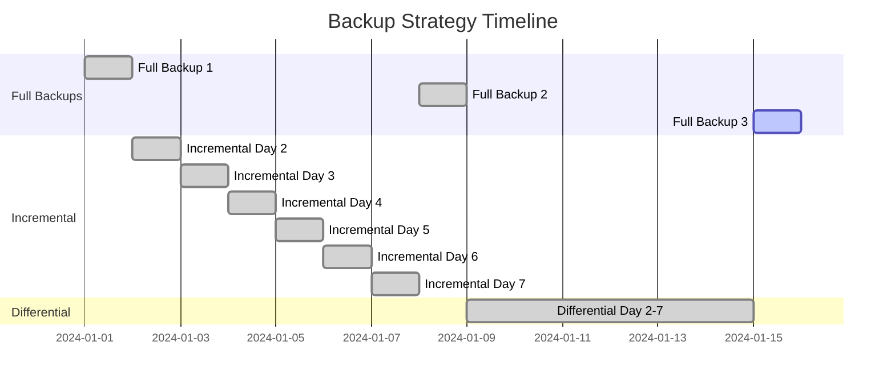
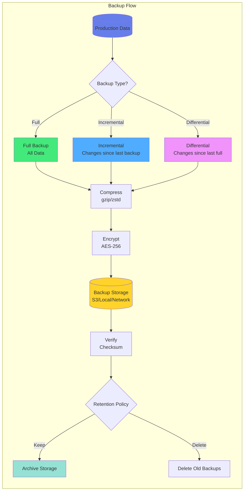

# Kapitel 20: Backup & Recovery

## Einführung

Backup und Recovery sind kritische Komponenten für jede Produktionsumgebung. Dieses Kapitel behandelt umfassende Strategien für Datensicherung, Wiederherstellung und Disaster Recovery mit ThemisDB.

## 19.1 Backup-Strategien

### 19.1.1 Vollständige Backups

**Konzept:**
Ein vollständiges Backup erstellt eine komplette Kopie aller Daten zu einem bestimmten Zeitpunkt.

**Durchführung:**
```bash
# Online-Backup erstellen
themisdb-backup --type full --output /backups/full_$(date +%Y%m%d).tar.gz

# Mit Kompression
themisdb-backup --type full --compress gzip --output /backups/full.tar.gz
```

**Vorteile:**
- Einfache Wiederherstellung
- Vollständige Datenkonsistenz
- Einfaches Backup-Management

**Nachteile:**
- Hoher Speicherbedarf
- Längere Backup-Dauer
- Höhere I/O-Last

### 19.1.2 Inkrementelle Backups

**Konzept:**
Nur Änderungen seit dem letzten Backup werden gesichert.

**Implementierung:**
```bash
# Erstes vollständiges Backup
themisdb-backup --type full --output /backups/base.tar.gz

# Inkrementelle Backups
themisdb-backup --type incremental \
  --base /backups/base.tar.gz \
  --output /backups/incr_$(date +%Y%m%d_%H%M).tar.gz
```

**Vorteile:**
- Schnellere Backup-Erstellung
- Geringerer Speicherbedarf
- Weniger I/O-Last

**Nachteile:**
- Komplexere Wiederherstellung
- Abhängigkeit von vorherigen Backups

### 19.1.3 Differenzielle Backups

**Konzept:**
Alle Änderungen seit dem letzten vollständigen Backup.

```bash
# Differenzielles Backup
themisdb-backup --type differential \
  --base /backups/full.tar.gz \
  --output /backups/diff_$(date +%Y%m%d).tar.gz
```



Abb. 20.1: Backup-Strategy-Overview



Abb. 20.2: Point-in-Time-Recovery-Timeline

## 19.2 Backup-Mechanismen

### 19.2.1 Physische Backups

**RocksDB SST-Dateien:**
```python
import shutil
from pathlib import Path

def physical_backup(data_dir, backup_dir):
    """Erstellt physisches Backup der RocksDB-Dateien"""
    # Checkpoint erstellen (konsistenter Snapshot)
    checkpoint_dir = Path(backup_dir) / "checkpoint"
    
    # ThemisDB Checkpoint API
    client.admin.create_checkpoint(str(checkpoint_dir))
    
    # Backup mit rsync
    import subprocess
    subprocess.run([
        "rsync", "-av", "--delete",
        str(checkpoint_dir) + "/",
        str(backup_dir) + "/"
    ])
    
    print(f"Physical backup completed: {backup_dir}")
```

**Vorteile:**
- Sehr schnelle Backups
- Minimale Auswirkungen auf die Performance
- Byte-genaue Kopien

### 19.2.2 Logische Backups

**Datenexport:**
```python
def logical_backup(client, backup_file):
    """Exportiert Daten als logisches Backup"""
    import json
    
    backup_data = {
        'version': '1.3.4',
        'timestamp': datetime.now().isoformat(),
        'collections': {}
    }
    
    # Alle Collections exportieren
    collections = client.list_collections()
    for coll_name in collections:
        print(f"Backing up collection: {coll_name}")
        
        # Alle Dokumente exportieren
        docs = list(client.collection(coll_name).find({}))
        backup_data['collections'][coll_name] = docs
    
    # Als JSON speichern
    with open(backup_file, 'w') as f:
        json.dump(backup_data, f, indent=2)
    
    print(f"Logical backup completed: {backup_file}")
```

**Vorteile:**
- Plattformunabhängig
- Lesbare Datenformate
- Einfache Teilwiederherstellung

### 19.2.3 Snapshot-basierte Backups

**Mit Dateisystem-Snapshots:**
```bash
# LVM Snapshot
lvcreate --snapshot --name themisdb_snap --size 10G /dev/vg0/themisdb

# Backup vom Snapshot
tar czf /backups/snapshot_$(date +%Y%m%d).tar.gz \
  /mnt/themisdb_snap/

# Snapshot entfernen
lvremove /dev/vg0/themisdb_snap
```

**AWS EBS Snapshots:**
```python
import boto3

def create_ebs_snapshot(volume_id, description):
    """Erstellt EBS Snapshot"""
    ec2 = boto3.client('ec2')
    
    snapshot = ec2.create_snapshot(
        VolumeId=volume_id,
        Description=description,
        TagSpecifications=[{
            'ResourceType': 'snapshot',
            'Tags': [
                {'Key': 'Name', 'Value': f'themisdb-backup-{datetime.now().strftime("%Y%m%d")}'},
                {'Key': 'Type', 'Value': 'automated'}
            ]
        }]
    )
    
    return snapshot['SnapshotId']
```

## 19.3 Point-in-Time Recovery (PITR)

### 19.3.1 Binlog-basierte Recovery

**Konzept:**
Kombination aus vollständigem Backup und Transaction Logs.

**Aktivierung:**
```yaml
# themisdb.yaml
storage:
  enable_binlog: true
  binlog_dir: /var/lib/themisdb/binlog
  binlog_rotation: 100MB
  binlog_retention: 7d
```

**Recovery-Prozess:**
```python
def point_in_time_recovery(backup_file, target_time):
    """
    Wiederherstellung zu einem bestimmten Zeitpunkt
    """
    # 1. Basis-Backup wiederherstellen
    restore_backup(backup_file)
    
    # 2. Binlogs bis zum Ziel-Zeitpunkt anwenden
    binlog_dir = Path("/var/lib/themisdb/binlog")
    
    for binlog in sorted(binlog_dir.glob("binlog.*")):
        # Binlog-Einträge bis target_time anwenden
        apply_binlog(binlog, target_time)
    
    print(f"PITR completed to: {target_time}")
```

### 19.3.2 MVCC-basierte Recovery

**Mit Snapshot Isolation:**
```python
def recover_to_timestamp(timestamp):
    """
    Nutzt MVCC für zeitpunktgenaue Wiederherstellung
    """
    # Query mit AS OF SYSTEM TIME
    result = client.query(f"""
        SELECT * FROM orders
        AS OF SYSTEM TIME '{timestamp}'
    """)
    
    return result
```

## 19.4 Backup-Automatisierung

### 19.4.1 Cron-basierte Backups

**Backup-Script:**
```bash
#!/bin/bash
# /usr/local/bin/themisdb-backup.sh

BACKUP_DIR=/backups/themisdb
DATE=$(date +%Y%m%d_%H%M)
LOG_FILE=/var/log/themisdb-backup.log

# Vollständiges Backup jeden Sonntag
if [ $(date +%u) -eq 7 ]; then
    echo "[$(date)] Starting full backup" >> $LOG_FILE
    themisdb-backup --type full --output $BACKUP_DIR/full_$DATE.tar.gz
else
    echo "[$(date)] Starting incremental backup" >> $LOG_FILE
    themisdb-backup --type incremental --output $BACKUP_DIR/incr_$DATE.tar.gz
fi

# Alte Backups löschen (>30 Tage)
find $BACKUP_DIR -name "*.tar.gz" -mtime +30 -delete

echo "[$(date)] Backup completed" >> $LOG_FILE
```

**Crontab-Eintrag:**
```cron
# Tägliches Backup um 2:00 Uhr
0 2 * * * /usr/local/bin/themisdb-backup.sh

# Wöchentliches vollständiges Backup (Sonntag 3:00)
0 3 * * 0 /usr/local/bin/themisdb-full-backup.sh
```

### 19.4.2 Python Backup-Manager

Das folgende Python-Skript implementiert einen vollautomatischen Backup-Manager mit Schedule-Support. Es unterscheidet zwischen vollständigen und inkrementellen Backups und führt automatisch Retention-Management durch (löscht alte Backups nach 30 Tagen).

📁 **Vollständiger Code:** `examples/20_backup/backup_manager.py` (~95 Zeilen)

```python
import schedule
import time
from datetime import datetime, timedelta
from pathlib import Path

class BackupManager:
    def __init__(self, backup_dir, retention_days=30):
        self.backup_dir = Path(backup_dir)
        self.retention_days = retention_days
        
    def full_backup(self):
        """Vollständiges Backup aller Daten"""
        timestamp = datetime.now().strftime("%Y%m%d_%H%M")
        backup_file = self.backup_dir / f"full_{timestamp}.tar.gz"
        print(f"Starting full backup: {backup_file}")
        # Backup-Logik (tar/gzip Kompression)
        
    def incremental_backup(self):
        """Inkrementelles Backup nur geänderter Daten"""
        timestamp = datetime.now().strftime("%Y%m%d_%H%M")
        backup_file = self.backup_dir / f"incr_{timestamp}.tar.gz"
        print(f"Starting incremental backup: {backup_file}")
        
    def cleanup_old_backups(self):
        """Löscht Backups älter als retention_days"""
        cutoff = datetime.now() - timedelta(days=self.retention_days)
        for backup in self.backup_dir.glob("*.tar.gz"):
            if datetime.fromtimestamp(backup.stat().st_mtime) < cutoff:
                backup.unlink()
                print(f"Deleted old backup: {backup}")
    
    def start_scheduler(self):
        """Startet automatischen Backup-Scheduler"""
        schedule.every().day.at("02:00").do(self.incremental_backup)
        schedule.every().sunday.at("03:00").do(self.full_backup)
        schedule.every().day.at("04:00").do(self.cleanup_old_backups)
        
        while True:
            schedule.run_pending()
            time.sleep(60)

# Usage
manager = BackupManager("/backups/themisdb", retention_days=30)
manager.start_scheduler()
```

**Zusätzliche Features im vollständigen Skript:**
- Cloud-Upload zu S3/Azure Blob Storage
- Verschlüsselung mit GPG
- Email-Benachrichtigungen bei Fehlern
- Prometheus-Metriken für Monitoring

## 19.5 Backup-Verifizierung

### 19.5.1 Backup-Integrität prüfen

**Checksummen-Validierung:**
```python
import hashlib

def verify_backup(backup_file):
    """Überprüft Backup-Integrität"""
    # Checksumme berechnen
    sha256 = hashlib.sha256()
    
    with open(backup_file, 'rb') as f:
        while chunk := f.read(8192):
            sha256.update(chunk)
    
    checksum = sha256.hexdigest()
    
    # Mit gespeicherter Checksumme vergleichen
    checksum_file = f"{backup_file}.sha256"
    if Path(checksum_file).exists():
        with open(checksum_file) as f:
            expected = f.read().strip()
            
        if checksum == expected:
            print(f"✓ Backup integrity verified: {backup_file}")
            return True
        else:
            print(f"✗ Backup corrupted: {backup_file}")
            return False
    else:
        # Checksumme speichern
        with open(checksum_file, 'w') as f:
            f.write(checksum)
        return True
```

### 19.5.2 Wiederherstellungs-Tests

**Automatisierte Test-Recovery:**
```python
def test_backup_restore(backup_file, test_dir="/tmp/restore_test"):
    """Testet Backup-Wiederherstellung"""
    import shutil
    from pathlib import Path
    
    test_path = Path(test_dir)
    test_path.mkdir(exist_ok=True)
    
    try:
        # Backup wiederherstellen
        restore_backup(backup_file, test_path)
        
        # ThemisDB mit Test-Daten starten
        test_client = ThemisDBClient(data_dir=test_path)
        
        # Basis-Tests durchführen
        collections = test_client.list_collections()
        assert len(collections) > 0, "No collections found"
        
        # Sample-Queries testen
        result = test_client.query("SELECT COUNT(*) FROM orders")
        assert result[0]['count'] > 0, "No data found"
        
        print(f"✓ Restore test passed: {backup_file}")
        return True
        
    except Exception as e:
        print(f"✗ Restore test failed: {e}")
        return False
        
    finally:
        # Cleanup
        shutil.rmtree(test_path, ignore_errors=True)
```

## 19.6 Wiederherstellung

### 19.6.1 Vollständige Wiederherstellung

**Restore-Prozess:**
```bash
#!/bin/bash
# Komplette Datenbank-Wiederherstellung

# 1. ThemisDB stoppen
systemctl stop themisdb

# 2. Datenverzeichnis sichern (falls vorhanden)
mv /var/lib/themisdb /var/lib/themisdb.old

# 3. Backup wiederherstellen
tar xzf /backups/full_20231215.tar.gz -C /var/lib/themisdb

# 4. Berechtigungen setzen
chown -R themisdb:themisdb /var/lib/themisdb

# 5. ThemisDB starten
systemctl start themisdb

# 6. Validierung
themisdb-admin validate
```

### 19.6.2 Selektive Wiederherstellung

**Einzelne Collection wiederherstellen:**
```python
def restore_collection(backup_file, collection_name, target_db):
    """Stellt einzelne Collection wieder her"""
    import json
    
    # Backup laden
    with open(backup_file) as f:
        backup_data = json.load(f)
    
    # Collection-Daten extrahieren
    if collection_name not in backup_data['collections']:
        raise ValueError(f"Collection {collection_name} not found in backup")
    
    docs = backup_data['collections'][collection_name]
    
    # In Ziel-DB einfügen
    target_client = ThemisDBClient(target_db)
    coll = target_client.collection(collection_name)
    
    # Batch-Insert
    batch_size = 1000
    for i in range(0, len(docs), batch_size):
        batch = docs[i:i+batch_size]
        coll.insert_many(batch)
    
    print(f"Restored {len(docs)} documents to {collection_name}")
```

## 19.7 Disaster Recovery

### 19.7.1 DR-Strategie

**Recovery Time Objective (RTO):**
- Maximale akzeptable Ausfallzeit
- Ziel: < 4 Stunden

**Recovery Point Objective (RPO):**
- Maximaler Datenverlust
- Ziel: < 15 Minuten

**DR-Plan:**
```yaml
disaster_recovery:
  primary_site:
    location: "datacenter-1"
    backup_frequency: "hourly"
    
  secondary_site:
    location: "datacenter-2"
    replication: "synchronous"
    standby_mode: "hot"
    
  backup_locations:
    - "s3://backups-bucket/themisdb/"
    - "azure://backups/themisdb/"
    
  procedures:
    - name: "Site Failover"
      steps:
        - "Verify primary site failure"
        - "Promote secondary to primary"
        - "Update DNS/Load Balancer"
        - "Verify application connectivity"
```

### 19.7.2 Geo-Replikation

**Multi-Region Setup:**
```python
# Master in Region 1
master_config = {
    'replication': {
        'role': 'master',
        'replicas': [
            'themisdb-replica-eu:8529',
            'themisdb-replica-us:8529'
        ]
    }
}

# Replica in Region 2
replica_config = {
    'replication': {
        'role': 'replica',
        'master': 'themisdb-master-eu:8529',
        'replication_lag_alert': '30s'
    }
}
```

## 19.8 Backup zu Cloud-Storage

### 19.8.1 AWS S3

**Upload zu S3:**
```python
import boto3
from pathlib import Path

def upload_to_s3(backup_file, bucket, prefix="backups/"):
    """Lädt Backup zu AWS S3 hoch"""
    s3 = boto3.client('s3')
    
    key = f"{prefix}{Path(backup_file).name}"
    
    # Upload mit Progress
    s3.upload_file(
        backup_file,
        bucket,
        key,
        Callback=ProgressPercentage(backup_file)
    )
    
    print(f"Uploaded to s3://{bucket}/{key}")
    
    # Lifecycle-Policy für automatisches Löschen
    s3.put_bucket_lifecycle_configuration(
        Bucket=bucket,
        LifecycleConfiguration={
            'Rules': [{
                'Id': 'DeleteOldBackups',
                'Status': 'Enabled',
                'Prefix': prefix,
                'Expiration': {'Days': 90}
            }]
        }
    )
```

### 19.8.2 Azure Blob Storage

**Upload zu Azure:**
```python
from azure.storage.blob import BlobServiceClient

def upload_to_azure(backup_file, connection_string, container):
    """Lädt Backup zu Azure Blob Storage"""
    blob_service = BlobServiceClient.from_connection_string(connection_string)
    
    blob_name = Path(backup_file).name
    blob_client = blob_service.get_blob_client(container, blob_name)
    
    with open(backup_file, 'rb') as data:
        blob_client.upload_blob(data, overwrite=True)
    
    print(f"Uploaded to Azure: {container}/{blob_name}")
```

### 19.8.3 Google Cloud Storage

**Upload zu GCS:**
```python
from google.cloud import storage

def upload_to_gcs(backup_file, bucket_name, destination_blob):
    """Lädt Backup zu Google Cloud Storage"""
    client = storage.Client()
    bucket = client.bucket(bucket_name)
    blob = bucket.blob(destination_blob)
    
    blob.upload_from_filename(backup_file)
    
    print(f"Uploaded to gs://{bucket_name}/{destination_blob}")
```

## 19.9 Best Practices

### 19.9.1 3-2-1 Backup-Regel

**Prinzip:**
- **3** Kopien der Daten
- **2** verschiedene Medientypen
- **1** Kopie off-site

**Implementierung:**
```python
backup_strategy = {
    'copies': [
        {'type': 'local', 'location': '/backups/local'},
        {'type': 'nas', 'location': '/mnt/nas/backups'},
        {'type': 'cloud', 'location': 's3://backups/themisdb'}
    ],
    'media_types': ['disk', 'cloud'],
    'offsite': True
}
```

### 19.9.2 Backup-Verschlüsselung

**Verschlüsselte Backups:**
```python
from cryptography.fernet import Fernet

def encrypted_backup(source_file, output_file, key_file):
    """Erstellt verschlüsseltes Backup"""
    # Key laden oder generieren
    if Path(key_file).exists():
        with open(key_file, 'rb') as f:
            key = f.read()
    else:
        key = Fernet.generate_key()
        with open(key_file, 'wb') as f:
            f.write(key)
    
    fernet = Fernet(key)
    
    # Daten verschlüsseln
    with open(source_file, 'rb') as f:
        data = f.read()
    
    encrypted = fernet.encrypt(data)
    
    with open(output_file, 'wb') as f:
        f.write(encrypted)
    
    print(f"Encrypted backup created: {output_file}")
```

### 19.9.3 Backup-Monitoring

**Monitoring-Integration:**
```python
from prometheus_client import Counter, Histogram, Gauge

backup_counter = Counter('themisdb_backups_total', 'Total backups', ['type', 'status'])
backup_duration = Histogram('themisdb_backup_duration_seconds', 'Backup duration')
backup_size = Gauge('themisdb_backup_size_bytes', 'Backup size')
last_backup = Gauge('themisdb_last_backup_timestamp', 'Last backup timestamp')

@backup_duration.time()
def monitored_backup(backup_type):
    """Backup mit Monitoring"""
    try:
        # Backup durchführen
        result = create_backup(backup_type)
        
        # Metriken aktualisieren
        backup_counter.labels(type=backup_type, status='success').inc()
        backup_size.set(result['size'])
        last_backup.set(time.time())
        
        return result
        
    except Exception as e:
        backup_counter.labels(type=backup_type, status='failure').inc()
        raise
```

## 19.10 Zusammenfassung

**Kritische Punkte:**
- Regelmäßige Backups sind essenziell
- PITR ermöglicht zeitpunktgenaue Recovery
- Automatisierung reduziert Fehler
- Cloud-Storage bietet Off-site-Schutz
- Regelmäßige Wiederherstellungs-Tests
- Verschlüsselung schützt sensible Daten
- Monitoring gewährleistet Backup-Erfolg

**Checkliste:**
- [ ] Backup-Strategie definiert
- [ ] Automatisierte Backups konfiguriert
- [ ] PITR aktiviert
- [ ] Off-site Backups eingerichtet
- [ ] Wiederherstellungs-Tests durchgeführt
- [ ] DR-Plan dokumentiert
- [ ] Monitoring aktiviert
- [ ] Team geschult

## 20.11 Storage/Backup C++ API — BackupManager, PITR, Tiered Storage (v1.x) {#backup-cpp-api}

Dieses Kapitel dokumentiert die C++-Produktions-API des Storage-Moduls (`include/storage/`).

### 20.11.1 BackupManager — RAID-aware Backup

```cpp
#include "storage/backup_manager.h"

// RAID-Konfiguration
themis::RAIDConfig raid;
raid.mode = themis::RAIDMode::RAID5;
raid.shards = {
    {"shard-0", "node1:8766", false, 0},
    {"shard-1", "node2:8766", false, 1},
    {"shard-2", "node3:8766", true,  2},  // Parity-Shard
};

themis::BackupManager bm(db_wrapper, raid);

// Vollständiges Backup
themis::BackupOptions opts;
opts.encrypt             = true;   // AES-256-GCM
opts.verify_after_backup = true;
opts.compression         = themis::CompressionType::ZSTD;

std::error_code ec;
bm.createFullBackup("/backups/full-2026-04-13", ec, opts);

// Inkrementelles Backup (seit letztem Full/Incremental)
bm.createIncrementalBackup("/backups/incr-2026-04-13", ec, opts);

// Differenzielles Backup (seit letztem Full)
bm.createDifferentialBackup("/backups/diff-2026-04-13", ec, opts);

// WAL archivieren (für PITR)
bm.archiveWAL("/wal-archive/2026-04-13", ec);
```

**RAID-Modi:**

| Modus | Beschreibung |
|-------|-------------|
| `NONE` | Kein Redundanz |
| `RAID0` | Striping (Performance) |
| `RAID1` | Mirroring (Verfügbarkeit) |
| `RAID5` | Striping + verteilte Parität |
| `RAID6` | Striping + doppelte Parität |
| `RAID10` | Striping + Mirroring |

### 20.11.2 BackupManager — Restore & Verifikation

```cpp
// Vollständiges Restore (RAID-Shard-Rekonstruktion automatisch)
bm.restoreFromBackup("/backups/full-2026-04-13", ec);

// Einzelne Collections selektiv wiederherstellen
bm.restoreCollections("/backups/full-2026-04-13",
    {"orders", "invoices"}, ec);

// Backup-Integrität prüfen
bool valid = bm.isBackupComplete("/backups/full-2026-04-13", ec);

// RAID-Shards im Backup verifizieren
bool raid_ok = bm.verifyRAIDShardsInBackup("/backups/full-2026-04-13", ec);

// Scheduled Backup einrichten (cron-ähnlich)
bm.scheduleBackup("/backups/scheduled", "0 2 * * *", opts);  // Täglich 02:00
```

### 20.11.3 PITRManager — Point-in-Time Recovery

```cpp
#include "storage/pitr_manager.h"

themis::PITRManager pitr(db_wrapper, snap_manager);

// Restore-Vorschau (ohne Änderungen)
themis::PITRManager::RestoreOptions ropts;
ropts.target_time = std::chrono::system_clock::time_point{...};  // Ziel-Zeitpunkt

auto preview = pitr.previewRestore(ropts);
// preview.estimated_duration_ms, preview.wal_segments_to_apply

// Fortschritts-Callback
ropts.progress_callback = [](const themis::PITRManager::RestoreProgress& p) {
    std::cout << "Phase=" << static_cast<int>(p.phase)
              << " " << p.percent_complete << "%\n";
};

// PITR durchführen
auto status = pitr.restore(ropts);
// status.ok, status.message, status.restored_to_time
```

**RestoreProgress::Phase:**

| Phase | Bedeutung |
|-------|-----------|
| `VALIDATING` | Snapshot + WAL-Archiv prüfen |
| `RESTORING_SNAPSHOT` | Basis-Snapshot einspielen |
| `APPLYING_WAL` | WAL-Segmente replay |
| `VERIFYING` | Konsistenz prüfen |
| `DONE` | Abgeschlossen |

### 20.11.4 TieredStorageManager

```cpp
#include "storage/tiered_storage.h"

// 3-Tier-Konfiguration: HOT → WARM → COLD
themis::TieredStorageConfig tcfg;
tcfg.hot_tier_max_bytes  = 10ULL * 1024 * 1024 * 1024;  // 10 GB
tcfg.warm_tier_max_bytes = 100ULL * 1024 * 1024 * 1024; // 100 GB
tcfg.cold_backend        = "s3://themis-cold-archive";

themis::TieredStorageManager tsm(tcfg);

// Schreiben (landet in HOT)
tsm.put("orders/2026-04", data);

// Lesen (transparenter Abruf aus aktuellem Tier)
auto val = tsm.get("orders/2024-01");  // ggf. aus COLD

// Manuell migrieren
tsm.promoteToHot("orders/2025-12");  // WARM → HOT
tsm.demoteToCold("orders/2023-01");  // HOT/WARM → COLD

// Access-Statistiken
auto stats = tsm.accessStats("orders/2026-04");
// stats.read_count, stats.last_access, stats.current_tier
```

**StorageTierLevel:**

| Tier | Typ | Latenz |
|------|-----|--------|
| `HOT` | NVMe/SSD (lokal) | < 1 ms |
| `WARM` | SSD (netzwerk) | 1–10 ms |
| `COLD` | Objekt-Storage S3/GCS/Azure | 50–500 ms |

### 20.11.5 AdaptiveCompaction

```cpp
#include "storage/adaptive_compaction.h"

// Automatische Kompaktierungs-Strategie basierend auf Write/Read-Amplification
themis::AdaptiveCompactionManager comp(rocksdb_wrapper);

// Statistiken abfragen
auto stats = comp.currentStats();
// stats.write_amplification, stats.read_amplification,
// stats.space_amplification, stats.pending_compactions

// Manuelle Kompaktierung mit Strategie auswählen
comp.compact(themis::CompactionStrategy::LEVELED);
// Strategien: LEVELED, UNIVERSAL, FIFO, TIERED

// Hintergrund-Kompaktierung konfigurieren
comp.setTargetWriteAmplification(10.0);
comp.enableAutoCompaction(true);
```
