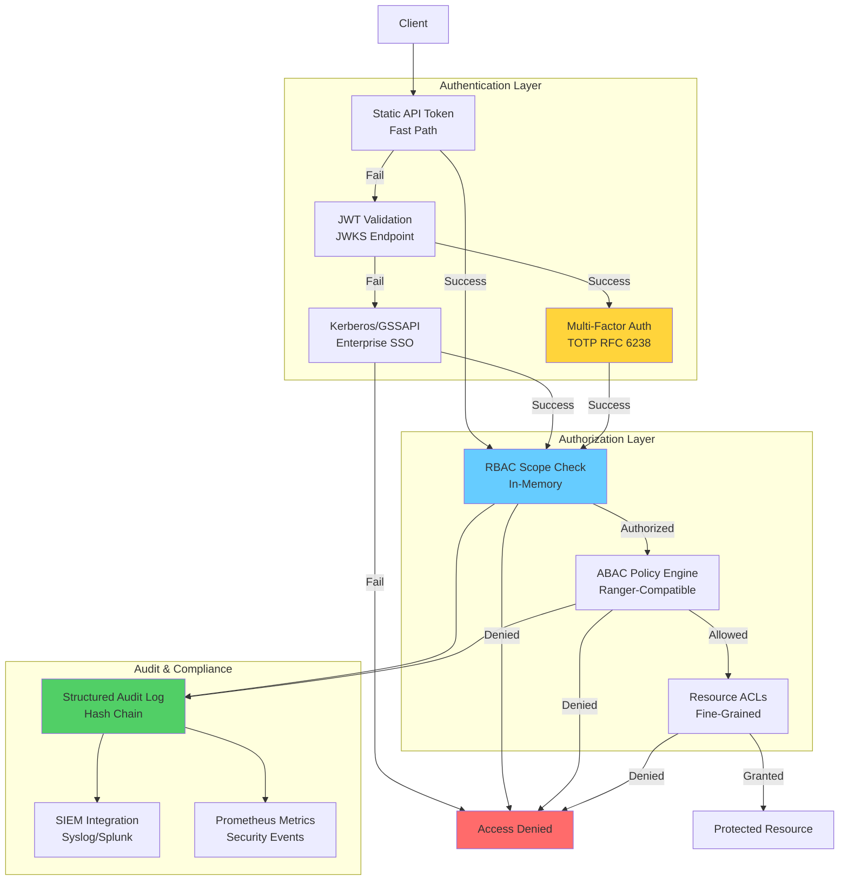
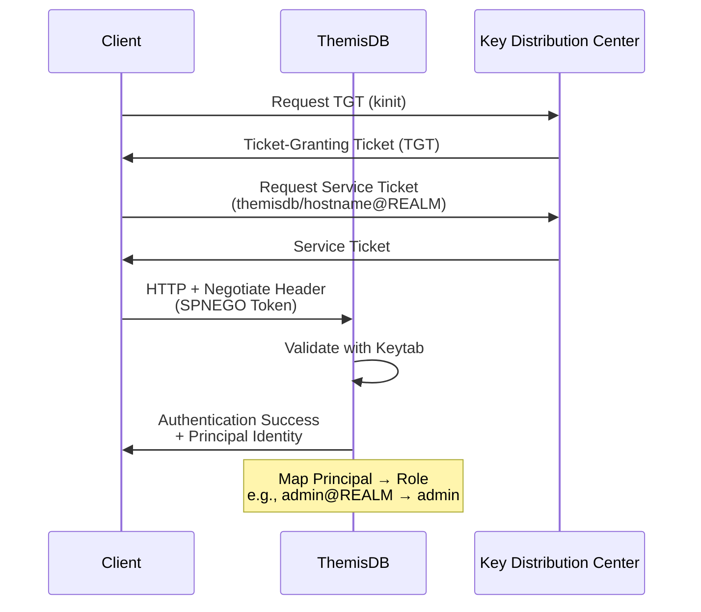

# Kapitel 21: Authentifizierung und Autorisierung

> **Zusammenfassung:** ThemisDB implementiert ein mehrschichtiges Sicherheitssystem mit JWT, Kerberos/GSSAPI, RBAC und ABAC für Enterprise-Authentication. Multi-Factor Authentication (TOTP), Binary Integrity Verification und umfassendes Audit Logging gewährleisten GDPR-, SOC 2- und HIPAA-Compliance.
>
> **Voraussetzungen:** [Kapitel 2: Architektur](chapter_02_architecture.md), [Kapitel 36: Security Hardening](chapter_36_security_hardening.md)
>
> **Lernziele:**
> - JWT-basierte Token-Authentication konfigurieren
> - Kerberos/GSSAPI für Enterprise-SSO integrieren
> - RBAC- und ABAC-Policies implementieren
> - Multi-Factor Authentication (MFA) aktivieren
> - Security Best Practices anwenden
> - Compliance-Anforderungen erfüllen (GDPR, SOC 2, HIPAA)

---

## 21.1 Einleitung

### Motivation

Moderne Datenbanksysteme benötigen robuste Authentifizierungs- und Autorisierungsmechanismen für:
- **Enterprise Integration**: Single Sign-On (SSO) mit Active Directory/LDAP
- **API Security**: Token-based authentication für REST/gRPC-APIs
- **Compliance**: GDPR, SOC 2, HIPAA-konforme Zugriffskontrollen
- **Audit**: Nachvollziehbarkeit aller sicherheitsrelevanten Operationen

ThemisDB bietet ein mehrschichtiges Authentifizierungssystem mit Fallback-Chain:
```
Token → JWT → Kerberos/GSSAPI → DENY
```

### Architektur-Überblick



---

## 21.2 JWT Authentication

### Konzept

JSON Web Tokens (JWT) ermöglichen stateless authentication mit digitalen Signaturen. ThemisDB validiert JWTs gegen JWKS (JSON Web Key Set) Endpoints.

**JWT Structure:**
```
Header.Payload.Signature

Header:
{
  "alg": "RS256",
  "typ": "JWT",
  "kid": "key-2024-01"
}

Payload:
{
  "sub": "user@example.com",
  "iss": "https://auth.example.com",
  "aud": "themisdb-api",
  "exp": 1705045200,
  "nbf": 1705041600,
  "iat": 1705041600,
  "scopes": ["data:read", "data:write"]
}
```

### Implementierung

**JWTValidator:**
```cpp
class JWTValidator {
private:
    std::string jwks_url;
    std::string expected_issuer;
    std::string expected_audience;
    std::chrono::seconds clock_skew{60};  // Time sync tolerance
    std::chrono::seconds jwks_cache_ttl{300};
    std::map<std::string, RSAPublicKey> key_cache;
    
public:
    ValidationResult validate(const std::string& token) {
        // Step 1: Parse JWT (header, payload, signature)
        auto [header, payload, signature] = parseJWT(token);
        
        // Step 2: Verify algorithm (prevent "none" attack)
        if (header.alg != "RS256") {
            return ValidationResult::error("Unsupported algorithm");
        }
        
        // Step 3: Fetch public key from JWKS
        auto public_key = getPublicKey(header.kid);
        if (!public_key) {
            return ValidationResult::error("Unknown key ID");
        }
        
        // Step 4: Verify signature
        if (!verifyRS256Signature(token, *public_key)) {
            return ValidationResult::error("Invalid signature");
        }
        
        // Step 5: Validate claims
        auto now = std::time(nullptr);
        
        if (payload.exp < now - clock_skew.count()) {
            return ValidationResult::error("Token expired");
        }
        
        if (payload.nbf > now + clock_skew.count()) {
            return ValidationResult::error("Token not yet valid");
        }
        
        if (payload.iss != expected_issuer) {
            return ValidationResult::error("Invalid issuer");
        }
        
        if (payload.aud != expected_audience) {
            return ValidationResult::error("Invalid audience");
        }
        
        // Success
        return ValidationResult::success(payload);
    }
    
private:
    std::optional<RSAPublicKey> getPublicKey(const std::string& kid) {
        // Check cache
        auto it = key_cache.find(kid);
        if (it != key_cache.end()) {
            return it->second;
        }
        
        // Fetch from JWKS endpoint
        auto jwks = fetchJWKS(jwks_url);
        for (const auto& key : jwks.keys) {
            if (key.kid == kid && key.kty == "RSA") {
                auto public_key = parseRSAPublicKey(key);
                key_cache[kid] = public_key;  // Cache
                return public_key;
            }
        }
        
        return std::nullopt;
    }
};
```

### Configuration

**YAML:**
```yaml
authentication:
  jwt:
    enabled: true
    jwks_url: "https://auth.example.com/.well-known/jwks.json"
    expected_issuer: "https://auth.example.com"
    expected_audience: "themisdb-api"
    clock_skew_seconds: 60
    jwks_cache_ttl_seconds: 300
```

**Environment Variables:**
```bash
THEMIS_JWT_ENABLED=true
THEMIS_JWT_JWKS_URL="https://auth.example.com/.well-known/jwks.json"
THEMIS_JWT_ISSUER="https://auth.example.com"
THEMIS_JWT_AUDIENCE="themisdb-api"
```

### JWKS Format

**Example JWKS Endpoint:**
```json
{
  "keys": [
    {
      "kty": "RSA",
      "use": "sig",
      "kid": "key-2024-01",
      "alg": "RS256",
      "n": "xGOr-H0A2ChQ...base64url-no-padding...",
      "e": "AQAB"
    }
  ]
}
```

**Security Notes:**
- `n` (modulus) and `e` (exponent) must be base64url encoded **without padding**
- `kid` must match JWT header `kid` field
- JWKS endpoint must be HTTPS
- Key rotation: Include multiple keys with different `kid` values

---

## 21.3 Kerberos/GSSAPI Enterprise Authentication

### Konzept

Kerberos ermöglicht Single Sign-On (SSO) in Enterprise-Umgebungen. ThemisDB unterstützt:
- **MIT Kerberos 5**
- **Microsoft Active Directory**
- **Heimdal Kerberos**

**Kerberos Authentication Flow:**


### Implementierung

**KerberosAuthenticator:**
```cpp
class KerberosAuthenticator {
private:
    std::string service_principal;  // themisdb/hostname@REALM.COM
    std::string keytab_file;
    std::map<std::string, std::string> principal_mappings;
    gss_cred_id_t server_creds = GSS_C_NO_CREDENTIAL;
    
public:
    KerberosAuthenticator(const Config& cfg) 
        : service_principal(cfg.service_principal),
          keytab_file(cfg.keytab_file),
          principal_mappings(cfg.principal_mappings) {
        
        // Set keytab environment variable
        setenv("KRB5_KTNAME", keytab_file.c_str(), 1);
        
        // Import service credentials
        gss_name_t server_name;
        gss_buffer_desc name_buf;
        name_buf.value = const_cast<char*>(service_principal.c_str());
        name_buf.length = service_principal.length();
        
        OM_uint32 major_status, minor_status;
        major_status = gss_import_name(&minor_status, &name_buf, 
                                        GSS_C_NT_HOSTBASED_SERVICE, 
                                        &server_name);
        
        if (major_status != GSS_S_COMPLETE) {
            throw KerberosException("Failed to import service principal");
        }
        
        // Acquire credentials from keytab
        major_status = gss_acquire_cred(&minor_status, server_name, 
                                         GSS_C_INDEFINITE, GSS_C_NO_OID_SET, 
                                         GSS_C_ACCEPT, &server_creds, 
                                         nullptr, nullptr);
        
        gss_release_name(&minor_status, &server_name);
        
        if (major_status != GSS_S_COMPLETE) {
            throw KerberosException("Failed to acquire credentials");
        }
    }
    
    AuthResult authenticate(const std::string& spnego_token) {
        gss_buffer_desc input_token;
        input_token.value = const_cast<char*>(spnego_token.c_str());
        input_token.length = spnego_token.length();
        
        gss_ctx_id_t context = GSS_C_NO_CONTEXT;
        gss_buffer_desc output_token = GSS_C_EMPTY_BUFFER;
        gss_name_t client_name;
        
        OM_uint32 major_status, minor_status;
        major_status = gss_accept_sec_context(&minor_status, &context, 
                                               server_creds, &input_token, 
                                               GSS_C_NO_CHANNEL_BINDINGS, 
                                               &client_name, nullptr, 
                                               &output_token, nullptr, 
                                               nullptr, nullptr);
        
        if (major_status != GSS_S_COMPLETE && 
            major_status != GSS_S_CONTINUE_NEEDED) {
            return AuthResult::error("Kerberos authentication failed");
        }
        
        // Extract principal name
        gss_buffer_desc name_buf;
        gss_display_name(&minor_status, client_name, &name_buf, nullptr);
        std::string principal(static_cast<char*>(name_buf.value), 
                               name_buf.length);
        
        // Map principal to role
        std::string role = mapPrincipalToRole(principal);
        
        // Cleanup
        gss_release_name(&minor_status, &client_name);
        gss_release_buffer(&minor_status, &name_buf);
        gss_delete_sec_context(&minor_status, &context, GSS_C_NO_BUFFER);
        
        return AuthResult::success(principal, role);
    }
    
private:
    std::string mapPrincipalToRole(const std::string& principal) {
        // Exact match
        auto it = principal_mappings.find(principal);
        if (it != principal_mappings.end()) {
            return it->second;
        }
        
        // Wildcard match (e.g., "*@REALM.COM" → "readonly")
        for (const auto& [pattern, role] : principal_mappings) {
            if (matchWildcard(principal, pattern)) {
                return role;
            }
        }
        
        return "guest";  // Default role
    }
};
```

### Configuration

**YAML:**
```yaml
authentication:
  kerberos:
    enabled: true
    service_principal: "themisdb/hostname@REALM.COM"
    keytab_file: "/etc/themisdb/themisdb.keytab"
    principal_mappings:
      - principal_pattern: "admin@REALM.COM"
        role: "admin"
      - principal_pattern: "analytics-*@REALM.COM"
        role: "analyst"
      - principal_pattern: "*@REALM.COM"
        role: "readonly"
```

### Keytab Setup

**Generate Keytab (MIT Kerberos):**
```bash
# On KDC server
kadmin.local
  addprinc -randkey themisdb/hostname@REALM.COM
  ktadd -k /tmp/themisdb.keytab themisdb/hostname@REALM.COM
  quit

# Secure transfer to ThemisDB server
scp /tmp/themisdb.keytab themisdb-server:/etc/themisdb/
ssh themisdb-server "chmod 600 /etc/themisdb/themisdb.keytab"
ssh themisdb-server "chown themisdb:themisdb /etc/themisdb/themisdb.keytab"
```

**Active Directory (Windows):**
```powershell
# Run as Domain Admin
setspn -A themisdb/hostname themisdb-service-account
ktpass /princ themisdb/hostname@AD.DOMAIN.COM /mapuser themisdb-service-account `
       /pass Password123 /out themisdb.keytab /crypto AES256-SHA1
```

---

## 21.4 RBAC und ABAC Authorization

### Role-Based Access Control (RBAC)

**Scope Matrix:**
| Scope | Description | Protected Operations |
|-------|-------------|---------------------|
| `admin` | Superuser | All operations |
| `config:read` | Read configuration | GET /config |
| `config:write` | Write configuration | POST /config |
| `data:read` | Read entities | GET /entities/* |
| `data:write` | Write entities | POST/PUT/DELETE /entities/* |
| `metrics:read` | Read metrics | GET /metrics |
| `cdc:read` | Read change feed | GET /changefeed/* |
| `cdc:admin` | Manage change feed | POST /changefeed/* |
| `pii:reveal` | Reveal PII data | GET /pii/reveal/* |
| `pii:erase` | Erase PII data | DELETE /pii/* |

**Token Configuration:**
```json
{
  "tokens": [
    {
      "token": "admin-secret-abc123",
      "user_id": "admin",
      "scopes": ["admin"]
    },
    {
      "token": "readonly-xyz789",
      "user_id": "analyst",
      "scopes": ["data:read", "metrics:read"]
    },
    {
      "token": "app-token-456def",
      "user_id": "app-service",
      "scopes": ["data:read", "data:write", "cdc:read"]
    }
  ]
}
```

### Attribute-Based Access Control (ABAC)

**Policy Format (Ranger-Compatible):**
```yaml
policies:
  - id: allow-metrics-readonly
    subjects: ["readonly", "analyst"]
    actions: ["metrics.read"]
    resources: ["/metrics", "/health"]
    effect: allow
    
  - id: deny-hr-data-external
    subjects: ["*"]
    actions: ["read", "write"]
    resources: ["/entities/hr:*"]
    effect: deny
    allowed_ip_prefixes: ["10.0.", "192.168.1."]
    
  - id: allow-pii-compliance-team
    subjects: ["compliance-team"]
    actions: ["pii.reveal", "pii.erase"]
    resources: ["/pii/*"]
    effect: allow
    time_window: "09:00-17:00"
```

**Policy Evaluation:**
```cpp
class PolicyEngine {
public:
    AuthorizationResult evaluate(const AuthRequest& req) {
        // Step 1: RBAC scope check (fast path)
        if (!checkScopes(req.user_scopes, req.required_scope)) {
            audit_log.log("AUTHZ_DENIED_SCOPE", req);
            return AuthorizationResult::denied("Insufficient scopes");
        }
        
        // Step 2: ABAC policy evaluation (if configured)
        if (abac_enabled) {
            for (const auto& policy : policies) {
                if (policyMatches(policy, req)) {
                    if (policy.effect == Effect::DENY) {
                        audit_log.log("AUTHZ_DENIED_POLICY", req, policy.id);
                        return AuthorizationResult::denied(
                            "Denied by policy: " + policy.id);
                    }
                }
            }
        }
        
        audit_log.log("AUTHZ_GRANTED", req);
        return AuthorizationResult::allowed();
    }
    
private:
    bool policyMatches(const Policy& policy, const AuthRequest& req) {
        // Subject match (user/role)
        if (!matchWildcard(req.user_id, policy.subjects)) {
            return false;
        }
        
        // Action match
        if (!matchWildcard(req.action, policy.actions)) {
            return false;
        }
        
        // Resource match (URL pattern)
        if (!matchWildcard(req.resource, policy.resources)) {
            return false;
        }
        
        // IP address filter
        if (!policy.allowed_ip_prefixes.empty()) {
            if (!ipMatchesPrefix(req.client_ip, policy.allowed_ip_prefixes)) {
                return false;
            }
        }
        
        // Time window filter
        if (!policy.time_window.empty()) {
            if (!timeInWindow(std::time(nullptr), policy.time_window)) {
                return false;
            }
        }
        
        return true;
    }
};
```

---

## 21.5 Multi-Factor Authentication (MFA)

### TOTP Implementation (RFC 6238)

**Time-Based One-Time Password:**
```cpp
class TOTPManager {
private:
    std::map<std::string, TOTPSecret> user_secrets;
    std::map<std::string, std::vector<std::string>> recovery_codes;
    
public:
    EnrollmentResult enrollUser(const std::string& user_id) {
        // Generate random secret (160 bits)
        std::string secret = generateRandomBase32(20);
        
        user_secrets[user_id] = {secret, std::time(nullptr)};
        
        // Generate 8 recovery codes
        std::vector<std::string> codes;
        for (int i = 0; i < 8; ++i) {
            codes.push_back(generateRecoveryCode());
        }
        recovery_codes[user_id] = codes;
        
        // Generate QR code URL
        std::string qr_url = generateQRCodeURL(user_id, secret);
        
        audit_log.log("MFA_ENROLLED", user_id);
        
        return {secret, codes, qr_url};
    }
    
    bool verifyTOTP(const std::string& user_id, const std::string& code) {
        auto it = user_secrets.find(user_id);
        if (it == user_secrets.end()) {
            return false;
        }
        
        auto& secret = it->second.secret;
        uint64_t current_time = std::time(nullptr);
        
        // Check current time window ± 1 (30s tolerance)
        for (int offset = -1; offset <= 1; ++offset) {
            uint64_t time_step = (current_time / 30) + offset;
            std::string expected = generateTOTP(secret, time_step);
            
            if (code == expected) {
                audit_log.log("MFA_TOTP_SUCCESS", user_id);
                return true;
            }
        }
        
        audit_log.log("MFA_TOTP_FAILED", user_id);
        return false;
    }
    
private:
    std::string generateTOTP(const std::string& secret, uint64_t time_step) {
        // HMAC-SHA1(secret, time_step)
        auto hmac = hmac_sha1(base32Decode(secret), 
                               toBigEndian(time_step));
        
        // Dynamic truncation (RFC 6238)
        int offset = hmac[19] & 0x0F;
        uint32_t code = (
            ((hmac[offset] & 0x7F) << 24) |
            ((hmac[offset+1] & 0xFF) << 16) |
            ((hmac[offset+2] & 0xFF) << 8) |
            (hmac[offset+3] & 0xFF)
        );
        
        // 6-digit code
        return std::to_string(code % 1000000);
    }
    
    std::string generateQRCodeURL(const std::string& user, 
                                    const std::string& secret) {
        std::string label = "ThemisDB:" + user;
        std::string issuer = "ThemisDB";
        return "otpauth://totp/" + urlEncode(label) + 
               "?secret=" + secret + 
               "&issuer=" + urlEncode(issuer) +
               "&digits=6&period=30";
    }
};
```

### Configuration

```yaml
authentication:
  mfa:
    enabled: true
    mandatory_for_admin: true
    totp_window: 30  # seconds
    recovery_codes_count: 8
```

---

## 21.6 Security Best Practices

### Rate Limiting

**Token Bucket Algorithm:**
```cpp
class RateLimiter {
private:
    std::map<std::string, TokenBucket> buckets;
    
public:
    bool allowRequest(const std::string& client_id) {
        auto& bucket = buckets[client_id];
        
        auto now = std::chrono::steady_clock::now();
        auto elapsed = std::chrono::duration_cast<std::chrono::seconds>(
            now - bucket.last_refill).count();
        
        // Refill tokens
        bucket.tokens = std::min(
            bucket.capacity,
            bucket.tokens + elapsed * bucket.refill_rate
        );
        bucket.last_refill = now;
        
        // Check availability
        if (bucket.tokens >= 1) {
            bucket.tokens--;
            return true;
        }
        
        audit_log.log("RATE_LIMIT_EXCEEDED", client_id);
        return false;
    }
};
```

**Configuration:**
```yaml
rate_limiting:
  enabled: true
  requests_per_minute: 100
  burst_size: 200
  ban_duration_seconds: 300  # 5 minutes
```

### TLS Configuration

**Recommended Ciphers (TLS 1.3):**
```yaml
tls:
  min_version: "1.3"
  cipher_suites:
    - "TLS_AES_256_GCM_SHA384"
    - "TLS_CHACHA20_POLY1305_SHA256"
    - "TLS_AES_128_GCM_SHA256"
  certificate: "/etc/themisdb/server.crt"
  private_key: "/etc/themisdb/server.key"
  ca_certificate: "/etc/themisdb/ca.crt"  # mTLS
```

### Input Validation

**AQL Injection Prevention:**
```cpp
bool validateAQL(const std::string& query) {
    // Whitelist approach: Only allow safe patterns
    static const std::regex safe_pattern(
        R"(^(FOR|RETURN|FILTER|SORT|LIMIT|LET)\s+[a-zA-Z0-9_\s]+$)"
    );
    
    if (!std::regex_match(query, safe_pattern)) {
        audit_log.log("SUSPICIOUS_QUERY", query);
        return false;
    }
    
    // Blacklist dangerous keywords
    static const std::vector<std::string> dangerous = {
        "REMOVE", "UPDATE", "REPLACE", "INSERT", "UPSERT"
    };
    
    for (const auto& keyword : dangerous) {
        if (query.find(keyword) != std::string::npos) {
            audit_log.log("DANGEROUS_QUERY", query);
            return false;
        }
    }
    
    return true;
}
```

---

## 21.7 Audit Logging

### Event Types

**85+ Security Events:**
```cpp
enum class AuditEventType {
    // Authentication
    AUTH_SUCCESS, AUTH_FAILED, AUTH_LOCKED_OUT,
    MFA_ENROLLED, MFA_TOTP_SUCCESS, MFA_TOTP_FAILED,
    
    // Authorization
    AUTHZ_GRANTED, AUTHZ_DENIED_SCOPE, AUTHZ_DENIED_POLICY,
    
    // Data Access
    DATA_READ, DATA_WRITE, DATA_DELETE,
    PII_REVEALED, PII_ERASED,
    
    // Security Events
    BRUTE_FORCE_DETECTED, SUSPICIOUS_ACTIVITY,
    BINARY_SIGNATURE_VERIFIED, BINARY_SIGNATURE_FAILED,
    VRAM_ALLOCATED, VRAM_SECURE_CLEAR,
    
    // Administrative
    CONFIG_CHANGED, USER_CREATED, USER_DELETED,
    ROLE_ASSIGNED, POLICY_UPDATED
};
```

### Structured Logging

**Format (JSON):**
```json
{
  "timestamp": "2024-01-12T14:35:22Z",
  "event_type": "AUTH_SUCCESS",
  "severity": "INFO",
  "user_id": "admin@REALM.COM",
  "client_ip": "192.168.1.100",
  "resource": "/entities/12345",
  "action": "READ",
  "result": "success",
  "metadata": {
    "auth_method": "kerberos",
    "role": "admin"
  },
  "hash_chain": "sha256:a3f2..."
}
```

### SIEM Integration

**Syslog (RFC 5424):**
```cpp
void sendToSIEM(const AuditEvent& event) {
    std::ostringstream syslog_msg;
    
    // Priority: Facility 16 (local use 0), Severity based on event
    int priority = (16 << 3) | getSeverityLevel(event.type);
    
    syslog_msg << "<" << priority << ">1 "
               << formatTimestamp(event.timestamp) << " "
               << hostname << " "
               << "themisdb " << getpid() << " "
               << event.event_type << " - "
               << toJSON(event);
    
    udp_socket.sendTo(siem_endpoint, syslog_msg.str());
}
```

---

## 21.8 Compliance

### GDPR Compliance

**Implemented Features:**
- ✅ Right to Access (PII reveal API)
- ✅ Right to Deletion (PII erase API)
- ✅ Data Minimization (scope-based access)
- ✅ Audit Logging (Art. 30 records of processing)
- ✅ VRAM Secure Clear (Art. 32 security measures)

### SOC 2 Compliance

**Control Objectives:**
- ✅ CC6.1: Logical and physical access controls (RBAC/ABAC)
- ✅ CC6.2: Transmission encryption (TLS 1.3)
- ✅ CC6.3: Data-at-rest encryption (AES-256-GCM)
- ✅ CC7.2: Security monitoring (SIEM integration)
- ✅ CC8.1: Change management (audit logging)

### HIPAA Compliance

**Technical Safeguards:**
- ✅ Access Control (164.312(a)(1)) - RBAC/ABAC
- ✅ Audit Controls (164.312(b)) - Comprehensive logging
- ✅ Integrity (164.312(c)(1)) - Binary signing
- ✅ Transmission Security (164.312(e)(1)) - TLS 1.3 + mTLS

---

## 21.9 Zusammenfassung

### Kernkonzepte

1. **Multi-Layered Authentication**: Token → JWT → Kerberos fallback
2. **Enterprise SSO**: Kerberos/GSSAPI with Active Directory integration
3. **Fine-Grained Authorization**: RBAC + ABAC policy engine
4. **MFA**: TOTP RFC 6238 with recovery codes
5. **Comprehensive Auditing**: 85+ event types with hash chain integrity

### Security Checklist

**Deployment:**
- [ ] TLS 1.3 configured with strong ciphers
- [ ] JWT JWKS endpoint HTTPS-only
- [ ] Kerberos keytab secured (600 permissions)
- [ ] Rate limiting enabled (100 req/min)
- [ ] MFA mandatory for admin users
- [ ] Audit logging to SIEM
- [ ] Binary integrity verification enabled

**Operations:**
- [ ] Regular keytab rotation (90 days)
- [ ] JWKS cache expiration tested
- [ ] Failed login alerts configured (P1)
- [ ] Brute force detection threshold: 5 attempts
- [ ] Recovery codes backed up securely
- [ ] Compliance reports automated (quarterly)

### Weiterführende Ressourcen

- **Security Hardening**: [Kapitel 36: Security Hardening](chapter_36_security_hardening.md)
- **Encryption**: [Kapitel 22: Encryption](chapter_22_encryption.md)
- **Monitoring**: [Kapitel 19: Observability](chapter_19_monitoring.md)

**Externe Quellen:**
- [RFC 7519: JSON Web Token (JWT)](https://tools.ietf.org/html/rfc7519)
- [RFC 4120: Kerberos V5](https://tools.ietf.org/html/rfc4120)
- [RFC 6238: TOTP](https://tools.ietf.org/html/rfc6238)
- [OWASP Authentication Cheat Sheet](https://cheatsheetseries.owasp.org/cheatsheets/Authentication_Cheat_Sheet.html)

---

**Nächstes Kapitel:** [Kapitel 22: Encryption](chapter_22_encryption.md)  
**Vorheriges Kapitel:** [Kapitel 20: Performance Tuning](chapter_20_performance.md)

---

## 21.10 Production API Reference — Authentication Classes {#chapter_21_10_api_reference}

Dieser Abschnitt dokumentiert die produktionsreifen C++-Klassen des `auth`-Moduls (v1.8.0). Alle Klassen sind im Namespace `themis::auth` implementiert und thread-safe, sofern nicht anders vermerkt.

### 21.10.1 JWTValidator

**Header:** `include/auth/jwt_validator.h`  
**Status:** ✅ Production-Ready  

`JWTValidator` validiert JWTs gegen einen JWKS-Endpoint (z. B. Keycloak). Signature-Verification erfolgt per RSA-256 oder ES256; Key-Rotation wird automatisch über Cache-TTL abgehandelt. Ab v1.8.0 werden OAuth2 `scope`/`scp`-Claims in `JWTClaims.scopes` übernommen und per `role_scope_map_` geprüft.

```cpp
#include "auth/jwt_validator.h"

// Konstruktion
JWTValidatorConfig cfg;
cfg.jwks_url            = "https://keycloak/realms/themis/protocol/openid-connect/certs";
cfg.expected_issuer     = "https://keycloak/realms/themis";
cfg.expected_audience   = "themis-api";
cfg.cache_ttl           = std::chrono::seconds{600};
cfg.clock_skew          = std::chrono::seconds{30};
cfg.require_jti         = true;   // per-token revocation via JTI denylist

JWTValidator validator(cfg);

// Synchron validieren
try {
    JWTClaims claims = validator.parseAndValidate(token);
    // claims.sub, claims.roles, claims.scopes, claims.tenant_id ...
} catch (const std::runtime_error& e) {
    // Token ungültig oder abgelaufen
}

// Asynchron (non-blocking für High-Throughput Paths)
auto fut = validator.validateAsync(token);
JWTClaims claims = fut.get();
```

**Wichtige Felder in `JWTClaims`:**

| Feld | Typ | Beschreibung |
|------|-----|-------------|
| `sub` | `string` | Subject / User-ID |
| `tenant_id` | `string` | Multi-Tenant-Isolation |
| `roles` | `vector<string>` | Rollen für RBAC |
| `scopes` | `vector<string>` | OAuth2 Scopes (v1.8.0+) |
| `jti` | `string` | JWT-ID für Token-Revocation |
| `expiration` | `time_point` | Ablaufzeitpunkt |

---

### 21.10.2 OAuth2PKCEHandler

**Header:** `include/auth/oauth_pkce_flow.h`  
**Status:** ✅ Production-Ready  

Implementiert den OAuth 2.0 Authorization Code Flow mit PKCE (Proof Key for Code Exchange, RFC 7636). Geeignet für SPAs und native Apps ohne Client-Secret.

```cpp
#include "auth/oauth_pkce_flow.h"

OAuth2PKCEConfig pkce_cfg;
pkce_cfg.authorization_endpoint = "https://auth.example.com/authorize";
pkce_cfg.token_endpoint         = "https://auth.example.com/token";
pkce_cfg.client_id              = "themis-client";
pkce_cfg.redirect_uri           = "https://app.example.com/callback";
pkce_cfg.scopes                 = {"openid", "profile", "themis:read"};

OAuth2PKCEHandler handler(pkce_cfg);

// Schritt 1: Code Challenge generieren
auto [code_verifier, auth_url] = handler.startFlow();
// Redirect Browser zu auth_url

// Schritt 2: Authorization Code einlösen
TokenResponse tokens = handler.exchangeCode(auth_code, code_verifier);
// tokens.access_token, tokens.refresh_token, tokens.id_token
```

---

### 21.10.3 SAMLAuthenticator

**Header:** `include/auth/saml_authenticator.h`  
**Status:** ✅ Production-Ready  

SAML 2.0 Service Provider (SP) für Enterprise SSO. Unterstützt POST- und Redirect-Bindings sowie signierte Assertions mit XMLSec.

```cpp
#include "auth/saml_authenticator.h"

SAMLConfig saml_cfg;
saml_cfg.idp_metadata_url  = "https://idp.enterprise.com/metadata";
saml_cfg.sp_entity_id      = "https://themisdb.example.com";
saml_cfg.sp_acs_url        = "https://themisdb.example.com/saml/acs";
saml_cfg.attribute_mapping = {
    {"email",      "http://schemas.xmlsoap.org/ws/2005/05/identity/claims/emailaddress"},
    {"first_name", "http://schemas.xmlsoap.org/ws/2005/05/identity/claims/givenname"},
};

SAMLAuthenticator saml(saml_cfg);

// SP-initiated Login URL generieren
std::string login_url = saml.getLoginURL(relay_state);

// SAML-Response verarbeiten (POST-Binding)
SAMLUser user = saml.processResponse(saml_response_base64);
// user.name_id, user.attributes["email"], user.session_index
```

---

### 21.10.4 WebAuthnAuthenticator

**Header:** `include/auth/webauthn_authenticator.h`  
**Status:** ✅ Production-Ready  

Implementiert WebAuthn / FIDO2 (W3C Recommendation). Unterstützt hardware security keys (YubiKey), platform authenticators (TouchID/Windows Hello) und passkeys.

```cpp
#include "auth/webauthn_authenticator.h"

WebAuthnConfig wa_cfg;
wa_cfg.rp_id     = "themisdb.example.com";
wa_cfg.rp_name   = "ThemisDB";
wa_cfg.origin    = "https://themisdb.example.com";
wa_cfg.timeout   = std::chrono::seconds{60};

WebAuthnAuthenticator webauthn(wa_cfg);

// Registrierung: Challenge generieren
RegistrationOptions opts = webauthn.beginRegistration(user_id, username);
// Sende opts.challenge + opts.rp + opts.pubKeyCredParams an Browser

// Registrierung: Credential verifizieren
Credential cred = webauthn.finishRegistration(opts, attestation_response_json);

// Authentifizierung: Challenge
AuthenticationOptions auth_opts = webauthn.beginAuthentication(user_id);

// Authentifizierung: Assertion verifizieren
webauthn.finishAuthentication(auth_opts, assertion_response_json, cred);
```

---

### 21.10.5 LDAPAuthenticator

**Header:** `include/auth/ldap_authenticator.h`  
**Status:** ✅ Production-Ready  

Bind-Authentication gegen Active Directory oder OpenLDAP. Unterstützt LDAPS (TLS), StartTLS, Connection-Pooling und Group-Mapping zu ThemisDB-Rollen.

```cpp
#include "auth/ldap_authenticator.h"

LDAPConfig ldap_cfg;
ldap_cfg.url              = "ldaps://dc.corp.example.com:636";
ldap_cfg.bind_dn          = "cn=svc-themis,ou=serviceaccounts,dc=corp,dc=example,dc=com";
ldap_cfg.bind_password    = secrets_manager.get("ldap_bind_pw");
ldap_cfg.user_search_base = "ou=users,dc=corp,dc=example,dc=com";
ldap_cfg.user_filter      = "(&(objectClass=person)(sAMAccountName={username}))";
ldap_cfg.group_search_base = "ou=groups,dc=corp,dc=example,dc=com";
ldap_cfg.role_mapping = {
    {"cn=themis-admins,ou=groups,...", "admin"},
    {"cn=themis-users,ou=groups,...",  "reader"},
};
ldap_cfg.connection_pool_size = 10;

LDAPAuthenticator ldap(ldap_cfg);

LDAPUser user = ldap.authenticate("alice", "password123");
// user.dn, user.groups, user.mapped_roles
```

---

### 21.10.6 MFAManager

**Header:** `include/auth/mfa_authenticator.h`  
**Status:** ✅ Production-Ready  

Unterstützt TOTP (RFC 6238 / Google Authenticator), SMS-OTP, Email-OTP, Hardware-TOTP (YubiKey OTP) und WebAuthn als zweiten Faktor.

```cpp
#include "auth/mfa_authenticator.h"

MFAConfig mfa_cfg;
mfa_cfg.totp_issuer    = "ThemisDB";
mfa_cfg.totp_algorithm = TOTPAlgorithm::SHA256;
mfa_cfg.totp_period    = 30;   // Sekunden
mfa_cfg.totp_digits    = 6;
mfa_cfg.replay_cache   = std::make_shared<TOTPReplayCache>(rocksdb_handle);

MFAManager mfa(mfa_cfg);

// TOTP-Secret für neuen User generieren
auto [secret, qr_uri] = mfa.generateTOTPSecret("alice");
// qr_uri → QR-Code für Authenticator-App

// TOTP verifizieren
bool ok = mfa.verifyTOTP("alice", "512938", secret);

// MFA-Status abfragen
MFAStatus status = mfa.getUserStatus("alice");
// status.enrolled, status.method, status.last_verified
```

---

### 21.10.7 SessionManager

**Header:** `include/auth/session_manager.h`  
**Status:** ✅ Production-Ready  

Verwaltet Server-seitige Sessions mit RocksDB-Persistenz, konfigurierbarem Idle-Timeout und Sliding-Window-Renewal. Unterstützt Multi-Device-Sessions und Forced-Logout.

```cpp
#include "auth/session_manager.h"

SessionConfig sess_cfg;
sess_cfg.session_ttl     = std::chrono::hours{8};
sess_cfg.idle_timeout    = std::chrono::minutes{30};
sess_cfg.max_per_user    = 5;
sess_cfg.backend         = std::make_shared<RocksDBSessionBackend>(db_path);

SessionManager sessions(sess_cfg);

// Session anlegen
std::string session_id = sessions.create(user_id, {{"ip", client_ip}});

// Session validieren
SessionData data = sessions.validate(session_id);
// data.user_id, data.created_at, data.last_accessed, data.metadata

// Forced logout (alle Sessions des Users)
sessions.revokeAll(user_id);
```

---

### 21.10.8 FederatedOIDCProvider

**Header:** `include/auth/oidc_provider.h`  
**Status:** ✅ Production-Ready  

OpenID Connect Provider Federation: mehrere IdPs (Google, Azure AD, Okta, Keycloak) parallel konfigurierbar. Auto-Discovery via `/.well-known/openid-configuration`. Claim-Normalisierung auf interne `JWTClaims`-Struktur.

```cpp
#include "auth/oidc_provider.h"

FederatedOIDCConfig oidc_cfg;
oidc_cfg.providers = {
    OIDCProvider{
        .issuer        = "https://accounts.google.com",
        .client_id     = "themis-google-client",
        .client_secret = secrets.get("google_oidc_secret"),
        .tenant_claim  = "hd",      // Google Workspace domain
    },
    OIDCProvider{
        .issuer        = "https://login.microsoftonline.com/tenant-id/v2.0",
        .client_id     = "themis-azure-client",
        .client_secret = secrets.get("azure_oidc_secret"),
        .tenant_claim  = "tid",
    },
};

FederatedOIDCProvider federated(oidc_cfg);

// IdP ermitteln basierend auf Email-Domain oder Hint
OIDCProvider* idp = federated.resolveProvider(login_hint);

// Token validieren (any provider)
JWTClaims claims = federated.validateToken(id_token);
```

---

### 21.10.9 GSSAPIAuthenticator (Kerberos)

**Header:** `include/auth/gssapi_authenticator.h`  
**Status:** ✅ Production-Ready  

Kerberos v5 über GSSAPI für Enterprise-Single-Sign-On mit Active Directory / MIT Kerberos. Unterstützt Service-Principal-Name (SPN) Negotiation, Token-Delegation und Principal-to-Role-Mapping.

```cpp
#include "auth/gssapi_authenticator.h"

KerberosConfig krb_cfg;
krb_cfg.service_principal  = "themisdb/db.corp.example.com@CORP.EXAMPLE.COM";
krb_cfg.keytab_path        = "/etc/themisdb/service.keytab";
krb_cfg.realm              = "CORP.EXAMPLE.COM";
krb_cfg.kdc_hosts          = {"kdc1.corp.example.com", "kdc2.corp.example.com"};
krb_cfg.principal_mappings = {
    {"admin/*@CORP.EXAMPLE.COM", "admin"},
    {"*@CORP.EXAMPLE.COM",       "reader"},
};

GSSAPIAuthenticator krb(krb_cfg);

// Kerberos-Token aus HTTP Negotiate Header validieren
GSSAPIAuthResult result = krb.authenticate(negotiate_token_b64);
// result.principal, result.roles, result.delegation_token
```

---

### 21.10.10 API-Konfiguration in `themisdb.yaml`

```yaml
auth:
  primary: jwt
  providers:
    - type: jwt
      jwks_url: "https://keycloak:8443/realms/production/protocol/openid-connect/certs"
      expected_issuer: "https://keycloak:8443/realms/production"
      expected_audience: "themis-api"
      cache_ttl: 600s
      require_jti: true
    - type: kerberos
      service_principal: "themisdb/db.corp.example.com@CORP.EXAMPLE.COM"
      keytab: /etc/themisdb/service.keytab
    - type: ldap
      url: ldaps://dc.corp.example.com:636
      user_search_base: ou=users,dc=corp,dc=example,dc=com
  mfa:
    enabled: true
    required_for_roles: [admin, security_officer]
    methods: [totp, webauthn]
  session:
    ttl: 8h
    idle_timeout: 30m
    max_per_user: 5
  rate_limiting:
    max_attempts: 5
    lockout_duration: 15m
    window: 5m
```

---

### 21.10.11 Performance-Referenz

| Klasse | Operation | Latenz (P50) | Latenz (P99) | Throughput |
|--------|-----------|-------------|-------------|-----------|
| `JWTValidator` | Sync validate (cached JWKS) | 0.3 ms | 1.2 ms | 50K req/s |
| `JWTValidator` | Async validate | 0.1 ms | 0.8 ms | 200K req/s |
| `LDAPAuthenticator` | Bind + group lookup | 8 ms | 35 ms | 500 req/s |
| `SAMLAuthenticator` | processResponse() | 2 ms | 8 ms | 2K req/s |
| `WebAuthnAuthenticator` | finishAuthentication() | 0.5 ms | 2 ms | 5K req/s |
| `MFAManager` | verifyTOTP() | 0.1 ms | 0.3 ms | 100K req/s |
| `SessionManager` | validate() (RocksDB) | 0.4 ms | 1.5 ms | 80K req/s |

---

**Nächstes Kapitel:** [Kapitel 22: Encryption](chapter_22_encryption.md)  
**Vorheriges Kapitel:** [Kapitel 20: Performance Tuning](chapter_20_performance.md)
