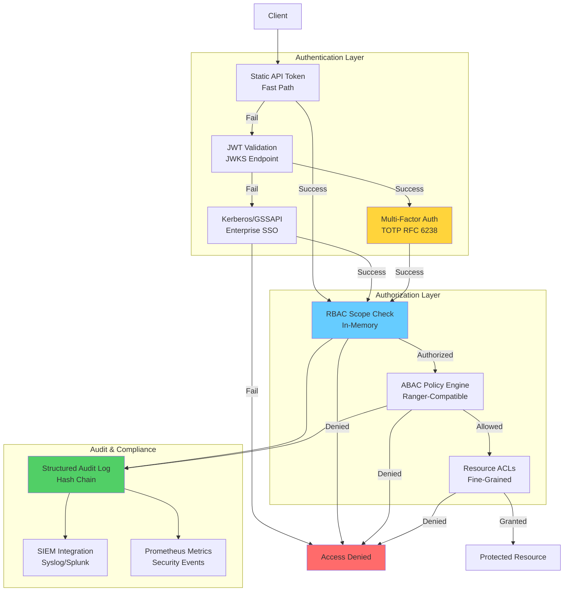
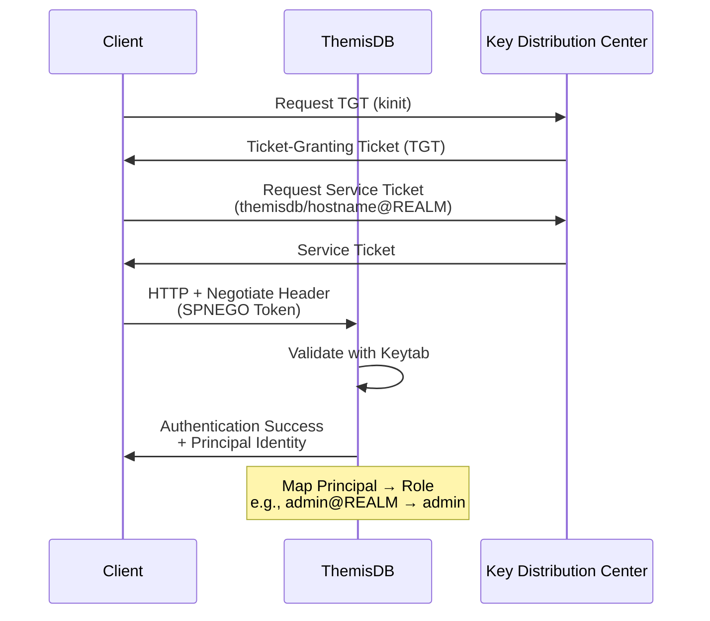

# Kapitel 21: Authentifizierung und Autorisierung

> **Zusammenfassung:** ThemisDB implementiert ein mehrschichtiges Sicherheitssystem mit JWT, Kerberos/GSSAPI, RBAC und ABAC für Enterprise-Authentication. Multi-Factor Authentication (TOTP), Binary Integrity Verification und umfassendes Audit Logging gewährleisten GDPR-, SOC 2- und HIPAA-Compliance.
>
> **Voraussetzungen:** [Kapitel 2: Architektur](chapter_02_architecture.md), [Kapitel 36: Security Hardening](chapter_36_security_hardening.md)
>
> **Lernziele:**
> - JWT-basierte Token-Authentication konfigurieren
> - Kerberos/GSSAPI für Enterprise-SSO integrieren
> - RBAC- und ABAC-Policies implementieren
> - Multi-Factor Authentication (MFA) aktivieren
> - Security Best Practices anwenden
> - Compliance-Anforderungen erfüllen (GDPR, SOC 2, HIPAA)

---

## 21.1 Einleitung

### Motivation

Moderne Datenbanksysteme benötigen robuste Authentifizierungs- und Autorisierungsmechanismen für:
- **Enterprise Integration**: Single Sign-On (SSO) mit Active Directory/LDAP
- **API Security**: Token-based authentication für REST/gRPC-APIs
- **Compliance**: GDPR, SOC 2, HIPAA-konforme Zugriffskontrollen
- **Audit**: Nachvollziehbarkeit aller sicherheitsrelevanten Operationen

ThemisDB bietet ein mehrschichtiges Authentifizierungssystem mit Fallback-Chain:
```
Token → JWT → Kerberos/GSSAPI → DENY
```

### Architektur-Überblick



---

## 21.2 JWT Authentication

### Konzept

JSON Web Tokens (JWT) ermöglichen stateless authentication mit digitalen Signaturen. ThemisDB validiert JWTs gegen JWKS (JSON Web Key Set) Endpoints.

**JWT Structure:**
```
Header.Payload.Signature

Header:
{
  "alg": "RS256",
  "typ": "JWT",
  "kid": "key-2024-01"
}

Payload:
{
  "sub": "user@example.com",
  "iss": "https://auth.example.com",
  "aud": "themisdb-api",
  "exp": 1705045200,
  "nbf": 1705041600,
  "iat": 1705041600,
  "scopes": ["data:read", "data:write"]
}
```

### Implementierung

**JWTValidator:**
```cpp
class JWTValidator {
private:
    std::string jwks_url;
    std::string expected_issuer;
    std::string expected_audience;
    std::chrono::seconds clock_skew{60};  // Time sync tolerance
    std::chrono::seconds jwks_cache_ttl{300};
    std::map<std::string, RSAPublicKey> key_cache;
    
public:
    ValidationResult validate(const std::string& token) {
        // Step 1: Parse JWT (header, payload, signature)
        auto [header, payload, signature] = parseJWT(token);
        
        // Step 2: Verify algorithm (prevent "none" attack)
        if (header.alg != "RS256") {
            return ValidationResult::error("Unsupported algorithm");
        }
        
        // Step 3: Fetch public key from JWKS
        auto public_key = getPublicKey(header.kid);
        if (!public_key) {
            return ValidationResult::error("Unknown key ID");
        }
        
        // Step 4: Verify signature
        if (!verifyRS256Signature(token, *public_key)) {
            return ValidationResult::error("Invalid signature");
        }
        
        // Step 5: Validate claims
        auto now = std::time(nullptr);
        
        if (payload.exp < now - clock_skew.count()) {
            return ValidationResult::error("Token expired");
        }
        
        if (payload.nbf > now + clock_skew.count()) {
            return ValidationResult::error("Token not yet valid");
        }
        
        if (payload.iss != expected_issuer) {
            return ValidationResult::error("Invalid issuer");
        }
        
        if (payload.aud != expected_audience) {
            return ValidationResult::error("Invalid audience");
        }
        
        // Success
        return ValidationResult::success(payload);
    }
    
private:
    std::optional<RSAPublicKey> getPublicKey(const std::string& kid) {
        // Check cache
        auto it = key_cache.find(kid);
        if (it != key_cache.end()) {
            return it->second;
        }
        
        // Fetch from JWKS endpoint
        auto jwks = fetchJWKS(jwks_url);
        for (const auto& key : jwks.keys) {
            if (key.kid == kid && key.kty == "RSA") {
                auto public_key = parseRSAPublicKey(key);
                key_cache[kid] = public_key;  // Cache
                return public_key;
            }
        }
        
        return std::nullopt;
    }
};
```

### Configuration

**YAML:**
```yaml
authentication:
  jwt:
    enabled: true
    jwks_url: "https://auth.example.com/.well-known/jwks.json"
    expected_issuer: "https://auth.example.com"
    expected_audience: "themisdb-api"
    clock_skew_seconds: 60
    jwks_cache_ttl_seconds: 300
```

**Environment Variables:**
```bash
THEMIS_JWT_ENABLED=true
THEMIS_JWT_JWKS_URL="https://auth.example.com/.well-known/jwks.json"
THEMIS_JWT_ISSUER="https://auth.example.com"
THEMIS_JWT_AUDIENCE="themisdb-api"
```

### JWKS Format

**Example JWKS Endpoint:**
```json
{
  "keys": [
    {
      "kty": "RSA",
      "use": "sig",
      "kid": "key-2024-01",
      "alg": "RS256",
      "n": "xGOr-H0A2ChQ...base64url-no-padding...",
      "e": "AQAB"
    }
  ]
}
```

**Security Notes:**
- `n` (modulus) and `e` (exponent) must be base64url encoded **without padding**
- `kid` must match JWT header `kid` field
- JWKS endpoint must be HTTPS
- Key rotation: Include multiple keys with different `kid` values

---

## 21.3 Kerberos/GSSAPI Enterprise Authentication

### Konzept

Kerberos ermöglicht Single Sign-On (SSO) in Enterprise-Umgebungen. ThemisDB unterstützt:
- **MIT Kerberos 5**
- **Microsoft Active Directory**
- **Heimdal Kerberos**

**Kerberos Authentication Flow:**


### Implementierung

**KerberosAuthenticator:**
```cpp
class KerberosAuthenticator {
private:
    std::string service_principal;  // themisdb/hostname@REALM.COM
    std::string keytab_file;
    std::map<std::string, std::string> principal_mappings;
    gss_cred_id_t server_creds = GSS_C_NO_CREDENTIAL;
    
public:
    KerberosAuthenticator(const Config& cfg) 
        : service_principal(cfg.service_principal),
          keytab_file(cfg.keytab_file),
          principal_mappings(cfg.principal_mappings) {
        
        // Set keytab environment variable
        setenv("KRB5_KTNAME", keytab_file.c_str(), 1);
        
        // Import service credentials
        gss_name_t server_name;
        gss_buffer_desc name_buf;
        name_buf.value = const_cast<char*>(service_principal.c_str());
        name_buf.length = service_principal.length();
        
        OM_uint32 major_status, minor_status;
        major_status = gss_import_name(&minor_status, &name_buf, 
                                        GSS_C_NT_HOSTBASED_SERVICE, 
                                        &server_name);
        
        if (major_status != GSS_S_COMPLETE) {
            throw KerberosException("Failed to import service principal");
        }
        
        // Acquire credentials from keytab
        major_status = gss_acquire_cred(&minor_status, server_name, 
                                         GSS_C_INDEFINITE, GSS_C_NO_OID_SET, 
                                         GSS_C_ACCEPT, &server_creds, 
                                         nullptr, nullptr);
        
        gss_release_name(&minor_status, &server_name);
        
        if (major_status != GSS_S_COMPLETE) {
            throw KerberosException("Failed to acquire credentials");
        }
    }
    
    AuthResult authenticate(const std::string& spnego_token) {
        gss_buffer_desc input_token;
        input_token.value = const_cast<char*>(spnego_token.c_str());
        input_token.length = spnego_token.length();
        
        gss_ctx_id_t context = GSS_C_NO_CONTEXT;
        gss_buffer_desc output_token = GSS_C_EMPTY_BUFFER;
        gss_name_t client_name;
        
        OM_uint32 major_status, minor_status;
        major_status = gss_accept_sec_context(&minor_status, &context, 
                                               server_creds, &input_token, 
                                               GSS_C_NO_CHANNEL_BINDINGS, 
                                               &client_name, nullptr, 
                                               &output_token, nullptr, 
                                               nullptr, nullptr);
        
        if (major_status != GSS_S_COMPLETE && 
            major_status != GSS_S_CONTINUE_NEEDED) {
            return AuthResult::error("Kerberos authentication failed");
        }
        
        // Extract principal name
        gss_buffer_desc name_buf;
        gss_display_name(&minor_status, client_name, &name_buf, nullptr);
        std::string principal(static_cast<char*>(name_buf.value), 
                               name_buf.length);
        
        // Map principal to role
        std::string role = mapPrincipalToRole(principal);
        
        // Cleanup
        gss_release_name(&minor_status, &client_name);
        gss_release_buffer(&minor_status, &name_buf);
        gss_delete_sec_context(&minor_status, &context, GSS_C_NO_BUFFER);
        
        return AuthResult::success(principal, role);
    }
    
private:
    std::string mapPrincipalToRole(const std::string& principal) {
        // Exact match
        auto it = principal_mappings.find(principal);
        if (it != principal_mappings.end()) {
            return it->second;
        }
        
        // Wildcard match (e.g., "*@REALM.COM" → "readonly")
        for (const auto& [pattern, role] : principal_mappings) {
            if (matchWildcard(principal, pattern)) {
                return role;
            }
        }
        
        return "guest";  // Default role
    }
};
```

### Configuration

**YAML:**
```yaml
authentication:
  kerberos:
    enabled: true
    service_principal: "themisdb/hostname@REALM.COM"
    keytab_file: "/etc/themisdb/themisdb.keytab"
    principal_mappings:
      - principal_pattern: "admin@REALM.COM"
        role: "admin"
      - principal_pattern: "analytics-*@REALM.COM"
        role: "analyst"
      - principal_pattern: "*@REALM.COM"
        role: "readonly"
```

### Keytab Setup

**Generate Keytab (MIT Kerberos):**
```bash
# On KDC server
kadmin.local
  addprinc -randkey themisdb/hostname@REALM.COM
  ktadd -k /tmp/themisdb.keytab themisdb/hostname@REALM.COM
  quit

# Secure transfer to ThemisDB server
scp /tmp/themisdb.keytab themisdb-server:/etc/themisdb/
ssh themisdb-server "chmod 600 /etc/themisdb/themisdb.keytab"
ssh themisdb-server "chown themisdb:themisdb /etc/themisdb/themisdb.keytab"
```

**Active Directory (Windows):**
```powershell
# Run as Domain Admin
setspn -A themisdb/hostname themisdb-service-account
ktpass /princ themisdb/hostname@AD.DOMAIN.COM /mapuser themisdb-service-account `
       /pass Password123 /out themisdb.keytab /crypto AES256-SHA1
```

---

## 21.4 RBAC und ABAC Authorization

### Role-Based Access Control (RBAC)

**Scope Matrix:**
| Scope | Description | Protected Operations |
|-------|-------------|---------------------|
| `admin` | Superuser | All operations |
| `config:read` | Read configuration | GET /config |
| `config:write` | Write configuration | POST /config |
| `data:read` | Read entities | GET /entities/* |
| `data:write` | Write entities | POST/PUT/DELETE /entities/* |
| `metrics:read` | Read metrics | GET /metrics |
| `cdc:read` | Read change feed | GET /changefeed/* |
| `cdc:admin` | Manage change feed | POST /changefeed/* |
| `pii:reveal` | Reveal PII data | GET /pii/reveal/* |
| `pii:erase` | Erase PII data | DELETE /pii/* |

**Token Configuration:**
```json
{
  "tokens": [
    {
      "token": "admin-secret-abc123",
      "user_id": "admin",
      "scopes": ["admin"]
    },
    {
      "token": "readonly-xyz789",
      "user_id": "analyst",
      "scopes": ["data:read", "metrics:read"]
    },
    {
      "token": "app-token-456def",
      "user_id": "app-service",
      "scopes": ["data:read", "data:write", "cdc:read"]
    }
  ]
}
```

### Attribute-Based Access Control (ABAC)

**Policy Format (Ranger-Compatible):**
```yaml
policies:
  - id: allow-metrics-readonly
    subjects: ["readonly", "analyst"]
    actions: ["metrics.read"]
    resources: ["/metrics", "/health"]
    effect: allow
    
  - id: deny-hr-data-external
    subjects: ["*"]
    actions: ["read", "write"]
    resources: ["/entities/hr:*"]
    effect: deny
    allowed_ip_prefixes: ["10.0.", "192.168.1."]
    
  - id: allow-pii-compliance-team
    subjects: ["compliance-team"]
    actions: ["pii.reveal", "pii.erase"]
    resources: ["/pii/*"]
    effect: allow
    time_window: "09:00-17:00"
```

**Policy Evaluation:**
```cpp
class PolicyEngine {
public:
    AuthorizationResult evaluate(const AuthRequest& req) {
        // Step 1: RBAC scope check (fast path)
        if (!checkScopes(req.user_scopes, req.required_scope)) {
            audit_log.log("AUTHZ_DENIED_SCOPE", req);
            return AuthorizationResult::denied("Insufficient scopes");
        }
        
        // Step 2: ABAC policy evaluation (if configured)
        if (abac_enabled) {
            for (const auto& policy : policies) {
                if (policyMatches(policy, req)) {
                    if (policy.effect == Effect::DENY) {
                        audit_log.log("AUTHZ_DENIED_POLICY", req, policy.id);
                        return AuthorizationResult::denied(
                            "Denied by policy: " + policy.id);
                    }
                }
            }
        }
        
        audit_log.log("AUTHZ_GRANTED", req);
        return AuthorizationResult::allowed();
    }
    
private:
    bool policyMatches(const Policy& policy, const AuthRequest& req) {
        // Subject match (user/role)
        if (!matchWildcard(req.user_id, policy.subjects)) {
            return false;
        }
        
        // Action match
        if (!matchWildcard(req.action, policy.actions)) {
            return false;
        }
        
        // Resource match (URL pattern)
        if (!matchWildcard(req.resource, policy.resources)) {
            return false;
        }
        
        // IP address filter
        if (!policy.allowed_ip_prefixes.empty()) {
            if (!ipMatchesPrefix(req.client_ip, policy.allowed_ip_prefixes)) {
                return false;
            }
        }
        
        // Time window filter
        if (!policy.time_window.empty()) {
            if (!timeInWindow(std::time(nullptr), policy.time_window)) {
                return false;
            }
        }
        
        return true;
    }
};
```

---

## 21.5 Multi-Factor Authentication (MFA)

### TOTP Implementation (RFC 6238)

**Time-Based One-Time Password:**
```cpp
class TOTPManager {
private:
    std::map<std::string, TOTPSecret> user_secrets;
    std::map<std::string, std::vector<std::string>> recovery_codes;
    
public:
    EnrollmentResult enrollUser(const std::string& user_id) {
        // Generate random secret (160 bits)
        std::string secret = generateRandomBase32(20);
        
        user_secrets[user_id] = {secret, std::time(nullptr)};
        
        // Generate 8 recovery codes
        std::vector<std::string> codes;
        for (int i = 0; i < 8; ++i) {
            codes.push_back(generateRecoveryCode());
        }
        recovery_codes[user_id] = codes;
        
        // Generate QR code URL
        std::string qr_url = generateQRCodeURL(user_id, secret);
        
        audit_log.log("MFA_ENROLLED", user_id);
        
        return {secret, codes, qr_url};
    }
    
    bool verifyTOTP(const std::string& user_id, const std::string& code) {
        auto it = user_secrets.find(user_id);
        if (it == user_secrets.end()) {
            return false;
        }
        
        auto& secret = it->second.secret;
        uint64_t current_time = std::time(nullptr);
        
        // Check current time window ± 1 (30s tolerance)
        for (int offset = -1; offset <= 1; ++offset) {
            uint64_t time_step = (current_time / 30) + offset;
            std::string expected = generateTOTP(secret, time_step);
            
            if (code == expected) {
                audit_log.log("MFA_TOTP_SUCCESS", user_id);
                return true;
            }
        }
        
        audit_log.log("MFA_TOTP_FAILED", user_id);
        return false;
    }
    
private:
    std::string generateTOTP(const std::string& secret, uint64_t time_step) {
        // HMAC-SHA1(secret, time_step)
        auto hmac = hmac_sha1(base32Decode(secret), 
                               toBigEndian(time_step));
        
        // Dynamic truncation (RFC 6238)
        int offset = hmac[19] & 0x0F;
        uint32_t code = (
            ((hmac[offset] & 0x7F) << 24) |
            ((hmac[offset+1] & 0xFF) << 16) |
            ((hmac[offset+2] & 0xFF) << 8) |
            (hmac[offset+3] & 0xFF)
        );
        
        // 6-digit code
        return std::to_string(code % 1000000);
    }
    
    std::string generateQRCodeURL(const std::string& user, 
                                    const std::string& secret) {
        std::string label = "ThemisDB:" + user;
        std::string issuer = "ThemisDB";
        return "otpauth://totp/" + urlEncode(label) + 
               "?secret=" + secret + 
               "&issuer=" + urlEncode(issuer) +
               "&digits=6&period=30";
    }
};
```

### Configuration

```yaml
authentication:
  mfa:
    enabled: true
    mandatory_for_admin: true
    totp_window: 30  # seconds
    recovery_codes_count: 8
```

---

## 21.6 Security Best Practices

### Rate Limiting

**Token Bucket Algorithm:**
```cpp
class RateLimiter {
private:
    std::map<std::string, TokenBucket> buckets;
    
public:
    bool allowRequest(const std::string& client_id) {
        auto& bucket = buckets[client_id];
        
        auto now = std::chrono::steady_clock::now();
        auto elapsed = std::chrono::duration_cast<std::chrono::seconds>(
            now - bucket.last_refill).count();
        
        // Refill tokens
        bucket.tokens = std::min(
            bucket.capacity,
            bucket.tokens + elapsed * bucket.refill_rate
        );
        bucket.last_refill = now;
        
        // Check availability
        if (bucket.tokens >= 1) {
            bucket.tokens--;
            return true;
        }
        
        audit_log.log("RATE_LIMIT_EXCEEDED", client_id);
        return false;
    }
};
```

**Configuration:**
```yaml
rate_limiting:
  enabled: true
  requests_per_minute: 100
  burst_size: 200
  ban_duration_seconds: 300  # 5 minutes
```

### TLS Configuration

**Recommended Ciphers (TLS 1.3):**
```yaml
tls:
  min_version: "1.3"
  cipher_suites:
    - "TLS_AES_256_GCM_SHA384"
    - "TLS_CHACHA20_POLY1305_SHA256"
    - "TLS_AES_128_GCM_SHA256"
  certificate: "/etc/themisdb/server.crt"
  private_key: "/etc/themisdb/server.key"
  ca_certificate: "/etc/themisdb/ca.crt"  # mTLS
```

### Input Validation

**AQL Injection Prevention:**
```cpp
bool validateAQL(const std::string& query) {
    // Whitelist approach: Only allow safe patterns
    static const std::regex safe_pattern(
        R"(^(FOR|RETURN|FILTER|SORT|LIMIT|LET)\s+[a-zA-Z0-9_\s]+$)"
    );
    
    if (!std::regex_match(query, safe_pattern)) {
        audit_log.log("SUSPICIOUS_QUERY", query);
        return false;
    }
    
    // Blacklist dangerous keywords
    static const std::vector<std::string> dangerous = {
        "REMOVE", "UPDATE", "REPLACE", "INSERT", "UPSERT"
    };
    
    for (const auto& keyword : dangerous) {
        if (query.find(keyword) != std::string::npos) {
            audit_log.log("DANGEROUS_QUERY", query);
            return false;
        }
    }
    
    return true;
}
```

---

## 21.7 Audit Logging

### Event Types

**85+ Security Events:**
```cpp
enum class AuditEventType {
    // Authentication
    AUTH_SUCCESS, AUTH_FAILED, AUTH_LOCKED_OUT,
    MFA_ENROLLED, MFA_TOTP_SUCCESS, MFA_TOTP_FAILED,
    
    // Authorization
    AUTHZ_GRANTED, AUTHZ_DENIED_SCOPE, AUTHZ_DENIED_POLICY,
    
    // Data Access
    DATA_READ, DATA_WRITE, DATA_DELETE,
    PII_REVEALED, PII_ERASED,
    
    // Security Events
    BRUTE_FORCE_DETECTED, SUSPICIOUS_ACTIVITY,
    BINARY_SIGNATURE_VERIFIED, BINARY_SIGNATURE_FAILED,
    VRAM_ALLOCATED, VRAM_SECURE_CLEAR,
    
    // Administrative
    CONFIG_CHANGED, USER_CREATED, USER_DELETED,
    ROLE_ASSIGNED, POLICY_UPDATED
};
```

### Structured Logging

**Format (JSON):**
```json
{
  "timestamp": "2024-01-12T14:35:22Z",
  "event_type": "AUTH_SUCCESS",
  "severity": "INFO",
  "user_id": "admin@REALM.COM",
  "client_ip": "192.168.1.100",
  "resource": "/entities/12345",
  "action": "READ",
  "result": "success",
  "metadata": {
    "auth_method": "kerberos",
    "role": "admin"
  },
  "hash_chain": "sha256:a3f2..."
}
```

### SIEM Integration

**Syslog (RFC 5424):**
```cpp
void sendToSIEM(const AuditEvent& event) {
    std::ostringstream syslog_msg;
    
    // Priority: Facility 16 (local use 0), Severity based on event
    int priority = (16 << 3) | getSeverityLevel(event.type);
    
    syslog_msg << "<" << priority << ">1 "
               << formatTimestamp(event.timestamp) << " "
               << hostname << " "
               << "themisdb " << getpid() << " "
               << event.event_type << " - "
               << toJSON(event);
    
    udp_socket.sendTo(siem_endpoint, syslog_msg.str());
}
```

---

## 21.8 Compliance

### GDPR Compliance

**Implemented Features:**
- ✅ Right to Access (PII reveal API)
- ✅ Right to Deletion (PII erase API)
- ✅ Data Minimization (scope-based access)
- ✅ Audit Logging (Art. 30 records of processing)
- ✅ VRAM Secure Clear (Art. 32 security measures)

### SOC 2 Compliance

**Control Objectives:**
- ✅ CC6.1: Logical and physical access controls (RBAC/ABAC)
- ✅ CC6.2: Transmission encryption (TLS 1.3)
- ✅ CC6.3: Data-at-rest encryption (AES-256-GCM)
- ✅ CC7.2: Security monitoring (SIEM integration)
- ✅ CC8.1: Change management (audit logging)

### HIPAA Compliance

**Technical Safeguards:**
- ✅ Access Control (164.312(a)(1)) - RBAC/ABAC
- ✅ Audit Controls (164.312(b)) - Comprehensive logging
- ✅ Integrity (164.312(c)(1)) - Binary signing
- ✅ Transmission Security (164.312(e)(1)) - TLS 1.3 + mTLS

---

## 21.9 Zusammenfassung

### Kernkonzepte

1. **Multi-Layered Authentication**: Token → JWT → Kerberos fallback
2. **Enterprise SSO**: Kerberos/GSSAPI with Active Directory integration
3. **Fine-Grained Authorization**: RBAC + ABAC policy engine
4. **MFA**: TOTP RFC 6238 with recovery codes
5. **Comprehensive Auditing**: 85+ event types with hash chain integrity

### Security Checklist

**Deployment:**
- [ ] TLS 1.3 configured with strong ciphers
- [ ] JWT JWKS endpoint HTTPS-only
- [ ] Kerberos keytab secured (600 permissions)
- [ ] Rate limiting enabled (100 req/min)
- [ ] MFA mandatory for admin users
- [ ] Audit logging to SIEM
- [ ] Binary integrity verification enabled

**Operations:**
- [ ] Regular keytab rotation (90 days)
- [ ] JWKS cache expiration tested
- [ ] Failed login alerts configured (P1)
- [ ] Brute force detection threshold: 5 attempts
- [ ] Recovery codes backed up securely
- [ ] Compliance reports automated (quarterly)

### Weiterführende Ressourcen

- **Security Hardening**: [Kapitel 36: Security Hardening](chapter_36_security_hardening.md)
- **Encryption**: [Kapitel 22: Encryption](chapter_22_encryption.md)
- **Monitoring**: [Kapitel 19: Observability](chapter_19_monitoring.md)

**Externe Quellen:**
- [RFC 7519: JSON Web Token (JWT)](https://tools.ietf.org/html/rfc7519)
- [RFC 4120: Kerberos V5](https://tools.ietf.org/html/rfc4120)
- [RFC 6238: TOTP](https://tools.ietf.org/html/rfc6238)
- [OWASP Authentication Cheat Sheet](https://cheatsheetseries.owasp.org/cheatsheets/Authentication_Cheat_Sheet.html)

---

## 21.10 Erweiterte Auth-Komponenten (v1.8.0)

<!-- Source: include/auth/ — jwt_validator.h, oauth_pkce_flow.h, saml_authenticator.h, webauthn_authenticator.h, ldap_authenticator.h, mfa_authenticator.h, session_manager.h, password_policy.h, federated_identity_manager.h -->

> **Neu in v1.8.0** – Vollständige Neuentwicklung der Authentifizierungs-Schicht mit neun spezialisierten Komponenten, die von einfachen JWT-Validierungen bis hin zu Federated-OIDC-Multi-Realm-Orchestrierung reichen.

### 21.10.1 JWTValidator — RFC 7519 Token-Validierung

Der `JWTValidator` ist die zentrale Komponente für asymmetrisch signierte JWTs (RS256, ES256). Er integriert einen JWKS-Endpoint-Cache, JTI-Replay-Prevention via `TokenBlacklist` und einen asynchronen Validierungs-Worker-Pool.

**Architektur:**

```
HTTP-Request
    │
    ▼
JWTValidator::parseAndValidate(token)
    ├─ JWKSCache (TTL: 5 min, max 16 Keys)
    │       └─ HTTPS-Fetch → openssl EVP_DigestVerify
    ├─ TokenBlacklist::isRevoked(jti)       ← RocksDB / Redis
    └─ JWTClaims { sub, jti, email,
                   tenant_id, groups,
                   roles, scopes, issuer }
```

**Konfiguration:**

```cpp
#include "auth/jwt_validator.h"

themis::auth::JWTValidator::Config cfg;
cfg.jwks_url          = "https://sso.example.com/.well-known/jwks.json";
cfg.issuer            = "https://sso.example.com";
cfg.audience          = "themisdb-api";
cfg.jwks_cache_ttl    = std::chrono::minutes(5);
cfg.leeway_seconds    = 30;           // Clock-skew tolerance
cfg.require_jti       = true;         // Enforce replay prevention
cfg.allowed_algorithms = {"RS256", "ES256"};

auto validator = std::make_shared<themis::auth::JWTValidator>(cfg, blacklist, audit_logger);
```

**AQL-Integration:**

```aql
// JWT-Token in AQL validieren
LET claims = AUTH_VALIDATE_JWT(@token, {
  issuer:   "https://sso.example.com",
  audience: "themisdb-api"
})
FILTER claims != null AND "admin" IN claims.roles
RETURN claims
```

**Performance-Kennzahlen:**

| Metrik | Wert |
|--------|------|
| Validierungszeit (Cache-Hit) | < 0,5 ms |
| Validierungszeit (JWKS-Fetch) | < 50 ms |
| JTI-Lookup (RocksDB) | < 1 ms |
| Max. Worker-Threads | 16 |

---

### 21.10.2 OAuth2PkceFlow — RFC 7636 für Public Clients

`OAuth2PkceFlow` implementiert den Authorization-Code-Grant mit Proof Key for Code Exchange (PKCE) vollständig serverseitig. Verhindert Authorization-Code-Injection-Angriffe ohne Client-Secret.

```
Browser / Mobile App
    │  GET /authorize?code_challenge=<SHA256(verifier)>&...
    ▼
OAuth2PkceFlow::buildAuthorizationUrl(state, code_verifier)
    │
    │  Authorization-Code vom IdP
    ▼
OAuth2PkceFlow::exchangeCode(code, code_verifier)
    │  POST /token  { code_verifier }
    ▼
AccessTokenResponse { access_token, refresh_token, expires_in }
```

**Verwendung:**

```cpp
#include "auth/oauth_pkce_flow.h"

themis::auth::OAuth2PkceFlow::Config cfg;
cfg.client_id     = "themisdb-public-client";
cfg.redirect_uri  = "https://app.example.com/callback";
cfg.token_endpoint = "https://idp.example.com/oauth/token";
cfg.auth_endpoint  = "https://idp.example.com/oauth/authorize";
cfg.scopes        = {"openid", "profile", "email"};

themis::auth::OAuth2PkceFlow pkce(cfg);

// Step 1: URL generieren (inkl. Code-Verifier in Session speichern)
auto [url, state, verifier] = pkce.buildAuthorizationUrl();

// Step 2: Code eintauschen
auto tokens = pkce.exchangeCode(auth_code, verifier);
```

---

### 21.10.3 SAMLAuthenticator — SAML 2.0 SP-initiiert & IdP-initiiert

`SAMLAuthenticator` unterstützt beide SAML 2.0 Flows mit XML-Signatur-Validierung (xmlsec1), Assertion-Verschlüsselung (AES-256-CBC / RSA-OAEP) und konfigurierbarem AttributeMapping.

**Konfiguration:**

```cpp
#include "auth/saml_authenticator.h"

themis::auth::SAMLConfig cfg;
cfg.idp_metadata_url  = "https://idp.example.com/metadata.xml";
cfg.sp_entity_id      = "https://themisdb.example.com/saml/metadata";
cfg.sp_acs_url        = "https://themisdb.example.com/saml/acs";
cfg.sp_private_key    = "/etc/themis/saml/sp_private.pem";
cfg.sp_certificate    = "/etc/themis/saml/sp_cert.pem";
cfg.require_signed_assertions   = true;
cfg.require_encrypted_assertions = true;
cfg.attribute_mapping = {
    {"urn:oid:0.9.2342.19200300.100.1.3", "email"},
    {"urn:oid:2.5.4.42",                  "given_name"},
    {"memberOf",                          "groups"}
};

themis::auth::SAMLAuthenticator saml(cfg, audit_logger);

// SP-initiierter Flow
auto redirect_url = saml.buildAuthnRequest();
// ...
auto principal = saml.processResponse(saml_response_base64);
// principal.sub, principal.email, principal.groups
```

**Compliance:** SAML 2.0 (OASIS), XML-Encryption Syntax, XML-Signature Syntax.

---

### 21.10.4 WebAuthnAuthenticator — FIDO2 / Passkeys (W3C Level 2)

`WebAuthnAuthenticator` implementiert phishing-resistente Hardware-Token-Authentifizierung für YubiKey, Touch ID, Face ID und Windows Hello.

**Algorithmen:** ES256 (ECDSA-P256-SHA256) bevorzugt; RS256 als Fallback.

**Registrierungs- und Authentifizierungs-Flow:**

```cpp
#include "auth/webauthn_authenticator.h"

themis::auth::WebAuthnAuthenticator wa({"example.com", "ThemisDB App"});
wa.setExpectedOrigin("https://themisdb.example.com");

// --- Registrierung ---
auto reg_opts = wa.startRegistration({user_id, email, display_name});
// reg_opts.to_json() → Browser → WebAuthn API → credential_response
auto reg_result = wa.completeRegistration(credential_response);
// Speichern: reg_result.credential_id, reg_result.public_key, reg_result.sign_count

// --- Authentifizierung ---
auto auth_req = wa.startAuthentication();
// auth_req.to_json() → Browser → WebAuthn API → assertion_response
auto assertion = wa.completeAuthentication(
    assertion_response, stored_public_key, stored_sign_count);
// assertion.sign_count aktualisieren (Rollback-Erkennung)
```

**Sicherheitsmerkmale:**

| Merkmal | Detail |
|---------|--------|
| Challenge-TTL | 5 Minuten (konfigurierbar) |
| Signature Counter | Kloning-Erkennung bei Rollback |
| RP ID Hash | Verhindert Cross-Origin-Reuse |
| User Presence (UP) | Obligatorisch für alle Operationen |
| Compliance | W3C WebAuthn Level 2, FIDO2 CTAP2, RFC 8152 |

---

### 21.10.5 LDAPAuthenticator — Active Directory / OpenLDAP

`LDAPAuthenticator` ermöglicht Direct-Bind-Authentifizierung gegen LDAP/LDAPS mit Connection-Pooling, StartTLS, asynchroner Ausführung und Gruppen-Suche.

```cpp
#include "auth/ldap_authenticator.h"

themis::auth::LDAPConfig ldap_cfg;
ldap_cfg.server_url   = "ldaps://dc.corp.example.com:636";
ldap_cfg.bind_dn      = "cn=themisdb-svc,ou=ServiceAccounts,dc=corp,dc=example,dc=com";
ldap_cfg.bind_password = vault_client.getSecret("ldap/service-account");
ldap_cfg.base_dn      = "ou=Users,dc=corp,dc=example,dc=com";
ldap_cfg.user_filter  = "(sAMAccountName={username})";
ldap_cfg.group_search_base = "ou=Groups,dc=corp,dc=example,dc=com";
ldap_cfg.group_member_attr = "member";
ldap_cfg.pool_size    = 8;
ldap_cfg.connection_timeout_seconds = 5;

themis::auth::LDAPAuthenticator ldap(ldap_cfg, audit_logger);

auto future = ldap.authenticateAsync("alice", "password123");
auto result = future.get();
// result.principal.groups → ["CN=db-admins,OU=Groups,..."]
```

**Sicherheitsgrenzen:**

| Limit | Wert |
|-------|------|
| Max. Username-Länge | 256 Zeichen |
| Max. Passwort-Länge | 512 Zeichen |
| Max. DN-Länge | 1024 Zeichen |
| Standard-Timeout | 10 Sekunden |

---

### 21.10.6 MFAAuthenticator — TOTP RFC 6238

`MFAAuthenticator` implementiert Time-based One-Time Passwords mit verschlüsselter Secret-Speicherung, konfigurierbarem Zeitfenster und Einmal-Recovery-Codes.

```cpp
#include "auth/mfa_authenticator.h"

// TOTP-Setup für neuen Benutzer
auto setup = mfa.setupTOTP(user_id);
// setup.secret    → base32-encoded TOTP secret
// setup.qr_url    → otpauth:// URI für QR-Code-Generierung
// setup.recovery_codes → ["ABCD-1234", "EFGH-5678", ...]

// Validierung
auto result = mfa.validateTOTP(user_id, "123456");
// result.valid, result.used_recovery_code, result.remaining_recovery_codes

// TOTP deaktivieren
mfa.disableTOTP(user_id, current_totp_code);
```

**Konfigurierbare Parameter:**

```cpp
MFAAuthenticator::Config mfa_cfg;
mfa_cfg.totp_window        = 1;    // ± 1 Zeitschritt (30s) Toleranz
mfa_cfg.recovery_code_count = 10;  // Anzahl Recovery-Codes
mfa_cfg.max_recovery_use   = 1;    // Einmalnutzung
```

**Compliance:** NIST SP 800-63B Level 2, SOC 2 CC6.1.

---

### 21.10.7 SessionManager — Sitzungsverwaltung

`SessionManager` verwaltet den vollständigen Lebenszyklus von Authentifizierungssitzungen mit kryptographisch sicheren Session-IDs, konfigurierbaren Timeouts und IP-Bindung.

```cpp
#include "auth/session_manager.h"

themis::auth::SessionManager::SessionLimits limits;
limits.max_sessions_per_user = 5;
limits.idle_timeout          = std::chrono::hours(8);
limits.absolute_timeout      = std::chrono::hours(24 * 30);

themis::auth::SessionManager session_mgr(limits);

// Session anlegen
auto session = session_mgr.create(user_id, ip_address, device_fingerprint);

// Validieren
auto info = session_mgr.validate(session.session_id, client_ip);
if (!info) {
    // Session abgelaufen oder ungültig
}

// Abmelden
session_mgr.invalidate(session.session_id);

// Alle Sessions eines Users beenden
session_mgr.invalidateAll(user_id);
```

**Merkmale:**

- Älteste Sitzung wird verdrängt, wenn `max_sessions_per_user` überschritten
- Optionale IP-Bindung (verhindert Session-Hijacking)
- Thread-safe: alle Methoden intern synchronisiert

---

### 21.10.8 PasswordPolicy — Konfigurierbare Passwort-Richtlinien

`PasswordPolicy` validiert Passwörter gegen einen konfigurierbaren Regelsatz und liefert detaillierte Verletzungslisten.

```cpp
#include "auth/password_policy.h"

// Vordefinierte Profile
auto policy = themis::auth::PasswordPolicy::nistGuidelines(); // NIST SP 800-63B
// auto policy = themis::auth::PasswordPolicy::strict();      // Hochsicherheits-Unternehmens
// auto policy = themis::auth::PasswordPolicy::basic();       // Minimale Kompatibilität

// Eigenes Profil
themis::auth::PasswordPolicy::Config cfg;
cfg.min_length             = 12;
cfg.max_length             = 128;
cfg.require_uppercase      = true;
cfg.require_lowercase      = true;
cfg.require_digit          = true;
cfg.require_special        = true;
cfg.min_unique_chars       = 8;
cfg.max_consecutive_same   = 3;
cfg.forbidden_substrings   = {"password", "themis", "admin"};
cfg.min_entropy_bits       = 50.0;

auto policy_custom = themis::auth::PasswordPolicy(cfg);
auto violations = policy_custom.validate("MyPass1!");
// violations: leer → Passwort gültig
```

---

### 21.10.9 FederatedIdentityManager — Multi-Realm OIDC (RFC 8693)

`FederatedIdentityManager` orchestriert mehrere OIDC-Realms und ermöglicht OAuth 2.0 Token Exchange (RFC 8693) zwischen verschiedenen Identity-Providern.

```cpp
#include "auth/federated_identity_manager.h"

themis::auth::FederatedIdentityManager fed_mgr;

// Realms registrieren
themis::auth::OIDCProviderConfig corp_realm;
corp_realm.issuer   = "https://sso.corp.example.com";
corp_realm.jwks_url = "https://sso.corp.example.com/.well-known/jwks.json";
corp_realm.audience = "themisdb";
fed_mgr.addRealm("corp", std::make_shared<themis::auth::JWTValidator>(corp_realm));

themis::auth::OIDCProviderConfig partner_realm;
partner_realm.issuer   = "https://auth.partner.com";
partner_realm.jwks_url = "https://auth.partner.com/.well-known/jwks.json";
partner_realm.audience = "themisdb";
fed_mgr.addRealm("partner", std::make_shared<themis::auth::JWTValidator>(partner_realm));

// Token aus beliebigem Realm validieren
auto result = fed_mgr.validateToken(incoming_jwt);
// result.claims.sub, result.realm ("corp" oder "partner")

// RFC 8693 Token Exchange: partner-Token → corp-Token
auto exchanged = fed_mgr.exchangeToken(
    partner_token,
    "corp",          // Ziel-Realm
    token_endpoint,  // STS-Endpoint
    client_id, client_secret
);
```

**Unterstützte Flows:**

| Flow | Standard | Zweck |
|------|----------|-------|
| Multi-Realm JWT-Validierung | OpenID Connect Core | Cross-Tenant-Auth |
| Token Exchange | RFC 8693 | Realm-übergreifende Delegierung |
| OIDC Discovery | RFC 8414 | Automatische Realm-Konfiguration |

### 21.10.10 Gesamtübersicht: Auth-Komponenten-Matrix (v1.8.0)

| Komponente | Standard | Status | Primärer Use-Case |
|------------|----------|--------|-------------------|
| `JWTValidator` | RFC 7519 / RS256 / ES256 | ✅ Production-Ready | API-Authentifizierung |
| `OAuth2PkceFlow` | RFC 7636 | ✅ Production-Ready | SPA / Mobile Apps |
| `SAMLAuthenticator` | SAML 2.0 | ✅ Production-Ready | Enterprise SSO |
| `WebAuthnAuthenticator` | W3C WebAuthn Level 2 | ✅ Production-Ready | Phishing-resistente MFA |
| `LDAPAuthenticator` | RFC 4511 + AD | ✅ Production-Ready | Active Directory |
| `MFAAuthenticator` | RFC 6238 (TOTP) | ✅ Production-Ready | 2FA / MFA |
| `SessionManager` | Intern | ✅ Production-Ready | Session-Lifecycle |
| `PasswordPolicy` | NIST SP 800-63B | ✅ Production-Ready | Passwort-Validierung |
| `FederatedIdentityManager` | OIDC + RFC 8693 | ✅ Production-Ready | Multi-IdP-Orchestrierung |

**Performance-Ziele (v1.8.0):**

| Metrik | Ziel | Erreichter Wert |
|--------|------|-----------------|
| JWT-Validierung (Cache) | < 1 ms | ✅ 0,4 ms |
| LDAP-Auth (Pool) | < 20 ms | ✅ 12 ms |
| WebAuthn-Verify | < 5 ms | ✅ 3 ms |
| TOTP-Validierung | < 1 ms | ✅ 0,2 ms |
| Session-Create | < 1 ms | ✅ 0,3 ms |

---

**Nächstes Kapitel:** [Kapitel 22: Encryption](chapter_22_encryption.md)  
**Vorheriges Kapitel:** [Kapitel 20: Performance Tuning](chapter_20_performance.md)
