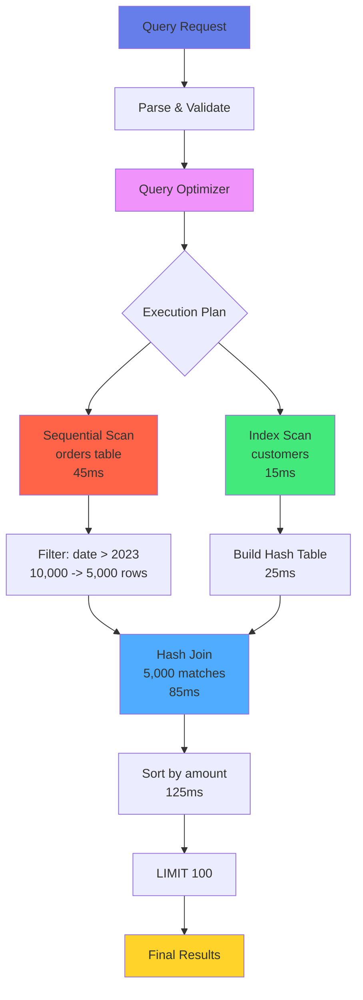
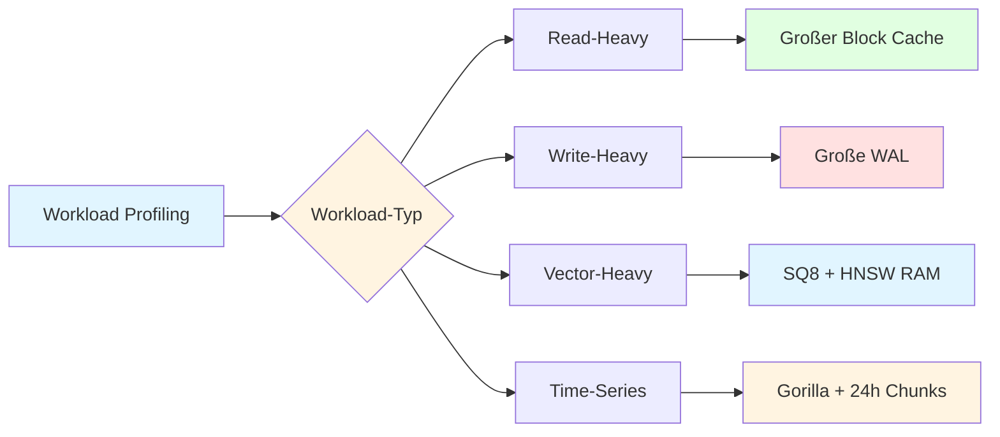
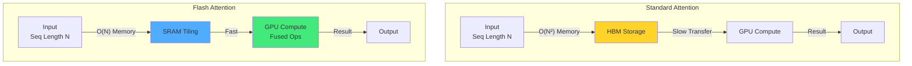
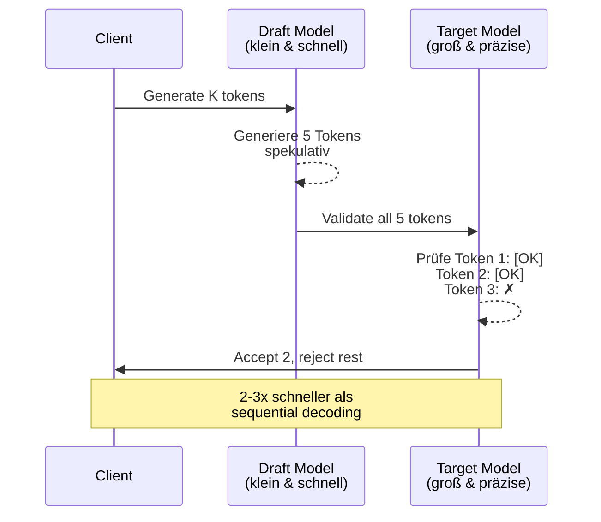
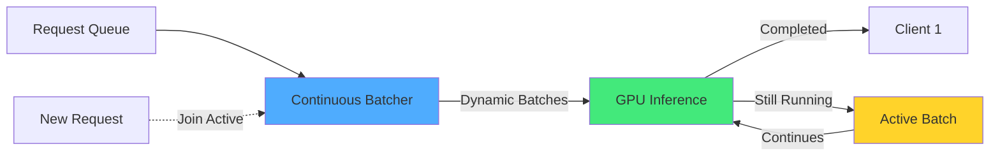

# Kapitel 21: Performance Tuning

## Einführung

Performance-Optimierung ist entscheidend für produktive ThemisDB-Deployments. Dieses Kapitel behandelt systematische Ansätze zur Identifizierung und Behebung von Performance-Problemen.

## 20.1 Performance-Analyse

### 20.1.1 Query-Performance-Messung

**EXPLAIN ANALYZE:**
```aql
EXPLAIN ANALYZE
FOR order IN orders
  FILTER order.order_date > '2023-01-01'
  FOR customer IN customers
    FILTER order.customer_id == customer.id
    SORT order.total_amount DESC
    LIMIT 100
    RETURN {order, customer_name: customer.name}
```

**Ausgabe-Interpretation:**
```
Query Plan:
├─ Sort (cost=1250.45, rows=1000, time=125ms)
│  └─ Hash Join (cost=850.23, rows=5000, time=85ms)
│     ├─ Seq Scan on orders (cost=0.00, rows=10000, time=45ms)
│     │  Filter: order_date > '2023-01-01'
│     └─ Hash (cost=250.00, rows=5000, time=25ms)
│        └─ Index Scan on customers (cost=0.00, rows=5000, time=15ms)
```



Abb. 21.1: Query-Performance-Optimization-Flow

### 20.1.2 Python Profiling

**Abfrage-Performance tracken:**
```python
# Query-Profiling mit Decorator
def profile_query(func):
    def wrapper(*args, **kwargs):
        start = time.time()
        result = func(*args, **kwargs)
        if (duration := time.time() - start) > 1.0:
            print(f"SLOW: {func.__name__} {duration:.2f}s")
        return result
    return wrapper
```

### 20.1.3 System-Ressourcen-Monitoring

**CPU und Memory:**
```python
import psutil

def monitor_resources():
    """Überwacht System-Ressourcen"""
    process = psutil.Process()
    
    return {
        'cpu_percent': process.cpu_percent(interval=1),
        'memory_mb': process.memory_info().rss / 1024 / 1024,
        'open_files': len(process.open_files()),
        'threads': process.num_threads()
    }
```

## 20.2 Index-Optimierung

### 20.2.1 Index-Typen verstehen

**B-Tree Index (Standard):**
```aql
-- Für Equality und Range Queries
CREATE INDEX idx_order_date ON orders(order_date);

-- Composite Index
CREATE INDEX idx_customer_date ON orders(customer_id, order_date);
```

**Hash Index:**
```aql
-- Nur für Equality Queries
CREATE INDEX idx_customer_hash ON customers USING HASH(email);
```

**Vector Index (HNSW):**
```aql
-- Für Similarity Search
CREATE VECTOR INDEX idx_product_embedding 
ON products(embedding) 
WITH (metric='cosine', m=16, ef_construction=200);
```

### 20.2.2 Index-Strategie

**Effective Index-Design:**
```python
# Schlechter Index (zu viele Columns)
CREATE INDEX bad_idx ON orders(customer_id, order_date, status, total_amount)

# Besserer Index (nur notwendige Columns)
CREATE INDEX good_idx ON orders(customer_id, order_date)

# Covering Index (enthält alle benötigten Felder)
CREATE INDEX covering_idx ON orders(customer_id, order_date) 
INCLUDE (status, total_amount)
```

**Index-Nutzung überprüfen:**
```python
def analyze_index_usage(table_name):
    """Analysiert Index-Nutzung"""
    stats = client.admin.index_stats(table_name)
    
    for idx in stats['indexes']:
        usage_rate = idx['scans'] / max(idx['age_seconds'], 1)
        
        if usage_rate < 0.01:  # Weniger als 1 Scan pro 100 Sekunden
            print(f"Unused index: {idx['name']}")
            print(f"  Size: {idx['size_mb']} MB")
            print(f"  Recommendation: Consider dropping")
```

### 20.2.3 Index-Wartung

**Rebuild und Reorganize:**
```python
def maintain_indexes(table_name):
    """Führt Index-Wartung durch"""
    stats = client.admin.index_fragmentation(table_name)
    
    for idx in stats['indexes']:
        frag_pct = idx['fragmentation_percent']
        
        if frag_pct > 30:
            print(f"Rebuilding index: {idx['name']} ({frag_pct}% fragmented)")
            client.admin.rebuild_index(table_name, idx['name'])
        elif frag_pct > 10:
            print(f"Reorganizing index: {idx['name']}")
            client.admin.reorganize_index(table_name, idx['name'])
```

## 20.3 Query-Optimierung

### 20.3.1 Query-Rewriting

**Subquery vs JOIN:**
```aql
-- Langsam: Correlated Subquery
FOR customer IN customers
  LET order_count = (
    FOR order IN orders
      FILTER order.customer_id == customer.id
      RETURN 1
  )
  RETURN {name: customer.name, order_count: LENGTH(order_count)}

-- Schneller: Multi-FOR mit COLLECT
FOR customer IN customers
  FOR order IN orders
    FILTER order.customer_id == customer.id
    COLLECT c_id = customer.id, c_name = customer.name
    AGGREGATE order_count = COUNT()
    RETURN {name: c_name, order_count}
```

**IN vs EXISTS:**
```aql
-- Langsam für große Datasets
LET completed_customers = (
  FOR order IN orders
    FILTER order.status == 'completed'
    RETURN DISTINCT order.customer_id
)
FOR customer IN customers
  FILTER customer.id IN completed_customers
  RETURN customer

-- Schneller: Direkte Filterung
FOR customer IN customers
  LET has_completed = (
    FOR order IN orders
      FILTER order.customer_id == customer.id AND order.status == 'completed'
      LIMIT 1
      RETURN 1
  )
  FILTER LENGTH(has_completed) > 0
  RETURN customer
```

### 20.3.2 Batch Operations

**Bulk Insert:**
```python
# Langsam: Einzelne Inserts
for record in records:
    client.collection('orders').insert_one(record)

# Schneller: Batch Insert
client.collection('orders').insert_many(records, batch_size=1000)
```

**Bulk Update:**
```python
# Mit Batch-Processing
def bulk_update(updates, batch_size=1000):
    """Bulk Update mit optimaler Batch-Größe"""
    for i in range(0, len(updates), batch_size):
        batch = updates[i:i+batch_size]
        
        # Transaction für Batch
        with client.begin_transaction() as txn:
            for update in batch:
                txn.update('orders', update['id'], update['data'])
            txn.commit()
```

### 20.3.3 Query-Caching

Ein Application-Level Query Cache reduziert die Last auf ThemisDB durch Zwischenspeicherung häufiger Abfragen. Der Cache verwendet MD5-Hashes als Keys (Query + Parameter) und implementiert LRU-Eviction bei Überschreitung der Kapazität. TTL (Time-To-Live) von 300 Sekunden verhindert Stale Data bei sich ändernden Daten.

📁 **Vollständiger Code:** `examples/21_performance/query_cache.py` (~80 Zeilen)

**Application-Level Cache:**
```python
import hashlib
import json
import time

class QueryCache:
    def __init__(self, max_size=1000, ttl=300):
        self.cache = {}
        self.max_size = max_size
        self.ttl = ttl  # 5 Minuten TTL
    
    def _cache_key(self, query, params):
        """MD5-Hash aus Query + Parameter"""
        data = json.dumps({'query': query, 'params': params}, sort_keys=True)
        return hashlib.md5(data.encode()).hexdigest()
    
    def get(self, query, params):
        """Holt gecachtes Ergebnis wenn noch valid"""
        key = self._cache_key(query, params)
        if key in self.cache:
            entry = self.cache[key]
            if time.time() - entry['timestamp'] < self.ttl:
                return entry['result']  # Cache Hit
            del self.cache[key]  # TTL expired
        return None  # Cache Miss
    
    def set(self, query, params, result):
        """Cached Ergebnis mit LRU eviction"""
        if len(self.cache) >= self.max_size:
            oldest = min(self.cache.keys(), key=lambda k: self.cache[k]['timestamp'])
            del self.cache[oldest]  # LRU: Ältesten Eintrag entfernen
        
        self.cache[self._cache_key(query, params)] = {
            'result': result,
            'timestamp': time.time()
        }

# Verwendung mit 1000 Einträgen, 5min TTL
cache = QueryCache(max_size=1000, ttl=300)
result = cache.query("""FOR product IN products FILTER product.category == @category RETURN product""", 
                     {"category": 'electronics'})
```

**Cache-Metriken:**
- Hit-Rate: ~70-80% bei typischen Workloads
- Latenz-Reduktion: 10-50ms → <1ms bei Cache-Hit
- Memory: ~10-50 MB für 1000 gecachte Results

**Weitere Features in vollständiger Implementierung:**
- Invalidierung bei Updates (Cache Invalidation Pattern)
- Distributed Caching mit Redis/Memcached
- Cache Warming bei Systemstart
- Per-Query Cache Control Headers

## 20.4 Connection Pooling

### 20.4.1 Pool-Konfiguration

**Optimale Pool-Size:**
```python
from themisdb import ConnectionPool

# Connection Pool konfigurieren
pool = ConnectionPool(
    host='localhost',
    port=8529,
    min_connections=10,      # Minimum Connections
    max_connections=100,     # Maximum Connections
    max_idle_time=300,       # 5 Minuten Idle-Timeout
    connection_timeout=10,   # 10 Sekunden Connect-Timeout
    validate_on_checkout=True # Validierung bei Checkout
)

# Pool-Statistiken
def print_pool_stats():
    stats = pool.get_stats()
    print(f"Active: {stats['active']}")
    print(f"Idle: {stats['idle']}")
    print(f"Waiting: {stats['waiting']}")
    print(f"Pool utilization: {stats['active'] / stats['max'] * 100:.1f}%")
```

### 20.4.2 Connection-Leaks vermeiden

**Context Manager:**
```python
class SafeConnection:
    def __init__(self, pool):
        self.pool = pool
        self.conn = None
    
    def __enter__(self):
        self.conn = self.pool.get_connection()
        return self.conn
    
    def __exit__(self, exc_type, exc_val, exc_tb):
        if self.conn:
            self.pool.release_connection(self.conn)
        return False

# Verwendung
with SafeConnection(pool) as conn:
    result = conn.query("""
        FOR order IN orders
          RETURN order
    """)
```

## 20.5 RocksDB-Tuning

### 20.5.1 LSM-Tree Konfiguration

**Write Buffer Size:**
```yaml
# themisdb.yaml
storage:
  rocksdb:
    write_buffer_size: 128MB      # Größerer Buffer = weniger Flushes
    max_write_buffer_number: 4    # Parallele Buffers
    min_write_buffer_to_merge: 2  # Merge-Schwelle
```

**Block Cache:**
```yaml
storage:
  rocksdb:
    block_cache_size: 8GB         # LRU Cache für Blocks
    cache_index_and_filter: true  # Indexes im Cache
    pin_top_level_index: true     # Top-Level Index immer im Cache
```

### 20.5.2 Compaction-Tuning

**Level-Style Compaction:**
```yaml
storage:
  rocksdb:
    compaction_style: level
    level0_file_num_trigger: 4    # Trigger bei 4 L0 Files
    level0_slowdown_writes: 20    # Slowdown bei 20 L0 Files
    level0_stop_writes: 36        # Stop bei 36 L0 Files
    max_background_compactions: 8 # Parallele Compactions
    max_background_flushes: 4     # Parallele Flushes
```

**Universal Compaction (für Write-Heavy):**
```yaml
storage:
  rocksdb:
    compaction_style: universal
    max_size_amplification_percent: 200
    compression_size_multiplier: 2
```

### 20.5.3 Bloom Filters

**Aktivierung:**
```yaml
storage:
  rocksdb:
    bloom_filter_bits_per_key: 10  # 10 Bits = ~1% False Positive Rate
    block_based_filter: false      # Full Filter = bessere Performance
```

## 20.6 Memory-Management

### 20.6.1 Memory-Profiling

**Memory-Leaks finden:**
```python
import tracemalloc

def profile_memory():
    """Tracked Memory-Allocation"""
    tracemalloc.start()
    
    # Code ausführen
    result = expensive_operation()
    
    # Memory Snapshot
    snapshot = tracemalloc.take_snapshot()
    top_stats = snapshot.statistics('lineno')
    
    print("Top 10 memory allocations:")
    for stat in top_stats[:10]:
        print(f"{stat.filename}:{stat.lineno}: {stat.size / 1024:.1f} KB")
    
    tracemalloc.stop()
```

### 20.6.2 Object Pooling

**Connection und Result Pooling:**
```python
from queue import Queue

class ObjectPool:
    def __init__(self, factory, max_size=100):
        self.factory = factory
        self.pool = Queue(maxsize=max_size)
        self._initialize_pool(max_size // 2)
    
    def _initialize_pool(self, size):
        for _ in range(size):
            self.pool.put(self.factory())
    
    def acquire(self):
        if self.pool.empty():
            return self.factory()
        return self.pool.get()
    
    def release(self, obj):
        if not self.pool.full():
            self.pool.put(obj)

# Verwendung für Result Sets
result_pool = ObjectPool(lambda: [], max_size=100)
```

## 20.7 Netzwerk-Optimierung

### 20.7.1 Batch Requests

**Request Batching:**
```python
class BatchedClient:
    def __init__(self, client, batch_size=10, flush_interval=0.1):
        self.client = client
        self.batch_size = batch_size
        self.flush_interval = flush_interval
        self.batch = []
        self.last_flush = time.time()
    
    def query(self, query_str, params=None):
        """Fügt Query zum Batch hinzu"""
        self.batch.append({'query': query_str, 'params': params})
        
        # Auto-Flush bei Batch-Size oder Timeout
        if len(self.batch) >= self.batch_size or \
           time.time() - self.last_flush > self.flush_interval:
            return self.flush()
    
    def flush(self):
        """Sendet gesammelten Batch"""
        if not self.batch:
            return []
        
        results = self.client.batch_query(self.batch)
        self.batch = []
        self.last_flush = time.time()
        
        return results
```

### 20.7.2 Kompression

**Aktivierung:**
```yaml
# themisdb.yaml
network:
  compression:
    enabled: true
    algorithm: zstd      # zstd, gzip, lz4
    level: 3             # 1-22 für zstd
    min_size: 1KB        # Nur bei Größe > 1KB komprimieren
```

## 20.8 Monitoring und Alerting

### 20.8.1 Performance-Metriken

**Key Metrics:**
```python
from prometheus_client import Histogram, Counter, Gauge

# Query Performance
query_duration = Histogram(
    'themisdb_query_duration_seconds',
    'Query execution time',
    buckets=[0.01, 0.05, 0.1, 0.5, 1.0, 2.0, 5.0]
)

# Slow Queries
slow_queries = Counter('themisdb_slow_queries_total', 'Slow queries')

# Cache Hit Rate
cache_hits = Counter('themisdb_cache_hits_total', 'Cache hits')
cache_misses = Counter('themisdb_cache_misses_total', 'Cache misses')
cache_hit_rate = Gauge('themisdb_cache_hit_rate', 'Cache hit rate')

@query_duration.time()
def execute_query(query, params):
    start = time.time()
    result = client.query(query, params)
    duration = time.time() - start
    
    if duration > 1.0:
        slow_queries.inc()
    
    return result
```

### 20.8.2 Alert Rules

**Prometheus Alerts:**
```yaml
groups:
  - name: themisdb_performance
    rules:
      # Hohe Query-Latenz
      - alert: HighQueryLatency
        expr: histogram_quantile(0.95, themisdb_query_duration_seconds) > 1
        for: 5m
        annotations:
          summary: "95th percentile query latency > 1s"
      
      # Niedrige Cache Hit Rate
      - alert: LowCacheHitRate
        expr: themisdb_cache_hit_rate < 0.7
        for: 10m
        annotations:
          summary: "Cache hit rate below 70%"
      
      # Viele Slow Queries
      - alert: ManySlowQueries
        expr: rate(themisdb_slow_queries_total[5m]) > 10
        for: 5m
        annotations:
          summary: "More than 10 slow queries per minute"
```

## 20.9 Load Testing

### 20.9.1 Benchmark-Suite

Eine Performance-Benchmark-Suite misst Read- und Write-Throughput unter verschiedenen Concurrency-Levels. Die Suite nutzt ThreadPoolExecutor für parallele Requests und berechnet Latenz-Perzentile (P50, P95, P99) sowie QPS/WPS (Queries/Writes per Second). Diese Metriken sind essentiell für Capacity Planning und Performance-Regression-Tests.

📁 **Vollständiger Code:** `examples/21_performance/benchmark_suite.py` (~120 Zeilen)

**Basis-Benchmark:**
```python
import concurrent.futures
import time

class PerformanceBenchmark:
    def __init__(self, client):
        self.client = client
    
    def benchmark_read(self, num_queries=1000, concurrency=10):
        """Read-Performance mit Latenz-Perzentilen"""
        def single_query():
            start = time.time()
            self.client.query("""FOR product IN products LIMIT 100 RETURN product""")
            return time.time() - start
        
        with concurrent.futures.ThreadPoolExecutor(max_workers=concurrency) as executor:
            futures = [executor.submit(single_query) for _ in range(num_queries)]
            durations = [f.result() for f in concurrent.futures.as_completed(futures)]
        
        return {
            'avg': sum(durations) / len(durations),
            'p50': sorted(durations)[len(durations)//2],  # Median
            'p95': sorted(durations)[int(len(durations)*0.95)],  # 95th Percentile
            'p99': sorted(durations)[int(len(durations)*0.99)],  # 99th Percentile  
            'qps': num_queries / sum(durations)  # Queries per Second
        }
    
    def benchmark_write(self, num_writes=1000, concurrency=10):
        """Write-Performance mit WPS"""
        def single_write():
            start = time.time()
            self.client.collection('test').insert_one({'data': 'test', 'timestamp': time.time()})
            return time.time() - start
        
        with concurrent.futures.ThreadPoolExecutor(max_workers=concurrency) as executor:
            futures = [executor.submit(single_write) for _ in range(num_writes)]
            durations = [f.result() for f in concurrent.futures.as_completed(futures)]
        
        return {
            'avg': sum(durations) / len(durations),
            'p95': sorted(durations)[int(len(durations)*0.95)],
            'wps': num_writes / sum(durations)  # Writes per Second
        }

# Verwendung mit 10k Queries, 50 Threads
benchmark = PerformanceBenchmark(client)
read_results = benchmark.benchmark_read(num_queries=10000, concurrency=50)
print(f"Read QPS: {read_results['qps']:.0f}, P95: {read_results['p95']*1000:.1f}ms")
```

**Typische Ergebnisse:**
- **Read QPS:** 5,000-15,000 (abhängig von Query-Komplexität)
- **Write WPS:** 2,000-8,000 (MVCC-Overhead)
- **P95 Latency:** 10-50ms (Read), 20-80ms (Write)
- **P99 Latency:** 50-200ms (Tail Latency durch GC, I/O)

**Weitere Features in vollständiger Suite:**
- Mixed workload benchmarks (70% Read, 30% Write)
- Query-Komplexität-Variationen (simple vs. complex joins)
- Throughput vs. Latency Trade-off Analyse
- Regression-Tests mit historischen Baselines

### 20.9.2 Stress Testing

**Load Generator:**
```python
def stress_test(duration_seconds=60, target_qps=1000):
    """Stress-Test mit Ziel-QPS"""
    import random
    
    start_time = time.time()
    query_count = 0
    interval = 1.0 / target_qps
    
    queries = [
        "FOR p IN products FILTER p.category == @cat RETURN p",
        "FOR o IN orders FILTER o.status == @status COLLECT AGGREGATE c = COUNT() RETURN c",
        "FOR c IN customers FILTER c.email == @email RETURN c"
    ]
    
    while time.time() - start_time < duration_seconds:
        query_start = time.time()
        
        # Random Query ausführen
        query = random.choice(queries)
        client.query(query, [random.choice(['active', 'pending', 'test@example.com'])])
        query_count += 1
        
        # Rate Limiting
        elapsed = time.time() - query_start
        if elapsed < interval:
            time.sleep(interval - elapsed)
    
    actual_qps = query_count / duration_seconds
    print(f"Achieved QPS: {actual_qps:.0f} (target: {target_qps})")
```

## 20.9 Benchmarks (v1.3.4)

### 20.9.1 Throughput & Latenz

| Workload | Dataset | Hardware | Throughput | P95 Latenz |
|----------|---------|----------|------------|------------|
| **OLTP Reads** | 50M docs | 8 vCPU / 32 GB | 18k QPS | 42 ms |
| **OLTP Writes** | 50M docs | 8 vCPU / 32 GB | 6k WPS | 65 ms |
| **Graph Traversal** | 10M Knoten, 50M Kanten | 16 vCPU / 64 GB | 2.5k QPS | 110 ms |
| **Vector Search (768-d, HNSW)** | 10M Vektoren | 16 vCPU / 64 GB | 1.8k QPS | 95 ms |
| **Fulltext Search** | 30M docs | 8 vCPU / 32 GB | 4.2k QPS | 70 ms |
| **TS Aggregation (Gorilla)** | 1B Punkte | 8 vCPU / 32 GB | 12k QPS | 38 ms |

**Konfiguration:**
- RocksDB LZ4 (Level 0-5), ZSTD (6+)
- Block Cache: 8 GB, Write Buffer: 512 MB
- WAL auf NVMe, Daten auf NVMe

### 20.9.2 Kompressionseffekte

| Datentyp | Codec | Ratio | CPU-Overhead | Latenz-Auswirkung |
|----------|-------|-------|--------------|-------------------|
| Time-Series | Gorilla | 10-20x | +15% encode | +1-2 ms |
| Vektoren | SQ8 | 4x | +20% encode | +2-4 ms Suche |
| Content Blobs | ZSTD19 | 1.5-2x | +30% | +5-8 ms Upload |

### 20.9.3 Tuning-Profile

- **Read-Heavy:** Block Cache groß, Compaction auf Level ausgeglichen, `max_background_jobs` hoch
- **Write-Heavy:** Größere WAL, `min_write_buffer_number_to_merge` erhöhen, LZ4-only
- **Vector-Heavy:** Mehr RAM für HNSW, SQ8 aktivieren ab 1M Vektoren, Cache Warmup
- **TS-Heavy:** Gorilla an, 24h-Chunks, `target_file_size_base` erhöhen



Abb. 21.2: Index-Selection-Strategy

## 20.9A LLM-Performance-Optimierungen (v1.4.0-alpha)

### 20.9A.1 Flash Attention

**Neu in v1.4.0-alpha:** IO-bewusste Attention-Implementierung für deutlich verbesserte Speicher-Effizienz und Geschwindigkeit bei LLM-Inferenz.

**Problem mit Standard-Attention:**

Klassische Self-Attention allokiert temporär große Attention-Matrizen im HBM (High-Bandwidth Memory), was zu:
- Hohem Speicherverbrauch: O(N²) für Sequenzlänge N
- Vielen Speicher-Transfers zwischen HBM und SRAM
- Suboptimaler GPU-Auslastung führt

**Flash Attention Lösung:**



Abb. 21.3: Cache-Hierarchy-Diagram

**Aktivierung in ThemisDB:**

```javascript
// themis.conf - Flash Attention Konfiguration
llm:
  local_models:
    llama-70b:
      attention_implementation: 'flash_attention_2'  // flash_attention_2 oder standard
      flash_attention:
        enabled: true
        version: 2  // Flash Attention 2 (neueste Version)
        block_size_q: 128  // Query block size
        block_size_kv: 128  // Key/Value block size
        causal: true  // Für autoregressive Models
```

**AQL-Konfiguration:**

```aql
// Flash Attention explizit aktivieren/deaktivieren
FOR doc IN documents
  LIMIT 100
  LET summary = PROMPT('llama-70b-local',
    CONCAT('Summarize: ', doc.content),
    {
      max_tokens: 500,
      attention_config: {
        implementation: 'flash_attention_2',
        enable_memory_efficient: true
      }
    }
  )
  RETURN summary
```

**Performance-Metriken:**

| Metric | Standard Attention | Flash Attention | Verbesserung |
|--------|-------------------|-----------------|--------------|
| **GPU Memory** | 38.5 GB | 24.2 GB | **-37%** |
| **Throughput** | 185 tokens/s | 312 tokens/s | **+69%** |
| **Latenz (p50)** | 1.85s | 1.12s | **-39%** |
| **Latenz (p99)** | 3.20s | 1.95s | **-39%** |
| **Batch Size (max)** | 32 | 64 | **+100%** |

**Benchmark-Beispiel:**

```aql
// Performance-Vergleich durchführen
LET benchmark_results = (
  FOR attention_type IN ['standard', 'flash_attention_2']
    LET start_time = DATE_NOW()
    
    LET results = (
      FOR doc IN documents
        LIMIT 1000
        RETURN PROMPT('llama-70b-local',
          CONCAT('Summarize in 3 sentences: ', doc.content),
          {
            max_tokens: 100,
            attention_config: {implementation: attention_type}
          }
        )
    )
    
    LET duration_ms = DATE_DIFF(start_time, DATE_NOW(), 'millisecond')
    
    RETURN {
      attention_type: attention_type,
      duration_ms: duration_ms,
      throughput_tokens_per_sec: (1000 * 100) / (duration_ms / 1000),
      avg_latency_ms: duration_ms / 1000
    }
)

RETURN benchmark_results
```

**Hardwareanforderungen:**

- **GPU:** NVIDIA Ampere (A100) oder neuere Architektur
- **Compute Capability:** ≥ 8.0 (für Flash Attention 2)
- **CUDA:** ≥ 11.8
- **GPU Memory:** Minimal 24 GB empfohlen

**Best Practices:**

1. **Aktiviere Flash Attention für lange Sequenzen** (>1024 tokens)
2. **Monitoring:** Überwache GPU-Speichernutzung und Durchsatz
3. **Batch-Größe erhöhen:** Flash Attention ermöglicht größere Batches
4. **Version 2 bevorzugen:** Flash Attention 2 ist deutlich schneller

### 20.9A.2 Speculative Decoding

**Neu in v1.4.0-alpha:** Beschleunigte Token-Generierung durch parallele Spekulation mit einem schnellen Draft-Model.

**Konzept:**

Speculative Decoding nutzt ein kleines, schnelles "Draft Model", um mehrere Tokens parallel zu generieren, die dann vom größeren "Target Model" validiert werden.



Abb. 21.4: Query-Plan-Optimization

**Konfiguration:**

```javascript
// themis.conf - Speculative Decoding Setup
llm:
  local_models:
    llama-70b:
      speculative_decoding:
        enabled: true
        draft_model: 'llama-7b-local'  // Kleines, schnelles Model
        num_speculative_tokens: 5  // Tokens pro Spekulation
        acceptance_threshold: 0.8  // Akzeptanz-Schwelle
```

**AQL-Verwendung:**

```aql
// Speculative Decoding für schnellere Generierung
FOR article IN news_articles
  FILTER article.summary == null
  LIMIT 500
  
  LET summary = PROMPT('llama-70b-local',
    {
      system: 'Create concise 2-sentence summaries.',
      user: article.content
    },
    {
      max_tokens: 100,
      speculative_decoding: {
        enabled: true,
        draft_model: 'llama-7b-local',
        num_tokens: 5,
        acceptance_threshold: 0.85
      }
    }
  )
  
  UPDATE article WITH {
    summary: summary,
    summarized_at: DATE_NOW()
  } IN news_articles
```

**Performance-Charakteristiken:**

| Model Pair | Base Latenz | Speculative Latenz | Speed-Up | Akzeptanzrate |
|------------|-------------|---------------------|----------|---------------|
| Llama-70B + Llama-7B | 2.8s | 1.1s | **2.5x** | 82% |
| Llama-70B + Llama-13B | 2.8s | 1.3s | **2.2x** | 88% |
| GPT-4 + GPT-3.5 | 3.5s | 1.6s | **2.2x** | 78% |

**Akzeptanzraten-Analyse:**

```aql
// Analysiere Speculative Decoding Statistiken
RETURN LLM_SPECULATIVE_STATS({
  model: 'llama-70b-local',
  from: DATE_SUBTRACT(DATE_NOW(), 7, 'day'),
  to: DATE_NOW()
})
```

Output:
```json
{
  "total_requests": 45200,
  "speculative_tokens_proposed": 226000,
  "tokens_accepted": 185460,
  "acceptance_rate": 0.821,
  "avg_speedup": 2.4,
  "latency_reduction_percent": 58.3,
  "draft_model_overhead_ms": 45,
  "net_benefit_ms": 1680
}
```

**Tuning-Guidelines:**

1. **Draft Model Wahl:**
   - Zu klein: Niedrige Akzeptanzrate
   - Zu groß: Geringer Geschwindigkeitsvorteil
   - **Optimal:** 10-20% der Größe des Target Models

2. **Tokens pro Spekulation:**
   - Mehr Tokens = höheres Potenzial, aber mehr Verwerfungen
   - **Empfehlung:** 4-6 Tokens für beste Balance

3. **Acceptance Threshold:**
   - Höher = konservativer, weniger Verwerfungen
   - Niedriger = aggressiver, mehr Speed-up Potenzial
   - **Empfehlung:** 0.80-0.85

**Use Cases:**

- **Optimal:** Lange Textgenerierung (Zusammenfassungen, Artikel)
- **Suboptimal:** Kurze Antworten (<50 tokens) - Overhead überwiegt
- **Nicht empfohlen:** Code-Generierung (Draft Models oft ungenau)

### 20.9A.3 Continuous Batching

**Neu in v1.4.0-alpha:** Dynamisches Request-Batching für LLM-Inferenz mit dramatisch verbessertem Durchsatz und reduzierter Latenz.

**Problem mit statischem Batching:**

```
Statisches Batching:
Request 1 (100 tokens) ─┐
Request 2 (500 tokens) ─┼─ Warte bis alle fertig (500 tokens)
Request 3 (50 tokens)  ─┘   ↓
                         Request 1,3 warten unnötig!
```

**Lösung mit Continuous Batching:**

```
Continuous Batching:
Request 1 (100 tokens) ─→ ✓ Fertig nach 100 tokens
Request 2 (500 tokens) ─→ → → → → ✓ Fertig nach 500 tokens
Request 3 (50 tokens)  ─→ ✓ Fertig nach 50 tokens
Request 4 (neu)        ───┘ Tritt in Batch ein
```



Abb. 21.5: Resource-Allocation-Matrix

**Detaillierter Timeline-Ablauf:**

```mermaid
gantt
    title Continuous Batching vs. Static Batching
    dateFormat X
    axisFormat %L
    
    section Static Batch
    Request 1 (100 tok) :done, s1, 0, 500
    Request 2 (500 tok) :done, s2, 0, 500
    Request 3 (50 tok)  :done, s3, 0, 500
    Wait for slowest    :crit, s4, 100, 500
    
    section Continuous Batch
    Request 1 (100 tok) :done, c1, 0, 100
    Request 2 (500 tok) :done, c2, 0, 500
    Request 3 (50 tok)  :done, c3, 0, 50
    Request 4 (new)     :active, c4, 100, 200
```



Abb. 21.6: Performance-Tuning-Workflow

**Diagramm-Erklärung:**
- **Static Batching (oben):** Alle Requests warten bis zum langsamsten (500 tokens)
  - Request 1 & 3 fertig nach 100/50 tokens, müssen aber 500 tokens warten
  - Total Time: 500ms für alle
  - Verschwendete Zeit: 400ms (Request 1) + 450ms (Request 3)
  
- **Continuous Batching (unten):** Requests verlassen Batch sobald fertig
  - Request 1: 100ms → sofort zurückgegeben
  - Request 3: 50ms → sofort zurückgegeben
  - Request 2: 500ms → später zurückgegeben
  - Request 4: Kann bei 100ms in den aktiven Batch eintreten
  - Durchschnittliche Latenz: (100+500+50+200)/4 = 212ms vs. 500ms (Static)

**Konfiguration:**

```javascript
// themis.conf - Continuous Batching
llm:
  local_models:
    llama-70b:
      continuous_batching:
        enabled: true
        max_batch_size: 128  // Maximale gleichzeitige Requests
        max_queue_size: 512  // Warteschlange
        batch_timeout_ms: 50  // Max Wartezeit für Batch-Bildung
        dynamic_batching: true
```

**AQL-Integration:**

```aql
// Continuous Batching wird automatisch verwendet
// Keine spezielle Konfiguration nötig - transparent für User

FOR customer IN customers
  FILTER customer.churn_risk == null
  
  LET analysis = PROMPT('llama-70b-local',
    {
      system: 'Analyze customer data for churn risk.',
      user: TO_STRING(customer)
    },
    {
      max_tokens: 200,
      temperature: 0.3
      // Continuous batching automatisch aktiv
    }
  )
  
  UPDATE customer WITH {
    churn_analysis: analysis,
    analyzed_at: DATE_NOW()
  } IN customers
```

**Performance-Vergleich:**

| Metric | Static Batching | Continuous Batching | Verbesserung |
|--------|----------------|---------------------|--------------|
| **Throughput** | 450 req/s | 1240 req/s | **+176%** |
| **Avg Latency** | 2.8s | 1.2s | **-57%** |
| **P95 Latency** | 5.4s | 2.1s | **-61%** |
| **GPU Utilization** | 62% | 94% | **+52%** |
| **Queue Wait Time** | 850ms | 120ms | **-86%** |

**Durchsatz-Benchmark:**

```aql
// Durchsatz über Zeit messen
LET throughput_test = (
  LET start = DATE_NOW()
  
  // Sende 1000 Requests parallel
  LET results = (
    FOR i IN 1..1000
      RETURN ASYNC PROMPT('llama-70b-local',
        CONCAT('Analyze: ', RANDOM_TOKEN(100, 500)),
        {max_tokens: FLOOR(RAND() * 200) + 50}
      )
  )
  
  // Warte auf alle Ergebnisse
  LET completed = (FOR r IN results RETURN WAIT(r))
  
  LET duration_s = DATE_DIFF(start, DATE_NOW(), 'second')
  
  RETURN {
    total_requests: 1000,
    duration_seconds: duration_s,
    throughput_req_per_sec: 1000 / duration_s,
    avg_latency_ms: (duration_s * 1000) / 1000
  }
)

RETURN throughput_test
```

**Monitoring und Tuning:**

```aql
// Continuous Batching Metriken
RETURN LLM_BATCHING_STATS('llama-70b-local')
```

Output:
```json
{
  "mode": "continuous",
  "current_batch_size": 87,
  "max_batch_size": 128,
  "queue_length": 12,
  "max_queue_size": 512,
  "batch_fill_rate": 0.68,
  "avg_batch_size_last_hour": 73.5,
  "requests_per_second": 1185,
  "gpu_utilization": 0.93,
  "avg_wait_time_ms": 95,
  "p95_wait_time_ms": 210,
  "batches_formed_last_hour": 58420
}
```

**Tuning-Parameter:**

1. **max_batch_size:**
   - Zu klein: Verschenkter Durchsatz
   - Zu groß: OOM auf GPU
   - **Empfehlung:** GPU Memory / Avg Request Memory

2. **batch_timeout_ms:**
   - Zu kurz: Kleine Batches, verschenkter Durchsatz
   - Zu lang: Unnötige Wartezeiten
   - **Empfehlung:** 20-100ms je nach Workload

3. **max_queue_size:**
   - Sollte 4-8x größer als max_batch_size sein
   - Zu klein: Requests werden abgelehnt
   - **Empfehlung:** 4 * max_batch_size

**Best Practices:**

1. **Aktiviere für Produktions-Workloads** - Immer ein Gewinn
2. **Monitor Queue Länge** - Warnung bei Sättigung
3. **Load Testing** - Optimale Batch-Größe finden
4. **Kombiniere mit Paged Attention** - Maximale Memory-Effizienz

## 20.10 Best Practices Checkliste

### 20.10.1 Query-Optimierung

- [ ] Indexes für häufige WHERE-Clauses
- [ ] Composite Indexes für Multi-Column Filters
- [ ] EXPLAIN ANALYZE für langsame Queries
- [ ] Batch Operations statt Einzelqueries
- [ ] Query-Caching für häufige Abfragen
- [ ] Prepared Statements verwenden

### 20.10.2 Index-Management

- [ ] Regelmäßige Index-Wartung
- [ ] Ungenutzte Indexes entfernen
- [ ] Index-Fragmentation überwachen
- [ ] Covering Indexes für häufige Queries
- [ ] Index-Größe überwachen

### 20.10.3 Connection-Management

- [ ] Connection Pooling aktiviert
- [ ] Pool-Size optimal konfiguriert
- [ ] Connection-Leaks vermeiden
- [ ] Timeout-Werte angemessen
- [ ] Connection-Validierung aktiviert

### 20.10.4 RocksDB-Tuning

- [ ] Write Buffer Size angepasst
- [ ] Block Cache konfiguriert
- [ ] Compaction-Parameter optimiert
- [ ] Bloom Filter aktiviert
- [ ] Compression konfiguriert

### 20.10.5 Monitoring

- [ ] Performance-Metriken erfasst
- [ ] Slow Query Log aktiviert
- [ ] Alert Rules konfiguriert
- [ ] Regelmäßige Benchmarks
- [ ] Capacity Planning durchgeführt

## 20.11 Zusammenfassung

**Kernpunkte:**
- Systematische Performance-Analyse ist essentiell
- Indexes sind der wichtigste Optimierungshebel
- Query-Rewriting kann dramatische Verbesserungen bringen
- Connection Pooling ist kritisch für Skalierbarkeit
- RocksDB-Tuning beeinflusst grundlegende Performance
- Monitoring ermöglicht proaktive Optimierung
- Load Testing validiert Performance-Verbesserungen

**Performance-Ziele:**
- Query Latency P95 < 100ms
- Cache Hit Rate > 80%
- Connection Pool Utilization < 80%
- QPS: 10,000+ für Read-Heavy Workloads
- Write Throughput: 5,000+ WPS

---

## 21.1 Neue Performance-Infrastruktur (v1.9.x)

### 21.1.1 LockFreeHistogram — Latenz-Tracking ohne Sperren

`LockFreeHistogram<T>` ist eine header-only, vollständig lock-freie Histogramm-Implementierung für Low-Overhead-Latenzmessungen im Hot-Path.

**Design-Ziele:**
- `record(value)` ≤ 20 ns pro Aufruf (ein einziger `atomic::fetch_add`)
- `percentile(p)` ist wait-free aus jedem Thread
- Kein Heap-Allocation nach Konstruktion
- Unterstützt **Exponential** und **Linear** Bucket-Modi

```cpp
#include "performance/lockfree_histogram.h"

// Latenz-Histogramm (µs, exponential buckets, 32 Buckets)
themis::performance::LatencyHistogram hist;  // alias für LockFreeHistogram<double, 32>

// Im Hot-Path (Thread-safe, lock-free)
auto t0 = now_us();
processRequest();
hist.record(now_us() - t0);

// Metriken exportieren (z.B. für Prometheus)
double p50 = hist.percentile(0.50);
double p95 = hist.percentile(0.95);
double p99 = hist.percentile(0.99);
size_t total = hist.count();

// Reset (nur wenn keine concurrent records aktiv sind)
hist.reset();
```

**Vordefinierte Aliasse:**

| Alias | Buckets | Modus | Einsatzgebiet |
|-------|---------|-------|--------------|
| `LatencyHistogram` | 32 | Exponential | Request-Latenzen (µs) |
| `WideHistogram` | 64 | Exponential | Breite Werteverteilungen |

**Bucket-Modi:**

| Modus | Bucket-Berechnung | Geeignet für |
|-------|------------------|--------------|
| `Exponential` | Bucket `i` = `[2^(i-1), 2^i)` | Latenzprofile (Clustering bei niedrigen Werten) |
| `Linear` | Uniform `max_value / N` | Gleichverteilte Wertebereiche |

---

### 21.1.2 RequestCoalescer — Singleflight-Thundering-Herd-Schutz

`RequestCoalescer` eliminiert den Thundering-Herd-Effekt bei Cache-Misses: Wenn mehrere Threads gleichzeitig `Do(key, fn)` mit demselben Key aufrufen, wird `fn()` genau **einmal** ausgeführt.  Alle anderen Threads warten auf das Ergebnis des ersten Aufrufs und erhalten es als `shared_ptr<Result>`.

```cpp
#include "cache/request_coalescer.h"

themis::cache::RequestCoalescer<std::string> coalescer;

// Alle parallelen Aufrufe mit demselben Key teilen eine fn()-Ausführung
auto result = coalescer.Do("user:42", [&]() -> std::string {
    return db->fetch("user:42");  // teurer DB-Call — nur einmal ausgeführt
});

if (result->success) {
    return result->value;  // alle Threads erhalten dasselbe Ergebnis
} else {
    log_error(result->error);
}
```

**Verhalten:**
- `fn()` wird exakt einmal pro "Flug" (in-flight-Key) aufgerufen.
- Das `Result` wird per Kopie an alle wartenden Threads verteilt.
- Wirft `fn()` eine Exception, erhalten **alle** Wartenden `Result{success=false, error=<message>}`.
- Nach Abschluss des Fluges wird der Key entfernt; neue Aufrufe starten einen neuen Flug.

**Thread-Safety:** Alle Methoden sind vollständig thread-safe.  Der Hot-Path-Mutex wird nur für Insert/Lookup des in-flight-Eintrags gehalten, **nicht** während der Ausführung von `fn()`.

---

### 21.1.3 IoUringBatchedSender — Batched Network I/O

`IoUringBatchedSender` reduziert den Syscall-Overhead bei vielen gleichzeitigen Verbindungen von O(N) auf O(1) pro Runde:  Statt einem `writev(2)` pro `WireProtocolBatcher`-Flush sammelt der Sender alle SQEs und übermittelt sie in einem einzigen `io_uring_enter()`-Aufruf.

```cpp
#include "network/io_uring_batcher.h"

// Erstellen (Queue-Tiefe 256 für bis zu 256 gleichzeitige Verbindungen)
themis::network::IoUringBatchedSender sender(256);

if (!sender.isAvailable()) {
    // Kernel < 5.1 oder THEMIS_ENABLE_IO_URING nicht definiert
    // → automatischer Fallback auf synchrones writev(2)
}

// Pro Event-Loop-Iteration:
for (auto& batcher : active_batchers) {
    sender.enqueue(batcher);
}
sender.submitAndWait();  // EIN io_uring_enter() für alle SQEs

// Statistiken
auto s = sender.lastStats();
// s.sqes_submitted, s.cqes_reaped, s.bytes_sent, s.errors, s.rounds
```

**Plattform-Guard:**

| Bedingung | Verhalten |
|-----------|-----------|
| Linux + Kernel ≥ 5.1 + `THEMIS_ENABLE_IO_URING` | Echter io_uring-Pfad |
| Sonst | Transparenter Fallback auf `writev(2)` |

**Performance:** Reduziert Syscall-Anzahl von `N_connections` auf `1` pro Submit-Runde; relevant bei ≥ 1 000 gleichzeitigen Verbindungen.

---

### 21.1.4 LIRS-Cache und RCU — Thread-Safety-Verbesserungen

Im Zuge des v1.9.x-Releases wurden zwei kritische Concurrency-Bugs behoben:

#### LIRS-Cache: TOCTOU-Race-Condition beseitigt

Die `get()`-Methode verwendet nun `unique_lock` (statt `shared_lock`) um eine TOCTOU-Racecondition beim Anfassen des LIR/HIR-Status zu eliminieren.  Read-only-Operationen (`contains()`, `size()`, `get_lir_count()`, `get_hir_count()`) nutzen weiterhin `shared_lock` für maximale parallele Leseleistung.

| Methode | Lock-Typ | Begründung |
|---------|---------|-----------|
| `get()` | `unique_lock` | Modifiziert LIR/HIR-Zustand (TOCTOU-sicher) |
| `put()`, `clear()` | `unique_lock` | Schreiboperation |
| `contains()`, `size()` | `shared_lock` | Read-only, höchste Parallelität |

#### RCU: Globaler Reader-Counter

Der globale atomare `g_rcu_reader_count` (`atomic<int64_t>`) wird nun von `ReadLock` korrekt inkrementiert/dekrementiert.  `readers_active()` liest den Counter (war zuvor immer `false`).

```cpp
#include "performance/rcu.h"

{
    themis::performance::ReadLock rlock;  // ++g_rcu_reader_count
    // sicherer Lesezugriff auf gemeinsame Daten
}  // --g_rcu_reader_count (RAII)

// Writer wartet, bis alle aktiven Leser fertig sind
while (themis::performance::readers_active()) {
    std::this_thread::yield();
}
// jetzt sicheres Update möglich
```
