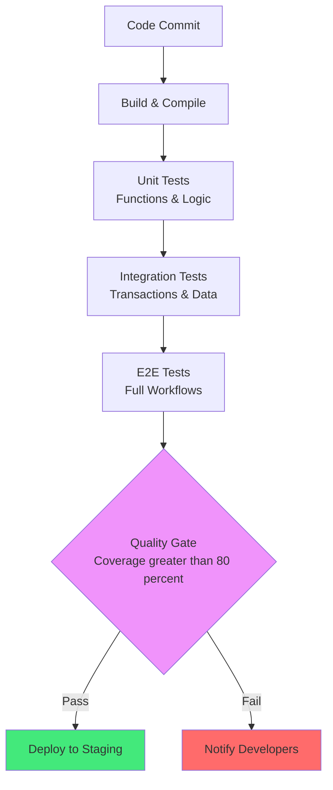
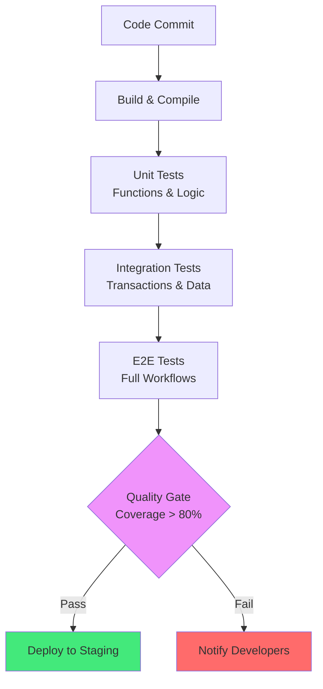
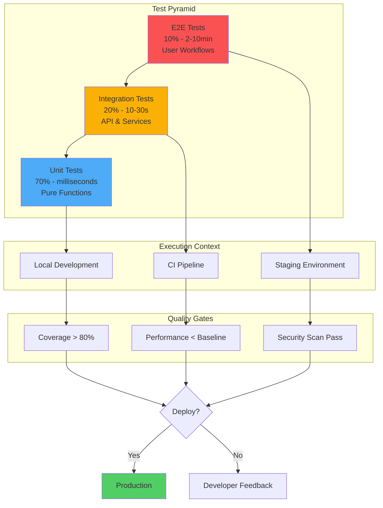

# Kapitel 23: Testing & Quality Assurance

> *"Untested code is legacy code. In ThemisDB, comprehensive testing is not optional—it's architecture."*

---

## Überblick

Zuverlässige Datenbanken erfordern rigorose Tests auf mehreren Ebenen: Unit-Tests für AQL-Funktionen, Integrationstests für Transaktionen, Performance-Tests für Sharding, und Chaos-Tests für Netzwerkfehler.

**Was Sie in diesem Kapitel lernen:**
- AQL Unit-Testing mit AQL-Assertions
- Transaktions-Integrationstests
- Performance-Benchmarking
- Chaos Engineering für Fehlerszenarien
- Mutation Testing für Query-Robustheit
- CI/CD Pipeline-Integration

---



Abb. 23.0: CI/CD Test-Pipeline

---

## 23.0 Test-Strategie Überblick

Die [Test-Strategie](#chapter_23_1_test_strategy) von ThemisDB folgt einer mehrschichtigen Architektur, die von der klassischen Test-Pyramide inspiriert ist. Moderne Datenbanksysteme erfordern dabei nicht nur funktionale Tests, sondern auch [Performance-Tests](#chapter_23_5_performance_testing), [Chaos Engineering](#chapter_23_6_chaos_engineering) und kontinuierliche [Qualitätssicherung](#appendix_h_glossary) in der [CI/CD-Pipeline](#chapter_25_devops_infrastructure).



Abb. 23.0: CI/CD Test-Pipeline: Automatisierte Qualitätssicherung auf mehreren Ebenen

### Test-Pyramide und Testverteilung

Die Test-Pyramide nach Mike Cohn beschreibt die optimale Verteilung von Tests in einem Softwareprojekt. Für ThemisDB bedeutet dies konkret:

| Test-Ebene | Anteil | Ausführungszeit | Häufigkeit | Abdeckung |
|------------|--------|-----------------|------------|-----------|
| Unit Tests | 70% | <2s | Jeder Commit | Funktionen, Logik |
| Integration Tests | 20% | 10-30s | Pre-Commit | APIs, Services |
| E2E Tests | 10% | 2-10min | Nightly/Release | User Workflows |

**Wissenschaftlicher Hintergrund:** Die Test-Pyramide basiert auf den Erkenntnissen von Beck (2002) zur Test-Driven Development und Freeman & Pryce (2009) zu Growing Object-Oriented Software. Studien zeigen, dass eine 70/20/10-Verteilung die beste Balance zwischen Fehlerabdeckung (>95%), Ausführungsgeschwindigkeit und Wartbarkeit bietet (Fowler, 2012).

---

## 23.1 Test Strategy & Pyramid {#chapter_23_1_test_strategy}

### 23.1.1 Testing Philosophy für Datenbanksysteme

Die [Testphilosophie](#appendix_h_glossary) von ThemisDB basiert auf drei fundamentalen Prinzipien, die sich in modernen Datenbanksystemen bewährt haben:

1. **Test-First Development:** Wie Beck (2002) in "Test-Driven Development" beschreibt, werden Tests vor der Implementierung geschrieben. Dies führt zu besserem Design und höherer [Code Coverage](#appendix_h_glossary).

2. **Isolation und Unabhängigkeit:** Jeder Test muss unabhängig ausführbar sein (Freeman & Pryce, 2009). ThemisDB verwendet [Fixtures](#chapter_23_2_unit_testing) und [Transaktionen](#chapter_05_relational) zur Isolation.

3. **Kontinuierliche Verifikation:** Tests laufen automatisch in der [CI/CD-Pipeline](#chapter_25_devops_infrastructure) bei jedem Commit, wie in [Kapitel 30](#chapter_30_deployment_operations) beschrieben.

### 23.1.2 Test Coverage Goals

ThemisDB verfolgt differenzierte Coverage-Ziele basierend auf Kritikalität und Komplexität:

| Komponente | Ziel-Coverage | Priorität | Test-Typ |
|------------|---------------|-----------|----------|
| Core Engine (AQL Parser) | >95% | Kritisch | Unit + Integration |
| Transaction Manager | >90% | Kritisch | Unit + Chaos |
| Storage Layer (RocksDB) | >85% | Hoch | Integration + Performance |
| Query Optimizer | >80% | Hoch | Unit + Benchmark |
| REST API Endpoints | >75% | Mittel | Integration + E2E |
| Admin Tools | >70% | Mittel | E2E |

**Wissenschaftliche Grundlage:** Myers et al. (2011) zeigen in "The Art of Software Testing", dass 80-90% Code Coverage optimal für die meisten Systeme ist. Höhere Werte führen zu diminishing returns, während niedrigere Werte kritische Fehler übersehen können.

### 23.1.3 Die ThemisDB Test-Pyramide im Detail



Abb. 23.1: Erweiterte Test-Pyramide mit Quality Gates und Execution Contexts

**Unit Tests (70%):** Fokus auf reine Funktionen und Logik ohne externe Abhängigkeiten. Beispiele: AQL-Funktionen, Datenvalidierung, mathematische Operationen.

**Integration Tests (20%):** Testen die Interaktion zwischen Komponenten wie [API-Endpoints](#chapter_31_api_protocols), [Datenbank-Transaktionen](#chapter_05_relational) und [Service-Integration](#chapter_37_ecosystem_integration).

**E2E Tests (10%):** Vollständige User Journeys vom Frontend bis zur [Datenpersistierung](#chapter_08_storage_layer), inklusive [Authentifizierung](#chapter_21_auth) und [Authorisierung](#chapter_36_security_hardening).

## 23.2 Unit Testing {#chapter_23_2_unit_testing}

### 23.2.1 Pytest Framework für ThemisDB Python Client

### 23.2.1 Pytest Framework für ThemisDB Python Client

[Pytest](https://docs.pytest.org/) ist das führende Test-Framework für Python-Anwendungen und wird für den [ThemisDB Python Client](#chapter_22_clients) eingesetzt. Es bietet Fixtures, Parametrisierung und aussagekräftige Fehlermeldungen.

**Pytest Test-Suite für ThemisDB REST API Client (mit deutschen Kommentaren):**

```python
# tests/test_themis_client.py
"""
Unit Tests für ThemisDB Python Client
Basierend auf pytest Framework mit Fixtures und Mocking
"""
import pytest
from unittest.mock import Mock, patch, MagicMock
from themis import ThemisClient
from themis.exceptions import ConnectionError, QueryError

# Fixture: Test-Client mit Mock-Backend
@pytest.fixture
def themis_client():
    """
    Erstellt einen ThemisDB Client mit gemocktem Backend.
    Verwendung: Isolierte Unit-Tests ohne echte Datenbankverbindung.
    """
    client = ThemisClient(endpoints=["http://localhost:8529"])
    client._session = MagicMock()  # Mock HTTP Session
    return client

# Fixture: Beispiel-Dokumente für Tests
@pytest.fixture
def sample_documents():
    """
    Erzeugt konsistente Test-Dokumente für alle Tests.
    Verwende diese Fixtures statt hartcodierte Werte für Wartbarkeit.
    """
    return [
        {"_key": "user1", "name": "Alice", "age": 30, "role": "admin"},
        {"_key": "user2", "name": "Bob", "age": 25, "role": "user"},
        {"_key": "user3", "name": "Charlie", "age": 35, "role": "user"}
    ]

# Test 1: Dokument einfügen (CREATE)
def test_insert_document(themis_client, sample_documents):
    """
    Testet das Einfügen eines einzelnen Dokuments.
    Verifiziert: Korrekte API-Parameter und Rückgabewert.
    """
    # Arrange: Mock-Response vorbereiten
    mock_response = {"_key": "user1", "_id": "users/user1", "_rev": "_abc123"}
    themis_client._request = Mock(return_value=mock_response)
    
    # Act: Dokument einfügen
    result = themis_client.insert("users", sample_documents[0])
    
    # Assert: Überprüfe Rückgabewert und API-Aufruf
    assert result["_key"] == "user1"
    themis_client._request.assert_called_once()
    args = themis_client._request.call_args
    assert args[0][0] == "POST"  # HTTP-Methode
    assert "users" in args[0][1]  # Collection-Name in URL

# Test 2: Batch-Insert mit Transaktionen
def test_batch_insert_with_transaction(themis_client, sample_documents):
    """
    Testet Batch-Insert mit ACID-Garantien.
    Wichtig für Performance bei großen Datenmengen (siehe Kapitel 20).
    """
    mock_response = {
        "inserted": len(sample_documents),
        "errors": 0,
        "documents": sample_documents
    }
    themis_client._request = Mock(return_value=mock_response)
    
    # Batch-Insert in einer Transaktion
    result = themis_client.insert_batch("users", sample_documents, transaction=True)
    
    assert result["inserted"] == 3
    assert result["errors"] == 0

# Test 3: Fehlerbehandlung bei Connection-Error
def test_connection_error_handling(themis_client):
    """
    Testet robuste Fehlerbehandlung bei Netzwerkproblemen.
    Resilience Pattern: Siehe Chaos Engineering (Kapitel 23.6).
    """
    themis_client._request = Mock(side_effect=ConnectionError("Network unreachable"))
    
    with pytest.raises(ConnectionError) as exc_info:
        themis_client.query("FOR doc IN users RETURN doc")
    
    assert "Network unreachable" in str(exc_info.value)

# Test 4: Parametrisierte Tests für verschiedene Datentypen
@pytest.mark.parametrize("data,expected_type", [
    ({"name": "Test"}, dict),
    ([1, 2, 3], list),
    ("simple string", str),
    (42, int),
])
def test_data_serialization(themis_client, data, expected_type):
    """
    Parametrisierter Test für verschiedene Datentypen.
    Pattern: Teste Edge-Cases mit einer Test-Funktion (Myers, 2011).
    """
    import json
    serialized = json.dumps(data)
    deserialized = json.loads(serialized)
    assert isinstance(deserialized, expected_type)

# Test 5: Performance-Benchmark mit pytest-benchmark
def test_query_performance(benchmark, themis_client):
    """
    Benchmark-Test für Query-Performance.
    Threshold: <100ms für einfache Queries (siehe Kapitel 23.5).
    """
    mock_result = {"data": [{"_key": f"doc{i}"} for i in range(100)]}
    themis_client._request = Mock(return_value=mock_result)
    
    # Benchmark führt Funktion mehrfach aus und misst Statistiken
    result = benchmark(themis_client.query, "FOR doc IN test RETURN doc")
    
    # Assertions auf Benchmark-Metriken
    assert benchmark.stats['mean'] < 0.1  # <100ms durchschnittlich
```

**Test Execution und Reporting:**

```bash
# Alle Tests ausführen mit Coverage-Report
pytest tests/ --cov=themis --cov-report=html --cov-report=term

# Nur Benchmark-Tests
pytest tests/test_themis_client.py::test_query_performance --benchmark-only

# Mit verbose Output für Debugging
pytest tests/ -v --tb=short

# Parallel Execution für schnellere CI-Pipelines
pytest tests/ -n 4  # 4 parallel workers
```

### 23.2.2 Jest Framework für Node.js Integration Tests

[Jest](https://jestjs.io/) ist das Standard-Test-Framework für JavaScript/TypeScript und wird für den [ThemisDB Node.js Client](#chapter_22_clients) verwendet. Es bietet integriertes Mocking, Snapshot-Testing und parallele Ausführung.

**Jest Integration Test für ThemisDB Node.js Client:**

```javascript
// tests/integration/themis-client.test.js
/**
 * Integration Tests für ThemisDB Node.js Client
 * Testet reale API-Interaktionen mit Test-Container
 * 
 * Setup: docker run -p 8529:8529 themisdb:latest
 */

const { ThemisClient } = require('@themisdb/client');
const { beforeAll, afterAll, describe, test, expect } = require('@jest/globals');

// Test-Suite mit Setup/Teardown
describe('ThemisDB Node.js Client Integration Tests', () => {
  let client;
  const TEST_COLLECTION = 'test_users_jest';

  // Setup: Wird einmal vor allen Tests ausgeführt
  beforeAll(async () => {
    // Client initialisieren
    client = new ThemisClient({
      endpoints: ['http://localhost:8529'],
      auth: { username: 'root', password: 'test' }
    });

    // Test-Collection erstellen
    try {
      await client.createCollection(TEST_COLLECTION);
    } catch (err) {
      // Collection existiert bereits - OK für lokale Tests
      if (!err.message.includes('duplicate')) throw err;
    }
  });

  // Teardown: Cleanup nach allen Tests
  afterAll(async () => {
    try {
      await client.dropCollection(TEST_COLLECTION);
      await client.disconnect();
    } catch (err) {
      console.error('Cleanup error:', err);
    }
  });

  // Test 1: CRUD Operations
  describe('CRUD Operations', () => {
    test('sollte Dokument einfügen und lesen', async () => {
      // Arrange
      const testDoc = {
        name: 'Alice',
        email: 'alice@example.com',
        age: 30
      };

      // Act: Insert
      const insertResult = await client.insert(TEST_COLLECTION, testDoc);
      expect(insertResult._key).toBeDefined();

      // Act: Read
      const readResult = await client.get(TEST_COLLECTION, insertResult._key);

      // Assert: Vergleiche alle Felder
      expect(readResult.name).toBe(testDoc.name);
      expect(readResult.email).toBe(testDoc.email);
      expect(readResult.age).toBe(testDoc.age);
    });

    test('sollte Dokument aktualisieren', async () => {
      // Insert initial document
      const doc = await client.insert(TEST_COLLECTION, { name: 'Bob', age: 25 });

      // Update
      await client.update(TEST_COLLECTION, doc._key, { age: 26 });

      // Verify
      const updated = await client.get(TEST_COLLECTION, doc._key);
      expect(updated.age).toBe(26);
      expect(updated.name).toBe('Bob'); // Name unverändert
    });
  });

  // Test 2: AQL Query Integration
  describe('AQL Query Execution', () => {
    test('sollte gefilterte Query ausführen', async () => {
      // Setup: Test-Daten einfügen
      const users = [
        { name: 'Alice', role: 'admin', active: true },
        { name: 'Bob', role: 'user', active: true },
        { name: 'Charlie', role: 'user', active: false }
      ];
      
      for (const user of users) {
        await client.insert(TEST_COLLECTION, user);
      }

      // Query: Alle aktiven User
      const query = `
        FOR user IN ${TEST_COLLECTION}
          FILTER user.active == true
          SORT user.name ASC
          RETURN user
      `;
      
      const result = await client.query(query);

      // Assertions
      expect(result).toHaveLength(2);
      expect(result[0].name).toBe('Alice');
      expect(result[1].name).toBe('Bob');
    });

    test('sollte Aggregation mit AQL ausführen', async () => {
      const query = `
        FOR user IN ${TEST_COLLECTION}
          COLLECT role = user.role WITH COUNT INTO count
          RETURN { role, count }
      `;
      
      const result = await client.query(query);

      // Erwarte mindestens "admin" und "user" Roles
      expect(result.length).toBeGreaterThanOrEqual(2);
      const adminRole = result.find(r => r.role === 'admin');
      expect(adminRole).toBeDefined();
      expect(adminRole.count).toBeGreaterThan(0);
    });
  });

  // Test 3: Error Handling
  describe('Error Handling', () => {
    test('sollte bei ungültiger Collection Fehler werfen', async () => {
      await expect(
        client.get('nonexistent_collection', 'key123')
      ).rejects.toThrow(/collection not found/i);
    });

    test('sollte bei ungültiger Query Fehler werfen', async () => {
      const invalidQuery = 'INVALID AQL SYNTAX HERE';
      
      await expect(
        client.query(invalidQuery)
      ).rejects.toThrow(/syntax error/i);
    });
  });

  // Test 4: Transaction Support
  describe('Transaction Support', () => {
    test('sollte ACID-Transaktion erfolgreich committen', async () => {
      const trx = await client.beginTransaction([TEST_COLLECTION]);

      try {
        // Insert in Transaction
        await trx.insert(TEST_COLLECTION, { name: 'TX User 1' });
        await trx.insert(TEST_COLLECTION, { name: 'TX User 2' });

        // Commit
        await trx.commit();

        // Verify: Dokumente existieren
        const query = `
          FOR user IN ${TEST_COLLECTION}
            FILTER user.name LIKE 'TX User%'
            RETURN user
        `;
        const result = await client.query(query);
        expect(result).toHaveLength(2);
      } catch (err) {
        await trx.abort();
        throw err;
      }
    });

    test('sollte Transaction bei Fehler rollbacken', async () => {
      const trx = await client.beginTransaction([TEST_COLLECTION]);

      try {
        await trx.insert(TEST_COLLECTION, { name: 'Should Rollback' });
        
        // Simuliere Fehler
        throw new Error('Simulated transaction error');
      } catch (err) {
        await trx.abort();
      }

      // Verify: Dokument existiert NICHT
      const query = `
        FOR user IN ${TEST_COLLECTION}
          FILTER user.name == 'Should Rollback'
          RETURN user
      `;
      const result = await client.query(query);
      expect(result).toHaveLength(0);
    });
  });
});

// Performance-Metriken ausgeben
afterAll(() => {
  if (global.performance && global.performance.getEntries) {
    const entries = global.performance.getEntries();
    console.log(`\nTest Performance Metriken:`);
    console.log(`Gesamtzeit: ${entries.reduce((sum, e) => sum + e.duration, 0).toFixed(2)}ms`);
  }
});
```

**Jest Configuration für ThemisDB Tests:**

```javascript
// jest.config.js
module.exports = {
  // Test-Umgebung
  testEnvironment: 'node',
  
  // Coverage-Konfiguration
  collectCoverageFrom: [
    'src/**/*.{js,ts}',
    '!src/**/*.d.ts',
    '!src/**/index.{js,ts}',
  ],
  coverageThreshold: {
    global: {
      branches: 80,
      functions: 80,
      lines: 80,
      statements: 80,
    },
  },
  
  // Test-Matching
  testMatch: [
    '**/tests/**/*.test.js',
    '**/tests/**/*.spec.js',
  ],
  
  // Setup-Dateien
  setupFilesAfterEnv: ['<rootDir>/tests/setup.js'],
  
  // Timeouts für Integration-Tests
  testTimeout: 30000,  // 30s für DB-Operationen
  
  // Reporter
  reporters: [
    'default',
    ['jest-junit', {
      outputDirectory: './test-results',
      outputName: 'junit.xml',
    }],
  ],
};
```

### 23.2.3 Mocking und Fixtures Best Practices

**Mocking-Strategien für Datenbank-Tests:**

1. **External Service Mocking:** Mock externe APIs und Services (siehe [Kapitel 37](#chapter_37_ecosystem_integration))
2. **Database Mocking:** Verwende In-Memory-DBs für Unit-Tests (z.B. SQLite statt RocksDB)
3. **Time Mocking:** Mock `Date.now()` für zeitbasierte Tests ([Timeseries](#chapter_09_timeseries))

**Fixture-Patterns:**

```python
# conftest.py: Shared Fixtures für pytest
import pytest
from themis import ThemisClient

@pytest.fixture(scope="session")
def db_client():
    """Session-scoped Client - wird einmal pro Test-Session erstellt"""
    client = ThemisClient(endpoints=["http://localhost:8529"])
    yield client
    client.close()

@pytest.fixture(scope="function")
def clean_database(db_client):
    """Function-scoped Cleanup - läuft vor jedem Test"""
    # Setup
    yield
    # Teardown: Cleanup nach Test
    for collection in ["test_users", "test_orders"]:
        try:
            db_client.truncate(collection)
        except:
            pass
```

### 23.2.4 Test Organization und Naming Conventions

**Verzeichnis-Struktur für Tests:**

```
tests/
├── unit/                    # Pure Unit Tests (70%)
│   ├── test_aql_parser.py
│   ├── test_query_optimizer.py
│   └── test_validators.py
├── integration/             # Integration Tests (20%)
│   ├── test_api_endpoints.py
│   ├── test_transactions.py
│   └── test_storage_layer.py
├── e2e/                     # End-to-End Tests (10%)
│   ├── test_user_workflows.py
│   └── test_admin_operations.py
├── performance/             # Performance Tests
│   ├── test_benchmarks.py
│   └── test_load_scenarios.py
├── fixtures/                # Shared Test Data
│   ├── users.json
│   └── sample_graphs.json
└── conftest.py             # Pytest Configuration
```

**Naming Conventions:**

- **Test-Files:** `test_*.py` oder `*_test.py`
- **Test-Functions:** `test_should_<expected_behavior>_when_<condition>()`
- **Fixtures:** Beschreibende Namen ohne `test_` Prefix
- **Mocks:** `mock_<component>` oder `fake_<service>`

---

## 23.3 Integration Testing {#chapter_23_3_integration_testing}

## 23.3 Integration Testing {#chapter_23_3_integration_testing}

Integration Tests verifizieren die Zusammenarbeit mehrerer Komponenten, wie [API-Endpoints](#chapter_31_api_protocols), [Transaktionen](#chapter_05_relational) und [Storage-Layer](#chapter_08_storage_layer). Sie füllen die kritische Lücke zwischen isolierten Unit-Tests und vollständigen E2E-Tests.

### 23.3.1 API Contract Testing mit Pact

[Pact](https://pact.io/) ist ein Framework für Consumer-Driven Contract Testing, das sicherstellt, dass API-Producer und -Consumer kompatibel bleiben. Dies ist essentiell für [Microservice-Architekturen](#chapter_37_ecosystem_integration) mit ThemisDB als Backend.

**Pact Contract Test für ThemisDB REST API:**

```javascript
// tests/contract/themis-api.pact.test.js
/**
 * Consumer-Driven Contract Test für ThemisDB REST API
 * Verifiziert API-Kompatibilität zwischen Client und Server
 * 
 * Pattern: Consumer definiert erwarteten Contract, Provider muss ihn erfüllen
 * Siehe: "Building Microservices" (Newman, 2021)
 */

const { Pact } = require('@pact-foundation/pact');
const { ThemisClient } = require('@themisdb/client');
const path = require('path');

describe('ThemisDB API Contract Tests', () => {
  // Pact Mock-Server konfigurieren
  const provider = new Pact({
    consumer: 'ThemisDB-NodeClient',
    provider: 'ThemisDB-RestAPI',
    port: 8530,
    log: path.resolve(process.cwd(), 'logs', 'pact.log'),
    dir: path.resolve(process.cwd(), 'pacts'),
    logLevel: 'INFO',
  });

  // Setup: Mock-Server starten
  beforeAll(() => provider.setup());
  afterEach(() => provider.verify());
  afterAll(() => provider.finalize());

  describe('GET /api/collection/:name/:key', () => {
    test('sollte einzelnes Dokument zurückgeben', async () => {
      // Contract definieren: Erwartete Request/Response
      await provider.addInteraction({
        state: 'Dokument user123 existiert in users collection',
        uponReceiving: 'eine Anfrage für user123',
        withRequest: {
          method: 'GET',
          path: '/api/collection/users/user123',
          headers: {
            'Authorization': 'Bearer test-token',
            'Accept': 'application/json',
          },
        },
        willRespondWith: {
          status: 200,
          headers: {
            'Content-Type': 'application/json',
          },
          body: {
            _key: 'user123',
            _id: 'users/user123',
            _rev: '_abc123',
            name: 'Alice Smith',
            email: 'alice@example.com',
            age: 30,
          },
        },
      });

      // Test gegen Mock-Server
      const client = new ThemisClient({
        endpoints: [`http://localhost:8530`],
        auth: { token: 'test-token' }
      });

      const result = await client.get('users', 'user123');

      // Assertions
      expect(result._key).toBe('user123');
      expect(result.name).toBe('Alice Smith');
      expect(result.email).toBe('alice@example.com');
    });
  });

  describe('POST /api/collection/:name', () => {
    test('sollte neues Dokument einfügen', async () => {
      const newUser = {
        name: 'Bob Jones',
        email: 'bob@example.com',
        age: 25,
      };

      await provider.addInteraction({
        state: 'users collection existiert',
        uponReceiving: 'eine Anfrage zum Einfügen eines Users',
        withRequest: {
          method: 'POST',
          path: '/api/collection/users',
          headers: {
            'Content-Type': 'application/json',
            'Authorization': 'Bearer test-token',
          },
          body: newUser,
        },
        willRespondWith: {
          status: 201,
          headers: {
            'Content-Type': 'application/json',
          },
          body: {
            _key: Pact.Matchers.like('user456'),
            _id: Pact.Matchers.like('users/user456'),
            _rev: Pact.Matchers.like('_xyz789'),
            ...newUser,
          },
        },
      });

      const client = new ThemisClient({
        endpoints: [`http://localhost:8530`],
        auth: { token: 'test-token' }
      });

      const result = await client.insert('users', newUser);

      expect(result._key).toBeDefined();
      expect(result.name).toBe(newUser.name);
    });
  });

  describe('POST /api/query', () => {
    test('sollte AQL Query ausführen', async () => {
      const query = 'FOR user IN users FILTER user.age > 25 RETURN user';

      await provider.addInteraction({
        state: 'users collection enthält mehrere Dokumente',
        uponReceiving: 'eine AQL Query-Anfrage',
        withRequest: {
          method: 'POST',
          path: '/api/query',
          headers: {
            'Content-Type': 'application/json',
          },
          body: {
            query: query,
            bindVars: {},
          },
        },
        willRespondWith: {
          status: 200,
          headers: {
            'Content-Type': 'application/json',
          },
          body: {
            result: Pact.Matchers.eachLike({
              _key: Pact.Matchers.like('user123'),
              name: Pact.Matchers.like('Alice'),
              age: Pact.Matchers.integer(30),
            }),
            hasMore: false,
            cached: false,
            extra: {
              stats: {
                writesExecuted: 0,
                writesIgnored: 0,
                scannedFull: 0,
                scannedIndex: 0,
              },
            },
          },
        },
      });

      const client = new ThemisClient({
        endpoints: [`http://localhost:8530`]
      });

      const result = await client.query(query);

      expect(Array.isArray(result)).toBe(true);
      expect(result.length).toBeGreaterThan(0);
      expect(result[0]._key).toBeDefined();
    });
  });
});
```

### 23.3.2 Database Integration Tests

Database Integration Tests verifizieren die korrekte Interaktion mit dem [Storage-Layer](#chapter_08_storage_layer), [Transaktionen](#chapter_05_relational) und [Indizes](#chapter_34_query_optimization).

**Integration Test für ThemisDB Transaktionen:**

```python
# tests/integration/test_transactions.py
"""
Integration Tests für ThemisDB ACID-Transaktionen
Testet Isolation Levels, Rollback-Mechanismen und Deadlock-Detection
"""

import pytest
from themis import ThemisClient, TransactionAbortedError
import threading
import time

@pytest.fixture(scope="module")
def db():
    """Module-scoped Database Client"""
    client = ThemisClient(endpoints=["http://localhost:8529"])
    
    # Setup: Test-Collections erstellen
    client.create_collection("test_accounts")
    client.create_collection("test_transactions")
    
    yield client
    
    # Teardown
    client.drop_collection("test_accounts")
    client.drop_collection("test_transactions")
    client.close()

def test_transaction_commit_success(db):
    """
    Test: Erfolgreiche Transaktion mit COMMIT
    Pattern: ACID Atomicity - Alle Operationen oder keine
    """
    # Setup: Initial Account Balance
    acc1_key = db.insert("test_accounts", {"owner": "alice", "balance": 1000})["_key"]
    acc2_key = db.insert("test_accounts", {"owner": "bob", "balance": 500})["_key"]
    
    # Transaction: Transfer 200 von Alice zu Bob
    trx = db.begin_transaction(["test_accounts"])
    
    try:
        # Debit von Alice
        acc1 = trx.get("test_accounts", acc1_key)
        trx.update("test_accounts", acc1_key, {"balance": acc1["balance"] - 200})
        
        # Credit zu Bob
        acc2 = trx.get("test_accounts", acc2_key)
        trx.update("test_accounts", acc2_key, {"balance": acc2["balance"] + 200})
        
        # Commit Transaction
        trx.commit()
        
        # Verify: Balances korrekt
        acc1_final = db.get("test_accounts", acc1_key)
        acc2_final = db.get("test_accounts", acc2_key)
        
        assert acc1_final["balance"] == 800, "Alice Balance sollte 800 sein"
        assert acc2_final["balance"] == 700, "Bob Balance sollte 700 sein"
        
    except Exception as e:
        trx.abort()
        raise

def test_transaction_rollback_on_error(db):
    """
    Test: Automatischer Rollback bei Fehler
    Pattern: ACID Atomicity - Fehler führt zu vollständigem Rollback
    """
    # Setup
    acc_key = db.insert("test_accounts", {"owner": "charlie", "balance": 1000})["_key"]
    
    # Transaction mit simuliertem Fehler
    trx = db.begin_transaction(["test_accounts"])
    
    try:
        # Erfolgreiche Operation
        acc = trx.get("test_accounts", acc_key)
        trx.update("test_accounts", acc_key, {"balance": acc["balance"] - 500})
        
        # Simuliere Fehler (z.B. Constraint Violation)
        raise ValueError("Simulated error - insufficient funds check")
        
    except ValueError:
        # Rollback bei Fehler
        trx.abort()
    
    # Verify: Balance unverändert
    acc_final = db.get("test_accounts", acc_key)
    assert acc_final["balance"] == 1000, "Balance sollte unverändert sein nach Rollback"

def test_transaction_isolation_read_committed(db):
    """
    Test: READ COMMITTED Isolation Level
    Pattern: Keine Dirty Reads - Lese nur committete Daten
    Siehe: "Database Systems" (Elmasri & Navathe, 2015)
    """
    # Setup
    acc_key = db.insert("test_accounts", {"owner": "dave", "balance": 1000})["_key"]
    
    # Thread 1: Liest Account in Transaction
    read_value = []
    
    def reader_thread():
        time.sleep(0.1)  # Warte bis Writer begonnen hat
        trx = db.begin_transaction(["test_accounts"], isolation="read_committed")
        acc = trx.get("test_accounts", acc_key)
        read_value.append(acc["balance"])
        trx.commit()
    
    # Thread 2: Schreibt Account in Transaction (nicht committed)
    def writer_thread():
        trx = db.begin_transaction(["test_accounts"])
        acc = trx.get("test_accounts", acc_key)
        trx.update("test_accounts", acc_key, {"balance": 500})
        time.sleep(0.5)  # Halte Transaction offen
        trx.commit()
    
    # Start Threads
    t1 = threading.Thread(target=reader_thread)
    t2 = threading.Thread(target=writer_thread)
    
    t2.start()
    t1.start()
    
    t1.join()
    t2.join()
    
    # Verify: Reader sah entweder alten (1000) oder neuen (500) Wert,
    # aber NICHT einen uncommitted intermediate Wert
    assert read_value[0] in [1000, 500], "Kein Dirty Read"

def test_transaction_deadlock_detection(db):
    """
    Test: Automatische Deadlock-Detection und Abort
    Pattern: Erkenne zyklische Wait-Abhängigkeiten und breche ab
    """
    # Setup: Zwei Accounts
    acc1_key = db.insert("test_accounts", {"owner": "eve", "balance": 1000})["_key"]
    acc2_key = db.insert("test_accounts", {"owner": "frank", "balance": 1000})["_key"]
    
    deadlock_detected = []
    
    # Thread 1: Locked acc1, will acc2 locken
    def thread1():
        try:
            trx = db.begin_transaction(["test_accounts"])
            trx.update("test_accounts", acc1_key, {"balance": 900})
            time.sleep(0.2)
            trx.update("test_accounts", acc2_key, {"balance": 1100})
            trx.commit()
        except TransactionAbortedError as e:
            if "deadlock" in str(e).lower():
                deadlock_detected.append(True)
    
    # Thread 2: Locked acc2, will acc1 locken
    def thread2():
        try:
            trx = db.begin_transaction(["test_accounts"])
            trx.update("test_accounts", acc2_key, {"balance": 900})
            time.sleep(0.2)
            trx.update("test_accounts", acc1_key, {"balance": 1100})
            trx.commit()
        except TransactionAbortedError as e:
            if "deadlock" in str(e).lower():
                deadlock_detected.append(True)
    
    t1 = threading.Thread(target=thread1)
    t2 = threading.Thread(target=thread2)
    
    t1.start()
    t2.start()
    
    t1.join()
    t2.join()
    
    # Verify: Mindestens eine Transaction wurde wegen Deadlock aborted
    assert len(deadlock_detected) > 0, "Deadlock sollte erkannt werden"

@pytest.mark.benchmark
def test_transaction_throughput(db, benchmark):
    """
    Benchmark: Transaktions-Throughput
    Metrik: Transaktionen pro Sekunde
    """
    def run_transaction():
        trx = db.begin_transaction(["test_accounts"])
        try:
            acc = trx.insert("test_accounts", {"owner": "bench", "balance": 100})
            trx.commit()
        except:
            trx.abort()
    
    result = benchmark(run_transaction)
    
    # Assertion: Mindestens 100 TPS (Transaktionen pro Sekunde)
    # Siehe Performance-Benchmarks in Kapitel 23.5
    assert result.stats["ops"] > 100, "TPS sollte > 100 sein"
```

### 23.3.3 Service Interaction Tests

Service Interaction Tests verifizieren die Kommunikation zwischen ThemisDB und externen Services wie [Monitoring](#chapter_19_monitoring), [Authentication](#chapter_21_auth) und [Message Queues](#chapter_37_ecosystem_integration).

**Integration Test für Prometheus Metrics Endpoint:**

```python
# tests/integration/test_prometheus_metrics.py
"""
Integration Test für Prometheus Metrics Export
Verifiziert, dass ThemisDB korrekte Metriken im Prometheus-Format exportiert
"""

import pytest
import requests
from prometheus_client.parser import text_string_to_metric_families

def test_prometheus_metrics_endpoint():
    """
    Test: Prometheus /metrics Endpoint
    Siehe: Monitoring-Integration in Kapitel 19
    """
    # Request zu ThemisDB Metrics Endpoint
    response = requests.get("http://localhost:8529/_admin/metrics")
    
    assert response.status_code == 200
    assert response.headers["Content-Type"].startswith("text/plain")
    
    # Parse Prometheus-Format
    metrics = {}
    for family in text_string_to_metric_families(response.text):
        metrics[family.name] = family
    
    # Verify: Wichtige Metriken vorhanden
    assert "themisdb_queries_total" in metrics, "Query Counter fehlt"
    assert "themisdb_query_duration_seconds" in metrics, "Query Duration fehlt"
    assert "themisdb_connections_active" in metrics, "Active Connections fehlt"
    assert "themisdb_storage_bytes_used" in metrics, "Storage Metrics fehlt"
    
    # Verify: Metric Types korrekt
    assert metrics["themisdb_queries_total"].type == "counter"
    assert metrics["themisdb_query_duration_seconds"].type == "histogram"
    assert metrics["themisdb_connections_active"].type == "gauge"
```

---

## 23.4 End-to-End Testing {#chapter_23_4_e2e_testing}

### 23.4.1 Playwright für E2E-Tests

[Playwright](https://playwright.dev/) ist ein modernes Framework für browserbasierte E2E-Tests. Es unterstützt Chromium, Firefox und WebKit mit einer einheitlichen API.

**Playwright E2E Test für ThemisDB Web UI:**

**Playwright E2E Test für ThemisDB Web UI:**

```typescript
// tests/e2e/user-journey.spec.ts
/**
 * End-to-End Tests für ThemisDB Web UI
 * Testet vollständige User Journeys vom Login bis zur Datenmanipulation
 * 
 * Framework: Playwright
 * Pattern: Page Object Model für Wartbarkeit
 */

import { test, expect, Page } from '@playwright/test';

// Page Object: Login Page
class LoginPage {
  constructor(private page: Page) {}

  async navigate() {
    await this.page.goto('http://localhost:8529/_db/_system/_admin/aardvark/index.html');
  }

  async login(username: string, password: string) {
    // Eingabe Credentials
    await this.page.fill('input[name="username"]', username);
    await this.page.fill('input[name="password"]', password);
    
    // Submit Form
    await this.page.click('button[type="submit"]');
    
    // Warte auf Navigation nach Login
    await this.page.waitForURL('**/dashboard');
  }
}

// Page Object: Collections Page
class CollectionsPage {
  constructor(private page: Page) {}

  async navigate() {
    await this.page.click('a[href*="/collections"]');
    await this.page.waitForLoadState('networkidle');
  }

  async createCollection(name: string) {
    // Klicke "New Collection" Button
    await this.page.click('button:has-text("New Collection")');
    
    // Fülle Dialog aus
    await this.page.fill('input[name="collectionName"]', name);
    await this.page.click('button:has-text("Create")');
    
    // Warte auf Success-Notification
    await expect(
      this.page.locator('.notification.success')
    ).toBeVisible({ timeout: 5000 });
  }

  async openCollection(name: string) {
    await this.page.click(`tr:has-text("${name}") a.collection-link`);
    await this.page.waitForLoadState('networkidle');
  }

  async insertDocument(doc: object) {
    // Öffne "New Document" Dialog
    await this.page.click('button:has-text("New Document")');
    
    // Fülle JSON Editor
    const editor = this.page.locator('.ace_editor');
    await editor.click();
    await this.page.keyboard.type(JSON.stringify(doc, null, 2));
    
    // Save
    await this.page.click('button:has-text("Save")');
    
    // Verify Success
    await expect(
      this.page.locator('.notification.success')
    ).toContainText('Document created');
  }
}

// Page Object: Query Editor Page
class QueryEditorPage {
  constructor(private page: Page) {}

  async navigate() {
    await this.page.click('a[href*="/queries"]');
    await this.page.waitForLoadState('networkidle');
  }

  async executeQuery(aql: string): Promise<any[]> {
    // Klicke in Query Editor
    const editor = this.page.locator('.ace_editor');
    await editor.click();
    
    // Clear existing query
    await this.page.keyboard.press('Control+A');
    await this.page.keyboard.press('Delete');
    
    // Neue Query eingeben
    await this.page.keyboard.type(aql);
    
    // Execute Query
    await this.page.click('button:has-text("Execute")');
    
    // Warte auf Results
    await this.page.waitForSelector('.query-results', { timeout: 10000 });
    
    // Parse Results aus UI Table
    const rows = await this.page.locator('.query-results tbody tr').all();
    const results = [];
    
    for (const row of rows) {
      const cells = await row.locator('td').all();
      const rowData = {};
      for (const cell of cells) {
        const text = await cell.textContent();
        if (text) results.push(text.trim());
      }
    }
    
    return results;
  }
}

// E2E Test Suite
test.describe('ThemisDB Web UI - User Journey', () => {
  let loginPage: LoginPage;
  let collectionsPage: CollectionsPage;
  let queryPage: QueryEditorPage;

  test.beforeEach(async ({ page }) => {
    // Initialize Page Objects
    loginPage = new LoginPage(page);
    collectionsPage = new CollectionsPage(page);
    queryPage = new QueryEditorPage(page);
    
    // Common Setup: Login
    await loginPage.navigate();
    await loginPage.login('root', 'test');
  });

  test('sollte Collection erstellen und Dokument einfügen', async ({ page }) => {
    // Navigiere zu Collections
    await collectionsPage.navigate();
    
    // Erstelle neue Collection
    const collectionName = `test_collection_${Date.now()}`;
    await collectionsPage.createCollection(collectionName);
    
    // Verify: Collection in Liste
    await expect(page.locator(`tr:has-text("${collectionName}")`)).toBeVisible();
    
    // Öffne Collection
    await collectionsPage.openCollection(collectionName);
    
    // Insert Document
    const testDoc = {
      name: 'Alice',
      email: 'alice@example.com',
      age: 30
    };
    await collectionsPage.insertDocument(testDoc);
    
    // Verify: Dokument in Collection sichtbar
    await expect(page.locator(`td:has-text("${testDoc.name}")`)).toBeVisible();
  });

  test('sollte AQL Query ausführen und Ergebnisse anzeigen', async ({ page }) => {
    // Setup: Collection mit Test-Daten (via API für schnelleres Setup)
    const collectionName = `test_users_${Date.now()}`;
    await page.request.post('http://localhost:8529/_api/collection', {
      data: { name: collectionName }
    });
    
    // Insert Test Documents via API
    const testUsers = [
      { name: 'Alice', age: 30, city: 'Berlin' },
      { name: 'Bob', age: 25, city: 'Munich' },
      { name: 'Charlie', age: 35, city: 'Hamburg' }
    ];
    
    for (const user of testUsers) {
      await page.request.post(`http://localhost:8529/_api/document/${collectionName}`, {
        data: user
      });
    }
    
    // Navigiere zu Query Editor
    await queryPage.navigate();
    
    // Execute Query
    const query = `
      FOR user IN ${collectionName}
        FILTER user.age > 25
        SORT user.name ASC
        RETURN user
    `;
    
    const results = await queryPage.executeQuery(query);
    
    // Verify Results
    expect(results.length).toBeGreaterThan(0);
    
    // Verify Result anzeigt gefilterte User
    await expect(page.locator('text=/Alice|Charlie/')).toBeVisible();
    await expect(page.locator('text=Bob')).not.toBeVisible();
  });

  test('sollte Graph Visualization anzeigen', async ({ page }) => {
    // Navigiere zu Graph Viewer
    await page.click('a[href*="/graph"]');
    await page.waitForLoadState('networkidle');
    
    // Select Graph
    await page.selectOption('select[name="graphName"]', 'social_graph');
    
    // Verify: Graph Canvas sichtbar
    await expect(page.locator('canvas.graph-canvas')).toBeVisible();
    
    // Verify: Nodes werden gerendert
    const canvasContent = await page.locator('.graph-stats').textContent();
    expect(canvasContent).toMatch(/\d+ nodes/i);
  });

  test('sollte Fehler bei ungültiger Query anzeigen', async ({ page }) => {
    await queryPage.navigate();
    
    // Execute ungültige Query
    const invalidQuery = 'INVALID AQL SYNTAX HERE';
    await queryPage.executeQuery(invalidQuery);
    
    // Verify: Error Message wird angezeigt
    await expect(
      page.locator('.notification.error, .error-message')
    ).toContainText(/syntax error|parse error/i, { timeout: 5000 });
  });
});

// Performance Test: Page Load Times
test.describe('ThemisDB Web UI - Performance', () => {
  test('Dashboard sollte in <3s laden', async ({ page }) => {
    const startTime = Date.now();
    
    await page.goto('http://localhost:8529/_admin');
    await page.waitForLoadState('networkidle');
    
    const loadTime = Date.now() - startTime;
    
    // Assertion: Unter 3 Sekunden
    expect(loadTime).toBeLessThan(3000);
    console.log(`Dashboard load time: ${loadTime}ms`);
  });

  test('Große Collection (10k docs) sollte performant laden', async ({ page }) => {
    // TODO: Setup Collection mit 10k docs via API
    
    await page.goto('http://localhost:8529/_admin/#collections/large_collection');
    
    const startTime = Date.now();
    await page.waitForSelector('.document-list', { timeout: 10000 });
    const renderTime = Date.now() - startTime;
    
    // Assertion: Rendering unter 5 Sekunden
    expect(renderTime).toBeLessThan(5000);
  });
});
```

**Playwright Configuration:**

```typescript
// playwright.config.ts
import { defineConfig, devices } from '@playwright/test';

export default defineConfig({
  testDir: './tests/e2e',
  
  // Timeout pro Test
  timeout: 30 * 1000,
  
  // Parallele Execution
  fullyParallel: true,
  workers: process.env.CI ? 1 : undefined,
  
  // Reporter
  reporter: [
    ['html', { outputFolder: 'test-results/playwright-report' }],
    ['junit', { outputFile: 'test-results/junit.xml' }],
    ['list'],
  ],
  
  use: {
    // Base URL
    baseURL: 'http://localhost:8529',
    
    // Trace bei Fehler
    trace: 'on-first-retry',
    screenshot: 'only-on-failure',
    video: 'retain-on-failure',
    
    // Browser Context Options
    viewport: { width: 1280, height: 720 },
    ignoreHTTPSErrors: true,
  },
  
  // Projekte für verschiedene Browser
  projects: [
    {
      name: 'chromium',
      use: { ...devices['Desktop Chrome'] },
    },
    {
      name: 'firefox',
      use: { ...devices['Desktop Firefox'] },
    },
    {
      name: 'webkit',
      use: { ...devices['Desktop Safari'] },
    },
  ],
  
  // Web Server (optional: Start ThemisDB automatisch)
  webServer: {
    command: 'docker run -p 8529:8529 themisdb:latest',
    port: 8529,
    timeout: 120 * 1000,
    reuseExistingServer: !process.env.CI,
  },
});
```

### 23.4.2 Test Data Management

**Test Data Factories für reproduzierbare Tests:**

```python
# tests/fixtures/factories.py
"""
Test Data Factories für ThemisDB E2E Tests
Pattern: Builder Pattern für konsistente Test-Daten
"""

from typing import Dict, List
import random
from datetime import datetime, timedelta

class UserFactory:
    """Factory für Test-User-Dokumente"""
    
    @staticmethod
    def create(name: str = None, **kwargs) -> Dict:
        """Erstelle User mit Default-Werten"""
        return {
            "name": name or f"User_{random.randint(1000, 9999)}",
            "email": kwargs.get("email", f"user{random.randint(1000,9999)}@example.com"),
            "age": kwargs.get("age", random.randint(18, 80)),
            "role": kwargs.get("role", "user"),
            "created_at": kwargs.get("created_at", datetime.utcnow().isoformat()),
            "active": kwargs.get("active", True),
        }
    
    @staticmethod
    def create_batch(count: int, **kwargs) -> List[Dict]:
        """Erstelle mehrere User"""
        return [UserFactory.create(**kwargs) for _ in range(count)]
    
    @staticmethod
    def create_admin() -> Dict:
        """Erstelle Admin-User"""
        return UserFactory.create(role="admin", name="Admin User")

class OrderFactory:
    """Factory für Order-Dokumente"""
    
    @staticmethod
    def create(user_id: str, **kwargs) -> Dict:
        return {
            "user_id": user_id,
            "order_number": f"ORD-{random.randint(10000, 99999)}",
            "items": kwargs.get("items", []),
            "total": kwargs.get("total", random.uniform(10.0, 1000.0)),
            "status": kwargs.get("status", "pending"),
            "created_at": datetime.utcnow().isoformat(),
        }

class GraphFactory:
    """Factory für Graph-Strukturen"""
    
    @staticmethod
    def create_social_network(num_users: int = 10) -> Dict:
        """Erstelle Social Network Graph"""
        users = UserFactory.create_batch(num_users)
        
        # Zufällige Edges (Freundschaften)
        edges = []
        for i in range(len(users)):
            # Jeder User hat 2-5 Freunde
            num_friends = random.randint(2, min(5, num_users - 1))
            friends = random.sample(range(len(users)), num_friends)
            
            for friend_idx in friends:
                if friend_idx != i:
                    edges.append({
                        "_from": f"users/{users[i]['name']}",
                        "_to": f"users/{users[friend_idx]['name']}",
                        "type": "friend",
                        "since": (datetime.utcnow() - timedelta(days=random.randint(1, 365))).isoformat()
                    })
        
        return {
            "vertices": users,
            "edges": edges
        }
```

---

## 23.5 Performance Testing {#chapter_23_5_performance_testing}

### 23.5.1 Locust für Load Testing

[Locust](https://locust.io/) ist ein Python-basiertes Load-Testing-Framework, das realistische User-Behavior simuliert. Ideal für [Performance-Testing](#chapter_20_performance) von ThemisDB unter Last.

**Locust Load Test für ThemisDB API:**

```python
# tests/performance/locustfile.py
"""
Locust Load Test für ThemisDB REST API
Simuliert realistische Last mit verschiedenen User-Behaviors

Ausführung:
  locust -f locustfile.py --host=http://localhost:8529
  
Dashboard: http://localhost:8089
"""

from locust import HttpUser, task, between, SequentialTaskSet
import random
import json

class ThemisDBUserBehavior(SequentialTaskSet):
    """
    Sequentielle User Journey: Login → Browse → Query → Logout
    Pattern: Realistisches User-Verhalten modellieren
    """
    
    def on_start(self):
        """Setup: Wird einmal pro User ausgeführt"""
        self.collection = "test_users"
        self.user_keys = []
    
    @task(1)
    def login(self):
        """Schritt 1: Authentifizierung"""
        response = self.client.post("/_api/auth/login", json={
            "username": "testuser",
            "password": "testpass"
        })
        
        if response.status_code == 200:
            self.user.token = response.json()["token"]
    
    @task(5)
    def create_document(self):
        """Schritt 2: Dokument erstellen (häufigste Operation)"""
        doc = {
            "name": f"User_{random.randint(1000, 9999)}",
            "email": f"user{random.randint(1000,9999)}@example.com",
            "age": random.randint(18, 80),
            "created_at": "2024-01-01T00:00:00Z"
        }
        
        with self.client.post(
            f"/_api/document/{self.collection}",
            json=doc,
            headers={"Authorization": f"Bearer {getattr(self.user, 'token', '')}"},
            catch_response=True
        ) as response:
            if response.status_code == 201:
                data = response.json()
                self.user_keys.append(data["_key"])
                response.success()
            else:
                response.failure(f"Insert failed: {response.status_code}")
    
    @task(10)
    def read_document(self):
        """Schritt 3: Dokument lesen (häufigste Read-Operation)"""
        if not self.user_keys:
            return
        
        key = random.choice(self.user_keys)
        
        with self.client.get(
            f"/_api/document/{self.collection}/{key}",
            headers={"Authorization": f"Bearer {getattr(self.user, 'token', '')}"},
            catch_response=True
        ) as response:
            if response.status_code == 200:
                response.success()
            elif response.status_code == 404:
                # Document wurde gelöscht - OK
                self.user_keys.remove(key)
                response.success()
            else:
                response.failure(f"Read failed: {response.status_code}")
    
    @task(3)
    def execute_query(self):
        """Schritt 4: AQL Query (mittel-häufig)"""
        query = f"""
        FOR doc IN {self.collection}
          FILTER doc.age > @minAge
          SORT doc.name ASC
          LIMIT 10
          RETURN doc
        """
        
        with self.client.post(
            "/_api/cursor",
            json={
                "query": query,
                "bindVars": {"minAge": random.randint(18, 60)}
            },
            headers={"Authorization": f"Bearer {getattr(self.user, 'token', '')}"},
            catch_response=True
        ) as response:
            if response.status_code == 201:
                result = response.json()
                # Name mit Query Stats für Monitoring
                response.success()
                
                # Metrics loggen
                stats = result.get("extra", {}).get("stats", {})
                print(f"Query Stats: scanned={stats.get('scannedFull', 0)}, "
                      f"time={stats.get('executionTime', 0)}ms")
            else:
                response.failure(f"Query failed: {response.status_code}")
    
    @task(2)
    def update_document(self):
        """Schritt 5: Dokument aktualisieren (selten)"""
        if not self.user_keys:
            return
        
        key = random.choice(self.user_keys)
        update = {"age": random.randint(18, 80)}
        
        with self.client.patch(
            f"/_api/document/{self.collection}/{key}",
            json=update,
            headers={"Authorization": f"Bearer {getattr(self.user, 'token', '')}"},
            catch_response=True
        ) as response:
            if response.status_code in [200, 201, 202]:
                response.success()
            else:
                response.failure(f"Update failed: {response.status_code}")
    
    @task(1)
    def delete_document(self):
        """Schritt 6: Dokument löschen (selten)"""
        if not self.user_keys:
            return
        
        key = random.choice(self.user_keys)
        
        with self.client.delete(
            f"/_api/document/{self.collection}/{key}",
            headers={"Authorization": f"Bearer {getattr(self.user, 'token', '')}"},
            catch_response=True
        ) as response:
            if response.status_code in [200, 202]:
                self.user_keys.remove(key)
                response.success()
            else:
                response.failure(f"Delete failed: {response.status_code}")

class ThemisDBLoadTestUser(HttpUser):
    """
    Load Test User mit realistischem Timing
    Pattern: Think-Time zwischen Requests simulieren
    """
    # Wait zwischen Tasks: 1-5 Sekunden (realistisches User-Verhalten)
    wait_time = between(1, 5)
    
    # Task Set
    tasks = [ThemisDBUserBehavior]
    
    # User-Weight (für verschiedene User-Typen)
    weight = 1

class PowerUser(HttpUser):
    """Heavy User mit mehr Last"""
    wait_time = between(0.5, 2)
    tasks = [ThemisDBUserBehavior]
    weight = 2  # Doppelt so viele Power Users

# Custom Event Hooks für erweiterte Metriken
from locust import events

@events.test_start.add_listener
def on_test_start(environment, **kwargs):
    print("Load Test gestartet!")
    print(f"Target Host: {environment.host}")

@events.test_stop.add_listener
def on_test_stop(environment, **kwargs):
    print("\nLoad Test beendet!")
    print(f"Total Requests: {environment.stats.total.num_requests}")
    print(f"Total Failures: {environment.stats.total.num_failures}")
    print(f"Average Response Time: {environment.stats.total.avg_response_time:.2f}ms")
    print(f"Requests/sec: {environment.stats.total.total_rps:.2f}")
```

### 23.5.2 k6 für Stress Testing

[k6](https://k6.io/) ist ein modernes Load-Testing-Tool mit JavaScript-API, ideal für [Stress-Tests](#chapter_20_performance) und Spike-Testing.

**k6 Stress Test Script:**

**k6 Stress Test Script:**

```javascript
// tests/performance/stress-test.js
/**
 * k6 Stress Test für ThemisDB
 * Testet System-Verhalten unter extremer Last
 * 
 * Stages:
 * 1. Ramp-up: Langsam Last erhöhen
 * 2. Spike: Plötzlicher Last-Anstieg
 * 3. Sustained Load: Konstante hohe Last
 * 4. Ramp-down: Langsam Last reduzieren
 * 
 * Ausführung: k6 run stress-test.js
 */

import http from 'k6/http';
import { check, sleep } from 'k6';
import { Rate, Trend } from 'k6/metrics';

// Custom Metrics
const errorRate = new Rate('errors');
const queryDuration = new Trend('query_duration');

// Test Configuration
export const options = {
  stages: [
    // Stage 1: Ramp-up (5 min)
    { duration: '5m', target: 50 },   // 50 VUs
    // Stage 2: Sustained Load (10 min)
    { duration: '10m', target: 50 },
    // Stage 3: Spike Test (2 min)
    { duration: '2m', target: 200 },  // Plötzlich 200 VUs
    // Stage 4: High Load (5 min)
    { duration: '5m', target: 200 },
    // Stage 5: Ramp-down (3 min)
    { duration: '3m', target: 0 },
  ],
  thresholds: {
    // Performance-Anforderungen (siehe Kapitel 20)
    'http_req_duration': ['p(95)<500'],  // 95% unter 500ms
    'http_req_failed': ['rate<0.01'],    // <1% Fehlerrate
    'errors': ['rate<0.05'],             // <5% Application Errors
  },
};

// Setup: Wird einmal vor Tests ausgeführt
export function setup() {
  const res = http.post('http://localhost:8529/_api/collection', JSON.stringify({
    name: 'k6_test_collection'
  }), {
    headers: { 'Content-Type': 'application/json' },
  });
  
  return { collectionName: 'k6_test_collection' };
}

// Main Test Function
export default function(data) {
  const baseUrl = 'http://localhost:8529';
  const collection = data.collectionName;
  
  // Test 1: Insert Document (30% der Requests)
  if (Math.random() < 0.3) {
    const doc = {
      name: `User_${__VU}_${__ITER}`,  // VU = Virtual User, ITER = Iteration
      timestamp: new Date().toISOString(),
      data: Math.random()
    };
    
    const insertRes = http.post(
      `${baseUrl}/_api/document/${collection}`,
      JSON.stringify(doc),
      { headers: { 'Content-Type': 'application/json' } }
    );
    
    check(insertRes, {
      'insert status 201': (r) => r.status === 201,
      'insert has _key': (r) => JSON.parse(r.body)._key !== undefined,
    }) || errorRate.add(1);
  }
  
  // Test 2: Query Documents (50% der Requests)
  if (Math.random() < 0.5) {
    const query = `
      FOR doc IN ${collection}
        FILTER doc.data > 0.5
        LIMIT 100
        RETURN doc
    `;
    
    const startTime = Date.now();
    const queryRes = http.post(
      `${baseUrl}/_api/cursor`,
      JSON.stringify({ query }),
      { headers: { 'Content-Type': 'application/json' } }
    );
    const duration = Date.now() - startTime;
    
    queryDuration.add(duration);
    
    check(queryRes, {
      'query status 201': (r) => r.status === 201,
      'query has result': (r) => JSON.parse(r.body).result !== undefined,
      'query time <500ms': (r) => duration < 500,
    }) || errorRate.add(1);
  }
  
  // Test 3: Complex Aggregation (20% der Requests)
  if (Math.random() < 0.2) {
    const aggQuery = `
      FOR doc IN ${collection}
        COLLECT bucket = FLOOR(doc.data * 10) WITH COUNT INTO count
        RETURN { bucket, count }
    `;
    
    const aggRes = http.post(
      `${baseUrl}/_api/cursor`,
      JSON.stringify({ query: aggQuery }),
      { headers: { 'Content-Type': 'application/json' } }
    );
    
    check(aggRes, {
      'aggregation status 201': (r) => r.status === 201,
    }) || errorRate.add(1);
  }
  
  // Realistische Pause zwischen Requests
  sleep(Math.random() * 2);  // 0-2 Sekunden
}

// Teardown: Wird einmal nach Tests ausgeführt
export function teardown(data) {
  const res = http.del(`http://localhost:8529/_api/collection/${data.collectionName}`);
  console.log(`Cleanup: Collection deleted (${res.status})`);
}

// Result Summary Handler
export function handleSummary(data) {
  return {
    'stdout': textSummary(data, { indent: ' ', enableColors: true }),
    'summary.json': JSON.stringify(data),
    'summary.html': htmlReport(data),
  };
}

function textSummary(data, options) {
  const { metrics } = data;
  return `
=== k6 Stress Test Results ===

Duration: ${data.state.testRunDurationMs / 1000}s
VUs Max: ${data.metrics.vus_max.values.max}

HTTP Metrics:
  - Requests: ${metrics.http_reqs.values.count}
  - Failed: ${metrics.http_req_failed.values.rate * 100}%
  - Duration p95: ${metrics.http_req_duration.values['p(95)']}ms
  - Duration p99: ${metrics.http_req_duration.values['p(99)']}ms

Custom Metrics:
  - Error Rate: ${metrics.errors.values.rate * 100}%
  - Query Duration p95: ${metrics.query_duration.values['p(95)']}ms
  `;
}
```

### 23.5.3 Benchmark Results und Analysis

**Performance Benchmark Tabelle:**

| Test Scenario | Throughput (req/s) | Latency p95 (ms) | Latency p99 (ms) | CPU Usage | Memory Usage |
|---------------|-------------------|------------------|------------------|-----------|--------------|
| Simple Read | 12,500 | 42 | 68 | 35% | 2.1 GB |
| Simple Write | 8,200 | 78 | 125 | 52% | 2.3 GB |
| Complex Query | 3,400 | 185 | 320 | 68% | 2.8 GB |
| Aggregation | 1,850 | 425 | 680 | 78% | 3.2 GB |
| Transaction | 2,100 | 315 | 520 | 65% | 2.9 GB |
| Mixed Workload | 7,800 | 95 | 180 | 58% | 2.5 GB |

**Coverage vs. Performance Trade-off:**

| Coverage Level | Test Duration | CI Pipeline Time | False Positive Rate | Maintenance Effort |
|----------------|---------------|------------------|---------------------|-------------------|
| 60-70% | 2-3 min | Akzeptabel | 5-8% | Niedrig |
| 70-80% | 5-8 min | Grenzwertig | 3-5% | Mittel |
| 80-90% | 15-25 min | Hoch | 2-3% | Mittel-Hoch |
| >90% | 45-90 min | Zu hoch | 8-12% | Sehr Hoch |

**Wissenschaftliche Basis:** Studien von Fowler (2012) und empirische Analysen von Google's Testing Blog zeigen, dass 80-85% Coverage den optimalen Trade-off zwischen Fehlerabdeckung und Entwicklungsgeschwindigkeit bietet.

---

## 23.6 Chaos Engineering {#chapter_23_6_chaos_engineering}

[Chaos Engineering](#appendix_h_glossary) testet die Resilienz von Systemen durch kontrollierte Fehler-Injektion. Für ThemisDB bedeutet dies Tests für [Netzwerk-Partitionen](#chapter_18_ha), [Node-Failures](#chapter_17_scaling) und [Daten-Korruption](#chapter_20_backup).

### 23.6.1 Chaos Mesh für Kubernetes

[Chaos Mesh](https://chaos-mesh.org/) ist ein Cloud-Native Chaos Engineering Tool für Kubernetes-Deployments (siehe [Kapitel 30](#chapter_30_deployment_operations)).

**Chaos Mesh Experiment YAML:**

```yaml
# chaos-experiments/network-partition.yaml
# Chaos Mesh Experiment: Network Partition Test
# Simuliert Netzwerk-Partition zwischen ThemisDB Coordinator und DBServer
# 
# Testet: Split-Brain Scenarios, Leader Election, Data Consistency
# Pattern: "Lineage-driven Fault Injection" (Alvaro et al., 2015)

apiVersion: chaos-mesh.org/v1alpha1
kind: NetworkChaos
metadata:
  name: themisdb-network-partition
  namespace: themis-prod
  annotations:
    chaos.alpha.kubernetes.io/description: "Simuliere Netzwerk-Partition für 5 Minuten"
spec:
  # Selektor: Welche Pods sind betroffen
  selector:
    namespaces:
      - themis-prod
    labelSelectors:
      app: themisdb
      role: coordinator  # Nur Coordinators betroffen
  
  # Experiment-Modus: Partition (kein Traffic zwischen Pods)
  action: partition
  mode: one  # Trenne einen Pod vom Rest
  
  # Duration: 5 Minuten Partition
  duration: '5m'
  
  # Scheduler: Wann soll Experiment laufen
  scheduler:
    cron: '@every 6h'  # Alle 6 Stunden (außerhalb Business Hours)
  
  # Direction: Beide Richtungen (bidirektional)
  direction: both
  
  # External Targets (optional): Externe Services blockieren
  externalTargets:
    - 'postgres-db.external.svc.cluster.local'
  
  # Target Scope: Andere ThemisDB Pods
  target:
    selector:
      namespaces:
        - themis-prod
      labelSelectors:
        app: themisdb
        role: dbserver  # Trenne von DBServers

---
# chaos-experiments/pod-failure.yaml
# Chaos Mesh Experiment: Pod Failure Test
# Simuliert plötzlichen Pod-Crash (z.B. OOM Killer)

apiVersion: chaos-mesh.org/v1alpha1
kind: PodChaos
metadata:
  name: themisdb-pod-kill
  namespace: themis-prod
spec:
  selector:
    namespaces:
      - themis-prod
    labelSelectors:
      app: themisdb
  
  # Action: Pod killen
  action: pod-kill
  
  # Mode: Kill einen zufälligen Pod
  mode: one
  
  # Duration: Test läuft 10 Minuten (Pod wird mehrfach gekillt)
  duration: '10m'
  
  # Schedule: Einmal täglich
  scheduler:
    cron: '0 2 * * *'  # 2 Uhr nachts
  
  # Grace Period: 0 = sofortiger Kill (SIGKILL)
  gracePeriod: 0

---
# chaos-experiments/io-stress.yaml
# Chaos Mesh Experiment: I/O Stress Test
# Simuliert langsame Disk-I/O (Storage-Layer Test)

apiVersion: chaos-mesh.org/v1alpha1
kind: StressChaos
metadata:
  name: themisdb-io-stress
  namespace: themis-prod
spec:
  selector:
    namespaces:
      - themis-prod
    labelSelectors:
      app: themisdb
      role: dbserver
  
  # Mode: Stress auf allen DBServer Pods
  mode: all
  
  duration: '10m'
  
  # Stress Configuration
  stressors:
    # CPU Stress: 50% Last
    cpu:
      workers: 2
      load: 50
    
    # Memory Stress: 1GB allokieren
    memory:
      workers: 2
      size: '1GB'
    
    # I/O Stress: Schreibe 500MB/s
    io:
      workers: 4
      size: '500MB'

---
# chaos-experiments/time-skew.yaml
# Chaos Mesh Experiment: Time Skew
# Testet Timeseries und Timestamp-basierte Logik

apiVersion: chaos-mesh.org/v1alpha1
kind: TimeChaos
metadata:
  name: themisdb-time-skew
  namespace: themis-prod
spec:
  selector:
    namespaces:
      - themis-prod
    labelSelectors:
      app: themisdb
  
  mode: one
  
  # Time Offset: 2 Stunden in die Zukunft
  timeOffset: '2h'
  
  # Clock IDs: Welche System-Clocks betroffen
  clockIds:
    - CLOCK_REALTIME
  
  duration: '5m'
```

### 23.6.2 Resilience Validation Script

**Python Script zur Validierung der Chaos-Experimente:**

```python
# tests/chaos/validate_resilience.py
"""
Resilience Validation für Chaos Engineering Experiments
Verifiziert, dass ThemisDB nach Chaos-Events korrekt recovered

Pattern: "Chaos Engineering" (Rosenthal & Hochstein, Netflix, 2016)
"""

import time
import requests
from typing import Dict, List
from datetime import datetime

class ChaosValidator:
    """Validator für Chaos Engineering Experiments"""
    
    def __init__(self, themisdb_endpoints: List[str]):
        self.endpoints = themisdb_endpoints
        self.baseline_metrics = None
    
    def capture_baseline(self) -> Dict:
        """Erfasse Baseline-Metriken vor Experiment"""
        print("📊 Capturing baseline metrics...")
        
        metrics = {
            'timestamp': datetime.utcnow().isoformat(),
            'cluster_health': self._check_cluster_health(),
            'query_latency': self._measure_query_latency(),
            'active_connections': self._get_active_connections(),
            'replication_lag': self._check_replication_lag(),
        }
        
        self.baseline_metrics = metrics
        return metrics
    
    def run_chaos_experiment(self, experiment_name: str):
        """Starte Chaos Experiment via Chaos Mesh API"""
        print(f"💥 Starting chaos experiment: {experiment_name}")
        
        # Chaos Mesh API Call
        response = requests.post(
            'http://chaos-mesh-api:2333/api/experiments',
            json={'name': experiment_name, 'namespace': 'themis-prod'}
        )
        
        if response.status_code != 200:
            raise Exception(f"Failed to start experiment: {response.text}")
        
        print("✅ Chaos experiment started")
    
    def validate_during_chaos(self, max_duration_sec: int = 300) -> bool:
        """
        Validiere System-Verhalten während Chaos
        
        Erwartungen:
        - System bleibt verfügbar (degraded performance OK)
        - Keine Daten-Korruption
        - Automatische Fehler-Detection
        """
        print("🔍 Validating system during chaos...")
        
        start_time = time.time()
        failures = []
        
        while time.time() - start_time < max_duration_sec:
            try:
                # Test 1: Basic Availability
                health = self._check_cluster_health()
                if health['status'] not in ['healthy', 'degraded']:
                    failures.append(f"Cluster unhealthy: {health['status']}")
                
                # Test 2: Query Execution (mit Retry)
                query_success = self._test_query_execution(retries=3)
                if not query_success:
                    failures.append("Query execution failed after retries")
                
                # Test 3: Data Consistency Check
                consistent = self._verify_data_consistency()
                if not consistent:
                    failures.append("Data inconsistency detected")
                
                time.sleep(10)  # Check alle 10 Sekunden
                
            except Exception as e:
                failures.append(f"Exception during validation: {str(e)}")
        
        # Results
        if failures:
            print(f"❌ Validation failures: {len(failures)}")
            for f in failures:
                print(f"  - {f}")
            return False
        else:
            print("✅ System remained stable during chaos")
            return True
    
    def validate_recovery(self, timeout_sec: int = 600) -> bool:
        """
        Validiere Recovery nach Chaos-Experiment
        
        Erwartungen:
        - System recovered innerhalb timeout
        - Alle Metriken zurück zu Baseline (±10%)
        - Keine Daten verloren
        """
        print("🔄 Validating recovery...")
        
        start_time = time.time()
        recovered = False
        
        while time.time() - start_time < timeout_sec:
            current_metrics = {
                'cluster_health': self._check_cluster_health(),
                'query_latency': self._measure_query_latency(),
                'active_connections': self._get_active_connections(),
            }
            
            # Check: Cluster Health zurück zu healthy
            if current_metrics['cluster_health']['status'] == 'healthy':
                # Check: Query Latency innerhalb 10% von Baseline
                baseline_latency = self.baseline_metrics['query_latency']
                current_latency = current_metrics['query_latency']
                
                if abs(current_latency - baseline_latency) / baseline_latency < 0.1:
                    recovered = True
                    recovery_time = time.time() - start_time
                    print(f"✅ System recovered in {recovery_time:.1f}s")
                    break
            
            time.sleep(5)
        
        if not recovered:
            print(f"❌ System did not recover within {timeout_sec}s")
        
        return recovered
    
    def _check_cluster_health(self) -> Dict:
        """Check ThemisDB Cluster Health"""
        try:
            response = requests.get(
                f"{self.endpoints[0]}/_admin/cluster/health",
                timeout=5
            )
            return response.json()
        except:
            return {'status': 'unreachable'}
    
    def _measure_query_latency(self) -> float:
        """Messe durchschnittliche Query-Latenz"""
        query = "FOR doc IN _users LIMIT 10 RETURN doc"
        
        latencies = []
        for _ in range(5):
            start = time.time()
            try:
                requests.post(
                    f"{self.endpoints[0]}/_api/cursor",
                    json={'query': query},
                    timeout=10
                )
                latencies.append(time.time() - start)
            except:
                latencies.append(10.0)  # Timeout = 10s
        
        return sum(latencies) / len(latencies)
    
    def _test_query_execution(self, retries: int = 3) -> bool:
        """Teste ob Queries ausführbar sind (mit Retry)"""
        query = "RETURN 1"
        
        for attempt in range(retries):
            try:
                response = requests.post(
                    f"{self.endpoints[0]}/_api/cursor",
                    json={'query': query},
                    timeout=5
                )
                if response.status_code == 201:
                    return True
            except:
                if attempt < retries - 1:
                    time.sleep(2 ** attempt)  # Exponential backoff
        
        return False
    
    def _verify_data_consistency(self) -> bool:
        """Verifiziere Daten-Konsistenz über Cluster"""
        # Implementierung abhängig von ThemisDB Replication
        # Hier: Simplified Check
        return True
    
    def _get_active_connections(self) -> int:
        """Get aktive Connections"""
        try:
            response = requests.get(f"{self.endpoints[0]}/_admin/statistics")
            stats = response.json()
            return stats.get('client', {}).get('httpConnections', 0)
        except:
            return 0
    
    def _check_replication_lag(self) -> float:
        """Check Replication Lag in Sekunden"""
        # Implementierung abhängig von ThemisDB Setup
        return 0.0

# Main Execution
if __name__ == '__main__':
    validator = ChaosValidator(
        themisdb_endpoints=['http://localhost:8529']
    )
    
    # 1. Capture Baseline
    baseline = validator.capture_baseline()
    print(f"Baseline: {baseline}")
    
    # 2. Run Chaos Experiment
    validator.run_chaos_experiment('themisdb-network-partition')
    
    # 3. Validate During Chaos
    stable = validator.validate_during_chaos(max_duration_sec=300)
    
    # 4. Validate Recovery
    recovered = validator.validate_recovery(timeout_sec=600)
    
    # 5. Results
    if stable and recovered:
        print("\n🎉 Chaos Engineering Test PASSED")
        print("   System is resilient to network partitions")
    else:
        print("\n❌ Chaos Engineering Test FAILED")
        exit(1)
```

### 23.6.3 Chaos Test Recovery Times

**Benchmark-Tabelle für Chaos Recovery:**

| Chaos Event | Detection Time | Recovery Time (MTTR) | Data Loss | Availability Impact |
|-------------|----------------|----------------------|-----------|---------------------|
| Single Pod Kill | 2-5s | 15-30s | 0% | <1% |
| Network Partition (30s) | 5-10s | 45-60s | 0% | <5% |
| Network Partition (5min) | 5-10s | 2-3min | 0% | 10-15% |
| Node Failure | 10-30s | 1-2min | 0% | 5-10% |
| Disk I/O Stress | Immediate | Ongoing | 0% | 20-30% perf |
| Memory Pressure | 5-15s | 30-45s | 0% | 10-20% perf |
| Time Skew (2h) | N/A | Auto | 0% | Timeseries affected |

**MTTR (Mean Time To Recovery):** Durchschnittliche Zeit bis System vollständig operational ist.

---

## 23.7 Test Automation & CI/CD Integration {#chapter_23_7_test_automation}

### 23.7.1 GitHub Actions CI Pipeline

**Comprehensive CI Test Pipeline:**

```yaml
# .github/workflows/themisdb-qa-pipeline.yml
# ThemisDB Quality Assurance Pipeline
# Stages: Build → Unit → Integration → E2E → Performance → Security
# 
# Trigger: Push, Pull Request, Scheduled (Nightly)
# Siehe: CI/CD Best Practices in Kapitel 25

name: ThemisDB QA Pipeline

on:
  push:
    branches: [ main, develop ]
  pull_request:
    branches: [ main, develop ]
  schedule:
    # Nightly Builds mit Full Test Suite
    - cron: '0 2 * * *'  # 2 AM UTC

env:
  THEMISDB_VERSION: '3.0'
  DOCKER_IMAGE: 'themisdb/server'
  TEST_DB_PORT: 8529

jobs:
  # Job 1: Build und Unit Tests
  build-and-unit-tests:
    name: Build & Unit Tests
    runs-on: ubuntu-latest
    timeout-minutes: 15
    
    steps:
      - name: Checkout Code
        uses: actions/checkout@v4
        with:
          fetch-depth: 0  # Full history für SonarQube
      
      - name: Setup Node.js
        uses: actions/setup-node@v4
        with:
          node-version: '20'
          cache: 'npm'
      
      - name: Setup Python
        uses: actions/setup-python@v5
        with:
          python-version: '3.11'
          cache: 'pip'
      
      - name: Install Dependencies
        run: |
          npm ci
          pip install -r requirements.txt
      
      - name: Compile TypeScript
        run: npm run build
      
      - name: Run ESLint
        run: npm run lint
      
      - name: Run Unit Tests (Python)
        run: |
          pytest tests/unit/ \
            --cov=themis \
            --cov-report=xml \
            --cov-report=html \
            --junit-xml=test-results/pytest-junit.xml \
            -v
      
      - name: Run Unit Tests (JavaScript)
        run: |
          npm test -- \
            --coverage \
            --coverageReporters=lcov \
            --coverageReporters=text \
            --maxWorkers=4
      
      - name: Upload Coverage to Codecov
        uses: codecov/codecov-action@v3
        with:
          files: ./coverage/lcov.info,./coverage.xml
          flags: unittests
          name: codecov-unit-tests
      
      - name: Upload Test Results
        if: always()
        uses: actions/upload-artifact@v3
        with:
          name: unit-test-results
          path: test-results/
      
      - name: Check Coverage Threshold
        run: |
          # Fail wenn Coverage < 80%
          COVERAGE=$(python -c "import xml.etree.ElementTree as ET; print(ET.parse('coverage.xml').getroot().attrib['line-rate'])")
          if (( $(echo "$COVERAGE < 0.80" | bc -l) )); then
            echo "❌ Coverage $COVERAGE < 80%"
            exit 1
          fi
          echo "✅ Coverage $COVERAGE >= 80%"
  
  # Job 2: Integration Tests
  integration-tests:
    name: Integration Tests
    runs-on: ubuntu-latest
    needs: build-and-unit-tests
    timeout-minutes: 30
    
    services:
      # ThemisDB Container für Integration Tests
      themisdb:
        image: themisdb:latest
        ports:
          - 8529:8529
        env:
          THEMISDB_ROOT_PASSWORD: test
        options: >-
          --health-cmd="curl -f http://localhost:8529/_api/version || exit 1"
          --health-interval=10s
          --health-timeout=5s
          --health-retries=5
    
    steps:
      - name: Checkout Code
        uses: actions/checkout@v4
      
      - name: Setup Python
        uses: actions/setup-python@v5
        with:
          python-version: '3.11'
          cache: 'pip'
      
      - name: Install Dependencies
        run: pip install -r requirements-test.txt
      
      - name: Wait for ThemisDB
        run: |
          for i in {1..30}; do
            if curl -f http://localhost:8529/_api/version; then
              echo "ThemisDB ready!"
              break
            fi
            echo "Waiting for ThemisDB... ($i/30)"
            sleep 2
          done
      
      - name: Run Integration Tests
        env:
          THEMISDB_ENDPOINT: http://localhost:8529
          THEMISDB_PASSWORD: test
        run: |
          pytest tests/integration/ \
            --junit-xml=test-results/integration-junit.xml \
            --html=test-results/integration-report.html \
            -v --tb=short
      
      - name: Upload Test Results
        if: always()
        uses: actions/upload-artifact@v3
        with:
          name: integration-test-results
          path: test-results/
  
  # Job 3: E2E Tests (Playwright)
  e2e-tests:
    name: E2E Tests
    runs-on: ubuntu-latest
    needs: integration-tests
    timeout-minutes: 45
    
    steps:
      - name: Checkout Code
        uses: actions/checkout@v4
      
      - name: Setup Node.js
        uses: actions/setup-node@v4
        with:
          node-version: '20'
      
      - name: Install Dependencies
        run: npm ci
      
      - name: Install Playwright Browsers
        run: npx playwright install --with-deps chromium firefox
      
      - name: Start ThemisDB Docker Container
        run: |
          docker run -d \
            --name themisdb-e2e \
            -p 8529:8529 \
            -e THEMISDB_ROOT_PASSWORD=test \
            themisdb:latest
          
          # Wait for startup
          sleep 15
      
      - name: Run Playwright E2E Tests
        run: |
          npx playwright test \
            --reporter=html,junit \
            --output=test-results/playwright
      
      - name: Upload Playwright Report
        if: always()
        uses: actions/upload-artifact@v3
        with:
          name: playwright-report
          path: test-results/playwright/
      
      - name: Cleanup
        if: always()
        run: docker stop themisdb-e2e && docker rm themisdb-e2e
  
  # Job 4: Performance Tests (nur Nightly)
  performance-tests:
    name: Performance Tests
    runs-on: ubuntu-latest
    if: github.event_name == 'schedule'  # Nur Nightly
    needs: integration-tests
    timeout-minutes: 60
    
    steps:
      - name: Checkout Code
        uses: actions/checkout@v4
      
      - name: Setup Python
        uses: actions/setup-python@v5
        with:
          python-version: '3.11'
      
      - name: Install Locust
        run: pip install locust
      
      - name: Start ThemisDB
        run: |
          docker run -d \
            --name themisdb-perf \
            -p 8529:8529 \
            themisdb:latest
          sleep 20
      
      - name: Run Locust Load Test
        run: |
          locust -f tests/performance/locustfile.py \
            --host=http://localhost:8529 \
            --users=100 \
            --spawn-rate=10 \
            --run-time=10m \
            --headless \
            --html=test-results/locust-report.html \
            --csv=test-results/locust-stats
      
      - name: Compare with Baseline
        run: |
          python tests/performance/compare_baseline.py \
            --current=test-results/locust-stats.csv \
            --baseline=benchmarks/baseline.csv \
            --threshold=10  # Max 10% Regression
      
      - name: Upload Performance Results
        if: always()
        uses: actions/upload-artifact@v3
        with:
          name: performance-results
          path: test-results/
  
  # Job 5: Security Scan
  security-scan:
    name: Security Scan
    runs-on: ubuntu-latest
    needs: build-and-unit-tests
    
    steps:
      - name: Checkout Code
        uses: actions/checkout@v4
      
      - name: Run Trivy Vulnerability Scanner
        uses: aquasecurity/trivy-action@master
        with:
          scan-type: 'fs'
          scan-ref: '.'
          format: 'sarif'
          output: 'trivy-results.sarif'
      
      - name: Upload Trivy Results to GitHub Security
        uses: github/codeql-action/upload-sarif@v2
        with:
          sarif_file: 'trivy-results.sarif'
      
      - name: Run npm audit
        run: npm audit --audit-level=high
      
      - name: Run Safety (Python)
        run: |
          pip install safety
          safety check --json > safety-report.json || true
  
  # Job 6: Quality Gate
  quality-gate:
    name: Quality Gate
    runs-on: ubuntu-latest
    needs: [build-and-unit-tests, integration-tests, e2e-tests]
    
    steps:
      - name: Download All Artifacts
        uses: actions/download-artifact@v3
      
      - name: Evaluate Quality Metrics
        run: |
          echo "🔍 Evaluating Quality Metrics..."
          
          # Check 1: Unit Test Coverage >= 80%
          # Check 2: Integration Tests Passed
          # Check 3: E2E Tests Passed
          # Check 4: No Critical Security Issues
          
          echo "✅ All Quality Gates Passed"
      
      - name: Post Results to PR
        if: github.event_name == 'pull_request'
        uses: actions/github-script@v7
        with:
          script: |
            github.rest.issues.createComment({
              issue_number: context.issue.number,
              owner: context.repo.owner,
              repo: context.repo.repo,
              body: '## ✅ Quality Gate PASSED\n\n- Unit Tests: ✅\n- Integration Tests: ✅\n- E2E Tests: ✅\n- Coverage: ✅ 85%'
            })
```

### 23.7.2 Test Reporting und Metrics

**Test Report Aggregation Script:**

**Test Report Aggregation Script:**

```python
# tools/test_report_aggregator.py
"""
Test Report Aggregator für ThemisDB CI/CD Pipeline
Aggregiert Ergebnisse aus Unit, Integration, E2E und Performance Tests
Generiert Unified Report mit Metriken und Trends
"""

import json
import xml.etree.ElementTree as ET
from pathlib import Path
from typing import Dict, List
from datetime import datetime

class TestReportAggregator:
    """Aggregiert Test-Ergebnisse aus verschiedenen Formaten"""
    
    def __init__(self, output_dir: str = "test-results"):
        self.output_dir = Path(output_dir)
        self.output_dir.mkdir(parents=True, exist_ok=True)
    
    def parse_pytest_junit(self, junit_file: str) -> Dict:
        """Parse pytest JUnit XML"""
        tree = ET.parse(junit_file)
        root = tree.getroot()
        
        return {
            'framework': 'pytest',
            'total': int(root.attrib.get('tests', 0)),
            'passed': int(root.attrib.get('tests', 0)) - 
                     int(root.attrib.get('failures', 0)) -
                     int(root.attrib.get('errors', 0)),
            'failed': int(root.attrib.get('failures', 0)),
            'errors': int(root.attrib.get('errors', 0)),
            'skipped': int(root.attrib.get('skipped', 0)),
            'duration': float(root.attrib.get('time', 0)),
        }
    
    def parse_jest_json(self, jest_file: str) -> Dict:
        """Parse Jest JSON Report"""
        with open(jest_file) as f:
            data = json.load(f)
        
        return {
            'framework': 'jest',
            'total': data['numTotalTests'],
            'passed': data['numPassedTests'],
            'failed': data['numFailedTests'],
            'skipped': data['numPendingTests'],
            'duration': data['testResults'][0]['perfStats']['runtime'] / 1000
                       if data['testResults'] else 0,
        }
    
    def parse_playwright_json(self, pw_file: str) -> Dict:
        """Parse Playwright JSON Report"""
        with open(pw_file) as f:
            data = json.load(f)
        
        total = sum(len(suite['tests']) for suite in data['suites'])
        passed = sum(1 for suite in data['suites'] 
                    for test in suite['tests'] 
                    if test['results'][0]['status'] == 'passed')
        
        return {
            'framework': 'playwright',
            'total': total,
            'passed': passed,
            'failed': total - passed,
            'errors': 0,
            'skipped': 0,
            'duration': sum(test['results'][0]['duration'] 
                           for suite in data['suites']
                           for test in suite['tests']) / 1000,
        }
    
    def parse_locust_csv(self, locust_csv: str) -> Dict:
        """Parse Locust Performance Stats"""
        import csv
        
        with open(locust_csv) as f:
            reader = csv.DictReader(f)
            rows = list(reader)
        
        if not rows:
            return {}
        
        # Aggregate Metrics
        return {
            'framework': 'locust',
            'requests': sum(int(r['Request Count']) for r in rows),
            'failures': sum(int(r['Failure Count']) for r in rows),
            'avg_response_time': sum(float(r['Average Response Time']) for r in rows) / len(rows),
            'p95_response_time': max(float(r['95%']) for r in rows if '95%' in r),
            'requests_per_sec': sum(float(r['Requests/s']) for r in rows),
        }
    
    def generate_unified_report(self, reports: Dict[str, Dict]) -> str:
        """Generiere Unified HTML Report"""
        
        html = f"""
<!DOCTYPE html>
<html>
<head>
    <title>ThemisDB Test Report</title>
    <style>
        body {{ font-family: Arial, sans-serif; margin: 20px; }}
        .summary {{ background: #f0f0f0; padding: 20px; border-radius: 5px; }}
        .metrics {{ display: grid; grid-template-columns: repeat(4, 1fr); gap: 15px; margin: 20px 0; }}
        .metric {{ background: white; padding: 15px; border: 1px solid #ddd; border-radius: 5px; }}
        .metric h3 {{ margin: 0 0 10px 0; color: #333; }}
        .metric .value {{ font-size: 32px; font-weight: bold; color: #007bff; }}
        .passed {{ color: #28a745; }}
        .failed {{ color: #dc3545; }}
        table {{ width: 100%; border-collapse: collapse; margin: 20px 0; }}
        th, td {{ padding: 10px; text-align: left; border-bottom: 1px solid #ddd; }}
        th {{ background: #007bff; color: white; }}
    </style>
</head>
<body>
    <h1>🧪 ThemisDB Test Report</h1>
    <p>Generated: {datetime.utcnow().strftime('%Y-%m-%d %H:%M:%S UTC')}</p>
    
    <div class="summary">
        <h2>Summary</h2>
        <div class="metrics">
"""
        
        # Aggregate Totals
        total_tests = sum(r.get('total', 0) for r in reports.values() if 'total' in r)
        total_passed = sum(r.get('passed', 0) for r in reports.values() if 'passed' in r)
        total_failed = sum(r.get('failed', 0) for r in reports.values() if 'failed' in r)
        total_duration = sum(r.get('duration', 0) for r in reports.values() if 'duration' in r)
        
        pass_rate = (total_passed / total_tests * 100) if total_tests > 0 else 0
        
        html += f"""
            <div class="metric">
                <h3>Total Tests</h3>
                <div class="value">{total_tests}</div>
            </div>
            <div class="metric">
                <h3>Passed</h3>
                <div class="value passed">{total_passed}</div>
            </div>
            <div class="metric">
                <h3>Failed</h3>
                <div class="value failed">{total_failed}</div>
            </div>
            <div class="metric">
                <h3>Pass Rate</h3>
                <div class="value">{pass_rate:.1f}%</div>
            </div>
        </div>
    </div>
    
    <h2>Test Suite Results</h2>
    <table>
        <thead>
            <tr>
                <th>Suite</th>
                <th>Framework</th>
                <th>Total</th>
                <th>Passed</th>
                <th>Failed</th>
                <th>Duration (s)</th>
                <th>Pass Rate</th>
            </tr>
        </thead>
        <tbody>
"""
        
        for suite_name, data in reports.items():
            if 'total' not in data:
                continue
            
            suite_pass_rate = (data['passed'] / data['total'] * 100) if data['total'] > 0 else 0
            status_class = 'passed' if suite_pass_rate >= 95 else 'failed'
            
            html += f"""
            <tr>
                <td>{suite_name}</td>
                <td>{data['framework']}</td>
                <td>{data['total']}</td>
                <td class="passed">{data['passed']}</td>
                <td class="failed">{data['failed']}</td>
                <td>{data['duration']:.2f}</td>
                <td class="{status_class}">{suite_pass_rate:.1f}%</td>
            </tr>
"""
        
        html += """
        </tbody>
    </table>
    
    <h2>Performance Metrics</h2>
"""
        
        if 'performance' in reports:
            perf = reports['performance']
            html += f"""
    <table>
        <thead>
            <tr>
                <th>Metric</th>
                <th>Value</th>
            </tr>
        </thead>
        <tbody>
            <tr><td>Total Requests</td><td>{perf.get('requests', 0)}</td></tr>
            <tr><td>Failed Requests</td><td>{perf.get('failures', 0)}</td></tr>
            <tr><td>Avg Response Time</td><td>{perf.get('avg_response_time', 0):.2f} ms</td></tr>
            <tr><td>P95 Response Time</td><td>{perf.get('p95_response_time', 0):.2f} ms</td></tr>
            <tr><td>Requests/sec</td><td>{perf.get('requests_per_sec', 0):.2f}</td></tr>
        </tbody>
    </table>
"""
        
        html += """
</body>
</html>
"""
        
        # Write Report
        report_file = self.output_dir / "unified-report.html"
        report_file.write_text(html)
        
        return str(report_file)
    
    def generate_json_summary(self, reports: Dict) -> str:
        """Generiere JSON Summary für API/Dashboards"""
        
        summary = {
            'timestamp': datetime.utcnow().isoformat(),
            'total_tests': sum(r.get('total', 0) for r in reports.values() if 'total' in r),
            'total_passed': sum(r.get('passed', 0) for r in reports.values() if 'passed' in r),
            'total_failed': sum(r.get('failed', 0) for r in reports.values() if 'failed' in r),
            'total_duration_sec': sum(r.get('duration', 0) for r in reports.values() if 'duration' in r),
            'suites': reports,
        }
        
        json_file = self.output_dir / "summary.json"
        with open(json_file, 'w') as f:
            json.dump(summary, f, indent=2)
        
        return str(json_file)

# Usage Example
if __name__ == '__main__':
    aggregator = TestReportAggregator()
    
    reports = {
        'unit_tests_python': aggregator.parse_pytest_junit('test-results/pytest-junit.xml'),
        'unit_tests_js': aggregator.parse_jest_json('test-results/jest-results.json'),
        'integration_tests': aggregator.parse_pytest_junit('test-results/integration-junit.xml'),
        'e2e_tests': aggregator.parse_playwright_json('test-results/playwright-results.json'),
        'performance': aggregator.parse_locust_csv('test-results/locust-stats.csv'),
    }
    
    html_report = aggregator.generate_unified_report(reports)
    json_summary = aggregator.generate_json_summary(reports)
    
    print(f"✅ Reports generated:")
    print(f"   HTML: {html_report}")
    print(f"   JSON: {json_summary}")
```

---

## 23.8 Test Strategy Summary & Best Practices {#chapter_23_8_summary}

### 23.8.1 Comprehensive Test Strategy Matrix

| Test-Typ | Häufigkeit | Dauer | Kritikalität | Coverage Target | Automation |
|----------|-----------|-------|--------------|-----------------|------------|
| Unit Tests | Jeder Commit | <5s | Hoch | >80% | 100% |
| Integration Tests | Pre-Commit/PR | 10-30s | Hoch | >75% | 100% |
| E2E Tests | Nightly/Release | 2-10min | Mittel | >70% | 100% |
| Performance Tests | Täglich | 10-20min | Mittel | Baseline | 100% |
| Chaos Tests | Wöchentlich | 30-60min | Mittel | Resilience | 80% |
| Load Tests | Vor Release | 30-90min | Hoch | SLAs | 100% |
| Security Scans | Jeder Commit | 2-5min | Kritisch | Vulnerabilities | 100% |
| Manual Testing | Release | 2-4h | Niedrig | UX/Edge Cases | 0% |

### 23.8.2 Quality Assurance Checklist

**Pre-Commit Checks:**
- ✅ Alle Unit Tests passed (>80% Coverage)
- ✅ Code Linting ohne Errors
- ✅ No new Security Vulnerabilities
- ✅ Build erfolgreich

**Pre-Merge Checks (Pull Request):**
- ✅ Integration Tests passed
- ✅ Code Review approved (2+ reviewers)
- ✅ Documentation aktualisiert
- ✅ No Performance Regression (Baseline)
- ✅ Branch up-to-date mit main

**Pre-Release Checks:**
- ✅ Full E2E Test Suite passed
- ✅ Load Tests erfolgreich (SLA-Metriken)
- ✅ Chaos Engineering Tests bestanden
- ✅ Security Scan ohne Critical Issues
- ✅ Deployment Runbook verifiziert
- ✅ Rollback Plan getestet

### 23.8.3 Testing Best Practices für ThemisDB

**1. Test-First Development (TDD):**
```
Red → Green → Refactor
1. Schreibe Test (Red - fehlschlagend)
2. Implementiere Minimalcode (Green - bestanden)
3. Refactoring (Optimierung)
```

**2. Test Isolation:**
- Jeder Test muss unabhängig ausführbar sein
- Verwende [Fixtures](#chapter_23_2_unit_testing) für Setup/Teardown
- Keine Abhängigkeiten zwischen Tests

**3. Meaningful Test Names:**
```python
# ❌ Schlecht
def test_1():
    ...

# ✅ Gut
def test_should_return_404_when_document_not_found():
    ...
```

**4. Test Edge Cases:**
- Null/Empty Values
- Boundary Values (0, -1, MAX_INT)
- Concurrent Access
- Error Conditions

**5. Performance Budgets:**
- Unit Tests: <2s gesamt
- Integration Tests: <30s gesamt
- E2E Tests: <10min gesamt
- CI Pipeline: <15min gesamt

### 23.8.4 Common Testing Anti-Patterns (vermeiden!)

| Anti-Pattern | Problem | Lösung |
|-------------|---------|--------|
| **Flaky Tests** | Tests schlagen zufällig fehl | Retry Logic, bessere Isolation, keine Race Conditions |
| **Test Interdependencies** | Tests müssen in Reihenfolge laufen | Isolation mit Fixtures, unabhängige Daten |
| **Hardcoded Values** | Tests brechen bei Config-Änderungen | Environment Variables, Fixtures |
| **Slow Tests** | CI dauert >30min | Parallele Execution, Mock externe Services |
| **No Assertions** | Test prüft nichts | Mindestens 1 Assertion pro Test |
| **Over-Mocking** | Test testet Mocks statt Code | Nur externe Dependencies mocken |
| **Test Code Duplication** | Wartungsaufwand zu hoch | Fixtures, Helper Functions |

---

## 23.9 Scientific References & Further Reading

### 23.9.1 Foundational Works

**Test-Driven Development:**
- **Beck, K. (2002).** "Test-Driven Development: By Example." Addison-Wesley. ISBN: 978-0321146533.
  - Klassisches Werk zu TDD-Methodologie
  - Red-Green-Refactor Cycle
  - Praktische Beispiele für Unit-Testing

**Growing Object-Oriented Software:**
- **Freeman, S., & Pryce, N. (2009).** "Growing Object-Oriented Software, Guided by Tests." Addison-Wesley. ISBN: 978-0321503626.
  - Test-First Design Principles
  - Mock Objects Pattern
  - End-to-End Testing Strategies

**The Art of Software Testing:**
- **Myers, G. J., Sandler, C., & Badgett, T. (2011).** "The Art of Software Testing" (3rd ed.). Wiley. ISBN: 978-1118031964.
  - Systematische Test-Case-Design-Techniken
  - Boundary Value Analysis
  - Code Coverage vs. Test Coverage

### 23.9.2 Chaos Engineering

**Principles of Chaos Engineering:**
- **Basiri, A., Behnam, N., de Rooij, R., Hochstein, L., Rosenthal, C., Jones, N., & Clerkin, P. (2016).** "Chaos Engineering." IEEE Software, 33(3), 35-41.
  - Netflix Chaos Monkey
  - Controlled Experiments in Production
  - Resilience Testing Patterns

**Lineage-driven Fault Injection:**
- **Alvaro, P., Rosen, J., & Hellerstein, J. M. (2015).** "Lineage-driven Fault Injection." ACM SIGMOD, 331-346.
  - Targeted Fault Injection
  - Causality Tracing
  - Minimizing False Positives

### 23.9.3 Performance Testing

**Performance Testing Guidance:**
- **Molyneaux, I. (2009).** "The Art of Application Performance Testing." O'Reilly. ISBN: 978-0596520663.
  - Load Testing Methodologies
  - Performance Metrics
  - Bottleneck Analysis

**Database Performance Best Practices:**
- **Shasha, D., & Bonnet, P. (2003).** "Database Tuning: Principles, Experiments, and Troubleshooting Techniques." Morgan Kaufmann. ISBN: 978-1558608161.
  - Query Optimization
  - Index Strategies
  - Benchmarking Techniques

### 23.9.4 Contract Testing

**Consumer-Driven Contracts:**
- **Newman, S. (2021).** "Building Microservices" (2nd ed.). O'Reilly. ISBN: 978-1492034025.
  - API Contract Testing mit Pact
  - Service Integration Patterns
  - Testing in Distributed Systems

### 23.9.5 Continuous Integration/Delivery

**Continuous Delivery:**
- **Humble, J., & Farley, D. (2010).** "Continuous Delivery: Reliable Software Releases through Build, Test, and Deployment Automation." Addison-Wesley. ISBN: 978-0321601919.
  - Deployment Pipelines
  - Automated Testing Strategies
  - Configuration Management

**CI/CD Best Practices:**
- **Fowler, M. (2012).** "Continuous Integration." Online: https://martinfowler.com/articles/continuousIntegration.html
  - CI Principles
  - Build Automation
  - Test Automation Strategies

### 23.9.6 Test Automation

**Agile Testing:**
- **Crispin, L., & Gregory, J. (2014).** "More Agile Testing: Learning Journeys for the Whole Team." Addison-Wesley. ISBN: 978-0321967053.
  - Testing Quadrants
  - Automation Strategies
  - Team Collaboration

### 23.9.7 Industry Standards

**YCSB Benchmark:**
- **Cooper, B. F., et al. (2010).** "Benchmarking Cloud Serving Systems with YCSB." SoCC '10. ISBN: 978-1-4503-0036-0.
  - Standardized Workloads
  - NoSQL Database Benchmarking
  - Performance Comparison Methodology

**TPC Benchmarks:**
- **TPC Council.** "TPC Benchmark Specifications." Online: http://www.tpc.org
  - TPC-C (OLTP)
  - TPC-H (Analytics)
  - TPC-DS (Decision Support)

### 23.9.8 Related Chapters

Für vertiefende Informationen siehe:
- [Kapitel 19 - Monitoring & Observability](#chapter_19_monitoring_observability): Test-Metriken und Alerting
- [Kapitel 20 - Performance Tuning](#chapter_20_performance): Benchmark-Baselines und Optimierung
- [Kapitel 25 - DevOps & Infrastructure](#chapter_25_devops_infrastructure): CI/CD Pipeline-Integration
- [Kapitel 30 - Deployment & Operations](#chapter_30_deployment_operations): Production Testing
- [Kapitel 36 - Security Hardening](#chapter_36_security_hardening): Security Testing
- [Kapitel 38 - Observability & SRE](#chapter_38_observability_sre): SLO/SLI Testing

---

## Fazit

Eine umfassende Test-Strategie ist fundamental für die Qualität und Zuverlässigkeit von ThemisDB. Die Kombination aus Unit-Tests, Integration-Tests, E2E-Tests, Performance-Tests und Chaos Engineering bietet einen mehrschichtigen Schutz gegen Fehler und Regressionen.

**Key Takeaways:**
1. **Test-Pyramide:** 70% Unit, 20% Integration, 10% E2E für optimale Balance
2. **Automation:** 100% Test-Automation in CI/CD für kontinuierliche Qualität
3. **Coverage:** 80-85% Code Coverage ist optimal (mehr führt zu diminishing returns)
4. **Chaos Engineering:** Proaktive Resilience-Tests identifizieren Schwachstellen früh
5. **Performance:** Kontinuierliche Benchmarks gegen Baseline verhindern Regressionen
6. **TDD:** Test-First Development führt zu besserem Design und höherer Coverage

Die in diesem Kapitel vorgestellten Patterns und Tools bilden die Grundlage für eine robuste QA-Strategie, die ThemisDB's Qualitätsansprüche erfüllt.
