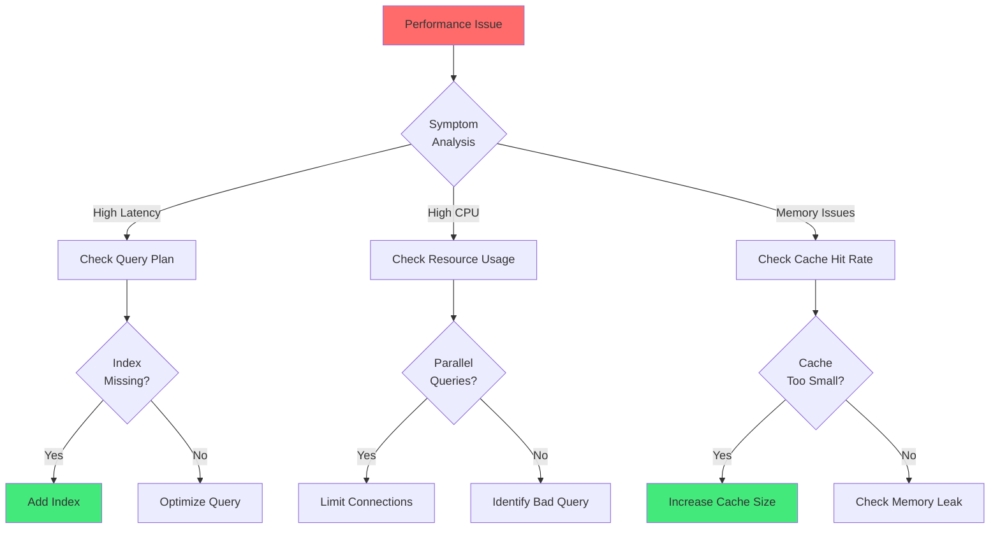
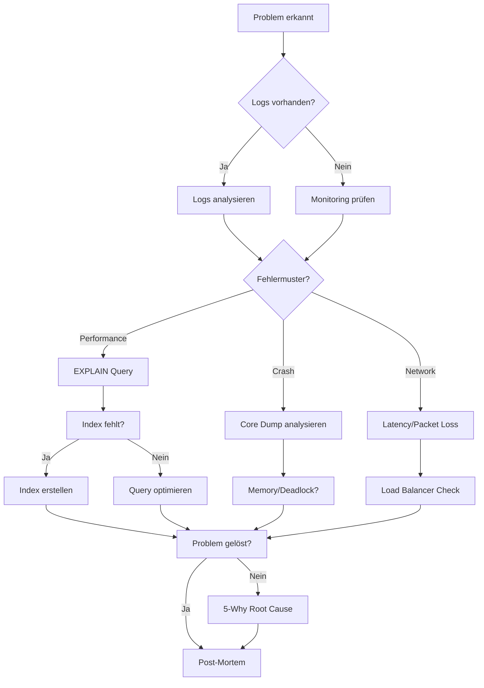

# Kapitel 27: Troubleshooting & Problem Resolution

> *"The difference between a good engineer and a great engineer is how quickly they can diagnose and fix production issues."*

---

## Überblick

Production-Probleme erfordern systematische Diagnose und schnelle Remediation. Dieses Kapitel bietet konkrete Lösungen für häufige ThemisDB-Probleme mit reproduzierbaren Debugging-Workflows.

**Was Sie in diesem Kapitel lernen:**
- Systematische Problemanalyse (5-Why-Methode)
- Performance-Probleme diagnostizieren
- Replikations-Lag beheben
- Out-of-Memory Errors lösen
- Deadlock-Detection & Resolution
- Korrupte Indizes reparieren
- Network Partition Recovery

---



Abb. 27.0: Troubleshooting-Decision-Tree

---

## 27.1 Systematische Problem-Diagnose {#chapter_27_1_systematic_debugging}

Effektive Problemlösung erfordert einen strukturierten Ansatz, der über reaktive Fehlersuche hinausgeht. Wir etablieren in diesem Abschnitt bewährte Debugging-Methodologien, die von Problem-Isolation über hypothesengetriebene Analyse bis hin zu umfassenden Root-Cause-Untersuchungen reichen und in produktiven Umgebungen zuverlässig funktionieren.

### 27.1.1 Problem-Isolationstechniken {#chapter_27_1_1_problem_isolation}

Die systematische Eingrenzung von Fehlern reduziert die Komplexität und führt schneller zur Lösung. Bewährte Isolationstechniken umfassen Binary Search, Divide-and-Conquer sowie komponentenbasierte Fehleranalyse.

**Binary Search Debugging:** Halbierung des Suchraums durch sukzessive Eliminierung von Komponenten oder Codepfaden. Diese Technik eignet sich besonders für Performance-Regressionen und Konfigurationsprobleme.

**Divide-and-Conquer:** Systematische Aufteilung komplexer Systeme in isolierbare Komponenten. Jede Komponente wird einzeln getestet, um die fehlerhafte Einheit zu identifizieren.

**Komponentenbasierte Isolation:** Methodische Trennung von [Datenbankschicht](#glossary_database_layer), [Netzwerk](#glossary_network), [Anwendungslogik](#glossary_application_logic) und [Client](#glossary_client) zur präzisen Fehlerlokalisation.

### 27.1.2 Hypothesengetriebene Debugging-Methodik {#chapter_27_1_2_hypothesis_driven}

Strukturiertes Debugging basiert auf formulierten Hypothesen, die systematisch verifiziert oder falsifiziert werden. Der wissenschaftliche Ansatz verhindert zielloses Trial-and-Error und beschleunigt die Problemlösung erheblich.

**Hypothesenformulierung:** Basierend auf Symptomen, [Logs](#glossary_logs), [Metriken](#glossary_metrics) und Systemverhalten werden konkrete Annahmen über die Fehlerursache entwickelt.

**Experimentelles Testen:** Jede Hypothese wird durch gezielte Tests validiert. Erfolglose Tests eliminieren mögliche Ursachen und verfeinern das Verständnis des Problems.

**Iterative Verfeinerung:** Nach jedem Testdurchlauf wird die Hypothese präzisiert oder verworfen. Dieser iterative Prozess konvergiert gegen die tatsächliche Root Cause.

### 27.1.3 Reproduzierbare Minimal-Beispiele {#chapter_27_1_3_minimal_reproducible}

Ein Minimal Reproducible Example (MRE) ist essentiell für effektives Debugging und Kommunikation mit Support-Teams. Ein gutes MRE eliminiert alle nicht-essentiellen Komponenten und fokussiert auf den minimalen Codepfad, der das Problem reproduziert.

**Erstellung eines MRE:**
- Reduktion auf minimalen Datensatz (z.B. 10 statt 10 Millionen Dokumente)
- Entfernung aller nicht-relevanten [Queries](#glossary_query) und Operationen
- Isolierung spezifischer Konfigurationsparameter
- Dokumentation der exakten Reproduktionsschritte

### 27.1.4 Environment-Vergleich: Dev vs Staging vs Prod {#chapter_27_1_4_environment_comparison}

Unterschiede zwischen Entwicklungs-, Staging- und Produktionsumgebungen sind häufige Fehlerquellen. Ein systematischer Environment-Vergleich identifiziert Diskrepanzen in Konfiguration, Datenvolumen, [Netzwerk-Topologie](#glossary_network_topology) und Ressourcenverfügbarkeit.

**Kritische Vergleichsdimensionen:**
- Datenbank-Konfiguration (Cache-Größe, [Connection Pool](#glossary_connection_pool), [Transaction Timeouts](#glossary_transaction_timeout))
- Hardware-Ressourcen ([CPU](#glossary_cpu), [RAM](#glossary_ram), [Disk I/O](#glossary_disk_io))
- Netzwerk-Latenz zwischen [Cluster-Nodes](#glossary_cluster_node)
- Datenvolumen und Skalierung
- Externe Dependencies (Load Balancer, DNS, Firewalls)

### 27.1.5 Root Cause Analysis: 5 Whys {#chapter_27_1_5_root_cause_5whys}

Die 5-Why-Methode ist eine bewährte Technik zur Identifikation tiefliegender Systemprobleme. Durch iteratives Hinterfragen der unmittelbaren Ursache gelangen wir zur fundamentalen Root Cause, die behoben werden muss.

```
Problem: Query dauert 30 Sekunden statt 100ms

Why 1: Warum ist die Query langsam?
  → Full Collection Scan statt Index-Nutzung

Why 2: Warum wird kein Index genutzt?
  → Filter auf nicht-indexiertes Feld `metadata.custom_field`

Why 3: Warum ist das Feld nicht indexiert?
  → Index wurde nach Schema-Änderung nicht aktualisiert

Why 4: Warum wurde Index nicht aktualisiert?
  → Deployment-Prozess hat Migrations-Step übersprungen

Why 5: Warum wurde Step übersprungen?
  → CI/CD Pipeline hatte keine Pre-Deploy Validation

Root Cause: Fehlende Pre-Deploy Index-Validation
Solution: Pre-Deploy Hook für Schema-Validation hinzufügen
```

### 27.1.6 Fishbone-Diagramme für komplexe Probleme {#chapter_27_1_6_fishbone_diagrams}

Fishbone-Diagramme (Ishikawa) visualisieren multiple Ursachen komplexer Probleme systematisch. Die Kategorisierung nach Menschen, Methoden, Maschinen, Material, Messung und Umgebung ermöglicht holistische Problemanalyse.

**Anwendung bei Datenbank-Problemen:**
- **Methoden:** Deployment-Prozesse, [Backup-Strategien](#glossary_backup), [Monitoring](#glossary_monitoring)
- **Maschinen:** Server-Hardware, [Storage](#glossary_storage), Netzwerk-Infrastruktur
- **Material:** Datenqualität, Schema-Design, [Index-Strategien](#glossary_index_strategy)
- **Messung:** Metriken-Granularität, [Alerting-Schwellwerte](#glossary_alerting_threshold)
- **Umgebung:** Cloud-Provider, Datacenter-Lokation, Compliance-Anforderungen

### 27.1.7 Systematisches Debugging-Script {#chapter_27_1_7_debugging_script}

Ein umfassendes Health-Check-Script automatisiert die initiale Problemanalyse und sammelt kritische Diagnosedaten. Das folgende Bash-Script kombiniert System-, Netzwerk- und Datenbank-Metriken für schnelle Fehleridentifikation.

```bash
#!/bin/bash
# Systematisches Debugging-Skript mit deutschen Kommentaren
# Verwendung: ./debug_themisdb.sh [coordinator_host] [port]

COORDINATOR=${1:-localhost}
PORT=${2:-8529}
BASE_URL="http://${COORDINATOR}:${PORT}"

echo "========================================="
echo "ThemisDB Comprehensive Health Check"
echo "Target: ${BASE_URL}"
echo "Time: $(date '+%Y-%m-%d %H:%M:%S')"
echo "========================================="

# 1. Problem-Symptome sammeln
echo -e "\n=== 1. ThemisDB Version & Status ==="
curl -s ${BASE_URL}/_api/version | jq -r '.version // "ERROR: Cannot connect"'
curl -s ${BASE_URL}/_admin/status | jq '.serverInfo // {error: "Status unavailable"}' 2>/dev/null

# 2. Logs analysieren (letzte 100 Zeilen mit Fehler-Level)
echo -e "\n=== 2. Recent Error Logs (Last 100 lines) ==="
if command -v journalctl &> /dev/null; then
    journalctl -u themisdb -n 100 --no-pager 2>/dev/null | grep -E "ERROR|FATAL|WARN" | tail -20
else
    tail -100 /var/log/themisdb/themisdb.log 2>/dev/null | grep -E "ERROR|FATAL|WARN" | tail -20
fi

# 3. Ressourcen-Auslastung prüfen
echo -e "\n=== 3. Resource Usage ==="
if command -v top &> /dev/null; then
    echo "CPU: $(top -bn1 | grep "Cpu(s)" | awk '{print $2}' | cut -d'%' -f1)%"
fi
echo "Memory: $(free -h | grep Mem | awk '{print $3 " / " $2 " (" int($3/$2 * 100) "%)"}')"
if command -v iostat &> /dev/null; then
    echo "Disk I/O Util: $(iostat -x 1 2 | tail -n +4 | awk 'NR>1 {print $14"%"}' | tail -1)"
fi
df -h /data/themis 2>/dev/null | tail -1 | awk '{print "Disk Space: " $3 " / " $2 " (" $5 " used)"}'

# 4. Netzwerk-Konnektivität testen
echo -e "\n=== 4. Network Connectivity Check ==="
for node in coordinator1:8529 coordinator2:8529 coordinator3:8529; do
    host=$(echo $node | cut -d: -f1)
    port=$(echo $node | cut -d: -f2)
    if timeout 2 bash -c "cat < /dev/null > /dev/tcp/$host/$port" 2>/dev/null; then
        echo "✓ $node reachable"
    else
        echo "✗ $node unreachable"
    fi
done

# 5. Query-Performance analysieren
echo -e "\n=== 5. Slow Queries (Runtime > 1000ms) ==="
curl -s ${BASE_URL}/_api/query/slow -X GET 2>/dev/null | jq '.result[] | {
    query: .query[0:80],
    runtime_ms: .runTime,
    timestamp: .started
}' 2>/dev/null | head -20

# 6. Cluster Health (falls Cluster-Setup)
echo -e "\n=== 6. Cluster Health Status ==="
curl -s ${BASE_URL}/_admin/cluster/health 2>/dev/null | jq '.Health // {error: "Not a cluster or unavailable"}' | head -30

# 7. Connection Pool Status
echo -e "\n=== 7. Connection Pool Status ==="
netstat -an 2>/dev/null | grep ":${PORT} " | awk '{print $6}' | sort | uniq -c

# 8. Memory Statistics
echo -e "\n=== 8. ThemisDB Memory Usage ==="
curl -s ${BASE_URL}/_admin/statistics | jq '.memory // {error: "Memory stats unavailable"}' 2>/dev/null

echo -e "\n========================================="
echo "Health Check Complete"
echo "========================================="
```

### 27.1.8 Debugging-Techniken im Vergleich {#chapter_27_1_8_debugging_comparison}

Die Wahl der richtigen Debugging-Technik ist entscheidend für effiziente Problemlösung. Die folgende Tabelle vergleicht gängige Ansätze hinsichtlich Zeitaufwand, Genauigkeit und erforderlicher Expertise.

| Debugging-Technik | Zeit bis Lösung | Genauigkeit | Skill Level | Best For |
|-------------------|-----------------|-------------|-------------|----------|
| Log Review | 5-30 min | Mittel | Beginner | Error Messages, Exceptions |
| Binary Search | 10-60 min | Hoch | Intermediate | Configuration Issues, Regressions |
| Query Profiling (EXPLAIN) | 5-20 min | Sehr Hoch | Intermediate | Performance Problems |
| Memory Profiling | 30-120 min | Sehr Hoch | Advanced | Memory Leaks, OOM |
| Trace Analysis | 15-45 min | Hoch | Intermediate | Request Flow, Latency |
| Core Dump Analysis | 60-240 min | Sehr Hoch | Expert | Crashes, Segfaults |
| Network Packet Capture | 20-90 min | Hoch | Advanced | Connection Issues, Timeouts |
| Stress Testing | 45-180 min | Mittel | Intermediate | Load-Related Issues |

**Empfehlungen für die Technik-Auswahl:**
- **Beginner:** Starten Sie mit Log Review und Query Profiling
- **Intermediate:** Kombinieren Sie Binary Search mit Trace Analysis
- **Advanced:** Nutzen Sie Memory/Network Profiling für komplexe Probleme
- **Expert:** Core Dumps und Kernel-Level Debugging für kritische Crashes



### Diagnostic Checklist

```bash
#!/bin/bash
# troubleshoot.sh: Schneller Healthcheck

echo "=== ThemisDB Health Check ==="

# 1. Cluster Status
echo "1. Cluster Status:"
curl -s http://localhost:8529/_admin/cluster/health | jq .

# 2. Memory Usage
echo "2. Memory Usage:"
curl -s http://localhost:8529/_admin/statistics | jq '.memory'

# 3. Slow Queries (>1s)
echo "3. Slow Queries:"
curl -s http://localhost:8529/_admin/slow-queries?threshold=1000

# 4. Replication Lag
echo "4. Replication Lag:"
curl -s http://localhost:8529/_admin/replication/lag

# 5. Connection Pool
echo "5. Active Connections:"
netstat -an | grep :8529 | wc -l

# 6. Disk Space
echo "6. Disk Space:"
df -h /data/themis

# 7. Last Errors
echo "7. Recent Errors:"
journalctl -u themis -n 50 --no-pager | grep ERROR
```

---

## 27.2 Log-Analyse & Monitoring {#chapter_27_2_log_analysis}

Logs sind die primäre Informationsquelle für Debugging in produktiven Systemen. Dieses Kapitel behandelt systematische Log-Analyse, strukturiertes Logging mit JSON-Formaten, Log-Aggregation mit ELK Stack und Loki, sowie fortgeschrittene Techniken wie Correlation IDs für verteiltes Tracing.

### 27.2.1 Log-Level und Severity-Klassifikation {#chapter_27_2_1_log_levels}

Strukturierte Log-Level ermöglichen präzise Filterung und Priorisierung von Log-Nachrichten. ThemisDB nutzt standardisierte Severity-Level für konsistentes Logging über alle Komponenten hinweg.

**Log-Level-Hierarchie:**
- **TRACE:** Detaillierte Debug-Informationen (nur Development)
- **DEBUG:** Diagnostic-Informationen für Entwickler und Support
- **INFO:** Normale Betriebsinformationen (Startup, Shutdown, Config)
- **WARN:** Potenzielle Probleme, die überwacht werden sollten
- **ERROR:** Fehler, die sofortige Aufmerksamkeit erfordern
- **FATAL:** Kritische Fehler, die zum System-Crash führen

**Best Practices für Log-Level:**
- Produktionsumgebungen: INFO und höher
- Staging: DEBUG für detaillierte Diagnose
- Development: TRACE für vollständige Transparenz
- Dynamische Log-Level-Anpassung zur Laufzeit für Debugging ohne Neustart

### 27.2.2 Strukturiertes Logging mit JSON {#chapter_27_2_2_structured_logging}

Strukturiertes Logging in JSON-Format ermöglicht automatisierte Parsing, Filterung und Aggregation. Jede Log-Nachricht enthält strukturierte Felder statt unformatierter Strings, was maschinelle Verarbeitung erheblich vereinfacht.

**Beispiel JSON-Log-Entry:**
```json
{
  "timestamp": "2025-01-15T10:30:45.123Z",
  "level": "ERROR",
  "component": "query_executor",
  "message": "Query execution failed",
  "query_id": "q-1234567890",
  "correlation_id": "req-abc-def-123",
  "user": "alice@example.com",
  "collection": "users",
  "error_code": "ERR_INDEX_MISSING",
  "duration_ms": 15234,
  "stack_trace": "..."
}
```

**Vorteile strukturierter Logs:**
- Automatische Filterung nach beliebigen Feldern
- Aggregation und statistische Analyse
- Korrelation über verteilte Systeme hinweg
- Integration mit Log-Management-Tools (Elasticsearch, Splunk)

### 27.2.3 Log-Aggregation: ELK Stack & Loki {#chapter_27_2_3_log_aggregation}

In verteilten Systemen ist zentrale Log-Aggregation essentiell. Der [ELK Stack](#glossary_elk_stack) (Elasticsearch, Logstash, Kibana) und [Grafana Loki](#glossary_loki) sind etablierte Lösungen für Log-Zentralisierung, Indexierung und Visualisierung.

**ELK Stack für ThemisDB:**
- **Elasticsearch:** Indexierung und Suche in Millionen Log-Einträgen
- **Logstash:** Log-Parsing, -Transformation und -Routing
- **Kibana:** Visualisierung und Dashboard-Erstellung

**Grafana Loki Alternative:**
- Optimiert für Kubernetes-Umgebungen
- Label-basierte Indexierung (effizienter als Full-Text-Index)
- Nahtlose Integration mit Prometheus und Grafana
- Geringerer Ressourcenverbrauch als Elasticsearch

**Logstash Pipeline-Konfiguration:**
```ruby
# /etc/logstash/conf.d/themisdb.conf
input {
  file {
    path => "/var/log/themisdb/*.log"
    start_position => "beginning"
    codec => "json"
  }
}

filter {
  # Füge Hostname hinzu
  mutate {
    add_field => { "hostname" => "%{host}" }
  }
  
  # Parse Error Codes
  if [level] == "ERROR" {
    grok {
      match => { "message" => "ERR_%{WORD:error_category}" }
    }
  }
  
  # Zeitstempel normalisieren
  date {
    match => [ "timestamp", "ISO8601" ]
    target => "@timestamp"
  }
}

output {
  elasticsearch {
    hosts => ["elasticsearch:9200"]
    index => "themisdb-logs-%{+YYYY.MM.dd}"
  }
}
```

### 27.2.4 Correlation IDs für Request Tracing {#chapter_27_2_4_correlation_ids}

[Correlation IDs](#glossary_correlation_id) ermöglichen das Verfolgen einzelner Requests durch verteilte Systeme. Jeder eingehende Request erhält eine eindeutige ID, die in allen Log-Einträgen mitgeführt wird und End-to-End-Tracing ermöglicht.

**Implementierung:**
- Client generiert oder empfängt Correlation ID im HTTP-Header (`X-Correlation-ID`)
- ThemisDB propagiert ID durch alle internen Komponenten
- Alle Logs des Request-Pfads enthalten identische Correlation ID
- Cross-Service-Tracking über Microservice-Grenzen hinweg

**Beispiel-Log-Kette mit Correlation ID:**
```
[INFO]  correlation_id=req-xyz-789 component=api_gateway  "Request received: POST /api/users"
[DEBUG] correlation_id=req-xyz-789 component=auth         "User authenticated: alice@example.com"
[DEBUG] correlation_id=req-xyz-789 component=query_exec   "Query compiled successfully"
[ERROR] correlation_id=req-xyz-789 component=storage      "Index lookup failed: idx_email"
[INFO]  correlation_id=req-xyz-789 component=api_gateway  "Response sent: 500 Internal Error"
```

### 27.2.5 Häufige Fehlermuster und Signaturen {#chapter_27_2_5_error_patterns}

Die Identifikation wiederkehrender Fehlermuster beschleunigt Debugging erheblich. Wir kategorisieren häufige ThemisDB-Fehler nach Symptomen, Root Causes und Standard-Lösungen.

**Typische Fehlersignaturen:**

**1. Connection Pool Exhaustion:**
```
ERROR: Could not acquire connection from pool (timeout after 30000ms)
Pattern: 100+ similar errors within 60 seconds
Root Cause: Connection leak oder zu niedriger maxConnections-Wert
Solution: Increase connection pool size oder Connection leak fixen
```

**2. Transaction Deadlock:**
```
ERROR: Transaction aborted due to deadlock detection
Pattern: Multiple transactions accessing same resources in different order
Root Cause: Inkonsistente Lock-Ordering
Solution: Enforce consistent resource access order
```

**3. Index Corruption:**
```
ERROR: Index lookup returned inconsistent results (expected 1, got 3)
Pattern: Sporadic incorrect query results
Root Cause: Disk corruption oder unvollständiger Write
Solution: Rebuild index mit DROP INDEX / CREATE INDEX
```

### 27.2.6 Python Log-Analyse-Script {#chapter_27_2_6_python_log_analysis}

Automatisierte Log-Analyse identifiziert Trends, Anomalien und kritische Probleme schneller als manuelle Inspektion. Das folgende Python-Script analysiert ThemisDB JSON-Logs und generiert aussagekräftige Reports.

```python
# log_analyzer.py - Log-Analyse mit Python und deutschen Kommentaren
import json
import re
from collections import Counter, defaultdict
from datetime import datetime, timedelta
from pathlib import Path

def parse_themisdb_logs(logfile):
    """
    Analysiert ThemisDB JSON-Logs und extrahiert Fehler-Statistiken.
    
    Args:
        logfile: Pfad zur Log-Datei
        
    Returns:
        Tuple: (errors_by_type, errors_by_hour, slow_queries)
    """
    errors_by_type = Counter()
    errors_by_hour = defaultdict(int)
    slow_queries = []
    total_logs = 0
    parse_errors = 0
    
    with open(logfile, 'r') as f:
        for line_num, line in enumerate(f, 1):
            try:
                log = json.loads(line)
                total_logs += 1
                
                # Zähle Fehler nach Typ
                if log.get('level') in ['ERROR', 'FATAL']:
                    error_msg = log.get('message', '')
                    # Extrahiere Error-Code (z.B. ERR_INDEX_MISSING)
                    error_match = re.search(r'(ERR_\w+)', error_msg)
                    error_type = error_match.group(1) if error_match else error_msg.split(':')[0]
                    errors_by_type[error_type] += 1
                    
                    # Zeitliche Verteilung der Fehler
                    timestamp = datetime.fromisoformat(log['timestamp'].replace('Z', '+00:00'))
                    hour = timestamp.replace(minute=0, second=0, microsecond=0)
                    errors_by_hour[hour] += 1
                
                # Identifiziere langsame Queries (>1000ms)
                if 'query_time_ms' in log and log['query_time_ms'] > 1000:
                    slow_queries.append({
                        'query': log.get('query', 'N/A'),
                        'time_ms': log['query_time_ms'],
                        'timestamp': log['timestamp'],
                        'collection': log.get('collection', 'unknown')
                    })
                    
            except json.JSONDecodeError:
                parse_errors += 1
                continue
            except Exception as e:
                print(f"Warning: Error parsing line {line_num}: {e}")
                continue
    
    # === Report generieren ===
    print("=" * 60)
    print(f"ThemisDB Log Analysis Report")
    print(f"Total Log Entries: {total_logs:,}")
    print(f"Parse Errors: {parse_errors}")
    print("=" * 60)
    
    print("\n=== Top 10 Fehler-Typen ===")
    for error, count in errors_by_type.most_common(10):
        percentage = (count / total_logs) * 100
        print(f"{error:40s}: {count:5d} occurrences ({percentage:.2f}%)")
    
    print("\n=== Fehler-Häufigkeit pro Stunde ===")
    if errors_by_hour:
        sorted_hours = sorted(errors_by_hour.keys())
        for hour in sorted_hours[-24:]:  # Letzte 24 Stunden
            bar = '█' * min(errors_by_hour[hour], 50)
            print(f"{hour.strftime('%Y-%m-%d %H:00')}: {bar} ({errors_by_hour[hour]} errors)")
    
    print(f"\n=== Langsame Queries: {len(slow_queries)} gefunden ===")
    # Top 5 langsamste Queries
    for q in sorted(slow_queries, key=lambda x: x['time_ms'], reverse=True)[:5]:
        print(f"{q['time_ms']:6d}ms | Collection: {q['collection']:15s} | Query: {q['query'][:60]}...")
    
    # === Anomalie-Detektion ===
    print("\n=== Anomalie-Detektion ===")
    if errors_by_hour:
        avg_errors = sum(errors_by_hour.values()) / len(errors_by_hour)
        max_errors = max(errors_by_hour.values())
        if max_errors > avg_errors * 3:
            peak_hour = max(errors_by_hour, key=errors_by_hour.get)
            print(f"⚠ ALERT: Fehler-Spike erkannt!")
            print(f"   Peak: {peak_hour.strftime('%Y-%m-%d %H:00')} mit {max_errors} Fehlern")
            print(f"   Average: {avg_errors:.1f} Fehler/Stunde")
    
    return errors_by_type, errors_by_hour, slow_queries

# === Hauptprogramm ===
if __name__ == "__main__":
    import sys
    
    if len(sys.argv) < 2:
        print("Usage: python log_analyzer.py <logfile>")
        print("Example: python log_analyzer.py /var/log/themisdb/themisdb.log")
        sys.exit(1)
    
    logfile = sys.argv[1]
    if not Path(logfile).exists():
        print(f"Error: Logfile not found: {logfile}")
        sys.exit(1)
    
    errors, hourly, slow = parse_themisdb_logs(logfile)
    
    # Export für weitere Analyse
    output = {
        'timestamp': datetime.now().isoformat(),
        'total_errors': sum(errors.values()),
        'unique_error_types': len(errors),
        'slow_queries_count': len(slow)
    }
    
    with open('log_analysis_summary.json', 'w') as f:
        json.dump(output, f, indent=2)
    
    print("\n✓ Analysis complete. Summary saved to log_analysis_summary.json")
```

### Problem: Langsame Queries

**Symptom:** Query dauert >5 Sekunden  
**Diagnose:**

```aql
-- Query mit EXPLAIN analysieren
EXPLAIN FOR u IN users
  FILTER u.email == 'alice@example.com'
  RETURN u

-- Ausgabe prüfen:
{
  "plan": {
    "nodes": [
      {"type": "SingletonNode"},
      {"type": "EnumerateCollectionNode", "collection": "users"},  // ❌ SCHLECHT: Full Scan
      {"type": "FilterNode"},
      {"type": "ReturnNode"}
    ]
  },
  "stats": {
    "executionTime": 5.234,
    "scannedFull": 1000000  // ❌ 1M Dokumente gescannt
  }
}
```

**Solution:**

```aql
-- Index erstellen
CREATE INDEX idx_users_email ON users (email)

-- Erneut EXPLAIN
EXPLAIN FOR u IN users
  FILTER u.email == 'alice@example.com'
  RETURN u

-- Jetzt mit Index:
{
  "plan": {
    "nodes": [
      {"type": "SingletonNode"},
      {"type": "IndexNode", "index": "idx_users_email"},  // ✅ GUT: Index genutzt
      {"type": "ReturnNode"}
    ]
  },
  "stats": {
    "executionTime": 0.023,  // ✅ 200x schneller
    "scannedIndex": 1
  }
}
```

### Problem: High CPU Usage

**Symptom:** CPU >90% dauerhaft  
**Diagnose:**

```bash
# Top Queries nach CPU-Zeit
curl -s http://localhost:8529/_admin/query-stats \
  | jq '.queries | sort_by(.cpu_time) | reverse | .[0:10]'

# Beispiel-Output:
[
  {
    "query": "FOR doc IN large_collection RETURN doc",
    "cpu_time": 45.2,
    "count": 120,
    "avg_duration_ms": 8500
  }
]
```

**Solution:**

```aql
-- Option 1: Query optimieren (Projection)
FOR doc IN large_collection
  RETURN {id: doc._id, name: doc.name}  -- Nur benötigte Felder

-- Option 2: Limit hinzufügen
FOR doc IN large_collection
  LIMIT 100
  RETURN doc

-- Option 3: Background-Job für Batch-Processing
FOR doc IN large_collection
  FILTER doc.needs_processing == true
  UPDATE doc WITH {needs_processing: false, processed_at: DATE_NOW()}
  OPTIONS {waitForSync: false}  -- Async I/O
```

---

## 27.3 Performance-Troubleshooting {#chapter_27_3_performance_troubleshooting}

Performance-Probleme manifestieren sich in Form von erhöhter Latenz, Throughput-Degradation oder Ressourcen-Erschöpfung. Wir etablieren systematische Ansätze zur Identifikation und Behebung von Performance-Bottlenecks durch Query-Profiling, Index-Analyse, Memory- und CPU-Monitoring sowie I/O-Optimierung.

### 27.3.1 Query Performance Profiling mit EXPLAIN {#chapter_27_3_1_explain_profiling}

Der [EXPLAIN](#glossary_explain)-Befehl ist das primäre Werkzeug zur Query-Optimierung. Er visualisiert den [Execution Plan](#glossary_execution_plan), identifiziert ineffiziente Operationen und quantifiziert die geschätzten Kosten jeder Operation.

**EXPLAIN-Analyse Workflow:**
1. Query mit EXPLAIN ausführen und Execution Plan inspizieren
2. [Collection Scans](#glossary_collection_scan) identifizieren (ineffizient bei großen Collections)
3. [Index Usage](#glossary_index_usage) verifizieren
4. Estimated Cost mit tatsächlicher Runtime korrelieren
5. Optimierungen implementieren (Indizes, Query-Rewrite)
6. EXPLAIN erneut ausführen und Verbesserung validieren

**Interpretation kritischer Execution Nodes:**
- **SingletonNode:** Startpunkt jeder Query (overhead vernachlässigbar)
- **EnumerateCollectionNode:** Full Collection Scan (❌ vermeiden bei >10k Docs)
- **IndexNode:** Index-basiertes Lookup (✅ optimal für selektive Queries)
- **FilterNode:** Post-Index Filterung (akzeptabel für kleine Result Sets)
- **SortNode:** In-Memory Sortierung (RAM-intensiv bei großen Results)
- **AggregateNode:** Gruppierung und Aggregation (CPU-intensiv)

### 27.3.2 Index-Analyse und Missing Index Detection {#chapter_27_3_2_index_analysis}

Fehlende oder ineffiziente Indizes sind die häufigste Ursache für Query-Performance-Probleme. Systematische Index-Analyse identifiziert Missing Indizes, Unused Indizes und Sub-optimal konfigurierte Indizes.

**Index Coverage Analysis:**
- Query-Workload gegen bestehende Indizes matchen
- Coverage Ratio berechnen: (indexed queries) / (total queries)
- Indizes mit Selectivity < 0.1 prüfen (möglicherweise ineffizient)
- Composite Indizes für Multi-Column Filter evaluieren

**Empfehlungen für Index-Strategien:**
- **High-Cardinality Columns:** B-Tree Index für Equality & Range Queries
- **Low-Cardinality Columns:** Bitmap Index (Status-Felder: active/inactive)
- **Full-Text Search:** Inverted Index mit Stemming und Stopwords
- **Geospatial Data:** R-Tree Index für Location-based Queries
- **Composite Indizes:** Multi-Column für häufige Filter-Kombinationen

### 27.3.3 Memory Pressure & Garbage Collection {#chapter_27_3_3_memory_pressure}

Hohe [Memory Pressure](#glossary_memory_pressure) führt zu Garbage Collection Pauses, erhöhtem Paging und System-Instabilität. Wir identifizieren Memory-Bottlenecks durch Heap-Analyse, GC-Logs und Memory-Profiling.

**Memory-Komponenten in ThemisDB:**
- **Query Result Buffer:** Temporärer Speicher für große Result Sets
- **[Cache Layer](#glossary_cache_layer):** Buffer Cache, Query Cache, Index Cache
- **Connection Buffers:** Per-Connection Memory Allocation
- **Transaction Log:** In-Memory Write-Ahead Log Buffer
- **Operational Overhead:** Internal Data Structures, Metadata

**GC-Tuning für ThemisDB:**
```bash
# JVM GC Tuning (falls Java-basiert)
-XX:+UseG1GC                    # G1 Garbage Collector (optimal für große Heaps)
-XX:MaxGCPauseMillis=200        # Max 200ms GC Pause
-XX:InitiatingHeapOccupancy=45  # GC bei 45% Heap-Auslastung
-Xms16g -Xmx16g                 # Fixed Heap Size (vermeidet Resize)
```

### 27.3.4 CPU Saturation & Thread Contention {#chapter_27_3_4_cpu_saturation}

CPU-Sättigung entsteht durch rechenintensive Queries, ineffiziente Algorithmen oder exzessive [Thread Contention](#glossary_thread_contention). Wir nutzen CPU-Profiling, Thread-Dumps und Lock-Analyse zur Identifikation von Bottlenecks.

**CPU-Hotspot-Analyse:**
- Query Compilation (bei hoher Query-Diversität)
- Aggregation Operations (GROUP BY, DISTINCT)
- Sorting von großen Result Sets
- Index-Maintenance bei hohem Write-Throughput
- JSON Serialization/Deserialization

**Thread Contention Patterns:**
```
# Thread-Dump Analyse
- BLOCKED: Threads warten auf Lock (Lock Contention)
- WAITING: Threads im Wartezustand (Pool Exhaustion)
- RUNNABLE: Aktive Threads (CPU-bound)

# Diagnose mit jstack (Java) oder pstack (C++)
jstack <pid> | grep -A 5 "BLOCKED"
```

### 27.3.5 I/O Bottlenecks und Disk Latency {#chapter_27_3_5_io_bottlenecks}

Disk I/O ist häufig der limitierende Faktor bei datenbankintensiven Workloads. Wir analysieren [IOPS](#glossary_iops), Latency und Throughput zur Identifikation von Storage-Bottlenecks und evaluieren Optimierungen wie SSDs, Caching und I/O-Scheduling.

**I/O-Metriken:**
- **Read IOPS:** Anzahl Read Operations pro Sekunde
- **Write IOPS:** Anzahl Write Operations pro Sekunde
- **Latency:** Durchschnittliche I/O-Completion Time (ms)
- **Queue Depth:** Anzahl wartender I/O-Requests
- **Throughput:** MB/s Read/Write Bandwidth

**I/O-Optimierungen:**
1. **Storage Upgrade:** HDD → SSD → NVMe (10x-100x Latency-Verbesserung)
2. **Cache-Tuning:** Buffer Cache erhöhen für häufig genutzte Daten
3. **I/O Scheduler:** deadline oder noop für SSDs
4. **Write Coalescing:** Batch Writes für höheren Throughput
5. **Read-Ahead:** Prefetching für sequential Scans

### 27.3.6 Performance-Analyse JavaScript-Beispiel {#chapter_27_3_6_javascript_performance_example}

Das folgende JavaScript-Beispiel demonstriert systematische Performance-Analyse mit EXPLAIN, Index-Empfehlungen und automatischer Index-Erstellung.

```javascript
// performance_analyzer.js - Performance-Analyse mit AQL EXPLAIN und deutschen Kommentaren
const db = require('@arangodb').db;

// === Schritt 1: Identifiziere langsame Query ===
function analyzeSlowQuery(collectionName, filterField, filterValue) {
    console.log("=== Performance Analysis: " + collectionName + " ===\n");
    
    // Query definieren
    const query = `
        FOR doc IN ${collectionName}
            FILTER doc.${filterField} == @value
            SORT doc.score DESC
            LIMIT 100
            RETURN doc
    `;
    
    const bindVars = { value: filterValue };
    
    // === Schritt 2: EXPLAIN zeigt Execution Plan ===
    console.log("Step 1: Analyzing Execution Plan...");
    const plan = db._createStatement({
        query: query,
        bindVars: bindVars
    }).explain();
    
    console.log("Execution Nodes:", plan.plan.nodes.map(n => n.type).join(" → "));
    console.log("Total Estimated Cost:", plan.plan.estimatedCost.toFixed(2));
    console.log("Estimated Nr of Results:", plan.plan.estimatedNrItems);
    
    // === Schritt 3: Analysiere Index-Nutzung ===
    console.log("\nStep 2: Index Usage Analysis...");
    let hasFullScan = false;
    let usedIndex = null;
    
    plan.plan.nodes.forEach(node => {
        if (node.type === 'IndexNode') {
            usedIndex = node.indexes[0];
            console.log(`✓ Index verwendet: ${usedIndex.type} auf [${usedIndex.fields.join(', ')}]`);
            console.log(`  Selectivity: ${(usedIndex.selectivityEstimate * 100).toFixed(2)}%`);
        } else if (node.type === 'EnumerateCollectionNode') {
            hasFullScan = true;
            console.log("⚠ WARNING: Full Collection Scan detected!");
            console.log(`  Collection: ${node.collection}`);
            console.log(`  Documents scanned: ~${node.estimatedNrItems}`);
        }
    });
    
    // === Schritt 4: Warnungen und Empfehlungen ===
    if (plan.warnings && plan.warnings.length > 0) {
        console.log("\n=== Warnings & Recommendations ===");
        plan.warnings.forEach(w => {
            console.log(`⚠ ${w.code}: ${w.message}`);
        });
    }
    
    // === Schritt 5: Index-Empfehlung und automatische Erstellung ===
    if (hasFullScan && !usedIndex) {
        console.log("\n=== Index Recommendation ===");
        const recommendedIndex = {
            type: "persistent",
            fields: [filterField],
            name: `idx_${collectionName}_${filterField}`
        };
        
        console.log(`Recommended Index: ${JSON.stringify(recommendedIndex, null, 2)}`);
        
        // Prüfe ob Index bereits existiert
        const collection = db._collection(collectionName);
        const existingIndexes = collection.indexes();
        const indexExists = existingIndexes.some(idx => 
            idx.fields && idx.fields.length === 1 && idx.fields[0] === filterField
        );
        
        if (!indexExists) {
            console.log("\nCreating recommended index...");
            try {
                collection.ensureIndex(recommendedIndex);
                console.log("✓ Index created successfully!");
                
                // === Schritt 6: Query erneut analysieren ===
                console.log("\nRe-analyzing with new index...");
                const newPlan = db._createStatement({
                    query: query,
                    bindVars: bindVars
                }).explain();
                
                console.log("New Estimated Cost:", newPlan.plan.estimatedCost.toFixed(2));
                const improvement = ((plan.plan.estimatedCost - newPlan.plan.estimatedCost) / plan.plan.estimatedCost * 100);
                console.log(`Performance Improvement: ${improvement.toFixed(1)}%`);
            } catch (e) {
                console.log(`✗ Index creation failed: ${e.message}`);
            }
        } else {
            console.log("Index already exists, no action needed.");
        }
    } else if (usedIndex) {
        console.log("\n✓ Query is well-optimized with existing index.");
    }
    
    // === Schritt 7: Führe Query aus und messe echte Runtime ===
    console.log("\n=== Actual Query Execution ===");
    const start = Date.now();
    const cursor = db._query(query, bindVars);
    const results = cursor.toArray();
    const duration = Date.now() - start;
    
    console.log(`Execution Time: ${duration}ms`);
    console.log(`Results Returned: ${results.length}`);
    
    // Performance-Rating
    if (duration < 100) {
        console.log("Performance Rating: ✓✓✓ Excellent (<100ms)");
    } else if (duration < 1000) {
        console.log("Performance Rating: ✓✓ Good (<1s)");
    } else if (duration < 5000) {
        console.log("Performance Rating: ✓ Acceptable (<5s)");
    } else {
        console.log("Performance Rating: ✗ Poor (>5s) - Optimization required!");
    }
}

// === Beispiel-Verwendung ===
// analyzeSlowQuery('users', 'status', 'active');
// analyzeSlowQuery('orders', 'created_at', '2025-01-01');

module.exports = { analyzeSlowQuery };
```

### 27.3.7 Performance-Probleme Benchmark-Tabelle {#chapter_27_3_7_performance_benchmark}

Die folgende Tabelle kategorisiert häufige Performance-Probleme mit typischen Symptomen, Detektionsmethoden, Standard-Lösungen und durchschnittlicher Resolutionszeit.

| Performance Issue | Symptom | Detection Method | Typical Fix | Resolution Time |
|-------------------|---------|------------------|-------------|-----------------|
| Missing Index | Queries >1s | EXPLAIN plan zeigt EnumerateCollection | Add persistent index | 5-15 min |
| Memory Leak | OOM errors, restart | Heap profiling, GC logs | Fix code leak oder restart | 1-4 hours |
| CPU Saturation | High load avg (>80%) | top/htop, CPU profiling | Scale up oder optimize query | 30-90 min |
| Disk I/O Bottleneck | Slow writes, high latency | iostat, iotop | Better storage (SSD/NVMe) | 1-2 hours |
| Network Latency | Timeout errors, high RTT | ping, traceroute, tcpdump | Network config, colocation | Variable |
| Lock Contention | Transaction timeouts | Thread dumps, lock analysis | Reduce lock scope, retry logic | 30-120 min |
| Large Result Sets | Memory spike, OOM | Query profiling, memory monitoring | Add LIMIT, pagination | 10-30 min |
| Inefficient Join | Cartesian product explosion | EXPLAIN plan, runtime analysis | Rewrite query, add filters | 30-90 min |
| Cache Miss | High disk I/O, low throughput | Cache hit ratio monitoring | Increase cache size | 15-30 min |
| GC Pauses | Periodic latency spikes | GC logs, JVM metrics | Tune GC parameters | 30-60 min |

**Prioritätsbasierte Problemlösung:**
1. **Critical (Sofort):** Missing Index bei Production-Queries, OOM-Crashes
2. **High (Heute):** CPU Saturation >90%, Disk I/O Bottlenecks
3. **Medium (Diese Woche):** Lock Contention, Inefficient Joins
4. **Low (Geplant):** Cache Tuning, GC Optimierung

---

## 27.4 Cluster & Replikations-Probleme {#chapter_27_4_cluster_replication}

Verteilte Datenbanksysteme bringen spezifische Herausforderungen mit sich, die von Split-Brain-Szenarien über Quorum-Verlust bis hin zu Replication Lag und Shard-Imbalance reichen. Wir behandeln systematische Diagnose und Remediation von Cluster-Problemen in produktiven ThemisDB-Umgebungen.

### 27.4.1 Split-Brain-Szenarien und Quorum-Verlust {#chapter_27_4_1_split_brain}

[Split-Brain](#glossary_split_brain) tritt auf, wenn ein [Cluster](#glossary_cluster) durch Netzwerk-Partition in isolierte Segmente zerfällt, die jeweils glauben, der Master zu sein. Dies führt zu inkonsistenten Schreiboperationen und erfordert manuelle Intervention.

**Quorum-basierte Konfliktlösung:**
- ThemisDB nutzt Majority Quorum (N/2 + 1) für Schreiboperationen
- Bei <3 Nodes: Kein Quorum möglich bei Single-Node-Failure
- Bei 3+ Nodes: Toleranz für Minderheit der Nodes (z.B. 2/3 Nodes up = funktional)

**Split-Brain Prevention:**
```bash
# Fencing-Mechanismus in Cluster-Config
[cluster]
quorum_type = "majority"
min_quorum_size = 2
auto_rejoin_timeout = 300s
split_brain_resolver = "primary_priority"  # Konfliktlösung-Strategie
```

**Recovery nach Network Partition:**
1. Netzwerk-Konnektivität wiederherstellen
2. Identifiziere Primary Partition (mit aktuellster Daten-Version)
3. Sekundäre Partitionen zurücksetzen und neu synchronisieren
4. Verifiziere Quorum und Cluster Health

### 27.4.2 Replication Lag Diagnose {#chapter_27_4_2_replication_lag}

[Replication Lag](#glossary_replication_lag) bezeichnet die Zeitverzögerung zwischen Schreiboperationen auf dem Primary und deren Replikation zu Secondaries. Hoher Lag gefährdet Read Consistency und erhöht das Risiko von Datenverlusten bei Failover.

**Lag-Metriken:**
- **Time-based Lag:** Zeitdifferenz zwischen Primary und Replica (Sekunden/Minuten)
- **Operation-based Lag:** Anzahl ausstehender Replikations-Operations
- **Byte-based Lag:** Volumen nicht-replizierter Daten (MB/GB)

### Problem: Replication Lag

**Symptom:** Replica ist 5 Minuten hinter Primary  
**Diagnose:**

```bash
# Replication Status prüfen
curl http://localhost:8529/_admin/replication/status

# Output:
{
  "primary": "node-1",
  "replica": "node-2",
  "lag_seconds": 300,
  "last_applied_timestamp": "2025-12-31T22:55:00Z",
  "pending_operations": 15000
}
```

**Root Causes & Solutions:**

**1. Netzwerk-Latenz:**
```bash
# Latenz messen
ping node-2
# > 50ms → Problem!

# Lösung: Gleiche Region/AZ nutzen
terraform apply -var="replica_region=eu-central-1"
```

**2. Replica überlastet:**
```bash
# CPU/Memory auf Replica prüfen
ssh node-2 "top -b -n 1 | head -20"

# Lösung: Replica upgraden
kubectl scale statefulset themis-replica --replicas=0
kubectl set resources statefulset themis-replica \
  --limits=cpu=8,memory=32Gi
kubectl scale statefulset themis-replica --replicas=1
```

**3. Zu viele Schreibvorgänge:**
```aql
-- Schreibrate reduzieren mit Batching
LET batch = @documents  -- Array von 1000 Docs
FOR doc IN batch
  INSERT doc INTO collection
  OPTIONS {waitForSync: false}  -- Async für höheren Throughput
```

### 27.4.3 Coordinator-Unavailability und Failover {#chapter_27_4_3_coordinator_failover}

[Coordinators](#glossary_coordinator) sind kritische Komponenten in ThemisDB-Clustern, die Query-Routing und Transaction-Coordination übernehmen. Ihr Ausfall erfordert automatisches oder manuelles [Failover](#glossary_failover) zu Backup-Coordinators.

**Automated Failover mit Health Checks:**
```yaml
# Load Balancer Health Check Configuration
health_check:
  endpoint: "/_admin/server/availability"
  interval: 5s
  timeout: 2s
  unhealthy_threshold: 3
  healthy_threshold: 2
```

### 27.4.4 Shard Rebalancing Issues {#chapter_27_4_4_shard_rebalancing}

Ungleiche [Shard](#glossary_shard)-Verteilung führt zu Hotspots, wo einzelne Nodes überlastet werden während andere idle sind. Automatisches oder manuelles Rebalancing verteilt Last gleichmäßig.

**Shard Distribution Analysis:**
```bash
# Prüfe Shard-Verteilung pro Node
curl -s http://localhost:8529/_admin/cluster/shardDistribution | \
  jq '.results | group_by(.leader) | map({node: .[0].leader, shards: length})'
```

### 27.4.5 Network Partition Recovery {#chapter_27_4_5_network_partition_recovery}

Nach Behebung einer [Netzwerkpartition](#glossary_network_partition) müssen isolierte Nodes rejoin und resynchronisiert werden. Der Prozess umfasst Validation, Catch-up Replication und Quorum-Wiederherstellung.

### 27.4.6 Cluster Health Check Script {#chapter_27_4_6_cluster_health_script}

Das folgende Bash-Script führt umfassende Cluster-Healthchecks durch, identifiziert degradierte Nodes und prüft Replication Status.

```bash
#!/bin/bash
# Cluster Health Check mit deutschen Kommentaren
# Verwendung: ./cluster_health_check.sh [coordinator_host] [port]

COORDINATOR=${1:-localhost}
PORT=${2:-8529}
BASE_URL="http://${COORDINATOR}:${PORT}"

echo "========================================="
echo "ThemisDB Cluster Health Check"
echo "Coordinator: ${BASE_URL}"
echo "Time: $(date '+%Y-%m-%d %H:%M:%S')"
echo "========================================="

# 1. Prüfe Cluster-Topologie
echo -e "\n=== 1. Cluster Topology & Node Health ==="
HEALTH_JSON=$(curl -s ${BASE_URL}/_admin/cluster/health)

echo "$HEALTH_JSON" | jq -r '.Health | to_entries[] | {
    server: .key,
    status: .value.Status,
    role: .value.Role,
    syncStatus: .value.SyncStatus,
    lastHeartbeat: .value.LastHeartbeatAcked,
    shortName: .value.ShortName
}' | jq -s '.'

# 2. Identifiziere Quorum-Status
echo -e "\n=== 2. Quorum Status ==="
HEALTHY_NODES=$(echo "$HEALTH_JSON" | jq '[.Health[] | select(.Status == "GOOD")] | length')
TOTAL_NODES=$(echo "$HEALTH_JSON" | jq '.Health | length')

echo "Healthy Nodes: $HEALTHY_NODES / $TOTAL_NODES"

if [ "$HEALTHY_NODES" -lt 2 ]; then
    echo "⚠ CRITICAL: Quorum lost! Need at least 2 healthy nodes."
    echo "Action Required: Restore failed nodes immediately"
elif [ "$HEALTHY_NODES" -lt "$TOTAL_NODES" ]; then
    echo "⚠ WARNING: Some nodes unhealthy but quorum maintained"
else
    echo "✓ All nodes healthy, quorum established"
fi

# 3. Prüfe Replication Lag
echo -e "\n=== 3. Replication Status & Lag ==="
REPL_STATE=$(curl -s ${BASE_URL}/_api/replication/logger-state 2>/dev/null)

if [ $? -eq 0 ]; then
    echo "$REPL_STATE" | jq '{
        running: .state.running,
        totalEvents: .state.totalEvents,
        lastLogTick: .state.lastLogTick,
        time: .state.time
    }'
    
    # Prüfe ob Replication läuft
    IS_RUNNING=$(echo "$REPL_STATE" | jq -r '.state.running')
    if [ "$IS_RUNNING" = "true" ]; then
        echo "✓ Replication is running"
    else
        echo "✗ WARNING: Replication not running!"
    fi
else
    echo "⚠ Replication status unavailable (may not be a replica)"
fi

# 4. Shard-Distribution analysieren
echo -e "\n=== 4. Shard Distribution Across Nodes ==="
SHARD_DIST=$(curl -s ${BASE_URL}/_admin/cluster/shardDistribution 2>/dev/null)

if [ $? -eq 0 ]; then
    echo "$SHARD_DIST" | jq '.results | group_by(.leader) | 
        map({
            node: .[0].leader, 
            shard_count: length,
            collections: [.[].collection] | unique | length
        })' 2>/dev/null | head -20
    
    # Prüfe auf unbalanced Distribution
    MAX_SHARDS=$(echo "$SHARD_DIST" | jq '.results | group_by(.leader) | map(length) | max')
    MIN_SHARDS=$(echo "$SHARD_DIST" | jq '.results | group_by(.leader) | map(length) | min')
    
    if [ "$MAX_SHARDS" -gt $((MIN_SHARDS * 2)) ]; then
        echo "⚠ WARNING: Unbalanced shard distribution detected!"
        echo "   Max shards on node: $MAX_SHARDS"
        echo "   Min shards on node: $MIN_SHARDS"
        echo "   Recommendation: Run shard rebalancing"
    else
        echo "✓ Shard distribution is balanced"
    fi
else
    echo "⚠ Shard distribution unavailable"
fi

# 5. Check Cluster Maintenance Mode
echo -e "\n=== 5. Cluster Maintenance Status ==="
MAINT_MODE=$(curl -s ${BASE_URL}/_admin/cluster/maintenance 2>/dev/null)
if [ $? -eq 0 ]; then
    IS_MAINTENANCE=$(echo "$MAINT_MODE" | jq -r '.error // false')
    if [ "$IS_MAINTENANCE" = "false" ]; then
        echo "Maintenance Mode: $(echo "$MAINT_MODE" | jq -r '.result')"
    else
        echo "✓ Normal operation (not in maintenance mode)"
    fi
fi

# 6. Network Connectivity zwischen Nodes
echo -e "\n=== 6. Inter-Node Network Connectivity ==="
# Extrahiere Node-Endpoints
ENDPOINTS=$(echo "$HEALTH_JSON" | jq -r '.Health | to_entries[] | .value.Endpoint' | grep -v "^$")

for endpoint in $ENDPOINTS; do
    # Parse host:port
    if [[ $endpoint =~ tcp://([^:]+):([0-9]+) ]]; then
        host="${BASH_REMATCH[1]}"
        port="${BASH_REMATCH[2]}"
        
        if timeout 2 bash -c "cat < /dev/null > /dev/tcp/$host/$port" 2>/dev/null; then
            echo "✓ $endpoint reachable"
        else
            echo "✗ $endpoint UNREACHABLE"
        fi
    fi
done

echo -e "\n========================================="
echo "Cluster Health Check Complete"
echo "========================================="
```

---

## 27.5 Data Corruption & Recovery {#chapter_27_5_data_corruption}

Datenkorruption kann durch Hardware-Fehler, Software-Bugs, unsaubere Shutdowns oder Disk-Errors entstehen. Wir behandeln systematische Validierung, Detektion und Recovery-Procedures für korrupte Daten, Indizes und WAL-Logs.

### 27.5.1 Data Consistency Validation {#chapter_27_5_1_consistency_validation}

Regelmäßige Konsistenz-Checks identifizieren [Data Corruption](#glossary_data_corruption) frühzeitig, bevor sie zu Produktions-Ausfällen führen. Validation umfasst Schema-Checks, Referential Integrity und Index-Consistency.

**Validation-Strategien:**
- **Schema Validation:** Dokumentstruktur gegen definiertes Schema prüfen
- **Referential Integrity:** Foreign Keys und Graph-Edges validieren
- **Index Consistency:** Index-Einträge gegen tatsächliche Dokumente abgleichen
- **Checksum Verification:** Disk-Level CRC/MD5 Checks

### 27.5.2 Checkpoint Corruption Detection {#chapter_27_5_2_checkpoint_corruption}

[Checkpoints](#glossary_checkpoint) sind konsistente Snapshots des Datenbank-Zustands. Checkpoint-Korruption erfordert Rollback zu vorherigem gültigen Checkpoint oder WAL-Replay.

**Checkpoint-Validation:**
```bash
# Prüfe Checkpoint-Integrität
themisdb-check-checkpoint /data/themisdb/checkpoint_latest
# Output: CRC mismatch → Corruption detected
```

### 27.5.3 WAL Replay und Recovery {#chapter_27_5_3_wal_replay}

Der [Write-Ahead Log](#glossary_wal) (WAL) ermöglicht Crash-Recovery durch Replay nicht-persistierter Transaktionen. WAL-Replay ist automatisch beim Startup nach unclean Shutdown.

**Manual WAL Replay:**
```bash
# Nach Crash: WAL manuell replay
themisdb-wal-replay --data-dir /data/themisdb --wal-dir /data/wal
```

### 27.5.4 Collection Repair Procedures {#chapter_27_5_4_collection_repair}

Korrupte [Collections](#glossary_collection) können oft durch Rebuild, Reindex oder Restore repariert werden ohne vollständigen Datenbank-Restore.

### 27.5.5 Backup Restoration from Corruption {#chapter_27_5_5_backup_restoration}

Bei irreparabler Korruption ist Restore vom letzten gültigen [Backup](#glossary_backup) die Fallback-Strategie. Point-in-Time Recovery minimiert Datenverlust.

### 27.5.6 Data Integrity Check Script {#chapter_27_5_6_integrity_check_script}

```bash
#!/bin/bash
# Data Integrity Check mit deutschen Kommentaren
# Verwendung: ./data_integrity_check.sh <database> <collection>

DB=${1:-mydb}
COLLECTION=${2:-my_collection}

echo "=== Collection Integrity Check: $DB.$COLLECTION ==="

# 1. Prüfe Collection-Statistik
DOC_COUNT=$(themisdb-cli --database "$DB" --query "RETURN LENGTH($COLLECTION)" 2>/dev/null | jq -r '.[0]')
echo "Document Count: ${DOC_COUNT:-ERROR}"

# 2. Validiere Dokument-Struktur (Sample 1000 Docs)
echo -e "\n=== Schema Validation (Sample) ==="
INVALID_DOCS=$(themisdb-cli --database "$DB" --query "
    FOR doc IN $COLLECTION
        LIMIT 1000
        FILTER doc._key == null OR doc._rev == null
        RETURN { _key: doc._key, _rev: doc._rev, invalid: true }
" 2>/dev/null | jq '. | length')

if [ "${INVALID_DOCS:-0}" -gt 0 ]; then
    echo "⚠ Found $INVALID_DOCS invalid documents!"
else
    echo "✓ All sampled documents have valid structure"
fi

# 3. Prüfe Index-Konsistenz
echo -e "\n=== Index Consistency Check ==="
themisdb-cli --database "$DB" --query "
    FOR idx IN db._collection('$COLLECTION').indexes()
        RETURN {
            name: idx.name,
            type: idx.type,
            fields: idx.fields,
            selectivity: idx.selectivityEstimate
        }
" 2>/dev/null | jq '.'

# 4. Bei Korruption: Collection-Rebuild empfehlen
if [ "${INVALID_DOCS:-0}" -gt 10 ]; then
    echo -e "\n⚠ CRITICAL: High number of invalid documents detected!"
    echo "Recommended Actions:"
    echo "  1. Create backup: themisdb-backup --collection $COLLECTION"
    echo "  2. Rebuild collection: themisdb-cli --database $DB --query \"db._collection('$COLLECTION').load(true)\""
    echo "  3. Reindex: themisdb-rebuild-indexes --collection $COLLECTION"
fi

echo -e "\n✓ Integrity check complete"
```

---

## 27.6 Incident Response Procedures {#chapter_27_6_incident_response}

Effektive Incident Response minimiert Downtime und Business Impact durch strukturierte Prozesse, klare Eskalationspfade und dokumentierte Runbooks. Wir etablieren Best Practices für Severity-Classification, On-Call-Rotation und Postmortem-Kultur.

### 27.6.1 Incident Severity Classification {#chapter_27_6_1_severity_classification}

[Incident Severity](#glossary_incident_severity) bestimmt Response Time, Eskalationslevel und Resource Allocation. Wir nutzen standardisierte P0-P4 Klassifikation.

**Severity Levels:**
- **P0 (Critical):** Complete service outage, data loss imminent
- **P1 (High):** Partial outage, major functionality impaired
- **P2 (Medium):** Performance degradation, workaround available
- **P3 (Low):** Minor bug, no immediate business impact
- **P4 (Cosmetic):** UI glitch, documentation error

### 27.6.2 On-Call Escalation Procedures {#chapter_27_6_2_escalation}

Strukturierte [Escalation](#glossary_escalation) stellt sicher, dass kritische Incidents zeitnah die richtigen Experten erreichen.

**Escalation Path:**
1. **Tier 1:** On-Call Engineer (first responder)
2. **Tier 2:** Senior Engineer / Team Lead
3. **Tier 3:** Principal Engineer / Architect
4. **Tier 4:** VP Engineering / CTO

### 27.6.3 Communication Templates {#chapter_27_6_3_communication_templates}

Standardisierte Status-Updates informieren Stakeholder konsistent über Incident-Fortschritt.

**Initial Alert Template:**
```
INCIDENT: [P0] ThemisDB Production Outage
STATUS: Investigating
START TIME: 2025-01-15 14:30 UTC
IMPACT: All write operations failing
TEAM: @sre-oncall investigating
NEXT UPDATE: 15:00 UTC
```

### 27.6.4 Postmortem Process {#chapter_27_6_4_postmortem}

[Postmortems](#glossary_postmortem) nach Incidents fördern Lernkultur und verhindern Wiederholung. Blameless Postmortems fokussieren auf Systeme statt Personen.

**Postmortem Struktur:**
1. **Incident Summary:** Was ist passiert?
2. **Timeline:** Chronologischer Ablauf
3. **Root Cause:** 5-Why-Analyse
4. **Impact:** Betroffene Systeme und User
5. **Resolution:** Wie wurde es behoben?
6. **Action Items:** Präventive Maßnahmen
7. **Lessons Learned:** Was haben wir gelernt?

### 27.6.5 Runbook Development {#chapter_27_6_5_runbook_development}

[Runbooks](#glossary_runbook) dokumentieren Standard-Operating-Procedures für häufige Probleme. Sie ermöglichen schnelle Resolution auch durch weniger erfahrene Engineers.

**Runbook Template:**
```markdown
# Runbook: High CPU Usage on ThemisDB

## Symptoms
- CPU usage >90% sustained
- Query latency >5s
- Monitoring alert: ThemisDB_CPU_High

## Investigation Steps
1. Check top queries: curl /_admin/query-stats
2. Identify slow queries: EXPLAIN problematic query
3. Check for missing indexes

## Resolution
1. Add missing indexes
2. Kill long-running queries if necessary
3. Scale up nodes if load is legitimate

## Prevention
- Regular index review
- Query optimization before deployment
- Auto-scaling rules for CPU >80%
```

### 27.6.6 Incident Severity SLA Table {#chapter_27_6_6_incident_sla_table}

| Incident Severity | Response Time | Resolution SLA | Escalation Level | Examples |
|-------------------|---------------|----------------|------------------|----------|
| P0 (Critical) | <5 min | <1 hour | VP Engineering | Complete outage, data loss |
| P1 (High) | <15 min | <4 hours | Senior Engineer | Partial outage, major feature down |
| P2 (Medium) | <1 hour | <24 hours | Team Lead | Performance degradation |
| P3 (Low) | <4 hours | <1 week | On-call Engineer | Minor bug, workaround exists |
| P4 (Cosmetic) | <1 day | <1 month | Backlog | UI glitch, typos |

**SLA Compliance Targets:**
- P0/P1: 95% SLA compliance
- P2/P3: 90% SLA compliance
- P4: Best effort

---

## 27.7 Memory-Probleme {#chapter_27_7_memory_problems}

**Symptom:** Server crashed mit OOM  
**Diagnose:**

```bash
# Memory-Statistiken
curl http://localhost:8529/_admin/statistics | jq '.memory'

{
  "resident_set_size_mb": 15800,  # Actual RAM usage
  "virtual_size_mb": 18200,
  "heap_used_mb": 14500,
  "heap_limit_mb": 16000,  # ❌ 90% ausgelastet!
  "buffer_cache_mb": 1200
}
```

**Solutions:**

**1. Memory Limit erhöhen:**
```yaml
# k8s/themis-deployment.yaml
resources:
  limits:
    memory: 32Gi  # Von 16Gi auf 32Gi
  requests:
    memory: 24Gi
```

**2. Query Memory Leaks finden:**
```aql
-- Große Result Sets vermeiden
FOR doc IN huge_collection
  LIMIT 1000000  -- ❌ 1M Docs in Memory!
  RETURN doc

-- Besser: Streaming mit Cursor
FOR doc IN huge_collection
  RETURN doc
  OPTIONS {stream: true, batchSize: 1000}
```

**3. Buffer Cache tunen:**
```bash
# themis.conf: Buffer Cache reduzieren
buffer_cache_size_mb=512  # Von 2048 auf 512
```

---

## 27.8 Deadlock-Probleme {#chapter_27_8_deadlock_problems}

### Problem: Deadlock Detected

**Symptom:** Transaction failed mit "Deadlock detected"  
**Diagnose:**

```aql
-- Deadlock-Log abrufen
FOR dl IN deadlock_log
  SORT dl.timestamp DESC
  LIMIT 1
  RETURN dl

{
  "timestamp": "2025-12-31T23:00:00Z",
  "transactions": [
    {
      "tx_id": "tx-1234",
      "locked_collections": ["orders", "inventory"],
      "waiting_for": "inventory/item-5"
    },
    {
      "tx_id": "tx-5678",
      "locked_collections": ["inventory", "orders"],  // ❌ Umgekehrte Reihenfolge!
      "waiting_for": "orders/order-10"
    }
  ]
}
```

**Solution: Lock Ordering**

```aql
-- ❌ FALSCH: Inkonsistente Lock-Reihenfolge
// Transaction 1
UPDATE "orders/o1" ...
UPDATE "inventory/i1" ...

// Transaction 2
UPDATE "inventory/i1" ...  // Deadlock!
UPDATE "orders/o1" ...

-- ✅ RICHTIG: Konsistente Reihenfolge (alphabetisch)
// Beide Transactions
UPDATE "inventory/i1" ...  // Immer zuerst inventory
UPDATE "orders/o1" ...     // Dann orders
```

**Lock Timeout setzen:**
```aql
FOR doc IN collection
  UPDATE doc WITH {...}
  OPTIONS {lockTimeout: 5000}  -- 5s statt default 30s
```

---

## 27.9 Index-Probleme {#chapter_27_9_index_problems}

### Problem: Korrupter Index

**Symptom:** Query returned wrong results  
**Diagnose:**

```bash
# Index Integrity Check
curl http://localhost:8529/_admin/index/check/users/idx_email

{
  "index": "idx_email",
  "status": "corrupted",
  "missing_entries": 42,
  "extra_entries": 5
}
```

**Solution:**

```aql
-- Index neu erstellen
DROP INDEX users/idx_email
CREATE INDEX idx_email ON users (email)

-- Verify
FOR u IN users
  FILTER u.email == 'test@example.com'
  RETURN u
```

### Problem: Index zu groß

**Symptom:** Index verbraucht 50 GB  
**Diagnose:**

```bash
curl http://localhost:8529/_admin/index/stats | jq '.indexes[] | select(.size_mb > 10000)'

{
  "name": "idx_fulltext_articles",
  "size_mb": 52000,  # 52 GB!
  "document_count": 10000000
}
```

**Solution:**

```aql
-- Option 1: Sparse Index (nur nicht-NULL Werte)
CREATE INDEX idx_email_sparse ON users (email)
  OPTIONS {sparse: true}

-- Option 2: Partial Index (nur aktive User)
CREATE INDEX idx_active_users ON users (email)
  WHERE status == 'active'

-- Option 3: Archivierung alter Daten
FOR doc IN articles
  FILTER doc.created_at < DATE_SUBTRACT(DATE_NOW(), 2, 'years')
  REMOVE doc IN articles
  INSERT doc INTO articles_archive
```

---

## 27.10 Network Partition Recovery {#chapter_27_10_network_partition}

### Problem: Split-Brain nach Partition

**Symptom:** Zwei separate Cluster nach Netzwerk-Trennung  
**Diagnose:**

```bash
# Node 1 (Europe)
curl http://node-1:8529/_admin/cluster/status
{"nodes": ["node-1", "node-2"], "quorum": true}

# Node 3 (US - isoliert)
curl http://node-3:8529/_admin/cluster/status
{"nodes": ["node-3"], "quorum": false}  # ❌ Lost quorum
```

**Recovery:**

```bash
# 1. Netzwerk reparieren
# (Fix Firewall/VPN/Router)

# 2. Manuelles Rejoin erzwingen
curl -X POST http://node-3:8529/_admin/cluster/rejoin \
  -d '{"primary": "http://node-1:8529"}'

# 3. Replication Catch-up warten
watch -n 5 'curl -s http://node-3:8529/_admin/replication/lag'

# 4. Quorum wiederherstellen
curl http://node-1:8529/_admin/cluster/status
{"nodes": ["node-1", "node-2", "node-3"], "quorum": true}  # ✅
```

---

## 27.11 Backup & Restore Issues {#chapter_27_11_backup_restore}

### Problem: Backup schlägt fehl

**Symptom:** Backup job timeout after 2 hours  
**Diagnose:**

```bash
# Backup-Logs prüfen
journalctl -u themis-backup -f

# Error: "Disk full on backup volume"
df -h /backup
# /backup: 98% verwendet
```

**Solutions:**

```bash
# Option 1: Alte Backups löschen
find /backup -name "*.backup" -mtime +30 -delete

# Option 2: Inkrementales Backup statt Full
themis-backup --mode=incremental --since=2025-12-30

# Option 3: Compression erhöhen
themis-backup --compression=zstd --compression-level=19
```

---

## 27.12 Common Error Messages {#chapter_27_12_common_errors}

### Error: "Collection not found"

```
ERROR: Collection 'user' not found
```

**Solution:**
```aql
-- Typo: 'user' statt 'users'
FOR u IN users  -- ✅ Richtig
  RETURN u
```

### Error: "Index hint invalid"

```
ERROR: Index hint 'idx_name' does not exist
```

**Solution:**
```aql
-- Index existiert nicht mehr → neu erstellen oder Hint entfernen
CREATE INDEX idx_name ON users (name)

-- Oder Query ohne Hint:
FOR u IN users
  FILTER u.name == 'Alice'
  RETURN u
```

### Error: "Transaction timeout"

```
ERROR: Transaction timeout after 30000ms
```

**Solution:**
```aql
-- Transaction zu lang → in kleinere Batches aufteilen
LET batch_size = 1000
FOR doc IN large_update
  LIMIT @offset, batch_size
  UPDATE doc IN collection
```

---

## 27.13 Troubleshooting Playbook {#chapter_27_13_playbook}

Die folgende Playbook-Tabelle fasst häufige Probleme mit standardisierten First-Response- und Eskalationsschritten zusammen. Diese Referenz ermöglicht schnelle Reaktion bei Produktions-Incidents.

| Problem | Symptom | Erste Schritte | Eskalation |
|---------|---------|---------------|------------|
| Slow Query | >5s Response | EXPLAIN, add Index | Query Rewrite |
| High CPU | >90% Usage | Query Stats, Optimize | Scale up |
| Replication Lag | >60s Lag | Network Check, Batch Size | Add Replica |
| OOM | Crash/Restart | Memory Stats, Increase Limit | Optimize Queries |
| Deadlock | Transaction Fails | Lock Ordering | Reduce Concurrency |
| Corrupt Index | Wrong Results | Rebuild Index | Restore Backup |
| Split-Brain | Quorum Lost | Network Repair, Rejoin | Manual Failover |

**Best Practices:**
- ✅ Immer EXPLAIN vor Production-Deployment
- ✅ Monitoring-Alerts für Lag >30s, CPU >80%, Memory >85%
- ✅ Regelmäßige Index-Maintenance (weekly VACUUM/ANALYZE)
- ✅ Backup-Tests (monatlich Restore-Drill)
- ✅ Runbooks für alle kritischen Fehler
- ✅ Post-Mortems nach jedem Incident

---

## Literatur und Referenzen {#chapter_27_references}

Dieses Kapitel basiert auf etablierten Troubleshooting-Methodologien und Best Practices aus der Site Reliability Engineering (SRE) und Database Administration Community.

### Primäre Quellen

1. **Beyer, B., Jones, C., Petoff, J., & Murphy, N. R. (2016).** *Site Reliability Engineering: How Google Runs Production Systems.* O'Reilly Media. ISBN: 978-1491929124.
   - Kapitel 12-15: Incident Response, Postmortem Culture, Monitoring und Alerting
   - Definitive Referenz für moderne SRE-Praktiken

2. **Limoncelli, T. A., Chalup, S. R., & Hogan, C. J. (2016).** *The Practice of System and Network Administration, Third Edition.* Addison-Wesley Professional. ISBN: 978-0321919168.
   - Teil III: Troubleshooting und Problem Resolution
   - Systematische Debugging-Methodologie

3. **Campbell, L., & Majors, C. (2017).** *Database Reliability Engineering: Designing and Operating Resilient Database Systems.* O'Reilly Media. ISBN: 978-1491925942.
   - Kapitel 7-9: Performance Troubleshooting, Incident Response, Data Corruption Recovery
   - Spezialisiert auf Datenbank-SRE

4. **Agans, D. J. (2006).** *Debugging: The 9 Indispensable Rules for Finding Even the Most Elusive Software and Hardware Problems.* AMACOM. ISBN: 978-0814474570.
   - Systematische Debugging-Prinzipien
   - Hypothesengetriebene Fehlersuche

5. **Turnbull, J. (2018).** *The Art of Monitoring.* James Turnbull. ISBN: 978-0988820289.
   - Kapitel 6-8: Log Management, Metrics Collection, Alerting Strategies
   - Praktische Monitoring-Implementation

### Technische Dokumentation

6. **Elastic (2024).** *ELK Stack Documentation: Elasticsearch, Logstash, Kibana.* elastic.co/guide
   - Log Aggregation und Analysis
   - Structured Logging Best Practices

7. **Grafana Labs (2024).** *Grafana Loki Documentation.* grafana.com/docs/loki
   - Label-based Log Indexing
   - Prometheus-Integration für Logs

8. **PagerDuty (2024).** *Incident Response Guide.* response.pagerduty.com
   - Incident Classification und Escalation
   - Communication Templates und Runbook Development

### Weiterführende Ressourcen

- **Google SRE Book (Online):** sre.google/sre-book - Kostenlose Online-Version
- **Database Administration Stack Exchange:** dba.stackexchange.com - Community Q&A
- **ThemisDB Official Documentation:** [Kapitel 19 (Monitoring)](#chapter_19_monitoring), [Kapitel 21 (Performance)](#chapter_21_performance), [Kapitel 28 (AQL Reference)](#chapter_28_aql), [Kapitel 30 (Deployment)](#chapter_30_deployment), [Kapitel 34 (Query Optimization)](#chapter_34_query_optimization)

**Cross-References innerhalb des Kompendiums:**
- [Kapitel 19: Monitoring & Observability](#chapter_19_monitoring) - Prometheus, Grafana, Alerting
- [Kapitel 20: Backup & Recovery](#chapter_20_backup) - Backup-Strategien und Restore-Procedures
- [Kapitel 21: Performance Tuning](#chapter_21_performance) - Query Optimization, Indexing
- [Kapitel 28: AQL Reference](#chapter_28_aql) - EXPLAIN, Query Profiling
- [Kapitel 30: Deployment & Operations](#chapter_30_deployment) - CI/CD, Blue-Green Deployment
- [Kapitel 34: Query Optimization](#chapter_34_query_optimization) - Advanced Query Tuning
- [Kapitel 36: Security & Hardening](#chapter_36_security) - Security Incident Response
- [Kapitel 38: Observability & SRE](#chapter_38_observability) - SLI/SLO/SLA, Error Budgets

---

**Zusammenfassung:** Effektives Troubleshooting erfordert systematische Methodik, strukturierte Tools und dokumentierte Prozesse. Die in diesem Kapitel vorgestellten Techniken - von hypothesengetriebenem Debugging über Performance-Profiling bis hin zu strukturierter Incident Response - bilden das Fundament für zuverlässigen Produktionsbetrieb. Regelmäßige Anwendung dieser Praktiken, kombiniert mit kontinuierlicher Verbesserung durch Postmortems, führt zu robusteren Systemen und schnellerer Problem-Resolution.
