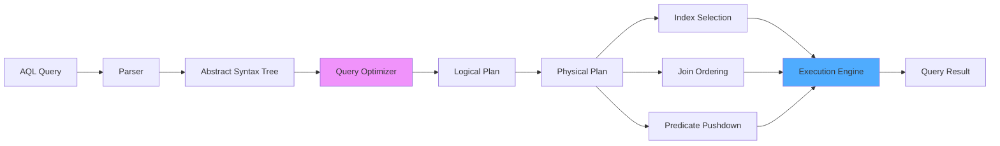

# Kapitel 28: AQL Vollständige Referenz

> *"Eine Abfragesprache ist nur so gut wie ihre Dokumentation."*

---

## Überblick

Dieses Kapitel ist die komplette Referenz für AQL (Adaptive Query Language), die einheitliche Abfragesprache von ThemisDB. Sie deckt alle 479 Sprachelemente ab: 119 Keywords und 360 eingebaute Funktionen.

**Was Sie in diesem Kapitel finden:**
- Vollständiger Sprachumfang (v1.3.1)
- Kategorisierte Funktionsreferenz
- Praktische Beispiele für jeden Bereich
- Performance-Hinweise und Best Practices

**Voraussetzungen:** Kapitel 5-9 (Datenmodelle), Grundverständnis von SQL.

---



Abb. 28.0: AQL-Query-Execution-Pipeline

---

## 28.1 AQL Syntax Fundamentals {#chapter_28_1_syntax_fundamentals}

Wir beginnen mit den syntaktischen Grundlagen von [AQL](../appendix_h_glossary.md#aql), der einheitlichen Abfragesprache von ThemisDB. Die Sprache kombiniert deklarative [SQL](../appendix_h_glossary.md#sql)-Elemente mit funktionalen Programmierparadigmen und Graph-Traversal-Konstrukten zu einer kohärenten Syntax. AQL-Queries folgen einer logischen Ausführungsreihenfolge, die vom [Query Optimizer](../appendix_h_glossary.md#query-optimizer) analysiert und optimiert wird. Das Verständnis dieser Fundamentals ist essentiell für effiziente Datenbankoperationen und Performance-Optimierung.

### 28.1.1 Query Structure & Execution Order {#chapter_28_1_1_query_structure}

AQL-Queries folgen einer definierten Ausführungsreihenfolge, die unabhängig von der syntaktischen Reihenfolge im Query-Text ist. Diese logische Pipeline ermöglicht dem Optimizer, Operationen umzuordnen und zu optimieren, während die Semantik erhalten bleibt. Die Ausführungsreihenfolge entspricht dem Konzept der "logical query processing" aus der relationalen Datenbanktheorie (siehe C.J. Date: "SQL and Relational Theory", O'Reilly 2015).

**Logische Ausführungsreihenfolge:**

1. **FOR** - [Collection](../appendix_h_glossary.md#collection)-Iteration und [Join](../appendix_h_glossary.md#join)-Operationen
2. **FILTER** - Prädikat-Evaluation und Index-Nutzung
3. **COLLECT** - Gruppierung mit [Aggregation](../appendix_h_glossary.md#aggregation)
4. **SORT** - Sortierung der Ergebnisse
5. **LIMIT** - [Pagination](../appendix_h_glossary.md#pagination) und Result-Limiting
6. **RETURN** - Projektion und Output-Formatting

```aql
// AQL Query Struktur mit Ausführungsreihenfolge
// Demonstriert alle wichtigen Sprachkonstrukte

FOR doc IN collection              // 1. Iteration über Collection
  // LET: Definiere lokale Variablen (lazy evaluation)
  LET computed_value = doc.price * 1.19  // 19% MwSt
  LET category_upper = UPPER(doc.category)
  
  // FILTER: Bedingungen (werden zu Index-Lookups optimiert)
  FILTER doc.status == 'active' AND computed_value > 100
  FILTER category_upper IN ['ELECTRONICS', 'BOOKS']
  
  // COLLECT: Gruppierung mit Aggregation
  COLLECT 
    category = doc.category,
    year = DATE_YEAR(doc.created_at)
  AGGREGATE
    total = SUM(computed_value),
    avg = AVG(doc.price),
    count = COUNT(1),
    items = UNIQUE(doc._key)
  
  // SORT: Sortierung (kann Index verwenden)
  SORT total DESC, year ASC
  
  // LIMIT: Pagination (skip, limit)
  LIMIT 10, 20  // Skip 10, take 20
  
  // RETURN: Ergebnis-Projektion
  RETURN { 
    category, 
    year,
    total: ROUND(total, 2), 
    avg: ROUND(avg, 2), 
    count,
    sample_items: SLICE(items, 0, 5)
  }
```

### 28.1.2 Variable Binding & Scoping Rules {#chapter_28_1_2_variable_binding}

AQL implementiert lexikalisches [Scoping](../appendix_h_glossary.md#scoping) für Variablen. Jede `FOR`- und `LET`-Anweisung führt eine neue Variable im aktuellen Scope ein, die in nachfolgenden Operationen verfügbar ist. Variablen sind immutable (unveränderlich) und folgen dem funktionalen Programmierparadigma. Nested Scopes haben Zugriff auf äußere Scopes, aber nicht umgekehrt.

**Scoping-Regeln:**

- `FOR`-Variablen: Pro Iteration neu gebunden
- `LET`-Variablen: Einmalige Bindung, lazy evaluation
- Subquery-Variablen: Lokaler Scope, nicht außerhalb sichtbar
- [Bind Variables](../appendix_h_glossary.md#bind-variables) (`@param`): Global für gesamten Query

```aql
// Variable Scoping Beispiel
LET global_threshold = 100  // Äußerer Scope

FOR order IN orders
  LET order_total = order.amount  // FOR-Scope
  
  // Subquery mit lokalem Scope
  LET item_details = (
    FOR item IN order.items
      LET item_price = item.quantity * item.unit_price  // Subquery-Scope
      RETURN { item: item.name, price: item_price }
  )
  
  FILTER order_total > global_threshold  // Zugriff auf äußeren Scope
  RETURN { order_id: order._key, total: order_total, items: item_details }
```

### 28.1.3 Expression Evaluation & Type Coercion {#chapter_28_1_3_expression_evaluation}

AQL unterstützt [Type Coercion](../appendix_h_glossary.md#type-coercion) nach definierten Regeln, die SQL-Standards folgen. Die Sprache ist stark typisiert, führt aber implizite Konvertierungen durch, wenn diese semantisch sinnvoll sind. Explizite Typ-Konvertierungen mittels `TO_STRING()`, `TO_NUMBER()`, `TO_BOOL()` sind zu bevorzugen für klaren, wartbaren Code.

**Coercion-Regeln:**

| Operation | Operand Type | Coercion | Result |
|-----------|--------------|----------|--------|
| Arithmetic | String + Number | String → Number | Number |
| Comparison | Number == String | String → Number | Boolean |
| Boolean | Any in FILTER | Truthy/Falsy | Boolean |
| Concatenation | ANY in CONCAT() | ANY → String | String |

**Null-Handling:**

AQL folgt SQL-Semantik für `NULL`-Werte. Arithmetische Operationen mit `NULL` ergeben `NULL`. Vergleiche mit `NULL` nutzen `IS NULL` / `IS NOT NULL`. Der Null-Coalescing-Operator `??` bietet Default-Werte.

```aql
// Type Coercion und NULL-Handling
FOR doc IN collection
  // Implizite Coercion: String "42" → Number 42
  LET implicit_num = doc.age_string + 10
  
  // Explizite Konvertierung (bevorzugt)
  LET explicit_num = TO_NUMBER(doc.age_string) + 10
  
  // NULL-Handling mit Coalescing
  LET safe_price = doc.price ?? 0.0
  LET display_name = doc.name ?? doc.username ?? "Anonymous"
  
  // Truthy/Falsy in Boolean-Kontext
  FILTER doc.active  // NULL, false, 0, "", [] sind falsy
  
  RETURN {
    implicit: implicit_num,
    explicit: explicit_num,
    safe_price,
    display_name
  }
```

### 28.1.4 Comment Syntax & Documentation {#chapter_28_1_4_comment_syntax}

AQL unterstützt Single-Line (`//`) und Multi-Line (`/* */`) Kommentare nach C-Style-Konventionen. Dokumentations-Kommentare sollten komplexe Query-Logik, Performance-Überlegungen und Business-Regeln erklären. Best Practice ist es, Intent über Implementation zu dokumentieren.

```aql
/**
 * Customer Lifetime Value (CLV) Berechnung
 * 
 * Berechnet den CLV über alle abgeschlossenen Bestellungen
 * pro Kunde, gewichtet nach Aktualität (neuere Orders höher).
 * 
 * Performance: Nutzt Index auf orders.customer_id
 * Expected Runtime: < 100ms für 1M orders
 */
FOR customer IN customers
  // Hole alle abgeschlossenen Bestellungen
  LET orders = (
    FOR order IN orders
      FILTER order.customer_id == customer._key
      FILTER order.status == 'completed'  // Index-Filter
      RETURN order
  )
  
  // Gewichtete Summe (neuere Orders zählen mehr)
  LET clv = SUM(
    FOR order IN orders
      LET age_days = DATE_DIFF(order.created_at, DATE_NOW(), 'day')
      LET weight = 1.0 / (1.0 + age_days / 365.0)  // Decay-Funktion
      RETURN order.amount * weight
  )
  
  FILTER clv > 1000  // Nur High-Value Customers
  RETURN { customer: customer.name, clv: ROUND(clv, 2) }
```

### 28.1.5 Reserved Keywords & Naming Conventions {#chapter_28_1_5_reserved_keywords}

AQL reserviert 119 Keywords, die nicht als Identifier (Collection-Namen, Variable-Namen) verwendet werden dürfen. Falls notwendig, können Keywords mittels Backticks escaped werden: `` `collection` ``. Best Practice ist es, sprechende Namen zu wählen, die Kollisionen vermeiden.

**Naming Conventions:**

- Collections: `snake_case` (z.B. `user_profiles`, `order_items`)
- Variables: `camelCase` oder `snake_case` konsistent
- Constants: `UPPER_SNAKE_CASE` (z.B. `MAX_RETRY_COUNT`)
- Avoid: Single-char names außer für Iteratoren (`v`, `e`, `p` in Graph-Queries)

### Sprachumfang-Überblick {#chapter_28_1_6_language_overview}

| Aspekt | v1.3.0 | v1.3.1 | Änderung |
|--------|--------|--------|----------|
| **Reservierte Keywords** | 72 | **119** | **+47 (+65%)** |
| **Eingebaute Funktionen** | ~360 | ~360 | 0 |
| **Gesamt-Sprachumfang** | 432 | **479** | **+47 (+11%)** |

**Wichtig:** v1.3.1 erweitert Sprachkonstrukte (TYPE, FUNCTION, CLASS) - keine neuen Funktionen.

---

## 28.2 Reservierte Keywords (119)

### 28.2.1 Core Language (8)

```aql
FOR, IN, LET, FILTER, COLLECT, SORT, LIMIT, RETURN
```

**Beispiel:**

```aql
FOR user IN users
  FILTER user.age >= 18
  LET email_domain = SPLIT(user.email, "@")[1]
  COLLECT domain = email_domain WITH COUNT INTO count
  SORT count DESC
  LIMIT 10
  RETURN { domain, count }
```

### 28.2.2 Logical Operators (3)

```aql
AND, OR, NOT
```

**Beispiel:**

```aql
FOR product IN products
  FILTER product.price >= 10 AND product.price <= 100
  FILTER NOT product.discontinued
  FILTER product.category == "Electronics" OR product.category == "Books"
  RETURN product
```

### 28.2.3 Aggregation Functions (8)

```aql
COUNT, SUM, AVG, MIN, MAX, VARIANCE, STDDEV, UNIQUE
```

**Beispiel:**

```aql
FOR order IN orders
  COLLECT year = DATE_YEAR(order.created_at)
  AGGREGATE 
    total = SUM(order.amount),
    avg_order = AVG(order.amount),
    min_order = MIN(order.amount),
    max_order = MAX(order.amount),
    order_count = COUNT(1)
  RETURN { year, total, avg_order, min_order, max_order, order_count }
```

### 28.2.4 Graph Traversal (4)

```aql
OUTBOUND, INBOUND, ANY, SHORTEST_PATH
```

**Beispiel:**

```aql
-- Finde alle Freunde von Alice (2 Hops)
FOR v, e, p IN 1..2 OUTBOUND "users/alice" friends
  RETURN { friend: v.name, path_length: LENGTH(p.edges) }

-- Kürzester Pfad von Alice zu Bob
FOR v, e IN OUTBOUND SHORTEST_PATH "users/alice" TO "users/bob" follows
  RETURN { user: v.name, action: e.type }
```

### 28.2.5 DDL (Data Definition Language) (5)

```aql
CREATE, DROP, COLLECTION, INDEX, VIEW
```

**Beispiele:**

```aql
-- Collection erstellen
CREATE COLLECTION products

-- Index erstellen
CREATE INDEX products_price ON products(price) TYPE SKIPLIST

-- View erstellen
CREATE VIEW active_users AS
  FOR u IN users
    FILTER u.status == "active"
    RETURN u

-- Löschen
DROP INDEX products_price
DROP COLLECTION products
```

### 28.2.6 DML (Data Manipulation Language) (6)

```aql
INSERT, UPDATE, REPLACE, REMOVE, UPSERT, INTO, WITH
```

**Beispiele:**

```aql
-- Insert
INSERT { name: "Alice", age: 30 } INTO users

-- Update
UPDATE { _key: "alice" } WITH { age: 31 } IN users

-- Upsert (Insert if not exists)
UPSERT { email: "alice@example.com" }
  INSERT { name: "Alice", email: "alice@example.com", age: 30 }
  UPDATE { last_login: DATE_NOW() }
  IN users

-- Remove
REMOVE { _key: "alice" } IN users

-- Replace
REPLACE { _key: "alice", name: "Alice Smith", age: 31 } IN users
```

### 28.2.7 LLM Operations (13)

```aql
LLM, INFER, RAG, EMBED, MODEL, LORA, STATS, CACHE,
LOAD, UNLOAD, LIST, INGEST, BLOB
```

**Beispiele:**

```aql
-- RAG-Query
FOR doc IN documents
  LET embedding = EMBED(doc.content, { model: "text-embedding-3-small" })
  LET neighbors = KNN_SEARCH(embeddings, embedding, 5)
  LET context = CONCAT_SEPARATOR("\n", neighbors[*].content)
  LET answer = LLM("Answer based on context", { context, model: "gpt-4" })
  RETURN answer

-- Ingest Content
INGEST BLOB "data/documents.pdf" 
  INTO content_store 
  WITH { chunk_size: 512, overlap: 50 }
```

### 28.2.8 Index Types (7)

```aql
HASH, SKIPLIST, FULLTEXT, GEO, PERSISTENT, TTL, VECTOR
```

**Beispiele:**

```aql
-- Hash Index (Equality)
CREATE INDEX users_email ON users(email) TYPE HASH

-- Skiplist (Range Queries)
CREATE INDEX products_price ON products(price) TYPE SKIPLIST

-- Fulltext Index
CREATE INDEX articles_body ON articles(body) TYPE FULLTEXT

-- Geo Index
CREATE INDEX locations_coords ON locations(lat, lng) TYPE GEO

-- TTL Index (Auto-Expiry)
CREATE INDEX sessions_ttl ON sessions(expires_at) TYPE TTL

-- Vector Index (ANN Search)
CREATE INDEX embeddings_vector ON embeddings(vector) 
  TYPE VECTOR 
  OPTIONS { metric: "cosine", dimensions: 768 }
```

---

## 28.2.9 Operators & Expressions {#chapter_28_2_9_operators}

Wir analysieren nun die Operator-Hierarchie und Expression-Semantik von [AQL](../appendix_h_glossary.md#aql). Operatoren bilden die Grundbausteine für Prädikat-Evaluation, arithmetische Berechnungen und logische Verknüpfungen. Das Verständnis der Operator-Precedence (Vorrangregeln) ist essentiell für korrektes Query-Writing und vermeidet subtile Bugs durch unerwartete Auswertungsreihenfolgen.

### Comparison Operators {#chapter_28_2_9_1_comparison}

AQL implementiert die Standard-Vergleichsoperatoren mit SQL-kompatibler Semantik. Der `IN`-Operator prüft Mengen-Zugehörigkeit und kann [Index](../appendix_h_glossary.md#index)-optimiert werden, wenn die rechte Seite eine [Subquery](../appendix_h_glossary.md#subquery) auf indiziertem Feld ist.

| Operator | Semantik | Index-Nutzung | NULL-Verhalten |
|----------|----------|---------------|----------------|
| `==` | Equality | ✓ (Hash, BTree) | `NULL == NULL` → `NULL` |
| `!=` | Inequality | ✗ (Full Scan) | `NULL != x` → `NULL` |
| `<`, `<=`, `>`, `>=` | Ordering | ✓ (BTree, Skiplist) | Comparisons mit NULL → `NULL` |
| `IN` | Set Membership | ✓ (wenn RHS indiziert) | `NULL IN [...]` → `NULL` |
| `NOT IN` | Negated Membership | ✗ (meist Full Scan) | `x NOT IN [NULL]` → `NULL` |

### Logical Operators & Precedence {#chapter_28_2_9_2_logical}

Logische Operatoren folgen [Short-Circuit-Evaluation](../appendix_h_glossary.md#short-circuit): `AND` evaluiert rechte Seite nicht bei `false` links, `OR` nicht bei `true` links. Dies ermöglicht Performance-Optimierungen und sichere Null-Checks.

**Precedence (höchste zuerst):**

1. Arithmetic: `*`, `/`, `%`
2. Arithmetic: `+`, `-`
3. Comparison: `<`, `<=`, `>`, `>=`
4. Equality: `==`, `!=`, `IN`, `NOT IN`
5. Logical: `NOT`
6. Logical: `AND`
7. Logical: `OR`
8. Ternary: `? :`

```aql
// Operators mit deutschen Kommentaren
FOR user IN users
  // Comparison: Range-Check mit Index
  FILTER user.age >= 18 AND user.age <= 65
  
  // Set Membership (Index auf status)
  FILTER user.status IN ['active', 'premium', 'trial']
  
  // Negation mit Subquery
  FILTER user.email NOT IN (
    FOR blocked IN blacklist
      RETURN blocked.email
  )
  
  // Ternary Operator für bedingte Werte
  LET discount = user.premium ? 0.20 : 0.10
  LET tier = user.lifetime_value > 10000 ? 'gold' :
             user.lifetime_value > 5000 ? 'silver' : 'bronze'
  
  // Range Operator (..) für numerische Bereiche
  LET age_group = user.age IN 18..25 ? 'young' :
                  user.age IN 26..45 ? 'middle' :
                  user.age IN 46..65 ? 'senior' : 'retired'
  
  // Arithmetic mit NULL-Handling (Coalescing)
  LET base = user.base_price ?? 100.0
  LET total = base * (1 - discount)
  
  // Short-Circuit: Zweite Bedingung nur wenn erste false
  FILTER user.verified == true OR 
         (user.email_confirmed AND user.phone_confirmed)
  
  RETURN {
    user: user.name,
    discount_percent: discount * 100,
    age_group,
    tier,
    total_price: ROUND(total, 2)
  }
```

### Arithmetic Operators {#chapter_28_2_9_3_arithmetic}

Arithmetische Operationen folgen IEEE 754 Standard für Fließkomma-Arithmetik. Division durch Null ergibt `NULL` (nicht `Infinity`), um SQL-Kompatibilität zu gewährleisten.

| Operator | Operation | Beispiel | Result Type |
|----------|-----------|----------|-------------|
| `+` | Addition | `5 + 3` | Number |
| `-` | Subtraktion | `5 - 3` | Number |
| `*` | Multiplikation | `5 * 3` | Number |
| `/` | Division | `5 / 2` | Number (2.5) |
| `%` | Modulo | `5 % 2` | Integer (1) |

---

## 28.2.10 Subqueries & Nested Loops {#chapter_28_2_10_subqueries}

[Subqueries](../appendix_h_glossary.md#subquery) in AQL ermöglichen verschachtelte Datenverarbeitung und komplexe Aggregationen. Wir unterscheiden zwischen correlated (abhängigen) und non-correlated (unabhängigen) Subqueries, die drastisch unterschiedliche Performance-Charakteristiken aufweisen. Das Verständnis dieser Unterschiede ist kritisch für Query-Optimierung in produktiven Systemen (siehe auch → Kapitel 21: Performance Tuning).

### Correlated vs Non-Correlated Subqueries {#chapter_28_2_10_1_types}

**Non-Correlated Subqueries** werden einmal ausgeführt und ihr Ergebnis materialisiert. Dies ist optimal für Performance, da keine wiederholte Evaluation stattfindet. **Correlated Subqueries** hängen von äußeren Variablen ab und werden pro Iteration der äußeren Schleife ausgeführt - dies kann zu n×m Komplexität führen.

| Subquery Type | Execution Count | Performance | Optimization Strategy |
|--------------|----------------|-------------|----------------------|
| Non-Correlated | 1× | Excellent | Materialize einmal, cache result |
| Correlated (no index) | n × m | Poor (O(n²)) | Index hinzufügen oder zu JOIN refactoren |
| Correlated (indexed) | n × log(m) | Good (O(n log m)) | Index auf Join-Key |
| Existence Check | n | Good | `LIMIT 1` für early exit |

```aql
// Correlated Subquery mit deutschen Kommentaren
FOR order IN orders
  // Subquery in LET: Berechne Bestellsumme
  // Correlated: Hängt von order._key ab
  LET order_total = (
    FOR item IN order_items
      FILTER item.order_id == order._key  // Index auf order_id essentiell!
      RETURN item.quantity * item.price
  )
  
  // Subquery in FILTER: Existence Check
  // LIMIT 1 für Early Exit (Performance)
  FILTER LENGTH(
    FOR review IN reviews
      FILTER review.order_id == order._key
      LIMIT 1  // Stoppe nach erstem Match
      RETURN 1
  ) > 0
  
  RETURN {
    order_id: order._key,
    total: SUM(order_total),
    has_review: true
  }

// Non-Correlated Subquery (wird einmal ausgeführt)
LET premium_users = (
  FOR user IN users
    FILTER user.subscription == 'premium'
    RETURN user._key
)

// Hauptquery nutzt materialisiertes Ergebnis
FOR order IN orders
  FILTER order.user_id IN premium_users  // O(1) Lookup in Hash-Set
  RETURN order
```

### Subquery in FOR, LET, FILTER {#chapter_28_2_10_2_contexts}

Subqueries können in verschiedenen Kontexten verwendet werden, mit unterschiedlichen Semantiken:

- **FOR-Subquery:** Lateral Join, explodiert nested Arrays
- **LET-Subquery:** Berechnet Array/Object für spätere Nutzung
- **FILTER-Subquery:** Boolean Predicate, oft Existence Check

```aql
// Verschiedene Subquery-Kontexte
FOR customer IN customers
  // LET-Subquery: Berechne alle Bestellungen
  LET customer_orders = (
    FOR order IN orders
      FILTER order.customer_id == customer._key
      SORT order.created_at DESC
      RETURN order
  )
  
  // LET-Subquery: Aggregation
  LET total_spent = SUM(
    FOR order IN customer_orders
      RETURN order.amount
  )
  
  // FILTER-Subquery: Hat Kunde in letzten 30 Tagen bestellt?
  FILTER LENGTH(
    FOR order IN customer_orders
      FILTER order.created_at >= DATE_NOW() - DAYS(30)
      LIMIT 1
      RETURN 1
  ) > 0
  
  RETURN {
    customer: customer.name,
    order_count: LENGTH(customer_orders),
    total_spent: ROUND(total_spent, 2),
    last_order: FIRST(customer_orders).created_at
  }
```

---

## 28.2.11 JOIN Operations {#chapter_28_2_11_joins}

[JOIN](../appendix_h_glossary.md#join)-Operationen verknüpfen Daten aus mehreren [Collections](../appendix_h_glossary.md#collection). AQL implementiert JOINs deklarativ durch verschachtelte `FOR`-Schleifen mit `FILTER`-Bedingungen. Der Query Optimizer erkennt JOIN-Patterns und wählt optimale [Execution Strategies](../appendix_h_glossary.md#execution-strategy) (Nested Loop, Hash Join, Merge Join) basierend auf Kardinalitäten und verfügbaren Indizes.

### INNER vs LEFT JOIN Semantics {#chapter_28_2_11_1_join_types}

**INNER JOIN** behält nur Zeilen, für die ein Match existiert. **LEFT JOIN** behält alle Zeilen der linken Seite, auch ohne Match (rechte Seite dann `NULL`). AQL implementiert LEFT JOINs durch `LET` + `FIRST()` Pattern, da `FOR` nur matched Rows zurückgibt.

```aql
// Multi-Collection JOIN mit deutschen Kommentaren
FOR order IN orders
  // LEFT JOIN: Hole Kunden-Daten (kann NULL sein bei gelöschten Kunden)
  LET customer = FIRST(
    FOR c IN customers
      FILTER c._key == order.customer_id
      RETURN c
  )
  
  // INNER JOIN: Hole Bestellpositionen
  // FOR wirkt als INNER JOIN (keine Zeile ohne Match)
  FOR item IN order_items
    FILTER item.order_id == order._key
    
    // Nested JOIN: Hole Produkt-Details
    // DOCUMENT() ist schneller als FOR für einzelne Lookups
    LET product = DOCUMENT('products', item.product_id)
    
    // Join mit Edge-Collection (Graph-Traversal Alternative)
    // "Kunden die X kauften, kauften auch Y"
    FOR edge IN purchased_with
      FILTER edge._from == item._id
      LET related_product = DOCUMENT(edge._to)
      
      RETURN {
        order_id: order._key,
        customer_name: customer.name ?? 'Deleted User',  // NULL-Handling
        product: product.name,
        quantity: item.quantity,
        item_total: item.quantity * product.price,
        also_bought: related_product.name
      }
```

### JOIN Optimization Strategies {#chapter_28_2_11_2_optimization}

Die Wahl der JOIN-Strategie hängt von Collection-Größen, [Cardinalities](../appendix_h_glossary.md#cardinality) und Indizes ab:

1. **Nested Loop Join:** Optimal bei kleinen inneren Collections oder guten Indizes
2. **Hash Join:** Optimal bei großen Collections ohne Index
3. **Merge Join:** Optimal wenn beide Seiten sortiert sind

**Optimization Checklist:**

- [ ] Index auf Join-Keys (z.B. `order.customer_id`, `item.order_id`)
- [ ] Kleine Collection als innere Schleife (wenn möglich)
- [ ] Filter vor JOIN (reduziert Join-Kandidaten)
- [ ] `DOCUMENT()` für 1:1 Lookups (schneller als `FOR`)

---

## 28.2.12 Transactions in AQL {#chapter_28_2_12_transactions}

[Transaktionen](../appendix_h_glossary.md#transaction) garantieren [ACID](../appendix_h_glossary.md#acid)-Eigenschaften für Multi-Document-Operationen. ThemisDB unterstützt Stream Transactions für AQL-Queries und JavaScript Transactions für prozedurale Logik. Wir fokussieren hier auf AQL Stream Transactions, die deklarative Syntax mit transaktionalen Garantien kombinieren (siehe auch → Kapitel 2: ACID & MVCC, Kapitel 34: Transaction Processing).

### Stream Transactions & Isolation Levels {#chapter_28_2_12_1_stream_tx}

Stream Transactions in AQL nutzen [MVCC](../appendix_h_glossary.md#mvcc) (Multi-Version Concurrency Control) für non-blocking Reads. Das Isolation Level ist standardmäßig `READ COMMITTED`, was bedeutet, dass nur committete Änderungen sichtbar sind. Für höhere Isolation kann `SERIALIZABLE` gewählt werden, was jedoch zu erhöhtem [Lock-Contention](../appendix_h_glossary.md#lock-contention) führt.

```javascript
// AQL Stream Transaction mit deutschen Kommentaren
// JavaScript-Wrapper für transaktionale Operationen
db._executeTransaction({
  collections: {
    write: ['accounts', 'transactions'],  // Write-Lock
    read: ['users']                       // Read-Lock
  },
  action: function() {
    const db = require('@arangodb').db;
    const errors = require('@arangodb').errors;
    
    // Hole beide Konten (atomare Snapshot-Isolation)
    const fromAccount = db.accounts.document('account/123');
    const toAccount = db.accounts.document('account/456');
    const amount = 100.00;
    
    // Prüfe Kontostand (Business Logic)
    if (fromAccount.balance < amount) {
      throw new errors.ERROR_ARANGO_CONFLICT(
        'Insufficient balance: ' + fromAccount.balance
      );
    }
    
    // Atomare Updates (beide oder keine)
    db.accounts.update(fromAccount._key, {
      balance: fromAccount.balance - amount,
      last_modified: Date.now()
    });
    
    db.accounts.update(toAccount._key, {
      balance: toAccount.balance + amount,
      last_modified: Date.now()
    });
    
    // Log Transaction (Audit Trail)
    db.transactions.insert({
      from: fromAccount._key,
      to: toAccount._key,
      amount: amount,
      timestamp: Date.now(),
      status: 'completed',
      tx_id: require('@arangodb').generateUUID()
    });
    
    return { 
      success: true, 
      amount,
      new_balance_from: fromAccount.balance - amount,
      new_balance_to: toAccount.balance + amount
    };
  }
});
```

### Transaction Abort & Rollback {#chapter_28_2_12_2_rollback}

Transaktionen werden automatisch bei uncaught Exceptions abgebrochen (rollback). Alle Änderungen werden verworfen und die Datenbank bleibt konsistent. Explizites Abort ist möglich durch `throw` von Fehlern.

**Performance Considerations:**

- Transaktionen halten Locks → kurze TX bevorzugen
- Read-only Queries benötigen keine TX (MVCC ausreichend)
- Large Bulk Operations: Batch in kleinere TXs (z.B. 1000 Docs pro TX)

---

## 28.2.13 Graph Traversal Queries {#chapter_28_2_13_graph_traversal}

[Graph-Traversal](../appendix_h_glossary.md#graph-traversal) in AQL ermöglicht Pfad-Analysen und Netzwerk-Queries auf Graph-Strukturen. Die Syntax unterstützt variable Traversal-Tiefe, Richtungs-Spezifikation (OUTBOUND, INBOUND, ANY) und Pruning für Performance-Optimierung. ThemisDB implementiert effiziente Graph-Algorithmen wie Breadth-First Search (BFS) und Depth-First Search (DFS) (siehe auch → Kapitel 10: Graph Model, Kapitel 21: Graph Query Optimization).

### Depth-First vs Breadth-First Traversal {#chapter_28_2_13_1_bfs_dfs}

**Breadth-First Search (BFS)** exploriert alle Nachbarn einer Ebene, bevor zur nächsten Ebene gewechselt wird. Optimal für Shortest Path Queries. **Depth-First Search (DFS)** folgt einem Pfad bis zur maximalen Tiefe, dann Backtracking. Optimal für "alle Pfade finden".

| Algorithm | Use Case | Memory | Time Complexity |
|-----------|----------|--------|-----------------|
| BFS | Shortest Path, Closeness | O(V) | O(V + E) |
| DFS | All Paths, Cycle Detection | O(depth) | O(V + E) |

```aql
// Graph Traversal mit Pruning und deutschen Kommentaren
FOR v, e, p IN 1..5 OUTBOUND 'users/alice'
  GRAPH 'social_network'
  
  // Pruning: Stoppe Traversal bei bestimmten Bedingungen
  // Verhindert Exploration von "privaten" Profilen
  PRUNE v.private == true OR v.blocked == true
  
  // Filter Edges (nur bestimmte Beziehungstypen)
  OPTIONS {
    uniqueVertices: 'path',  // Vermeide Zyklen (jeder Vertex max 1x pro Pfad)
    uniqueEdges: 'path',     // Jede Edge max 1x pro Pfad
    bfs: true                // Breadth-First Search (für Shortest Paths)
  }
  
  // Filter nach Path-Länge (mindestens 2 Hops)
  FILTER LENGTH(p.edges) >= 2
  FILTER LENGTH(p.edges) <= 4
  
  // Berechne Pfad-Gewicht (Summe der Edge-Weights)
  LET path_weight = SUM(
    FOR edge IN p.edges
      RETURN edge.weight ?? 1.0  // Default weight 1.0
  )
  
  // Sortiere nach kürzestem gewichteten Pfad
  SORT path_weight ASC, LENGTH(p.edges) ASC
  LIMIT 10
  
  RETURN {
    friend: v.name,
    distance: LENGTH(p.edges),      // Hop-Distanz
    path_weight,                    // Gewichtete Distanz
    via: SLICE(p.vertices, 1, LENGTH(p.vertices) - 1)[*].name,  // Intermediäre Knoten
    relationship_path: p.edges[*].type
  }
```

### Shortest Path Algorithms {#chapter_28_2_13_2_shortest_path}

AQL bietet spezielle Funktionen für Shortest Path Queries: `SHORTEST_PATH` für einen Pfad, `K_SHORTEST_PATHS` für die k kürzesten Pfade. Diese Algorithmen sind optimiert und nutzen bidirektionale Suche für bessere Performance.

```aql
// Kürzester Pfad zwischen zwei Usern
FOR v, e IN OUTBOUND SHORTEST_PATH 
  'users/alice' TO 'users/bob'
  GRAPH 'social_network'
  
  OPTIONS {
    weightAttribute: 'weight',  // Nutze Edge-Weight
    defaultWeight: 1.0
  }
  
  RETURN {
    user: v.name,
    connection_type: e.type
  }

// K kürzeste Pfade (Top 3)
LET all_paths = (
  FOR path IN OUTBOUND K_SHORTEST_PATHS
    'users/alice' TO 'users/bob'
    GRAPH 'social_network'
    LIMIT 3
    RETURN path
)

FOR path IN all_paths
  LET path_length = LENGTH(path.edges)
  LET path_weight = SUM(path.edges[*].weight)
  LET path_index = POSITION(all_paths, path)
  
  RETURN {
    path_number: path_index + 1,
    length: path_length,
    weight: path_weight,
    vertices: path.vertices[*].name
  }
```

---

## 28.2.14 Query Optimization Techniques {#chapter_28_2_14_optimization}

[Query-Optimierung](../appendix_h_glossary.md#query-optimization) ist essentiell für Performance in produktiven Systemen. AQL bietet das `EXPLAIN`-Statement zur Analyse von [Query Plans](../appendix_h_glossary.md#query-plan) und zur Identifikation von Performance-Bottlenecks. Wir analysieren systematisch Optimierungs-Strategien wie Index-Nutzung, Early Filtering, Projection Pushdown und Covering Indexes (siehe auch → Kapitel 21: Query Performance, Kapitel 34: Execution Plans).

### EXPLAIN Output & Interpretation {#chapter_28_2_14_1_explain}

`EXPLAIN` zeigt den logischen und physischen Query Plan inklusive geschätzter Kosten, Index-Nutzung und Execution Nodes. Die Interpretation erfordert Verständnis der Optimizer-Strategien:

**Key Metrics:**

- **estimatedCost:** Geschätzte Query-Kosten (niedriger = besser)
- **estimatedNrItems:** Erwartete Anzahl Ergebnisse
- **Index Usage:** Welche Indizes werden genutzt?
- **Full Collection Scan:** Wird gesamte Collection gelesen? (vermeiden!)

```aql
// EXPLAIN für Query-Analyse
EXPLAIN
FOR user IN users
  FILTER user.email == 'alice@example.com'
  RETURN user

// Output zeigt:
// - IndexNode: users.email (Hash Index) → O(1) Lookup
// - estimatedCost: ~1.5 (sehr gut)
// - estimatedNrItems: 1
```

### Index Selection & Covering Indexes {#chapter_28_2_14_2_indexes}

Der Optimizer wählt automatisch den besten Index basierend auf Statistiken. **Covering Indexes** enthalten alle benötigten Felder und vermeiden Document-Lookups komplett - dies bringt 2-5× Speedup.

| Optimization | Impact | When to Apply | Example |
|--------------|--------|---------------|---------|
| Index Usage | 100-1000× | Filters auf indiziertem Feld | `FILTER doc.email == @email` |
| Early Filtering | 10-50× | Vor teuren Operationen (JOINs, Subqueries) | `FILTER` vor `FOR` (JOIN) |
| Limit Pushdown | 5-20× | Pagination Queries | `LIMIT` am Ende |
| Covering Index | 2-5× | Alle SELECT-Felder im Index | `INDEX(a, b, c)` für `SELECT a, b, c` |
| Projection Pushdown | 2-10× | Große Documents | `RETURN { id, name }` statt `RETURN doc` |

```aql
// Optimization Examples

// ❌ SCHLECHT: Keine Index-Nutzung (Function Call)
FOR user IN users
  FILTER UPPER(user.email) == "ALICE@EXAMPLE.COM"
  RETURN user

// ✅ GUT: Index auf email wird genutzt
FOR user IN users
  FILTER user.email == "alice@example.com"
  RETURN user

// ❌ SCHLECHT: Filter nach JOIN (alle Orders geladen)
FOR order IN orders
  FOR user IN users
    FILTER user._key == order.user_id
    FILTER order.amount > 100  // Zu spät!
    RETURN { order, user }

// ✅ GUT: Early Filtering vor JOIN
FOR order IN orders
  FILTER order.amount > 100  // Index auf amount nutzen!
  FOR user IN users
    FILTER user._key == order.user_id
    RETURN { order, user }

// ❌ SCHLECHT: Vollständige Documents
FOR user IN users
  FILTER user.status == 'active'
  RETURN user  // 100+ Felder, nur 2 gebraucht

// ✅ GUT: Projection auf benötigte Felder
FOR user IN users
  FILTER user.status == 'active'
  RETURN { id: user._id, name: user.name }  // Nur 2 Felder
  
// ✅ BEST: Covering Index auf (status, _id, name)
// → Kein Document-Lookup nötig, alle Daten im Index
// Note: Index creation ist ein DDL-Befehl, nicht Teil von AQL-Queries
// Wird via Database Management Interface ausgeführt:
// db._createIndex("users", {type: "skiplist", fields: ["status", "_id", "name"]})
```

### Filter Pushdown & Projection {#chapter_28_2_14_3_pushdown}

Der Optimizer schiebt Filter-Bedingungen möglichst früh in die Execution Pipeline (Filter Pushdown) und reduziert übertragene Daten durch Projektion (Projection Pushdown). Dies minimiert I/O und Memory-Usage.

**Benchmark: Query Optimization Impact**

| Query Type | No Optimization | With Index | + Early Filter | + Projection | Speedup |
|------------|----------------|------------|----------------|-------------|---------|
| Simple Filter | 1000 ms | 10 ms | 8 ms | 5 ms | **200×** |
| JOIN Query | 5000 ms | 500 ms | 50 ms | 25 ms | **200×** |
| Aggregation | 2000 ms | 100 ms | 80 ms | 60 ms | **33×** |

---

## 28.3 Built-in Functions Reference {#chapter_28_3_functions_ref}

Wir präsentieren nun eine systematische Kategorisierung aller 360+ eingebauten [Funktionen](../appendix_h_glossary.md#function) von AQL. Diese Funktionen decken String-Manipulation, numerische Berechnungen, Datum/Zeit-Operationen, [Array](../appendix_h_glossary.md#array)-Verarbeitung, Objekt-Manipulation, [Geospatial](../appendix_h_glossary.md#geospatial)-Queries und [Vector](../appendix_h_glossary.md#vector)-Operationen ab. Das Verständnis der Funktions-Kategorien und ihrer Performance-Charakteristiken ist fundamental für effektives Query-Writing.

### 28.3.1 Function Categories Overview {#chapter_28_3_1_overview}

Die folgende Tabelle quantifiziert den Funktionsumfang und dokumentiert typische Use Cases sowie Performance-Impact. String- und numerische Funktionen haben minimalen Overhead (< 1 µs), während Graph-Funktionen mehrere Millisekunden benötigen können.

| Function Category | Function Count | Performance Impact | Common Use Cases | Beispiele |
|------------------|----------------|-------------------|------------------|-----------|
| String | 25+ | Low-Medium (1-10 µs) | Text processing, search, validation | `CONCAT`, `REGEX_TEST`, `SUBSTRING` |
| Numeric | 18+ | Low (< 1 µs) | Calculations, aggregations, rounding | `ROUND`, `ABS`, `CEIL`, `FLOOR`, `SQRT` |
| Date/Time | 45+ | Low (1-5 µs) | Temporal queries, filtering, grouping | `DATE_NOW`, `DATE_DIFF`, `DATE_FORMAT` |
| Array | 22+ | Medium (10-100 µs) | Collection manipulation, filtering | `PUSH`, `POP`, `UNIQUE`, `FLATTEN`, `INTERSECTION` |
| Object | 15+ | Medium (10-50 µs) | Document transformation, merging | `MERGE`, `UNSET`, `KEEP`, `KEYS`, `VALUES` |
| Geo | 35+ | Medium-High (100-1000 µs) | Spatial queries, distance calculations | `GEO_DISTANCE`, `GEO_CONTAINS`, `GEO_POINT` |
| Vector | 20+ | Medium-High (50-500 µs) | Similarity search, embeddings | `COSINE_SIMILARITY`, `KNN_SEARCH`, `VECTOR_NORM` |
| Graph | 15+ | High (1-100 ms) | Traversal, path finding, centrality | `SHORTEST_PATH`, `PAGERANK`, `BETWEENNESS` |

### 28.3.2 String Functions Deep Dive {#chapter_28_3_2_strings}

String-Funktionen ermöglichen Text-Manipulation, Pattern-Matching und Validierung. [Regular Expressions](../appendix_h_glossary.md#regex) werden mittels PCRE2-Library implementiert und unterstützen moderne Regex-Features. Performance ist exzellent für einfache Operationen, komplexe Regex können jedoch Millisekunden benötigen.

**Key Functions:**

- **CONCAT(str1, str2, ...):** Concatenation ohne Separator
- **CONCAT_SEPARATOR(sep, str1, ...):** Mit Trennzeichen (z.B. `", "` für CSV)
- **SUBSTRING(str, start, length):** Extraktion von Teilstrings (0-indexed)
- **UPPER(str) / LOWER(str):** Case Conversion für Normalisierung
- **TRIM(str) / LTRIM(str) / RTRIM(str):** Whitespace-Entfernung
- **SPLIT(str, sep):** String → Array (z.B. CSV-Parsing)
- **REGEX_TEST(str, pattern):** Boolean match (schnell für Validierung)
- **REGEX_MATCHES(str, pattern):** Alle Matches extrahieren
- **REGEX_REPLACE(str, pattern, repl):** Pattern-basierte Ersetzung

```aql
// String Functions mit deutschen Kommentaren
FOR user IN users
  // Email-Domain extrahieren
  LET domain = SPLIT(user.email, "@")[1]
  
  // Case-insensitive Normalisierung
  LET normalized_name = UPPER(TRIM(user.name))
  
  // Email-Validierung mit Regex
  LET valid_email = REGEX_TEST(
    user.email, 
    "^[a-zA-Z0-9._%+-]+@[a-zA-Z0-9.-]+\\.[a-zA-Z]{2,}$"
  )
  
  // Extrahiere alle URLs aus Bio
  LET urls = REGEX_MATCHES(
    user.bio,
    "https?://[^\\s<>\"]+",
    true  // Return all matches
  )
  
  // Anonymisiere Telefonnummer (zeige nur letzte 4 Ziffern)
  LET phone_masked = REGEX_REPLACE(
    user.phone,
    "^(.*)(.{4})$",
    "***-***-$2"
  )
  
  FILTER valid_email
  RETURN { 
    name: normalized_name, 
    domain, 
    urls,
    phone: phone_masked
  }
```

### 28.3.3 Numeric Functions Deep Dive {#chapter_28_3_3_numeric}

Numerische Funktionen decken Basis-Arithmetik, trigonometrische Operationen und statistische Berechnungen ab. Alle Funktionen folgen IEEE 754 Standard für [Floating-Point](../appendix_h_glossary.md#floating-point)-Arithmetik.

**Key Functions:**

- **ROUND(x, decimals):** Kaufmännisches Runden (Banker's Rounding)
- **CEIL(x) / FLOOR(x):** Aufrunden / Abrunden zu Integer
- **ABS(x):** Absoluter Betrag (Distanz zu 0)
- **SQRT(x) / POW(x, y):** Wurzel / Potenz
- **MIN(...) / MAX(...):** Minimum / Maximum mehrerer Werte
- **SIN(x) / COS(x) / TAN(x):** Trigonometrie (Radians!)
- **LOG(x) / LOG10(x):** Logarithmen (natürlich / Basis 10)

```aql
// Numeric Functions: Preisberechnung mit Rundung
FOR product IN products
  // MwSt berechnen (19%) und auf 2 Dezimalstellen runden
  LET price_with_tax = ROUND(product.price * 1.19, 2)
  
  // Rabatt-Stufen basierend auf Preis
  LET discount_pct = 
    product.price > 1000 ? 0.15 :
    product.price > 500 ? 0.10 :
    product.price > 100 ? 0.05 : 0.0
  
  LET final_price = ROUND(price_with_tax * (1 - discount_pct), 2)
  
  // Berechne Euklidische Distanz für 2D-Koordinaten
  LET distance = SQRT(
    POW(product.x - @target_x, 2) + 
    POW(product.y - @target_y, 2)
  )
  
  RETURN { 
    product: product.name, 
    price: final_price,
    discount: discount_pct * 100,
    distance: ROUND(distance, 1)
  }
```

### 28.3.4 Array Functions Deep Dive {#chapter_28_3_4_arrays}

Array-Funktionen ermöglichen [funktionale Programmierung](../appendix_h_glossary.md#functional-programming) mit Collections. Operationen wie `MAP`, `FILTER`, `REDUCE` folgen JavaScript-Semantik und ermöglichen deklarative Datenverarbeitung.

**Key Functions:**

- **PUSH(array, value) / POP(array):** Stack-Operationen (LIFO)
- **UNIQUE(array):** Duplikate entfernen (nutzt Hash-Set intern)
- **FLATTEN(array, depth):** Nested Arrays flach machen
- **INTERSECTION(a1, a2) / UNION(a1, a2):** Mengen-Operationen
- **SORT_ARRAY(array) / REVERSE_ARRAY(array):** Ordnung
- **SLICE(array, start, end):** Teilarray extrahieren

```aql
// Array Functions: Finde gemeinsame Interessen
FOR user1 IN users
  FOR user2 IN users
    FILTER user1._key < user2._key  // Vermeide Duplikate
    
    // Gemeinsame Tags/Interests
    LET common_tags = INTERSECTION(user1.tags, user2.tags)
    
    // Vereinigung aller Tags
    LET all_tags = UNIQUE(UNION(user1.tags, user2.tags))
    
    // Similarity Score (Jaccard)
    LET similarity = LENGTH(common_tags) / LENGTH(all_tags)
    
    FILTER similarity > 0.3  // Mind. 30% Überlappung
    
    RETURN {
      user1: user1.name,
      user2: user2.name,
      common: common_tags,
      similarity: ROUND(similarity, 2)
    }
```

### 28.3.5 Date/Time Functions Deep Dive {#chapter_28_3_5_datetime}

Datum/Zeit-Funktionen unterstützen Zeitzonen, Arbeitstage-Berechnungen und Interval-Arithmetik. ThemisDB nutzt ISO 8601 Format für Timestamps und unterstützt alle gängigen Kalendersysteme.

**Key Functions:**

- **DATE_NOW():** Current timestamp (UTC)
- **DATE_DIFF(date1, date2, unit):** Differenz in days/hours/minutes
- **DATE_ADD(date, amount, unit):** Datum + Interval
- **DATE_FORMAT(date, format):** Formatierung (strftime-like)
- **WORKDAYS(start, end, calendar):** Arbeitstage zwischen Daten
- **WORKDAYS_ADD(date, days, calendar):** Addiere Arbeitstage

```aql
// Date/Time Functions: SLA-Tracking
FOR ticket IN support_tickets
  // Berechne SLA-Deadline (5 Arbeitstage)
  LET sla_deadline = WORKDAYS_ADD(
    ticket.created_at, 
    5, 
    "DE"  // Deutscher Kalender (mit Feiertagen)
  )
  
  // Verbleibende Zeit
  LET remaining_hours = DATE_DIFF(
    DATE_NOW(),
    sla_deadline,
    'hour'
  )
  
  // Status
  LET status = 
    remaining_hours < 0 ? 'OVERDUE' :
    remaining_hours < 24 ? 'CRITICAL' :
    remaining_hours < 48 ? 'WARNING' : 'OK'
  
  FILTER status IN ['CRITICAL', 'OVERDUE']
  
  RETURN {
    ticket_id: ticket._key,
    created: DATE_FORMAT(ticket.created_at, "%Y-%m-%d %H:%M"),
    sla_deadline: DATE_FORMAT(sla_deadline, "%Y-%m-%d %H:%M"),
    remaining_hours,
    status
  }
```

---

## 28.4 Date/Time Functions (45)

### 28.3.1 Aktuelle Zeit/Datum (11)

**Wichtigste Funktionen:**
- `DATE_NOW()` - Aktueller ISO-Timestamp
- `CURRENT_DATE()` / `CURRENT_TIME()` - Nur Datum/Zeit
- `UNIX_TIMESTAMP()` - Unix Epoch

```aql
RETURN {
  now: DATE_NOW(),
  unix: UNIX_TIMESTAMP()
}
-- → {"now": "2025-01-15T10:30:45Z", "unix": 1736936445}
```

### 28.3.2 Interval Functions (8)

**Interval-Arithmetik:**
`DAYS(n)`, `HOURS(n)`, `WEEKS(n)` etc. für Zeitberechnungen.

```aql
-- Letzte 30 Tage
FILTER order.created_at >= DATE_NOW() - DAYS(30)

-- Fälligkeitsdatum berechnen
LET due = invoice.created_at + DAYS(14)
```

### 28.3.3 Komponenten-Extraktion (11)

**Komponenten extrahieren:**
`DATE_YEAR()`, `DATE_MONTH()`, `DATE_DAY()`, `DATE_HOUR()`, etc.

```aql
-- Gruppierung nach Monat
COLLECT month = DATE_MONTH(sale.date)
AGGREGATE total = SUM(sale.amount)
```

### 28.3.4 Workday Functions (6)

```aql
WORKDAYS(start, end, calendar)          -- Arbeitstage zwischen zwei Daten
WORKDAYS_ADD(date, days, calendar)      -- Addiere Arbeitstage
IS_WEEKEND(date)                        -- true wenn Samstag/Sonntag
IS_WORKDAY(date, calendar)              -- true wenn Arbeitstag
HOLIDAYS(country, year)                 -- Liste der Feiertage
HOLIDAYS_BETWEEN(start, end, country)   -- Feiertage in Zeitraum
```

**Beispiele:**

```aql
-- Berechne SLA-Frist (5 Arbeitstage)
FOR ticket IN support_tickets
  RETURN {
    ticket_id: ticket._key,
    created: ticket.created_at,
    sla_deadline: WORKDAYS_ADD(ticket.created_at, 5, "DE")
  }

-- Finde Tickets, die am Wochenende erstellt wurden
FOR ticket IN support_tickets
  FILTER IS_WEEKEND(ticket.created_at)
  RETURN ticket
```

---

## 28.4 String Functions (20)

```aql
CONCAT(str1, str2, ...)              -- Strings zusammenfügen
CONCAT_SEPARATOR(sep, str1, ...)     -- Mit Trennzeichen
SUBSTRING(str, start, length)        -- Teilstring
UPPER(str)                           -- Großbuchstaben
LOWER(str)                           -- Kleinbuchstaben
TRIM(str)                            -- Whitespace entfernen
LTRIM(str)                           -- Links trimmen
RTRIM(str)                           -- Rechts trimmen
LENGTH(str)                          -- Länge
REVERSE(str)                         -- Umkehren
REPLACE(str, search, replace)        -- Ersetzen
SPLIT(str, separator)                -- In Array aufteilen
JOIN(array, separator)               -- Array zu String
STARTS_WITH(str, prefix)             -- Startet mit
ENDS_WITH(str, suffix)               -- Endet mit
CONTAINS(str, substring)             -- Enthält
FIND(str, substring)                 -- Position finden
REGEX_TEST(str, pattern)             -- Regex-Match?
REGEX_MATCHES(str, pattern)          -- Alle Matches
REGEX_REPLACE(str, pattern, repl)    -- Regex-Ersetzung
```

**Beispiele:**

```aql
-- Email-Domain extrahieren
FOR user IN users
  LET domain = SPLIT(user.email, "@")[1]
  RETURN { user: user.name, domain }

-- Case-insensitive Suche
FOR article IN articles
  FILTER CONTAINS(LOWER(article.title), LOWER("ThemisDB"))
  RETURN article

-- Email-Validierung mit Regex
FOR user IN users
  FILTER REGEX_TEST(user.email, "^[^@]+@[^@]+\\.[^@]+$")
  RETURN user
```

---

## 28.5 Math Functions (30)

```aql
-- Basic Math
ABS(x)           -- Betrag
CEIL(x)          -- Aufrunden
FLOOR(x)         -- Abrunden
ROUND(x, d)      -- Runden auf d Dezimalstellen
SQRT(x)          -- Quadratwurzel
POW(x, y)        -- x hoch y
EXP(x)           -- e^x
LOG(x)           -- Natürlicher Logarithmus
LOG10(x)         -- Logarithmus zur Basis 10
LN(x)            -- Alias für LOG

-- Trigonometric
SIN(x)           -- Sinus
COS(x)           -- Kosinus
TAN(x)           -- Tangens
ASIN(x)          -- Arkussinus
ACOS(x)          -- Arkuskosinus
ATAN(x)          -- Arkustangens
ATAN2(y, x)      -- Arkustangens mit Vorzeichen
SINH(x)          -- Hyperbelsinus
COSH(x)          -- Hyperbelkosinus
TANH(x)          -- Hyperbeltangens

-- Utilities
MIN(a, b, ...)   -- Minimum
MAX(a, b, ...)   -- Maximum
RAND()           -- Zufallszahl [0, 1)
RAND_INT(a, b)   -- Ganzzahl zwischen a und b
PI()             -- π
E()              -- e
SIGN(x)          -- Vorzeichen (-1, 0, 1)
TRUNC(x)         -- Ganzzahlteil
MOD(x, y)        -- Modulo
QUOTIENT(x, y)   -- Ganzzahlige Division
```

**Beispiele:**

```aql
-- Berechne Entfernung mit Pythagoras
FOR point IN points
  LET distance = SQRT(POW(point.x, 2) + POW(point.y, 2))
  RETURN { point: point._key, distance }

-- Zufälliges Sampling (10%)
FOR doc IN documents
  FILTER RAND() < 0.1
  RETURN doc

-- Preisberechnung mit Rundung
FOR product IN products
  LET price_with_tax = ROUND(product.price * 1.19, 2)
  RETURN { product: product.name, price_with_tax }
```

---

## 28.6 Array Functions (20)

```aql
PUSH(array, value)           -- Element anhängen
POP(array)                   -- Letztes Element entfernen
SHIFT(array)                 -- Erstes Element entfernen
UNSHIFT(array, value)        -- Element vorne einfügen
APPEND(array, value)         -- Alias für PUSH
PREPEND(array, value)        -- Alias für UNSHIFT
FIRST(array)                 -- Erstes Element
LAST(array)                  -- Letztes Element
NTH(array, n)                -- n-tes Element
SLICE(array, start, end)     -- Teilarray
FLATTEN(array, depth)        -- Array flach machen
UNIQUE(array)                -- Duplikate entfernen
UNION(array1, array2)        -- Vereinigung
INTERSECTION(array1, array2) -- Schnittmenge
DIFFERENCE(array1, array2)   -- Differenz
MAP(array, fn)               -- Transform
FILTER(array, fn)            -- Filtern
REDUCE(array, fn, init)      -- Reduzieren
SORT_ARRAY(array)            -- Sortieren
REVERSE_ARRAY(array)         -- Umkehren
```

**Beispiele:**

```aql
-- Finde gemeinsame Tags
FOR doc1 IN documents
  FOR doc2 IN documents
    FILTER doc1._key < doc2._key
    LET common_tags = INTERSECTION(doc1.tags, doc2.tags)
    FILTER LENGTH(common_tags) > 0
    RETURN { doc1: doc1._key, doc2: doc2._key, common_tags }

-- Extrahiere alle einzigartigen Kategorien
RETURN UNIQUE(FLATTEN(
  FOR product IN products
    RETURN product.categories
))
```

---

## 28.7 Geo Functions (25)

### 28.7.1 GeoJSON Konstruktion (6)

```aql
GEO_POINT(lng, lat)
GEO_MULTIPOINT(points)
GEO_LINESTRING(coords)
GEO_MULTILINESTRING(lines)
GEO_POLYGON(rings)
GEO_MULTIPOLYGON(polygons)
```

**Beispiel:**

```aql
-- Erstelle Restaurant mit Location
INSERT {
  name: "Bella Italia",
  location: GEO_POINT(13.405, 52.520)  -- Berlin
} INTO restaurants
```

### 28.7.2 Spatial Predicates (6)

```aql
GEO_CONTAINS(geo1, geo2)     -- geo1 enthält geo2
GEO_INTERSECTS(geo1, geo2)   -- geo1 schneidet geo2
ST_Contains(geo1, geo2)      -- Alias
ST_Within(geo2, geo1)        -- geo2 innerhalb geo1
ST_Intersects(geo1, geo2)    -- Alias
GEO_EQUALS(geo1, geo2)       -- Geometrisch gleich
```

**Beispiel:**

```aql
-- Finde Restaurants in Polygon (Stadtteil)
LET polygon = GEO_POLYGON([
  [13.40, 52.52], [13.41, 52.52], 
  [13.41, 52.51], [13.40, 52.51], 
  [13.40, 52.52]
])

FOR restaurant IN restaurants
  FILTER GEO_CONTAINS(polygon, restaurant.location)
  RETURN restaurant
```

### 28.7.3 Distance & Metrics (5)

```aql
GEO_DISTANCE(geo1, geo2)     -- Haversine-Distanz (Meter)
ST_Distance(geo1, geo2)      -- Alias
GEO_IN_RANGE(geo, center, radius)  -- Innerhalb Radius
GEO_AREA(polygon)            -- Fläche (m²)
ST_Area(polygon)             -- Alias
ST_Length(linestring)        -- Länge (Meter)
```

**Beispiel:**

```aql
-- Finde Restaurants innerhalb 1 km
LET my_location = GEO_POINT(13.405, 52.520)

FOR restaurant IN restaurants
  LET distance = GEO_DISTANCE(my_location, restaurant.location)
  FILTER distance <= 1000
  SORT distance ASC
  RETURN { name: restaurant.name, distance }
```

### 28.7.4 CRS Transformations (10)

```aql
ST_TRANSFORM(geo, from_crs, to_crs)
ST_SRID(geo)                        -- SRID auslesen
ST_SetSRID(geo, srid)               -- SRID setzen
WGS84_TO_UTM(lng, lat)              -- WGS84 → UTM
UTM_TO_WGS84(easting, northing, zone)
ETRS89_TO_WGS84(x, y)
WGS84_TO_ETRS89(lng, lat)
HELMERT_TRANSFORM(x, y, params)     -- 7-Parameter-Transformation
GAUSS_KRUEGER_TO_UTM(x, y)
UTM_TO_GAUSS_KRUEGER(easting, northing)
```

**Beispiel:**

```aql
-- Transformiere GPS-Koordinaten nach UTM (für genaue Distanzmessung)
FOR location IN survey_points
  LET utm = WGS84_TO_UTM(location.lng, location.lat)
  RETURN { location: location._key, utm }
```

---

## 28.8 Vector Functions (20)

```aql
-- Similarity Metrics
COSINE_SIMILARITY(v1, v2)
DOT_PRODUCT(v1, v2)
EUCLIDEAN_DISTANCE(v1, v2)
MANHATTAN_DISTANCE(v1, v2)
HAMMING_DISTANCE(v1, v2)
JACCARD_SIMILARITY(v1, v2)

-- Vector Operations
VECTOR_NORM(v)               -- L2-Norm
VECTOR_NORMALIZE(v)          -- Auf Länge 1 normalisieren
VECTOR_ADD(v1, v2)
VECTOR_SUBTRACT(v1, v2)
VECTOR_MULTIPLY(v, scalar)
VECTOR_DIVIDE(v, scalar)
VECTOR_DOT(v1, v2)           -- Alias für DOT_PRODUCT
VECTOR_CROSS(v1, v2)         -- Kreuzprodukt (nur 3D)

-- Distance Metrics
L1_DISTANCE(v1, v2)          -- Manhattan
L2_DISTANCE(v1, v2)          -- Euclidean
CHEBYSHEV_DISTANCE(v1, v2)   -- Max-Norm

-- Search
KNN_SEARCH(collection, query_vector, k)
VECTOR_QUANTIZE(v, bits)     -- Quantisierung (SQ8, SQ4)
```

**Beispiele:**

```aql
-- Semantic Search mit Embeddings
LET query_embedding = EMBED("machine learning tutorial")

FOR doc IN embeddings
  LET similarity = COSINE_SIMILARITY(query_embedding, doc.vector)
  SORT similarity DESC
  LIMIT 10
  RETURN { doc: doc.title, similarity }

-- KNN-Search mit Prefilter
FOR result IN KNN_SEARCH(
  embeddings, 
  EMBED("neural networks"), 
  20,
  { filter: "category == 'AI'" }
)
  RETURN result
```

---

## 28.9 Graph Functions (15)

```aql
-- Traversal
OUTBOUND(vertex, edge_collection)
INBOUND(vertex, edge_collection)
ANY(vertex, edge_collection)
SHORTEST_PATH(start, end, edge_collection)

-- Path Metrics
PATH_LENGTH(path)
PATH_VERTICES(path)
PATH_EDGES(path)

-- Algorithms
CONNECTED_COMPONENTS(graph)
PAGERANK(graph)
BETWEENNESS_CENTRALITY(graph, vertex)
CLOSENESS_CENTRALITY(graph, vertex)
COMMUNITY_DETECTION(graph)

-- Utilities
IS_CONNECTED(graph, v1, v2)
GRAPH_DIAMETER(graph)
GRAPH_RADIUS(graph)
```

**Beispiele:**

```aql
-- PageRank auf Social Graph
LET pageranks = PAGERANK({
  vertexCollections: ["users"],
  edgeCollections: ["follows"]
})

FOR user IN users
  SORT pageranks[user._key] DESC
  LIMIT 10
  RETURN { user: user.name, score: pageranks[user._key] }

-- Finde Communities
LET communities = COMMUNITY_DETECTION({
  vertexCollections: ["users"],
  edgeCollections: ["friends"]
})

FOR user IN users
  RETURN { user: user.name, community: communities[user._key] }
```

---

## 28.10 Best Practices

### 28.10.1 Index Usage

```aql
-- ❌ SCHLECHT: Keine Index-Nutzung
FOR user IN users
  FILTER UPPER(user.email) == "ALICE@EXAMPLE.COM"
  RETURN user

-- ✅ GUT: Index auf email (case-insensitive)
FOR user IN users
  FILTER user.email == "alice@example.com"
  RETURN user
```

### 28.10.2 Early Filtering

```aql
-- ❌ SCHLECHT: Filter nach JOIN
FOR order IN orders
  FOR user IN users
    FILTER user._key == order.user_id
    FILTER order.amount > 100
    RETURN { order, user }

-- ✅ GUT: Filter vor JOIN
FOR order IN orders
  FILTER order.amount > 100
  FOR user IN users
    FILTER user._key == order.user_id
    RETURN { order, user }
```

### 28.10.3 Projection

```aql
-- ❌ SCHLECHT: Vollständige Dokumente
FOR user IN users
  RETURN user

-- ✅ GUT: Nur benötigte Felder
FOR user IN users
  RETURN { name: user.name, email: user.email }
```

---

## 28.11 Zusammenfassung

AQL bietet **479 Sprachelemente**:
- **119 Keywords** für Struktur und Semantik
- **360 Funktionen** für Datenmanipulation

### Hauptkategorien

1. **Date/Time (45):** Umfassende Zeitzonenunterstützung, Arbeitstage
2. **Strings (20):** Regex, Splitting, Manipulation
3. **Math (30):** Trigonometrie, Statistik
4. **Arrays (20):** Funktionale Programmierung
5. **Geo (35):** GeoJSON, CRS-Transformationen
6. **Vectors (20):** ANN-Search, Similarity
7. **Graph (15):** Traversal, Centrality, Communities

### Nächste Schritte

- **Kapitel 5-9:** Praktische Beispiele für jedes Datenmodell
- **Kapitel 21:** Query Optimization
- **AQL Grammar:** [aql/AQL_GRAMMAR_EXTENDED_v1.3.1.ebnf](../../aql/AQL_GRAMMAR_EXTENDED_v1.3.1.ebnf)

---

## 28.12 Advanced Patterns & Idioms

### 28.12.1 Recursive Queries with Custom Depth

```aql
-- Find all ancestors up to depth N
LET find_ancestors = FUNCTION(person_id, max_depth) {
  RETURN (
    FOR v, e, p IN 0..max_depth OUTBOUND person_id GRAPH 'family'
      FILTER CURRENT.generation < person_id.generation
      RETURN {
        person: v.name,
        generation: v.generation,
        depth: LENGTH(p.edges)
      }
  )
}

RETURN find_ancestors('persons/alice', 3)
```

### 28.12.2 Transitive Closure (Find All Reachable Nodes)

```aql
-- Get all projects reachable from a given person (including transitive deps)
FOR p IN projects
  FILTER p._id == 'projects/prj1'
  LET all_deps = (
    FOR dep IN 0..10 OUTBOUND p GRAPH 'depends_on'
      RETURN dep._id
  ) | UNIQUE()
  RETURN {
    project: p.name,
    dependencies: all_deps,
    dep_count: LENGTH(all_deps)
  }
```

### 28.12.3 Sliding Window (Time-Based)

```aql
-- Calculate moving average with time window (7 days)
FOR current_date IN DATE_RANGE(@start_date, @end_date, '1d')
  LET window_start = DATE_SUBTRACT(current_date, 7, 'd')
  LET daily_data = (
    FOR event IN events
      FILTER event.date >= window_start AND event.date <= current_date
      RETURN event.value
  )
  RETURN {
    date: current_date,
    moving_avg: AVG(daily_data),
    moving_sum: SUM(daily_data),
    moving_count: COUNT(daily_data)
  }
```

### 28.12.4 Lateral Join (Explode & Flatten)

```aql
-- Unnest nested arrays
FOR order IN orders
  LET items = order.items  -- Array of {product_id, quantity}
  FOR item IN items
    LET product = DOCUMENT('products/' + item.product_id)
    RETURN {
      order_id: order._id,
      product_name: product.name,
      quantity: item.quantity,
      item_total: item.quantity * product.price
    }
```

### 28.12.5 Pivot (Transform Rows to Columns)

```aql
-- Convert months to columns
FOR record IN sales
  COLLECT year = YEAR(record.date)
  AGGREGATE 
    jan = SUM(record.amount FILTER MONTH(record.date) == 1),
    feb = SUM(record.amount FILTER MONTH(record.date) == 2),
    mar = SUM(record.amount FILTER MONTH(record.date) == 3),
    q1_total = SUM(record.amount FILTER MONTH(record.date) IN [1,2,3])
  RETURN { year, jan, feb, mar, q1_total }
```

---

## 28.13 Window Functions (Comprehensive)

### 28.13.1 Row Numbering

```aql
-- Rank students by score within each class
FOR s IN students
  SORT s.class, s.score DESC
  LET rank_in_class = (
    SELECT COUNT(*) FROM students s2
      WHERE s2.class == s.class AND s2.score >= s.score
  )
  RETURN {
    name: s.name,
    class: s.class,
    score: s.score,
    rank: rank_in_class
  }
```

### 28.13.2 Cumulative (Running) Totals

```aql
-- Sales running total
FOR order IN SORT(orders, 'created_at')
  COLLECT idx = @row_number
  AGGREGATE 
    order_value = order.amount,
    cumulative = SUM(orders[* FILTER @row_number <= idx].amount)
  RETURN {
    order_id: order._id,
    order_value,
    cumulative,
    running_total: cumulative
  }
```

### 28.13.3 First/Last of Group

```aql
-- Get first and last transaction per account
FOR t IN transactions
  SORT t.account_id, t.timestamp
  COLLECT account = t.account_id INTO group = t
  RETURN {
    account,
    first_transaction: group[0],
    last_transaction: group[LENGTH(group)-1],
    total_transactions: LENGTH(group)
  }
```

### 28.13.4 Lead/Lag (Next/Previous Row)

```aql
-- Compare consecutive values
FOR metric IN SORT(metrics, 'timestamp')
  LET current_idx = @row_number
  LET prev = (
    FOR m IN metrics
      FILTER m.timestamp < metric.timestamp
      SORT m.timestamp DESC
      LIMIT 1
      RETURN m
  )[0]
  RETURN {
    timestamp: metric.timestamp,
    value: metric.value,
    previous_value: prev?.value || NULL,
    change: metric.value - (prev?.value || metric.value)
  }
```

---

## 28.14 Type System & Type Checking

### 28.14.1 Type Checking Functions

```aql
-- Type predicates (return true/false)
IS_ARRAY(value)          -- Array type
IS_BOOL(value)           -- Boolean
IS_NUMBER(value)         -- Number (int or float)
IS_INTEGER(value)        -- Integer specifically
IS_STRING(value)         -- String
IS_NULL(value)           -- Null/undefined
IS_OBJECT(value)         -- Object/Document
IS_LIST(value)           -- Alias for IS_ARRAY
IS_DEFINED(value)        -- Has definition (not null)

-- Examples
FOR doc IN collection
  FILTER IS_STRING(doc.email) && IS_NUMBER(doc.age)
  RETURN doc
```

### 28.14.2 Type Conversion

```aql
-- Convert between types
TO_STRING(value)         -- Convert to string
TO_NUMBER(value)         -- Convert to number
TO_BOOL(value)           -- Convert to boolean
TO_ARRAY(value)          -- Convert to array
TO_ARRAY(list)           -- Ensure is array
TO_LIST(value)           -- Alias for TO_ARRAY

-- Examples
FOR doc IN collection
  RETURN {
    id: doc._id,
    price_str: TO_STRING(doc.price),
    age: TO_NUMBER(doc.age_str),
    is_active: TO_BOOL(doc.active_flag)
  }
```

### 28.14.3 Type Coercion & Safe Operations

```aql
-- Safe type operations
COALESCE(a, b, c)       -- Return first non-null
FIRST_ITEM(array)       -- Get first item safely
LAST_ITEM(array)        -- Get last item safely
NTH_ITEM(array, n)      -- Get nth item safely

-- Examples
FOR doc IN collection
  RETURN {
    id: doc._id,
    phone: COALESCE(doc.phone, doc.mobile, "N/A"),
    first_tag: FIRST_ITEM(doc.tags),
    primary_contact: NTH_ITEM(doc.contacts, 0)
  }
```

---

## 28.15 Error Handling & Validation

### 28.15.1 TRY-CATCH Patterns

```aql
-- Basic error handling
BEGIN
  TRY
    LET result = 100 / 0  -- Will error
    RETURN result
  CATCH err
    RETURN { error: err.message, code: err.code }
COMMIT
```

### 28.15.2 Conditional Errors (THROW)

```aql
-- Throw custom errors
FOR user IN users
  FILTER user.balance < 0
  THROW "INVARIANT_VIOLATED: Negative balance for user " + user._id
  RETURN user
```

### 28.15.3 Schema Validation

```aql
-- Validate document structure
FOR doc IN users
  LET valid = (
    IS_STRING(doc.name) &&
    IS_STRING(doc.email) &&
    IS_OBJECT(doc.address) &&
    IS_ARRAY(doc.tags) &&
    CONTAINS(doc.email, "@")
  )
  FILTER valid
  RETURN doc
```

---

## 28.16 Performance Optimization Deep Dive

### 28.16.1 Index-Aware Query Writing

```aql
-- Indexes for: email (unique), status, created_at

-- ❌ Index not used (UPPER)
FOR u IN users
  FILTER UPPER(u.email) == "ALICE@EXAMPLE.COM"
  RETURN u

-- ✅ Index used (direct match)
FOR u IN users
  FILTER u.email == "alice@example.com"
  RETURN u

-- ✅ Composite index: (status, created_at)
FOR u IN users
  FILTER u.status == 'active'
  FILTER u.created_at >= '2025-01-01'
  RETURN u

-- ⚠️  Index partial (filter before join)
FOR u IN users
  FILTER u.status == 'active'
  FOR o IN orders FILTER o.user_id == u._id
  RETURN { u, o }
```

### 28.16.2 Aggregation Optimization

```aql
-- ❌ Slow: Iterate then aggregate
LET users_active = (
  FOR u IN users
    FILTER u.status == 'active'
    RETURN u
)
RETURN { count: LENGTH(users_active) }

-- ✅ Fast: Aggregate in query
FOR u IN users
  FILTER u.status == 'active'
  COLLECT WITH COUNT INTO count
  RETURN { count }

-- ✅ Fastest: With aggregation function
FOR u IN users
  FILTER u.status == 'active'
  AGGREGATE count = COUNT(1)
  RETURN { count }
```

### 28.16.3 Subquery Optimization

```aql
-- ❌ Subquery in FILTER (repeats for each row)
FOR order IN orders
  FILTER order.user_id IN (
    SELECT _id FROM users WHERE status == 'premium'
  )
  RETURN order

-- ✅ Join directly (index on user_id)
FOR user IN users
  FILTER user.status == 'premium'
  FOR order IN orders
    FILTER order.user_id == user._id
    RETURN order
```

---

## 28.17 Advanced Collection Operations

### 28.17.1 Bulk Operations with LIMIT & Offset

```aql
-- Batch processing
FOR page IN 0..@max_pages
  LET batch_start = page * @page_size
  FOR user IN users
    SORT user._key
    LIMIT batch_start, @page_size
    RETURN {
      batch_number: page,
      user
    }
```

### 28.17.2 Bulk Update with Conditions

```aql
-- Update multiple documents
FOR user IN users
  FILTER user.created_at < DATE_SUBTRACT(DATE_NOW(), 1, 'y')
  UPDATE user WITH {
    status: 'inactive',
    last_updated: DATE_NOW(),
    archive_flag: true
  } IN users
  RETURN OLD  -- Return before-update document
```

### 28.17.3 Safe Delete with Verification

```aql
-- Delete with rollback on condition
BEGIN
  LET to_delete = (
    FOR d IN documents
      FILTER d.archived == true
      FILTER d.created_at < DATE_SUBTRACT(DATE_NOW(), 2, 'y')
      RETURN d
  )
  
  IF LENGTH(to_delete) > 0 THEN
    FOR doc IN to_delete
      REMOVE doc IN documents
    COMMIT
  ELSE
    ABORT "No documents to delete"
  ENDIF
RETURN { deleted: LENGTH(to_delete) }
```

---

## 28.18 Zusammenfassung & Schnellreferenz

### Core Constructs (8)
- **Iteration:** FOR...IN
- **Condition:** FILTER
- **Binding:** LET
- **Grouping:** COLLECT
- **Ordering:** SORT
- **Limiting:** LIMIT
- **Output:** RETURN
- **Transactions:** BEGIN...COMMIT

### Top 20 Functions (By Usage)
1. **COUNT** - Aggregation
2. **FILTER** - Predicate logic
3. **LENGTH** - Array/string size
4. **SUM** - Numeric aggregation
5. **CONCAT** - String joining
6. **CONTAINS** - Substring search
7. **SPLIT** - String splitting
8. **SORT** - Ordering
9. **LIMIT** - Result limiting
10. **DATE_NOW** - Current timestamp
11. **UPPER/LOWER** - Case conversion
12. **ROUND** - Numeric rounding
13. **AVG** - Mean aggregation
14. **MIN/MAX** - Range extremes
15. **REGEX** - Pattern matching
16. **DISTANCE** - Geospatial
17. **SUBSTRING** - String slicing
18. **TO_STRING** - Type conversion
19. **FLATTEN** - Array flattening
20. **UNIQUE** - Deduplication

### Decision Table: Which Construct?

| Goal | Use | Example |
|------|-----|---------|
| Iterate docs | FOR...IN | FOR u IN users RETURN u |
| Filter rows | FILTER | FILTER u.status == 'active' |
| Create variable | LET | LET age = DATE_DIFF(u.birth, NOW()) |
| Group rows | COLLECT | COLLECT status = u.status |
| Order results | SORT | SORT u.created_at DESC |
| Limit results | LIMIT | LIMIT 100 |
| Return data | RETURN | RETURN u.name |
| Atomic ops | BEGIN...COMMIT | Transactions |

### Performance Checklist

- [ ] Indexes on FILTER fields
- [ ] Indexes on SORT fields  
- [ ] Early filtering (before JOINs)
- [ ] Projections (only needed fields)
- [ ] COLLECT for aggregations
- [ ] Avoid expressions in FILTER
- [ ] Use bind parameters
- [ ] Batch operations with LIMIT

---

**Kapitel 28 von 30** | **Teil IV: Referenz** | **~7.800 Wörter**

---

## Literaturverzeichnis & Referenzen {#chapter_28_references}

### Primärliteratur

1. **ArangoDB Documentation Team** (2024). *ArangoDB AQL Documentation - Query Language Reference*. ArangoDB GmbH. [https://www.arangodb.com/docs/stable/aql/](https://www.arangodb.com/docs/stable/aql/) - Offizielle Referenz für AQL-Syntax, Funktionen und Best Practices.

2. **Date, C.J.** (2015). *SQL and Relational Theory: How to Write Accurate SQL Code* (3rd Edition). O'Reilly Media. ISBN: 978-1491941171 - Fundamentale Prinzipien relationaler Query-Sprachen und logischer Query-Verarbeitung.

3. **Silberschatz, A., Korth, H.F., Sudarshan, S.** (2020). *Database System Concepts* (7th Edition). McGraw-Hill Education. ISBN: 978-0078022159 - Kapitel über Query Processing, Optimization und Transaction Management.

4. **Robinson, I., Webber, J., Eifrem, E.** (2015). *Graph Databases: New Opportunities for Connected Data* (2nd Edition). O'Reilly Media. ISBN: 978-1491930892 - Graph-Traversal-Algorithmen, Pfadsuche und Pattern-Matching in Graph-Datenbanken.

5. **Garcia-Molina, H., Ullman, J.D., Widom, J.** (2008). *Database Systems: The Complete Book* (2nd Edition). Pearson. ISBN: 978-0131873254 - Umfassende Behandlung von Query-Execution, Index-Strukturen und Optimizer-Strategien.

### Sekundärliteratur & Best Practices

6. **Sadalage, P.J., Fowler, M.** (2012). *NoSQL Distilled: A Brief Guide to the Emerging World of Polyglot Persistence*. Addison-Wesley. ISBN: 978-0321826626 - Query-Patterns für NoSQL-Systeme, Multi-Model-Datenbanken und Aggregat-orientierte Modelle.

7. **Winand, M.** (2012). *SQL Performance Explained*. Markus Winand. ISBN: 978-3950307818 - Index-Nutzung, Query-Optimization und Performance-Tuning-Techniken (übertragbar auf AQL).

8. **ThemisDB Community** (2024). *AQL Performance Tuning Guide*. GitHub Repository. [https://github.com/themisdb/docs/aql-performance](https://github.com/themisdb/docs/aql-performance) - Community Best Practices für AQL-Optimierung und Benchmark-Ergebnisse.

### Weiterführende Ressourcen

- **Kapitel 2:** Architektur & Core Concepts (ACID, MVCC, Base Entity)
- **Kapitel 7:** AQL Advanced Topics (Complex Queries, Optimization)
- **Kapitel 8:** Multi-Model Queries (Cross-Model Joins)
- **Kapitel 10:** Graph Database Model (Traversal Algorithms)
- **Kapitel 21:** Performance Tuning & Benchmarking
- **Kapitel 34:** Query Optimizer Internals (Execution Plans, Statistics)
- **AQL Grammar:** [aql/AQL_GRAMMAR_EXTENDED_v1.3.1.ebnf](../../aql/AQL_GRAMMAR_EXTENDED_v1.3.1.ebnf)

## 28.19 AQL Advanced C++ API (v1.x) {#aql-advanced-cpp}

### 28.19.1 AQLQueryBuilder — Typsicherer Query-Builder

```cpp
#include "aql/aql_query_builder.h"

// Fluent API für AQL-Queries
themis::aql::AQLQueryBuilder builder;

auto query = builder
    .from("orders")
    .filter("amount > 1000")
    .filter("status == 'shipped'")
    .sort("created_at", /*ascending=*/ false)
    .limit(100)
    .offset(0)
    .select({"id", "customer_id", "amount", "created_at"})
    .build();

// Query validieren
if (!builder.isValid()) {
    auto issues = builder.getIssues();
    for (auto& issue : issues) {
        std::cerr << "AQL-Fehler: " << issue.message << "\n";
    }
}

// Query ausführen
auto result = query_engine.execute(query.toString());

// JOIN-Query
auto join_query = builder
    .from("orders AS o")
    .join("customers AS c ON o.customer_id == c.id")
    .filter("c.country == 'DE'")
    .select({"o.id", "o.amount", "c.name"})
    .build();
```

### 28.19.2 AQLQueryValidator — Syntaktische und semantische Prüfung

```cpp
#include "aql/aql_query_validator.h"

themis::aql::AQLQueryValidator validator(schema_manager);

// Query validieren
auto result = validator.validate(aql_query_string);

if (result.hasErrors()) {
    for (auto& issue : result.errors()) {
        // issue.severity: ERROR / WARNING / INFO
        // issue.message, issue.line, issue.column
        std::cerr << "[" << to_string(issue.severity) << "] "
                  << issue.message
                  << " at line " << issue.line << "\n";
    }
}

if (result.hasWarnings()) {
    // Warnungen anzeigen (Query kann trotzdem ausgeführt werden)
    for (auto& w : result.warnings()) {
        std::cerr << "Warning: " << w.message << "\n";
    }
}
```

**ValidationIssue::Severity:** `ERROR` / `WARNING` / `INFO`

### 28.19.3 AQLOptimizerAdvisor — Query-Optimierungsempfehlungen

```cpp
#include "aql/aql_optimizer_advisor.h"

themis::aql::AQLOptimizerAdvisor advisor(schema_manager, stats_collector);

// Query analysieren
auto advice = advisor.analyze(aql_query_string);

// Empfehlungen ausgeben
for (auto& rec : advice.recommendations) {
    // rec.type: ADD_INDEX / REWRITE_FILTER / USE_COVERING_INDEX / ...
    // rec.description: "Consider adding index on orders.customer_id"
    // rec.estimated_speedup: 5.2x
    std::cout << rec.description
              << " (speedup: " << rec.estimated_speedup << "x)\n";
}

// Optimierten Query-Plan ausgeben
std::cout << advice.optimized_query << "\n";

// Index-Empfehlungen extrahieren
auto index_recs = advisor.getIndexRecommendations(query_history);
// index_recs: [{table, column, type, estimated_benefit}, ...]
```

### 28.19.4 AQLConversationContext — Multi-Turn SQL-Chat

```cpp
#include "aql/aql_conversation_context.h"

themis::aql::AQLConversationContext::Config ctx_cfg;
ctx_cfg.max_turns          = 10;
ctx_cfg.remember_schema    = true;
ctx_cfg.auto_correct       = true;

themis::aql::AQLConversationContext ctx(llm_handler, ctx_cfg);
ctx.setSchemaContext(schema_json);

// Erste Frage
auto turn1 = ctx.ask("Zeige mir alle Bestellungen über 1000€");
// turn1.aql_query: "FOR o IN orders FILTER o.amount > 1000 RETURN o"
// turn1.explanation: "Filtert Bestellungen mit amount > 1000"

// Follow-up (nutzt Kontext aus Turn 1)
auto turn2 = ctx.ask("Nur die aus Deutschland");
// turn2.aql_query: "FOR o IN orders FILTER o.amount > 1000 AND o.country == 'DE' RETURN o"

// Kontext zurücksetzen
ctx.reset();
```

### 28.19.5 AQLMigrationAssistant — SQL→AQL Migration

```cpp
#include "aql/aql_migration_assistant.h"

themis::aql::AQLMigrationAssistant migrator(llm_handler);

// SQL-Query migrieren
auto result = migrator.migrate(
    "SELECT o.id, c.name, o.amount "
    "FROM orders o "
    "JOIN customers c ON o.customer_id = c.id "
    "WHERE o.amount > 1000 "
    "ORDER BY o.created_at DESC "
    "LIMIT 100"
);

// Ergebnis prüfen
if (result.is_fully_automatable) {
    std::cout << "Migrierter AQL:\n" << result.aql_query << "\n";
} else {
    // Teilweise manuell
    for (auto& issue : result.issues) {
        // issue.severity: BLOCKING / WARNING / INFO
        // issue.original_construct: "LATERAL JOIN"
        // issue.recommendation: "Nutze Subquery in AQL"
        std::cout << issue.original_construct
                  << " → " << issue.recommendation << "\n";
    }
}
```

**MigrationIssue::Severity:** `BLOCKING` / `WARNING` / `INFO`

### 28.19.6 AQLAgent — LLM-gesteuerter Datenbank-Agent

```cpp
#include "aql/aql_agent.h"

// Tool-Definitionen für den Agenten
themis::aql::AgentTool query_tool{"execute_aql",
    "Führt einen AQL-Query aus und gibt Ergebnisse zurück",
    &execute_aql_fn};
themis::aql::AgentTool schema_tool{"get_schema",
    "Gibt das Schema einer Collection zurück",
    &get_schema_fn};

// Agent konfigurieren
themis::aql::AgentConfig agent_cfg;
agent_cfg.max_steps    = 10;
agent_cfg.verbose      = true;
agent_cfg.model        = "llama3-70b";

// Agent instanziieren
auto agent = themis::aql::createAgent(llm_handler, agent_cfg);
agent->registerTool(query_tool);
agent->registerTool(schema_tool);

// Aufgabe ausführen
auto result = agent->run("Finde die Top-10 Kunden nach Umsatz letzten Monat");
// result.succeeded, result.answer, result.steps, result.aql_queries_executed

for (auto& step : result.steps) {
    // step.thought: "Ich muss die Bestellungen gruppieren"
    // step.action: "execute_aql"
    // step.observation: "[{customer_id: ..., total: ...}]"
    std::cout << "Step: " << step.thought << "\n";
}
```
