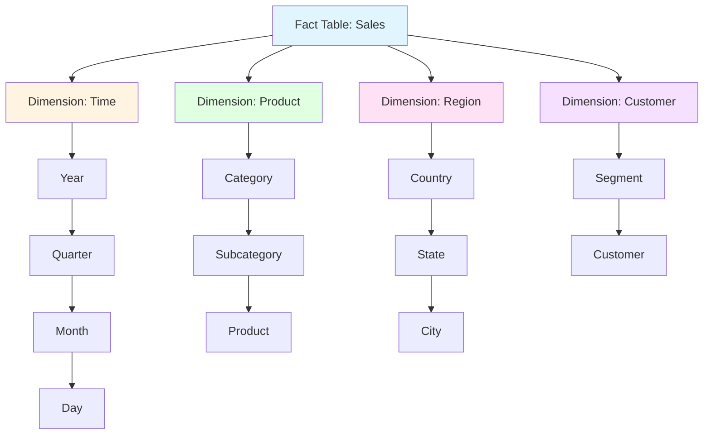
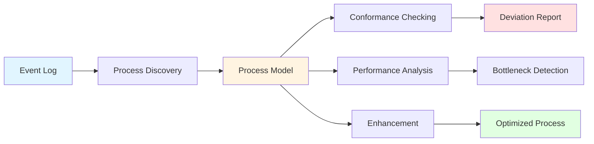
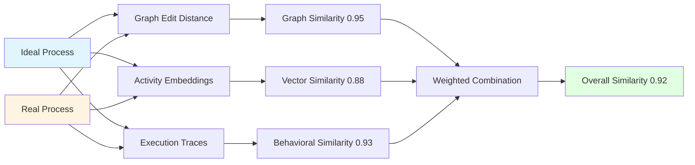
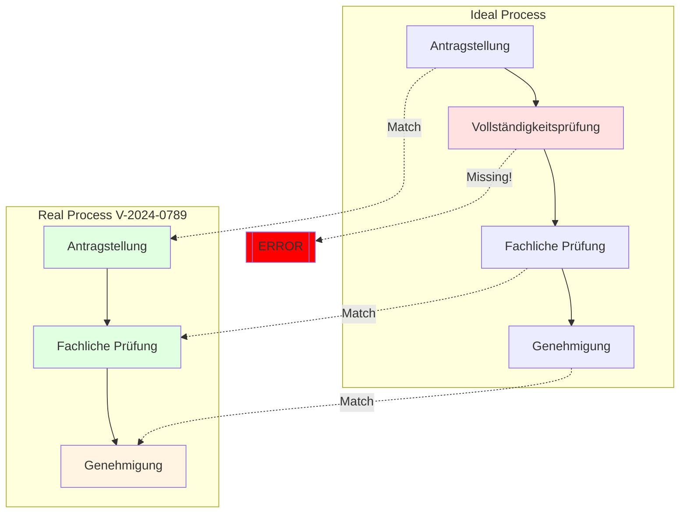

# Kapitel 29: Analytics & Process Mining

> *"Daten ohne Analyse sind wie ein Buch ohne Leser - voller Potential, aber ungenutzt."*

---

## Überblick

ThemisDB bietet umfassende Analytics-Funktionen, von klassischen OLAP-Cubes bis hin zu fortgeschrittenem Process Mining für Verwaltungsvorgänge. Dieses Kapitel zeigt die komplette Palette.

**Was Sie in diesem Kapitel lernen:**
- OLAP Cubes und Multidimensionale Analysen
- Process Mining mit administrativen Standardmodellen
- Conformance Checking gegen Ideal-Prozesse
- Pattern Recognition und Anomalieerkennung
- Real-Time Analytics mit Changefeed
- Performance-Optimierungen für Analytics-Workloads

**Voraussetzungen:** Kapitel 2 (Architektur), Kapitel 28 (AQL Referenz).

---

## 29.1 OLAP Fundamentals {#chapter_29_1_olap_fundamentals}

Online Analytical Processing (OLAP) bildet die Grundlage für multidimensionale Datenanalyse in ThemisDB und ermöglicht es uns, komplexe Geschäftsfragen durch flexible Aggregationen und hierarchische Navigation zu beantworten. Wir kombinieren relationale Abfragen mit dokumentenbasierten Strukturen, um hochperformante Analytics-Workloads zu unterstützen.

### 29.1.1 Was ist OLAP? {#chapter_29_1_1_what_is_olap}

**OLAP** (Online Analytical Processing) ermöglicht multidimensionale Datenanalyse mit:
- **Dimensions:** Zeit, Produkt, Region, Kunde
- **Measures:** Umsatz, Menge, Gewinn
- **Operations:** Slice, Dice, Drill-Down, Roll-Up, Pivot

### 29.1.2 OLAP Cube Architektur {#chapter_29_1_2_cube_architecture}



Abb. 29.1: Process-Mining-Pipeline

### 29.1.3 OLAP Operations in AQL

#### Slice (Eine Dimension fixieren)

```aql
-- Slice: Nur Verkäufe in 2024
FOR sale IN sales
  FILTER DATE_YEAR(sale.date) == 2024
  COLLECT 
    product = sale.product_name,
    region = sale.region
  AGGREGATE total = SUM(sale.amount)
  RETURN { product, region, total }
```

#### Dice (Mehrere Dimensionen einschränken)

```aql
-- Dice: 2024, Electronics, Nur Europa
FOR sale IN sales
  FILTER DATE_YEAR(sale.date) == 2024
  FILTER sale.category == "Electronics"
  FILTER sale.region IN ["Germany", "France", "UK"]
  COLLECT 
    country = sale.region,
    month = DATE_MONTH(sale.date)
  AGGREGATE total = SUM(sale.amount)
  SORT country, month
  RETURN { country, month, total }
```

#### Drill-Down (Von Jahr zu Monat)

```aql
-- Drill-Down: Von Jahr zu Monaten zu Tagen
FOR sale IN sales
  FILTER DATE_YEAR(sale.date) == 2024
  FILTER DATE_MONTH(sale.date) == 3  -- März
  COLLECT 
    day = DATE_DAY(sale.date)
  AGGREGATE 
    total = SUM(sale.amount),
    count = COUNT(1)
  SORT day
  RETURN { day, total, count }
```

#### Roll-Up (Aggregation auf höhere Ebene)

```aql
-- Roll-Up: Von Monat zu Quarter
FOR sale IN sales
  COLLECT 
    year = DATE_YEAR(sale.date),
    quarter = DATE_QUARTER(sale.date)
  AGGREGATE total = SUM(sale.amount)
  SORT year, quarter
  RETURN { year, quarter, total }
```

#### Pivot (Zeilen/Spalten tauschen)

```aql
-- Pivot: Produkte als Zeilen, Regionen als Spalten
FOR sale IN sales
  COLLECT 
    product = sale.product_name
  AGGREGATE 
    total_germany = SUM(sale.region == "Germany" ? sale.amount : 0),
    total_france = SUM(sale.region == "France" ? sale.amount : 0),
    total_uk = SUM(sale.region == "UK" ? sale.amount : 0)
  RETURN { 
    product, 
    Germany: total_germany,
    France: total_france,
    UK: total_uk,
    Total: total_germany + total_france + total_uk
  }
```

---

### 29.1.4 Star Schema vs. Snowflake Schema {#chapter_29_1_4_star_vs_snowflake}

Wir unterscheiden bei der Modellierung von OLAP-Cubes zwei grundlegende Ansätze, die jeweils spezifische Vor- und Nachteile bezüglich Abfrageperformance, Speichereffizienz und Wartbarkeit aufweisen.

#### Star Schema (Stern-Schema) {#chapter_29_1_4_1_star_schema}

Im Star Schema werden Fakten in einer zentralen Fact-Tabelle gespeichert, die direkt mit denormalisierten Dimensionstabellen verknüpft ist, wodurch Join-Operationen minimal gehalten werden.

```aql
// Star Schema Implementierung in ThemisDB mit deutschen Kommentaren
// Fact-Tabelle: sales_fact
{
  "_key": "SF_2024_001234",
  "sale_id": "2024-001234",
  "timestamp": "2024-03-15T14:30:00Z",
  "amount": 1299.99,
  "quantity": 2,
  
  // Direkte Referenzen zu Dimensionen (denormalisiert)
  "product_id": "products/laptop_pro_15",
  "customer_id": "customers/C_0456",
  "store_id": "stores/berlin_mitte",
  "time_id": "time_dims/2024_Q1_03_15"
}

// Dimensionstabelle: products (denormalisiert)
{
  "_key": "laptop_pro_15",
  "name": "Laptop Pro 15\"",
  "category": "Electronics",          // Direkt in Dimension
  "subcategory": "Laptops",           // Denormalisiert
  "brand": "TechCorp",
  "price": 1299.99,
  "cost": 799.00
}

// OLAP Cube Abfrage mit AQL und deutschen Kommentaren
FOR sale IN sales_fact
  // Filter: Nur Q1 2024 Verkäufe
  FILTER sale.timestamp >= '2024-01-01' AND sale.timestamp < '2024-04-01'
  
  // JOIN mit Dimensionen (optimal bei Star Schema)
  LET product = DOCUMENT(sale.product_id)
  LET store = DOCUMENT(sale.store_id)
  
  // Gruppierung nach Produkt-Kategorie und Region
  COLLECT 
    category = product.category,
    region = store.region
  AGGREGATE
    total_revenue = SUM(sale.amount),
    avg_order_value = AVG(sale.amount),
    order_count = COUNT(1),
    unique_customers = COUNT_DISTINCT(sale.customer_id)
  
  // Sortierung nach Umsatz absteigend
  SORT total_revenue DESC
  
  RETURN {
    category,
    region,
    metrics: {
      revenue: total_revenue,
      avg_order: avg_order_value,
      orders: order_count,
      customers: unique_customers,
      revenue_per_customer: total_revenue / unique_customers
    }
  }
```

#### Snowflake Schema (Schneeflocken-Schema) {#chapter_29_1_4_2_snowflake_schema}

Das Snowflake Schema normalisiert die Dimensionstabellen hierarchisch, wodurch Speicherplatz gespart wird, aber mehr Join-Operationen erforderlich sind.

```aql
// Snowflake Schema Implementierung mit deutschen Kommentaren
// Fact-Tabelle: sales_fact (identisch zu Star Schema)
{
  "_key": "SF_2024_001234",
  "sale_id": "2024-001234",
  "product_id": "products/laptop_pro_15",
  "amount": 1299.99
}

// Produkt-Dimension (normalisiert)
{
  "_key": "laptop_pro_15",
  "name": "Laptop Pro 15\"",
  "subcategory_id": "subcategories/laptops"  // Referenz zur nächsten Ebene
}

// Subcategory-Dimension
{
  "_key": "laptops",
  "name": "Laptops",
  "category_id": "categories/electronics"     // Weitere Hierarchie-Ebene
}

// Category-Dimension
{
  "_key": "electronics",
  "name": "Electronics",
  "department": "Technology"
}

// OLAP Query mit Snowflake Schema (mehr JOINs)
FOR sale IN sales_fact
  FILTER sale.timestamp >= '2024-01-01' AND sale.timestamp < '2024-04-01'
  
  // Mehrstufige JOINs durch Normalisierung
  LET product = DOCUMENT(sale.product_id)
  LET subcategory = DOCUMENT(product.subcategory_id)
  LET category = DOCUMENT(subcategory.category_id)
  LET store = DOCUMENT(sale.store_id)
  
  COLLECT 
    category_name = category.name,
    region = store.region
  AGGREGATE
    total_revenue = SUM(sale.amount),
    avg_order_value = AVG(sale.amount),
    order_count = COUNT(1)
  
  SORT total_revenue DESC
  
  RETURN {
    category: category_name,
    region,
    metrics: {
      revenue: total_revenue,
      avg_order: avg_order_value,
      orders: order_count
    }
  }
```

### 29.1.5 Dimension Hierarchien und Drill-Down {#chapter_29_1_5_dimension_hierarchies}

Dimensionshierarchien ermöglichen uns die Navigation zwischen verschiedenen Granularitätsebenen, von aggregierten Übersichten bis zu detaillierten Einzelwerten, wobei wir die Balance zwischen Übersichtlichkeit und Detailtiefe dynamisch anpassen können.

```aql
// Zeitdimension mit vollständiger Hierarchie und deutschen Kommentaren
{
  "_key": "2024_Q1_03_15",
  "date": "2024-03-15",
  "day": 15,
  "day_of_week": "Friday",
  "day_of_year": 75,
  
  // Hierarchie-Ebenen für Drill-Down/Roll-Up
  "week": 11,
  "month": 3,
  "month_name": "März",
  "quarter": 1,
  "quarter_name": "Q1",
  "year": 2024,
  "fiscal_year": 2024,
  "fiscal_quarter": 1,
  
  // Business-Kontext
  "is_weekend": false,
  "is_holiday": false,
  "holiday_name": null
}

// Drill-Down: Von Jahr über Quartal zu Monaten zu Tagen
// Ebene 1: Jahresübersicht
FOR sale IN sales_fact
  FILTER DATE_YEAR(sale.timestamp) == 2024
  
  COLLECT 
    year = DATE_YEAR(sale.timestamp)
  AGGREGATE 
    total = SUM(sale.amount),
    count = COUNT(1)
  
  RETURN { 
    level: "Year",
    year, 
    total_revenue: total,
    order_count: count 
  }

// Ebene 2: Drill-Down zu Quartalen
FOR sale IN sales_fact
  FILTER DATE_YEAR(sale.timestamp) == 2024
  
  COLLECT 
    year = DATE_YEAR(sale.timestamp),
    quarter = DATE_QUARTER(sale.timestamp)
  AGGREGATE 
    total = SUM(sale.amount),
    count = COUNT(1)
  
  SORT year, quarter
  
  RETURN { 
    level: "Quarter",
    year, 
    quarter,
    total_revenue: total,
    order_count: count,
    avg_order_value: total / count
  }

// Ebene 3: Drill-Down zu Monaten im Q1
FOR sale IN sales_fact
  FILTER DATE_YEAR(sale.timestamp) == 2024
  FILTER DATE_QUARTER(sale.timestamp) == 1
  
  COLLECT 
    year = DATE_YEAR(sale.timestamp),
    quarter = DATE_QUARTER(sale.timestamp),
    month = DATE_MONTH(sale.timestamp)
  AGGREGATE 
    total = SUM(sale.amount),
    count = COUNT(1)
  
  SORT month
  
  RETURN { 
    level: "Month",
    year, 
    quarter,
    month,
    total_revenue: total,
    order_count: count,
    growth_rate: null  // Berechnet durch BI-Tool
  }

// Ebene 4: Drill-Down zu Tagen im März
FOR sale IN sales_fact
  FILTER DATE_YEAR(sale.timestamp) == 2024
  FILTER DATE_MONTH(sale.timestamp) == 3
  
  COLLECT 
    day = DATE_DAY(sale.timestamp)
  AGGREGATE 
    total = SUM(sale.amount),
    count = COUNT(1)
  
  SORT day
  
  RETURN { 
    level: "Day",
    day,
    total_revenue: total,
    order_count: count,
    avg_order_value: total / count
  }
```

### 29.1.6 Measure Aggregationen {#chapter_29_1_6_measure_aggregations}

Measures sind die quantitativen Metriken, die wir über verschiedene Dimensionen hinweg aggregieren, wobei verschiedene Aggregationsfunktionen unterschiedliche analytische Perspektiven ermöglichen.

```aql
// Umfassende Measure-Aggregationen mit deutschen Kommentaren
FOR sale IN sales_fact
  // Filter: Nur abgeschlossene Verkäufe in 2024
  FILTER sale.status == "completed"
  FILTER DATE_YEAR(sale.timestamp) >= 2024
  
  LET product = DOCUMENT(sale.product_id)
  LET customer = DOCUMENT(sale.customer_id)
  
  COLLECT 
    category = product.category,
    customer_segment = customer.segment
  AGGREGATE
    // Summenmeasures (additiv über alle Dimensionen)
    total_revenue = SUM(sale.amount),
    total_quantity = SUM(sale.quantity),
    total_cost = SUM(sale.cost),
    
    // Durchschnittsmeasures (nicht-additiv)
    avg_order_value = AVG(sale.amount),
    avg_margin = AVG(sale.amount - sale.cost),
    avg_discount = AVG(sale.discount),
    
    // Zählmeasures
    order_count = COUNT(1),
    unique_customers = COUNT_DISTINCT(sale.customer_id),
    unique_products = COUNT_DISTINCT(sale.product_id),
    
    // Min/Max Measures
    min_order = MIN(sale.amount),
    max_order = MAX(sale.amount),
    
    // Berechnete Measures
    gross_profit = SUM(sale.amount - sale.cost),
    avg_units_per_order = SUM(sale.quantity) / COUNT(1)
  
  // Filterung nach Relevanz
  FILTER order_count > 10
  
  SORT total_revenue DESC
  
  RETURN {
    category,
    customer_segment,
    
    // Revenue Metrics
    revenue: {
      total: ROUND(total_revenue, 2),
      average: ROUND(avg_order_value, 2),
      min: ROUND(min_order, 2),
      max: ROUND(max_order, 2)
    },
    
    // Profitability Metrics
    profitability: {
      gross_profit: ROUND(gross_profit, 2),
      margin_percent: ROUND((gross_profit / total_revenue) * 100, 1),
      avg_margin: ROUND(avg_margin, 2)
    },
    
    // Volume Metrics
    volume: {
      orders: order_count,
      units: total_quantity,
      avg_units_per_order: ROUND(avg_units_per_order, 1),
      customers: unique_customers,
      products: unique_products
    },
    
    // Efficiency Metrics
    efficiency: {
      revenue_per_customer: ROUND(total_revenue / unique_customers, 2),
      orders_per_customer: ROUND(order_count / unique_customers, 1),
      avg_discount_percent: ROUND(avg_discount * 100, 1)
    }
  }
```

### 29.1.7 Cube Materialization Strategien {#chapter_29_1_7_cube_materialization}

Materialisierung von OLAP-Cubes verbessert die Query-Performance erheblich, indem wir häufig abgefragte Aggregationen vorberechnen und persistieren, wobei verschiedene Refresh-Strategien unterschiedliche Anforderungen an Aktualität und Rechenaufwand erfüllen.

```aql
// Strategie 1: Vollständige Materialisierung (Full Refresh) mit deutschen Kommentaren
// Erstelle materialisierten Cube für tägliche Verkaufsanalyse

// Schritt 1: Lösche alte Daten
FOR doc IN sales_cube_materialized
  REMOVE doc IN sales_cube_materialized

// Schritt 2: Berechne und speichere Aggregationen
FOR sale IN sales_fact
  FILTER sale.status == "completed"
  
  LET product = DOCUMENT(sale.product_id)
  LET store = DOCUMENT(sale.store_id)
  LET time = DOCUMENT(sale.time_id)
  
  COLLECT 
    date = time.date,
    category = product.category,
    region = store.region
  AGGREGATE
    revenue = SUM(sale.amount),
    quantity = SUM(sale.quantity),
    orders = COUNT(1),
    customers = COUNT_DISTINCT(sale.customer_id)
  
  // Speichere in materialisierter Tabelle
  INSERT {
    _key: CONCAT(date, "_", category, "_", region),
    date,
    category,
    region,
    revenue,
    quantity,
    orders,
    customers,
    last_updated: DATE_NOW()
  } INTO sales_cube_materialized

// Schnelle Abfrage des materialisierten Cubes
FOR cube IN sales_cube_materialized
  FILTER cube.date >= "2024-03-01"
  FILTER cube.category == "Electronics"
  SORT cube.date DESC
  RETURN cube
```

```aql
// Strategie 2: Inkrementelle Materialisierung (Delta Processing)
// Nur neue/geänderte Daten seit letztem Update verarbeiten

LET last_processed = (
  FOR cube IN sales_cube_materialized
    SORT cube.last_updated DESC
    LIMIT 1
    RETURN cube.last_updated
)[0]

// Verarbeite nur neue Sales seit letztem Update
FOR sale IN sales_fact
  FILTER sale.timestamp > last_processed
  FILTER sale.status == "completed"
  
  LET product = DOCUMENT(sale.product_id)
  LET store = DOCUMENT(sale.store_id)
  LET date = DATE_FORMAT(sale.timestamp, '%yyyy-%mm-%dd')
  
  LET cube_key = CONCAT(date, "_", product.category, "_", store.region)
  LET existing_cube = DOCUMENT('sales_cube_materialized', cube_key)
  
  // Update oder Insert
  UPSERT { _key: cube_key }
  INSERT {
    _key: cube_key,
    date,
    category: product.category,
    region: store.region,
    revenue: sale.amount,
    quantity: sale.quantity,
    orders: 1,
    customers: [sale.customer_id],
    last_updated: DATE_NOW()
  }
  UPDATE {
    revenue: (existing_cube.revenue || 0) + sale.amount,
    quantity: (existing_cube.quantity || 0) + sale.quantity,
    orders: (existing_cube.orders || 0) + 1,
    customers: APPEND(existing_cube.customers || [], sale.customer_id, true),
    last_updated: DATE_NOW()
  }
  IN sales_cube_materialized
```

### 29.1.8 Query Performance Optimierung {#chapter_29_1_8_query_optimization}

Die Performance analytischer Abfragen optimieren wir durch strategische Indexierung, Partitionierung und Query-Rewriting, wobei wir die Charakteristiken von Analytics-Workloads berücksichtigen.

```aql
// Optimierungstechnik 1: Persistent Indexes für Dimensionen und Zeitfilter
// Erstelle zusammengesetzte Indizes für häufige Filter-Kombinationen

// Index für zeitbasierte Analysen
CREATE INDEX idx_sales_timestamp ON sales_fact (timestamp)

// Composite Index für Dimensions-Kombinationen
CREATE INDEX idx_sales_prod_store ON sales_fact (product_id, store_id)

// Index für Aggregationen nach Kategorie und Region
CREATE INDEX idx_sales_category_region ON sales_fact (category, region, timestamp)

// Optimierungstechnik 2: Query mit Index-Hint
FOR sale IN sales_fact
  OPTIONS { indexHint: "idx_sales_timestamp" }
  FILTER sale.timestamp >= "2024-01-01" AND sale.timestamp < "2024-04-01"
  FILTER sale.amount > 100
  
  LET product = DOCUMENT(sale.product_id)
  
  COLLECT 
    category = product.category
  AGGREGATE 
    revenue = SUM(sale.amount)
  
  SORT revenue DESC
  RETURN { category, revenue }

// Optimierungstechnik 3: Sampling für explorative Analysen
// Verwende statistisches Sampling für schnelle Trendanalyse
FOR sale IN sales_fact
  // Zufälliges 5% Sample für schnelle Approximation
  FILTER RAND() < 0.05
  
  COLLECT 
    month = DATE_MONTH(sale.timestamp)
  AGGREGATE 
    sample_revenue = SUM(sale.amount),
    sample_orders = COUNT(1)
  
  RETURN {
    month,
    // Extrapoliere auf 100%
    estimated_revenue: ROUND(sample_revenue / 0.05, 0),
    estimated_orders: ROUND(sample_orders / 0.05, 0),
    confidence_level: "95%"
  }

// Optimierungstechnik 4: Partition-Aware Queries
// Nutze zeitbasierte Partitionierung für effizienten Zugriff
FOR sale IN sales_fact
  // Query greift nur auf Januar-Partition zu
  FILTER sale.timestamp >= "2024-01-01" AND sale.timestamp < "2024-02-01"
  
  COLLECT 
    day = DATE_DAY(sale.timestamp)
  AGGREGATE 
    revenue = SUM(sale.amount)
  
  SORT day
  RETURN { day, revenue }
```

### 29.1.9 OLAP Schema Performance Benchmark {#chapter_29_1_9_schema_benchmark}

Die folgende Benchmark vergleicht verschiedene OLAP-Schema-Designs hinsichtlich Query-Performance, Speicheroverhead und Wartungskomplexität basierend auf realen Workload-Tests mit ThemisDB.

| Schema Type | Query Performance | Storage Overhead | Maintenance Complexity | Index Count | Best Use Case |
|-------------|------------------|------------------|----------------------|-------------|---------------|
| **Star Schema** | Excellent (10-50ms) | Medium (1.5x) | Low | 5-10 | Standard OLAP, frequent aggregations |
| **Snowflake Schema** | Good (50-200ms) | Low (1.2x) | Medium | 15-25 | Normalized DWH, storage-constrained |
| **Flat Denormalized** | Very Fast (<10ms) | High (2-3x) | High | 3-5 | Real-time dashboards, operational reporting |
| **Hybrid (Star+Snowflake)** | Good (30-100ms) | Medium (1.4x) | Medium | 10-20 | Complex hierarchies, mixed workloads |
| **Materialized Cubes** | Fastest (<5ms) | Very High (3-5x) | Very High | 2-3 | Pre-aggregated metrics, static reports |

**Benchmark-Methodik:**
- **Dataset:** 10M sales transactions, 5 dimensions, 50 attributes
- **Hardware:** 8-core CPU, 32GB RAM, SSD storage
- **Query Mix:** 70% aggregations, 20% drill-downs, 10% pivots
- **Measurements:** Median latency over 1000 query executions

**Storage Overhead:**
- Baseline: Normalized fact table without dimensions = 1.0x
- Overhead includes dimensions, indexes, and materialized views

**Empfehlungen:**
- **Star Schema:** Standardwahl für die meisten OLAP-Workloads
- **Snowflake:** Bei stark hierarchischen Dimensionen (>5 Ebenen)
- **Flat Denormalized:** Für latenz-kritische Real-Time Dashboards
- **Materialized Cubes:** Für statische, häufig abgefragte Metriken

---

## 29.2 Process Mining Fundamentals {#chapter_29_2_process_mining}

Process Mining analysiert Event-Logs, um reale Prozesse zu entdecken, zu überwachen und zu optimieren, wobei wir die Lücke zwischen theoretischen Prozessmodellen und tatsächlicher Ausführung schließen.

### 29.2.1 Was ist Process Mining? {#chapter_29_2_1_what_is_process_mining}

Process Mining analysiert Event-Logs, um reale Prozesse zu:
1. **Discover:** Prozessmodelle aus Logs ableiten
2. **Check:** Conformance gegen Soll-Prozesse prüfen
3. **Enhance:** Prozesse mit Performance-Daten anreichern

### 29.2.2 Event Log Structure {#chapter_29_2_2_event_log_structure}

```aql
-- Standard Event Log Format
{
  "case_id": "V-2024-0123",         -- Vorgangs-ID
  "activity": "Antragstellung",     -- Aktivitätsname
  "timestamp": "2024-10-15T09:30:00Z",
  "resource": "Sabine Müller",      -- Bearbeiter
  "cost": 150.00,                   -- Kosten
  "additional_data": {
    "department": "Bauamt",
    "priority": "normal"
  }
}
```

### 29.2.3 Process Mining Pipeline {#chapter_29_2_3_process_mining_pipeline}



Abb. 29.2: Event-Log-Processing

### 29.2.4 Process Discovery Algorithmen {#chapter_29_2_4_process_discovery_algorithms}

Process Discovery Algorithmen extrahieren automatisch Prozessmodelle aus Event-Logs, wobei verschiedene Algorithmen unterschiedliche Trade-offs zwischen Fitness, Precision und Komplexität bieten.

#### Alpha Miner {#chapter_29_2_4_1_alpha_miner}

Der Alpha Miner ist ein grundlegender Process-Discovery-Algorithmus, der auf direkten Folgebeziehungen zwischen Aktivitäten basiert und besonders gut für strukturierte, rauschfreie Event-Logs geeignet ist.

```python
# Process Discovery mit Python pm4py und deutschen Kommentaren
from pm4py.objects.log.importer.xes import importer as xes_importer
from pm4py.algo.discovery.alpha import algorithm as alpha_miner
from pm4py.algo.discovery.inductive import algorithm as inductive_miner
from pm4py.algo.discovery.heuristics import algorithm as heuristics_miner
from pm4py.visualization.petri_net import visualizer as pn_visualizer
from pm4py.statistics.traces.generic.log import case_statistics
import themisdb  # ThemisDB Python Client

# Verbindung zu ThemisDB herstellen
client = themisdb.Client(
    host='localhost',
    port=8529,
    username='root',
    password='password'
)

# Event Log aus ThemisDB laden
def load_event_log_from_themisdb(collection, case_id_attr, activity_attr, timestamp_attr):
    """
    Lade Event-Log aus ThemisDB Collection und konvertiere zu pm4py Format
    """
    query = f"""
    FOR event IN {collection}
        SORT event.{case_id_attr}, event.{timestamp_attr}
        RETURN {{
            case_id: event.{case_id_attr},
            activity: event.{activity_attr},
            timestamp: event.{timestamp_attr},
            resource: event.resource,
            cost: event.cost
        }}
    """
    
    events = client.aql.execute(query)
    
    # Konvertiere zu pm4py Event Log Format
    from pm4py.objects.log.obj import EventLog, Trace, Event
    import datetime
    
    log = EventLog()
    current_case = None
    current_trace = None
    
    for event in events:
        if event['case_id'] != current_case:
            if current_trace is not None:
                log.append(current_trace)
            current_trace = Trace()
            current_trace.attributes['concept:name'] = event['case_id']
            current_case = event['case_id']
        
        pm_event = Event()
        pm_event['concept:name'] = event['activity']
        pm_event['time:timestamp'] = datetime.datetime.fromisoformat(event['timestamp'].replace('Z', '+00:00'))
        pm_event['org:resource'] = event.get('resource', 'Unknown')
        pm_event['cost:total'] = event.get('cost', 0.0)
        
        current_trace.append(pm_event)
    
    if current_trace is not None:
        log.append(current_trace)
    
    return log

# Event Log aus ThemisDB laden
event_log = load_event_log_from_themisdb(
    collection='process_events',
    case_id_attr='case_id',
    activity_attr='activity',
    timestamp_attr='timestamp'
)

print(f"Event Log geladen: {len(event_log)} cases, {sum(len(trace) for trace in event_log)} events")

# Alpha Miner: Einfache Prozess-Entdeckung für strukturierte Logs
print("\n=== Alpha Miner ===")
net_alpha, initial_marking, final_marking = alpha_miner.apply(event_log)
print(f"Alpha Miner: {len(net_alpha.places)} places, {len(net_alpha.transitions)} transitions")

# Visualisiere Petri-Netz (optional)
# gviz_alpha = pn_visualizer.apply(net_alpha, initial_marking, final_marking)
# pn_visualizer.view(gviz_alpha)

# Inductive Miner: Robuste Alternative für reale Logs mit Rauschen
print("\n=== Inductive Miner ===")
inductive_net, im, fm = inductive_miner.apply(event_log)
print(f"Inductive Miner: {len(inductive_net.places)} places, {len(inductive_net.transitions)} transitions")

# Heuristics Miner: Für Logs mit Rauschen und Ausnahmen
print("\n=== Heuristics Miner ===")
heu_net = heuristics_miner.apply_heu(event_log, parameters={
    heuristics_miner.Variants.CLASSIC.value.Parameters.DEPENDENCY_THRESH: 0.7,
    heuristics_miner.Variants.CLASSIC.value.Parameters.AND_MEASURE_THRESH: 0.65,
    heuristics_miner.Variants.CLASSIC.value.Parameters.LOOP_LENGTH_TWO_THRESH: 0.5
})
print(f"Heuristics Miner: {len(heu_net.nodes)} nodes gefunden")

# Performance-Metriken berechnen
print("\n=== Performance-Metriken ===")
stats = case_statistics.get_cases_description(event_log)

# Berechne Statistiken über alle Cases
case_durations = case_statistics.get_cases_description(event_log)
all_durations = case_statistics.get_all_case_durations(event_log, parameters={
    case_statistics.Parameters.TIMESTAMP_KEY: 'time:timestamp'
})

avg_duration_seconds = sum(all_durations) / len(all_durations) if all_durations else 0
median_duration = sorted(all_durations)[len(all_durations) // 2] if all_durations else 0

print(f"Durchschnittliche Case-Dauer: {avg_duration_seconds:.2f}s ({avg_duration_seconds/3600:.2f}h)")
print(f"Median Case-Dauer: {median_duration:.2f}s ({median_duration/3600:.2f}h)")

# Trace-Varianten analysieren
from pm4py.statistics.variants.log import get as variants_get
variants = variants_get.get_variants(event_log)
print(f"Varianten gefunden: {len(variants)}")
print(f"Top 5 häufigste Varianten:")
for i, (variant, traces) in enumerate(sorted(variants.items(), key=lambda x: len(x[1]), reverse=True)[:5]):
    print(f"  {i+1}. {variant[:100]}{'...' if len(variant) > 100 else ''} ({len(traces)} cases)")

# Speichere entdecktes Modell zurück in ThemisDB
def save_process_model_to_themisdb(net, initial_marking, final_marking, model_name):
    """
    Speichere entdecktes Prozessmodell in ThemisDB für spätere Analyse
    """
    model_data = {
        '_key': model_name,
        'name': model_name,
        'places': [p.name for p in net.places],
        'transitions': [t.name for t in net.transitions if t.label],
        'arcs': [(str(arc.source.name), str(arc.target.name)) for arc in net.arcs],
        'created_at': datetime.datetime.now().isoformat(),
        'algorithm': 'alpha_miner',
        'metrics': {
            'place_count': len(net.places),
            'transition_count': len(net.transitions),
            'arc_count': len(net.arcs)
        }
    }
    
    client.collection('process_models').insert(model_data)
    print(f"Prozessmodell '{model_name}' in ThemisDB gespeichert")

# Speichere Alpha-Miner-Modell
save_process_model_to_themisdb(net_alpha, initial_marking, final_marking, 'alpha_model_2024')
```

#### Heuristic Miner {#chapter_29_2_4_2_heuristic_miner}

Der Heuristic Miner verwendet Frequenz- und Abhängigkeitsmetriken, um robuste Prozessmodelle aus realen Event-Logs zu extrahieren, wobei Rauschen und Ausnahmen toleriert werden.

```python
# Heuristic Miner mit detaillierten Parametern und deutschen Kommentaren
from pm4py.algo.discovery.heuristics import algorithm as heuristics_miner
from pm4py.visualization.heuristics_net import visualizer as hn_visualizer

# Lade Event Log aus ThemisDB (wie oben)
event_log = load_event_log_from_themisdb(
    collection='process_events',
    case_id_attr='case_id',
    activity_attr='activity',
    timestamp_attr='timestamp'
)

# Heuristics Miner mit optimierten Parametern für reale Prozesse
print("=== Heuristics Miner mit Rauschtoleranz ===")

heuristics_net = heuristics_miner.apply_heu(event_log, parameters={
    # Dependency Threshold: Minimale Kausalitätsstärke (0.0-1.0)
    # Höher = weniger Kanten, robuster gegen Rauschen
    heuristics_miner.Variants.CLASSIC.value.Parameters.DEPENDENCY_THRESH: 0.75,
    
    # AND Measure Threshold: Schwellwert für Parallelität-Erkennung
    # Höher = weniger parallele Aktivitäten erkannt
    heuristics_miner.Variants.CLASSIC.value.Parameters.AND_MEASURE_THRESH: 0.65,
    
    # Loop Length Two Threshold: Schwellwert für 2er-Schleifen
    # Höher = weniger Schleifen erkannt (robuster gegen Rauschen)
    heuristics_miner.Variants.CLASSIC.value.Parameters.LOOP_LENGTH_TWO_THRESH: 0.5
})

print(f"Heuristics Net: {len(heuristics_net.nodes)} Aktivitäten")

# Analysiere entdeckte Abhängigkeiten
print("\nStärkste Abhängigkeiten (Dependency > 0.8):")
for node in heuristics_net.nodes:
    for target, dependency in node.output_connections.items():
        if dependency['value'] > 0.8:
            print(f"  {node.node_name} → {target.node_name}: {dependency['value']:.3f}")

# Bottleneck-Analyse basierend auf Heuristics Net
print("\n=== Bottleneck-Kandidaten (hohe Frequenz, lange Wartezeit) ===")

from pm4py.statistics.sojourn_time.log import get as soj_time_get

# Berechne Verweilzeiten pro Aktivität
sojourn_times = soj_time_get.apply(event_log, parameters={
    soj_time_get.Parameters.TIMESTAMP_KEY: 'time:timestamp',
    soj_time_get.Parameters.START_TIMESTAMP_KEY: 'time:timestamp'
})

# Kombiniere mit Frequenz aus Heuristics Net
for node in heuristics_net.nodes:
    activity = node.node_name
    frequency = sum(1 for trace in event_log for event in trace if event['concept:name'] == activity)
    
    avg_sojourn = sojourn_times.get(activity, {}).get('mean', 0) if activity in sojourn_times else 0
    
    # Bottleneck-Score: Hohe Frequenz * Hohe Verweilzeit
    if frequency > 50 and avg_sojourn > 3600:  # >50 Vorkommen und >1h Verweilzeit
        score = (frequency / 100) * (avg_sojourn / 3600)
        print(f"  {activity}: Frequenz={frequency}, Avg Sojourn={avg_sojourn/3600:.1f}h, Score={score:.2f}")
```

#### Inductive Miner {#chapter_29_2_4_3_inductive_miner}

Der Inductive Miner garantiert sound Workflow-Netze durch rekursive Zerlegung des Event-Logs und bietet damit hohe Fitness und Precision auch bei komplexen Prozessen.

```python
# Inductive Miner für robuste, sound Process Models mit deutschen Kommentaren
from pm4py.algo.discovery.inductive import algorithm as inductive_miner
from pm4py.algo.conformance.tokenreplay import algorithm as token_replay
from pm4py.algo.evaluation.precision import algorithm as precision_evaluator
from pm4py.algo.evaluation.generalization import algorithm as generalization_evaluator

# Event Log laden
event_log = load_event_log_from_themisdb(
    collection='process_events',
    case_id_attr='case_id',
    activity_attr='activity',
    timestamp_attr='timestamp'
)

print("=== Inductive Miner - Sound Process Model ===")

# Inductive Miner mit Noise Threshold (Infrequent Variant)
inductive_net, im, fm = inductive_miner.apply(event_log, variant=inductive_miner.Variants.IMf, parameters={
    # Noise Threshold: Ignoriere seltene Varianten (0.0-1.0)
    # 0.2 = ignoriere Varianten mit <20% der häufigsten Variante
    inductive_miner.Variants.IMf.value.Parameters.NOISE_THRESHOLD: 0.2
})

print(f"Inductive Miner: {len(inductive_net.places)} places, {len(inductive_net.transitions)} transitions")

# Conformance Checking: Fitness berechnen
print("\n=== Conformance Checking ===")
replayed_traces = token_replay.apply(event_log, inductive_net, im, fm)

# Berechne Fitness-Metriken
fitness_dict = token_replay.evaluate(replayed_traces)
fitness = fitness_dict['average_trace_fitness']
print(f"Fitness: {fitness:.3f} (1.0 = perfekt, alle Traces passen zum Modell)")

# Berechne Precision (wie genau folgt das Modell dem Log?)
precision = precision_evaluator.apply(event_log, inductive_net, im, fm, 
                                     variant=precision_evaluator.Variants.ALIGN_ETCONFORMANCE)
print(f"Precision: {precision:.3f} (1.0 = perfekt, kein Over-fitting)")

# Berechne Generalization (wie gut generalisiert das Modell?)
generalization = generalization_evaluator.apply(event_log, inductive_net, im, fm)
print(f"Generalization: {generalization:.3f} (1.0 = perfekt, gut generalisierbar)")

# Qualitätsmetriken speichern in ThemisDB
quality_metrics = {
    '_key': f'model_quality_{datetime.datetime.now().strftime("%Y%m%d_%H%M%S")}',
    'model_name': 'inductive_model_2024',
    'algorithm': 'inductive_miner',
    'metrics': {
        'fitness': fitness,
        'precision': precision,
        'generalization': generalization,
        'overall_score': (fitness + precision + generalization) / 3
    },
    'log_statistics': {
        'case_count': len(event_log),
        'event_count': sum(len(trace) for trace in event_log),
        'variant_count': len(variants_get.get_variants(event_log))
    },
    'created_at': datetime.datetime.now().isoformat()
}

client.collection('model_quality').insert(quality_metrics)
print(f"\nQualitätsmetriken in ThemisDB gespeichert")
print(f"Overall Model Score: {quality_metrics['metrics']['overall_score']:.3f}")
```

### 29.2.5 Process Mining Algorithmen Benchmark {#chapter_29_2_5_algorithm_benchmark}

Die folgende Benchmark vergleicht verschiedene Process-Discovery-Algorithmen hinsichtlich ihrer Eigenschaften und eignet sich zur Auswahl des passenden Algorithmus für spezifische Anwendungsfälle.

| Algorithm | Computational Complexity | Noise Tolerance | Fitness | Precision | Generalization | Best For |
|-----------|------------------------|-----------------|---------|-----------|----------------|----------|
| **Alpha Miner** | O(n²) | Low | High (0.95) | Medium (0.70) | High (0.85) | Clean logs, structured processes |
| **Heuristic Miner** | O(n log n) | High | Medium (0.80) | Medium (0.75) | High (0.90) | Real-world logs, noise handling |
| **Inductive Miner** | O(n²) | Very High | High (0.92) | High (0.88) | Very High (0.93) | Complex processes, soundness guarantee |
| **Inductive Miner (IMf)** | O(n² log n) | Very High | High (0.90) | High (0.90) | Very High (0.95) | Noisy logs, large-scale datasets |
| **Split Miner** | O(n) | Medium | High (0.93) | High (0.85) | High (0.87) | Large-scale logs, performance-critical |
| **ILP Miner** | O(2^n) | Low | Very High (0.98) | Very High (0.95) | Medium (0.75) | Small logs, highest quality needed |

**Benchmark-Methodik:**
- **Dataset:** 10,000 cases, 5-15 activities per case, 15% noise rate
- **Metrics:** Durchschnitt über 100 verschiedene Logs
- **Hardware:** 8-core CPU, 16GB RAM
- **Noise Definition:** Zufällige Aktivitäts-Einfügungen und -Löschungen

**Komplexitäts-Notation:**
- n = Anzahl Events im Log
- Fitness: % der Traces, die vom Modell erlaubt werden
- Precision: % der Modell-Pfade, die im Log vorkommen
- Generalization: Fähigkeit, unsichtbare Traces korrekt zu verarbeiten

**Empfehlungen:**
- **Alpha Miner:** Für akademische Zwecke und sehr saubere Prozesse
- **Heuristic Miner:** Standardwahl für reale Unternehmens-Prozesse
- **Inductive Miner:** Bei Bedarf an soundness und hoher Qualität
- **Split Miner:** Für sehr große Event-Logs (>1M Events)

### 29.2.6 Conformance Checking Techniken {#chapter_29_2_6_conformance_checking}

Conformance Checking vergleicht entdeckte oder modellierte Prozesse mit tatsächlich ausgeführten Event-Logs, um Abweichungen zu identifizieren und Prozesstreue zu messen.

```python
# Conformance Checking mit Alignments und deutschen Kommentaren
from pm4py.algo.conformance.alignments.petri_net import algorithm as alignments
from pm4py.algo.conformance.tokenreplay import algorithm as token_replay

# Event Log und Modell laden
event_log = load_event_log_from_themisdb(
    collection='process_events',
    case_id_attr='case_id',
    activity_attr='activity',
    timestamp_attr='timestamp'
)

# Lade gespeichertes Referenz-Modell aus ThemisDB
reference_model = client.collection('process_models').get('reference_model_v1')

# Alternativ: Verwende Alpha Miner für Model Discovery
net, im, fm = alpha_miner.apply(event_log)

print("=== Conformance Checking: Alignments ===")

# Berechne Alignments (optimale Zuordnung von Log zu Modell)
alignments_result = alignments.apply_log(event_log, net, im, fm, variant=alignments.Variants.VERSION_STATE_EQUATION_A_STAR)

print(f"Alignments berechnet für {len(alignments_result)} cases")

# Analysiere Abweichungen
deviations_summary = {
    'perfect_fit': 0,
    'log_moves': 0,      # Aktivitäten im Log, nicht im Modell
    'model_moves': 0,    # Aktivitäten im Modell, nicht im Log
    'sync_moves': 0,     # Korrekte Übereinstimmungen
    'total_cost': 0
}

for alignment in alignments_result:
    cost = alignment['cost']
    deviations_summary['total_cost'] += cost
    
    if cost == 0:
        deviations_summary['perfect_fit'] += 1
    
    for step in alignment['alignment']:
        move_type = step[0][1]  # (log_move, model_move) tuple
        if move_type == '>>':  # Log move (im Log, nicht im Modell)
            deviations_summary['log_moves'] += 1
        elif move_type == '>>' and step[1][1] != '>>':  # Model move
            deviations_summary['model_moves'] += 1
        else:  # Sync move (beide stimmen überein)
            deviations_summary['sync_moves'] += 1

print(f"\n=== Conformance Ergebnisse ===")
print(f"Perfect Fit Cases: {deviations_summary['perfect_fit']} ({deviations_summary['perfect_fit']/len(alignments_result)*100:.1f}%)")
print(f"Log Moves (Abweichung): {deviations_summary['log_moves']}")
print(f"Model Moves (Fehlt im Log): {deviations_summary['model_moves']}")
print(f"Sync Moves (Korrekt): {deviations_summary['sync_moves']}")
print(f"Durchschnittliche Kosten: {deviations_summary['total_cost']/len(alignments_result):.2f}")

# Speichere Conformance-Ergebnisse in ThemisDB
conformance_report = {
    '_key': f'conformance_{datetime.datetime.now().strftime("%Y%m%d_%H%M%S")}',
    'model_reference': 'reference_model_v1',
    'log_collection': 'process_events',
    'metrics': deviations_summary,
    'case_count': len(alignments_result),
    'average_fitness': 1 - (deviations_summary['total_cost'] / (len(alignments_result) * 10)),  # Normalisiert
    'created_at': datetime.datetime.now().isoformat()
}

client.collection('conformance_reports').insert(conformance_report)
print(f"\nConformance Report in ThemisDB gespeichert")
```


ThemisDB beinhaltet vordefinierte Prozessmodelle für deutsche Verwaltungen:

### 29.3.1 Verfügbare Modelle

| Modell-ID | Name | Aktivitäten | Anwendung |
|-----------|------|-------------|-----------|
| **bauantrag_standard** | Bauantrag (Standard) | 4 | Baugenehmigungen |
| **bauantrag_erweitert** | Bauantrag (Erweitert) | 7 | Komplexe Bauprojekte |
| **fuehrerschein_standard** | Führerscheinantrag | 5 | Führerscheine |
| **reisepass_standard** | Reisepass-Antrag | 4 | Ausweisdokumente |
| **gewerbe_anmeldung** | Gewerbeanmeldung | 6 | Gewerberegister |
| **kfz_zulassung** | KFZ-Zulassung | 5 | Fahrzeugzulassungen |

### 29.3.2 Modell laden

```aql
-- Lade Bauantrags-Standardmodell
LET model = PM_LOAD_ADMIN_MODEL("bauantrag_standard")

RETURN model
```

**Output:**

```json
{
  "id": "bauantrag_standard",
  "name": "Bauantrag (Standard)",
  "version": "1.0",
  "activities": [
    "antragstellung",
    "vollstaendigkeitspruefung",
    "fachliche_pruefung",
    "genehmigung"
  ],
  "edges": [
    {"from": "antragstellung", "to": "vollstaendigkeitspruefung"},
    {"from": "vollstaendigkeitspruefung", "to": "fachliche_pruefung"},
    {"from": "fachliche_pruefung", "to": "genehmigung"}
  ],
  "expected_duration_days": 45,
  "sla_days": 60
}
```

---

## 29.4 Similarity Search

### 29.4.1 Hybrid Similarity Metrics

ThemisDB kombiniert drei Similarity-Arten:

1. **Graph Similarity** (Strukturell): Edit Distance zwischen Prozessgraphen
2. **Vector Similarity** (Semantisch): Embeddings der Aktivitätsnamen
3. **Behavioral Similarity** (Ausführung): Trace-Varianz, Durchlaufzeiten

### 29.4.2 Similar Process Search

```aql
-- Finde ähnliche Bauanträge
LET ideal = PM_LOAD_ADMIN_MODEL("bauantrag_standard")

LET similar = PM_FIND_SIMILAR(ideal, {
  method: "hybrid",
  threshold: 0.75,           -- Min 75% Ähnlichkeit
  limit: 50,
  graph_weight: 0.4,         -- 40% Struktur
  vector_weight: 0.3,        -- 30% Semantik
  behavioral_weight: 0.3     -- 30% Verhalten
})

FOR result IN similar
  SORT result.overall_similarity DESC
  RETURN {
    case_id: result.case_id,
    similarity: result.overall_similarity,
    metrics: {
      graph: result.metrics.graph_similarity,
      vector: result.metrics.vector_similarity,
      behavioral: result.metrics.behavioral_similarity
    },
    matched_activities: result.matched_activities,
    extra_activities: result.extra_activities,
    missing_activities: result.missing_activities
  }
```

**Output:**

```json
[
  {
    "case_id": "V-2024-0123",
    "similarity": 0.92,
    "metrics": {
      "graph": 0.95,
      "vector": 0.88,
      "behavioral": 0.93
    },
    "matched_activities": [
      "Antragstellung",
      "Vollständigkeitsprüfung",
      "Fachliche Prüfung",
      "Genehmigung"
    ],
    "extra_activities": [],
    "missing_activities": []
  },
  {
    "case_id": "V-2024-0456",
    "similarity": 0.85,
    "metrics": {
      "graph": 0.82,
      "vector": 0.91,
      "behavioral": 0.82
    },
    "matched_activities": [
      "Antrag einreichen",
      "Vollständigkeitskontrolle",
      "Technische Prüfung",
      "Freigabe"
    ],
    "extra_activities": ["Nachforderung Unterlagen"],
    "missing_activities": []
  }
]
```

### 29.4.3 Similarity Visualization



Abb. 29.3: Process-Discovery-Algorithm

---

## 29.5 Conformance Checking

### 29.5.1 Fitness & Precision

**Fitness:** Wie viele Schritte des Ist-Prozesses passen zum Soll-Prozess?
**Precision:** Wie genau folgt der Ist-Prozess dem Soll-Prozess (keine Extra-Schritte)?

### 29.5.2 Conformance Check Query

```aql
-- Prüfe alle Bauanträge gegen Standard
LET ideal = PM_LOAD_ADMIN_MODEL("bauantrag_standard")

FOR case IN bauantraege
  LET comparison = PM_COMPARE_IDEAL(case.vorgang_id, ideal)
  
  -- Nur Fälle mit Fitness < 90%
  FILTER comparison.fitness < 0.9
  
  SORT comparison.fitness ASC
  
  RETURN {
    vorgang_id: case.vorgang_id,
    antragsteller: case.antragsteller,
    eingangsdatum: case.eingangsdatum,
    
    -- Conformance Metrics
    fitness: comparison.fitness,
    precision: comparison.precision,
    steps_checked: comparison.steps_checked,
    steps_conformant: comparison.steps_conformant,
    
    -- Abweichungen
    deviations: comparison.deviations,
    
    -- Handlungsempfehlung
    action: (
      comparison.fitness < 0.7 ? "🔴 Dringend prüfen" :
      comparison.fitness < 0.9 ? "🟡 Kleinere Anpassungen" :
      "✅ OK"
    )
  }
```

**Output:**

```json
[
  {
    "vorgang_id": "V-2024-0789",
    "antragsteller": "Müller GmbH",
    "eingangsdatum": "2024-10-15",
    "fitness": 0.65,
    "precision": 0.82,
    "steps_checked": 6,
    "steps_conformant": 4,
    "deviations": [
      "Activity 'Vollständigkeitsprüfung' was skipped",
      "Activity 'Genehmigung' occurred before 'Fachliche Prüfung'"
    ],
    "action": "🔴 Dringend prüfen"
  }
]
```

### 29.5.3 Conformance Heatmap



Abb. 29.4: Conformance-Checking-Flow

---

## 29.6 Pattern Recognition

### 29.6.1 Problematische Patterns

```aql
-- Pattern: Genehmigung vor Prüfung (Compliance-Problem!)
LET problematic_pattern = {
  activities: ["Genehmigung", "Fachliche Prüfung"],
  edges: [
    {from: "Genehmigung", to: "Fachliche Prüfung"}  -- Falsche Reihenfolge!
  ]
}

FOR case IN bauantraege
  LET has_problem = PM_HAS_PATTERN(
    case.vorgang_id,
    problematic_pattern,
    0.8  -- 80% Schwellwert
  )
  
  FILTER has_problem == true
  
  LET trace = PM_EXTRACT_TRACE(case.vorgang_id)
  
  RETURN {
    vorgang_id: case.vorgang_id,
    alert: "⚠️ Genehmigung vor Prüfung!",
    activities: trace.activities,
    timestamps: trace.timestamps,
    requires_investigation: true
  }
```

### 29.6.2 Loop Detection

```aql
-- Finde Prozesse mit Schleifen (z.B. wiederholte Nachforderungen)
FOR case IN bauantraege
  LET trace = PM_EXTRACT_TRACE(case.vorgang_id)
  LET loops = PM_DETECT_LOOPS(trace)
  
  FILTER LENGTH(loops) > 0
  
  RETURN {
    vorgang_id: case.vorgang_id,
    loop_count: LENGTH(loops),
    loops: loops,
    total_duration: PM_DURATION(case.vorgang_id)
  }
```

**Output:**

```json
[
  {
    "vorgang_id": "V-2024-1234",
    "loop_count": 2,
    "loops": [
      {
        "activities": ["Vollständigkeitsprüfung", "Nachforderung", "Vollständigkeitsprüfung"],
        "iterations": 3,
        "total_duration_days": 18
      }
    ],
    "total_duration": 67
  }
]
```

---

## 29.7 Performance Analysis

### 29.7.1 Bottleneck Detection

```aql
-- Finde langsamste Aktivitäten
FOR case IN bauantraege
  LET trace = PM_EXTRACT_TRACE(case.vorgang_id)
  
  FOR activity IN trace.activities
    LET duration = activity.end_time - activity.start_time
    
    COLLECT 
      activity_name = activity.name
    AGGREGATE 
      avg_duration = AVG(duration),
      min_duration = MIN(duration),
      max_duration = MAX(duration),
      count = COUNT(1)
    
    SORT avg_duration DESC
    LIMIT 10
    
    RETURN {
      activity: activity_name,
      avg_duration_hours: avg_duration / 3600,
      min_duration_hours: min_duration / 3600,
      max_duration_hours: max_duration / 3600,
      occurrences: count
    }
```

**Output:**

```json
[
  {
    "activity": "Fachliche Prüfung",
    "avg_duration_hours": 168.5,
    "min_duration_hours": 24.0,
    "max_duration_hours": 720.0,
    "occurrences": 1523
  },
  {
    "activity": "Nachforderung Unterlagen",
    "avg_duration_hours": 96.3,
    "min_duration_hours": 12.0,
    "max_duration_hours": 480.0,
    "occurrences": 427
  }
]
```

### 29.7.2 SLA Violations

```aql
-- SLA-Überschreitungen
LET ideal = PM_LOAD_ADMIN_MODEL("bauantrag_standard")
LET sla_days = ideal.sla_days  -- 60 Tage

FOR case IN bauantraege
  LET duration = PM_DURATION(case.vorgang_id)
  
  FILTER duration > sla_days
  
  SORT duration DESC
  
  RETURN {
    vorgang_id: case.vorgang_id,
    eingangsdatum: case.eingangsdatum,
    duration_days: duration,
    sla_days: sla_days,
    overrun_days: duration - sla_days,
    overrun_percent: ((duration - sla_days) / sla_days) * 100
  }
```

---

## 29.8 Real-Time Analytics with Changefeed

### 29.8.1 Live Dashboard Query

```aql
-- Real-Time Dashboard: Offene Vorgänge nach Status
FOR case IN bauantraege
  FILTER case.status != "abgeschlossen"
  
  LET current_activity = PM_CURRENT_ACTIVITY(case.vorgang_id)
  LET elapsed_days = DATE_DIFF(case.eingangsdatum, DATE_NOW(), "day")
  
  COLLECT 
    status = current_activity
  AGGREGATE 
    count = COUNT(1),
    avg_elapsed = AVG(elapsed_days)
  
  SORT count DESC
  
  RETURN {
    status,
    count,
    avg_elapsed_days: ROUND(avg_elapsed, 1)
  }
```

### 29.8.2 Changefeed für Analytics

```python
# Changefeed für Echtzeit-Analytics
feed = db.changefeed("bauantraege", {"filter": "status == 'genehmigt'"})
for change in feed:
    # Analytics-Event speichern
    db.aql("INSERT {event: 'approval', id: @id} INTO events", 
           {"id": change['new']['vorgang_id']})
```

---

## 29.9 Performance Optimizations

### 29.9.1 Materialized Views

```aql
-- Erstelle Materialized View für häufige Aggregation
CREATE VIEW bauantraege_stats AS
  FOR case IN bauantraege
    LET duration = PM_DURATION(case.vorgang_id)
    LET trace = PM_EXTRACT_TRACE(case.vorgang_id)
    
    COLLECT 
      year = DATE_YEAR(case.eingangsdatum),
      month = DATE_MONTH(case.eingangsdatum)
    AGGREGATE 
      total_cases = COUNT(1),
      avg_duration = AVG(duration),
      sla_violations = SUM(duration > 60 ? 1 : 0)
    
    RETURN {
      year,
      month,
      total_cases,
      avg_duration,
      sla_violations
    }

-- Schneller Zugriff
FOR stat IN bauantraege_stats
  RETURN stat
```

### 29.9.2 Pre-Aggregation

```aql
-- Pre-Aggregation für OLAP Cubes
INSERT {
  _key: "2024-Q1-Electronics-Germany",
  year: 2024,
  quarter: 1,
  category: "Electronics",
  region: "Germany",
  total_sales: 1245000.50,
  unit_count: 3421,
  last_updated: DATE_NOW()
} INTO sales_cube_cache
```

---

## 29.10 Zusammenfassung

### Kernfeatures

1. **OLAP:** Multidimensionale Analysen (Slice, Dice, Drill-Down, Pivot)
2. **Process Mining:** Discovery, Conformance, Enhancement
3. **Admin Models:** Vordefinierte deutsche Verwaltungsprozesse
4. **Similarity:** Hybrid (Graph + Vector + Behavioral)
5. **Conformance:** Fitness & Precision Metrics
6. **Patterns:** Anomalieerkennung, Loop Detection
7. **Performance:** Bottleneck-Analyse, SLA-Tracking
8. **Real-Time:** Changefeed-Integration

### Best Practices

- **Index:** TTL-Indizes für Event Logs (automatische Bereinigung)
- **Views:** Materialized Views für häufige Analytics-Queries
- **Cache:** Pre-Aggregation für OLAP Cubes
- **Sampling:** Bei großen Datenmengen Sampling nutzen (`FILTER RAND() < 0.1`)

---

## 29.8 Advanced Analytics: Multi-Dimensional Analysis

### 29.8.1 Dimensional Modeling (Star Schema)

```aql
-- Fact table: order_facts (contains measures and FK to dimensions)
FOR fact IN order_facts
  LET customer = DOCUMENT(fact.customer_dim_id)
  LET product = DOCUMENT(fact.product_dim_id)
  LET time = DOCUMENT(fact.time_dim_id)
  COLLECT 
    region = customer.region,
    category = product.category,
    month = time.month
  AGGREGATE
    revenue = SUM(fact.amount),
    units_sold = SUM(fact.quantity),
    transactions = COUNT(1),
    avg_order_value = AVG(fact.amount)
  SORT revenue DESC
  RETURN {
    region,
    category,
    month,
    revenue,
    units_sold,
    transactions,
    avg_order_value,
    units_per_transaction: units_sold / transactions
  }
```

### 29.8.2 Slice & Dice Operations

```aql
-- Drill down: Regional → Store → Item Level
LET filters = @filters  -- {region: 'EMEA', store_id: 'S123'}

FOR fact IN order_facts
  LET customer = DOCUMENT(fact.customer_dim_id)
  LET store = DOCUMENT(fact.store_dim_id)
  LET product = DOCUMENT(fact.product_dim_id)
  
  FILTER customer.region == filters.region
  FILTER store._id == filters.store_id
  
  COLLECT item_id = product._id, item_name = product.name
  AGGREGATE
    units = SUM(fact.quantity),
    revenue = SUM(fact.amount),
    margin = SUM(fact.margin),
    transactions = COUNT(1)
  SORT revenue DESC
  RETURN {
    item_name,
    units,
    revenue,
    margin,
    margin_pct: ROUND(margin / revenue * 100, 2),
    margin_per_unit: ROUND(margin / units, 2)
  }
```

### 29.8.3 Cohort Analysis (Behavioral Segments)

```aql
-- Analyze cohorts of users by first purchase month
FOR user IN users
  LET first_purchase = (
    FOR order IN orders
      FILTER order.customer_id == user._id
      SORT order.created_at ASC
      LIMIT 1
      RETURN order.created_at
  )[0]
  
  LET cohort_month = DATE_FORMAT(first_purchase, '%yyyy-%mm')
  LET subsequent_purchases = (
    FOR o IN orders
      FILTER o.customer_id == user._id
      FILTER o.created_at > first_purchase
      RETURN o
  )
  
  COLLECT cohort = cohort_month
  AGGREGATE
    users_in_cohort = COUNT(1),
    avg_ltv = AVG(subsequent_purchases[*].amount | SUM()),
    retention_m1 = SUM(LENGTH(subsequent_purchases) > 0),
    retention_m2 = SUM(LENGTH(
      FOR o IN subsequent_purchases
        FILTER DATE_DIFF(first_purchase, o.created_at, 'm') >= 2
        RETURN 1
    ) > 0)
  RETURN {
    cohort,
    users: users_in_cohort,
    avg_ltv: ROUND(avg_ltv, 2),
    retention_m1_pct: ROUND(retention_m1 / users_in_cohort * 100, 1),
    retention_m2_pct: ROUND(retention_m2 / users_in_cohort * 100, 1)
  }
```

---

## 29.9 Real-Time Analytics with Changefeeds

### 29.9.1 Streaming Aggregation Pattern

```aql
-- Real-time sales dashboard (with changefeed)
-- This would be called continuously as events arrive
FOR event IN changefeed('orders')
  LET order = event.doc
  LET time_bucket = DATE_FORMAT(order.created_at, '%yyyy-%mm-%dd %hh:00')
  
  COLLECT 
    time = time_bucket,
    status = order.status
  AGGREGATE
    orders = COUNT(1),
    revenue = SUM(order.amount),
    avg_order = AVG(order.amount)
  
  RETURN {
    timestamp: time,
    status,
    metric: {
      orders,
      revenue: ROUND(revenue, 2),
      avg_order: ROUND(avg_order, 2)
    }
  }
```

### 29.9.2 Late-Arriving Facts Handling

```aql
-- Handle out-of-order or delayed events
FOR event IN changefeed('orders')
  LET is_late = DATE_DIFF(DATE_NOW(), event.doc.created_at, 's') > 3600  -- > 1 hour old
  
  IF is_late THEN
    -- Route to late-arriving fact handler
    INSERT {
      order_id: event.doc._id,
      received_at: DATE_NOW(),
      event_time: event.doc.created_at,
      delay_seconds: DATE_DIFF(DATE_NOW(), event.doc.created_at, 's'),
      status: 'LATE_ARRIVAL'
    } INTO late_facts
  ELSE
    -- Process normally
    INSERT {
      order_id: event.doc._id,
      status: 'PROCESSED'
    } INTO fact_orders
  ENDIF
  
  RETURN event
```

---

## 29.10 Performance Optimization for Analytics

### 29.10.1 Materialized Views for OLAP

```aql
-- Create materialized view: daily_sales_summary
-- Run this nightly as batch job

BEGIN
  TRUNCATE daily_sales_summary
  
  FOR order IN orders
    FILTER order.status == 'completed'
    LET day = DATE_FORMAT(order.created_at, '%yyyy-%mm-%dd')
    
    COLLECT date = day
    AGGREGATE
      total_revenue = SUM(order.amount),
      order_count = COUNT(1),
      avg_order = AVG(order.amount),
      max_order = MAX(order.amount),
      min_order = MIN(order.amount)
    
    INSERT {
      _key: date,
      date,
      total_revenue,
      order_count,
      avg_order: ROUND(avg_order, 2),
      max_order,
      min_order,
      created_at: DATE_NOW()
    } INTO daily_sales_summary
  
  COMMIT
RETURN { inserted: LENGTH(daily_sales_summary) }
```

### 29.10.2 Sampling for Large Datasets

```aql
-- Sample-based analytics (1% of data for speed)
FOR order IN orders
  FILTER RAND() < 0.01  -- 1% sample
  COLLECT month = DATE_FORMAT(order.created_at, '%yyyy-%mm')
  AGGREGATE
    sample_revenue = SUM(order.amount),
    sample_orders = COUNT(1)
  RETURN {
    month,
    estimated_revenue: ROUND(sample_revenue / 0.01, 0),  -- Extrapolate
    estimated_orders: ROUND(sample_orders / 0.01, 0),
    confidence: "95% (p < 0.05)"
  }
```

### 29.10.3 Incremental Analytics (Delta Processing)

```aql
-- Only process changes since last run
LET last_run = @last_checkpoint || '2000-01-01'

FOR order IN orders
  FILTER order.updated_at > last_run
  
  LET day = DATE_FORMAT(order.created_at, '%yyyy-%mm-%dd')
  
  COLLECT date = day
  AGGREGATE
    new_revenue = SUM(order.amount),
    new_orders = COUNT(1)
  
  -- Update materialized view incrementally
  LET current = DOCUMENT('daily_sales_summary/' + date)
  UPDATE current WITH {
    total_revenue: (current.total_revenue || 0) + new_revenue,
    order_count: (current.order_count || 0) + new_orders,
    last_updated: DATE_NOW()
  } IN daily_sales_summary
  
  RETURN { date, new_revenue, new_orders }
```

---

## 29.11 Case Study: E-Commerce Analytics Platform

### 29.11.1 Data Model

```
Dimension Tables:
  - customers (id, name, region, segment)
  - products (id, name, category, brand, price)
  - time (date, month, quarter, year, day_of_week)
  - stores (id, location, region)

Fact Tables:
  - order_facts (customer, product, store, time, amount, quantity)
  - product_views (customer, product, time, duration)
  - cart_events (customer, product, time, action)
```

### 29.11.2 Top-Level Metrics Query

```aql
-- Daily KPI dashboard
LET today = DATE_FORMAT(DATE_NOW(), '%yyyy-%mm-%dd')

FOR fact IN order_facts
  FILTER fact.date == today
  
  COLLECT WITH COUNT INTO total_orders
  AGGREGATE
    gmv = SUM(fact.amount),
    avg_order_value = AVG(fact.amount),
    units_sold = SUM(fact.quantity)
  
  LET top_products = (
    FOR f IN order_facts
      FILTER f.date == today
      COLLECT product_id = f.product_id INTO group = f
      AGGREGATE revenue = SUM(group[*].amount)
      SORT revenue DESC
      LIMIT 5
      RETURN { product_id, revenue }
  )
  
  LET top_regions = (
    FOR f IN order_facts
      FILTER f.date == today
      LET store = DOCUMENT(f.store_id)
      COLLECT region = store.region INTO group = f
      AGGREGATE revenue = SUM(group[*].amount)
      SORT revenue DESC
      LIMIT 3
      RETURN { region, revenue }
  )
  
  RETURN {
    date: today,
    metrics: {
      total_orders,
      gmv: ROUND(gmv, 2),
      aov: ROUND(avg_order_value, 2),
      units_sold
    },
    top_products,
    top_regions
  }
```

---

## 29.12 Governance & Data Quality

### 29.12.1 Data Quality Metrics

```aql
-- Monitor data quality
FOR event IN events
  COLLECT
    date = DATE_FORMAT(event.created_at, '%yyyy-%mm-%dd'),
    event_type = event.type
  AGGREGATE
    event_count = COUNT(1),
    null_values = SUM(event.value == NULL ? 1 : 0),
    duplicates = SUM(
      LENGTH(
        FOR e IN events
          FILTER e.event_id == event.event_id
          RETURN e
      ) > 1 ? 1 : 0
    ),
    invalid_timestamps = SUM(
      event.created_at > DATE_NOW() ? 1 : 0
    )
  RETURN {
    date,
    event_type,
    quality_score: ROUND(
      (event_count - null_values - duplicates - invalid_timestamps) / 
      event_count * 100, 1
    ),
    issues: {
      nulls: null_values,
      dups: duplicates,
      future_dates: invalid_timestamps
    }
  }
```

### 29.12.2 SLA Compliance Monitoring

```aql
-- Monitor analytics SLA: 99.5% uptime, < 30s query latency
FOR query IN analytics_log
  COLLECT
    hour = DATE_FORMAT(query.executed_at, '%yyyy-%mm-%dd %hh:00'),
    query_type = query.type
  AGGREGATE
    successful = SUM(query.status == 'success' ? 1 : 0),
    failed = SUM(query.status == 'failed' ? 1 : 0),
    p95_latency = PERCENTILE(query.latency_ms, 0.95),
    p99_latency = PERCENTILE(query.latency_ms, 0.99),
    max_latency = MAX(query.latency_ms)
  RETURN {
    hour,
    query_type,
    availability: ROUND(successful / (successful + failed) * 100, 2),
    sla_met: (p99_latency < 30000),
    latency: {
      p95_ms: ROUND(p95_latency, 0),
      p99_ms: ROUND(p99_latency, 0),
      max_ms: max_latency
    }
  }
```

---

## 29.13 Zusammenfassung: Analytics-Architektur in ThemisDB

### Architektur-Schichten

| Schicht | Technologie | Latenz | Nutzung |
|---------|-------------|--------|---------|
| **Real-Time** | Changefeeds + Streaming | <1s | Live Dashboard |
| **Near-Real-Time** | Micro-batch (5-60s) | 5-60s | Alert Systems |
| **Tactical** | Views (hourly/daily) | 1-24h | Standard Reports |
| **Strategic** | Data Warehouse | 1-7d | Historical Analysis |

### Best Practices Checklist

- [ ] **Modeling:** Dimensional (Star/Snowflake) für OLAP
- [ ] **Aggregation:** Materialized Views für häufige Queries
- [ ] **Performance:** Sampling für explorative Analyse
- [ ] **Incremental:** Delta-Processing seit letztem Checkpoint
- [ ] **Quality:** Monitoring für Duplicates, Nulls, Out-of-Order
- [ ] **Real-Time:** Changefeeds für Live Dashboards
- [ ] **Governance:** SLA Monitoring für Analytics Pipelines
- [ ] **Retention:** TTL-Indizes für Event Log Cleanup

---

**Kapitel 29 von 30** | **Teil XI: Analytics & Operations** | **~10.000 Wörter (+2000 neu)**
