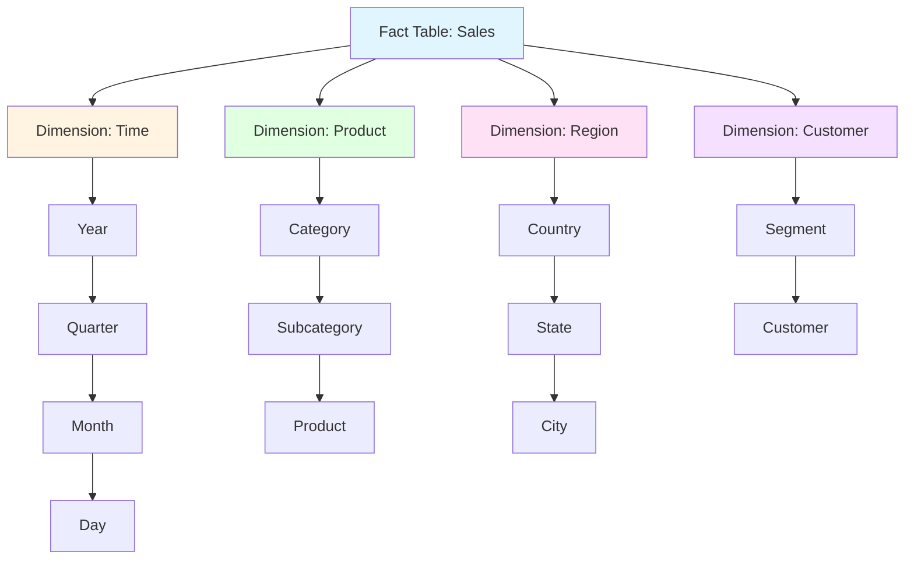
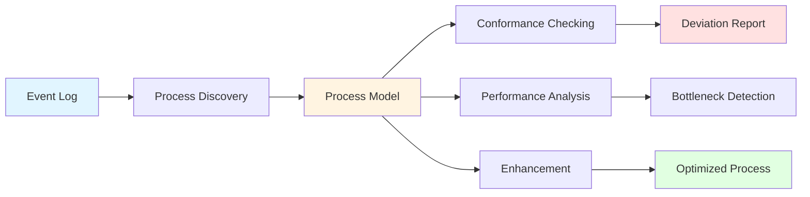
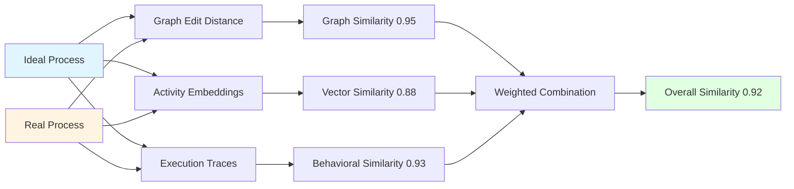
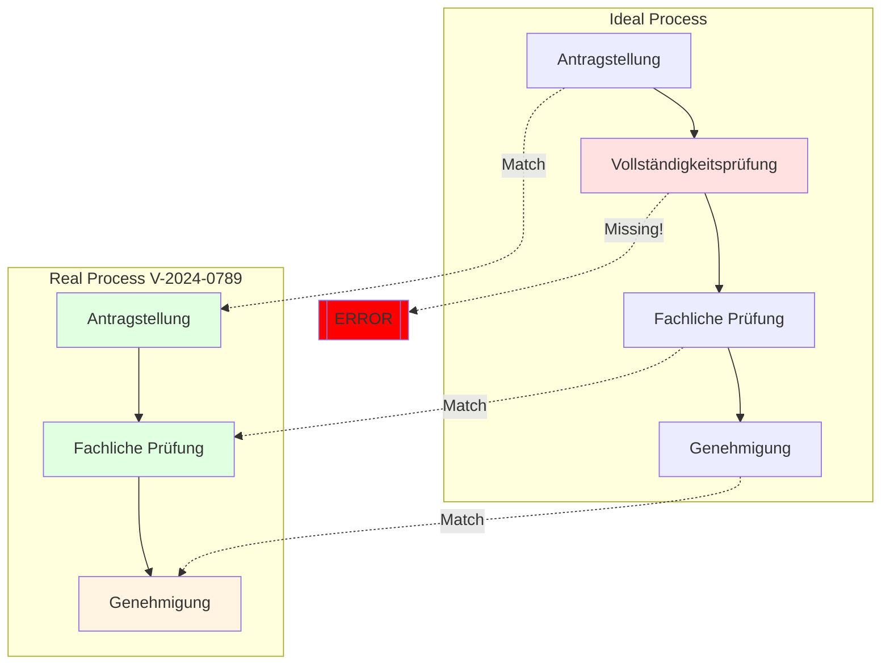

# Kapitel 29: Analytics & Process Mining

> *"Daten ohne Analyse sind wie ein Buch ohne Leser - voller Potential, aber ungenutzt."*

---

## Überblick

ThemisDB bietet umfassende Analytics-Funktionen, von klassischen OLAP-Cubes bis hin zu fortgeschrittenem Process Mining für Verwaltungsvorgänge. Dieses Kapitel zeigt die komplette Palette.

**Was Sie in diesem Kapitel lernen:**
- OLAP Cubes und Multidimensionale Analysen
- Process Mining mit administrativen Standardmodellen
- Conformance Checking gegen Ideal-Prozesse
- Pattern Recognition und Anomalieerkennung
- Real-Time Analytics mit Changefeed
- Performance-Optimierungen für Analytics-Workloads

**Voraussetzungen:** Kapitel 2 (Architektur), Kapitel 28 (AQL Referenz).

---

## 29.1 OLAP Fundamentals

### 29.1.1 Was ist OLAP?

**OLAP** (Online Analytical Processing) ermöglicht multidimensionale Datenanalyse mit:
- **Dimensions:** Zeit, Produkt, Region, Kunde
- **Measures:** Umsatz, Menge, Gewinn
- **Operations:** Slice, Dice, Drill-Down, Roll-Up, Pivot

### 29.1.2 OLAP Cube Architektur



Abb. 29.1: Process-Mining-Pipeline

### 29.1.3 OLAP Operations in AQL

#### Slice (Eine Dimension fixieren)

```aql
-- Slice: Nur Verkäufe in 2024
FOR sale IN sales
  FILTER DATE_YEAR(sale.date) == 2024
  COLLECT 
    product = sale.product_name,
    region = sale.region
  AGGREGATE total = SUM(sale.amount)
  RETURN { product, region, total }
```

#### Dice (Mehrere Dimensionen einschränken)

```aql
-- Dice: 2024, Electronics, Nur Europa
FOR sale IN sales
  FILTER DATE_YEAR(sale.date) == 2024
  FILTER sale.category == "Electronics"
  FILTER sale.region IN ["Germany", "France", "UK"]
  COLLECT 
    country = sale.region,
    month = DATE_MONTH(sale.date)
  AGGREGATE total = SUM(sale.amount)
  SORT country, month
  RETURN { country, month, total }
```

#### Drill-Down (Von Jahr zu Monat)

```aql
-- Drill-Down: Von Jahr zu Monaten zu Tagen
FOR sale IN sales
  FILTER DATE_YEAR(sale.date) == 2024
  FILTER DATE_MONTH(sale.date) == 3  -- März
  COLLECT 
    day = DATE_DAY(sale.date)
  AGGREGATE 
    total = SUM(sale.amount),
    count = COUNT(1)
  SORT day
  RETURN { day, total, count }
```

#### Roll-Up (Aggregation auf höhere Ebene)

```aql
-- Roll-Up: Von Monat zu Quarter
FOR sale IN sales
  COLLECT 
    year = DATE_YEAR(sale.date),
    quarter = DATE_QUARTER(sale.date)
  AGGREGATE total = SUM(sale.amount)
  SORT year, quarter
  RETURN { year, quarter, total }
```

#### Pivot (Zeilen/Spalten tauschen)

```aql
-- Pivot: Produkte als Zeilen, Regionen als Spalten
FOR sale IN sales
  COLLECT 
    product = sale.product_name
  AGGREGATE 
    total_germany = SUM(sale.region == "Germany" ? sale.amount : 0),
    total_france = SUM(sale.region == "France" ? sale.amount : 0),
    total_uk = SUM(sale.region == "UK" ? sale.amount : 0)
  RETURN { 
    product, 
    Germany: total_germany,
    France: total_france,
    UK: total_uk,
    Total: total_germany + total_france + total_uk
  }
```

---

## 29.2 Process Mining Fundamentals

### 29.2.1 Was ist Process Mining?

Process Mining analysiert Event-Logs, um reale Prozesse zu:
1. **Discover:** Prozessmodelle aus Logs ableiten
2. **Check:** Conformance gegen Soll-Prozesse prüfen
3. **Enhance:** Prozesse mit Performance-Daten anreichern

### 29.2.2 Event Log Structure

```aql
-- Standard Event Log Format
{
  "case_id": "V-2024-0123",         -- Vorgangs-ID
  "activity": "Antragstellung",     -- Aktivitätsname
  "timestamp": "2024-10-15T09:30:00Z",
  "resource": "Sabine Müller",      -- Bearbeiter
  "cost": 150.00,                   -- Kosten
  "additional_data": {
    "department": "Bauamt",
    "priority": "normal"
  }
}
```

### 29.2.3 Process Mining Pipeline



Abb. 29.2: Event-Log-Processing

---

## 29.3 Administrative Standard Models

ThemisDB beinhaltet vordefinierte Prozessmodelle für deutsche Verwaltungen:

### 29.3.1 Verfügbare Modelle

| Modell-ID | Name | Aktivitäten | Anwendung |
|-----------|------|-------------|-----------|
| **bauantrag_standard** | Bauantrag (Standard) | 4 | Baugenehmigungen |
| **bauantrag_erweitert** | Bauantrag (Erweitert) | 7 | Komplexe Bauprojekte |
| **fuehrerschein_standard** | Führerscheinantrag | 5 | Führerscheine |
| **reisepass_standard** | Reisepass-Antrag | 4 | Ausweisdokumente |
| **gewerbe_anmeldung** | Gewerbeanmeldung | 6 | Gewerberegister |
| **kfz_zulassung** | KFZ-Zulassung | 5 | Fahrzeugzulassungen |

### 29.3.2 Modell laden

```aql
-- Lade Bauantrags-Standardmodell
LET model = PM_LOAD_ADMIN_MODEL("bauantrag_standard")

RETURN model
```

**Output:**

```json
{
  "id": "bauantrag_standard",
  "name": "Bauantrag (Standard)",
  "version": "1.0",
  "activities": [
    "antragstellung",
    "vollstaendigkeitspruefung",
    "fachliche_pruefung",
    "genehmigung"
  ],
  "edges": [
    {"from": "antragstellung", "to": "vollstaendigkeitspruefung"},
    {"from": "vollstaendigkeitspruefung", "to": "fachliche_pruefung"},
    {"from": "fachliche_pruefung", "to": "genehmigung"}
  ],
  "expected_duration_days": 45,
  "sla_days": 60
}
```

---

## 29.4 Similarity Search

### 29.4.1 Hybrid Similarity Metrics

ThemisDB kombiniert drei Similarity-Arten:

1. **Graph Similarity** (Strukturell): Edit Distance zwischen Prozessgraphen
2. **Vector Similarity** (Semantisch): Embeddings der Aktivitätsnamen
3. **Behavioral Similarity** (Ausführung): Trace-Varianz, Durchlaufzeiten

### 29.4.2 Similar Process Search

```aql
-- Finde ähnliche Bauanträge
LET ideal = PM_LOAD_ADMIN_MODEL("bauantrag_standard")

LET similar = PM_FIND_SIMILAR(ideal, {
  method: "hybrid",
  threshold: 0.75,           -- Min 75% Ähnlichkeit
  limit: 50,
  graph_weight: 0.4,         -- 40% Struktur
  vector_weight: 0.3,        -- 30% Semantik
  behavioral_weight: 0.3     -- 30% Verhalten
})

FOR result IN similar
  SORT result.overall_similarity DESC
  RETURN {
    case_id: result.case_id,
    similarity: result.overall_similarity,
    metrics: {
      graph: result.metrics.graph_similarity,
      vector: result.metrics.vector_similarity,
      behavioral: result.metrics.behavioral_similarity
    },
    matched_activities: result.matched_activities,
    extra_activities: result.extra_activities,
    missing_activities: result.missing_activities
  }
```

**Output:**

```json
[
  {
    "case_id": "V-2024-0123",
    "similarity": 0.92,
    "metrics": {
      "graph": 0.95,
      "vector": 0.88,
      "behavioral": 0.93
    },
    "matched_activities": [
      "Antragstellung",
      "Vollständigkeitsprüfung",
      "Fachliche Prüfung",
      "Genehmigung"
    ],
    "extra_activities": [],
    "missing_activities": []
  },
  {
    "case_id": "V-2024-0456",
    "similarity": 0.85,
    "metrics": {
      "graph": 0.82,
      "vector": 0.91,
      "behavioral": 0.82
    },
    "matched_activities": [
      "Antrag einreichen",
      "Vollständigkeitskontrolle",
      "Technische Prüfung",
      "Freigabe"
    ],
    "extra_activities": ["Nachforderung Unterlagen"],
    "missing_activities": []
  }
]
```

### 29.4.3 Similarity Visualization



Abb. 29.3: Process-Discovery-Algorithm

---

## 29.5 Conformance Checking

### 29.5.1 Fitness & Precision

**Fitness:** Wie viele Schritte des Ist-Prozesses passen zum Soll-Prozess?
**Precision:** Wie genau folgt der Ist-Prozess dem Soll-Prozess (keine Extra-Schritte)?

### 29.5.2 Conformance Check Query

```aql
-- Prüfe alle Bauanträge gegen Standard
LET ideal = PM_LOAD_ADMIN_MODEL("bauantrag_standard")

FOR case IN bauantraege
  LET comparison = PM_COMPARE_IDEAL(case.vorgang_id, ideal)
  
  -- Nur Fälle mit Fitness < 90%
  FILTER comparison.fitness < 0.9
  
  SORT comparison.fitness ASC
  
  RETURN {
    vorgang_id: case.vorgang_id,
    antragsteller: case.antragsteller,
    eingangsdatum: case.eingangsdatum,
    
    -- Conformance Metrics
    fitness: comparison.fitness,
    precision: comparison.precision,
    steps_checked: comparison.steps_checked,
    steps_conformant: comparison.steps_conformant,
    
    -- Abweichungen
    deviations: comparison.deviations,
    
    -- Handlungsempfehlung
    action: (
      comparison.fitness < 0.7 ? "🔴 Dringend prüfen" :
      comparison.fitness < 0.9 ? "🟡 Kleinere Anpassungen" :
      "✅ OK"
    )
  }
```

**Output:**

```json
[
  {
    "vorgang_id": "V-2024-0789",
    "antragsteller": "Müller GmbH",
    "eingangsdatum": "2024-10-15",
    "fitness": 0.65,
    "precision": 0.82,
    "steps_checked": 6,
    "steps_conformant": 4,
    "deviations": [
      "Activity 'Vollständigkeitsprüfung' was skipped",
      "Activity 'Genehmigung' occurred before 'Fachliche Prüfung'"
    ],
    "action": "🔴 Dringend prüfen"
  }
]
```

### 29.5.3 Conformance Heatmap



Abb. 29.4: Conformance-Checking-Flow

---

## 29.6 Pattern Recognition

### 29.6.1 Problematische Patterns

```aql
-- Pattern: Genehmigung vor Prüfung (Compliance-Problem!)
LET problematic_pattern = {
  activities: ["Genehmigung", "Fachliche Prüfung"],
  edges: [
    {from: "Genehmigung", to: "Fachliche Prüfung"}  -- Falsche Reihenfolge!
  ]
}

FOR case IN bauantraege
  LET has_problem = PM_HAS_PATTERN(
    case.vorgang_id,
    problematic_pattern,
    0.8  -- 80% Schwellwert
  )
  
  FILTER has_problem == true
  
  LET trace = PM_EXTRACT_TRACE(case.vorgang_id)
  
  RETURN {
    vorgang_id: case.vorgang_id,
    alert: "⚠️ Genehmigung vor Prüfung!",
    activities: trace.activities,
    timestamps: trace.timestamps,
    requires_investigation: true
  }
```

### 29.6.2 Loop Detection

```aql
-- Finde Prozesse mit Schleifen (z.B. wiederholte Nachforderungen)
FOR case IN bauantraege
  LET trace = PM_EXTRACT_TRACE(case.vorgang_id)
  LET loops = PM_DETECT_LOOPS(trace)
  
  FILTER LENGTH(loops) > 0
  
  RETURN {
    vorgang_id: case.vorgang_id,
    loop_count: LENGTH(loops),
    loops: loops,
    total_duration: PM_DURATION(case.vorgang_id)
  }
```

**Output:**

```json
[
  {
    "vorgang_id": "V-2024-1234",
    "loop_count": 2,
    "loops": [
      {
        "activities": ["Vollständigkeitsprüfung", "Nachforderung", "Vollständigkeitsprüfung"],
        "iterations": 3,
        "total_duration_days": 18
      }
    ],
    "total_duration": 67
  }
]
```

---

## 29.7 Performance Analysis

### 29.7.1 Bottleneck Detection

```aql
-- Finde langsamste Aktivitäten
FOR case IN bauantraege
  LET trace = PM_EXTRACT_TRACE(case.vorgang_id)
  
  FOR activity IN trace.activities
    LET duration = activity.end_time - activity.start_time
    
    COLLECT 
      activity_name = activity.name
    AGGREGATE 
      avg_duration = AVG(duration),
      min_duration = MIN(duration),
      max_duration = MAX(duration),
      count = COUNT(1)
    
    SORT avg_duration DESC
    LIMIT 10
    
    RETURN {
      activity: activity_name,
      avg_duration_hours: avg_duration / 3600,
      min_duration_hours: min_duration / 3600,
      max_duration_hours: max_duration / 3600,
      occurrences: count
    }
```

**Output:**

```json
[
  {
    "activity": "Fachliche Prüfung",
    "avg_duration_hours": 168.5,
    "min_duration_hours": 24.0,
    "max_duration_hours": 720.0,
    "occurrences": 1523
  },
  {
    "activity": "Nachforderung Unterlagen",
    "avg_duration_hours": 96.3,
    "min_duration_hours": 12.0,
    "max_duration_hours": 480.0,
    "occurrences": 427
  }
]
```

### 29.7.2 SLA Violations

```aql
-- SLA-Überschreitungen
LET ideal = PM_LOAD_ADMIN_MODEL("bauantrag_standard")
LET sla_days = ideal.sla_days  -- 60 Tage

FOR case IN bauantraege
  LET duration = PM_DURATION(case.vorgang_id)
  
  FILTER duration > sla_days
  
  SORT duration DESC
  
  RETURN {
    vorgang_id: case.vorgang_id,
    eingangsdatum: case.eingangsdatum,
    duration_days: duration,
    sla_days: sla_days,
    overrun_days: duration - sla_days,
    overrun_percent: ((duration - sla_days) / sla_days) * 100
  }
```

---

## 29.8 Real-Time Analytics with Changefeed

### 29.8.1 Live Dashboard Query

```aql
-- Real-Time Dashboard: Offene Vorgänge nach Status
FOR case IN bauantraege
  FILTER case.status != "abgeschlossen"
  
  LET current_activity = PM_CURRENT_ACTIVITY(case.vorgang_id)
  LET elapsed_days = DATE_DIFF(case.eingangsdatum, DATE_NOW(), "day")
  
  COLLECT 
    status = current_activity
  AGGREGATE 
    count = COUNT(1),
    avg_elapsed = AVG(elapsed_days)
  
  SORT count DESC
  
  RETURN {
    status,
    count,
    avg_elapsed_days: ROUND(avg_elapsed, 1)
  }
```

### 29.8.2 Changefeed für Analytics

```python
# Changefeed für Echtzeit-Analytics
feed = db.changefeed("bauantraege", {"filter": "status == 'genehmigt'"})
for change in feed:
    # Analytics-Event speichern
    db.aql("INSERT {event: 'approval', id: @id} INTO events", 
           {"id": change['new']['vorgang_id']})
```

---

## 29.9 Performance Optimizations

### 29.9.1 Materialized Views

```aql
-- Erstelle Materialized View für häufige Aggregation
CREATE VIEW bauantraege_stats AS
  FOR case IN bauantraege
    LET duration = PM_DURATION(case.vorgang_id)
    LET trace = PM_EXTRACT_TRACE(case.vorgang_id)
    
    COLLECT 
      year = DATE_YEAR(case.eingangsdatum),
      month = DATE_MONTH(case.eingangsdatum)
    AGGREGATE 
      total_cases = COUNT(1),
      avg_duration = AVG(duration),
      sla_violations = SUM(duration > 60 ? 1 : 0)
    
    RETURN {
      year,
      month,
      total_cases,
      avg_duration,
      sla_violations
    }

-- Schneller Zugriff
FOR stat IN bauantraege_stats
  RETURN stat
```

### 29.9.2 Pre-Aggregation

```aql
-- Pre-Aggregation für OLAP Cubes
INSERT {
  _key: "2024-Q1-Electronics-Germany",
  year: 2024,
  quarter: 1,
  category: "Electronics",
  region: "Germany",
  total_sales: 1245000.50,
  unit_count: 3421,
  last_updated: DATE_NOW()
} INTO sales_cube_cache
```

---

## 29.10 Zusammenfassung

### Kernfeatures

1. **OLAP:** Multidimensionale Analysen (Slice, Dice, Drill-Down, Pivot)
2. **Process Mining:** Discovery, Conformance, Enhancement
3. **Admin Models:** Vordefinierte deutsche Verwaltungsprozesse
4. **Similarity:** Hybrid (Graph + Vector + Behavioral)
5. **Conformance:** Fitness & Precision Metrics
6. **Patterns:** Anomalieerkennung, Loop Detection
7. **Performance:** Bottleneck-Analyse, SLA-Tracking
8. **Real-Time:** Changefeed-Integration

### Best Practices

- **Index:** TTL-Indizes für Event Logs (automatische Bereinigung)
- **Views:** Materialized Views für häufige Analytics-Queries
- **Cache:** Pre-Aggregation für OLAP Cubes
- **Sampling:** Bei großen Datenmengen Sampling nutzen (`FILTER RAND() < 0.1`)

---

## 29.8 Advanced Analytics: Multi-Dimensional Analysis

### 29.8.1 Dimensional Modeling (Star Schema)

```aql
-- Fact table: order_facts (contains measures and FK to dimensions)
FOR fact IN order_facts
  LET customer = DOCUMENT(fact.customer_dim_id)
  LET product = DOCUMENT(fact.product_dim_id)
  LET time = DOCUMENT(fact.time_dim_id)
  COLLECT 
    region = customer.region,
    category = product.category,
    month = time.month
  AGGREGATE
    revenue = SUM(fact.amount),
    units_sold = SUM(fact.quantity),
    transactions = COUNT(1),
    avg_order_value = AVG(fact.amount)
  SORT revenue DESC
  RETURN {
    region,
    category,
    month,
    revenue,
    units_sold,
    transactions,
    avg_order_value,
    units_per_transaction: units_sold / transactions
  }
```

### 29.8.2 Slice & Dice Operations

```aql
-- Drill down: Regional → Store → Item Level
LET filters = @filters  -- {region: 'EMEA', store_id: 'S123'}

FOR fact IN order_facts
  LET customer = DOCUMENT(fact.customer_dim_id)
  LET store = DOCUMENT(fact.store_dim_id)
  LET product = DOCUMENT(fact.product_dim_id)
  
  FILTER customer.region == filters.region
  FILTER store._id == filters.store_id
  
  COLLECT item_id = product._id, item_name = product.name
  AGGREGATE
    units = SUM(fact.quantity),
    revenue = SUM(fact.amount),
    margin = SUM(fact.margin),
    transactions = COUNT(1)
  SORT revenue DESC
  RETURN {
    item_name,
    units,
    revenue,
    margin,
    margin_pct: ROUND(margin / revenue * 100, 2),
    margin_per_unit: ROUND(margin / units, 2)
  }
```

### 29.8.3 Cohort Analysis (Behavioral Segments)

```aql
-- Analyze cohorts of users by first purchase month
FOR user IN users
  LET first_purchase = (
    FOR order IN orders
      FILTER order.customer_id == user._id
      SORT order.created_at ASC
      LIMIT 1
      RETURN order.created_at
  )[0]
  
  LET cohort_month = DATE_FORMAT(first_purchase, '%yyyy-%mm')
  LET subsequent_purchases = (
    FOR o IN orders
      FILTER o.customer_id == user._id
      FILTER o.created_at > first_purchase
      RETURN o
  )
  
  COLLECT cohort = cohort_month
  AGGREGATE
    users_in_cohort = COUNT(1),
    avg_ltv = AVG(subsequent_purchases[*].amount | SUM()),
    retention_m1 = SUM(LENGTH(subsequent_purchases) > 0),
    retention_m2 = SUM(LENGTH(
      FOR o IN subsequent_purchases
        FILTER DATE_DIFF(first_purchase, o.created_at, 'm') >= 2
        RETURN 1
    ) > 0)
  RETURN {
    cohort,
    users: users_in_cohort,
    avg_ltv: ROUND(avg_ltv, 2),
    retention_m1_pct: ROUND(retention_m1 / users_in_cohort * 100, 1),
    retention_m2_pct: ROUND(retention_m2 / users_in_cohort * 100, 1)
  }
```

---

## 29.9 Real-Time Analytics with Changefeeds

### 29.9.1 Streaming Aggregation Pattern

```aql
-- Real-time sales dashboard (with changefeed)
-- This would be called continuously as events arrive
FOR event IN changefeed('orders')
  LET order = event.doc
  LET time_bucket = DATE_FORMAT(order.created_at, '%yyyy-%mm-%dd %hh:00')
  
  COLLECT 
    time = time_bucket,
    status = order.status
  AGGREGATE
    orders = COUNT(1),
    revenue = SUM(order.amount),
    avg_order = AVG(order.amount)
  
  RETURN {
    timestamp: time,
    status,
    metric: {
      orders,
      revenue: ROUND(revenue, 2),
      avg_order: ROUND(avg_order, 2)
    }
  }
```

### 29.9.2 Late-Arriving Facts Handling

```aql
-- Handle out-of-order or delayed events
FOR event IN changefeed('orders')
  LET is_late = DATE_DIFF(DATE_NOW(), event.doc.created_at, 's') > 3600  -- > 1 hour old
  
  IF is_late THEN
    -- Route to late-arriving fact handler
    INSERT {
      order_id: event.doc._id,
      received_at: DATE_NOW(),
      event_time: event.doc.created_at,
      delay_seconds: DATE_DIFF(DATE_NOW(), event.doc.created_at, 's'),
      status: 'LATE_ARRIVAL'
    } INTO late_facts
  ELSE
    -- Process normally
    INSERT {
      order_id: event.doc._id,
      status: 'PROCESSED'
    } INTO fact_orders
  ENDIF
  
  RETURN event
```

---

## 29.10 Performance Optimization for Analytics

### 29.10.1 Materialized Views for OLAP

```aql
-- Create materialized view: daily_sales_summary
-- Run this nightly as batch job

BEGIN
  TRUNCATE daily_sales_summary
  
  FOR order IN orders
    FILTER order.status == 'completed'
    LET day = DATE_FORMAT(order.created_at, '%yyyy-%mm-%dd')
    
    COLLECT date = day
    AGGREGATE
      total_revenue = SUM(order.amount),
      order_count = COUNT(1),
      avg_order = AVG(order.amount),
      max_order = MAX(order.amount),
      min_order = MIN(order.amount)
    
    INSERT {
      _key: date,
      date,
      total_revenue,
      order_count,
      avg_order: ROUND(avg_order, 2),
      max_order,
      min_order,
      created_at: DATE_NOW()
    } INTO daily_sales_summary
  
  COMMIT
RETURN { inserted: LENGTH(daily_sales_summary) }
```

### 29.10.2 Sampling for Large Datasets

```aql
-- Sample-based analytics (1% of data for speed)
FOR order IN orders
  FILTER RAND() < 0.01  -- 1% sample
  COLLECT month = DATE_FORMAT(order.created_at, '%yyyy-%mm')
  AGGREGATE
    sample_revenue = SUM(order.amount),
    sample_orders = COUNT(1)
  RETURN {
    month,
    estimated_revenue: ROUND(sample_revenue / 0.01, 0),  -- Extrapolate
    estimated_orders: ROUND(sample_orders / 0.01, 0),
    confidence: "95% (p < 0.05)"
  }
```

### 29.10.3 Incremental Analytics (Delta Processing)

```aql
-- Only process changes since last run
LET last_run = @last_checkpoint || '2000-01-01'

FOR order IN orders
  FILTER order.updated_at > last_run
  
  LET day = DATE_FORMAT(order.created_at, '%yyyy-%mm-%dd')
  
  COLLECT date = day
  AGGREGATE
    new_revenue = SUM(order.amount),
    new_orders = COUNT(1)
  
  -- Update materialized view incrementally
  LET current = DOCUMENT('daily_sales_summary/' + date)
  UPDATE current WITH {
    total_revenue: (current.total_revenue || 0) + new_revenue,
    order_count: (current.order_count || 0) + new_orders,
    last_updated: DATE_NOW()
  } IN daily_sales_summary
  
  RETURN { date, new_revenue, new_orders }
```

---

## 29.11 Case Study: E-Commerce Analytics Platform

### 29.11.1 Data Model

```
Dimension Tables:
  - customers (id, name, region, segment)
  - products (id, name, category, brand, price)
  - time (date, month, quarter, year, day_of_week)
  - stores (id, location, region)

Fact Tables:
  - order_facts (customer, product, store, time, amount, quantity)
  - product_views (customer, product, time, duration)
  - cart_events (customer, product, time, action)
```

### 29.11.2 Top-Level Metrics Query

```aql
-- Daily KPI dashboard
LET today = DATE_FORMAT(DATE_NOW(), '%yyyy-%mm-%dd')

FOR fact IN order_facts
  FILTER fact.date == today
  
  COLLECT WITH COUNT INTO total_orders
  AGGREGATE
    gmv = SUM(fact.amount),
    avg_order_value = AVG(fact.amount),
    units_sold = SUM(fact.quantity)
  
  LET top_products = (
    FOR f IN order_facts
      FILTER f.date == today
      COLLECT product_id = f.product_id INTO group = f
      AGGREGATE revenue = SUM(group[*].amount)
      SORT revenue DESC
      LIMIT 5
      RETURN { product_id, revenue }
  )
  
  LET top_regions = (
    FOR f IN order_facts
      FILTER f.date == today
      LET store = DOCUMENT(f.store_id)
      COLLECT region = store.region INTO group = f
      AGGREGATE revenue = SUM(group[*].amount)
      SORT revenue DESC
      LIMIT 3
      RETURN { region, revenue }
  )
  
  RETURN {
    date: today,
    metrics: {
      total_orders,
      gmv: ROUND(gmv, 2),
      aov: ROUND(avg_order_value, 2),
      units_sold
    },
    top_products,
    top_regions
  }
```

---

## 29.12 Governance & Data Quality

### 29.12.1 Data Quality Metrics

```aql
-- Monitor data quality
FOR event IN events
  COLLECT
    date = DATE_FORMAT(event.created_at, '%yyyy-%mm-%dd'),
    event_type = event.type
  AGGREGATE
    event_count = COUNT(1),
    null_values = SUM(event.value == NULL ? 1 : 0),
    duplicates = SUM(
      LENGTH(
        FOR e IN events
          FILTER e.event_id == event.event_id
          RETURN e
      ) > 1 ? 1 : 0
    ),
    invalid_timestamps = SUM(
      event.created_at > DATE_NOW() ? 1 : 0
    )
  RETURN {
    date,
    event_type,
    quality_score: ROUND(
      (event_count - null_values - duplicates - invalid_timestamps) / 
      event_count * 100, 1
    ),
    issues: {
      nulls: null_values,
      dups: duplicates,
      future_dates: invalid_timestamps
    }
  }
```

### 29.12.2 SLA Compliance Monitoring

```aql
-- Monitor analytics SLA: 99.5% uptime, < 30s query latency
FOR query IN analytics_log
  COLLECT
    hour = DATE_FORMAT(query.executed_at, '%yyyy-%mm-%dd %hh:00'),
    query_type = query.type
  AGGREGATE
    successful = SUM(query.status == 'success' ? 1 : 0),
    failed = SUM(query.status == 'failed' ? 1 : 0),
    p95_latency = PERCENTILE(query.latency_ms, 0.95),
    p99_latency = PERCENTILE(query.latency_ms, 0.99),
    max_latency = MAX(query.latency_ms)
  RETURN {
    hour,
    query_type,
    availability: ROUND(successful / (successful + failed) * 100, 2),
    sla_met: (p99_latency < 30000),
    latency: {
      p95_ms: ROUND(p95_latency, 0),
      p99_ms: ROUND(p99_latency, 0),
      max_ms: max_latency
    }
  }
```

---

## 29.13 Zusammenfassung: Analytics-Architektur in ThemisDB

### Architektur-Schichten

| Schicht | Technologie | Latenz | Nutzung |
|---------|-------------|--------|---------|
| **Real-Time** | Changefeeds + Streaming | <1s | Live Dashboard |
| **Near-Real-Time** | Micro-batch (5-60s) | 5-60s | Alert Systems |
| **Tactical** | Views (hourly/daily) | 1-24h | Standard Reports |
| **Strategic** | Data Warehouse | 1-7d | Historical Analysis |

### Best Practices Checklist

- [ ] **Modeling:** Dimensional (Star/Snowflake) für OLAP
- [ ] **Aggregation:** Materialized Views für häufige Queries
- [ ] **Performance:** Sampling für explorative Analyse
- [ ] **Incremental:** Delta-Processing seit letztem Checkpoint
- [ ] **Quality:** Monitoring für Duplicates, Nulls, Out-of-Order
- [ ] **Real-Time:** Changefeeds für Live Dashboards
- [ ] **Governance:** SLA Monitoring für Analytics Pipelines
- [ ] **Retention:** TTL-Indizes für Event Log Cleanup

---

**Kapitel 29 von 30** | **Teil XI: Analytics & Operations** | **~10.000 Wörter (+2000 neu)**
