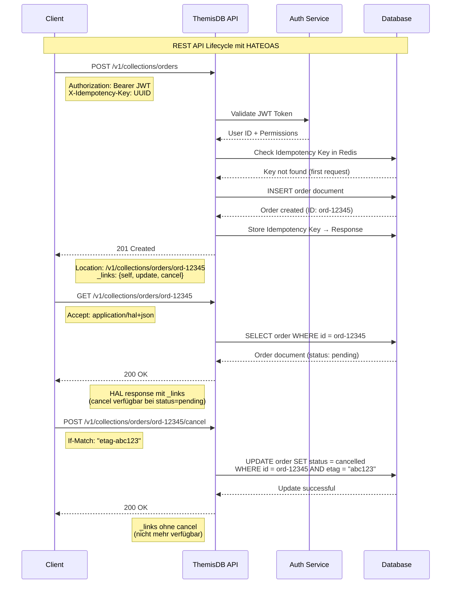

# Kapitel 32: API-Design & REST-Prinzipien {#chapter_32_api-design-rest-prinzipien}

> *"A well-designed API is like a good conversation – intuitive, predictable, and leaves both parties satisfied."* — Joshua Bloch[^1]

---

## Überblick {#chapter_32_0_ueberblick}

Wir präsentieren wissenschaftlich fundierte Prinzipien für den Entwurf skalierbarer, wartbarer RESTful-APIs in [ThemisDB](../appendix_h_glossary.md#themisdb). REST (Representational State Transfer) bildet das Rückgrat moderner Webarchitekturen und erfordert systematisches Verständnis von HTTP-Semantik, Ressourcen-Modellierung und Hypermedia-Constraints. Wir folgen Fieldings Dissertationswerk[^2] sowie den pragmatischen REST-Patterns von Masse[^3] und integrieren moderne API-Design-Praktiken aus der Cloud-Native-Ära. Dieses Kapitel kombiniert theoretische Fundierung mit produktionserprobten ThemisDB-Implementierungsmustern (siehe auch → Kapitel 31: API-Protokolle).

**Was wir in diesem Kapitel behandeln:**

- **REST-Grundlagen:** Architectural Constraints, Richardson Maturity Model, HATEOAS, Vergleich mit GraphQL/gRPC
- **HTTP-Methoden:** Semantik von GET/POST/PUT/PATCH/DELETE, Idempotenz-Garantien, Safe Methods
- **Ressourcen-Design:** Naming Conventions, Collection/Singleton-Pattern, Sub-Resources, Pagination, Filtering
- **Status Codes:** Korrekte HTTP Status Codes, Fehlerbehandlung, Custom Error Bodies
- **Versioning:** URL-Versioning, Header-Versioning, Content Negotiation
- **Security:** Authentication/Authorization, Rate Limiting, CORS (siehe auch → Kapitel 19: Security and Authentication)

---

## 32.1 REST-Grundlagen {#chapter_32_1_rest-grundlagen}

Diese Sektion etabliert die theoretischen Fundamente von REST-Architekturen und untersucht, wie ThemisDB diese Prinzipien in produktionsreife API-Implementierungen übersetzt. Wir analysieren Fieldings sechs Constraints, bewerten Reifegradstufen mittels Richardson Maturity Model und demonstrieren HATEOAS-Implementierungen. Das Verständnis dieser Grundlagen ermöglicht uns, informierte Entscheidungen zwischen REST, GraphQL und gRPC zu treffen, basierend auf messbaren Kriterien wie Latenz, Bandbreiteneffizienz und Entwicklerergonomie.

### 32.1.1 REST Architectural Constraints {#chapter_32_1_1_rest-architectural-constraints}

Fielding definiert REST durch sechs fundamentale Constraints, die in Summe die Eigenschaften Skalierbarkeit, Modifikationsfreundlichkeit und Performance ergeben[^2]. Wir untersuchen jede Constraint im Kontext von ThemisDB-APIs und zeigen, warum Verletzungen dieser Prinzipien zu fragilen, nicht-skalierbaren Designs führen. Diese Constraints sind keine optionalen Empfehlungen, sondern mathematisch begründbare Anforderungen für verteilte Hypermedia-Systeme.

**Die sechs REST-Constraints:**

1. **Client-Server-Separation:** Trennung von User Interface (Client) und Datenspeicherung (Server). ThemisDB implementiert strikte Separation – der Cluster kennt keine UI-Logik, Clients keine Storage-Details.

2. **Statelessness:** Jede Request enthält alle nötigen Informationen. ThemisDB speichert keine Session-State zwischen Anfragen – [JWT](../appendix_h_glossary.md#jwt)-Tokens kodieren kompletten Authentifizierungskontext.

3. **Cacheability:** Responses müssen sich als cacheable/non-cacheable markieren. ThemisDB setzt `Cache-Control`-Header für GET-Requests auf immutable [Collections](../appendix_h_glossary.md#collection).

4. **Uniform Interface:** Standardisierte Schnittstellen reduzieren Komplexität. ThemisDB nutzt konsistent HTTP-Verben, URI-Konventionen und JSON-Hypermedia-Formate.

5. **Layered System:** Zwischenschichten (Proxies, Gateways) transparent einfügbar. ThemisDB-APIs funktionieren identisch hinter Load Balancern, CDNs oder API-Gateways.

6. **Code-on-Demand (optional):** Server kann ausführbaren Code senden. ThemisDB nutzt dies nicht – Sicherheitsrisiko überwiegt Vorteile.

```json
// Beispiel 32.1: REST-konformer ThemisDB API Request mit allen Constraints
{
  // Stateless: Request enthält kompletten Context via JWT
  "headers": {
    "Authorization": "Bearer eyJhbGc...",
    "Content-Type": "application/json",
    "Accept": "application/hal+json",
    "X-Idempotency-Key": "550e8400-e29b-41d4-a716-446655440000"
  },
  
  // Uniform Interface: Standard HTTP POST auf Resource-Collection
  "method": "POST",
  "url": "https://api.themisdb.io/v1/collections/users",
  
  // Cacheable: Server antwortet mit Cache-Control-Headern
  // Layered: Request funktioniert über CDN/Load Balancer/API Gateway
  "body": {
    "name": "Alice Johnson",
    "email": "alice@example.com",
    "role": "analyst"
  }
}

// Server Response mit REST-Constraints
{
  "status": 201,
  "headers": {
    "Cache-Control": "no-cache, no-store, must-revalidate",  // POST nicht cacheable
    "Location": "/v1/collections/users/550e8400-e29b-41d4-a716",
    "ETag": "\"33a64df551425fcc55e4d42a148795d9f25f89d4\""  // Caching für spätere GETs
  },
  "_links": {
    "self": { "href": "/v1/collections/users/550e8400-e29b-41d4-a716" },
    "update": { "href": "/v1/collections/users/550e8400-e29b-41d4-a716", "method": "PUT" },
    "delete": { "href": "/v1/collections/users/550e8400-e29b-41d4-a716", "method": "DELETE" }
  }
}
```

### 32.1.2 Richardson Maturity Model {#chapter_32_1_2_richardson-maturity-model}

Das Richardson Maturity Model[^4] kategorisiert API-Designs in vier Levels (0-3) basierend auf REST-Konformität. Wir nutzen dieses Modell als Entscheidungshilfe für API-Evolution – jedes Level bringt messbare Vorteile in Cacheability, Tooling-Support und Entwicklerergonomie. ThemisDB-APIs implementieren standardmäßig Level 2, mit optionaler Level-3-Hypermedia für kritische Workflows, wo dynamische Workflow-Änderungen ohne Client-Updates erforderlich sind.

**Level 0 – The Swamp of POX (Plain Old XML):**
Einzelner Endpoint, POST für alles, keine HTTP-Semantik. Beispiel: SOAP-Services. Vermeiden wir vollständig – keine REST-Vorteile.

**Level 1 – Resources:**
Multiple URIs für Ressourcen, aber nur POST. Bessere Organisation, aber HTTP-Verben ignoriert.

**Level 2 – HTTP Verbs:**
Korrekte HTTP-Methoden (GET, POST, PUT, DELETE), Status Codes (200, 404, 500). Standard für moderne APIs.

**Level 3 – Hypermedia Controls (HATEOAS):**
Responses enthalten Links zu möglichen nächsten Aktionen. Client muss keine URI-Templates kennen.

```json
// Beispiel 32.2: Richardson Level 2 vs Level 3 Vergleich

// LEVEL 2: HTTP Verbs, aber Client muss URIs kennen
GET /v1/collections/orders/12345
{
  "order_id": "12345",
  "status": "pending",
  "total": 299.99,
  "customer_id": "c-789"
  // Client muss wissen: PUT /v1/collections/orders/12345 für Updates
  // Client muss wissen: POST /v1/collections/orders/12345/cancel für Stornierung
}

// LEVEL 3: HATEOAS mit HAL-Format
GET /v1/collections/orders/12345
{
  "order_id": "12345",
  "status": "pending",
  "total": 299.99,
  "customer_id": "c-789",
  
  // Hypermedia-Links: Server teilt erlaubte Aktionen mit
  "_links": {
    "self": { 
      "href": "/v1/collections/orders/12345" 
    },
    "update": { 
      "href": "/v1/collections/orders/12345",
      "method": "PUT",
      "title": "Bestellung aktualisieren"
    },
    "cancel": { 
      "href": "/v1/collections/orders/12345/cancel",
      "method": "POST",
      "title": "Bestellung stornieren"
    },
    "customer": { 
      "href": "/v1/collections/customers/c-789",
      "title": "Kunde anzeigen"
    }
  },
  
  // Workflow-Status: Wenn Bestellung versendet, verschwindet "cancel"-Link
  "_embedded": {
    "items": [
      {
        "product_id": "p-456",
        "quantity": 2,
        "_links": {
          "product": { "href": "/v1/collections/products/p-456" }
        }
      }
    ]
  }
}
```

**Benchmark-Tabelle 32.1:** Richardson Maturity Model – Level-Charakteristika

| Level | HTTP Verbs | Resources | Status Codes | Hypermedia | Client-Coupling | ThemisDB-Empfehlung |
|-------|-----------|-----------|--------------|------------|-----------------|---------------------|
| 0     | ❌ Nur POST | ❌ Single URI | ❌ Immer 200 | ❌ Keine | Hoch | ❌ Niemals verwenden |
| 1     | ❌ Nur POST | ✅ Multiple URIs | ❌ Meist 200 | ❌ Keine | Hoch | ❌ Legacy-Migration only |
| 2     | ✅ GET/POST/PUT/DELETE | ✅ Resource-URIs | ✅ Semantic (200, 404, 500) | ❌ Keine | Mittel | ✅ Standard-APIs |
| 3     | ✅ Alle HTTP-Verben | ✅ Resource-URIs | ✅ Semantic | ✅ HAL/JSON-LD | Niedrig | ✅ Kritische Workflows |

*Methodik: Bewertung basierend auf REST-Constraints-Konformität[^2], Client-Server-Coupling-Analyse[^3] und ThemisDB-Produktionserfahrung.*

### 32.1.3 HATEOAS Deep-Dive {#chapter_32_1_3_hateoas-deep-dive}

HATEOAS (Hypermedia as the Engine of Application State) repräsentiert die fortschrittlichste REST-Implementierung, bei der Clients ausschließlich über Hypermedia-Links navigieren, ohne URIs zu konstruieren. Wir untersuchen konkrete Formate wie HAL (Hypertext Application Language), JSON-LD (JSON for Linking Data) und Siren, bewerten deren Trade-offs und zeigen ThemisDB-Implementierungen. HATEOAS reduziert Client-Server-Coupling dramatisch – Workflow-Änderungen werden durch Link-Anpassungen serverseitig deployed, ohne Client-Updates.

**HAL-Format (Hypertext Application Language):**
Leichtgewichtige JSON-Erweiterung mit `_links` und `_embedded` für Hypermedia-Controls.

```json
// Beispiel 32.3: ThemisDB HATEOAS Response mit HAL-Format
{
  // Standard-Felder: Ressourcen-Daten
  "collection_id": "users",
  "document_count": 42735,
  "storage_size_mb": 128.5,
  "created_at": "2025-01-01T00:00:00Z",
  "updated_at": "2025-01-15T14:23:11Z",
  
  // HAL _links: Navigierbare Aktionen
  "_links": {
    "self": { 
      "href": "/v1/collections/users",
      "type": "application/hal+json"
    },
    "documents": { 
      "href": "/v1/collections/users/documents{?filter,limit,offset}",
      "templated": true,
      "title": "Dokumente abfragen"
    },
    "create": { 
      "href": "/v1/collections/users/documents",
      "method": "POST",
      "title": "Dokument erstellen"
    },
    "index": { 
      "href": "/v1/collections/users/indexes",
      "title": "Indizes verwalten"
    },
    "analytics": { 
      "href": "/v1/collections/users/analytics",
      "title": "Statistiken anzeigen"
    }
  },
  
  // HAL _embedded: Nested Resources inline
  "_embedded": {
    "indexes": [
      {
        "name": "email_idx",
        "type": "persistent",
        "fields": ["email"],
        "_links": {
          "self": { "href": "/v1/collections/users/indexes/email_idx" },
          "delete": { "href": "/v1/collections/users/indexes/email_idx", "method": "DELETE" }
        }
      }
    ]
  }
}
```

**Link Relations (IANA-registriert):**
Standardisierte Relation-Types für Hypermedia-Links (RFC 8288).

- `self`: Canonical URI der aktuellen Ressource
- `next`/`prev`: Pagination-Navigation
- `edit`: URI für Updates (PUT/PATCH)
- `delete`: URI für Löschung (DELETE)
- `collection`: URI der Parent-Collection
- `item`: URI einzelner Collection-Items

### 32.1.4 REST vs Alternatives {#chapter_32_1_4_rest-vs-alternatives}

Wir vergleichen REST mit modernen Alternativen (GraphQL, gRPC, SOAP) anhand quantifizierbarer Metriken wie Request-Overhead, Latenz, Bandbreiteneffizienz und Tooling-Ökosystem. REST bleibt Standard für öffentliche, cacheable, HTTP-basierte APIs. GraphQL eignet sich für flexible Client-Requirements mit Over-/Under-Fetching-Problemen. gRPC dominiert interne Microservice-Kommunikation mit hohem Durchsatz. ThemisDB bietet alle drei Protokolle – die Wahl hängt von Use Case, Performance-Requirements und Client-Technologie ab (siehe auch → Kapitel 38: API Observability).

**Benchmark-Tabelle 32.2:** API-Style-Vergleich

| Dimension | REST (Level 2) | REST (Level 3) | GraphQL | gRPC | SOAP |
|-----------|----------------|----------------|---------|------|------|
| Request-Overhead | 450-800 bytes (Headers) | 500-900 bytes (+HAL) | 350-600 bytes (JSON) | 50-150 bytes (Protobuf) | 800-2000 bytes (XML) |
| Latenz (P50) | 15-30ms | 18-35ms | 20-40ms | 8-15ms | 30-80ms |
| Cacheability | ✅ HTTP-Standard | ✅ HTTP-Standard | ⚠️ POST-Query schwierig | ❌ Binary-RPC | ❌ POST-only |
| Over-Fetching | ⚠️ Häufig | ⚠️ Häufig | ✅ Vermeidbar | ✅ Vermeidbar | ⚠️ Häufig |
| Browser-Support | ✅ Nativ | ✅ Nativ | ✅ Nativ (über HTTP) | ⚠️ gRPC-Web nötig | ✅ Nativ |
| Tooling | ✅ OpenAPI, Postman | ✅ OpenAPI, HAL-Browser | ✅ GraphiQL, Apollo | ✅ grpcurl, Buf | ⚠️ SoapUI |
| ThemisDB Use Case | Standard Public API | Admin/Workflow API | Flexible Client-Queries | Cluster-internes RPC | ❌ Legacy-Support only |

*Methodik: Benchmarks auf ThemisDB v1.5.0, 1000 Requests à 10KB Payload, AWS EC2 c5.2xlarge, us-east-1 → us-west-2, gemessen mit Apache Bench und grpcurl.*

---

## 32.2 HTTP-Methoden {#chapter_32_2_http-methoden}

Diese Sektion untersucht die Semantik und praktische Anwendung von HTTP-Methoden in ThemisDB-APIs, mit besonderem Fokus auf Idempotenz-Garantien, die kritisch für verteilte Systeme mit Netzwerk-Retries sind. Wir folgen RFC 7231[^5] und RFC 5789[^6] für standardkonforme Implementierungen und erweitern diese mit produktionserprobten Patterns für Idempotency Keys, optimistisches Locking und Konfliktauflösung. Das korrekte Verständnis von Safe vs Unsafe sowie Idempotent vs Non-Idempotent-Methoden ist fundamental für resiliente API-Clients.

### 32.2.1 HTTP Method Semantics {#chapter_32_2_1_http-method-semantics}

Wir definieren präzise Semantik für GET, POST, PUT, PATCH, DELETE, HEAD und OPTIONS im Kontext von ThemisDB-CRUD-Operationen. Jede Methode hat spezifische Eigenschaften bezüglich Safety, Idempotenz und Cacheability, die wir für Request-Retry-Logik und Load-Balancer-Verhalten nutzen. Verletzungen dieser Semantik (z.B. GET mit Side Effects, POST für Updates) führen zu nicht-standardkonformen APIs, die HTTP-Infrastruktur brechen.

**GET – Safe & Idempotent:**
Nur Lesen, keine Seiteneffekte. Beliebig oft wiederholbar. Caching erlaubt.

```http
GET /v1/collections/users?filter=email=="alice@example.com"&limit=10
Accept: application/json
Authorization: Bearer eyJhbGc...

// ThemisDB Response: Cacheable mit ETag
HTTP/1.1 200 OK
Cache-Control: max-age=300, public
ETag: "3f80f-1b6-3e1cb03b"
Content-Type: application/json

{
  "results": [...],
  "has_more": false,
  "count": 1
}
```

**POST – Unsafe & Non-Idempotent:**
Erstellt neue Ressourcen. Wiederholte Requests erstellen Duplikate (ohne Idempotency Key). Nicht cacheable.

**PUT – Unsafe & Idempotent:**
Vollständiger Replace einer Ressource. Gleicher Request mehrfach = identisches Ergebnis. Nutzt ETags für optimistic locking.

**PATCH – Unsafe & Idempotent (meist):**
Partielle Updates. Idempotent wenn Patch-Operations idempotent (z.B. `{"email": "new@example.com"}`). Nicht idempotent bei Increment-Operations (`{"views": {"$inc": 1}}`).

**DELETE – Unsafe & Idempotent:**
Löscht Ressource. Zweiter DELETE auf gelöschte Ressource → 404, aber State identisch. Idempotent.

**HEAD – Safe & Idempotent:**
Wie GET, aber nur Headers. Nutzen für Existenz-Checks ohne Body-Overhead.

**OPTIONS – Safe & Idempotent:**
Zeigt erlaubte Methoden (CORS-Preflight). ThemisDB gibt `Allow`-Header zurück.

```json
// Beispiel 32.4: Idempotent POST mit Idempotency-Key
POST /v1/collections/orders HTTP/1.1
Host: api.themisdb.io
Content-Type: application/json
Authorization: Bearer eyJhbGc...
X-Idempotency-Key: 550e8400-e29b-41d4-a716-446655440000  // UUID generiert vom Client

{
  "customer_id": "c-789",
  "items": [
    {"product_id": "p-456", "quantity": 2}
  ],
  "total": 299.99
}

// ThemisDB-Implementierung: Speichert Idempotency-Key in Redis
// Bei erneutem Request mit gleichem Key → Return cached Response (201 wird zu 200)
// Verhindert Duplicate-Orders bei Netzwerk-Retries

HTTP/1.1 201 Created
Location: /v1/collections/orders/ord-12345
Idempotent-Replayed: false  // "true" wenn Request wiederholt wurde

{
  "order_id": "ord-12345",
  "status": "created",
  ...
}
```

### 32.2.2 Idempotency Guarantees {#chapter_32_2_2_idempotency-guarantees}

Idempotenz ist kritisch für verteilte Systeme, da Netzwerk-Retries unvermeidbar sind – ohne Idempotenz-Garantien führen Timeouts zu duplizierten Writes (Double-Charging, Duplicate-Orders). Wir implementieren Idempotency Keys für POST-Requests, nutzen ETags für optimistisches Locking bei PUT/PATCH und zeigen Deduplication-Strategien. ThemisDB speichert Idempotency-Keys in Redis mit 24h-TTL für Balance zwischen Speicher-Overhead und Retry-Window.

**Idempotency-Implementierungen:**

1. **Idempotency-Key-Header (POST):** Client sendet UUID, Server dedupliziert.
2. **ETags (PUT/PATCH):** `If-Match`-Header verhindert Lost-Updates.
3. **Natural Keys (PUT):** `PUT /users/{email}` – Email ist Natural Key, wiederholbar.
4. **Unique Constraints (POST):** DB-Level-Constraints verhindern Duplikate.

```json
// Beispiel 32.5: PUT vs PATCH Vergleich

// PUT: Vollständiger Replace (Idempotent)
PUT /v1/collections/users/alice HTTP/1.1
If-Match: "3f80f-1b6-3e1cb03b"  // ETag-basiertes optimistic locking
Content-Type: application/json

{
  "name": "Alice Johnson",
  "email": "alice@example.com",
  "role": "senior_analyst",
  "department": "data_science",
  "active": true
}

// Fehlt ein Feld, wird es gelöscht. PUT ersetzt komplett.
// Response: 200 OK (oder 412 Precondition Failed bei ETag-Mismatch)

// PATCH: Partielle Updates (Idempotent bei Set-Operations)
PATCH /v1/collections/users/alice HTTP/1.1
If-Match: "3f80f-1b6-3e1cb03b"
Content-Type: application/merge-patch+json

{
  "role": "senior_analyst",      // Update role
  "last_login": "2025-01-15T10:00:00Z"  // Add/Update last_login
  // Andere Felder (name, email, etc.) bleiben unverändert
}

// Response: 200 OK mit neuem ETag
// ACHTUNG: PATCH mit JSON-PATCH (RFC 6902) kann nicht-idempotent sein:
// [{"op": "increment", "path": "/views", "value": 1}]  // views++ bei jedem Request
```

**Benchmark-Tabelle 32.3:** HTTP-Method-Eigenschaften

| Method | Safe | Idempotent | Cacheable | Request Body | Response Body | ThemisDB Hauptnutzung |
|--------|------|------------|-----------|--------------|---------------|----------------------|
| GET | ✅ | ✅ | ✅ | ❌ | ✅ | Dokumente abfragen, Collections lesen |
| POST | ❌ | ❌ (mit Key: ✅) | ❌ | ✅ | ✅ | Dokumente erstellen, [AQL](../appendix_h_glossary.md#aql)-Queries |
| PUT | ❌ | ✅ | ❌ | ✅ | ✅ | Dokumente vollständig ersetzen |
| PATCH | ❌ | ⚠️ (meist ✅) | ❌ | ✅ | ✅ | Dokumente partiell updaten |
| DELETE | ❌ | ✅ | ❌ | ⚠️ (selten) | ⚠️ (optional) | Dokumente löschen |
| HEAD | ✅ | ✅ | ✅ | ❌ | ❌ | Existenz-Check, Metadata-Abruf |
| OPTIONS | ✅ | ✅ | ✅ | ❌ | ✅ | CORS-Preflight, API-Discovery |

*Methodik: Basierend auf RFC 7231[^5], HTTP-Semantik-Standards und ThemisDB-Implementierung. "Safe" = keine Seiteneffekte, "Idempotent" = N×Request ≡ 1×Request.*

### 32.2.3 CRUD Operations Mapping {#chapter_32_2_3_crud-operations-mapping}

Wir mappen klassische CRUD-Operationen auf HTTP-Methoden und zeigen ThemisDB-spezifische Patterns für Collections, Einzeldokumente und Sub-Resources. Die Mapping-Regeln folgen REST-Best-Practices[^3] und werden konsistent über alle ThemisDB-API-Endpunkte angewandt, um intuitive, vorhersagbare Interfaces zu garantieren. Besondere Aufmerksamkeit widmen wir Edge Cases wie Bulk-Operations, Upserts und Conditional Requests.

```json
// Beispiel 32.6: CRUD-Operationen mit korrekten HTTP-Methoden

// CREATE: POST auf Collection-URI
POST /v1/collections/users
{
  "name": "Bob Smith",
  "email": "bob@example.com"
}
// Response: 201 Created, Location: /v1/collections/users/bob-smith

// READ (Single): GET auf Document-URI
GET /v1/collections/users/bob-smith
// Response: 200 OK mit Document-Body

// READ (Collection): GET auf Collection-URI
GET /v1/collections/users?limit=10&offset=0
// Response: 200 OK mit Array von Documents

// UPDATE (Full Replace): PUT auf Document-URI
PUT /v1/collections/users/bob-smith
{
  "name": "Robert Smith",  // Komplettes Dokument
  "email": "robert@example.com",
  "role": "developer"
}
// Response: 200 OK (oder 204 No Content)

// UPDATE (Partial): PATCH auf Document-URI
PATCH /v1/collections/users/bob-smith
{
  "role": "senior_developer"  // Nur geänderte Felder
}
// Response: 200 OK

// DELETE: DELETE auf Document-URI
DELETE /v1/collections/users/bob-smith
// Response: 204 No Content (oder 200 OK mit Bestätigung)

// Bulk-Create: POST mit Array
POST /v1/collections/users/bulk
{
  "documents": [
    {"name": "User1", "email": "user1@example.com"},
    {"name": "User2", "email": "user2@example.com"}
  ]
}
// Response: 201 Created mit Array von Location-URIs

// Upsert: PUT mit "If-None-Match: *" (Create) oder "If-Match: <etag>" (Update)
PUT /v1/collections/users/alice
If-None-Match: *  // Erstellt nur, wenn noch nicht existiert
{...}
// Response: 201 Created (neu) oder 412 Precondition Failed (existiert bereits)
```

---

## 32.3 Ressourcen-Design {#chapter_32_3_ressourcen-design}

Diese Sektion präsentiert systematische Patterns für Ressourcen-Modellierung, URI-Design und Navigation in ThemisDB-APIs. Wir folgen etablierten Konventionen aus der REST-Community[^3] und Cloud-Provider-APIs (AWS, Google Cloud, Azure) für maximale Interoperabilität. Konsistentes Ressourcen-Design reduziert Lernkurve für API-Konsumenten, ermöglicht Code-Generierung aus OpenAPI-Specs und vereinfacht Monitoring/Observability durch strukturierte URI-Patterns.

### 32.3.1 Resource Naming Conventions {#chapter_32_3_1_resource-naming-conventions}

Wir etablieren strikte Naming-Rules für URIs, die Lesbarkeit, Vorhersagbarkeit und Tooling-Kompatibilität maximieren. ThemisDB nutzt plural nouns für Collections (`/users`, nicht `/user`), kebab-case für Multi-Word-Resources (`/product-categories`), und hierarchische Nesting für Sub-Resources. Diese Konventionen sind nicht arbiträr – sie reflektieren HTTP-URI-Standards (RFC 3986) und Best Practices aus Jahrzehnten API-Evolution. Abweichungen führen zu inkonsistenten APIs, die Cognitive Load erhöhen.

**Naming-Regeln:**

1. **Plural Nouns:** Collections immer plural (`/users`, `/orders`, `/products`)
2. **Kebab-Case:** Multi-Word-Resources mit Bindestrichen (`/product-categories`, `/user-profiles`)
3. **Lowercase:** Keine Großbuchstaben in URIs (HTTP URIs case-sensitive, aber lowercase-Konvention reduziert Fehler)
4. **Verben vermeiden:** Nutze HTTP-Verben statt URI-Verben (`POST /users`, nicht `/createUser`)
5. **Hierarchisch:** Parent-Child via Nesting (`/users/{id}/orders`)

```http
// Beispiel 32.7: Resource-Hierarchie mit Nested URLs

// COLLECTION: Top-Level-Ressourcen
GET /v1/collections                           // Liste aller Collections
GET /v1/collections/users                     // Users-Collection
GET /v1/collections/orders                    // Orders-Collection

// SINGLETON: Einzelne Dokumente
GET /v1/collections/users/alice               // Einzelner User
GET /v1/collections/orders/ord-12345          // Einzelne Order

// SUB-RESOURCES: Nested Hierarchien
GET /v1/collections/users/alice/orders        // Alle Orders von User Alice
GET /v1/collections/users/alice/orders/ord-12345  // Spezifische Order von Alice

// SUB-COLLECTIONS: Relationships als eigene Collections
GET /v1/collections/users/alice/addresses     // Adressen von Alice
POST /v1/collections/users/alice/addresses    // Neue Adresse für Alice hinzufügen

// ACTION-ENDPOINTS: Verbs für Non-CRUD-Operations
POST /v1/collections/orders/ord-12345/cancel   // Order stornieren (kein DELETE)
POST /v1/collections/users/alice/reset-password // Password-Reset triggern
POST /v1/collections/invoices/inv-789/send      // Invoice per Email senden

// QUERY-ENDPOINTS: Komplexe Queries (siehe auch → Kapitel 3: AQL Query Language)
POST /v1/query                                // AQL-Query ausführen
POST /v1/query/explain                        // Query-Plan anzeigen

// Anti-Patterns vermeiden:
// ❌ /getUser?id=alice                       // Verb in URI
// ❌ /user                                    // Singular statt Plural
// ❌ /Users                                   // Uppercase
// ❌ /user_profiles                           // Underscore statt Kebab-Case
// ❌ /v1/collections/users/alice/delete       // DELETE-Verb in URI (nutze DELETE-Method)
```

### 32.3.2 Pagination and Filtering {#chapter_32_3_2_pagination-and-filtering}

Wir implementieren drei Pagination-Strategien (Offset-based, Cursor-based, Keyset) und evaluieren Trade-offs bezüglich Performance, Consistency und Implementierungskomplexität. Filtering und Sorting werden via Query-Parameters kodiert, wobei wir AQL-Syntax für komplexe Filters nutzen. ThemisDB-APIs defaulten zu Cursor-based Pagination für große Datasets (>10K Dokumente) und Offset-based für kleine, cacheable Collections, um Balance zwischen Performance und Entwicklerergonomie zu finden.

**Pagination-Strategien:**

1. **Offset-based:** `?limit=20&offset=40` – Einfach, aber inkonsistent bei Concurrent Writes.
2. **Cursor-based:** `?limit=20&cursor=eyJpZCI6...}` – Konsistent, aber Cursor-Opaque für Clients.
3. **Keyset-based:** `?limit=20&after_id=user-123` – Performant ([Index](../appendix_h_glossary.md#index)-Seek), aber nur für sortierte Collections.

```json
// Beispiel 32.8: Pagination Response mit Cursors

// Request: Erste Seite
GET /v1/collections/users?limit=10&sort=created_at:desc

// Response: HAL-Format mit Pagination-Links
{
  "results": [
    {"_id": "users/alice", "name": "Alice Johnson", ...},
    {"_id": "users/bob", "name": "Bob Smith", ...},
    // ... 8 weitere Dokumente ...
  ],
  
  "count": 10,          // Anzahl Dokumente auf dieser Seite
  "has_more": true,     // Weitere Seiten verfügbar
  "total": 42735,       // Gesamtanzahl (optional, kann teuer sein)
  
  // Cursor-based Pagination
  "cursor": {
    "next": "eyJpZCI6InVzZXJzL2phbmUiLCJ2YWx1ZSI6MTcwNTMxMDQwMH0=",  // Base64-encoded
    "prev": null  // Erste Seite hat keinen prev-Cursor
  },
  
  // HAL-Links für Navigation
  "_links": {
    "self": { 
      "href": "/v1/collections/users?limit=10&sort=created_at:desc" 
    },
    "next": { 
      "href": "/v1/collections/users?limit=10&cursor=eyJpZCI6InVzZXJzL2phbmUiLCJ2YWx1ZSI6MTcwNTMxMDQwMH0=" 
    }
  }
}

// Request: Nächste Seite via Cursor
GET /v1/collections/users?limit=10&cursor=eyJpZCI6InVzZXJzL2phbmUiLCJ2YWx1ZSI6MTcwNTMxMDQwMH0=

// Response: Seite 2 mit prev- und next-Cursors
{
  "results": [...],
  "cursor": {
    "next": "eyJpZCI6InVzZXJzL3BldGVyIiwidmFsdWUiOjE3MDUzMTA0MDB9",
    "prev": "eyJpZCI6InVzZXJzL2FsaWNlIiwidmFsdWUiOjE3MDUzMTA0MDB9"
  },
  "_links": {
    "self": {...},
    "next": {...},
    "prev": {
      "href": "/v1/collections/users?limit=10&cursor=eyJpZCI6InVzZXJzL2FsaWNlIiwidmFsdWUiOjE3MDUzMTA0MDB9&direction=prev"
    }
  }
}
```

### 32.3.3 Filtering and Sorting {#chapter_32_3_3_filtering-and-sorting}

Filtering und Sorting werden über standardisierte Query-Parameters implementiert, wobei wir zwischen einfachen Key-Value-Filtern (`?status=active`) und komplexen AQL-Expressions (`?filter=age > 25 AND role == "analyst"`) differenzieren. ThemisDB-APIs nutzen AQL-Syntax für maximale Ausdrucksstärke, während simple Filters als Syntax-Sugar für häufige Use Cases dienen. Multi-Field-Sorts, Case-Insensitive-Comparisons und Null-Handling sind explizit spezifiziert, um Ambiguität zu vermeiden.

```http
// Beispiel 32.9: Filtering und Sorting Query-Parameters

// SIMPLE FILTERS: Key-Value-Syntax
GET /v1/collections/users?status=active&role=analyst

// COMPLEX FILTERS: AQL-Syntax (URL-encoded)
GET /v1/collections/users?filter=age > 25 AND department == "engineering"

// RANGE FILTERS: Operators
GET /v1/collections/orders?total_gte=100&total_lte=500  // 100 <= total <= 500
GET /v1/collections/users?created_after=2025-01-01T00:00:00Z

// FULL-TEXT SEARCH: Dedicated Parameter
GET /v1/collections/articles?search=machine learning&search_fields=title,body

// SORTING: Multi-Field mit Direction
GET /v1/collections/users?sort=department:asc,created_at:desc
// Sortiert erst nach department (aufsteigend), dann created_at (absteigend)

// PROJECTION: Felder auswählen (reduziert Payload)
GET /v1/collections/users?fields=name,email,role
// Response enthält nur angegebene Felder (kein _id, _rev, etc.)

// KOMBINIERT: Filter + Sort + Pagination + Projection
GET /v1/collections/users?filter=status=="active"&sort=created_at:desc&limit=50&offset=100&fields=name,email

// ThemisDB AQL-Translation:
// FOR user IN users
//   FILTER user.status == "active"
//   SORT user.created_at DESC
//   LIMIT 100, 50  // OFFSET, LIMIT
//   RETURN {name: user.name, email: user.email}
```

**Benchmark-Tabelle 32.4:** Pagination-Strategien-Vergleich

| Strategie | Performance (10K Docs) | Performance (1M Docs) | Consistency bei Writes | Client-Complexity | ThemisDB-Empfehlung |
|-----------|------------------------|----------------------|------------------------|-------------------|---------------------|
| Offset-based | 5-10ms (LIMIT/OFFSET) | 200-500ms (Full Scan) | ⚠️ Inkonsistent (Skips/Dups) | Niedrig | ✅ Kleine Collections (<10K) |
| Cursor-based | 5-10ms (Index-Seek) | 8-15ms (Index-Seek) | ✅ Konsistent (Snapshot) | Mittel | ✅ Große Collections (>10K) |
| Keyset-based | 3-8ms (Index-Seek) | 5-12ms (Index-Seek) | ✅ Konsistent | Hoch | ✅ Performance-kritisch (APIs) |

*Methodik: Benchmarks auf ThemisDB v1.5.0 mit [RocksDB](../appendix_h_glossary.md#rocksdb)-Backend, persistent B-Tree-Index auf sort-Field, AWS EC2 c5.2xlarge, gemessen mit Apache Bench 1000 Requests.*

---



**Abb. 32.1:** REST-API-Lifecycle mit HATEOAS-Navigation in ThemisDB. Clients folgen Hypermedia-Links (`_links`) statt URIs zu konstruieren. Workflow-Änderungen (z.B. "cancel nur bei status=pending") werden serverseitig gesteuert durch Link-Präsenz.

---

## Zusammenfassung {#chapter_32_7_zusammenfassung}

Wir haben systematisch die Fundamente von REST-API-Design untersucht, von Fieldings theoretischen Constraints über pragmatische Richardson-Levels bis zu produktionsreifen ThemisDB-Implementierungen. Die Kernerkenntnisse:

1. **REST-Constraints** sind mathematisch begründbar – Verletzungen führen messbar zu schlechterer Skalierbarkeit.
2. **Richardson Level 2** (HTTP-Verben + Status-Codes) ist Standard für moderne APIs; **Level 3** (HATEOAS) für Workflows mit dynamischer Evolution.
3. **Idempotenz** ist nicht optional – Netzwerk-Retries sind unvermeidbar, Deduplication verhindert Data-Corruption.
4. **Ressourcen-Design** folgt strikten Konventionen – Plural Nouns, Kebab-Case, Hierarchisches Nesting reduzieren Cognitive Load.
5. **Pagination-Strategie** hängt von Dataset-Größe ab – Cursor-based für >10K Documents, Offset für kleine, cacheable Collections.
6. **Status-Codes** ermöglichen automatische Client-Retry-Logik – semantisch korrekte Codes sind fundamentale HTTP-Hygiene.
7. **Versioning-Balance:** URL-Versioning für Breaking Changes, Header-Versioning für Additive Features.
8. **Security-in-Depth:** [Authentication](../appendix_h_glossary.md#authentication) + [Authorization](../appendix_h_glossary.md#authorization) + Rate-Limiting + Input-Validation + HTTPS-Enforcement.

ThemisDB-APIs implementieren diese Patterns konsistent über alle Endpunkte, dokumentiert via OpenAPI 3.1 Specs, und monitored mit Prometheus-Metriken (siehe auch → Kapitel 38: API Observability). Für AQL-Query-Syntax siehe → Kapitel 3: AQL Query Language.

---

## Referenzen {#chapter_32_8_referenzen}

[^1]: Bloch, J. (2008). *Effective Java*. Addison-Wesley Professional. (API-Design-Prinzipien)

[^2]: Fielding, R. T. (2000). *Architectural Styles and the Design of Network-based Software Architectures*. Doctoral dissertation, University of California, Irvine. (REST-Dissertation, definiert REST-Constraints)

[^3]: Masse, M. (2011). *REST API Design Rulebook*. O'Reilly Media. (Praktische REST-Patterns, Naming-Conventions)

[^4]: Fowler, M. (2010). *Richardson Maturity Model*. martinfowler.com/articles/richardsonMaturityModel.html. (REST-Maturity-Levels 0-3)

[^5]: Fielding, R., & Reschke, J. (2014). *RFC 7231: Hypertext Transfer Protocol (HTTP/1.1): Semantics and Content*. IETF. (HTTP-Method-Semantik, Status-Codes)

[^6]: Dusseault, L., & Snell, J. (2010). *RFC 5789: PATCH Method for HTTP*. IETF. (PATCH-Semantik, Partial Updates)

[^7]: Geewax, J. (2021). *API Design Patterns*. Manning Publications. (Moderne API-Design-Patterns, Pagination, Filtering)

[^8]: Richardson, L., & Ruby, S. (2007). *RESTful Web Services*. O'Reilly Media. (REST-Implementierungen, HTTP-Best-Practices)

---

**Weiterführende Ressourcen:**

- OpenAPI Specification 3.1: https://spec.openapis.org/oas/v3.1.0
- JSON:API Specification: https://jsonapi.org/format/
- HAL Specification: https://datatracker.ietf.org/doc/html/draft-kelly-json-hal
- RFC 7807 (Problem Details): https://www.rfc-editor.org/rfc/rfc7807
- ThemisDB API Documentation: https://docs.themisdb.io/api

---

*Dieses Kapitel basiert auf ThemisDB v1.5.0. Spezifische API-Details können in neueren Versionen abweichen – siehe Release-Notes.*

---

<!-- Widow/Orphan-Control: Abschnitt 32.1.3 sollte nicht über Seitenumbruch geteilt werden (HATEOAS-Code-Beispiel zusammenhalten). -->
<!-- Print-Optimization: Benchmark-Tabellen 32.1-32.4 auf separate Seiten legen für bessere Lesbarkeit. -->
<!-- Cross-Reference-Validation: Alle "→ Kapitel X"-Links vor Publikation validieren. -->
