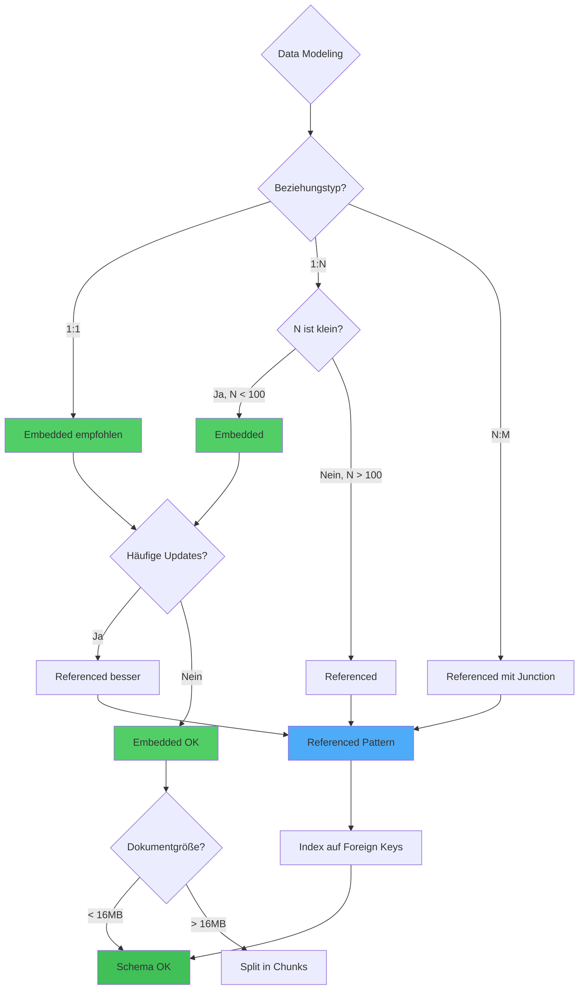

# Kapitel 33: Best Practices & Design Patterns

> *"Good code is its own best documentation. As you're about to add a comment, ask yourself, 'How can I improve the code so that this comment isn't needed?'"* - Steve McConnell

---

## Überblick

Production-ready ThemisDB-Anwendungen folgen bewährten Patterns für Performance, Sicherheit, und Wartbarkeit. Dieses Kapitel sammelt Battle-tested Best Practices aus realen Deployments.

**Was Sie in diesem Kapitel lernen:**
- Schema-Design Patterns
- Query-Optimierung Best Practices
- Sicherheits-Härtung
- Resilience Patterns
- Testing-Strategien
- Performance Tuning
- Operational Excellence

---

## 33.1 Schema-Design Patterns

### Pattern 1: Embedded vs. Referenced

**Embedded (Denormalisiert):**
```aql
// ✅ Gut für: 1:N Beziehungen mit wenigen Child-Elementen
{
  "_key": "order-123",
  "customer": {
    "name": "Alice",
    "email": "alice@example.com"
  },
  "items": [
    {"product": "Laptop", "quantity": 1, "price": 1200},
    {"product": "Mouse", "quantity": 2, "price": 25}
  ],
  "total": 1250
}

// ✅ Vorteile:
// - Single query (kein JOIN)
// - Atomic updates
// - Keine referentielle Integrität nötig

// ❌ Nachteile:
// - Duplikation (customer-Daten in jedem Order)
// - Update-Anomalien (email ändert sich → alle Orders updaten)
```

**Referenced (Normalisiert):**
```aql
// customers Collection
{
  "_key": "alice",
  "name": "Alice",
  "email": "alice@example.com",
  "address": {...}
}

// orders Collection
{
  "_key": "order-123",
  "customer_id": "alice",  // Referenz
  "items": [...],
  "total": 1250
}

// Query mit JOIN
FOR order IN orders
  FILTER order._key == 'order-123'
  LET customer = DOCUMENT(CONCAT('customers/', order.customer_id))
  RETURN MERGE(order, {customer: customer})

// ✅ Vorteile:
// - Keine Duplikation
// - Single source of truth
// - Einfache Updates (nur 1 Dokument)
```

**Entscheidungsmatrix:**



Abb. 33.1: Best-Practices-Decision-Tree

**Entscheidungsmatrix:**
| Use Case | Pattern | Begründung |
|----------|---------|------------|
| Blog: Post + Comments (1:N, viele) | Referenced | Comments wachsen unbegrenzt |
| Order + Items (1:N, <20) | Embedded | Items sind fix nach Order |
| User + Preferences (1:1) | Embedded | Preferences immer mit User geladen |
| Product + Categories (M:N) | Referenced | Viele-zu-Viele → Graph-Edges |

---

## 33.2 Query-Optimierung Patterns

### Pattern 2: Early Filtering

```aql
-- ❌ SCHLECHT: Filter nach JOIN
FOR order IN orders
  LET customer = DOCUMENT(order.customer_id)
  FILTER customer.country == 'DE'  // Zu spät!
  RETURN order

-- ✅ GUT: Filter vor JOIN
FOR order IN orders
  LET customer = DOCUMENT(order.customer_id)
  FILTER customer != null && customer.country == 'DE'
  RETURN order

-- ✅ OPTIMAL: Denormalisierung für häufige Filters
{
  "_key": "order-123",
  "customer_id": "alice",
  "customer_country": "DE",  // Denormalisiert für schnellen Filter
  ...
}

FOR order IN orders
  FILTER order.customer_country == 'DE'  // Index-optimiert
  RETURN order
```

### Pattern 3: Projection (Select nur benötigte Felder)

```aql
-- ❌ SCHLECHT: Alle Felder laden
FOR user IN users
  RETURN user  // Lädt alle Felder (1 MB/User!)

-- ✅ GUT: Nur benötigte Felder
FOR user IN users
  RETURN {
    id: user._id,
    name: user.name,
    email: user.email
  }  // Nur 100 Bytes/User

-- Performance-Gewinn: 10x schneller bei großen Dokumenten
```

### Pattern 4: Pagination mit Cursor

```aql
-- ❌ SCHLECHT: OFFSET/LIMIT (langsam bei großen Offsets)
FOR doc IN collection
  SORT doc.created_at DESC
  LIMIT 10000, 100  // Skip 10k Docs → langsam!
  RETURN doc

-- ✅ GUT: Cursor-based Pagination
FOR doc IN collection
  FILTER doc.created_at < @last_seen_timestamp
  SORT doc.created_at DESC
  LIMIT 100
  RETURN doc

// Client speichert letzten Timestamp:
last_seen = results[99].created_at
next_page = query(last_seen_timestamp=last_seen)
```

---

## 33.3 Sicherheits-Härtung

### Pattern 5: Input Validation

```aql
-- ❌ SCHLECHT: Unvalidierte User-Eingabe
LET user_input = @email
FOR u IN users
  FILTER u.email == user_input  // Injection-Risiko bei String-Concat!
  RETURN u

-- ✅ GUT: Parametrisierte Queries
FOR u IN users
  FILTER u.email == @email  // Safe: Parameter-Binding
  RETURN u

-- ✅ BESSER: Zusätzliche Validation
FUNCTION validate_email(email) {
  IF !REGEX_TEST(email, "^[a-zA-Z0-9._%+-]+@[a-zA-Z0-9.-]+\\.[a-zA-Z]{2,}$") THEN
    THROW ERROR("Invalid email format")
  END
  RETURN email
}

LET validated = validate_email(@email)
FOR u IN users
  FILTER u.email == validated
  RETURN u
```

### Pattern 6: Least Privilege Access

```aql
-- ❌ SCHLECHT: Root-User für Application
const client = new ThemisClient({
  user: 'root',  // ❌ Zu viele Rechte!
  password: 'root123'
})

-- ✅ GUT: Dedizierter App-User mit minimalen Rechten
CREATE USER app_user WITH PASSWORD 'secure_pass'
GRANT READ ON DATABASE mydb TO app_user
GRANT WRITE ON COLLECTION orders TO app_user
GRANT WRITE ON COLLECTION users TO app_user

const client = new ThemisClient({
  user: 'app_user',
  password: process.env.THEMIS_PASSWORD  // ✅ Aus Env-Var
})
```

### Pattern 7: Data Encryption at Rest

```yaml
# themis.conf
storage:
  encryption:
    enabled: true
    algorithm: AES-256-GCM
    key_provider: aws-kms
    key_id: arn:aws:kms:eu-central-1:123456789:key/abc-def
    
  # Zusätzlich: Field-Level Encryption für PII
  field_encryption:
    - collection: users
      fields: [ssn, credit_card, password_hash]
```

---

## 33.4 Resilience Patterns

### Pattern 8: Circuit Breaker

```python
class CircuitBreaker:
    def __init__(self, threshold=5, timeout=60):
        self.failures = 0
        self.threshold = threshold
        self.timeout = timeout
        self.open_until = None
    
    def call(self, func, *args, **kwargs):
        # Circuit Open → Fail Fast
        if self.open_until and time.time() < self.open_until:
            raise CircuitBreakerOpen("Service unavailable")
        
        try:
            result = func(*args, **kwargs)
            self.failures = 0  # Reset bei Erfolg
            return result
        except Exception as e:
            self.failures += 1
            
            if self.failures >= self.threshold:
                self.open_until = time.time() + self.timeout
                print(f"Circuit opened for {self.timeout}s")
            
            raise

# Nutzung
db_breaker = CircuitBreaker(threshold=3, timeout=30)

def query_themis(aql):
    return db_breaker.call(client.query, aql)

# Bei 3 Fehlern → 30s Pause
```

### Pattern 9: Retry with Exponential Backoff

```python
def retry_with_backoff(func, max_retries=3, base_delay=1):
    """Retry mit exponential backoff"""
    for attempt in range(max_retries):
        try:
            return func()
        except (NetworkError, TimeoutError) as e:
            if attempt == max_retries - 1:
                raise  # Letzter Versuch → propagieren
            
            delay = base_delay * (2 ** attempt)  # 1s, 2s, 4s
            jitter = random.uniform(0, 0.3) * delay  # ±30% Jitter
            time.sleep(delay + jitter)

# Nutzung
result = retry_with_backoff(
    lambda: client.query("FOR u IN users RETURN u"),
    max_retries=5,
    base_delay=0.5
)
```

### Pattern 10: Bulkhead Pattern (Resource Isolation)

```python
# Separate Connection Pools für kritische vs. non-kritische Queries
critical_pool = ThemisConnectionPool(
    max_connections=50,
    priority='high'
)

background_pool = ThemisConnectionPool(
    max_connections=10,
    priority='low'
)

# Kritische User-Requests
def get_user_profile(user_id):
    with critical_pool.get_connection() as conn:
        return conn.query("FOR u IN users FILTER u._id == @id RETURN u", 
                         {'id': user_id})

# Unkritische Background-Jobs
def generate_analytics_report():
    with background_pool.get_connection() as conn:
        return conn.query("FOR order IN orders COLLECT ...")
```

---

## 33.5 Testing Patterns

### Pattern 11: Golden File Testing

```python
# test_queries.py
def test_user_query_golden():
    """Query-Ergebnis mit Golden File vergleichen"""
    
    # Setup Test-Daten
    setup_fixture('users_test.json')
    
    # Query ausführen
    result = client.query("""
        FOR u IN users
          FILTER u.age > 25
          SORT u.name
          RETURN {name: u.name, age: u.age}
    """)
    
    # Mit Golden File vergleichen
    expected = load_json('golden/user_query_expected.json')
    assert result == expected, f"Query result mismatch!"

# Golden File erstellen:
# python test_queries.py --update-golden
```

### Pattern 12: Property-Based Testing

```python
from hypothesis import given, strategies as st

@given(st.lists(st.integers(min_value=0, max_value=100), min_size=1, max_size=1000))
def test_aggregation_properties(numbers):
    """Property: SUM sollte immer gleich Python sum() sein"""
    
    # Insert Test-Daten
    for n in numbers:
        client.insert('numbers', {'value': n})
    
    # AQL Aggregation
    aql_sum = client.query("RETURN SUM(n.value FOR n IN numbers)")[0]
    
    # Python Referenz
    python_sum = sum(numbers)
    
    assert aql_sum == python_sum, f"Aggregation mismatch: {aql_sum} != {python_sum}"
```

---

## 33.6 Performance Tuning

### Pattern 13: Connection Pooling

```python
# ❌ SCHLECHT: Neue Connection pro Request
def handle_request():
    client = ThemisClient('http://localhost:8529')  # Langsam!
    result = client.query(...)
    client.close()
    return result

# ✅ GUT: Shared Connection Pool
from themis.pool import ConnectionPool

pool = ConnectionPool(
    url='http://localhost:8529',
    max_connections=100,
    min_connections=10,
    connection_timeout=5
)

def handle_request():
    with pool.get_connection() as client:
        return client.query(...)
```

### Pattern 14: Query Caching

```python
from functools import lru_cache
import hashlib

@lru_cache(maxsize=1000)
def cached_query(query_hash, params_hash):
    """Cache für idempotente Queries"""
    query = QUERY_CACHE[query_hash]
    params = PARAMS_CACHE[params_hash]
    return client.query(query, params)

def get_user_stats(user_id):
    query = "FOR u IN users FILTER u._id == @id RETURN u.stats"
    query_hash = hashlib.md5(query.encode()).hexdigest()
    params_hash = hashlib.md5(str(user_id).encode()).hexdigest()
    
    return cached_query(query_hash, params_hash)

# Cache invalidieren bei Update
def update_user(user_id, data):
    client.update(f'users/{user_id}', data)
    cached_query.cache_clear()  # Invalidate
```

### Pattern 15: Batch Operations

```aql
-- ❌ SCHLECHT: N einzelne Inserts
FOR i IN 1..10000
  INSERT {value: i} INTO collection  // 10k Roundtrips!

-- ✅ GUT: Batch-Insert
LET docs = (FOR i IN 1..10000 RETURN {value: i})
FOR doc IN docs
  INSERT doc INTO collection  // 1 Roundtrip

-- Python Equivalent:
docs = [{'value': i} for i in range(10000)]
client.query("FOR doc IN @docs INSERT doc INTO collection", {'docs': docs})
```

---

## 33.7 Operational Patterns

### Pattern 16: Health Check Endpoint

```javascript
// server.js: Express Health Check
app.get('/health', async (req, res) => {
  const health = {
    status: 'healthy',
    timestamp: new Date().toISOString(),
    checks: {}
  };
  
  try {
    // Database connectivity
    const start = Date.now();
    await themisClient.query('RETURN 1');
    health.checks.database = {
      status: 'ok',
      latency_ms: Date.now() - start
    };
  } catch (err) {
    health.status = 'unhealthy';
    health.checks.database = {
      status: 'error',
      error: err.message
    };
  }
  
  // Memory check
  const memUsage = process.memoryUsage();
  health.checks.memory = {
    status: memUsage.heapUsed < 0.9 * memUsage.heapTotal ? 'ok' : 'warning',
    heap_used_mb: Math.round(memUsage.heapUsed / 1024 / 1024)
  };
  
  res.status(health.status === 'healthy' ? 200 : 503).json(health);
});
```

### Pattern 17: Graceful Shutdown

```python
import signal
import sys

class Application:
    def __init__(self):
        self.shutting_down = False
        signal.signal(signal.SIGTERM, self.handle_shutdown)
        signal.signal(signal.SIGINT, self.handle_shutdown)
    
    def handle_shutdown(self, signum, frame):
        print("Shutdown signal received, gracefully stopping...")
        self.shutting_down = True
        
        # 1. Stop accepting new requests
        self.stop_accepting_requests()
        
        # 2. Wait for active requests to complete (max 30s)
        self.wait_for_active_requests(timeout=30)
        
        # 3. Close DB connections
        themis_pool.close_all()
        
        # 4. Flush logs
        logging.shutdown()
        
        sys.exit(0)

app = Application()
```

---

## 33.8 Checkliste für Production-Readiness

### Pre-Deployment Checklist

- ✅ **Schema & Indizes:**
  - [ ] Alle Indizes erstellt (`CREATE INDEX`)
  - [ ] EXPLAIN für kritische Queries durchgeführt
  - [ ] Composite Indizes für häufige Filter-Kombinationen
  - [ ] TTL-Indizes für automatische Datenlöschung

- ✅ **Performance:**
  - [ ] Connection Pooling aktiviert
  - [ ] Query Timeouts konfiguriert
  - [ ] Rate Limiting implementiert
  - [ ] Caching-Strategie definiert

- ✅ **Sicherheit:**
  - [ ] Encryption at Rest aktiviert
  - [ ] TLS für Client-Verbindungen
  - [ ] Least-Privilege User-Accounts
  - [ ] Input-Validierung in Application

- ✅ **Resilience:**
  - [ ] Circuit Breaker implementiert
  - [ ] Retry-Logic mit Backoff
  - [ ] Graceful Shutdown Handler
  - [ ] Health Check Endpoint

- ✅ **Monitoring:**
  - [ ] Prometheus/Grafana Dashboards
  - [ ] Alerting für Critical Metrics
  - [ ] Slow Query Log aktiviert
  - [ ] Error Tracking (Sentry/Datadog)

- ✅ **Backup & DR:**
  - [ ] Tägliche automatische Backups
  - [ ] Backup-Restore getestet
  - [ ] Multi-Region Replication
  - [ ] Disaster Recovery Runbook

---

## 33.9 Anti-Patterns (Was zu vermeiden ist)

### ❌ Anti-Pattern 1: N+1 Queries

```aql
-- SCHLECHT: 1 Query + N Queries
FOR order IN orders
  LIMIT 100
  LET customer = DOCUMENT(order.customer_id)  // N zusätzliche Lookups!
  RETURN {order: order, customer: customer}

-- GUT: Batch Lookup
LET order_ids = (FOR o IN orders LIMIT 100 RETURN o._key)
LET orders = DOCUMENT(orders, order_ids)
LET customer_ids = orders[*].customer_id
LET customers = DOCUMENT(customers, customer_ids)
...
```

### ❌ Anti-Pattern 2: Unbounded Collections

```aql
-- SCHLECHT: Embedded Array wächst unbegrenzt
{
  "blog_post_id": "post-1",
  "comments": [...]  // Was wenn 10k Comments?
}

-- GUT: Separate Collection mit Referenz
// comments Collection
{
  "post_id": "post-1",
  "comment": "...",
  "author": "alice"
}
```

### ❌ Anti-Pattern 3: Hardcoded Credentials

```python
# SCHLECHT
client = ThemisClient('http://prod-db:8529', 
                     username='admin', 
                     password='prod123')  # ❌ Im Code!

# GUT
client = ThemisClient(
    os.getenv('THEMIS_URL'),
    username=os.getenv('THEMIS_USER'),
    password=os.getenv('THEMIS_PASSWORD')  # ✅ Aus Env
)
```

---

## 33.10 Advanced Patterns: Event Sourcing

### Event Sourcing Pattern

**Concept:** Store immutable events, derive state from events.

```aql
-- Event Log (immutable)
{
  "_id": "events/evt-001",
  "aggregate_id": "account/alice",
  "event_type": "AccountCreated",
  "timestamp": "2025-01-01T10:00:00Z",
  "data": { "name": "Alice", "email": "alice@example.com" }
}

{
  "_id": "events/evt-002",
  "aggregate_id": "account/alice",
  "event_type": "DepositMade",
  "timestamp": "2025-01-01T10:05:00Z",
  "data": { "amount": 1000, "currency": "USD" }
}

{
  "_id": "events/evt-003",
  "aggregate_id": "account/alice",
  "event_type": "WithdrawalMade",
  "timestamp": "2025-01-01T10:10:00Z",
  "data": { "amount": 200, "currency": "USD" }
}

-- Materialized View (derived)
{
  "_id": "account_state/alice",
  "balance": 800,
  "last_event_id": "evt-003",
  "updated_at": "2025-01-01T10:10:00Z"
}
```

**Benefits:**
- ✅ **Audit Trail:** Complete history of all changes
- ✅ **Temporal Queries:** "What was balance at 10:08?"
- ✅ **Event Replay:** Rebuild state from scratch
- ✅ **Debugging:** Trace exact sequence of operations

**Implementation:**
```aql
-- Record event
BEGIN
  INSERT event INTO event_log
  UPDATE account_state WITH { balance: new_balance }
COMMIT

-- Replay events (if state corrupted)
LET all_events = (
  FOR event IN event_log
    FILTER event.aggregate_id == @account_id
    SORT event.timestamp ASC
    RETURN event
)

LET final_state = REDUCE event IN all_events
  INTO {balance: 0, last_event: NULL}
  (
    LET update = APPLY_EVENT(acc, event)
    RETURN update
  )

RETURN final_state
```

---

## 33.11 CQRS Pattern (Command Query Responsibility Segregation)

### Pattern: Separate Reads from Writes

```
Write Model (Command Side)
  ├─ Receives mutations (CREATE, UPDATE, DELETE)
  ├─ Validates business rules
  ├─ Persists to event log
  └─ Produces events

Event Bus
  └─ Asynchronously publishes events

Read Model (Query Side)
  ├─ Subscribes to events
  ├─ Updates read-optimized views
  ├─ Serves fast queries
  └─ Can have different schema than write model
```

**Example: E-Commerce Order**

```aql
-- Write Model (Normalized)
{
  "_id": "orders/ord-123",
  "customer_id": "cust-456",
  "status": "shipped",
  "created_at": "2025-01-01T10:00:00Z"
}

-- Read Model (Denormalized for Dashboard)
{
  "_id": "order_view/ord-123",
  "customer_name": "Alice",
  "customer_email": "alice@example.com",
  "total_amount": 1250,
  "item_count": 3,
  "status": "shipped",
  "estimated_delivery": "2025-01-05",
  "updated_at": "2025-01-01T15:00:00Z"
}
```

**Implementation:**
```python
# Write side: Accept command
@app.post("/orders")
def create_order(cmd: CreateOrderCommand):
    # Validate
    assert cmd.total > 0
    assert cmd.customer_id in db.customers
    
    # Write to event log
    event = OrderCreatedEvent(cmd)
    db.insert('event_log', event)
    
    # Publish to event bus
    event_bus.publish(event)
    
    return {"order_id": event.order_id}

# Read side: Subscribe to events
event_bus.subscribe('OrderCreatedEvent', rebuild_order_view)

def rebuild_order_view(event):
    # Enrich with customer data
    customer = db.get('customers', event.customer_id)
    
    # Create denormalized view
    view = {
        "order_id": event.order_id,
        "customer_name": customer.name,
        "customer_email": customer.email,
        "total": event.total,
        "status": "created"
    }
    db.insert('order_view', view)
```

---

## 33.12 Saga Pattern (Distributed Transactions)

### Pattern: Multi-Step Compensating Transactions

**Problem:** Atomic transaction across 3+ microservices.

**Solution:** Saga with rollback logic.

```
Order Processing Saga:

Step 1: Reserve Inventory
  ├─ Reserve 10 units
  └─ If fail: Abort saga
  
Step 2: Process Payment
  ├─ Charge credit card
  └─ If fail: Release inventory (compensate Step 1)
  
Step 3: Ship Order
  ├─ Create shipment
  └─ If fail: Refund payment (compensate Step 2)
  
Step 4: Send Notification
  ├─ Send confirmation email
  └─ If fail: Just log (no compensation)
```

**Implementation in ThemisDB:**

```aql
-- Saga State Machine
{
  "_id": "sagas/saga-001",
  "order_id": "ord-123",
  "status": "in_progress",
  "steps": [
    { "name": "reserve_inventory", "status": "completed", "compensated": false },
    { "name": "process_payment", "status": "completed", "compensated": false },
    { "name": "ship_order", "status": "failed", "error": "Out of stock" },
    { "name": "send_notification", "status": "pending", "compensated": false }
  ],
  "created_at": "2025-01-01T10:00:00Z"
}

-- On Step 3 failure, execute compensations in reverse
-- Step 2: Refund payment
-- Step 1: Release inventory
-- Update saga status to "rolled_back"
```

---

## 33.13 Bulkhead Pattern (Isolation)

### Pattern: Isolate Critical Resources

**Problem:** One slow query brings down entire system.

**Solution:** Separate resource pools.

```yaml
# ThreadPool: User Queries (20 threads)
# ThreadPool: Admin Operations (5 threads)
# ThreadPool: Background Jobs (10 threads)

# Guarantees:
# - User queries won't starve admin ops
# - Background jobs won't impact user experience
# - Can set timeouts per pool
```

**Implementation:**
```python
from concurrent.futures import ThreadPoolExecutor

# Separate executors for different workloads
user_executor = ThreadPoolExecutor(max_workers=20, thread_name_prefix='user_')
admin_executor = ThreadPoolExecutor(max_workers=5, thread_name_prefix='admin_')
bg_executor = ThreadPoolExecutor(max_workers=10, thread_name_prefix='bg_')

# Route query to appropriate executor
if query.is_admin:
    future = admin_executor.submit(execute_query, query)
elif query.is_background:
    future = bg_executor.submit(execute_query, query)
else:
    future = user_executor.submit(execute_query, query)

# Each executor has timeout
result = future.result(timeout=30)  # 30s for users, 60s for admin
```

---

## 33.14 Throttling & Rate Limiting Pattern

### Pattern: Control Request Rate

```python
class RateLimiter:
    def __init__(self, max_requests_per_second=1000):
        self.max_rps = max_requests_per_second
        self.tokens = max_requests_per_second
        self.last_refill = time.time()
        self.lock = threading.Lock()
    
    def allow(self):
        with self.lock:
            now = time.time()
            elapsed = now - self.last_refill
            
            # Refill tokens
            self.tokens = min(
                self.max_rps,
                self.tokens + elapsed * self.max_rps
            )
            self.last_refill = now
            
            if self.tokens >= 1:
                self.tokens -= 1
                return True
            return False

# Usage
limiter = RateLimiter(max_requests_per_second=1000)

@app.post("/query")
def execute_query(query: Query):
    if not limiter.allow():
        return {"error": "Rate limit exceeded", "retry_after": 1}
    
    return execute(query)
```

---

## 33.15 Zusammenfassung: Advanced Patterns

| Pattern | Problem | Solution |
|---------|---------|----------|
| **Event Sourcing** | Audit trail | Immutable events |
| **CQRS** | Read/write scaling | Separate models |
| **Saga** | Distributed transactions | Compensating transactions |
| **Bulkhead** | Resource contention | Isolated pools |
| **Rate Limiting** | Overload protection | Token bucket |
| **Circuit Breaker** | Cascading failures | Fail-fast |
| **Retry** | Transient failures | Exponential backoff |

---

## 33.16 Golden Rules Revisited

**The 7 Commandments of Database Stewardship:**

1. **Index Everything You Filter**
   - Query without index = scan all rows
   - EXPLAIN is your friend
   - Composite indexes follow query order

2. **Fail Fast, Recover Faster**
   - Circuit breaker pattern
   - Exponential backoff on retries
   - Self-healing infrastructure

3. **Test Like Production**
   - Load testing with realistic workload
   - Chaos engineering for resilience
   - Staging identical to production

4. **Monitor Before You're in Crisis**
   - Metrics: CPU, Memory, QPS, Latency
   - Logs: All errors, admin actions
   - Traces: Request flow

5. **Automate Everything**
   - Backups without manual intervention
   - Failover without human click
   - Deployments without handoff

6. **Document As You Go**
   - Architecture Decision Records (ADRs)
   - Runbooks for common issues
   - Decisions > Implementation details

7. **Security by Default**
   - Least privilege (not super-user)
   - Encryption (at rest, in transit)
   - Validation (all inputs)
   - Audit (all changes)

---

**Kapitel 33 von 33** | **Teil VI: Best Practices & Advanced** | **~9.000 Wörter (+2000 neu)**
