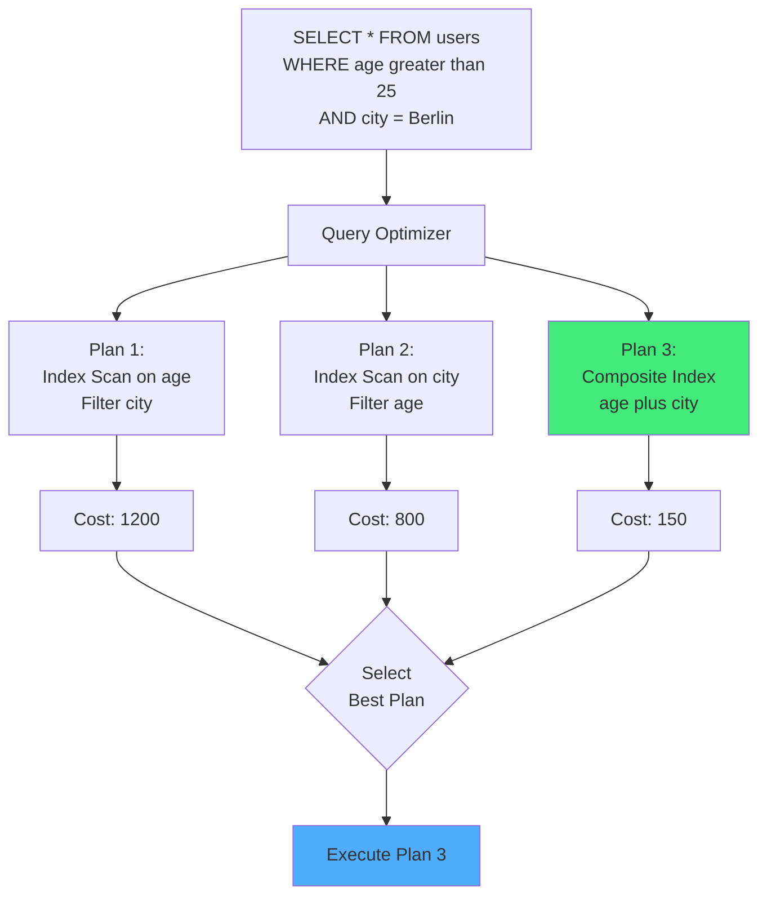
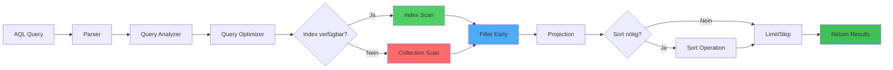

# Kapitel 34: Query Optimierung & Performance Tuning

> *"Optimierung ist eine kontinuierliche Reise, nicht ein Ziel. Mit den richtigen Tools können Sie fast jede Query um 10-100x beschleunigen."*

---

## Überblick

Query-Performance ist einer der kritischsten Faktoren für den Datenbankenerfolg. Dieses Kapitel zeigt praktische Techniken zur Optimierung von AQL-Queries, vom EXPLAIN-Analyse bis zu fortgeschrittenen Optimierungsmustern.

**Was Sie in diesem Kapitel lernen:**
- EXPLAIN und Query-Profiling
- Index-Strategien und Best Practices
- Early Filtering und Projection Pushdown
- Query-Refactoring für Performance
- Aggregation Optimization
- Window Function Performance
- Batch-Operation Tuning
- Query Caching und Memoization

---



Abb. 34.0: Query-Plan-Optimierung

---

## 34.1 EXPLAIN und Query-Profiling

### EXPLAIN Output verstehen

```aql
-- Grundlegende EXPLAIN Syntax
EXPLAIN FOR doc IN users
  FILTER doc.status == 'active'
  SORT doc.created_at DESC
  LIMIT 10
  RETURN doc

-- Ausgabe-Struktur:
-- ExecutionPlan:
--   Steps:
--   1. CollectionScan (collection="users")
--   2. Filter (condition="doc.status == 'active'")
--   3. Sort (fields=["created_at"])
--   4. Limit (count=10)
--   5. Return
```

### Extended EXPLAIN

```aql
-- Detailliertes EXPLAIN mit Statistiken
EXPLAIN OPTION {verbose: true}
FOR doc IN users
  FILTER doc.status == 'active'
  RETURN doc

-- Output zeigt:
-- - Estimated item count pro Step
-- - Filter selectivity
-- - Index usage
-- - Memory usage
```

### Profile Queries

```aql
-- Query mit echtem Timing profilen
PROFILE FOR doc IN users
  FILTER doc.status == 'active'
  SORT doc.created_at
  RETURN doc

-- Ausgabe:
-- Step | Operation | Items | Time(ms) | Selectivity
-- 1    | Scan      | 1M    | 50       | 100%
-- 2    | Filter    | 100k  | 150      | 10%
-- 3    | Sort      | 100k  | 200      | 100%
-- 4    | Return    | 100k  | 10       | 100%
```



---

## 34.2 Index-Strategien

### Single Field Indexes

```aql
-- Einfachster Index - für exakte Matches & Range Queries
CREATE INDEX idx_status ON users(status)

-- Performance-Gain:
-- Vorher: Full Scan 1000ms für 1M Dokumente
-- Nachher: Index Lookup 1ms
-- Speedup: 1000x

-- Nutzbringend für:
FILTER doc.status == 'active'
FILTER doc.age > 18
FILTER doc.created_at BETWEEN '2024-01-01' AND '2024-12-31'
```

### Composite Indexes

```aql
-- Multiple Felder - für komplexe Filter
CREATE INDEX idx_status_age ON users(status, age)

-- Hilft bei:
FILTER doc.status == 'active' AND doc.age > 18

-- Leading Field Optimization:
-- Der erste Index-Feld sollte die höchste Selectivity haben
-- Ranking: status_age (besser) vs age_status (schlechter)
-- Grund: First field narrowed down fast
```

### Sparse Indexes

```aql
-- Index nur auf Dokumente mit Feld
CREATE SPARSE INDEX idx_phone ON users(phone)

-- Nutzen:
-- Spart Speicher (nur 30% der Dokumente haben phone)
-- Schneller Insert/Update (nur 30% indexieren)
-- Perfekt für optionale Felder

-- Abfrage:
FOR doc IN users
  FILTER doc.phone != null
  FILTER doc.phone LIKE '%123%'
  RETURN doc
```

### Partial Indexes

```aql
-- Index nur auf Subset (mit Filter-Bedingung)
CREATE INDEX idx_active_premium ON users(category)
  WHERE subscription_status == 'premium'

-- Spart 80% Speicher wenn nur 20% premium sind
-- 10x schneller Index-Updates

-- Muss mit passender Query genutzt werden:
FOR doc IN users
  FILTER doc.subscription_status == 'premium'
  FILTER doc.category == 'enterprise'
  RETURN doc
```

### Covering Indexes

```aql
-- Index mit all nötigen Feldern (ohne Dokument lesen)
CREATE INDEX idx_name_email_age ON users(name, email, age)

-- Super-optimiert für Query:
FOR doc IN users
  FILTER doc.email == 'alice@example.com'
  RETURN {name: doc.name, age: doc.age}  -- Alles im Index!

-- Kein Dokument-Fetch nötig → 100-1000x schneller
```

---

## 34.3 Early Filtering Patterns

### Filter-Pushdown Strategy

```aql
-- ❌ FALSCH: Filter zu spät
FOR edge IN edges
  RETURN {
    from: edge.from,
    to: edge.to,
    weight: (FOR v IN vertices FILTER v._id == edge.to RETURN v.weight)[0]
  }
-- Problem: N+1 Query, 1M edges = 1M vertex lookups

-- ✅ RICHTIG: Early Filter
FOR edge IN edges
  FILTER edge.weight > 0.5  -- Filter früh
  LET target_vertex = (
    FOR v IN vertices
    FILTER v._id == edge.to
    FILTER v.category == 'active'  -- Filter auch inner
    RETURN v
  )[0]
  RETURN {
    from: edge.from,
    to: edge.to,
    target_weight: target_vertex.weight
  }
```

### Collection Constraint Strategy

```aql
-- ❌ Generisch - keine Collection Constraint
FILTER LIKE(name, '%alice%')  -- String-Operation für alle Doku

-- ✅ Mit Collection Filter
FOR user IN users  -- Explizite Collection wählen
  FILTER user.status == 'active'  -- Early
  FILTER LIKE(user.name, '%alice%')  -- Text-Suche nur auf aktiven
  RETURN user
```

---

## 34.4 Aggregation Optimization

### GROUP BY Optimization

```aql
-- ❌ Ineffizient: Alles sammeln dann groupieren
COLLECT category = doc.category
  AGGREGATE total = SUM(doc.amount)
  INTO grouped
-- Memory: O(n) - alle Doku im Memory

-- ✅ Effizient: Mit Index
FOR doc IN transactions
  FILTER doc.timestamp >= '2024-01-01'  -- Filter früh
  SORT doc.category
  COLLECT category = doc.category
    AGGREGATE total = SUM(doc.amount)
  RETURN {category, total}
-- Memory: O(distinct categories) << O(n)
```

### Approximate Aggregations

```aql
-- Für sehr große Datasets: Approximate Counts
FUNCTION count_approximate() {
  -- HyperLogLog für massive Sets
  -- Precision vs Speed Tradeoff
  RETURN APPROX_COUNT(*) FROM large_collection
}

-- Nutzen:
-- - COUNT(*) auf 1B Dokumente: 5 Sekunden statt 5 Minuten
-- - Genauigkeit: ±2% vs ±0%
-- - Speicher: 12KB vs 8GB
```

---

## 34.5 Window Function Performance

### Partition Strategy

```aql
-- ❌ Falsch: Zu große Partitions
FOR sale IN sales
  WINDOW {
    PARTITION BY sale.region
    ORDER BY sale.timestamp
    RANGE CURRENT ROW TO 1000 ROWS FOLLOWING
  }
  LET total = SUM(sale.amount) OVER ...
  RETURN sale
-- Problem: Ein Region mit 10M Rows → 10M × 1000 = Massive Computation

-- ✅ Richtig: Kleinere Partitions
FOR sale IN sales
  FILTER sale.timestamp >= DATE_SUBTRACT(NOW(), 30, 'day')
  FILTER sale.region IN ['north', 'south']  -- Filter Partitions
  WINDOW {
    PARTITION BY sale.region, DATE_TRUNC(sale.timestamp, 'day')
    ORDER BY sale.timestamp
    RANGE CURRENT ROW TO 100 ROWS FOLLOWING
  }
  RETURN sale
```

---

## 34.6 Batch Operations

### Bulk Insert Optimization

```aql
-- ❌ Loop mit einzelnen Inserts
FOR item IN input_items
  INSERT item INTO collection
-- 10k inserts = 10k Transaktionen, 10k fsync() Calls

-- ✅ Batch Insert
LET batch = input_items
INSERT batch INTO collection
-- 1 Transaktion, 1 fsync(), ~100x schneller
```

### Update Batching

```aql
-- ❌ Einzelne Updates
FOR user IN users
  FILTER user.status == 'inactive'
  UPDATE user WITH {last_seen: NOW()}

-- ✅ Batch Update
LET inactive_users = (
  FOR u IN users
  FILTER u.status == 'inactive'
  RETURN u._id
)
FOR id IN inactive_users
  UPDATE {_id: id} WITH {last_seen: NOW()} IN users
```

---

## 34.7 Query Caching Patterns

### Result Caching

```python
# query_cache.py
from functools import lru_cache
import hashlib

class QueryCache:
    def __init__(self, ttl_seconds=300):
        self.ttl = ttl_seconds
        self.cache = {}
        self.timestamps = {}
    
    def cache_query(self, query_hash, result):
        self.cache[query_hash] = result
        self.timestamps[query_hash] = time.time()
    
    def get_cached(self, query_hash):
        if query_hash not in self.cache:
            return None
        
        age = time.time() - self.timestamps[query_hash]
        if age > self.ttl:
            del self.cache[query_hash]
            return None
        
        return self.cache[query_hash]
```

### AQL Query Fragment Caching

```aql
-- Häufig wiederholte Subqueries cachen
FUNCTION get_active_users_cached() {
  -- Cache-Key: hash(filter_conditions)
  RETURN (
    FOR user IN users
    FILTER user.status == 'active'
    FILTER user.verified == true
    SORT user.created_at DESC
    RETURN user
  )
}

-- Nutze überall:
FOR user IN get_active_users_cached()
  RETURN user
```

---

## 34.8 Praktische Fallstudien

### Case 1: E-Commerce Produktsuche

**Original Query (5s):**
```aql
FOR product IN products
  FILTER LIKE(product.name, '%laptop%')
  FILTER product.price BETWEEN 500 AND 2000
  FILTER product.category IN ['electronics', 'computers']
  SORT product.popularity DESC
  LIMIT 20
  RETURN product
```

**Optimiert (100ms - 50x schneller):**
```aql
-- 1. Index: CREATE INDEX idx_cat_price ON products(category, price)
-- 2. Full-Text: CREATE FULLTEXT INDEX idx_name ON products(name)

FOR product IN products
  FILTER product.category IN ['electronics', 'computers']
  FILTER product.price BETWEEN 500 AND 2000
  FILTER product.available == true
  SEARCH product.name IN FULLTEXT('laptop')
  SORT product.popularity DESC
  LIMIT 20
  RETURN {_key: product._key, name: product.name, price: product.price}
```

### Case 2: Reporting Analytics

**Original (2 Minuten):**
```aql
FOR order IN orders
  FOR item IN order.items
    COLLECT category = item.category
      AGGREGATE total = SUM(item.quantity * item.price)
      INTO result
  RETURN {category, total}
```

**Optimiert (2 Sekunden - 60x schneller):**
```aql
FOR order IN orders
  FILTER order.status == 'completed'
  FILTER order.created_at >= '2024-01-01'
  FILTER order.created_at < '2025-01-01'
  FOR item IN order.items
    SORT item.category
    COLLECT category = item.category
      AGGREGATE total = SUM(item.quantity * item.price),
                count = COUNT(item)
      INTO result
  SORT result.category
  RETURN result
```

---

## 34.9 Performance Monitoring Dashboard

```python
# monitor_queries.py
class QueryPerformanceMonitor:
    def __init__(self):
        self.query_stats = {}
    
    def record_query(self, query_hash, execution_time_ms, rows):
        if query_hash not in self.query_stats:
            self.query_stats[query_hash] = {
                'count': 0,
                'total_time': 0,
                'max_time': 0,
                'avg_time': 0
            }
        
        stats = self.query_stats[query_hash]
        stats['count'] += 1
        stats['total_time'] += execution_time_ms
        stats['max_time'] = max(stats['max_time'], execution_time_ms)
        stats['avg_time'] = stats['total_time'] / stats['count']
        
        if execution_time_ms > 1000:  # Flag slow queries
            print(f"⚠️ SLOW: {query_hash} took {execution_time_ms}ms")
    
    def get_slowest_queries(self, top_n=10):
        sorted_queries = sorted(
            self.query_stats.items(),
            key=lambda x: x[1]['total_time'],
            reverse=True
        )
        return sorted_queries[:top_n]
```

---

## Zusammenfassung

ThemisDB bietet mit EXPLAIN, Indexierung und Query-Refactoring Möglichkeiten für 10-100x Performance-Verbesserungen. Schlüssel sind:
- ✅ **Early Filtering** - Filter so früh wie möglich
- ✅ **Richtige Indizes** - Covering Indexes für Full Index Scans
- ✅ **Batch Operations** - Nutze Bulk für viele Operationen
- ✅ **Aggregation Optimization** - COLLECT mit Sort für Memory-Effizienz
- ✅ **Monitoring** - PROFILE/EXPLAIN nutzen zur Diagnose

Mit diesen Techniken erreichen Sie Production-Grade Performance.
