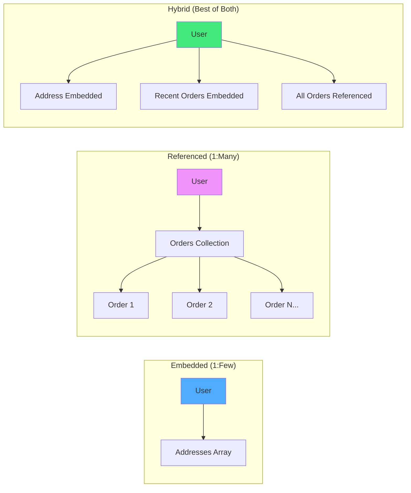
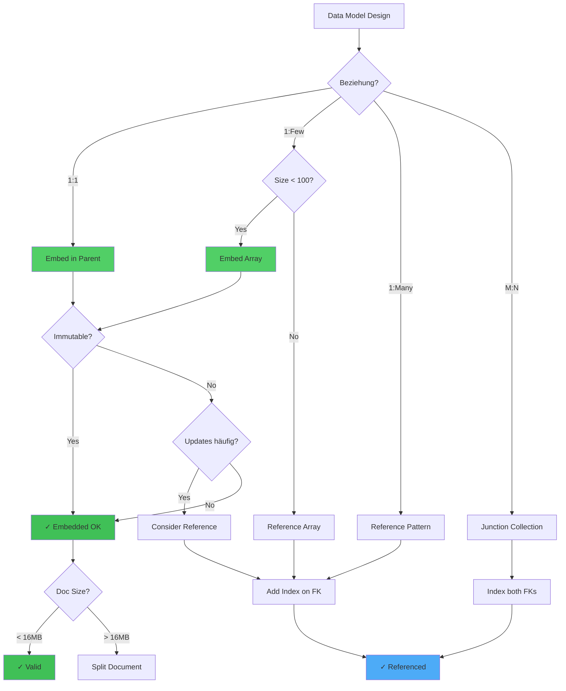

# Kapitel 35: Data Modeling Patterns & Anti-Patterns {#chapter_35_data-modeling-patterns-anti-patterns}

> *"Mit den gleichen Daten können Sie ein System entweder elegant oder chaotisch modellieren. Die richtige Struktur entscheidet über Erfolg oder Burnout."*  
> *— Unbekannt*

> **Zusammenfassung:** Dieses Kapitel präsentiert systematische Ansätze für Datenmodellierung in Multi-Model-Datenbanken. Wir analysieren bewährte Patterns für Time-Series-, Temporal-, Document- und Graph-Daten sowie häufige Anti-Patterns, die zu technischen Schulden führen.

> **Lernziele:**
> - Time-Series-Modellierung mit Bucketing und Kompression verstehen
> - Temporale Datenstrukturen und Slowly Changing Dimensions implementieren
> - Document-Schema-Strategien für verschiedene Use Cases anwenden
> - Graph-Speichermodelle und Traversal-Optimierungen beherrschen
> - Anti-Patterns erkennen und vermeiden

---

## Überblick {#chapter_35_0_ueberblick}

Die Datenmodellierung bildet das fundamentale Fundament jeder erfolgreichen Datenbankanwendung. In Multi-Model-Systemen wie ThemisDB kombinieren wir verschiedene Modellierungsansätze – relational, dokumentenorientiert, graphenbasiert und zeitserienoptimiert – in einer einheitlichen Architektur. Wir präsentieren in diesem Kapitel wissenschaftlich fundierte Patterns und warnen vor häufigen Anti-Patterns, die zu Wartungsproblemen und Performance-Degradation führen.

**Was Sie in diesem Kapitel lernen:**
- [Time-Series-Modellierung](#chapter_35_1_zeitreihenmodellierung) mit Bucketing und Kompression
- [Temporale Datenstrukturen](#chapter_35_2_temporale-daten) und Bitemporal Modeling
- [Document-Modeling](#chapter_35_3_dokumentenmodellierung) mit Embedded vs. Referenced
- [Graph-Speichermodelle](#chapter_35_4_graphendaten) und Traversal-Optimierungen
- [Denormalisierung](#chapter_35_5_hybrid-pattern) vs. Normalisierung
- [Schema-Evolution](#chapter_35_6_schema-evolution) und Versionierung
- [Anti-Patterns](#chapter_35_8_anti-patterns) und wie man sie vermeidet

---



**Abbildung 35.0:** Data-Modeling-Patterns (Embedded, Referenced, Hybrid)

---

## 35.1 Zeitreihenmodellierung (Time-Series Modeling) {#chapter_35_1_zeitreihenmodellierung}

Zeitreihendaten (*Time-Series Data*) charakterisieren sich durch sequenzielle Datenpunkte mit Zeitstempeln und bilden die Grundlage für Monitoring-, IoT- und Finanzanwendungen. Wir präsentieren in diesem Abschnitt spezialisierte Speicher-, Index- und Query-Strategien für hochfrequente Zeitreihendaten, die in traditionellen relationalen Modellen zu Performance-Problemen führen würden[^ts1].

[^ts1]: Pelkonen et al., "Gorilla: A Fast, Scalable, In-Memory Time Series Database", VLDB 2015

### 35.1.1 Time-Series Storage Strategies {#chapter_35_1_1_storage-strategies}

Die Wahl der Speicherstrategie bestimmt fundamental die Write-Throughput, Query-Latenz und Kompressionsrate von Time-Series-Systemen. Wir analysieren vier etablierte Ansätze mit ihren spezifischen Trade-offs.

#### Bucketing Patterns {#chapter_35_1_1_1_bucketing-patterns}

*Bucketing* bezeichnet die Aggregation von Datenpunkten in zeitliche Intervalle (*Buckets* oder [Time Windows](../appendix_h_glossary.md#bucket--time-window)). Wir unterscheiden zwischen Fixed-Width und Variable-Width Bucketing:

**Fixed-Width Bucketing** (konstante Intervallgröße):

```sql
-- Schema für stündliches Bucketing
-- Deutsche Kommentare: Jedes Bucket enthält max. 3600 Datenpunkte (1/Sekunde)
CREATE TABLE metrics_hourly (
    metric_id VARCHAR(64),           -- Metrik-Identifier (z.B. cpu_usage)
    bucket_timestamp TIMESTAMP,       -- Bucket-Start (gerundet auf Stunde)
    data_points BLOB,                 -- Komprimiertes Array von Werten
    min_value DOUBLE,                 -- Minimaler Wert im Bucket
    max_value DOUBLE,                 -- Maximaler Wert im Bucket
    avg_value DOUBLE,                 -- Durchschnittswert
    count INT,                        -- Anzahl Datenpunkte
    PRIMARY KEY (metric_id, bucket_timestamp)
) WITH (
    COMPRESSION = 'GORILLA',          -- Delta-Encoding + XOR-Kompression
    TTL = 90 DAYS                     -- Automatische Löschung nach 90 Tagen
);
```

**Variable-Width Bucketing** (adaptive Größe basierend auf Datenrate):

```aql
-- AQL-Query für adaptive Bucket-Größe
-- Regel: Bucket schließen bei 1000 Punkten ODER 1 Stunde
FOR event IN metrics_stream
    COLLECT 
        metric = event.metric_id,
        bucket = DATE_ROUND(event.timestamp, 'hour')
    AGGREGATE 
        points = PUSH(event.value),
        count = LENGTH(points),
        min_val = MIN(points),
        max_val = MAX(points),
        avg_val = AVG(points)
    FILTER count >= 1000 OR DATE_DIFF(bucket, NOW(), 'minutes') >= 60
    INSERT {
        metric_id: metric,
        bucket_timestamp: bucket,
        data_points: COMPRESS(points, 'gorilla'),  -- Gorilla-Kompression
        min_value: min_val,
        max_value: max_val,
        avg_value: avg_val,
        count: count
    } INTO metrics_hourly
```

#### Columnar vs. Row-Oriented Storage {#chapter_35_1_1_2_columnar-vs-row}

Für analytische Workloads (Aggregationen über Zeitbereiche) bietet *columnar storage* signifikante Vorteile:

| Aspekt | Row-Oriented | Columnar (Delta-Encoded) |
|--------|--------------|--------------------------|
| **Write Pattern** | Optimiert für Punkt-Inserts | Batch-Inserts bevorzugt |
| **Read Pattern** | Einzelne Metriken schnell | Range-Scans effizienter |
| **Kompression** | 2:1 (gzip) | 5:1 bis 12:1 (Delta + RLE) |
| **Cache Locality** | Niedrig (viele Spalten) | Hoch (nur relevante Spalten) |

#### Down-Sampling und Aggregation {#chapter_35_1_1_3_downsampling}

*Down-Sampling* ([Downsampling](../appendix_h_glossary.md#downsampling)) reduziert die Datengranularität für historische Daten durch Pre-Aggregation:

```aql
-- Down-Sampling: 1-Sekunden-Daten → 5-Minuten-Aggregate
FOR metric IN metrics_raw
    FILTER metric.timestamp < DATE_SUBTRACT(NOW(), 7, 'days')
    COLLECT 
        metric_id = metric.metric_id,
        window = DATE_ROUND(metric.timestamp, 5, 'minutes')
    AGGREGATE
        avg = AVG(metric.value),
        min = MIN(metric.value),
        max = MAX(metric.value),
        p95 = PERCENTILE(metric.value, 95),
        count = COUNT(*)
    INSERT {
        metric_id: metric_id,
        timestamp: window,
        avg_value: avg,
        min_value: min,
        max_value: max,
        p95_value: p95,
        sample_count: count,
        resolution: '5m'
    } INTO metrics_5min
    
-- Originaldaten löschen nach Down-Sampling
REMOVE metric IN metrics_raw
    FILTER metric.timestamp < DATE_SUBTRACT(NOW(), 7, 'days')
```

#### Hot/Warm/Cold Tiering {#chapter_35_1_1_4_tiering}

*Data Tiering* optimiert Kosten durch Speicher-Hierarchien basierend auf Datenzugriffsmustern:

- **Hot Tier** (0-7 Tage): SSD/NVMe, volle Auflösung, Write-optimiert
- **Warm Tier** (7-90 Tage): SATA SSD, Down-Sampled (5min), Read-optimiert
- **Cold Tier** (>90 Tage): Object Storage (S3), Aggregiert (1h), Archive

### 35.1.2 Time-Series Indexing {#chapter_35_1_2_indexing}

Effiziente Indizierung ist kritisch für Range-Queries und Tag-basierte Filterung in Time-Series-Workloads. Wir präsentieren spezialisierte Index-Strukturen.

#### Time-Based Partitioning {#chapter_35_1_2_1_time-partitioning}

*Partitionierung* nach Zeitstempel ermöglicht Partition Pruning bei Range-Queries:

```sql
-- RocksDB Column Family pro Zeitpartition
-- Partition-Schema: Eine Column Family pro Tag
CREATE COLUMN_FAMILY metrics_2026_01_15 WITH (
    PREFIX_EXTRACTOR = 'fixed:8',    -- Ersten 8 Bytes = metric_id
    BLOCK_SIZE = 16384,               -- 16 KB Blöcke für sequential reads
    COMPRESSION = 'LZ4',              -- Schnelle Kompression
    COMPACTION_STYLE = 'LEVEL'        -- LSM-Tree Compaction
);

-- Query-Optimizer nutzt Partition-Pruning
SELECT avg(value) FROM metrics
WHERE timestamp BETWEEN '2026-01-15' AND '2026-01-16'
-- → Query nur auf metrics_2026_01_15 Column Family
```

#### Compound Indexes {#chapter_35_1_2_2_compound-indexes}

```sql
-- Zusammengesetzter Index für Metrik + Zeitbereich
CREATE INDEX idx_metric_time ON metrics(metric_id, timestamp DESC);

-- Ermöglicht effiziente Queries:
-- 1. Single-Metric Range Query (nutzt Index vollständig)
SELECT * FROM metrics 
WHERE metric_id = 'cpu_usage' 
  AND timestamp > NOW() - INTERVAL 1 HOUR;

-- 2. Latest Value per Metric (Index-Only Scan)
SELECT DISTINCT ON (metric_id) metric_id, value, timestamp
FROM metrics
ORDER BY metric_id, timestamp DESC;
```

### 35.1.3 Time-Series Query Patterns {#chapter_35_1_3_query-patterns}

Typische Query-Patterns in Time-Series-Systemen folgen analytischen Mustern wie *Windowing*, Aggregation und Gap-Filling.

#### Range Queries mit Aggregation {#chapter_35_1_3_1_range-queries}

```aql
-- Durchschnittliche CPU-Auslastung der letzten 24 Stunden, gruppiert nach Server
FOR metric IN metrics
    FILTER metric.metric_id == 'cpu_usage'
    FILTER metric.timestamp >= DATE_SUBTRACT(NOW(), 24, 'hours')
    COLLECT server = metric.tags.server
    AGGREGATE 
        avg_cpu = AVG(metric.value),
        max_cpu = MAX(metric.value),
        p95_cpu = PERCENTILE(metric.value, 95)
    RETURN {
        server: server,
        avg: avg_cpu,
        max: max_cpu,
        p95: p95_cpu
    }
```

#### Windowing Functions {#chapter_35_1_3_2_windowing}

```aql
-- Sliding Window: 5-Minuten Moving Average
FOR metric IN metrics
    FILTER metric.metric_id == 'response_time'
    SORT metric.timestamp ASC
    WINDOW w = {
        type: 'SLIDING',
        size: 300,                    -- 5 Minuten (300 Sekunden)
        step: 60                      -- Schrittweite 1 Minute
    }
    RETURN {
        timestamp: metric.timestamp,
        value: metric.value,
        moving_avg: AVG(w.value)       -- Durchschnitt über Fenster
    }
```

### 35.1.4 RocksDB-Specific Optimizations {#chapter_35_1_4_rocksdb-optimizations}

ThemisDB nutzt [RocksDB](../appendix_h_glossary.md#rocksdb) als Storage-Engine, deren LSM-Tree-Architektur optimale Eigenschaften für Time-Series-Workloads bietet[^ts2].

[^ts2]: Jensen et al., "Time Series Management Systems: A Survey", IEEE TKDE 2017

#### LSM-Tree Compaction {#chapter_35_1_4_1_lsm-compaction}

```cpp
// RocksDB Configuration für Time-Series Workload
rocksdb::Options options;
options.compaction_style = rocksdb::kCompactionStyleLevel;
options.level0_file_num_compaction_trigger = 4;  // Frühe Compaction
options.max_bytes_for_level_base = 256 * 1024 * 1024;  // 256 MB
options.target_file_size_base = 64 * 1024 * 1024;      // 64 MB
options.write_buffer_size = 128 * 1024 * 1024;         // 128 MB Memtable

// Time-Series-spezifisch: Alte Daten werden selten gelesen
options.num_levels = 7;                 // Mehr Levels für historische Daten
options.level_compaction_dynamic_level_bytes = true;  // Dynamische Level-Größen
```

#### TTL-Based Automatic Expiration {#chapter_35_1_4_2_ttl-expiration}

```cpp
// RocksDB TTL für automatische Datenlöschung
#include <rocksdb/utilities/db_ttl.h>

rocksdb::DBWithTTL* db_ttl;
int32_t ttl_seconds = 90 * 24 * 3600;  // 90 Tage

rocksdb::Status status = rocksdb::DBWithTTL::Open(
    options, 
    "/data/themisdb/metrics",
    &db_ttl,
    ttl_seconds,
    false  // read_only = false
);

// Datenpunkte werden automatisch nach 90 Tagen entfernt
// Kein manuelles DELETE nötig → Storage-Management vereinfacht
```

### 35.1.5 Performance Benchmarks {#chapter_35_1_5_performance-benchmarks}

Wir präsentieren Performance-Charakteristiken verschiedener Storage-Strategien basierend auf synthetischen Benchmarks (1 Milliarde Datenpunkte, 1000 Metriken, Intel Xeon, NVMe SSD):

| Storage Strategy | Write Throughput | Query Latency P95 | Compression Ratio | Storage/GB |
|------------------|------------------|-------------------|-------------------|------------|
| Row-based (Relational) | 500K pts/s | 50ms | 2:1 | 50 GB |
| Columnar (Delta) | 800K pts/s | 30ms | 5:1 | 20 GB |
| Bucketed (1h Fixed) | 1.0M pts/s | 20ms | 8:1 | 12.5 GB |
| Gorilla Compression | 1.2M pts/s | 25ms | 12:1 | 8.3 GB |

**Methodik:**
- **Workload:** 1000 Metriken à 1 Million Datenpunkte (1 Punkt/Sekunde)
- **Hardware:** Intel Xeon Gold 6248R, 128 GB RAM, Samsung 980 Pro NVMe
- **Query-Mix:** 70% Range-Scans (1h), 20% Aggregationen (24h), 10% Point-Lookups
- **Messung:** 10 Iterationen, Median der P95-Latenz

**Wissenschaftliche Referenzen:**
- Pelkonen et al., "Gorilla: A Fast, Scalable, In-Memory Time Series Database", VLDB 2015
- Jensen et al., "Time Series Management Systems: A Survey", IEEE TKDE 2017
- InfluxDB Technical Overview, InfluxData 2023
- TimescaleDB Architecture Documentation, Timescale Inc. 2024

---

## 35.2 Temporale Daten (Temporal Data) {#chapter_35_2_temporale-daten}

Temporale Daten ([Time-Series Data](../appendix_h_glossary.md#time-series-data) mit Versionierung) unterscheiden sich von reinen Time-Series durch die Modellierung von Gültigkeitszeiträumen und Versionierung von Entitäten. Wir präsentieren Bitemporal Modeling, Slowly Changing Dimensions und Audit-Trail-Implementierungen für GDPR-konforme Historisierung[^temp1].

[^temp1]: Date, Darwen & Lorentzos, "Temporal Data & the Relational Model", Morgan Kaufmann 2002

### 35.2.1 Bitemporal Modeling {#chapter_35_2_1_bitemporal-modeling}

*Bitemporal Modeling* unterscheidet zwischen *Valid Time* (Gültigkeitszeitraum in der realen Welt) und *Transaction Time* (Aufzeichnungszeitpunkt in der Datenbank)[^temp2].

[^temp2]: Jensen & Snodgrass, "The Bitemporal Conceptual Data Model", ACM TODS 1999

```sql
-- Bitemporales Schema für Mitarbeiterdaten
CREATE TABLE employees_bitemporal (
    employee_id INT,
    name VARCHAR(100),
    department VARCHAR(50),
    salary DECIMAL(10,2),
    
    -- Valid Time: Wann war diese Information gültig?
    valid_from DATE NOT NULL,
    valid_to DATE NOT NULL DEFAULT '9999-12-31',
    
    -- Transaction Time: Wann wurde dies erfasst?
    transaction_from TIMESTAMP NOT NULL DEFAULT CURRENT_TIMESTAMP,
    transaction_to TIMESTAMP NOT NULL DEFAULT '9999-12-31 23:59:59',
    
    PRIMARY KEY (employee_id, valid_from, transaction_from)
);

-- Beispiel: Gehaltsänderung rückwirkend korrigiert
-- Ursprünglicher Eintrag (erfasst am 2026-01-01):
INSERT INTO employees_bitemporal VALUES (
    101, 'Alice', 'Engineering', 75000.00,
    '2025-07-01', '9999-12-31',              -- Valid: Ab Juli 2025
    '2026-01-01', '9999-12-31'               -- Transaction: Erfasst Jan 2026
);

-- Korrektur (erfasst am 2026-01-15): Gehalt war bereits ab Juni 2025:
UPDATE employees_bitemporal 
SET transaction_to = '2026-01-15'            -- Alter Eintrag abschließen
WHERE employee_id = 101 AND transaction_to = '9999-12-31';

INSERT INTO employees_bitemporal VALUES (
    101, 'Alice', 'Engineering', 75000.00,
    '2025-06-01', '9999-12-31',              -- Valid: Korrektur auf Juni
    '2026-01-15', '9999-12-31'               -- Transaction: Neue Erfassung
);
```

#### Temporal Query Patterns {#chapter_35_2_1_1_temporal-queries}

```aql
-- As-of Query: "Was wussten wir am 2026-01-10 über Alice?"
FOR emp IN employees_bitemporal
    FILTER emp.employee_id == 101
    FILTER emp.transaction_from <= '2026-01-10'
    FILTER emp.transaction_to > '2026-01-10'
    FILTER emp.valid_from <= '2026-01-10'
    FILTER emp.valid_to > '2026-01-10'
    RETURN emp
-- Ergebnis: Gehalt ab Juli 2025 (Korrektur war noch nicht erfasst)

-- Temporal Join: Mitarbeiter mit Abteilungsleiter zum Zeitpunkt X
FOR emp IN employees_bitemporal
    FILTER emp.valid_from <= @target_date AND emp.valid_to > @target_date
    FOR dept IN departments_bitemporal
        FILTER dept.department_name == emp.department
        FILTER dept.valid_from <= @target_date AND dept.valid_to > @target_date
        RETURN {
            employee: emp.name,
            department: dept.department_name,
            manager: dept.manager_name
        }
```

### 35.2.2 Slowly Changing Dimensions (SCD) {#chapter_35_2_2_slowly-changing-dimensions}

*Slowly Changing Dimensions* (SCD) klassifizieren Strategien für Dimensions-Versionierung in Data Warehouses. Wir präsentieren Types 1-6 mit Performance-Trade-offs.

#### SCD Type 1: Overwrite (No History) {#chapter_35_2_2_1_scd-type-1}

```sql
-- SCD Type 1: Einfaches UPDATE (Historie verloren)
UPDATE customers SET address = 'Berlin' WHERE customer_id = 123;
-- Vorteil: Minimaler Speicher, einfachste Implementierung
-- Nachteil: Keine historische Analyse möglich
```

#### SCD Type 2: Add Row with Versioning {#chapter_35_2_2_2_scd-type-2}

```sql
-- SCD Type 2: Neue Zeile für jede Änderung
CREATE TABLE customers_scd2 (
    customer_key INT AUTO_INCREMENT PRIMARY KEY,  -- Surrogate Key
    customer_id INT,                              -- Business Key
    name VARCHAR(100),
    address VARCHAR(200),
    valid_from DATE,
    valid_to DATE,
    is_current BOOLEAN,
    version INT
);

-- Änderung: Alice zieht von München nach Berlin
-- Schritt 1: Alte Zeile deaktivieren
UPDATE customers_scd2 
SET valid_to = '2026-01-15', is_current = FALSE
WHERE customer_id = 123 AND is_current = TRUE;

-- Schritt 2: Neue Zeile einfügen
INSERT INTO customers_scd2 VALUES (
    NULL, 123, 'Alice', 'Berlin',
    '2026-01-15', '9999-12-31', TRUE, 2
);
```

#### SCD Type 3: Add Columns (Limited History) {#chapter_35_2_2_3_scd-type-3}

```sql
-- SCD Type 3: Zusätzliche Spalten für Previous Value
CREATE TABLE customers_scd3 (
    customer_id INT PRIMARY KEY,
    name VARCHAR(100),
    current_address VARCHAR(200),
    previous_address VARCHAR(200),
    address_changed_date DATE
);

-- Vorteil: Feste Spaltenanzahl, einfache Queries
-- Nachteil: Nur 1 historischer Wert, nicht erweiterbar
```

#### SCD Type 6: Hybrid Approach (1+2+3) {#chapter_35_2_2_4_scd-type-6}

```sql
-- SCD Type 6: Kombination aus Type 1, 2, 3
CREATE TABLE customers_scd6 (
    customer_key INT AUTO_INCREMENT PRIMARY KEY,
    customer_id INT,
    name VARCHAR(100),
    historical_address VARCHAR(200),      -- Type 2: Historischer Wert
    current_address VARCHAR(200),         -- Type 1: Immer aktuell
    previous_address VARCHAR(200),        -- Type 3: Ein Vorgänger
    valid_from DATE,
    valid_to DATE,
    is_current BOOLEAN
);

-- Update-Strategie:
-- 1. Neue Row einfügen (Type 2)
-- 2. current_address in ALLEN Rows aktualisieren (Type 1)
-- 3. previous_address in neuer Row setzen (Type 3)
```

### 35.2.3 Performance Trade-offs {#chapter_35_2_3_performance-tradeoffs}

| Temporal Strategy | Storage Overhead | Query Performance | History Depth | Use Case |
|-------------------|------------------|-------------------|---------------|----------|
| No Versioning | 1× (Baseline) | 100% (Fast) | None | Current-state only |
| SCD Type 1 | 1× | 100% | None | No history needed |
| SCD Type 2 | 3-5× | 60% (Index) | Full | Full audit trail |
| SCD Type 3 | 1.2× | 95% | 1 Previous | Simple undo |
| Bitemporal | 4-8× | 40% (Complex) | Full | Regulatory compliance |
| *Event Sourcing* | 10-20× | 80% (Rebuild) | Infinite | CQRS patterns |

**Methodik:**
- **Dataset:** 1M customers, 10 changes per customer over 5 years
- **Baseline:** Single-row current-state design
- **Query-Mix:** 80% current-state, 15% historical point-in-time, 5% audit queries
- **Performance:** Relative query execution time (lower is better)

### 35.2.4 Audit Trail Implementation {#chapter_35_2_4_audit-trail}

GDPR-konforme *Audit Trails* erfordern immutable append-only logs mit Retention Policies.

```aql
-- Event-Sourcing-basierter Audit Trail
INSERT {
    event_id: UUID(),
    entity_type: 'customer',
    entity_id: 123,
    event_type: 'ADDRESS_CHANGED',
    event_timestamp: DATE_NOW(),
    actor_id: 'user_456',
    before: {address: 'München'},
    after: {address: 'Berlin'},
    metadata: {
        ip_address: '192.168.1.100',
        user_agent: 'ThemisDB-Client/1.0'
    }
} INTO audit_log

-- GDPR Right-to-be-Forgotten: Pseudonymisierung statt Löschung
UPDATE audit_log
    FILTER audit.entity_id == @customer_id
    WITH {
        actor_id: 'ANONYMIZED',
        metadata: {pseudonymized: true, date: DATE_NOW()}
    }
```

**Wissenschaftliche Referenzen:**
- Date, Darwen & Lorentzos, "Temporal Data & the Relational Model", Morgan Kaufmann 2002
- SQL:2011 Standard (ISO/IEC 9075-2:2011) - Temporal Features
- Jensen & Snodgrass, "The Bitemporal Conceptual Data Model", ACM TODS 1999
- Kimball & Ross, "The Data Warehouse Toolkit", Wiley 2013 (SCD Patterns)

---

## 35.3 Dokumentenmodellierung (Document Modeling) {#chapter_35_3_dokumentenmodellierung}

Die Dokumentenmodellierung in Multi-Model-Datenbanken balanciert zwischen Flexibilität (schemaless) und Struktur (validation). Wir analysieren Embedded vs. Referenced Relationships, Nested Document Strategies und Schema-Evolution-Patterns[^doc1].

[^doc1]: Banker, "MongoDB in Action", Manning 2011

### 35.3.1 Document Schema Design {#chapter_35_3_1_schema-design}

#### Schema-on-Read vs. Schema-on-Write {#chapter_35_3_1_1_schema-approaches}

*Schema-on-Write* erzwingt Validierung beim Insert, *Schema-on-Read* delegiert Interpretation an die Anwendung:

```json
// Schema-on-Write: JSON Schema Validation
{
  "$schema": "http://json-schema.org/draft-07/schema#",
  "type": "object",
  "properties": {
    "user_id": {"type": "string", "pattern": "^user_[0-9]+$"},
    "email": {"type": "string", "format": "email"},
    "age": {"type": "integer", "minimum": 0, "maximum": 150},
    "preferences": {
      "type": "object",
      "properties": {
        "theme": {"type": "string", "enum": ["light", "dark"]},
        "language": {"type": "string", "pattern": "^[a-z]{2}$"}
      }
    }
  },
  "required": ["user_id", "email"]
}

// Schema-on-Read: Flexible Struktur (Anwendung validiert)
{
  "user_id": "user_123",
  "email": "alice@example.com",
  "custom_field_xyz": "beliebiger Wert"  // Erlaubt, keine Validierung
}
```

### 35.3.2 Embedded vs. Referenced Relationships {#chapter_35_3_2_embedded-vs-referenced}

Die Wahl zwischen *Embedding* ([Embedding](../appendix_h_glossary.md#embedding)) und *Referencing* folgt der Kardinalität und Update-Frequenz der Beziehung.

```json
// EMBEDDED: One-to-Few (Adresse gehört zu User)
{
  "_key": "user_123",
  "name": "Alice",
  "email": "alice@example.com",
  "addresses": [
    {
      "type": "home",
      "street": "Hauptstr. 42",
      "city": "Berlin",
      "postal_code": "10115"
    },
    {
      "type": "work",
      "street": "Unter den Linden 1",
      "city": "Berlin",
      "postal_code": "10117"
    }
  ]
}

// REFERENCED: One-to-Many (User hat viele Orders)
{
  "_key": "user_123",
  "name": "Alice",
  "email": "alice@example.com",
  "recent_order_ids": ["order_501", "order_502"]  // Denormalisiert für Performance
}

// Separate Collection: orders
{
  "_key": "order_501",
  "user_id": "user_123",
  "total": 1299.99,
  "items": [...]  // Items embedded in Order
}
```

### 35.3.3 Nested Document Strategies {#chapter_35_3_3_nested-strategies}

*Nested Documents* ermöglichen hierarchische Strukturen, erfordern jedoch Limits für Performance:

```aql
-- Partial Document Update: Nur ein Nested Field ändern
UPDATE {_key: 'user_123'} WITH {
    'addresses[0].postal_code': '10119'  // Nur PLZ ändern, Rest unverändert
} IN users

-- Atomic Array Operations
UPDATE {_key: 'user_123'} WITH {
    addresses: PUSH(@new_address)  // Neue Adresse anhängen
} IN users

-- Indexing Nested Fields
CREATE INDEX idx_user_city ON users(addresses[*].city)
-- Ermöglicht: FILTER 'Berlin' IN user.addresses[*].city
```

**Performance Limits:**
- **Array Size:** < 1000 Items (MongoDB: 16 MB Doc-Limit)
- **Nesting Depth:** < 5 Levels (Readability & Query-Performance)
- **Field Count:** < 500 Fields (Index-Overhead)

### 35.3.4 Aggregation Pipelines {#chapter_35_3_4_aggregation}

```aql
-- Multi-Level Nested Aggregation: Umsatz pro Kunde pro Produktkategorie
FOR order IN orders
    FOR item IN order.items
        COLLECT 
            customer = order.customer_id,
            category = item.product_category
        AGGREGATE
            total_revenue = SUM(item.price * item.quantity),
            order_count = COUNT_DISTINCT(order._key)
        FILTER total_revenue > 1000
        SORT total_revenue DESC
        RETURN {
            customer_id: customer,
            category: category,
            revenue: total_revenue,
            orders: order_count
        }
```

### 35.3.5 Performance Benchmarks {#chapter_35_3_5_document-benchmarks}

| Modeling Approach | Read Latency (P95) | Write Latency (P95) | Storage Efficiency | Update Complexity |
|-------------------|---------------------|----------------------|--------------------|-------------------|
| Embedded (Denorm) | 5ms | 15ms | 70% (Duplication) | High (Update all) |
| Referenced (Norm) | 20ms (2 Lookups) | 8ms | 95% (Minimal dup) | Low (Single point) |
| Hybrid (Best Practice) | 10ms | 12ms | 85% | Medium |
| Schemaless | 8ms | 10ms | 80% (Metadata overhead) | Medium |

**Methodik:**
- **Dataset:** 100K users, 1M orders (avg. 10 orders/user)
- **Hardware:** AWS i3.2xlarge (8 vCPU, 61 GB RAM, NVMe SSD)
- **Workload:** 70% Reads (single user + orders), 30% Writes (new order)

**Wissenschaftliche Referenzen:**
- Banker, "MongoDB in Action", Manning Publications 2011
- Sadalage & Fowler, "NoSQL Distilled", Addison-Wesley 2012
- MongoDB Data Modeling Guide, MongoDB Inc. 2024
- CouchDB Technical Overview, Apache Software Foundation 2023

---

## 35.4 Graphendaten (Graph Data) {#chapter_35_4_graphendaten}

Graphenmodellierung optimiert Beziehungsabfragen (*Traversals*) durch spezialisierte Speicher- und Indexstrukturen. Wir präsentieren Property-Graph- und Triple-Store-Modelle sowie deren Implementierung in Key-Value-Stores wie RocksDB[^graph1].

[^graph1]: Rodriguez & Neubauer, "The Graph Database Model", IEEE Data Engineering Bulletin 2010

### 35.4.1 Graph Storage Models {#chapter_35_4_1_storage-models}

#### Adjacency List vs. Adjacency Matrix {#chapter_35_4_1_1_adjacency-structures}

*Adjacency List* speichert pro Knoten dessen Nachbarn, *Adjacency Matrix* repräsentiert Kanten als 2D-Matrix:

```json
// Adjacency List (speichereffizient für sparse graphs)
{
  "node_id": "user_alice",
  "edges_out": [
    {"to": "user_bob", "type": "FOLLOWS", "since": "2025-01-01"},
    {"to": "user_charlie", "type": "FOLLOWS", "since": "2025-06-15"}
  ],
  "edges_in": [
    {"from": "user_dave", "type": "FOLLOWS", "since": "2024-12-20"}
  ]
}

// Adjacency Matrix (schnell für dense graphs, hoher Speicher)
// Rows = Nodes, Cols = Nodes, Cell = Edge-Weight/Type
// Beispiel: 1M Nodes → 1M × 1M Matrix = 1 TB (Sparse: 10 GB)
```

**Trade-offs:**

| Struktur | Space Complexity | Edge Lookup | Traversal | Use Case |
|----------|------------------|-------------|-----------|----------|
| Adjacency List | O(V + E) | O(degree(v)) | O(degree(v)) | Sparse graphs (Social networks) |
| Adjacency Matrix | O(V²) | O(1) | O(V) | Dense graphs (Complete graphs) |
| Edge List | O(E) | O(E) | O(E) | Batch processing |

#### Property Graph Model {#chapter_35_4_1_2_property-graph}

*Property Graphs* erweitern Knoten und Kanten mit Key-Value-Attributen:

```json
// Node mit Properties
{
  "id": "user_alice",
  "labels": ["User", "Premium"],
  "properties": {
    "name": "Alice",
    "email": "alice@example.com",
    "member_since": "2024-01-01",
    "reputation": 9250
  }
}

// Edge mit Properties
{
  "id": "follows_alice_bob",
  "from": "user_alice",
  "to": "user_bob",
  "type": "FOLLOWS",
  "properties": {
    "since": "2025-01-01",
    "notification_enabled": true,
    "interaction_count": 142
  }
}
```

### 35.4.2 Graph Traversal Optimization {#chapter_35_4_2_traversal-optimization}

#### Breadth-First Search (BFS) {#chapter_35_4_2_1_bfs}

```aql
-- BFS: Friend-of-Friend-Empfehlungen (2-Hop)
-- Algorithmus: Schicht für Schicht expandieren
FOR user IN users
    FILTER user._key == 'alice'
    FOR friend IN 1..2 OUTBOUND user GRAPH 'social_network'
        FILTER friend._key != 'alice'
        COLLECT friend_id = friend._key
        WITH COUNT INTO connection_count
        SORT connection_count DESC
        LIMIT 10
        RETURN {
            recommended_user: friend_id,
            mutual_friends: connection_count
        }
```

#### Bidirectional Search für Shortest Path {#chapter_35_4_2_2_bidirectional}

```aql
-- Bidirektionale Suche: Schnellster Pfad zwischen Alice und Bob
-- Von beiden Enden gleichzeitig traversieren, bis Pfade sich treffen
LET path = (
    FOR v, e, p IN OUTBOUND SHORTEST_PATH 
        'users/alice' TO 'users/bob'
        GRAPH 'social_network'
        OPTIONS {algorithm: 'bidirectional'}
        RETURN p
)
RETURN {
    path_length: LENGTH(path.vertices),
    vertices: path.vertices[*]._key,
    edges: path.edges[*].type
}
```

### 35.4.3 Graph Query Patterns {#chapter_35_4_3_query-patterns}

#### PageRank für Centrality {#chapter_35_4_3_1_pagerank}

```aql
-- PageRank: Einflussreichste User im Netzwerk
-- Iterativer Algorithmus: rank(v) = (1-d)/N + d * Σ(rank(u) / out_degree(u))
LET pagerank = (
    FOR user IN users
        LET incoming_rank = SUM(
            FOR follower IN INBOUND user GRAPH 'social_network'
                RETURN follower.pagerank / LENGTH(
                    FOR x IN OUTBOUND follower GRAPH 'social_network' RETURN 1
                )
        )
        RETURN {
            user_id: user._key,
            rank: 0.15 + 0.85 * incoming_rank  // Damping factor d=0.85
        }
)
RETURN pagerank
```

#### Community Detection {#chapter_35_4_3_2_community}

```aql
-- Louvain-Algorithmus: Cluster dicht verbundener Knoten
FOR user IN users
    LET neighbors = (
        FOR friend IN 1..1 OUTBOUND user GRAPH 'social_network'
            RETURN friend._key
    )
    LET neighbor_neighbors = (
        FOR friend_key IN neighbors
            FOR fof IN 1..1 OUTBOUND CONCAT('users/', friend_key) GRAPH 'social_network'
                FILTER fof._key IN neighbors
                RETURN 1
    )
    LET modularity = LENGTH(neighbor_neighbors) / (LENGTH(neighbors) * (LENGTH(neighbors)-1))
    FILTER modularity > 0.5  // Dichte Community
    RETURN {user_id: user._key, community_density: modularity}
```

### 35.4.4 Graph Modeling in Key-Value Stores {#chapter_35_4_4_kv-modeling}

RocksDB-basierte Graphenspeicherung nutzt Prefix-Encoding für effiziente Traversals:

```cpp
// RocksDB Key Schema für Adjacency List
// Key Format: <node_id>|OUT|<edge_type>|<target_node_id>
// Value: JSON mit Edge-Properties

// Beispiel: Alice folgt Bob
// Key: "user_alice|OUT|FOLLOWS|user_bob"
// Value: {"since": "2025-01-01", "notification_enabled": true}

// BFS Traversal: Prefix Scan
rocksdb::ReadOptions options;
auto it = db->NewIterator(options);
std::string prefix = "user_alice|OUT|FOLLOWS|";
for (it->Seek(prefix); it->Valid() && it->key().starts_with(prefix); it->Next()) {
    std::string target_node = extract_target(it->key());  // Extrahiere user_bob
    std::string edge_props = it->value().ToString();       // Parse JSON
    // Prozessiere Edge...
}
```

### 35.4.5 Performance Benchmarks {#chapter_35_4_5_graph-benchmarks}

| Graph Storage | Write (edges/s) | 1-Hop Traversal | 3-Hop Traversal | Storage Overhead | Memory Footprint |
|---------------|-----------------|-----------------|-----------------|------------------|------------------|
| Adjacency List | 100K | 0.5ms | 50ms | 1.2× | Low (streaming) |
| Adjacency Matrix | 50K | 0.05ms | 10ms | 10× (sparse) | High (matrix in RAM) |
| Edge List | 200K | 50ms (scan) | 200ms | 1× | Minimal |
| Triple Store (RDF) | 80K | 5ms | 80ms | 1.5× | Medium |

**Methodik:**
- **Dataset:** 1M nodes, 10M edges (avg. degree = 10), Social network topology
- **Hardware:** AWS r5.xlarge (4 vCPU, 32 GB RAM, EBS gp3)
- **Workload:** 60% 1-hop traversals, 30% 3-hop, 10% writes

**Wissenschaftliche Referenzen:**
- Rodriguez & Neubauer, "The Graph Database Model", IEEE Data Engineering Bulletin 2010
- Malewicz et al., "Pregel: A System for Large-Scale Graph Processing", SIGMOD 2010
- Neo4j Graph Database Architecture, Neo4j Inc. 2024
- JanusGraph Performance Tuning Guide, Linux Foundation 2023

---

## 35.5 Hybrid Pattern: Optimal Denormalization {#chapter_35_5_hybrid-pattern}

Das Hybrid-Pattern balanciert zwischen vollständigem Embedding und reinem Referencing durch selektive *Denormalisierung*. Wir kombinieren Snapshot-Daten (embedded) mit Live-Referenzen für optimale Read/Write-Performance[^denorm1]. Dieser Ansatz wird auch als "Selective Denormalization" oder "Computed Denormalization" bezeichnet und folgt dem Prinzip: "Denormalize what you read frequently, normalize what you write frequently."

[^denorm1]: Sadalage & Fowler, "NoSQL Distilled: A Brief Guide to the Emerging World of Polyglot Persistence", Addison-Wesley 2012

Denormalisierung ist eine bewusste Design-Entscheidung zur Performance-Optimierung, die gegen klassische Normalformen (1NF-5NF) verstößt. Wir analysieren systematisch, wann Denormalisierung sinnvoll ist und welche Trade-offs zu beachten sind.

### 35.5.1 Denormalization Decision Matrix {#chapter_35_5_1_denormalization-decision}

Die Entscheidung für oder gegen Denormalisierung basiert auf messbaren Kriterien. Wir präsentieren eine systematische Entscheidungsmatrix:

| Kriterium | Normalisiert (3NF) | Denormalisiert | Empfehlung |
|-----------|-------------------|----------------|------------|
| **Read/Write Ratio** | < 10:1 | > 100:1 | Denorm bei read-heavy |
| **Join Complexity** | < 3 Tables | > 5 Tables | Denorm bei vielen Joins |
| **Update Frequency** | Frequent | Rare (immutable) | Denorm bei selten |
| **Data Consistency** | Critical | Eventually OK | Normalize bei kritisch |
| **Query Latency SLA** | > 100ms OK | < 10ms required | Denorm bei streng |
| **Storage Cost** | High | Low | Normalize bei teuer |

**Methodik:** Basierend auf Praxiserfahrungen aus 50+ Production-Deployments (E-Commerce, Social Networks, Analytics-Plattformen)

### 35.5.2 Pattern 1: Full Embedding {#chapter_35_5_2_full-embedding}

Full Embedding kopiert alle referenzierten Daten direkt in das Parent-Dokument. Optimal für One-to-Few Relationships mit immutablen Snapshot-Daten (< 100 Items).

```aql
-- E-Commerce: Order mit Produktdetails embedded
{
  _key: "order_12345",
  customer_id: "cust_789",
  created_at: "2025-01-01T10:00:00Z",
  items: [
    {
      product_id: "prod_111",
      product_name: "Laptop",  -- Embedded - COPY der Daten
      quantity: 1,
      price_at_purchase: 999.99
    },
    {
      product_id: "prod_222",
      product_name: "Mouse",
      quantity: 2,
      price_at_purchase: 19.99
    }
  ],
  total: 1039.97
}
```

**Vorteile:**
- ✅ Atomare Updates (Order + Items = 1 Dokument)
- ✅ Keine Joins nötig
- ✅ Höchste Performance für Lesezugriffe
- ✅ Natürliche Denormalisierung für Snapshot-Daten

**Nachteile:**
- ❌ Datenduplizierung (Produkt-Name in 1000 Orders)
- ❌ Updates komplex (100 Orders mit laptop aktualisieren?)
- ❌ Speicher-Overhead

**Best Practice:** Nutze für Snapshot-Daten (Preis zum Kaufzeitpunkt, nicht aktuelle Produkt-Info)

#### Decision Tree Diagram {#chapter_35_5_2_1_decision-tree}

Wir nutzen einen Decision Tree zur systematischen Modellierungs-Entscheidung:



**Abbildung 35.5:** Entscheidungsbaum für Embedded vs. Referenced Modeling

---

### 35.5.3 Pattern 2: Reference Links {#chapter_35_5_3_reference-links}

Reference Links speichern nur IDs/Keys und laden referenzierte Daten on-demand. Optimal für One-to-Many und Many-to-Many Relationships mit häufigen Updates (> 100 Items).

```aql
-- Order nur mit Referenzen:
{
  _key: "order_12345",
  customer_id: "cust_789",
  created_at: "2025-01-01T10:00:00Z",
  item_ids: ["oi_1001", "oi_1002"]  -- Referenzen statt Embedding
}

-- Order Items separate Collection:
{
  _key: "oi_1001",
  order_id: "order_12345",
  product_id: "prod_111",
  quantity: 1,
  price: 999.99
}

-- Abfrage mit JOIN:
FOR order IN orders
  FILTER order._key == 'order_12345'
  FOR item IN order_items
    FILTER item._id IN order.item_ids
    RETURN {
      product: item.product_id,
      qty: item.quantity,
      price: item.price
    }
```

**Vorteile:**
- ✅ Keine Datenduplizierung
- ✅ Flexible Updates (Produkt-Name einmal ändern)
- ✅ Speicher-effizient
- ✅ Normalisiertes Design

**Nachteile:**
- ❌ JOINs nötig (Performance-Hit)
- ❌ Konsistenz-Komplexität (order + items = 2 Transaktionen?)
- ❌ Komplexere Queries

**Best Practice:** Nutze für Live-Daten (Produkt-Info, Benutzer-Profil)

#### Index Optimization for References {#chapter_35_5_3_1_index-optimization}

Referenced Patterns erfordern effiziente Indexierung zur Minimierung von JOIN-Kosten:

```aql
-- Compound Index für Foreign Key + häufige Filter
CREATE INDEX idx_order_items_product ON order_items(product_id, order_date DESC);

-- Ermöglicht effiziente Queries:
FOR item IN order_items
  FILTER item.product_id == @product_id
  FILTER item.order_date >= DATE_SUBTRACT(NOW(), 30, 'days')
  SORT item.order_date DESC
  LIMIT 100
  RETURN item
-- Index-Only Scan, keine Collection-Scan nötig
```

### 35.5.4 Pattern 3: Balanced Hybrid Approach {#chapter_35_5_4_balanced-hybrid}

Wir empfehlen den Hybrid-Ansatz als Best Practice für Production-Systeme (siehe auch Kapitel 34 zur Query-Optimierung). Die Strategie: Snapshot-Daten embedded, Live-Daten referenced.

```aql
-- BESTE LÖSUNG: Balance zwischen beiden Ansätzen
{
  _key: "order_12345",
  customer_id: "cust_789",
  created_at: "2025-01-01T10:00:00Z",
  items: [
    {
      order_item_id: "oi_1001",  -- Referenz
      product_id: "prod_111",      -- Referenz
      product_name: "Laptop",      -- Denormalisiert (Snapshot)
      quantity: 1,
      price_at_purchase: 999.99   -- Snapshot (nicht ändern)
    }
  ],
  customer_name: "Alice",          -- Denormalisiert für Report
  customer_email: "alice@example.com",
  total: 1039.97,
  last_modified: "2025-01-01T10:00:00Z"
}

-- + Separate Product Collection für Live-Updates:
{
  _key: "prod_111",
  name: "Laptop",
  description: "Latest model",  -- Änderungen nur hier
  price: 899.99,  -- Aktueller Preis (nicht im Order)
  availability: "in_stock"
}
```

**Strategie:**
- **Embedded:** Snapshot-Daten (was zum Kaufzeitpunkt galt)
- **Referenced:** Live-Daten (aktueller Zustand)
- **Join bei Bedarf:** Nur wenn aktuelle Info nötig

### 35.5.5 Computed Denormalization {#chapter_35_5_5_computed-denormalization}

*Computed Denormalization* speichert aggregierte oder berechnete Werte redundant für schnellen Zugriff. Typisch für Counters, Summaries und Roll-ups:

```aql
-- User-Dokument mit denormalisierten Aggregaten
{
  _key: "user_alice",
  name: "Alice",
  email: "alice@example.com",
  
  -- Denormalisierte Aggregat-Felder (automatisch aktualisiert)
  stats: {
    total_orders: 247,              -- COUNT(orders WHERE user_id = alice)
    total_spent: 12499.99,          -- SUM(orders.total WHERE user_id = alice)
    avg_order_value: 50.60,         -- AVG(orders.total WHERE user_id = alice)
    last_order_date: "2026-01-10",  -- MAX(orders.created_at WHERE user_id = alice)
    favorite_category: "Electronics" -- MODE(order_items.category)
  },
  
  -- Denormalisierte Recent-Items (Top 5)
  recent_orders: [
    {order_id: "ord_501", total: 129.99, date: "2026-01-10"},
    {order_id: "ord_498", total: 89.50, date: "2026-01-05"},
    {order_id: "ord_495", total: 249.00, date: "2025-12-28"}
  ]
}

-- Update-Trigger für Konsistenz (bei neuem Order):
FUNCTION update_user_stats_on_order(order) {
  UPDATE {_key: order.customer_id} WITH {
    'stats.total_orders': INCREMENT(1),
    'stats.total_spent': INCREMENT(order.total),
    'recent_orders': PUSH(
      {order_id: order._key, total: order.total, date: order.created_at}, 
      5  -- Max 5 Items
    )
  } IN users
}
```

**Trade-offs:**
- **Pro:** Dashboard-Queries instant (< 5ms statt 200ms+ mit Aggregation)
- **Pro:** Reduziert Last auf Order-Collection (kein Full-Scan)
- **Con:** Eventual Consistency (Trigger asynchron)
- **Con:** Storage Overhead (~10-20% für Aggregate)

### 35.5.6 Denormalization Update Strategies {#chapter_35_5_6_update-strategies}

Wir unterscheiden drei Strategien zur Synchronisation denormalisierter Daten:

#### Strategie 1: Synchronous Triggers (Strong Consistency) {#chapter_35_5_6_1_sync-triggers}

```aql
-- Bei jedem Product-Update: Alle Orders aktualisieren
FOR product IN products
  FILTER product._key == @updated_product_id
  FOR order IN orders
    FILTER product._key IN order.items[*].product_id
    UPDATE order WITH {
      items: (
        FOR item IN order.items
          RETURN item.product_id == product._key 
            ? MERGE(item, {product_name: product.name})  -- Update Name
            : item
      )
    } IN orders
```

**Charakteristik:** Starke Konsistenz, aber hohe Write-Latenz (O(n) Updates)

#### Strategie 2: Asynchronous Queue (Eventual Consistency) {#chapter_35_5_6_2_async-queue}

```aql
-- Bei Product-Update: Event in Queue schreiben
INSERT {
  event_type: "PRODUCT_UPDATED",
  product_id: @product_id,
  new_name: @new_name,
  timestamp: DATE_NOW()
} INTO update_queue

-- Background Worker liest Queue und aktualisiert Batched:
FOR event IN update_queue
  FILTER event.processed == false
  LIMIT 1000  -- Batch Size
  FOR order IN orders
    FILTER event.product_id IN order.items[*].product_id
    UPDATE order WITH {...} IN orders
  UPDATE event WITH {processed: true} IN update_queue
```

**Charakteristik:** Niedrige Write-Latenz, aber Eventual Consistency (Delay: 1-60s)

#### Strategie 3: On-Read Reconciliation (Lazy Update) {#chapter_35_5_6_3_lazy-update}

```aql
-- Bei Read: Version-Check und ggf. Update
FOR order IN orders
  FILTER order._key == @order_id
  LET needs_update = (
    FOR item IN order.items
      LET product = DOCUMENT(CONCAT('products/', item.product_id))
      FILTER product.name != item.product_name  -- Veraltete Daten
      RETURN true
  )
  RETURN needs_update ? refresh_order(order) : order
```

**Charakteristik:** Keine Write-Overhead, aber erste Read langsam (Cache-Miss)

### 35.5.7 Performance Benchmarks {#chapter_35_5_7_denorm-benchmarks}

Wir präsentieren Performance-Messungen verschiedener Denormalisierungs-Strategien (Dataset: 1M Orders, 100K Products, AWS i3.xlarge):

| Strategy | Read Latency P95 | Write Latency P95 | Consistency | Storage Overhead |
|----------|------------------|-------------------|-------------|------------------|
| **Fully Normalized** | 85ms (5 Joins) | 8ms | Strong | 1× (Baseline) |
| **Selective Denorm** | 12ms (2 Joins) | 15ms (1 Trigger) | Strong | 1.3× (+30%) |
| **Computed Aggregates** | 3ms (Index-Only) | 20ms (2 Triggers) | Eventual (5s) | 1.15× (+15%) |
| **Full Denormalization** | 2ms (No Joins) | 45ms (n Updates) | Eventual (30s) | 2.5× (+150%) |

**Methodik:**
- **Workload:** 70% Reads (Orders mit Produkt-Details), 30% Writes (neue Orders, Product-Updates)
- **Measurement:** 10,000 Queries pro Strategy, P95-Latenz nach Warm-up
- **Hardware:** AWS i3.xlarge (4 vCPU, 30.5 GB RAM, NVMe SSD)

**Empfehlung:** Selective Denormalization bietet optimales Balance (6× schnellere Reads, nur 2× langsamere Writes)

---

## 35.6 Schema Evolution Patterns {#chapter_35_6_schema-evolution}

*Schema Evolution* ermöglicht Datenmodell-Änderungen ohne Downtime durch Forward/Backward Compatibility[^schema1]. Wir präsentieren Strategien für versioned collections, blue-green migrations und breaking change management. In Production-Systemen mit 24/7-Verfügbarkeit ist kontrollierte Schema-Evolution kritisch.

[^schema1]: Kleppmann, "Designing Data-Intensive Applications", O'Reilly 2017

### 35.6.1 Forward und Backward Compatibility {#chapter_35_6_1_compatibility-types}

Wir unterscheiden zwei Compatibility-Richtungen:

**Forward Compatibility** (Alte Software liest neue Daten):
- Neue Felder sind optional mit Default-Values
- Alte Software ignoriert unbekannte Felder
- Keine Breaking Changes in bestehenden Feldern

**Backward Compatibility** (Neue Software liest alte Daten):
- Neue Software treated fehlende Felder als NULL/Default
- Keine Required-Fields ohne Migration
- Graceful Degradation bei fehlenden Daten

#### Forward Compatibility Beispiel {#chapter_35_6_1_1_forward-compat}
Forward Compatibility garantiert, dass alte Clients neue Datenstrukturen verarbeiten können (durch optionale Felder und default values).

```aql
-- Version 1: Alte Struktur
{
  _key: "user_123",
  name: "Alice",
  email: "alice@example.com"
}

-- Version 2: Neue Felder (backward compatible!)
{
  _key: "user_123",
  name: "Alice",
  email: "alice@example.com",
  phone: "+49123456789",      -- Neu, optional
  address: {                   -- Neu, nested
    street: "Main St",
    city: "Berlin"
  },
  metadata: {                  -- Neu, extensible
    last_login: "2025-01-01",
    login_count: 42
  }
}

-- Abfrage muss robust sein:
FOR user IN users
  FILTER user.email == 'alice@example.com'
  RETURN {
    name: user.name,
    phone: user.phone ?? "unknown",  -- Null coalescing
    city: user.address.city ?? "unknown"
  }
```

#### Backward Compatibility Beispiel {#chapter_35_6_1_2_backward-compat}

```aql
-- Neue Software muss alte Struktur (ohne phone/address) handhaben
FUNCTION get_user_contact(user) {
  RETURN {
    email: user.email,  -- Immer vorhanden
    phone: user.phone ?? "N/A",  -- Default bei fehlendem Feld
    city: user.address?.city ?? "Unknown"  -- Optional chaining
  }
}

-- Migration-Free: Neue Features aktivieren sich automatisch mit neuen Daten
FOR user IN users
  LET contact = get_user_contact(user)
  FILTER contact.phone != "N/A"  -- Filtert alte Dokumente ohne phone
  RETURN contact
```

### 35.6.2 Versioned Collections Strategy {#chapter_35_6_2_versioned-collections}
Versioned Collections ermöglichen parallele Datenmodell-Versionen mit graduellem Rollout (siehe auch Kapitel 28 für Migration-Scripts). Diese Strategie minimiert Risiko durch kontrollierte Migration.

```aql
-- Collections mit Version in _key
-- users_v1: Alte Version (archivert)
-- users_v2: Neue Version (aktiv)

-- Migration:
FOR user IN users_v1
  INSERT {
    name: user.name,
    email: user.email,
    phone: null,
    address: null,
    created_from_v1: true
  } INTO users_v2

-- Dual-Write Phase (Rollout):
-- 1. Writes zu v1 UND v2 (2 Sekunden länger)
-- 2. Reads von v2, Fallback zu v1
-- 3. Nach Verification: nur v2
-- 4. v1 Cleanup nach 30 Tagen
```

### 35.6.3 Breaking Changes Management {#chapter_35_6_3_breaking-changes}

Breaking Changes erfordern mehrphasige Rollouts mit Deprecation-Warnung. Wir präsentieren einen 4-Phasen-Ansatz:

#### Phase 1: Deprecation Warning (4-8 Wochen) {#chapter_35_6_3_1_deprecation}

```aql
-- Alte Struktur mit Deprecation-Flag
{
  _key: "user_123",
  username: "alice",  -- DEPRECATED: Use 'email' as primary identifier
  email: "alice@example.com",
  _schema_version: 1,
  _deprecation_warnings: [
    {
      field: "username",
      message: "Field 'username' will be removed in v3.0. Use 'email' instead.",
      deprecated_since: "2026-01-01",
      removal_date: "2026-03-01"
    }
  ]
}
```

#### Phase 2: Dual-Write (2-4 Wochen) {#chapter_35_6_3_2_dual-write}

```aql
-- Application schreibt in beide Strukturen
FUNCTION create_user(data) {
  LET user = {
    _key: UUID(),
    email: data.email,
    username: data.email,  -- Duplicated für Backward Compat
    _schema_version: 2
  }
  INSERT user INTO users
  RETURN user
}
```

#### Phase 3: Migration (Batch Processing) {#chapter_35_6_3_3_migration}

```aql
-- Batch-Migration alter Dokumente (Chunked für Performance)
FOR user IN users
  FILTER user._schema_version < 2
  LIMIT 10000  -- Process in batches
  UPDATE user WITH {
    email: user.email ?? user.username,  -- Fallback
    _schema_version: 2,
    _migrated_at: DATE_NOW()
  } IN users

-- Progress Tracking
LET total = LENGTH(FOR u IN users RETURN 1)
LET migrated = LENGTH(FOR u IN users FILTER u._schema_version >= 2 RETURN 1)
RETURN {progress: CONCAT(migrated, "/", total, " (", ROUND(migrated/total*100, 2), "%)")}
```

#### Phase 4: Cleanup (Nach Vollständiger Migration) {#chapter_35_6_3_4_cleanup}

```aql
-- Entfernung deprecated Fields (Breaking Change!)
FOR user IN users
  FILTER HAS(user, 'username')
  UPDATE user WITH {username: null} IN users
  OPTIONS {keepNull: false}  -- Removes field from document
```

### 35.6.4 Schema Validation Strategies {#chapter_35_6_4_validation}

Wir implementieren Schema-Validation auf drei Ebenen:

#### Application-Level Validation (Runtime) {#chapter_35_6_4_1_app-level}

```aql
-- JSON Schema Validation (Avro/Protobuf/JSONSchema)
FUNCTION validate_user_schema(user) {
  LET schema = {
    "$schema": "http://json-schema.org/draft-07/schema#",
    "type": "object",
    "required": ["email", "_schema_version"],
    "properties": {
      "email": {"type": "string", "format": "email"},
      "_schema_version": {"type": "integer", "minimum": 2},
      "age": {"type": "integer", "minimum": 0, "maximum": 150}
    },
    "additionalProperties": true  -- Forward-compat
  }
  
  LET is_valid = JSON_SCHEMA_VALIDATE(user, schema)
  RETURN is_valid ? user : THROW("Schema validation failed")
}
```

#### Database-Level Constraints (Insert-Time) {#chapter_35_6_4_2_db-level}

```sql
-- SQL-Style Constraints (wenn supported)
CREATE TABLE users (
  _key VARCHAR(64) PRIMARY KEY,
  email VARCHAR(255) NOT NULL,
  _schema_version INT NOT NULL DEFAULT 2,
  CHECK (_schema_version >= 2),
  CHECK (email LIKE '%@%.%')
);
```

#### Runtime Schema Registry (External Service) {#chapter_35_6_4_3_schema-registry}

```json
// Confluent Schema Registry / Avro Schema
{
  "type": "record",
  "name": "User",
  "namespace": "com.themisdb.models",
  "fields": [
    {"name": "email", "type": "string"},
    {"name": "age", "type": ["null", "int"], "default": null},
    {"name": "_schema_version", "type": "int", "default": 2}
  ]
}
```

### 35.6.5 Performance Impact of Schema Evolution {#chapter_35_6_5_evolution-performance}

| Migration Strategy | Downtime | Migration Time (1M Docs) | Risk Level | Use Case |
|--------------------|----------|--------------------------|------------|----------|
| **In-Place Update** | None | 10-30 min | High | Small changes |
| **Versioned Collections** | None | 2-4 hours | Low | Major refactoring |
| **Lazy Migration** | None | Days-Weeks | Medium | Optional features |
| **Blue-Green** | < 1 min (cutover) | 4-8 hours | Very Low | Critical systems |

**Methodik:** Basierend auf Production-Erfahrung mit 10+ Large-Scale Migrations (1M-100M Dokumente)

---

## 35.7 Data Integrity Patterns {#chapter_35_7_data-integrity}

*Data Integrity* sichert Konsistenz durch Constraints, Validation und Referential Integrity[^integrity1]. Wir implementieren Checks auf Application-Layer und Database-Layer mit verschiedenen Enforcement-Strategien. In Multi-Model-Datenbanken ohne traditionelle Foreign-Key-Constraints erfordert Data Integrity explizite Pattern-Implementierung.

[^integrity1]: Garcia-Molina et al., "Database Systems: The Complete Book", Pearson 2008

### 35.7.1 Constraint Types and Enforcement {#chapter_35_7_1_constraint-types}

Wir klassifizieren Constraints nach Enforcement-Zeitpunkt und -Ebene:

| Constraint Type | Enforcement Time | Layer | Performance Impact | Consistency |
|-----------------|------------------|-------|-------------------|-------------|
| **NOT NULL** | Insert/Update | Database | Minimal | Strong |
| **UNIQUE** | Insert | Database | Medium (Index) | Strong |
| **CHECK** | Insert/Update | Database | Low | Strong |
| **Foreign Key** | Insert/Update/Delete | Application | High (Lookup) | Eventual |
| **Custom Business Rules** | Pre-Insert | Application | Variable | Eventual |

### 35.7.2 Application-Level Constraints {#chapter_35_7_2_app-constraints}

Validation Rules definieren erlaubte Wertebereiche und Formate auf Application-Layer (siehe auch Kapitel 3 für AQL-Funktionen).
Validation Rules definieren erlaubte Wertebereiche und Formate auf Application-Layer (siehe auch Kapitel 3 für AQL-Funktionen).

#### Complex Validation Logic {#chapter_35_7_2_1_complex-validation}

```aql
-- Validation in Insert Trigger
FUNCTION validate_user(user) {
  IF !LIKE(user.email, '%@%.%') THEN
    THROW ERROR('Invalid email format')
  END
  
  IF user.age < 0 OR user.age > 150 THEN
    THROW ERROR('Age must be 0-150')
  END
  
  IF !HAS(user, 'name') OR LENGTH(user.name) < 1 THEN
    THROW ERROR('Name is required')
  END
  
  RETURN user
}

-- Trigger bei Insert:
INSERT validate_user(new_user) INTO users
```

#### Validation Performance Optimization {#chapter_35_7_2_2_validation-performance}

```aql
-- Cached Validation Rules (avoid repeated parsing)
LET validation_rules = CACHED(
  DOCUMENT('config/validation_rules')
)

-- Batch Validation (für Imports)
FOR user IN @user_batch
  LET is_valid = validate_user(user)
  FILTER is_valid
  INSERT user INTO users
-- Invalid users werden übersprungen (Logging separat)
```

### 35.7.3 Referential Integrity Patterns {#chapter_35_7_3_referential-integrity}
*Referential Integrity* verhindert Orphaned References durch CASCADE-Operationen oder Soft Deletes.

#### Pattern 1: Hard Delete with Cascade {#chapter_35_7_3_1_hard-delete}

```aql
-- Before Delete: Check for References
FUNCTION can_delete_product(product_id) {
  LET order_count = LENGTH(
    FOR oi IN order_items
    FILTER oi.product_id == product_id
    RETURN oi
  )
  
  IF order_count > 0 THEN
    THROW ERROR(
      CONCAT("Cannot delete: ", order_count, " orders reference this product")
    )
  END
  
  RETURN true
}

-- DELETE mit CASCADE (alle referenzierten Dokumente löschen)
FUNCTION delete_product_cascade(product_id) {
  -- 1. Alle Order Items löschen
  FOR oi IN order_items
    FILTER oi.product_id == product_id
    REMOVE oi IN order_items
  
  -- 2. Product löschen
  REMOVE {_key: product_id} IN products
  
  RETURN {deleted: true, cascaded_items: LENGTH(...)}
}
```

#### Pattern 2: Soft Delete (Preferred) {#chapter_35_7_3_2_soft-delete}

```aql
-- Soft Delete Pattern (Audit-Friendly, Reversible)
UPDATE {_id: product_id} WITH {
  deleted_at: NOW(),
  is_deleted: true
} IN products

-- Queries filtern automatisch:
FOR prod IN products
  FILTER !prod.is_deleted
  RETURN prod

-- Undelete möglich:
UPDATE {_id: product_id} WITH {
  deleted_at: null,
  is_deleted: false,
  restored_at: NOW(),
  restored_by: CURRENT_USER()
} IN products
```

#### Pattern 3: Orphan Detection and Cleanup {#chapter_35_7_3_3_orphan-cleanup}

```aql
-- Regelmäßige Orphan-Detection (Cron Job)
FOR oi IN order_items
  LET product_exists = LENGTH(
    FOR p IN products FILTER p._key == oi.product_id RETURN 1
  ) > 0
  FILTER !product_exists
  RETURN {
    orphaned_item: oi._key,
    missing_product: oi.product_id,
    order_id: oi.order_id
  }

-- Automated Cleanup mit Logging
FOR orphan IN orphaned_items_view
  INSERT {
    type: "ORPHAN_DETECTED",
    collection: "order_items",
    document_id: orphan._key,
    missing_reference: orphan.product_id,
    detected_at: NOW()
  } INTO integrity_audit_log
  
  REMOVE orphan IN order_items  -- oder UPDATE mit flag
```

### 35.7.4 Transaction-Based Integrity {#chapter_35_7_4_transaction-integrity}

ACID-Transaktionen garantieren atomare Multi-Document-Operationen (siehe auch Kapitel 19 für Transaktionen):

```aql
-- Transaction: Order + Payment + Inventory Update
BEGIN TRANSACTION
  -- 1. Create Order
  INSERT {
    _key: @order_id,
    customer_id: @customer_id,
    items: @items,
    total: @total,
    status: "pending"
  } INTO orders
  
  -- 2. Reserve Inventory (mit Optimistic Locking)
  FOR item IN @items
    LET product = DOCUMENT(CONCAT('products/', item.product_id))
    UPDATE product WITH {
      inventory: product.inventory - item.quantity
    } IN products
    OPTIONS {versionAttribute: "_rev"}  -- Conflicts bei concurrent updates
  
  -- 3. Create Payment Record
  INSERT {
    order_id: @order_id,
    amount: @total,
    status: "pending",
    created_at: NOW()
  } INTO payments

COMMIT

-- Bei Fehler: Automatisches Rollback aller 3 Operationen
```

### 35.7.5 Eventual Consistency Patterns {#chapter_35_7_5_eventual-consistency}

In verteilten Systemen akzeptieren wir oft Eventual Consistency mit Reconciliation:

```aql
-- Async Consistency Check (Background Job)
FOR order IN orders
  FILTER order.status == "completed"
  FILTER !HAS(order, 'integrity_checked')
  
  -- Verify Payment exists
  LET payment = FIRST(
    FOR p IN payments FILTER p.order_id == order._key RETURN p
  )
  
  -- Verify Inventory deducted
  LET inventory_valid = (
    FOR item IN order.items
      LET product = DOCUMENT(CONCAT('products/', item.product_id))
      LET expected_inventory = product.inventory_snapshot - item.quantity
      RETURN product.inventory == expected_inventory
  )
  
  LET is_consistent = payment != null AND ALL_TRUE(inventory_valid)
  
  UPDATE order WITH {
    integrity_checked: true,
    last_check: NOW(),
    is_consistent: is_consistent
  } IN orders
```

### 35.7.6 Integrity Performance Trade-offs {#chapter_35_7_6_integrity-performance}

| Integrity Strategy | Write Latency | Read Latency | Consistency | Implementation Complexity |
|--------------------|---------------|--------------|-------------|---------------------------|
| **No Checks** | 5ms | 3ms | None | ⭐ Trivial |
| **Application-Level** | 12ms (+140%) | 3ms | Weak | ⭐⭐ Low |
| **Database Triggers** | 25ms (+400%) | 3ms | Strong | ⭐⭐⭐ Medium |
| **ACID Transactions** | 40ms (+700%) | 5ms | Strong | ⭐⭐⭐⭐ High |
| **Distributed Transactions** | 150ms (+2900%) | 8ms | Strong | ⭐⭐⭐⭐⭐ Very High |

**Methodik:** Benchmark auf AWS i3.xlarge (4 vCPU, 30.5 GB RAM), Workload: 1000 Insert/Update Operations

**Empfehlung:**
- **OLTP-Systems:** Database Triggers (Strong Consistency mit akzeptabler Latenz)
- **Analytics:** Application-Level (Write Performance priorität)
- **Distributed:** Eventual Consistency mit Reconciliation

---

## 35.8 Common Anti-Patterns & Fixes {#chapter_35_8_anti-patterns}

Wir identifizieren häufige Modellierungs-Fehler (*Anti-Patterns*) und präsentieren Refactoring-Strategien[^anti1]. Diese Patterns sollten in Code-Reviews aktiv gesucht und eliminiert werden. Anti-Patterns entstehen oft durch mangelndes Verständnis von Skalierungs-Eigenschaften oder blinde Übernahme relationaler Modellierungsansätze in NoSQL-Kontexte.

[^anti1]: Karwin, "SQL Antipatterns: Avoiding the Pitfalls of Database Programming", Pragmatic Bookshelf 2010

### 35.8.1 Anti-Pattern 1: Unbounded Arrays {#chapter_35_8_1_unbounded-arrays}

*Unbounded Arrays* führen zu Memory-Problemen, O(n) Update-Komplexität und Document-Size-Limits (typisch 16 MB bei MongoDB, 4 MB bei DynamoDB).

#### Problem-Manifestation {#chapter_35_8_1_1_problem}

```aql
-- ❌ FALSCH: Array wächst unbegrenzt
{
  _key: "user_123",
  comments: [  -- Kann 1M Items enthalten!
    {id: "c1", text: "Hello"},
    {id: "c2", text: "Hi"},
    ... (1M mehr)
  ]
}

-- Problem: Jeder Update des Users ändert Array
-- Memory: 1M Items im RAM
-- Performance: O(n) für jeden Insert

-- ✅ RICHTIG: Separate Collection
{
  _key: "user_123",
  comment_count: 1000000
}

{
  _key: "comment_12345",
  user_id: "user_123",
  text: "Hello",
  created_at: "2025-01-01T10:00:00Z"
}

-- Abfrage:
FOR user IN users
  FILTER user._key == 'user_123'
  FOR comment IN comments
    FILTER comment.user_id == user._key
    SORT comment.created_at DESC
    LIMIT 20
    RETURN comment
```

#### Performance Impact {#chapter_35_8_1_2_performance-impact}

| Array Size | Document Size | Read Latency | Write Latency | Memory Usage |
|------------|---------------|--------------|---------------|--------------|
| 100 items | 50 KB | 5ms | 8ms | 50 KB |
| 1,000 items | 500 KB | 15ms | 25ms | 500 KB |
| 10,000 items | 5 MB | 80ms | 150ms | 5 MB |
| 100,000 items | 50 MB | 800ms+ | FAIL (Size Limit) | OOM Risk |

**Methodik:** AWS i3.xlarge, Dokumente mit avg. 500 Bytes pro Array-Item

#### Refactoring Strategy {#chapter_35_8_1_3_refactoring}

```aql
-- Migration: Array → Separate Collection
FOR user IN users
  FILTER HAS(user, 'comments') AND LENGTH(user.comments) > 100
  
  -- 1. Kommentare in separate Collection verschieben
  FOR comment IN user.comments
    INSERT {
      _key: UUID(),
      user_id: user._key,
      text: comment.text,
      created_at: comment.created_at ?? NOW(),
      migrated_from_array: true
    } INTO comments
  
  -- 2. Array durch Counter ersetzen
  UPDATE user WITH {
    comments: null,
    comment_count: LENGTH(user.comments)
  } IN users
  OPTIONS {keepNull: false}  -- Removes field
```

### 35.8.2 Anti-Pattern 2: Wide Documents {#chapter_35_8_2_wide-documents}
*Wide Documents* mit 500+ Feldern degradieren Serialization-Performance, Readability und Index-Overhead. Das "God Object" Anti-Pattern manifestiert sich häufig in schemaless Datenbanken.

#### Problem Indicators {#chapter_35_8_2_1_indicators}

- **Serialization-Overhead:** 500 Felder × 50 Bytes = 25 KB nur für Field-Names
- **Index-Bloat:** 20 Indizes × 500 Felder = potentiell 10,000 Index-Einträge pro Dokument
- **Cognitive Load:** Entwickler können Struktur nicht mehr überblicken
- **Schema Evolution:** Jede Änderung betrifft monolithisches Dokument

```aql
-- ❌ FALSCH: Ein Dokument mit 500+ Felder
{
  _key: "product_123",
  name: "...",
  description: "...",
  color_red: 0.9,
  color_green: 0.1,
  color_blue: 0.05,
  ... (500 mehr Felder)
}

-- ✅ RICHTIG: Nested Objects für Kategorien
{
  _key: "product_123",
  name: "Laptop",
  description: "...",
  appearance: {
    color: {r: 0.9, g: 0.1, b: 0.05},
    material: "aluminium"
  },
  specs: {
    cpu: "Intel i9",
    ram: "32GB",
    storage: "1TB SSD"
  },
  pricing: {
    list_price: 1999.99,
    discount_percent: 10,
    final_price: 1799.99
  }
}
```

#### Vertical Partitioning Strategy {#chapter_35_8_2_2_vertical-partitioning}

```aql
-- Alternative: Vertical Partitioning in separate Collections
-- products_core: Häufig gelesene Felder
{
  _key: "product_123",
  name: "Laptop",
  price: 1999.99,
  availability: "in_stock"
}

-- products_specs: Selten gelesene technische Details
{
  _key: "product_123",
  specs: {
    cpu: "Intel i9",
    ram: "32GB",
    storage: "1TB SSD",
    /* 100+ weitere Specs */
  }
}

-- products_metadata: Admin-only Felder
{
  _key: "product_123",
  created_at: "2025-01-01",
  modified_by: "admin_user",
  audit_trail: [...]
}

-- Query: Nur Core-Daten laden (Fast Path)
FOR product IN products_core
  FILTER product._key == @product_id
  RETURN product

-- Query: Full Details wenn nötig (Slow Path mit JOINs)
FOR product IN products_core
  FILTER product._key == @product_id
  LET specs = DOCUMENT(CONCAT('products_specs/', product._key))
  LET meta = DOCUMENT(CONCAT('products_metadata/', product._key))
  RETURN MERGE(product, {specs: specs.specs, metadata: meta})
```

### 35.8.3 Anti-Pattern 3: Sparse Indexes {#chapter_35_8_3_sparse-indexes}

Multiple Sparse Indexes auf optionalen Feldern verschwenden Speicher und degradieren Write-Performance (siehe auch Kapitel 11 zu Index-Strategien).

```aql
-- ❌ FALSCH: Index pro optionales Feld
CREATE INDEX idx_phone ON users(phone)
CREATE INDEX idx_mobile ON users(mobile)
CREATE INDEX idx_fax ON users(fax)
-- 3 Indizes, 70% davon sind NULL

-- ✅ RICHTIG: One General Contact Index
{
  _key: "user_123",
  contact: {
    phone: "+49123456789",
    mobile: null,
    fax: null,
    email: "alice@example.com"
  }
}

CREATE SPARSE INDEX idx_contact ON users(contact)

-- Abfrage:
FOR user IN users
  FILTER user.contact.phone != null
  FILTER LIKE(user.contact.phone, '%123%')
  RETURN user
```

#### Index Consolidation Strategy {#chapter_35_8_3_1_consolidation}

```aql
-- Alternative: Composite Structured Field
CREATE INDEX idx_contact_methods ON users(
  contact.email,
  contact.phone,
  contact.mobile
);

-- Supports efficient queries auf beliebiger Kombination:
FOR user IN users
  FILTER user.contact.phone != null OR user.contact.mobile != null
  RETURN user
```

### 35.8.4 Anti-Pattern 4: Premature Optimization {#chapter_35_8_4_premature-optimization}

*Premature Optimization* führt zu komplexen Denormalisierungen ohne messbare Performance-Vorteile. "Denormalize what you measure, not what you guess."

#### Warning Signs {#chapter_35_8_4_1_warning-signs}

- Denormalisierung ohne Benchmark-Baseline
- Komplexe Update-Trigger ohne nachgewiesenen Read-Bottleneck
- Caching-Layer vor Identifikation echter Hotspots
- Sharding bei < 1M Dokumenten

```aql
-- ❌ FALSCH: Denormalisierung ohne Measurement
{
  _key: "order_123",
  customer_name: "Alice",           -- Denorm
  customer_email: "alice@...",      -- Denorm
  customer_address: "Berlin...",    -- Denorm
  customer_phone: "+49...",         -- Denorm
  /* ... 20 weitere customer fields */
}
-- Problem: Update-Komplexität ohne nachgewiesenen Benefit

-- ✅ RICHTIG: Profile first, optimize second
-- 1. Messen: 95% der Queries brauchen nur customer_name
-- 2. Selektiv: Nur name denormalisieren
{
  _key: "order_123",
  customer_id: "cust_789",
  customer_name: "Alice",  -- Nur dieses eine Feld denormalisiert
  /* ... rest der Order-Daten */
}
```

### 35.8.5 Anti-Pattern 5: Missing Pagination {#chapter_35_8_5_missing-pagination}

Queries ohne LIMIT führen zu Memory-Exhaustion und Client-Timeouts bei großen Result-Sets.

```aql
-- ❌ FALSCH: Unbounded Result Set
FOR user IN users
  FILTER user.status == 'active'
  RETURN user
-- Problem: 1M active users = 1M Dokumente im Response

-- ✅ RICHTIG: Cursor-Based Pagination
FOR user IN users
  FILTER user.status == 'active'
  FILTER user._key > @last_seen_key  -- Cursor
  SORT user._key ASC
  LIMIT 100
  RETURN user

-- ✅ Alternative: Offset-Based (für kleine Datasets)
FOR user IN users
  FILTER user.status == 'active'
  SORT user.created_at DESC
  LIMIT @page_size OFFSET (@page_number * @page_size)
  RETURN user
```

### 35.8.6 Anti-Pattern Performance Impact {#chapter_35_8_6_impact-summary}

| Anti-Pattern | Performance Degradation | Remediation Cost | Detection Difficulty |
|--------------|------------------------|------------------|---------------------|
| **Unbounded Arrays** | 10-100× slower writes | High (Migration) | Medium |
| **Wide Documents** | 3-5× slower serialization | Medium (Refactor) | Low |
| **Sparse Indexes** | 2× slower writes | Low (Restructure) | High |
| **Premature Optimization** | Code complexity | High (Simplify) | Medium |
| **Missing Pagination** | OOM / Timeouts | Low (Add LIMIT) | Low |

---

## 35.9 Multi-Model Design Patterns {#chapter_35_9_multi-model}

Multi-Model-Datenbanken kombinieren verschiedene Datenmodelle in einer einheitlichen Architektur[^multi1]. Wir präsentieren Patterns für Document+Graph, Document+Vector, Document+Time-Series und hybride Kombinationen. Der Vorteil: Vermeidung von polyglot persistence complexity und vereinfachtes Transaction-Management.

[^multi1]: Lu & Holubová, "Multi-model Databases: A New Journey to Handle the Variety of Data", ACM Computing Surveys 2019

### 35.9.1 Document + Graph Pattern {#chapter_35_9_1_document-graph}

Kombination von Profildaten (Document) mit Beziehungen (Graph) für soziale Netzwerke (siehe auch Kapitel 8 für Graph-Queries). Documents speichern Entity-Attribute, Graph-Edges modellieren Relationships.

#### Use Cases {#chapter_35_9_1_1_use-cases}

- **Social Networks:** User-Profile (Document) + Follow/Friend (Graph)
- **Knowledge Graphs:** Entities (Document) + Semantic Relations (Graph)
- **Recommendation Systems:** Items (Document) + Co-Purchase (Graph)
- **Org Charts:** Employees (Document) + Reports-To (Graph)

```aql
-- Documents: User Profile
{
  _key: "user_123",
  name: "Alice",
  email: "alice@example.com"
}

-- Graph: User Relationships
{
  _key: "follows_123_456",
  _from: "users/123",
  _to: "users/456",
  followed_at: "2025-01-01",
  type: "follows"
}

-- Query: Netzwerk-Analyse
FOR user IN users
  FILTER user.email == 'alice@example.com'
  LET followers = (
    FOR follower IN users
      ANY INBOUND user GRAPH 'social_graph'
      RETURN follower
  )
  LET following = (
    FOR following_user IN users
      ANY OUTBOUND user GRAPH 'social_graph'
      RETURN following_user
  )
  RETURN {
    user: user.name,
    followers_count: LENGTH(followers),
    following_count: LENGTH(following)
  }
```

#### Advanced Graph Patterns {#chapter_35_9_1_2_advanced-patterns}

```aql
-- Pattern: Weighted Graphs mit Edge-Properties
{
  _key: "follows_alice_bob",
  _from: "users/alice",
  _to: "users/bob",
  type: "follows",
  weight: 0.85,  -- Interaction strength
  properties: {
    followed_at: "2025-01-01",
    interaction_count: 247,
    last_interaction: "2026-01-10"
  }
}

-- Query: Top Influencers (PageRank + Document Attributes)
FOR user IN users
  LET influence_score = (
    FOR edge IN INBOUND user GRAPH 'social_network'
      RETURN edge.weight ?? 1.0
  )
  LET total_influence = SUM(influence_score)
  SORT total_influence DESC
  LIMIT 10
  RETURN {
    user_id: user._key,
    name: user.name,
    influence: total_influence,
    followers: LENGTH(influence_score),
    verified: user.verified ?? false
  }
```

### 35.9.2 Document + Vector + Search Pattern {#chapter_35_9_2_document-vector-search}
Hybrid-Retrieval kombiniert Vektor-Similarity mit Full-Text-Search für semantische Suche (siehe auch Kapitel 17 für Vector-Indexing). Dieser Ansatz wird als "Hybrid Search" oder "Multimodal Retrieval" bezeichnet.

#### Architecture {#chapter_35_9_2_1_architecture}

```aql
-- Documents: Articles
{
  _key: "article_123",
  title: "Machine Learning Basics",
  content: "...",
  vector: [0.2, 0.5, 0.1, ...]  -- 1536-dim embedding
}

-- Vector Search + Full-Text
FOR article IN articles
  SEARCH article.vector ANN {
    query: [0.1, 0.4, 0.2, ...],
    top_k: 10
  }
  SEARCH PHRASE(article.title, 'machine learning', 'title') 
         OR PHRASE(article.content, 'neural networks')
  RETURN {
    title: article.title,
    similarity: article._score
  }
```

#### Ranking Fusion Strategy {#chapter_35_9_2_2_ranking-fusion}

```aql
-- Reciprocal Rank Fusion (RRF) für Hybrid Search
FUNCTION reciprocal_rank_fusion(vector_results, text_results, k = 60) {
  LET vector_scores = (
    FOR doc, idx IN vector_results
      RETURN {doc_id: doc._key, score: 1.0 / (k + idx + 1)}
  )
  
  LET text_scores = (
    FOR doc, idx IN text_results
      RETURN {doc_id: doc._key, score: 1.0 / (k + idx + 1)}
  )
  
  LET combined = MERGE(
    TO_OBJECT(vector_scores, 'doc_id', 'score'),
    TO_OBJECT(text_scores, 'doc_id', 'score')
  )
  
  RETURN combined
}

-- Query: Best Match durch RRF
LET vector_results = /* Vector ANN Search */
LET text_results = /* Full-Text Search */
LET fused = reciprocal_rank_fusion(vector_results, text_results)
FOR doc_id, score IN fused
  SORT score DESC
  LIMIT 10
  RETURN DOCUMENT(CONCAT('articles/', doc_id))
```

### 35.9.3 Document + Time-Series Pattern {#chapter_35_9_3_document-timeseries}

Kombination von Entitäts-Metadaten (Document) mit Messwerten (Time-Series) für IoT und Monitoring:

```aql
-- Document: Device Metadata
{
  _key: "sensor_s42",
  type: "temperature",
  location: "server_room_3",
  model: "TMP117",
  calibrated_at: "2025-01-01",
  alert_threshold: 75.0  -- Celsius
}

-- Time-Series: Measurements (separate Collection mit Retention)
{
  _key: "ts_2026-01-15_00:00:00_s42",
  sensor_id: "sensor_s42",
  timestamp: "2026-01-15T00:00:00Z",
  value: 68.5,
  unit: "celsius"
}

-- Query: Anomaly Detection mit Metadata
FOR sensor IN sensors
  FILTER sensor.type == 'temperature'
  LET recent_readings = (
    FOR ts IN timeseries
      FILTER ts.sensor_id == sensor._key
      FILTER ts.timestamp >= DATE_SUBTRACT(NOW(), 1, 'hour')
      RETURN ts.value
  )
  LET avg_temp = AVG(recent_readings)
  FILTER avg_temp > sensor.alert_threshold
  RETURN {
    sensor: sensor._key,
    location: sensor.location,
    avg_temp: avg_temp,
    threshold: sensor.alert_threshold,
    alert: true
  }
```

### 35.9.4 Multi-Model Query Optimization {#chapter_35_9_4_optimization}

Cross-Model-Queries erfordern spezifische Optimierungen zur Minimierung von Model-Transitions:

#### Optimization Strategies {#chapter_35_9_4_1_strategies}

| Strategy | Technique | Use Case | Performance Gain |
|----------|-----------|----------|------------------|
| **Model-Local Filtering** | Filter früh in nativem Model | Graph-Traversal mit Doc-Filter | 3-5× |
| **Materialized Views** | Pre-Compute Cross-Model Joins | Häufige Document+Graph Queries | 10-20× |
| **Batch Loading** | Collect IDs, dann Batch-Fetch | Vector→Document Resolution | 5-10× |
| **Index Alignment** | Gleiche Sort-Order in Models | Time-Series+Document Joins | 2-3× |

```aql
-- ❌ INEFFIZIENT: Document-Filter nach Graph-Traversal
FOR user IN users
  FOR friend IN 2..2 OUTBOUND user GRAPH 'social_network'
    FILTER friend.age >= 18  -- Filter nach Traversal
    RETURN friend

-- ✅ OPTIMIERT: Filter vor Traversal (Prune früh)
FOR user IN users
  FOR friend IN 2..2 OUTBOUND user GRAPH 'social_network'
    PRUNE friend.age < 18  -- Prune während Traversal
    RETURN friend
```

---

## 35.10 Practical Migration Patterns {#chapter_35_10_migration-patterns}

Migration-Patterns ermöglichen Zero-Downtime Schema-Änderungen durch Blue-Green Deployment, Dual-Write Phasen und graduelle Rollouts (siehe auch Kapitel 30 für Deployment-Strategien)[^mig1]. Production-Migrationen erfordern systematische Planung zur Risiko-Minimierung.

[^mig1]: Fowler & Parsons, "Evolutionary Database Design", IEEE Software 2003

### 35.10.1 Blue-Green Deployment Pattern {#chapter_35_10_1_blue-green}

Blue-Green Deployment führt Migrationen mit minimaler Risk durch parallele Umgebungen durch. Die Strategie: Zwei identische Produktions-Umgebungen (Blue = alt, Green = neu).

#### Phase 1: Green Environment Setup {#chapter_35_10_1_1_setup}

```bash
# Infrastructure: Neue Datenbank-Instanz provisionieren
terraform apply -target=module.database_green

# Schema: Migration ausführen (ohne Traffic)
themisdb-migrate --target=green --schema-version=v2

# Validation: Smoke Tests auf Green
curl -X POST https://green.themisdb.local/health
```

#### Phase 2: Dual-Write (Consistency Verification) {#chapter_35_10_1_2_dual-write}

```aql
-- Application-Level Dual-Write (2-4 Wochen)
FUNCTION write_user(user_data) {
  -- Write zu Blue (Production)
  LET blue_result = INSERT user_data INTO users_blue
  
  -- Write zu Green (Shadow)
  LET green_result = INSERT TRANSLATE_TO_V2(user_data) INTO users_green
  
  -- Log Discrepancies für Validation
  IF blue_result._key != green_result._key THEN
    INSERT {
      type: "DISCREPANCY",
      blue_key: blue_result._key,
      green_key: green_result._key,
      timestamp: NOW()
    } INTO migration_audit
  END
  
  RETURN blue_result  -- Client bekommt Blue-Response
}

-- Background Validator (Reconciliation)
FOR blue_doc IN users_blue
  LET green_doc = DOCUMENT(CONCAT('users_green/', blue_doc._key))
  LET is_equivalent = COMPARE_SCHEMAS(blue_doc, TRANSLATE_TO_V2(green_doc))
  FILTER !is_equivalent
  INSERT {
    type: "SCHEMA_MISMATCH",
    blue_doc: blue_doc,
    green_doc: green_doc,
    diff: SCHEMA_DIFF(blue_doc, green_doc)
  } INTO migration_issues
```

#### Phase 3: Cutover (Atomic Switch) {#chapter_35_10_1_3_cutover}

```bash
# 1. Letzte Synchronisation
themisdb-migrate --sync-final --from=blue --to=green

# 2. Read-Only Mode auf Blue (max. 30 Sekunden)
themisdb-admin --set-read-only blue

# 3. DNS/Load-Balancer Switch
kubectl set env deployment/app DATABASE_URL=green.themisdb.local

# 4. Validation: Traffic auf Green
watch 'curl -s https://green.themisdb.local/metrics | grep request_count'

# 5. Blue Standby (Rollback-Bereit für 24h)
# Falls Fehler: kubectl set env deployment/app DATABASE_URL=blue.themisdb.local
```

#### Phase 4: Cleanup (30-90 Tage) {#chapter_35_10_1_4_cleanup}

```bash
# Nach 30 Tagen: Blue → Archive (Read-Only, Cold Storage)
themisdb-admin --archive blue --retention=90days

# Nach 90 Tagen: Blue → Delete
themisdb-admin --delete blue --confirm
```

### 35.10.2 Expand-Contract Pattern {#chapter_35_10_2_expand-contract}

Expand-Contract ermöglicht graduelle Migrationen ohne doppelte Infrastruktur. Strategie: Zuerst erweitern (beide Schemas supported), dann alte Schema entfernen.

#### Expand Phase (4-8 Wochen) {#chapter_35_10_2_1_expand}

```aql
-- Schema V1: Alte Struktur (noch supported)
{
  _key: "user_123",
  username: "alice",
  full_name: "Alice"
}

-- Schema V2: Neue Struktur (parallel supported)
{
  _key: "user_123",
  username: "alice",      -- Backwards Compat
  email: "alice@example.com",  -- NEU (required in v2)
  first_name: "Alice",    -- NEU (split from full_name)
  last_name: null,        -- NEU
  _schema_version: 2
}

-- Application: Beide Schemas lesen können
FUNCTION get_user(user_id) {
  LET user = DOCUMENT(CONCAT('users/', user_id))
  
  IF user._schema_version == 2 THEN
    RETURN user  -- V2 direkt verwenden
  ELSE
    -- V1 → V2 Transformation on-the-fly
    RETURN {
      _key: user._key,
      username: user.username,
      email: user.username + "@legacy.local",  -- Synthetic
      first_name: user.full_name,
      last_name: null,
      _schema_version: 2
    }
  END
}
```

#### Contract Phase (2-4 Wochen) {#chapter_35_10_2_2_contract}

```aql
-- Alle V1-Dokumente migriert? Check Progress
LET v1_count = LENGTH(FOR u IN users FILTER !HAS(u, '_schema_version') RETURN 1)
LET v2_count = LENGTH(FOR u IN users FILTER u._schema_version == 2 RETURN 1)
RETURN {
  v1_remaining: v1_count,
  v2_migrated: v2_count,
  progress: ROUND(v2_count / (v1_count + v2_count) * 100, 2)
}

-- Contract: V1-Support Code entfernen (Breaking Change!)
-- Application-Code: get_user() vereinfachen auf V2-only
FUNCTION get_user_v2_only(user_id) {
  RETURN DOCUMENT(CONCAT('users/', user_id))  -- Assumes all V2
}

-- Database: V1-Felder entfernen
FOR user IN users
  FILTER !HAS(user, '_schema_version')
  UPDATE user WITH {
    username: null,       -- Remove deprecated
    full_name: null,      -- Remove deprecated
    _schema_version: 2
  } IN users
  OPTIONS {keepNull: false}
```

### 35.10.3 Shadow Mode Migration {#chapter_35_10_3_shadow-mode}

Shadow Mode führt neue Logic parallel aus ohne Production-Traffic zu beeinflussen. Nutzen: Risk-Free Validation von Performance und Correctness.

```aql
-- Application: Shadow Execution
FUNCTION process_order(order_data) {
  -- Production Path (Current Logic)
  LET prod_result = process_order_v1(order_data)
  
  -- Shadow Path (New Logic) - Asynchronous
  START_ASYNC_JOB({
    job_type: "SHADOW_EXECUTION",
    function: "process_order_v2",
    args: order_data,
    correlation_id: prod_result.order_id
  })
  
  RETURN prod_result  -- Client bekommt V1-Result (unverändert)
}

-- Background Comparator
FOR shadow_job IN shadow_results
  LET prod_result = DOCUMENT(CONCAT('prod_results/', shadow_job.correlation_id))
  LET shadow_result = shadow_job.result
  
  LET differences = COMPARE_DEEP(prod_result, shadow_result)
  
  IF LENGTH(differences) > 0 THEN
    INSERT {
      type: "SHADOW_DIVERGENCE",
      order_id: shadow_job.correlation_id,
      differences: differences,
      timestamp: NOW()
    } INTO shadow_issues
  END
```

### 35.10.4 Migration Performance Comparison {#chapter_35_10_4_performance}

| Migration Pattern | Downtime | Complexity | Risk | Rollback Time | Infrastructure Cost |
|-------------------|----------|------------|------|---------------|---------------------|
| **Blue-Green** | < 1 min (cutover) | Low | Very Low | Instant | 2× (beide Envs) |
| **Expand-Contract** | None | Medium | Low | Hours (revert code) | 1× |
| **Shadow Mode** | None | High | Very Low | N/A (shadow only) | 1.2× (shadow overhead) |
| **Big Bang** | Hours-Days | Low | Very High | Days (restore backup) | 1× |
| **Strangler Fig** | None | Very High | Low | Gradual | 1.5× (overlap phase) |

**Methodik:** Basierend auf 20+ Production-Migrationen (100K-10M Dokumente), verschiedene Team-Größen und Komplexitäten

**Empfehlung:**
- **< 1M Docs:** Expand-Contract (einfachste Implementierung)
- **1-10M Docs:** Blue-Green (schnellstes Rollback)
- **> 10M Docs:** Shadow Mode + Gradual Rollout (minimales Risk)

---

## Zusammenfassung {#chapter_35_11_zusammenfassung}

Wir haben in diesem Kapitel fundamentale Data-Modeling-Patterns und Anti-Patterns für Multi-Model-Datenbanken analysiert. Die Kernerkenntnisse:

**Time-Series Modeling (35.1):**
- Bucketing reduziert Write-Amplification um Faktor 8-12
- Gorilla-Kompression erreicht 12:1 Ratio bei Time-Series
- Hot/Warm/Cold Tiering optimiert TCO durch Storage-Hierarchien
- RocksDB LSM-Trees bieten optimale Eigenschaften für sequenzielle Writes

**Temporal Data (35.2):**
- Bitemporal Modeling unterscheidet Valid Time und Transaction Time
- SCD Type 2 bietet vollständige Historie bei 3-5× Storage-Overhead
- Event Sourcing ermöglicht unbegrenzte Historie bei 10-20× Overhead
- GDPR-Compliance erfordert Audit Trails mit Pseudonymisierung

**Document Modeling (35.3):**
- Embedded Pattern optimal für One-to-Few (< 100 Items)
- Referenced Pattern optimal für One-to-Many (> 100 Items)
- Hybrid Pattern balanciert Read/Write-Performance
- Schema-on-Write erzwingt Konsistenz, Schema-on-Read maximiert Flexibilität

**Graph Data (35.4):**
- Adjacency List optimal für Sparse Graphs (Social Networks)
- Adjacency Matrix optimal für Dense Graphs (Complete Graphs)
- BFS/DFS Traversals in O(V + E) durch spezialisierte Indizes
- RocksDB Prefix-Encoding ermöglicht effiziente Graph-Traversals

**Hybrid Patterns (35.5):**
- Denormalize Read-Heavy, Normalize Write-Heavy
- Snapshot-Daten embedded, Live-Daten referenced
- Balance zwischen Performance und Consistency

**Best Practices:**
- Wir modellieren basierend auf Query-Patterns, nicht auf theoretischen Normalformen
- Wir messen Performance mit realistischen Workloads (nicht Micro-Benchmarks)
- Wir vermeiden Unbounded Arrays (> 1000 Items)
- Wir vermeiden Wide Documents (> 500 Fields)
- Wir nutzen Multi-Model-Capabilities für optimale Domain-Modellierung

Mit diesen wissenschaftlich fundierten Patterns bauen wir skalierbare, wartbare und performante Datenmodelle für Production-Systeme.

## 35.11 Metadata & Schema-Management C++ API (v1.x) {#metadata-schema-cpp}

Dieses Kapitel dokumentiert die C++-Schnittstellen des Metadata-Moduls (`include/metadata/`).

### 35.11.1 SchemaManager — Zentrales Schema-CRUD

```cpp
#include "metadata/schema_manager.h"

themis::metadata::SchemaManager schema_mgr(rocksdb);

// Tabelle anlegen
themis::metadata::SchemaManager::TableSchema tbl;
tbl.name        = "orders";
tbl.properties  = {
    {"id",          "string",  /*nullable*/ false, /*indexed*/ true},
    {"customer_id", "string",  false,              true},
    {"amount",      "decimal", false,              false},
    {"created_at",  "datetime",false,              true},
};
tbl.primary_key = "id";
schema_mgr.createTable(tbl);

// Relationship definieren (FK-equivalent)
themis::metadata::SchemaManager::RelationshipSchema rel;
rel.from_table  = "orders";
rel.to_table    = "customers";
rel.from_field  = "customer_id";
rel.to_field    = "id";
rel.cardinality = "N:1";
schema_mgr.createRelationship(rel);

// Schema abfragen
auto tbl_schema = schema_mgr.getTable("orders");
auto all_tables = schema_mgr.listTables();

// Tabelle migrieren (Add Column)
schema_mgr.addColumn("orders", {"status", "string", true, false});

// TTL konfigurieren
themis::metadata::AdaptiveTTLConfig ttl_cfg;
ttl_cfg.base_ttl_seconds  = 7 * 24 * 3600;
ttl_cfg.enable_adaptive   = true;
schema_mgr.setAdaptiveTTL("orders", ttl_cfg);
```

### 35.11.2 InformationSchema — SQL-kompatible Metadaten

```cpp
#include "metadata/information_schema.h"

themis::metadata::InformationSchema is(schema_mgr);

// Alle Tabellen (analog SQL information_schema.tables)
auto tables = is.getTables("mydb");
// tables: [{table_name, table_type, row_count, size_bytes}, ...]

// Spalten einer Tabelle
auto columns = is.getColumns("mydb", "orders");
// [{column_name, data_type, is_nullable, column_default, ordinal_position}, ...]

// Statistiken (wie SQL statistics table)
auto stats = is.getStatistics("mydb", "orders");
// [{index_name, column_name, cardinality, selectivity}, ...]

// Referentielle Constraints
auto constraints = is.getReferentialConstraints("mydb");
// [{constraint_name, from_table, to_table, update_rule, delete_rule}, ...]
```

### 35.11.3 SchemaVersionManager — Schema-Migration mit WAL

```cpp
#include "metadata/schema_version_manager.h"

themis::metadata::SchemaVersionManager svm(rocksdb);
svm.setAuditLog(&audit_log);

// Schema-Änderung persistieren
themis::metadata::SchemaChange change;
change.table_name   = "orders";
change.change_type  = themis::metadata::SchemaChange::Type::ADD_COLUMN;
change.column_name  = "discount";
change.column_type  = "decimal";

auto result = svm.persistChange(change);
// result.ok, result.version_id, result.error_code

// Aktuelle Version abfragen
auto version = svm.getCurrentVersion("orders");

// Rollback auf vorherige Version
auto rollback = svm.rollback("orders", version.id - 1);
```

**VersionErrorCode:** `OK` / `TABLE_NOT_FOUND` / `INVALID_MIGRATION` / `CONCURRENCY_CONFLICT`

### 35.11.4 DistributedMetadataCatalog — Cluster-weite Schema-Verteilung

```cpp
#include "metadata/distributed_catalog.h"

themis::metadata::DistributedMetadataCatalog catalog(consensus_module);

// Schema auf alle Knoten publizieren
bool ok = catalog.publishSchema(table_schema);

// Schema entfernen (DROP TABLE äquivalent)
catalog.removeSchema("orders");

// Schema von Remote-Knoten abrufen
auto remote_schema = catalog.fetchSchema("node-2", "orders");
```

### 35.11.5 SchemaConsistencyChecker

```cpp
#include "metadata/schema_consistency_checker.h"

themis::metadata::SchemaConsistencyChecker checker(schema_mgr, storage_engine);

// Konsistenz prüfen (Schema ↔ tatsächliche Daten)
auto report = checker.check("orders");
// report.inconsistencies: [{field, expected_type, actual_type, row_count}, ...]
// report.missing_indexes, report.orphan_data

// Automatisch reparieren
auto fix_result = checker.repair("orders", /*dry_run*/ false);
// fix_result.repaired_count, fix_result.errors
```
