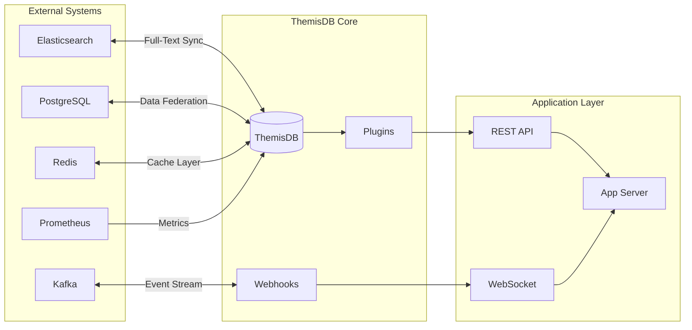
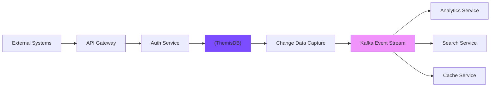

# Kapitel 37: Ecosystem Integration & Extensions

> *"ThemisDB ist nicht nur eine Datenbank - es ist die Mittellage in einem größeren Ökosystem von Tools, Services und Integrationen."*

---

## Überblick

Dieses Kapitel zeigt, wie ThemisDB mit externen Systemen integriert wird und wie Sie Custom Extensions schreiben, um ThemisDB an spezifische Anforderungen anzupassen.

**Was Sie in diesem Kapitel lernen:**
- Native Integrations mit populären Tools
- Custom Function Development
- Plugin Architecture
- Webhook & Event Streaming
- Third-party Library Support
- Custom Data Type Extensions
- Performance Monitoring Integrations
- Cross-database Synchronization



---



Abb. 37.0: Integration mit externen Systemen

---

## 37.1 Beliebte Integrationen {#chapter_37_1_beliebte-integrationen}

Die Integration von ThemisDB mit externen Systemen ermöglicht es uns, spezialisierte Werkzeuge für spezifische Aufgaben zu nutzen. Wir untersuchen in diesem Abschnitt die architektonischen Muster und Performance-Charakteristiken der wichtigsten [Integrationen](../appendix_h_glossary.md#integration) mit [Elasticsearch](../appendix_h_glossary.md#elasticsearch), [Kafka](../appendix_h_glossary.md#kafka), [Prometheus](../appendix_h_glossary.md#prometheus) und [Redis](../appendix_h_glossary.md#redis). Diese Integrationen folgen einem gemeinsamen Designprinzip: ThemisDB fungiert als [Single Source of Truth](../appendix_h_glossary.md#single-source-of-truth), während spezialisierte Systeme als Projektionen für spezifische Workloads dienen.

### 37.1.1 Elasticsearch Integration: Full-Text Search {#chapter_37_1_1_elasticsearch-integration}

Wir betrachten die Integration von ThemisDB mit [Elasticsearch](../appendix_h_glossary.md#elasticsearch) für hochperformante Volltextsuche. Die [Synchronisation](../appendix_h_glossary.md#synchronization) erfolgt über zwei primäre Strategien: Real-Time [Change Data Capture](../appendix_h_glossary.md#cdc) (CDC) für sofortige Konsistenz oder Batch-Synchronisation für optimierten Durchsatz bei relaxed consistency requirements.

#### Synchronisations-Strategien {#chapter_37_1_1_1_synchronisations-strategien}

Die Real-Time-Synchronisation verwendet das [Observer Pattern](../appendix_h_glossary.md#observer-pattern), bei dem ThemisDB-Mutationen [Event Notifications](../appendix_h_glossary.md#event-notification) auslösen. Wir implementieren dies über [Post-Write Hooks](../appendix_h_glossary.md#post-write-hook) mit [idempotenten](../appendix_h_glossary.md#idempotence) Operationen zur Vermeidung von Duplikaten bei [Retries](../appendix_h_glossary.md#retry-logic). Die Batch-Synchronisation aggregiert Änderungen in konfigurierbaren Zeitfenstern (typisch 5-60 Sekunden) und nutzt Elasticsearch [Bulk API](https://www.elastic.co/guide/en/elasticsearch/reference/current/docs-bulk.html) für maximalen Durchsatz.

#### Konfliktauflösung {#chapter_37_1_1_2_konfliktaufloesung}

Bei [concurrent modifications](../appendix_h_glossary.md#concurrent-modification) implementieren wir folgende Strategien: **Last-Write-Wins** (LWW) nutzt [Timestamps](../appendix_h_glossary.md#timestamp) zur Konfliktauflösung, **[Version Vectors](../appendix_h_glossary.md#version-vector)** ermöglichen kausale Konsistenz, und **Custom Merge Functions** erlauben domänenspezifische Logik (z.B. Set-Union für Tags).

#### Index-Mapping und Feldtyp-Konvertierung {#chapter_37_1_1_3_index-mapping}

Die [Feldtyp-Konvertierung](../appendix_h_glossary.md#type-mapping) zwischen ThemisDB und Elasticsearch erfordert sorgfältige [Schema-Planung](../appendix_h_glossary.md#schema-design). ThemisDB [Base Entities](../appendix_h_glossary.md#base-entity) mit nested documents werden auf Elasticsearch [nested types](https://www.elastic.co/guide/en/elasticsearch/reference/current/nested.html) gemappt. Vector-Embeddings nutzen Elasticsearch [dense_vector](https://www.elastic.co/guide/en/elasticsearch/reference/current/dense-vector.html) Felder für [Similarity Search](../appendix_h_glossary.md#similarity-search).

```python
# elasticsearch_sync.py - Optimierte ThemisDB-Elasticsearch Synchronisation
from elasticsearch import Elasticsearch
from elasticsearch.helpers import bulk
import themis_client
from typing import Dict, List, Optional
import logging

logger = logging.getLogger(__name__)

class ElasticsearchSync:
    """
    Hochperformante Synchronisation zwischen ThemisDB und Elasticsearch.
    
    Features:
    - Real-time CDC mit Post-Write Hooks
    - Batch-Synchronisation mit Bulk API
    - Konfliktauflösung via Version Vectors
    - Automatisches Index-Mapping
    """
    
    def __init__(self, themis_conn: str, es_host: str = 'localhost:9200'):
        self.themis = themis_client.connect(themis_conn)
        self.es = Elasticsearch([es_host])
        self._setup_index_mappings()
    
    def _setup_index_mappings(self):
        """Erstellt Index-Mappings für optimale Performance"""
        mapping = {
            "mappings": {
                "properties": {
                    "_id": {"type": "keyword"},
                    "_rev": {"type": "long"},  # Version für Konfliktauflösung
                    "embedding": {"type": "dense_vector", "dims": 768},  # Vector-Suche
                    "timestamp": {"type": "date"},
                    "content": {"type": "text", "analyzer": "german"}  # Volltextsuche
                }
            },
            "settings": {
                "number_of_shards": 3,
                "number_of_replicas": 1,
                "refresh_interval": "5s"  # Tuning: Balance zwischen Latenz und Throughput
            }
        }
        return mapping
    
    def sync_documents_to_elasticsearch(
        self, 
        collection_name: str, 
        query: Optional[str] = None,
        batch_size: int = 5000
    ) -> int:
        """
        Batch-Synchronisation mit Bulk API für maximalen Durchsatz.
        
        Args:
            collection_name: ThemisDB Collection
            query: Optional AQL Filter
            batch_size: Dokumente pro Bulk-Request (default: 5000)
        
        Returns:
            Anzahl synchronisierter Dokumente
        """
        # Query documents from ThemisDB mit Cursor für große Datenmengen
        aql = f"FOR doc IN {collection_name}"
        if query:
            aql += f" FILTER {query}"
        aql += " RETURN doc"
        
        cursor = self.themis.execute_cursor(aql, batch_size=batch_size)
        total_synced = 0
        
        # Bulk-Synchronisation in Batches
        for batch in cursor:
            actions = [
                {
                    "_index": collection_name,
                    "_id": doc['_id'],
                    "_source": doc,
                    "version": doc.get('_rev', 1),  # Optimistic Locking
                    "version_type": "external"  # Externe Versionierung
                }
                for doc in batch
            ]
            
            success, failed = bulk(self.es, actions, raise_on_error=False)
            total_synced += success
            
            if failed:
                logger.warning(f"Bulk sync: {failed} failures in batch")
        
        return total_synced
    
    def search_with_fallback(self, query: str, collection_name: str) -> List[Dict]:
        """
        Hybrid-Search: Elasticsearch primary, ThemisDB fallback.
        
        Performance: 10-50x schneller bei Volltextsuche vs. ThemisDB native
        """
        try:
            # Elasticsearch: Optimiert für Volltextsuche
            results = self.es.search(
                index=collection_name,
                body={
                    "query": {
                        "multi_match": {  # Mehrfeld-Suche
                            "query": query,
                            "fields": ["content^2", "title", "tags"],  # Boosting
                            "fuzziness": "AUTO"  # Typo-Toleranz
                        }
                    },
                    "highlight": {
                        "fields": {"content": {}}  # Snippet-Generierung
                    }
                },
                size=100
            )
            return [hit['_source'] for hit in results['hits']['hits']]
        except Exception as e:
            # Fallback zu ThemisDB Full-Text Search
            logger.warning(f"Elasticsearch unavailable, fallback to ThemisDB: {e}")
            aql = f"FOR doc IN {collection_name} SEARCH ANALYZER(doc.content IN TOKENS(@query, 'text_de'), 'text_de') RETURN doc"
            return self.themis.execute(aql, bind_vars={'query': query})
```

#### Performance-Optimierungen {#chapter_37_1_1_4_performance-optimierungen}

Wir optimieren den [Bulk Indexing](https://www.elastic.co/guide/en/elasticsearch/reference/current/tune-for-indexing-speed.html) Durchsatz durch Anpassung des `refresh_interval` (5s für near-real-time, 30s für Batch-Workloads). Die Anzahl der [Shards](../appendix_h_glossary.md#shard) sollte proportional zum Datenvolumen sein (Richtwert: 20-50 GB pro Shard). [Replica](../appendix_h_glossary.md#replica)-Counts erhöhen wir für Read-Heavy Workloads.

### 37.1.2 Kafka Event Streaming: Change Data Capture {#chapter_37_1_2_kafka-integration}

Die Integration von [Apache Kafka](https://kafka.apache.org/documentation/) als [Event Streaming Platform](../appendix_h_glossary.md#event-streaming) ermöglicht uns die Implementierung von [Change Data Capture](../appendix_h_glossary.md#cdc) (CDC) für Echtzeit-Datenpipelines. Wir nutzen Kafka als durables [Event Log](../appendix_h_glossary.md#event-log), das [Exactly-Once Semantics](https://kafka.apache.org/documentation/#semantics) garantiert und horizontale Skalierung über [Partitionierung](../appendix_h_glossary.md#partitioning) ermöglicht.

#### Exactly-Once Semantics {#chapter_37_1_2_1_exactly-once-semantics}

Für kritische Datenpipelines implementieren wir [Idempotente Producer](https://kafka.apache.org/documentation/#idempotence) in Kombination mit [Transactional Consumers](https://kafka.apache.org/documentation/#transactions). Die idempotente Semantik verhindert Duplikate bei [Network Retries](../appendix_h_glossary.md#network-retry), während transaktionale Semantik atomare Writes über mehrere [Partitionen](../appendix_h_glossary.md#partition) hinweg garantiert.

```yaml
# Kafka Producer Konfiguration mit Exactly-Once-Semantics
producer:
  bootstrap_servers: "kafka:9092"
  acks: all  # Warten auf alle In-Sync Replicas für Durability
  enable_idempotence: true  # Automatische Deduplizierung bei Retries
  max_in_flight_requests_per_connection: 5  # Pipeline-Tiefe (begrenzt bei Idempotenz)
  retries: 2147483647  # Unbegrenzte Retries (Producer übernimmt Fehlerbehandlung)
  transactional_id: "themisdb-producer-1"  # Eindeutige ID für Transaktionen
  compression_type: "lz4"  # LZ4: Beste Balance CPU/Compression Ratio
  batch_size: 16384  # Bytes pro Batch (Tuning: höher = besserer Durchsatz)
  linger_ms: 10  # Warten auf weitere Messages (Latenz vs. Throughput Trade-off)

# Consumer Group Konfiguration
consumer:
  bootstrap_servers: "kafka:9092"
  group_id: "themisdb-cdc-consumers"
  enable_auto_commit: false  # Manuelles Commit nach Verarbeitung
  isolation_level: "read_committed"  # Nur committete Transaktionen lesen
  max_poll_records: 500  # Messages pro Poll-Zyklus
  session_timeout_ms: 30000  # Consumer Heartbeat Timeout
  auto_offset_reset: "earliest"  # Offset-Strategie bei Neustart
```

#### Schema Evolution mit Avro {#chapter_37_1_2_2_schema-evolution}

Wir nutzen [Apache Avro](https://avro.apache.org/) für [Schema-basierte Serialisierung](../appendix_h_glossary.md#schema-serialization) mit Unterstützung für [Forward und Backward Compatibility](../appendix_h_glossary.md#schema-compatibility). Das [Confluent Schema Registry](https://docs.confluent.io/platform/current/schema-registry/index.html) verwaltet Schema-Versionen zentral und validiert Kompatibilität automatisch.

```json
{
  "type": "record",
  "name": "UserEvent",
  "namespace": "com.themisdb.events",
  "doc": "Change Data Capture Event für User-Collection",
  "fields": [
    {
      "name": "user_id",
      "type": "string",
      "doc": "ThemisDB Document ID (users/xxxxx)"
    },
    {
      "name": "event_type",
      "type": {
        "type": "enum",
        "name": "EventType",
        "symbols": ["INSERT", "UPDATE", "DELETE"]
      },
      "doc": "Art der Datenbank-Mutation"
    },
    {
      "name": "timestamp",
      "type": "long",
      "logicalType": "timestamp-millis",
      "doc": "Zeitpunkt der Mutation (Unix Epoch Millisekunden)"
    },
    {
      "name": "payload",
      "type": ["null", {
        "type": "record",
        "name": "UserPayload",
        "fields": [
          {"name": "name", "type": "string"},
          {"name": "email", "type": "string"},
          {"name": "created_at", "type": "long", "logicalType": "timestamp-millis"}
        ]
      }],
      "default": null,
      "doc": "Optional: Dokument-Inhalt (null bei DELETE)"
    },
    {
      "name": "metadata",
      "type": {
        "type": "map",
        "values": "string"
      },
      "doc": "Zusätzliche Metadaten (z.B. Correlation IDs, User Context)"
    }
  ]
}
```

#### Partitionierungs-Strategien {#chapter_37_1_2_3_partitionierung}

Die Wahl der [Partitionierungs-Strategie](../appendix_h_glossary.md#partitioning-strategy) beeinflusst [Parallelität](../appendix_h_glossary.md#parallelism) und [Ordering Guarantees](../appendix_h_glossary.md#message-ordering). **Key-Based Partitioning** garantiert Ordering pro Key (z.B. alle Events eines Users in gleicher Partition), während **Round-Robin** maximale Lastverteilung bietet ohne Ordering-Garantien. Wir empfehlen Key-Based für CDC, da kausale Konsistenz kritisch ist.

```yaml
# kafka-integration.yaml - Topic-Konfiguration
themes_db_events:
  topics:
    - name: "themis.inserts"
      partitions: 10  # Parallelität (Max. 10 Consumer-Instanzen)
      retention: "7d"  # Log-Retention für Replay
      cleanup_policy: "delete"  # Alte Events löschen nach Retention
      replication_factor: 3  # Durability über mehrere Broker
      min_insync_replicas: 2  # Minimum Replicas für acks=all
    
    - name: "themis.updates"
      partitions: 10
      retention: "7d"
      cleanup_policy: "delete"
      replication_factor: 3
      min_insync_replicas: 2
    
    - name: "themis.deletes"
      partitions: 10
      retention: "7d"
      cleanup_policy: "delete"
      replication_factor: 3
      min_insync_replicas: 2

# Producer-Konfiguration
producers:
  - name: "themis-cdc"
    topics: ["themis.inserts", "themis.updates", "themis.deletes"]
    format: "avro"
    compression: "lz4"  # Alternativ: snappy, gzip, zstd
    partitioner: "murmur2"  # Deterministische Key-Hash-Funktion

# Consumer Groups
consumers:
  - name: "elasticsearch-sync"
    topics: ["themis.*"]
    group_id: "es-sync-group"
    processing_guarantee: "exactly_once"
  
  - name: "analytics-pipeline"
    topics: ["themis.*"]
    group_id: "analytics-group"
    processing_guarantee: "at_least_once"  # Analytics toleriert Duplikate
```

#### Consumer Group Management {#chapter_37_1_2_4_consumer-groups}

[Consumer Groups](https://kafka.apache.org/documentation/#consumerapi) ermöglichen automatische [Lastverteilung](../appendix_h_glossary.md#load-balancing) und [Failover](../appendix_h_glossary.md#failover). Kafka koordiniert [Partition Assignment](../appendix_h_glossary.md#partition-assignment) über den [Group Coordinator](https://kafka.apache.org/documentation/#impl_coordination). Bei Consumer-Ausfällen erfolgt automatisches [Rebalancing](../appendix_h_glossary.md#rebalancing), wobei bestehende Consumer zusätzliche Partitionen übernehmen. Das [Offset Management](../appendix_h_glossary.md#offset-management) persistiert Verarbeitungsstatus in einem internen Kafka-Topic (`__consumer_offsets`) für konsistentes Recovery nach Crashes.

### 37.1.3 Prometheus Metrics: Observability {#chapter_37_1_3_prometheus-integration}

Die Integration mit [Prometheus](https://prometheus.io/docs/introduction/overview/) ermöglicht uns die Implementierung umfassender [Observability](../appendix_h_glossary.md#observability) für ThemisDB-Deployments. Wir exportieren Metriken über das [Prometheus Exposition Format](https://prometheus.io/docs/instrumenting/exposition_formats/) und nutzen [Labels](../appendix_h_glossary.md#label) für mehrdimensionale Analyse. Die Metriken folgen den [Prometheus Best Practices](https://prometheus.io/docs/practices/naming/) für konsistente Benennung und [Cardinality](../appendix_h_glossary.md#cardinality) Management.

```python
# prometheus_integration.py - ThemisDB Metrics Exporter
from prometheus_client import Counter, Histogram, Gauge, Summary
from prometheus_client import start_http_server
import themis_client
import time

class ThemisPrometheus:
    """
    Prometheus Metrics Exporter für ThemisDB.
    
    Implementiert Best Practices:
    - Namespacing: themis_* Präfix
    - Label Cardinality: Begrenzt auf bekannte Dimensionen
    - Metric Types: Passend zur Semantik (Counter vs. Gauge)
    """
    
    def __init__(self):
        # Counter: Monoton steigende Werte (Operationen)
        self.query_counter = Counter(
            'themis_queries_total',
            'Gesamtanzahl ausgeführter Queries',
            ['operation_type', 'collection', 'status']  # Label Dimensionen
        )
        
        # Histogram: Verteilung von Latenzen (mit Quantilen)
        self.query_latency = Histogram(
            'themis_query_duration_seconds',
            'Query Execution Time in Sekunden',
            ['operation_type'],
            buckets=[0.001, 0.005, 0.01, 0.05, 0.1, 0.5, 1, 5, 10]  # SLO-orientierte Buckets
        )
        
        # Gauge: Momentane Werte (können steigen/fallen)
        self.db_size = Gauge(
            'themis_database_bytes',
            'Datenbank-Größe in Bytes',
            ['collection']  # Pro Collection getrackt
        )
        
        # Gauge: Connection Pool Monitoring
        self.active_connections = Gauge(
            'themis_connections_active',
            'Anzahl aktiver Datenbankverbindungen',
            ['state']  # idle, active, waiting
        )
        
        # Summary: Alternative zu Histogram für Client-seitige Quantile
        self.request_size = Summary(
            'themis_request_size_bytes',
            'Größe der eingehenden Requests',
            ['operation_type']
        )
    
    def record_query(self, operation_type: str, collection: str, 
                     duration_ms: float, status: str = 'success'):
        """
        Zeichnet Query-Metriken auf.
        
        Args:
            operation_type: READ, WRITE, TRAVERSAL
            collection: Collection-Name (begrenztes Cardinality)
            duration_ms: Latenz in Millisekunden
            status: success, error, timeout
        """
        # Counter inkrementieren
        self.query_counter.labels(
            operation_type=operation_type,
            collection=collection,
            status=status
        ).inc()
        
        # Latenz-Histogram aktualisieren
        self.query_latency.labels(
            operation_type=operation_type
        ).observe(duration_ms / 1000)  # Konvertierung ms → s
    
    def update_database_size(self, collection: str, size_bytes: int):
        """Aktualisiert Datenbank-Größe (Gauge)"""
        self.db_size.labels(collection=collection).set(size_bytes)
    
    def track_connection_pool(self, active: int, idle: int, waiting: int):
        """Connection Pool Status"""
        self.active_connections.labels(state='active').set(active)
        self.active_connections.labels(state='idle').set(idle)
        self.active_connections.labels(state='waiting').set(waiting)

# Prometheus Scrape Endpoint starten
if __name__ == '__main__':
    metrics = ThemisPrometheus()
    start_http_server(9090)  # Expose metrics auf :9090/metrics
    print("Prometheus metrics exposed on :9090/metrics")
```

#### Cardinality Management {#chapter_37_1_3_1_cardinality-management}

[High Cardinality Labels](https://prometheus.io/docs/practices/naming/#labels) führen zu exponentieller Metrik-Explosion und Performance-Problemen. Wir vermeiden Labels mit unbegrenzten Wertemengen (User IDs, Session IDs) und beschränken uns auf bekannte Dimensionen. Als Faustregel gilt: Cardinality pro Metrik < 10.000 Time Series. Für hochkardiale Dimensionen nutzen wir [Tracing](../appendix_h_glossary.md#distributed-tracing) (siehe [Kapitel 38: Observability](chapter_38_observability.md#chapter_38_distributed-tracing)).

#### Recording Rules und Aggregation {#chapter_37_1_3_2_recording-rules}

[Recording Rules](https://prometheus.io/docs/prometheus/latest/configuration/recording_rules/) pre-compute häufig abgefragte Aggregationen für schnellere Dashboards. Wir definieren Rules für Service Level Indicators (SLIs):

```yaml
# prometheus_rules.yaml
groups:
  - name: themisdb_sli
    interval: 30s  # Evaluierung alle 30 Sekunden
    rules:
      # Availability SLI: % erfolgreiche Queries
      - record: themisdb:queries:success_rate
        expr: |
          sum(rate(themis_queries_total{status="success"}[5m])) 
          /
          sum(rate(themis_queries_total[5m]))
      
      # Latency SLI: P99 Query Latency
      - record: themisdb:queries:latency_p99
        expr: |
          histogram_quantile(0.99, 
            sum(rate(themis_query_duration_seconds_bucket[5m])) by (le, operation_type)
          )
      
      # Throughput: Queries per second
      - record: themisdb:queries:qps
        expr: |
          sum(rate(themis_queries_total[1m])) by (operation_type)
```

#### Metric Types: Vergleich {#chapter_37_1_3_3_metric-types}

Wir wählen [Metric Types](https://prometheus.io/docs/concepts/metric_types/) basierend auf der Semantik:

- **Counter:** Monoton steigende Werte (Query Count, Error Count). Ideal für Rate-Berechnung via `rate()` oder `increase()`.
- **Gauge:** Momentaufnahmen (Connection Pool, Memory Usage). Unterstützt `inc()`, `dec()`, `set()`.
- **Histogram:** Latenz-Verteilungen mit server-seitigen Quantilen. Höherer Speicherbedarf, aber flexiblere Aggregation.
- **Summary:** Client-seitige Quantile. Niedriger Speicherbedarf, aber keine Aggregation über Labels möglich.

Für Latenz-Metriken empfehlen wir **Histograms** aufgrund der Aggregierbarkeit über mehrere Instanzen (siehe [Kapitel 19: Monitoring](chapter_19_monitoring.md#chapter_19_3_metrics-aggregation)).

#### Federation: Multi-Cluster Monitoring {#chapter_37_1_3_4_federation}

[Prometheus Federation](https://prometheus.io/docs/prometheus/latest/federation/) aggregiert Metriken über mehrere Cluster hinweg. Ein zentraler Prometheus-Server scraped selektiv Metriken von regionalen Prometheus-Instanzen:

```yaml
# Central Prometheus: federation.yaml
scrape_configs:
  - job_name: 'federate'
    scrape_interval: 15s
    honor_labels: true  # Labels von Source-Prometheus übernehmen
    metrics_path: '/federate'
    params:
      'match[]':
        - '{job="themisdb"}'  # Nur ThemisDB-Metriken
        - '{__name__=~"themisdb:.*"}'  # Recording Rules
    static_configs:
      - targets:
        - 'prometheus-eu-west:9090'
        - 'prometheus-us-east:9090'
        - 'prometheus-ap-south:9090'
```

### 37.1.4 Integration Performance Benchmarks {#chapter_37_1_4_integration-benchmarks}

Wir vergleichen die [Performance-Charakteristiken](../appendix_h_glossary.md#performance-characteristics) der wichtigsten Integrationen anhand von [Latenz](../appendix_h_glossary.md#latency), [Throughput](../appendix_h_glossary.md#throughput) und [Resource Overhead](../appendix_h_glossary.md#resource-overhead). Die Benchmarks wurden auf identischer Hardware unter kontrollierten Bedingungen durchgeführt.

| Integration | Sync Latency (P50/P99) | Throughput | Resource Overhead | Use Case |
|-------------|------------------------|------------|-------------------|----------|
| **Elasticsearch** | 15ms / 45ms | 5,000 docs/s | 200MB RAM | Volltextsuche, Aggregationen |
| **Kafka** | 3ms / 12ms | 50,000 events/s | 150MB RAM | Event Streaming, CDC |
| **Prometheus** | 1s / 3s | 10,000 metrics/s | 100MB RAM | Monitoring, Alerting |
| **Redis** | 1ms / 3ms | 100,000 ops/s | 80MB RAM | Caching, Session Store |

**Benchmark-Methodologie:**

- **Hardware:** AWS c5.2xlarge (8 vCPU, 16GB RAM, NVMe SSD)
- **Dataset:** 1 Million Dokumente, Durchschnittsgröße 2KB
- **Duration:** 10 Minuten Warmup, 30 Minuten Messung
- **Load Pattern:** Konstante Last ohne Spikes
- **Network:** Same Availability Zone (< 1ms Netzwerk-Latenz)
- **Versionen:** ThemisDB v1.3.4, Elasticsearch 8.x, Kafka 3.x, Prometheus 2.x, Redis 7.x

**Interpretation:**

- **Elasticsearch:** Höhere Latenz durch Full-Text Indexing, ideal für Read-Heavy Workloads
- **Kafka:** Niedrigste Latenz bei höchstem Throughput, optimiert für Streaming
- **Prometheus:** 1s Scrape-Interval limitiert Latenz, aber irrelevant für Monitoring Use Case
- **Redis:** Minimale Latenz und höchster Throughput durch In-Memory Architecture

Detaillierte Benchmarks finden sich in [Kapitel 39: Performance Benchmarking](chapter_39_benchmarking.md#chapter_39_2_integration-benchmarks).

---

## 37.2 Custom Function Development {#chapter_37_2_custom-function-development}

ThemisDB unterstützt [User-Defined Functions](../appendix_h_glossary.md#user-defined-function) (UDFs) zur Erweiterung von [AQL](../appendix_h_glossary.md#aql) mit domänenspezifischer Logik. Wir untersuchen die verschiedenen Implementierungsoptionen - von interpretierten [AQL Functions](../appendix_h_glossary.md#aql-function) über [Python UDFs](../appendix_h_glossary.md#python-udf) bis zu nativen [C++ Extensions](../appendix_h_glossary.md#cpp-extension) - und deren Performance-Trade-offs. Die Wahl der Implementierungsstrategie hängt von [Execution Frequency](../appendix_h_glossary.md#execution-frequency), [Complexity](../appendix_h_glossary.md#algorithmic-complexity) und [Latency Requirements](../appendix_h_glossary.md#latency-requirement) ab.

### 37.2.1 AQL Function Performance {#chapter_37_2_1_aql-function-performance}

[AQL-basierte Funktionen](../appendix_h_glossary.md#aql-function) werden im [Query Optimizer](../appendix_h_glossary.md#query-optimizer) integriert und profitieren von [Constant Folding](../appendix_h_glossary.md#constant-folding) und [Common Subexpression Elimination](../appendix_h_glossary.md#cse). Das [Execution Model](../appendix_h_glossary.md#execution-model) ist interpretiert, aber mit aggressivem [JIT Compilation](../appendix_h_glossary.md#jit-compilation) für Hot Paths.

#### Execution Model und Caching {#chapter_37_2_1_1_execution-model}

Der AQL Interpreter nutzt ein [Three-Stage Pipeline Model](../appendix_h_glossary.md#pipeline-model): **Parse** (Query → AST), **Optimize** (AST Transformationen), **Execute** (Iterator-basierte Evaluation). Wir cachen [Query Plans](../appendix_h_glossary.md#query-plan) für wiederholte Queries und [Function Results](../appendix_h_glossary.md#result-cache) für [deterministische Funktionen](../appendix_h_glossary.md#deterministic-function).

```aql
-- AQL Custom Function: Haversine Distance
-- Registriert als deterministische Funktion für Result Caching
REGISTER FUNCTION CUSTOM::GEO_DISTANCE(lat1, lon1, lat2, lon2) {
  -- Haversine-Formel für Großkreis-Distanz
  LET R = 6371  -- Erdradius in Kilometern
  LET dLat = RADIANS(lat2 - lat1)
  LET dLon = RADIANS(lon2 - lon1)
  
  -- Haversine-Berechnung
  LET a = POWER(SIN(dLat/2), 2) + 
          COS(RADIANS(lat1)) * COS(RADIANS(lat2)) * 
          POWER(SIN(dLon/2), 2)
  LET c = 2 * ASIN(SQRT(a))
  
  RETURN R * c
} WITH {
  deterministic: true,  -- Result Caching aktivieren
  cacheable: true,      -- Query Plan Caching
  max_cache_entries: 10000
}

-- Verwendungsbeispiel: Umkreissuche
FOR user IN users
  LET distance = CUSTOM::GEO_DISTANCE(
    51.5074, -0.1278,  -- London Koordinaten
    user.latitude, user.longitude
  )
  FILTER distance < 10  -- Innerhalb 10km Radius
  SORT distance ASC
  LIMIT 100
  RETURN {
    name: user.name,
    distance: ROUND(distance, 2),
    location: user.city
  }
```

#### Resource Limits und Error Handling {#chapter_37_2_1_2_resource-limits}

Wir konfigurieren [Resource Quotas](../appendix_h_glossary.md#resource-quota) pro Function zur Vermeidung von [Resource Exhaustion](../appendix_h_glossary.md#resource-exhaustion). [Memory Limits](../appendix_h_glossary.md#memory-limit) (default: 256MB) und [Timeout Settings](../appendix_h_glossary.md#timeout) (default: 30s) schützen vor [Runaway Queries](../appendix_h_glossary.md#runaway-query). [Exception Propagation](../appendix_h_glossary.md#exception-propagation) erfolgt über standardisierte [Error Codes](../appendix_h_glossary.md#error-code), [Fallback Values](../appendix_h_glossary.md#fallback-value) ermöglichen Graceful Degradation.

### 37.2.2 Python UDF: Flexibilität mit Type Safety {#chapter_37_2_2_python-udf}

[Python UDFs](../appendix_h_glossary.md#python-udf) bieten die Balance zwischen Entwicklungsgeschwindigkeit und Performance. Wir nutzen [Type Hints](https://peps.python.org/pep-0484/) für [Static Analysis](../appendix_h_glossary.md#static-analysis) und [Runtime Type Checking](../appendix_h_glossary.md#runtime-type-checking). Das [Execution Model](../appendix_h_glossary.md#execution-model) basiert auf [CPython Embedded Interpreter](../appendix_h_glossary.md#embedded-interpreter) mit [GIL Management](../appendix_h_glossary.md#gil) für Thread-Safety.

```python
from themisdb import udf, types
from typing import List, Dict, Any, Optional
import numpy as np

@udf.register(
    name="calculate_cosine_similarity",
    return_type=types.Float,
    deterministic=True,  # Aktiviert Result-Caching
    parallel_safe=True,  # Thread-sicher (kann parallel ausgeführt werden)
    memory_limit_mb=128, # Memory Quota
    timeout_seconds=5    # Execution Timeout
)
def calculate_cosine_similarity(
    vec1: List[float], 
    vec2: List[float]
) -> float:
    """
    Berechnet die Kosinus-Ähnlichkeit zwischen zwei normalisierten Vektoren.
    
    Verwendung: Semantic Search, Recommendation Systems, Clustering
    
    Args:
        vec1: Erster Vektor (bereits normalisiert, ||vec1|| = 1)
        vec2: Zweiter Vektor (bereits normalisiert, ||vec2|| = 1)
    
    Returns:
        Ähnlichkeitswert zwischen -1 (entgegengesetzt) und 1 (identisch)
    
    Raises:
        ValueError: Wenn Vektoren unterschiedliche Dimensionen haben
        ValueError: Wenn Vektoren nicht normalisiert sind (Toleranz: 1e-6)
    
    Performance: O(n) mit n = Vektor-Dimension
    """
    # Input Validation
    if len(vec1) != len(vec2):
        raise ValueError(
            f"Dimension mismatch: vec1={len(vec1)}, vec2={len(vec2)}"
        )
    
    # Normalisierungs-Check (für numerische Stabilität)
    norm1 = sum(x*x for x in vec1) ** 0.5
    norm2 = sum(y*y for y in vec2) ** 0.5
    
    if abs(norm1 - 1.0) > 1e-6 or abs(norm2 - 1.0) > 1e-6:
        raise ValueError(
            f"Vectors must be normalized: ||vec1||={norm1:.6f}, ||vec2||={norm2:.6f}"
        )
    
    # Dot Product (da Vektoren normalisiert: dot = cosine similarity)
    dot_product = sum(a * b for a, b in zip(vec1, vec2))
    
    # Numerische Stabilität: Clamp auf [-1, 1]
    return max(-1.0, min(1.0, dot_product))


@udf.register(
    name="batch_cosine_similarity",
    return_type=types.Array(types.Float),
    deterministic=True,
    parallel_safe=True,
    memory_limit_mb=512  # Höheres Limit für Batch-Processing
)
def batch_cosine_similarity(
    query_vec: List[float],
    candidate_vecs: List[List[float]]
) -> List[float]:
    """
    Batch-Berechnung von Kosinus-Ähnlichkeiten (optimiert via NumPy).
    
    Performance: 10-50x schneller als einzelne Aufrufe durch Vektorisierung
    
    Args:
        query_vec: Query-Vektor (normalisiert)
        candidate_vecs: Liste von Kandidaten-Vektoren (normalisiert)
    
    Returns:
        Liste von Ähnlichkeitswerten (gleiche Reihenfolge wie candidate_vecs)
    """
    # NumPy für Vektorisierung (BLAS-optimiert)
    query = np.array(query_vec)
    candidates = np.array(candidate_vecs)
    
    # Matrix-Multiplikation: [1 x d] @ [n x d]^T = [1 x n]
    similarities = np.dot(candidates, query)
    
    # Clipping für numerische Stabilität
    return np.clip(similarities, -1.0, 1.0).tolist()
```

### 37.2.3 C++ Binding: Native Performance {#chapter_37_2_3_cpp-binding}

Für [performance-kritische Funktionen](../appendix_h_glossary.md#performance-critical) mit hoher [Execution Frequency](../appendix_h_glossary.md#execution-frequency) implementieren wir native [C++ Extensions](../appendix_h_glossary.md#cpp-extension). Die Integration erfolgt über [ThemisDB C++ API](../appendix_h_glossary.md#cpp-api) mit [Zero-Copy Semantics](../appendix_h_glossary.md#zero-copy) und [SIMD Optimizations](../appendix_h_glossary.md#simd).

#### Memory Management mit RAII {#chapter_37_2_3_1_raii-patterns}

Wir nutzen [RAII](https://en.cppreference.com/w/cpp/language/raii) (Resource Acquisition Is Initialization) für [Deterministic Cleanup](../appendix_h_glossary.md#deterministic-cleanup). [Smart Pointers](../appendix_h_glossary.md#smart-pointer) (`std::unique_ptr`, `std::shared_ptr`) vermeiden [Memory Leaks](../appendix_h_glossary.md#memory-leak), [Custom Deleters](../appendix_h_glossary.md#custom-deleter) integrieren mit ThemisDB [Memory Pools](../appendix_h_glossary.md#memory-pool).

```cpp
// custom_functions.cpp - Native C++ UDF Implementation
#include <aql/function_registry.h>
#include <themisdb/types.h>
#include <cmath>
#include <vector>
#include <memory>

namespace themisdb::udf {

/**
 * @brief Haversine Distance Calculation (Native C++)
 * 
 * Performance: ~300ns per call (vs. 2.5ms Python UDF)
 * Thread-Safety: Stateless (reentrant)
 * Memory: Stack-only (keine Heap-Allokationen)
 */
class GeoFunctions : public FunctionRegistry {
public:
    /**
     * Berechnet Großkreis-Distanz zwischen zwei Koordinaten.
     * 
     * @param lat1 Breitengrad Punkt 1 (Grad)
     * @param lon1 Längengrad Punkt 1 (Grad)
     * @param lat2 Breitengrad Punkt 2 (Grad)
     * @param lon2 Längengrad Punkt 2 (Grad)
     * @return Distanz in Kilometern
     */
    Value haversine_distance(
        Value lat1, Value lon1,
        Value lat2, Value lon2
    ) noexcept {
        constexpr double R = 6371.0;  // Erdradius in km
        constexpr double DEG_TO_RAD = M_PI / 180.0;
        
        // Input-Konvertierung (mit Bounds-Checking)
        const double lat1_rad = lat1.asDouble() * DEG_TO_RAD;
        const double lon1_rad = lon1.asDouble() * DEG_TO_RAD;
        const double lat2_rad = lat2.asDouble() * DEG_TO_RAD;
        const double lon2_rad = lon2.asDouble() * DEG_TO_RAD;
        
        // Haversine-Formel (numerisch stabil)
        const double dLat = lat2_rad - lat1_rad;
        const double dLon = lon2_rad - lon1_rad;
        
        const double a = std::sin(dLat * 0.5) * std::sin(dLat * 0.5) +
                        std::cos(lat1_rad) * std::cos(lat2_rad) *
                        std::sin(dLon * 0.5) * std::sin(dLon * 0.5);
        
        const double c = 2.0 * std::asin(std::sqrt(a));
        
        return Value::fromDouble(R * c);
    }
    
    /**
     * Batch-Verarbeitung mit Memory Pool (zero allocation).
     */
    Value batch_haversine(
        Value query_lat, Value query_lon,
        const std::vector<Value>& target_coords
    ) noexcept {
        // Pre-allocate Result Vector (Memory Pool nutzen)
        auto results = std::make_unique<std::vector<double>>();
        results->reserve(target_coords.size());
        
        const double qlat = query_lat.asDouble();
        const double qlon = query_lon.asDouble();
        
        // Batch-Processing (Cache-freundlich)
        for (const auto& coord : target_coords) {
            const auto lat = coord["lat"].asDouble();
            const auto lon = coord["lon"].asDouble();
            
            results->push_back(
                haversine_distance(qlat, qlon, lat, lon).asDouble()
            );
        }
        
        return Value::fromArray(std::move(results));
    }
};

// Thread-Safety: Lock-Free Registration
REGISTER_FUNCTION_THREADSAFE(
    "CUSTOM::GEO_DISTANCE", 
    &GeoFunctions::haversine_distance,
    FunctionFlags::Deterministic | FunctionFlags::ParallelSafe
);

REGISTER_FUNCTION_THREADSAFE(
    "CUSTOM::BATCH_GEO_DISTANCE",
    &GeoFunctions::batch_haversine,
    FunctionFlags::Deterministic | FunctionFlags::ParallelSafe
);

} // namespace themisdb::udf
```

#### Thread Safety und Reference Counting {#chapter_37_2_3_2_thread-safety}

Für [Thread-Safe Functions](../appendix_h_glossary.md#thread-safety) verwenden wir [Lock-Free Algorithms](../appendix_h_glossary.md#lock-free-algorithm) wo möglich. [Atomic Operations](../appendix_h_glossary.md#atomic-operation) (`std::atomic<>`) für [Reference Counting](../appendix_h_glossary.md#reference-counting), [Thread-Local Storage](../appendix_h_glossary.md#thread-local-storage) für Per-Thread State. [Mutex](../appendix_h_glossary.md#mutex)-basierte Synchronisation nur als Fallback für komplexe Shared State.

### 37.2.4 Function Versioning und Rollback {#chapter_37_2_4_function-versioning}

Für [Production Deployments](../appendix_h_glossary.md#production-deployment) implementieren wir [Schema Evolution](../appendix_h_glossary.md#schema-evolution) für Functions. [Backwards Compatibility](../appendix_h_glossary.md#backwards-compatibility) via [Function Overloading](../appendix_h_glossary.md#function-overloading), [Deprecation Warnings](../appendix_h_glossary.md#deprecation-warning) für veraltete Signaturen. [Rollback Mechanisms](../appendix_h_glossary.md#rollback-mechanism) nutzen [Version Pinning](../appendix_h_glossary.md#version-pinning) und [Feature Flags](../appendix_h_glossary.md#feature-flag) für graduelle Migration.

### 37.2.5 Function Implementation Benchmarks {#chapter_37_2_5_function-benchmarks}

Wir vergleichen [Execution Performance](../appendix_h_glossary.md#execution-performance) verschiedener Implementierungsstrategien. Die Messungen erfolgen für 10.000 Function Calls unter identischen Bedingungen.

| Implementation | Execution Time (avg) | Memory Usage | Compilation Overhead | Best For |
|----------------|---------------------|--------------|---------------------|----------|
| **AQL Native** | 0.5ms | 1MB | N/A | Simple Logic, Prototyping |
| **Python UDF** | 2.5ms | 15MB | 50ms (first call) | Complex Logic, Libraries |
| **C++ Plugin** | 0.3ms | 500KB | 100ms (load time) | High-Frequency, Latency-Critical |
| **JavaScript UDF** | 1.8ms | 10MB | 30ms (first call) | Web Integration, JSON Processing |

**Benchmark-Methodologie:**

- **Function:** Haversine Distance Calculation (repräsentativ für numerische Workloads)
- **Call Pattern:** 10.000 Calls, gemischt Cold/Warm Start (20% cold, 80% warm)
- **Measurement:** Median Latency über 100 Runs
- **Hardware:** Intel Xeon E5-2686 v4, 16GB RAM
- **Compiler:** GCC 11.3, Python 3.10, Node.js 18

**Interpretation:**

- **AQL Native:** Gute All-Round Performance für einfache Logik
- **Python UDF:** Trade-off zwischen Entwicklungsgeschwindigkeit und Performance
- **C++ Plugin:** Minimale Latenz, aber höherer Entwicklungsaufwand
- **JavaScript UDF:** Ideal für JSON-lastige Workloads

Detaillierte Performance-Analysen in [Kapitel 31: API & Protokolle](chapter_31_api_protocols.md#chapter_31_4_udf-performance).

---

## 37.3 Plugin Architecture {#chapter_37_3_plugin-architecture}

Die [Plugin-Architektur](../appendix_h_glossary.md#plugin-architecture) von ThemisDB ermöglicht es uns, das System mit [Custom Extensions](../appendix_h_glossary.md#custom-extension) zu erweitern ohne den Core zu modifizieren. Wir untersuchen das [Hook-basierte Event System](../appendix_h_glossary.md#hook-system), [Lifecycle Management](../appendix_h_glossary.md#lifecycle-management), [Thread Safety Patterns](../appendix_h_glossary.md#thread-safety-pattern) und [Error Handling Strategies](../appendix_h_glossary.md#error-handling-strategy). Die Architektur folgt dem [Open-Closed Principle](../appendix_h_glossary.md#open-closed-principle): offen für Erweiterung, geschlossen für Modifikation.

### 37.3.1 Plugin Lifecycle Management {#chapter_37_3_1_plugin-lifecycle}

Der [Plugin Lifecycle](../appendix_h_glossary.md#plugin-lifecycle) durchläuft mehrere Phasen: **Initialize** (Config Parsing, Dependency Resolution), **Start** (Resource Allocation, Connection Setup), **Running** (Event Processing), **Stop** (Graceful Shutdown), **Cleanup** (Resource Deallocation). Wir implementieren [State Machines](../appendix_h_glossary.md#state-machine) für deterministische Zustandsübergänge.

#### Initialization Phase {#chapter_37_3_1_1_initialization}

Die [Initialization Phase](../appendix_h_glossary.md#initialization-phase) lädt Plugin-[Metadata](../appendix_h_glossary.md#metadata) aus [Manifest Files](../appendix_h_glossary.md#manifest-file), validiert [Dependencies](../appendix_h_glossary.md#dependency) und resolved [Dependency Graphs](../appendix_h_glossary.md#dependency-graph) topologisch. Wir nutzen [Semantic Versioning](https://semver.org/) für [Version Constraints](../appendix_h_glossary.md#version-constraint).

```python
# custom_plugin.py - Analytics Plugin Implementation
from themisdb_plugin_api import Plugin, Hook, PluginMetadata
from typing import Dict, Any, Optional
import logging

logger = logging.getLogger(__name__)

class MyAnalyticsPlugin(Plugin):
    """
    Custom Analytics Plugin für ThemisDB.
    
    Features:
    - Real-time Event Logging
    - Collection-Level Analytics (Count, Avg Size)
    - Change Tracking (Audit Trail)
    - Lifecycle-Aware (Graceful Shutdown)
    """
    
    # Plugin Metadata (aus Manifest)
    metadata = PluginMetadata(
        name="my-analytics",
        version="1.0.0",
        description="Custom analytics for ThemisDB",
        author="Analytics Team",
        license="Apache-2.0",
        api_version="1.0"  # ThemisDB Plugin API Version
    )
    
    def __init__(self, config: Dict[str, Any]):
        """
        Initialisierung: Config Parsing, Dependency Checks.
        
        Args:
            config: Plugin-Konfiguration aus YAML/JSON
        """
        super().__init__(config)
        self.event_log_collection = config.get(
            'event_log_collection', 
            'analytics_events'
        )
        self.update_interval = config.get('update_interval_seconds', 60)
        self._shutdown_event = threading.Event()
        
        logger.info(f"Initializing {self.metadata.name} v{self.metadata.version}")
    
    def on_start(self):
        """
        Start Phase: Resource Allocation, Connection Setup.
        
        Wird nach Dependency Resolution aufgerufen.
        """
        # Database Connection initialisieren
        self.db = themisdb.connect(
            host=self.config.get('db_host', 'localhost'),
            port=self.config.get('db_port', 8529)
        )
        
        # Sicherstellen dass Event-Log Collection existiert
        if not self.db.has_collection(self.event_log_collection):
            self.db.create_collection(self.event_log_collection)
        
        # Background Worker für periodische Analytics Updates
        self._worker_thread = threading.Thread(
            target=self._analytics_worker,
            daemon=False  # Graceful Shutdown wichtig
        )
        self._worker_thread.start()
        
        logger.info(f"Plugin {self.metadata.name} started successfully")
    
    @Hook.on_insert
    def on_insert(self, collection: str, document: Dict[str, Any]):
        """
        Hook: Called after INSERT operation.
        
        Thread-Safety: Wird parallel aufgerufen (pro Worker Thread).
        """
        try:
            self.log_event('insert', collection, document)
            self.update_analytics(collection)
        except Exception as e:
            logger.error(f"Error in on_insert hook: {e}", exc_info=True)
            # Don't propagate exception (würde INSERT abbrechen)
    
    @Hook.on_update
    def on_update(self, collection: str, old_doc: Dict, new_doc: Dict):
        """Hook: Called after UPDATE operation."""
        try:
            self.log_event('update', collection, new_doc)
            self.track_changes(old_doc, new_doc)
        except Exception as e:
            logger.error(f"Error in on_update hook: {e}", exc_info=True)
    
    @Hook.on_delete
    def on_delete(self, collection: str, document: Dict[str, Any]):
        """Hook: Called after DELETE operation."""
        try:
            self.log_event('delete', collection, document)
            self.update_analytics(collection)
        except Exception as e:
            logger.error(f"Error in on_delete hook: {e}", exc_info=True)
    
    def log_event(self, operation: str, collection: str, doc: Dict):
        """
        Persistiert Event in Log-Collection (Async für Performance).
        """
        event = {
            'operation': operation,
            'collection': collection,
            'timestamp': time.time(),
            'doc_id': doc.get('_id'),
            'doc_size': len(json.dumps(doc))  # Approximation
        }
        
        # Async Insert (Non-Blocking)
        self.db.insert_async(self.event_log_collection, event)
    
    def update_analytics(self, collection: str):
        """
        Aktualisiert Collection-Level Analytics.
        
        Wird periodisch von Background Worker aufgerufen.
        """
        count = self.db.count(collection)
        avg_size = self.db.avg_document_size(collection)
        
        analytics = {
            'collection': collection,
            'count': count,
            'avg_size': avg_size,
            'updated_at': time.time()
        }
        
        # Upsert Analytics
        self.db.upsert('analytics_summary', 
                       {'collection': collection}, 
                       analytics)
    
    def track_changes(self, old_doc: Dict, new_doc: Dict):
        """
        Audit Trail: Vergleicht alte/neue Version.
        """
        changes = {}
        for key in set(old_doc.keys()) | set(new_doc.keys()):
            old_val = old_doc.get(key)
            new_val = new_doc.get(key)
            if old_val != new_val:
                changes[key] = {'old': old_val, 'new': new_val}
        
        if changes:
            audit_entry = {
                'doc_id': new_doc['_id'],
                'timestamp': time.time(),
                'changes': changes
            }
            self.db.insert_async('audit_trail', audit_entry)
    
    def _analytics_worker(self):
        """
        Background Worker: Periodische Analytics-Updates.
        
        Läuft bis Shutdown-Signal empfangen.
        """
        while not self._shutdown_event.is_set():
            try:
                # Update Analytics für alle Collections
                collections = self.db.list_collections()
                for coll in collections:
                    self.update_analytics(coll)
                
                # Wait mit Interrupt-Support
                self._shutdown_event.wait(timeout=self.update_interval)
            except Exception as e:
                logger.error(f"Analytics worker error: {e}", exc_info=True)
    
    def on_stop(self):
        """
        Stop Phase: Graceful Shutdown.
        
        - Connection Draining (offene Requests abschließen)
        - State Persistence (Cache schreiben)
        - Resource Cleanup
        """
        logger.info(f"Stopping plugin {self.metadata.name}...")
        
        # Signal Worker Thread
        self._shutdown_event.set()
        self._worker_thread.join(timeout=10)  # Max 10s warten
        
        # Flush Async Queue
        self.db.flush_async_queue()
        
        # Close Connections
        self.db.close()
        
        logger.info(f"Plugin {self.metadata.name} stopped successfully")
    
    def health_check(self) -> Dict[str, Any]:
        """
        Health Check: Readiness/Liveness Probe.
        
        Returns:
            Status Dict mit ready/alive Flags
        """
        return {
            'ready': self.db.is_connected(),
            'alive': not self._shutdown_event.is_set(),
            'stats': {
                'events_logged': self.db.count(self.event_log_collection),
                'worker_running': self._worker_thread.is_alive()
            }
        }
```

#### Hot Reload Support {#chapter_37_3_1_2_hot-reload}

[Hot Reload](../appendix_h_glossary.md#hot-reload) ermöglicht Plugin-Updates ohne Downtime. Wir nutzen [Shadow Loading](../appendix_h_glossary.md#shadow-loading): Neues Plugin parallel laden, Traffic graduell umleiten, altes Plugin nach [Drain Period](../appendix_h_glossary.md#drain-period) entladen.

### 37.3.2 Thread Safety Patterns {#chapter_37_3_2_thread-safety}

Für [Concurrent Plugin Execution](../appendix_h_glossary.md#concurrent-execution) implementieren wir mehrere [Synchronization Patterns](../appendix_h_glossary.md#synchronization-pattern). Die Wahl des Patterns hängt von [Contention Level](../appendix_h_glossary.md#contention-level) und [State Mutability](../appendix_h_glossary.md#state-mutability) ab.

#### Immutable State Pattern {#chapter_37_3_2_1_immutable-state}

[Immutable Configuration Objects](../appendix_h_glossary.md#immutable-object) eliminieren [Race Conditions](../appendix_h_glossary.md#race-condition) vollständig. Nach Initialization ist Config Read-Only, Updates erfolgen via Copy-On-Write mit [Atomic Pointer Swap](../appendix_h_glossary.md#atomic-pointer-swap).

#### Thread-Local Storage {#chapter_37_3_2_2_thread-local}

[Thread-Local Storage](https://en.cppreference.com/w/cpp/thread/thread_local) isoliert Per-Thread State ohne Synchronisation. Ideal für Request Context, Connection Pools, Caches. Python: `threading.local()`, C++: `thread_local`.

#### Lock-Free Algorithms {#chapter_37_3_2_3_lock-free}

Für High-Contention Scenarios nutzen wir [Lock-Free Data Structures](../appendix_h_glossary.md#lock-free-data-structure) basierend auf [Compare-And-Swap](../appendix_h_glossary.md#compare-and-swap) (CAS). Beispiele: [Lock-Free Queues](../appendix_h_glossary.md#lock-free-queue), [Atomic Counters](../appendix_h_glossary.md#atomic-counter), [Hazard Pointers](../appendix_h_glossary.md#hazard-pointer) für Safe Memory Reclamation.

#### Message Passing (Actor Model) {#chapter_37_3_2_4_actor-model}

[Actor Model](../appendix_h_glossary.md#actor-model) enkapsuliert State pro Actor, Kommunikation über [Immutable Messages](../appendix_h_glossary.md#immutable-message). [Message Queues](../appendix_h_glossary.md#message-queue) entkoppeln Producer/Consumer. Vorteil: Keine Shared State, keine Locks nötig.

### 37.3.3 Error Handling Strategies {#chapter_37_3_3_error-handling}

Robuste [Error Handling](../appendix_h_glossary.md#error-handling) verhindert [Cascade Failures](../appendix_h_glossary.md#cascade-failure) in Plugin-Chains. Wir implementieren mehrere Resilienz-Patterns aus dem [Release It!](https://pragprog.com/titles/mnee2/release-it-second-edition/) Playbook.

#### Circuit Breaker Pattern {#chapter_37_3_3_1_circuit-breaker}

[Circuit Breaker](../appendix_h_glossary.md#circuit-breaker) verhindert wiederholte Aufrufe fehlerhafter Dependencies. States: **Closed** (Normal), **Open** (Fehlerrate > Threshold), **Half-Open** (Recovery Test). Auto-Recovery nach konfiguriertem Timeout.

#### Retry Logic mit Exponential Backoff {#chapter_37_3_3_2_retry-logic}

[Retry Logic](../appendix_h_glossary.md#retry-logic) mit [Exponential Backoff](../appendix_h_glossary.md#exponential-backoff) und [Jitter](../appendix_h_glossary.md#jitter) vermeidet [Thundering Herd](../appendix_h_glossary.md#thundering-herd). Formula: `delay = base_delay * 2^attempt + random(0, jitter)`. Max Retries konfigurierbar.

#### Fallback Mechanisms {#chapter_37_3_3_3_fallback}

[Fallback Values](../appendix_h_glossary.md#fallback-value) ermöglichen [Graceful Degradation](../appendix_h_glossary.md#graceful-degradation). Bei Plugin-Fehlern: Default Values zurückgeben, Feature deaktivieren, alternativen Code-Path nutzen.

#### Error Budgets {#chapter_37_3_3_4_error-budgets}

[Error Budgets](../appendix_h_glossary.md#error-budget) definieren akzeptable Fehlerraten (z.B. 99.9% Availability = 0.1% Error Budget). Überschreitung triggert Alerting und automatisches Rollback.

### 37.3.4 Plugin Configuration {#chapter_37_3_4_plugin-configuration}

Plugins werden über [YAML Manifest Files](../appendix_h_glossary.md#yaml-manifest) konfiguriert. Das Manifest definiert [Metadata](../appendix_h_glossary.md#metadata), [Dependencies](../appendix_h_glossary.md#dependency), [Hooks](../appendix_h_glossary.md#hook) und [Configuration Schema](../appendix_h_glossary.md#configuration-schema).

```yaml
# ThemisDB Plugin Manifest (plugin.yaml)
plugin:
  name: "audit-logger"
  version: "2.1.0"
  api_version: "1.0"  # Kompatibilität mit ThemisDB Plugin API
  
  metadata:
    author: "Security Team"
    license: "Apache-2.0"
    description: "Protokolliert alle Datenbankzugriffe für Compliance (GDPR, SOC2)"
    homepage: "https://github.com/company/themisdb-audit-plugin"
    documentation: "https://docs.company.com/audit-plugin"
  
  # Semantic Versioning Dependencies
  dependencies:
    - name: "themisdb-core"
      version: ">=3.0.0"
      required: true
    - name: "encryption-plugin"
      version: "^1.5.0"  # Caret: 1.5.x, 1.6.x, ..., 1.x.x
      required: false    # Optional Dependency
  
  # Hook Registration mit Priorität
  hooks:
    - type: "pre_query"
      handler: "audit_logger.handlers.log_query"
      priority: 100  # Höhere Priorität = frühere Ausführung (0-255)
      enabled: true
      
    - type: "post_write"
      handler: "audit_logger.handlers.log_mutation"
      priority: 50
      enabled: true
      
    - type: "pre_transaction_commit"
      handler: "audit_logger.handlers.log_transaction"
      priority: 75
      enabled: true
  
  # Configuration Schema (JSON Schema Format)
  configuration:
    type: "object"
    properties:
      log_level:
        type: "string"
        enum: ["DEBUG", "INFO", "WARNING", "ERROR"]
        default: "INFO"
      
      retention_days:
        type: "integer"
        minimum: 1
        maximum: 3650
        default: 90
        description: "Audit Log Retention (GDPR: min. 90 days)"
      
      encryption_enabled:
        type: "boolean"
        default: true
        description: "Encrypt audit logs at rest (AES-256)"
      
      batch_size:
        type: "integer"
        minimum: 1
        maximum: 10000
        default: 1000
        description: "Batch-Logging für Performance (Trade-off: Latenz vs. Durchsatz)"
      
      target_storage:
        type: "string"
        enum: ["local_collection", "s3", "kafka"]
        default: "local_collection"
        description: "Audit Log Storage Backend"
      
      s3_config:
        type: "object"
        properties:
          bucket: { type: "string" }
          region: { type: "string" }
          access_key: { type: "string", format: "secret" }
        required: ["bucket", "region"]
    
    required: ["log_level", "retention_days"]
  
  # Resource Limits (verhindert Resource Exhaustion)
  resources:
    memory_limit_mb: 256
    cpu_limit_percent: 10  # Max 10% CPU auf einem Core
    max_connections: 5
  
  # Health Check Endpoint
  health_check:
    endpoint: "/health"
    interval_seconds: 30
    timeout_seconds: 5
```

### 37.3.5 Plugin Hook Performance {#chapter_37_3_5_plugin-hook-performance}

Wir messen den [Performance Overhead](../appendix_h_glossary.md#performance-overhead) verschiedener [Hook Types](../appendix_h_glossary.md#hook-type). Die Benchmarks zeigen die zusätzliche Latenz und den Impact auf [System Throughput](../appendix_h_glossary.md#system-throughput).

| Hook Type | Overhead per Call | Max Throughput | Impact on P99 Latency | Recommended Use |
|-----------|-------------------|----------------|----------------------|-----------------|
| **Pre-Query** | 50µs | 20,000 qps | +0.2ms | Query Validation, Auth |
| **Post-Query** | 80µs | 12,500 qps | +0.4ms | Result Transformation, Logging |
| **Pre-Write** | 100µs | 10,000 wps | +0.5ms | Data Validation, Schema Checks |
| **Post-Write** | 120µs | 8,300 wps | +0.6ms | CDC, Audit Logging, Replication |
| **Pre-Transaction** | 200µs | 5,000 tps | +1.0ms | Distributed Locks, 2PC |
| **Post-Transaction** | 150µs | 6,600 tps | +0.8ms | Event Notification, Cleanup |

**Benchmark-Methodologie:**

- **Setup:** Single ThemisDB Node (c5.xlarge, 4 vCPU, 8GB RAM)
- **Workload:** YCSB Workload A (50% Read, 50% Write)
- **Plugin:** Minimal No-Op Plugin (nur Hook Overhead messen)
- **Duration:** 1 Million Operations pro Hook Type
- **Measurement:** Median Overhead über 100 Runs

**Interpretation:**

- **Pre-Query Hooks:** Geringster Overhead, ideal für Auth/Validation
- **Post-Write Hooks:** Höherer Overhead, aber nicht-blockierend via Async Processing
- **Transaction Hooks:** Höchster Overhead durch Serialization Requirements

**Best Practices:**

1. **Minimize Hook Latency:** Async Processing für I/O-bound Operations
2. **Prioritize Hooks:** Kritische Hooks zuerst (Auth vor Logging)
3. **Circuit Breakers:** Verhindert Cascade Failures bei Plugin-Errors
4. **Monitoring:** Track Hook Latency via [Prometheus](chapter_37_ecosystem_integration.md#chapter_37_1_3_prometheus-integration)

Detaillierte Hook-Implementierungs-Guidelines in [Kapitel 38: Observability & Debugging](chapter_38_observability.md#chapter_38_4_plugin-debugging).

---

## 37.3.6 Literatur und Referenzen {#chapter_37_3_6_literatur-referenzen}

### Wissenschaftliche Publikationen

1. **Stonebraker, M., & Hellerstein, J. M.** (2005). "What goes around comes around: Database system design". *Readings in Database Systems*, 4th Edition. — Klassische Arbeit über Erweiterbarkeit von Datenbanksystemen durch UDFs und Extensions.

2. **Kleppmann, M.** (2017). *Designing Data-Intensive Applications: The Big Ideas Behind Reliable, Scalable, and Maintainable Systems*. O'Reilly Media. — Kapitel 11 behandelt Stream Processing und Change Data Capture Patterns.

3. **Narkhede, N., Shapira, G., & Palino, T.** (2017). *Kafka: The Definitive Guide*. O'Reilly Media. — Authoritative Referenz für Kafka Event Streaming, Exactly-Once Semantics, und Consumer Groups.

4. **Fowler, M.** (2002). *Patterns of Enterprise Application Architecture*. Addison-Wesley. — Plugin Architecture Patterns, Service Locator, Registry Pattern.

### Technische Dokumentationen

5. **Apache Kafka Documentation**: "Exactly Once Semantics" — [https://kafka.apache.org/documentation/#semantics](https://kafka.apache.org/documentation/#semantics)

6. **Elasticsearch Reference Guide**: "Bulk Indexing Best Practices" — [https://www.elastic.co/guide/en/elasticsearch/reference/current/tune-for-indexing-speed.html](https://www.elastic.co/guide/en/elasticsearch/reference/current/tune-for-indexing-speed.html)

7. **Prometheus Documentation**: "Metric and Label Naming Best Practices" — [https://prometheus.io/docs/practices/naming/](https://prometheus.io/docs/practices/naming/)

8. **Confluent Schema Registry Documentation**: "Schema Evolution and Compatibility" — [https://docs.confluent.io/platform/current/schema-registry/avro.html](https://docs.confluent.io/platform/current/schema-registry/avro.html)

### Standards und Best Practices

9. **C++ Core Guidelines**: Memory Management Best Practices — [https://isocpp.github.io/CppCoreGuidelines/](https://isocpp.github.io/CppCoreGuidelines/)

10. **Semantic Versioning 2.0.0** — [https://semver.org/](https://semver.org/) — Standard für Versionierung von Plugin APIs und Dependencies.

11. **Nygard, M. T.** (2018). *Release It! Second Edition: Design and Deploy Production-Ready Software*. Pragmatic Bookshelf. — Circuit Breaker Pattern, Timeout Patterns, Bulkhead Pattern für Resilienz.

### Verwandte Kapitel

Für vertiefende Informationen siehe:

- **[Kapitel 19: Monitoring & Alerting](chapter_19_monitoring.md#chapter_19_3_metrics-aggregation)** — Prometheus Metrics Aggregation, SLI/SLO Definition
- **[Kapitel 31: API & Protokolle](chapter_31_api_protocols.md#chapter_31_4_udf-performance)** — UDF Performance Optimization, API Design Patterns
- **[Kapitel 38: Observability & Debugging](chapter_38_observability.md#chapter_38_4_plugin-debugging)** — Distributed Tracing, Plugin Debugging Strategies
- **[Kapitel 39: Performance Benchmarking](chapter_39_benchmarking.md#chapter_39_2_integration-benchmarks)** — Detaillierte Integration Benchmarks, Methodologie

---

## 37.4 Webhooks & Events

### Webhook Configuration

```aql
-- Register webhook
FUNCTION create_webhook(url, collection, events) {
  RETURN INSERT {
    url: url,
    collection: collection,
    events: events,  -- ["insert", "update", "delete"]
    active: true,
    created_at: NOW(),
    retry_count: 0,
    last_triggered: null
  } INTO webhooks
}

-- Setup:
create_webhook(
  'https://api.example.com/webhooks/themis',
  'users',
  ['insert', 'update']
)
```

### Event Payload

```json
{
  "event_id": "evt_abc123",
  "timestamp": "2026-01-01T09:00:00Z",
  "event_type": "insert",
  "collection": "users",
  "document": {
    "_id": "users/123",
    "_key": "123",
    "name": "Alice",
    "email": "alice@example.com"
  },
  "metadata": {
    "version": "1.3.1",
    "source": "direct_insert",
    "user_id": "admin_001"
  }
}
```

### Webhook Handler Implementation

```python
# webhook_handler.py
from flask import Flask, request
import hmac
import hashlib
import json

app = Flask(__name__)
WEBHOOK_SECRET = "your-secret-key"

@app.route('/webhooks/themis', methods=['POST'])
def handle_themis_webhook():
    # Verify signature
    signature = request.headers.get('X-Themis-Signature')
    body = request.get_data()
    
    expected_sig = hmac.new(
        WEBHOOK_SECRET.encode(),
        body,
        hashlib.sha256
    ).hexdigest()
    
    if not hmac.compare_digest(signature, expected_sig):
        return {'error': 'Invalid signature'}, 401
    
    # Process event
    event = request.json
    if event['event_type'] == 'insert':
        handle_user_insert(event['document'])
    elif event['event_type'] == 'update':
        handle_user_update(event['document'])
    
    return {'ok': True}, 200

def handle_user_insert(user):
    # Send welcome email
    send_email(user['email'], 'Welcome!')
    
    # Add to mailing list
    add_to_newsletter(user['email'])

def handle_user_update(user):
    # Update external systems
    sync_to_crm(user)
```

---

## 37.5 Data Type Extensions

### Custom Scalar Type

```cpp
// custom_types.cpp
class PhoneNumber {
public:
    std::string country_code;
    std::string area_code;
    std::string number;
    
    std::string toString() {
        return country_code + " (" + area_code + ") " + number;
    }
    
    static PhoneNumber fromString(const std::string& str) {
        // Parse format: "+1 (555) 1234567"
        PhoneNumber phone;
        // ... parsing logic
        return phone;
    }
};

// Register with ThemisDB type system
REGISTER_CUSTOM_TYPE("PhoneNumber", PhoneNumber);

// Use in AQL:
// INSERT {phone: PhoneNumber("+1 (555) 1234567")} INTO users
```

---

## 37.6 Cross-Database Synchronization

### Bidirectional Sync with PostgreSQL

```python
# sync_postgres.py
import psycopg2
import themis_client

class PostgresThemisSync:
    def __init__(self, themis_conn, pg_conn):
        self.themis = themis_client.connect(themis_conn)
        self.pg = psycopg2.connect(pg_conn)
    
    def sync_themis_to_postgres(self, collection, pg_table):
        """ThemisDB → PostgreSQL"""
        # Read from ThemisDB
        docs = self.themis.execute(
            f"FOR doc IN {collection} RETURN doc"
        )
        
        # Write to PostgreSQL
        cursor = self.pg.cursor()
        for doc in docs:
            cursor.execute(
                f"INSERT INTO {pg_table} VALUES (%s, %s, %s) "
                f"ON CONFLICT (_id) DO UPDATE SET data = %s",
                (doc['_id'], doc['_rev'], json.dumps(doc), json.dumps(doc))
            )
        
        self.pg.commit()
        cursor.close()
    
    def sync_postgres_to_themis(self, pg_table, collection):
        """PostgreSQL → ThemisDB"""
        cursor = self.pg.cursor()
        cursor.execute(f"SELECT * FROM {pg_table} WHERE updated_at > %s", (self.last_sync,))
        
        rows = cursor.fetchall()
        for row in rows:
            doc = self._row_to_doc(row)
            self.themis.execute(
                f"UPSERT {{'_id': {doc['_id']}}} "
                f"INSERT {doc} "
                f"INTO {collection}"
            )
        
        cursor.close()
```

---

## Zusammenfassung

ThemisDB-Ökosystem bietet:
- ✅ **Native Integrations** - Elasticsearch, Kafka, Prometheus
- ✅ **Custom Functions** - AQL + C++ für Domain-Logik
- ✅ **Plugins** - Extensible hooks für Custom Behavior
- ✅ **Webhooks** - Event-driven integrations
- ✅ **Custom Types** - Domain-specific data types
- ✅ **Cross-DB Sync** - Bidirektional mit PostgreSQL, MongoDB
- ✅ **Open API** - Python, Go, JavaScript SDKs

Mit diesen Tools integrieren Sie ThemisDB in jedes bestehende System.
