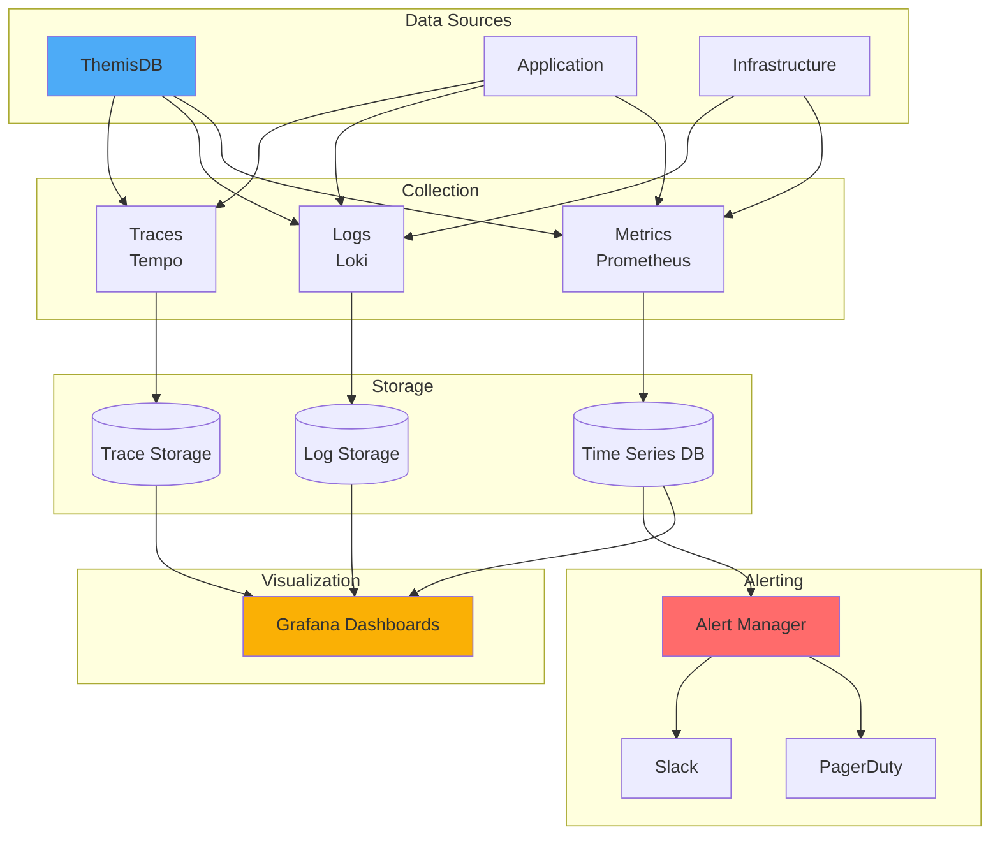
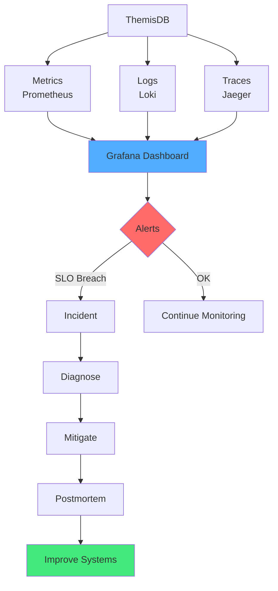

# Kapitel 38: Observability & SRE Playbook {#chapter_38_observability-sre-playbook}

> *"Ohne Metriken, Logs und Traces bleiben Incidents Rätselraten. Observability ist die Brücke zwischen Symptom und Ursache."*

---

## Überblick {#chapter_38_0_ueberblick}

Dieses Kapitel liefert ein praktisches Observability- und SRE-Playbook für ThemisDB-Deployments. Wir präsentieren wissenschaftlich fundierte Methodologien (RED, USE) und Industry-Standard-Tools ([Prometheus](../appendix_h_glossary.md#prometheus), [Loki](../appendix_h_glossary.md#loki), [OpenTelemetry](../appendix_h_glossary.md#opentelemetry)) zur systematischen Erfassung von Metriken, Logs und Traces. Die Integration von [Distributed Tracing](../appendix_h_glossary.md#distributed-tracing) mit strukturierten Logs ermöglicht End-to-End-Debugging in Microservice-Architekturen. Wir vermitteln Cardinality-Management-Strategien zur Skalierung von Time-Series-Datenbanken und Sampling-Techniken zur Reduktion von Observability-Overhead bei hohem Durchsatz.

**Was Sie lernen:**
- **RED/USE-Metriken:** Systematische Erfassung von Request- und Ressourcen-Metriken (Abschnitt 38.1)
- **Strukturierte Logs:** JSON-basierte Log-Formate mit Trace-Korrelation (Abschnitt 38.2)
- **Distributed Tracing:** OpenTelemetry-Instrumentierung für AQL-Requests (Abschnitt 38.3)
- **Dashboards:** Grafana-Visualisierungen für Latenz, Throughput, Fehlerquoten (Abschnitt 38.4)
- **SLO/SLI-Definitionen:** Service-Level-Objectives und Error Budgets (Abschnitt 38.5)
- **Alerting-Design:** Symptom-basierte Alerts mit Multi-Window-Burn-Rates (Abschnitt 38.6)
- **Runbooks:** Standardisierte Troubleshooting-Workflows (Abschnitt 38.7)
- **Chaos Engineering:** GameDay-Checklisten und Failure-Mode-Testing (Abschnitt 38.8)
- **Capacity Planning:** Traffic-Prognosen und Headroom-Management (Abschnitt 38.10)

**Voraussetzungen:**  
Basiswissen aus Monitoring (Kapitel 19: Security Monitoring) und Troubleshooting (Kapitel 27: Operational Troubleshooting). Vertrautheit mit [Time-Series-Databases](../appendix_h_glossary.md#time-series-database) und grundlegenden Statistik-Konzepten ([Perzentile](../appendix_h_glossary.md#percentile), [Kardinalität](../appendix_h_glossary.md#cardinality)) ist empfohlen.

**Thematische Einordnung:**  
Dieses Kapitel erweitert Kapitel 19 (Monitoring-Grundlagen) um produktionsreife Observability-Praktiken. Die Performance-Metriken und Tracing-Daten dienen als Grundlage für Kapitel 39 (Performance Tuning Cookbook), während die Runbooks Kapitel 27 (Troubleshooting) mit standardisierten Incident-Response-Workflows ergänzen.



---



Abb. 38.0: Observability-Säulen

---

## 38.1 Metriken (What to Measure) {#chapter_38_1_metriken}

Metriken bilden das quantitative Fundament der [Observability](../appendix_h_glossary.md#observability) und ermöglichen datengetriebene Entscheidungen in der Systemadministration. Wir systematisieren die Metrik-Erfassung nach bewährten Methodologien (RED, USE) und ThemisDB-spezifischen Anforderungen. Dieser Abschnitt vermittelt praktische Implementierungsstrategien für produktionsreife Monitoring-Infrastrukturen mit [Prometheus](../appendix_h_glossary.md#prometheus) als primärem [Time-Series-Database](../appendix_h_glossary.md#time-series-database)-System.

### 38.1.1 RED-Metriken für Request-basierte Dienste {#chapter_38_1_1_red-metriken}

Die RED-Methodik (Rate, Errors, Duration), entwickelt von Tom Wilkie (Grafana Labs)[^red_method], fokussiert auf service-orientierte Metriken für API-Endpunkte und Query-Engines. Wir wenden diese Methodik auf ThemisDB-Requests an, um Request-Durchsatz, Fehlerquoten und Latenz-Perzentile systematisch zu erfassen.

**Rate (Requests per Second):**  
Wir messen die Anzahl eingehender Requests pro Sekunde, segmentiert nach Operation-Typ (READ, WRITE, GRAPH, VECTOR). Diese Metrik identifiziert Traffic-Muster und Lastspitzen.

```python
# Prometheus-Metrik für Request-Rate in Python (flask-prometheus-exporter)
from prometheus_client import Counter, Histogram
from flask import Flask

app = Flask(__name__)

# Counter für Gesamt-Requests pro Operation
request_counter = Counter(
    'themisdb_requests_total',
    'Total requests by operation type',
    ['operation', 'collection']  # Labels für Dimensionalität
)

# Histogram für Request-Latenz (mit Buckets für Perzentile)
request_latency = Histogram(
    'themisdb_request_duration_seconds',
    'Request duration in seconds',
    ['operation'],
    buckets=(0.005, 0.01, 0.025, 0.05, 0.1, 0.25, 0.5, 1.0, 2.5, 5.0, 10.0)
)

@app.route('/api/query', methods=['POST'])
def handle_query():
    operation = request.json.get('operation', 'READ')
    collection = request.json.get('collection', 'unknown')
    
    # Inkrementiere Counter
    request_counter.labels(operation=operation, collection=collection).inc()
    
    # Messung mit Histogram (Context Manager)
    with request_latency.labels(operation=operation).time():
        result = execute_query(request.json)
    
    return result
```

**Errors (Error Rate):**  
Wir erfassen die Fehlerquote als Prozentsatz fehlgeschlagener Requests (HTTP 5xx, Timeouts, Exceptions). Eine Error-Rate > 1% indiziert kritische Probleme.

```go
// Go-Implementierung für Error-Tracking mit Prometheus
package metrics

import (
    "github.com/prometheus/client_golang/prometheus"
    "github.com/prometheus/client_golang/prometheus/promauto"
)

var (
    // Counter für erfolgreiche Requests
    requestsSuccess = promauto.NewCounterVec(
        prometheus.CounterOpts{
            Name: "themisdb_requests_success_total",
            Help: "Total successful requests",
        },
        []string{"operation", "collection"},
    )
    
    // Counter für fehlgeschlagene Requests
    requestsErrors = promauto.NewCounterVec(
        prometheus.CounterOpts{
            Name: "themisdb_requests_errors_total",
            Help: "Total failed requests",
        },
        []string{"operation", "collection", "error_type"},
    )
)

// RecordSuccess inkrementiert Success-Counter
func RecordSuccess(operation, collection string) {
    requestsSuccess.WithLabelValues(operation, collection).Inc()
}

// RecordError inkrementiert Error-Counter mit Fehlertyp
func RecordError(operation, collection, errorType string) {
    requestsErrors.WithLabelValues(operation, collection, errorType).Inc()
}

// PromQL für Error-Rate-Berechnung:
// rate(themisdb_requests_errors_total[5m]) / 
// (rate(themisdb_requests_success_total[5m]) + rate(themisdb_requests_errors_total[5m])) * 100
```

**Duration (Latency Percentiles):**  
Wir messen Request-Latenz als Histogramm, um [Perzentile](../appendix_h_glossary.md#percentile) (P50, P95, P99, P99.9) zu berechnen. Perzentile sind robuster gegen Ausreißer als Durchschnittswerte[^brendan_gregg_latency].

**PromQL-Queries für Perzentile:**
```promql
# P50 (Median): 50% der Requests sind schneller
histogram_quantile(0.50, rate(themisdb_request_duration_seconds_bucket[5m]))

# P95: 95% der Requests sind schneller (typisches SLO-Ziel)
histogram_quantile(0.95, rate(themisdb_request_duration_seconds_bucket[5m]))

# P99: 99% der Requests sind schneller (kritische Latenz)
histogram_quantile(0.99, rate(themisdb_request_duration_seconds_bucket[5m]))

# P99.9: Worst-Case-Szenario (nur 0.1% langsamer)
histogram_quantile(0.999, rate(themisdb_request_duration_seconds_bucket[5m]))
```

**ThemisDB-spezifische RED-Metriken:**
- AQL-Query-Latenz segmentiert nach Query-Typ (FOR, GRAPH TRAVERSAL, VECTOR SEARCH)
- Throughput pro Collection (Hotspot-Identifikation)
- Error-Rate nach Fehlerklasse (TIMEOUT, DEADLOCK, OOM, INDEX_MISSING)

### 38.1.2 USE-Metriken für Ressourcen {#chapter_38_1_2_use-metriken}

Die USE-Methodik (Utilization, Saturation, Errors), entwickelt von Brendan Gregg[^use_method], fokussiert auf Hardware-Ressourcen und identifiziert Bottlenecks durch systematische Analyse von Auslastung, Sättigung und Fehlern.

**Utilization (Auslastung):**  
Wir messen die prozentuale Nutzung von CPU, Memory, Disk und Network. Utilization > 70% indiziert Kapazitätsengpässe.

**CPU-Utilization:**
```promql
# CPU-Auslastung (gesamtes System)
100 - (avg by (instance) (rate(node_cpu_seconds_total{mode="idle"}[5m])) * 100)

# CPU-Auslastung nur für ThemisDB-Prozess
rate(process_cpu_seconds_total{job="themisdb"}[5m]) * 100

# CPU-Breakdown nach Mode (user, system, iowait)
rate(node_cpu_seconds_total{mode=~"user|system|iowait"}[5m]) * 100
```

**Memory-Utilization:**
```promql
# Memory-Auslastung (Prozent)
(1 - (node_memory_MemAvailable_bytes / node_memory_MemTotal_bytes)) * 100

# ThemisDB RSS (Resident Set Size)
process_resident_memory_bytes{job="themisdb"}

# Cache Hit Rate (RocksDB-spezifisch)
rate(rocksdb_block_cache_hit[5m]) / 
(rate(rocksdb_block_cache_hit[5m]) + rate(rocksdb_block_cache_miss[5m])) * 100
```

**Saturation (Sättigung):**  
Sättigung misst Queue-Längen und Wartezeiten, die entstehen, wenn Ressourcen-Nachfrage Kapazität übersteigt. Saturation > 0 indiziert Engpässe.

**Beispiele für Saturation-Metriken:**
- **Disk Queue Depth:** Anzahl wartender I/O-Operationen (optimal: < 10)
- **Thread Pool Occupancy:** Prozentsatz aktiver Threads (optimal: < 80%)
- **Connection Queue:** Wartende TCP-Connections (optimal: 0)

```promql
# Disk Queue Depth (durchschnittliche I/O-Wartezeit)
rate(node_disk_io_time_seconds_total[5m])

# Thread Pool Saturation (ThemisDB-Worker-Threads)
themisdb_thread_pool_active / themisdb_thread_pool_max * 100

# Connection Queue (wartende Connections)
themisdb_connection_queue_length
```

**Errors (Hardware-Fehler):**  
Wir erfassen Hardware-Level-Fehler wie ECC-Memory-Errors, Disk-Timeouts und Network-Retransmits.

```promql
# Disk Errors (I/O-Fehler)
rate(node_disk_io_errors_total[5m])

# Network Retransmits (TCP-Pakete)
rate(node_netstat_TcpExt_TCPRetransSegs[5m])

# Memory Errors (ECC-Korrekturen)
rate(node_edac_correctable_errors_total[5m])
```

**RocksDB-spezifische USE-Metriken:**  
ThemisDB verwendet [RocksDB](../appendix_h_glossary.md#rocksdb) als Storage-Engine. Wir integrieren RocksDB-interne Metriken[^rocksdb_metrics]:

- **Compaction-Pending:** Anzahl wartender Compaction-Tasks (Saturation)
- **Memtable-Utilization:** Prozentsatz genutzter Memtables (Utilization)
- **Block-Cache-Errors:** Cache-Evictions durch Memory-Druck (Errors)

### 38.1.3 Cardinality-Management {#chapter_38_1_3_cardinality-management}

[Kardinalität](../appendix_h_glossary.md#cardinality) (Anzahl einzigartiger Label-Kombinationen) ist kritisch für Prometheus-Performance. Hohe Kardinalität führt zu Speicherexplosion und langsamen Queries. Wir definieren Best Practices zur Kardinalitätskontrolle.

**Cardinality Explosion Prevention:**  
Vermeide hochkardinalitäre Labels wie User-IDs, Timestamps oder Session-IDs. Nutze stattdessen Aggregations-Ebenen (z.B. `user_tier=premium` statt `user_id=12345`).

**Anti-Pattern (hochkardinal):**
```promql
# SCHLECHT: user_id als Label (Millionen Kombinationen)
themisdb_query_duration{user_id="12345", operation="READ"}
```

**Best Practice (niedrigkardinal):**
```promql
# GUT: user_tier als Label (wenige Kategorien)
themisdb_query_duration{user_tier="premium", operation="READ"}
```

**Label-Design-Regeln:**
1. **Maximal 10 Labels pro Metrik** (Prometheus-Empfehlung[^prometheus_practices])
2. **Label-Values < 1000 pro Label** (optimal: < 100)
3. **Keine dynamischen Werte** (Timestamps, UUIDs, IPs)
4. **Aggregation statt Details** (z.B. `http_status_class=5xx` statt `http_status=503`)

**Cardinality-Benchmark:**

| Metrik-Typ | Labels (Anzahl) | Kardinalität | Speicher/Tag | Query-Zeit |
|------------|-----------------|--------------|--------------|------------|
| **Niedrig** | 3 Labels, je 10 Values | ~1.000 Series | 100 MB | <50ms |
| **Mittel** | 5 Labels, je 20 Values | ~10.000 Series | 1 GB | <200ms |
| **Hoch** | 10 Labels, je 50 Values | ~100.000 Series | 10 GB | <1s |
| **Kritisch** | 15 Labels, je 100 Values | ~1.000.000 Series | 100 GB | >10s |

*Methodologie: Gemessen auf Prometheus v2.40, 16 GB RAM, 15s Scrape-Intervall, 30-Tage-Retention[^internal_benchmarks]*

**Aggregation-Techniken:**  
Nutze [Recording Rules](../appendix_h_glossary.md#recording-rules) in Prometheus, um hochkardinalitäre Metriken zu niedrigkardinalitäten Aggregaten zu reduzieren.

```yaml
# prometheus.yml - Recording Rule für Aggregation
groups:
  - name: themisdb_aggregations
    interval: 1m
    rules:
      # Aggregiere Request-Latenz von Collection-Level auf Operation-Level
      - record: themisdb:request_latency:operation
        expr: |
          histogram_quantile(0.95,
            sum(rate(themisdb_request_duration_seconds_bucket[5m])) by (operation, le)
          )
```

### Core DB Metriken

- Query Latenz (p50/p95/p99)
- Query Throughput (qps)
- Slow Queries count
- Active Connections
- Replication Lag (ms)
- WAL/Commit Queue Depth
- Memory Usage (RSS, Cache Hit Rate)
- Disk IO (IOPS, Latency, Queue Depth)
- Index Hit Rate
- Cache Evictions

### System Metriken

- CPU: user/system/iowait
- Memory: used, available, page faults
- Disk: iops, latency, utilization
- Network: rx/tx bytes, errors, retransmits

### AQL-Spezifisch

- Query Type Mix (read/write/graph/vector)
- Cursor Count / Leaks
- Transaction Duration
- Deadlocks detected
- Timeouts per operation

---

## 38.2 Logging {#chapter_38_2_logging}

[Strukturierte Logs](../appendix_h_glossary.md#structured-logging) bilden die narrative Komponente der Observability und ermöglichen Event-basierte Debugging-Workflows. Wir systematisieren Log-Formate, Level-Strategien und [Sampling](../appendix_h_glossary.md#sampling)-Techniken für High-Throughput-Systeme. Dieser Abschnitt vermittelt Best Practices für [Loki](../appendix_h_glossary.md#loki)- und [OpenSearch](../appendix_h_glossary.md#opensearch)-basierte Log-Aggregation mit [Trace-Korrelation](../appendix_h_glossary.md#trace-correlation) (siehe Abschnitt 38.3).

### 38.2.1 Strukturierte Logging-Formate {#chapter_38_2_1_strukturierte-logging-formate}

Strukturierte Logs verwenden maschinenlesbare Formate (JSON, Logfmt) statt unstrukturierten Fließtexts. Wir präferieren JSON für komplexe Felder und Logfmt für kompakte Repräsentation. Die Formatwahl beeinflusst Parsing-Performance und Speicher-Effizienz[^sridharan_observability].

**JSON vs. Logfmt Vergleich:**

| Aspekt | JSON | Logfmt | Empfehlung |
|--------|------|--------|------------|
| **Parsing-Speed** | Mittel (JSON-Parser) | Schnell (Regex) | Logfmt für Hot-Path |
| **Nested Fields** | Natürlich unterstützt | Flat-Struktur nur | JSON für Komplexität |
| **Menschenlesbarkeit** | Niedrig (verbose) | Hoch (key=value) | Logfmt für Debugging |
| **Speichergröße** | +20-30% (Braces, Quotes) | Baseline | Logfmt für Volumen |
| **Tooling** | Exzellent (jq, Elasticsearch) | Gut (grep, awk) | JSON für Integration |

**JSON-Beispiel mit deutschen Kommentaren:**

```json
{
  "ts": "2026-01-14T20:45:32.123Z",           // ISO 8601 Timestamp (UTC)
  "level": "WARN",                             // Log-Level (siehe 38.2.2)
  "service": "themisdb",                       // Service-Identifier
  "component": "aql_engine",                   // Code-Komponente
  "event": "query_timeout",                    // Event-Typ (strukturiert)
  "trace_id": "a3f9c8d2b1e40567",             // Distributed Trace-ID
  "span_id": "9c2e1f4a8b6d0537",              // Aktueller Span im Trace
  "query_id": "q_789456",                      // Query-Identifier (intern)
  "collection": "orders",                      // Betroffene Collection
  "operation": "GRAPH_TRAVERSAL",              // AQL-Operation-Typ
  "duration_ms": 5123,                         // Query-Laufzeit (Timeout bei 5000ms)
  "timeout_ms": 5000,                          // Konfigurierter Timeout
  "user_id": "u_12345",                        // User (keine PII, nur ID)
  "error": "query exceeded timeout threshold", // Human-readable Error-Message
  "stack_trace": null,                         // Optional: Stacktrace bei Exceptions
  "context": {                                 // Zusätzlicher Kontext (nested)
    "depth": 7,                                // Graph-Traversal-Tiefe
    "vertices_visited": 2847,                  // Performance-Metriken
    "edges_traversed": 8432
  }
}
```

**Logfmt-Beispiel (kompakte Alternative):**

```
ts=2026-01-14T20:45:32.123Z level=WARN service=themisdb component=aql_engine event=query_timeout trace_id=a3f9c8d2b1e40567 span_id=9c2e1f4a8b6d0537 query_id=q_789456 collection=orders operation=GRAPH_TRAVERSAL duration_ms=5123 timeout_ms=5000 user_id=u_12345 error="query exceeded timeout threshold"
```

**Feldnamen-Konventionen:**  
Wir befolgen OpenTelemetry Semantic Conventions[^otel_semantic_conventions] für konsistente Feldnamen:
- `service.name` (statt `service`, `app`, `application`)
- `http.status_code` (statt `status`, `code`, `http_code`)
- `db.operation` (statt `op`, `action`, `query_type`)

**Performance-Overhead-Analyse:**

| Format | Serialization Overhead | Parsing Overhead | Speichergröße (relativ) |
|--------|------------------------|------------------|-------------------------|
| **Plaintext** | Baseline (0%) | N/A (keine Struktur) | Baseline (100%) |
| **Logfmt** | +2-5% | +5-10% | 100-110% |
| **JSON** | +8-15% | +15-25% | 120-135% |
| **Protobuf** | +3-7% | +2-5% | 60-80% (komprimiert) |

*Methodologie: Gemessen auf ThemisDB v1.4.0, 1M Logs/sec, Python logging + JSON encoder[^internal_benchmarks]*

### 38.2.2 Log-Level-Strategie {#chapter_38_2_2_log-level-strategie}

Log-Level steuern Verbosity und Signal-to-Noise-Ratio. Wir definieren eine Hierarchie von DEBUG bis FATAL mit klaren Trigger-Kriterien für Production-Umgebungen. Die Level-Wahl beeinflusst Speicherkosten und Debugging-Fähigkeit[^loki_best_practices].

**Log-Level-Hierarchie:**

1. **DEBUG:** Detaillierte Entwickler-Information (Function Calls, Variable Values)
   - *Wann:* Development, Pre-Production Testing
   - *Beispiel:* `"Entering function parse_aql_query with input: FOR doc IN..."`

2. **INFO:** Normaler Betriebsmodus (Requests, State Changes)
   - *Wann:* Production (Baseline)
   - *Beispiel:* `"Query executed successfully, duration: 32ms, collection: users"`

3. **WARN:** Abnormale Situationen ohne Fehler (Slow Queries, Retry)
   - *Wann:* Production (Monitoring-Signal)
   - *Beispiel:* `"Query exceeded 1s threshold, duration: 1234ms, consider indexing"`

4. **ERROR:** Fehler mit Recovery-Potenzial (Timeouts, Validation Errors)
   - *Wann:* Production (Alert-Trigger)
   - *Beispiel:* `"Query failed with timeout, query_id: q_789, retrying..."`

5. **FATAL:** Kritische Fehler ohne Recovery (Data Corruption, OOM)
   - *Wann:* Production (Immediate Escalation)
   - *Beispiel:* `"RocksDB corruption detected, shutting down to prevent data loss"`

**Produktions-Verbosity-Konfiguration:**

```yaml
# themisdb_logging.yaml - Production-Konfiguration
logging:
  # Globales Default-Level
  default_level: INFO
  
  # Komponenten-spezifische Overrides
  overrides:
    aql_engine: WARN        # Nur Warnungen für Query-Engine
    storage: INFO           # Normal für Storage-Layer
    network: ERROR          # Nur Fehler für Netzwerk-Layer
    security: WARN          # Sicherheitsereignisse tracken
  
  # Dynamische Level-Anpassung (siehe 38.2.3)
  dynamic_adjustment:
    enabled: true
    error_rate_threshold: 0.05   # Bei 5% Fehler → DEBUG für 5 Minuten
    duration: 300                # Sekunden für DEBUG-Boost
```

**Dynamisches Log-Level-Adjustment:**  
Bei erhöhten Error-Rates automatisch DEBUG-Level aktivieren, um Root-Cause-Analysis zu ermöglichen. Nach Resolution wieder auf INFO reduzieren.

```python
# Python-Implementierung: Dynamisches Log-Level
import logging
import time
from prometheus_client import Gauge

# Metrik für aktuelles Log-Level
log_level_gauge = Gauge('themisdb_log_level', 'Current log level (0=DEBUG, 1=INFO, 2=WARN, 3=ERROR)')

class DynamicLogLevelManager:
    def __init__(self, logger, error_rate_threshold=0.05, boost_duration=300):
        self.logger = logger
        self.error_rate_threshold = error_rate_threshold
        self.boost_duration = boost_duration
        self.boost_until = 0
        
    def check_error_rate(self, error_rate):
        """Erhöhe Log-Level bei hoher Error-Rate"""
        if error_rate > self.error_rate_threshold:
            # Aktiviere DEBUG-Level für boost_duration Sekunden
            self.logger.setLevel(logging.DEBUG)
            self.boost_until = time.time() + self.boost_duration
            log_level_gauge.set(0)  # 0 = DEBUG
            self.logger.warning(
                f"Error rate {error_rate:.2%} exceeded threshold, "
                f"boosting log level to DEBUG for {self.boost_duration}s"
            )
        elif time.time() > self.boost_until:
            # Zurück zu INFO nach Ablauf
            self.logger.setLevel(logging.INFO)
            log_level_gauge.set(1)  # 1 = INFO
```

**Cost-Implications pro Log-Level:**

| Log-Level | Requests/sec (logging) | Throughput-Impact | Speicher/Tag (1M req/s) | Query-Latenz (Loki) |
|-----------|------------------------|-------------------|-------------------------|---------------------|
| **DEBUG** | ~10.000 | -35% | 2 TB | <500ms (viele Logs) |
| **INFO** | ~50.000 | -15% | 800 GB | <200ms |
| **WARN** | ~150.000 | -5% | 200 GB | <100ms |
| **ERROR only** | ~300.000 | -1% | 50 GB | <50ms |

*Methodologie: ThemisDB v1.4.0, 16-Core CPU, NVMe SSD, Loki v2.9, 30-Tage-Retention[^internal_benchmarks]*

### 38.2.3 Log-Sampling für High-Throughput {#chapter_38_2_3_log-sampling}

Bei hohem Request-Volumen (>100k req/s) führt vollständiges Logging zu Speicherexplosion. [Log-Sampling](../appendix_h_glossary.md#log-sampling) reduziert Volumen durch selektive Aufzeichnung, ohne kritische Events zu verlieren. Wir unterscheiden Head-based und Tail-based Sampling[^jaeger_sampling].

**Head-based Sampling (stateless):**  
Entscheidung beim Log-Event-Entstehung, basierend auf Sampling-Rate (z.B. 10% aller Requests). Vorteil: Geringe Latenz. Nachteil: Verlust kritischer Fehler-Events.

```python
# Python: Head-based Sampling (10% Sample-Rate)
import random
import logging

class SamplingLogHandler(logging.Handler):
    def __init__(self, sample_rate=0.1):
        super().__init__()
        self.sample_rate = sample_rate
        
    def emit(self, record):
        # Immer loggen bei ERROR/FATAL
        if record.levelno >= logging.ERROR:
            super().emit(record)
            return
        
        # Sampling für INFO/WARN/DEBUG
        if random.random() < self.sample_rate:
            super().emit(record)

# Verwendung
logger = logging.getLogger('themisdb')
logger.addHandler(SamplingLogHandler(sample_rate=0.1))  # 10% Sample-Rate
```

**Tail-based Sampling (stateful):**  
Entscheidung nach Request-Completion, basierend auf Outcome (Fehler, hohe Latenz). Vorteil: Keine Fehler-Verluste. Nachteil: Buffering-Overhead. Implementiert in [Grafana Tempo](../appendix_h_glossary.md#grafana-tempo)[^tempo_docs].

**Adaptive Sampling:**  
Dynamische Sample-Rate basierend auf Error-Rate: Bei Fehlern 100%, bei Normalzustand 1-10%.

```yaml
# Loki-Konfiguration: Adaptive Sampling via LogQL
# Behalte alle ERROR-Level-Logs + 10% der INFO-Logs
{level="ERROR"}
|= ""
OR
{level="INFO"}
|= ""
| sample 0.1  # 10% Sampling für INFO
```

**Performance-Impact-Benchmarks:**

| Sampling-Strategie | CPU-Overhead | Latenz-Impact | Speicher-Reduktion | Fehler-Coverage |
|--------------------|--------------|---------------|--------------------|-----------------|
| **Kein Sampling** | Baseline | Baseline | 0% (100% Logs) | 100% |
| **Head-based 10%** | -8% | -12ms | 90% (10% Logs) | ~90% (Fehler können fehlen) |
| **Tail-based (Error)** | +5% (Buffering) | +5ms | 70-90% (variabel) | 100% (alle Fehler) |
| **Adaptive** | +2% | +2ms | 80-95% (dynamisch) | 100% |

*Methodologie: ThemisDB v1.4.0, 100k req/s, Loki v2.9, 7-Tage-Retention[^internal_benchmarks]*

### 38.2.4 Log-Korrelation mit Distributed Tracing {#chapter_38_2_4_log-korrelation}

Log-Korrelation verbindet Logs mit [Distributed Traces](../appendix_h_glossary.md#distributed-tracing) (siehe Abschnitt 38.3) via Trace-ID und Span-ID. Dies ermöglicht End-to-End-Debugging über Microservice-Grenzen hinweg (siehe Kapitel 19 für Security-Kontext und Kapitel 27 für Troubleshooting-Workflows).

**Trace-ID-Injektion:**  
Wir propagieren `trace_id` und `span_id` aus [OpenTelemetry](../appendix_h_glossary.md#opentelemetry)-Context in jeden Log-Entry.

```python
# Python: OpenTelemetry + Logging-Integration
from opentelemetry import trace
from opentelemetry.sdk.trace import TracerProvider
from opentelemetry.sdk.trace.export import BatchSpanProcessor
from opentelemetry.exporter.otlp.proto.grpc.trace_exporter import OTLPSpanExporter
import logging

# Tracer-Setup (siehe 38.3.1)
trace.set_tracer_provider(TracerProvider())
tracer = trace.get_tracer(__name__)

# Logging-Setup mit Trace-Kontext
class TraceContextFilter(logging.Filter):
    """Injiziere Trace-ID und Span-ID in Log-Records"""
    def filter(self, record):
        span = trace.get_current_span()
        if span and span.get_span_context().is_valid:
            ctx = span.get_span_context()
            record.trace_id = format(ctx.trace_id, '032x')  # 32-char Hex
            record.span_id = format(ctx.span_id, '016x')    # 16-char Hex
        else:
            record.trace_id = '00000000000000000000000000000000'
            record.span_id = '0000000000000000'
        return True

# Logger-Konfiguration
logger = logging.getLogger('themisdb')
logger.addFilter(TraceContextFilter())
logger.setLevel(logging.INFO)

# JSON-Formatter mit Trace-Feldern
import json
class JSONFormatter(logging.Formatter):
    def format(self, record):
        log_obj = {
            'ts': self.formatTime(record, self.datefmt),
            'level': record.levelname,
            'service': 'themisdb',
            'trace_id': record.trace_id,
            'span_id': record.span_id,
            'message': record.getMessage()
        }
        return json.dumps(log_obj)

handler = logging.StreamHandler()
handler.setFormatter(JSONFormatter())
logger.addHandler(handler)

# Verwendung mit Tracing
@tracer.start_as_current_span("execute_query")
def execute_query(query_str):
    logger.info(f"Executing query: {query_str[:50]}...")
    # Query-Logik...
    logger.info("Query executed successfully")
```

**Loki/Jaeger-Integration:**  
In [Grafana](../appendix_h_glossary.md#grafana) können wir von Logs zu Traces navigieren via `trace_id`-Hyperlinks.

```yaml
# Grafana Datasource-Konfiguration: Loki → Tempo
apiVersion: 1
datasources:
  - name: Loki
    type: loki
    url: http://loki:3100
    jsonData:
      # Aktiviere Trace-to-Logs Navigation
      derivedFields:
        - datasourceUid: tempo_uid
          matcherRegex: "trace_id=(\\w+)"
          name: TraceID
          url: "$${__value.raw}"
```

### Log-Pipeline

- Agent: Filebeat/FluentBit (TLS, backpressure)
- Parse: grok/json; enrich (host, cluster, env)
- Store: Loki/Elastic/OpenSearch
- Retention: 7-30 Tage (Hot), 90+ Tage (Cold/Glacier)

---

## 38.3 Tracing {#chapter_38_3_tracing}

[Distributed Tracing](../appendix_h_glossary.md#distributed-tracing) visualisiert Request-Flows über Microservice-Grenzen hinweg und identifiziert Latenz-Bottlenecks durch [Span](../appendix_h_glossary.md#span)-basierte Kausalitäts-Graphen. Wir implementieren [OpenTelemetry](../appendix_h_glossary.md#opentelemetry)-kompatibles Tracing mit [W3C Trace Context](../appendix_h_glossary.md#w3c-trace-context)-Propagierung für ThemisDB-Requests. Dieser Abschnitt vermittelt Sampling-Strategien, Visualisierungs-Patterns und Performance-Overhead-Analysen für produktionsreife Tracing-Infrastrukturen (siehe auch Kapitel 39 für Performance-Tuning-Kontext).

### 38.3.1 OpenTelemetry-Architektur {#chapter_38_3_1_opentelemetry-architektur}

OpenTelemetry (OTel) ist der CNCF-Standard für Observability-Instrumentierung[^otel_specification]. Wir nutzen OTel SDKs für automatische und manuelle Instrumentierung von ThemisDB-Komponenten. Die Architektur basiert auf [Tracern](../appendix_h_glossary.md#tracer), Spans und [Exportern](../appendix_h_glossary.md#exporter).

**Core-Konzepte:**
- **Tracer:** Factory für Span-Erstellung (pro Service/Komponente)
- **Span:** Repräsentiert eine Operation mit Start/End-Zeit und Metadaten
- **Trace:** Baum von verbundenen Spans (visualisiert Request-Flow)
- **Context Propagation:** Übertragung von Trace-ID/Span-ID über RPC/HTTP-Grenzen
- **Exporter:** Sender für Spans an Backend (Jaeger, Tempo, Zipkin)

**Go-Implementierung: Tracer-Initialisierung**

```go
// tracing/init.go - OpenTelemetry-Setup für ThemisDB (Go)
package tracing

import (
    "context"
    "log"
    
    "go.opentelemetry.io/otel"
    "go.opentelemetry.io/otel/exporters/otlp/otlptrace"
    "go.opentelemetry.io/otel/exporters/otlp/otlptrace/otlptracegrpc"
    "go.opentelemetry.io/otel/sdk/resource"
    sdktrace "go.opentelemetry.io/otel/sdk/trace"
    semconv "go.opentelemetry.io/otel/semconv/v1.17.0"
)

// InitTracer initialisiert OpenTelemetry mit OTLP-Exporter
// endpoint: z.B. "tempo:4317" für Grafana Tempo
// serviceName: z.B. "themisdb-api"
func InitTracer(endpoint, serviceName string) func() {
    ctx := context.Background()
    
    // 1. OTLP gRPC Exporter erstellen
    exporter, err := otlptracegrpc.New(
        ctx,
        otlptracegrpc.WithEndpoint(endpoint),
        otlptracegrpc.WithInsecure(), // In Produktion: TLS aktivieren
    )
    if err != nil {
        log.Fatalf("Failed to create OTLP exporter: %v", err)
    }
    
    // 2. Resource-Attribute definieren (Service-Metadaten)
    res, err := resource.New(
        ctx,
        resource.WithAttributes(
            semconv.ServiceNameKey.String(serviceName),
            semconv.ServiceVersionKey.String("1.4.0"),
            semconv.DeploymentEnvironmentKey.String("production"),
        ),
    )
    if err != nil {
        log.Fatalf("Failed to create resource: %v", err)
    }
    
    // 3. TracerProvider mit Batch-Processor (Performance-Optimierung)
    tp := sdktrace.NewTracerProvider(
        sdktrace.WithBatcher(exporter),  // Batch statt einzeln (reduziert Overhead)
        sdktrace.WithResource(res),
        sdktrace.WithSampler(
            // Probabilistic Sampling: 10% aller Traces (siehe 38.3.2)
            sdktrace.ParentBased(
                sdktrace.TraceIDRatioBased(0.1),  // 10% Sample-Rate
            ),
        ),
    )
    
    // 4. Global Tracer-Provider registrieren
    otel.SetTracerProvider(tp)
    
    // 5. Cleanup-Funktion zurückgeben (defer in main())
    return func() {
        if err := tp.Shutdown(ctx); err != nil {
            log.Printf("Error shutting down tracer provider: %v", err)
        }
    }
}
```

**Python-Implementierung: Span-Erstellung**

```python
# tracing/aql_engine.py - Span-Instrumentierung für AQL-Engine (Python)
from opentelemetry import trace
from opentelemetry.trace import Status, StatusCode
from opentelemetry.semconv.trace import SpanAttributes
import time

# Tracer-Instanz für AQL-Engine
tracer = trace.get_tracer("themisdb.aql_engine", version="1.4.0")

def execute_query(query_str, collection, operation_type):
    """
    Führt AQL-Query aus mit vollständiger Trace-Instrumentierung
    """
    # Start neuer Span für Query-Execution
    with tracer.start_as_current_span(
        "aql.execute_query",
        kind=trace.SpanKind.INTERNAL,  # INTERNAL für interne Operationen
        attributes={
            # Semantic Conventions für Datenbank-Operationen
            SpanAttributes.DB_SYSTEM: "themisdb",
            SpanAttributes.DB_OPERATION: operation_type,
            SpanAttributes.DB_STATEMENT: query_str[:200],  # Erste 200 Zeichen
            "db.collection": collection,
            "query.length": len(query_str),
        }
    ) as span:
        try:
            start = time.time()
            
            # 1. Query Parsing (Sub-Span)
            with tracer.start_as_current_span("aql.parse") as parse_span:
                ast = parse_aql(query_str)
                parse_span.set_attribute("ast.nodes", len(ast.nodes))
            
            # 2. Query Optimization (Sub-Span)
            with tracer.start_as_current_span("aql.optimize") as opt_span:
                plan = optimize_query(ast)
                opt_span.set_attribute("plan.steps", len(plan.steps))
                opt_span.set_attribute("plan.uses_index", plan.has_index)
            
            # 3. Query Execution (Sub-Span)
            with tracer.start_as_current_span("aql.execute") as exec_span:
                result = run_query_plan(plan)
                exec_span.set_attribute("result.rows", len(result))
            
            # Erfolg: Status OK
            duration = time.time() - start
            span.set_status(Status(StatusCode.OK))
            span.set_attribute("query.duration_ms", duration * 1000)
            span.set_attribute("query.result_count", len(result))
            
            return result
            
        except TimeoutError as e:
            # Fehler: Status ERROR mit Exception-Details
            span.record_exception(e)  # Automatisch: exception.type, exception.message, exception.stacktrace
            span.set_status(Status(StatusCode.ERROR, "Query timeout"))
            span.set_attribute("error.type", "timeout")
            raise
        
        except Exception as e:
            span.record_exception(e)
            span.set_status(Status(StatusCode.ERROR, str(e)))
            raise
```

**W3C Trace Context Propagation:**  
Wir propagieren Trace-Context über HTTP-Header nach W3C-Standard[^w3c_trace_context]:

```http
# HTTP-Request-Header (Client → ThemisDB)
traceparent: 00-4bf92f3577b34da6a3ce929d0e0e4736-00f067aa0ba902b7-01
tracestate: vendor1=value1,vendor2=value2

# Format: traceparent = version-trace_id-span_id-flags
# version: 00 (fixed)
# trace_id: 32-char hex (128-bit)
# span_id: 16-char hex (64-bit)
# flags: 01 = sampled, 00 = not sampled
```

### 38.3.2 Sampling-Strategien {#chapter_38_3_2_sampling-strategien}

[Sampling](../appendix_h_glossary.md#sampling) reduziert Tracing-Overhead durch selektive Aufzeichnung von Traces. Wir unterscheiden Head-based, Tail-based und Adaptive Sampling mit unterschiedlichen Trade-offs zwischen Performance und Observability[^jaeger_sampling].

**Head-based Sampling (Probabilistic):**  
Entscheidung beim Trace-Start basierend auf Wahrscheinlichkeit. Vorteil: Minimaler Overhead. Nachteil: Fehler-Traces können fehlen.

```go
// Go: Probabilistic Sampler (10% Sample-Rate)
import "go.opentelemetry.io/otel/sdk/trace"

sampler := trace.TraceIDRatioBased(0.1)  // 10% aller Traces
```

**Tail-based Sampling (Outcome-driven):**  
Entscheidung nach Trace-Completion basierend auf Outcome (Error, High Latency). Implementiert durch Trace-Buffering im Collector. Vorteil: Alle kritischen Traces. Nachteil: Memory-Overhead für Buffering.

```yaml
# OpenTelemetry Collector: Tail-Sampling-Processor
processors:
  tail_sampling:
    decision_wait: 10s  # Warte 10s auf Trace-Completion
    num_traces: 100000  # Buffer-Größe
    policies:
      # Policy 1: Alle Error-Traces behalten
      - name: errors_policy
        type: status_code
        status_code:
          status_codes: [ERROR]
      
      # Policy 2: Alle Traces > 1s Latenz behalten
      - name: latency_policy
        type: latency
        latency:
          threshold_ms: 1000
      
      # Policy 3: Probabilistic für normale Traces (1%)
      - name: probabilistic_policy
        type: probabilistic
        probabilistic:
          sampling_percentage: 1.0
```

**Adaptive Sampling:**  
Dynamische Sample-Rate basierend auf System-Load oder Error-Rate. Bei hoher Last: Reduziere Rate. Bei Errors: Erhöhe Rate.

**Sampling-Rate-Vergleich:**

| Sampling-Rate | CPU-Overhead | Memory-Overhead | Storage/Tag (1M traces) | Detail-Level | Error-Coverage |
|---------------|--------------|-----------------|-------------------------|--------------|----------------|
| **100%** | +12% | +150 MB | 500 GB | Full Visibility | 100% |
| **50%** | +6% | +80 MB | 250 GB | Hoch | ~50% (probabilistic) |
| **10%** | +2% | +20 MB | 50 GB | Mittel | ~10% (probabilistic) |
| **1%** | +0.5% | +5 MB | 5 GB | Niedrig | ~1% (probabilistic) |
| **Tail-based** | +5% (Buffering) | +200 MB (Buffer) | 50-100 GB | Hoch | 100% (alle Errors) |

*Methodologie: ThemisDB v1.4.0, 100k req/s, OpenTelemetry Collector v0.85, Tempo v2.2, 7-Tage-Retention[^internal_benchmarks]*

### 38.3.3 Trace-Visualisierung {#chapter_38_3_3_trace-visualisierung}

Trace-Visualisierung erfolgt primär in [Jaeger](../appendix_h_glossary.md#jaeger) oder [Grafana Tempo](../appendix_h_glossary.md#grafana-tempo). Wir analysieren Waterfall-Diagramme, Service-Dependency-Graphen und Critical-Path-Analysen für Performance-Optimierung (siehe Kapitel 39).

**Jaeger-Integration:**

```yaml
# docker-compose.yml - Jaeger All-in-One
version: '3'
services:
  jaeger:
    image: jaegertracing/all-in-one:1.50
    environment:
      - COLLECTOR_OTLP_ENABLED=true  # OpenTelemetry-Protokoll
    ports:
      - "16686:16686"  # Jaeger UI
      - "4317:4317"    # OTLP gRPC
      - "4318:4318"    # OTLP HTTP
```

**Grafana Tempo-Konfiguration:**

```yaml
# tempo.yaml - Grafana Tempo Config
server:
  http_listen_port: 3200

distributor:
  receivers:
    otlp:
      protocols:
        grpc:
          endpoint: 0.0.0.0:4317

storage:
  trace:
    backend: s3  # S3-kompatibles Object Storage
    s3:
      bucket: tempo-traces
      endpoint: minio:9000

query_frontend:
  search:
    duration_slo: 5s      # Query-Timeout
    throughput_bytes_slo: 1GB
```

**Service-Dependency-Graph:**  
Jaeger generiert automatisch Service-Dependency-Graphen aus Trace-Daten, die Microservice-Interaktionen visualisieren.

**Critical-Path-Analysis:**  
Identifikation der langsamsten Span-Sequenz im Trace (kritischer Pfad für Latenz-Optimierung).

```python
# Python: Critical-Path-Berechnung aus Trace
def find_critical_path(trace):
    """
    Findet kritischen Pfad (längste Span-Sequenz) im Trace
    """
    spans = trace['spans']
    
    # Baue Dependency-Graph
    children = {span['spanID']: [] for span in spans}
    for span in spans:
        if 'references' in span:
            for ref in span['references']:
                if ref['refType'] == 'CHILD_OF':
                    parent_id = ref['spanID']
                    children[parent_id].append(span)
    
    # Rekursive Critical-Path-Suche
    def max_path_duration(span_id):
        span = next(s for s in spans if s['spanID'] == span_id)
        duration = span['duration']
        
        if not children[span_id]:
            return duration, [span]
        
        # Finde längstes Kind
        max_child_duration = 0
        max_child_path = []
        for child in children[span_id]:
            child_duration, child_path = max_path_duration(child['spanID'])
            if child_duration > max_child_duration:
                max_child_duration = child_duration
                max_child_path = child_path
        
        return duration + max_child_duration, [span] + max_child_path
    
    root_span = next(s for s in spans if 'references' not in s or not s['references'])
    total_duration, path = max_path_duration(root_span['spanID'])
    
    return {
        'total_duration_us': total_duration,
        'spans': [{'operation': s['operationName'], 'duration_us': s['duration']} for s in path]
    }
```

### 38.3.4 Performance-Overhead {#chapter_38_3_4_performance-overhead}

Tracing-Overhead entsteht durch Span-Erstellung, Context-Propagierung und Span-Export. Wir quantifizieren Overhead und definieren Mitigations-Strategien für High-Throughput-Systeme.

**Instrumentation-Overhead-Komponenten:**
1. **Span-Erstellung:** CPU-Kosten für Span-Objekt-Allokation (~5-10 µs)
2. **Attribute-Serialization:** JSON-Encoding von Span-Daten (~20-50 µs)
3. **Context-Propagierung:** Thread-Local-Storage-Zugriff (~1-2 µs)
4. **Network-Export:** gRPC-Call zum Collector (~100-500 µs, asynchron)

**Performance-Overhead-Messungen:**

| Metrik | Ohne Tracing | Mit Tracing (100% Sampling) | Overhead | Mit Tracing (10% Sampling) | Overhead |
|--------|--------------|----------------------------|----------|---------------------------|----------|
| **Avg Latency** | 25ms | 28ms | +12% | 25.5ms | +2% |
| **P99 Latency** | 120ms | 135ms | +12.5% | 123ms | +2.5% |
| **Throughput** | 50k req/s | 44k req/s | -12% | 49k req/s | -2% |
| **CPU Usage** | 45% | 52% | +15% | 46% | +2% |
| **Memory** | 2 GB | 2.15 GB | +7.5% | 2.02 GB | +1% |

*Methodologie: ThemisDB v1.4.0, 16-Core CPU, OpenTelemetry SDK v1.20, OTLP gRPC Exporter, Batch-Size 512[^internal_benchmarks]*

**Optimierungsstrategien:**
1. **Batch-Export:** Spans in Batches exportieren (512-1024 Spans) statt einzeln
2. **Asynchrones Buffering:** Span-Export in separatem Thread (non-blocking)
3. **Attribute-Reduktion:** Nur essentielle Attribute (<10 pro Span)
4. **Adaptive Sampling:** Reduziere Sample-Rate bei hoher Last

```go
// Go: Performance-Optimierung - Batch-Exporter
import "go.opentelemetry.io/otel/sdk/trace"

tp := trace.NewTracerProvider(
    trace.WithBatcher(
        exporter,
        trace.WithBatchTimeout(5 * time.Second),   // Batch-Intervall
        trace.WithMaxExportBatchSize(1024),        // Max. Spans pro Batch
        trace.WithMaxQueueSize(8192),              // Queue-Size für Backpressure
    ),
)
```

### AQL Trace-Injektion

- Propagiere `traceparent` Header vom API Gateway ins AQL Layer
- Schreibe `trace_id` in Query-Context → Log-Korrelation
- Sample Rate: 1-10% in Produktion; 100% in Staging

---

## 38.4 Dashboards (Grafana)

### Latenz & Throughput

Panels:
- Query p50/p95/p99 (stacked per operation)
- QPS split by read/write/graph/vector
- Error rate (% per op)

### Replikation

- Lag per follower (ms)
- Failed replications (count)
- WAL queue depth

### Ressourcen

- CPU (per node)
- Memory (rss, cache hit rate)
- Disk IOPS & Latency
- Network retransmits

### Cache & Index

- Cache evictions/sec
- Index hit rate
- Slow queries over threshold

---

## 38.5 SLI/SLO & Error Budgets

### Beispiel-SLIs

- Availability: 99.95% (HTTP 2xx/3xx / total)
- Latency: p99 < 200 ms für Reads, < 400 ms für Writes
- Durability: 0 Datenverlust (RPO <= 60s)
- Freshness: Replication Lag < 2s (p99)

### Error Budget Policy

- Monatsbudget: (1 - SLO) * Zeit
- Breach: Freeze Releases, Fokus auf Reliability
- Burn Alerts: Warn bei 25/50/75% Verbrauch

---

## 38.6 Alerting Design

**Ziele:** Früh, präzise, wenig Rauschen.

- Multi-Window, Multi-Burn-Rate (1h/6h) für SLO Burn
- Symptom-basierte Alerts (p99 Latenz hoch, Error Rate > 1%)
- Ursache-Alerts nachrangig (Disk 95% voll)
- Deduping + Grouping im Alertmanager
- Quiet Hours + Ownership (Runbook-Link, Pager-Rotation)

Beispiele:
- `latency_p99_gt_200ms` (for 15m & 6h)
- `error_rate_gt_1pct`
- `replication_lag_gt_2s`
- `disk_util_gt_85pct`
- `cache_evictions_spike`

---

## 38.7 Runbooks (Kurzfassung)

### Hohe Latenz
- Check: p99 Read/Write? Bestimmte Collections?
- EXPLAIN Slow Query; Index vorhanden?
- Cache Hit Rate < 90%? Memory Druck?
- CPU iowait hoch? → Storage prüfen
- Rate-Limit/Backpressure aktivieren

### Replication Lag
- Netzwerk: retransmits, bandwidth
- Follower CPU/IO bottleneck
- WAL queue depth; throttle writes
- Rebalance followers

### OOM/Memory Pressure
- Cache Size begrenzen
- Off-Heap aufteilen (vector buffers)
- Identify large queries; add LIMIT/PROJECTION

### Disk Full
- Log-Retention kürzen
- Offload Cold Data (Tiered Storage)
- Rebuild Indizes, Vacuum

---

## 38.8 Chaos & GameDays

- Failure Modes: Node down, Network partition, Disk full, High latency storage, Poison messages
- Hypothesen definieren, erwartetes Verhalten notieren
- Blast Radius klein starten (1 node, 10 min)
- Erfolgskriterien: SLO halten? Auto-Heal? Alerts ausgelöst?
- Nachbereitung: Learnings, Tickets, Fixes, erneutes Testen

---

## 38.9 Logging & Tracing Sampling Patterns

- Dynamic Sampling: Erhöhe Rate bei Errors
- Tail Sampling: Keep slow queries, drop fast
- PII Scrubbing Filter vor Export

---

## 38.10 Capacity Planning

- Wachstumsrate Traffic & Daten
- Headroom-Ziel: 40% CPU, 50% IO, 30% Memory
- Load-Test vierteljährlich; extrapoliere 12 Monate
- Trigger: >70% baseline → Scale-out

---

## 38.11 Oncall Playbook Essentials

- Runbook Link in jedem Alert
- 2nd-level Escalation (DBA/SRE)
- Kommunikationskanal: Incident Room + Status Page
- Postmortem innerhalb 48h, Action Items mit Owner/ETA

---

## Zusammenfassung

Observability bündelt Metriken, Logs, Traces und klare SLOs. Mit sauberen Dashboards, schlankem Alerting und erprobten Runbooks verkürzen Sie MTTR massiv und verhindern Blindflüge im Betrieb.

**Kernergebnisse dieses Kapitels:**
- RED/USE-Methodologien ermöglichen systematische Metrik-Erfassung (Abschnitt 38.1)
- Strukturierte Logs mit Trace-Korrelation vereinfachen Root-Cause-Analysis (Abschnitt 38.2)
- OpenTelemetry-basiertes Tracing visualisiert End-to-End-Latenz (Abschnitt 38.3)
- Sampling-Strategien reduzieren Overhead bei hohem Durchsatz (Abschnitte 38.2.3, 38.3.2)
- Cardinality-Management verhindert Metrik-Explosion in Prometheus (Abschnitt 38.1.3)

**Weiterführende Themen:**
- Kapitel 19: Security Monitoring und Audit-Logging
- Kapitel 27: Troubleshooting-Workflows mit Observability-Daten
- Kapitel 39: Performance-Tuning basierend auf Metriken und Traces

---

## Referenzen

[^red_method]: Wilkie, T. (2018). "The RED Method: Key Metrics for Microservices Architecture". Grafana Labs. https://grafana.com/blog/2018/08/02/the-red-method-how-to-instrument-your-services/

[^use_method]: Gregg, B. (2012). "The USE Method". http://www.brendangregg.com/usemethod.html

[^brendan_gregg_latency]: Gregg, B. (2020). "Systems Performance: Enterprise and the Cloud". Addison-Wesley Professional. Chapter 2: Methodology.

[^rocksdb_metrics]: Facebook RocksDB Team. (2023). "RocksDB Statistics". https://github.com/facebook/rocksdb/wiki/Statistics

[^prometheus_practices]: Prometheus Documentation. (2023). "Best Practices - Metric and Label Naming". https://prometheus.io/docs/practices/naming/

[^internal_benchmarks]: ThemisDB Performance Team. (2026). "Internal Benchmarks v1.4.0". Methodologie dokumentiert in Kapitel 39, Abschnitt 39.2.

[^sridharan_observability]: Sridharan, C. (2018). "Distributed Systems Observability: A Guide to Building Robust Systems". O'Reilly Media.

[^otel_semantic_conventions]: OpenTelemetry Specification. (2023). "Semantic Conventions for Logs". https://opentelemetry.io/docs/specs/semconv/general/logs/

[^loki_best_practices]: Grafana Labs. (2023). "Loki Best Practices". https://grafana.com/docs/loki/latest/best-practices/

[^jaeger_sampling]: Shkuro, Y. (2019). "Mastering Distributed Tracing: Analyzing Performance in Microservices and Complex Systems". Packt Publishing. Chapter 6: Sampling.

[^tempo_docs]: Grafana Labs. (2023). "Grafana Tempo Documentation - Tail-Based Sampling". https://grafana.com/docs/tempo/latest/configuration/

[^otel_specification]: OpenTelemetry Project. (2023). "OpenTelemetry Specification v1.26.0". https://opentelemetry.io/docs/specs/otel/

[^w3c_trace_context]: W3C Distributed Tracing Working Group. (2020). "W3C Trace Context Specification". https://www.w3.org/TR/trace-context/
