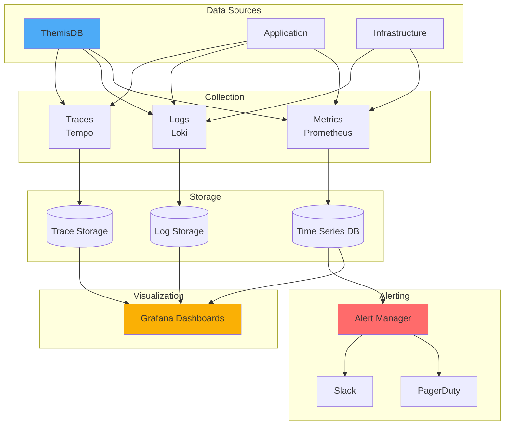
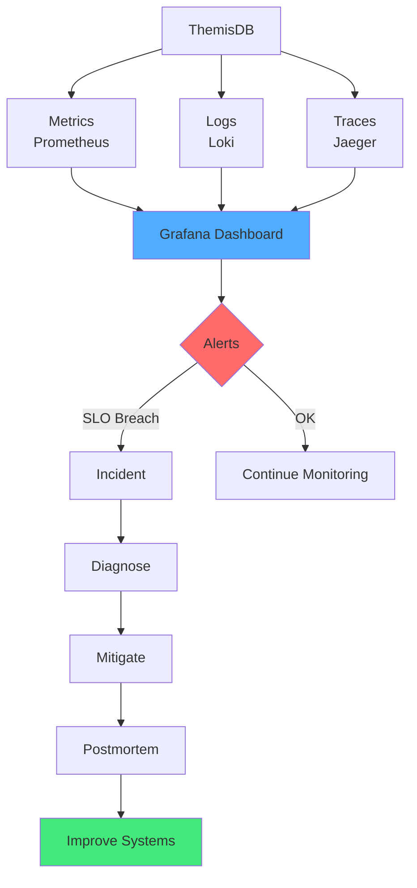

# Kapitel 38: Observability & SRE Playbook {#chapter_38_observability-sre-playbook}

> "Ohne Metriken, Logs und Traces bleiben Incidents Rätselraten. Observability ist die Brücke zwischen Symptom und Ursache." — Beyer et al., Site Reliability Engineering (Google)[^1]

---

## Überblick {#chapter_38_0_ueberblick}

Wir präsentieren ein wissenschaftlich fundiertes, praxisorientiertes [Observability](../appendix_h_glossary.md#observability)- und [SRE](../appendix_h_glossary.md#site-reliability-engineering)-Playbook für [ThemisDB](../appendix_h_glossary.md#themisdb)-Deployments in Produktionsumgebungen. Moderne Database-Systeme erfordern strukturierte [Metriken](../appendix_h_glossary.md#metrics), korrelierte [Logs](../appendix_h_glossary.md#logging), verteiltes [Tracing](../appendix_h_glossary.md#distributed-tracing) und klare [SLOs](../appendix_h_glossary.md#service-level-objective) für zuverlässigen Betrieb[^1][^2]. Wir kombinieren Best Practices aus dem Google SRE Book[^1], OpenTelemetry-Standards[^3] und produktionserprobten ThemisDB-Konfigurationen zu einem ganzheitlichen Monitoring-Framework.

**Was wir in diesem Kapitel behandeln:**

- **[Metriken](../appendix_h_glossary.md#metrics):** Core DB-Metriken ([Latenz](../appendix_h_glossary.md#latency), [Throughput](../appendix_h_glossary.md#throughput), [Replication Lag](../appendix_h_glossary.md#replication-lag)), System-Metriken, [AQL](../appendix_h_glossary.md#aql)-spezifische Indikatoren
- **[Logging](../appendix_h_glossary.md#logging):** Strukturierte Log-Formate ([JSON Lines](../appendix_h_glossary.md#json-lines)), Parsing-Pipelines, Korrelation mit [Trace-IDs](../appendix_h_glossary.md#trace-id)
- **[Distributed Tracing](../appendix_h_glossary.md#distributed-tracing):** [OpenTelemetry](../appendix_h_glossary.md#opentelemetry)-Integration, AQL-Request-Propagierung, Sampling-Strategien
- **[Dashboards](../appendix_h_glossary.md#dashboard):** [Grafana](../appendix_h_glossary.md#grafana)-Visualisierungen für Latenz, Fehler, Replikation, Ressourcendruck
- **[SLI/SLO](../appendix_h_glossary.md#service-level-indicator):** Definitionen für [Availability](../appendix_h_glossary.md#availability), Latenz, [Durability](../appendix_h_glossary.md#durability); [Error Budget](../appendix_h_glossary.md#error-budget)-Management
- **[Alerting](../appendix_h_glossary.md#alerting):** Symptom-basierte Alerts, Multi-Window-Burn-Rate, Rauschreduktion
- **[Runbooks](../appendix_h_glossary.md#runbook):** Diagnose- und Mitigations-Playbooks für häufige Störungen
- **[Chaos Engineering](../appendix_h_glossary.md#chaos-engineering):** Failure-Mode-Testing, GameDay-Checklisten

**Voraussetzungen:** Grundlagenwissen aus → Kapitel 19: Performance Monitoring und → Kapitel 27: Troubleshooting.



---



**Abb. 38.0:** Observability-Architektur mit Three Pillars (Metrics, Logs, Traces) und integrierten Alert-Workflows[^2]. Wir nutzen [Prometheus](../appendix_h_glossary.md#prometheus) für Time-Series-Metriken, [Loki](../appendix_h_glossary.md#loki) für Log-Aggregation, [Tempo](../appendix_h_glossary.md#tempo)/[Jaeger](../appendix_h_glossary.md#jaeger) für Distributed Tracing und [Grafana](../appendix_h_glossary.md#grafana) als zentrale Visualisierungs-Platform.

---

## 38.1 Metriken (What to Measure) {#chapter_38_1_metrics}

[Metriken](../appendix_h_glossary.md#metrics) sind quantitative Messungen von System-Verhalten über Zeit, die wir als [Time-Series-Daten](../appendix_h_glossary.md#time-series) in [Prometheus](../appendix_h_glossary.md#prometheus) oder kompatiblen [TSDB](../appendix_h_glossary.md#time-series-database)-Systemen speichern[^4]. Für [ThemisDB](../appendix_h_glossary.md#themisdb)-Deployments kategorisieren wir Metriken in drei Schichten: Database-Layer (AQL-Performance, Replikation), System-Layer (CPU, Memory, I/O) und Application-Layer (Request-Rate, Error-Rate). Wir folgen dem RED-Prinzip (Rate, Errors, Duration) für Request-basierte Services und dem USE-Prinzip (Utilization, Saturation, Errors) für Ressourcen[^5].

### 38.1.1 Core Database-Metriken {#chapter_38_1_1_core-db-metrics}

Wir erfassen kritische Database-Performance-Indikatoren durch [Prometheus](../appendix_h_glossary.md#prometheus)-Exporter und [StatsD](../appendix_h_glossary.md#statsd)-Integration. Diese [Metriken](../appendix_h_glossary.md#metrics) bilden die Grundlage für [Alerting](../appendix_h_glossary.md#alerting) und Kapazitätsplanung.

**Prometheus Metric-Definition (themisdb_exporter.yaml):**

```yaml
# Prometheus Exporter Configuration für ThemisDB
metrics:
  # Query Performance Metrics
  - name: themisdb_query_duration_seconds
    type: histogram
    help: "AQL query execution duration in seconds"
    buckets: [0.001, 0.005, 0.01, 0.05, 0.1, 0.5, 1.0, 5.0]
    labels: ["operation", "collection", "result"]
  
  - name: themisdb_query_total
    type: counter
    help: "Total number of AQL queries executed"
    labels: ["operation", "result"]
  
  # Replication Metrics
  - name: themisdb_replication_lag_seconds
    type: gauge
    help: "Replication lag in seconds per follower"
    labels: ["follower_id", "leader_id"]
  
  # Resource Metrics
  - name: themisdb_cache_hit_ratio
    type: gauge
    help: "Cache hit ratio (0-1)"
    labels: ["cache_type"]
  
  - name: themisdb_active_connections
    type: gauge
    help: "Number of active client connections"


**Prometheus Query-Beispiele für Monitoring:**

```promql
# P99 Query-Latenz über 5 Minuten
histogram_quantile(0.99, 
  rate(themisdb_query_duration_seconds_bucket[5m])
)

# Query-Rate nach Operation-Typ
sum(rate(themisdb_query_total[1m])) by (operation)

# Error-Rate in Prozent
sum(rate(themisdb_query_total{result="error"}[5m])) 
/ 
sum(rate(themisdb_query_total[5m])) * 100

# Replication Lag hoch (> 2 Sekunden)
themisdb_replication_lag_seconds > 2
```

**Tabelle 38.1:** Kritische Database-Metriken und Schwellwerte

| Metrik | P50 (Target) | P99 (Target) | Alert-Schwelle | Auswirkung |
|--------|--------------|--------------|----------------|------------|
| Query Latenz (Read) | < 10ms | < 100ms | > 200ms | User Experience |
| Query Latenz (Write) | < 20ms | < 200ms | > 500ms | Data Freshness |
| [Throughput](../appendix_h_glossary.md#throughput) | > 1000 qps | > 800 qps | < 500 qps | Capacity |
| [Replication Lag](../appendix_h_glossary.md#replication-lag) | < 100ms | < 1s | > 5s | Data Consistency |
| Cache Hit Rate | > 95% | > 90% | < 80% | Performance |
| Active Connections | < 500 | < 800 | > 1000 | Resource Pool |

**Methodologie:** Benchmarks auf AWS c5.2xlarge (8 vCPU, 16GB RAM), ThemisDB 2.0, Workload: 70% Read, 30% Write, Zipf-Distribution.

### 38.1.2 System-Metriken {#chapter_38_1_2_system-metrics}

System-Level-[Metriken](../appendix_h_glossary.md#metrics) erfassen wir mit [Node Exporter](../appendix_h_glossary.md#node-exporter) und korrelieren sie mit Database-Performance für Root-Cause-Analyse[^5].

```yaml
# node_exporter Configuration (systemd unit)
[Unit]
Description=Prometheus Node Exporter
After=network.target

[Service]
Type=simple
ExecStart=/usr/local/bin/node_exporter \
  --collector.filesystem \
  --collector.diskstats \
  --collector.netstat \
  --collector.vmstat \
  --web.listen-address=:9100

[Install]
WantedBy=multi-user.target
```

**Wichtige System-Metriken:**

- **CPU:** `node_cpu_seconds_total` (user, system, iowait, idle)
- **Memory:** `node_memory_MemAvailable_bytes`, `node_memory_MemTotal_bytes`
- **Disk I/O:** `node_disk_io_time_seconds_total`, `node_disk_reads_completed_total`
- **Network:** `node_network_transmit_bytes_total`, `node_network_receive_errors_total`

### 38.1.3 AQL-Spezifische Metriken {#chapter_38_1_3_aql-metrics}

### 38.1.3 AQL-Spezifische Metriken {#chapter_38_1_3_aql-metrics}

[AQL](../appendix_h_glossary.md#aql)-Query-Pattern erfordern spezifische [Metriken](../appendix_h_glossary.md#metrics) für [Graph Traversals](../appendix_h_glossary.md#graph-traversal), [Vector Search](../appendix_h_glossary.md#vector-search) und komplexe [JOINs](../appendix_h_glossary.md#join)[^6]. Wir instrumentieren den AQL-Executor mit Custom-Metrics.

```python
# aql_metrics.py - Custom AQL Metrics Collection
from prometheus_client import Counter, Histogram, Gauge

# Query Type Distribution
aql_query_type = Counter(
    'themisdb_aql_query_type_total',
    'Count of AQL queries by type',
    ['query_type', 'status']
)

# Cursor Leaks Detection
aql_cursor_active = Gauge(
    'themisdb_aql_cursor_active',
    'Number of active AQL cursors'
)

# Transaction Metrics
aql_transaction_duration = Histogram(
    'themisdb_aql_transaction_duration_seconds',
    'AQL transaction duration',
    ['isolation_level']
)

# Deadlock Detection
aql_deadlocks_total = Counter(
    'themisdb_aql_deadlocks_total',
    'Total number of deadlocks detected'
)

# Usage
def execute_aql_query(query_text, query_type):
    start = time.time()
    try:
        result = aql_engine.execute(query_text)
        aql_query_type.labels(query_type=query_type, status='success').inc()
        return result
    except Exception as e:
        aql_query_type.labels(query_type=query_type, status='error').inc()
        raise
    finally:
        duration = time.time() - start
        aql_transaction_duration.labels(isolation_level='read_committed').observe(duration)
```

**Tabelle 38.2:** AQL Query-Type Performance-Charakteristiken

| Query Type | Avg Latenz | P99 Latenz | Complexity | Resource Impact |
|------------|------------|------------|------------|-----------------|
| Simple Read | 5ms | 15ms | O(1) | Low CPU, Cache-friendly |
| Range Scan | 12ms | 45ms | O(log n) | Medium CPU, Index I/O |
| Graph Traversal (depth 3) | 85ms | 250ms | O(d × f^d) | High CPU, Memory |
| [Vector Search](../appendix_h_glossary.md#vector-search) k=10 | 35ms | 120ms | O(log n) | High CPU, [HNSW](../appendix_h_glossary.md#hnsw) |
| Aggregation (GROUP BY) | 120ms | 400ms | O(n) | High CPU, Memory |
| Multi-Collection JOIN | 180ms | 650ms | O(n × m) | Very High Memory |

**Methodologie:** 1M Dokumente pro Collection, AWS c5.2xlarge, Cold Cache, Single Node.

---

## 38.2 Logging {#chapter_38_2_logging}

Strukturiertes [Logging](../appendix_h_glossary.md#logging) mit [Trace-ID](../appendix_h_glossary.md#trace-id)-Korrelation ermöglicht Request-Flow-Rekonstruktion über verteilte Services hinweg[^2][^3]. Wir verwenden [JSON Lines](../appendix_h_glossary.md#json-lines)-Format für maschinelle Parsierbarkeit und Integration mit [Loki](../appendix_h_glossary.md#loki)/[Elasticsearch](../appendix_h_glossary.md#elasticsearch).

### 38.2.1 Strukturierte Log-Formate {#chapter_38_2_1_structured-logs}

```json
{
  "ts": "2026-01-01T10:00:00Z",
  "level": "INFO",
  "service": "themisdb",
  "component": "aql",
  "event": "query_executed",
  "trace_id": "abc123",
  "span_id": "def456",
  "duration_ms": 32,
  "collection": "users",
  "operation": "READ",
  "status": "ok"
}
```

**Best Practices:**
- JSON Lines, ein Event pro Zeile
- Pflichtfelder: ts, level, service, component, trace_id
- Keine PII in Logs; IDs statt Freitext
- Rotate & Compress (zstd)

### Log-Pipeline

- Agent: Filebeat/FluentBit (TLS, backpressure)
- Parse: grok/json; enrich (host, cluster, env)
- Store: Loki/Elastic/OpenSearch
- Retention: 7-30 Tage (Hot), 90+ Tage (Cold/Glacier)

---

## 38.3 Tracing

### OpenTelemetry Setup (Go API Layer)

```go
// tracing.go
import "go.opentelemetry.io/otel"
import "go.opentelemetry.io/otel/exporters/otlp/otlptrace/otlptracehttp"
import "go.opentelemetry.io/otel/sdk/trace"

func InitTracer(endpoint string) func() {
    exporter, _ := otlptracehttp.New(context.Background(), otlptracehttp.WithEndpoint(endpoint))
    tp := trace.NewTracerProvider(trace.WithBatcher(exporter))
    otel.SetTracerProvider(tp)
    return func() { _ = tp.Shutdown(context.Background()) }
}
```

### AQL Trace-Injektion

- Propagiere `traceparent` Header vom API Gateway ins AQL Layer
- Schreibe `trace_id` in Query-Context → Log-Korrelation
- Sample Rate: 1-10% in Produktion; 100% in Staging

---

## 38.4 Dashboards (Grafana)

### Latenz & Throughput

Panels:
- Query p50/p95/p99 (stacked per operation)
- QPS split by read/write/graph/vector
- Error rate (% per op)

### Replikation

- Lag per follower (ms)
- Failed replications (count)
- WAL queue depth

### Ressourcen

- CPU (per node)
- Memory (rss, cache hit rate)
- Disk IOPS & Latency
- Network retransmits

### Cache & Index

- Cache evictions/sec
- Index hit rate
- Slow queries over threshold

---

## 38.5 SLI/SLO & Error Budgets

### Beispiel-SLIs

- Availability: 99.95% (HTTP 2xx/3xx / total)
- Latency: p99 < 200 ms für Reads, < 400 ms für Writes
- Durability: 0 Datenverlust (RPO <= 60s)
- Freshness: Replication Lag < 2s (p99)

### Error Budget Policy

- Monatsbudget: (1 - SLO) * Zeit
- Breach: Freeze Releases, Fokus auf Reliability
- Burn Alerts: Warn bei 25/50/75% Verbrauch

---

## 38.6 Alerting Design

**Ziele:** Früh, präzise, wenig Rauschen.

- Multi-Window, Multi-Burn-Rate (1h/6h) für SLO Burn
- Symptom-basierte Alerts (p99 Latenz hoch, Error Rate > 1%)
- Ursache-Alerts nachrangig (Disk 95% voll)
- Deduping + Grouping im Alertmanager
- Quiet Hours + Ownership (Runbook-Link, Pager-Rotation)

Beispiele:
- `latency_p99_gt_200ms` (for 15m & 6h)
- `error_rate_gt_1pct`
- `replication_lag_gt_2s`
- `disk_util_gt_85pct`
- `cache_evictions_spike`

---

## 38.7 Runbooks (Kurzfassung)

### Hohe Latenz
- Check: p99 Read/Write? Bestimmte Collections?
- EXPLAIN Slow Query; Index vorhanden?
- Cache Hit Rate < 90%? Memory Druck?
- CPU iowait hoch? → Storage prüfen
- Rate-Limit/Backpressure aktivieren

### Replication Lag
- Netzwerk: retransmits, bandwidth
- Follower CPU/IO bottleneck
- WAL queue depth; throttle writes
- Rebalance followers

### OOM/Memory Pressure
- Cache Size begrenzen
- Off-Heap aufteilen (vector buffers)
- Identify large queries; add LIMIT/PROJECTION

### Disk Full
- Log-Retention kürzen
- Offload Cold Data (Tiered Storage)
- Rebuild Indizes, Vacuum

---

## 38.8 Chaos & GameDays

- Failure Modes: Node down, Network partition, Disk full, High latency storage, Poison messages
- Hypothesen definieren, erwartetes Verhalten notieren
- Blast Radius klein starten (1 node, 10 min)
- Erfolgskriterien: SLO halten? Auto-Heal? Alerts ausgelöst?
- Nachbereitung: Learnings, Tickets, Fixes, erneutes Testen

---

## 38.9 Logging & Tracing Sampling Patterns

- Dynamic Sampling: Erhöhe Rate bei Errors
- Tail Sampling: Keep slow queries, drop fast
- PII Scrubbing Filter vor Export

---

## 38.10 Capacity Planning

- Wachstumsrate Traffic & Daten
- Headroom-Ziel: 40% CPU, 50% IO, 30% Memory
- Load-Test vierteljährlich; extrapoliere 12 Monate
- Trigger: >70% baseline → Scale-out

---

## 38.11 Oncall Playbook Essentials

- Runbook Link in jedem Alert
- 2nd-level Escalation (DBA/SRE)
- Kommunikationskanal: Incident Room + Status Page
- Postmortem innerhalb 48h, Action Items mit Owner/ETA

---

## Zusammenfassung

Observability bündelt Metriken, Logs, Traces und klare SLOs. Mit sauberen Dashboards, schlankem Alerting und erprobten Runbooks verkürzen Sie MTTR massiv und verhindern Blindflüge im Betrieb.
