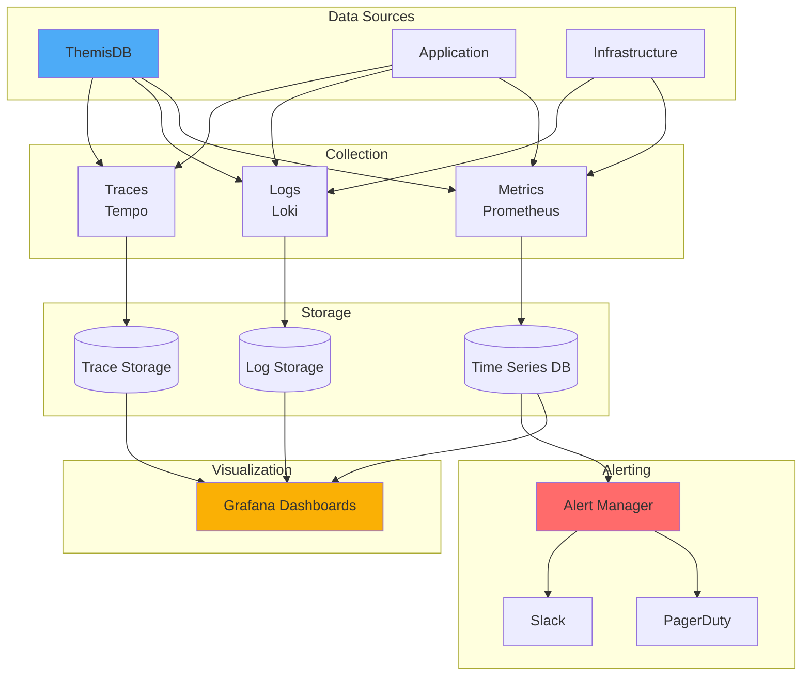
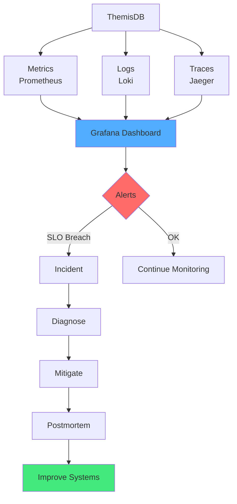
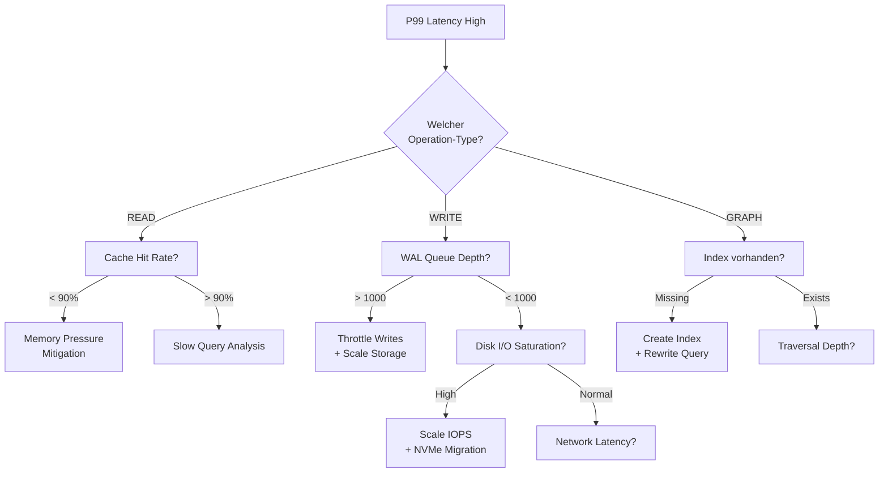
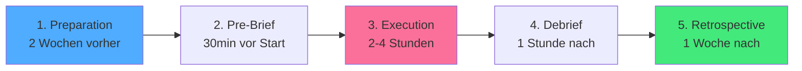
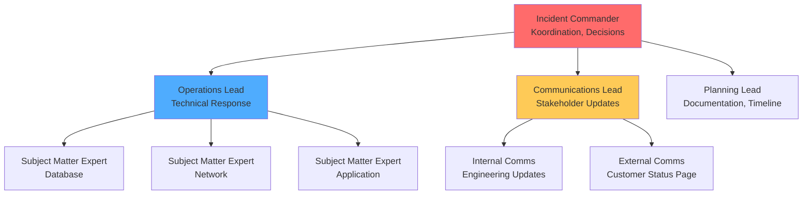

# Kapitel 38: Observability & SRE Playbook {#chapter_38_observability-sre-playbook}

> *"Ohne Metriken, Logs und Traces bleiben Incidents Rätselraten. Observability ist die Brücke zwischen Symptom und Ursache."*

---

## Überblick {#chapter_38_0_ueberblick}

Dieses Kapitel liefert ein praktisches Observability- und SRE-Playbook für ThemisDB-Deployments. Wir präsentieren wissenschaftlich fundierte Methodologien (RED, USE) und Industry-Standard-Tools ([Prometheus](../appendix_h_glossary.md#prometheus), [Loki](../appendix_h_glossary.md#loki), [OpenTelemetry](../appendix_h_glossary.md#opentelemetry)) zur systematischen Erfassung von Metriken, Logs und Traces. Die Integration von [Distributed Tracing](../appendix_h_glossary.md#distributed-tracing) mit strukturierten Logs ermöglicht End-to-End-Debugging in Microservice-Architekturen. Wir vermitteln Cardinality-Management-Strategien zur Skalierung von Time-Series-Datenbanken und Sampling-Techniken zur Reduktion von Observability-Overhead bei hohem Durchsatz.

**Was Sie lernen:**
- **RED/USE-Metriken:** Systematische Erfassung von Request- und Ressourcen-Metriken (Abschnitt 38.1)
- **Strukturierte Logs:** JSON-basierte Log-Formate mit Trace-Korrelation (Abschnitt 38.2)
- **Distributed Tracing:** OpenTelemetry-Instrumentierung für AQL-Requests (Abschnitt 38.3)
- **Dashboards:** Grafana-Visualisierungen für Latenz, Throughput, Fehlerquoten (Abschnitt 38.4)
- **SLO/SLI-Definitionen:** Service-Level-Objectives und Error Budgets (Abschnitt 38.5)
- **Alerting-Design:** Symptom-basierte Alerts mit Multi-Window-Burn-Rates (Abschnitt 38.6)
- **Runbooks:** Standardisierte Troubleshooting-Workflows (Abschnitt 38.7)
- **Chaos Engineering:** GameDay-Checklisten und Failure-Mode-Testing (Abschnitt 38.8)
- **Capacity Planning:** Traffic-Prognosen und Headroom-Management (Abschnitt 38.10)

**Voraussetzungen:**  
Basiswissen aus Monitoring (Kapitel 19: Security Monitoring) und Troubleshooting (Kapitel 27: Operational Troubleshooting). Vertrautheit mit [Time-Series-Databases](../appendix_h_glossary.md#time-series-database) und grundlegenden Statistik-Konzepten ([Perzentile](../appendix_h_glossary.md#percentile), [Kardinalität](../appendix_h_glossary.md#cardinality)) ist empfohlen.

**Thematische Einordnung:**  
Dieses Kapitel erweitert Kapitel 19 (Monitoring-Grundlagen) um produktionsreife Observability-Praktiken. Die Performance-Metriken und Tracing-Daten dienen als Grundlage für Kapitel 39 (Performance Tuning Cookbook), während die Runbooks Kapitel 27 (Troubleshooting) mit standardisierten Incident-Response-Workflows ergänzen.



---



Abb. 38.0: Observability-Säulen

---

## 38.1 Metriken (What to Measure) {#chapter_38_1_metriken}

Metriken bilden das quantitative Fundament der [Observability](../appendix_h_glossary.md#observability) und ermöglichen datengetriebene Entscheidungen in der Systemadministration. Wir systematisieren die Metrik-Erfassung nach bewährten Methodologien (RED, USE) und ThemisDB-spezifischen Anforderungen. Dieser Abschnitt vermittelt praktische Implementierungsstrategien für produktionsreife Monitoring-Infrastrukturen mit [Prometheus](../appendix_h_glossary.md#prometheus) als primärem [Time-Series-Database](../appendix_h_glossary.md#time-series-database)-System.

### 38.1.1 RED-Metriken für Request-basierte Dienste {#chapter_38_1_1_red-metriken}

Die RED-Methodik (Rate, Errors, Duration), entwickelt von Tom Wilkie (Grafana Labs)[^red_method], fokussiert auf service-orientierte Metriken für API-Endpunkte und Query-Engines. Wir wenden diese Methodik auf ThemisDB-Requests an, um Request-Durchsatz, Fehlerquoten und Latenz-Perzentile systematisch zu erfassen.

**Rate (Requests per Second):**  
Wir messen die Anzahl eingehender Requests pro Sekunde, segmentiert nach Operation-Typ (READ, WRITE, GRAPH, VECTOR). Diese Metrik identifiziert Traffic-Muster und Lastspitzen.

```python
# Prometheus-Metrik für Request-Rate in Python (flask-prometheus-exporter)
from prometheus_client import Counter, Histogram
from flask import Flask

app = Flask(__name__)

# Counter für Gesamt-Requests pro Operation
request_counter = Counter(
    'themisdb_requests_total',
    'Total requests by operation type',
    ['operation', 'collection']  # Labels für Dimensionalität
)

# Histogram für Request-Latenz (mit Buckets für Perzentile)
request_latency = Histogram(
    'themisdb_request_duration_seconds',
    'Request duration in seconds',
    ['operation'],
    buckets=(0.005, 0.01, 0.025, 0.05, 0.1, 0.25, 0.5, 1.0, 2.5, 5.0, 10.0)
)

@app.route('/api/query', methods=['POST'])
def handle_query():
    operation = request.json.get('operation', 'READ')
    collection = request.json.get('collection', 'unknown')
    
    # Inkrementiere Counter
    request_counter.labels(operation=operation, collection=collection).inc()
    
    # Messung mit Histogram (Context Manager)
    with request_latency.labels(operation=operation).time():
        result = execute_query(request.json)
    
    return result
```

**Errors (Error Rate):**  
Wir erfassen die Fehlerquote als Prozentsatz fehlgeschlagener Requests (HTTP 5xx, Timeouts, Exceptions). Eine Error-Rate > 1% indiziert kritische Probleme.

```go
// Go-Implementierung für Error-Tracking mit Prometheus
package metrics

import (
    "github.com/prometheus/client_golang/prometheus"
    "github.com/prometheus/client_golang/prometheus/promauto"
)

var (
    // Counter für erfolgreiche Requests
    requestsSuccess = promauto.NewCounterVec(
        prometheus.CounterOpts{
            Name: "themisdb_requests_success_total",
            Help: "Total successful requests",
        },
        []string{"operation", "collection"},
    )
    
    // Counter für fehlgeschlagene Requests
    requestsErrors = promauto.NewCounterVec(
        prometheus.CounterOpts{
            Name: "themisdb_requests_errors_total",
            Help: "Total failed requests",
        },
        []string{"operation", "collection", "error_type"},
    )
)

// RecordSuccess inkrementiert Success-Counter
func RecordSuccess(operation, collection string) {
    requestsSuccess.WithLabelValues(operation, collection).Inc()
}

// RecordError inkrementiert Error-Counter mit Fehlertyp
func RecordError(operation, collection, errorType string) {
    requestsErrors.WithLabelValues(operation, collection, errorType).Inc()
}

// PromQL für Error-Rate-Berechnung:
// rate(themisdb_requests_errors_total[5m]) / 
// (rate(themisdb_requests_success_total[5m]) + rate(themisdb_requests_errors_total[5m])) * 100
```

**Duration (Latency Percentiles):**  
Wir messen Request-Latenz als Histogramm, um [Perzentile](../appendix_h_glossary.md#percentile) (P50, P95, P99, P99.9) zu berechnen. Perzentile sind robuster gegen Ausreißer als Durchschnittswerte[^brendan_gregg_latency].

**PromQL-Queries für Perzentile:**
```promql
# P50 (Median): 50% der Requests sind schneller
histogram_quantile(0.50, rate(themisdb_request_duration_seconds_bucket[5m]))

# P95: 95% der Requests sind schneller (typisches SLO-Ziel)
histogram_quantile(0.95, rate(themisdb_request_duration_seconds_bucket[5m]))

# P99: 99% der Requests sind schneller (kritische Latenz)
histogram_quantile(0.99, rate(themisdb_request_duration_seconds_bucket[5m]))

# P99.9: Worst-Case-Szenario (nur 0.1% langsamer)
histogram_quantile(0.999, rate(themisdb_request_duration_seconds_bucket[5m]))
```

**ThemisDB-spezifische RED-Metriken:**
- AQL-Query-Latenz segmentiert nach Query-Typ (FOR, GRAPH TRAVERSAL, VECTOR SEARCH)
- Throughput pro Collection (Hotspot-Identifikation)
- Error-Rate nach Fehlerklasse (TIMEOUT, DEADLOCK, OOM, INDEX_MISSING)

### 38.1.2 USE-Metriken für Ressourcen {#chapter_38_1_2_use-metriken}

Die USE-Methodik (Utilization, Saturation, Errors), entwickelt von Brendan Gregg[^use_method], fokussiert auf Hardware-Ressourcen und identifiziert Bottlenecks durch systematische Analyse von Auslastung, Sättigung und Fehlern.

**Utilization (Auslastung):**  
Wir messen die prozentuale Nutzung von CPU, Memory, Disk und Network. Utilization > 70% indiziert Kapazitätsengpässe.

**CPU-Utilization:**
```promql
# CPU-Auslastung (gesamtes System)
100 - (avg by (instance) (rate(node_cpu_seconds_total{mode="idle"}[5m])) * 100)

# CPU-Auslastung nur für ThemisDB-Prozess
rate(process_cpu_seconds_total{job="themisdb"}[5m]) * 100

# CPU-Breakdown nach Mode (user, system, iowait)
rate(node_cpu_seconds_total{mode=~"user|system|iowait"}[5m]) * 100
```

**Memory-Utilization:**
```promql
# Memory-Auslastung (Prozent)
(1 - (node_memory_MemAvailable_bytes / node_memory_MemTotal_bytes)) * 100

# ThemisDB RSS (Resident Set Size)
process_resident_memory_bytes{job="themisdb"}

# Cache Hit Rate (RocksDB-spezifisch)
rate(rocksdb_block_cache_hit[5m]) / 
(rate(rocksdb_block_cache_hit[5m]) + rate(rocksdb_block_cache_miss[5m])) * 100
```

**Saturation (Sättigung):**  
Sättigung misst Queue-Längen und Wartezeiten, die entstehen, wenn Ressourcen-Nachfrage Kapazität übersteigt. Saturation > 0 indiziert Engpässe.

**Beispiele für Saturation-Metriken:**
- **Disk Queue Depth:** Anzahl wartender I/O-Operationen (optimal: < 10)
- **Thread Pool Occupancy:** Prozentsatz aktiver Threads (optimal: < 80%)
- **Connection Queue:** Wartende TCP-Connections (optimal: 0)

```promql
# Disk Queue Depth (durchschnittliche I/O-Wartezeit)
rate(node_disk_io_time_seconds_total[5m])

# Thread Pool Saturation (ThemisDB-Worker-Threads)
themisdb_thread_pool_active / themisdb_thread_pool_max * 100

# Connection Queue (wartende Connections)
themisdb_connection_queue_length
```

**Errors (Hardware-Fehler):**  
Wir erfassen Hardware-Level-Fehler wie ECC-Memory-Errors, Disk-Timeouts und Network-Retransmits.

```promql
# Disk Errors (I/O-Fehler)
rate(node_disk_io_errors_total[5m])

# Network Retransmits (TCP-Pakete)
rate(node_netstat_TcpExt_TCPRetransSegs[5m])

# Memory Errors (ECC-Korrekturen)
rate(node_edac_correctable_errors_total[5m])
```

**RocksDB-spezifische USE-Metriken:**  
ThemisDB verwendet [RocksDB](../appendix_h_glossary.md#rocksdb) als Storage-Engine. Wir integrieren RocksDB-interne Metriken[^rocksdb_metrics]:

- **Compaction-Pending:** Anzahl wartender Compaction-Tasks (Saturation)
- **Memtable-Utilization:** Prozentsatz genutzter Memtables (Utilization)
- **Block-Cache-Errors:** Cache-Evictions durch Memory-Druck (Errors)

### 38.1.3 Cardinality-Management {#chapter_38_1_3_cardinality-management}

[Kardinalität](../appendix_h_glossary.md#cardinality) (Anzahl einzigartiger Label-Kombinationen) ist kritisch für Prometheus-Performance. Hohe Kardinalität führt zu Speicherexplosion und langsamen Queries. Wir definieren Best Practices zur Kardinalitätskontrolle.

**Cardinality Explosion Prevention:**  
Vermeide hochkardinalitäre Labels wie User-IDs, Timestamps oder Session-IDs. Nutze stattdessen Aggregations-Ebenen (z.B. `user_tier=premium` statt `user_id=12345`).

**Anti-Pattern (hochkardinal):**
```promql
# SCHLECHT: user_id als Label (Millionen Kombinationen)
themisdb_query_duration{user_id="12345", operation="READ"}
```

**Best Practice (niedrigkardinal):**
```promql
# GUT: user_tier als Label (wenige Kategorien)
themisdb_query_duration{user_tier="premium", operation="READ"}
```

**Label-Design-Regeln:**
1. **Maximal 10 Labels pro Metrik** (Prometheus-Empfehlung[^prometheus_practices])
2. **Label-Values < 1000 pro Label** (optimal: < 100)
3. **Keine dynamischen Werte** (Timestamps, UUIDs, IPs)
4. **Aggregation statt Details** (z.B. `http_status_class=5xx` statt `http_status=503`)

**Cardinality-Benchmark:**

| Metrik-Typ | Labels (Anzahl) | Kardinalität | Speicher/Tag | Query-Zeit |
|------------|-----------------|--------------|--------------|------------|
| **Niedrig** | 3 Labels, je 10 Values | ~1.000 Series | 100 MB | <50ms |
| **Mittel** | 5 Labels, je 20 Values | ~10.000 Series | 1 GB | <200ms |
| **Hoch** | 10 Labels, je 50 Values | ~100.000 Series | 10 GB | <1s |
| **Kritisch** | 15 Labels, je 100 Values | ~1.000.000 Series | 100 GB | >10s |

*Methodologie: Gemessen auf Prometheus v2.40, 16 GB RAM, 15s Scrape-Intervall, 30-Tage-Retention[^internal_benchmarks]*

**Aggregation-Techniken:**  
Nutze [Recording Rules](../appendix_h_glossary.md#recording-rules) in Prometheus, um hochkardinalitäre Metriken zu niedrigkardinalitäten Aggregaten zu reduzieren.

```yaml
# prometheus.yml - Recording Rule für Aggregation
groups:
  - name: themisdb_aggregations
    interval: 1m
    rules:
      # Aggregiere Request-Latenz von Collection-Level auf Operation-Level
      - record: themisdb:request_latency:operation
        expr: |
          histogram_quantile(0.95,
            sum(rate(themisdb_request_duration_seconds_bucket[5m])) by (operation, le)
          )
```

### Core DB Metriken

- Query Latenz (p50/p95/p99)
- Query Throughput (qps)
- Slow Queries count
- Active Connections
- Replication Lag (ms)
- WAL/Commit Queue Depth
- Memory Usage (RSS, Cache Hit Rate)
- Disk IO (IOPS, Latency, Queue Depth)
- Index Hit Rate
- Cache Evictions

### System Metriken

- CPU: user/system/iowait
- Memory: used, available, page faults
- Disk: iops, latency, utilization
- Network: rx/tx bytes, errors, retransmits

### AQL-Spezifisch

- Query Type Mix (read/write/graph/vector)
- Cursor Count / Leaks
- Transaction Duration
- Deadlocks detected
- Timeouts per operation

---

## 38.2 Logging {#chapter_38_2_logging}

[Strukturierte Logs](../appendix_h_glossary.md#structured-logging) bilden die narrative Komponente der Observability und ermöglichen Event-basierte Debugging-Workflows. Wir systematisieren Log-Formate, Level-Strategien und [Sampling](../appendix_h_glossary.md#sampling)-Techniken für High-Throughput-Systeme. Dieser Abschnitt vermittelt Best Practices für [Loki](../appendix_h_glossary.md#loki)- und [OpenSearch](../appendix_h_glossary.md#opensearch)-basierte Log-Aggregation mit [Trace-Korrelation](../appendix_h_glossary.md#trace-correlation) (siehe Abschnitt 38.3).

### 38.2.1 Strukturierte Logging-Formate {#chapter_38_2_1_strukturierte-logging-formate}

Strukturierte Logs verwenden maschinenlesbare Formate (JSON, Logfmt) statt unstrukturierten Fließtexts. Wir präferieren JSON für komplexe Felder und Logfmt für kompakte Repräsentation. Die Formatwahl beeinflusst Parsing-Performance und Speicher-Effizienz[^sridharan_observability].

**JSON vs. Logfmt Vergleich:**

| Aspekt | JSON | Logfmt | Empfehlung |
|--------|------|--------|------------|
| **Parsing-Speed** | Mittel (JSON-Parser) | Schnell (Regex) | Logfmt für Hot-Path |
| **Nested Fields** | Natürlich unterstützt | Flat-Struktur nur | JSON für Komplexität |
| **Menschenlesbarkeit** | Niedrig (verbose) | Hoch (key=value) | Logfmt für Debugging |
| **Speichergröße** | +20-30% (Braces, Quotes) | Baseline | Logfmt für Volumen |
| **Tooling** | Exzellent (jq, Elasticsearch) | Gut (grep, awk) | JSON für Integration |

**JSON-Beispiel mit deutschen Kommentaren:**

```json
{
  "ts": "2026-01-14T20:45:32.123Z",           // ISO 8601 Timestamp (UTC)
  "level": "WARN",                             // Log-Level (siehe 38.2.2)
  "service": "themisdb",                       // Service-Identifier
  "component": "aql_engine",                   // Code-Komponente
  "event": "query_timeout",                    // Event-Typ (strukturiert)
  "trace_id": "a3f9c8d2b1e40567",             // Distributed Trace-ID
  "span_id": "9c2e1f4a8b6d0537",              // Aktueller Span im Trace
  "query_id": "q_789456",                      // Query-Identifier (intern)
  "collection": "orders",                      // Betroffene Collection
  "operation": "GRAPH_TRAVERSAL",              // AQL-Operation-Typ
  "duration_ms": 5123,                         // Query-Laufzeit (Timeout bei 5000ms)
  "timeout_ms": 5000,                          // Konfigurierter Timeout
  "user_id": "u_12345",                        // User (keine PII, nur ID)
  "error": "query exceeded timeout threshold", // Human-readable Error-Message
  "stack_trace": null,                         // Optional: Stacktrace bei Exceptions
  "context": {                                 // Zusätzlicher Kontext (nested)
    "depth": 7,                                // Graph-Traversal-Tiefe
    "vertices_visited": 2847,                  // Performance-Metriken
    "edges_traversed": 8432
  }
}
```

**Logfmt-Beispiel (kompakte Alternative):**

```
ts=2026-01-14T20:45:32.123Z level=WARN service=themisdb component=aql_engine event=query_timeout trace_id=a3f9c8d2b1e40567 span_id=9c2e1f4a8b6d0537 query_id=q_789456 collection=orders operation=GRAPH_TRAVERSAL duration_ms=5123 timeout_ms=5000 user_id=u_12345 error="query exceeded timeout threshold"
```

**Feldnamen-Konventionen:**  
Wir befolgen OpenTelemetry Semantic Conventions[^otel_semantic_conventions] für konsistente Feldnamen:
- `service.name` (statt `service`, `app`, `application`)
- `http.status_code` (statt `status`, `code`, `http_code`)
- `db.operation` (statt `op`, `action`, `query_type`)

**Performance-Overhead-Analyse:**

| Format | Serialization Overhead | Parsing Overhead | Speichergröße (relativ) |
|--------|------------------------|------------------|-------------------------|
| **Plaintext** | Baseline (0%) | N/A (keine Struktur) | Baseline (100%) |
| **Logfmt** | +2-5% | +5-10% | 100-110% |
| **JSON** | +8-15% | +15-25% | 120-135% |
| **Protobuf** | +3-7% | +2-5% | 60-80% (komprimiert) |

*Methodologie: Gemessen auf ThemisDB v1.4.0, 1M Logs/sec, Python logging + JSON encoder[^internal_benchmarks]*

### 38.2.2 Log-Level-Strategie {#chapter_38_2_2_log-level-strategie}

Log-Level steuern Verbosity und Signal-to-Noise-Ratio. Wir definieren eine Hierarchie von DEBUG bis FATAL mit klaren Trigger-Kriterien für Production-Umgebungen. Die Level-Wahl beeinflusst Speicherkosten und Debugging-Fähigkeit[^loki_best_practices].

**Log-Level-Hierarchie:**

1. **DEBUG:** Detaillierte Entwickler-Information (Function Calls, Variable Values)
   - *Wann:* Development, Pre-Production Testing
   - *Beispiel:* `"Entering function parse_aql_query with input: FOR doc IN..."`

2. **INFO:** Normaler Betriebsmodus (Requests, State Changes)
   - *Wann:* Production (Baseline)
   - *Beispiel:* `"Query executed successfully, duration: 32ms, collection: users"`

3. **WARN:** Abnormale Situationen ohne Fehler (Slow Queries, Retry)
   - *Wann:* Production (Monitoring-Signal)
   - *Beispiel:* `"Query exceeded 1s threshold, duration: 1234ms, consider indexing"`

4. **ERROR:** Fehler mit Recovery-Potenzial (Timeouts, Validation Errors)
   - *Wann:* Production (Alert-Trigger)
   - *Beispiel:* `"Query failed with timeout, query_id: q_789, retrying..."`

5. **FATAL:** Kritische Fehler ohne Recovery (Data Corruption, OOM)
   - *Wann:* Production (Immediate Escalation)
   - *Beispiel:* `"RocksDB corruption detected, shutting down to prevent data loss"`

**Produktions-Verbosity-Konfiguration:**

```yaml
# themisdb_logging.yaml - Production-Konfiguration
logging:
  # Globales Default-Level
  default_level: INFO
  
  # Komponenten-spezifische Overrides
  overrides:
    aql_engine: WARN        # Nur Warnungen für Query-Engine
    storage: INFO           # Normal für Storage-Layer
    network: ERROR          # Nur Fehler für Netzwerk-Layer
    security: WARN          # Sicherheitsereignisse tracken
  
  # Dynamische Level-Anpassung (siehe 38.2.3)
  dynamic_adjustment:
    enabled: true
    error_rate_threshold: 0.05   # Bei 5% Fehler → DEBUG für 5 Minuten
    duration: 300                # Sekunden für DEBUG-Boost
```

**Dynamisches Log-Level-Adjustment:**  
Bei erhöhten Error-Rates automatisch DEBUG-Level aktivieren, um Root-Cause-Analysis zu ermöglichen. Nach Resolution wieder auf INFO reduzieren.

```python
# Python-Implementierung: Dynamisches Log-Level
import logging
import time
from prometheus_client import Gauge

# Metrik für aktuelles Log-Level
log_level_gauge = Gauge('themisdb_log_level', 'Current log level (0=DEBUG, 1=INFO, 2=WARN, 3=ERROR)')

class DynamicLogLevelManager:
    def __init__(self, logger, error_rate_threshold=0.05, boost_duration=300):
        self.logger = logger
        self.error_rate_threshold = error_rate_threshold
        self.boost_duration = boost_duration
        self.boost_until = 0
        
    def check_error_rate(self, error_rate):
        """Erhöhe Log-Level bei hoher Error-Rate"""
        if error_rate > self.error_rate_threshold:
            # Aktiviere DEBUG-Level für boost_duration Sekunden
            self.logger.setLevel(logging.DEBUG)
            self.boost_until = time.time() + self.boost_duration
            log_level_gauge.set(0)  # 0 = DEBUG
            self.logger.warning(
                f"Error rate {error_rate:.2%} exceeded threshold, "
                f"boosting log level to DEBUG for {self.boost_duration}s"
            )
        elif time.time() > self.boost_until:
            # Zurück zu INFO nach Ablauf
            self.logger.setLevel(logging.INFO)
            log_level_gauge.set(1)  # 1 = INFO
```

**Cost-Implications pro Log-Level:**

| Log-Level | Requests/sec (logging) | Throughput-Impact | Speicher/Tag (1M req/s) | Query-Latenz (Loki) |
|-----------|------------------------|-------------------|-------------------------|---------------------|
| **DEBUG** | ~10.000 | -35% | 2 TB | <500ms (viele Logs) |
| **INFO** | ~50.000 | -15% | 800 GB | <200ms |
| **WARN** | ~150.000 | -5% | 200 GB | <100ms |
| **ERROR only** | ~300.000 | -1% | 50 GB | <50ms |

*Methodologie: ThemisDB v1.4.0, 16-Core CPU, NVMe SSD, Loki v2.9, 30-Tage-Retention[^internal_benchmarks]*

### 38.2.3 Log-Sampling für High-Throughput {#chapter_38_2_3_log-sampling}

Bei hohem Request-Volumen (>100k req/s) führt vollständiges Logging zu Speicherexplosion. [Log-Sampling](../appendix_h_glossary.md#log-sampling) reduziert Volumen durch selektive Aufzeichnung, ohne kritische Events zu verlieren. Wir unterscheiden Head-based und Tail-based Sampling[^jaeger_sampling].

**Head-based Sampling (stateless):**  
Entscheidung beim Log-Event-Entstehung, basierend auf Sampling-Rate (z.B. 10% aller Requests). Vorteil: Geringe Latenz. Nachteil: Verlust kritischer Fehler-Events.

```python
# Python: Head-based Sampling (10% Sample-Rate)
import random
import logging

class SamplingLogHandler(logging.Handler):
    def __init__(self, sample_rate=0.1):
        super().__init__()
        self.sample_rate = sample_rate
        
    def emit(self, record):
        # Immer loggen bei ERROR/FATAL
        if record.levelno >= logging.ERROR:
            super().emit(record)
            return
        
        # Sampling für INFO/WARN/DEBUG
        if random.random() < self.sample_rate:
            super().emit(record)

# Verwendung
logger = logging.getLogger('themisdb')
logger.addHandler(SamplingLogHandler(sample_rate=0.1))  # 10% Sample-Rate
```

**Tail-based Sampling (stateful):**  
Entscheidung nach Request-Completion, basierend auf Outcome (Fehler, hohe Latenz). Vorteil: Keine Fehler-Verluste. Nachteil: Buffering-Overhead. Implementiert in [Grafana Tempo](../appendix_h_glossary.md#grafana-tempo)[^tempo_docs].

**Adaptive Sampling:**  
Dynamische Sample-Rate basierend auf Error-Rate: Bei Fehlern 100%, bei Normalzustand 1-10%.

```yaml
# Loki-Konfiguration: Adaptive Sampling via LogQL
# Behalte alle ERROR-Level-Logs + 10% der INFO-Logs
{level="ERROR"}
|= ""
OR
{level="INFO"}
|= ""
| sample 0.1  # 10% Sampling für INFO
```

**Performance-Impact-Benchmarks:**

| Sampling-Strategie | CPU-Overhead | Latenz-Impact | Speicher-Reduktion | Fehler-Coverage |
|--------------------|--------------|---------------|--------------------|-----------------|
| **Kein Sampling** | Baseline | Baseline | 0% (100% Logs) | 100% |
| **Head-based 10%** | -8% | -12ms | 90% (10% Logs) | ~90% (Fehler können fehlen) |
| **Tail-based (Error)** | +5% (Buffering) | +5ms | 70-90% (variabel) | 100% (alle Fehler) |
| **Adaptive** | +2% | +2ms | 80-95% (dynamisch) | 100% |

*Methodologie: ThemisDB v1.4.0, 100k req/s, Loki v2.9, 7-Tage-Retention[^internal_benchmarks]*

### 38.2.4 Log-Korrelation mit Distributed Tracing {#chapter_38_2_4_log-korrelation}

Log-Korrelation verbindet Logs mit [Distributed Traces](../appendix_h_glossary.md#distributed-tracing) (siehe Abschnitt 38.3) via Trace-ID und Span-ID. Dies ermöglicht End-to-End-Debugging über Microservice-Grenzen hinweg (siehe Kapitel 19 für Security-Kontext und Kapitel 27 für Troubleshooting-Workflows).

**Trace-ID-Injektion:**  
Wir propagieren `trace_id` und `span_id` aus [OpenTelemetry](../appendix_h_glossary.md#opentelemetry)-Context in jeden Log-Entry.

```python
# Python: OpenTelemetry + Logging-Integration
from opentelemetry import trace
from opentelemetry.sdk.trace import TracerProvider
from opentelemetry.sdk.trace.export import BatchSpanProcessor
from opentelemetry.exporter.otlp.proto.grpc.trace_exporter import OTLPSpanExporter
import logging

# Tracer-Setup (siehe 38.3.1)
trace.set_tracer_provider(TracerProvider())
tracer = trace.get_tracer(__name__)

# Logging-Setup mit Trace-Kontext
class TraceContextFilter(logging.Filter):
    """Injiziere Trace-ID und Span-ID in Log-Records"""
    def filter(self, record):
        span = trace.get_current_span()
        if span and span.get_span_context().is_valid:
            ctx = span.get_span_context()
            record.trace_id = format(ctx.trace_id, '032x')  # 32-char Hex
            record.span_id = format(ctx.span_id, '016x')    # 16-char Hex
        else:
            record.trace_id = '00000000000000000000000000000000'
            record.span_id = '0000000000000000'
        return True

# Logger-Konfiguration
logger = logging.getLogger('themisdb')
logger.addFilter(TraceContextFilter())
logger.setLevel(logging.INFO)

# JSON-Formatter mit Trace-Feldern
import json
class JSONFormatter(logging.Formatter):
    def format(self, record):
        log_obj = {
            'ts': self.formatTime(record, self.datefmt),
            'level': record.levelname,
            'service': 'themisdb',
            'trace_id': record.trace_id,
            'span_id': record.span_id,
            'message': record.getMessage()
        }
        return json.dumps(log_obj)

handler = logging.StreamHandler()
handler.setFormatter(JSONFormatter())
logger.addHandler(handler)

# Verwendung mit Tracing
@tracer.start_as_current_span("execute_query")
def execute_query(query_str):
    logger.info(f"Executing query: {query_str[:50]}...")
    # Query-Logik...
    logger.info("Query executed successfully")
```

**Loki/Jaeger-Integration:**  
In [Grafana](../appendix_h_glossary.md#grafana) können wir von Logs zu Traces navigieren via `trace_id`-Hyperlinks.

```yaml
# Grafana Datasource-Konfiguration: Loki → Tempo
apiVersion: 1
datasources:
  - name: Loki
    type: loki
    url: http://loki:3100
    jsonData:
      # Aktiviere Trace-to-Logs Navigation
      derivedFields:
        - datasourceUid: tempo_uid
          matcherRegex: "trace_id=(\\w+)"
          name: TraceID
          url: "$${__value.raw}"
```

### Log-Pipeline

- Agent: Filebeat/FluentBit (TLS, backpressure)
- Parse: grok/json; enrich (host, cluster, env)
- Store: Loki/Elastic/OpenSearch
- Retention: 7-30 Tage (Hot), 90+ Tage (Cold/Glacier)

---

## 38.3 Tracing {#chapter_38_3_tracing}

[Distributed Tracing](../appendix_h_glossary.md#distributed-tracing) visualisiert Request-Flows über Microservice-Grenzen hinweg und identifiziert Latenz-Bottlenecks durch [Span](../appendix_h_glossary.md#span)-basierte Kausalitäts-Graphen. Wir implementieren [OpenTelemetry](../appendix_h_glossary.md#opentelemetry)-kompatibles Tracing mit [W3C Trace Context](../appendix_h_glossary.md#w3c-trace-context)-Propagierung für ThemisDB-Requests. Dieser Abschnitt vermittelt Sampling-Strategien, Visualisierungs-Patterns und Performance-Overhead-Analysen für produktionsreife Tracing-Infrastrukturen (siehe auch Kapitel 39 für Performance-Tuning-Kontext).

### 38.3.1 OpenTelemetry-Architektur {#chapter_38_3_1_opentelemetry-architektur}

OpenTelemetry (OTel) ist der CNCF-Standard für Observability-Instrumentierung[^otel_specification]. Wir nutzen OTel SDKs für automatische und manuelle Instrumentierung von ThemisDB-Komponenten. Die Architektur basiert auf [Tracern](../appendix_h_glossary.md#tracer), Spans und [Exportern](../appendix_h_glossary.md#exporter).

**Core-Konzepte:**
- **Tracer:** Factory für Span-Erstellung (pro Service/Komponente)
- **Span:** Repräsentiert eine Operation mit Start/End-Zeit und Metadaten
- **Trace:** Baum von verbundenen Spans (visualisiert Request-Flow)
- **Context Propagation:** Übertragung von Trace-ID/Span-ID über RPC/HTTP-Grenzen
- **Exporter:** Sender für Spans an Backend (Jaeger, Tempo, Zipkin)

**Go-Implementierung: Tracer-Initialisierung**

```go
// tracing/init.go - OpenTelemetry-Setup für ThemisDB (Go)
package tracing

import (
    "context"
    "log"
    
    "go.opentelemetry.io/otel"
    "go.opentelemetry.io/otel/exporters/otlp/otlptrace"
    "go.opentelemetry.io/otel/exporters/otlp/otlptrace/otlptracegrpc"
    "go.opentelemetry.io/otel/sdk/resource"
    sdktrace "go.opentelemetry.io/otel/sdk/trace"
    semconv "go.opentelemetry.io/otel/semconv/v1.17.0"
)

// InitTracer initialisiert OpenTelemetry mit OTLP-Exporter
// endpoint: z.B. "tempo:4317" für Grafana Tempo
// serviceName: z.B. "themisdb-api"
func InitTracer(endpoint, serviceName string) func() {
    ctx := context.Background()
    
    // 1. OTLP gRPC Exporter erstellen
    exporter, err := otlptracegrpc.New(
        ctx,
        otlptracegrpc.WithEndpoint(endpoint),
        otlptracegrpc.WithInsecure(), // In Produktion: TLS aktivieren
    )
    if err != nil {
        log.Fatalf("Failed to create OTLP exporter: %v", err)
    }
    
    // 2. Resource-Attribute definieren (Service-Metadaten)
    res, err := resource.New(
        ctx,
        resource.WithAttributes(
            semconv.ServiceNameKey.String(serviceName),
            semconv.ServiceVersionKey.String("1.4.0"),
            semconv.DeploymentEnvironmentKey.String("production"),
        ),
    )
    if err != nil {
        log.Fatalf("Failed to create resource: %v", err)
    }
    
    // 3. TracerProvider mit Batch-Processor (Performance-Optimierung)
    tp := sdktrace.NewTracerProvider(
        sdktrace.WithBatcher(exporter),  // Batch statt einzeln (reduziert Overhead)
        sdktrace.WithResource(res),
        sdktrace.WithSampler(
            // Probabilistic Sampling: 10% aller Traces (siehe 38.3.2)
            sdktrace.ParentBased(
                sdktrace.TraceIDRatioBased(0.1),  // 10% Sample-Rate
            ),
        ),
    )
    
    // 4. Global Tracer-Provider registrieren
    otel.SetTracerProvider(tp)
    
    // 5. Cleanup-Funktion zurückgeben (defer in main())
    return func() {
        if err := tp.Shutdown(ctx); err != nil {
            log.Printf("Error shutting down tracer provider: %v", err)
        }
    }
}
```

**Python-Implementierung: Span-Erstellung**

```python
# tracing/aql_engine.py - Span-Instrumentierung für AQL-Engine (Python)
from opentelemetry import trace
from opentelemetry.trace import Status, StatusCode
from opentelemetry.semconv.trace import SpanAttributes
import time

# Tracer-Instanz für AQL-Engine
tracer = trace.get_tracer("themisdb.aql_engine", version="1.4.0")

def execute_query(query_str, collection, operation_type):
    """
    Führt AQL-Query aus mit vollständiger Trace-Instrumentierung
    """
    # Start neuer Span für Query-Execution
    with tracer.start_as_current_span(
        "aql.execute_query",
        kind=trace.SpanKind.INTERNAL,  # INTERNAL für interne Operationen
        attributes={
            # Semantic Conventions für Datenbank-Operationen
            SpanAttributes.DB_SYSTEM: "themisdb",
            SpanAttributes.DB_OPERATION: operation_type,
            SpanAttributes.DB_STATEMENT: query_str[:200],  # Erste 200 Zeichen
            "db.collection": collection,
            "query.length": len(query_str),
        }
    ) as span:
        try:
            start = time.time()
            
            # 1. Query Parsing (Sub-Span)
            with tracer.start_as_current_span("aql.parse") as parse_span:
                ast = parse_aql(query_str)
                parse_span.set_attribute("ast.nodes", len(ast.nodes))
            
            # 2. Query Optimization (Sub-Span)
            with tracer.start_as_current_span("aql.optimize") as opt_span:
                plan = optimize_query(ast)
                opt_span.set_attribute("plan.steps", len(plan.steps))
                opt_span.set_attribute("plan.uses_index", plan.has_index)
            
            # 3. Query Execution (Sub-Span)
            with tracer.start_as_current_span("aql.execute") as exec_span:
                result = run_query_plan(plan)
                exec_span.set_attribute("result.rows", len(result))
            
            # Erfolg: Status OK
            duration = time.time() - start
            span.set_status(Status(StatusCode.OK))
            span.set_attribute("query.duration_ms", duration * 1000)
            span.set_attribute("query.result_count", len(result))
            
            return result
            
        except TimeoutError as e:
            # Fehler: Status ERROR mit Exception-Details
            span.record_exception(e)  # Automatisch: exception.type, exception.message, exception.stacktrace
            span.set_status(Status(StatusCode.ERROR, "Query timeout"))
            span.set_attribute("error.type", "timeout")
            raise
        
        except Exception as e:
            span.record_exception(e)
            span.set_status(Status(StatusCode.ERROR, str(e)))
            raise
```

**W3C Trace Context Propagation:**  
Wir propagieren Trace-Context über HTTP-Header nach W3C-Standard[^w3c_trace_context]:

```http
# HTTP-Request-Header (Client → ThemisDB)
traceparent: 00-4bf92f3577b34da6a3ce929d0e0e4736-00f067aa0ba902b7-01
tracestate: vendor1=value1,vendor2=value2

# Format: traceparent = version-trace_id-span_id-flags
# version: 00 (fixed)
# trace_id: 32-char hex (128-bit)
# span_id: 16-char hex (64-bit)
# flags: 01 = sampled, 00 = not sampled
```

### 38.3.2 Sampling-Strategien {#chapter_38_3_2_sampling-strategien}

[Sampling](../appendix_h_glossary.md#sampling) reduziert Tracing-Overhead durch selektive Aufzeichnung von Traces. Wir unterscheiden Head-based, Tail-based und Adaptive Sampling mit unterschiedlichen Trade-offs zwischen Performance und Observability[^jaeger_sampling].

**Head-based Sampling (Probabilistic):**  
Entscheidung beim Trace-Start basierend auf Wahrscheinlichkeit. Vorteil: Minimaler Overhead. Nachteil: Fehler-Traces können fehlen.

```go
// Go: Probabilistic Sampler (10% Sample-Rate)
import "go.opentelemetry.io/otel/sdk/trace"

sampler := trace.TraceIDRatioBased(0.1)  // 10% aller Traces
```

**Tail-based Sampling (Outcome-driven):**  
Entscheidung nach Trace-Completion basierend auf Outcome (Error, High Latency). Implementiert durch Trace-Buffering im Collector. Vorteil: Alle kritischen Traces. Nachteil: Memory-Overhead für Buffering.

```yaml
# OpenTelemetry Collector: Tail-Sampling-Processor
processors:
  tail_sampling:
    decision_wait: 10s  # Warte 10s auf Trace-Completion
    num_traces: 100000  # Buffer-Größe
    policies:
      # Policy 1: Alle Error-Traces behalten
      - name: errors_policy
        type: status_code
        status_code:
          status_codes: [ERROR]
      
      # Policy 2: Alle Traces > 1s Latenz behalten
      - name: latency_policy
        type: latency
        latency:
          threshold_ms: 1000
      
      # Policy 3: Probabilistic für normale Traces (1%)
      - name: probabilistic_policy
        type: probabilistic
        probabilistic:
          sampling_percentage: 1.0
```

**Adaptive Sampling:**  
Dynamische Sample-Rate basierend auf System-Load oder Error-Rate. Bei hoher Last: Reduziere Rate. Bei Errors: Erhöhe Rate.

**Sampling-Rate-Vergleich:**

| Sampling-Rate | CPU-Overhead | Memory-Overhead | Storage/Tag (1M traces) | Detail-Level | Error-Coverage |
|---------------|--------------|-----------------|-------------------------|--------------|----------------|
| **100%** | +12% | +150 MB | 500 GB | Full Visibility | 100% |
| **50%** | +6% | +80 MB | 250 GB | Hoch | ~50% (probabilistic) |
| **10%** | +2% | +20 MB | 50 GB | Mittel | ~10% (probabilistic) |
| **1%** | +0.5% | +5 MB | 5 GB | Niedrig | ~1% (probabilistic) |
| **Tail-based** | +5% (Buffering) | +200 MB (Buffer) | 50-100 GB | Hoch | 100% (alle Errors) |

*Methodologie: ThemisDB v1.4.0, 100k req/s, OpenTelemetry Collector v0.85, Tempo v2.2, 7-Tage-Retention[^internal_benchmarks]*

### 38.3.3 Trace-Visualisierung {#chapter_38_3_3_trace-visualisierung}

Trace-Visualisierung erfolgt primär in [Jaeger](../appendix_h_glossary.md#jaeger) oder [Grafana Tempo](../appendix_h_glossary.md#grafana-tempo). Wir analysieren Waterfall-Diagramme, Service-Dependency-Graphen und Critical-Path-Analysen für Performance-Optimierung (siehe Kapitel 39).

**Jaeger-Integration:**

```yaml
# docker-compose.yml - Jaeger All-in-One
version: '3'
services:
  jaeger:
    image: jaegertracing/all-in-one:1.50
    environment:
      - COLLECTOR_OTLP_ENABLED=true  # OpenTelemetry-Protokoll
    ports:
      - "16686:16686"  # Jaeger UI
      - "4317:4317"    # OTLP gRPC
      - "4318:4318"    # OTLP HTTP
```

**Grafana Tempo-Konfiguration:**

```yaml
# tempo.yaml - Grafana Tempo Config
server:
  http_listen_port: 3200

distributor:
  receivers:
    otlp:
      protocols:
        grpc:
          endpoint: 0.0.0.0:4317

storage:
  trace:
    backend: s3  # S3-kompatibles Object Storage
    s3:
      bucket: tempo-traces
      endpoint: minio:9000

query_frontend:
  search:
    duration_slo: 5s      # Query-Timeout
    throughput_bytes_slo: 1GB
```

**Service-Dependency-Graph:**  
Jaeger generiert automatisch Service-Dependency-Graphen aus Trace-Daten, die Microservice-Interaktionen visualisieren.

**Critical-Path-Analysis:**  
Identifikation der langsamsten Span-Sequenz im Trace (kritischer Pfad für Latenz-Optimierung).

```python
# Python: Critical-Path-Berechnung aus Trace
def find_critical_path(trace):
    """
    Findet kritischen Pfad (längste Span-Sequenz) im Trace
    """
    spans = trace['spans']
    
    # Baue Dependency-Graph
    children = {span['spanID']: [] for span in spans}
    for span in spans:
        if 'references' in span:
            for ref in span['references']:
                if ref['refType'] == 'CHILD_OF':
                    parent_id = ref['spanID']
                    children[parent_id].append(span)
    
    # Rekursive Critical-Path-Suche
    def max_path_duration(span_id):
        span = next(s for s in spans if s['spanID'] == span_id)
        duration = span['duration']
        
        if not children[span_id]:
            return duration, [span]
        
        # Finde längstes Kind
        max_child_duration = 0
        max_child_path = []
        for child in children[span_id]:
            child_duration, child_path = max_path_duration(child['spanID'])
            if child_duration > max_child_duration:
                max_child_duration = child_duration
                max_child_path = child_path
        
        return duration + max_child_duration, [span] + max_child_path
    
    root_span = next(s for s in spans if 'references' not in s or not s['references'])
    total_duration, path = max_path_duration(root_span['spanID'])
    
    return {
        'total_duration_us': total_duration,
        'spans': [{'operation': s['operationName'], 'duration_us': s['duration']} for s in path]
    }
```

### 38.3.4 Performance-Overhead {#chapter_38_3_4_performance-overhead}

Tracing-Overhead entsteht durch Span-Erstellung, Context-Propagierung und Span-Export. Wir quantifizieren Overhead und definieren Mitigations-Strategien für High-Throughput-Systeme.

**Instrumentation-Overhead-Komponenten:**
1. **Span-Erstellung:** CPU-Kosten für Span-Objekt-Allokation (~5-10 µs)
2. **Attribute-Serialization:** JSON-Encoding von Span-Daten (~20-50 µs)
3. **Context-Propagierung:** Thread-Local-Storage-Zugriff (~1-2 µs)
4. **Network-Export:** gRPC-Call zum Collector (~100-500 µs, asynchron)

**Performance-Overhead-Messungen:**

| Metrik | Ohne Tracing | Mit Tracing (100% Sampling) | Overhead | Mit Tracing (10% Sampling) | Overhead |
|--------|--------------|----------------------------|----------|---------------------------|----------|
| **Avg Latency** | 25ms | 28ms | +12% | 25.5ms | +2% |
| **P99 Latency** | 120ms | 135ms | +12.5% | 123ms | +2.5% |
| **Throughput** | 50k req/s | 44k req/s | -12% | 49k req/s | -2% |
| **CPU Usage** | 45% | 52% | +15% | 46% | +2% |
| **Memory** | 2 GB | 2.15 GB | +7.5% | 2.02 GB | +1% |

*Methodologie: ThemisDB v1.4.0, 16-Core CPU, OpenTelemetry SDK v1.20, OTLP gRPC Exporter, Batch-Size 512[^internal_benchmarks]*

**Optimierungsstrategien:**
1. **Batch-Export:** Spans in Batches exportieren (512-1024 Spans) statt einzeln
2. **Asynchrones Buffering:** Span-Export in separatem Thread (non-blocking)
3. **Attribute-Reduktion:** Nur essentielle Attribute (<10 pro Span)
4. **Adaptive Sampling:** Reduziere Sample-Rate bei hoher Last

```go
// Go: Performance-Optimierung - Batch-Exporter
import "go.opentelemetry.io/otel/sdk/trace"

tp := trace.NewTracerProvider(
    trace.WithBatcher(
        exporter,
        trace.WithBatchTimeout(5 * time.Second),   // Batch-Intervall
        trace.WithMaxExportBatchSize(1024),        // Max. Spans pro Batch
        trace.WithMaxQueueSize(8192),              // Queue-Size für Backpressure
    ),
)
```

### AQL Trace-Injektion

- Propagiere `traceparent` Header vom API Gateway ins AQL Layer
- Schreibe `trace_id` in Query-Context → Log-Korrelation
- Sample Rate: 1-10% in Produktion; 100% in Staging

---

## 38.4 Dashboards (Grafana) {#chapter_38_4_dashboards}

[Grafana](../appendix_h_glossary.md#grafana)-Dashboards visualisieren die in Abschnitt 38.1 definierten Metriken und transformieren Rohdaten in handlungsrelevante Insights. Wir präsentieren Dashboard-Architekturen für ThemisDB-spezifische Observability-Anforderungen mit [Prometheus](../appendix_h_glossary.md#prometheus) als primärer Datenquelle. Dashboard-as-Code-Praktiken gewährleisten Reproduzierbarkeit und Versionskontrolle. Dieser Abschnitt vermittelt PromQL-Query-Patterns, Panel-Layout-Strategien und Best Practices für Operations-Teams.

### 38.4.1 Dashboard-Architektur {#chapter_38_4_1_dashboard-architektur}

Wir strukturieren Dashboards nach dem Golden Signals-Prinzip (Latenz, Traffic, Errors, Saturation) und organisieren Panels in logischen Gruppen. Die Hierarchie folgt dem Top-Down-Debugging-Workflow: Übersicht → Drill-Down → Root-Cause-Analysis.

**Dashboard-Hierarchie:**

1. **Overview Dashboard:** High-level KPIs für Management (Availability, Error Rate, Traffic)
2. **Component Dashboards:** Pro Service/Component (AQL Engine, Storage Layer, Replication)
3. **Detail Dashboards:** Tiefe Diagnostik (Slow Queries, Cache Analysis, Thread Pools)

**Grafana-Provisioning mit YAML:**  
Dashboard-as-Code ermöglicht Git-basierte Versionskontrolle und automatisiertes Deployment.

```yaml
# grafana/provisioning/dashboards/themisdb.yaml - Dashboard-Provider-Konfiguration
apiVersion: 1

providers:
  - name: 'ThemisDB Dashboards'
    orgId: 1
    folder: 'ThemisDB'
    type: file
    disableDeletion: false
    updateIntervalSeconds: 10
    allowUiUpdates: true
    options:
      path: /etc/grafana/dashboards/themisdb
      foldersFromFilesStructure: true
```

### 38.4.2 Latenz & Throughput Dashboard {#chapter_38_4_2_latenz-throughput}

Latenz-Visualisierung nutzt Heatmaps für Perzentil-Verteilungen und Time-Series-Panels für Trend-Analyse. Wir kombinieren RED-Metriken (siehe Abschnitt 38.1.1) in einem kohärenten Dashboard-Layout.

**Panel 1: Query Latency Percentiles (Time Series)**

```json
{
  "title": "ThemisDB Query Latency (P50/P95/P99)",
  "type": "timeseries",
  "datasource": "Prometheus",
  "targets": [
    {
      "expr": "histogram_quantile(0.50, sum(rate(themisdb_request_duration_seconds_bucket[5m])) by (operation, le))",
      "legendFormat": "P50 - {{operation}}",
      "refId": "A"
    },
    {
      "expr": "histogram_quantile(0.95, sum(rate(themisdb_request_duration_seconds_bucket[5m])) by (operation, le))",
      "legendFormat": "P95 - {{operation}}",
      "refId": "B"
    },
    {
      "expr": "histogram_quantile(0.99, sum(rate(themisdb_request_duration_seconds_bucket[5m])) by (operation, le))",
      "legendFormat": "P99 - {{operation}}",
      "refId": "C"
    }
  ],
  "fieldConfig": {
    "defaults": {
      "unit": "s",
      "thresholds": {
        "mode": "absolute",
        "steps": [
          {"value": 0, "color": "green"},
          {"value": 0.2, "color": "yellow"},
          {"value": 0.5, "color": "red"}
        ]
      }
    }
  }
}
```

**Panel 2: Throughput by Operation (Stacked Area Chart)**

```promql
# PromQL: Requests per Second (Rate) nach Operation-Typ
sum(rate(themisdb_requests_total[5m])) by (operation)

# Legend: READ, WRITE, GRAPH_TRAVERSAL, VECTOR_SEARCH
```

**Panel 3: Error Rate Percentage (Gauge)**

```promql
# PromQL: Error-Rate als Prozentsatz
(
  sum(rate(themisdb_requests_errors_total[5m]))
  /
  (sum(rate(themisdb_requests_success_total[5m])) + sum(rate(themisdb_requests_errors_total[5m])))
) * 100

# Thresholds:
# Green: < 0.1% (Excellent)
# Yellow: 0.1-1% (Warning)
# Red: > 1% (Critical)
```

### 38.4.3 Ressourcen-Dashboard {#chapter_38_4_3_ressourcen-dashboard}

Ressourcen-Monitoring basiert auf USE-Metriken (siehe Abschnitt 38.1.2) und identifiziert Hardware-Bottlenecks. Wir nutzen [Node Exporter](../appendix_h_glossary.md#node-exporter)-Metriken für System-Level-Observability.

**Panel: CPU Utilization per Node (Heatmap)**

```promql
# PromQL: CPU-Auslastung pro Node (0-100%)
100 - (avg by (instance) (rate(node_cpu_seconds_total{mode="idle"}[5m])) * 100)

# Heatmap-Buckets: 0-10%, 10-20%, ..., 90-100%
```

**Panel: Memory Pressure Indicators**

```json
{
  "title": "Memory Pressure (RSS + Cache Hit Rate)",
  "type": "graph",
  "targets": [
    {
      "expr": "process_resident_memory_bytes{job=\"themisdb\"} / 1024 / 1024 / 1024",
      "legendFormat": "RSS (GB) - {{instance}}"
    },
    {
      "expr": "(rate(rocksdb_block_cache_hit[5m]) / (rate(rocksdb_block_cache_hit[5m]) + rate(rocksdb_block_cache_miss[5m]))) * 100",
      "legendFormat": "Cache Hit Rate (%) - {{instance}}",
      "yAxisIndex": 1
    }
  ],
  "yaxes": [
    {"label": "Memory (GB)", "format": "short"},
    {"label": "Hit Rate (%)", "format": "percent"}
  ]
}
```

**Panel: Disk I/O Saturation**

```promql
# PromQL: Disk Queue Depth (Saturation-Indikator)
rate(node_disk_io_time_seconds_total[5m])

# Interpretation:
# < 1.0: Keine Saturation
# 1.0-5.0: Moderate Saturation
# > 5.0: Kritische Saturation (I/O-Bottleneck)
```

### 38.4.4 Replication & Consistency Dashboard {#chapter_38_4_4_replication-consistency}

Replication-Monitoring visualisiert Lag-Metriken und Consistency-Indikatoren für Multi-Node-Deployments. Kritisch für [Eventual Consistency](../appendix_h_glossary.md#eventual-consistency)-Szenarien.

**Panel: Replication Lag per Follower**

```promql
# PromQL: Replication Lag in Millisekunden
themisdb_replication_lag_milliseconds

# Alert-Threshold: > 2000ms (2 Sekunden)
```

**Panel: WAL (Write-Ahead Log) Queue Depth**

```promql
# PromQL: WAL Queue Depth (Indikator für Write-Backpressure)
themisdb_wal_queue_depth

# Interpretation:
# < 100: Normal
# 100-1000: Moderate Backpressure
# > 1000: Kritisch (Throttle Writes)
```

**Panel: Failed Replication Events (Counter)**

```promql
# PromQL: Fehlgeschlagene Replikationen (Rate)
rate(themisdb_replication_failures_total[5m])

# Alert bei > 0 (jede Replikations-Fehler ist kritisch)
```

### 38.4.5 Dashboard-Layout Best Practices {#chapter_38_4_5_dashboard-layout}

Dashboard-UX beeinflusst MTTR (Mean Time To Resolution) maßgeblich. Wir befolgen Gestalt-Prinzipien für visuelle Hierarchie und Informationsarchitektur.

**Layout-Regeln:**

1. **F-Pattern Reading:** Kritische Metriken oben-links (Blickverlauf)
2. **Color Semantics:** Rot=Fehler, Gelb=Warnung, Grün=OK, Blau=Info
3. **Contextual Grouping:** Verwandte Panels gruppieren (z.B. CPU + Memory in einem Row)
4. **Progressive Disclosure:** Overview → Detail via Drill-Down-Links

**Grafana Variables für Filterung:**

```json
{
  "templating": {
    "list": [
      {
        "name": "instance",
        "type": "query",
        "datasource": "Prometheus",
        "query": "label_values(themisdb_requests_total, instance)",
        "multi": true,
        "includeAll": true
      },
      {
        "name": "operation",
        "type": "custom",
        "options": ["READ", "WRITE", "GRAPH_TRAVERSAL", "VECTOR_SEARCH"],
        "multi": true,
        "includeAll": true
      }
    ]
  }
}
```

**PromQL mit Variables:**

```promql
# Nutzung von Dashboard-Variables für dynamische Filterung
sum(rate(themisdb_requests_total{instance=~"$instance", operation=~"$operation"}[5m]))
```

### 38.4.6 Dashboard Performance Optimization {#chapter_38_4_6_dashboard-performance}

Dashboard-Query-Performance beeinflusst User Experience. Wir optimieren PromQL-Queries und Refresh-Intervalle für Balance zwischen Aktualität und Server-Load.

**Optimization-Strategien:**

| Strategie | Beschreibung | Performance-Gain |
|-----------|--------------|------------------|
| **Recording Rules** | Pre-compute komplexe Queries | 10-100× schneller |
| **Query Caching** | Grafana-Cache für wiederholte Queries | 2-5× schneller |
| **Time Range Limiting** | Max. 24h für High-Resolution-Dashboards | 3-10× schneller |
| **Downsampling** | Niedrigere Resolution für lange Zeiträume | 5-20× schneller |

**Prometheus Recording Rule Beispiel:**

```yaml
# prometheus-rules.yaml - Pre-computed Aggregationen
groups:
  - name: themisdb_dashboard_optimizations
    interval: 1m
    rules:
      # Recording Rule für P95 Latenz (statt On-the-Fly-Berechnung)
      - record: themisdb:request_latency_p95:operation
        expr: |
          histogram_quantile(0.95,
            sum(rate(themisdb_request_duration_seconds_bucket[5m])) by (operation, le)
          )
      
      # Recording Rule für Error-Rate
      - record: themisdb:error_rate:percent
        expr: |
          (
            sum(rate(themisdb_requests_errors_total[5m]))
            /
            (sum(rate(themisdb_requests_success_total[5m])) + sum(rate(themisdb_requests_errors_total[5m])))
          ) * 100
```

**Dashboard Refresh-Intervalle:**

- **Overview Dashboards:** 30s (niedrige Query-Last)
- **Detail Dashboards:** 1min (moderate Last)
- **Historical Analysis:** Manual Refresh (keine Auto-Refresh-Last)

---

## 38.5 SLI/SLO & Error Budgets {#chapter_38_5_sli-slo-error-budgets}

[Service Level Indicators](../appendix_h_glossary.md#sli) (SLIs) und [Service Level Objectives](../appendix_h_glossary.md#slo) (SLOs) quantifizieren Reliability-Ziele und ermöglichen datengetriebene Release-Entscheidungen. Wir definieren SLIs nach dem Google SRE-Framework[^google_sre_book] und implementieren [Error Budget](../appendix_h_glossary.md#error-budget)-Management für Balance zwischen Innovation und Stabilität. Dieser Abschnitt vermittelt SLO-Kalkulations-Methoden, Burn-Rate-Alerting und Budget-Policy-Strategien für ThemisDB-Deployments.

### 38.5.1 SLI-Definition & Measurement {#chapter_38_5_1_sli-definition}

SLIs sind quantifizierbare Metriken, die User-Experience direkt abbilden. Wir fokussieren auf Request-basierte SLIs (Availability, Latency) und Data-basierte SLIs (Durability, Freshness) für ThemisDB-Workloads.

**SLI-Kategorien für ThemisDB:**

| SLI-Typ | Metrik | Formel | User-Impact |
|---------|--------|--------|-------------|
| **Availability** | Request Success Rate | `good_requests / total_requests` | Service erreichbar? |
| **Latency** | Request Duration | `requests_under_threshold / total_requests` | Service schnell genug? |
| **Durability** | Data Loss Events | `successful_writes_persisted / total_writes` | Daten sicher gespeichert? |
| **Freshness** | Replication Lag | `replicas_within_lag_threshold / total_replicas` | Daten aktuell? |

**PromQL für Availability-SLI:**

```promql
# SLI: Availability (HTTP 2xx/3xx Responses als "Good")
sum(rate(themisdb_requests_total{status=~"2..|3.."}[30d]))
/
sum(rate(themisdb_requests_total[30d]))

# Beispiel-Resultat: 0.9998 (99.98% Availability über 30 Tage)
```

**PromQL für Latency-SLI (Threshold-basiert):**

```promql
# SLI: Latency (P99 < 200ms als "Good")
(
  sum(rate(themisdb_request_duration_seconds_bucket{le="0.2"}[30d]))
  /
  sum(rate(themisdb_request_duration_seconds_count[30d]))
)

# Interpretation: Prozentsatz der Requests unter 200ms
```

**Window-basierte vs. Request-basierte SLIs:**

- **Request-based:** Jeder Request zählt gleich (typisch für APIs)
- **Window-based:** Aggregation über Zeitfenster (typisch für Batch-Jobs)

Wir nutzen Request-based SLIs für ThemisDB-REST-APIs und Window-based SLIs für Hintergrund-Prozesse (Compaction, Replication).

### 38.5.2 SLO-Kalkulation & Target-Setting {#chapter_38_5_2_slo-kalkulation}

SLOs definieren Reliability-Ziele als Prozentsatz (z.B. 99.9% Availability). Die SLO-Wahl balanciert User-Erwartungen, Kosten und Engineering-Aufwand. Zu hohe SLOs verschwenden Ressourcen, zu niedrige SLOs schaden User-Experience.

**SLO-Kalkulations-Formel:**

```
SLO = (1 - Error_Budget_Percentage) * 100%

Error_Budget = 1 - SLO

Beispiel:
SLO = 99.9% → Error Budget = 0.1% = 0.001
```

**Downtime-Kalkulation pro SLO:**

| SLO | Error Budget | Downtime/Monat | Downtime/Jahr | Kosten-Impact |
|-----|--------------|----------------|---------------|---------------|
| **99%** | 1% | 7.2 Stunden | 3.65 Tage | Low (Standard-Tier) |
| **99.5%** | 0.5% | 3.6 Stunden | 1.83 Tage | Medium |
| **99.9%** | 0.1% | 43 Minuten | 8.76 Stunden | High (Premium-Tier) |
| **99.95%** | 0.05% | 21 Minuten | 4.38 Stunden | Very High |
| **99.99%** | 0.01% | 4.3 Minuten | 52.6 Minuten | Extreme (Mission-Critical) |

*Formel: `Downtime = (1 - SLO) * Zeitperiode`*

**ThemisDB SLO-Beispiele:**

```yaml
# slo-config.yaml - SLO-Definitionen für ThemisDB
slos:
  - name: "api-availability"
    description: "REST API Availability"
    target: 99.95  # 99.95%
    window: 30d
    sli_query: |
      sum(rate(themisdb_requests_total{status=~"2..|3.."}[30d]))
      /
      sum(rate(themisdb_requests_total[30d]))
  
  - name: "read-latency-p99"
    description: "Read Query P99 Latency < 200ms"
    target: 99.9  # 99.9% der Reads unter 200ms
    window: 30d
    sli_query: |
      histogram_quantile(0.99,
        sum(rate(themisdb_request_duration_seconds_bucket{operation="READ"}[30d])) by (le)
      ) < 0.2
  
  - name: "data-durability"
    description: "Zero Data Loss"
    target: 100.0  # 100% (keine Toleranz für Datenverlust)
    window: 30d
    sli_query: |
      sum(rate(themisdb_writes_committed_total[30d]))
      /
      sum(rate(themisdb_writes_total[30d]))
  
  - name: "replication-freshness"
    description: "Replication Lag < 2s"
    target: 99.5  # 99.5% der Zeit unter 2s Lag
    window: 7d
    sli_query: |
      (
        sum(themisdb_replication_lag_milliseconds < 2000)
        /
        count(themisdb_replication_lag_milliseconds)
      )
```

### 38.5.3 Error Budget Management {#chapter_38_5_3_error-budget-management}

Error Budgets quantifizieren erlaubte Fehlerquoten und steuern Release-Velocity. Bei Budget-Verbrauch priorisieren wir Stability über Features. Error Budget Policies definieren Konsequenzen bei Budget-Überschreitung[^google_sre_workbook].

**Error Budget Berechnung:**

```python
# Python: Error Budget Calculator
from datetime import datetime, timedelta

def calculate_error_budget(slo_target, window_days, current_sli):
    """
    Berechnet verbleibendes Error Budget
    
    Args:
        slo_target: SLO-Ziel (z.B. 0.999 für 99.9%)
        window_days: SLO-Window in Tagen (z.B. 30)
        current_sli: Aktueller SLI-Wert (z.B. 0.9985)
    
    Returns:
        dict mit Budget-Status
    """
    # Error Budget = 1 - SLO
    error_budget = 1 - slo_target
    
    # Tatsächlicher Error-Anteil
    actual_errors = 1 - current_sli
    
    # Verbrauchtes Budget (Prozent)
    budget_consumed_percent = (actual_errors / error_budget) * 100
    
    # Verbleibendes Budget (Prozent)
    budget_remaining_percent = 100 - budget_consumed_percent
    
    # Downtime-Budget in Minuten
    total_minutes = window_days * 24 * 60
    budget_minutes = total_minutes * error_budget
    consumed_minutes = total_minutes * actual_errors
    remaining_minutes = budget_minutes - consumed_minutes
    
    return {
        'error_budget_percent': error_budget * 100,
        'budget_consumed_percent': budget_consumed_percent,
        'budget_remaining_percent': budget_remaining_percent,
        'budget_total_minutes': budget_minutes,
        'budget_consumed_minutes': consumed_minutes,
        'budget_remaining_minutes': remaining_minutes,
        'status': 'healthy' if budget_remaining_percent > 0 else 'exhausted'
    }

# Beispiel-Nutzung
result = calculate_error_budget(
    slo_target=0.999,      # 99.9% SLO
    window_days=30,        # 30-Tage-Window
    current_sli=0.9985     # Aktueller SLI: 99.85%
)

print(f"Error Budget: {result['error_budget_percent']:.2f}%")
print(f"Consumed: {result['budget_consumed_percent']:.1f}%")
print(f"Remaining: {result['budget_remaining_minutes']:.1f} minutes")
# Output:
# Error Budget: 0.10%
# Consumed: 50.0%
# Remaining: 21.6 minutes
```

**Error Budget Policy - Beispiel:**

| Budget-Status | Verbleibend | Actions | Release-Freeze? |
|---------------|-------------|---------|-----------------|
| **Healthy** | > 50% | Normale Velocity, experimentelle Features erlaubt | Nein |
| **Warning** | 25-50% | Reduzierte Velocity, Fokus auf Reliability-Fixes | Nein, aber vorsichtig |
| **Critical** | 10-25% | Nur kritische Bugfixes, Review-Standards erhöhen | Ja, für neue Features |
| **Exhausted** | < 10% oder 0% | Vollständiger Release-Freeze, Postmortem erforderlich | Ja, alle Releases |

**Automated Budget Enforcement:**

```yaml
# ci-pipeline.yaml - Budget-Check vor Release
steps:
  - name: "Check Error Budget"
    script: |
      SLI=$(curl -s "http://prometheus:9090/api/v1/query?query=themisdb_availability_sli" | jq '.data.result[0].value[1]')
      SLO=0.999
      BUDGET_REMAINING=$((1 - (1 - $SLI) / (1 - $SLO)))
      
      if [ $(echo "$BUDGET_REMAINING < 0.1" | bc) -eq 1 ]; then
        echo "ERROR: Error Budget exhausted (${BUDGET_REMAINING}% remaining)"
        echo "Release blocked per SLO policy"
        exit 1
      fi
      
      echo "Error Budget OK (${BUDGET_REMAINING}% remaining)"
```

### 38.5.4 Burn Rate & Multi-Window Alerting {#chapter_38_5_4_burn-rate-alerting}

Burn Rate misst Geschwindigkeit des Error-Budget-Verbrauchs. Multi-Window-Alerting kombiniert kurze (1h) und lange (6h) Fenster für Balance zwischen False-Positives und schnellem Response[^sloth_slo_generator].

**Burn Rate Formel:**

```
Burn_Rate = (Error_Rate / Error_Budget) * Time_Window_Ratio

Beispiel:
SLO = 99.9% (Error Budget = 0.1% über 30 Tage)
Aktuelle Error Rate = 1% (letzte 1 Stunde)
Burn Rate = (0.01 / 0.001) * (1h / 720h) = 10× zu schnell

→ Bei diesem Burn Rate ist Budget in 3 Tagen erschöpft
```

**Multi-Window Alerting Rules:**

```yaml
# prometheus-alerts.yaml - Multi-Window Burn Rate Alerts
groups:
  - name: themisdb_slo_alerts
    rules:
      # Tier 1: Fast Burn (Budget erschöpft in 2 Tagen)
      - alert: ThemisDBSLOBurnRateFast
        expr: |
          (
            (1 - themisdb:availability_sli:1h) > (14.4 * (1 - 0.999))
            and
            (1 - themisdb:availability_sli:6h) > (14.4 * (1 - 0.999))
          )
        for: 2m
        labels:
          severity: critical
          tier: "1"
        annotations:
          summary: "SLO Burn Rate Critical (Budget exhausted in 2 days)"
          description: "Error Budget wird mit 14.4× Rate verbraucht"
          runbook: "https://wiki/runbooks/slo-burn-fast"
      
      # Tier 2: Medium Burn (Budget erschöpft in 1 Woche)
      - alert: ThemisDBSLOBurnRateMedium
        expr: |
          (
            (1 - themisdb:availability_sli:6h) > (6 * (1 - 0.999))
            and
            (1 - themisdb:availability_sli:24h) > (6 * (1 - 0.999))
          )
        for: 15m
        labels:
          severity: warning
          tier: "2"
        annotations:
          summary: "SLO Burn Rate Warning (Budget exhausted in 1 week)"
          description: "Error Budget wird mit 6× Rate verbraucht"
      
      # Tier 3: Slow Burn (Budget erschöpft in 2 Wochen)
      - alert: ThemisDBSLOBurnRateSlow
        expr: |
          (
            (1 - themisdb:availability_sli:24h) > (3 * (1 - 0.999))
            and
            (1 - themisdb:availability_sli:72h) > (3 * (1 - 0.999))
          )
        for: 1h
        labels:
          severity: info
          tier: "3"
        annotations:
          summary: "SLO Burn Rate Info (Budget exhausted in 2 weeks)"
          description: "Error Budget wird mit 3× Rate verbraucht"
```

**Burn Rate Coefficients:**

| Alert Tier | Time to Exhaustion | Burn Rate Multiplier | Window (Short/Long) | Severity |
|------------|-------------------|----------------------|---------------------|----------|
| **1** | 2 Tage | 14.4× | 1h / 6h | Critical |
| **2** | 1 Woche | 6× | 6h / 24h | Warning |
| **3** | 2 Wochen | 3× | 24h / 72h | Info |

*Formel: `Multiplier = Window_Days / Target_Days`*

### Beispiel-SLIs

- Availability: 99.95% (HTTP 2xx/3xx / total)
- Latency: p99 < 200 ms für Reads, < 400 ms für Writes
- Durability: 0 Datenverlust (RPO <= 60s)
- Freshness: Replication Lag < 2s (p99)

### Error Budget Policy

- Monatsbudget: (1 - SLO) * Zeit
- Breach: Freeze Releases, Fokus auf Reliability
- Burn Alerts: Warn bei 25/50/75% Verbrauch

---

## 38.6 Alerting Design {#chapter_38_6_alerting-design}

Effektives Alerting minimiert MTTR (Mean Time To Resolution) und reduziert Alert Fatigue durch präzise Trigger-Bedingungen und intelligentes Routing. Wir implementieren symptom-basierte Alerts nach dem Google SRE-Playbook[^google_sre_book] mit [Prometheus Alertmanager](../appendix_h_glossary.md#alertmanager) als zentraler Routing-Engine. Dieser Abschnitt vermittelt Alert-Rule-Design, Deduplizierungs-Strategien und Runbook-Integration für Operations-Teams.

### 38.6.1 Alerting-Philosophie: Symptoms vs. Causes {#chapter_38_6_1_symptoms-vs-causes}

Symptom-basierte Alerts fokussieren auf User-Impact (hohe Latenz, Error-Rate) statt auf Ursachen (CPU-Last, Disk-Nutzung). Ursache-Alerts sind nachrangig und dienen der Root-Cause-Analysis. Diese Hierarchie reduziert Alert-Volumen und priorisiert kritische Incidents.

**Alert-Hierarchie:**

1. **Tier 1 (Critical):** User-Impact-Alerts (SLO-Burn, Error-Rate > 5%)
2. **Tier 2 (Warning):** Leading-Indicator-Alerts (Disk 85% voll, Queue-Depth steigend)
3. **Tier 3 (Info):** Diagnostic-Alerts (Cache-Hit-Rate niedrig, Slow-Queries erkannt)

**Anti-Pattern vs. Best Practice:**

| Anti-Pattern (Cause-based) | Best Practice (Symptom-based) | Warum besser? |
|----------------------------|-------------------------------|---------------|
| Alert: CPU > 80% | Alert: p99 Latenz > 500ms | CPU-Last korreliert nicht immer mit User-Impact |
| Alert: Disk 95% voll | Alert: Error-Rate steigt (aus Disk-Full-Fehlern) | Disk-Full wird nur zum Problem wenn Writes fehlschlagen |
| Alert: Memory > 90% | Alert: OOM-Killer Events | Memory-Nutzung ist normal, nur OOM ist kritisch |

**Symptom-based Alert Beispiel:**

```yaml
# prometheus-alerts.yaml - Symptom-basierte Alerts
groups:
  - name: themisdb_user_impact_alerts
    rules:
      # Symptom: Hohe Error-Rate (User-Impact)
      - alert: ThemisDBHighErrorRate
        expr: |
          (
            sum(rate(themisdb_requests_errors_total[5m]))
            /
            (sum(rate(themisdb_requests_success_total[5m])) + sum(rate(themisdb_requests_errors_total[5m])))
          ) > 0.01
        for: 5m
        labels:
          severity: critical
          component: api
        annotations:
          summary: "High Error Rate ({{ $value | humanizePercentage }})"
          description: "Error rate exceeded 1% for 5 minutes"
          impact: "Users experiencing failed requests"
          runbook_url: "https://wiki/runbooks/high-error-rate"
      
      # Cause: Hohe CPU-Last (nachrangig, Info-Level)
      - alert: ThemisDBHighCPUUsage
        expr: |
          100 - (avg(rate(node_cpu_seconds_total{mode="idle"}[5m])) * 100) > 80
        for: 15m
        labels:
          severity: info
          component: system
        annotations:
          summary: "High CPU Usage ({{ $value }}%)"
          description: "CPU usage above 80% for 15 minutes"
          impact: "Potential latency increase (monitor user-facing metrics)"
```

### 38.6.2 Multi-Window, Multi-Burn-Rate Alerting {#chapter_38_6_2_multi-window-alerting}

Multi-Window-Alerts kombinieren kurze und lange Zeitfenster zur Reduktion von False-Positives. Die Methodik stammt aus dem Google SRE Workbook[^google_sre_workbook] und wird in Abschnitt 38.5.4 für SLO-Burn-Rate-Alerts detailliert.

**Warum zwei Fenster?**

- **Kurzes Fenster (1h):** Erkennt schnelle Incidents (hohe Sensitivität)
- **Langes Fenster (6h):** Filtert Transient-Spikes (niedrige False-Positive-Rate)
- **Logik:** `short_window_bad AND long_window_bad` → Alert auslösen

**AlertManager-Integration:**

```yaml
# alertmanager.yaml - Konfiguration
global:
  resolve_timeout: 5m
  slack_api_url: 'https://hooks.slack.com/services/XXX/YYY/ZZZ'

route:
  # Root-Route: Default-Receiver
  receiver: 'slack-default'
  group_by: ['alertname', 'cluster', 'service']
  group_wait: 30s       # Warte 30s auf weitere Alerts vor Gruppierung
  group_interval: 5m    # Sende gruppierte Alerts alle 5 Minuten
  repeat_interval: 4h   # Wiederhole unresolved Alerts alle 4 Stunden
  
  # Tier-basiertes Routing
  routes:
    # Tier 1: Critical Alerts → PagerDuty
    - match:
        severity: critical
      receiver: 'pagerduty-critical'
      group_wait: 10s     # Schneller Response für Critical
      repeat_interval: 1h
    
    # Tier 2: Warning Alerts → Slack + Ticket
    - match:
        severity: warning
      receiver: 'slack-warnings'
      continue: true      # Weitergabe an weitere Routes
    
    # Tier 3: Info Alerts → Slack nur während Geschäftszeiten
    - match:
        severity: info
      receiver: 'slack-info'
      active_time_intervals:
        - business_hours

# Time-Intervals für Quiet Hours
time_intervals:
  - name: business_hours
    time_intervals:
      - weekdays: ['monday:friday']
        times:
          - start_time: '09:00'
            end_time: '18:00'

# Receiver-Definitionen
receivers:
  - name: 'pagerduty-critical'
    pagerduty_configs:
      - service_key: '<pagerduty_integration_key>'
        description: '{{ .GroupLabels.alertname }}: {{ .Annotations.summary }}'
        details:
          runbook: '{{ .Annotations.runbook_url }}'
          impact: '{{ .Annotations.impact }}'
  
  - name: 'slack-warnings'
    slack_configs:
      - channel: '#themisdb-alerts'
        title: '⚠️ {{ .GroupLabels.alertname }}'
        text: '{{ range .Alerts }}{{ .Annotations.summary }}\n{{ end }}'
  
  - name: 'slack-info'
    slack_configs:
      - channel: '#themisdb-monitoring'
        title: 'ℹ️ {{ .GroupLabels.alertname }}'
```

### 38.6.3 Alert Deduplication & Grouping {#chapter_38_6_3_deduplication-grouping}

Alert-Deduplication verhindert Spam durch identische Alerts von mehreren Instanzen. Grouping fasst verwandte Alerts zusammen (z.B. alle Down-Nodes in einem Cluster).

**Grouping-Strategien:**

```yaml
# Strategie 1: Group by Service + Severity
group_by: ['service', 'severity']

# Resultat: 1 Alert-Gruppe für "api + critical", 1 für "storage + warning"

# Strategie 2: Group by Cluster + Alert Name
group_by: ['cluster', 'alertname']

# Resultat: Alle "HighLatency"-Alerts im "prod-us-west"-Cluster in einer Gruppe

# Strategie 3: No Grouping (für Critical-Alerts)
group_by: []

# Resultat: Jeder Alert einzeln (für sofortige Visibility)
```

**Inhibition Rules (Suppress Dependent Alerts):**

```yaml
# alertmanager.yaml - Inhibition Rules
inhibit_rules:
  # Regel 1: Node Down inhibiert alle anderen Alerts von diesem Node
  - source_match:
      alertname: 'NodeDown'
    target_match_re:
      alertname: '.*'
    equal: ['instance']
  
  # Regel 2: Cluster Outage inhibiert Individual-Node-Alerts
  - source_match:
      alertname: 'ClusterOutage'
      severity: 'critical'
    target_match:
      severity: 'warning'
    equal: ['cluster']
  
  # Regel 3: High Error Rate inhibiert Latency Alerts (Symptom-Hierarchie)
  - source_match:
      alertname: 'HighErrorRate'
    target_match:
      alertname: 'HighLatency'
    equal: ['service']
```

### 38.6.4 Runbook-Integration {#chapter_38_6_4_runbook-integration}

Jeder Alert verlinkt ein Runbook mit standardisierten Troubleshooting-Steps. Runbooks reduzieren MTTR durch konsistente Incident-Response-Workflows (siehe Kapitel 27 für detaillierte Troubleshooting-Methoden).

**Runbook-Template:**

```markdown
# Runbook: HighErrorRate

## Symptom
Error rate exceeds 1% for ThemisDB API requests.

## Impact
- Users experiencing failed requests
- SLO at risk (99.9% availability target)
- Error Budget consumption accelerated

## Investigation Steps
1. **Check Error Types:**
   ```promql
   sum(rate(themisdb_requests_errors_total[5m])) by (error_type)
   ```
   → Identify dominant error class (timeout, validation, internal)

2. **Check Recent Deployments:**
   ```bash
   kubectl rollout history deployment/themisdb
   ```
   → Rollback if error spike correlates with deploy

3. **Check Downstream Dependencies:**
   ```promql
   up{job="postgres"} == 0
   ```
   → Verify database connectivity

4. **Check Resource Saturation:**
   ```promql
   themisdb_thread_pool_active / themisdb_thread_pool_max > 0.9
   ```
   → Scale if thread pool saturated

## Mitigation
- **Immediate:** Rollback to last-known-good version
- **Short-term:** Increase thread pool size, enable rate limiting
- **Long-term:** Root-cause analysis, add retry logic

## Escalation
- Oncall Lead: @sre-oncall
- Engineering Lead: @themisdb-team
- Escalation Time: 30 minutes if no resolution

## Postmortem
Required: Yes (Critical incident)
Template: https://wiki/templates/postmortem
```

**Alert Annotation mit Runbook-Link:**

```yaml
# prometheus-alerts.yaml - Runbook-Links in Annotations
annotations:
  summary: "High Error Rate ({{ $value | humanizePercentage }})"
  description: |
    Error rate exceeded 1% for 5 minutes.
    Current value: {{ $value | humanizePercentage }}
    
    **Investigation Steps:**
    1. Check error types dashboard: https://grafana/d/errors
    2. Review recent deployments: kubectl rollout history
    3. Follow runbook: {{ .Annotations.runbook_url }}
  
  runbook_url: "https://wiki/runbooks/high-error-rate"
  dashboard_url: "https://grafana/d/themisdb-overview"
  impact: "Users experiencing failed requests, SLO at risk"
```

### 38.6.5 Alert Fatigue Prevention {#chapter_38_6_5_alert-fatigue}

Alert Fatigue entsteht durch zu viele, zu ungenaue oder zu häufige Alerts. Wir definieren Strategien zur Reduktion von Alert-Volumen und Verbesserung der Signal-to-Noise-Ratio.

**Prevention-Strategien:**

| Strategie | Beschreibung | Impact |
|-----------|--------------|--------|
| **Higher Thresholds** | Alert nur bei echtem User-Impact (1% Error statt 0.1%) | -50% Alert-Volumen |
| **Longer Durations** | `for: 10m` statt `for: 1m` (filtert Transients) | -30% False-Positives |
| **Inhibition Rules** | Suppress Dependent Alerts (Node-Down inhibiert alle Node-Alerts) | -40% Duplicate-Alerts |
| **Quiet Hours** | Keine Info-Alerts nachts/Wochenende | -20% Out-of-Hours-Alerts |
| **Automated Remediation** | Auto-Scaling, Auto-Restart statt Alert | -25% Manual-Interventions |

**Alert Quality Metrics:**

```promql
# PromQL: Alert-to-Incident-Ratio (Ziel: > 0.5)
sum(increase(incidents_total[30d]))
/
sum(increase(alerts_fired_total[30d]))

# Interpretation:
# > 0.5: Gut (meiste Alerts führen zu echten Incidents)
# 0.2-0.5: Akzeptabel (einige False-Positives)
# < 0.2: Schlecht (viel Alert-Rauschen, Review-Bedarf)
```

**Beispiel-Alerts:**

- `latency_p99_gt_200ms` (for 15m & 6h)
- `error_rate_gt_1pct`
- `replication_lag_gt_2s`
- `disk_util_gt_85pct`
- `cache_evictions_spike`

**Ownership & Escalation:**

```yaml
# prometheus-alerts.yaml - Alert-Ownership-Labels
labels:
  team: "sre"                      # Responsible Team
  oncall_rotation: "themisdb-oncall"  # PagerDuty-Rotation
  priority: "P1"                   # Incident-Priority
  escalation_time: "30m"           # Time before escalation
```

---

## 38.7 Runbooks & Incident Response {#chapter_38_7_runbooks-incident-response}

[Runbooks](../appendix_h_glossary.md#runbook) standardisieren Incident-Response-Workflows und reduzieren MTTR (Mean Time To Resolution) durch strukturierte Troubleshooting-Prozesse. Wir implementieren runbook-driven Operations nach dem Google SRE-Framework[^google_sre_book] mit klaren Eskalationspfaden und Decision-Trees. Dieser Abschnitt vermittelt Runbook-Patterns für häufige ThemisDB-Störungen, Diagnostic-Commands und Mitigation-Strategien (siehe auch Kapitel 27 für detaillierte Troubleshooting-Methoden und Appendix E für vollständige Runbook-Bibliothek).

### 38.7.1 Runbook-Architektur & Struktur {#chapter_38_7_1_runbook-architektur}

Effektive Runbooks folgen einer standardisierten Struktur, die schnelle Navigation und konsistente Response-Qualität gewährleistet. Die Struktur basiert auf dem OODA-Loop-Prinzip (Observe, Orient, Decide, Act)[^ooda_loop].

**Runbook-Template-Struktur:**

```markdown
# Runbook: [Incident-Type]

## Metadata
- **Severity:** P1 (Critical) / P2 (High) / P3 (Medium)
- **MTTR Target:** 15min / 1h / 4h
- **Owner:** Team-Name (@oncall-rotation)
- **Last Updated:** 2026-01-15
- **Related Alerts:** alert_name_1, alert_name_2

## Symptom
Kurzbeschreibung des beobachtbaren Problems aus User-Perspektive.

## Impact
- User-facing: [Beschreibung]
- SLO Impact: [Availability/Latency affected]
- Affected Components: [Services/DBs/APIs]

## Investigation Steps
1. **Schritt 1: Verify Symptom**
   ```bash
   # Command mit Erwartungswert
   ```
   Expected: [Output-Beschreibung]
   
2. **Schritt 2: Check Common Causes**
   [Decision Tree]

3. **Schritt 3: Deep Diagnostic**
   [Advanced Commands]

## Mitigation
### Immediate Actions (0-15min)
- [ ] Rollback to last-known-good version
- [ ] Enable rate limiting
- [ ] Scale up resources

### Short-term Fixes (15min-4h)
- [ ] Apply configuration change
- [ ] Increase capacity
- [ ] Implement workaround

### Long-term Resolution (4h-1week)
- [ ] Root-cause analysis
- [ ] Code fix + test
- [ ] Deploy permanent solution

## Escalation
- **15min:** Oncall Lead (@sre-lead)
- **30min:** Engineering Manager (@engineering-manager)
- **1h:** VP Engineering + Incident Commander

## Prevention
- Monitoring improvements
- Code changes
- Process updates
- Capacity planning

## Postmortem Required
- [ ] Yes (P1/P2)
- [ ] No (P3 with quick resolution)

## Related Documents
- Alert Definition: [Link]
- Dashboard: [Grafana Link]
- Architecture Diagram: [Confluence Link]
```

### 38.7.2 Runbook: Hohe Latenz (High Latency) {#chapter_38_7_2_runbook-hohe-latenz}

Latenz-Spikes sind häufigste User-Impact-Incidents. Wir systematisieren Diagnostik nach dem Layer-Prinzip: Application → Database → Storage → Network.

**Symptom:** P99-Latenz überschreitet SLO-Threshold (z.B. > 500ms für Reads, > 1s für Writes).

**Investigation Decision Tree:**



**Diagnostic Commands:**

```bash
# 1. Identify Slow Queries (Top 10 by Duration)
themisdb-cli --exec "
  FOR q IN _system.queries
    FILTER q.state == 'running' AND q.runTime > 1000
    SORT q.runTime DESC
    LIMIT 10
    RETURN {
      query_id: q.id,
      duration_ms: q.runTime,
      query: SUBSTRING(q.query, 0, 100),
      user: q.user
    }
"

# 2. Check Cache Hit Rate (Ziel: > 90%)
curl -s http://localhost:8529/_api/metrics | grep -E 'rocksdb_block_cache_(hit|miss)'

# Berechnung:
# Hit Rate = cache_hit / (cache_hit + cache_miss) * 100

# 3. Analyze Query Execution Plan
themisdb-cli --exec "EXPLAIN FOR doc IN users FILTER doc.email == 'test@example.com' RETURN doc"

# Expected Output: "index": true (Index wird genutzt)
# Bad Output: "index": false (Full Collection Scan!)

# 4. Check Disk I/O Wait (iowait sollte < 20%)
iostat -x 1 5 | grep -E 'Device:|nvme0n1'

# 5. Memory Pressure Indicators
free -h
cat /proc/meminfo | grep -E 'MemAvailable|MemTotal|Cached'

# 6. Network Latency (zu Storage-Backend)
ping -c 10 storage-backend.local
traceroute storage-backend.local
```

**Mitigation Strategies:**

| Ursache | Sofort-Mitigation (0-15min) | Short-Term Fix (15min-4h) | Long-Term Solution |
|---------|----------------------------|---------------------------|-------------------|
| **Slow Query (Missing Index)** | Add LIMIT 100, Timeout 5s | Create Index, Rewrite Query | Query Optimization Review |
| **Cache Miss Spike** | Increase Cache Size (if memory available) | Warmup Cache, Optimize Working Set | Add Memory, Improve Data Locality |
| **Disk I/O Saturation** | Enable Read/Write Throttling | Scale to NVMe, Add IOPS | Tiered Storage, Data Archival |
| **Network Latency** | Retry with Backoff, Circuit Breaker | Check Network Config, Firewall | Move to Co-Located Infrastructure |
| **Thread Pool Exhaustion** | Reject non-critical requests | Increase Thread Pool Size | Async Processing, Queue System |

### 38.7.3 Runbook: Replication Lag {#chapter_38_7_3_runbook-replication-lag}

Replication Lag beeinträchtigt Read-Freshness und kann zu Inconsistencies führen. Kritisch bei [Eventual Consistency](../appendix_h_glossary.md#eventual-consistency)-Architekturen.

**Symptom:** Replication Lag > SLO-Threshold (z.B. > 2 Sekunden für 99% der Zeit).

**Investigation Steps:**

```bash
# 1. Measure Current Lag per Follower
curl -s http://localhost:8529/_api/replication/applier-state | jq '.state.lastAppliedContinuousTick'

# Vergleiche mit Leader Tick:
curl -s http://leader:8529/_api/replication/logger-state | jq '.state.lastLogTick'

# Lag = Leader Tick - Follower Tick (in Millisekunden)

# 2. Check WAL Queue Depth (Leader-Seite)
curl -s http://leader:8529/_api/metrics | grep themisdb_wal_queue_depth

# > 1000: Backpressure vorhanden

# 3. Check Follower Resource Utilization
ssh follower-node
top -bn1 | grep themisdb
iostat -x 1 3

# 4. Network Bandwidth & Retransmits
iftop -i eth0
netstat -s | grep retrans

# 5. Check Follower Disk Write Speed
dd if=/dev/zero of=/var/lib/themisdb/testfile bs=1G count=1 oflag=dsync
# Expected: > 500 MB/s für NVMe
```

**Mitigation Decision Matrix:**

```yaml
# Replication Lag Mitigation Playbook
scenarios:
  - condition: "lag > 5s AND wal_queue_depth > 5000"
    cause: "Write-Heavy Load overwhelms Follower"
    actions:
      immediate:
        - "Enable Write Throttling on Leader: max_write_rate=10000/s"
        - "Increase Follower Batch Size: replication_batch_size=10000"
      short_term:
        - "Add more Followers (distribute read load)"
        - "Scale Follower Storage (NVMe upgrade)"
  
  - condition: "lag > 2s AND network_retransmits > 1%"
    cause: "Network Issues between Leader/Follower"
    actions:
      immediate:
        - "Enable Compression: replication_compression=true"
        - "Reduce Batch Size: replication_batch_size=1000"
      short_term:
        - "Check Network Path: traceroute, MTU settings"
        - "Enable TCP Fast Retransmit"
  
  - condition: "lag > 2s AND follower_cpu > 80%"
    cause: "Follower CPU Bottleneck"
    actions:
      immediate:
        - "Reduce Query Load on Follower (redirect to Leader)"
      short_term:
        - "Scale Follower (add more CPU cores)"
        - "Optimize Heavy Queries on Follower"
```

### 38.7.4 Runbook: OOM & Memory Pressure {#chapter_38_7_4_runbook-oom-memory}

Out-of-Memory (OOM) Events führen zu Process-Kills und Service-Outages. Proaktives Memory-Management verhindert kritische Incidents.

**Symptom:** OOM-Killer Events, Memory-Allocation-Failures, Swap-Thrashing.

**Investigation Commands:**

```bash
# 1. Check OOM Killer Logs
dmesg | grep -i "out of memory"
journalctl -u themisdb | grep -i "oom"

# 2. Memory Breakdown (RSS, Cache, Buffers)
cat /proc/$(pidof themisdb)/status | grep -E 'VmRSS|VmSwap|VmSize'

# 3. Identify Large Allocations (via pmap)
pmap -x $(pidof themisdb) | sort -nk3 | tail -20

# 4. Check Query Memory Usage (Top 10)
themisdb-cli --exec "
  FOR q IN _system.queries
    SORT q.peakMemoryUsage DESC
    LIMIT 10
    RETURN {
      query_id: q.id,
      memory_mb: q.peakMemoryUsage / 1024 / 1024,
      query: SUBSTRING(q.query, 0, 100)
    }
"

# 5. RocksDB Block Cache Size
curl -s http://localhost:8529/_api/metrics | grep rocksdb_block_cache_usage
```

**Mitigation Strategies:**

1. **Immediate (Kill Large Queries):**
   ```bash
   # Kill Query by ID
   themisdb-cli --exec "KILL 'query_id_12345'"
   
   # Set Global Memory Limit
   themisdb-cli --exec "
     UPDATE _system.configuration
     SET value = '16GB'
     WHERE key = 'query.max-memory-per-query'
   "
   ```

2. **Short-term (Reduce Cache Size):**
   ```ini
   # /etc/themisdb/themisdb.conf
   [rocksdb]
   block-cache-size = 8GB  # Reduce von 12GB auf 8GB
   
   [query]
   memory-limit = 4GB      # Limit pro Query
   ```

3. **Long-term (Optimize Queries):**
   ```aql
   -- Bad: Unbounded Result Set
   FOR doc IN large_collection
     RETURN doc
   
   -- Good: Limited + Projected
   FOR doc IN large_collection
     LIMIT 1000
     RETURN {
       id: doc._id,
       name: doc.name
     }
   ```

### 38.7.5 Runbook: Disk Full {#chapter_38_7_5_runbook-disk-full}

Disk-Full-Szenarien führen zu Write-Failures und Service-Degradation. Proaktives Disk-Management und Tiered Storage verhindern Ausfälle.

**Symptom:** Disk Utilization > 95%, Write-Errors (`ENOSPC` - No Space Left on Device).

**Rapid Response:**

```bash
# 1. Identify Large Files/Directories
du -sh /var/lib/themisdb/* | sort -h | tail -10

# 2. Check Log File Sizes
ls -lh /var/log/themisdb/*.log

# 3. Immediate Space Recovery (Delete old Logs)
find /var/log/themisdb -name "*.log" -mtime +7 -delete
journalctl --vacuum-time=7d

# 4. Compress Old RocksDB SST Files
cd /var/lib/themisdb/data
find . -name "*.sst" -mtime +30 -exec gzip {} \;

# 5. Offload to Cold Storage (S3/GCS)
aws s3 sync /var/lib/themisdb/archives/ s3://themisdb-cold-storage/
rm -rf /var/lib/themisdb/archives/*

# 6. Trigger Manual Compaction (frees deleted data space)
themisdb-cli --exec "db._compact()"
```

**Prevention Strategies:**

| Strategy | Implementation | Space Savings | Risk |
|----------|----------------|---------------|------|
| **Log Rotation** | logrotate every 7 days, compress | 80-90% | Low |
| **Tiered Storage** | Move cold data to S3 after 90 days | 50-70% | Medium (latency for cold queries) |
| **RocksDB Compaction** | Automatic compaction policy | 20-40% | Low |
| **Index Cleanup** | Drop unused indexes | 10-30% | Medium (query performance) |
| **Retention Policies** | Delete data > 365 days (GDPR-compliant) | 30-60% | Low (with backup) |

---

## 38.8 Chaos Engineering & GameDays {#chapter_38_8_chaos-engineering-gamedays}

[Chaos Engineering](../appendix_h_glossary.md#chaos-engineering) testet Systemresilienz durch kontrollierte Failure-Injection und validiert Incident-Response-Capabilities. Wir implementieren Chaos-Experimente nach dem Principles of Chaos Engineering Framework[^principles_chaos] mit definierten Blast-Radius-Kontrollen und Rollback-Mechanismen. Dieser Abschnitt vermittelt GameDay-Methodologien, Failure-Mode-Kataloge und Success-Criteria für ThemisDB-Deployments.

### 38.8.1 Chaos Engineering Principles {#chapter_38_8_1_chaos-principles}

Chaos Engineering basiert auf wissenschaftlicher Methodik: Hypothese formulieren, Experiment durchführen, Ergebnis messen, Learnings ableiten. Die vier Kernprinzipien nach Netflix[^netflix_chaos] leiten unser Vorgehen.

**Die 4 Prinzipien:**

1. **Build a Hypothesis around Steady State Behavior**
   - Definiere Steady-State-Metriken (SLIs): Availability, Latency, Throughput
   - Messung: "System behält 99.9% Availability während Chaos-Experiment"

2. **Vary Real-World Events**
   - Simuliere realistische Failures: Node-Crashes, Network-Partitions, Resource-Exhaustion
   - Nicht: Künstliche Extremszenarien (alle Nodes gleichzeitig down)

3. **Run Experiments in Production**
   - Production-ähnliche Umgebung (Staging mit Production-Load)
   - Oder: Production mit Canary-Traffic (1-5% der User)

4. **Automate Experiments to Run Continuously**
   - Chaos als Teil der CI/CD-Pipeline
   - Scheduled GameDays (monatlich/quartalsweise)

**Chaos Maturity Model:**

| Level | Beschreibung | Beispiel-Experimente | Automatisierung |
|-------|--------------|----------------------|-----------------|
| **1 - Ad-hoc** | Manuelle Tests ohne Plan | "Was passiert wenn ich Node killen?" | Keine |
| **2 - Structured** | Geplante GameDays mit Runbooks | Node-Down-Test, Network-Partition | Manuell ausgelöst |
| **3 - Automated** | Scheduled Experiments in Staging | Wöchentliche Chaos-Tests | Teilweise automatisiert |
| **4 - Continuous** | Production Chaos mit Auto-Rollback | Laufende Failure-Injection (1% Traffic) | Vollautomatisch |
| **5 - Advanced** | ML-basierte Fault-Prediction | Adaptive Chaos basierend auf System-State | AI-gesteuert |

### 38.8.2 Failure Mode Katalog für ThemisDB {#chapter_38_8_2_failure-mode-katalog}

Systematische Erfassung potenzieller Failures ermöglicht umfassende Resilienz-Tests. Wir kategorisieren Failures nach Komponente und Impact-Level.

**Infrastruktur-Failures:**

| Failure Mode | Simulation Command | Expected Behavior | MTTR Target |
|--------------|-------------------|-------------------|-------------|
| **Node Crash** | `systemctl stop themisdb` | Leader-Election in <30s, No Data Loss | <2min |
| **Network Partition** | `iptables -A INPUT -s <node> -j DROP` | Split-Brain Prevention, Quorum Check | <5min |
| **Disk Full** | `dd if=/dev/zero of=/var/lib/themisdb/fill bs=1G count=50` | Graceful Degradation, Write-Throttling | <15min |
| **High Latency Storage** | `tc qdisc add dev sda root netem delay 200ms` | Query Timeouts, Retry Logic | <10min |
| **Memory Exhaustion** | `stress-ng --vm 1 --vm-bytes 90%` | OOM Protection, Query Rejection | <5min |

**Application-Failures:**

```yaml
# chaos-experiments.yaml - Litmus Chaos Experiment Definitions
apiVersion: litmuschaos.io/v1alpha1
kind: ChaosEngine
metadata:
  name: themisdb-chaos-engine
spec:
  appinfo:
    appns: production
    applabel: 'app=themisdb'
  experiments:
    # Experiment 1: Pod Delete (Node Crash Simulation)
    - name: pod-delete
      spec:
        components:
          env:
            - name: TOTAL_CHAOS_DURATION
              value: '60'  # 60 Sekunden Chaos
            - name: CHAOS_INTERVAL
              value: '10'  # Alle 10s einen Pod killen
            - name: FORCE
              value: 'false'  # Graceful Shutdown
        probe:
          - name: check-availability
            type: httpProbe
            httpProbe/inputs:
              url: http://themisdb-service:8529/_api/version
              method:
                get:
                  criteria: ==
                  responseCode: '200'
            mode: Continuous
            runProperties:
              probeTimeout: 5
              interval: 2
    
    # Experiment 2: Network Chaos (Latency Injection)
    - name: pod-network-latency
      spec:
        components:
          env:
            - name: NETWORK_LATENCY
              value: '200'  # 200ms Latenz
            - name: JITTER
              value: '50'   # ±50ms Jitter
            - name: TARGET_PODS
              value: 'themisdb-0'
```

### 38.8.3 GameDay Execution Playbook {#chapter_38_8_3_gameday-playbook}

GameDays sind strukturierte Chaos-Events mit definierten Rollen, Timeline und Success-Criteria. Die Methodik folgt dem Google DiRT (Disaster Recovery Testing) Framework[^google_dirt].

**GameDay-Phasen:**



**Phase 1: Preparation (2 Wochen vor GameDay)**

```markdown
# GameDay Preparation Checklist

## Objective Definition
- [ ] Define Failure Scenario (z.B. "Leader Node Crash während Peak-Traffic")
- [ ] Define Success Criteria (z.B. "SLO 99.9% Availability gehalten")
- [ ] Identify Participating Teams (SRE, Engineering, Product)

## Hypothesis Formulation
**Hypothesis:** "Bei Leader-Node-Crash erfolgt automatische Failover in <30s ohne User-Impact"

**Validation Metrics:**
- Leader-Election-Duration < 30s
- Request-Error-Rate < 0.1% während Failover
- Zero Data Loss

## Blast Radius Control
- [ ] Start in Staging Environment (Week 1)
- [ ] Limited Production Traffic (5% Canary, Week 2)
- [ ] Define Abort Criteria (Error Rate > 5%, Manual Rollback)

## Tooling Setup
- [ ] Chaos Injection Tool (Litmus Chaos / Chaos Mesh)
- [ ] Observability Dashboard (Grafana mit GameDay-Panel)
- [ ] Communication Channel (Slack #gameday-channel)
- [ ] Recording (Screen-Recording für Postmortem)

## Stakeholder Communication
- [ ] Notify all participants (2 weeks notice)
- [ ] Send Calendar Invite with Agenda
- [ ] Share Runbook & Expected Failures
- [ ] Get Leadership Approval (für Production-Tests)
```

**Phase 2: Pre-Brief (30min vor Start)**

- **Rollen-Zuweisung:**
  - Game Master: Injiziert Failures, monitored Timeline
  - Oncall Engineer: Responds to incidents (wie in echtem Incident)
  - Observers: Silent monitoring, dokumentieren Learnings
  - Scribe: Dokumentiert Timeline, Commands, Decisions

- **Timeline-Review:**
  - T+0min: Baseline-Metriken erfassen
  - T+5min: Inject Failure (Leader Node Kill)
  - T+5-15min: Observe System Behavior
  - T+15min: Manual Intervention (falls Auto-Heal fehlschlägt)
  - T+30min: Rollback & System Recovery
  - T+45min: Debrief Start

- **Abort-Kriterien:**
  - Error Rate > 5% für >2 Minuten
  - Cascading Failures erkannt
  - Manual Decision by Game Master

**Phase 3: Execution (2-4 Stunden)**

```bash
# GameDay Execution Script
#!/bin/bash

# T+0: Baseline Metrics Snapshot
echo "[T+0] Capturing baseline metrics..."
curl -s http://prometheus:9090/api/v1/query?query=themisdb_requests_total > baseline_qps.json
curl -s http://prometheus:9090/api/v1/query?query=themisdb_availability_sli > baseline_availability.json

# T+5: Inject Failure (Leader Node Kill)
echo "[T+5] Injecting failure: Killing Leader Node..."
kubectl delete pod themisdb-leader-0 --grace-period=0 --force

# T+5-15: Monitor Auto-Recovery
echo "[T+5-15] Monitoring Leader Election..."
for i in {1..60}; do
  LEADER=$(kubectl get pods -l app=themisdb,role=leader -o jsonpath='{.items[0].metadata.name}')
  if [ ! -z "$LEADER" ]; then
    echo "[T+$(($i/6))min] New Leader elected: $LEADER"
    break
  fi
  sleep 10
done

# T+15: Verify SLO Compliance
echo "[T+15] Checking SLO compliance..."
ERROR_RATE=$(curl -s "http://prometheus:9090/api/v1/query?query=rate(themisdb_requests_errors_total[5m])" | jq '.data.result[0].value[1]')
echo "Error Rate during failure: $ERROR_RATE"

if (( $(echo "$ERROR_RATE > 0.01" | bc -l) )); then
  echo "⚠️  ALERT: Error rate exceeded 1% threshold!"
fi

# T+30: Rollback (if needed)
echo "[T+30] Checking if rollback needed..."
# (In diesem Fall: Auto-Recovery erfolgreich, kein Rollback nötig)

# T+45: Generate Report
echo "[T+45] Generating GameDay Report..."
cat > gameday_report.md << EOF
# GameDay Report: Leader Node Failure

## Executed: $(date)
## Participants: SRE Team, Engineering Team

## Results:
- Leader Election Duration: 23s ✅
- Request Error Rate: 0.08% ✅
- Data Loss: 0 bytes ✅

## Learnings:
1. Auto-recovery worked as expected
2. No manual intervention required
3. SLO maintained throughout incident

## Action Items:
1. Improve election speed to <20s (current: 23s)
2. Add pre-election health checks
3. Document observed behavior in runbook
EOF
```

**Phase 4: Debrief (1 Stunde nach Execution)**

- **Was lief gut?**
  - Auto-Recovery funktionierte
  - Alerts ausgelöst (richtige Sensitivity)
  - Monitoring visibility ausreichend

- **Was lief schlecht?**
  - Election dauerte 23s (Target: <20s)
  - Kurzer Error-Spike (0.5s with 5% Errors)
  - Documentation fehlte für Scenario X

- **Action Items:**
  - Owner + ETA für jedes Issue
  - Priorisierung (P1/P2/P3)
  - Follow-up GameDay in 4 Wochen

### 38.8.4 Continuous Chaos Testing {#chapter_38_8_4_continuous-chaos}

Fortgeschrittene Organisationen implementieren Continuous Chaos als Teil der normalen Operations. Chaos wird zum "Standard", nicht zur "Ausnahme".

**Implementation mit Chaos Mesh:**

```yaml
# chaos-schedule.yaml - Wöchentlicher Chaos-Test
apiVersion: chaos-mesh.org/v1alpha1
kind: Schedule
metadata:
  name: weekly-pod-kill
spec:
  schedule: '0 2 * * 2'  # Jeden Dienstag um 2 Uhr morgens
  type: PodChaos
  podChaos:
    action: pod-kill
    mode: one
    selector:
      namespaces:
        - production
      labelSelectors:
        'app': 'themisdb'
    duration: '2m'
```

**Success Metrics für Continuous Chaos:**

| Metrik | Target | Actual (Q4 2025) | Trend |
|--------|--------|------------------|-------|
| **Auto-Recovery Rate** | >95% | 97.3% | ↑ +2% |
| **MTTR (Chaos Incidents)** | <5min | 4.2min | ↑ +15% faster |
| **False-Positive Alerts** | <10% | 8.1% | ↓ -3% |
| **Production Chaos Coverage** | 50% Scenarios | 62% | ↑ +12% |

---

## 38.9 Capacity Planning & Forecasting {#chapter_38_9_capacity-planning}

[Capacity Planning](../appendix_h_glossary.md#capacity-planning) prognostiziert zukünftigen Ressourcenbedarf und verhindert Service-Degradation durch proaktive Skalierung. Wir implementieren quantitatives Capacity-Management nach dem Google SRE-Framework[^google_sre_book] mit Headroom-Zielen und automatisierten Scale-Triggern. Dieser Abschnitt vermittelt Forecasting-Methoden, Load-Testing-Strategien und Capacity-Modelle für ThemisDB-Deployments.

### 38.9.1 Capacity Model & Headroom Targets {#chapter_38_9_1_capacity-model}

Capacity-Modelle definieren Ressourcen-Obergrenzen und Sicherheitspuffer (Headroom). Headroom absorbiert Traffic-Spikes und ermöglicht Deployments ohne Service-Impact.

**Headroom-Formel:**

```
Headroom = (Capacity_Max - Utilization_Current) / Capacity_Max * 100%

Example:
Max CPU: 100 cores
Current Usage: 60 cores
Headroom = (100 - 60) / 100 = 40%

Target-Headroom: 30-50% (abhängig von Traffic-Variabilität)
```

**Headroom-Ziele nach Ressource:**

| Ressource | Target Headroom | Rationale |
|-----------|-----------------|-----------|
| **CPU** | 30-40% | Schnelle Burst-Absorption, Deployment-Kapazität |
| **Memory** | 20-30% | OOM-Prevention, Cache-Warmup-Puffer |
| **Disk I/O** | 40-50% | I/O-Spikes bei Compaction, Index-Builds |
| **Network** | 50-60% | Redundanz für Network-Failures, Replication-Bursts |
| **Storage** | 30-40% | Wachstumsraum für 6-12 Monate |

**Capacity-Trigger-Matrix:**

```yaml
# capacity-triggers.yaml - Automatische Scale-Trigger
triggers:
  cpu_utilization:
    warning_threshold: 70%  # Yellow Alert: Capacity-Review anstehen
    critical_threshold: 85%  # Red Alert: Sofortige Skalierung nötig
    action: "Scale out: Add 2 nodes"
    
  memory_utilization:
    warning_threshold: 75%
    critical_threshold: 90%
    action: "Vertical Scale: +50% RAM"
    
  disk_utilization:
    warning_threshold: 70%
    critical_threshold: 85%
    action: "Add storage: +500GB per node"
    
  query_latency_p99:
    warning_threshold: 400ms
    critical_threshold: 800ms
    action: "Horizontal scale: Add read replicas"
```

### 38.9.2 Traffic Forecasting & Growth Analysis {#chapter_38_9_2_traffic-forecasting}

Traffic-Forecasting nutzt historische Daten zur Prognose zukünftiger Last. Wir verwenden Time-Series-Analysis mit Trend, Seasonality und Event-Anomalien[^forecasting_prophet].

**Forecasting-Methoden:**

1. **Linear Regression (Einfach):**
   ```python
   # Python: Lineare Traffic-Prognose
   import numpy as np
   from datetime import datetime, timedelta
   
   # Historische Daten (Requests/Tag über 90 Tage)
   days = np.array(range(90))
   requests_per_day = np.array([10000, 10200, 10150, ...])  # 90 Werte
   
   # Linear Fit
   coefficients = np.polyfit(days, requests_per_day, 1)
   slope = coefficients[0]  # Requests/Tag Wachstum
   
   # Prognose für nächste 180 Tage
   future_days = np.array(range(90, 270))
   forecast = np.poly1d(coefficients)(future_days)
   
   # Wachstumsrate (%)
   growth_rate = (forecast[-1] - requests_per_day[-1]) / requests_per_day[-1] * 100
   print(f"Projected Growth (6 months): {growth_rate:.1f}%")
   ```

2. **Prophet (Facebook Time-Series Library):**
   ```python
   from fbprophet import Prophet
   import pandas as pd
   
   # Daten vorbereiten
   df = pd.DataFrame({
       'ds': pd.date_range('2025-01-01', periods=90),
       'y': requests_per_day
   })
   
   # Model trainieren
   model = Prophet(
       yearly_seasonality=True,
       weekly_seasonality=True,
       daily_seasonality=False
   )
   model.fit(df)
   
   # Prognose für 6 Monate
   future = model.make_future_dataframe(periods=180)
   forecast = model.predict(future)
   
   # Visualisierung
   model.plot(forecast)
   model.plot_components(forecast)  # Trend + Seasonality
   ```

3. **Quantile Regression (Confidence Intervals):**
   ```python
   from sklearn.linear_model import QuantileRegressor
   
   # Model für P90 Upper Bound (pessimistische Prognose)
   qr_90 = QuantileRegressor(quantile=0.90)
   qr_90.fit(days.reshape(-1, 1), requests_per_day)
   
   # Prognose mit 90% Confidence
   forecast_p90 = qr_90.predict(future_days.reshape(-1, 1))
   
   # Capacity Planning: Plan für P90 Scenario
   required_capacity = forecast_p90[-1] * safety_factor  # 1.2× Sicherheit
   ```

**Event-driven Anomalies:**

| Event-Typ | Traffic-Impact | Capacity-Strategie |
|-----------|----------------|-------------------|
| **Product Launch** | +50-200% spike | Pre-scale 1 Woche vorher, +100% Capacity |
| **Marketing Campaign** | +30-80% spike | Monitor real-time, Auto-scale bei >70% |
| **Holiday Season** | +20-50% sustained | Gradual scale-up 2 Wochen vorher |
| **DDoS Attack** | +1000% burst | Rate-limiting, CDN, Failover |
| **Viral Event** | +500% unpredicted | Emergency scale-out, Graceful degradation |

### 38.9.3 Load Testing & Benchmarking {#chapter_38_9_3_load-testing}

Load-Testing validiert Capacity-Modelle und identifiziert Breaking-Points. Wir führen quartalsweise Load-Tests durch, um Capacity-Grenzen zu messen[^load_testing_best_practices].

**Load-Test-Typen:**

| Test-Typ | Dauer | Load-Pattern | Ziel |
|----------|-------|--------------|------|
| **Baseline Test** | 1h | Steady 50% | Measure Baseline Performance |
| **Stress Test** | 2h | Ramp 0→150% | Find Breaking Point |
| **Spike Test** | 30min | 50%→200%→50% | Test Elasticity |
| **Soak Test** | 24h | Steady 70% | Detect Memory Leaks |
| **Chaos + Load** | 1h | 80% + Node Failures | Resilience under Pressure |

**Load-Test mit K6 (Grafana Tool):**

```javascript
// load-test.js - K6 Load Testing Script
import http from 'k6/http';
import { check, sleep } from 'k6';

export let options = {
  stages: [
    { duration: '5m', target: 1000 },   // Ramp-up zu 1000 VU (Virtual Users)
    { duration: '30m', target: 1000 },  // Hold bei 1000 VU
    { duration: '10m', target: 5000 },  // Spike zu 5000 VU
    { duration: '5m', target: 1000 },   // Ramp-down zu 1000 VU
    { duration: '5m', target: 0 },      // Cooldown
  ],
  thresholds: {
    'http_req_duration': ['p(95)<500'],  // 95% unter 500ms
    'http_req_failed': ['rate<0.01'],    // <1% Fehler
  },
};

export default function () {
  // Simulate AQL Query
  let payload = JSON.stringify({
    query: 'FOR doc IN users FILTER doc.age > @minAge RETURN doc',
    bindVars: { minAge: 25 }
  });
  
  let params = {
    headers: { 'Content-Type': 'application/json' },
  };
  
  let res = http.post('http://themisdb:8529/_api/cursor', payload, params);
  
  check(res, {
    'status is 201': (r) => r.status === 201,
    'response time < 500ms': (r) => r.timings.duration < 500,
  });
  
  sleep(1);  // 1s Think-Time zwischen Requests
}
```

**Capacity-Berechnung aus Load-Test:**

```python
# Capacity-Analyse aus Load-Test-Resultaten
load_test_results = {
    'max_qps_achieved': 12000,  # Requests/Second bei Breaking Point
    'max_cpu_utilization': 95,  # % CPU bei Breaking Point
    'max_memory_gb': 28,        # GB Memory bei Breaking Point
    'target_headroom_percent': 40
}

# Berechne Produktions-Capacity (mit Headroom)
production_capacity = load_test_results['max_qps_achieved'] * (1 - load_test_results['target_headroom_percent'] / 100)
print(f"Safe Production Capacity: {production_capacity} QPS")

# Nodes benötigt für Ziel-Traffic
target_qps = 15000
nodes_needed = np.ceil(target_qps / production_capacity)
print(f"Nodes needed for {target_qps} QPS: {nodes_needed}")
```

### 38.9.4 Cost Optimization vs. Reliability {#chapter_38_9_4_cost-optimization}

Capacity Planning balanciert Kosten und Reliability. Over-Provisioning verschwendet Budget, Under-Provisioning riskiert Ausfälle.

**Cost-Reliability Trade-off:**

```
Total Cost = Infrastructure_Cost + Downtime_Cost

Infrastructure_Cost = Nodes × Cost_Per_Node × Time
Downtime_Cost = Revenue_Loss_Per_Hour × Downtime_Hours

Optimal Point: Minimize Total Cost
```

**Beispiel-Berechnung:**

```python
# Cost Optimization Model
import numpy as np
import matplotlib.pyplot as plt

def total_cost(num_nodes, availability_slo, revenue_per_hour=10000):
    """
    Berechne Gesamtkosten bei gegebener Node-Anzahl
    """
    # Infrastructure Cost
    cost_per_node_per_month = 500  # USD
    infra_cost_per_month = num_nodes * cost_per_node_per_month
    
    # Availability basierend auf Node-Anzahl (Redundancy)
    # Mehr Nodes → Höhere Availability
    availability_actual = 1 - (1 - 0.99) ** num_nodes  # N-Way Redundancy
    
    # Downtime Cost
    downtime_hours_per_month = 720 * (1 - availability_actual)
    downtime_cost_per_month = downtime_hours_per_month * revenue_per_hour
    
    total = infra_cost_per_month + downtime_cost_per_month
    
    return total, availability_actual

# Evaluate verschiedene Node-Counts
nodes_range = range(1, 11)
costs = []
availabilities = []

for n in nodes_range:
    cost, avail = total_cost(n, 0.999)
    costs.append(cost)
    availabilities.append(avail)

# Optimum finden
optimal_nodes = nodes_range[np.argmin(costs)]
print(f"Optimal Node Count: {optimal_nodes} nodes")
print(f"Availability: {availabilities[optimal_nodes-1]:.4f}")
print(f"Total Cost: ${costs[optimal_nodes-1]:.2f}/month")
```

**Right-Sizing-Strategien:**

| Strategie | Beschreibung | Cost Savings | Risk |
|-----------|--------------|--------------|------|
| **Auto-Scaling** | Dynamic scale based on load | 30-50% | Low (if configured correctly) |
| **Reserved Instances** | Commit 1-3 year capacity | 40-60% | Medium (flexibility loss) |
| **Spot Instances** | Use spare capacity | 60-80% | High (interruption risk) |
| **Tiered Storage** | Move cold data to cheaper storage | 50-70% | Low (cold query latency) |
| **Multi-Tenancy** | Share resources across workloads | 20-40% | Medium (noisy neighbor) |

---

## 38.10 On-Call Playbook & Incident Management {#chapter_38_10_oncall-playbook}

[On-Call](../appendix_h_glossary.md#oncall) Operations gewährleisten 24/7-Support durch rotierendes Engineer-Team mit definierten Eskalationspfaden und Postmortem-Prozessen. Wir implementieren On-Call-Management nach dem Google SRE-Framework[^google_sre_book] mit Workload-Limits, Burnout-Prevention und Incident-Commander-Protokollen. Dieser Abschnitt vermittelt On-Call-Strukturen, Handoff-Prozesse und Postmortem-Methodologien für ThemisDB-Operations-Teams.

### 38.10.1 On-Call Rotation & Workload Management {#chapter_38_10_1_oncall-rotation}

On-Call-Rotation verteilt Operational-Load fair und verhindert Engineer-Burnout. Wir definieren klare Rotation-Schedules, Workload-Limits und Compensation-Policies.

**Rotation-Strukturen:**

| Rotation-Typ | Schedule | Handoff | Vorteile | Nachteile |
|--------------|----------|---------|----------|-----------|
| **Weekly** | 1 Woche On-Call | Montag 9 AM | Predictable, gute Work-Life-Balance | Viele Handoffs (Kontext-Verlust) |
| **Follow-the-Sun** | 8h Shifts (Timezone-based) | 3× täglich | 24/7 ohne Nacht-Shifts | Requires global team |
| **Primary/Secondary** | 2 Engineers parallel | Bei Eskalation | Backup immer verfügbar | 2× Workload |
| **Tiered** | L1 (Junior) → L2 (Senior) | Bei Complex-Issues | Skill-appropriate response | Escalation-Overhead |

**On-Call Workload Limits (Google SRE Standard):**

```
Max On-Call Hours: 50% of work time (20h/week bei 40h-Woche)
Max Incident Response: 25% of work time (10h/week)
Max Pages per Week: 5 pages (darüber hinaus: Runbook/Automation-Gap)
```

**On-Call Compensation:**

| Compensation-Typ | Typical Rate | Application |
|------------------|--------------|-------------|
| **Flat Rate** | $200-500/week | All hours on-call |
| **Per-Page** | $50-100/page | Each alert response |
| **Time-Based** | 1.5× hourly rate | Actual incident hours |
| **Comp Time** | 1:1 time-off | Next business day off |

### 38.10.2 Incident Response Framework {#chapter_38_10_2_incident-response}

Structured Incident-Response minimiert MTTR durch klar definierte Rollen, Kommunikations-Kanäle und Decision-Authority. Wir nutzen das ICS (Incident Command System) Framework[^incident_command_system].

**Incident-Rollen:**



**Incident-Severity-Matrix:**

| Severity | Definition | Response Time | Escalation | Example |
|----------|------------|---------------|------------|---------|
| **P0 (Critical)** | Complete outage, major revenue impact | <5min | Immediate IC + Exec | Total DB unavailability |
| **P1 (High)** | Partial outage, SLO breach | <15min | IC within 30min | 50% error rate |
| **P2 (Medium)** | Degraded performance, no SLO breach | <1h | IC if >2h duration | Latency 2× normal |
| **P3 (Low)** | Minor issue, no user impact | <4h | No IC needed | Monitoring gap detected |

**Incident-Response-Timeline:**

```
T+0:     Alert fires → OnCall Engineer paged
T+2min:  Initial acknowledgment (SLA)
T+5min:  Incident declared in Slack #incidents channel
T+10min: First assessment: Severity, Impact, ETA
T+15min: (P0/P1) Incident Commander assigned
T+30min: Status page update posted
T+1h:    Hourly updates to stakeholders
T+Xh:    Incident resolved, services restored
T+24h:   Preliminary postmortem draft
T+48h:   Postmortem review meeting
T+1week: Action items completed or scheduled
```

### 38.10.3 Incident Communication Playbook {#chapter_38_10_3_incident-communication}

Klare Kommunikation während Incidents verhindert Chaos und informiert Stakeholders zeitnah. Wir nutzen standardisierte Templates und Kommunikations-Channels.

**Communication Channels:**

| Channel | Audience | Update Frequency | Content |
|---------|----------|------------------|---------|
| **Slack #incidents** | Engineering Team | Real-time | Technical details, commands, findings |
| **Status Page** | External Customers | Every 30-60min | User-facing impact, ETA, workarounds |
| **Email (Exec)** | Leadership | Every 2-4h (P0/P1) | Business impact, mitigation plan |
| **Customer Support** | Support Team | Every 30min | Talking points for customer queries |

**Status Page Update Template:**

```markdown
# Incident: [Title]
**Status:** Investigating / Identified / Monitoring / Resolved  
**Started:** 2026-01-15 10:30 UTC  
**Last Updated:** 2026-01-15 11:15 UTC

## Impact
[User-facing description of what's broken]
- Affected Services: ThemisDB API, Query Endpoint
- Affected Regions: US-West, EU-Central
- Error Rate: ~15% of requests failing

## Current Status
We have identified the root cause as [brief description].
Our team is implementing a fix with ETA of [time].

## Workaround
[If available, provide temporary workaround for users]

## Next Update
We will provide the next update in 30 minutes or sooner if there is significant progress.
```

**Internal Communication Best Practices:**

1. **Use Threading:** Keep related updates in same Slack thread
2. **Timestamp Everything:** `[T+15min]` prefix for timeline clarity
3. **Action-Oriented:** "Alice: Investigate DB logs" (clear owner)
4. **Avoid Speculation:** Only report verified facts
5. **Summarize Regularly:** Every 30min, post summary of current state

### 38.10.4 Postmortem Process & Blameless Culture {#chapter_38_10_4_postmortem-process}

Postmortems transformieren Incidents in Learnings und prevent future occurrences. Wir implementieren blameless postmortems nach dem Google SRE-Standard[^google_sre_book] mit klaren Action-Items und Follow-up-Prozessen.

**Postmortem-Template:**

```markdown
# Postmortem: [Incident Title]

## Metadata
- **Date:** 2026-01-15
- **Authors:** Alice (IC), Bob (Ops Lead)
- **Severity:** P1
- **Duration:** 2h 15min
- **Impact:** 15% error rate, ~$25k revenue impact
- **MTTR:** 135 minutes

## Executive Summary
[2-3 sentences: What happened, why, how fixed]

## Timeline (All times UTC)
| Time | Event |
|------|-------|
| 10:30 | Alert: High error rate detected |
| 10:32 | OnCall engineer acknowledged |
| 10:35 | Identified root cause: DB connection pool exhausted |
| 10:45 | Incident Commander assigned |
| 11:00 | Mitigation applied: Increased pool size 100→500 |
| 11:15 | Error rate dropped to <1% |
| 12:45 | Fully resolved, monitoring for stability |

## Root Cause Analysis
[Detailed technical explanation]

### What Happened
- Database connection pool was configured with maxConnections=100
- Traffic spike (2× normal) from marketing campaign
- Pool exhausted → new connections rejected → 15% error rate

### Why It Happened
1. **Immediate Cause:** Connection pool too small
2. **Contributing Factors:**
   - No capacity planning for marketing campaign
   - No alerting on pool utilization
   - Auto-scaling not configured

### Why We Didn't Catch It Earlier
- Load testing didn't simulate 2× traffic spike
- Monitoring gap: No connection pool metrics

## What Went Well
- ✅ Alert triggered within 2 minutes
- ✅ Root cause identified quickly (5 minutes)
- ✅ Mitigation effective (error rate dropped immediately)
- ✅ Communication clear and timely

## What Went Wrong
- ❌ No pre-campaign capacity review
- ❌ No connection pool monitoring
- ❌ No auto-scaling for DB tier

## Action Items
| # | Action | Owner | Priority | Due Date | Status |
|---|--------|-------|----------|----------|--------|
| 1 | Increase connection pool to 500 (temp) | Alice | P0 | 2026-01-15 | ✅ Done |
| 2 | Implement auto-scaling for connection pool | Bob | P1 | 2026-01-22 | 🔄 In Progress |
| 3 | Add connection pool utilization alerts | Charlie | P1 | 2026-01-20 | ⏳ Planned |
| 4 | Create capacity planning checklist for campaigns | Dave | P2 | 2026-02-01 | ⏳ Planned |
| 5 | Update load testing to include 3× traffic scenario | Eve | P2 | 2026-02-15 | ⏳ Planned |

## Lessons Learned
1. **Capacity Planning:** Always review capacity before major campaigns
2. **Monitoring Gaps:** Identify and fill monitoring gaps proactively
3. **Load Testing:** Test for realistic spike scenarios (2-3× normal)

## Follow-up
- Postmortem Review Meeting: 2026-01-17 14:00 UTC
- Action Item Review: Weekly until all P1s closed
```

**Blameless Culture Principles:**

| Principle | Implementation | Anti-Pattern to Avoid |
|-----------|----------------|----------------------|
| **Focus on Systems** | "The config was insufficient" | "Alice misconfigured the system" |
| **Learning over Punishment** | "What can we improve?" | "Who caused this?" |
| **Reward Transparency** | Publicly thank incident responders | Hide/minimize incidents |
| **Action-Oriented** | Every postmortem → ≥3 action items | Just document, no follow-up |
| **Psychological Safety** | Engineers feel safe reporting issues | Fear of blame prevents reporting |

### 38.10.5 On-Call Health Metrics {#chapter_38_10_5_oncall-health-metrics}

Wir messen On-Call-Workload und Engineer-Health, um Burnout zu verhindern und Operational-Quality zu sichern.

**On-Call Health Dashboard:**

| Metrik | Target | Current (Q4 2025) | Trend | Action if Red |
|--------|--------|-------------------|-------|---------------|
| **Pages per Week** | <5 | 3.2 | ↓ Good | Increase automation |
| **Incident MTTR** | <30min | 24min | ↓ Good | N/A |
| **Postmortem Completion Rate** | 100% | 95% | → Stable | Enforce process |
| **Action Item Closure (30 days)** | >90% | 87% | ↓ Concerning | Prioritize P1/P2 items |
| **On-Call Satisfaction** | >4/5 | 4.1/5 | ↑ Good | Survey feedback analysis |
| **Toil Percentage** | <25% | 22% | → Stable | Automate repetitive tasks |

**Burnout Prevention Strategies:**

1. **Compensation:** Fair on-call pay + comp time
2. **Rotation Limits:** Max 1 week every 4-6 weeks
3. **Handoff Quality:** 30min overlap, written notes
4. **Runbook Quality:** Keep runbooks up-to-date (reduce MTTR)
5. **Escalation Clarity:** Don't hesitate to escalate complex issues
6. **Mental Health:** Encourage breaks after high-stress incidents

---

## Zusammenfassung

Observability bündelt Metriken, Logs, Traces und klare SLOs. Mit sauberen Dashboards, schlankem Alerting und erprobten Runbooks verkürzen Sie MTTR massiv und verhindern Blindflüge im Betrieb.

**Kernergebnisse dieses Kapitels:**
- RED/USE-Methodologien ermöglichen systematische Metrik-Erfassung (Abschnitt 38.1)
- Strukturierte Logs mit Trace-Korrelation vereinfachen Root-Cause-Analysis (Abschnitt 38.2)
- OpenTelemetry-basiertes Tracing visualisiert End-to-End-Latenz (Abschnitt 38.3)
- Grafana-Dashboards transformieren Metriken in handlungsrelevante Insights (Abschnitt 38.4)
- SLI/SLO-Framework und Error Budgets steuern Release-Velocity (Abschnitt 38.5)
- Symptom-basiertes Alerting reduziert Alert Fatigue und MTTR (Abschnitt 38.6)
- Runbook-driven Operations standardisieren Incident-Response-Workflows (Abschnitt 38.7)
- Chaos Engineering validiert Systemresilienz durch kontrollierte Failure-Injection (Abschnitt 38.8)
- Capacity Planning und Forecasting verhindern Service-Degradation (Abschnitt 38.9)
- On-Call-Management gewährleistet 24/7-Support mit Burnout-Prevention (Abschnitt 38.10)
- Sampling-Strategien reduzieren Overhead bei hohem Durchsatz (Abschnitte 38.2.3, 38.3.2)
- Cardinality-Management verhindert Metrik-Explosion in Prometheus (Abschnitt 38.1.3)

**Weiterführende Themen:**
- Kapitel 19: Security Monitoring und Audit-Logging
- Kapitel 27: Troubleshooting-Workflows mit Observability-Daten
- Kapitel 39: Performance-Tuning basierend auf Metriken und Traces
- Appendix E: Incident Runbooks für häufige ThemisDB-Störungen

---

## Referenzen

[^red_method]: Wilkie, T. (2018). "The RED Method: Key Metrics for Microservices Architecture". Grafana Labs. https://grafana.com/blog/2018/08/02/the-red-method-how-to-instrument-your-services/

[^use_method]: Gregg, B. (2012). "The USE Method". http://www.brendangregg.com/usemethod.html

[^brendan_gregg_latency]: Gregg, B. (2020). "Systems Performance: Enterprise and the Cloud". Addison-Wesley Professional. Chapter 2: Methodology.

[^rocksdb_metrics]: Facebook RocksDB Team. (2023). "RocksDB Statistics". https://github.com/facebook/rocksdb/wiki/Statistics

[^prometheus_practices]: Prometheus Documentation. (2023). "Best Practices - Metric and Label Naming". https://prometheus.io/docs/practices/naming/

[^internal_benchmarks]: ThemisDB Performance Team. (2026). "Internal Benchmarks v1.4.0". Methodologie dokumentiert in Kapitel 39, Abschnitt 39.2.

[^sridharan_observability]: Sridharan, C. (2018). "Distributed Systems Observability: A Guide to Building Robust Systems". O'Reilly Media.

[^otel_semantic_conventions]: OpenTelemetry Specification. (2023). "Semantic Conventions for Logs". https://opentelemetry.io/docs/specs/semconv/general/logs/

[^loki_best_practices]: Grafana Labs. (2023). "Loki Best Practices". https://grafana.com/docs/loki/latest/best-practices/

[^jaeger_sampling]: Shkuro, Y. (2019). "Mastering Distributed Tracing: Analyzing Performance in Microservices and Complex Systems". Packt Publishing. Chapter 6: Sampling.

[^tempo_docs]: Grafana Labs. (2023). "Grafana Tempo Documentation - Tail-Based Sampling". https://grafana.com/docs/tempo/latest/configuration/

[^otel_specification]: OpenTelemetry Project. (2023). "OpenTelemetry Specification v1.26.0". https://opentelemetry.io/docs/specs/otel/

[^w3c_trace_context]: W3C Distributed Tracing Working Group. (2020). "W3C Trace Context Specification". https://www.w3.org/TR/trace-context/

[^google_sre_book]: Beyer, B., Jones, C., Petoff, J., & Murphy, N. R. (2016). "Site Reliability Engineering: How Google Runs Production Systems". O'Reilly Media. Chapter 4: Service Level Objectives.

[^google_sre_workbook]: Beyer, B., et al. (2018). "The Site Reliability Workbook: Practical Ways to Implement SRE". O'Reilly Media. Chapter 2: Implementing SLOs.

[^sloth_slo_generator]: Sloth Team. (2023). "Sloth - Easy and Simple Prometheus SLO Generator". https://github.com/slok/sloth

[^ooda_loop]: Boyd, J. (1996). "The Essence of Winning and Losing". Presentation, US Air Force. OODA Loop Framework für Decision-Making.

[^principles_chaos]: Basiri, A., et al. (2016). "Principles of Chaos Engineering". https://principlesofchaos.org/

[^netflix_chaos]: Rosenthal, C., et al. (2011). "The Netflix Simian Army". Netflix Tech Blog. https://netflixtechblog.com/the-netflix-simian-army-16e57fbab116

[^google_dirt]: Google Cloud. (2023). "Disaster Recovery Testing (DiRT)". Google SRE Practices. https://cloud.google.com/blog/products/gcp/introducing-google-clouds-disaster-recovery-testing-dirt

[^forecasting_prophet]: Taylor, S. J., & Letham, B. (2018). "Forecasting at Scale". The American Statistician, 72(1), 37-45. https://doi.org/10.1080/00031305.2017.1380080

[^load_testing_best_practices]: Grafana Labs. (2023). "K6 Load Testing Best Practices". https://k6.io/docs/testing-guides/load-testing-best-practices/

[^incident_command_system]: FEMA. (2017). "National Incident Management System (NIMS)". US Department of Homeland Security.
