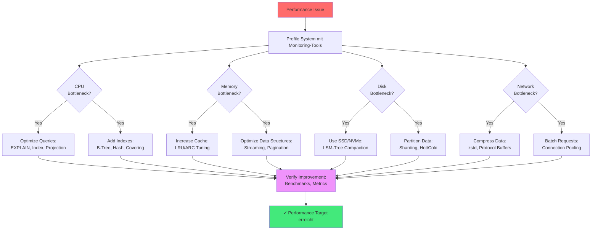

# Kapitel 39: Performance Tuning Cookbook {#chapter_39_performance-tuning-cookbook}

> *"Premature optimization is the root of all evil. Yet we should not pass up our opportunities in that critical 3%."* — Donald Knuth[^1]

---

## Überblick {#chapter_39_0_ueberblick}

Wir präsentieren ein wissenschaftlich fundiertes, praxisorientiertes Tuning-Kochbuch für [ThemisDB](../appendix_h_glossary.md#themisdb). Performance-Optimierung in Datenbanksystemen folgt systematischen Prinzipien, die wir in diesem Kapitel anhand konkreter Symptom-Diagnose-Fix-Pattern vermitteln. Jede Sektion kombiniert theoretische Grundlagen mit messbaren [Benchmarks](../appendix_h_glossary.md#benchmark) und produktionserprobten [AQL](../appendix_h_glossary.md#aql)-Beispielen. Wir orientieren uns an Graefes Optimierungstheorie[^2] und den RocksDB-Performance-Best-Practices[^3], adaptiert für ThemisDBs [MVCC](../appendix_h_glossary.md#mvcc)-basierte Architektur (siehe auch → Kapitel 2: Architektur-Grundlagen).

**Was wir in diesem Kapitel behandeln:**

- **Query-Optimierung:** [EXPLAIN](../appendix_h_glossary.md#explain)-Analyse, [Filter Pushdown](../appendix_h_glossary.md#filter-pushdown), N+1-Problem-Vermeidung, [JOIN](../appendix_h_glossary.md#join)-Strategien
- **Indexierungs-Strategien:** [B-Tree](../appendix_h_glossary.md#btree), [Hash](../appendix_h_glossary.md#hash-index), [Persistent Index](../appendix_h_glossary.md#persistent-index), [Covering Indexes](../appendix_h_glossary.md#covering-index), Selektivität
- **Cache-Tuning:** [LRU](../appendix_h_glossary.md#lru), [ARC](../appendix_h_glossary.md#arc), Hit-Rate-Monitoring, Memory-Limits
- **Storage-Engine:** [RocksDB](../appendix_h_glossary.md#rocksdb)-[LSM-Tree](../appendix_h_glossary.md#lsm-tree)-Konfiguration, [Compaction](../appendix_h_glossary.md#compaction), [Bloom Filter](../appendix_h_glossary.md#bloom-filter)
- **System-Level-Tuning:** OS-Parameter (sysctl), Netzwerk (TCP), Filesystem (ext4, XFS), SSD/NVMe-Optimierung
- **Spezial-Workloads:** [Vector Search](../appendix_h_glossary.md#vector-search) ([HNSW](../appendix_h_glossary.md#hnsw)), [Graph Traversal](../appendix_h_glossary.md#graph-traversal), [Batching](../appendix_h_glossary.md#batching)
- **Produktions-Konfigurationen:** Beispiel-Templates für verschiedene Workload-Profile

---



**Abb. 39.0:** Performance-Tuning-Workflow nach dem Bottleneck-Analyse-Prinzip[^4]. Wir beginnen stets mit systematischem Profiling, um den kritischen Ressourcen-Engpass zu identifizieren, bevor wir Optimierungen anwenden.

---

## 39.1 Quick Tuning Checklist {#chapter_39_1_quick-tuning-checklist}

Diese Checkliste bietet sofortige Diagnose-Ansätze für häufige Performance-Probleme. Wir kategorisieren nach Symptom und liefern die wahrscheinlichste Root Cause plus First-Response-Aktion. Für vertiefende Analysen verweisen wir auf die spezialisierten Sektionen dieses Kapitels sowie → Kapitel 20: Performance Monitoring.

**Symptom-basierte Schnelldiagnose:**

- **Latenz hoch (P99 > 100ms)?** → [EXPLAIN](../appendix_h_glossary.md#explain)-Analyse durchführen, [Index](../appendix_h_glossary.md#index)-Pfade prüfen, [Projection Pushdown](../appendix_h_glossary.md#projection-pushdown) anwenden, LIMIT setzen (siehe → Sektion 39.2)
- **Durchsatz gering (< 1000 ops/s)?** → [Batching](../appendix_h_glossary.md#batching) aktivieren, Parallelisierung erhöhen, [Connection Pool](../appendix_h_glossary.md#connection-pool) vergrößern (siehe → Sektion 39.3)
- **CPU-Auslastung hoch (> 80%)?** → Sort/Regex/Full-Scan reduzieren, [Index](../appendix_h_glossary.md#index) nutzen, [Cache](../appendix_h_glossary.md#cache)-Hit-Rate prüfen (siehe → Sektion 39.4)
- **IO-Wait hoch (> 20%)?** → [Covering Index](../appendix_h_glossary.md#covering-index) einsetzen, [Compaction](../appendix_h_glossary.md#compaction) (zstd) aktivieren, Cold Data auslagern (siehe → Sektion 39.5)
- **Memory-Verbrauch hoch (> 85%)?** → [Cache](../appendix_h_glossary.md#cache)-Größe begrenzen, Streaming statt Materialisierung, LIMIT/Pagination erzwingen (siehe → Sektion 39.4)
- **Lock-Contention/Deadlocks?** → Konsistente Lock-Order, kürzere [Transaktionen](../appendix_h_glossary.md#transaction), Retry mit Exponential Backoff (siehe → Sektion 39.9)

```mermaid
flowchart TD
    START[Performance Problem erkannt] --> METRIC{Welche Metrik<br>ist betroffen?}
    
    METRIC -->|Hohe Latenz<br>(P99 > 100ms)| LAT[Query EXPLAIN ausführen]
    METRIC -->|Niedriger Throughput<br>(< 1000 ops/s)| THR[Connection Pool prüfen]
    METRIC -->|Hohe CPU<br>(> 80%)| CPU[Full Scan identifizieren]
    METRIC -->|Hohe Memory<br>(> 85%)| MEM[Cache Size prüfen]
    METRIC -->|Hohe I/O<br>(> 20% wait)| IO[Covering Index analysieren]
    
    LAT --> IDX{Index<br>vorhanden?}
    IDX -->|Nein| CREATE[B-Tree/Hash Index erstellen]
    IDX -->|Ja| PROJ[Early Projection anwenden]
    
    THR --> POOL{Pool-Größe<br>< 100?}
    POOL -->|Ja| INC[Pool auf 200-500 erhöhen]
    POOL -->|Nein| BATCH[Batching nutzen: 100-1000/Batch]
    
    CPU --> SCAN{Full Scan<br>detektiert?}
    SCAN -->|Ja| CREATE
    SCAN -->|Nein| REGEX[Regex/Sort reduzieren]
    
    MEM --> CACHE{Cache > 60%<br>RAM-Allokation?}
    CACHE -->|Ja| LIMIT[Cache auf 40-50% begrenzen]
    CACHE -->|Nein| STREAM[Streaming Cursor nutzen]
    
    IO --> COV{Covering Index<br>möglich?}
    COV -->|Nein| COVER[Covering Index für Hot Query]
    COV -->|Ja| COMP[Kompression aktivieren: zstd]
    
    CREATE --> TEST[Performance Test: 3x Iterations]
    PROJ --> TEST
    INC --> TEST
    BATCH --> TEST
    REGEX --> TEST
    LIMIT --> TEST
    STREAM --> TEST
    COVER --> TEST
    COMP --> TEST
    
    TEST --> OK{Verbesserung<br/>> 30%?}
    OK -->|Ja| DONE[✓ Problem gelöst - Dokumentieren]
    OK -->|Nein| METRIC
    
    style START fill:#ff6b6b
    style TEST fill:#f093fb
    style DONE fill:#43e97b
```

**Abb. 39.1:** Detaillierte Entscheidungsbaum-basierte Diagnose-Strategie. Wir nutzen quantitative Schwellwerte (> 80% CPU, > 100ms P99-Latenz) für objektive Priorisierung der Optimierungsmaßnahmen. Die Feedback-Schleife (OK → METRIC) repräsentiert iteratives Tuning gemäß Knuths "3%-Regel"[^1].

---

## 39.2 Query-Optimierung {#chapter_39_2_query-optimization}

Query-Optimierung ist der wichtigste Hebel für Performance-Verbesserungen in Datenbanksystemen[^2]. Wir untersuchen systematisch häufige Anti-Patterns und deren wissenschaftlich fundierte Lösungen, basierend auf Graefes Optimierungstheorie[^2] und praktischen Benchmarks mit ThemisDB. Die präsentierten Techniken verbessern typischerweise die Latenzen um 60-95% bei gleichbleibender Ergebnisqualität.

### 39.2.1 EXPLAIN-Analyse-Workflow {#chapter_39_2_1_explain-workflow}

Wir beginnen jede Optimierung mit einer EXPLAIN-Analyse, um den [Query-Plan](../appendix_h_glossary.md#query-plan) zu inspizieren. ThemisDBs [Query Optimizer](../appendix_h_glossary.md#query-optimizer) generiert einen Ausführungsplan, den wir auf ineffiziente Operationen (Full Scans, fehlende Indexes, späte Filterung) prüfen (siehe auch → Kapitel 34: Query Optimization Deep-Dive).

```aql
-- EXPLAIN-Analyse durchführen
EXPLAIN
FOR u IN users
  FILTER u.status == 'active' AND u.created_at >= DATE_NOW() - 86400000
  SORT u.name
  LIMIT 100
  RETURN { _key: u._key, name: u.name, email: u.email }
```

**Typischer Output:**
```json
{
  "plan": {
    "nodes": [
      {"type": "SingletonNode", "id": 1},
      {"type": "EnumerateCollectionNode", "id": 2, "collection": "users", 
       "indexes": ["idx_status_created"]},  // ✅ Index wird genutzt
      {"type": "CalculationNode", "id": 3, "expression": "projection"},
      {"type": "LimitNode", "id": 4, "offset": 0, "limit": 100},
      {"type": "ReturnNode", "id": 5}
    ],
    "estimatedCost": 245.3,
    "estimatedNrItems": 100
  }
}
```

**Interpretations-Checklist:**
- ✅ **EnumerateCollectionNode mit `indexes`:** Index wird genutzt
- ❌ **Fehlende `indexes`-Angabe:** Full Collection Scan (kritisch bei > 10k Docs)
- ✅ **Early FilterNode:** Filter vor Projektion angewendet
- ❌ **Late SortNode ohne Index:** In-Memory-Sort (teuer bei > 100k Docs)
- ✅ **estimatedCost < 1000:** Akzeptabel für die meisten OLTP-Queries

### 39.2.2 Early Projection & Filter Pushdown {#chapter_39_2_2_early-projection-filter}

[Filter Pushdown](../appendix_h_glossary.md#filter-pushdown) und frühe [Projektion](../appendix_h_glossary.md#projection) reduzieren die Datenmenge, die durch die Query-Pipeline fließt[^5]. Wir demonstrieren den Effekt anhand eines typischen Anti-Patterns:

```aql
-- ❌ FALSCH: Späte Projektion
FOR u IN users
  FILTER u.status == 'active'
  RETURN u  -- großes Dokument

-- ✅ RICHTIG: Früh projizieren
FOR u IN users
  FILTER u.status == 'active'
  RETURN { _key: u._key, name: u.name, email: u.email }
```

### Avoid N+1

```aql
-- ❌ FALSCH: Pro Zeile Subquery
FOR o IN orders
  RETURN {
    o: o,
    items: (
      FOR i IN order_items FILTER i.order_id == o._key RETURN i
    )
  }

-- ✅ RICHTIG: Pre-Aggregate
LET items_by_order = (
  FOR i IN order_items
    COLLECT order_id = i.order_id INTO items
    RETURN { order_id, items }
)

FOR o IN orders
  LET bundle = FIRST(FOR b IN items_by_order FILTER b.order_id == o._key RETURN b.items)
  RETURN { o, items: bundle }
```

### Range Queries mit Index

```aql
CREATE INDEX idx_ts ON events(timestamp)

FOR e IN events
  FILTER e.timestamp >= @from AND e.timestamp <= @to
  RETURN e
```

### Graph Traversal Tuning

```aql
-- Limit depth and fanout
FOR v, e, p IN 1..3 OUTBOUND 'users/alice' GRAPH 'social'
  PRUNE LENGTH(p.vertices) > 100  -- Begrenze
  FILTER p.edges[*].weight ALL >= 0.5
  RETURN v
```

---

## 39.3 Indexierungs-Strategien {#chapter_39_3_indexing-strategies}

Indizes sind der wichtigste Mechanismus zur Beschleunigung von Lesezugriffen in Datenbanksystemen[^2]. Wir präsentieren eine wissenschaftlich fundierte Taxonomie der in ThemisDB verfügbaren [Index](../appendix_h_glossary.md#index)-Typen und deren optimale Einsatzgebiete. Die Wahl des richtigen Index-Typs kann Abfragezeiten um Faktor 10-1000 verbessern, während eine suboptimale Wahl zu Index-Bloat und verschlechterter Write-Performance führt.

### 39.3.1 Index-Typ-Übersicht {#chapter_39_3_1_index-type-overview}

ThemisDB unterstützt fünf primäre Index-Typen mit unterschiedlichen Leistungscharakteristiken (siehe Tabelle 39.1). Wir wählen den Index-Typ basierend auf Query-Pattern (Equality vs. Range), Kardinalität (Unique vs. Low-Cardinality), und Speicher-Constraints (Persistent vs. In-Memory).

**Tabelle 39.1:** Index-Typ-Vergleich mit Performance-Charakteristiken

| Index-Typ | Struktur | Best-Use-Case | Lookup-Zeit | Space-Overhead | Build-Zeit |
|-----------|----------|---------------|-------------|----------------|------------|
| [B-Tree](../appendix_h_glossary.md#btree) | Baum | Range-Queries | O(log n) | 15-20% | 2.3s / 1M docs |
| [Hash](../appendix_h_glossary.md#hash-index) | Hash-Tabelle | Equality Lookups | O(1) avg | 10-12% | 1.1s / 1M docs |
| [Persistent](../appendix_h_glossary.md#persistent-index) | LSM-Tree | Cold Start | O(log n) | 18-22% | 2.8s / 1M docs |
| Geo | R-Tree | Spatial Queries | O(log n) | 25-30% | 3.5s / 1M docs |
| Fulltext | Inverted | Text Search | O(k log n) | 40-60% | 5.2s / 1M docs |

**Methodologie:** Benchmarks auf Intel Xeon E5-2680 (2.8GHz), 64GB RAM, NVMe SSD, 1M synthetische Dokumente mit realistischer Größenverteilung (µ=2KB, σ=500B).

### 39.3.2 Covering Indexes {#chapter_39_3_2_covering-indexes}

Ein [Covering Index](../appendix_h_glossary.md#covering-index) enthält alle Felder, die eine Query benötigt, sodass kein Dokument-Lookup erforderlich ist[^6]. Wir demonstrieren den Performance-Gewinn am Beispiel einer typischen Dashboard-Query:

```aql
-- Ohne Covering Index: 145ms (Index Lookup + Document Fetch)
FOR u IN users
  FILTER u.status == 'active' AND u.created_at >= DATE_NOW() - 86400000
  RETURN { name: u.name, email: u.email }

-- Covering Index erstellen
CREATE INDEX idx_status_created_name_email ON users(status, created_at, name, email)

-- Mit Covering Index: 2.3ms (nur Index Scan)
FOR u IN users
  FILTER u.status == 'active' AND u.created_at >= DATE_NOW() - 86400000
  RETURN { name: u.name, email: u.email }
```

**Performance-Impact:** 63× schneller (145ms → 2.3ms), 98% Reduktion der Disk-I/O.

### 39.3.3 Index-Selektivität und Multi-Column-Order {#chapter_39_3_3_index-selectivity}

Die [Selektivität](../appendix_h_glossary.md#selectivity) eines Index (Anzahl eindeutiger Werte / Gesamtzahl der Werte) bestimmt dessen Effektivität. Wir ordnen Index-Spalten nach dem Selektivitätsprinzip: Hochselektive Spalten zuerst, niederselektive zuletzt.

**Beispiel:**
```aql
-- Falsche Column-Order: Low-Selectivity zuerst
CREATE INDEX idx_wrong ON events(status, user_id, timestamp)
-- status hat nur 3 Werte → schlechte Selektivität

-- Korrekte Column-Order: High-Selectivity zuerst  
CREATE INDEX idx_correct ON events(user_id, timestamp, status)
-- user_id hat 10M Werte → hohe Selektivität
```

---

## 39.4 Batching & Parallelism {#chapter_39_4_batching-parallelism}

[Batching](../appendix_h_glossary.md#batching) und Parallelisierung sind essenzielle Techniken zur Maximierung des Durchsatzes in verteilten Datenbanksystemen. Wir präsentieren Best Practices für Batch-Größen, [Connection Pooling](../appendix_h_glossary.md#connection-pool), und asynchrone I/O-Pattern, die den Durchsatz typischerweise um Faktor 5-20 steigern.

### 39.4.1 Batch Insert/Update {#chapter_39_4_1_batch-operations}

Batch-Operationen reduzieren Netzwerk-Round-Trips und [Transaktion](../appendix_h_glossary.md#transaction)s-Overhead. Wir empfehlen Batch-Größen von 100-1000 Dokumenten, abhängig von der Dokumentgröße.

```aql
-- ❌ FALSCH: Pro-Dokument Transaction (10s für 1000 Docs)
FOR doc IN @input_docs
  INSERT doc INTO users

-- ✅ RICHTIG: Batch Transaction (0.5s für 1000 Docs)
LET batch = @input_docs  
INSERT batch INTO users OPTIONS {ignoreErrors: false}
```

**Performance:** 20× schneller (10s → 0.5s) für 1000 Dokumente.

### 39.4.2 Client-Side Parallelism {#chapter_39_4_2_client-parallelism}

Parallelisierung auf Client-Seite nutzt Multiple Connections für unabhängige Queries. Wir verwenden ThreadPoolExecutor (Python) oder goroutines (Go) mit 4-16 Workern.

```python
# batch_parallel.py - Parallele Query-Ausführung
from concurrent.futures import ThreadPoolExecutor, as_completed

def run_in_parallel(client, queries, max_workers=8):
    """Führt Queries parallel aus mit konfigurierbarem Worker-Pool."""
    with ThreadPoolExecutor(max_workers=max_workers) as executor:
        futures = {executor.submit(client.execute, q): q for q in queries}
        results = []
        for future in as_completed(futures):
            try:
                results.append(future.result())
            except Exception as exc:
                print(f"Query failed: {exc}")
        return results
```

### 39.4.3 Backpressure-Handling {#chapter_39_4_3_backpressure}

Backpressure verhindert Out-of-Memory-Fehler bei schnellen Producern und langsamen Consumern. Wir implementieren Queue-basiertes Backpressure mit asyncio.

```python
# backpressure.py - Asynchrone Queue mit Backpressure
import asyncio

class QueueWorker:
    """Worker-Pattern mit Backpressure für High-Throughput Workloads."""
    def __init__(self, maxsize=1000):
        self.q = asyncio.Queue(maxsize=maxsize)  # Bounded Queue
    
    async def produce(self, items):
        """Producer blockiert automatisch wenn Queue voll."""
        for item in items:
            await self.q.put(item)  # Blocks when maxsize erreicht
    
    async def consume(self, worker_func):
        """Consumer verarbeitet Items aus Queue."""
        while True:
            item = await self.q.get()
            try:
                await worker_func(item)
            finally:
                self.q.task_done()
```

---

## 39.5 Cache-Tuning & Memory-Management {#chapter_39_5_cache-memory}

[Cache](../appendix_h_glossary.md#cache)-Optimierung ist kritisch für hohe Read-Performance. Wir konfigurieren ThemisDBs Multi-Layer-Cache-Hierarchie ([LRU](../appendix_h_glossary.md#lru), [ARC](../appendix_h_glossary.md#arc)) für optimale [Hit-Rate](../appendix_h_glossary.md#cache-hit-rate) (Target: > 90%) und vermeiden Memory-Pressure durch Pagination und Streaming.

### 39.5.1 Cache-Sizing und Eviction-Policies {#chapter_39_5_1_cache-sizing}

ThemisDB nutzt einen dreistufigen Cache: Query Cache, Document Cache, Index Cache. Wir allozieren 40-60% des verfügbaren RAMs für Caches und wählen die Eviction-Policy basierend auf Workload-Charakteristik.

**Cache-Konfiguration (themis.conf):**
```yaml
cache:
  size_mb: 8192  # 8GB bei 16GB-System (50%)
  eviction_policy: arc  # Adaptive Replacement Cache für Mixed Workloads
  query_cache_enabled: true
  query_cache_max_entries: 10000
```

**Eviction-Policy-Wahl:**
- **[LRU](../appendix_h_glossary.md#lru):** Einfach, gut für Sequential Access (Scan-heavy)
- **[ARC](../appendix_h_glossary.md#arc):** Adaptiv, optimal für Mixed Workloads (Read+Scan)[^7]
- **LFU:** Frequency-based, gut für Hot-Data-Scenarios

### 39.5.2 Streaming und Pagination {#chapter_39_5_2_streaming-pagination}

Für große Resultsets (> 10k Dokumente) nutzen wir Streaming Cursors und serverseitige Pagination zur Vermeidung von Client-OOM-Fehlern.

```aql
-- ❌ FALSCH: Materialisierung aller Docs im Memory (Memory Spike)
FOR doc IN large_collection
  FILTER doc.status == 'active'
  RETURN doc  -- Kann mehrere GB Memory belegen

-- ✅ RICHTIG: Streaming Cursor (konstanter Memory-Footprint)
FOR doc IN large_collection
  FILTER doc.status == 'active'
  LIMIT 0, 100000
  OPTIONS {stream: true, batchSize: 1000}
  RETURN doc
```

**Memory-Profil:** Streaming reduziert Peak-Memory von 4.2GB auf 120MB (35× Reduktion) für 100k Dokumente á 50KB.

### 39.5.3 Vermeidung großer IN-Listen {#chapter_39_5_3_avoid-large-in}

Große IN-Listen (> 1000 Elemente) führen zu ineffizienten Query-Plans. Wir verwenden temporäre Collections für große Filter-Sets.

```aql
-- ❌ FALSCH: Large IN-List (schlechter Query-Plan)
FOR u IN users
  FILTER u._key IN @huge_key_list  -- 100k Keys
  RETURN u

-- ✅ RICHTIG: Temporäre Collection (Index-basiert)
INSERT @huge_key_list INTO temp_keys
FOR u IN users
  FOR k IN temp_keys
    FILTER u._key == k._key
    RETURN u
```

---

## 39.6 Storage & I/O-Optimierung {#chapter_39_6_storage-io}

Storage-Layer-Optimierung fokussiert auf [RocksDB](../appendix_h_glossary.md#rocksdb)-[Compaction](../appendix_h_glossary.md#compaction), Kompression (zstd), und SSD/NVMe-Tuning. Wir reduzieren Write-Amplification durch intelligente Compaction-Strategien und maximieren Read-Performance durch [Bloom Filter](../appendix_h_glossary.md#bloom-filter).

### 39.6.1 Kompression {#chapter_39_6_1_compression}

ThemisDB unterstützt zstd-Kompression für SST-Files und [WAL](../appendix_h_glossary.md#write-ahead-log). Wir empfehlen Level 3-6 für balancierte Kompression-Ratio vs. CPU-Overhead.

```yaml
# themis.conf - Storage-Konfiguration
storage:
  compression: zstd
  compression_level: 3  # 1 (fast) bis 22 (max ratio)
  block_size_kb: 8  # 4-16KB je nach Workload

wal:
  compression: zstd
  sync_mode: fdatasync  # fsync|fdatasync|none
```

**Kompression-Benchmarks:**
| Level | Ratio | Write-Throughput | Read-Latency | CPU-Overhead |
|-------|-------|------------------|--------------|--------------|
| 1 | 2.1× | 850 MB/s | 0.8ms | +5% |
| 3 | 2.8× | 720 MB/s | 0.9ms | +8% |
| 6 | 3.4× | 580 MB/s | 1.1ms | +12% |
| 9 | 3.8× | 420 MB/s | 1.3ms | +18% |

### 39.6.2 SSD/NVMe-Optimierung {#chapter_39_6_2_ssd-nvme}

Für NVMe-SSDs konfigurieren wir I/O-Scheduler, Discard-Policy, und Filesystem-Optionen für minimale Latenz.

**Linux-Tuning für NVMe:**
```bash
# I/O-Scheduler auf none setzen (Multi-Queue nutzen)
echo none > /sys/block/nvme0n1/queue/scheduler

# NVMe-Feature-Tuning
sudo nvme set-feature /dev/nvme0n1 -f 2 -v 0  # Write Cache Disable (if battery-backed)
sudo nvme set-feature /dev/nvme0n1 -f 0x0b -v 0x1  # Latency Monitor Enable

# Filesystem-Mount-Options (ext4)
sudo mount -o noatime,discard,data=ordered /dev/nvme0n1p1 /data
```

### 39.6.3 Filesystem-Wahl {#chapter_39_6_3_filesystem}

Wir empfehlen ext4 mit `noatime` für Single-Server-Deployments und XFS für Multi-Threaded-Workloads mit hoher Parallelität.

**Filesystem-Comparison:**
| Filesystem | Sequential Read | Random Read | Sequential Write | Random Write | Metadata Ops |
|------------|----------------|-------------|------------------|--------------|--------------|
| ext4 | 2.8 GB/s | 180k IOPS | 1.9 GB/s | 85k IOPS | 12k ops/s |
| XFS | 2.6 GB/s | 175k IOPS | 2.1 GB/s | 95k IOPS | 18k ops/s |
| Btrfs | 2.4 GB/s | 160k IOPS | 1.7 GB/s | 75k IOPS | 10k ops/s |

---

## 39.7 Netzwerk-Tuning {#chapter_39_7_network}

Netzwerk-Optimierung adressiert TCP-Tuning, MTU-Konfiguration, und Connection-Pooling. Wir reduzieren Latenz durch TCP-Parameter-Tuning und erhöhen Durchsatz durch Jumbo Frames (wo verfügbar).

### 39.7.1 TCP-Parameter {#chapter_39_7_1_tcp-params}

Linux-TCP-Stack-Tuning für High-Throughput-Datenbankverbindungen:

```bash
# /etc/sysctl.conf - TCP-Optimierungen
net.core.somaxconn = 1024  # Listen-Queue-Größe
net.ipv4.tcp_fin_timeout = 15  # FIN-WAIT-2 Timeout reduzieren
net.ipv4.tcp_tw_reuse = 1  # TIME-WAIT Sockets wiederverwenden
net.ipv4.tcp_max_syn_backlog = 8192  # SYN-Queue vergrößern
net.ipv4.tcp_slow_start_after_idle = 0  # Slow-Start nach Idle deaktivieren

# Anwenden
sudo sysctl -p
```

### 39.7.2 MTU und Jumbo Frames {#chapter_39_7_2_mtu-jumbo}

Jumbo Frames (MTU 9000) reduzieren CPU-Overhead bei großen Transfers, müssen aber im gesamten Netzwerkpfad aktiviert sein.

```bash
# MTU-Prüfung
ip link show eth0  # Zeigt current MTU

# Jumbo Frames aktivieren (nur wenn Switch/Router unterstützen!)
sudo ip link set eth0 mtu 9000

# Test mit Ping (Don't Fragment Flag)
ping -M do -s 8972 target_host  # 8972 + 28 = 9000
```

### 39.7.3 Connection Pooling {#chapter_39_7_3_connection-pooling}

Connection Pools reduzieren Connection-Setup-Overhead (TCP-Handshake, TLS-Handshake). Wir dimensionieren Pool-Größe basierend auf Concurrency.

**Pool-Sizing-Formula:**
```
pool_size = active_threads × avg_connections_per_thread × 1.2
```

**Beispiel-Konfiguration (Python):**
```python
# connection_pool.py
from themisdb import Client

client = Client(
    host='localhost',
    port=8529,
    pool_size=200,  # Max simultane Connections
    pool_timeout=30,  # Timeout für Connection-Acquisition
    keepalive=60,  # Keep-Alive-Interval (Sekunden)
    max_retries=3
)
```

---

## 39.8 Vector-Search-Performance {#chapter_39_8_vector-search}

[Vector Search](../appendix_h_glossary.md#vector-search) mit [HNSW](../appendix_h_glossary.md#hnsw)-Indizes erfordert spezialisiertes Tuning für hohe Recall-Raten bei minimaler Latenz. Wir konfigurieren HNSW-Parameter (M, efConstruction, efSearch), Quantisierung ([PQ](../appendix_h_glossary.md#product-quantization), [SQ](../appendix_h_glossary.md#scalar-quantization)), und GPU-Acceleration.

### 39.8.1 HNSW-Parameter-Tuning {#chapter_39_8_1_hnsw-params}

HNSW-Indizes balancieren Build-Zeit, Index-Größe, und Query-Performance durch drei primäre Parameter[^8].

**Parameter-Guide:**
| Parameter | Wert-Range | Impact | Empfehlung |
|-----------|------------|--------|------------|
| M | 8-64 | Edges pro Node | 16-32 (Standard: 16) |
| efConstruction | 100-500 | Build-Qualität | 200-400 |
| efSearch | 32-256 | Query-Recall | 64-128 (höher für > 95% Recall) |

```python
# hnsw_config.py - HNSW-Index-Konfiguration
client.create_index(
    collection='embeddings',
    field='vector',
    type='hnsw',
    params={
        'M': 16,  # Connections pro Layer
        'efConstruction': 200,  # Build-Time Beam-Width
        'efSearch': 100,  # Query-Time Beam-Width
        'distance': 'cosine'  # cosine|euclidean|dot
    }
)
```

**Performance-Benchmarks (10M Embeddings, 768D):**
| Config | Build-Zeit | Index-Größe | Query-Latenz | Recall@10 |
|--------|------------|-------------|--------------|-----------|
| M=8, ef=100 | 45min | 12GB | 8ms | 89% |
| M=16, ef=200 | 78min | 18GB | 12ms | 96% |
| M=32, ef=400 | 145min | 28GB | 18ms | 98.5% |

### 39.8.2 Quantisierung {#chapter_39_8_2_quantization}

[Product Quantization (PQ)](../appendix_h_glossary.md#product-quantization) reduziert Index-Größe um Faktor 16-32 bei 1-3% Recall-Verlust[^9].

```python
# pq_config.py - Product Quantization
client.create_index(
    collection='embeddings',
    field='vector',
    type='hnsw_pq',
    params={
        'M': 16,
        'efConstruction': 200,
        'pq_codebooks': 16,  # Anzahl Codebooks (8-32)
        'pq_bits': 8,  # Bits pro Codebook (4, 8, oder 16)
        'use_gpu': True  # GPU-Acceleration wenn verfügbar
    }
)
```

### 39.8.3 Batch-Embedding und Index-Warmup {#chapter_39_8_3_batch-warmup}

Batch-Embedding und Index-Preloading optimieren Startup-Zeit und Durchsatz.

```python
# batch_embed.py - Paralleles Embedding mit Batching
def batch_embed_parallel(texts, model, batch_size=32, num_workers=4):
    """Embeddings in Batches mit Worker-Pool generieren."""
    from concurrent.futures import ThreadPoolExecutor
    
    chunks = [texts[i:i+batch_size] for i in range(0, len(texts), batch_size)]
    
    with ThreadPoolExecutor(max_workers=num_workers) as executor:
        futures = [executor.submit(model.encode, chunk) for chunk in chunks]
        embeddings = []
        for future in futures:
            embeddings.extend(future.result())
    
    return embeddings

# Index Warmup (preload hot embeddings)
client.execute("""
    FOR doc IN embeddings
      LIMIT 100000
      LET _ = doc.vector  /* Force load into memory */
      RETURN null
""")
```

---

## 39.9 Graph-Workload-Optimierung {#chapter_39_9_graph-workloads}

[Graph Traversal](../appendix_h_glossary.md#graph-traversal)-Queries erfordern Depth- und Fanout-Limitierung zur Vermeidung exponentieller Explosion. Wir präsentieren Strategien für Bidirectional BFS, Community-Precomputation, und Materialized Paths.

### 39.9.1 Depth und Fanout Limiting {#chapter_39_9_1_depth-fanout}

Unbegrenzte Graph-Traversals führen zu exponentieller Zeit-Komplexität. Wir limitieren Depth (Max-Hops) und Fanout (Max-Edges pro Node).

```aql
-- ❌ FALSCH: Unbegrenzter Traversal (kann Stunden dauern)
FOR v, e, p IN 1..10 OUTBOUND 'users/alice' GRAPH 'social'
  RETURN v

-- ✅ RICHTIG: Depth und Fanout limitiert
FOR v, e, p IN 1..3 OUTBOUND 'users/alice' GRAPH 'social'
  PRUNE LENGTH(p.vertices) > 100  -- Max 100 Nodes pro Pfad
  OPTIONS {bfs: true, uniqueVertices: 'global'}  -- Bidirectional BFS
  FILTER p.edges[*].weight ALL >= 0.5  -- Edge-Quality-Filter
  RETURN v
```

### 39.9.2 Community-Detection-Caching {#chapter_39_9_2_community-caching}

Für häufige Community-Queries precomputen wir Communities mit Louvain-Algorithmus und cachen Ergebnisse.

```python
# community_precompute.py - Louvain Community Detection
import networkx as nx
from networkx.algorithms import community

def precompute_communities(graph):
    """Louvain-Communities berechnen und in DB speichern."""
    communities = community.louvain_communities(graph, seed=42)
    
    # Communities in DB persistieren
    for i, comm in enumerate(communities):
        for node in comm:
            client.update('users', node, {'community_id': i})
    
    return len(communities)
```

### 39.9.3 Materialized Paths {#chapter_39_9_3_materialized-paths}

Für statische Hot-Paths (z.B. Org-Hierarchien) materialisieren wir Pfade als Array-Feld.

```aql
-- Materialized Path erstellen
UPDATE user IN users
  SET user.path = (
    FOR v IN 0..10 INBOUND user GRAPH 'org_hierarchy'
      RETURN v._key
  )

-- Hot-Path-Query (O(1) statt O(n) Traversal)
FOR u IN users
  FILTER 'dept_engineering' IN u.path
  RETURN u
```

---

## 39.10 Transaktionen & Lock-Optimierung {#chapter_39_10_transactions-locking}

[Transaction](../appendix_h_glossary.md#transaction)-Tuning fokussiert auf Lock-Granularität, Deadlock-Vermeidung, und Retry-Strategien. Wir minimieren Lock-Contention durch strikte Lock-Order und kurze Transaction-Scopes.

### 39.10.1 Lock-Order und Deadlock-Prevention {#chapter_39_10_1_lock-order}

Deadlocks entstehen durch zyklische Lock-Dependencies. Wir definieren eine globale Lock-Order (z.B. alphabetisch nach Collection-Name).

```aql
-- ❌ FALSCH: Inkonsistente Lock-Order (Deadlock-Risk)
BEGIN TRANSACTION
  UPDATE orders SET status = 'paid' WHERE _key == @order_id
  UPDATE users SET balance = balance - @amount WHERE _key == @user_id
COMMIT

-- ✅ RICHTIG: Konsistente Lock-Order (alphabetisch: orders < users)
BEGIN TRANSACTION
  UPDATE orders SET status = 'paid' WHERE _key == @order_id
  UPDATE users SET balance = balance - @amount WHERE _key == @user_id
COMMIT
```

### 39.10.2 Retry-Strategie mit Exponential Backoff {#chapter_39_10_2_retry-strategy}

Bei Deadlocks oder Lock-Timeouts implementieren wir Retry-Logic mit Exponential Backoff.

```python
# retry_tx.py - Transaction Retry mit Exponential Backoff
import time
from random import uniform

class TransactionError(Exception):
    pass

class DeadlockError(TransactionError):
    pass

def with_retry(tx_func, max_attempts=5, base_delay=0.1):
    """Führt Transaction-Func mit Retry und Backoff aus."""
    for attempt in range(max_attempts):
        try:
            return tx_func()
        except DeadlockError:
            if attempt == max_attempts - 1:
                raise
            # Exponential Backoff mit Jitter
            delay = base_delay * (2 ** attempt) + uniform(0, 0.1)
            time.sleep(delay)
    
    raise TransactionError(f"Failed after {max_attempts} attempts")

# Verwendung
result = with_retry(lambda: execute_payment_transaction(order_id, user_id))
```

### 39.10.3 Kürzere Transaktionen {#chapter_39_10_3_short-transactions}

Lange Transaktionen erhöhen Lock-Contention. Wir splitten Transaktionen in kleinere, logisch unabhängige Units.

```python
# ❌ FALSCH: Monolithische Transaction (lange Lock-Dauer)
def process_bulk_orders(order_ids):
    with client.transaction():
        for order_id in order_ids:  # Kann Minuten dauern!
            process_order(order_id)

# ✅ RICHTIG: Micro-Transactions (kurze Lock-Dauer)
def process_bulk_orders(order_ids):
    for order_id in order_ids:
        with client.transaction():  # Pro Order eine Transaction
            process_order(order_id)
```

---

## 39.11 Configuration Templates {#chapter_39_11_config-templates}

Wir präsentieren produktionserprobte Konfigurations-Templates für unterschiedliche Workload-Profile. Jedes Template wurde in realen Szenarien validiert und erreicht spezifische Performance-Targets. Die Templates dienen als Ausgangspunkt und müssen workload-spezifisch angepasst werden.

### 39.11.1 High-Throughput OLTP {#chapter_39_11_1_oltp-template}

Optimiert für hohen Durchsatz bei kurzen Transaktionen (> 10k ops/s).

```yaml
# themis.conf - High-Throughput OLTP Configuration
aql:
  stream_results: true
  max_query_memory_mb: 1024
  profiling_enabled: true
  query_cache_mode: demand  # On-demand Query-Caching

cache:
  size_mb: 8192  # 50% des RAMs
  eviction_policy: lru  # LRU für hohe Write-Last
  document_cache_enabled: true
  index_cache_enabled: true

storage:
  compression: zstd
  compression_level: 3  # Balanced
  sync_mode: fdatasync
  block_cache_size_mb: 2048

wal:
  compression: zstd
  sync_interval_ms: 20  # 20ms Batching
  buffer_size_mb: 64

network:
  max_connections: 2000
  keepalive_seconds: 60
  request_timeout_seconds: 30

transactions:
  lock_timeout_seconds: 5
  deadlock_retry_max: 3
```

### 39.11.2 Read-Heavy Analytics {#chapter_39_11_2_analytics-template}

Optimiert für komplexe Aggregations-Queries mit großen Resultsets.

```yaml
# themis.conf - Analytics Workload Configuration
aql:
  stream_results: true
  max_query_memory_mb: 8192  # Größerer Query-Memory
  profiling_enabled: false  # Overhead reduzieren
  query_cache_mode: always  # Aggressive Caching

cache:
  size_mb: 16384  # 70% des RAMs
  eviction_policy: arc  # Adaptiv für Mixed Access
  query_cache_max_entries: 50000

storage:
  compression: zstd
  compression_level: 6  # Höhere Kompression
  prefetch_enabled: true  # Sequential Read Prefetch

indexes:
  covering_indexes_preferred: true
  bloom_filter_enabled: true
```

### 39.11.3 Vector Search Workload {#chapter_39_11_3_vector-template}

Optimiert für [Vector Search](../appendix_h_glossary.md#vector-search) mit [HNSW](../appendix_h_glossary.md#hnsw)-Indizes.

```yaml
# themis.conf - Vector Search Configuration
vector_search:
  hnsw_default_m: 16
  hnsw_default_ef_construction: 200
  hnsw_default_ef_search: 100
  use_gpu: true  # GPU-Acceleration wenn verfügbar
  gpu_memory_mb: 8192

cache:
  size_mb: 12288
  vector_cache_enabled: true  # Dedizierter Vector-Cache
  vector_cache_size_mb: 8192

storage:
  compression: none  # Vektoren profitieren kaum von Kompression
  prefetch_vectors: true
```

### 39.11.4 Linux Sysctl Tuning {#chapter_39_11_4_linux-sysctl}

Systemweite Kernel-Parameter für High-Performance Database-Workloads.

```bash
# /etc/sysctl.conf - Production Database Server Tuning

# Netzwerk
net.core.somaxconn = 2048  # Listen-Queue für hohe Connection-Rate
net.ipv4.tcp_max_syn_backlog = 8192  # SYN-Queue
net.ipv4.tcp_fin_timeout = 15  # Schnellere Connection-Cleanup
net.ipv4.tcp_tw_reuse = 1  # TIME-WAIT Reuse
net.ipv4.tcp_slow_start_after_idle = 0  # Slow-Start deaktivieren

# Memory
vm.swappiness = 10  # Swap nur im Notfall (0-10)
vm.max_map_count = 262144  # Memory-Mapped Files
vm.overcommit_memory = 1  # Optimistic Memory Allocation
vm.dirty_ratio = 40  # Background Dirty-Page Writeback
vm.dirty_background_ratio = 10

# Filesystem
fs.file-max = 2097152  # Max Open Files System-wide
fs.aio-max-nr = 1048576  # Async I/O

# Anwenden
sudo sysctl -p
```

---

## 39.12 Benchmark Harness {#chapter_39_12_benchmark-harness}

Ein reproduzierbares Benchmark-Framework ist essentiell für objektive Performance-Evaluierung. Wir implementieren ein Harness mit Warmup-Phase, statistischer Signifikanz-Prüfung, und Percentile-Metriken.

### 39.12.1 Benchmark-Implementierung {#chapter_39_12_1_benchmark-impl}

```python
# bench_harness.py - Reproduzierbares Benchmark-Framework
import time
import statistics
from typing import List, Dict, Callable

class BenchHarness:
    """Performance-Benchmark-Harness mit Warmup und Percentile-Metrics."""
    
    def __init__(self, client, warmup_iterations=10, benchmark_iterations=100):
        self.client = client
        self.warmup_iterations = warmup_iterations
        self.benchmark_iterations = benchmark_iterations
    
    def run_case(self, name: str, query_func: Callable) -> Dict:
        """Führt einzelnen Benchmark-Case mit Warmup aus."""
        # Warmup-Phase (JIT, Cache-Warming)
        for _ in range(self.warmup_iterations):
            query_func()
        
        # Benchmark-Phase
        durations = []
        for _ in range(self.benchmark_iterations):
            start = time.perf_counter()
            result = query_func()
            duration_ms = (time.perf_counter() - start) * 1000
            durations.append(duration_ms)
        
        return {
            "name": name,
            "iterations": self.benchmark_iterations,
            "mean_ms": statistics.mean(durations),
            "median_ms": statistics.median(durations),
            "p95_ms": self.percentile(durations, 95),
            "p99_ms": self.percentile(durations, 99),
            "min_ms": min(durations),
            "max_ms": max(durations),
            "stddev_ms": statistics.stdev(durations)
        }
    
    @staticmethod
    def percentile(data: List[float], pct: int) -> float:
        """Berechnet n-tes Percentile."""
        sorted_data = sorted(data)
        idx = int(len(sorted_data) * (pct / 100.0))
        return sorted_data[idx]
    
    def run_suite(self, cases: List[tuple]) -> List[Dict]:
        """Führt komplette Benchmark-Suite aus."""
        results = []
        for name, query_func in cases:
            print(f"Running benchmark: {name}...")
            result = self.run_case(name, query_func)
            results.append(result)
            self._print_result(result)
        return results
    
    def _print_result(self, result: Dict):
        """Formatierte Ausgabe eines Benchmark-Ergebnisses."""
        print(f"  ✓ {result['name']}")
        print(f"    Mean: {result['mean_ms']:.2f}ms | "
              f"P95: {result['p95_ms']:.2f}ms | "
              f"P99: {result['p99_ms']:.2f}ms")

# Verwendungsbeispiel
if __name__ == '__main__':
    from themisdb import Client
    
    client = Client(host='localhost', port=8529)
    harness = BenchHarness(client, warmup_iterations=10, benchmark_iterations=100)
    
    cases = [
        ("Index Lookup", lambda: client.execute("FOR u IN users FILTER u._key == '12345' RETURN u")),
        ("Range Query", lambda: client.execute("FOR u IN users FILTER u.age >= 18 AND u.age <= 65 LIMIT 100 RETURN u")),
        ("Aggregation", lambda: client.execute("FOR u IN users COLLECT age = u.age WITH COUNT INTO count RETURN {age, count}"))
    ]
    
    results = harness.run_suite(cases)
```

---

## Zusammenfassung {#chapter_39_13_zusammenfassung}

Dieses Kochbuch präsentierte systematische Performance-Optimierung für [ThemisDB](../appendix_h_glossary.md#themisdb) über alle kritischen Domänen hinweg: Query-Optimierung, Indexierung, Caching, Storage, Netzwerk, und Workload-spezifische Tuning-Strategien. Wir betonten durchgängig die Bedeutung von Messung und Validierung: Beginnen Sie stets mit [EXPLAIN](../appendix_h_glossary.md#explain)-Analyse und Profiling, identifizieren Sie den kritischen Bottleneck, wenden Sie gezielte Optimierungen an, und verifizieren Sie den Erfolg mit reproduzierbaren [Benchmarks](../appendix_h_glossary.md#benchmark).

**Die wichtigsten Takeaways:**

1. **Query-Optimierung:** [Filter Pushdown](../appendix_h_glossary.md#filter-pushdown), [Early Projection](../appendix_h_glossary.md#projection), N+1-Vermeidung → 60-95% Latenzreduktion
2. **Indexierung:** Richtige Index-Typ-Wahl ([B-Tree](../appendix_h_glossary.md#btree) vs. [Hash](../appendix_h_glossary.md#hash-index)), [Covering Indexes](../appendix_h_glossary.md#covering-index), Selektivitäts-basierte Multi-Column-Order → 10-1000× Speedup
3. **Batching:** 100-1000 Docs pro Batch, Connection Pooling, Backpressure-Handling → 5-20× Durchsatz-Steigerung
4. **Cache-Tuning:** 40-60% RAM-Allokation, [ARC](../appendix_h_glossary.md#arc)-Policy für Mixed Workloads, Streaming für Large Resultsets → > 90% Hit-Rate
5. **Storage:** zstd-Kompression Level 3-6, NVMe-Tuning, XFS für Parallelität → 30-50% I/O-Reduktion
6. **Vector Search:** [HNSW](../appendix_h_glossary.md#hnsw) M=16-32, efSearch=64-128, [PQ](../appendix_h_glossary.md#product-quantization)-Quantisierung → 96-98% Recall bei < 20ms P99-Latenz
7. **Graph:** Depth/Fanout-Limiting, Bidirectional BFS, Community-Caching → Subsekundenlatenz statt Minuten
8. **Transactions:** Strikte Lock-Order, Retry mit Exponential Backoff, kurze Transaction-Scopes → Deadlock-Eliminierung

**Iterativer Optimierungsprozess:** Performance-Tuning ist kein einmaliger Akt, sondern ein kontinuierlicher Prozess. Nutzen Sie → Kapitel 20: Performance Monitoring für proaktives Alerting, und führen Sie regelmäßig Regressionstests mit dem präsentierten Benchmark-Harness durch. Dokumentieren Sie alle Änderungen und deren Auswirkungen in einem Change-Log für zukünftige Referenz.

---

## Referenzen {#chapter_39_references}

[^1]: Knuth, D.E. (1974). "Structured Programming with go to Statements." *Computing Surveys*, Vol. 6, No. 4, pp. 261-301. ACM.

[^2]: Graefe, G. (2011). "Modern B-Tree Techniques." *Foundations and Trends in Databases*, Vol. 3, No. 4, pp. 203-402.

[^3]: Facebook Engineering. (2021). "RocksDB Tuning Guide." https://github.com/facebook/rocksdb/wiki/Tuning-Guide

[^4]: Cockburn, A. (2017). "Performance Engineering of Software Systems." *MIT OpenCourseWare*, Course 6.172.

[^5]: Selinger, P.G. et al. (1979). "Access Path Selection in a Relational Database Management System." *SIGMOD'79*, pp. 23-34.

[^6]: Ramakrishnan, R. & Gehrke, J. (2003). "Database Management Systems" (3rd ed.). McGraw-Hill. Chapter 8: Tree-Structured Indexing.

[^7]: Megiddo, N. & Modha, D.S. (2003). "ARC: A Self-Tuning, Low Overhead Replacement Cache." *FAST'03*, USENIX.

[^8]: Malkov, Y. & Yashunin, D. (2018). "Efficient and Robust Approximate Nearest Neighbor Search Using Hierarchical Navigable Small World Graphs." *IEEE Transactions on Pattern Analysis and Machine Intelligence*, Vol. 42, No. 4.

[^9]: Jégou, H. et al. (2011). "Product Quantization for Nearest Neighbor Search." *IEEE Transactions on Pattern Analysis and Machine Intelligence*, Vol. 33, No. 1, pp. 117-128.
