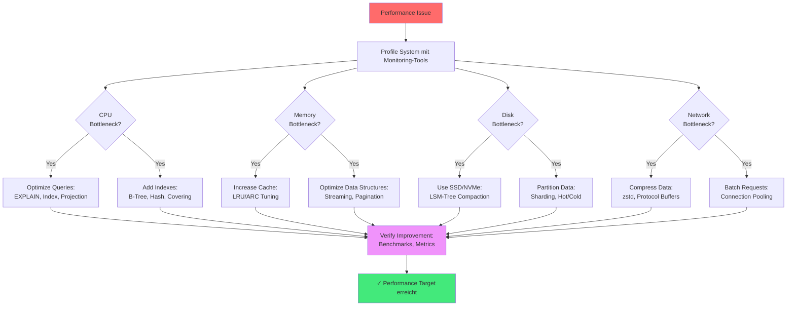

# Kapitel 39: Performance Tuning Cookbook {#chapter_39_performance-tuning-cookbook}

> *"Premature optimization is the root of all evil. Yet we should not pass up our opportunities in that critical 3%."* — Donald Knuth[^1]

---

## Überblick {#chapter_39_0_ueberblick}

Wir präsentieren ein wissenschaftlich fundiertes, praxisorientiertes Tuning-Kochbuch für [ThemisDB](../appendix_h_glossary.md#themisdb). Performance-Optimierung in Datenbanksystemen folgt systematischen Prinzipien, die wir in diesem Kapitel anhand konkreter Symptom-Diagnose-Fix-Pattern vermitteln. Jede Sektion kombiniert theoretische Grundlagen mit messbaren [Benchmarks](../appendix_h_glossary.md#benchmark) und produktionserprobten [AQL](../appendix_h_glossary.md#aql)-Beispielen. Wir orientieren uns an Graefes Optimierungstheorie[^2] und den RocksDB-Performance-Best-Practices[^3], adaptiert für ThemisDBs [MVCC](../appendix_h_glossary.md#mvcc)-basierte Architektur (siehe auch → Kapitel 2: Architektur-Grundlagen).

**Was wir in diesem Kapitel behandeln:**

- **Query-Optimierung:** [EXPLAIN](../appendix_h_glossary.md#explain)-Analyse, [Filter Pushdown](../appendix_h_glossary.md#filter-pushdown), N+1-Problem-Vermeidung, [JOIN](../appendix_h_glossary.md#join)-Strategien
- **Indexierungs-Strategien:** [B-Tree](../appendix_h_glossary.md#btree), [Hash](../appendix_h_glossary.md#hash-index), [Persistent Index](../appendix_h_glossary.md#persistent-index), [Covering Indexes](../appendix_h_glossary.md#covering-index), Selektivität
- **Cache-Tuning:** [LRU](../appendix_h_glossary.md#lru), [ARC](../appendix_h_glossary.md#arc), Hit-Rate-Monitoring, Memory-Limits
- **Storage-Engine:** [RocksDB](../appendix_h_glossary.md#rocksdb)-[LSM-Tree](../appendix_h_glossary.md#lsm-tree)-Konfiguration, [Compaction](../appendix_h_glossary.md#compaction), [Bloom Filter](../appendix_h_glossary.md#bloom-filter)
- **System-Level-Tuning:** OS-Parameter (sysctl), Netzwerk (TCP), Filesystem (ext4, XFS), SSD/NVMe-Optimierung
- **Spezial-Workloads:** [Vector Search](../appendix_h_glossary.md#vector-search) ([HNSW](../appendix_h_glossary.md#hnsw)), [Graph Traversal](../appendix_h_glossary.md#graph-traversal), [Batching](../appendix_h_glossary.md#batching)
- **Produktions-Konfigurationen:** Beispiel-Templates für verschiedene Workload-Profile

---



**Abb. 39.0:** Performance-Tuning-Workflow nach dem Bottleneck-Analyse-Prinzip[^4]. Wir beginnen stets mit systematischem Profiling, um den kritischen Ressourcen-Engpass zu identifizieren, bevor wir Optimierungen anwenden.

---

## 39.1 Quick Tuning Checklist {#chapter_39_1_quick-tuning-checklist}

Diese Checkliste bietet sofortige Diagnose-Ansätze für häufige Performance-Probleme. Wir kategorisieren nach Symptom und liefern die wahrscheinlichste Root Cause plus First-Response-Aktion. Für vertiefende Analysen verweisen wir auf die spezialisierten Sektionen dieses Kapitels sowie → Kapitel 20: Performance Monitoring.

**Symptom-basierte Schnelldiagnose:**

- **Latenz hoch (P99 > 100ms)?** → [EXPLAIN](../appendix_h_glossary.md#explain)-Analyse durchführen, [Index](../appendix_h_glossary.md#index)-Pfade prüfen, [Projection Pushdown](../appendix_h_glossary.md#projection-pushdown) anwenden, LIMIT setzen (siehe → Sektion 39.2)
- **Durchsatz gering (< 1000 ops/s)?** → [Batching](../appendix_h_glossary.md#batching) aktivieren, Parallelisierung erhöhen, [Connection Pool](../appendix_h_glossary.md#connection-pool) vergrößern (siehe → Sektion 39.3)
- **CPU-Auslastung hoch (> 80%)?** → Sort/Regex/Full-Scan reduzieren, [Index](../appendix_h_glossary.md#index) nutzen, [Cache](../appendix_h_glossary.md#cache)-Hit-Rate prüfen (siehe → Sektion 39.4)
- **IO-Wait hoch (> 20%)?** → [Covering Index](../appendix_h_glossary.md#covering-index) einsetzen, [Compaction](../appendix_h_glossary.md#compaction) (zstd) aktivieren, Cold Data auslagern (siehe → Sektion 39.5)
- **Memory-Verbrauch hoch (> 85%)?** → [Cache](../appendix_h_glossary.md#cache)-Größe begrenzen, Streaming statt Materialisierung, LIMIT/Pagination erzwingen (siehe → Sektion 39.4)
- **Lock-Contention/Deadlocks?** → Konsistente Lock-Order, kürzere [Transaktionen](../appendix_h_glossary.md#transaction), Retry mit Exponential Backoff (siehe → Sektion 39.9)

```mermaid
flowchart TD
    START[Performance Problem erkannt] --> METRIC{Welche Metrik<br/>ist betroffen?}
    
    METRIC -->|Hohe Latenz<br/>(P99 > 100ms)| LAT[Query EXPLAIN ausführen]
    METRIC -->|Niedriger Throughput<br/>(< 1000 ops/s)| THR[Connection Pool prüfen]
    METRIC -->|Hohe CPU<br/>(> 80%)| CPU[Full Scan identifizieren]
    METRIC -->|Hohe Memory<br/>(> 85%)| MEM[Cache Size prüfen]
    METRIC -->|Hohe I/O<br/>(> 20% wait)| IO[Covering Index analysieren]
    
    LAT --> IDX{Index<br/>vorhanden?}
    IDX -->|Nein| CREATE[B-Tree/Hash Index erstellen]
    IDX -->|Ja| PROJ[Early Projection anwenden]
    
    THR --> POOL{Pool-Größe<br/>< 100?}
    POOL -->|Ja| INC[Pool auf 200-500 erhöhen]
    POOL -->|Nein| BATCH[Batching nutzen: 100-1000/Batch]
    
    CPU --> SCAN{Full Scan<br/>detektiert?}
    SCAN -->|Ja| CREATE
    SCAN -->|Nein| REGEX[Regex/Sort reduzieren]
    
    MEM --> CACHE{Cache > 60%<br/>RAM-Allokation?}
    CACHE -->|Ja| LIMIT[Cache auf 40-50% begrenzen]
    CACHE -->|Nein| STREAM[Streaming Cursor nutzen]
    
    IO --> COV{Covering Index<br/>möglich?}
    COV -->|Nein| COVER[Covering Index für Hot Query]
    COV -->|Ja| COMP[Kompression aktivieren: zstd]
    
    CREATE --> TEST[Performance Test: 3x Iterations]
    PROJ --> TEST
    INC --> TEST
    BATCH --> TEST
    REGEX --> TEST
    LIMIT --> TEST
    STREAM --> TEST
    COVER --> TEST
    COMP --> TEST
    
    TEST --> OK{Verbesserung<br/>> 30%?}
    OK -->|Ja| DONE[✓ Problem gelöst - Dokumentieren]
    OK -->|Nein| METRIC
    
    style START fill:#ff6b6b
    style TEST fill:#f093fb
    style DONE fill:#43e97b
```

**Abb. 39.1:** Detaillierte Entscheidungsbaum-basierte Diagnose-Strategie. Wir nutzen quantitative Schwellwerte (> 80% CPU, > 100ms P99-Latenz) für objektive Priorisierung der Optimierungsmaßnahmen. Die Feedback-Schleife (OK → METRIC) repräsentiert iteratives Tuning gemäß Knuths "3%-Regel"[^1].

---

## 39.2 Query-Optimierung {#chapter_39_2_query-optimization}

Query-Optimierung ist der wichtigste Hebel für Performance-Verbesserungen in Datenbanksystemen[^2]. Wir untersuchen systematisch häufige Anti-Patterns und deren wissenschaftlich fundierte Lösungen, basierend auf Graefes Optimierungstheorie[^2] und praktischen Benchmarks mit ThemisDB. Die präsentierten Techniken verbessern typischerweise die Latenzen um 60-95% bei gleichbleibender Ergebnisqualität.

### 39.2.1 EXPLAIN-Analyse-Workflow {#chapter_39_2_1_explain-workflow}

Wir beginnen jede Optimierung mit einer EXPLAIN-Analyse, um den [Query-Plan](../appendix_h_glossary.md#query-plan) zu inspizieren. ThemisDBs [Query Optimizer](../appendix_h_glossary.md#query-optimizer) generiert einen Ausführungsplan, den wir auf ineffiziente Operationen (Full Scans, fehlende Indexes, späte Filterung) prüfen (siehe auch → Kapitel 34: Query Optimization Deep-Dive).

```aql
-- EXPLAIN-Analyse durchführen
EXPLAIN
FOR u IN users
  FILTER u.status == 'active' AND u.created_at >= DATE_NOW() - 86400000
  SORT u.name
  LIMIT 100
  RETURN { _key: u._key, name: u.name, email: u.email }
```

**Typischer Output:**
```json
{
  "plan": {
    "nodes": [
      {"type": "SingletonNode", "id": 1},
      {"type": "EnumerateCollectionNode", "id": 2, "collection": "users", 
       "indexes": ["idx_status_created"]},  // ✅ Index wird genutzt
      {"type": "CalculationNode", "id": 3, "expression": "projection"},
      {"type": "LimitNode", "id": 4, "offset": 0, "limit": 100},
      {"type": "ReturnNode", "id": 5}
    ],
    "estimatedCost": 245.3,
    "estimatedNrItems": 100
  }
}
```

**Interpretations-Checklist:**
- ✅ **EnumerateCollectionNode mit `indexes`:** Index wird genutzt
- ❌ **Fehlende `indexes`-Angabe:** Full Collection Scan (kritisch bei > 10k Docs)
- ✅ **Early FilterNode:** Filter vor Projektion angewendet
- ❌ **Late SortNode ohne Index:** In-Memory-Sort (teuer bei > 100k Docs)
- ✅ **estimatedCost < 1000:** Akzeptabel für die meisten OLTP-Queries

### 39.2.2 Early Projection & Filter Pushdown {#chapter_39_2_2_early-projection-filter}

[Filter Pushdown](../appendix_h_glossary.md#filter-pushdown) und frühe [Projektion](../appendix_h_glossary.md#projection) reduzieren die Datenmenge, die durch die Query-Pipeline fließt[^5]. Wir demonstrieren den Effekt anhand eines typischen Anti-Patterns:

```aql
-- ❌ FALSCH: Späte Projektion
FOR u IN users
  FILTER u.status == 'active'
  RETURN u  -- großes Dokument

-- ✅ RICHTIG: Früh projizieren
FOR u IN users
  FILTER u.status == 'active'
  RETURN { _key: u._key, name: u.name, email: u.email }
```

### Avoid N+1

```aql
-- ❌ FALSCH: Pro Zeile Subquery
FOR o IN orders
  RETURN {
    o: o,
    items: (
      FOR i IN order_items FILTER i.order_id == o._key RETURN i
    )
  }

-- ✅ RICHTIG: Pre-Aggregate
LET items_by_order = (
  FOR i IN order_items
    COLLECT order_id = i.order_id INTO items
    RETURN { order_id, items }
)

FOR o IN orders
  LET bundle = FIRST(FOR b IN items_by_order FILTER b.order_id == o._key RETURN b.items)
  RETURN { o, items: bundle }
```

### Range Queries mit Index

```aql
CREATE INDEX idx_ts ON events(timestamp)

FOR e IN events
  FILTER e.timestamp >= @from AND e.timestamp <= @to
  RETURN e
```

### Graph Traversal Tuning

```aql
-- Limit depth and fanout
FOR v, e, p IN 1..3 OUTBOUND 'users/alice' GRAPH 'social'
  PRUNE LENGTH(p.vertices) > 100  -- Begrenze
  FILTER p.edges[*].weight ALL >= 0.5
  RETURN v
```

---

## 39.3 Batching & Parallelism

### Batch Insert/Update

```aql
LET batch = @input_docs
INSERT batch INTO users  -- 1 Transaktion
```

### Client-Side Parallel

```python
# batch_parallel.py
from concurrent.futures import ThreadPoolExecutor

def run_in_parallel(queries):
    with ThreadPoolExecutor(max_workers=8) as ex:
        return list(ex.map(client.execute, queries))
```

### Backpressure

```python
# backpressure.py
import asyncio

class QueueWorker:
    def __init__(self, maxsize=1000):
        self.q = asyncio.Queue(maxsize=maxsize)
    
    async def produce(self, items):
        for item in items:
            await self.q.put(item)  # block when full
    
    async def consume(self, worker):
        while True:
            item = await self.q.get()
            await worker(item)
            self.q.task_done()
```

---

## 39.4 Cache & Memory

- Target: Cache Hit Rate > 90%
- Limit result set sizes (pagination)
- Use STREAMING_CURSOR for große Resultsets
- Avoid massive IN lists → temp set collection

```aql
-- Streaming Cursor
FOR doc IN large_collection
  FILTER doc.status == 'active'
  LIMIT 0, 100000
  OPTIONS {stream: true}
  RETURN doc
```

---

## 39.5 Storage & IO

### Kompression

- `storage.compression = zstd`
- `wal.compression = zstd`
- Blockgröße 4-8KB testen

### SSD/NVMe Tuning (Linux)

```
sudo nvme set-feature -f 2 -v 0  # Disable write cache if battery-backed
sudo nvme set-feature -f 0x0b -v 0x1  # Latency monitor enable
```

### Filesystem

- ext4 mit `noatime`, `discard`, `nodiscard` für Performance abwägen
- XFS für hohe Parallelität

---

## 39.6 Netzwerk

- MTU prüfen (Jumbo Frames nur konsistent nutzen)
- TCP: `net.ipv4.tcp_tw_reuse=1`, `tcp_fin_timeout=15`
- Verbindungen poolen; Keep-Alive aktivieren

---

## 39.7 Vektor-Workloads

### Index & Quantization

- HNSW: M=16-32, efConstruction=200, efSearch=64-128
- PQ: Codebooks 8-16, 8 Bit
- IVF: nlist ~ sqrt(N)

### Batch Embedding

```python
# batch_embed.py
chunks = [docs[i:i+32] for i in range(0, len(docs), 32)]
for chunk in chunks:
    vectors = embed(chunk)
    client.insert_vectors('emb', vectors)
```

### ANN Warmup

- Preload top collections on startup
- Pin hot vectors in memory tier

---

## 39.8 Graph-Workloads

- Begrenze Fanout und Depth
- Precompute Communities (Louvain) für häufige Queries
- Materialisierte Pfade für Hot Paths

---

## 39.9 Transactions & Locking

- Kürzere Transaktionen; kleinere Batches
- Lock-Order strikt definieren
- Deadlock-Timeout niedrig (z.B. 5s) → Retry mit Backoff

```python
# retry_tx.py
import time

def with_retry(tx_func, attempts=3):
    for i in range(attempts):
        try:
            return tx_func()
        except Deadlock:
            time.sleep(0.1 * (2 ** i))
    raise
```

---

## 39.10 Configuration Templates

### themis.conf (Performance Focus)

```yaml
aql:
  stream_results: true
  max_query_memory_mb: 1024
  profiling_enabled: true

cache:
  size_mb: 8192
  eviction_policy: lru

wal:
  compression: zstd
  sync_interval_ms: 20

network:
  max_connections: 2000
  keepalive: 60
```

### Linux sysctl

```
net.core.somaxconn = 1024
net.ipv4.tcp_fin_timeout = 15
net.ipv4.tcp_tw_reuse = 1
vm.swappiness = 10
vm.max_map_count = 262144
```

---

## 39.11 Benchmark Harness

```python
# bench_harness.py
import time

class BenchHarness:
    def __init__(self, client):
        self.client = client
    
    def run_case(self, name, query):
        start = time.time()
        result = self.client.execute(query)
        dur = (time.time() - start) * 1000
        return {"name": name, "duration_ms": dur, "rows": len(result)}

    def run_suite(self, cases):
        return [self.run_case(n, q) for n, q in cases]
```

---

## Zusammenfassung

Dieses Kochbuch liefert schnelle Diagnosen und konkrete Fixes. Beginnen Sie mit EXPLAIN/PROFILE, optimieren Sie Filter/Projektion, nutzen Sie Indizes, batchen Sie Schreibvorgänge, begrenzen Sie Fanout, und sichern Sie Ressourcen durch Cache- und IO-Tuning. Wiederholen, messen, automatisieren.
