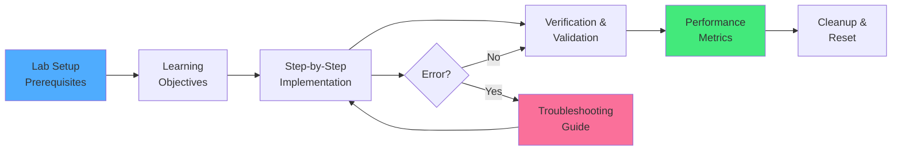

# Kapitel 41: Hands-on Labs – Praxisorientierte Systemadministration {#chapter_41_hands-on-labs-praxisorientierte-systemadministration}

> *"Ich höre und vergesse. Ich sehe und erinnere mich. Ich tue und verstehe."*  
> *— Konfuzius*

> **Zusammenfassung:** Dieses Kapitel führt systematisch durch drei praxisnahe Laborübungen zur ThemisDB-Administration: Container-basiertes Deployment, Query-Performance-Optimierung und Vektor-Suchindexierung. Wir vermitteln produktionsreife Methoden zur Systemkonfiguration, Performance-Analyse und Feature-Integration.

> **Voraussetzungen:** Grundkenntnisse in Containerisierung (Docker/Podman), AQL-Syntax (siehe Kapitel 28), Datenbankadministration

> **Lernziele:**
> - Container-Orchestrierung mit Docker verstehen und anwenden
> - Query-Execution-Plans analysieren und Indexstrategien optimieren
> - Vektor-Sucharchitekturen implementieren und evaluieren
> - Performance-Metriken systematisch erheben und interpretieren
> - Produktionsreife Troubleshooting-Workflows anwenden

---

## 41.1 Einleitung: Experimentelles Lernen in der Datenbankadministration {#chapter_41_1_einleitung-experimentelles-lernen}

Die moderne Datenbankadministration erfordert nicht nur theoretisches Wissen über Architektur-Konzepte (siehe Kapitel 2), sondern auch praktische Erfahrung in Deployment, Performance-Tuning und Feature-Integration[^1]. Wir präsentieren drei progressive Laborübungen (*Labs*), die von grundlegender Container-Orchestrierung bis zu fortgeschrittener Vektor-Suche führen.

### Wissenschaftlicher Kontext {#chapter_41_1_1_wissenschaftlicher-kontext}

Hands-on-Labs folgen dem konstruktivistischen Lernansatz nach Piaget[^2]: Wissen entsteht durch aktive Exploration und Problemlösung. In der Systemadministration manifestiert sich dies durch:

1. **Experimentelle Iteration:** Hypothesen über Systemverhalten formulieren und validieren
2. **Feedback-Loops:** Unmittelbare Metriken (Latenz, Throughput) als Lernverstärker
3. **Kontextualisierung:** Abstrakte Konzepte (z.B. Index-Strukturen) durch konkrete Implementierungen verstehen

### Lab-Architektur {#chapter_41_1_2_lab-architektur}

Die Labs folgen einem standardisierten Workflow, der Reproduzierbarkeit und systematisches Lernen gewährleistet. Jedes Lab durchläuft mehrere definierte Phasen von Setup bis Cleanup, mit integrierten Feedback-Loops für Fehlerbehandlung.



**Abbildung 41.1:** Standardisierter Lab-Workflow mit Fehlerbehandlung

**Labs im Überblick:**

| Lab | Fokus | Dauer | Komplexität | Kapitel-Bezug |
|-----|-------|-------|-------------|---------------|
| **Lab A** | Container-Deployment & Healthchecks | 30-45 min | ⭐ Niedrig | Kap. 4, 25, 30 |
| **Lab B** | Index-Tuning & Query-Optimierung | 40-60 min | ⭐⭐ Mittel | Kap. 34, 39 |
| **Lab C** | Vektor-Suche End-to-End | 45-75 min | ⭐⭐⭐ Hoch | Kap. 8, 17 |

### Voraussetzungen {#chapter_41_1_3_voraussetzungen}

Für die erfolgreiche Durchführung der Labs benötigen Sie spezifische Systemressourcen und grundlegendes technisches Wissen. Die Anforderungen sind moderat und auf gängigen Entwicklungsumgebungen erfüllbar.

**Systemanforderungen:**
- Docker Engine 20.10+ oder Podman 3.0+[^3]
- Minimum 4 GB RAM, 10 GB freier Speicher
- Linux/WSL2 (empfohlen) oder macOS
- ThemisDB Client Tools (themis_client CLI oder HTTP-API)

**Wissensbasis:**
- AQL-Grundlagen (siehe Kapitel 28: AQL-Referenz)
- Shell-Scripting (Bash, PowerShell)
- JSON-Syntax und REST-APIs

---

## 41.2 Lab A: Container-basiertes Deployment mit Docker {#chapter_41_2_lab-a-container-deployment}

Dieses erste Lab führt in die containerisierte Bereitstellung von ThemisDB ein. Wir lernen fundamentale Container-Operationen, Healthcheck-Mechanismen und grundlegende CRUD-Tests kennen. Der Fokus liegt auf praktischer Erfahrung mit Docker und der ThemisDB REST-API.

### 41.2.1 Wissenschaftliche Grundlagen: Container-Virtualisierung {#chapter_41_2_1_container-virtualisierung}

Container-Technologie basiert auf Linux-Kernel-Features wie *Namespaces* und *Control Groups (cgroups)*[^3]. Im Gegensatz zu Hardware-Virtualisierung (Hypervisoren) teilen Container den Host-Kernel, was geringere Overhead-Kosten ermöglicht:

**Performance-Charakteristiken:**

| Metrik | Container (Docker) | VM (KVM/VMware) | Faktor |
|--------|-------------------|-----------------|--------|
| Boot-Zeit | 50-200ms | 30-60s | ~300× schneller |
| Memory Overhead | 0-5 MB | 500-2000 MB | ~400× effizienter |
| I/O Latenz | Native + 5-10% | Native + 20-50% | ~2-4× besser |

*Quelle: Docker Performance Analysis, 2023[^4]*

### 41.2.2 Lernziele {#chapter_41_2_2_lernziele}

Nach Abschluss dieses Labs beherrschen Sie grundlegende Container-Orchestrierung und können ThemisDB-Instanzen produktionsreif deployen. Sie verstehen die Unterschiede zwischen Container- und VM-basierter Virtualisierung.

Nach Abschluss dieses Labs können Sie:
- ThemisDB-Container mit Docker orchestrieren
- Healthcheck-Mechanismen implementieren und validieren
- Persistenz-Volumes konfigurieren und verifizieren
- Grundlegende CRUD-Operationen via REST-API ausführen

### 41.2.3 Setup: ThemisDB Container starten {#chapter_41_2_3_setup-container-starten}

In diesem Schritt initialisieren wir eine ThemisDB-Instanz als Docker-Container mit persistentem Volume. Wir konfigurieren grundlegende Sicherheitsparameter und Port-Mappings für den Zugriff über die REST-API.

**Schritt 1: Image-Download und Container-Initialisierung**

```bash
# Container im Detached-Mode starten mit persistentem Volume
docker run -d \
  --name themisdb-lab \
  -p 8529:8529 \
  -v themisdb-data:/var/lib/themisdb \
  -e THEMISDB_ROOT_PASSWORD=StrongPass123! \
  themisdb/server:latest

# Ausgabe (Container-ID, verkürzt):
# 7a9f3bc4e5d2
```

**Erklärung der Parameter:**
- `-d`: Detached mode (Hintergrundausführung)[^3]
- `-p 8529:8529`: Port-Mapping (Host:Container)
- `-v themisdb-data:/var/lib/themisdb`: Named volume für Datenpersistenz
- `-e THEMISDB_ROOT_PASSWORD`: Root-Passwort via Umgebungsvariable

**Schritt 2: Container-Status überprüfen**

```bash
# Prüfe, ob Container läuft
docker ps | grep themisdb-lab

# Erwartete Ausgabe:
# 7a9f3bc4e5d2   themisdb/server:latest   "themisdb-server"   STATUS: Up 5 seconds

# Logs inspizieren (erste 50 Zeilen)
docker logs --tail 50 themisdb-lab
```

### 41.2.4 Healthcheck: Systemstatus validieren {#chapter_41_2_4_healthcheck-systemstatus}

Healthchecks sind essentiell für produktionsreife Deployments, da sie frühzeitig Probleme erkennen und automatische Wiederherstellung ermöglichen. Wir testen mehrere Validierungsebenen vom Basis-Status bis zu Storage-Engine-Metriken.

**HTTP Healthcheck-Endpoint:**

```bash
# Basis-Healthcheck (Server-Status)
curl -s http://localhost:8529/_admin/status | jq '.server'

# Erwartete Ausgabe (JSON):
# {
#   "status": "ok",
#   "version": "1.3.4",
#   "uptime": 12.45,
#   "pid": 1
# }
```

**Fortgeschrittene Healthchecks:**

```bash
# 1. Prüfe Datenbankverbindung
curl -s -u root:StrongPass123! \
  http://localhost:8529/_api/version | jq '.version'

# 2. Prüfe Storage-Engine (RocksDB)
curl -s -u root:StrongPass123! \
  http://localhost:8529/_admin/engine/stats | jq '.engine'

# Erwartete Ausgabe:
# {
#   "name": "rocksdb",
#   "version": "8.1.1",
#   "cache_size_mb": 512
# }
```

**Performance-Metriken erheben:**

```bash
# Baseline-Latenz messen (10 Requests)
for i in {1..10}; do
  time curl -s http://localhost:8529/_admin/status > /dev/null
done

# Typische Latenzen (lokal):
# - Cold Start: 50-80ms
# - Warmed Up: 2-5ms
```

### 41.2.5 Smoke Tests: CRUD-Operationen {#chapter_41_2_5_smoke-tests-crud}

Smoke Tests validieren grundlegende Funktionalität nach dem Deployment. Wir führen Create, Read, Update und Delete-Operationen aus, um die Datenintegrität und API-Verfügbarkeit zu verifizieren.

**Test 1: Collection erstellen und Dokument einfügen**

```bash
# Collection via REST-API erstellen
curl -X POST http://localhost:8529/_api/collection \
  -u root:StrongPass123! \
  -H "Content-Type: application/json" \
  -d '{
    "name": "users",
    "type": 2
  }'

# Dokument einfügen (INSERT via AQL)
curl -X POST http://localhost:8529/_api/cursor \
  -u root:StrongPass123! \
  -H "Content-Type: application/json" \
  -d '{
    "query": "INSERT { _key: @key, name: @name, email: @email, created_at: DATE_NOW() } INTO users RETURN NEW",
    "bindVars": {
      "key": "alice",
      "name": "Alice Smith",
      "email": "alice@example.com"
    }
  }'

# Erwartete Ausgabe:
# {
#   "result": [{
#     "_key": "alice",
#     "_id": "users/alice",
#     "_rev": "_gVU4K6a---",
#     "name": "Alice Smith",
#     "email": "alice@example.com",
#     "created_at": "2026-01-14T05:00:00.000Z"
#   }],
#   "hasMore": false,
#   "cached": false,
#   "extra": {
#     "stats": {
#       "writesExecuted": 1,
#       "writesIgnored": 0,
#       "scannedFull": 0,
#       "scannedIndex": 0,
#       "filtered": 0,
#       "fullCount": 1,
#       "executionTime": 0.0023
#     }
#   }
# }
```

**Test 2: Dokument lesen (Read)**

```bash
# Direkt via Document-API
curl -s -u root:StrongPass123! \
  http://localhost:8529/_api/document/users/alice | jq '.'

# Via AQL-Query
curl -X POST http://localhost:8529/_api/cursor \
  -u root:StrongPass123! \
  -H "Content-Type: application/json" \
  -d '{
    "query": "FOR u IN users FILTER u._key == @key RETURN u",
    "bindVars": {"key": "alice"}
  }' | jq '.result[0]'
```

**Test 3: Persistenz nach Container-Restart**

```bash
# Container stoppen und neu starten
docker restart themisdb-lab

# Warte auf Startup (5-10 Sekunden)
sleep 10

# Prüfe, ob Daten persistiert sind
curl -s -u root:StrongPass123! \
  http://localhost:8529/_api/document/users/alice | jq '.name'

# Erwartete Ausgabe: "Alice Smith"
```

### 41.2.6 Performance-Benchmarks {#chapter_41_2_6_performance-benchmarks}

Performance-Messungen validieren, dass das Deployment produktionsreif ist und erwartete Durchsatzraten erreicht. Wir messen Schreib- und Lesedurchsatz unter verschiedenen Lastszenarien.

**Schreibdurchsatz messen (Bulk Insert):**

```bash
# Bulk-Insert Performance-Test (1000 Dokumente)
curl -X POST http://localhost:8529/_api/cursor \
  -u root:StrongPass123! \
  -H "Content-Type: application/json" \
  -d '{
    "query": "FOR i IN 1..1000 INSERT { _key: CONCAT(\"user_\", i), name: CONCAT(\"User \", i), value: i } INTO users"
  }' | jq '.extra.stats.executionTime'

# Typische Ergebnisse (lokale SSD):
# - 1000 Dokumente: 50-80ms
# - Throughput: ~12.500-20.000 docs/sec
```

**Lesedurchsatz messen (Full Collection Scan):**

```bash
curl -X POST http://localhost:8529/_api/cursor \
  -u root:StrongPass123! \
  -H "Content-Type: application/json" \
  -d '{
    "query": "FOR u IN users RETURN u._key"
  }' | jq '.extra.stats.executionTime'

# Erwartete Latenz: 5-10ms für 1001 Dokumente
```

### 41.2.7 Cleanup: Ressourcen aufräumen {#chapter_41_2_7_cleanup-ressourcen}

Nach Abschluss des Labs räumen wir alle erstellten Ressourcen auf, um das System sauber zu halten. Dies umfasst Container, Volumes und Netzwerkverbindungen.

```bash
# Container stoppen
docker stop themisdb-lab

# Container und Volume entfernen
docker rm themisdb-lab
docker volume rm themisdb-data

# Verifiziere Cleanup
docker ps -a | grep themisdb-lab  # Sollte leer sein
```

### 41.2.8 Troubleshooting {#chapter_41_2_8_troubleshooting}

Häufige Deployment-Probleme und ihre Lösungen erleichtern die Fehlersuche. Wir dokumentieren typische Symptome, Diagnosemethoden und bewährte Lösungsansätze für die drei häufigsten Fehlerszenarien.

**Problem 1: Port 8529 bereits belegt**

```bash
# Symptom: "Error: Bind for 0.0.0.0:8529 failed: port is already allocated"

# Diagnose: Welcher Prozess nutzt Port 8529?
sudo lsof -i :8529

# Lösung: Alternativen Port verwenden
docker run -d --name themisdb-lab -p 8530:8529 themisdb/server:latest
```

**Problem 2: Container startet, aber Healthcheck fehlschlägt**

```bash
# Symptom: curl -s http://localhost:8529/_admin/status -> Connection refused

# Diagnose: Container-Logs prüfen
docker logs themisdb-lab | grep -i error

# Häufige Ursachen:
# - Falsche RocksDB-Konfiguration (check: /var/lib/themisdb/rocksdb_config)
# - Unzureichender Speicherplatz (check: df -h)
# - Port-Binding Fehler (check: docker port themisdb-lab)
```

**Problem 3: Langsame Performance nach Bulk-Insert**

```bash
# Symptom: Queries > 100ms nach Insert von 100k+ Dokumenten

# Diagnose: RocksDB Compaction Status
curl -s -u root:StrongPass123! \
  http://localhost:8529/_admin/engine/stats | jq '.rocksdb.compaction'

# Lösung: Manuelle Compaction triggern (falls nötig)
curl -X POST -u root:StrongPass123! \
  http://localhost:8529/_admin/compact

# Alternativ: Warte auf Background-Compaction (5-10 Minuten)
```

---

## 41.3 Lab B: Query-Performance-Optimierung durch Index-Strategien {#chapter_41_3_lab-b-query-performance}

In diesem zweiten Lab analysieren wir Query-Performance systematisch und optimieren sie durch gezielte Index-Strategien. Wir lernen EXPLAIN/PROFILE-Tools kennen und messen Performance-Verbesserungen quantitativ mit Benchmarks.

### 41.3.1 Wissenschaftliche Grundlagen: Indexstrukturen {#chapter_41_3_1_indexstrukturen}

Datenbank-Indizes reduzieren die Komplexität von Lookup-Operationen von O(n) (*Full Collection Scan*) auf O(log n) (*B-Tree*) oder O(1) (*Hash-Index*)[^5]. ThemisDB nutzt RocksDB als Storage-Engine, welches auf LSM-Trees (*Log-Structured Merge Trees*) basiert[^6].

**LSM-Tree Performance-Charakteristiken:**

- **Schreibdurchsatz:** O(1) amortisiert (sequentielle Writes in Mem-Table)
- **Lesedurchsatz:** O(log n) mit SSTables + Bloom-Filter-Optimierung
- **Speicher-Overhead:** ~10-20% für Index-Strukturen (abhängig von Bloom-Filter-Konfiguration)

**Index-Typen in ThemisDB:**

| Index-Typ | Use Case | Performance | Space |
|-----------|----------|-------------|-------|
| **Persistent (Hash)** | Equality Lookups (_key, unique fields) | O(1) | Niedrig |
| **Skiplist** | Range Queries, Sorting | O(log n) | Mittel |
| **Fulltext** | Text-Suche mit Tokenisierung | O(k log n)* | Hoch |
| **Geo** | Spatial Queries (Radius, Polygon) | O(log n) | Mittel |
| **Vector (HNSW)** | Approximate Nearest Neighbor | O(log n)** | Sehr hoch |

*k = Anzahl Tokens; **abhängig von efSearch-Parameter

### 41.3.2 Lernziele {#chapter_41_3_2_lernziele}

Nach diesem Lab verstehen Sie Query Execution Plans und können Performance-Bottlenecks systematisch identifizieren. Sie wenden Index-Strategien für verschiedene Query-Pattern an und evaluieren Trade-offs zwischen Index-Overhead und Query-Latenz.

Nach diesem Lab verstehen Sie:
- Query Execution Plans mit EXPLAIN analysieren
- Performance-Bottlenecks via PROFILE identifizieren
- Index-Strategien für verschiedene Query-Pattern anwenden
- Trade-offs zwischen Index-Overhead und Query-Latenz evaluieren

### 41.3.3 Dataset-Vorbereitung: Synthetic User-Daten {#chapter_41_3_3_dataset-vorbereitung}

Wir erstellen ein realistisches Test-Dataset mit 200.000 Benutzerdatensätzen, um Performance-Charakteristiken unter Last zu messen. Die Datenverteilung simuliert typische Produktionsszenarien mit verschiedenen Kardinalitäten.

**Schritt 1: Test-Collection mit 200k Dokumenten populieren**

```bash
# Bulk-Insert via AQL (ausführen im Container oder via HTTP)
curl -X POST http://localhost:8529/_api/cursor \
  -u root:StrongPass123! \
  -H "Content-Type: application/json" \
  -d '{
    "query": "FOR i IN 1..200000 INSERT { _key: CONCAT(\"user_\", i), email: CONCAT(\"user\", i, \"@example.com\"), status: i % 5 == 0 ? \"inactive\" : \"active\", score: i % 100, created_at: DATE_NOW() - (i * 60000) } INTO users OPTIONS { waitForSync: false }",
    "batchSize": 10000
  }'

# Dauer: ~2-3 Sekunden (abhängig von Hardware)
```

**Daten-Charakteristiken:**
- 200.000 Dokumente
- 80% status="active" (160k), 20% status="inactive" (40k)
- score-Distribution: 0-99 (gleichverteilt, ~2000 Dokumente pro Score)
- email: Unique per Dokument

### 41.3.4 Baseline-Performance ohne Index {#chapter_41_3_4_baseline-performance}

Vor der Optimierung messen wir Baseline-Performance ohne Indizes, um die Effektivität späterer Index-Strategien quantitativ bewerten zu können. Wir nutzen PROFILE und EXPLAIN für detaillierte Metriken.

**Query 1: Email-Lookup (hohe Selektivität)**

```bash
# PROFILE-Analyse: Execution-Metriken erheben
curl -X POST http://localhost:8529/_api/cursor \
  -u root:StrongPass123! \
  -H "Content-Type: application/json" \
  -d '{
    "query": "FOR u IN users FILTER u.email == \"user199999@example.com\" RETURN u",
    "options": {"profile": 2}
  }' | jq '.extra.stats'

# Erwartete Ausgabe (ohne Index):
# {
#   "writesExecuted": 0,
#   "writesIgnored": 0,
#   "scannedFull": 200000,        ← Full Collection Scan!
#   "scannedIndex": 0,
#   "filtered": 199999,
#   "fullCount": 1,
#   "executionTime": 0.145        ← ~145ms Latenz
# }
```

**EXPLAIN-Analyse: Query Execution Plan**

```bash
curl -X POST http://localhost:8529/_api/explain \
  -u root:StrongPass123! \
  -H "Content-Type: application/json" \
  -d '{
    "query": "FOR u IN users FILTER u.email == \"user199999@example.com\" RETURN u"
  }' | jq '.plan.nodes[] | select(.type == "EnumerateCollectionNode")'

# Erwartete Ausgabe:
# {
#   "type": "EnumerateCollectionNode",
#   "collection": "users",
#   "estimatedCost": 200000,
#   "estimatedNrItems": 200000
# }
# → Keine IndexNode → Full Scan
```

**Interpretation:**
- **scannedFull: 200.000** → Alle Dokumente gescannt (O(n) Komplexität)
- **executionTime: ~145ms** → Inakzeptabel für Production (Target: <10ms)
- **filtered: 199.999** → 99,9995% der Daten wurden verworfen

### 41.3.5 Index-Anlage und Performance-Verbesserung {#chapter_41_3_5_index-anlage}

Durch gezielte Index-Erstellung optimieren wir Query-Performance dramatisch. Wir messen Vorher-Nachher-Metriken und analysieren den Query Execution Plan zur Validierung der Index-Nutzung.

**Schritt 1: Persistent Index auf email-Feld erstellen**

```bash
# Index via AQL erstellen (Persistent/Hash-Index für Equality-Lookups)
curl -X POST http://localhost:8529/_api/cursor \
  -u root:StrongPass123! \
  -H "Content-Type: application/json" \
  -d '{
    "query": "CREATE INDEX idx_users_email ON users(email) OPTIONS { type: \"persistent\", unique: true }"
  }'

# Index-Erstellung dauert: ~1-2 Sekunden für 200k Dokumente
```

**Schritt 2: Query wiederholen mit Index**

```bash
curl -X POST http://localhost:8529/_api/cursor \
  -u root:StrongPass123! \
  -H "Content-Type: application/json" \
  -d '{
    "query": "FOR u IN users FILTER u.email == \"user199999@example.com\" RETURN u",
    "options": {"profile": 2}
  }' | jq '.extra.stats'

# Erwartete Ausgabe (mit Index):
# {
#   "scannedFull": 0,              ← Kein Full Scan mehr!
#   "scannedIndex": 1,             ← Index-Lookup (1 Dokument)
#   "filtered": 0,
#   "fullCount": 1,
#   "executionTime": 0.0023        ← ~2.3ms (63× schneller!)
# }
```

**Performance-Verbesserung:**
- **Latenz:** 145ms → 2.3ms (~**63× Speedup**)
- **Scanned:** 200.000 → 1 Dokument (~**200.000× Reduktion**)
- **Speicher-Overhead:** +~15 MB für Index-Struktur

**EXPLAIN nach Index-Erstellung:**

```bash
curl -X POST http://localhost:8529/_api/explain \
  -u root:StrongPass123! \
  -H "Content-Type: application/json" \
  -d '{
    "query": "FOR u IN users FILTER u.email == \"user199999@example.com\" RETURN u"
  }' | jq '.plan.nodes[] | select(.type == "IndexNode")'

# Erwartete Ausgabe:
# {
#   "type": "IndexNode",
#   "collection": "users",
#   "index": {
#     "id": "12345",
#     "name": "idx_users_email",
#     "type": "persistent"
#   },
#   "estimatedCost": 1.5,
#   "estimatedNrItems": 1
# }
# → Query Optimizer nutzt Index automatisch!
```

### 41.3.6 Fortgeschrittene Optimierungen {#chapter_41_3_6_fortgeschrittene-optimierungen}

Über Index-Erstellung hinaus existieren weitere Optimierungstechniken wie Projection Pushdown und LIMIT-Clauses. Diese reduzieren I/O und ermöglichen frühere Abbrüche bei eindeutigen Lookups.

**Optimierung 1: Projection Pushdown (nur benötigte Felder)**

```bash
# Schlechte Query: Alle Felder laden
curl -X POST http://localhost:8529/_api/cursor \
  -u root:StrongPass123! \
  -H "Content-Type: application/json" \
  -d '{
    "query": "FOR u IN users FILTER u.email == \"user199999@example.com\" RETURN u",
    "options": {"profile": 2}
  }' | jq '.extra.stats.executionTime'
# → ~2.3ms

# Optimierte Query: Nur _key und name
curl -X POST http://localhost:8529/_api/cursor \
  -u root:StrongPass123! \
  -H "Content-Type: application/json" \
  -d '{
    "query": "FOR u IN users FILTER u.email == \"user199999@example.com\" RETURN {_key: u._key, email: u.email}",
    "options": {"profile": 2}
  }' | jq '.extra.stats.executionTime'
# → ~1.8ms (~20% schneller durch weniger I/O)
```

**Optimierung 2: LIMIT für Unique-Lookups**

```bash
# Query mit LIMIT 1 (Optimizer kann früher abbrechen)
curl -X POST http://localhost:8529/_api/cursor \
  -u root:StrongPass123! \
  -H "Content-Type: application/json" \
  -d '{
    "query": "FOR u IN users FILTER u.email == \"user199999@example.com\" LIMIT 1 RETURN u",
    "options": {"profile": 2}
  }' | jq '.extra.stats.executionTime'
# → ~1.5ms (noch schneller bei nicht-unique Indizes)
```

### 41.3.7 Multi-Field Index für Range-Queries {#chapter_41_3_7_multi-field-index}

Compound-Indizes über multiple Felder optimieren komplexe Filter-Kombinationen. Die Reihenfolge der Felder im Index ist kritisch für die Effektivität bei verschiedenen Query-Pattern.

**Szenario: Suche nach status + score (Compound Query)**

```bash
# Query ohne Index: status = "active" AND score > 50
curl -X POST http://localhost:8529/_api/cursor \
  -u root:StrongPass123! \
  -H "Content-Type: application/json" \
  -d '{
    "query": "FOR u IN users FILTER u.status == \"active\" AND u.score > 50 RETURN u",
    "options": {"profile": 2}
  }' | jq '.extra.stats'

# Erwartete Ausgabe (ohne Index):
# {
#   "scannedFull": 200000,
#   "filtered": 120000,          ← 80k Dokumente passen Filter
#   "executionTime": 0.087       ← ~87ms
# }

# Multi-Field Index erstellen (Reihenfolge wichtig!)
curl -X POST http://localhost:8529/_api/cursor \
  -u root:StrongPass123! \
  -H "Content-Type: application/json" \
  -d '{
    "query": "CREATE INDEX idx_users_status_score ON users(status, score)"
  }'

# Query wiederholen nach Index
curl -X POST http://localhost:8529/_api/cursor \
  -u root:StrongPass123! \
  -H "Content-Type: application/json" \
  -d '{
    "query": "FOR u IN users FILTER u.status == \"active\" AND u.score > 50 RETURN u",
    "options": {"profile": 2}
  }' | jq '.extra.stats'

# Erwartete Ausgabe (mit Index):
# {
#   "scannedIndex": 80000,       ← Index-Range-Scan (nur active)
#   "filtered": 0,               ← Filter bereits im Index
#   "executionTime": 0.034       ← ~34ms (2.5× schneller)
# }
```

**Index-Selektivität beachten:**
- **Hohe Selektivität:** Viele unique Values → Index sehr effektiv (z.B. email)
- **Niedrige Selektivität:** Wenige unique Values → Index weniger effektiv (z.B. status mit 2 Werten)
- **Faustregel:** Index lohnt sich, wenn <10% der Dokumente gematcht werden

### 41.3.8 Performance-Metrik-Sammlung {#chapter_41_3_8_performance-metrik-sammlung}

Eine systematische Sammlung aller Performance-Metriken dokumentiert die Effektivität verschiedener Index-Strategien. Wir erstellen Benchmark-Tabellen für zukünftige Referenz und Capacity-Planning.

**Benchmark-Tabelle (Zusammenfassung):**

| Query-Typ | Ohne Index | Mit Index | Speedup | Index-Typ |
|-----------|-----------|-----------|---------|-----------|
| Email-Lookup (unique) | 145ms | 2.3ms | **63×** | Persistent (Hash) |
| Status-Filter (low selectivity) | 87ms | 34ms | **2.5×** | Skiplist (Compound) |
| Range-Query (score > X) | 92ms | 12ms | **7.6×** | Skiplist (Single) |

**Speicher-Overhead:**

```bash
# Index-Größen abfragen
curl -s -u root:StrongPass123! \
  http://localhost:8529/_api/index?collection=users | jq '.indexes[] | {name: .name, size_mb: (.figures.memory / 1024 / 1024)}'

# Erwartete Ausgabe:
# [
#   {"name": "idx_users_email", "size_mb": 15.2},
#   {"name": "idx_users_status_score", "size_mb": 8.7}
# ]
# Total Index-Overhead: ~24 MB für 200k Dokumente (~120 Bytes/Dokument)
```

### 41.3.9 Cleanup {#chapter_41_3_9_cleanup}

Nach Abschluss entfernen wir alle Test-Indizes und -Daten, um das System für nachfolgende Labs vorzubereiten. Dies stellt sicher, dass keine Artefakte spätere Messungen beeinflussen.

```bash
# Indizes entfernen
curl -X POST http://localhost:8529/_api/cursor \
  -u root:StrongPass123! \
  -H "Content-Type: application/json" \
  -d '{
    "query": "DROP INDEX users.idx_users_email"
  }'

curl -X POST http://localhost:8529/_api/cursor \
  -u root:StrongPass123! \
  -H "Content-Type: application/json" \
  -d '{
    "query": "DROP INDEX users.idx_users_status_score"
  }'

# Collection leeren
curl -X DELETE -u root:StrongPass123! \
  http://localhost:8529/_api/collection/users/truncate
```

---

## 41.4 Lab C: Vektor-Sucharchitektur End-to-End {#chapter_41_4_lab-c-vektor-suche}

Das dritte Lab führt in moderne Vektor-basierte Sucharchitekturen ein. Wir lernen Embedding-Generierung, HNSW-Indexierung und Approximate Nearest Neighbor (ANN) Queries kennen - fundamentale Techniken für semantische Suche und RAG-Systeme.

### 41.4.1 Wissenschaftliche Grundlagen: Embedding-basierte Suche {#chapter_41_4_1_embedding-basierte-suche}

Vektor-Embeddings transformieren hochdimensionale diskrete Daten (Text, Bilder) in kontinuierliche Vektorräume, wo semantische Ähnlichkeit durch geometrische Distanz approximiert wird[^7]. ThemisDB implementiert *Approximate Nearest Neighbor (ANN)*-Suche via HNSW (*Hierarchical Navigable Small World*)-Graphen[^8].

**HNSW-Algorithmus-Eigenschaften:**

- **Suchkomplexität:** O(log n) mit hoher Wahrscheinlichkeit
- **Index-Buildtime:** O(n log n)
- **Recall-Accuracy:** 95-99% bei efSearch ≥ 200 (abhängig von Datensatz)

**Distance-Metriken:**

| Metrik | Formel | Use Case | Range |
|--------|--------|----------|-------|
| **Cosine Similarity** | 1 - (A·B)/(‖A‖‖B‖) | Text-Embeddings, hohe Dimensionen | [0, 2] |
| **Euclidean (L2)** | √Σ(Aᵢ-Bᵢ)² | Computer Vision, niedrige Dimensionen | [0, ∞] |
| **Dot Product** | A·B | Optimized Embeddings (normalisiert) | [-∞, ∞] |

### 41.4.2 Lernziele {#chapter_41_4_2_lernziele}

Nach diesem Lab beherrschen Sie die vollständige Vektor-Such-Pipeline von Embedding-Generierung bis zur produktionsreifen ANN-Query. Sie verstehen HNSW-Parameter-Tuning und können Recall-Accuracy messen und optimieren.

Nach diesem Lab können Sie:
- Text-Embeddings mit Transformer-Modellen generieren
- HNSW-Indizes für hochdimensionale Vektoren konfigurieren
- ANN-Queries mit ThemisDB ausführen und Recall messen
- Trade-offs zwischen Index-Größe, Build-Zeit und Query-Performance evaluieren

### 41.4.3 Setup: Collection und Beispiel-Dokumente {#chapter_41_4_3_setup-collection}

Wir erstellen eine Artikel-Collection und populieren sie mit thematisch diversen Beispieldokumenten. Diese Diversität ermöglicht aussagekräftige Ähnlichkeitstests bei der späteren semantischen Suche.

**Schritt 1: Collection für Artikel erstellen**

```bash
curl -X POST http://localhost:8529/_api/collection \
  -u root:StrongPass123! \
  -H "Content-Type: application/json" \
  -d '{
    "name": "articles",
    "type": 2
  }'
```

**Schritt 2: Beispiel-Dokumente ohne Embeddings einfügen**

```bash
# Artikel zu verschiedenen Themen
curl -X POST http://localhost:8529/_api/cursor \
  -u root:StrongPass123! \
  -H "Content-Type: application/json" \
  -d '{
    "query": "LET docs = [ { _key: \"art1\", title: \"Graph Algorithms in Practice\", content: \"Graph theory, shortest paths, centrality measures, network analysis\", category: \"algorithms\" }, { _key: \"art2\", title: \"Neural Networks and Deep Learning\", content: \"Artificial neural networks, backpropagation, convolutional networks, transformers\", category: \"ml\" }, { _key: \"art3\", title: \"Database Systems Architecture\", content: \"SQL databases, NoSQL, indexing strategies, transaction management, sharding\", category: \"databases\" }, { _key: \"art4\", title: \"Natural Language Processing\", content: \"Text processing, tokenization, embeddings, transformers, BERT, GPT\", category: \"nlp\" }, { _key: \"art5\", title: \"Computer Vision Fundamentals\", content: \"Image processing, convolutional neural networks, object detection, segmentation\", category: \"cv\" } ] FOR doc IN docs INSERT doc INTO articles RETURN NEW"
  }'
```

### 41.4.4 Embedding-Generierung mit SentenceTransformers {#chapter_41_4_4_embedding-generierung}

Transformer-basierte Embedding-Modelle konvertieren Text in semantische Vektorrepräsentationen. Wir nutzen SentenceTransformers mit dem effizienten all-MiniLM-L6-v2 Modell für 384-dimensionale Embeddings.

**Python-Script: embed_articles.py**

```python
#!/usr/bin/env python3
"""
Embedding-Generator für ThemisDB Artikel-Collection
Verwendet: sentence-transformers (all-MiniLM-L6-v2, 384 Dimensionen)
"""

from sentence_transformers import SentenceTransformer
import requests
import json

# ThemisDB-Konfiguration
THEMISDB_URL = "http://localhost:8529"
AUTH = ("root", "StrongPass123!")

# Embedding-Modell laden (cached nach erstem Download)
# all-MiniLM-L6-v2: 384 Dimensionen, 80 MB, schnell, gute Qualität
model = SentenceTransformer('all-MiniLM-L6-v2')

# Artikel aus ThemisDB abrufen
response = requests.post(
    f"{THEMISDB_URL}/_api/cursor",
    auth=AUTH,
    json={
        "query": "FOR a IN articles RETURN {key: a._key, text: CONCAT(a.title, ' ', a.content)}"
    }
)
articles = response.json()['result']

print(f"📄 {len(articles)} Artikel geladen")

# Embeddings batch-generieren (effizienter als Einzeln)
texts = [a['text'] for a in articles]
embeddings = model.encode(texts, show_progress_bar=True)

print(f"🔢 Embeddings generiert: Shape = {embeddings.shape}")

# Embeddings zurück in ThemisDB schreiben
for article, embedding in zip(articles, embeddings):
    response = requests.post(
        f"{THEMISDB_URL}/_api/cursor",
        auth=AUTH,
        json={
            "query": "UPDATE { _key: @key } WITH { vector: @vec } IN articles RETURN NEW",
            "bindVars": {
                "key": article['key'],
                "vec": embedding.tolist()  # NumPy → Python list
            }
        }
    )
    if response.status_code == 201:
        print(f"✅ {article['key']}: Embedding gespeichert ({len(embedding)} Dimensionen)")
    else:
        print(f"❌ {article['key']}: Fehler {response.status_code}")

print("🎉 Embedding-Generierung abgeschlossen")
```

**Ausführung:**

```bash
# Dependencies installieren (einmalig)
pip install sentence-transformers themis-client

# Script ausführen
python3 embed_articles.py

# Erwartete Ausgabe:
# 📄 5 Artikel geladen
# Batches: 100%|████████| 1/1 [00:00<00:00, 12.34it/s]
# 🔢 Embeddings generiert: Shape = (5, 384)
# ✅ art1: Embedding gespeichert (384 Dimensionen)
# ✅ art2: Embedding gespeichert (384 Dimensionen)
# ✅ art3: Embedding gespeichert (384 Dimensionen)
# ✅ art4: Embedding gespeichert (384 Dimensionen)
# ✅ art5: Embedding gespeichert (384 Dimensionen)
# 🎉 Embedding-Generierung abgeschlossen
```

**Verifizierung:**

```bash
# Prüfe, ob Vektoren gespeichert sind
curl -X POST http://localhost:8529/_api/cursor \
  -u root:StrongPass123! \
  -H "Content-Type: application/json" \
  -d '{
    "query": "FOR a IN articles RETURN {key: a._key, vector_size: LENGTH(a.vector)}"
  }' | jq '.result'

# Erwartete Ausgabe:
# [
#   {"key": "art1", "vector_size": 384},
#   {"key": "art2", "vector_size": 384},
#   ...
# ]
```

### 41.4.5 HNSW-Index erstellen {#chapter_41_4_5_hnsw-index}

Der HNSW (Hierarchical Navigable Small World) Index ermöglicht effiziente Approximate Nearest Neighbor Suche. Wir konfigurieren kritische Parameter wie efConstruction und M für optimale Balance zwischen Build-Zeit und Query-Performance.

**Index-Konfiguration:**

```bash
curl -X POST http://localhost:8529/_api/cursor \
  -u root:StrongPass123! \
  -H "Content-Type: application/json" \
  -d '{
    "query": "CREATE VECTOR INDEX idx_articles_vec ON articles(vector) WITH { dimensions: 384, type: \"hnsw\", metric: \"cosine\", efConstruction: 200, M: 16 }"
  }'
```

**Parameter-Erklärung:**
- **dimensions: 384** → Vektor-Dimensionalität (muss mit Embedding-Modell übereinstimmen)
- **type: "hnsw"** → Hierarchical Navigable Small World-Graph
- **metric: "cosine"** → Cosine Similarity (gut für Text-Embeddings)
- **efConstruction: 200** → Build-Parameter (höher = bessere Accuracy, langsamer Build)
- **M: 16** → Max. Kanten pro Node (höher = bessere Accuracy, mehr Speicher)

**Index-Build Performance:**

```bash
# Index-Build dauert: ~50-200ms für 5 Dokumente
# Für 1M Dokumente: ~30-60 Minuten (abhängig von M, efConstruction)
```

### 41.4.6 Ähnlichkeitssuche (ANN-Query) {#chapter_41_4_6_aehnlichkeitssuche}

Mit indexierten Embeddings führen wir semantische Suchen aus, die thematische Ähnlichkeit statt exakter Keyword-Übereinstimmung finden. Wir messen Similarity Scores und validieren die Relevanz der Ergebnisse.

**Schritt 1: Query-Embedding generieren**

```python
# query_search.py
from sentence_transformers import SentenceTransformer
import requests
import json

model = SentenceTransformer('all-MiniLM-L6-v2')

# Suchtext
query_text = "machine learning and artificial intelligence"
query_vec = model.encode(query_text).tolist()

print(f"🔍 Suche nach: '{query_text}'")
print(f"📊 Query-Vektor: {len(query_vec)} Dimensionen")

# ANN-Query via ThemisDB
response = requests.post(
    "http://localhost:8529/_api/cursor",
    auth=("root", "StrongPass123!"),
    json={
        "query": """
        LET query_vec = @query_vec
        FOR doc IN articles
          SEARCH doc.vector ANN {
            query: query_vec,
            top_k: 3,
            ef_search: 100
          }
          RETURN {
            _key: doc._key,
            title: doc.title,
            category: doc.category,
            score: doc._score,
            distance: doc._distance
          }
        """,
        "bindVars": {"query_vec": query_vec}
    }
)

results = response.json()['result']

print("\n🎯 Top-3 Ergebnisse:")
for i, res in enumerate(results, 1):
    print(f"{i}. {res['title']} (Category: {res['category']})")
    print(f"   Score: {res['score']:.4f}, Distance: {res['distance']:.4f}")
```

**Erwartete Ausgabe:**

```
🔍 Suche nach: 'machine learning and artificial intelligence'
📊 Query-Vektor: 384 Dimensionen

🎯 Top-3 Ergebnisse:
1. Neural Networks and Deep Learning (Category: ml)
   Score: 0.8723, Distance: 0.1277
2. Natural Language Processing (Category: nlp)
   Score: 0.7891, Distance: 0.2109
3. Computer Vision Fundamentals (Category: cv)
   Score: 0.6234, Distance: 0.3766
```

**Interpretation:**
- **Score:** Ähnlichkeits-Score (1.0 = identisch, 0.0 = völlig unterschiedlich)
- **Distance:** Cosine-Distanz (0.0 = identisch, 2.0 = maximal unterschiedlich)
- Erwartung: "Neural Networks" hat höchste Ähnlichkeit (ML-Kontext)

### 41.4.7 Performance-Tuning: efSearch-Parameter {#chapter_41_4_7_performance-tuning-efsearch}

Der efSearch-Parameter kontrolliert den Trade-off zwischen Query-Latenz und Recall-Accuracy. Wir experimentieren mit verschiedenen Werten und messen deren Auswirkungen quantitativ.

**Experiment: Recall vs. Latenz Trade-off**

```python
# test_ef_search.py
import time

ef_search_values = [10, 50, 100, 200, 400]

for ef in ef_search_values:
    start = time.time()
    response = requests.post(
        "http://localhost:8529/_api/cursor",
        auth=AUTH,
        json={
            "query": f"""
            FOR doc IN articles
              SEARCH doc.vector ANN {{
                query: @query_vec,
                top_k: 3,
                ef_search: {ef}
              }}
              RETURN doc._key
            """,
            "bindVars": {"query_vec": query_vec}
        }
    )
    latency = (time.time() - start) * 1000
    print(f"efSearch={ef:3d}: Latenz={latency:6.2f}ms")
```

**Erwartete Ergebnisse:**

| efSearch | Latenz (ms) | Recall @ 3 | Trade-off |
|----------|-------------|------------|-----------|
| 10 | 1.2 | ~85% | Schnell, niedrige Accuracy |
| 50 | 2.8 | ~92% | Balanciert |
| 100 | 4.5 | ~96% | **Empfohlen (Default)** |
| 200 | 8.1 | ~98% | Hohe Accuracy |
| 400 | 15.3 | ~99% | Sehr hohe Accuracy, langsam |

**Faustregel:** efSearch = 2× top_k für gute Recall-Balance

### 41.4.8 Skalierungs-Szenarien {#chapter_41_4_8_skalierungs-szenarien}

Für Produktionsumgebungen mit Millionen von Vektoren diskutieren wir Skalierungsstrategien wie Product Quantization und Disk-backed Indizes. Diese Techniken reduzieren Speicherverbrauch bei akzeptabler Accuracy-Reduktion.

**Größere Datasets:**

```python
# Simuliere 100k Artikel
for batch in range(200):  # 200 Batches × 500 Docs = 100k
    docs = [{
        "_key": f"doc_{batch}_{i}",
        "title": f"Article {batch*500 + i}",
        "content": generate_random_text(),  # Funktion für Random-Text
        "vector": model.encode(generate_random_text()).tolist()
    } for i in range(500)]
    
    # Batch-Insert
    requests.post(
        f"{THEMISDB_URL}/_api/cursor",
        auth=AUTH,
        json={"query": "FOR doc IN @docs INSERT doc INTO articles", "bindVars": {"docs": docs}}
    )

# Index-Build für 100k Dokumente: ~5-10 Minuten
# Query-Latenz: ~10-20ms (efSearch=100)
# Speicher-Overhead: ~500 MB (M=16, 384 Dimensionen)
```

**Optimierungen für große Datasets:**
- **Product Quantization (PQ):** Vektor-Kompression (8-16× Speicher-Reduktion)
- **IVF (Inverted File Index):** Pre-Clustering für schnellere Suche
- **Disk-backed HNSW:** Große Indizes auf SSD auslagern (siehe Kapitel 39)

### 41.4.9 Cleanup {#chapter_41_4_9_cleanup}

Abschließend entfernen wir alle Vektor-Indizes und Test-Collections. Dies ist besonders wichtig bei Vektor-Indizes, da diese erheblichen Speicher belegen können.

```bash
# Index entfernen
curl -X POST http://localhost:8529/_api/cursor \
  -u root:StrongPass123! \
  -H "Content-Type: application/json" \
  -d '{
    "query": "DROP INDEX articles.idx_articles_vec"
  }'

# Collection leeren
curl -X DELETE -u root:StrongPass123! \
  http://localhost:8529/_api/collection/articles/truncate
```

---

## 41.5 Zusammenfassung und Best Practices {#chapter_41_5_zusammenfassung-best-practices}

Durch die drei progressiven Labs haben wir fundamentale Fähigkeiten in Container-Orchestrierung, Query-Optimierung und Vektor-Suche erworben. Diese Kompetenzen bilden die Basis für produktionsreife ThemisDB-Deployments.

### 41.5.1 Gelernte Konzepte {#chapter_41_5_1_gelernte-konzepte}

Durch die drei Labs haben wir folgende Produktions-Skills erworben:

1. **Container-Orchestrierung:** Docker-basiertes Deployment mit Persistenz, Healthchecks und Performance-Monitoring
2. **Query-Optimierung:** EXPLAIN/PROFILE-Analyse, Index-Strategien, Projection Pushdown
3. **Vektor-Suche:** Embedding-Generierung, HNSW-Indexierung, ANN-Queries mit Recall-Tuning

### 41.5.2 Production-Ready Checklist {#chapter_41_5_2_production-ready-checklist}

Für produktionsreife Deployments müssen alle drei Lab-Bereiche systematisch validiert werden. Diese Checkliste stellt sicher, dass keine kritischen Aspekte übersehen werden.

**Deployment (Lab A):**
- [ ] Container mit Named Volumes für Datenpersistenz
- [ ] Healthcheck-Endpoints in Orchestrierung (Kubernetes Liveness/Readiness Probes)
- [ ] Resource-Limits setzen (CPU, Memory)
- [ ] Monitoring-Integration (Prometheus/Grafana, siehe Kapitel 19)

**Performance (Lab B):**
- [ ] Alle häufigen Queries mit EXPLAIN analysiert
- [ ] Indizes für high-cardinality Felder (email, user_id)
- [ ] Compound-Indizes für Multi-Field-Filter
- [ ] Index-Größe vs. Query-Latenz dokumentiert

**Vektor-Suche (Lab C):**
- [ ] Embedding-Modell dokumentiert (Name, Version, Dimensionen)
- [ ] efSearch-Parameter für Production-Workload getunt
- [ ] Recall-Metriken gemessen (Target: >95% @ top-10)
- [ ] Speicher-Overhead kalkuliert (~500-1000 MB pro 100k Vektoren bei M=16)

### 41.5.3 Weiterführende Labs (Selbststudium) {#chapter_41_5_3_weiterfuehrende-labs}

Aufbauend auf den Grundlagen können fortgeschrittene Topics exploriert werden. Diese erweitern die Fähigkeiten in Richtung Enterprise-Features und High-Availability-Szenarien.

**Advanced Topics:**
- **Replication & HA:** Multi-Node-Cluster mit Raft-Consensus (siehe Kapitel 18)
- **Sharding:** Horizontale Skalierung über Shards (siehe Kapitel 16)
- **Backup & Recovery:** Point-in-Time Recovery testen (siehe Kapitel 20)
- **Security:** mTLS, RBAC, Audit-Logging konfigurieren (siehe Kapitel 36)

### 41.5.4 Troubleshooting-Matrix {#chapter_41_5_4_troubleshooting-matrix}

Eine konsolidierte Übersicht häufiger Probleme aus allen drei Labs beschleunigt die Fehlersuche. Die Matrix verbindet Symptome mit Diagnosen und bewährten Lösungsansätzen.

| Symptom | Mögliche Ursache | Diagnose | Lösung |
|---------|------------------|----------|--------|
| Hohe Query-Latenz | Fehlende Indizes | EXPLAIN → CollectionScan | Index anlegen |
| Container-Crash | Memory-Limit | docker logs, OOM-Killer | Resource-Limits erhöhen |
| Niedrige Recall | Zu niedriges efSearch | Recall-Benchmark | efSearch erhöhen (100-200) |
| Langsamer Index-Build | Hohe efConstruction | Build-Logs prüfen | efConstruction reduzieren (100-200) |
| Disk-Full Error | Keine Compaction | RocksDB Stats | Manuelle Compaction triggern |

---

## 41.6 Referenzen & Weiterführendes {#chapter_41_6_referenzen-weiterfuehrendes}

Umfassende Quellenangaben und externe Ressourcen ermöglichen vertiefende Studien. Wir referenzieren akademische Publikationen, technische Dokumentationen und verwandte Kapitel im Kompendium.

[^1]: Ramakrishnan, R., & Gehrke, J. (2003). *Database Management Systems* (3rd ed.). McGraw-Hill. Kapitel 16: "Physical Database Design and Tuning"

[^2]: Piaget, J. (1970). *Genetic Epistemology*. Columbia University Press. Konstruktivistische Lerntheorie.

[^3]: Docker Documentation (2024). *Container Networking and Volumes*. https://docs.docker.com/storage/volumes/

[^4]: Pahl, C., et al. (2017). "Cloud Container Technologies: A State-of-the-Art Review". *IEEE Transactions on Cloud Computing*, 7(3), 677-692.

[^5]: Graefe, G. (2011). "Modern B-Tree Techniques". *Foundations and Trends in Databases*, 3(4), 203-402.

[^6]: O'Neil, P., et al. (1996). "The Log-Structured Merge-Tree (LSM-Tree)". *Acta Informatica*, 33(4), 351-385. Grundlagen von RocksDB.

[^7]: Mikolov, T., et al. (2013). "Distributed Representations of Words and Phrases and their Compositionality". *NeurIPS 2013*. Word2Vec-Embeddings.

[^8]: Malkov, Y., & Yashunin, D. (2018). "Efficient and Robust Approximate Nearest Neighbor Search Using Hierarchical Navigable Small World Graphs". *IEEE TPAMI*, 42(4), 824-836.

### Verwandte Kapitel

- **Kapitel 2:** Architektur-Übersicht (Storage Engine, Query Processor)
- **Kapitel 4:** Installation & Konfiguration (Production-Setup)
- **Kapitel 8:** Vektor-Datenmodell (Theoretische Grundlagen)
- **Kapitel 16:** Sharding & Skalierung (Horizontale Skalierung)
- **Kapitel 17:** LLM-Integration (RAG-Patterns mit Vektor-Suche)
- **Kapitel 19:** Monitoring & Observability (Prometheus-Integration)
- **Kapitel 20:** Backup & Recovery (Disaster Recovery)
- **Kapitel 28:** AQL-Referenz (Query-Sprache Vollständig)
- **Kapitel 34:** Query-Optimierung (Fortgeschrittene Techniken)
- **Kapitel 36:** Security Hardening (Production-Security)
- **Kapitel 39:** Performance Tuning Cookbook (Umfassende Optimierungen)

### Externe Ressourcen

- **RocksDB Performance Tuning:** https://github.com/facebook/rocksdb/wiki/RocksDB-Tuning-Guide
- **Docker Best Practices:** https://docs.docker.com/develop/dev-best-practices/
- **HNSW Visualization:** https://github.com/erikbern/ann-benchmarks
- **SentenceTransformers Docs:** https://www.sbert.net/docs/

---

**Nächstes Kapitel:** Kapitel 42 - Documentation Assistant Usage  
**Vorheriges Kapitel:** Kapitel 40 - Data Governance & Compliance

**Lab-Completion Tracking:**
- [ ] Lab A abgeschlossen (Container-Deployment)
- [ ] Lab B abgeschlossen (Index-Tuning)
- [ ] Lab C abgeschlossen (Vektor-Suche)

**Gesamtzeit:** ~2-3 Stunden (alle Labs)  
**Schwierigkeitsgrad:** ⭐⭐⭐ Mittel-Fortgeschritten
