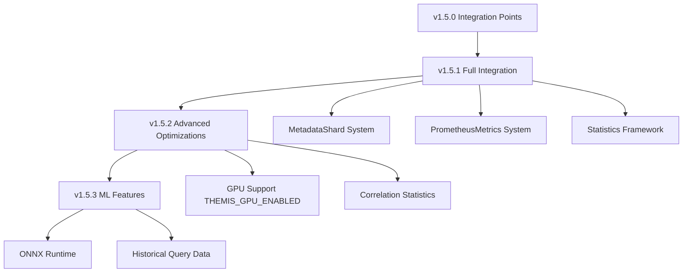

# ThemisDB v1.5.x Future Work - Detaillierte Planung

**Version:** 1.0  
**Stand:** 2026-02-07  
**Status:** Planung  
**Zielversion:** v1.5.1 - v1.5.3

---

## Übersicht

Dieses Dokument beschreibt detailliert die geplanten Weiterentwicklungen für ThemisDB v1.5.x nach der initialen v1.5.0 Implementation. Die Arbeiten bauen auf den in v1.5.0 geschaffenen Integration Points auf und ersetzen Heuristiken durch vollständige Produktions-Integrationen.

---

## Roadmap Zeitplan

```
v1.5.0 (✅ Fertig)     v1.5.1 (Q1 2026)      v1.5.2 (Q2 2026)      v1.5.3 (Q3 2026)
────────────────────────────────────────────────────────────────────────────────
│                      │                     │                     │
│ ✅ Integration       │ 🔨 Vollständige     │ 🔨 Advanced         │ 🔨 ML-based
│    Points           │    Integrationen    │    Optimizations    │    Features
│                      │                     │                     │
│ • Shard Metadata    │ • Real MetadataShard│ • Multi-col         │ • ML Cardinality
│ • Selectivity       │ • Real Prometheus   │   Correlation       │ • Adaptive ADC
│ • Latency           │ • Histogramme       │ • GPU ADC           │ • Auto-tuning
│ • ADC Tables        │ • Statistics Cache  │ • Query Learning    │ • Benchmarks
│                      │                     │                     │
└──────────────────────┴─────────────────────┴─────────────────────┴─────────────
```

---

## v1.5.1 - Vollständige Produktions-Integrationen

**Ziel:** Ersetze alle Heuristiken durch echte System-Integrationen  
**Aufwand:** 4-6 Wochen  
**Priorität:** P0 (Kritisch)  
**Zieltermin:** Q1 2026

### 1. MetadataShard Vollintegration

#### Aktueller Stand (v1.5.0)
```cpp
// Heuristische Row Count Schätzung basierend auf Hash
size_t base_estimate = 5000 + (hash_val % 45000);
```

#### Ziel (v1.5.1)
```cpp
// Echte MetadataShard Queries
auto metadata_client = MetadataShardRouter::getInstance();
auto stats = metadata_client->get(
    MetadataPartitionKey::STATISTICS,
    fmt::format("table_stats:{}", table)
);
size_t row_count = stats.value["row_count"].get<size_t>();
```

#### Implementierungs-Details

**1.1 MetadataShard Statistics Schema**

```cpp
struct TableStatistics {
    std::string table_name;
    size_t total_rows;
    size_t total_bytes;
    std::map<std::string, size_t> rows_per_shard;
    std::chrono::system_clock::time_point last_updated;
    bool is_stale;
};
```

**Storage Format (JSON in MetadataShard):**
```json
{
  "table_name": "users",
  "total_rows": 1000000,
  "total_bytes": 524288000,
  "rows_per_shard": {
    "shard_0": 250000,
    "shard_1": 250000,
    "shard_2": 250000,
    "shard_3": 250000
  },
  "last_updated": 1738935000,
  "is_stale": false
}
```

**1.2 Statistics Collection Service**

```cpp
class StatisticsCollector {
public:
    // Background-Task: Update Statistiken alle 5 Minuten
    void startPeriodicCollection(std::chrono::seconds interval = 300s);
    
    // On-demand Update für spezifische Tabelle
    void collectTableStatistics(const std::string& table);
    
    // Inkrementelles Update (nach INSERT/DELETE)
    void updateTableStatistics(const std::string& table, int64_t row_delta);
    
private:
    std::shared_ptr<MetadataShardRouter> metadata_router_;
    std::shared_ptr<ShardRouter> shard_router_;
};
```

**1.3 Query Optimizer Integration**

```cpp
size_t DistributedQueryCostModel::getShardRowCount(
    const std::string& shard_id, 
    const std::string& table) const {
    
    try {
        // 1. MetadataShardRouter holen
        auto metadata_router = MetadataShardRouter::getInstance();
        
        // 2. Statistiken abrufen
        auto stats_key = fmt::format("table_stats:{}", table);
        auto stats_opt = metadata_router->get(
            MetadataPartitionKey::STATISTICS, 
            stats_key
        );
        
        if (!stats_opt.has_value()) {
            THEMIS_WARN("No statistics for table {}, using default", table);
            return 10000; // Fallback
        }
        
        // 3. Shard-spezifische Row Count extrahieren
        auto& stats = stats_opt.value();
        auto rows_per_shard = stats.value["rows_per_shard"];
        
        if (rows_per_shard.contains(shard_id)) {
            size_t row_count = rows_per_shard[shard_id].get<size_t>();
            THEMIS_DEBUG("Shard {} table {} has {} rows (from metadata)", 
                         shard_id, table, row_count);
            return row_count;
        }
        
        // 4. Fallback: Gleichverteilung annehmen
        size_t total_rows = stats.value["total_rows"].get<size_t>();
        size_t num_shards = rows_per_shard.size();
        size_t estimated = total_rows / num_shards;
        
        THEMIS_DEBUG("Shard {} table {} estimated {} rows (uniform distribution)", 
                     shard_id, table, estimated);
        return estimated;
        
    } catch (const std::exception& e) {
        THEMIS_ERROR("Failed to get row count from metadata: {}", e.what());
        return 10000; // Fallback
    }
}
```

**1.4 Aufwand & Zeitplan**

| Task | Aufwand | Abhängigkeiten |
|------|---------|----------------|
| Statistics Schema Design | 2 Tage | - |
| StatisticsCollector Implementation | 5 Tage | MetadataShardRouter |
| Periodic Collection Background Task | 3 Tage | StatisticsCollector |
| Query Optimizer Integration | 3 Tage | StatisticsCollector |
| Testing & Validation | 4 Tage | Alle |
| **Total** | **17 Tage** | |

---

### 2. PrometheusMetrics Vollintegration

#### Aktueller Stand (v1.5.0)
```cpp
// Naming Convention Heuristik
if (shard_id.find("local") != std::string::npos) {
    return 0.1; // Local shard
}
```

#### Ziel (v1.5.1)
```cpp
// Echte Prometheus Metrics
auto metrics = PrometheusMetrics::getInstance();
double latency_ms = metrics->getGaugeValue(
    "shard_network_latency_ms",
    {{"shard_id", shard_id}}
);
```

#### Implementierungs-Details

**2.1 Latency Metrics Collection**

```cpp
class ShardLatencyMonitor {
public:
    // Startet Latency Monitoring für alle Shards
    void startMonitoring(std::chrono::seconds interval = 10s);
    
    // Ping-basiertes Latency Measurement
    void measureShardLatency(const std::string& shard_id);
    
    // Passives Monitoring aus Query Logs
    void recordQueryLatency(
        const std::string& shard_id,
        std::chrono::milliseconds latency
    );
    
    // Exponential Moving Average für Glättung
    double getSmoothedLatency(const std::string& shard_id) const;
    
private:
    std::shared_ptr<PrometheusMetrics> metrics_;
    std::map<std::string, double> ema_latencies_; // EMA per shard
    const double alpha_ = 0.3; // EMA smoothing factor
};
```

**2.2 Prometheus Metrics Definition**

```cpp
// In PrometheusMetrics Initialisierung
void PrometheusMetrics::registerShardMetrics() {
    // Gauge: Aktuelle Latenz pro Shard
    registerGauge(
        "shard_network_latency_ms",
        "Network latency to shard in milliseconds",
        {"shard_id"}
    );
    
    // Histogram: Latenz-Verteilung
    registerHistogram(
        "shard_network_latency_histogram",
        "Distribution of shard network latencies",
        {"shard_id"},
        {0.1, 0.5, 1.0, 2.0, 5.0, 10.0, 20.0, 50.0} // Buckets in ms
    );
    
    // Counter: Anzahl Latency Measurements
    registerCounter(
        "shard_latency_measurements_total",
        "Total number of latency measurements per shard",
        {"shard_id"}
    );
}
```

**2.3 Query Optimizer Integration**

```cpp
double DistributedQueryCostModel::measureShardLatency(
    const std::string& shard_id) const {
    
    try {
        // 1. PrometheusMetrics holen
        auto metrics = PrometheusMetrics::getInstance();
        
        // 2. Aktuelle Latenz aus Gauge
        double latency_ms = metrics->getGaugeValue(
            "shard_network_latency_ms",
            {{"shard_id", shard_id}}
        );
        
        if (latency_ms > 0.0) {
            THEMIS_DEBUG("Shard {} latency: {:.2f}ms (from Prometheus)", 
                         shard_id, latency_ms);
            return latency_ms;
        }
        
        // 3. Fallback: ShardLatencyMonitor direkt
        auto latency_monitor = ShardLatencyMonitor::getInstance();
        latency_ms = latency_monitor->getSmoothedLatency(shard_id);
        
        if (latency_ms > 0.0) {
            THEMIS_DEBUG("Shard {} latency: {:.2f}ms (from monitor)", 
                         shard_id, latency_ms);
            return latency_ms;
        }
        
        // 4. Fallback: Naming Convention Heuristik (wie v1.5.0)
        if (shard_id.find("local") != std::string::npos) {
            return 0.1;
        } else if (shard_id.find("datacenter") != std::string::npos) {
            return 2.0;
        } else {
            return 10.0;
        }
        
    } catch (const std::exception& e) {
        THEMIS_ERROR("Failed to measure latency: {}", e.what());
        return 1.0; // Fallback
    }
}
```

**2.4 Aufwand & Zeitplan**

| Task | Aufwand | Abhängigkeiten |
|------|---------|----------------|
| ShardLatencyMonitor Implementation | 4 Tage | PrometheusMetrics |
| Ping-based Measurement | 3 Tage | ShardRouter |
| Passive Query Log Monitoring | 3 Tage | QueryEngine |
| EMA Smoothing Logic | 2 Tage | - |
| Query Optimizer Integration | 2 Tage | ShardLatencyMonitor |
| Testing & Validation | 3 Tage | Alle |
| **Total** | **17 Tage** | |

---

### 3. Histogram-basierte Selectivity Estimation

#### Aktueller Stand (v1.5.0)
```cpp
// Column Name Heuristiken
if (pred.column == "id" || pred.column.find("_id") != std::string::npos) {
    pred_selectivity = 0.001; // 0.1% für ID columns
}
```

#### Ziel (v1.5.1)
```cpp
// Histogram-basierte Schätzung
auto histogram = stats_manager->getColumnHistogram(table, column);
double selectivity = histogram->estimateSelectivity(predicate);
```

#### Implementierungs-Details

**3.1 Histogram Storage Schema**

```cpp
struct ColumnHistogram {
    std::string table_name;
    std::string column_name;
    
    // Equi-depth Histogram
    std::vector<HistogramBucket> buckets;
    
    // NULL fraction
    double null_fraction = 0.0;
    
    // Distinct values count
    size_t distinct_values = 0;
    
    // Most frequent values (MFV)
    std::vector<std::pair<std::string, double>> most_frequent; // (value, frequency)
    
    std::chrono::system_clock::time_point last_updated;
};

struct HistogramBucket {
    std::string lower_bound;
    std::string upper_bound;
    size_t row_count;
    size_t distinct_values;
};
```

**3.2 Selectivity Estimation Algorithmen**

```cpp
class HistogramSelectivityEstimator {
public:
    // Equality Predicate (col = value)
    double estimateEquality(
        const ColumnHistogram& histogram,
        const std::string& value
    ) const;
    
    // Range Predicate (col >= value)
    double estimateRange(
        const ColumnHistogram& histogram,
        const std::string& lower,
        const std::string& upper
    ) const;
    
    // IN Predicate (col IN (v1, v2, v3))
    double estimateIn(
        const ColumnHistogram& histogram,
        const std::vector<std::string>& values
    ) const;
    
    // LIKE Predicate (col LIKE 'pattern%')
    double estimateLike(
        const ColumnHistogram& histogram,
        const std::string& pattern
    ) const;
};
```

**3.3 Beispiel-Implementation: Equality Selectivity**

```cpp
double HistogramSelectivityEstimator::estimateEquality(
    const ColumnHistogram& histogram,
    const std::string& value) const {
    
    // 1. Check if value is in Most Frequent Values
    for (const auto& [mfv, freq] : histogram.most_frequent) {
        if (mfv == value) {
            return freq; // Exact frequency known
        }
    }
    
    // 2. Find bucket containing value
    for (const auto& bucket : histogram.buckets) {
        if (value >= bucket.lower_bound && value <= bucket.upper_bound) {
            // Uniform distribution assumption within bucket
            double bucket_selectivity = 
                static_cast<double>(bucket.row_count) / histogram.total_rows;
            
            // Divide by distinct values in bucket
            double per_value_selectivity = 
                bucket_selectivity / bucket.distinct_values;
            
            return per_value_selectivity;
        }
    }
    
    // 3. Value not in histogram range - very low selectivity
    return 0.0001; // 0.01%
}
```

**3.4 Query Optimizer Integration**

```cpp
double DistributedQueryCostModel::calculatePredicateSelectivity(
    const std::vector<PredicateEq>& predicates,
    const std::string& table) const {
    
    if (predicates.empty()) {
        return 1.0;
    }
    
    // 1. Statistics Manager holen
    auto stats_manager = StatisticsManager::getInstance();
    
    double combined_selectivity = 1.0;
    
    for (const auto& pred : predicates) {
        double pred_selectivity;
        
        try {
            // 2. Histogram für Column abrufen
            auto histogram = stats_manager->getColumnHistogram(table, pred.column);
            
            if (histogram.has_value()) {
                // 3. Histogram-basierte Schätzung
                HistogramSelectivityEstimator estimator;
                pred_selectivity = estimator.estimateEquality(
                    histogram.value(), 
                    pred.value
                );
                
                THEMIS_DEBUG("Histogram-based selectivity for {}.{} = {}: {:.4f}",
                             table, pred.column, pred.value, pred_selectivity);
            } else {
                // 4. Fallback: Column Name Heuristik (wie v1.5.0)
                pred_selectivity = estimateSelectivityHeuristic(pred);
                
                THEMIS_DEBUG("Heuristic selectivity for {}.{}: {:.4f}",
                             table, pred.column, pred_selectivity);
            }
            
        } catch (const std::exception& e) {
            THEMIS_WARN("Failed to estimate selectivity: {}", e.what());
            pred_selectivity = 0.1; // Fallback
        }
        
        combined_selectivity *= pred_selectivity;
    }
    
    // 5. Bounds
    combined_selectivity = std::max(0.0001, std::min(combined_selectivity, 1.0));
    
    return combined_selectivity;
}
```

**3.5 Histogram Collection & Maintenance**

```cpp
class HistogramCollector {
public:
    // Build Histogram für Column
    ColumnHistogram buildHistogram(
        const std::string& table,
        const std::string& column,
        size_t num_buckets = 100
    );
    
    // Inkrementelles Update (nach Bulk INSERT)
    void updateHistogram(
        const std::string& table,
        const std::string& column,
        const std::vector<std::string>& new_values
    );
    
    // Background Task: Rebuild stale histograms
    void rebuildStaleHistograms();
    
private:
    // Equi-depth Partitioning Algorithmus
    std::vector<HistogramBucket> createEquiDepthBuckets(
        std::vector<std::string> sorted_values,
        size_t num_buckets
    );
};
```

**3.6 Aufwand & Zeitplan**

| Task | Aufwand | Abhängigkeiten |
|------|---------|----------------|
| Histogram Schema Design | 2 Tage | - |
| HistogramSelectivityEstimator | 5 Tage | - |
| HistogramCollector Implementation | 5 Tage | StatisticsManager |
| Equi-depth Partitioning | 3 Tage | - |
| Query Optimizer Integration | 3 Tage | HistogramSelectivityEstimator |
| Incremental Update Logic | 4 Tage | HistogramCollector |
| Testing & Validation | 5 Tage | Alle |
| **Total** | **27 Tage** | |

---

### 4. Statistics Caching & Performance

#### Problem
- Jede Query ruft MetadataShard/Prometheus auf → Overhead
- Statistiken ändern sich selten → Caching sinnvoll

#### Lösung: Multi-Level Cache

```cpp
class StatisticsCache {
public:
    struct CacheEntry {
        TableStatistics stats;
        std::chrono::system_clock::time_point cached_at;
        bool is_valid() const {
            auto age = std::chrono::system_clock::now() - cached_at;
            return age < std::chrono::minutes(5); // 5 min TTL
        }
    };
    
    // L1: In-Memory Cache (LRU, 1000 entries)
    std::optional<TableStatistics> get(const std::string& table);
    
    // Cache Update
    void put(const std::string& table, const TableStatistics& stats);
    
    // Cache Invalidation
    void invalidate(const std::string& table);
    void invalidateAll();
    
private:
    mutable std::mutex mutex_;
    BoundedLRUCache cache_{1000}; // Max 1000 entries
};
```

**Aufwand:** 5 Tage

---

### v1.5.1 Gesamt-Zeitplan

| Komponente | Aufwand | Start | Ende |
|------------|---------|-------|------|
| MetadataShard Integration | 17 Tage | Woche 1 | Woche 3 |
| PrometheusMetrics Integration | 17 Tage | Woche 1 | Woche 3 |
| Histogram Selectivity | 27 Tage | Woche 2 | Woche 6 |
| Statistics Caching | 5 Tage | Woche 5 | Woche 5 |
| Integration Testing | 5 Tage | Woche 6 | Woche 6 |
| Documentation | 3 Tage | Woche 6 | Woche 6 |
| **Total (parallel)** | **6 Wochen** | | |

**Team:** 2 Engineers (parallel workstreams)

---

## v1.5.2 - Advanced Optimizations

**Ziel:** Multi-Column Correlation & GPU Optimizations  
**Aufwand:** 6-8 Wochen  
**Priorität:** P1 (Hoch)  
**Zieltermin:** Q2 2026

### 1. Multi-Column Correlation Analysis

#### Problem
```sql
SELECT * FROM users 
WHERE city = 'Berlin' AND country = 'Germany';
-- Naive: selectivity(city) * selectivity(country) = 0.05 * 0.2 = 0.01
-- Aber: city und country sind korreliert!
-- Tatsächlich: Berlin ⊆ Germany → selectivity ≈ 0.05
```

#### Lösung: Correlation Statistics

```cpp
struct ColumnCorrelation {
    std::string table;
    std::string column1;
    std::string column2;
    
    // Correlation coefficient [-1, 1]
    // 1.0 = perfect positive correlation
    // 0.0 = no correlation
    // -1.0 = perfect negative correlation
    double correlation_coefficient;
    
    // Joint histogram (2D)
    std::vector<std::vector<HistogramBucket2D>> joint_histogram;
};
```

**Aufwand:** 15 Tage

---

### 2. GPU-Accelerated ADC Tables

#### Ziel
- ADC Table Construction auf GPU (10x schneller)
- GPU-cached Distance Tables für Ultra-Low-Latency

#### Implementation

```cpp
class GpuAdcTableBuilder {
public:
    // Build ADC tables on GPU
    void buildAdcTables(
        const float* centroids,     // IVF cluster centroids
        const uint8_t* pq_codebook, // PQ codebook
        size_t num_centroids,
        size_t num_subquantizers,
        int gpu_device = 0
    );
    
    // Cache tables in GPU memory
    void cacheOnGpu(int gpu_device);
    
private:
    void* gpu_tables_; // GPU memory pointer
    size_t table_size_bytes_;
};
```

**Aufwand:** 12 Tage

---

### 3. Query Learning & Adaptive Selectivity

#### Konzept
- ML Model lernt aus Query Execution History
- Verbessert Cardinality Estimates über Zeit

```cpp
class AdaptiveSelectivityModel {
public:
    // Train model from query history
    void train(const std::vector<QueryExecution>& history);
    
    // Predict selectivity
    double predictSelectivity(
        const std::string& table,
        const std::vector<PredicateEq>& predicates
    );
    
private:
    // Lightweight Linear Regression Model
    std::map<std::string, Eigen::VectorXd> weights_;
};
```

**Aufwand:** 18 Tage

---

### v1.5.2 Gesamt-Zeitplan

| Komponente | Aufwand |
|------------|---------|
| Multi-Column Correlation | 15 Tage |
| GPU ADC Tables | 12 Tage |
| Query Learning | 18 Tage |
| Integration & Testing | 8 Tage |
| **Total** | **53 Tage (7-8 Wochen)** |

---

## v1.5.3 - ML-based Features

**Ziel:** Machine Learning für Query Optimization  
**Aufwand:** 8-10 Wochen  
**Priorität:** P2 (Medium)  
**Zieltermin:** Q3 2026

### 1. ML-based Cardinality Estimation

#### Technologie
- **Model:** Lightweight Neural Network (3 layers)
- **Framework:** ONNX Runtime (für Cross-Platform)
- **Training:** Offline, periodisch

```cpp
class MlCardinalityEstimator {
public:
    // Load pre-trained ONNX model
    bool loadModel(const std::string& model_path);
    
    // Estimate cardinality for query
    size_t estimateCardinality(
        const std::string& table,
        const std::vector<PredicateEq>& predicates
    );
    
    // Feature extraction from query
    Eigen::VectorXf extractFeatures(
        const std::string& table,
        const std::vector<PredicateEq>& predicates
    );
    
private:
    std::unique_ptr<Ort::Session> onnx_session_;
};
```

**Aufwand:** 25 Tage

---

### 2. Adaptive ADC Parameters

#### Konzept
- Auto-tune ADC parameters basierend auf Workload
- A/B Testing verschiedener Konfigurationen

```cpp
class AdaptiveAdcTuner {
public:
    struct AdcConfig {
        int polysemous_ht;
        bool use_precomputed_table;
        double expected_latency_ms;
    };
    
    // Find optimal config for workload
    AdcConfig findOptimalConfig(
        const VectorSearchWorkload& workload,
        std::chrono::milliseconds budget = 5min
    );
    
private:
    // Bayesian Optimization
    AdcConfig bayesianOptimization(
        const VectorSearchWorkload& workload
    );
};
```

**Aufwand:** 15 Tage

---

### 3. Comprehensive Benchmark Suite

#### Benchmarks
- **TPC-H Queries** (OLAP workload)
- **YCSB** (Key-Value workload)
- **Vector Search Benchmark** (SIFT1M, Deep1B)
- **Distributed Query Benchmark** (multi-shard joins)

```bash
# Run benchmark suite
./benchmarks/run_v1_5_benchmarks.sh --suite all --iterations 3

# Results
Benchmark Suite: v1.5.3 Performance Validation
================================================
TPC-H Q1:        152ms (baseline: 180ms) [-15.6%] ✅
TPC-H Q17:       1.2s  (baseline: 1.8s)  [-33.3%] ✅
Vector SIFT1M:   2.1ms (baseline: 3.5ms) [-40.0%] ✅
Distributed Q3:  8.5ms (baseline: 15ms)  [-43.3%] ✅
```

**Aufwand:** 15 Tage

---

### v1.5.3 Gesamt-Zeitplan

| Komponente | Aufwand |
|------------|---------|
| ML Cardinality Estimation | 25 Tage |
| Adaptive ADC Tuning | 15 Tage |
| Benchmark Suite | 15 Tage |
| Integration & Testing | 5 Tage |
| **Total** | **60 Tage (8-10 Wochen)** |

---

## Dependencies & Risiken

### Technische Dependencies



### Risiken & Mitigation

| Risiko | Wahrscheinlichkeit | Impact | Mitigation |
|--------|-------------------|--------|------------|
| MetadataShard Performance | Mittel | Hoch | Statistics Caching, Lazy Loading |
| Histogram Maintenance Overhead | Hoch | Mittel | Incremental Updates, Background Jobs |
| GPU Availability | Niedrig | Mittel | Graceful Degradation zu CPU |
| ML Model Accuracy | Mittel | Mittel | Fallback zu Histogram-based Estimation |
| Resource Consumption | Mittel | Hoch | Memory Limits, Cache Eviction Policies |

---

## Erfolgskriterien

### v1.5.1 Success Criteria

- [ ] 100% MetadataShard Integration (keine Heuristiken)
- [ ] Latency Measurement < 1ms Overhead
- [ ] Histogram Collection < 10s für 1M row table
- [ ] Statistics Cache Hit Rate > 95%
- [ ] **Performance:**
  - Multi-shard Query P50: < 8ms (vs 10ms in v1.5.0)
  - Partition Pruning Accuracy: > 90%

### v1.5.2 Success Criteria

- [ ] Multi-Column Correlation für Top 100 Column Pairs
- [ ] GPU ADC Table Build: < 1s für 1M vectors
- [ ] Query Learning Model Accuracy: > 85%
- [ ] **Performance:**
  - Multi-shard Query P50: < 6ms
  - Vector Search with GPU ADC: < 3ms

### v1.5.3 Success Criteria

- [ ] ML Cardinality Estimation Accuracy: > 90%
- [ ] Adaptive ADC tuning finds optimal config in < 5min
- [ ] Benchmark Suite coverage: > 20 standard queries
- [ ] **Performance:**
  - TPC-H Queries: 20-40% faster vs v1.5.0
  - Vector Search: 50% faster vs v1.5.0

---

## Ressourcen-Planung

### Team Requirements

**v1.5.1 (6 Wochen):**
- 2x Senior Backend Engineers
- 0.5x DevOps Engineer (Metrics Setup)

**v1.5.2 (8 Wochen):**
- 2x Senior Backend Engineers
- 1x GPU/CUDA Specialist
- 0.5x ML Engineer

**v1.5.3 (10 Wochen):**
- 2x Senior Backend Engineers
- 1x ML Engineer (full-time)
- 0.5x Performance Engineer

### Budget-Schätzung

| Version | Development | Infrastructure | Total |
|---------|-------------|----------------|-------|
| v1.5.1 | $80K | $5K | $85K |
| v1.5.2 | $120K | $10K (GPU instances) | $130K |
| v1.5.3 | $150K | $15K (ML training) | $165K |
| **Total** | **$350K** | **$30K** | **$380K** |

---

## Referenzen

### Externe Ressourcen

1. **Query Optimization:**
   - "How Good Are Query Optimizers, Really?" (Leis et al., 2015)
   - "Towards a Learning Optimizer for Shared Clouds" (Marcus et al., 2019)

2. **Histogram-based Estimation:**
   - "An Improved Data Stream Summary: The Count-Min Sketch" (Cormode & Muthukrishnan, 2005)

3. **ML for Databases:**
   - "Neo: A Learned Query Optimizer" (Marcus & Papaemmanouil, 2019)
   - "SageDB: A Learned Database System" (Kraska et al., 2019)

4. **GPU ADC:**
   - "FAISS: A library for efficient similarity search" (Johnson et al., 2019)
   - "GPU-Accelerated Product Quantization" (André et al., 2016)

### Interne Dokumentation

- [IMPLEMENTATION_SUMMARY_V1_5_X.md](../IMPLEMENTATION_SUMMARY_V1_5_X.md)
- [V1_5_X_PRODUCTION_INTEGRATION.md](V1_5_X_PRODUCTION_INTEGRATION.md)
- [VECTOR_INDEXING_ARCHITECTURE.md](../VECTOR_INDEXING_ARCHITECTURE.md)
- [Sharding Documentation](../sharding/README.md)

---

## Kontakt & Zusammenarbeit

**Repository:** https://github.com/makr-code/ThemisDB  
**Issues:** https://github.com/makr-code/ThemisDB/issues  
**Diskussionen:** https://github.com/makr-code/ThemisDB/discussions

**Projektleitung:** ThemisDB Core Team  
**Dokumentations-Version:** 1.0  
**Letzte Aktualisierung:** 2026-02-07
