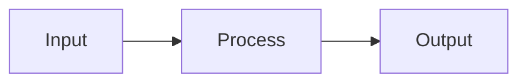
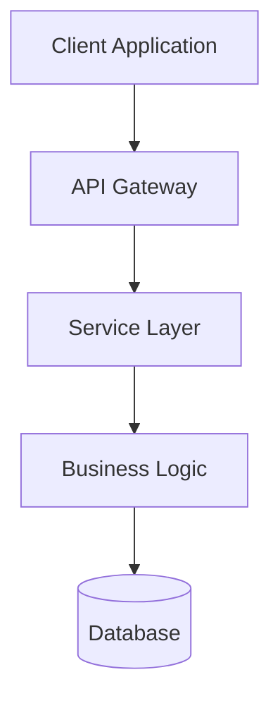
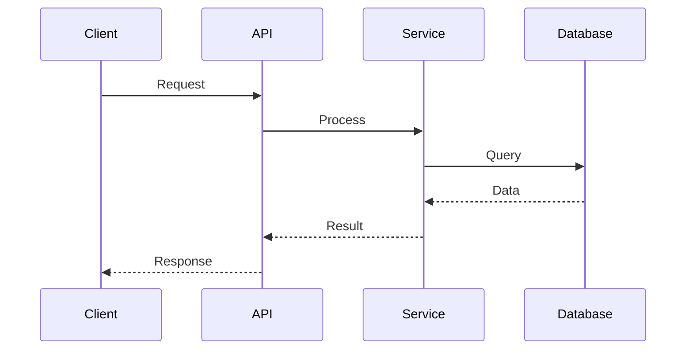
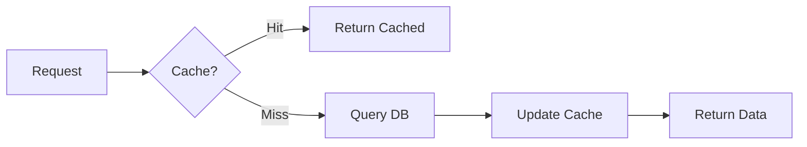
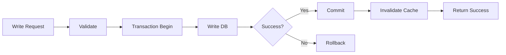

# 📐 ThemisDB Dokumentations-Design-Vorlage

> **Version:** 1.0.0  
> **Stand:** 6. April 2026  
> **Status:** ✅ Aktiv

---

## 📋 Inhaltsverzeichnis

- [Übersicht](#übersicht)
- [Struktur-Templates](#struktur-templates)
  - [Standard-Dokumentation](#standard-dokumentation)
  - [API-Dokumentation](#api-dokumentation)
  - [Tutorial/Guide](#tutorialguide)
  - [Architektur-Dokument](#architektur-dokument)
- [Visuelle Elemente](#visuelle-elemente)
- [Formatierungs-Standards](#formatierungs-standards)
- [Beispiele](#beispiele)

---

## 🎯 Übersicht

Diese Vorlage definiert den visuellen und strukturellen Standard für alle ThemisDB-Dokumentationen.

### Designprinzipien

| Prinzip | Beschreibung | Beispiel |
|---------|--------------|----------|
| 🎨 **Konsistenz** | Einheitliche Formatierung über alle Dokumente | Gleiche Überschriften-Hierarchie |
| 📱 **Lesbarkeit** | Mobile-freundlich, klare Struktur | Max. 100 Zeichen pro Zeile |
| 🔍 **Scanbarkeit** | Schnelles Erfassen von Inhalten | Emojis, Tabellen, Listen |
| 🔗 **Verknüpfung** | Gute interne Navigation | Relative Links, Anchors |
| ✅ **Praxisnah** | Code-Beispiele und Anwendungsfälle | Live-Snippets, CLI-Befehle |

### Farbcodierung (via Emojis)

```markdown
✅ Implementiert / Verfügbar
🚧 In Entwicklung / Beta
⏳ Geplant / Roadmap
❌ Nicht verfügbar / Deprecated
⚠️ Warnung / Achtung
💡 Tipp / Best Practice
🔒 Enterprise-Feature
🆓 Community Edition
📝 Notiz
🎯 Wichtig
```

---

## 📚 Struktur-Templates

### Standard-Dokumentation

```markdown
# 🔧 [Feature-Name]

> **Kategorie:** [Core/Enterprise/Experimental]  
> **Seit Version:** [1.x.x]  
> **Status:** [✅ Stable | 🚧 Beta | ⏳ Planned]

---

## 📋 Inhaltsverzeichnis

- [Übersicht](#übersicht)
- [Konzepte](#konzepte)
- [Installation](#installation)
- [Konfiguration](#konfiguration)
- [Verwendung](#verwendung)
- [Best Practices](#best-practices)
- [Troubleshooting](#troubleshooting)
- [Siehe auch](#siehe-auch)

---

## 🎯 Übersicht

**Kurzbeschreibung** (1-2 Sätze, was dieses Feature macht)

### Hauptmerkmale

- ✅ **Merkmal 1:** Beschreibung
- ✅ **Merkmal 2:** Beschreibung
- ✅ **Merkmal 3:** Beschreibung

> [!NOTE]
> Wichtige Kontextinformation für den Leser.

---

## 💡 Konzepte

<details open>
<summary><b>Grundlegendes Konzept</b></summary>

Erklärung des Konzepts mit Diagramm falls nötig.



</details>

<details>
<summary><b>Fortgeschrittenes Konzept</b></summary>

Weitere Details für fortgeschrittene Nutzer.

</details>

---

## 🚀 Installation

### Voraussetzungen

```markdown
| Komponente | Version | Status |
|------------|---------|--------|
| ThemisDB   | ≥ 1.3.0 | ✅ |
| OS         | Linux/Windows | ✅ |
| Memory     | ≥ 4 GB | 💡 8 GB empfohlen |
```

### Installationsschritte

```bash
# 1. Download
curl -O https://themisdb.com/download/latest

# 2. Installation
./install.sh

# 3. Verifikation
themis --version
```

> [!TIP]
> Nutze `--help` für alle verfügbaren Optionen.

---

## ⚙️ Konfiguration

### Basis-Konfiguration

```yaml
# config/themis.yml
feature:
  enabled: true
  options:
    parameter1: value
    parameter2: value
```

### Erweiterte Optionen

<details>
<summary>Alle Konfigurationsparameter anzeigen</summary>

| Parameter | Typ | Default | Beschreibung |
|-----------|-----|---------|--------------|
| `parameter1` | string | "default" | Beschreibung |
| `parameter2` | integer | 100 | Beschreibung |

</details>

---

## 📖 Verwendung

### Einfaches Beispiel

```javascript
const client = new ThemisClient();

// Feature nutzen
const result = await client.feature.execute({
  param: 'value'
});

console.log(result);
```

### Fortgeschrittenes Beispiel

```javascript
// Komplexerer Use Case
const result = await client.feature.execute({
  param1: 'value',
  param2: {
    nested: 'option'
  }
});
```

---

## 💎 Best Practices

| ✅ Empfohlen | ❌ Vermeiden |
|--------------|--------------|
| Beschreibung der guten Praxis | Beschreibung schlechter Praxis |
| Mit Code-Beispiel | Mit Gegen-Beispiel |

### Performance-Tipps

> [!IMPORTANT]
> Kritische Performance-Hinweise hier.

- 🚀 **Tipp 1:** Beschreibung
- 🚀 **Tipp 2:** Beschreibung

---

## 🔧 Troubleshooting

<details>
<summary><b>❌ Problem 1: Fehlerbeschreibung</b></summary>

**Symptome:**
- Symptom A
- Symptom B

**Lösung:**
```bash
# Lösung hier
```

**Ursache:**
Erklärung der Ursache.

</details>

<details>
<summary><b>❌ Problem 2: Fehlerbeschreibung</b></summary>

Weitere Problemlösung...

</details>

---

## 📚 Siehe auch

- [Verwandtes Feature 1](link.md)
- [Verwandtes Feature 2](link.md)
- [API-Referenz](api/reference.md)

---

## 🔄 Änderungshistorie

| Version | Datum | Änderungen |
|---------|-------|------------|
| 1.3.0 | 2025-12-22 | Feature hinzugefügt |
| 1.2.5 | 2025-11-15 | Verbesserungen |

---

**Letzte Aktualisierung:** 22. Dezember 2025  
**Autor:** ThemisDB Team  
**Feedback:** [GitHub Issues](https://github.com/makr-code/ThemisDB/issues)
```

---

### API-Dokumentation

```markdown
# 🔌 [API-Name] API

> **Endpoint:** `/api/v1/resource`  
> **Methoden:** `GET` `POST` `PUT` `DELETE`  
> **Auth:** 🔒 Required

---

## 📋 Inhaltsverzeichnis

- [Übersicht](#übersicht)
- [Endpunkte](#endpunkte)
- [Authentifizierung](#authentifizierung)
- [Request/Response](#requestresponse)
- [Fehlerbehandlung](#fehlerbehandlung)
- [Code-Beispiele](#code-beispiele)

---

## 🎯 Übersicht

Kurze Beschreibung der API und ihres Zwecks.

### API-Eigenschaften

| Eigenschaft | Wert |
|-------------|------|
| Base URL | `https://api.themisdb.com/v1` |
| Format | JSON |
| Rate Limit | 1000 req/min |
| Timeout | 30s |

---

## 🛣️ Endpunkte

### GET /resource

**Beschreibung:** Resource abrufen

**Query-Parameter:**

| Parameter | Typ | Required | Beschreibung |
|-----------|-----|----------|--------------|
| `id` | string | ✅ | Resource ID |
| `limit` | integer | ❌ | Max. Ergebnisse (default: 100) |

**Response:**

```json
{
  "status": "success",
  "data": {
    "id": "123",
    "name": "Example"
  }
}
```

---

### POST /resource

**Beschreibung:** Neue Resource erstellen

**Request Body:**

```json
{
  "name": "string",
  "properties": {
    "key": "value"
  }
}
```

**Response:**

```json
{
  "status": "created",
  "id": "124"
}
```

---

## 🔐 Authentifizierung

```bash
# Bearer Token
curl -H "Authorization: Bearer YOUR_TOKEN" \
  https://api.themisdb.com/v1/resource
```

> [!WARNING]
> Tokens niemals im Code committen!

---

## ⚠️ Fehlerbehandlung

### HTTP Status Codes

| Code | Bedeutung | Beschreibung |
|------|-----------|--------------|
| 200 | OK | Erfolgreich |
| 201 | Created | Resource erstellt |
| 400 | Bad Request | Ungültige Anfrage |
| 401 | Unauthorized | Auth fehlgeschlagen |
| 404 | Not Found | Resource nicht gefunden |
| 500 | Server Error | Interner Fehler |

### Fehler-Response

```json
{
  "status": "error",
  "code": "INVALID_INPUT",
  "message": "Parameter 'name' ist erforderlich",
  "details": {}
}
```

---

## 💻 Code-Beispiele

### JavaScript

```javascript
const response = await fetch('https://api.themisdb.com/v1/resource', {
  method: 'GET',
  headers: {
    'Authorization': 'Bearer YOUR_TOKEN'
  }
});

const data = await response.json();
console.log(data);
```

### Python

```python
import requests

response = requests.get(
    'https://api.themisdb.com/v1/resource',
    headers={'Authorization': 'Bearer YOUR_TOKEN'}
)

data = response.json()
print(data)
```

### cURL

```bash
curl -X GET https://api.themisdb.com/v1/resource \
  -H "Authorization: Bearer YOUR_TOKEN" \
  -H "Content-Type: application/json"
```

---

## 📚 Siehe auch

- [Authentifizierungs-Guide](auth/README.md)
- [Rate Limiting](operations/rate-limiting.md)
- [SDK-Dokumentation](sdks/README.md)
```

---

### Tutorial/Guide

```markdown
# 📖 [Tutorial-Titel]

> **Level:** [Beginner | Intermediate | Advanced]  
> **Dauer:** ~XX Minuten  
> **Voraussetzungen:** [Liste]

---

## 🎯 Was Sie lernen werden

Am Ende dieses Tutorials können Sie:

- ✅ Skill/Konzept 1
- ✅ Skill/Konzept 2
- ✅ Skill/Konzept 3

---

## 📋 Voraussetzungen

Vor dem Start benötigen Sie:

- [ ] ThemisDB installiert (≥ v1.3.0)
- [ ] Basis-Kenntnisse in [Sprache/Technologie]
- [ ] [Weitere Voraussetzungen]

---

## 🚀 Schritt 1: [Titel]

**Ziel:** Was in diesem Schritt erreicht wird.

### Aktion

```bash
# Kommando ausführen
themis command --option
```

**Erwartete Ausgabe:**
```
Success: Operation completed
```

> [!TIP]
> Hilfreicher Hinweis für diesen Schritt.

### Erklärung

Detaillierte Erklärung, was hier passiert und warum.

---

## 🔧 Schritt 2: [Titel]

Nächster Schritt mit gleichem Muster...

---

## ✅ Zusammenfassung

Sie haben gelernt:

1. **Konzept 1:** Kurze Zusammenfassung
2. **Konzept 2:** Kurze Zusammenfassung
3. **Konzept 3:** Kurze Zusammenfassung

### Nächste Schritte

- 📖 [Weiterführendes Tutorial](link.md)
- 📚 [Vertiefende Dokumentation](link.md)
- 💡 [Best Practices](link.md)

---

## 🤔 Häufige Probleme

<details>
<summary>Problem X tritt auf</summary>

**Lösung:**
Schritt-für-Schritt Lösung...

</details>
```

---

### Architektur-Dokument

```markdown
# 🏗️ [Komponente/System] Architektur

> **Komponenten-Typ:** [Core | Module | Plugin]  
> **Version:** 1.x.x  
> **Status:** ✅ Production

---

## 📋 Inhaltsverzeichnis

- [Übersicht](#übersicht)
- [Architektur-Übersicht](#architektur-übersicht)
- [Komponenten](#komponenten)
- [Datenfluss](#datenfluss)
- [Design-Entscheidungen](#design-entscheidungen)
- [Skalierung](#skalierung)
- [Sicherheit](#sicherheit)

---

## 🎯 Übersicht

### Zweck

Beschreibung des Zwecks dieser Architektur-Komponente.

### Schlüssel-Eigenschaften

| Eigenschaft | Wert | Notizen |
|-------------|------|---------|
| Architektur-Stil | [z.B. Microservices] | Begründung |
| Kommunikation | [z.B. REST/gRPC] | Protokolle |
| Persistenz | [z.B. RocksDB] | Storage Layer |
| Skalierbarkeit | Horizontal/Vertical | Strategie |

---

## 🏗️ Architektur-Übersicht

### High-Level Diagramm



### Komponenten-Interaktion



---

## 🧩 Komponenten

### Komponente 1: [Name]

<details open>
<summary><b>Übersicht</b></summary>

**Zweck:** Beschreibung

**Technologien:**
- Technology A
- Technology B

**Verantwortlichkeiten:**
- ✅ Aufgabe 1
- ✅ Aufgabe 2

</details>

**Interface:**

```typescript
interface ComponentInterface {
  method1(params: Type): ReturnType;
  method2(params: Type): ReturnType;
}
```

**Konfiguration:**

```yaml
component:
  setting1: value
  setting2: value
```

---

### Komponente 2: [Name]

[Gleiche Struktur wie Komponente 1]

---

## 🔄 Datenfluss

### Read-Operation



### Write-Operation



---

## 🎨 Design-Entscheidungen

### ADR 1: [Titel der Entscheidung]

| Aspekt | Details |
|--------|---------|
| **Status** | ✅ Accepted |
| **Kontext** | Warum diese Entscheidung getroffen wurde |
| **Entscheidung** | Was entschieden wurde |
| **Konsequenzen** | Positive und negative Auswirkungen |

<details>
<summary>Alternativen</summary>

- **Alternative A:** Beschreibung und warum abgelehnt
- **Alternative B:** Beschreibung und warum abgelehnt

</details>

---

## 📈 Skalierung

### Horizontale Skalierung

```markdown
| Last-Level | Instanzen | Throughput | Latenz |
|------------|-----------|------------|--------|
| Niedrig    | 1-3       | 1K req/s   | <10ms  |
| Mittel     | 4-10      | 10K req/s  | <20ms  |
| Hoch       | 10+       | 100K req/s | <50ms  |
```

### Performance-Charakteristika

> [!IMPORTANT]
> Kritische Performance-Metriken

- 🚀 **Durchsatz:** XX requests/second
- ⚡ **Latenz:** P50: Xms, P99: Yms
- 💾 **Memory:** XX MB pro Instanz

---

## 🔒 Sicherheit

### Security-Maßnahmen

| Maßnahme | Status | Implementierung |
|----------|--------|-----------------|
| Authentifizierung | ✅ | JWT/Bearer Token |
| Autorisierung | ✅ | RBAC |
| Verschlüsselung | ✅ | TLS 1.3 |
| Audit Logging | ✅ | Zentral |

### Threat Model

<details>
<summary>Sicherheitsrisiken und Mitigationen</summary>

**Risiko 1:**
- Beschreibung
- Mitigation

**Risiko 2:**
- Beschreibung
- Mitigation

</details>

---

## 📚 Referenzen

- [Related Architecture Doc](link.md)
- [API Specification](link.md)
- [Performance Benchmarks](link.md)
```

---

## 🎨 Visuelle Elemente

### Emoji-Kategorien

```markdown
# Dokumentations-Struktur
📋 Inhaltsverzeichnis / Listen
📖 Dokumentation / Anleitungen
🎯 Ziele / Übersichten
💡 Tipps / Best Practices
⚠️ Warnungen
❌ Fehler / Probleme
✅ Erfolg / Abgeschlossen
🚧 In Entwicklung
⏳ Geplant

# Features & Funktionalität
🔧 Konfiguration / Tools
🔌 APIs / Integration
🚀 Performance / Geschwindigkeit
💾 Datenbank / Storage
🔒 Sicherheit
🔐 Authentifizierung
🛡️ Autorisierung
🔑 Schlüssel / Credentials

# Architektur & Code
🏗️ Architektur
🧩 Komponenten / Module
🔄 Prozesse / Workflows
📊 Diagramme / Statistiken
💻 Code / Beispiele
🔍 Tests / Debugging
📈 Monitoring / Metriken
⚙️ System / Infrastruktur

# Entwicklung
👨‍💻 Entwicklung
🤝 Beiträge / Community
📦 Pakete / Releases
🎨 Design
🔬 Forschung
📐 Standards / Spezifikationen

# Status & Info
ℹ️ Information
📝 Notizen
🆕 Neu
🔥 Trending / Wichtig
🎉 Release / Milestone
```

### Callout-Boxen

```markdown
> [!NOTE]
> Allgemeine Information oder Kontext

> [!TIP]
> Hilfreiche Tipps und Tricks

> [!IMPORTANT]
> Wichtige Informationen, die nicht übersehen werden sollten

> [!WARNING]
> Kritische Warnungen über Risiken oder Probleme

> [!CAUTION]
> Sehr kritische Warnungen über gefährliche Aktionen
```

### Tabellen-Varianten

```markdown
# Standard-Tabelle
| Header 1 | Header 2 | Header 3 |
|----------|----------|----------|
| Zelle 1  | Zelle 2  | Zelle 3  |

# Mit Alignment
| Links | Zentriert | Rechts |
|:------|:---------:|-------:|
| L     | Z         | R      |

# Kompakt mit Emojis
| Status | Feature | Seit |
|:------:|---------|------|
| ✅ | Feature A | v1.0 |
| 🚧 | Feature B | v1.5 |
| ⏳ | Feature C | v2.0 |
```

### Code-Block-Varianten

````markdown
# Mit Syntax-Highlighting
```javascript
const example = "highlighted";
```

# Mit Titel
```javascript title="example.js"
const example = "with title";
```

# Mit Zeilennummern (GitHub nicht unterstützt, aber Kommentar)
```javascript
// Zeile 1
// Zeile 2
const example = "numbered";
```

# Diff-Format
```diff
- const old = "removed";
+ const new = "added";
  const unchanged = "same";
```
````

### Collapsible Sections

```markdown
<details>
<summary>Klick zum Aufklappen</summary>

Versteckter Inhalt hier.

- Liste
- Von
- Items

</details>

<details open>
<summary>Standardmäßig aufgeklappt</summary>

Dieser Inhalt ist sichtbar.

</details>
```

---

## 📝 Formatierungs-Standards

### Überschriften

```markdown
# H1 - Dokumenten-Titel (nur einmal)
## H2 - Haupt-Sektion
### H3 - Unter-Sektion
#### H4 - Detail-Level
##### H5 - Selten verwendet
```

### Listen

```markdown
# Ungeordnet
- Punkt 1
- Punkt 2
  - Unterpunkt 2.1
  - Unterpunkt 2.2

# Geordnet
1. Erster Schritt
2. Zweiter Schritt
   1. Unter-Schritt
   2. Unter-Schritt

# Task-Liste
- [x] Abgeschlossen
- [ ] Offen
- [ ] Offen

# Mit Emojis
- ✅ Feature A - Implementiert
- 🚧 Feature B - In Arbeit
- ⏳ Feature C - Geplant
```

### Links

```markdown
# Interner Link (relative)
[Dokumentation](../docs/guide.md)

# Interner Link mit Anchor
[Zur Sektion](#section-name)

# Externer Link
[GitHub](https://github.com)

# Link-Referenz
[ThemisDB][1]

[1]: https://themisdb.com
```

### Text-Formatierung

```markdown
**Fett**
*Kursiv*
***Fett und Kursiv***
~~Durchgestrichen~~
`Code inline`
```

### Zitate

```markdown
> Einfaches Zitat

> **Autor Name**
> 
> Zitat mit Autor
> Mehrere Zeilen

> Verschachteltes
>> Zitat
```

---

## 💡 Beispiele

### Beispiel 1: Feature-Dokumentation

Siehe: [docs/features/features_vector_ops.md](features/features_vector_ops.md)

**Gut:**
- Klare Struktur mit Emojis
- Code-Beispiele
- Collapsible Sections für Details
- Tabellen für Vergleiche

**Verbesserungsbedarf:**
- Mehr Callout-Boxen
- Mermaid-Diagramme
- Task-Listen für Checklisten

---

### Beispiel 2: API-Dokumentation

Siehe: [docs/apis/openapi.md](apis/openapi.md)

**Gut:**
- Klare Endpoint-Struktur
- Code-Beispiele in mehreren Sprachen

**Verbesserungsbedarf:**
- Status-Badges
- Response-Tabellen
- Fehlerbehandlung mit Details

---

## ✅ Checkliste für Dokumentations-Review

Nutzen Sie diese Checkliste beim Erstellen oder Überarbeiten von Dokumenten:

### Struktur
- [ ] Titel mit passendem Emoji
- [ ] Metadata-Box (Version, Status, Kategorie)
- [ ] Inhaltsverzeichnis (bei >3 Sektionen)
- [ ] Logische Sektionshierarchie
- [ ] Horizontale Trenner zwischen Hauptsektionen

### Inhalt
- [ ] Klare Übersicht/Zusammenfassung am Anfang
- [ ] Alle Code-Beispiele haben Syntax-Highlighting
- [ ] Komplexe Konzepte haben Diagramme
- [ ] Wichtige Infos haben Callout-Boxen
- [ ] Verweise auf verwandte Dokumente

### Formatierung
- [ ] Konsistente Emoji-Verwendung
- [ ] Tabellen für strukturierte Daten
- [ ] Collapsible Sections für optionale Details
- [ ] Links sind relativ (nicht absolut)
- [ ] Alt-Texte für Bilder vorhanden

### Qualität
- [ ] Keine Rechtschreibfehler
- [ ] Alle Links funktionieren
- [ ] Code-Beispiele sind getestet
- [ ] Aktuelle Version/Datum angegeben
- [ ] Mobile-freundlich (Zeilen <100 Zeichen)

---

## 🔄 Migrations-Strategie

### Phase 1: High-Priority Dokumente
- [ ] README.md
- [ ] CONTRIBUTING.md
- [ ] SECURITY.md
- [ ] Haupt-Feature-Docs

### Phase 2: API-Dokumentation
- [ ] REST API
- [ ] SDKs
- [ ] Plugins

### Phase 3: Architektur & Guides
- [ ] Architektur-Docs
- [ ] Tutorials
- [ ] Best Practices

### Phase 4: Erweiterte Dokumentation
- [ ] Performance
- [ ] Security Details
- [ ] Deployment Guides

---

## 📚 Ressourcen

### Markdown-Referenzen
- [GitHub Markdown Guide](https://docs.github.com/en/get-started/writing-on-github)
- [Mermaid Diagramme](https://mermaid.js.org/)
- [Shields.io Badges](https://shields.io/)

### ThemisDB-Spezifisch
- [mkdocs.yml](../mkdocs.yml) - Navigation-Struktur
- [styleguide.md](styleguide.md) - Content-Style-Guide
- [DOCUMENTATION_INDEX.md](DOCUMENTATION_INDEX.md) - Docs-Übersicht

---

**Letzte Aktualisierung:** 22. Dezember 2025  
**Version:** 1.0.0  
**Autor:** ThemisDB Documentation Team
