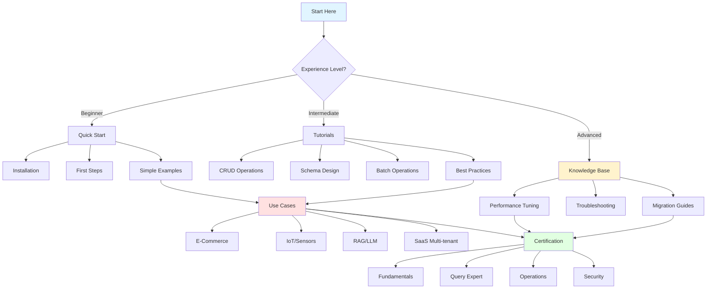

# 📚 ThemisDB Documentation Hub

> **Welcome to the ThemisDB Documentation Hub** - your comprehensive guide to mastering ThemisDB's multi-model database platform with AI/LLM capabilities.

---

## 🚀 Quick Access

| Category | Description | Start Here |
|----------|-------------|------------|
| 🎯 **Beginners** | New to ThemisDB? Start here! | [Quick Start →](de/guides/QUICKSTART.md) |
| 💡 **Use Cases** | Real-world application guides | [Browse Use Cases →](use-cases/README.md) |
| 🎓 **Tutorials** | Hands-on learning paths | [View Tutorials →](tutorials/README.md) |
| 🏆 **Certification** | Professional certifications | [Get Certified →](certification/README.md) |
| 📚 **Knowledge Base** | Troubleshooting & tips | [Search KB →](knowledge-base/README.md) |
| 📖 **API Docs** | Complete API reference | [API Reference →](api/API_REFERENCE.md) |

---

## 🎯 Quick Navigation

### 🚀 Getting Started
- **[Quick Start Guide](de/guides/QUICKSTART.md)** - Get ThemisDB running in 5 minutes
- **[Installation Guide](de/guides/guides_deployment.md)** - Detailed installation instructions
- **[First Steps Tutorial](tutorials/GETTING_STARTED_TUTORIAL.md)** - Your first database operations
- **[Configuration Guide](de/guides/CONFIGURATION_TUNING_GUIDE.md)** - Configure ThemisDB for your needs

### 📖 Core Documentation
- **[Architecture Overview](de/architecture/ARCHITECTURE_OVERVIEW.md)** - System design and components
- **[AQL Query Language](de/aql/aql_syntax.md)** - Complete query language reference
- **[API Reference](api/API_REFERENCE.md)** - REST, GraphQL, gRPC, and SDK documentation
- **[Security Guide](de/security/security_implementation.md)** - Authentication, encryption, and access control

### 💡 Use Case Guides
Learn how to use ThemisDB for specific scenarios:
- **[E-Commerce Guide](use-cases/ECOMMERCE_USE_CASE.md)** - Product catalogs, inventory, recommendations
- **[IoT & Sensor Networks](use-cases/IOT_USE_CASE.md)** - Time-series data, real-time analytics
- **[RAG & LLM Applications](use-cases/RAG_LLM_USE_CASE.md)** - AI-powered search and knowledge bases
- **[SaaS Multi-Tenancy](use-cases/SAAS_USE_CASE.md)** - Multi-tenant architectures and isolation

### 🎓 Tutorials & Learning Paths
- **[Interactive Examples](tutorials/INTERACTIVE_EXAMPLES.md)** - Hands-on code examples
- **[Video Tutorials Index](tutorials/VIDEO_TUTORIALS.md)** - Video learning resources
- **[24 Example Projects](../examples/README.md)** - Complete applications with source code
- **[Best Practices](tutorials/BEST_PRACTICES.md)** - Production-ready patterns

### 🏆 Certification Programs
Become a certified ThemisDB expert:
- **[Fundamentals Certification](certification/FUNDAMENTALS_CERTIFICATION.md)** - Core concepts and basics
- **[Query Certification](certification/QUERY_CERTIFICATION.md)** - AQL mastery and optimization
- **[Operations Certification](certification/OPERATIONS_CERTIFICATION.md)** - Deployment and maintenance
- **[Security Certification](certification/SECURITY_CERTIFICATION.md)** - Security best practices

### 📚 Knowledge Base
- **[FAQ](FAQ.md)** - Frequently asked questions
- **[Troubleshooting Guide](knowledge-base/TROUBLESHOOTING.md)** - Common issues and solutions
- **[Performance Tuning](knowledge-base/PERFORMANCE_TIPS.md)** - Optimization techniques
- **[Migration Guides](knowledge-base/MIGRATION_GUIDES.md)** - Upgrading and data migration

## 📊 Documentation by Category

### Development
- [Client SDKs](../clients/README.md) - Language-specific SDKs
- [REST API](api/REST_API_REFERENCE.md) - HTTP/REST interface
- [GraphQL](de/apis/GRAPHQL_API_SPECIFICATION.md) - GraphQL queries and mutations
- [gRPC](de/apis/GRPC_API_SPECIFICATION.md) - High-performance RPC
- [WebSocket](de/apis/README.md) - Real-time updates

### Operations
- [Deployment Guide](de/guides/guides_deployment.md) - Production deployment
- [Monitoring & Metrics](en/operations/MONITORING_SETUP_GUIDE.md) - Prometheus, Grafana
- [Backup & Recovery](knowledge-base/BACKUP_RECOVERY.md) - Data protection
- [High Availability](replication-ha-guide.md) - Clustering and replication
- [Docker Guide](en/deployment/DOCKER_BUILD_GUIDE.md) - Containerized deployment

### Data Modeling
- [Multi-Model Guide](de/architecture/architecture_multi_model.md) - Using multiple data models
- [Schema Design](tutorials/SCHEMA_DESIGN.md) - Best practices
- [Indexing Strategy](de/aql/aql_explain_profile.md) - Index types and usage
- [Graph Modeling](de/features/features_property_graph.md) - Graph data structures

### Advanced Features
- [LLM Integration](de/llm/NATIVE_LLM_INTEGRATION_CONCEPT.md) - Native AI capabilities
- [Vector Search](de/features/features_vector_ops.md) - Similarity search
- [Full-Text Search](de/search/fulltext_phrase_fuzzy.md) - Text indexing
- [Distributed Transactions](DISTRIBUTED_TRANSACTIONS.md) - ACID across shards
- [Geospatial Queries](de/features/geospatial_3d_implementation.md) - Location-based data

### Performance
- [Performance Guide](de/performance/LIBRARY_OPTIMIZATION_QUICKREF.md) - Tuning and optimization
- [Benchmarks](../benchmarks/README.md) - Performance data
- [Scaling Guide](archive/SCALING_ANALYSIS_v1.3.4.md) - Horizontal and vertical scaling

### Security
- [Security Implementation](de/security/security_implementation.md) - Complete security guide
- [Authentication](de/security/security_implementation.md) - User authentication
- [Authorization](de/security/security_policy.md) - Access control
- [Encryption](de/security/security_encryption_strategy.md) - Data encryption
- [Audit Logging](de/security/security_audit_checklist.md) - Security auditing

## 🔍 Find What You Need

### By Role

#### **Developers**
1. Start with [Quick Start](de/guides/QUICKSTART.md)
2. Review [API Reference](api/API_REFERENCE.md)
3. Explore [Example Projects](../examples/README.md)
4. Check [Best Practices](tutorials/BEST_PRACTICES.md)

#### **Database Administrators**
1. Read [Deployment Guide](de/guides/guides_deployment.md)
2. Configure [Monitoring](en/operations/MONITORING_SETUP_GUIDE.md)
3. Set up [Backup & Recovery](knowledge-base/BACKUP_RECOVERY.md)
4. Review [Troubleshooting](knowledge-base/TROUBLESHOOTING.md)

#### **Architects**
1. Understand [Architecture](de/architecture/ARCHITECTURE_OVERVIEW.md)
2. Review [Multi-Model Guide](de/architecture/architecture_multi_model.md)
3. Plan [Scaling Strategy](archive/SCALING_ANALYSIS_v1.3.4.md)
4. Design [Security Architecture](de/security/security_implementation.md)

#### **DevOps Engineers**
1. Set up [CI/CD](de/deployment/CI_CD_BENCHMARK_AUTOMATION.md)
2. Configure [Docker](en/deployment/DOCKER_BUILD_GUIDE.md)
3. Enable [Monitoring](PROMETHEUS_INTEGRATION_COMPLETE.md)
4. Plan [High Availability](replication-ha-guide.md)

### By Task

#### **Installation & Setup**
- [Quick Start](de/guides/QUICKSTART.md) - Fastest way to get started
- [Docker Installation](en/deployment/DOCKER_BUILD_GUIDE.md) - Container deployment
- [Building from Source](../CONTRIBUTING.md) - Compile ThemisDB
- [Configuration](de/guides/CONFIGURATION_TUNING_GUIDE.md) - System configuration

#### **Data Operations**
- [CRUD Operations](tutorials/CRUD_TUTORIAL.md) - Create, Read, Update, Delete
- [Querying Data](de/aql/aql_syntax.md) - AQL queries
- [Transactions](de/features/features_transactions.md) - ACID transactions
- [Batch Operations](tutorials/BATCH_OPERATIONS.md) - Bulk data loading

#### **Monitoring & Troubleshooting**
- [Monitoring Setup](en/operations/MONITORING_SETUP_GUIDE.md) - Metrics and dashboards
- [Troubleshooting](knowledge-base/TROUBLESHOOTING.md) - Common issues
- [Performance Profiling](de/performance/LIBRARY_OPTIMIZATION_QUICKREF.md) - Identify bottlenecks
- [Log Analysis](knowledge-base/LOG_ANALYSIS.md) - Understanding logs

## 🗺️ Documentation Navigation Map

### Learning Journey Paths



### Documentation Structure Overview

```
📚 ThemisDB Documentation
│
├── 🚀 Getting Started
│   ├── Quick Start (5 min)
│   ├── Installation Guide
│   └── First Steps Tutorial
│
├── 💡 Use Cases (Real-World Applications)
│   ├── 🛒 E-Commerce Platform
│   ├── 📡 IoT & Sensor Networks
│   ├── 🤖 RAG & LLM Applications
│   └── 🏢 SaaS Multi-Tenancy
│
├── 🎓 Tutorials (Step-by-Step Guides)
│   ├── Getting Started Tutorial
│   ├── CRUD Operations
│   ├── Batch Operations
│   ├── Schema Design
│   ├── Best Practices
│   ├── Interactive Examples
│   └── Video Tutorials
│
├── 🏆 Certification Program
│   ├── Fundamentals Certification
│   ├── Query Expert Certification
│   ├── Operations Certification
│   └── Security Certification
│
├── 📚 Knowledge Base (Problem Solving)
│   ├── FAQ
│   ├── Troubleshooting Guide
│   ├── Performance Tips
│   ├── Migration Guides
│   ├── Backup & Recovery
│   └── Log Analysis
│
├── 📖 Core Documentation
│   ├── Architecture
│   ├── AQL Query Language
│   ├── API Reference
│   ├── Security
│   └── Features
│
└── 🛠️ Operations
    ├── Deployment
    ├── Monitoring
    ├── Performance
    └── High Availability
```

### Quick Reference by Topic

| Topic | Beginner | Intermediate | Advanced |
|-------|----------|--------------|----------|
| **Installation** | [Quick Start](de/guides/QUICKSTART.md) | [Docker Guide](en/deployment/DOCKER_BUILD_GUIDE.md) | [Build from Source](../CONTRIBUTING.md) |
| **Queries** | [Getting Started](tutorials/GETTING_STARTED_TUTORIAL.md) | [AQL Syntax](de/aql/aql_syntax.md) | [Query Optimization](knowledge-base/PERFORMANCE_TIPS.md) |
| **Data Modeling** | [CRUD Tutorial](tutorials/CRUD_TUTORIAL.md) | [Schema Design](tutorials/SCHEMA_DESIGN.md) | [Multi-Model Guide](de/architecture/architecture_multi_model.md) |
| **Performance** | [Best Practices](tutorials/BEST_PRACTICES.md) | [Performance Tips](knowledge-base/PERFORMANCE_TIPS.md) | [Benchmarking](../benchmarks/README.md) |
| **Operations** | [Configuration](de/guides/CONFIGURATION_TUNING_GUIDE.md) | [Monitoring](en/operations/MONITORING_SETUP_GUIDE.md) | [HA Setup](replication-ha-guide.md) |
| **Security** | [Security Basics](de/security/security_implementation.md) | [RBAC Setup](de/security/security_policy.md) | [Security Certification](certification/SECURITY_CERTIFICATION.md) |

## 🌟 Featured Content

### Recent Updates
- **New:** [RAG/LLM Use Case Guide](use-cases/RAG_LLM_USE_CASE.md) - AI-powered applications
- **New:** [Certification Programs](certification/README.md) - Professional certifications
- **Updated:** [Performance Tuning](knowledge-base/PERFORMANCE_TIPS.md) - v1.4 optimizations
- **New:** [Video Tutorials](tutorials/VIDEO_TUTORIALS.md) - Visual learning resources

### Most Popular
1. [Quick Start Guide](de/guides/QUICKSTART.md)
2. [AQL Query Language](de/aql/aql_syntax.md)
3. [REST API Reference](api/API_REFERENCE.md)
4. [Docker Guide](en/deployment/DOCKER_BUILD_GUIDE.md)
5. [FAQ](FAQ.md)

### Community Favorites
- [24 Example Projects](../examples/README.md) - Complete working applications
- [Performance Benchmarks](../benchmarks/README.md) - Real-world performance data
- [Architecture Deep-Dive](de/architecture/ARCHITECTURE_OVERVIEW.md) - Internal design
- [Security Best Practices](de/security/security_implementation.md) - Production security

## 🛠 Tools & Resources

### Development Tools
- [ThemisDB CLI](tools/admin/ADMIN_TOOLS_OVERVIEW.md) - Command-line interface
- [Admin UI](de/admin_tools/admin_guide.md) - Web-based administration
- [Schema Validation](de/guides/guides_qa.md) - Schema checking
- [Query Profiler](de/aql/aql_explain_profile.md) - Query optimization

### Utilities
- [Data Import/Export](knowledge-base/MIGRATION_GUIDES.md) - Data transfer tools
- [Backup Tools](knowledge-base/BACKUP_RECOVERY.md) - Backup utilities
- [Performance Testing](../benchmarks/README.md) - Benchmark suite
- [Schema Designer](tutorials/SCHEMA_DESIGN.md) - Visual schema design

## 🌍 Language Support

### Documentation Languages
- **Deutsch (German)**: [docs/de/](de/README.md)
- **English**: [docs/en/](en/README.md)
- **Español (Spanish)**: [docs/es/](es/README.md)
- **Français (French)**: [docs/fr/](fr/README.md)
- **日本語 (Japanese)**: [docs/ja/](ja/README.md)

## 📈 Version Information

- **Current Version:** 1.4.1-dev
- **Latest Stable:** 1.4.0
- **Documentation Version:** 1.4.x
- **[Release Notes](../CHANGELOG.md)** - Version history
- **[Roadmap](ARCHIVED/roadmaps/v1.4_DEVELOPMENT_ROADMAP.md)** - Future plans

## 🤝 Community & Support

### Get Help
- **[GitHub Discussions](https://github.com/makr-code/ThemisDB/discussions)** - Community Q&A
- **[GitHub Issues](https://github.com/makr-code/ThemisDB/issues)** - Bug reports & features
- **[Support Guide](../SUPPORT.md)** - Getting support
- **[FAQ](FAQ.md)** - Common questions

### Contribute
- **[Contributing Guide](../CONTRIBUTING.md)** - How to contribute
- **[Code of Conduct](../CODE_OF_CONDUCT.md)** - Community guidelines
- **[Good First Issues](https://github.com/makr-code/ThemisDB/issues?q=is%3Aissue+is%3Aopen+label%3A%22good+first+issue%22)** - Beginner-friendly tasks

## 📝 Documentation Index

For a complete list of all documentation files, see:
- [Documentation Index](00_DOCUMENTATION_INDEX.md) - Complete file listing
- [Documentation Structure](de/STRUCTURE.md) - Organization overview
- [Examples Index](EXAMPLES_INDEX.md) - All example projects

## 🔗 External Resources

### Official Links
- **Website:** https://themisdb.com (planned)
- **GitHub:** https://github.com/makr-code/ThemisDB
- **Docker Hub:** https://hub.docker.com/r/themisdb/themisdb
- **Documentation Site:** https://makr-code.github.io/ThemisDB/

### Learning Resources
- **Blog:** Coming soon
- **YouTube Channel:** Coming soon
- **Community Forum:** [GitHub Discussions](https://github.com/makr-code/ThemisDB/discussions)

---

## 📞 Need Help?

- 📚 **Can't find what you're looking for?** Try the [Search](https://makr-code.github.io/ThemisDB/) function
- 💬 **Have a question?** Ask in [GitHub Discussions](https://github.com/makr-code/ThemisDB/discussions)
- 🐛 **Found a bug?** Report it in [GitHub Issues](https://github.com/makr-code/ThemisDB/issues)
- 📖 **Documentation issue?** Submit a [documentation improvement](https://github.com/makr-code/ThemisDB/issues/new?labels=documentation)

---

**Last Updated:** 2026-04-06  
**Maintained by:** ThemisDB Documentation Team
