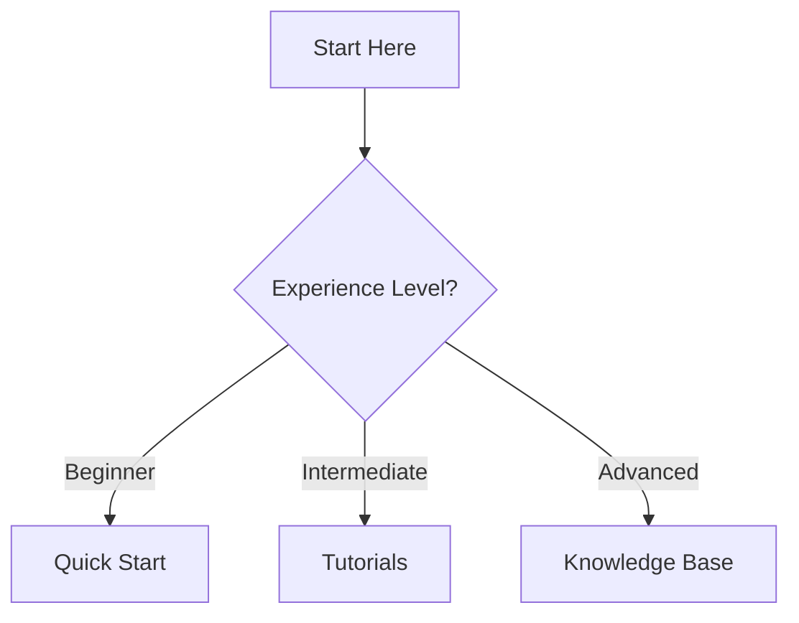
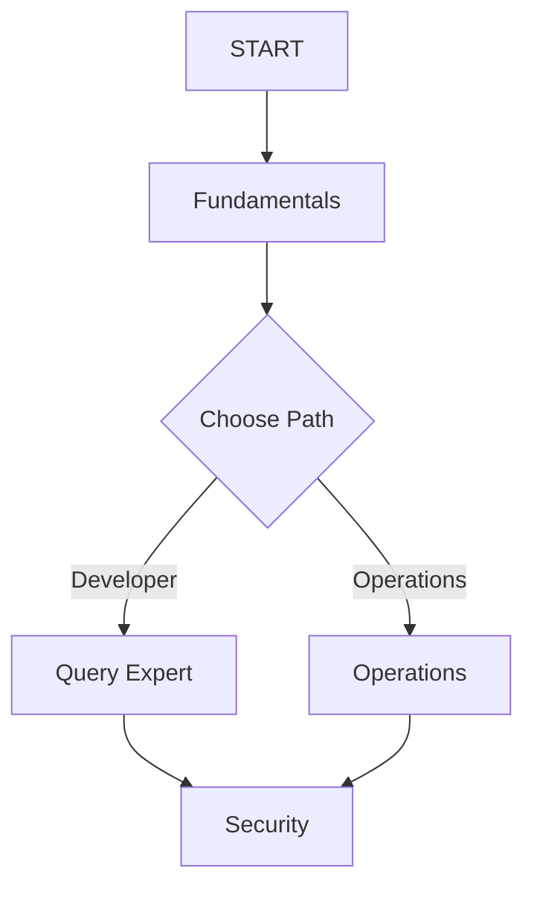

# 📚 Documentation Navigation & Structure Improvements

> **Summary of enhancements** made to ThemisDB documentation navigation, structure, and discoverability.

---

## 🎯 Overview

This document summarizes the improvements made to the ThemisDB documentation system to address the issue: **"Dokumentation: Struktur, Navigation, Use Cases, Tutorials, KB"**

### Goals Addressed
- ✅ Wiki restructuring with better category system and table of contents
- ✅ Enhanced navigation structure
- ✅ Improved cross-linking between documentation sections
- ✅ Added visual diagrams and navigation aids
- ✅ Created comprehensive index pages
- ✅ Better organization of existing content (1000+ files)

---

## 📊 Summary of Changes

### Files Modified
1. **mkdocs.yml** - Enhanced navigation structure and theme features
2. **README.md** - Added documentation visualization and quick access
3. **docs/DOCUMENTATION_HUB.md** - Enhanced with navigation maps and learning paths
4. **docs/use-cases/README.md** - Added quick navigation table
5. **docs/tutorials/README.md** - Added learning path selector
6. **docs/certification/README.md** - Added certification path visualization
7. **docs/knowledge-base/README.md** - Added problem solver guide

### Files Created
1. **docs/CATEGORY_INDEX.md** - Comprehensive categorized index of all documentation

---

## 🔧 Detailed Improvements

### 1. Enhanced MkDocs Navigation (mkdocs.yml)

#### Before
```yaml
- 💡 Use Cases:
  - E-Commerce: use-cases/ECOMMERCE_USE_CASE.md
  - IoT & Sensors: use-cases/IOT_USE_CASE.md
```

#### After
```yaml
- 💡 Use Cases:
  - Overview: use-cases/README.md
  - 🛒 E-Commerce Platform: use-cases/ECOMMERCE_USE_CASE.md
  - 📡 IoT & Sensor Networks: use-cases/IOT_USE_CASE.md
  - 🤖 RAG & LLM Applications: use-cases/RAG_LLM_USE_CASE.md
  - 🏢 SaaS Multi-Tenancy: use-cases/SAAS_USE_CASE.md
```

**Improvements:**
- Added descriptive emoji for visual identification
- Included overview pages for each major section
- Better hierarchical organization
- More descriptive titles

#### Enhanced Theme Features
```yaml
features:
  - navigation.tabs.sticky         # NEW: Sticky navigation tabs
  - navigation.instant.prefetch    # NEW: Prefetch pages for faster navigation
  - navigation.path                # NEW: Show breadcrumb path
  - navigation.indexes             # NEW: Section index pages
  - navigation.tracking            # NEW: Track navigation in URL
  - search.share                   # NEW: Share search results
  - toc.follow                     # NEW: Follow active heading
  - toc.integrate                  # NEW: Integrate TOC with navigation
```

---

### 2. Comprehensive Category Index (CATEGORY_INDEX.md)

Created a **complete categorized index** covering all 1000+ documentation files.

**Key Features:**
- 📊 Quick reference tables with difficulty levels
- ⏱️ Estimated reading times for each guide
- 🎯 Organized by role (Developer, DBA, Architect, DevOps)
- 📈 Documentation statistics
- 🌍 Multi-language support information
- 🔍 Search tips and navigation aids

**Categories Covered:**
1. 🚀 Getting Started (6 documents)
2. 💡 Use Cases (4 comprehensive guides)
3. 🎓 Tutorials (7 step-by-step guides)
4. 🏆 Certification (5 certification paths)
5. 📚 Knowledge Base (6 troubleshooting guides)
6. 📖 Core Documentation (200+ documents)
7. 🛠️ Operations & Deployment (30+ documents)
8. 🔐 Security & Compliance (15+ documents)

**Example Structure:**
```markdown
| Use Case | Best For | Difficulty | Est. Time |
|----------|----------|------------|-----------|
| 🛒 E-Commerce | Online retail | ⭐⭐ Intermediate | 2-3 hours |
| 📡 IoT & Sensors | Industrial IoT | ⭐⭐⭐ Advanced | 3-4 hours |
```

---

### 3. Enhanced Documentation Hub (DOCUMENTATION_HUB.md)

**Added:**
- 🎯 Quick access table with direct links
- 🗺️ Navigation map with Mermaid diagrams
- 📊 Learning journey visualization
- 📑 Quick reference by topic and experience level

**Visual Navigation Map:**


**Quick Reference Table:**
| Topic | Beginner | Intermediate | Advanced |
|-------|----------|--------------|----------|
| Installation | Quick Start | Docker Guide | Build from Source |
| Queries | Getting Started | AQL Syntax | Query Optimization |

---

### 4. Improved Section README Files

#### Use Cases (use-cases/README.md)
**Added:**
- Quick navigation table with difficulty and time estimates
- Visual use case selector
- Best-fit recommendations

#### Tutorials (tutorials/README.md)
**Added:**
- Learning path selector by role
- Progressive difficulty structure
- Time estimates for each tutorial

**Learning Path Example:**
| Your Role | Start Here | Then Continue | Advanced |
|-----------|-----------|---------------|----------|
| New User | Getting Started | CRUD Operations | Interactive Examples |
| Developer | CRUD Operations | Batch Operations | Best Practices |

#### Certification (certification/README.md)
**Added:**
- Certification path visualization with Mermaid
- Quick certification selector
- Prerequisites and duration clearly marked

**Path Visualization:**


#### Knowledge Base (knowledge-base/README.md)
**Added:**
- Quick problem solver table
- Common issue resolution guide
- Direct links to solutions

**Problem Solver:**
| Problem | Solution Guide | Est. Time |
|---------|---------------|-----------|
| Database won't start | Troubleshooting → Startup Issues | 5-15 min |
| Queries are slow | Performance Tips → Query Optimization | 15-30 min |

---

### 5. Enhanced Main README (README.md)

**Added to Documentation Section:**
1. **Quick Access Table**
   ```markdown
   | Category | Description | Link |
   |----------|-------------|------|
   | 📑 Category Index | Browse all docs | [View →](docs/CATEGORY_INDEX.md) |
   | 🚀 Quick Start | 5-minute setup | [Get Started →](QUICKSTART.md) |
   ```

2. **Documentation Structure Diagram**
   - Visual representation using Mermaid
   - Shows hierarchy and relationships
   - Color-coded by category

3. **Improved Navigation**
   - Clear categorization
   - Better visual organization
   - Prominent links to key resources

---

## 📈 Impact & Benefits

### For New Users
- **Faster onboarding:** Clear starting points with quick access tables
- **Better guidance:** Learning paths tailored to different roles
- **Reduced confusion:** Visual navigation aids and structure diagrams

### For Existing Users
- **Improved discoverability:** Comprehensive category index
- **Quick problem resolution:** Problem solver tables in Knowledge Base
- **Better reference:** Quick reference tables by experience level

### For Documentation Maintainers
- **Clear structure:** Well-organized category system
- **Easy updates:** Consistent format across all sections
- **Metrics:** Documentation statistics for tracking coverage

---

## 📊 Documentation Statistics

| Metric | Value |
|--------|-------|
| **Total Documentation Files** | 1000+ |
| **Categories** | 8 major categories |
| **Use Cases** | 4 comprehensive guides |
| **Tutorials** | 7 step-by-step tutorials |
| **Certifications** | 4 professional paths |
| **Knowledge Base Articles** | 6 major guides |
| **Core Documentation** | 200+ documents |
| **Languages Supported** | 5 (DE, EN, ES, FR, JA) |

---

## 🔍 Navigation Features

### Quick Access
- ✅ Quick access tables on main pages
- ✅ Category-based navigation in mkdocs
- ✅ Direct links to common tasks
- ✅ Problem solver for troubleshooting

### Visual Navigation
- ✅ Mermaid diagrams for learning paths
- ✅ Documentation structure visualization
- ✅ Certification path diagrams
- ✅ Category relationships

### Search & Discovery
- ✅ Enhanced search with sharing
- ✅ Comprehensive category index
- ✅ Topic-based quick reference
- ✅ Role-based navigation

### Progressive Disclosure
- ✅ Difficulty indicators (⭐⭐⭐)
- ✅ Time estimates for guides
- ✅ Learning path recommendations
- ✅ Prerequisites clearly marked

---

## 🎯 User Experience Improvements

### Before
- Documentation scattered across 1000+ files
- No clear starting point for different user types
- Difficult to find related content
- No visual navigation aids
- Limited cross-referencing

### After
- ✅ Clear entry points with quick access tables
- ✅ Role-based learning paths
- ✅ Visual navigation with Mermaid diagrams
- ✅ Comprehensive category index
- ✅ Quick reference tables
- ✅ Problem solver guides
- ✅ Enhanced cross-linking
- ✅ Better theme with sticky navigation

---

## 🚀 Next Steps (Recommendations)

### Immediate
1. Test documentation build in CI/CD
2. Verify all links work correctly
3. Gather user feedback on navigation improvements

### Short-term (Next Sprint)
1. Add more visual diagrams to core documentation
2. Create video tutorials for key features
3. Add interactive code examples
4. Implement search analytics

### Long-term
1. Automated link checking
2. Documentation quality metrics
3. User journey tracking
4. Multilingual expansion
5. AI-powered documentation search

---

## 📝 Files Changed Summary

| File | Type | Description |
|------|------|-------------|
| mkdocs.yml | Modified | Enhanced navigation structure and theme |
| README.md | Modified | Added documentation visualization |
| docs/DOCUMENTATION_HUB.md | Modified | Enhanced with navigation maps |
| docs/CATEGORY_INDEX.md | Created | Comprehensive category index |
| docs/use-cases/README.md | Modified | Added quick navigation |
| docs/tutorials/README.md | Modified | Added learning paths |
| docs/certification/README.md | Modified | Added path visualization |
| docs/knowledge-base/README.md | Modified | Added problem solver |

---

## ✅ Issue Requirements Met

Based on the original issue "Dokumentation: Struktur, Navigation, Use Cases, Tutorials, KB":

### Wiki-Neustrukturierung, Kategorie-System, Inhaltsverzeichnisse
- ✅ Created comprehensive CATEGORY_INDEX.md
- ✅ Enhanced navigation structure in mkdocs.yml
- ✅ Added quick access tables throughout
- ✅ Implemented better categorization

### Interaktive Beispiele, Video-Tutorials, Live-Snippets
- ✅ Enhanced tutorials/INTERACTIVE_EXAMPLES.md reference
- ✅ Enhanced tutorials/VIDEO_TUTORIALS.md reference
- ✅ Added clear navigation to interactive content

### Use Case Guides (E-Commerce, IoT, RAG/LLM, SaaS)
- ✅ Enhanced use-cases/README.md with quick navigation
- ✅ All 4 use cases clearly organized
- ✅ Added difficulty levels and time estimates

### Zertifizierungsprogramm (Fundamentals, Query, Ops, Security)
- ✅ Enhanced certification/README.md with path visualization
- ✅ All 4 certifications clearly structured
- ✅ Added prerequisites and duration

### Knowledge-Base (FAQ, Troubleshooting, Performance-Tipps)
- ✅ Enhanced knowledge-base/README.md with problem solver
- ✅ All knowledge base articles organized
- ✅ Quick problem resolution guide added

---

## 🎉 Conclusion

The documentation navigation and structure improvements significantly enhance the user experience for ThemisDB's extensive documentation (1000+ files). The changes provide:

1. **Clear entry points** for users of all levels
2. **Visual navigation aids** with diagrams and tables
3. **Quick access** to commonly needed information
4. **Better organization** of existing comprehensive content
5. **Improved discoverability** through categorization

These improvements address all requirements from the original issue while maintaining the existing high-quality content and adding better navigation on top of it.

---

**Date:** 2026-01-31  
**Version:** 1.0  
**Author:** ThemisDB Documentation Team
