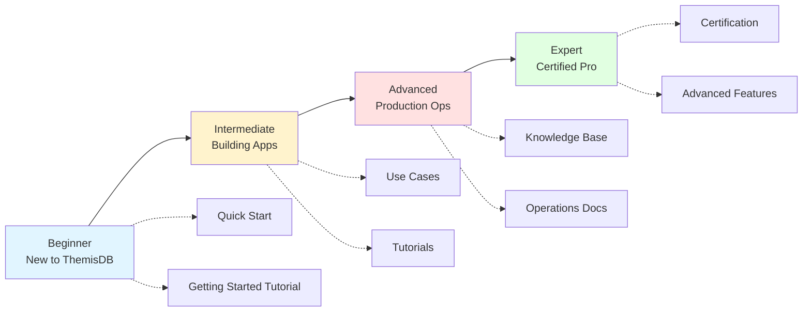

# 🗺️ ThemisDB Documentation Navigation Guide

> **Your complete guide** to navigating ThemisDB's comprehensive documentation system.

---

## 🎯 Where to Start

### I'm completely new to ThemisDB
**Start Here:** [Quick Start Guide](../QUICKSTART.md) (5 minutes)
- Get ThemisDB running
- Create your first database
- Run basic queries

**Then:** [Getting Started Tutorial](tutorials/GETTING_STARTED_TUTORIAL.md) (30 minutes)
- Deeper introduction
- Hands-on exercises
- Core concepts

### I need to build something specific
**Go To:** [Use Cases](use-cases/README.md)
- 🛒 E-Commerce Platform
- 📡 IoT & Sensor Networks  
- 🤖 RAG & LLM Applications
- 🏢 SaaS Multi-Tenancy

### I need to solve a problem
**Go To:** [Knowledge Base](knowledge-base/README.md)
- 🔧 Troubleshooting Guide - Issues and solutions
- ⚡ Performance Tips - Optimization techniques
- 🔄 Migration Guides - Version upgrades
- 💾 Backup & Recovery - Data protection

### I want to become an expert
**Go To:** [Certification Program](certification/README.md)
- 📘 Fundamentals (Entry Level)
- 🔍 Query Expert (Advanced)
- ⚙️ Operations (Advanced)
- 🔒 Security (Expert)

---

## 📚 Documentation Structure

### Level 1: Entry Points

```
┌─────────────────────────────────────────────────────────┐
│                    Documentation Hub                     │
│         Your Central Navigation Hub for All Docs        │
└─────────────────────────────────────────────────────────┘
                              │
                ┌─────────────┼─────────────┐
                │             │             │
        ┌───────▼────┐  ┌─────▼──────┐  ┌──▼─────────┐
        │ Quick Start │  │   Category │  │    FAQ     │
        │   (5 min)   │  │    Index   │  │  Answers   │
        └─────────────┘  └────────────┘  └────────────┘
```

### Level 2: Main Categories

```
📚 Documentation Categories
│
├── 🚀 Getting Started
│   └── Installation, first steps, basic concepts
│
├── 💡 Use Cases
│   └── Real-world application guides
│
├── 🎓 Tutorials
│   └── Step-by-step learning paths
│
├── 🏆 Certification
│   └── Professional certification paths
│
├── 📚 Knowledge Base
│   └── Troubleshooting and optimization
│
└── 📖 Core Documentation
    └── Architecture, APIs, features, operations
```

---

## 🔍 How to Find What You Need

### Method 1: By Your Role

| I am a... | Start with... | Focus on... |
|-----------|--------------|-------------|
| **Developer** | [Quick Start](../QUICKSTART.md) | [Tutorials](tutorials/README.md), [API Docs](api/API_REFERENCE.md) |
| **DBA** | [Deployment Guide](de/guides/guides_deployment.md) | [Operations](de/deployment/), [Knowledge Base](knowledge-base/README.md) |
| **Architect** | [Architecture Overview](de/architecture/ARCHITECTURE_OVERVIEW.md) | [Multi-Model Design](de/architecture/architecture_multi_model.md) |
| **DevOps** | [Docker Guide](DOCKER_BUILD_GUIDE.md) | [Monitoring](de/deployment/MONITORING_GUIDE.md), [HA Setup](de/deployment/HA_GUIDE.md) |
| **Security Engineer** | [Security Guide](de/security/security_implementation.md) | [Security Certification](certification/SECURITY_CERTIFICATION.md) |

### Method 2: By Your Goal

| I want to... | Go to... |
|-------------|----------|
| Install ThemisDB | [Quick Start](../QUICKSTART.md) or [Installation Guide](de/guides/guides_deployment.md) |
| Learn to write queries | [AQL Syntax](de/aql/aql_syntax.md) or [CRUD Tutorial](tutorials/CRUD_TUTORIAL.md) |
| Build an e-commerce app | [E-Commerce Use Case](use-cases/ECOMMERCE_USE_CASE.md) |
| Troubleshoot issues | [Troubleshooting Guide](knowledge-base/TROUBLESHOOTING.md) |
| Optimize performance | [Performance Tips](knowledge-base/PERFORMANCE_TIPS.md) |
| Get certified | [Certification Program](certification/README.md) |

### Method 3: By Experience Level



---

## 🗂️ Documentation Categories Explained

### 🚀 Getting Started
**When to use:** You're brand new or setting up ThemisDB
**What you'll find:** Installation, configuration, first steps
**Time investment:** 30 minutes - 2 hours
**Key docs:**
- [Quick Start](../QUICKSTART.md) - 5 min fastest setup
- [Getting Started Tutorial](tutorials/GETTING_STARTED_TUTORIAL.md) - 30 min comprehensive intro
- [Configuration Guide](de/deployment/CONFIGURATION_GUIDE.md) - Setup options

### 💡 Use Cases
**When to use:** Building a specific type of application
**What you'll find:** Complete architecture patterns, schemas, code examples
**Time investment:** 2-4 hours per use case
**Available:**
- 🛒 E-Commerce - Product catalogs, inventory, recommendations
- 📡 IoT & Sensors - Time-series, real-time analytics, device management
- 🤖 RAG & LLM - AI search, document Q&A, semantic search
- 🏢 SaaS Multi-Tenancy - Tenant isolation, RBAC, billing

### 🎓 Tutorials
**When to use:** Learning specific features step-by-step
**What you'll find:** Hands-on exercises, code examples, best practices
**Time investment:** 25-45 minutes per tutorial
**Available:**
- Getting Started - First operations
- CRUD Operations - Create, read, update, delete
- Batch Operations - Bulk data handling
- Schema Design - Data modeling
- Best Practices - Production patterns
- Interactive Examples - Try it yourself
- Video Tutorials - Visual learning

### 🏆 Certification
**When to use:** Validating professional expertise
**What you'll find:** Study guides, exam prep, certification paths
**Time investment:** 40-120 hours per certification
**Levels:**
1. Fundamentals (Entry) - 90 min exam
2. Query Expert (Advanced) - 120 min + project
3. Operations (Advanced) - 120 min + project
4. Security (Expert) - 150 min + audit

### 📚 Knowledge Base
**When to use:** Solving problems, optimizing, troubleshooting
**What you'll find:** Solutions, tips, guides, procedures
**Time investment:** 5 minutes - 1 hour per issue
**Categories:**
- Troubleshooting - Problem diagnosis and resolution
- Performance Tips - Optimization techniques
- Migration Guides - Version upgrades
- Backup & Recovery - Data protection
- Log Analysis - Understanding logs

### 📖 Core Documentation
**When to use:** Deep technical reference
**What you'll find:** Architecture, APIs, features, specifications
**Time investment:** Varies by topic
**Major sections:**
- Architecture - System design
- AQL - Query language
- APIs - REST, GraphQL, gRPC, WebSocket
- Features - Vector search, graph, time-series
- Security - Authentication, encryption, RBAC
- Operations - Deployment, monitoring, HA

---

## 💡 Quick Tips

### Finding Information Fast

1. **Use the Category Index**
   - [CATEGORY_INDEX.md](CATEGORY_INDEX.md) - Complete categorized list
   - Organized by topic and difficulty
   - Includes time estimates

2. **Check Quick Access Tables**
   - Every major section has a quick access table
   - Jump directly to what you need
   - See difficulty and time investment

3. **Follow Learning Paths**
   - Role-based paths (Developer, DBA, etc.)
   - Progressive difficulty
   - Clear next steps

4. **Use Visual Guides**
   - Mermaid diagrams show relationships
   - Structure visualization helps orientation
   - Path diagrams guide progression

### Common Navigation Patterns

```
New Feature?
│
├─> Check if there's a Use Case → Use Cases/
├─> Look for a Tutorial → Tutorials/
└─> Search Core Docs → Core Documentation/

Having Issues?
│
├─> Check FAQ → FAQ.md
├─> Search Troubleshooting → Knowledge Base/TROUBLESHOOTING.md
└─> Check specific area → Core Documentation/

Want to Learn?
│
├─> Start with Quick Start → QUICKSTART.md
├─> Progress through Tutorials → Tutorials/
└─> Consider Certification → Certification/

Building Something?
│
├─> Find matching Use Case → Use Cases/
├─> Review relevant Tutorials → Tutorials/
└─> Reference Core Docs as needed → Core Documentation/
```

---

## 🎓 Recommended Learning Paths

### Path 1: Complete Beginner
```
1. Quick Start (5 min)
   ↓
2. Getting Started Tutorial (30 min)
   ↓
3. CRUD Operations Tutorial (30 min)
   ↓
4. Pick a Use Case (2-3 hours)
   ↓
5. Best Practices (40 min)
```

### Path 2: Experienced Developer
```
1. Quick Start (5 min)
   ↓
2. AQL Syntax Guide (45 min)
   ↓
3. API Reference (as needed)
   ↓
4. Relevant Use Case (2-3 hours)
   ↓
5. Performance Tips (45 min)
```

### Path 3: Database Administrator
```
1. Installation Guide (30 min)
   ↓
2. Configuration Guide (45 min)
   ↓
3. Deployment Guide (1 hour)
   ↓
4. Monitoring Setup (1 hour)
   ↓
5. Backup & Recovery (1 hour)
   ↓
6. Troubleshooting Guide (45 min)
```

### Path 4: Certification Track
```
1. Complete Beginner Path (3-4 hours)
   ↓
2. Study Fundamentals Certification (40-60 hours)
   ↓
3. Take Fundamentals Exam (90 min)
   ↓
4. Choose specialization:
   - Developer → Query Expert Certification
   - DBA → Operations Certification
   ↓
5. Advanced → Security Certification
```

---

## 📞 Still Can't Find What You Need?

### Search Options
1. **Documentation Site Search** - Use the search bar on [docs site](https://makr-code.github.io/ThemisDB/)
2. **Category Index** - Browse [CATEGORY_INDEX.md](CATEGORY_INDEX.md)
3. **FAQ** - Check [FAQ.md](FAQ.md)
4. **GitHub Search** - Search the repository

### Get Help
1. **GitHub Discussions** - Ask the community
2. **GitHub Issues** - Report documentation gaps
3. **Support** - See [SUPPORT.md](../SUPPORT.md)

### Contribute
Found a gap? Help improve the docs!
- [Contributing Guide](../CONTRIBUTING.md)
- [Documentation Guidelines](DOCUMENTATION_DESIGN_TEMPLATE.md)

---

## 🗺️ Navigation Cheat Sheet

| I need... | Go to... | Type | Time |
|----------|----------|------|------|
| Quick setup | [Quick Start](../QUICKSTART.md) | Tutorial | 5 min |
| First operations | [Getting Started](tutorials/GETTING_STARTED_TUTORIAL.md) | Tutorial | 30 min |
| Build e-commerce | [E-Commerce Guide](use-cases/ECOMMERCE_USE_CASE.md) | Use Case | 2-3 hr |
| Build IoT app | [IoT Guide](use-cases/IOT_USE_CASE.md) | Use Case | 3-4 hr |
| Build AI search | [RAG/LLM Guide](use-cases/RAG_LLM_USE_CASE.md) | Use Case | 3-4 hr |
| Multi-tenant app | [SaaS Guide](use-cases/SAAS_USE_CASE.md) | Use Case | 3-4 hr |
| Query language | [AQL Syntax](de/aql/aql_syntax.md) | Reference | 45 min |
| API reference | [API Docs](api/API_REFERENCE.md) | Reference | As needed |
| Troubleshoot | [Troubleshooting](knowledge-base/TROUBLESHOOTING.md) | KB | 5-45 min |
| Optimize | [Performance Tips](knowledge-base/PERFORMANCE_TIPS.md) | KB | 45 min |
| Upgrade | [Migration Guides](knowledge-base/MIGRATION_GUIDES.md) | KB | 40 min |
| Get certified | [Certification](certification/README.md) | Program | 40-120 hr |

---

**Pro Tip:** Bookmark this page and the [Documentation Hub](DOCUMENTATION_HUB.md) for quick access to all navigation resources!

---

**Last Updated:** 2026-04-06  
**Version:** 1.0  
**Maintained by:** ThemisDB Documentation Team
