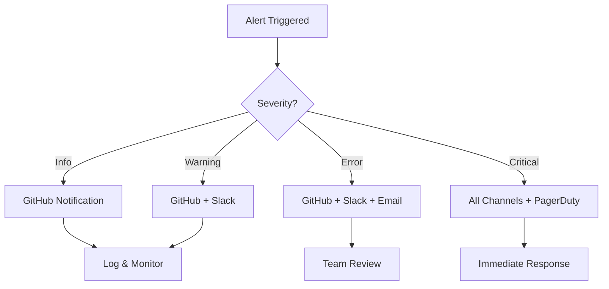

# Alerting Configuration for Performance Regression Detection

This document describes how to set up alerting for performance regressions.

## Alert Channels

### 1. GitHub Actions Notifications

Automatically included in workflows. Failures trigger GitHub notifications.

### 2. Slack Integration

#### Setup

1. Create a Slack webhook:
   - Go to https://api.slack.com/apps
   - Create new app → "From scratch"
   - Add "Incoming Webhooks" feature
   - Activate and create webhook for your channel
   - Copy webhook URL

2. Add webhook to GitHub secrets:
   ```bash
   gh secret set SLACK_WEBHOOK_BENCHMARKS --body "https://hooks.slack.com/services/YOUR/WEBHOOK/URL"
   ```

3. Webhook is automatically used by workflows (already configured)

#### Alert Format

```json
{
  "text": "❌ Performance Regression Detected",
  "blocks": [
    {
      "type": "section",
      "text": {
        "type": "mrkdwn",
        "text": "*PR #123*: 3 major regressions detected\n<PR_URL|View Details>"
      }
    },
    {
      "type": "section",
      "fields": [
        {"type": "mrkdwn", "text": "*Critical:* 1"},
        {"type": "mrkdwn", "text": "*Major:* 3"},
        {"type": "mrkdwn", "text": "*Minor:* 2"}
      ]
    }
  ]
}
```

### 3. Email Notifications

#### Via GitHub

GitHub automatically sends emails for:
- Workflow failures
- PR blocks
- Issue mentions

Configure in: Settings → Notifications

#### Via Grafana

1. Go to Grafana → Alerting → Contact points
2. Add new contact point:
   - Type: Email
   - Addresses: your-team@example.com
   - Subject: `[ThemisDB] Performance Alert: {{alertname}}`

3. Create notification policy:
   - Match: `severity = critical`
   - Contact point: Your email

### 4. PagerDuty Integration (Production)

For critical production alerts:

1. Get PagerDuty integration key:
   - Service → Integrations → Add integration
   - Select "Events API v2"
   - Copy Integration Key

2. Add to Grafana:
   - Contact points → Add PagerDuty
   - Integration Key: Your key
   - Severity: critical

3. Configure alert rules to use PagerDuty for critical regressions

## Alert Rules

### Grafana Alert Rules

Located in: `benchmarks/monitoring/performance_regression_dashboard.json`

#### Rule 1: Performance Regression Alert

```yaml
name: "Performance Regression Alert"
condition: themisdb_benchmark_items_per_second decrease > 10%
frequency: 5m
for: 10m
labels:
  severity: warning
  component: performance
message: |
  Performance regression detected: {{benchmark_name}} dropped by {{percent}}%
  Baseline: {{baseline_value}}
  Current: {{current_value}}
```

#### Rule 2: Critical Regression Alert

```yaml
name: "Critical Performance Regression"
condition: themisdb_regression_count{severity="critical"} > 0
frequency: 1m
for: 2m
labels:
  severity: critical
  component: performance
message: |
  🚨 CRITICAL: {{value}} critical performance regressions detected
  Immediate action required!
```

#### Rule 3: High PR Block Rate

```yaml
name: "High PR Block Rate"
condition: rate(themisdb_pr_blocked_total[1h]) > 0.5
frequency: 1h
for: 1h
labels:
  severity: warning
  component: ci
message: |
  ⚠️ High PR block rate detected
  {{value}} PRs blocked in last hour due to performance regressions
```

### GitHub Actions Alert Conditions

#### Workflow: performance-regression-check.yml

Alerts when:
- Regression detection fails
- Build fails
- Benchmarks fail to run

```yaml
- name: Notify Slack on Regression
  if: failure() && steps.detect.outcome == 'failure'
  uses: slackapi/slack-github-action@v1
  with:
    webhook-url: ${{ secrets.SLACK_WEBHOOK_BENCHMARKS }}
    payload: |
      {
        "text": "❌ Performance regression in PR #${{ github.event.pull_request.number }}",
        "blocks": [
          {
            "type": "section",
            "text": {
              "type": "mrkdwn",
              "text": "*Regression Details*\nPR: <${{ github.event.pull_request.html_url }}|#${{ github.event.pull_request.number }}>\nAuthor: @${{ github.event.pull_request.user.login }}"
            }
          }
        ]
      }
```

#### Workflow: update-performance-baselines.yml

Alerts when:
- Baseline update fails
- Benchmarks fail
- Commit/push fails

Creates GitHub issue automatically on failure.

## Alert Severity Levels

| Level    | Threshold | Channels                    | Response Time |
|----------|-----------|-----------------------------|--------------:|
| Info     | N/A       | GitHub                      | Next business day |
| Warning  | 5-10%     | GitHub, Slack               | 24 hours |
| Error    | 10-20%    | GitHub, Slack, Email        | 4 hours |
| Critical | >20%      | All + PagerDuty            | Immediate |

## Alert Routing



## Silencing Alerts

### Temporary Silence (Maintenance Window)

In Grafana:
1. Alerting → Silences
2. Create silence:
   - Start/End time
   - Matcher: `component = performance`
   - Comment: "Planned maintenance"

### Permanent Disable

For specific benchmarks:

Edit workflow to exclude:
```yaml
# In performance-regression-check.yml
for bench in bench_crud bench_query; do
  # Skip unstable benchmarks
  if [ "$bench" = "bench_unstable_test" ]; then
    continue
  fi
  ./$bench --benchmark_format=json ...
done
```

## Testing Alerts

### Test Slack Webhook

```bash
curl -X POST -H 'Content-type: application/json' \
  --data '{"text":"Test alert from ThemisDB"}' \
  YOUR_WEBHOOK_URL
```

### Test Grafana Alert

1. Go to alert rule
2. Click "Test"
3. Verify notification received

### Trigger Test Regression

```bash
# Create intentionally bad performance
python benchmarks/performance_regression_detector.py \
  --baseline benchmarks/baselines/main/latest.json \
  --current benchmarks/test_regression.json \
  --fail-on minor

# Should trigger alert if configured
```

## Alert Response Procedures

### For Warnings (5-10%)

1. Review regression report
2. Identify root cause
3. Create tracking issue
4. Plan fix for next sprint

### For Errors (10-20%)

1. Immediate review required
2. Block merge until resolved
3. Escalate to tech lead
4. Fix within 4 hours or revert

### For Critical (>20%)

1. Stop all merges
2. Immediate escalation
3. Roll back if in production
4. Root cause analysis
5. Fix and verify within 2 hours

## Monitoring Alert Health

### Dashboard Metrics

Track alert effectiveness:
- Alert frequency
- False positive rate
- Response time
- Resolution time

### Alert Tuning

Review quarterly:
1. Analyze alert history
2. Identify false positives
3. Adjust thresholds if needed
4. Update procedures

## Contact Information

### Escalation Chain

1. **L1**: Development Team (via Slack #performance)
2. **L2**: Tech Lead (via email)
3. **L3**: Engineering Manager (via PagerDuty)

### Emergency Contacts

- Performance Team: @perf-team (Slack)
- On-Call: See PagerDuty schedule
- Escalation: engineering-leads@example.com

## Configuration Files

```
benchmarks/monitoring/
├── performance_regression_dashboard.json  # Grafana alerts
├── alerting/
│   ├── slack_template.json               # Slack message format
│   ├── email_template.html               # Email template
│   └── pagerduty_config.json            # PagerDuty routing
```

## Appendix: Example Slack Message

```json
{
  "text": "🚨 Performance Alert",
  "blocks": [
    {
      "type": "header",
      "text": {
        "type": "plain_text",
        "text": "Performance Regression Detected"
      }
    },
    {
      "type": "section",
      "fields": [
        {
          "type": "mrkdwn",
          "text": "*Benchmark:*\nBenchmarkInsert"
        },
        {
          "type": "mrkdwn",
          "text": "*Severity:*\nCritical"
        },
        {
          "type": "mrkdwn",
          "text": "*Regression:*\n-25.3%"
        },
        {
          "type": "mrkdwn",
          "text": "*PR:*\n<https://github.com/makr-code/ThemisDB/pull/123|#123>"
        }
      ]
    },
    {
      "type": "actions",
      "elements": [
        {
          "type": "button",
          "text": {
            "type": "plain_text",
            "text": "View Details"
          },
          "url": "https://github.com/makr-code/ThemisDB/actions/runs/123"
        },
        {
          "type": "button",
          "text": {
            "type": "plain_text",
            "text": "View Dashboard"
          },
          "url": "https://grafana.example.com/d/perf-regression"
        }
      ]
    }
  ]
}
```

---

Last updated: 2024-12-30
