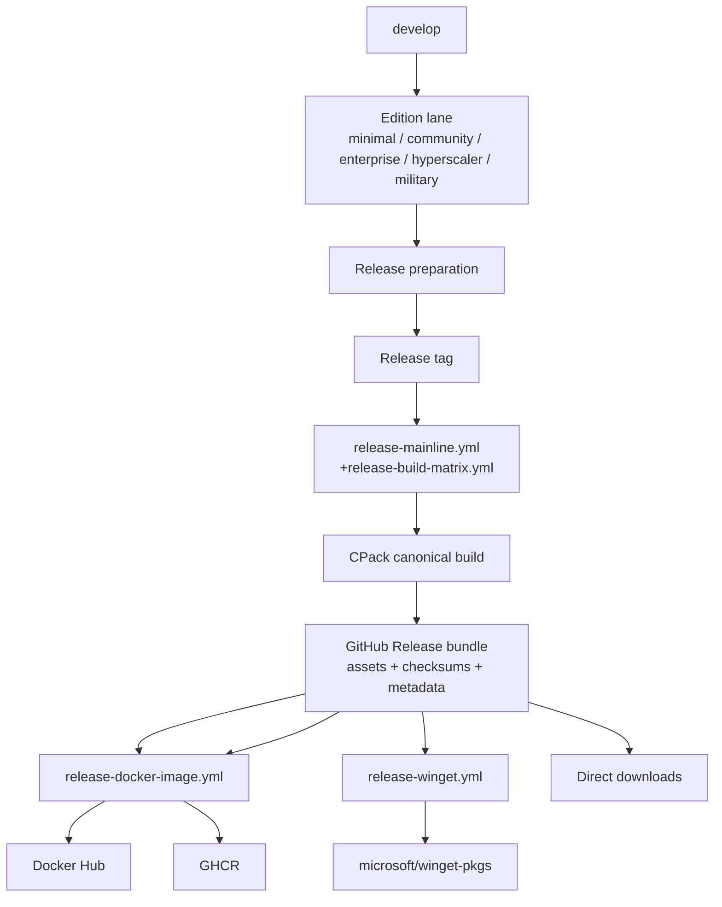

# ThemisDB Release Artifact Locations

> **Status:** Active  
> **Purpose:** Guide to where ThemisDB release artifacts are published and how to find them  
> The artifacts are produced once by the canonical CPack-backed release build matrix and then consumed by downstream delivery lanes.  
> **See also:** [RELEASE_STRATEGY.md](../RELEASE_STRATEGY.md) · [RELEASE_PROCESS_QUICKREF.md](RELEASE_PROCESS_QUICKREF.md)

---

## Table of Contents

1. [GitHub Releases](#github-releases)
2. [Docker Registry](#docker-registry)
3. [Windows Package Manager (WinGet)](#windows-package-manager-winget)
4. [Linux Package Repositories](#linux-package-repositories)
5. [macOS Distribution (planned)](#macos-distribution-planned)
6. [Build Metadata & SBOM](#build-metadata--sbom)
7. [Private Edition Releases](#private-edition-releases)
8. [Artifact Naming Convention](#artifact-naming-convention)

---

## GitHub Releases

### Location

https://github.com/makr-code/ThemisDB/releases

### Build-to-Product Flow



### Source of truth

- Release assets are generated by the canonical CPack-backed release build matrix.
- GitHub Release is the publication bundle for those assets, checksums, SBOMs, and metadata.
- Docker, WinGet, and other downstream consumers must use the published release bundle, not regenerate package identity independently.

### Windows/Linux channel coverage (current operations scope)

| Platform | Channel | Workflow path | Artifact / Output | Status |
|---|---|---|---|---|
| Windows | GitHub Releases | `release-build-matrix.yml` -> `release-mainline.yml` | `.zip`, `.msi`, checksums, manifest | active |
| Windows | WinGet | `release-winget.yml` (release consumer) | `ThemisDB.ThemisDB` manifests in `microsoft/winget-pkgs` | active (stable only) |
| Windows | Scoop/Chocolatey candidate bundle | `release-windows-distribution.yml` | candidate manifests + checksums + metadata bundle | active |
| Linux | GitHub Releases | `release-build-matrix.yml` -> `release-mainline.yml` | `.tar.gz`, `.deb`, `.rpm`, checksums, manifest | active |
| Linux | Distro bundle/repo metadata | `release-linux-distribution.yml` | prepared DEB/RPM metadata bundle + optional semi-automated publish bundle | active |
| Linux | Docker Hub | `release-docker-image.yml` | OCI image tags on `docker.io/themisdb/themisdb` | active |
| Linux | GHCR | `release-docker-image.yml` | OCI image tags on `ghcr.io/makr-code/themisdb` | active |

Not in current Windows/Linux operations scope:

- macOS consumer publication lane (still planned)

### Windows distribution candidate workflow (Scoop/Chocolatey)

Windows additional channel preparation is handled by:

- `.github/workflows/release-windows-distribution.yml`

The workflow consumes published GitHub Release assets and prepares:

- Scoop candidate manifest (`themisdb.json`)
- Chocolatey candidate metadata (`themisdb.nuspec`, `tools/chocolateyinstall.ps1`)
- channel metadata + checksums bundle

Bundle naming convention:

- publish tarball: `windows-distro-<version>-<channel>.tar.gz`
- workflow artifact: `windows-distro-<version>-<channel>-<run_number>`

Supported channels:

- `stable`
- `testing`
- `nightly`

Examples:

```bash
# Stable candidate preparation only (no external publish)
gh workflow run release-windows-distribution.yml \
  --ref community \
  -f version=2.5.0 \
  -f channel=stable \
  -f prepare_scoop=true \
  -f prepare_chocolatey=true \
  -f publish_bundle=false

# Testing channel candidate bundle with semi-automated publish
gh workflow run release-windows-distribution.yml \
  --ref community \
  -f version=2.5.0-rc1 \
  -f channel=testing \
  -f prepare_scoop=true \
  -f prepare_chocolatey=true \
  -f allow_non_stable_publish=true \
  -f publish_bundle=true
```

When `publish_bundle=true`, the workflow uploads the prepared tarball to channel-scoped endpoints using:

- `windows_distro_publish_url_stable` + `windows_distro_publish_token_stable`
- `windows_distro_publish_url_testing` + `windows_distro_publish_token_testing`
- `windows_distro_publish_url_nightly` + `windows_distro_publish_token_nightly`

Guardrails:

- `stable`: publish allowed with `publish_bundle=true`
- `testing` / `nightly`: publish requires `allow_non_stable_publish=true`
- publish jobs run in channel environments: `release-windows-stable`, `release-windows-testing`, `release-windows-nightly`

Governance note:

- WinGet remains the canonical public Windows publication path.
- Scoop/Chocolatey lane currently prepares candidate bundles for controlled downstream publication.

### Access

- **Stable/Pre-release:** Publicly visible
- **Nightly:** Publicly visible (marked as pre-release)
- **Private editions:** May be in private GitHub releases (contact enterprise support)

### Developer Source Distribution

The GitHub Release source archive is the canonical developer distribution for the repository source code.

- **Archive:** `themisdb-<version>.tar.gz`
- **Use case:** source inspection, local development, packaging provenance, and reproducible build verification
- **Not a runtime package:** this archive is the source-code distribution, not the platform installer bundle

### Artifacts Included

Per release:

| Artifact | Filename Pattern | Platform |
|---|---|---|
| Source code archive | `themisdb-<version>.tar.gz` | All |
| Linux binary | `themisdb-<version>-community-binary-x64.tar.gz` | Linux x86_64 |
| Linux binary (ARM) | `themisdb-<version>-community-binary-arm64.tar.gz` | Linux ARM64 |
| Windows binary | `themisdb-<version>-community-binary-x64.zip` | Windows x86_64 |
| Windows installer | `ThemisDB-COMMUNITY-<version>-windows-x64.msi` | Windows x86_64 |
| Linux DEB package | `themisdb_<version>_amd64.deb` | Debian/Ubuntu x86_64 |
| Linux DEB (ARM) | `themisdb_<version>_arm64.deb` | Debian/Ubuntu ARM64 |
| Linux RPM package | `themisdb-<version>-1.el9.x86_64.rpm` | RHEL/Fedora x86_64 |
| Checksums | `SHA256SUMS.txt` | All platforms |
| Build metadata | `build-metadata.json` | All |
| Software BOM | `sbom-source.cyclonedx.json` | All |
| Release notes | Inline in release description | All |

### Downloading Artifacts

**Browser:**
1. Navigate to https://github.com/makr-code/ThemisDB/releases
2. Find the version tag (e.g., `v2.5.0`)
3. Click the asset to download

**Command line:**
```bash
# Download a specific release asset
gh release download v2.5.0 --pattern "themisdb-*-community-binary-x64.zip"

# Download all assets for a release
gh release download v2.5.0

# List assets for a release
gh release view v2.5.0 --json assets
```

---

## Docker Registry

### Registries

ThemisDB Community images are published to two registries:

1. **Docker Hub:** `docker.io/themisdb/themisdb`
2. **GitHub Container Registry (GHCR):** `ghcr.io/makr-code/themisdb`

### Image Tags

| Tag Pattern | Meaning | Example | Update Policy |
|---|---|---|---|
| `latest` | Latest stable release | `themisdb:latest` | Updated only on stable releases |
| `<version>` | Specific version | `themisdb:2.5.0`, `themisdb:2.5.0-rc1` | Once per version |
| `<major>.<minor>` | Floating tag (latest in MINOR line) | `themisdb:2.5`, `themisdb:2.4` | Updated on any release in that line |
| `nightly` | Latest nightly build | `themisdb:nightly` | Updated daily |
| `nightly-<YYYYMMDD>` | Specific date's nightly | `themisdb:nightly-20260904` | Never changes |

### Architecture Support

Multi-arch images available on all platforms:
- `linux/amd64` (x86-64)
- `linux/arm64` (ARM64)

### Pulling Images

**Docker Hub:**
```bash
# Latest stable
docker pull themisdb/themisdb:latest

# Specific version
docker pull themisdb/themisdb:2.5.0

# Latest nightly
docker pull themisdb/themisdb:nightly

# Specific date nightly
docker pull themisdb/themisdb:nightly-20260904

# ARM64
docker pull themisdb/themisdb:2.5.0-arm64
```

**GitHub Container Registry:**
```bash
# Latest stable
docker pull ghcr.io/makr-code/themisdb:latest

# Specific version
docker pull ghcr.io/makr-code/themisdb:2.5.0
```

### Image Metadata

Each image includes OCI labels with build metadata:

```bash
docker inspect themisdb/themisdb:2.5.0 | jq '.[].Config.Labels'
```

Labels include:
- `org.opencontainers.image.version` = Release version
- `org.opencontainers.image.revision` = Git commit SHA
- `io.themisdb.build.type` = Release type (nightly|alpha|beta|rc|stable)
- `io.themisdb.build.timestamp` = ISO 8601 build timestamp
- `io.themisdb.build.number` = GitHub Actions run number

---

## Windows Package Manager (WinGet)

### Availability

ThemisDB is available via WinGet for **stable releases only**.

WinGet manifests are derived from the published GitHub Release assets created by the canonical release pipeline.

### Installation

```powershell
# Install latest stable version
winget install ThemisDB.ThemisDB

# Install specific version
winget install ThemisDB.ThemisDB --version 2.5.0

# Upgrade to latest
winget upgrade ThemisDB.ThemisDB
```

### Repository

Manifests are published to the public WinGet Community Repository:
- https://github.com/microsoft/winget-pkgs/tree/master/manifests/t/ThemisDB/ThemisDB

### Package ID

- **Identifier:** `ThemisDB.ThemisDB`
- **Publisher:** ThemisDB Contributors

### Version Format

WinGet versions follow SemVer:
- Stable: `2.5.0`
- Pre-release (note: only after corresponding stable is merged): `2.5.0-rc1`, `2.5.0-beta1`

### Nightly & Pre-release Policy

- **Nightly builds:** NOT published to WinGet
- **Pre-releases:** Only published AFTER the corresponding stable release is in the community repo
- **Why:** Prevents users who installed stable from accidentally downgrading to pre-release when running `winget upgrade`

---

## Linux Package Repositories

### Availability

DEB and RPM packages are published as GitHub Release assets and can be installed via direct download or package manager.

### DEB Packages (Debian/Ubuntu)

**Download via GitHub:**
```bash
# Download DEB for x86-64
gh release download v2.5.0 --pattern "*amd64.deb"

# Install
sudo apt install ./themisdb_2.5.0_amd64.deb
```

**Build from source:**
```bash
cmake --preset community-release
cmake --build build-community-release
cpack -G DEB -C Release -B build-community-release
```

### RPM Packages (RHEL/Fedora)

**Download via GitHub:**
```bash
# Download RPM for x86-64
gh release download v2.5.0 --pattern "*.x86_64.rpm"

# Install
sudo rpm -i themisdb-2.5.0-1.el9.x86_64.rpm
```

**Build from source:**
```bash
cmake --preset community-release
cmake --build build-community-release
cpack -G RPM -C Release -B build-community-release
```

### Package Naming

| Format | Filename Pattern | Platforms |
|---|---|---|
| **DEB** | `themisdb_<version>_<arch>.deb` | `amd64`, `arm64` |
| **RPM** | `themisdb-<version>-1.el9.<arch>.rpm` | `x86_64` |
| **TGZ** | `themisdb-<version>-community-binary-<arch>.tar.gz` | `x64`, `arm64` |

### Semi-automated distro bundle workflow

Linux distro preparation is handled by the consumer workflow:

- `.github/workflows/release-linux-distribution.yml`

The workflow consumes published GitHub Release assets and prepares:

- DEB pool + `Packages.gz` + `Release`
- RPM metadata via `createrepo_c`
- TGZ carry-over folder
- distro checksum + metadata JSON

Bundle naming convention:

- publish tarball: `linux-distro-<version>-<channel>.tar.gz`
- workflow artifact: `linux-distro-<version>-<channel>-<run_number>`

Supported channels:

- `stable`
- `testing`
- `nightly`

Supported metadata profiles:

- `auto`
- `ubuntu-jammy`
- `ubuntu-noble`
- `debian-bookworm`
- `debian-trixie`
- `rhel9`
- `rocky9`
- `almalinux9`
- `fedora40`

Profile behavior:

- DEB metadata fields (`Suite`, `Codename`, `Architectures`, `Components`) are derived from selected profile.
- RPM metadata keeps `createrepo_c` output and stores profile hints in `linux-distro-bundle-metadata.json`.

Examples:

```bash
# Stable preparation only (no external publish)
gh workflow run release-linux-distribution.yml \
  --ref community \
  -f version=2.5.0 \
  -f channel=stable \
  -f metadata_profile=ubuntu-jammy \
  -f publish_bundle=false

# Testing channel with semi-automated publish (requires configured secrets)
gh workflow run release-linux-distribution.yml \
  --ref community \
  -f version=2.5.0-rc1 \
  -f channel=testing \
  -f metadata_profile=debian-bookworm \
  -f publish_bundle=true

# Stable publish with repository metadata signing enabled
gh workflow run release-linux-distribution.yml \
  --ref community \
  -f version=2.5.0 \
  -f channel=stable \
  -f metadata_profile=rhel9 \
  -f sign_metadata=true \
  -f publish_bundle=true
```

When `publish_bundle=true`, the workflow uploads the prepared tarball to the configured endpoint using:

- secret `linux_distro_publish_url`
- secret `linux_distro_publish_token`

When `sign_metadata=true`, workflow signing requires:

- secret `linux_distro_gpg_private_key_b64` (ASCII-armored private key, base64-encoded)
- secret `linux_distro_gpg_passphrase`
- optional secret `linux_distro_gpg_key_id`

Signed outputs:

- DEB: `Release.gpg`, `InRelease`
- RPM: `repodata/repomd.xml.asc`

### Secret and endpoint policy (minimal governance)

Recommended endpoint split:

- `stable` -> production distro endpoint
- `testing` -> staging/test distro endpoint
- `nightly` -> nightly/snapshot endpoint

Recommended secret model:

- repository/environment secret `LINUX_DISTRO_PUBLISH_URL_STABLE`
- repository/environment secret `LINUX_DISTRO_PUBLISH_TOKEN_STABLE`
- repository/environment secret `LINUX_DISTRO_PUBLISH_URL_TESTING`
- repository/environment secret `LINUX_DISTRO_PUBLISH_TOKEN_TESTING`

Operational rule:

- Never publish `testing` bundles to stable endpoint URLs.
- Stable publish should require protected environment approval (maintainer gate).
- Tokens must be channel-scoped and least-privilege (upload only to the intended endpoint path).

---

## macOS Distribution (planned)

### Current status

There is no dedicated macOS consumer workflow yet in the release pipeline. The release build matrix includes an experimental opt-in macOS build lane for visibility and hardening, but publication and support guarantees remain planned.

Local `act` dry-runs validate workflow structure only. Native macOS packaging/runtime compatibility must be verified on GitHub-hosted `macos-latest` runners before this lane is treated as generally available.

Promotion gate checklist: [release/MACOS_LANE_GA_CHECKLIST.md](release/MACOS_LANE_GA_CHECKLIST.md)

### Intended future distribution routes

- Homebrew cask or formula for community users
- Signed `.pkg` or `.dmg` for direct downloads
- Optional tarball for advanced/manual installs

### Naming note

When the macOS lane is implemented, its artifact names should follow Apple-native conventions and remain distinct from Windows MSI/ZIP and Linux DEB/RPM/TGZ names.

---

## Build Metadata & SBOM

### What Is It?

- **Build Metadata:** JSON file with release information (version, commit, timestamp, build number, release type)
- **SBOM:** Software Bill of Materials (CycloneDX JSON format) listing all dependencies

### Where to Find

**GitHub Release Assets:**
```bash
# Download build metadata
gh release download v2.5.0 --pattern "build-metadata.json"

# Download SBOM
gh release download v2.5.0 --pattern "sbom-source.cyclonedx.json"
```

### Build Metadata Contents

Example `build-metadata.json`:

```json
{
  "version": "2.5.0",
  "release_type": "stable",
  "build_timestamp": "2026-09-04T10:30:45Z",
  "git_commit_hash": "abc1234567890def1234567890abcdef12345678",
  "git_branch": "community",
  "github_run_id": 1234567890,
  "github_run_number": 42,
  "build_url": "https://github.com/makr-code/ThemisDB/actions/runs/1234567890",
  "platform": "linux",
  "architecture": "x86_64"
}
```

### SBOM Format

CycloneDX format includes:
- Component inventory (third-party libraries)
- Version information
- License declarations
- Hash and checksum data

For compliance and supply-chain security verification.

### Docker Image Metadata

Build metadata is also embedded in Docker images as OCI labels:

```bash
docker inspect themisdb/themisdb:2.5.0 | \
  jq '.[0].Config.Labels | {
    version: .["org.opencontainers.image.version"],
    revision: .["org.opencontainers.image.revision"],
    build_type: .["io.themisdb.build.type"],
    timestamp: .["io.themisdb.build.timestamp"]
  }'
```

---

## Private Edition Releases

### Enterprise, Hyperscaler, Military

These editions are released through **private channels** only.

**Contact:** enterprise-support@themisdb.io or consult your license agreement

**Distribution Methods:**
- Private GitHub releases (VPN-restricted)
- Private container registries (customer-specific credentials)
- Dedicated artifact repository (Artifactory, Nexus)
- Direct delivery via SFTP/S3 (customer-specific)

**Artifact Location Documentation:**
- See `ENTERPRISE_RELEASE_LOCATIONS.md` (if available in your access tier)
- Contact your enterprise account manager

---

## Artifact Naming Convention

### Naming Rule

Artifact names follow native ecosystem conventions first, then edition/version suffixes where the platform supports them. The goal is consistency without forcing every platform into one filename template.

### Field Definitions

| Field | Values | Example |
|---|---|---|
| `version` | Semantic version with pre-release suffix | `2.5.0`, `2.5.0-rc1`, `2.5.0-nightly.20260904.1234` |
| `edition` | `community`, `enterprise`, `military`, `hyperscaler`, `minimal` | `community` |
| `type` | `source` (source code) or `binary` (compiled executable) | `binary` |
| `arch` | Platform/architecture: `x64`, `arm64`, `x86`, etc. | `x64`, `arm64` |
| `ext` | File extension: `.tar.gz`, `.zip`, `.msi`, `.deb`, `.rpm`, `.pkg`, `.dmg` | `.tar.gz` |

### Examples

| Filename | Breakdown |
|---|---|
| `themisdb-2.5.0-community-source.tar.gz` | Community, source code, any arch, tarball |
| `themisdb-2.5.0-community-binary-x64.zip` | Community, compiled binary, x86-64, ZIP archive |
| `themisdb-2.5.0-community-binary-arm64.tar.gz` | Community, compiled binary, ARM64, tarball |
| `themisdb_2.5.0_amd64.deb` | Community, Linux package (DEB native naming) |
| `themisdb-2.5.0-1.el9.x86_64.rpm` | Community, Linux package (RPM native naming) |
| `ThemisDB-COMMUNITY-2.5.0-windows-x64.msi` | Windows MSI installer |
| `ThemisDB-2.5.0-macos-arm64.dmg` | Planned macOS direct-download package |

---

## Verification

### Checksums

Always verify artifact integrity after download:

```bash
# Download checksums
gh release download v2.5.0 --pattern "SHA256SUMS.txt"

# Verify
sha256sum -c SHA256SUMS.txt
```

### GPG Signatures

Release tags are signed. Verify with:

```bash
git tag -v v2.5.0
```

### Reproducibility

Build metadata includes full version info and commit SHA for verification:

```bash
# Extract commit from release
gh release view v2.5.0 --json assets | \
  jq '.assets[] | select(.name=="build-metadata.json")'

# Verify against git history
git log --oneline | grep $(jq -r .git_commit_hash < build-metadata.json)
```

---

## Related Documentation

- [RELEASE_STRATEGY.md](../RELEASE_STRATEGY.md) — Release types and policies
- [RELEASE_PROCESS_QUICKREF.md](RELEASE_PROCESS_QUICKREF.md) — Quick reference for releasing
- [BUILD_METADATA_SPEC.md](BUILD_METADATA_SPEC.md) — Build metadata format specification
- [SECURITY.md](../SECURITY.md) — Supported versions and security patches

---
Zuletzt aktualisiert: 2026-09-04
