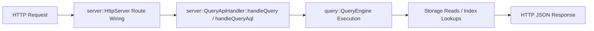
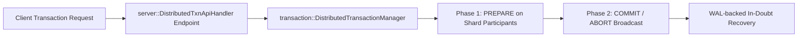
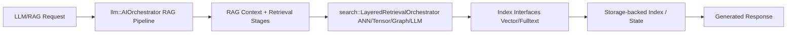
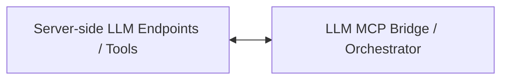

# DATA_FLOW_PATHS

## Scope

This document lists concrete end-to-end data paths and anchors each step to code evidence.

## 1) Standard Query Path (HTTP -> Storage -> Response)

Evidence:
- Route and handler inclusion: `include/server/http_server.h:58`, `include/server/http_server.h:63-64`
- Query entry points: `src/server/query_api_handler.cpp:171`, `src/server/query_api_handler.cpp:684`
- Query engine construction/use: `src/server/query_api_handler.cpp:329`, `src/server/query_api_handler.cpp:877`
- Storage/index access in handler: `src/server/query_api_handler.cpp:185`, `src/server/query_api_handler.cpp:1481`, `src/server/query_api_handler.cpp:2680`
- Query engine storage integration: `src/query/query_engine.cpp:31-34`, `src/query/query_engine.cpp:234-248`

## 2) Distributed Transaction Path (2PC across shards)

Evidence:
- Distributed txn API handler: `src/server/distributed_txn_api_handler.cpp:17`, `src/server/distributed_txn_api_handler.cpp:201-214`
- 2PC protocol contract and phases: `include/transaction/distributed_transaction_manager.h:16-33`
- Runtime phase methods: `src/transaction/distributed_transaction_manager.cpp:346`, `src/transaction/distributed_transaction_manager.cpp:439`, `src/transaction/distributed_transaction_manager.cpp:500`
- Shard RPC prepare/commit protocol: `src/sharding/shard_rpc_client.cpp:304-354`
- Coordinator recovery path: `src/transaction/distributed_transaction_manager.cpp:619-737`
- Boundary validation tests: `tests/cross/test_cross_shard_coordinator.cpp`, `tests/cross/test_cross_shard_ssi.cpp:294-367`

## 3) LLM/RAG Query Path (end-to-end)

Evidence:
- RAG stage trigger and context build: `src/llm/ai_orchestrator.cpp:919`, `src/llm/ai_orchestrator.cpp:1372-1379`
- Layered retrieval orchestrator stage wiring: `src/search/layered_retrieval_orchestrator.cpp:3`, `src/search/layered_retrieval_orchestrator.cpp:9-12`, `src/search/layered_retrieval_orchestrator.cpp:200-215`
- Search to index calls: `src/search/hybrid_search.cpp:14-16`, `src/search/hybrid_search.cpp:189`, `src/search/hybrid_search.cpp:215`
- RAG integration helper contracts (index + storage): `include/rag/rag_integration_helpers.h:15-16`
- Storage index manager + get path: `src/storage/storage_engine.cpp:161-204`, `src/storage/storage_engine.cpp:380-393`

## 4) LLM <-> Server control path

Evidence:
- Server side LLM inclusions: `src/server/http_server.cpp:78-80`, `src/server/http_server.cpp:152-155`
- LLM side server bridge include: `src/llm/mcp_tool_bridge.cpp:15`
