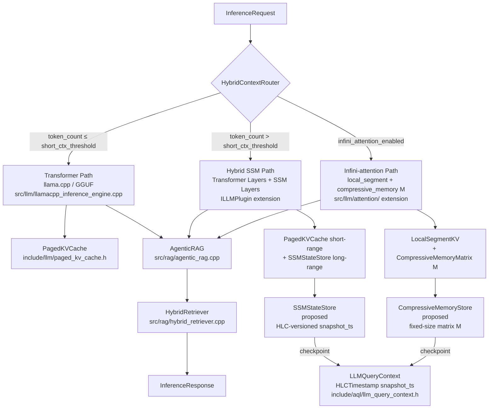

# SSM / Hybrid-Transformer / Infini-attention — Architekturanalyse für ThemisDB

<!-- Status: proposed | branch: copilot/themisdb-ssm-analysis -->
<!-- Links: ssm-hybrid-rollout-plan.md · ../architecture/MODULE_ARCHITECTURE_INDEX.md -->

**Dokument-Typ:** Technische Architekturanalyse (kein Marketingtext)
**Scope:** ThemisDB LLM/Inference/Context/Retrieval-Stack — repository-spezifische
Befunde, Gap-Analyse, Zielarchitektur, Metriken
**Stand:** 2026-07-22
**Autor:** Copilot Coding Agent (Branch `copilot/themisdb-ssm-analysis`)
**Ziel-Branch:** `develop`

> **Assumptions-Marker:** Aussagen, die nicht direkt aus Repository-Code abgeleitet werden
> konnten, sind mit `[ASSUMPTION]` markiert.

---

## Inhaltsverzeichnis

1. [Executive Summary](#1-executive-summary)
2. [Repository-Aufnahme Ist-Zustand](#2-repository-aufnahme-ist-zustand)
3. [Technologiesteckbriefe](#3-technologiesteckbriefe)
4. [Gap-Analyse SSM / Hybrid / Infini-attention](#4-gap-analyse-ssm--hybrid--infini-attention)
5. [Entscheidungstabellen Trade-offs](#5-entscheidungstabellen-trade-offs)
6. [Zielarchitektur ThemisDB-spezifisch](#6-zielarchitektur-themisdb-spezifisch)
7. [State-Lifecycle-Spezifikation](#7-state-lifecycle-spezifikation)
8. [RAG-Strategie und Agentic Memory](#8-rag-strategie-und-agentic-memory)
9. [Metriken und Evaluationsplan](#9-metriken-und-evaluationsplan)
10. [Go / No-Go-Kriterien Phase 1](#10-go--no-go-kriterien-phase-1)
11. [Ära der Context-Agnostizität](#11-ära-der-context-agnostizität)

---

## 1. Executive Summary

ThemisDB betreibt heute einen vollständig llama.cpp-basierten LLM-Stack mit
vLLM-artigem gepagetem KV-Cache, Flash-Attention (CUDA/Vulkan/HIP) und einer
strukturierten RAG-Pipeline. Das System ist tokenbudget-getrieben: jede Anfrage
hält ein fixes Kontextfenster via `ContextWindowBudget`
(`include/llm/context_window_budget.h`), das Speicher- und Latenz-Verhalten
direkt bestimmt.

Drei Architekturtrends konvergieren 2025–2026 auf diesen Stack:

| Technologie | Kernversprechen | Hauptrisiko |
|---|---|---|
| **SSM / Mamba** | Linearkomplexität, konstanter VRAM zur Laufzeit | Kompressionsverlust, schwaches In-Context-Learning |
| **Hybrid Transformer+SSM (Jamba-Muster)** | Präzision lokal + Effizienz langweit | Architekturkomplexität, fehlende GGUF-Unterstützung für Mamba |
| **Infini-attention (Google)** | Unbegrenzte Kontextlänge bei fixem Speicherbudget im Transformer-Block | Komprimiertes Gedächtnismatrix-Drift, Debugging-Opazität |

**Empfehlung:** Weder vollständige SSM-Migration noch Big-Bang-Umbau. Stattdessen
ein **inkrementeller Hybrid-Pfad** in drei Wellen:

1. **Welle A (POC):** Plugin-Schnittstelle für SSM-Backends ohne Kernänderungen
2. **Welle B (Beta):** State-Persistenz-Layer (MVCC-aligned) + Infini-attention als
   Attention-Backend-Variante in Flash-Attention-Pipeline + NVFP4 KV-Quantisierung
3. **Welle C (GA):** Hybrid-Routing, Agentic-Memory-Layer (HEM + RAMN), Reasoning-Density-Telemetrie

Das Kontextfenster-Konzept löst sich nicht auf — es wird zur **commodisierten
Infrastrukturkomponente**. Die neue Differenzierungsgröße ist **Reasoning Density**:
maximale Einsicht bei minimalem Kontext-Footprint.

---

## 2. Repository-Aufnahme Ist-Zustand

### 2.1 LLM-Inferenz-Stack

| Komponente | Pfad | Kernfunktion |
|---|---|---|
| llama.cpp Inference Engine | `src/llm/llamacpp_inference_engine.cpp` | Primäre Inferenz, GGUF-Modelle |
| LlamaWrapper | `src/llm/llama_wrapper.cpp` | Direkt-Wrapper um `llama_kv_cache_clear()`, `llama_get_memory()` |
| InferenceEngineEnhanced | `src/llm/inference_engine_enhanced.cpp` | Caching, Batching, Speculative Decoding |
| AsyncInferenceEngine | `src/llm/async_inference_engine.cpp` | Non-blocking Inferenz |
| EmbeddedLLM | `src/llm/embedded_llm.cpp` | In-Process Low-Latency |
| LLMPluginManager | `src/llm/llm_plugin_manager.cpp` | Plugin-Registry (Singleton) |
| ILLMPlugin-Interface | `include/llm/llm_plugin_interface.h` | Erweiterungspunkt für Backends |

**Beobachtung:** `LlamaWrapper::generateRegular()` ruft explizit
`llama_memory_t mem = llama_get_memory(lctx)` auf und löscht den KV-Cache vor
jeder Inferenz (`llama_kv_cache_clear`). Es gibt keine sitzungsübergreifende
State-Persistenz — jede Anfrage startet bei Token-0.

### 2.2 KV-Cache und Speicher

| Komponente | Pfad | Beschreibung |
|---|---|---|
| PagedKVCache | `include/llm/paged_kv_cache.h`, `src/llm/paged_kv_cache.cpp` | vLLM-Paging, CoW-Prefix-Sharing |
| KVCacheManager (Attention) | `include/llm/attention/kv_cache_manager.h` | Block-Table, Prefix-Sharing |
| KVPrefixTransferManager | `include/llm/kv_prefix_transfer_manager.h` | Shard-übergreifende KV-State-Serialisierung |
| PagedKVCacheManager | `include/llm/paged_kv_cache_manager.h` | Eviction-Policies |
| ContextWindowBudget | `include/llm/context_window_budget.h` | Token-Budget-Berechnung |

**Beobachtung:** `KVPrefixTransferManager` implementiert `IKVStateSerializer`
mit `serialise()` / `modelFingerprint()`. Damit existiert ein Präzedenzfall für
**KV-State-Serialisierung über Knoten hinweg** — dieser Mechanismus ist
wiederverwendbar als Grundlage für SSM-State-Checkpointing.

### 2.3 Attention-Backend

| Komponente | Pfad | Backends |
|---|---|---|
| FlashAttention | `src/llm/attention/flash_attention.cpp` | CUDA SM90/SM86/SM80, Vulkan, HIP MI300/RDNA, CPU |
| FlashAttentionConfig | `include/llm/attention/flash_attention_config.h` | Konfigurationskontrakt |
| CUDA-Kernel | `src/llm/attention/cuda/flash_attention_cuda.cu` | Hopper/Ampere CUDA |

**Beobachtung:** Die Attention-Abstraktionsschicht (`IFlashAttention`) ist
backend-pluggable über `Backend`-Enum. Infini-attention würde hier als neues
Backend `Backend::INFINI_COMPRESSIVE` eingehängt werden.

### 2.4 Prompt- und Kontext-Pipeline

| Komponente | Pfad | Funktion |
|---|---|---|
| PromptManager | `src/llm/prompt_manager.cpp` | Template-Rendering, `getPromptWithContext()` |
| AQLConversationContext | `src/aql/aql_conversation_context.cpp` | Session-History, bounded (`max_history_tokens`) |
| LLMAQLHandler | `src/aql/llm_aql_handler.cpp` | Inferenz-Dispatch, Circuit-Breaker, KV-Prefix-Transfer |
| LLMQueryContext | `include/aql/llm_query_context.h` | MVCC-Snapshot-Träger (`HLCTimestamp snapshot_ts`) |
| ContextWindowBudget | `include/llm/context_window_budget.h` | Budget: system_prompt + query + response tokens |

**Beobachtung:** `AQLConversationContext` verwaltet eine `vector<ChatMessage>`
History mit Token-Limit-Enforcement. Es gibt keine Komprimierung oder
State-Vektorisierung der History — bei großen Verläufen werden einfach ältere
Einträge verworfen.

### 2.5 RAG und Retrieval

| Komponente | Pfad | Funktion |
|---|---|---|
| AgenticRAG | `src/rag/agentic_rag.cpp` | Iterative Retrieval-Loops, session_token_budget |
| HybridRetriever | `src/rag/hybrid_retriever.cpp` | Fusions-Retrieval (dense + sparse) |
| RAGContextAssembler | `src/rag/rag_context_assembler.cpp` | Prompt-Context-Aufbau |
| RAGJudge | `src/rag/rag_judge.cpp` | Faithfulness / Quality-Evaluation |
| KnowledgeGapDetector | `include/rag/agentic_rag.h` | Lücken-Erkennung im Retrieval |

**Beobachtung:** `AgenticRAGConfig.max_session_tokens` begrenzt den
kumulierten Token-Verbrauch pro Run. Der Parameter `quality_threshold = 0.85`
in `AgenticRAGFactory::createAggressive()` deutet auf aktive Qualitätsmessung
hin. RAG ist funktional entkoppelt vom LLM-Backend — dies ist architektonisch
günstig für SSM-Hybride.

### 2.6 Transaktions- und MVCC-Kontext

| Komponente | Pfad | Relevanz |
|---|---|---|
| LLMQueryContext | `include/aql/llm_query_context.h` | HLC-Snapshot für DB-Reads |
| Transaction Manager | `src/transaction/transaction_manager.cpp` | ACID-Lifecycle |
| Distributed TX | `src/transaction/distributed_transaction_manager.cpp` | 2PC/3PC |
| KVPrefixTransferManager | `include/llm/kv_prefix_transfer_manager.h` | KV-State per model_fingerprint |

**Beobachtung:** `LLMQueryContext` verwendet bereits `HLCTimestamp snapshot_ts`
als konsistenten Lesezeitpunkt für alle DB-Zugriffe. Das Konzept lässt sich
direkt auf SSM-State-Snapshots ausdehnen: jeder persistierte Hidden-State
trägt denselben HLC-Zeitstempel wie der zugehörige Retrieval-Snapshot.

---

## 3. Technologiesteckbriefe

### 3.1 State Space Models (SSM) — Mamba-Architektur

**Funktionsprinzip:**
SSMs ersetzen die O(n²) Attention-Matrix durch eine lineare Zustandsrekurrenz:

```
h_t = A · h_{t-1} + B · x_t   (State-Update)
y_t = C · h_t                  (Output-Projektion)
```

`h_t` ist ein fixer Zustandsvektor (Hidden State), unabhängig von der
Sequenzlänge. Mamba ergänzt input-abhängige `A`, `B`, `C`-Matrizen
(selective state spaces) für höhere Ausdrucksstärke.

**Implikationen für ThemisDB:**

| Eigenschaft | Transformer (heute) | SSM / Mamba |
|---|---|---|
| Inferenz-Komplexität | O(n²) Attention | O(n) linear |
| VRAM zur Laufzeit | Wächst mit Sequenzlänge | Konstant (Hidden State) |
| KV-Cache-Bedarf | Stark (paged KV) | Minimal (State-Vektor) |
| Exaktes Kopieren (Fakten) | Stark | Schwach |
| In-Context-Learning | Stark | Schwach |
| Parameteranzahl gleich | Basis | Bis 5× schneller (Inferenz) |

**Wiederverwendbar aus ThemisDB:** `ILLMPlugin`-Interface als Plugin-Punkt,
`InferenceRequest`/`InferenceResponse` als Transport, GPU-Memory-Stack.

### 3.2 Hybrid Transformer+SSM — Jamba-Muster

**Funktionsprinzip:**
Transformer-Schichten wechseln mit Mamba-SSM-Schichten ab (Verhältnisse z. B.
1 Transformer : 7 Mamba-Blöcke in Jamba 1.5). MoE (Mixture-of-Experts) optional.

**Implikation:** Exakt-Recall und In-Context-Learning des Transformers bleiben
für kurze Fenster erhalten; SSM übernimmt die Langzeitverarbeitung.
Effektive Kontextlänge 256 k Token bei ca. 20–30 % des KV-Cache-Bedarfs
eines reinen Transformers gleicher Kapazität. `[ASSUMPTION]`

**Relevanz für ThemisDB:** Der Hybrid-Ansatz ist **die praktisch empfehlenswerteste
Option** für den ThemisDB-Produktionskontext, da er bestehende llama.cpp-Pfade
für den Transformer-Teil erhält.

### 3.3 Infini-attention (Google)

**Funktionsprinzip:**
Ein kompressives Gedächtnismodul (permanente Matrix `M ∈ R^{d_key × d_value}`)
wird direkt in jeden Transformer-Block integriert. Bei jedem neuen Chunk
werden ältere Key-Value-Paare per assoziativer Kompression in `M` geschrieben.
Abfragen kombinieren lokale Attention (KV-Cache der aktuellen Segment-Länge)
mit assoziativem Gedächtnislesen aus `M`.

```
Attention-Output = sigmoid(β) · CompressiveMemory(Q) + (1 - sigmoid(β)) · LocalAttention(Q,K,V)
```

`β` ist ein gelernter Mixing-Parameter pro Head.

**Speichereinsparung:** Bei 1M-Token-Sequenz ~15 GB KV-Cache (klassisch)
→ fixer `M`-Footprint unabhängig von Sequenzlänge (z. B. ~50 MB bei d=256).
`[ASSUMPTION auf Basis publizierter Google-Paper-Angaben]`

**Implikationen für ThemisDB:**

| Eigenschaft | Standard Flash-Attention | Infini-attention |
|---|---|---|
| VRAM-Wachstum | Linear mit Tokens | Konstant (Matrix M) |
| Lokale Präzision | Vollständig | Vollständig (lokales Segment) |
| Langzeitgedächtnis | KV-Eviction-basiert | Kompressiv-assoziativer Speicher |
| Debugging | KV-States inspizierbar | Komprimiert, opak |
| Trainingsaufwand | Standard | Fine-Tuning nötig (Mixing-β) |
| CUDA-Kernel-Anpassung | Vorhanden (`flash_attention_cuda.cu`) | Neuer Kernel erforderlich |

**Relevanz für ThemisDB:** Infini-attention ist **komplementär zu RAG**: Der
komprimierte Langzeitkontext entlastet das Retrieval bei Rolling-Dialogsessions,
während RAG weiterhin präzise Faktenzugriffe liefert.

### 3.4 Agentic Memory — Das Gehirn-Modell

**Konzept:**
2026 hat sich der Fokus von „Fenstergröße" zu „Agentic Memory" verschoben.
Hochentwickelte KI-Agenten nutzen hierarchische Gedächtnisarchitekturen, die
der menschlichen Kognition nachempfunden sind:

```
┌─────────────────────────────────────────────────────────────┐
│                   AGENTIC MEMORY HIERARCHY                   │
│                                                             │
│  L1 — Working Memory (Kontextfenster / Token-Buffer)        │
│       Klein, hochpräzise, flüchtig                          │
│       → Aktuelle Aufgabe / aktueller Dialog-Turn            │
│                                                             │
│  L2 — Episodic Memory (HEM — Hierarchical Episode Memory)   │
│       Komprimierte vergangene Interaktionen                  │
│       → SSM Hidden State / Infini CompressiveMatrix M        │
│                                                             │
│  L3 — Semantic Memory (RAMN — Retrieval-Augmented Memory Net)│
│       Externe Wissensdatenbank; Fakten und Konzepte         │
│       → RAG-Index, Vector Store, Graph-Index                 │
│                                                             │
│  L4 — Procedural Memory                                     │
│       Gelerntes Verhalten (implizit)                        │
│       → LoRA Adapter, Fine-Tuned Weights                    │
└─────────────────────────────────────────────────────────────┘
```

**Leitgedanke:** Das Kontextfenster ist nur noch der **L1-Cache** des Systems.
Wie niemand einen Computer nach seiner L1-Cache-Größe bewertet, wird niemand
einen KI-Agenten nach Token-Zahl beurteilen. Die Effizienz der
**Speicher-Rotation und der Retrieval-Algorithmen** ist entscheidend.

**ThemisDB-Mapping:**

| Memory-Ebene | Konzept | ThemisDB-Komponente | Status |
|---|---|---|---|
| L1 Working Memory | Aktiver Token-Puffer | `ContextWindowBudget` (`include/llm/context_window_budget.h`) | ✅ Vorhanden |
| L2 Episodic Memory (HEM) | Komprimierte Session-History | `AQLConversationContext` History (`src/aql/aql_conversation_context.cpp`) | ⚠️ Vorhanden, aber ohne Komprimierung |
| L2 Episodic (SSM) | SSM Hidden State | `SSMStateStore` (proposed) | ❌ Fehlt |
| L3 Semantic Memory (RAMN) | RAG-Wissensbasis | `AgenticRAG` + `HybridRetriever` (`src/rag/`) | ✅ Vorhanden |
| L3 Semantic (Vektor) | Vector-Index | `PagedKVCache` + Embedding-Pipeline | ✅ Vorhanden |
| L4 Procedural | Fine-Tuned Modell | `MultiLoRAManager`, `InlineTrainingEngine` | ✅ Vorhanden |

**Implikation für die Architektur:** Die Zielarchitektur von ThemisDB muss
nicht primär das L1-Fenster vergrößern, sondern die **Übergänge zwischen den
Ebenen** effizient managen: L1 → L2 (State-Compaction), L2 ↔ L3 (Drift-triggered
Retrieval), L3 → L1 (Precision-Retrieval). Dies ist die eigentliche
Differenzierungsaufgabe.

### 3.5 FlashAttention-3, Ring Attention und NVFP4 KV-Quantisierung

**Kontext:** Diese Technologien beseitigen die *Knappheit* von Speicherressourcen
für Kontexte — Kontextfenster werden dadurch zur **commodisierten
Infrastrukturkomponente**.

#### 3.5.1 FlashAttention-3 (FA3)

**Funktionsprinzip:** FA3 führt Attention-Berechnungen in kleinen Kacheln direkt
im schnellen SRAM (Shared Memory) der GPU durch, ohne vollständige Matrizen in
HBM (High Bandwidth Memory) zu materialisieren. Spezifische Optimierungen für
Hopper (SM90) via Tensor Memory Accelerator (TMA) und WGMMA-Instruktionen.

**ThemisDB-Ist-Zustand:** Flash-Attention-Infrastruktur bereits vorhanden:
- `src/llm/attention/flash_attention.cpp` — Backend-Dispatch
- `src/llm/attention/cuda/flash_attention_cuda.cu` — CUDA SM90/SM86/SM80-Kernels
- `include/llm/attention/flash_attention.h` — `Backend::CUDA_SM90` (Hopper) bereits als Enum-Wert

**Gap:** SM90 Hopper-Pfad in `flash_attention_cuda.cu` — unklar ob FA3-spezifische
WGMMA/TMA-Instruktionen bereits genutzt werden. Verifikation und ggf. Upgrade
auf FA3-API erforderlich. (GAP-FA3-01)

#### 3.5.2 Ring Attention

**Funktionsprinzip:** Sequenz wird segmentweise auf N GPUs verteilt, die Ring-artig
kommunizieren. Ermöglicht theoretisch unbegrenzte Sequenzlängen bei O(N)-VRAM-Skalierung.
100M-Token-Kontexte bei ausreichend GPU-Knoten realisierbar. `[ASSUMPTION]`

**ThemisDB-Ist-Zustand:** `IFederatedInferenceBackend`
(`include/llm/i_federated_inference_backend.h`) und `FederatedInferenceCoordinator`
bieten Multi-Node-Infrastruktur. Ring-Attention-Koordination fehlt als spezifisches
Kommunikationsprotokoll.

**Relevanz:** Für die meisten ThemisDB-Anwendungsfälle (Dokumente, Dialog-Sessions)
sind 100k-Token-Kontexte ausreichend. Ring Attention ist relevant für
**spezifische Enterprise-Szenarien** (z. B. vollständige Codebase-Analyse,
Langzeit-Agenten-Sessions). Kein Priorisierungsbedarf für Phase 1.

#### 3.5.3 NVFP4 KV-Cache-Quantisierung

**Funktionsprinzip:** Key-Value-Cache auf 4-Bit (NVFP4) komprimiert. Halbiert
den KV-Cache-Speicherbedarf bei gemäß Nvidia-Benchmarks vernachlässigbarem
Genauigkeitsverlust (< 1 % auf Standard-Benchmarks). PagedAttention verwaltet
quantisierten Cache wie virtuellen Speicher.

**ThemisDB-Ist-Zustand:**
- `MixedPrecisionInference` (`include/llm/mixed_precision_inference.h`) — FP16/BF16/INT8 vorhanden
- `PagedKVCache` (`include/llm/paged_kv_cache.h`) — Paging-Infrastruktur vorhanden
- `ModelQuantizationPipeline` (`include/llm/model_quantization_pipeline.h`) — Post-Training-Quantisierung

**Gap:** NVFP4 (4-Bit) für KV-Cache ist noch nicht separat von Modell-Gewichte-
Quantisierung abgebildet. `PagedKVCache::Config` hat kein `kv_quantization_bits`-Feld.
(GAP-QUANT-01)

**Implikation:** KV-Cache-Quantisierung auf 4-Bit würde bei gleichem VRAM-Budget
die effektive Sequenzlänge **verdoppeln** — ohne neue Modellarchitektur. Dies ist
kurzfristig der günstigste Hebel für Long-Context-Unterstützung in ThemisDB.

### 4.1 Wiederverwendbare Komponenten

| Komponente | Pfad | Reuse-Potential | Begründung |
|---|---|---|---|
| `ILLMPlugin` | `include/llm/llm_plugin_interface.h` | ✅ Hoch | Plugin-Punkt für neues SSM/Hybrid-Backend |
| `LLMPluginManager` | `include/llm/llm_plugin_manager.h` | ✅ Hoch | Plugin-Registry ohne Umbau nutzbar |
| `InferenceRequest`/`Response` | `include/llm/llamacpp_inference_engine.h` | ✅ Hoch | Stabiler Transport-Kontrakt |
| `KVPrefixTransferManager` | `include/llm/kv_prefix_transfer_manager.h` | ✅ Mittel | Serialisierungs-Präzedenz für SSM-State |
| `IFlashAttention` | `include/llm/attention/flash_attention.h` | ✅ Mittel | Backend-Enum erweiterbar für Infini |
| `GPU-Memory-Stack` | `include/llm/gpu_memory_manager.h` etc. | ✅ Hoch | VRAM-Allokation wiederverwendbar |
| `LLMQueryContext` (HLC) | `include/aql/llm_query_context.h` | ✅ Hoch | Snapshot-Semantik für State-Versionierung |
| `ContextWindowBudget` | `include/llm/context_window_budget.h` | ⚠️ Anpassen | Muss State-Quality-Metriken ergänzen |
| `AgenticRAG` | `src/rag/agentic_rag.cpp` | ✅ Hoch | RAG-Funnel bleibt zentral, Backend-unabhängig |

### 4.2 Strukturelle Lücken

#### GAP-SSM-01: Keine persistente State-Verwaltung
**Betroffene Stellen:**
- `src/llm/llama_wrapper.cpp`: KV-Cache-Clear vor jeder Inferenz
- `src/aql/aql_conversation_context.cpp`: History als flacher `vector<ChatMessage>`, ohne Verdichtung

**Lücke:** Es gibt keinen Mechanismus, den Hidden State eines SSM-Modells
sitzungsübergreifend zu speichern, versionieren oder reaktivieren.

**Proposal:** `SSMStateStore` — neues Interface (analog zu `IKVStateSerializer`)
mit `persist(session_id, state)`, `resume(session_id)`, `invalidate(session_id)`.
Bindung an HLC-Snapshot via `LLMQueryContext`.

#### GAP-SSM-02: Kein State-Lifecycle-Policy-Framework
**Betroffene Stellen:**
- `include/llm/context_window_budget.h`: Nur Tokenanzahl, keine Qualitätsmetriken
- `include/llm/token_quota_manager.h`: Quota, kein TTL/Compaction-Support

**Lücke:** Es fehlen Policies für: State-TTL, State-Compaction-Trigger,
Rehydration aus Faktenspeicher/Vector-Index bei State-Korruption.

#### GAP-SSM-03: Keine Infini-attention CUDA/Vulkan-Implementierung
**Betroffene Stelle:** `src/llm/attention/` — Flash-Attention-Backends für
klassische Attention, keine Compressive-Memory-Matrix-Unterstützung.

**Lücke:** Neuer CUDA-Kernel für assoziatives Gedächtnisschreiben/-lesen +
`Backend::INFINI_COMPRESSIVE` Enum-Wert in `flash_attention.h`.

#### GAP-SSM-04: Fehlende State-Retention-Metriken
**Betroffene Stellen:**
- `src/llm/grafana_metrics.cpp` — Inferenz-/Speicher-Metriken
- `src/rag/rag_judge.cpp` — Faithfulness-Evaluierung

**Lücke:** Keine Metriken für `state_retention_score`, factual drift rate,
recovery cost. Die RAGJudge misst Faithfulness gegen abgerufene Dokumente,
nicht gegen komprimierten State.

#### GAP-SSM-05: Kein Hybrid-Routing für Transformer vs. SSM
**Betroffene Stelle:** `src/llm/model_router.cpp` — Request-to-Modell-Routing
nach Modell-ID, keine kontextlängen-adaptierte Architekturwahl.

**Lücke:** Kein Mechanismus, der basierend auf `session_token_count` oder
`context_quality_score` zwischen Transformer (Kurz-Kontext) und SSM-Hybrid
(Lang-Kontext) umschaltet.

#### GAP-SSM-06: AQLConversationContext ohne State-Verdichtung
**Betroffene Stelle:** `src/aql/aql_conversation_context.cpp` — History wird
bei Überschreitung von `max_history_tokens` schlicht verworfen (FIFO-Drop).

**Lücke:** Kein summarization-basiertes oder SSM-state-basiertes Verdichtungs-
backend für lange Dialoge. Im Agentic-Memory-Modell fehlt der L1→L2-Übergang.

#### GAP-SSM-07: Fehlende L2/L3-Speicher-Rotation (Agentic Memory)
**Betroffene Stellen:**
- `include/rag/agentic_rag.h` (`KnowledgeGapDetector`) — reagiert auf Retrieval-Lücken,
  nicht auf L2-State-Drift
- `include/llm/llm_interaction_store.h` — Episodic-Store vorhanden, aber nicht mit
  L1-Working-Memory verbunden

**Lücke:** Kein automatischer Übergang von L1 Working Memory zu L2 Episodic Memory
(Komprimierung) und kein Drift-getriggerter L3-Retrieval (RAG refresh). Die vier
Gedächtnisebenen sind heute unverbunden.

#### GAP-FA3-01: Flash-Attention-3 SM90-Kernel-Verifikation
**Betroffene Stelle:** `src/llm/attention/cuda/flash_attention_cuda.cu` —
`Backend::CUDA_SM90` Enum-Wert vorhanden, aber unklar ob FA3-spezifische
TMA/WGMMA-Instruktionen bereits genutzt werden.

**Lücke:** Verifikation ob Hopper-Pfad FA3 (Tensor Memory Accelerator + WGMMA)
nutzt oder nur FA2-kompatiblen Code auf SM90 ausführt. Potenziell 1.5–2×
Durchsatzgewinn verfügbar.

#### GAP-QUANT-01: Fehlende NVFP4 KV-Cache-Quantisierung
**Betroffene Stelle:** `include/llm/paged_kv_cache.h` — `PagedKVCache::Config`
hat kein Quantisierungs-Feld; `MixedPrecisionInference` quantisiert Modell-Gewichte,
nicht KV-Cache.

**Lücke:** Dedizierte KV-Cache-Quantisierung auf 4-Bit fehlt. Bei gleichem VRAM-Budget
würde NVFP4 die effektive Sequenzlänge verdoppeln — **günstigster kurzfristiger Hebel**.

### 4.3 Risikokatalog

| Risiko | Schwere | Wahrscheinlichkeit | Mitigation |
|---|---|---|---|
| **Kompressionsverlust** (SSM/Infini): kritische Fakten werden komprimiert verloren | Hoch | Mittel | Hybrid-Architektur hält Transformer für Kurz-Kontext; RAG liefert Fakten on-demand |
| **Factual Drift** über lange Horizonte | Mittel | Hoch | Drift-Metriken + periodische RAG-Reankerage |
| **Exaktes Kopieren / Exact-Recall-Schwäche** bei reinen SSMs | Hoch | Hoch | Transformer-Anteile behalten (Hybrid); RAG als Rückfallpfad |
| **Debuggability** kompressiver Gedächtniszustände | Mittel | Hoch | State-Serialisierung + Inspection-API; Audit-Log |
| **Reproduzierbarkeit** bei State-Resume | Hoch | Mittel | HLC-Snapshot-Bindung; deterministische State-Checkpoints |
| **GGUF-Ökosystem-Lücke**: Mamba-Modelle in llama.cpp nur partiell unterstützt | Mittel | Hoch | Plugin-Abstraktionsschicht; ggml-Tensor-Bridge statt GGUF |
| **VRAM-Footprint** Mixed-Precision Hybrid-State | Mittel | Mittel | `AdaptiveVRAMAllocator` nutzen; State-Paging |
| **Trainingsaufwand** Infini-attention β-Fine-Tuning | Mittel | Hoch | Initialer POC ohne Fine-Tuning via simulated compressive memory |
| **Lost in the Middle** bei sehr langen Kontexten | Hoch | Hoch | Agentic Memory Rotation; RAG-Precision statt Brute-Force-Kontext |
| **NVFP4-Quantisierungsfehler** in KV-Cache | Niedrig | Gering | Kalibrierung + Regressionstest gegen FP16-Baseline |

---

## 5. Entscheidungstabellen Trade-offs

### 5.1 Architektur-Optionen im Vergleich

| Option | Ansatz | VRAM-Effizienz | Präzision | Impl.-Aufwand | Empfehlung |
|---|---|---|---|---|---|
| **A: Status quo** | Transformer + Paged KV | Mittel | ✅ Hoch | 0 | Basis / kein Umbau |
| **A+: NVFP4 KV-Quant** | Paged KV + 4-Bit-Cache | ✅ 2× Effizienz | ✅ Hoch | Gering | **Schnellster Gewinn** |
| **B: SSM-Backend (rein)** | Mamba via ILLMPlugin | ✅ Hoch | ⚠️ Eingeschränkt | Mittel | POC-geeignet, kein Prod |
| **C: Hybrid (Jamba-Muster)** | Transformer kurz + SSM lang | ✅ Hoch | ✅ Hoch | Hoch | **Empfohlen für Beta** |
| **D: Infini-attention** | Kompressives Gedächtnis im Transformer-Block | ✅ Hoch | ✅ Hoch | Mittel-Hoch | **Empfohlen parallel zu C** |
| **E: Agentic Memory (L1+L2+L3)** | Working+Episodic+Semantic Memory Layer | ✅✅ Maximal | ✅✅ Maximal | Hoch | **Langfristig-Ziel** |

### 5.2 State-Persistenz-Optionen

| Option | Speicherort | MVCC-Konformität | Aufwand | Risiko |
|---|---|---|---|---|
| In-Memory only | Worker-Thread | ❌ Nein | Gering | Verlust bei Absturz |
| RocksDB-Serialisierung | Existing Storage | ✅ Ja | Mittel | Latenz |
| Dedizierter SSM-State-Store | Neuer Subsystem | ✅ Ja | Hoch | Überkomplex |
| KVPrefixTransferManager-Erweiterung | `src/llm/kv_prefix_transfer_manager.cpp` | ✅ Ja | **Gering** | — |

**Entscheidung:** Erweiterung des bestehenden `KVPrefixTransferManager`-Musters
um SSM-State-Serialisierung. Minimale Invasivität, Präzedenz vorhanden.

### 5.3 Attention-Backend-Strategie für Infini-attention

| Option | Aufwand | VRAM-Reduktion | Backward-Kompatibilität |
|---|---|---|---|
| Neues CUDA-Kernel-Backend | Hoch | ✅ Sehr hoch | ✅ ja (Enum-Erweiterung) |
| CPU-Fallback-Simulation | Gering | ❌ Keine | ✅ ja | 
| Pytorch/ONNX-Bridge | Mittel | ✅ Mittel | ⚠️ zusätzliche Dep |
| Flash-Attention v4-Integration | Mittel | ✅ Hoch | ✅ ja |

**Empfehlung für POC:** CPU-Fallback-Simulation für Infini-attention
(validiert Datenfluss ohne CUDA-Kernel). Vollständige CUDA-Implementierung in
Beta-Phase.

---

## 6. Zielarchitektur ThemisDB-spezifisch

### 6.1 Datenflussdiagramm



### 6.2 Neuer Layer: `SSMStateStore` (proposed)

**Pfad (proposed):** `include/llm/ssm_state_store.h`, `src/llm/ssm_state_store.cpp`

```cpp
// PROPOSED INTERFACE (not yet implemented)
// Integration Point: extends IKVStateSerializer pattern from
//   include/llm/kv_prefix_transfer_manager.h

namespace themis::llm {

/// Lifecycle state for an SSM hidden state
enum class SSMStateStatus {
    ACTIVE,       ///< Being updated per token/chunk
    CHECKPOINTED, ///< Serialized to storage, HLC-versioned
    EVICTED,      ///< Removed from memory, still on disk
    INVALIDATED,  ///< Marked stale; must be re-initialized
    EXPIRED,      ///< TTL exceeded; scheduled for compaction
};

/// Per-session SSM hidden state carrier.
/// Binds to LLMQueryContext::snapshot_ts for MVCC consistency.
struct SSMStateSnapshot {
    std::string session_id;
    HLCTimestamp snapshot_ts;        ///< From LLMQueryContext
    std::vector<float> hidden_state; ///< Flattened state vector h_t
    size_t token_position;           ///< Last token position processed
    SSMStateStatus status;
    std::chrono::steady_clock::time_point last_updated;
};

/// Interface for SSM state persistence.
/// Proposed implementation backed by KVPrefixTransferManager or RocksDB.
struct ISSMStateStore {
    virtual ~ISSMStateStore() = default;

    /// Persist or update a state snapshot.
    virtual bool checkpoint(const SSMStateSnapshot& snap) = 0;

    /// Resume a state by session_id at or before max_ts.
    virtual std::optional<SSMStateSnapshot> resume(
        const std::string& session_id,
        HLCTimestamp max_ts) = 0;

    /// Invalidate state (e.g., after context corruption detected).
    virtual void invalidate(const std::string& session_id) = 0;

    /// Compact expired/evicted states.
    virtual size_t compact(std::chrono::seconds ttl) = 0;
};

} // namespace themis::llm
```

### 6.3 Neuer Layer: `HybridContextRouter` (proposed)

**Pfad (proposed):** `include/llm/hybrid_context_router.h`

**Routing-Logik:**
```
if (session_token_count ≤ short_ctx_threshold AND infini_disabled):
    → Transformer Path (existing llamacpp_inference_engine)
elif (infini_attention_enabled AND session_token_count ≤ infini_capacity):
    → Infini-attention Path (existing Flash-Attention + CompressiveMemory extension)
elif (ssm_hybrid_available):
    → Hybrid SSM Path (new ILLMPlugin)
else:
    → Transformer Path (fallback, FIFO-Window-Truncation wie heute)
```

**Integration:** `LLMAQLHandler::executeInfer()` in
`src/aql/llm_aql_handler.cpp` ruft aktuell direkt die Plugin-Registry auf.
Der Router wird vor diesem Aufruf eingehängt.

### 6.4 Erweiterung: `ContextWindowBudget` → `ContextQualityBudget` (proposed)

```cpp
// PROPOSED addition to include/llm/context_window_budget.h
struct ContextQualityMetrics {
    float state_retention_score = 1.0f; ///< [0,1] Estimated compression quality
    float factual_drift_estimate = 0.0f; ///< Drift proxy since last RAG retrieval
    size_t tokens_since_last_retrieval = 0; ///< RAG freshness indicator
};
```

---

## 7. State-Lifecycle-Spezifikation

Für SSM-Hidden-State und Infini-attention Compressive Memory Matrix:

### 7.1 Lebenszyklus-Zustände

```
UNINITIALIZED
      │ init(session_id, model_id)
      ▼
   ACTIVE ─────────── update(token/chunk) ──► ACTIVE
      │
      │ checkpoint_trigger
      ▼
 CHECKPOINTED ◄──────────────────────────────┐
      │                                       │
      │ evict(memory_pressure)               resume(session_id)
      ▼                                       │
  EVICTED ─────────────────────────────────►─┘
      │
      │ TTL_exceeded OR drift_score > threshold
      ▼
 INVALIDATED
      │
      │ compact()
      ▼
    DELETED
```

### 7.2 Trigger-Definitionen

| Trigger | Bedingung | Quelle |
|---|---|---|
| `init` | Neue Session, kein State gefunden | `SSMStateStore::resume()` → None |
| `update` | Token/Chunk verarbeitet | Nach jedem `llama_decode` Aufruf |
| `checkpoint` | Alle N Chunks ODER Sequenz-Ende ODER Session-Suspend | Konfigurierbar, default N=128 |
| `evict` | GPU/CPU-Memory-Druck über Schwellwert | `AdaptiveVRAMAllocator` Signal |
| `resume` | Session-Resume-Request | `AQLConversationContext::reset()` Extension |
| `invalidate` | `factual_drift_estimate > drift_threshold` ODER Modell-Wechsel | Metric-Callback |
| `compact` | `TTL > ssm_state_ttl` | Background-Worker |

### 7.3 MVCC-Bindung

Jeder `SSMStateSnapshot` trägt denselben `HLCTimestamp snapshot_ts` wie der
korrespondierende `LLMQueryContext`. Dadurch gilt:

- DB-Retrieval und SSM-State referenzieren **denselbe Version** der Faktenbasis
- State-Resume nach Neustart wählt via `max_ts` den letzten konsistenten
  Checkpoint vor Absturz
- Compaction respektiert MVCC-Snapshots (kein Löschen aktiver Snapshots)

### 7.4 Compaction-Policy

```
compaction_interval = 15min  (configurable)
ssm_state_ttl       = 4h     (configurable)
max_states_per_user = 16     (configurable)
drift_threshold     = 0.3    (configurable, factual_drift_estimate)
```

---

## 8. RAG-Strategie und Agentic Memory

### 8.1 Warum RAG strategisch dominant bleibt

Der Irrtum „große Kontextfenster machen RAG überflüssig" übersieht drei
fundamentale Enterprise-Anforderungen:

| Anforderung | Long-Context LLM (SSM/Infini) | RAG |
|---|---|---|
| **Aktualität** | Trainings-Cutoff limitiert | ✅ Live-Daten via Retrieval |
| **Quellenattribution** | ❌ Keine | ✅ Dokumentenreferenz |
| **Datenschutz / Tenantenisolation** | ❌ Im Modell komprimiert | ✅ Daten bleiben in DB |
| **Skalierbarkeit der Wissensbasis** | ❌ Neutraining/Fine-Tuning | ✅ Index-Update |
| **Rechtliche Nachvollziehbarkeit** | ⚠️ Opak | ✅ Audit-Trail via RAGJudge |
| **Kosten bei Spezialwissen** | Hoch (Modellgröße) | ✅ Kleines Modell + Retrieval |

**Fazit für ThemisDB:** RAG bleibt das **primäre Faktensicherungs-System**.
SSMs und Infini-attention ergänzen es durch effizienteren Long-Session-State.

### 8.2 Synergiemodell RAG + SSM/Infini

```
Session-Start:
  SSM/Infini-State = UNINITIALIZED
  RAG liefert Primärkontext (erste Abfrage)

Rolling-Dialog:
  SSM/Infini-State aktualisiert sich per Chunk (Low-Cost)
  RAG-Retrieval nur bei Wissens-Gap-Signal (KnowledgeGapDetector)

Langzeit-Session:
  SSM/Infini komprimiert gesamten Dialog-Verlauf
  RAG liefert präzise Fakten on-demand (exact-recall-Kompensation)
  AgenticRAG.max_session_tokens kontrolliert gesamten Token-Verbrauch

State-Expiry / Invalidierung:
  Drift-Detektor löst proaktive RAG-Abfrage aus (Refresh)
  Neuer HLC-Snapshot, State-Reinitialisierung
```

**Konkrete Integration:**
- `AgenticRAGConfig.max_session_tokens` (`include/rag/agentic_rag.h`) bleibt
  maßgeblich für Gesamt-Budgetkontrolle
- `KnowledgeGapDetector` (`include/rag/agentic_rag.h`) wird SSM-State-Drift-Metrik
  als zusätzliches Signal erhalten
- `RAGJudge` evaluiert Faithfulness gegen State-Summary (nicht nur Retrieval-Docs)

### 8.3 Agentic Memory — Vollständige Architektur

Langfristig konvergieren SSM-State und RAG-Index zu einem vollständigen
**Agentic Memory Layer** nach dem Gehirn-Modell:

| Ebene | Speichertyp | Mechanismus | Persistenz | Aktualisierung | ThemisDB-Status |
|---|---|---|---|---|---|
| **L1** | Working Memory | SSM Hidden State / Infini CompressiveMatrix / Token-Buffer | Session-flüchtig | Per Token/Chunk | ⚠️ Nur Token-Buffer |
| **L2** | Episodic Memory (HEM) | Komprimierte Session-Episoden | Dauerhaft | Session-Ende / State-Compaction | ⚠️ `LLMInteractionStore` ohne Komprimierung |
| **L3** | Semantic Memory (RAMN) | Vector-Index + Graph-Index (RAG) | Dauerhaft | Batch-Ingestion | ✅ `AgenticRAG` + `HybridRetriever` |
| **L4** | Procedural Memory | LoRA-Adapter, Fine-Tuned Weights | Modell-persistent | Offline Training | ✅ `MultiLoRAManager`, `InlineTrainingEngine` |

**Leitprinzip:** Das Kontextfenster (L1) ist nur der **L1-Cache** des Systems.
Die eigentliche Differenzierung liegt in der Effizienz der Übergänge:
- **L1 → L2** (State-Compaction): Wann wird Working Memory zu Episodic-Episode?
- **L2 ↔ L3** (Drift-triggered Retrieval): Wann ist komprimierter State zu unzuverlässig?
- **L3 → L1** (Precision-Retrieval): Welche Fakten werden just-in-time geladen?

**Fehlende Verbindungen in ThemisDB:**
```
TODAY:   L1 (token-buffer) ─────────── L3 (RAG, on demand)
         L2 (interaction store, disconnected)  L4 (LoRA, offline)

TARGET:  L1 ──compaction──► L2 ──drift-signal──► L3 ──retrieval──► L1
         L4 (fine-tuning feedback loop from L2 episodes)
```

**Konkrete Integration:**
- `AgenticRAGConfig.max_session_tokens` (`include/rag/agentic_rag.h`) bleibt
  maßgeblich für L1/L3-Budgetkontrolle
- `KnowledgeGapDetector` (`include/rag/agentic_rag.h`) wird SSM-State-Drift-Metrik
  als L2-Degradationssignal erhalten
- `RAGJudge` evaluiert Faithfulness auch gegen L2-State-Summary
- `LLMInteractionStore` (`include/llm/llm_interaction_store.h`) erhält
  Komprimierungs-Hook für L2-Episoden-Verdichtung

### 8.4 Sektor-spezifische Implikationen

Technische Möglichkeiten müssen gegen sektorspezifische Anforderungen validiert
werden. Die Analyse zeigt, warum Brute-Force-Kontextfenster in der Praxis versagen:

#### Finanzsektor: Präzision vor Volumen

**Szenario:** Analyst vergleicht tausende Berichte.

| Ansatz | Problem | ThemisDB-Empfehlung |
|---|---|---|
| Alles in langen Kontext laden | Nuancen in der Mitte verloren; Zahlen-Halluzinationen | ❌ Nicht empfohlen |
| RAG + moderater Kontext | 50 relevante Passagen aus 10k Docs präzise synthetisiert | ✅ Bevorzugt |
| SSM-Long-History + RAG | Dialog-Historie effizient; Fakten via RAG präzise | ✅ Zielarchitektur |

**Prinzip:** Das Kontextfenster dient als **Lupe**, nicht als **Archiv**.
ThemisDB `AgenticRAG` mit `createAggressive()` (`quality_threshold=0.85`) entspricht
genau diesem Muster.

#### Medizin und Recht: Die Haftungsfalle

**Szenario:** Kontraindikation in 500-seitiger Patientenakte; rechtliche Compliance-Prüfung.

| Risiko | Technischer Grund | Mitigation |
|---|---|---|
| Übersehen kritischer Details | „Lost in the Middle"-Phänomen bei vollem Kontext | Spezialisierte Extraktion via RAG-Segmente |
| Genauigkeitsverlust > 80 % bei Max-Kontext | Attention-Verdünnung über lange Sequenzen | Kleinere Segmente mit 100 % Precision |
| Haftungsrisiko bei Halluzination | LLM-Ausgabe ohne Quellenattribution | `RAGJudge` Faithfulness-Gate + Audit-Trail (`AIDecisionAuditor`) |

**ThemisDB-Bezug:** `AIDecisionAuditor` (`include/llm/ai_decision_auditor.h`) und
`LLMModelAuditLogger` sind im LLM-Modul bereits vorhanden — dies ist ein
klarer Differenzierungsvorteil für regulierte Sektoren.

#### Software-Entwicklung: Strukturierte Komplexität

**Szenario:** Codebase-Analyse, Impact von Änderungen über Dateigrenzen.

| Ansatz | Einschränkung | Besser |
|---|---|---|
| Ganzes Repository in Kontext | Graph-basierte Abhängigkeiten flach im Token-Stream | Graph-RAG mit explizitem Entitäten/Beziehungsindex |
| Transformer-Fenster für Code | Referentielle Struktur (A → Z Abhängigkeit) schwer erfassbar | `distributed_knowledge` Graph-Index |
| SSM für Code-History | Komprimierung von Code-State verlustbehaftet | Transformer für lokalen Code-Ausschnitt + Graph-RAG für Impact |

**ThemisDB-Bezug:** `COPILOT_THEMISDB_GRAPH_RAG_BACKEND_ARCHITECTURE.md` in
`docs/architecture/` adressiert genau diesen Graph-RAG-Anwendungsfall.

### 8.5 Synergiemodell RAG + SSM/Infini (operativ)

```
Session-Start:
  L1 = UNINITIALIZED; L2 = evicted/resumed via SSMStateStore
  L3 (RAG) liefert Primärkontext (erste Abfrage)

Rolling-Dialog (Low-Cost-Pfad):
  L1 SSM/Infini-State aktualisiert sich per Chunk
  L3 RAG-Retrieval nur bei KnowledgeGapDetector-Signal

Langzeit-Session (Qualitätssicherung):
  L1→L2 Compaction bei Token-Schwelle
  L2 Drift-Score > threshold → L3 RAG-Refresh
  AgenticRAG.max_session_tokens: Budget-Gesamt-Kontrolle

State-Expiry / Invalidierung:
  Drift-Detektor löst proaktive L3-Abfrage aus
  Neuer HLC-Snapshot; L1 neu initialisiert aus L2+L3
```

---

## 9. Metriken und Evaluationsplan

### 9.1 KPI-Definitionen

| KPI | Einheit | Messmethode | Ziel |
|---|---|---|---|
| `latency_p99_vs_sequence_length` | ms | Benchmark-Sweep 1k..256k Token | Flachkurve bei SSM (vs. quadratisch bei Transformer) |
| `vram_footprint_per_session` | MB | GPU-Profiler bei N Sessions | ≤ Baseline bei 4× Sequenzlänge |
| `factual_recall@k` | % | RAGJudge gegen Ground-Truth-QA | ≥ 85 % (Threshold aus `createAggressive()`) |
| `state_drift_indicator` | [0,1] | Semantische Ähnlichkeit State-Summary vs. Original | < 0.3 (`drift_threshold`) |
| `throughput_tokens_per_second` | tok/s | Continuous-Batch-Benchmark | ≥ Transformer-Baseline |
| `ssm_state_checkpoint_latency` | ms | Checkpoint-to-Storage | ≤ 10 ms (p99) |
| `rag_retrieval_triggered_rate` | % | Gap-Detector-Trigger / Session | Informativ |
| `compaction_overhead` | % CPU | Background-Worker-Profil | ≤ 2 % |
| **`reasoning_density`** | korrekte Antworten / kToken | QA-Score / Kontext-Tokens | Steigt mit Architektur-Reife |
| `lost_in_middle_rate` | % Fehlantworten | Position-bewusste QA-Evaluation | ≤ 5 % bei zentralen Fakten |
| `memory_rotation_efficiency` | L1→L2 Compaction-Qualität | Semantic similarity pre/post | ≥ 0.85 |
| `kv_cache_quantization_accuracy_delta` | % | FP16 vs NVFP4 Benchmark | ≤ 1 % Differenz |

### 9.2 Benchmark-Design

#### Kleiner Benchmark (CI-fähig)
```
Sequenzlängen: 512, 2048, 8192 Token
Sessions: 10 parallel
Modell: 7B quantisiert (Q4_K_M)
Metriken: latency_p99, vram_footprint
Tool: Google Benchmark (kompatibel mit Wave-1-Hygiene in bench_fixtures.h)
Seed: kCanonicalRngSeed = 42 (aus benchmarks/bench_fixtures.h)
```

#### Mittlerer Benchmark
```
Sequenzlängen: 1k, 32k, 128k Token
Sessions: 50 parallel
Modell: 13B quantisiert
Metriken: alle KPIs (9.1)
Vergleich: Transformer-Baseline vs. SSM-Plugin vs. Infini-attention
Profil: benchmarks/wave3_workload_profiles.json kompatibel
```

#### Großer Benchmark (Release-Gate)
```
Sequenzlängen: 256k Token (Jamba-Effektivkontext)
RAG-Dokumente: 10k Chunks im Index
Sessions: 200 parallel
Factual QA: 500 Fragen mit Ground-Truth
Metriken: alle KPIs + factual_recall@5 + drift_indicator
CI-Gate: Wave-7-Manifest-kompatibel (release_gate_manifest_w7.json)
```

### 9.3 Telemetrie-Erweiterungen

**Neue Prometheus-Metriken (proposed):**
```
themis_ssm_state_checkpoints_total          counter
themis_ssm_state_resumes_total              counter
themis_ssm_state_invalidations_total        counter
themis_ssm_compressive_memory_size_bytes    gauge (per session)
themis_factual_drift_score                  histogram (buckets: 0.0..1.0)
themis_hybrid_router_decision{path}         counter (transformer/ssm/infini)
themis_infini_memory_utilization_ratio      gauge
themis_reasoning_density_score             histogram
themis_memory_rotation_l1_to_l2_total      counter
themis_kv_cache_quantization_precision_delta histogram
```

**Integration:** `src/llm/grafana_metrics.cpp` erweitern (Muster vorhanden).

---

## 10. Go / No-Go-Kriterien Phase 1 (POC)

Phase 1 definiert den minimalen Proof-of-Concept: SSM als `ILLMPlugin` +
State-Persistenz-Skeleton + Infini-attention CPU-Fallback.

### Go-Kriterien (alle müssen erfüllt sein)

| Kriterium | Messbar | Nachweis |
|---|---|---|
| **G-01** SSM-Backend via `ILLMPlugin` registrierbar | `LLMPluginManager::registerPlugin()` akzeptiert neues Plugin | Unit-Test |
| **G-02** `SSMStateSnapshot` serialisierbar/deserialisierbar | Round-Trip über `IKVStateSerializer`-Muster verlustfrei | Unit-Test |
| **G-03** HLC-Bindung: `snapshot_ts` in State-Snapshot enthalten | State-Resume wählt korrekten Checkpoint | Integration-Test |
| **G-04** Infini-attention CPU-Fallback korrekt | CompressiveMemory-Schreib-/Lese-Logik validiert | Unit-Test |
| **G-05** `factual_drift_indicator`-Metrik verfügbar | Prometheus-Export in Grafana sichtbar | Smoke-Test |
| **G-06** Kein Regression in Transformer-Baseline | `latency_p99` ≤ +5 % gegenüber Prä-POC-Baseline | kleiner Benchmark |
| **G-07** Bestehende Wave-5/6/7-Tests grün | `ctest -L release_critical` vollständig grün | CI-Gate |

### No-Go-Bedingungen

| Bedingung | Aktion |
|---|---|
| **N-01** GGUF-Ökosystem unterstützt kein Mamba-Modell | POC mit synthetischem State-Stub; Modell-Integration in Phase 2 |
| **N-02** Infini-attention CUDA-Kernel-Port > 4 Wochen | Phase 1 nur CPU-Fallback; CUDA in Phase 2 |
| **N-03** Wave-7-Benchmark-Gates durch SSM-Plugin verletzt | Plugin deaktiviert; architektonische Analyse vor Phase 2 |
| **N-04** State-Persistenz-Latenz > 100 ms p99 | Persistenzdesign überarbeiten; In-Memory-Only für Phase 1 |

---

## 11. Ära der Context-Agnostizität

### 11.1 Paradigmenwechsel: Vom Fenster zur Reasoning Density

Das Kontextfenster hat sich von einem **limitierenden Engpass** zu einer
**commodisierten Infrastrukturkomponente** entwickelt. Vier konvergierende Faktoren
treiben diesen Wandel:

| Faktor | Technologie | ThemisDB-Implikation |
|---|---|---|
| **Physikalische Attention-Grenzen** | „Lost in the Middle"-Phänomen: Genauigkeit < 80 % bei Max-Auslastung | L1-Cache-Modell; RAG als Präzisions-Kompensation |
| **Ökonomische Schwerkraft** | RAG + Hybrid × Größenordnungen effizienter als nur große Fenster | `AgenticRAG` strategisch priorisieren |
| **Architektonische Disruption** | SSMs, Infini-attention lösen statisches Fenster ab | Hybrid-Plugin-Pfad, `ILLMPlugin`-Erweiterung |
| **Operationale Governance** | Sicherheit, Datenschutz, Echtzeit-Updates: nur extern lösbar | MVCC + RAG-Index unersetzbar |

### 11.2 Reasoning Density als Zielmetrik

**Definition:** `reasoning_density = korrekte_Antworten / kontext_tokens_verbraucht`

Statt maximale Tokens zu laden, maximiert die Zielarchitektur die Informations-
dichte pro genutztem Token:

```
Low Reasoning Density:    alles in Fenster laden → viele Tokens, mittlere Qualität
High Reasoning Density:   präzises Retrieval + kompakter State → wenige Tokens, hohe Qualität
```

**ThemisDB-Umsetzung:**
- `KnowledgeGapDetector` filtert irrelevante Retrieval-Ergebnisse
- `RAGJudge.quality_threshold = 0.85` verhindert minderwertige Kontext-Aufblähung
- SSM-State komprimiert Verlauf statt ihn flach zu wiederholen
- `ContextWindowBudget` → `ContextQualityBudget` (geplant): Qualität statt Quantität

### 11.3 ThemisDB-Positionierung in der Context-Agnostischen Ära

```
VERGANGENHEIT:  "Wie groß ist das Kontextfenster?"
                → ThemisDB: n_ctx in llama_context_params
                
HEUTE:          "Wie effizient ist die Speicher-Rotation?"
                → ThemisDB: RAG + Paged KV + MixedPrecision ✅
                   SSM-State-Rotation fehlt noch ❌
                   
ZUKUNFT:        "Was ist die Reasoning Density?"
                → ThemisDB: Agentic Memory L1+L2+L3+L4 vollständig
                   RAG-Funnel als zentrale Säule
                   SSM/Infini als L1/L2-Effizienz-Layer
```

**Das Kontextfenster ist der Schreibtisch — die Bibliothek dahinter (RAG,
episodisches Gedächtnis, Wissensgraph) ist das eigentliche System.**

ThemisDB ist für diese Ära gut positioniert:
- ✅ Robuste RAG-Pipeline (`AgenticRAG`, `HybridRetriever`, `RAGJudge`)
- ✅ MVCC-Snapshot-Konsistenz (`LLMQueryContext`)
- ✅ Plugin-Extensibilität (`ILLMPlugin`, `LLMPluginManager`)
- ✅ Audit und Governance (`AIDecisionAuditor`, Constitutional AI)
- ❌ Agentic Memory L1→L2-Rotation fehlt
- ❌ NVFP4 KV-Cache-Quantisierung fehlt
- ❌ SSM/Infini State-Lifecycle fehlt

Die identifizierten Gaps sind **präzise, begrenzt und mit minimalinvasiven
Integrationspfaden adressierbar** — dies ist der Kernbefund dieser Analyse.

