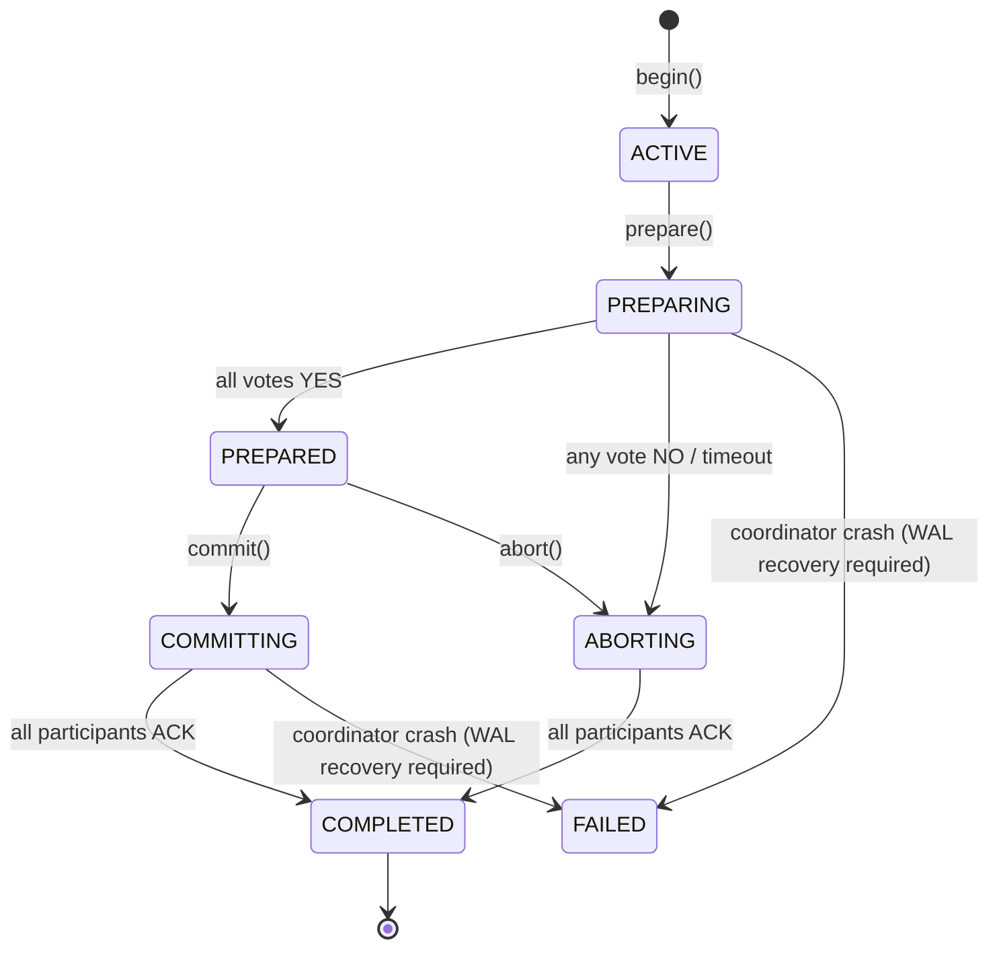
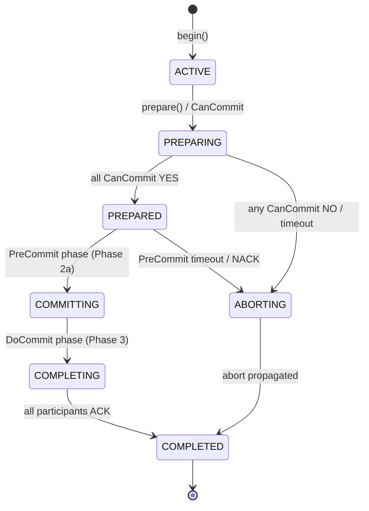
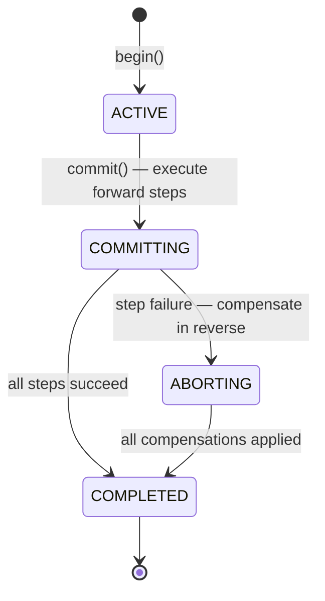

# Transaction Coordinators — Architecture Reference

<!-- Status: current | Issue: #5372 | Target: Q3 2026 (v2.0.0) -->
<!-- SOT: docs/architecture/transaction_coordinators.md -->

## 1. Overview

ThemisDB provides three concrete transaction coordinator classes, all implementing the
`IRecoverableTwoPhaseCoordinator` recovery contract while exposing coordinator-specific APIs.
`ITransactionCoordinator` remains the documented unification target for migration planning
([`docs/ITRANSACTION_COORDINATOR.md`](../ITRANSACTION_COORDINATOR.md)).

| Class | Header | Namespace | Primary Protocol |
|---|---|---|---|
| `TwoPhaseCommitCoordinator` | `include/sharding/two_phase_commit_coordinator.h` | `themis::sharding` | Standalone 2PC |
| `CrossShardTransactionCoordinator` | `include/sharding/cross_shard_transaction.h` | `themisdb::sharding` | Multi-protocol (2PC / 3PC / SAGA / Percolator / Calvin) |
| `DistributedTransactionCoordinator` | `include/sharding/distributed_transaction.h` | `themis::sharding` | 2PC (+ optional Percolator fast-path) |

All three classes inherit from `themis::transaction::IRecoverableTwoPhaseCoordinator`, which
in turn inherits from `themis::transaction::IInDoubtRecoveryCoordinator`.  The proposed
`ITransactionCoordinator` unification contract is documented at
[`docs/ITRANSACTION_COORDINATOR.md`](../ITRANSACTION_COORDINATOR.md).

> **Audit Note (CC-5):** Historically these coordinators evolved independently.  As of
> issue #5372 (v2.0.0), they share the `IRecoverableTwoPhaseCoordinator` recovery contract.
> `WALLoggingHelper` centralizes WAL write logic only for `WALManager`-backed coordinators;
> WAL formats remain coordinator-specific.
> A transaction started with coordinator A can still only be fully recovered by coordinator A;
> cross-coordinator recovery tooling is planned for v3.0.0 (see §7 below).

---

## 2. Coordinator Comparison

### 2.1 Feature Matrix

| Feature | `TwoPhaseCommitCoordinator` | `CrossShardTransactionCoordinator` | `DistributedTransactionCoordinator` |
|---|---|---|---|
| **Protocols supported** | 2PC | 2PC · 3PC · SAGA · Percolator · Calvin | 2PC (+ optional Percolator fast-path) |
| **WAL backend** | `WALManager` via `WALLoggingHelper` | `TransactionWAL` (dedicated per-txn WAL) | `WALManager` via `WALLoggingHelper` |
| **Snapshot recovery** | ✗ | ✅ (`TransactionSnapshotManager`) | ✗ |
| **Deadlock detection** | ✗ (timeout only) | ✅ (distributed wait-for graph) | ✅ (timeout + cycle detection) |
| **Distributed FK validation** | ✗ | ✅ (injected `CrossShardForeignKeyValidator`) | ✗ |
| **Participant model** | `ShardRpcClientAdapter` | `CrossShardParticipant` (state machine per shard) | `TransactionParticipant` (`shard_id` + `endpoint`) |
| **noexcept callbacks** | N/A | Required (see §4) | N/A |
| **Recovery entry point** | `recoverInDoubtTransactions()` | `recoverFromWAL()` | `recoverInDoubtTransactions()` |
| **Thread safety** | ✅ (internal mutex) | ✅ (timed mutex) | ✅ (internal mutex) |

### 2.2 Use-Case Guide — When to Use Which Coordinator

| Scenario | Recommended Coordinator |
|---|---|
| Simple cross-shard 2PC in sharding module | `TwoPhaseCommitCoordinator` |
| Multi-protocol orchestration (3PC non-blocking, SAGA long-running, Calvin deterministic) | `CrossShardTransactionCoordinator` |
| Transaction-manager layer with `IDistributedParticipantCallback` injection | `DistributedTransactionManager` (`transaction/`) |
| New code / greenfield | Prefer `CrossShardTransactionCoordinator` — it has the richest protocol set and WAL recovery |

### 2.3 Known Limitations

- **No cross-coordinator recovery (CC-5):** A transaction begun with coordinator A cannot
  be recovered by coordinator B.  Recovery tooling that reads all three WAL formats is
  planned for v3.0.0 (see §7).
- **Incompatible WAL formats (CC-5):** The three coordinators write different JSON schemas
  to their respective WAL backends (see §5 for full specification).  A single unified WAL
  format is a v3.0.0 goal.
- **`CrossShardTransactionCoordinator::persistTransactionState()`** uses a JSONL file log
  for per-state transitions in addition to the `TransactionWAL` backend — the two logs must
  be kept consistent during manual recovery.

---

## 3. State Machine Diagrams

### 3.1 Two-Phase Commit (2PC)



**Recovery path:** If the coordinator crashes after writing `PREPARE_TX` to WAL but before
writing `COMMIT_TX`/`ABORT_TX`, the transaction is **in-doubt**.  On restart,
`recoverInDoubtTransactions()` replays the WAL and re-issues the commit/abort decision.

### 3.2 Three-Phase Commit (3PC)



**Non-blocking guarantee:** If the coordinator crashes after PreCommit is durable at all
participants but before DoCommit, any participant can safely commit autonomously (no in-doubt
window after PreCommit phase).

> **CST-6:** The `execute3PC()` implementation in `CrossShardTransactionCoordinator` requires
> a PreCommit RPC callback to be registered via `setPreCommitCallback()`.  If no callback is
> installed, `execute3PC()` **fails closed** (abort all participants) rather than silently
> downgrading to 2PC.  See §4.2 for the complete callback contract.

### 3.3 SAGA (Compensating Transaction)



`prepare()` is a no-op for SAGA (returns `OK` immediately).  The coordinator drives
forward execution and backwards compensation internally.

---

## 4. Callback Contracts and noexcept Requirements

### 4.1 State-Change Callback (`CrossShardTransactionCoordinator`)

```cpp
// Signature (CrossShardTransactionCoordinator)
using OnStateChangeFn = std::function<void(
    const std::string& txn_id,
    TransactionState   from,
    TransactionState   to)>;
```

**Contract:**
- The callback **must not throw**.  Any exception propagates to the coordinator's internal
  thread and terminates the transaction with `FAILED` state.
- Must complete within the coordinator's deadlock-detection timeout; avoid blocking I/O.

### 4.2 3PC PreCommit RPC Callback (CST-6)

```cpp
// Signature (CrossShardTransactionCoordinator)
using PreCommitRpcFn = std::function<bool(
    const std::string& shard_id,
    const std::string& txn_id)>;
```

**Contract:**
- **Must not throw.**  If it throws, `execute3PC()` treats the result as a NACK and aborts
  the transaction.
- Returns `true` on participant acknowledgement, `false` on NACK.
- If no callback is registered when `execute3PC()` runs, the transaction **fails closed**
  (abort all participants) — no silent downgrade to 2PC.

### 4.3 Deferred PreCommit Retry Callback (3PC non-blocking mode)

```cpp
// Signature (CrossShardTransactionCoordinator)
using DeferredPreCommitFn = std::function<void(
    const std::string&              txn_id,
    const std::vector<std::string>& failed_shards)>;
```

**Contract:**
- **Must not throw.**  A throw is treated as a fatal orchestration error and causes
  `execute3PC()` to fail closed.
- Callback receives the list of shards that did not acknowledge PreCommit; it is
  responsible for scheduling a retry or escalating.

### 4.4 Participant Callbacks (`IDistributedParticipantCallback`)

Used by `DistributedTransactionManager` (transaction module), not by
`DistributedTransactionCoordinator`.

```cpp
// Interface (include/transaction/distributed_transaction_manager.h)
struct IDistributedParticipantCallback {
    virtual bool onPrepare(const std::string& txn_id,
                           const std::set<std::string>& keys) = 0;
    virtual void onCommit(const std::string& txn_id) = 0;
    virtual void onAbort(const std::string& txn_id) = 0;
};
```

**Contract:**
- `onPrepare()` — may return `false` to cast an ABORT vote; **must not throw** (a throw is
  counted as an ABORT vote).
- `onCommit()` / `onAbort()` — **must not throw**; exceptions are caught and logged.
- All three methods are called from the coordinator's internal thread; avoid coordinator
  re-entrancy (do not call `commit()`/`abort()` from within the callback).

---

## 5. WAL Format Specification

### 5.1 Shared WALEntry JSON Schema (`WALLoggingHelper`)

`TwoPhaseCommitCoordinator` and `DistributedTransactionCoordinator` write entries through
`themis::sharding::WALLoggingHelper` into a `WALManager`-backed binary WAL.  The JSON
payload embedded in `WALEntry::data` follows this schema:

```jsonc
// BEGIN_TX entry (WALEntryType::BEGIN_TX)
{
    "transaction_id":  "string",      // UUID or caller-assigned opaque string
    "coordinator_id":  "string",      // Coordinator instance identifier
    "participants":    [              // Array; may be empty at BEGIN time
        {
            "shard_id": "string",
            "endpoint": "string"
        }
    ],
    "isolation_level": "integer"      // Optional — IsolationLevel cast to int
}

// PREPARE_TX entry (WALEntryType::PREPARE_TX)
{
    "transaction_id":  "string",
    "phase":           "prepare",
    "participants":    [{ "shard_id": "string", "endpoint": "string" }]
}

// COMMIT_TX entry (WALEntryType::COMMIT_TX)
{
    "transaction_id":      "string",
    "phase":               "string",   // e.g. "commit" | "complete"
    "decision":            "commit",
    "commit_timestamp_ns": "integer",  // nanoseconds since epoch (0 if unused)
    "participants":        [
        {
            "shard_id":  "string",
            "endpoint":  "string",
            "prepared":  "bool",
            "committed": "bool"
        }
    ]
}

// ABORT_TX entry (WALEntryType::ABORT_TX)
{
    "transaction_id": "string",
    "phase":          "string",
    "decision":       "abort",
    "reason":         "string",       // Optional human-readable abort reason
    "participants":   [ /* same as COMMIT_TX */ ]
}
```

### 5.2 CrossShardTransactionCoordinator — Dedicated TransactionWAL

`CrossShardTransactionCoordinator` uses the `sharding::TransactionWAL` class (separate from
`WALManager`).  Its log entries are written to a segmented binary log under the configured
WAL directory.  The protocol-specific fields extend the base schema:

```jsonc
// 2PC commit entry written by CrossShardTransactionCoordinator
{
    "protocol":     "2PC",
    "participants": [ "shard_id_1", "shard_id_2" ]    // string array of shard IDs
}

// 3PC PreCommit entry
{
    "protocol":     "3PC",
    "participants": [ /* shard IDs */ ]
}
```

Additionally, `persistTransactionState()` writes **JSONL** lines to a separate
`transaction_log_path_` file with the following schema:

```jsonc
{
    "timestamp":          "integer",   // ms since epoch
    "transaction_id":     "string",
    "state":              "integer",   // TransactionState cast to int
    "protocol":           "integer",   // TransactionProtocol cast to int
    "isolation_level":    "integer",
    "snapshot_timestamp": "integer",
    "commit_timestamp":   "integer",
    "participants": [
        {
            "shard_id":  "string",
            "endpoint":  "string",
            "prepared":  "bool",
            "committed": "bool",
            "aborted":   "bool"
        }
    ]
}
```

### 5.3 Format Compatibility Warning

> ⚠️ **The three coordinators write to incompatible WAL formats.**  Do not attempt to replay
> a WAL written by coordinator A through coordinator B.  Cross-format recovery tooling is
> planned for v3.0.0 (see §7).

---

## 6. Decision Tree — Selecting a Coordinator

```
Start: I need distributed transaction support
│
├─► Do I need a protocol other than 2PC (SAGA, 3PC, Percolator, Calvin)?
│     YES → CrossShardTransactionCoordinator
│     NO  ↓
│
├─► Am I integrating at the transaction-manager layer using IDistributedParticipantCallback?
│     YES → DistributedTransactionManager
│     NO  ↓
│
├─► Am I in the sharding module and need standalone 2PC with WALManager?
│     YES → TwoPhaseCommitCoordinator
│     NO  ↓
│
└─► Default / greenfield: CrossShardTransactionCoordinator
    (richest protocol set, snapshot recovery, FK validation)
```

**Protocol selection within `CrossShardTransactionCoordinator`:**

```
Start: Which commit protocol for my use case?
│
├─► Need non-blocking coordinator-crash recovery? → 3PC
│     ⚠ Requires PreCommitRpcFn callback (CST-6)
│
├─► Long-running workflow with compensation logic? → SAGA
│
├─► High-contention reads with optimistic locking? → Percolator
│
├─► Deterministic replay / auditing? → Calvin
│
└─► Default: 2PC (simplest, widely supported)
```

---

## 7. Migration Guide

### 7.1 v1.x → v2.0 (Current API Surface)

The current v2.0 coordinators still expose concrete coordinator APIs for execution.
Use the concrete coordinator API for protocol operations, and the shared recovery
contract (`IRecoverableTwoPhaseCoordinator`) for crash-recovery orchestration.

```cpp
// Current v2.0 execution API (TwoPhaseCommitCoordinator)
TwoPhaseCommitCoordinator coord("my-coord");
auto outcome = coord.commit(
    "txn-1",
    {{"shard-a", nlohmann::json::array()}}
);
if (outcome.committed()) {
    // committed
}
```

Recovery contract alignment:
- `recoverInDoubtTransactions()` is part of `IRecoverableTwoPhaseCoordinator`.
- The `ITransactionCoordinator` API in `docs/ITRANSACTION_COORDINATOR.md` is the
  documented migration target for a future unification phase.

### 7.2 v2.0 → v3.0 (Unified WAL Format — Planned)

The v3.0.0 goal is a single `UnifiedTransactionWAL` that all three coordinators write to,
enabling cross-coordinator recovery.  The planned migration steps are:

1. Add `UnifiedTransactionWAL::readEntries(CoordinatorType)` that can parse all three
   current formats.
2. Add a one-time migration tool `themis-wal-migrate` that rewrites v1/v2 WAL segments to
   the unified schema.
3. Swap each coordinator's WAL backend to `UnifiedTransactionWAL` in a single release.

See [ROADMAP.md](../../ROADMAP.md) (section "Distributed Transactions — v3.0.0") for the
current target date and acceptance criteria.

---

## 8. Related Documents

| Document | Content |
|---|---|
| [`docs/ITRANSACTION_COORDINATOR.md`](../ITRANSACTION_COORDINATOR.md) | Full `ITransactionCoordinator` interface reference, type definitions, and migration phases |
| [`include/transaction/transaction_coordinator.h`](../../include/transaction/transaction_coordinator.h) | Canonical interface header |
| [`include/sharding/wal_logging_helper.h`](../../include/sharding/wal_logging_helper.h) | Shared WAL-logging utility (`WALLoggingHelper` namespace) |
| [`include/sharding/two_phase_commit_coordinator.h`](../../include/sharding/two_phase_commit_coordinator.h) | Standalone 2PC coordinator API |
| [`include/sharding/cross_shard_transaction.h`](../../include/sharding/cross_shard_transaction.h) | Multi-protocol coordinator API |
| [`include/sharding/distributed_transaction.h`](../../include/sharding/distributed_transaction.h) | Distributed coordinator API |
| [`tests/transaction/test_itransaction_coordinator.cpp`](../../tests/transaction/test_itransaction_coordinator.cpp) | ITC-1..ITC-41: interface contract tests |
| [`tests/transaction/test_transaction_distributed_2pc.cpp`](../../tests/transaction/test_transaction_distributed_2pc.cpp) | AC-1..AC-20: DistributedTransactionManager 2PC tests |
| [`tests/transaction/test_cross_coordinator_wal_recovery.cpp`](../../tests/transaction/test_cross_coordinator_wal_recovery.cpp) | CWR-1..CWR-8: cross-coordinator WAL recovery contract tests |
