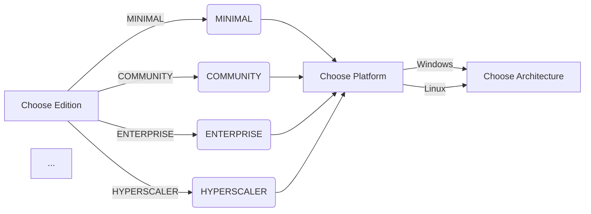

# Build Configuration Matrix

| Edition   | Platform  | Architecture | Build Type  | Linking   |
|-----------|-----------|--------------|-------------|-----------|
| MINIMAL   | Windows   | x86_64      | Debug       | Static    |
| MINIMAL   | Windows   | x86_64      | Release     | Dynamic   |
| MINIMAL   | Linux     | x86_64      | Debug       | Static    |
| ...       | ...       | ...          | ...         | ...       |
| HYPERSCALER | Docker  | ARM64       | MinSizeRel  | Static    |

## Mermaid Decision Tree


## Feature Availability Table

| Feature           | MINIMAL | COMMUNITY | ENTERPRISE | HYPERSCALER |
|------------------|---------|-----------|------------|-------------|
| Feature A        | Yes     | Yes       | Yes        | No          |
| Feature B        | No      | Yes       | Yes        | Yes         |
| ...              | ...     | ...       | ...        | ...         |

## Platform-Specific Build Recommendations

### Windows
- Recommendation: Use Visual Studio for best compatibility.

### Linux
- Recommendation: Ensure all dependencies are installed via your package manager.

## Common Configuration Recipes

```bash
# Example for building MINIMAL edition on Linux
cmake -D CMAKE_BUILD_TYPE=Release -D EDITION=MINIMAL -D PLATFORM=Linux -D ARCHITECTURE=x86_64 ..
```