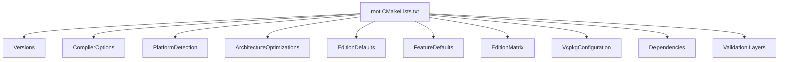
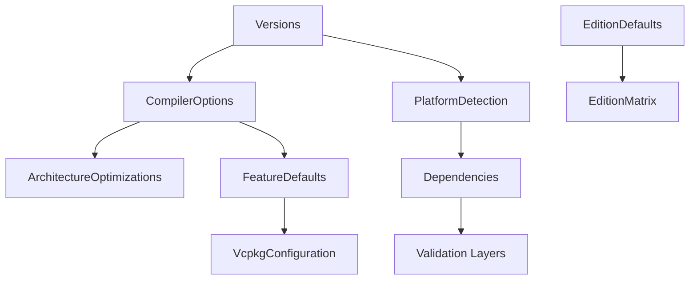

# Build System Overview

This document provides a comprehensive overview of the CMake build system architecture used in the ThemisDB project. It covers the build flow, module dependencies, the 10-step build process, the Edition-Feature matrix, and platform support. It also includes mermaid diagrams to visualize the information.

## Build Flow Diagram

## CMake Modules

1. **Versions**: Manages versioning information for the project.
2. **CompilerOptions**: Defines compiler-specific options and flags.
3. **PlatformDetection**: Discerns the operating system and compiler in use.
4. **ArchitectureOptimizations**: Implements architecture-specific optimizations.
5. **EditionDefaults**: Sets default configurations for different editions.
6. **FeatureDefaults**: Activates or deactivates features based on configurations.
7. **EditionMatrix**: Defines the available editions and features.
8. **VcpkgConfiguration**: Integrates vcpkg for dependency management.
9. **Dependencies**: Handles external library dependencies.
10. **Validation Layers**: Sets up validation layers for testing and debugging.

## 10-Step Build Process

1. **Initialization**: Determine project settings and configurations from `CMakeLists.txt`.
2. **Configuration**: Parse and configure settings from various cmake modules.
3. **Platform Detection**: Identify the platform and compiler.
4. **Options Setup**: Set compiler options and flags based on project needs.
5. **Dependency Resolution**: Resolve and download dependencies.
6. **Build Generation**: Generate build scripts.
7. **Compilation**: Compile the source code based on the generated scripts.
8. **Post-Build**: Run any post-build commands or scripts.
9. **Testing**: Execute tests and validation layers.
10. **Packaging**: Package compiled binaries and resources.

## Edition-Feature Matrix

| Edition      | Features 
|--------------|----------------------------|
| MINIMAL     | Basic functionality        |
| COMMUNITY    | All MINIMAL features + Community support |
| ENTERPRISE   | All COMMUNITY features + Enterprise-specific optimizations |
| HYPERSCALER  | All ENTERPRISE features + Scalability optimizations |

## Platform Support
- **Windows**: MSVC/MinGW
- **Linux**: x86_64/ARM64/ARMv7
- **macOS**
- **Docker**
- **QNAP**
- **Raspberry Pi**

## Module Dependency Flowchart

This documentation aims to provide clarity on the CMake build system and facilitate better understanding and efficient use of the ThemisDB project builds.