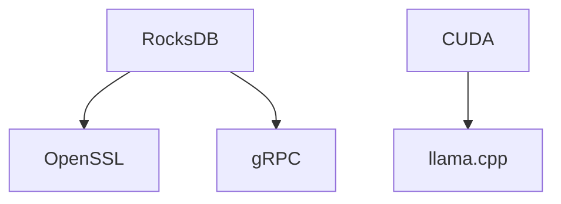

# Dependency Graph Documentation

## Dependencies Overview



## Dependency Categories

### Core Dependencies
- List of core dependencies required for all editions.

### Optional Dependencies
- List of optional dependencies that enhance features but are not mandatory.

### Protocol-specific Dependencies
- Libraries needed for specific protocols, e.g., gRPC etc.

### Hardware Acceleration Dependencies
- Libraries for utilizing GPU and hardware-specific optimizations (e.g., CUDA).

### LLM Dependencies
- Dependencies that are required for LLM functionality.

### Cloud Storage Dependencies
- Dependencies needed for cloud integration.

## Feature-Conditional Dependencies

- **THEMIS_ENABLE_LLM:** Dependency on LLM libraries.
- **THEMIS_ENABLE_GPU:** Dependency on GPU libraries.
- **THEMIS_ENABLE_CUDA:** Dependency on CUDA libraries.

## Vcpkg Integration

### Integration Steps
- Installation commands:
  ```bash
  vcpkg install [dependency]
  ```
- Configuration details for Vcpkg.

## Platform-Specific Variations

- Windows: 
  - Required dependencies for Windows.
- Linux: 
  - Required dependencies for Linux.
- macOS: 
  - Required dependencies for macOS.

## Dependency Requirements Table

| Edition       | Dependency      | Required |
|---------------|------------------|----------|
| Standard      | [Dependency A]   | Yes      |
| Professional   | [Dependency B]   | Yes      |
| Ultimate      | [Dependency C]   | Optional  |

