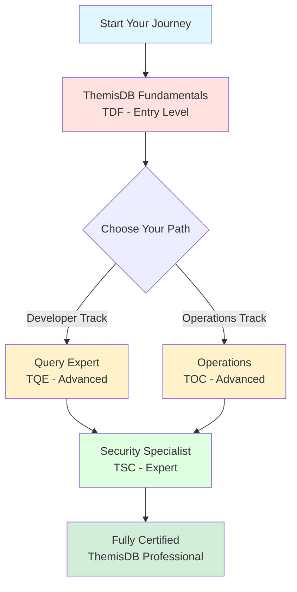

# ThemisDB Certification Program

> **Validate your expertise** with industry-recognized ThemisDB professional certifications.

---

## 🎯 Quick Certification Selector

**What's your goal?**

| I want to... | Recommended Certification | Duration | Prerequisites |
|-------------|---------------------------|----------|---------------|
| Learn ThemisDB basics | [Fundamentals (TDF)](#1-themisdb-fundamentals-certification-tdf) | 90 min | None |
| Master queries and AQL | [Query Expert (TQE)](#2-themisdb-query-expert-certification-tqe) | 120 min | TDF required |
| Run production systems | [Operations (TOC)](#3-themisdb-operations-certification-toc) | 120 min | TDF required |
| Implement security | [Security (TSC)](#4-themisdb-security-certification-tsc) | 150 min | TDF + (TQE or TOC) |
| Become a complete expert | All Four Certifications | 8-12 months | Sequential |

---

## 📊 Certification Path Visualization



---

## Overview

The ThemisDB Certification Program is designed to validate expertise across different aspects of ThemisDB database technology. Our certification paths ensure that professionals have the knowledge and hands-on skills required to design, develop, deploy, and maintain ThemisDB solutions in production environments.

## Why Get Certified?

### For Individuals
- **Validate Your Expertise**: Demonstrate your ThemisDB knowledge with industry-recognized credentials
- **Career Advancement**: Stand out in the job market with specialized database skills
- **Continuous Learning**: Stay current with the latest ThemisDB features and best practices
- **Professional Network**: Join a community of certified ThemisDB professionals
- **Exclusive Resources**: Access certification-holder-only materials and events

### For Organizations
- **Quality Assurance**: Ensure team members have verified ThemisDB competency
- **Reduced Risk**: Minimize production issues through proper training and certification
- **Competitive Advantage**: Leverage certified expertise for better project outcomes
- **Partner Requirements**: Meet ThemisDB partner program certification requirements

## Certification Paths

The ThemisDB Certification Program offers four specialized certifications, each targeting different roles and expertise levels:

```
                    ┌─────────────────────────────────┐
                    │  ThemisDB Fundamentals (TDF)   │
                    │      Entry Level Required       │
                    └──────────────┬──────────────────┘
                                   │
                    ┌──────────────┴──────────────┐
                    │                             │
         ┌──────────▼──────────┐   ┌─────────────▼──────────┐
         │  Query Expert (TQE) │   │  Operations (TOC)      │
         │   Developer Track   │   │   Operations Track     │
         └─────────────────────┘   └────────────────────────┘
                    │                             │
                    └──────────────┬──────────────┘
                                   │
                    ┌──────────────▼──────────────┐
                    │   Security (TSC)            │
                    │   Advanced Specialization   │
                    └─────────────────────────────┘
```

### 1. ThemisDB Fundamentals Certification (TDF)
**Level**: Entry  
**Duration**: 90 minutes  
**Questions**: 25-30 multiple choice and scenario-based  
**Passing Score**: 70%

**Target Audience**: Developers, DBAs, architects, and IT professionals new to ThemisDB

**What You'll Learn**:
- ThemisDB architecture and multi-model capabilities
- Basic AQL query language
- Installation and configuration
- ACID transactions and consistency
- Basic security and access control

**Prerequisites**: None

[View Full Details →](FUNDAMENTALS_CERTIFICATION.md)

---

### 2. ThemisDB Query Expert Certification (TQE)
**Level**: Advanced  
**Duration**: 120 minutes + hands-on project  
**Questions**: 30-35 + practical assignment  
**Passing Score**: 75%

**Target Audience**: Developers and data engineers working with complex ThemisDB queries

**What You'll Learn**:
- Advanced AQL query techniques
- Graph traversal algorithms
- Vector similarity search optimization
- Query performance tuning
- Index strategies
- Multi-model query patterns

**Prerequisites**: ThemisDB Fundamentals Certification (TDF)

[View Full Details →](QUERY_CERTIFICATION.md)

---

### 3. ThemisDB Operations Certification (TOC)
**Level**: Advanced  
**Duration**: 120 minutes + capstone project  
**Questions**: 30-35 + practical scenarios  
**Passing Score**: 75%

**Target Audience**: DBAs, DevOps engineers, and SREs responsible for ThemisDB operations

**What You'll Learn**:
- Production deployment strategies
- Monitoring and alerting
- Backup and disaster recovery
- High availability and replication
- Performance tuning
- Capacity planning
- Troubleshooting techniques

**Prerequisites**: ThemisDB Fundamentals Certification (TDF)

[View Full Details →](OPERATIONS_CERTIFICATION.md)

---

### 4. ThemisDB Security Certification (TSC)
**Level**: Expert  
**Duration**: 150 minutes + security audit project  
**Questions**: 30-35 + practical security assessment  
**Passing Score**: 80%

**Target Audience**: Security engineers, DBAs, and compliance officers

**What You'll Learn**:
- Authentication and authorization
- Encryption (in-transit and at-rest)
- Role-based access control (RBAC)
- Audit logging and compliance
- Security hardening
- GDPR, HIPAA, and SOC 2 compliance
- Security incident response

**Prerequisites**: ThemisDB Fundamentals Certification (TDF) + (TQE or TOC recommended)

[View Full Details →](SECURITY_CERTIFICATION.md)

---

## Recommended Learning Paths

### For Application Developers
1. **ThemisDB Fundamentals** (TDF) - Foundation
2. **Query Expert** (TQE) - Specialization
3. **Security** (TSC) - Advanced (Optional)

**Timeline**: 3-6 months

### For Database Administrators
1. **ThemisDB Fundamentals** (TDF) - Foundation
2. **Operations** (TOC) - Specialization
3. **Security** (TSC) - Advanced

**Timeline**: 4-8 months

### For DevOps/SRE Engineers
1. **ThemisDB Fundamentals** (TDF) - Foundation
2. **Operations** (TOC) - Core Specialization
3. **Query Expert** (TQE) - Supporting Skills (Optional)
4. **Security** (TSC) - Advanced

**Timeline**: 6-10 months

### For Security Engineers
1. **ThemisDB Fundamentals** (TDF) - Foundation
2. **Operations** (TOC) - Supporting Skills
3. **Security** (TSC) - Specialization

**Timeline**: 4-7 months

### For Architects
**All Four Certifications** for comprehensive expertise

**Timeline**: 8-12 months

---

## Exam Format and Delivery

### Exam Types

1. **Multiple Choice Questions (MCQ)**: Test theoretical knowledge and understanding
2. **Scenario-Based Questions**: Evaluate problem-solving and decision-making
3. **Hands-On Labs**: Assess practical skills in real environments
4. **Project Assignments**: Demonstrate ability to complete real-world tasks

### Delivery Methods

- **Online Proctored**: Take exams remotely with live proctoring
- **Testing Centers**: Visit authorized testing centers globally
- **Corporate On-Site**: Available for organizations (minimum 10 candidates)

### Exam Security

- Live proctoring with ID verification
- Secure browser environment
- Recording of exam session
- Randomized question pools
- Non-disclosure agreements

---

## Certification Validity and Renewal

### Validity Period
All ThemisDB certifications are valid for **2 years** from the date of completion.

### Renewal Options

#### Option 1: Recertification Exam
- Take a shorter recertification exam (50% length)
- Focuses on new features and updates
- Discounted pricing for certified professionals

#### Option 2: Continuing Education
- Earn 20 Continuing Education Units (CEUs) over 2 years
- CEUs available through:
  - ThemisDB official training courses
  - Approved webinars and conferences
  - Technical blog posts and articles
  - Open-source contributions
  - Speaking engagements

#### Option 3: Higher-Level Certification
- Achieving a higher-level certification automatically renews lower-level certifications
- Example: Earning TSC renews your TDF certification

---

## Study Resources

### Official Resources

1. **ThemisDB Documentation**: [https://docs.themisdb.com](https://docs.themisdb.com)
2. **Official Training Courses**: Self-paced and instructor-led options
3. **Practice Labs**: Hands-on environments for each certification
4. **Sample Exams**: Practice questions and mock exams
5. **Study Guides**: Comprehensive preparation materials

### Community Resources

- **ThemisDB Community Forum**: Discuss topics with other learners
- **Slack Channel**: Real-time communication with certified professionals
- **YouTube Channel**: Tutorial videos and webinars
- **GitHub Repository**: Sample code and projects
- **Blog**: Technical articles and best practices

### Recommended Study Time

| Certification | Recommended Study Time | Prerequisites |
|--------------|------------------------|---------------|
| TDF | 40-60 hours | None |
| TQE | 60-80 hours | TDF |
| TOC | 80-100 hours | TDF |
| TSC | 100-120 hours | TDF + (TQE or TOC) |

---

## Pricing

### Individual Pricing

| Certification | Exam Fee | Retake Fee |
|--------------|----------|------------|
| ThemisDB Fundamentals (TDF) | $150 | $75 |
| Query Expert (TQE) | $250 | $125 |
| Operations (TOC) | $250 | $125 |
| Security (TSC) | $350 | $175 |

### Bundle Pricing

- **Developer Bundle** (TDF + TQE): $350 (Save $50)
- **Operations Bundle** (TDF + TOC): $350 (Save $50)
- **Professional Bundle** (TDF + TQE + TOC): $550 (Save $100)
- **Master Bundle** (All Four): $850 (Save $150)

### Corporate Pricing

Contact our enterprise team for volume discounts and custom training programs.

---

## Registration Process

### Step 1: Create Account
Register at [https://certify.themisdb.com](https://certify.themisdb.com)

### Step 2: Select Certification
Choose your desired certification path

### Step 3: Prepare
Study using official resources and practice labs

### Step 4: Schedule Exam
Book your exam date and time (online or testing center)

### Step 5: Take Exam
Complete the certification exam

### Step 6: Receive Credential
Digital badge and certificate issued within 48 hours

---

## Certification Benefits

### Digital Credentials
- Verifiable digital badge with unique ID
- Shareable on LinkedIn, email signatures, and websites
- QR code for instant verification
- PDF certificate for printing

### Exclusive Access
- Certified professionals directory listing
- Private Slack channel
- Early access to new features and beta programs
- Quarterly certification holder webinars

### Career Resources
- Resume templates highlighting certification
- Job board with ThemisDB-specific positions
- Certification logo for business cards
- Letter of recommendation template

### Discounts
- 20% off ThemisDB training courses
- 15% off ThemisDB conferences
- Partner discounts on related tools and services

---

## Frequently Asked Questions

### Q: Can I take certifications in any order?
**A**: ThemisDB Fundamentals (TDF) is required before any advanced certification. After TDF, you can take TQE, TOC, or TSC in any order based on your career goals.

### Q: What happens if I fail an exam?
**A**: You can retake the exam after a 14-day waiting period at a discounted retake fee. Review your score report to identify areas for improvement.

### Q: Are study materials included with exam registration?
**A**: Sample questions and study guides are included. Official training courses and practice labs are available separately.

### Q: How long does the hands-on project take?
**A**: Advanced certifications include projects that typically take 4-8 hours to complete. You have up to 2 weeks to submit.

### Q: Can I schedule exams on weekends?
**A**: Yes, online proctored exams are available 24/7. Testing center availability varies by location.

### Q: Is ThemisDB software required for certification?
**A**: For hands-on components, you'll need access to ThemisDB. Free cloud labs are provided, or you can use your own installation.

### Q: Are certifications recognized internationally?
**A**: Yes, ThemisDB certifications are globally recognized and accepted.

### Q: What language are exams offered in?
**A**: Currently English, with Spanish, Chinese, and Japanese coming in 2025.

### Q: Can my employer pay for certification?
**A**: Yes, we offer corporate accounts with invoicing and purchase orders.

### Q: What is the passing score?
**A**: TDF requires 70%, TQE and TOC require 75%, and TSC requires 80%.

---

## Corporate Training Programs

For organizations looking to certify multiple team members, we offer:

- **Customized Training**: Tailored curriculum for your use cases
- **On-Site Instruction**: Bring certified instructors to your location
- **Volume Discounts**: Save on exam fees for groups
- **Private Classes**: Dedicated sessions for your team
- **Fast-Track Programs**: Intensive training schedules
- **Post-Training Support**: Ongoing mentorship and support

**Contact**: enterprise@themisdb.com

---

## Partner Program

ThemisDB partners can leverage certifications to:

- Meet partnership tier requirements
- Demonstrate technical competency to customers
- Access partner-exclusive resources and training
- Co-market certified expertise

**Learn More**: partners.themisdb.com/certification

---

## Contact and Support

### General Inquiries
- **Email**: certification@themisdb.com
- **Phone**: +1-555-THEMISDB
- **Live Chat**: Available on certification portal

### Technical Support
- **Email**: cert-support@themisdb.com
- **Response Time**: Within 24 hours

### Exam Issues
- **Immediate Support**: Use chat feature during exam
- **Post-Exam**: Contact cert-support@themisdb.com

---

## Stay Updated

- **Newsletter**: Subscribe for certification updates
- **Blog**: Read about new features and exam changes
- **Social Media**: Follow @ThemisDB on Twitter, LinkedIn
- **Roadmap**: View upcoming certification releases

---

## Certification Ethics and Code of Conduct

All certified professionals must:

1. **Maintain Honesty**: No braindumps or exam content sharing
2. **Continuous Learning**: Stay current with ThemisDB developments
3. **Professional Conduct**: Represent the certification professionally
4. **Ethical Use**: Use knowledge for legitimate purposes only
5. **Confidentiality**: Respect NDA regarding exam content

Violations may result in certification revocation.

---

## Get Started Today

Ready to validate your ThemisDB expertise? Start with the **ThemisDB Fundamentals Certification** and begin your journey toward becoming a certified ThemisDB professional.

[Register Now →](https://certify.themisdb.com/register)

---

*Last Updated: April 2026*  
*Version: 1.0*  
*© 2025 ThemisDB. All rights reserved.*
