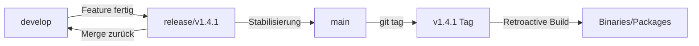

# Retroactive Release Building mit Git Flow

Dieses Dokument beschreibt, wie der retroaktive Release-Builder mit der Git-Flow-Branching-Strategie von ThemisDB integriert ist.

## Git-Flow-Übersicht

ThemisDB verwendet das Git-Flow-Branching-Modell:

```
develop → release/vX.X.X → main (+ tag vX.X.X)
```

### Branch-Struktur

- **`develop`**: Entwicklungszweig mit neuesten Features
- **`release/vX.X.X`**: Release-Vorbereitung und Stabilisierung
- **`main`**: Produktions-Branch mit stabilen Releases
- **Tags `vX.X.X`**: Markierung spezifischer Release-Versionen auf `main`

## Integration mit Retroactive Builder

### 1. Tags und Branches

Der retroaktive Builder arbeitet mit Git-Tags, die auf dem `main`-Branch erstellt wurden:

```bash
# Tags auflisten (alle stammen von main)
./.github/workflows/04-release_create-release-archive.yml --list-tags

# Output:
# v1.3.0  (auf main)
# v1.3.4  (auf main)
# v1.4.0  (auf main)
```

### 2. Release-Workflow Überblick

#### Normaler Release-Prozess (Git Flow)

```bash
# 1. Release-Branch von develop erstellen
git checkout develop
git checkout -b release/v1.4.1

# 2. VERSION Datei aktualisieren
echo "1.4.1" > VERSION

# 3. Tests und Stabilisierung durchführen
# ... Build, Test, Fix ...

# 4. Release-Branch nach main mergen
git checkout main
git merge --no-ff release/v1.4.1

# 5. Tag auf main erstellen
git tag -a v1.4.1 -m "Release v1.4.1"
git push origin main --tags

# 6. Zurück nach develop mergen
git checkout develop
git merge --no-ff release/v1.4.1
git branch -d release/v1.4.1
```

#### Retroaktiver Build für bestehende Tags

```bash
# Tag wurde bereits in der Vergangenheit auf main erstellt
# Jetzt retroaktiv Binaries bauen

./.github/workflows/04-release_create-release-archive.yml --tag v1.4.1
```

### 3. Workflow-Diagramm



### 4. Praktische Beispiele

#### Beispiel 1: Neues Release mit Retroactive Build

```bash
# 1. Release-Branch erstellen (Git Flow)
git checkout develop
git checkout -b release/v1.5.0
echo "1.5.0" > VERSION
git commit -am "chore: Bump version to 1.5.0"

# 2. Nach main mergen
git checkout main
git merge --no-ff release/v1.5.0
git tag -a v1.5.0 -m "Release v1.5.0"
git push origin main --tags

# 3. Binaries retroaktiv bauen
./.github/workflows/04-release_create-release-archive.yml --tag v1.5.0 --clean

# Output:
# release-retroactive/v1.5.0/
#   ├── themisdb-1.5.0-Linux.tar.gz
#   ├── themisdb-1.5.0-Linux.deb
#   ├── themisdb-1.5.0-Linux.rpm
#   └── SHA256SUMS.txt
```

#### Beispiel 2: Alte Releases nachträglich bauen

```bash
# Alle historischen Releases bauen
./.github/workflows/04-release_create-release-archive.yml --all-tags

# Oder spezifische alte Version
./.github/workflows/04-release_create-release-archive.yml --tag v1.3.0
```

#### Beispiel 3: Von release/Branch zu Tag

```bash
# Status prüfen
git branch -a
# * main
#   develop
#   remotes/origin/release/v1.4.0

# Tag existiert bereits auf main (nach Merge)
git tag -l "v1.4.0"
# v1.4.0

# Retroaktiv bauen vom Tag (nicht vom release/Branch!)
./.github/workflows/04-release_create-release-archive.yml --tag v1.4.0
```

### 5. GitHub Actions Integration

#### Workflow-Trigger

Der retroaktive Builder kann manuell über GitHub Actions ausgelöst werden:

```yaml
# .github/workflows/retroactive-release.yml
on:
  workflow_dispatch:
    inputs:
      tag:
        description: 'Version tag (e.g., v1.4.0)'
        required: true
```

#### Verwendung

1. GitHub Repository öffnen
2. "Actions" → "Retroactive Release Build"
3. "Run workflow" klicken
4. Tag eingeben: `v1.4.0`
5. Platform wählen: `linux`, `windows`, `macos`, oder `all`
6. "Run workflow" ausführen

### 6. Validierung und Qualitätssicherung

#### Branch-Zuordnung prüfen

```bash
# Prüfen, von welchem Branch ein Tag stammt
git branch -r --contains v1.4.0
# origin/main
# origin/release/v1.4.0 (vor Merge)
```

#### Tag-Integrität verifizieren

```bash
# Tag-Details anzeigen
git show v1.4.0

# Commit-Historie vom Tag
git log v1.4.0 --oneline -10

# Vergleich mit main
git log main...v1.4.0 --oneline
```

### 7. Best Practices

#### Release-Vorbereitung

1. **Release-Branch erstellen**: Immer von `develop` abzweigen
2. **VERSION Datei aktualisieren**: Muss mit Tag übereinstimmen
3. **CHANGELOG aktualisieren**: Release-Notes dokumentieren
4. **Tests durchführen**: Vollständige Test-Suite ausführen
5. **Nach main mergen**: Mit `--no-ff` für saubere Historie
6. **Tag erstellen**: Signierte Tags verwenden (`git tag -s`)

#### Retroaktives Building

1. **Tag-Existenz prüfen**: `git tag -l "v*"`
2. **Clean Build verwenden**: `--clean` Flag für saubere Umgebung
3. **Checksums verifizieren**: SHA256SUMS.txt prüfen
4. **Packages testen**: Installation vor Distribution testen

### 8. Troubleshooting

#### Problem: Tag nicht gefunden

```bash
# Fehler
Error: Failed to checkout tag: v1.4.0

# Lösung: Tags von Remote holen
git fetch --tags
./.github/workflows/04-release_create-release-archive.yml --tag v1.4.0
```

#### Problem: Tag auf falschem Branch

```bash
# Prüfen
git branch --contains v1.4.0
# Sollte 'main' zeigen

# Wenn auf develop oder release/: Tag löschen und neu erstellen
git tag -d v1.4.0
git checkout main
git tag -a v1.4.0 -m "Release v1.4.0"
```

#### Problem: VERSION Datei stimmt nicht

```bash
# Tag checkouten
git checkout v1.4.0

# VERSION prüfen
cat VERSION
# 1.4.0

# Wenn falsch: Tag muss neu erstellt werden
git checkout main
# VERSION korrigieren, committen
git tag -d v1.4.0
git tag -a v1.4.0 -m "Release v1.4.0"
```

### 9. Workflow-Automatisierung

#### Script für kompletten Release-Prozess

```bash
#!/bin/bash
# complete-release.sh

VERSION=$1
if [ -z "$VERSION" ]; then
    echo "Usage: $0 <version>"
    echo "Example: $0 1.5.0"
    exit 1
fi

# 1. Release-Branch erstellen
git checkout develop
git pull origin develop
git checkout -b release/v$VERSION

# 2. Version aktualisieren
echo "$VERSION" > VERSION
git commit -am "chore: Bump version to $VERSION"

# 3. Nach main mergen
git checkout main
git pull origin main
git merge --no-ff release/v$VERSION -m "Merge release/v$VERSION into main"

# 4. Tag erstellen
git tag -a v$VERSION -m "Release v$VERSION"

# 5. Push
git push origin main
git push origin v$VERSION

# 6. Zurück zu develop
git checkout develop
git merge --no-ff release/v$VERSION -m "Merge release/v$VERSION back into develop"
git push origin develop

# 7. Release-Branch löschen
git branch -d release/v$VERSION

# 8. Retroaktiv bauen
./.github/workflows/04-release_create-release-archive.yml --tag v$VERSION --clean

echo "✓ Release v$VERSION complete!"
echo "Binaries: release-retroactive/v$VERSION/"
```

Verwendung:
```bash
chmod +x complete-release.sh
./complete-release.sh 1.5.0
```

### 10. Dokumentation und Referenzen

**Verwandte Dokumente:**
- [Git Flow Implementation](implementation-history/summaries/GIT_FLOW_IMPLEMENTATION_SUMMARY.md)
- [Branching Strategy](BRANCHING_STRATEGY.md)
- [Release CI Workflow](../.github/workflows/release-ci.yml)
- [Retroactive Building Guide](RETROACTIVE_RELEASE_BUILDING.md)

**Externe Ressourcen:**
- [Git Flow Original Paper](https://nvie.com/posts/a-successful-git-branching-model/)
- [Semantic Versioning](https://semver.org/)
- [Keep a Changelog](https://keepachangelog.com/)

---

**Letzte Aktualisierung**: 2026-01-12  
**Version**: 1.0.0  
**Autor**: ThemisDB Team
