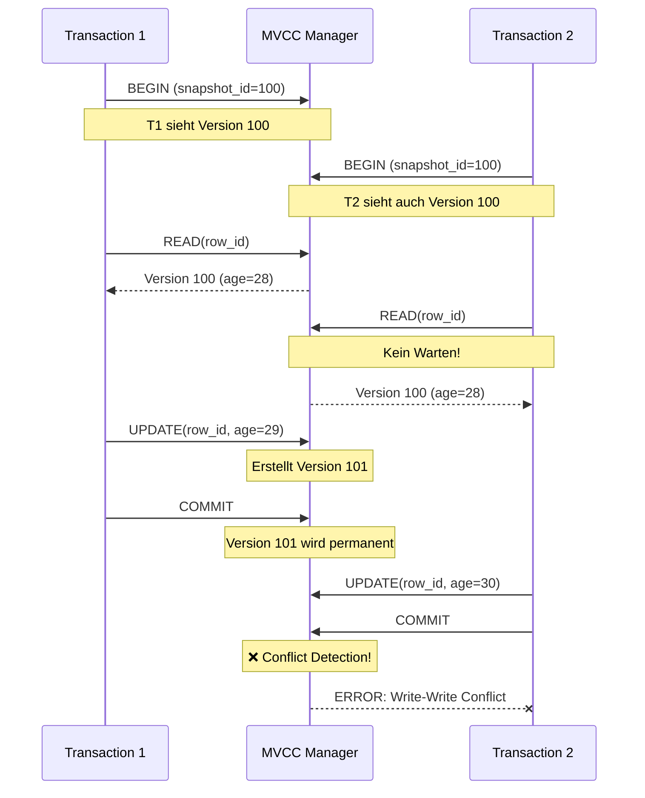
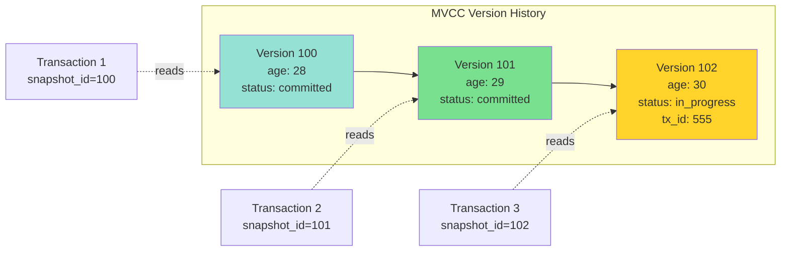
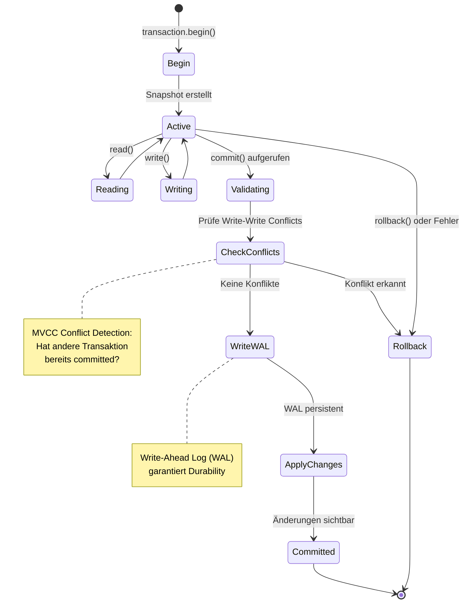

# Kapitel 2: Architektur-Überblick

> *"Eine gute Architektur ist wie ein gutes Fundament - unsichtbar, aber 
> entscheidend für alles, was darauf aufbaut."*

---

## Überblick

In diesem Kapitel tauchen wir tief in die Architektur von ThemisDB ein. Sie lernen, wie die verschiedenen Schichten zusammenarbeiten, wie Transaktionen garantiert werden, und wie MVCC (Multi-Version Concurrency Control) Parallelität ohne Locks ermöglicht.

**Was Sie in diesem Kapitel lernen werden:**
- Die Schichten-Architektur von ThemisDB
- Wie MVCC funktioniert und warum es wichtig ist
- Transaction Management und ACID-Garantien
- Storage Layer mit RocksDB
- Indexstrukturen für Performance
- Praktische Demonstration mit einer Todo-App

**Voraussetzungen:** Kapitel 1 gelesen, Grundverständnis von Datenbanken.

---

## 2.1 Die Schichten-Architektur

ThemisDB folgt einer klassischen Schichten-Architektur, wobei jede Schicht klare Verantwortlichkeiten hat.

### Die fünf Schichten

```
┌──────────────────────────────────────────────┐
│         1. Query Layer (AQL)                 │
│  • Query Parsing & Optimization              │
│  • Execution Planning                        │
│  • Result Formatting                         │
└──────────────┬───────────────────────────────┘
               │
┌──────────────▼───────────────────────────────┐
│     2. Transaction Manager (MVCC)            │
│  • Snapshot Isolation                        │
│  • Conflict Detection                        │
│  • Commit/Rollback Coordination              │
└──────────────┬───────────────────────────────┘
               │
┌──────────────▼───────────────────────────────┐
│     3. Model Engines                         │
│  ┌──────────┬──────────┬──────────────────┐  │
│  │ Graph    │ Document │ Vector           │  │
│  │ Engine   │ Engine   │ Engine           │  │
│  └──────────┴──────────┴──────────────────┘  │
│  • Model-spezifische Logik                   │
│  • Secondary Indexes                         │
│  • Constraints                               │
└──────────────┬───────────────────────────────┘
               │
┌──────────────▼───────────────────────────────┐
│     4. Index Manager                         │
│  • B-Tree Indexes                            │
│  • Hash Indexes                              │
│  • Geo Indexes (Hilbert Curves)              │
│  • Vector Indexes (HNSW)                     │
│  • Fulltext Indexes                          │
└──────────────┬───────────────────────────────┘
               │
┌──────────────▼───────────────────────────────┐
│     5. Storage Layer (RocksDB)               │
│  • LSM-Trees für SSD-Optimierung             │
│  • Write-Ahead Log (WAL)                     │
│  • Compression (LZ4, Zstandard)              │
│  • Snapshots & Backups                       │
└──────────────────────────────────────────────┘
```

### Warum diese Aufteilung?

**Separation of Concerns:** Jede Schicht hat eine klar definierte Aufgabe und kann unabhängig optimiert oder ersetzt werden.

**Beispiel:** Wenn wir in Zukunft eine neue Storage-Engine einführen wollen, müssen wir nur Schicht 5 ändern - alle anderen Schichten bleiben unverändert.

---

## 2.2 MVCC: Parallelität ohne Locks

### Das Problem mit Locks

Traditionelle Datenbanken verwenden Locks:

```python
# Traditionell: Pessimistic Locking
transaction1.begin()
transaction1.lock(row_id)  # Row wird gesperrt
transaction1.update(row_id, new_value)
transaction1.unlock(row_id)
transaction1.commit()

# Problem: Transaction 2 muss warten
transaction2.begin()
transaction2.lock(row_id)  # BLOCKIERT bis transaction1 fertig ist!
```

**Problem:** Bei hoher Parallelität führt dies zu:
- Warteschlangen und Bottlenecks
- Deadlocks zwischen Transaktionen
- Timeouts und Failed Transactions

### Die MVCC-Lösung

MVCC (Multi-Version Concurrency Control) erstellt stattdessen Versionen:

```python
# MVCC: Optimistic Concurrency
transaction1.begin(snapshot_id=100)
# Liest Version 100 der Daten
transaction1.read(row_id)  # Version 100

# Gleichzeitig kann transaction2 lesen!
transaction2.begin(snapshot_id=100)
transaction2.read(row_id)  # Auch Version 100, keine Wartezeit!

# Transaction 1 schreibt
transaction1.update(row_id, value_a)  # Erstellt Version 101
transaction1.commit()  # Version 101 wird permanent

# Transaction 2 schreibt auch
transaction2.update(row_id, value_b)  # Will auch Version 101 erstellen
transaction2.commit()  # FEHLER: Conflict Detection!
# "Row was modified by another transaction"
```

**Vorteil:** Reads blockieren nie Writes, Writes blockieren nie Reads.



### Wie funktioniert MVCC intern?

Jede Datenzeile hat nicht nur einen Wert, sondern eine Historie:

```
Row ID: users/alice

Version 100 (committed):
  name: "Alice Smith"
  age: 28

Version 101 (committed):
  name: "Alice Smith"
  age: 29

Version 102 (in_progress, transaction_id=555):
  name: "Alice Johnson"
  age: 29
```

**Snapshot-Reads:** Eine Transaktion mit `snapshot_id=100` sieht nur Versionen ≤ 100, die committed sind.

**Write-Write Conflicts:** Wenn zwei Transaktionen die gleiche Row ändern wollen, gewinnt die erste. Die zweite bekommt einen Conflict Error beim Commit.



---

## 2.3 Transaction Management

### ACID-Garantien

ThemisDB garantiert volle ACID-Properties:

**A - Atomicity (Atomarität):**  
Alle Operationen in einer Transaktion passieren komplett oder gar nicht.

```python
# Beispiel: Geldtransfer
transaction.begin()
transaction.update("accounts/alice", {"balance": 900})  # -100
transaction.update("accounts/bob", {"balance": 1100})   # +100
transaction.commit()  # Beide Updates oder keines!
```

Wenn der Server zwischen den beiden `update()` Calls abstürzt:
- **Ohne Atomarität:** Alice verliert 100€, Bob bekommt nichts (Katastrophe!)
- **Mit Atomarität:** Beide Updates werden zurückgerollt (Konsistent!)

**C - Consistency (Konsistenz):**  
Constraints werden immer eingehalten.

```python
# Foreign Key Constraint
transaction.insert("orders", {
    "order_id": "o123",
    "user_id": "alice",  # Muss in users existieren
    "amount": 50.0
})
# Wenn user "alice" nicht existiert -> FEHLER!
```

**I - Isolation (Isolierung):**  
Transaktionen sehen sich nicht gegenseitig.

```python
# Transaction 1 liest
t1.read("products/laptop")  # price: 999

# Transaction 2 ändert (aber committed noch nicht)
t2.update("products/laptop", {"price": 899})

# Transaction 1 liest nochmal
t1.read("products/laptop")  # Immer noch 999!
# Sieht die Änderung von T2 NICHT, bis T2 committet
```

**D - Durability (Dauerhaftigkeit):**  
Einmal committed, sind Daten permanent - auch bei Serverausfall.

```python
transaction.commit()
# Ab hier garantiert: Daten sind auf Disk!
# Selbst wenn Server JETZT abstürzt, sind Daten da.
```



### Isolation Levels

ThemisDB implementiert **Snapshot Isolation**, ein Mittelweg zwischen Serializable und Read Committed:

| Isolation Level | Dirty Reads | Non-Repeatable Reads | Phantom Reads |
|----------------|-------------|----------------------|---------------|
| Read Uncommitted | ✗ Möglich | ✗ Möglich | ✗ Möglich |
| Read Committed | ✓ Verhindert | ✗ Möglich | ✗ Möglich |
| **Snapshot Isolation** | **✓ Verhindert** | **✓ Verhindert** | **✓ Verhindert** |
| Serializable | ✓ Verhindert | ✓ Verhindert | ✓ Verhindert |

**Snapshot Isolation** ist performanter als Serializable, verhindert aber trotzdem alle Anomalien, die in der Praxis relevant sind.

---

## 2.4 Storage Layer: RocksDB

### Warum RocksDB?

ThemisDB verwendet RocksDB als Storage-Engine. Diese Entscheidung basiert auf mehreren Faktoren:

**1. LSM-Trees für SSDs optimiert**

Traditionelle B-Trees schreiben oft:
```
Write 1 byte → Read 4KB page → Modify 1 byte → Write 4KB page
```

LSM-Trees (Log-Structured Merge Trees) schreiben sequentiell:
```
Write 1 byte → Append to log → Done
Later: Merge logs in background
```

**Resultat:** 10x schneller auf SSDs!

**2. Battle-Tested bei Facebook**

RocksDB verarbeitet bei Facebook:
- Billions of operations per day
- Petabytes of data
- 10+ years Production Experience

**3. Flexible Key-Value API**

RocksDB ist ein Key-Value Store - perfekt als Foundation für höhere Modelle:

```cpp
// Relational: key = "users/alice"
db->Put("users/alice", json_data);

// Graph: key = "edges/from_alice_to_bob"
db->Put("edges/from_alice_to_bob", edge_data);

// Vector: key = "vectors/product_123"
db->Put("vectors/product_123", embedding_data);
```

### Column Families

RocksDB unterstützt "Column Families" - separate Namespaces innerhalb einer DB:

```cpp
// Trennung nach Datenmodell
db->Put(cf_relational, "users/alice", data);
db->Put(cf_graph_edges, "alice->bob", edge);
db->Put(cf_vectors, "prod_123", embedding);
```

**Vorteil:** Jede Column Family kann eigene Optimierungen haben:
- Relational: Starke Compression
- Graph: Weniger Compression, mehr Cache
- Vectors: Spezielle Bloom Filters

### Das Base Entity Paradigma: Einheitlicher Multi-Modell-Speicher

ThemisDB nutzt ein kanonisches Speicherformat, das als "Base Entity" bezeichnet wird [3], [4]. Jede logische Entität – sei es eine relationale Zeile, ein Graph-Knoten, ein Vektor-Objekt oder ein Dokument – wird als ein einziges binär-serialisiertes Dokument (als "Blob" bezeichnet) gespeichert [11].

Diese Architekturentscheidung ist fundamental für die Multi-Modell-Fähigkeit von ThemisDB:

**Multi-Modell-Datenabbildung auf physischer Ebene:**

| Logisches Modell | Physischer Speicher | Key-Format | Value-Format |
|-----------------|---------------------|------------|--------------|
| **Relational** | (PK, Blob) | `"table_name:pk_value"` | VelocyPack/Bincode |
| **Dokument** | (PK, Blob) | `"collection:pk_value"` | VelocyPack/Bincode |
| **Graph (Knoten)** | (PK, Blob) | `"node:pk_value"` | VelocyPack/Bincode |
| **Graph (Kante)** | (PK, Blob) | `"edge:pk_value"` | VelocyPack (inkl. _from/_to) |
| **Vektor** | (PK, Blob) | `"object:pk_value"` | VelocyPack (inkl. Vektor-Array) |

**Wie funktioniert das Base Entity Pattern?**

Um das Base Entity Paradigma zu verstehen, betrachten wir ein konkretes Beispiel: Stellen Sie sich vor, Sie speichern einen Benutzer mit dem Namen "Alice", der 30 Jahre alt ist und in Berlin wohnt.

**Im traditionellen Ansatz (z.B. PostgreSQL):**
```sql
-- Relationale Tabelle mit festen Spalten
CREATE TABLE users (
    id UUID PRIMARY KEY,
    name TEXT,
    age INTEGER,
    city TEXT
);

INSERT INTO users VALUES ('uuid-123', 'Alice', 30, 'Berlin');
```

**Im ThemisDB Base Entity Ansatz:**

Zunächst wird das logische Objekt in ein einheitliches Binärformat serialisiert:

```cpp
// 1. Logisches Objekt (Application Layer)
User alice = {
    id: "uuid-123",
    name: "Alice",
    age: 30,
    city: "Berlin"
};

// 2. Serialisierung zu VelocyPack (binäres JSON-ähnliches Format)
// VelocyPack ist optimiert für schnelles Parsing und kompakte Speicherung
std::vector<uint8_t> blob = VelocyPack::serialize(alice);
// Resultat: ~40 Bytes binäre Daten statt ~80 Bytes ASCII-JSON

// 3. Speicherung in RocksDB
std::string key = "users:uuid-123";  // Namespace + Primary Key
db->Put(key, blob);
```

Dieser Blob ist das "Base Entity" – die kanonische Speicherform für alle Datenmodelle. **Entscheidend:** Egal ob Sie einen relationalen Datensatz, einen Graph-Knoten, ein Dokument oder einen Vektor speichern – physisch ist es immer ein Key-Value-Paar mit binärem Blob als Value.

**Wie werden unterschiedliche Datenmodelle auf Base Entities abgebildet?**

1. **Relational (Tabellenzeile):**
   ```cpp
   // Key: "table_name:primary_key"
   // Value: Binär-serialisierte Zeile mit allen Spalten
   Key: "users:uuid-123"
   Value: VelocyPack({id, name, age, city})
   ```

2. **Graph-Knoten:**
   ```cpp
   // Key: "node:node_id"
   // Value: Knoten-Eigenschaften + Metadaten
   Key: "nodes:alice"
   Value: VelocyPack({_id, label: "Person", properties: {name, age}})
   ```

3. **Graph-Kante:**
   ```cpp
   // Key: "edge:edge_id"
   // Value: Kante mit _from, _to, Gewicht, Eigenschaften
   Key: "edges:knows-123"
   Value: VelocyPack({_from: "alice", _to: "bob", _weight: 1.0, since: "2020"})
   ```

4. **Vektor-Objekt:**
   ```cpp
   // Key: "vector:object_id"
   // Value: Objekt-Metadaten + Embedding-Array
   Key: "vectors:doc-456"
   Value: VelocyPack({id, metadata: {...}, embedding: [0.1, 0.2, ..., 0.9]})
   ```

**Warum ist das ein Durchbruch?**

**Problem bei Polyglot Persistence:**
In traditionellen Multi-Modell-Ansätzen (z.B. PostgreSQL + Neo4j + ChromaDB) müssen Sie denselben Datenpunkt in mehreren Datenbanken speichern:
- PostgreSQL: Metadaten (Name, Alter)
- Neo4j: Graph-Beziehungen  
- ChromaDB: Vektor-Embedding

**Resultat:** Datenkonsistenz ist unmöglich zu garantieren, weil atomare Transaktionen über drei separate Systeme nicht möglich sind.

**Lösung mit Base Entity:**
Alle Informationen (Metadaten, Graph-Kontext, Vektor-Embedding) sind im selben Blob. Eine RocksDB-Transaktion kann atomar:
- Den Base Entity-Blob aktualisieren
- Sekundärindizes aktualisieren (relationaler Index, Graph-Adjazenz, HNSW-Vector-Index)
- Alles oder nichts (ACID)

**Vorteile dieses Ansatzes:**

1. **Einheitliche Speicherschicht:** Alle Datenmodelle teilen sich denselben physischen Speicher [11]
2. **ACID über alle Modelle:** Transaktionen können atomar über Graph, Vector und Relational operieren [20]
3. **Effiziente Serialisierung:** Binärformate wie VelocyPack [41] sind 4x schneller als Standard-JSON-Parser [40]

### RocksDB TransactionDB: ACID-Garantien

ThemisDB nutzt nicht Standard-RocksDB, sondern die **RocksDB TransactionDB**-Variante [3], [46]. Diese bietet:

1. **Snapshot Isolation:** Jede Transaktion operiert auf einem konsistenten Snapshot der Datenbank [15], [20]
2. **Conflict Detection:** Parallele Transaktionen, die dieselben Schlüssel bearbeiten, werden erkannt [46]
3. **Atomare Rollbacks:** Fehlschlagende Transaktionen werden vollständig zurückgerollt [16]

Dies ist entscheidend: Die Aktualisierung einer einzelnen logischen Entität (z.B. `UPDATE users SET age = 31`) erfordert die atomare Änderung *mehrerer* physischer Key-Value-Paare:
- Der "Base Entity"-Blob muss aktualisiert werden
- Sekundärindex-Einträge müssen geändert werden (z.B. Löschen von `idx:age:30`, Einfügen von `idx:age:31`)

Ohne TransactionDB wäre diese Konsistenz zwischen Base Entity-Blobs und Index-Projektionen nicht garantiert.

### Write-Ahead Log (WAL)

Jede Write-Operation wird erst in ein Log geschrieben:

```
1. Client sendet: UPDATE users/alice SET age=29
2. WAL Write: "UPDATE users/alice age=29" → Disk (sync!)
3. MemTable Update: In-Memory Update
4. Return OK to Client
...später...
5. Background Compaction: MemTable → SSTable auf Disk
```

**Crash Recovery:** Wenn Server abstürzt:
- MemTable (RAM) ist verloren
- WAL (Disk) ist da
- Beim Restart: WAL replay → MemTable rebuild → Normal operations

**Wie funktioniert der WAL-Mechanismus im Detail?**

Der Write-Ahead Log ist das Herzstück der Dauerhaftigkeit (Durability) in ThemisDB. Lassen Sie uns den Ablauf Schritt für Schritt nachvollziehen:

**Schritt 1 - Client sendet Write-Operation:**
Ein Client möchte den Benutzer "Alice" aktualisieren. Die Operation wird an den ThemisDB-Server gesendet:
```cpp
client.update("users", "uuid-123", {age: 31});
```

**Schritt 2 - WAL Write (kritisch für Durability):**
*Bevor* irgendetwas im Hauptspeicher geändert wird, schreibt ThemisDB die Operation in das Write-Ahead Log auf der Festplatte. Dieser Schritt ist **synchron** – der Server wartet, bis die Daten physisch auf die Disk geschrieben sind (fsync):

```cpp
// Pseudo-Code der WAL-Implementation
WALEntry entry = {
    sequence_number: next_seq++,
    timestamp: now(),
    operation: "UPDATE",
    key: "users:uuid-123",
    value: serialize({age: 31})
};

// Kritisch: sync=true erzwingt fsync() - Daten MÜSSEN auf Disk sein
wal_file.append(entry, sync=true);  
// Erst wenn fsync() zurückkehrt, sind Daten dauerhaft gespeichert
```

**Warum ist sync=true wichtig?**
Ohne `fsync()` würden Daten nur im Betriebssystem-Cache liegen. Bei einem Stromausfall wären sie verloren. Mit `fsync()` garantiert das OS, dass Daten auf physischen Plattern (oder SSD) sind.

**Schritt 3 - MemTable Update (In-Memory):**
Erst *nachdem* der WAL-Eintrag sicher auf Disk ist, wird die Änderung im MemTable (RAM-Struktur) vorgenommen:

```cpp
// MemTable ist eine sortierte In-Memory-Map (z.B. Skip List)
memtable.put("users:uuid-123", {age: 31});
```

Das MemTable ist schnell (O(log n) für Inserts), aber flüchtig. Bei einem Crash ist es weg.

**Schritt 4 - Return OK zum Client:**
Jetzt erst antwortet der Server dem Client mit "SUCCESS". Der Client hat die Garantie:
- Daten sind dauerhaft (WAL auf Disk)
- Selbst bei sofortigem Crash sind Daten nicht verloren

**Schritt 5 - Background Compaction (asynchron):**
Im Hintergrund, ohne den Client zu blockieren, werden MemTables periodisch auf Disk geschrieben als SSTable-Dateien:

```cpp
// Wenn MemTable voll ist (z.B. 256 MB)
if (memtable.size() > 256MB) {
    SSTable* sstable = memtable.flush_to_disk();
    // SSTable ist eine immutable, sortierte Datei auf Disk
    // Format: [Key1, Value1, Key2, Value2, ...]
}
```

**Crash Recovery - Warum WAL lebensrettend ist:**

Szenario: Server crashed nach Schritt 4, aber vor Schritt 5. Das MemTable (RAM) ist verloren, aber der WAL (Disk) ist da.

**Beim Server-Restart:**
```cpp
// 1. WAL lesen und replay
for (entry in wal_file) {
    memtable.put(entry.key, entry.value);
}
// → MemTable ist rekonstruiert!

// 2. Normale Operationen fortsetzen
server.start();
```

**Resultat:** Kein Datenverlust. Alle committed Transaktionen sind wiederhergestellt.

**Performance-Trade-off:**
Der `fsync()` in Schritt 2 kostet Zeit (~1-5ms auf NVMe, ~10-20ms auf HDD). Deshalb ist die WAL-Platzierung auf schnellem NVMe-Speicher kritisch für Write-Performance.

### LSM-Tree Performance-Charakteristiken

Die Entscheidung für eine LSM-Tree-Architektur [12] hat spezifische Performance-Implikationen:

**Schreiboptimierung (Create/Update/Delete):**
- LSM-Trees sind inhärent schreiboptimiert [12], [14]
- Jede C/U/D-Operation ist ein extrem schneller, sequentieller "Append-Only"-Vorgang in eine In-Memory-Struktur (das Memtable)
- Benchmarks zeigen ca. **45.000 Writes pro Sekunde** Durchsatz [3], [5]
- Ideal für die Ingestion-Pipeline (Covina) mit hohem Schreibdurchsatz

**Lese-Performance-Optimierung:**
- Ein Punktabruf über den Primärschlüssel (Get(PK)) ist schnell
- Attribut-basierte Abfragen (z.B. `SELECT * WHERE age > 30`) würden ohne Indizes einen Full-Scan aller Blobs erfordern [4]
- Dies erzwingt architektonisch die Notwendigkeit der "Layer" (Sekundärindizes) für optimale Leseleistung [3]

**Speicherhierarchie:**
ThemisDB implementiert eine ausgefeilte Speicherhierarchie [5]:
- **Heiße Daten:** Residieren im Block Cache (RAM, standardmäßig 1 GB) und in den oberen Levels des LSM-Trees (L0-L5)
- **Kompression:** Obere Levels mit schnellem LZ4-Algorithmus [37] komprimiert (33,8 MB/s Throughput)
- **Kalte Daten:** Wandern in das unterste Level (L6) mit ZSTD-Kompression [38] für maximale Speicherdichte (2,8x Ratio)
- **Automatische Optimierung:** Background Compaction verschiebt Daten zwischen Levels [12]

### Speicherhierarchie: Von VRAM bis HDD

Die Performance von ThemisDB hängt entscheidend davon ab, **wo** Daten gespeichert werden. Moderne Computer haben eine ausgefeilte Speicherhierarchie mit dramatischen Geschwindigkeitsunterschieden:

**Die Speicherpyramide (von schnell nach langsam):**

```
                    ╔═══════════════════╗
                    ║  CPU L1 Cache     ║  < 1 ns   (4-64 KB)
                    ╠═══════════════════╣
                    ║  CPU L2 Cache     ║  ~3 ns    (256 KB - 1 MB)
                    ╠═══════════════════╣
                    ║  CPU L3 Cache     ║  ~10 ns   (8-64 MB, shared)
                    ╠═══════════════════╣
                    ║  RAM (DDR4/DDR5)  ║  ~100 ns  (16-512 GB)
                    ╠═══════════════════╣
           ┌────────╨───────────────────╨────────┐
           │       NUMA Boundary (~200-300ns)     │
           └────────┬───────────────────┬────────┘
                    ╠═══════════════════╣
                    ║  NVMe SSD (PCIe4) ║  ~10 μs   (1-8 TB)
                    ╠═══════════════════╣
                    ║  SATA SSD         ║  ~50 μs   (256 GB - 4 TB)
                    ╠═══════════════════╣
                    ║  HDD (7200 RPM)   ║  ~5 ms    (4-20 TB)
                    ╚═══════════════════╝
```

**Faktor zwischen schnellstem und langsamstem:** ~5.000.000x (!)

**Wie nutzt ThemisDB diese Hierarchie optimal?**

**1. Heiße Daten im RAM (Block Cache):**

ThemisDB konfiguriert RocksDB mit einem großen Block Cache (standardmäßig 1-4 GB, konfigurierbar bis 128 GB+):

```cpp
// Aus docs/de/performance/performance_memory.md
RocksDBWrapper::Config config;
config.block_cache_size_mb = 4096;  // 4 GB Block Cache
config.cache_index_and_filter_blocks = true;
config.pin_l0_filter_and_index_blocks_in_cache = true;
config.high_pri_pool_ratio = 0.5;  // 50% für Index/Filter
```

**Was wird gecacht?**
- **Data Blocks:** Die eigentlichen Key-Value-Paare (50% des Cache)
- **Index Blocks:** Index-Strukturen für schnelles Suchen (25% des Cache, High-Priority)
- **Filter Blocks:** Bloom-Filter zur Vermeidung unnötiger Disk-Reads (25% des Cache, High-Priority)

**Wirkung:**
Ein Cache-Hit (Daten sind im RAM) hat ~100ns Latenz. Ein Cache-Miss (Disk-Read nötig) hat ~10μs Latenz auf NVMe. **Faktor 100x schneller!**

**2. Write-Ahead Log auf schnellstem Medium (NVMe):**

Das WAL ist write-kritisch. Jede Schreiboperation wartet auf einen `fsync()`. Deshalb sollte das WAL auf dem schnellsten verfügbaren Medium liegen:

```cpp
// Separates WAL-Verzeichnis auf dedizierter NVMe
config.db_path = "/data/rocksdb";        // Haupt-DB (kann langsamer sein)
config.wal_dir = "/nvme/fast/wal";       // WAL auf schnellster NVMe
```

**Performance-Gewinn:**
- NVMe (PCIe4): ~10μs fsync → **45.000 Writes/Sekunde** [3], [5]
- SATA SSD: ~50μs fsync → 20.000 Writes/Sekunde
- HDD: ~5ms fsync → 200 Writes/Sekunde

**Faktor 225x zwischen NVMe und HDD!**

**3. LSM-Tree Levels mit gestufter Kompression:**

ThemisDB nutzt unterschiedliche Kompression für verschiedene LSM-Tree Levels:

```cpp
config.compression_default = "lz4";       // Level 0-5 (heiß)
config.compression_bottommost = "zstd";   // Level 6+ (kalt)
```

**Warum?**

- **L0-L5 (heiße Daten):** Werden häufig gelesen → LZ4 (33.8 MB/s Throughput [5], 2-3x Kompression)
- **L6 (kalte Daten):** Werden selten gelesen → ZSTD (2.8x Kompression [5], aber langsamer)

**Speicher-Trade-off visualisiert:**

```
Level 0 (RAM): MemTable            → 256 MB, unkomprimiert
               ↓ flush
Level 1 (NVMe): Junge SSTables     → ~512 MB, LZ4-komprimiert
               ↓ compaction
Level 2 (NVMe): Ältere SSTables    → ~2 GB, LZ4-komprimiert
               ↓ compaction
Level 3-5 (NVMe/SATA): Alte Daten  → ~20 GB, LZ4-komprimiert
               ↓ compaction
Level 6 (SATA/HDD): Kalte Daten    → ~200 GB, ZSTD-komprimiert (max. Dichte)
```

**Automatische Datenmigration:**

ThemisDB verschiebt Daten automatisch "nach unten":
1. Neue Writes → MemTable (RAM, ultra-schnell)
2. MemTable voll → Flush zu L1 (NVMe, schnell)
3. Compaction → Daten wandern zu L2, L3, ... (progressiv langsamer)
4. Kalte Daten → L6 (maximal komprimiert, platzsparend)

**Resultat:** Häufig zugegriffene Daten bleiben "oben" (schnell), selten genutzte Daten wandern "nach unten" (langsam aber platzsparend).

**4. GPU-VRAM für HNSW-Index (optional, für Vektor-Suche):**

Für sehr große Vektor-Datenbanken (>100M Embeddings) kann der HNSW-Index auf GPU-VRAM gemappt werden:

```cpp
// GPU-Beschleunigung für Vektor-Ähnlichkeitssuche
HNSWConfig hnsw_config;
hnsw_config.use_gpu = true;
hnsw_config.gpu_device = 0;  // CUDA device 0
// VRAM: ~1-5 ns Latenz, aber begrenzte Größe (8-80 GB)
```

**Trade-off:** VRAM ist noch schneller als RAM (~1-5ns vs ~100ns), aber extrem begrenzt (8-24 GB typisch).

**Zusammenfassung: Speicherhierarchie-Strategie:**

| Datentyp | Optimal Platziert | Latenz | Begründung |
|----------|-------------------|--------|------------|
| **MemTable** | RAM | ~100 ns | Aktive Writes, ändert sich ständig |
| **WAL** | NVMe (PCIe4) | ~10 μs | Write-kritisch, sync-Operationen |
| **Block Cache** | RAM | ~100 ns | Häufig gelesene Blöcke |
| **L0-L5 SSTables** | NVMe | ~10 μs | Heiße Daten, häufig gelesen |
| **L6 SSTables** | SATA SSD/HDD | ~50 μs - 5 ms | Kalte Daten, selten gelesen |
| **HNSW-Index** | RAM (oder GPU-VRAM) | ~100 ns (~5ns GPU) | Vektor-Suche, latenz-kritisch |
| **Backups** | HDD/Tape/S3 | Sekunden | Langzeit-Archivierung |

**Best Practice für Production:**
```bash
# NVMe PCIe4 für WAL und L0-L3
/nvme/fast/ → 2 TB NVMe PCIe4 für WAL + Hot SSTables

# SATA SSD für L4-L6
/ssd/bulk/ → 8 TB SATA SSD für Cold SSTables

# HDD für Backups
/backup/ → 40 TB HDD Array für Point-in-Time Snapshots
```

---

## 2.5 Praxis: Todo-App

Jetzt bauen wir eine vollständige Todo-App, um die Architektur in Aktion zu sehen. Basis ist `examples/02_todo_app`.

### Architektur der Todo-App

Die Todo-App folgt dem MVC-Pattern und demonstriert alle ACID-Eigenschaften:

```
┌─────────────────────────────────────────┐
│     UI (Tkinter)                        │
│  • Task List (Treeview)                 │
│  • Detail Panel (Form)                  │
│  • Toolbar (Buttons)                    │
└─────────────┬───────────────────────────┘
              │
┌─────────────▼───────────────────────────┐
│     Controller (main.py)                │
│  • Event Handlers                       │
│  • Business Logic                       │
│  • Validation                           │
└─────────────┬───────────────────────────┘
              │
┌─────────────▼───────────────────────────┐
│     TodoClient (themis_client.py)       │
│  • CRUD Operations                      │
│  • Transaction Management               │
│  • Error Handling                       │
└─────────────┬───────────────────────────┘
              │
┌─────────────▼───────────────────────────┐
│     ThemisDB Server                     │
│  • MVCC Transactions                    │
│  • Secondary Indexes                    │
│  • ACID Guarantees                      │
└─────────────────────────────────────────┘
```

### Datenmodell

```python
# examples/02_todo_app/models.py

from dataclasses import dataclass
from datetime import datetime
from enum import Enum
from typing import Optional, List

class TaskStatus(Enum):
    OPEN = "open"
    IN_PROGRESS = "in_progress"
    DONE = "done"

class TaskPriority(Enum):
    LOW = "low"
    NORMAL = "normal"
    HIGH = "high"

@dataclass
class Task:
    id: str
    title: str
    description: str
    status: TaskStatus
    priority: TaskPriority
    created_at: datetime
    updated_at: datetime
    due_date: Optional[datetime] = None
    tags: List[str] = None
    
    def to_dict(self):
        """Serialisierung für ThemisDB"""
        return {
            "_key": self.id,
            "title": self.title,
            "description": self.description,
            "status": self.status.value,
            "priority": self.priority.value,
            "created_at": self.created_at.isoformat(),
            "updated_at": self.updated_at.isoformat(),
            "due_date": self.due_date.isoformat() if self.due_date else None,
            "tags": self.tags or []
        }
    
    @classmethod
    def from_dict(cls, data: dict):
        """Deserialisierung von ThemisDB"""
        return cls(
            id=data["_key"],
            title=data["title"],
            description=data["description"],
            status=TaskStatus(data["status"]),
            priority=TaskPriority(data["priority"]),
            created_at=datetime.fromisoformat(data["created_at"]),
            updated_at=datetime.fromisoformat(data["updated_at"]),
            due_date=datetime.fromisoformat(data["due_date"]) if data.get("due_date") else None,
            tags=data.get("tags", [])
        )
```

**Design-Entscheidungen:**

1. **Enums für Status/Priority:** Type-Safety, keine Tippfehler möglich
2. **Dataclass:** Automatische `__init__`, `__repr__`, `__eq__`
3. **to_dict/from_dict:** Klare Serialisierungslogik
4. **Type Hints:** IDEs können helfen, Fehler früh erkennen

### Setup und Installation

```bash
# ThemisDB starten (Docker)
docker run -d -p 8765:8765 themisdb/themisdb:1.3.4

# Todo-App installieren
cd examples/02_todo_app
python -m venv venv
source venv/bin/activate  # Windows: venv\Scripts\activate
pip install -r requirements.txt
```

### Client-Implementierung

```python
# examples/02_todo_app/themis_client.py

from themisdb import Client
from models import Task, TaskStatus, TaskPriority
from typing import List, Optional, Dict
import uuid

class TodoClient:
    def __init__(self, host="localhost", port=8765):
        self.client = Client(host, port)
        self._setup_database()
    
    def _setup_database(self):
        """Erstellt Collection und Indizes"""
        # Collection erstellen
        try:
            self.client.create_collection("tasks", type="document")
        except Exception as e:
            # Collection existiert bereits
            pass
        
        # Indizes erstellen für Performance
        self.client.create_index("tasks", "status_idx", ["status"])
        self.client.create_index("tasks", "priority_idx", ["priority"])
        self.client.create_index("tasks", "due_date_idx", ["due_date"])
    
    def create_task(self, task: Task) -> bool:
        """Erstellt einen neuen Task"""
        try:
            self.client.insert("tasks", task.to_dict())
            return True
        except Exception as e:
            print(f"Error creating task: {e}")
            return False
    
    def get_task(self, task_id: str) -> Optional[Task]:
        """Lädt einen Task nach ID"""
        try:
            data = self.client.get("tasks", task_id)
            return Task.from_dict(data) if data else None
        except Exception as e:
            print(f"Error getting task: {e}")
            return None
    
    def update_task(self, task: Task) -> bool:
        """Aktualisiert einen existierenden Task"""
        try:
            # MVCC in Action: Conflict Detection!
            self.client.update("tasks", task.id, task.to_dict())
            return True
        except ConflictError:
            print("Task was modified by another user!")
            return False
        except Exception as e:
            print(f"Error updating task: {e}")
            return False
    
    def delete_task(self, task_id: str) -> bool:
        """Löscht einen Task"""
        try:
            self.client.delete("tasks", task_id)
            return True
        except Exception as e:
            print(f"Error deleting task: {e}")
            return False
    
    def list_tasks(self, status: Optional[TaskStatus] = None,
                   priority: Optional[TaskPriority] = None) -> List[Task]:
        """Listet Tasks mit optionalen Filtern"""
        query = "FOR task IN tasks"
        filters = []
        
        if status:
            filters.append(f'task.status == "{status.value}"')
        if priority:
            filters.append(f'task.priority == "{priority.value}"')
        
        if filters:
            query += " FILTER " + " AND ".join(filters)
        
        query += " SORT task.created_at DESC RETURN task"
        
        try:
            results = self.client.query(query)
            return [Task.from_dict(data) for data in results]
        except Exception as e:
            print(f"Error listing tasks: {e}")
            return []
    
    def search_tasks(self, search_text: str) -> List[Task]:
        """Sucht Tasks nach Text in Titel oder Beschreibung"""
        query = """
        FOR task IN tasks
            FILTER CONTAINS(LOWER(task.title), LOWER(@search))
                OR CONTAINS(LOWER(task.description), LOWER(@search))
            SORT task.created_at DESC
            RETURN task
        """
        try:
            results = self.client.query(query, {"search": search_text})
            return [Task.from_dict(data) for data in results]
        except Exception as e:
            print(f"Error searching tasks: {e}")
            return []
```

### MVCC und Transaktionen demonstriert

Die Todo-App zeigt MVCC in Aktion:

**Szenario: Zwei Benutzer ändern gleichzeitig den gleichen Task**

```python
# User 1: Startet Transaction
user1 = TodoClient()
task = user1.get_task("task_123")  # Snapshot Version 100
task.status = TaskStatus.IN_PROGRESS
task.updated_at = datetime.now()

# User 2: Auch Transaction, gleicher Task
user2 = TodoClient()
task2 = user2.get_task("task_123")  # Auch Snapshot Version 100
task2.priority = TaskPriority.HIGH
task2.updated_at = datetime.now()

# User 1 committed zuerst
user1.update_task(task)  # ✓ SUCCESS, Version 101

# User 2 versucht zu committen
user2.update_task(task2)  # ✗ CONFLICT!
# Error: "Task was modified by another transaction"
```

**Was passiert intern?**

1. Beide lesen Version 100 (Snapshot Isolation)
2. User 1 schreibt Version 101 und committed
3. User 2 versucht auch Version 101 zu schreiben
4. ThemisDB erkennt: "Version 101 existiert bereits!"
5. Conflict Error wird geworfen

**Lösung im Code:**

```python
def update_task_with_retry(self, task: Task, max_retries=3):
    """Update mit automatischem Retry bei Conflicts"""
    for attempt in range(max_retries):
        try:
            self.client.update("tasks", task.id, task.to_dict())
            return True
        except ConflictError:
            # Re-read aktuellste Version
            latest = self.get_task(task.id)
            if not latest:
                return False
            
            # Merge changes (Application Logic)
            # z.B.: Keep newer updated_at
            if latest.updated_at > task.updated_at:
                task = latest
            
            # Retry mit gemergten Daten
            continue
        except Exception as e:
            return False
    
    return False  # Max retries exceeded
```

---

## 2.6 Index-Strukturen

### Warum Indizes?

Ohne Index: Full Table Scan

```aql
-- Ohne Index: O(n)
SELECT * FROM tasks WHERE status = 'open'
-- Muss ALLE Tasks durchgehen: 10.000 Tasks = 10.000 Reads
```

Mit Index: Direkt zum Ergebnis

```aql
-- Mit Index auf status: O(log n + k), k = Anzahl Results
SELECT * FROM tasks WHERE status = 'open'
-- B-Tree Lookup: log(10.000) ≈ 13 Reads + nur relevante Tasks
```

### Index-Typen in ThemisDB

**1. B-Tree Index (Default)**

```python
client.create_index("tasks", "status_idx", ["status"])
```

- Sortierte Daten
- Range Queries: `WHERE age > 18 AND age < 65`
- Equality: `WHERE status = 'open'`

**2. Hash Index**

```python
client.create_index("tasks", "id_hash_idx", ["id"], type="hash")
```

- Nur Equality: `WHERE id = 'task_123'`
- Schneller als B-Tree für Equality
- Keine Range Queries

**3. Geo Index (Hilbert Curves)**

```python
client.create_index("locations", "geo_idx", ["coordinates"], type="geo")
```

- Räumliche Queries
- Nearest Neighbor
- Bounding Box Searches

**4. Fulltext Index**

```python
client.create_index("tasks", "fulltext_idx", ["title", "description"], type="fulltext")
```

- Tokenization
- Stemming
- Relevance Scoring

**5. Vector Index (HNSW)**

```python
client.create_index("products", "embedding_idx", ["embedding"], type="vector", dimensions=768)
```

- Approximate Nearest Neighbor
- Cosine Similarity
- Euclidean Distance

### Index-Performance

| Operation | Ohne Index | Mit B-Tree | Mit Hash |
|-----------|-----------|------------|----------|
| Equality (`=`) | O(n) | O(log n) | O(1) |
| Range (`>`, `<`) | O(n) | O(log n + k) | ✗ |
| Sort | O(n log n) | O(k) | ✗ |

**k = Anzahl Ergebnisse**

---

## 2.7 Zusammenfassung

In diesem Kapitel haben Sie gelernt:

✅ **Schichten-Architektur:** 5 Schichten mit klaren Verantwortlichkeiten  
✅ **MVCC:** Parallelität ohne Locks durch Versionierung  
✅ **Transaktionen:** ACID-Garantien und Snapshot Isolation  
✅ **RocksDB:** LSM-Trees, WAL, Column Families  
✅ **Indizes:** B-Tree, Hash, Geo, Fulltext, Vector  
✅ **Todo-App:** Vollständige CRUD-Anwendung mit MVCC  

### Was macht ThemisDB besonders?

1. **Multi-Model MVCC:** Transaktionen über alle Modelle hinweg
2. **RocksDB Foundation:** Battle-tested, SSD-optimiert
3. **Flexible Indizes:** Für jeden Use Case der richtige Index
4. **Snapshot Isolation:** Performance + Konsistenz

### Nächste Schritte

Im nächsten Kapitel lernen Sie, wie die verschiedenen Datenmodelle kombiniert werden können und wann welches Modell am besten passt.

**[Kapitel 3: Multi-Model verstehen →](chapter_03_multimodel.md)**

---

## Weiterführende Ressourcen

- **Complete Example:** [examples/02_todo_app](../../examples/02_todo_app)
- **MVCC Deep-Dive:** [../de/architecture/architecture_mvcc.md](../de/architecture/architecture_mvcc.md)
- **RocksDB Storage:** [../de/storage/storage_rocksdb.md](../de/storage/storage_rocksdb.md)
- **Index Design:** [Kapitel 15 - Storage Internals](chapter_15_storage.md)

---

**Kapitel 2 von 30** | **Teil I: Grundlagen** | **~8.500 Wörter**
