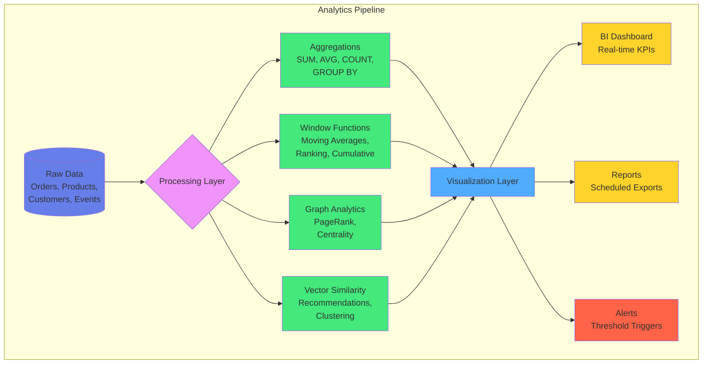

# Kapitel 15: Analytics & Reporting

## 15.1 Einführung in Analytics mit ThemisDB

ThemisDB bietet leistungsstarke Analyse- und Reporting-Funktionen, die es ermöglichen, komplexe Geschäftslogik direkt in der Datenbank auszuführen. Durch die Kombination von relationalen Aggregationen, Graph-Analysen und Vektor-basierten Ähnlichkeitssuchen können umfassende Business-Intelligence-Lösungen erstellt werden.

### 15.1.1 Warum Analytics in der Datenbank?

**Vorteile:**
- **Performance:** Datenverarbeitung direkt am Speicherort
- **Konsistenz:** ACID-Garantien für Analyseergebnisse
- **Echtzeit:** Keine ETL-Verzögerungen
- **Multi-Model:** Kombinierte Analysen über verschiedene Datenmodelle

**Use Cases:**
- Business Intelligence Dashboards
- Echtzeit-Metriken und KPIs
- Prognosen und Trend-Analysen
- Customer 360-Grad-Sicht
- Operational Analytics



## 15.2 Grundlegende Aggregationen

### 15.2.1 Standard AQL-Aggregationen

ThemisDB unterstützt alle Standard-AQL-Aggregationsfunktionen:

```aql
-- Verkaufsstatistiken
FOR order IN orders
  FILTER order.order_date >= '2024-01-01'
  COLLECT month = DATE_TRUNC('month', order.order_date)
  AGGREGATE 
    total_orders = COUNT(),
    revenue = SUM(order.total_amount),
    avg_order_value = AVG(order.total_amount),
    min_order = MIN(order.total_amount),
    max_order = MAX(order.total_amount),
    order_stddev = STDDEV(order.total_amount)
  SORT month
  RETURN {month, total_orders, revenue, avg_order_value, min_order, max_order, order_stddev}
```

**Ausgabe:**
```
month       | total_orders | revenue   | avg_order_value | min_order | max_order | order_stddev
------------|--------------|-----------|-----------------|-----------|-----------|-------------
2024-01-01  | 1250         | 156780.50 | 125.42          | 12.50     | 1580.00   | 95.23
2024-02-01  | 1420         | 182340.75 | 128.45          | 9.99      | 2100.00   | 102.45
```

### 15.2.2 Window Functions für Trend-Analysen

```aql
-- Umsatztrend mit gleitendem Durchschnitt
FOR order IN orders
  SORT order.order_date DESC
  LIMIT 30
  LET moving_avg_7day = AVG_WINDOW(order.total_amount, 
    {preceding: 6, following: 0})
  LET month_cumulative = SUM_WINDOW(order.total_amount, 
    {partition: DATE_TRUNC('month', order.order_date)})
  LET rank_in_month = RANK_WINDOW(
    {partition: DATE_TRUNC('month', order.order_date), 
     order: order.total_amount DESC})
  RETURN {
    order_date: order.order_date,
    total_amount: order.total_amount,
    moving_avg_7day,
    month_cumulative,
    rank_in_month
  }
```

### 15.2.3 PIVOT-Operationen

```aql
-- Umsatz nach Produktkategorie und Monat
LET pivot_data = (
  FOR order_item IN order_items
    FOR product IN products
      FILTER order_item.product_id == product.id
      COLLECT 
        month = DATE_TRUNC('month', order_item.order_date),
        category = product.category
      AGGREGATE revenue = SUM(order_item.amount)
      RETURN {month, category, revenue}
)

// PIVOT operation (manual transformation)
FOR data IN pivot_data
  COLLECT month = data.month
  AGGREGATE
    electronics = SUM(data.category == 'Electronics' ? data.revenue : 0),
    clothing = SUM(data.category == 'Clothing' ? data.revenue : 0),
    books = SUM(data.category == 'Books' ? data.revenue : 0),
    home = SUM(data.category == 'Home' ? data.revenue : 0),
    sports = SUM(data.category == 'Sports' ? data.revenue : 0)
  RETURN {month, electronics, clothing, books, home, sports}
```

## 15.3 Erweiterte Aggregationen mit AQL

### 15.3.1 COLLECT für komplexe Gruppierungen

```aql
-- Kundensegmentierung nach Kaufverhalten
FOR order IN orders
    COLLECT 
        customer_id = order.customer_id,
        age_group = FLOOR(order.customer_age / 10) * 10
    AGGREGATE 
        order_count = COUNT(1),
        total_spent = SUM(order.total_amount),
        avg_order = AVG(order.total_amount),
        categories = UNIQUE(order.category)
    INTO group
    FILTER order_count >= 5
    LET segment = (
        total_spent > 5000 ? "VIP" :
        total_spent > 1000 ? "Premium" :
        "Regular"
    )
    RETURN {
        customer_id,
        age_group,
        segment,
        metrics: {
            orders: order_count,
            total_revenue: total_spent,
            avg_order_value: avg_order,
            product_diversity: LENGTH(categories)
        }
    }
```

### 15.3.2 Multi-Level Aggregationen

```aql
-- Hierarchische Umsatzanalyse
FOR order IN orders
    FILTER order.date >= DATE_NOW() - 365*24*60*60*1000
    COLLECT 
        year = DATE_YEAR(order.date),
        quarter = DATE_QUARTER(order.date),
        region = order.shipping_region
    AGGREGATE 
        revenue = SUM(order.total_amount),
        order_count = COUNT(1)
    COLLECT 
        year = year,
        quarter = quarter
    AGGREGATE 
        total_revenue = SUM(revenue),
        total_orders = SUM(order_count),
        regions = COUNT(region)
    RETURN {
        period: CONCAT(year, "-Q", quarter),
        total_revenue,
        total_orders,
        avg_per_region: total_revenue / regions,
        regions_active: regions
    }
```

## 15.4 Graph Analytics für Beziehungsanalysen

### 15.4.1 Customer Network Analysis

```aql
-- Kunden mit ähnlichen Kaufmustern finden
FOR customer IN customers
    FILTER customer.id == @customerId
    
    // Produkte des Kunden
    LET customer_products = (
        FOR order IN orders
            FILTER order.customer_id == customer.id
            FOR item IN order.items
            RETURN DISTINCT item.product_id
    )
    
    // Ähnliche Kunden finden
    LET similar_customers = (
        FOR other IN customers
            FILTER other.id != customer.id
            LET other_products = (
                FOR order IN orders
                    FILTER order.customer_id == other.id
                    FOR item IN order.items
                    RETURN DISTINCT item.product_id
            )
            LET intersection = LENGTH(
                INTERSECTION(customer_products, other_products)
            )
            LET union_size = LENGTH(
                UNION(customer_products, other_products)
            )
            LET jaccard = intersection / union_size
            FILTER jaccard > 0.3
            SORT jaccard DESC
            LIMIT 10
            RETURN {
                customer_id: other.id,
                similarity: jaccard,
                shared_products: intersection
            }
    )
    
    RETURN {
        customer_id: customer.id,
        similar_customers
    }
```

### 15.4.2 Influencer-Identifikation im Social Graph

```aql
-- Top-Influencer nach PageRank
FOR user IN users
    LET followers_count = LENGTH(
        FOR edge IN follows
            FILTER edge._to == user._id
            RETURN 1
    )
    LET engagement = (
        FOR post IN posts
            FILTER post.author_id == user.id
            RETURN SUM([
                post.likes_count,
                post.comments_count * 2,
                post.shares_count * 3
            ])
    )
    LET avg_engagement = AVG(engagement)
    
    // PageRank-ähnliche Berechnung
    LET influence_score = (
        followers_count * 0.4 +
        avg_engagement * 0.6
    )
    
    FILTER influence_score > 100
    SORT influence_score DESC
    LIMIT 50
    
    RETURN {
        user_id: user.id,
        username: user.username,
        followers: followers_count,
        avg_engagement,
        influence_score
    }
```

## 15.5 Vektor-basierte Analysen

### 15.5.1 Produkt-Clustering nach Embeddings

```python
import themisdb
import numpy as np
from sklearn.cluster import KMeans

# Verbindung
db = themisdb.connect("localhost:8529")

# Produkt-Embeddings laden
query = """
FOR product IN products
    FILTER product.embedding != null
    RETURN {
        id: product.id,
        name: product.name,
        embedding: product.embedding
    }
"""
products = db.query(query)

# Embeddings extrahieren
embeddings = np.array([p['embedding'] for p in products])
product_ids = [p['id'] for p in products]

# K-Means Clustering
kmeans = KMeans(n_clusters=10, random_state=42)
clusters = kmeans.fit_predict(embeddings)

# Cluster zurückschreiben
for product_id, cluster_id in zip(product_ids, clusters):
    db.query("""
        UPDATE products
        SET cluster_id = @cluster
        WHERE id = @id
    """, {
        'id': product_id,
        'cluster': int(cluster_id)
    })

# Cluster-Statistiken
cluster_stats = db.query("""
    FOR product IN products
        COLLECT cluster = product.cluster_id
        AGGREGATE 
            count = COUNT(1),
            avg_price = AVG(product.price),
            categories = UNIQUE(product.category)
        RETURN {
            cluster_id: cluster,
            product_count: count,
            avg_price,
            main_categories: categories
        }
""")

for stats in cluster_stats:
    print(f"Cluster {stats['cluster_id']}: {stats['product_count']} Produkte")
    print(f"  Durchschnittspreis: €{stats['avg_price']:.2f}")
    print(f"  Kategorien: {', '.join(stats['main_categories'][:3])}")
```

### 15.5.2 Anomalie-Erkennung mit Vektor-Distanzen

```aql
-- Ungewöhnliche Transaktionen identifizieren
FOR transaction IN transactions
    // Durchschnittliches Transaktionsprofil des Kunden
    LET customer_avg_embedding = (
        FOR t IN transactions
            FILTER t.customer_id == transaction.customer_id
            AND t.id != transaction.id
            RETURN t.transaction_embedding
    )
    
    LET avg_embedding = (
        FOR emb IN customer_avg_embedding
            RETURN AVERAGE(emb)
    )
    
    // Distanz zur Normalverteilung
    LET distance = VECTOR_DISTANCE(
        "cosine",
        transaction.transaction_embedding,
        avg_embedding
    )
    
    // Anomalie-Score
    LET anomaly_score = distance > 0.7 ? 1.0 : distance / 0.7
    
    FILTER anomaly_score > 0.8
    SORT anomaly_score DESC
    LIMIT 100
    
    RETURN {
        transaction_id: transaction.id,
        customer_id: transaction.customer_id,
        amount: transaction.amount,
        anomaly_score,
        reason: anomaly_score > 0.95 ? "HIGH_RISK" : "REVIEW"
    }
```

## 15.6 Materialized Views für Performance

### 15.6.1 Erstellen von Materialized Views

```aql
-- Tägliche Verkaufsübersicht
CREATE MATERIALIZED VIEW daily_sales_summary AS
SELECT 
    DATE(order_date) AS date,
    COUNT(*) AS order_count,
    SUM(total_amount) AS revenue,
    AVG(total_amount) AS avg_order_value,
    COUNT(DISTINCT customer_id) AS unique_customers,
    SUM(CASE WHEN is_first_order THEN 1 ELSE 0 END) AS new_customers
FROM orders
GROUP BY DATE(order_date);

-- Refresh Strategy
CREATE TRIGGER refresh_daily_sales
    AFTER INSERT OR UPDATE ON orders
    FOR EACH STATEMENT
    EXECUTE PROCEDURE refresh_materialized_view('daily_sales_summary');
```

### 15.6.2 Inkrementelles Update

```python
def update_daily_metrics(date):
    """Inkrementelles Update für einen Tag"""
    
    # Alte Metriken löschen
    db.query("""
        DELETE FROM daily_sales_summary
        WHERE date = @date
    """, {'date': date})
    
    # Neue Metriken berechnen
    db.query("""
        INSERT INTO daily_sales_summary
        SELECT 
            @date AS date,
            COUNT(*) AS order_count,
            SUM(total_amount) AS revenue,
            AVG(total_amount) AS avg_order_value,
            COUNT(DISTINCT customer_id) AS unique_customers,
            SUM(CASE WHEN is_first_order THEN 1 ELSE 0 END) AS new_customers
        FROM orders
        WHERE DATE(order_date) = @date
    """, {'date': date})
```

## 15.7 OLAP-Würfel und Mehrdimensionale Analysen

### 15.7.1 Erstellen eines OLAP-Würfels

```python
import pandas as pd

def create_sales_cube(db):
    """OLAP-Würfel für Verkaufsanalysen"""
    
    query = """
    FOR order IN orders
        LET customer = DOCUMENT('customers', order.customer_id)
        LET items = (
            FOR item IN order.items
                LET product = DOCUMENT('products', item.product_id)
                RETURN {
                    category: product.category,
                    brand: product.brand,
                    price: item.price,
                    quantity: item.quantity
                }
        )
        RETURN {
            date: order.order_date,
            customer_segment: customer.segment,
            customer_region: customer.region,
            items: items
        }
    """
    
    # Daten laden
    orders = list(db.query(query))
    
    # In flache Struktur umwandeln
    rows = []
    for order in orders:
        for item in order['items']:
            rows.append({
                'date': pd.to_datetime(order['date']),
                'year': pd.to_datetime(order['date']).year,
                'quarter': pd.to_datetime(order['date']).quarter,
                'month': pd.to_datetime(order['date']).month,
                'customer_segment': order['customer_segment'],
                'customer_region': order['customer_region'],
                'category': item['category'],
                'brand': item['brand'],
                'revenue': item['price'] * item['quantity'],
                'quantity': item['quantity']
            })
    
    # DataFrame erstellen
    df = pd.DataFrame(rows)
    
    # Pivot-Tabellen
    cube = {
        'by_region_category': df.pivot_table(
            values='revenue',
            index='customer_region',
            columns='category',
            aggfunc='sum',
            fill_value=0
        ),
        'by_segment_month': df.pivot_table(
            values='revenue',
            index='customer_segment',
            columns='month',
            aggfunc='sum',
            fill_value=0
        ),
        'by_brand_quarter': df.pivot_table(
            values='revenue',
            index='brand',
            columns='quarter',
            aggfunc='sum',
            fill_value=0
        )
    }
    
    return cube

# Würfel erstellen
cube = create_sales_cube(db)

# Drill-Down: Region -> Kategorie -> Brand
region = 'Europe'
category = 'Electronics'

drill_down = db.query("""
    FOR order IN orders
        LET customer = DOCUMENT('customers', order.customer_id)
        FILTER customer.region == @region
        FOR item IN order.items
            LET product = DOCUMENT('products', item.product_id)
            FILTER product.category == @category
            COLLECT brand = product.brand
            AGGREGATE revenue = SUM(item.price * item.quantity)
            SORT revenue DESC
            RETURN {brand, revenue}
""", {'region': region, 'category': category})
```

### 15.7.2 Slice und Dice Operationen

```python
def slice_cube(cube_data, dimension, value):
    """Slice-Operation auf dem Würfel"""
    return cube_data[cube_data[dimension] == value]

def dice_cube(cube_data, filters):
    """Dice-Operation mit mehreren Dimensionen"""
    result = cube_data
    for dim, values in filters.items():
        result = result[result[dim].isin(values)]
    return result

# Beispiel
filters = {
    'customer_region': ['Europe', 'North America'],
    'category': ['Electronics', 'Books'],
    'year': [2024]
}
diced = dice_cube(df, filters)
```

## 15.8 Dashboard-Metriken in Echtzeit

### 15.8.1 KPI-Berechnung

```python
class RealtimeDashboard:
    def __init__(self, db):
        self.db = db
    
    def get_current_metrics(self):
        """Aktuelle KPIs abrufen"""
        
        metrics = {}
        
        # Heutige Verkäufe
        today = self.db.query("""
            LET today = DATE_FORMAT(DATE_NOW(), '%Y-%m-%d')
            FOR order IN orders
                FILTER DATE_FORMAT(order.order_date, '%Y-%m-%d') == today
                COLLECT AGGREGATE 
                    count = COUNT(1),
                    revenue = SUM(order.total_amount),
                    avg = AVG(order.total_amount)
                RETURN {count, revenue, avg}
        """)[0]
        
        metrics['today'] = today
        
        # Gestern zum Vergleich
        yesterday = self.db.query("""
            LET yesterday = DATE_FORMAT(
                DATE_SUBTRACT(DATE_NOW(), 1, 'day'), 
                '%Y-%m-%d'
            )
            FOR order IN orders
                FILTER DATE_FORMAT(order.order_date, '%Y-%m-%d') == yesterday
                COLLECT AGGREGATE 
                    count = COUNT(1),
                    revenue = SUM(order.total_amount)
                RETURN {count, revenue}
        """)[0]
        
        metrics['yesterday'] = yesterday
        
        # Prozentuale Veränderung
        metrics['change'] = {
            'orders': (today['count'] - yesterday['count']) / yesterday['count'] * 100,
            'revenue': (today['revenue'] - yesterday['revenue']) / yesterday['revenue'] * 100
        }
        
        # Aktive Benutzer
        metrics['active_users'] = self.db.query("""
            LET last_hour = DATE_SUBTRACT(DATE_NOW(), 1, 'hour')
            FOR session IN user_sessions
                FILTER session.last_activity >= last_hour
                RETURN DISTINCT session.user_id
        """).count()
        
        # Conversion Rate
        metrics['conversion_rate'] = self.db.query("""
            LET last_hour = DATE_SUBTRACT(DATE_NOW(), 1, 'hour')
            LET visits = (
                FOR visit IN page_views
                    FILTER visit.timestamp >= last_hour
                    RETURN DISTINCT visit.session_id
            )
            LET purchases = (
                FOR order IN orders
                    FILTER order.order_date >= last_hour
                    RETURN DISTINCT order.session_id
            )
            RETURN LENGTH(purchases) / LENGTH(visits) * 100
        """)[0]
        
        return metrics
    
    def get_top_products(self, limit=10):
        """Top-Produkte der letzten 24 Stunden"""
        return self.db.query("""
            LET last_24h = DATE_SUBTRACT(DATE_NOW(), 24, 'hour')
            FOR order IN orders
                FILTER order.order_date >= last_24h
                FOR item IN order.items
                    COLLECT product_id = item.product_id
                    AGGREGATE 
                        quantity_sold = SUM(item.quantity),
                        revenue = SUM(item.price * item.quantity)
                    LET product = DOCUMENT('products', product_id)
                    SORT revenue DESC
                    LIMIT @limit
                    RETURN {
                        product_id,
                        name: product.name,
                        quantity_sold,
                        revenue
                    }
        """, {'limit': limit})
    
    def get_geographic_distribution(self):
        """Geografische Verteilung der Verkäufe"""
        return self.db.query("""
            FOR order IN orders
                FILTER order.order_date >= DATE_SUBTRACT(DATE_NOW(), 7, 'day')
                LET customer = DOCUMENT('customers', order.customer_id)
                COLLECT 
                    country = customer.country,
                    region = customer.region
                AGGREGATE 
                    orders = COUNT(1),
                    revenue = SUM(order.total_amount)
                SORT revenue DESC
                RETURN {
                    country,
                    region,
                    orders,
                    revenue
                }
        """)

# Dashboard verwenden
dashboard = RealtimeDashboard(db)
metrics = dashboard.get_current_metrics()

print(f"Heute: {metrics['today']['count']} Bestellungen, €{metrics['today']['revenue']:.2f}")
print(f"Veränderung: {metrics['change']['orders']:+.1f}% Bestellungen, {metrics['change']['revenue']:+.1f}% Umsatz")
print(f"Aktive Benutzer: {metrics['active_users']}")
print(f"Conversion Rate: {metrics['conversion_rate']:.2f}%")
```

### 15.8.2 Change Data Capture für Live-Updates

```python
def subscribe_to_metrics_updates(db, callback):
    """CDC-Stream für Echtzeit-Metriken"""
    
    stream = db.collection('orders').watch([
        {'$match': {'operationType': 'insert'}}
    ])
    
    for change in stream:
        # Neue Bestellung
        order = change['fullDocument']
        
        # Metriken aktualisieren
        updated_metrics = {
            'timestamp': order['order_date'],
            'order_id': order['_id'],
            'amount': order['total_amount'],
            'customer_id': order['customer_id']
        }
        
        # Callback für Dashboard-Update
        callback(updated_metrics)

# Verwendung
def on_new_order(metrics):
    print(f"Neue Bestellung: €{metrics['amount']:.2f}")
    # Dashboard aktualisieren

subscribe_to_metrics_updates(db, on_new_order)
```

## 15.9 Predictive Analytics

### 15.9.1 Trend-Prognosen mit linearer Regression

```python
from sklearn.linear_model import LinearRegression
import numpy as np

def forecast_revenue(db, days_ahead=30):
    """Umsatzprognose für die nächsten Tage"""
    
    # Historische Daten
    historical = db.query("""
        FOR order IN orders
            FILTER order.order_date >= DATE_SUBTRACT(DATE_NOW(), 90, 'day')
            COLLECT date = DATE_FORMAT(order.order_date, '%Y-%m-%d')
            AGGREGATE revenue = SUM(order.total_amount)
            SORT date
            RETURN {date, revenue}
    """)
    
    # Features vorbereiten
    X = np.array([[i] for i in range(len(historical))])
    y = np.array([h['revenue'] for h in historical])
    
    # Modell trainieren
    model = LinearRegression()
    model.fit(X, y)
    
    # Prognose
    future_X = np.array([[i] for i in range(len(historical), len(historical) + days_ahead)])
    forecast = model.predict(future_X)
    
    # Konfidenzintervall (vereinfacht)
    residuals = y - model.predict(X)
    std_error = np.std(residuals)
    confidence_interval = 1.96 * std_error  # 95% CI
    
    return {
        'forecast': forecast.tolist(),
        'lower_bound': (forecast - confidence_interval).tolist(),
        'upper_bound': (forecast + confidence_interval).tolist()
    }

# Prognose erstellen
forecast = forecast_revenue(db, days_ahead=30)
print(f"Prognostizierter Umsatz in 30 Tagen: €{forecast['forecast'][-1]:.2f}")
print(f"Konfidenzintervall: €{forecast['lower_bound'][-1]:.2f} - €{forecast['upper_bound'][-1]:.2f}")
```

### 15.9.2 Churn-Vorhersage

```python
def calculate_churn_risk(db, customer_id):
    """Churn-Risiko für einen Kunden berechnen"""
    
    features = db.query("""
        LET customer = DOCUMENT('customers', @customer_id)
        LET orders = (
            FOR order IN orders
                FILTER order.customer_id == @customer_id
                SORT order.order_date DESC
                RETURN order
        )
        
        LET days_since_last_order = DATE_DIFF(
            orders[0].order_date,
            DATE_NOW(),
            'day'
        )
        
        LET order_frequency = LENGTH(orders) / (
            DATE_DIFF(
                customer.registration_date,
                DATE_NOW(),
                'day'
            ) / 30
        )
        
        LET avg_order_value = AVG(
            FOR order IN orders
                RETURN order.total_amount
        )
        
        LET total_spent = SUM(
            FOR order IN orders
                RETURN order.total_amount
        )
        
        RETURN {
            days_since_last_order,
            order_frequency,
            avg_order_value,
            total_spent,
            support_tickets: LENGTH(customer.support_tickets),
            has_complained: LENGTH(
                FOR ticket IN customer.support_tickets
                    FILTER ticket.type == 'complaint'
                    RETURN 1
            ) > 0
        }
    """, {'customer_id': customer_id})[0]
    
    # Einfacher Risiko-Score
    risk_score = 0
    
    if features['days_since_last_order'] > 60:
        risk_score += 0.3
    if features['order_frequency'] < 1:
        risk_score += 0.2
    if features['avg_order_value'] < 50:
        risk_score += 0.1
    if features['support_tickets'] > 5:
        risk_score += 0.2
    if features['has_complained']:
        risk_score += 0.2
    
    return {
        'customer_id': customer_id,
        'churn_risk': min(risk_score, 1.0),
        'risk_level': (
            'HIGH' if risk_score > 0.7 else
            'MEDIUM' if risk_score > 0.4 else
            'LOW'
        ),
        'features': features
    }
```

## 15.10 Reporting und Export

### 15.10.1 PDF-Report-Generierung

```python
from reportlab.lib.pagesizes import A4
from reportlab.lib import colors
from reportlab.lib.units import cm
from reportlab.platypus import SimpleDocTemplate, Table, TableStyle, Paragraph
from reportlab.lib.styles import getSampleStyleSheet

def generate_sales_report(db, start_date, end_date, filename):
    """Verkaufsbericht als PDF generieren"""
    
    # Daten abfragen
    summary = db.query("""
        FOR order IN orders
            FILTER order.order_date >= @start_date
            AND order.order_date <= @end_date
            COLLECT AGGREGATE
                total_orders = COUNT(1),
                total_revenue = SUM(order.total_amount),
                avg_order_value = AVG(order.total_amount)
            RETURN {
                total_orders,
                total_revenue,
                avg_order_value
            }
    """, {'start_date': start_date, 'end_date': end_date})[0]
    
    top_products = db.query("""
        FOR order IN orders
            FILTER order.order_date >= @start_date
            AND order.order_date <= @end_date
            FOR item IN order.items
                COLLECT product_id = item.product_id
                AGGREGATE 
                    quantity = SUM(item.quantity),
                    revenue = SUM(item.price * item.quantity)
                LET product = DOCUMENT('products', product_id)
                SORT revenue DESC
                LIMIT 10
                RETURN [product.name, quantity, revenue]
    """, {'start_date': start_date, 'end_date': end_date})
    
    # PDF erstellen
    doc = SimpleDocTemplate(filename, pagesize=A4)
    elements = []
    styles = getSampleStyleSheet()
    
    # Titel
    title = Paragraph(f"Verkaufsbericht {start_date} bis {end_date}", styles['Title'])
    elements.append(title)
    
    # Zusammenfassung
    summary_data = [
        ['Metric', 'Value'],
        ['Gesamtbestellungen', f"{summary['total_orders']:,}"],
        ['Gesamtumsatz', f"€{summary['total_revenue']:,.2f}"],
        ['Ø Bestellwert', f"€{summary['avg_order_value']:.2f}"]
    ]
    
    summary_table = Table(summary_data, colWidths=[8*cm, 8*cm])
    summary_table.setStyle(TableStyle([
        ('BACKGROUND', (0, 0), (-1, 0), colors.grey),
        ('TEXTCOLOR', (0, 0), (-1, 0), colors.whitesmoke),
        ('ALIGN', (0, 0), (-1, -1), 'CENTER'),
        ('FONTNAME', (0, 0), (-1, 0), 'Helvetica-Bold'),
        ('FONTSIZE', (0, 0), (-1, 0), 14),
        ('BOTTOMPADDING', (0, 0), (-1, 0), 12),
        ('BACKGROUND', (0, 1), (-1, -1), colors.beige),
        ('GRID', (0, 0), (-1, -1), 1, colors.black)
    ]))
    elements.append(summary_table)
    
    # Top-Produkte
    elements.append(Paragraph("Top 10 Produkte", styles['Heading2']))
    
    product_data = [['Produkt', 'Menge', 'Umsatz']]
    product_data.extend(top_products)
    
    product_table = Table(product_data, colWidths=[10*cm, 3*cm, 3*cm])
    product_table.setStyle(TableStyle([
        ('BACKGROUND', (0, 0), (-1, 0), colors.grey),
        ('TEXTCOLOR', (0, 0), (-1, 0), colors.whitesmoke),
        ('ALIGN', (1, 0), (-1, -1), 'RIGHT'),
        ('FONTNAME', (0, 0), (-1, 0), 'Helvetica-Bold'),
        ('GRID', (0, 0), (-1, -1), 1, colors.black)
    ]))
    elements.append(product_table)
    
    # PDF generieren
    doc.build(elements)
    print(f"Report saved to {filename}")

# Report erstellen
generate_sales_report(db, '2024-01-01', '2024-03-31', 'Q1_2024_Report.pdf')
```

### 15.10.2 CSV-Export für Excel

```python
import csv

def export_to_csv(db, query, filename, params=None):
    """Abfrageergebnisse als CSV exportieren"""
    
    results = db.query(query, params or {})
    
    if not results:
        print("No data to export")
        return
    
    # Header aus erstem Datensatz
    headers = list(results[0].keys())
    
    with open(filename, 'w', newline='', encoding='utf-8') as csvfile:
        writer = csv.DictWriter(csvfile, fieldnames=headers)
        writer.writeheader()
        writer.writerows(results)
    
    print(f"Exported {len(results)} rows to {filename}")

# Beispiel: Kundenanalyse exportieren
export_to_csv(db, """
    FOR customer IN customers
        LET orders = (
            FOR order IN orders
                FILTER order.customer_id == customer.id
                RETURN order
        )
        RETURN {
            customer_id: customer.id,
            name: customer.name,
            email: customer.email,
            total_orders: LENGTH(orders),
            total_spent: SUM(FOR o IN orders RETURN o.total_amount),
            last_order_date: MAX(FOR o IN orders RETURN o.order_date)
        }
""", 'customers_analysis.csv')
```

## 15.11 Best Practices für Analytics

### 15.11.1 Performance-Optimierung

**Indexierung:**
```aql
-- Composite Index für häufige Queries
CREATE INDEX idx_orders_date_customer ON orders(order_date, customer_id);

-- Covering Index für Aggregationen
CREATE INDEX idx_orders_date_amount ON orders(order_date, total_amount);
```

**Query-Optimierung:**
- Verwenden Sie `FILTER` früh in der Pipeline
- Nutzen Sie `COLLECT` statt mehrfacher Gruppierungen
- Limitieren Sie Ergebnisse mit `LIMIT`
- Verwenden Sie Materialized Views für wiederkehrende Berechnungen

### 15.11.2 Data Governance

```python
class AnalyticsGovernance:
    """Data Governance für Analytics"""
    
    def __init__(self, db):
        self.db = db
    
    def anonymize_customer_data(self, dataset):
        """Anonymisierung sensibler Daten"""
        return [{
            **row,
            'customer_id': hash(row['customer_id']),
            'email': None,
            'name': None
        } for row in dataset]
    
    def apply_row_level_security(self, query, user_role, user_region):
        """Row-Level Security anwenden"""
        if user_role == 'regional_manager':
            query += f" FILTER doc.region == '{user_region}'"
        elif user_role == 'analyst':
            # Nur aggregierte Daten
            query += " COLLECT ... AGGREGATE ..."
        
        return query
    
    def audit_query(self, user_id, query, timestamp):
        """Query-Audit-Log"""
        self.db.query("""
            INSERT {
                user_id: @user_id,
                query: @query,
                timestamp: @timestamp,
                type: 'analytics'
            } INTO audit_log
        """, {
            'user_id': user_id,
            'query': query,
            'timestamp': timestamp
        })
```

## 15.12 Zusammenfassung

ThemisDB bietet umfassende Analytics-Funktionen:

- **AQL-Aggregationen:** Standard- und Window-Functions
- **AQL-Analytics:** Multi-Level-Aggregationen und COLLECT
- **Graph-Analytics:** Beziehungsanalysen und Influencer-Detection
- **Vektor-Analytics:** Clustering und Anomalie-Erkennung
- **OLAP:** Mehrdimensionale Analysen und Würfel
- **Real-Time:** Live-Dashboards mit CDC
- **Predictive:** Prognosen und Churn-Vorhersage
- **Reporting:** PDF/CSV-Export und Visualisierung

Im nächsten Kapitel behandeln wir Machine Learning Integration für erweiterte Analysen.
