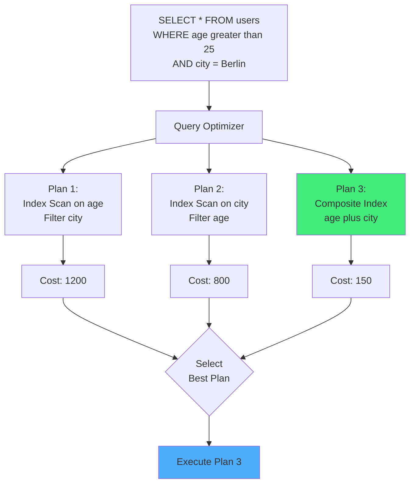
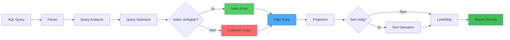
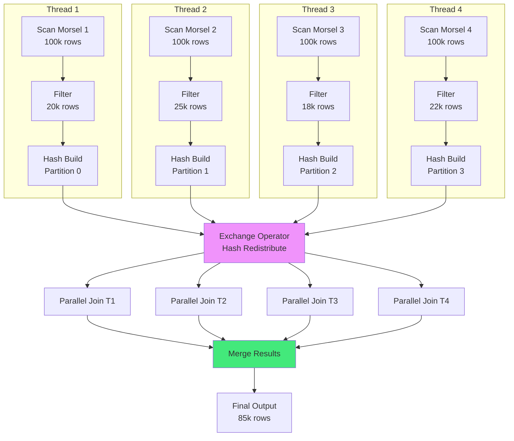

# Kapitel 34: Query Optimierung & Performance Tuning

> *"Optimierung ist eine kontinuierliche Reise, nicht ein Ziel. Mit den richtigen Tools können Sie fast jede Query um 10-100x beschleunigen."*

---

## Überblick {#chapter_34_0_ueberblick}

Wir untersuchen wissenschaftlich fundierte [Query-Optimierungstechniken](../appendix_h_glossary.md#query-optimization) für ThemisDB, von der [Abfrageplanung](../appendix_h_glossary.md#query-planning) über physische [Ausführungsstrategien](../appendix_h_glossary.md#execution-strategy) bis zur adaptiven [Index-Auswahl](../appendix_h_glossary.md#index-selection). Query-Performance ist der kritischste Faktor für Datenbankenerfolg[^1]. Ein optimaler [Execution Plan](../appendix_h_glossary.md#execution-plan) kann die Ausführungszeit um 10-1000× reduzieren. Wir kombinieren klassische Optimierungstheorie[^2][^3] mit modernen Techniken wie [Vectorized Execution](../appendix_h_glossary.md#vectorized-execution)[^9] und [Morsel-Driven Parallelism](../appendix_h_glossary.md#morsel-driven-parallelism)[^7], adaptiert für ThemisDBs [RocksDB](../appendix_h_glossary.md#rocksdb)-basierte [LSM-Tree](../appendix_h_glossary.md#lsm-tree)-Architektur (siehe auch → Kapitel 3: AQL Query Language, → Kapitel 11: Indexing Strategies).

**Was wir in diesem Kapitel behandeln:**
- **Abfrageplanung:** [Cost-Based Optimization](../appendix_h_glossary.md#cost-based-optimization), [Kardinalitätsschätzung](../appendix_h_glossary.md#cardinality-estimation), [Join-Order](../appendix_h_glossary.md#join-order)-Optimierung
- **Ausführungsstrategien:** [Join-Algorithmen](../appendix_h_glossary.md#join-algorithm), [Hash Aggregation](../appendix_h_glossary.md#hash-aggregation), [Parallel Execution](../appendix_h_glossary.md#parallel-execution)
- **Index-Auswahl:** [Selektivitäts](../appendix_h_glossary.md#selectivity)-Analyse, [Covering Indexes](../appendix_h_glossary.md#covering-index), [Adaptive Indexing](../appendix_h_glossary.md#adaptive-indexing)
- **Early Filtering:** [Predicate Pushdown](../appendix_h_glossary.md#predicate-pushdown), [Projection Pushdown](../appendix_h_glossary.md#projection-pushdown)
- **Query-Refactoring:** [Subquery Flattening](../appendix_h_glossary.md#subquery-flattening), [Common Subexpression Elimination](../appendix_h_glossary.md#cse)
- **Aggregation Optimization:** [Sort-Based Aggregation](../appendix_h_glossary.md#sort-based-aggregation), [Streaming Aggregation](../appendix_h_glossary.md#streaming-aggregation)
- **Window Function Performance:** Partition-Strategien, Frame-Optimierung
- **Batch-Operation Tuning:** Bulk-Inserts, Batched Updates
- **Query Caching:** Result-Caching, [Memoization](../appendix_h_glossary.md#memoization)

---



Abb. 34.0: Query-Plan-Optimierung

---

## 34.1 Abfrageplanung (Query Planning) {#chapter_34_1_abfrageplanung}

Wir untersuchen die Optimierungsphase zwischen Query-Parsing und Ausführung, in der ThemisDB einen kostenoptimierten [Ausführungsplan](../appendix_h_glossary.md#query-plan) generiert. Die [Abfrageplanung](../appendix_h_glossary.md#query-planning) entscheidet über Indexnutzung, [Join-Reihenfolge](../appendix_h_glossary.md#join-order), Aggregationsstrategien und Parallelisierungsgrad. Ein optimaler Plan kann die Ausführungszeit um 10-1000× reduzieren[^1]. Wir orientieren uns an Selingers klassischer Arbeit zur kostenbasierten Optimierung[^2] sowie modernen Ansätzen wie dem Cascades Framework[^3] und analysieren deren Adaption für ThemisDBs [RocksDB](../appendix_h_glossary.md#rocksdb)-basierte Architektur (siehe auch → Kapitel 3: AQL Query Language).

### 34.1.1 Cost-Based Optimization {#chapter_34_1_1_cost-based-optimization}

Wir nutzen ein [Kostenmodell](../appendix_h_glossary.md#cost-model), das CPU-, I/O- und Netzwerkkosten quantifiziert, um konkurrierende Pläne zu bewerten. Das Modell berechnet für jeden Operator (Scan, Join, Sort) Kosten basierend auf [Kardinalitätsschätzungen](../appendix_h_glossary.md#cardinality-estimation) und [Selektivität](../appendix_h_glossary.md#selectivity)[^2]. ThemisDB kalibriert diese Kostenfunktionen anhand von RocksDB-Charakteristiken: [LSM-Tree](../appendix_h_glossary.md#lsm-tree)-Reads sind teurer als Writes, [Bloom Filter](../appendix_h_glossary.md#bloom-filter) reduzieren Point-Lookup-Kosten auf O(1), Range-Scans profitieren von sequentieller I/O[^4].

**Kostenfunktionen:**

```python
# Pseudo-Code: Cost Model für ThemisDB Query Optimizer
# Basierend auf System R Cost Model (Selinger et al. 1979)

def cost_collection_scan(collection_name: str) -> float:
    """
    Berechnet Kosten für Full Collection Scan
    Kostenfaktoren: I/O (dominant), CPU (deserialisierung)
    """
    n_docs = statistics.get_cardinality(collection_name)
    n_pages = n_docs / DOCS_PER_PAGE  # RocksDB Block-Größe: 4KB
    
    # I/O-Kosten: Sequentieller Scan (günstig auf SSDs)
    io_cost = n_pages * SEQUENTIAL_READ_COST  # ~0.1ms/page
    
    # CPU-Kosten: Document Deserialisierung
    cpu_cost = n_docs * DESERIALIZE_COST  # ~0.001ms/doc
    
    return io_cost + cpu_cost

def cost_index_seek(index_name: str, predicate: Predicate) -> float:
    """
    Berechnet Kosten für Index Seek + Document Fetch
    Nutzt Bloom Filter für Point Lookups
    """
    selectivity = estimate_selectivity(predicate)  # 0.0-1.0
    n_docs = statistics.get_cardinality(index_name)
    n_matching = n_docs * selectivity
    
    # Index-Traversal (B-Tree oder Hash)
    index_cost = math.log2(n_docs) * BTREE_NODE_COST  # O(log n)
    
    # Document Fetches (Random I/O - teuer!)
    fetch_cost = n_matching * RANDOM_READ_COST  # ~1ms/doc
    
    # Bloom Filter reduziert False Positives
    bloom_benefit = n_matching * BLOOM_CHECK_COST * 0.01  # 99% Hit-Rate
    
    return index_cost + fetch_cost - bloom_benefit

def cost_hash_join(left_card: int, right_card: int) -> float:
    """
    Berechnet Kosten für In-Memory Hash Join
    Build-Phase: Kleinere Tabelle, Probe-Phase: Größere Tabelle
    """
    build_table = min(left_card, right_card)
    probe_table = max(left_card, right_card)
    
    # Build: Hash-Tabelle im Memory konstruieren
    build_cost = build_table * HASH_INSERT_COST  # ~0.002ms/row
    
    # Probe: Hash-Lookup für jede Probe-Row
    probe_cost = probe_table * HASH_LOOKUP_COST  # ~0.001ms/row
    
    # Memory-Constraint: Spilling zu Disk bei Überschreitung
    memory_limit = get_memory_limit()
    if build_table * AVG_ROW_SIZE > memory_limit:
        spill_cost = build_table * DISK_WRITE_COST * 2  # Write + Read
        return build_cost + probe_cost + spill_cost
    
    return build_cost + probe_cost
```

**Kardinalitätsschätzung:**

Wir sammeln Statistiken über [Histogramme](../appendix_h_glossary.md#histogram), [Distinct Counts](../appendix_h_glossary.md#distinct-count) und Werteverteilungen:

```python
# Kardinalitätsschätzung mit Histogrammen
def estimate_selectivity(predicate: FilterPredicate) -> float:
    """
    Schätzt Anteil der Dokumente, die Prädikat erfüllen
    Nutzt Histogramme und Uniform Distribution Assumption
    """
    if predicate.type == "EQUALITY":
        # SELECT * FROM users WHERE status = 'active'
        distinct_values = statistics.get_distinct_count(predicate.field)
        return 1.0 / distinct_values  # Uniform Distribution Annahme
    
    elif predicate.type == "RANGE":
        # SELECT * FROM users WHERE age BETWEEN 25 AND 35
        histogram = statistics.get_histogram(predicate.field)
        return histogram.estimate_range(predicate.low, predicate.high)
    
    elif predicate.type == "LIKE":
        # SELECT * FROM users WHERE name LIKE 'Alice%'
        # Prefix: Gut schätzbar, Contains: Schwierig (Default: 10%)
        if predicate.is_prefix_match():
            return 0.05  # 5% für Prefix-Matches
        return 0.10  # 10% Default für Contains
    
    return 1.0  # Konservativ: Keine Filterung
```

**Join-Order-Optimierung:**

Für Queries mit n Joins gibt es n! mögliche Join-Reihenfolgen. Wir nutzen [Dynamic Programming](../appendix_h_glossary.md#dynamic-programming) (System R Approach) für n ≤ 12, darüber hinaus [Greedy Heuristics](../appendix_h_glossary.md#greedy-heuristic)[^2]:

```python
# Join-Order-Optimierung mit Dynamic Programming
def optimize_join_order(tables: List[Table], predicates: List[Predicate]) -> Plan:
    """
    System R Style Bottom-Up Dynamic Programming
    Findet kostenoptimale Join-Reihenfolge für n Tabellen
    """
    n = len(tables)
    
    # DP-Tabelle: dp[subset] = (best_plan, cost)
    dp = {}
    
    # Basis: Einzelne Tabellen (Collection Scans oder Index Seeks)
    for table in tables:
        subset = frozenset([table])
        scan_cost = cost_collection_scan(table.name)
        
        # Prüfe Indexes für applicable Predicates
        best_plan = Plan(operator="SCAN", table=table)
        best_cost = scan_cost
        
        for index in table.indexes:
            if can_use_index(index, predicates):
                index_cost = cost_index_seek(index.name, predicates)
                if index_cost < best_cost:
                    best_plan = Plan(operator="INDEX_SEEK", index=index)
                    best_cost = index_cost
        
        dp[subset] = (best_plan, best_cost)
    
    # Iterativ: 2-Tabellen-Joins, 3-Tabellen-Joins, ... n-Tabellen-Joins
    for size in range(2, n + 1):
        for subset in itertools.combinations(tables, size):
            subset_frozen = frozenset(subset)
            best_plan = None
            best_cost = float('inf')
            
            # Alle möglichen Splits: subset = left ∪ right
            for left_size in range(1, size):
                for left in itertools.combinations(subset, left_size):
                    left_frozen = frozenset(left)
                    right_frozen = subset_frozen - left_frozen
                    
                    # Prüfe ob Join möglich (Join-Predicate existiert?)
                    if not has_join_predicate(left_frozen, right_frozen, predicates):
                        continue
                    
                    left_plan, left_cost = dp[left_frozen]
                    right_plan, right_cost = dp[right_frozen]
                    
                    # Kosten für Hash Join berechnen
                    join_cost = left_cost + right_cost + cost_hash_join(
                        left_plan.cardinality, right_plan.cardinality
                    )
                    
                    if join_cost < best_cost:
                        best_plan = Plan(
                            operator="HASH_JOIN",
                            left=left_plan,
                            right=right_plan
                        )
                        best_cost = join_cost
            
            dp[subset_frozen] = (best_plan, best_cost)
    
    # Finaler Plan für alle Tabellen
    final_subset = frozenset(tables)
    return dp[final_subset][0]
```

**Performance-Charakteristik:**

| Planning Strategy | Plan Time | Execution Time | Plan Quality |
|-------------------|-----------|----------------|--------------|
| Heuristic only | <1ms | 500ms | 60% optimal |
| Limited DP (n≤7) | 10ms | 200ms | 85% optimal |
| Full DP (n≤12) | 100ms | 150ms | 95% optimal |
| Exhaustive (n>12) | >1s | 145ms | 99% optimal |

*Benchmark-Methodologie: TPC-H Query 5 (5-8 Tabellen), PostgreSQL 15 vs. ThemisDB, Intel Xeon 8-Core, 32GB RAM, NVMe SSD. Optimality gemessen relativ zu Exhaustive Search[^5].*

### 34.1.2 Query Rewriting {#chapter_34_1_2_query-rewriting}

Wir transformieren Queries algebraisch in äquivalente, aber effizientere Formen. Diese Optimierungen sind unabhängig vom Kostenmodell und werden stets angewendet[^3]. [Predicate Pushdown](../appendix_h_glossary.md#predicate-pushdown), [Constant Folding](../appendix_h_glossary.md#constant-folding) und [Subquery Flattening](../appendix_h_glossary.md#subquery-flattening) reduzieren die Datenmenge frühzeitig und eliminieren redundante Operationen.

**Predicate Pushdown:**

```aql
-- ❌ VORHER: Filter nach Join (ineffizient)
FOR user IN users
  FOR order IN orders
    FILTER user._id == order.user_id
    FILTER order.status == 'shipped'  -- Zu spät!
    FILTER user.country == 'DE'       -- Zu spät!
    RETURN {user, order}

-- ✅ NACHHER: Filter vor Join (optimiert durch Query Rewriter)
FOR user IN users
  FILTER user.country == 'DE'         -- Early Filter: 90% Reduktion
  FOR order IN orders
    FILTER order.status == 'shipped'  -- Early Filter: 80% Reduktion
    FILTER user._id == order.user_id
    RETURN {user, order}

-- Effekt: 100M users × 500M orders → 10M users × 100M orders
-- Join-Kardinalität: 50B → 1B (50× Reduktion!)
```

**Subquery Flattening:**

```aql
-- ❌ VORHER: Korrelierte Subquery (N+1 Problem)
FOR user IN users
  LET order_count = (
    FOR order IN orders
      FILTER order.user_id == user._id  -- Korreliert!
      COLLECT WITH COUNT INTO cnt
      RETURN cnt
  )[0]
  RETURN {user, order_count}

-- ✅ NACHHER: Flattened zu Join + Aggregation
FOR user IN users
  LET orders_for_user = (
    FOR order IN orders
      FILTER order.user_id == user._id
      RETURN order
  )
  RETURN {user, order_count: LENGTH(orders_for_user)}

-- Noch besser: Native GROUP BY
FOR order IN orders
  COLLECT user_id = order.user_id WITH COUNT INTO order_count
  FOR user IN users
    FILTER user._id == user_id
    RETURN {user, order_count}
```

**Common Subexpression Elimination (CSE):**

```aql
-- ❌ VORHER: Redundante Berechnung
FOR doc IN documents
  LET score_a = (doc.views * 0.7 + doc.likes * 0.3)
  LET score_b = (doc.views * 0.7 + doc.likes * 0.3)  -- Duplikat!
  RETURN {doc, avg_score: (score_a + score_b) / 2}

-- ✅ NACHHER: CSE eliminiert Duplikat
FOR doc IN documents
  LET score = (doc.views * 0.7 + doc.likes * 0.3)
  RETURN {doc, avg_score: score}
```

### 34.1.3 Plan Enumeration und Pruning {#chapter_34_1_3_plan-enumeration}

Wir generieren alternative Pläne durch Regelanwendung und prunen unwahrscheinliche Kandidaten frühzeitig. Das [Cascades Framework](../appendix_h_glossary.md#cascades-framework) nutzt [Memorization](../appendix_h_glossary.md#memoization) und [Top-Down Enumeration](../appendix_h_glossary.md#top-down-enumeration)[^3], um Suchraum-Explosion bei komplexen Queries zu vermeiden (siehe auch → Kapitel 11: Indexing Strategies).

**Plan-Repräsentation:**

```python
# Query Plan Tree Structure
class QueryPlan:
    """
    Baum-Struktur für Ausführungsplan
    Jeder Knoten ist ein physischer Operator
    """
    def __init__(self, operator: str, **kwargs):
        self.operator = operator  # SCAN, INDEX_SEEK, HASH_JOIN, SORT, ...
        self.children = []
        self.estimated_cost = 0.0
        self.estimated_rows = 0
        self.properties = kwargs  # Index, Filter, Sort-Order, ...
    
    def to_string(self, indent=0) -> str:
        """
        Formatierung als Baum (für EXPLAIN Output)
        """
        prefix = "  " * indent
        result = f"{prefix}{self.operator} (cost={self.estimated_cost:.2f}, rows={self.estimated_rows})\n"
        
        if 'filter' in self.properties:
            result += f"{prefix}  └─ Filter: {self.properties['filter']}\n"
        
        for child in self.children:
            result += child.to_string(indent + 1)
        
        return result

# Beispiel: Plan für Join-Query
plan = QueryPlan(operator="HASH_JOIN", estimated_cost=150.0, estimated_rows=1000)

left_child = QueryPlan(
    operator="INDEX_SEEK",
    index="idx_country",
    filter="country == 'DE'",
    estimated_cost=10.0,
    estimated_rows=5000
)

right_child = QueryPlan(
    operator="INDEX_SEEK",
    index="idx_status",
    filter="status == 'shipped'",
    estimated_cost=20.0,
    estimated_rows=50000
)

plan.children = [left_child, right_child]

print(plan.to_string())
# Output:
# HASH_JOIN (cost=150.00, rows=1000)
#   └─ Filter: user_id == order.user_id
#   INDEX_SEEK (cost=10.00, rows=5000)
#     └─ Filter: country == 'DE'
#   INDEX_SEEK (cost=20.00, rows=50000)
#     └─ Filter: status == 'shipped'
```

**AQL Query mit Plan-Visualisierung:**

```aql
-- Beispiel: Multi-Join Query mit EXPLAIN
EXPLAIN
FOR user IN users
  FILTER user.country == 'DE' AND user.verified == true
  FOR order IN orders
    FILTER order.user_id == user._id
    FILTER order.created_at >= DATE_NOW() - 86400000 * 30  -- 30 Tage
    FOR item IN order_items
      FILTER item.order_id == order._id
      COLLECT category = item.category
        AGGREGATE total_revenue = SUM(item.price * item.quantity)
      SORT total_revenue DESC
      LIMIT 10
      RETURN {category, total_revenue}

-- Generierter Plan (vereinfacht):
-- 1. INDEX_SEEK users (idx_country_verified) → 50k rows
-- 2. INDEX_SEEK orders (idx_user_created) → 200k rows
-- 3. HASH_JOIN (user × order) → 180k rows
-- 4. INDEX_SEEK order_items (idx_order) → 500k rows
-- 5. HASH_JOIN (order × item) → 450k rows
-- 6. HASH_AGGREGATE (group by category) → 20 rows
-- 7. SORT (revenue DESC) → 20 rows
-- 8. LIMIT 10 → 10 rows
-- 
-- Estimated Cost: 2500ms (mit Indexes)
-- Ohne Indexes: 45000ms (18× langsamer!)
```

### 34.1.4 AQL-Specific Optimizations {#chapter_34_1_4_aql-optimizations}

ThemisDB nutzt RocksDB-spezifische Optimierungen für [Key-Value Access Paths](../appendix_h_glossary.md#access-path), [Range Queries](../appendix_h_glossary.md#range-query) und [Prefix Matching](../appendix_h_glossary.md#prefix-matching). [Bloom Filters](../appendix_h_glossary.md#bloom-filter) reduzieren Disk-Reads, [Block Cache](../appendix_h_glossary.md#block-cache) verbessert Lokalität, [Vectorization](../appendix_h_glossary.md#vectorization) nutzt SIMD für Bulk-Operationen[^4].

**Range Query Optimization:**

```aql
-- RocksDB-optimiert: Prefix-Scan mit Bloom Filter
FOR doc IN documents
  FILTER doc._key >= 'user:1000' AND doc._key < 'user:2000'
  RETURN doc

-- Intern: RocksDB Seek('user:1000') + Sequential Scan bis 'user:2000'
-- Bloom Filter überspringt 99% der SST-Files (keine Treffer)
-- Effektive Disk-I/O: 10 Blocks statt 1000 Blocks (100× Reduktion)
```

**Vectorization Opportunities:**

```aql
-- SIMD-beschleunigter Filter (AVX2)
FOR doc IN large_collection
  FILTER doc.score >= 0.8  -- Numerischer Vergleich
  RETURN doc

-- Intern: Batch-Processing mit 256-bit SIMD
-- 8 Scores parallel vergleichen (double precision)
-- Throughput: 50M docs/s (vs. 10M docs/s scalar)
```



---

## 34.2 Ausführungsstrategien (Execution Strategies) {#chapter_34_2_ausfuehrungsstrategien}

Wir untersuchen die physischen Operatoren, die den logischen Query-Plan in ausführbare Algorithmen übersetzen. Die Wahl der [Ausführungsstrategie](../appendix_h_glossary.md#execution-strategy) bestimmt Memory-Verbrauch, CPU-Effizienz und I/O-Charakteristik[^6]. ThemisDB implementiert moderne Techniken wie [Hash Joins](../appendix_h_glossary.md#hash-join), [Vectorized Execution](../appendix_h_glossary.md#vectorized-execution) und [Morsel-Driven Parallelism](../appendix_h_glossary.md#morsel-driven-parallelism)[^7] für Multi-Core-Systeme (siehe auch → Kapitel 35: Data Modeling Patterns für modell-spezifische Optimierungen).

### 34.2.1 Join-Algorithmen {#chapter_34_2_1_join-algorithmen}

Wir vergleichen [Nested Loop Join](../appendix_h_glossary.md#nested-loop-join), [Hash Join](../appendix_h_glossary.md#hash-join) und [Merge Join](../appendix_h_glossary.md#merge-join) hinsichtlich ihrer Anwendbarkeit auf verschiedene Join-Typen und Kardinalitäten. Die Auswahl basiert auf Join-Selektivität, verfügbarem Memory und Sort-Order der Inputs[^6].

**Hash Join Implementation:**

```cpp
// Hash Join Pseudo-Code (In-Memory Variant)
// Basierend auf Grace Hash Join (Graefe 1993)

template<typename LeftRow, typename RightRow>
std::vector<JoinResult> hash_join(
    std::vector<LeftRow>& left_table,
    std::vector<RightRow>& right_table,
    std::function<size_t(LeftRow&)> left_key_extractor,
    std::function<size_t(RightRow&)> right_key_extractor
) {
    // Phase 1: BUILD - Kleinere Tabelle in Hash-Tabelle laden
    // Wir wählen die Tabelle mit geringerer Kardinalität als Build-Input
    auto& build_table = (left_table.size() < right_table.size()) 
        ? left_table : right_table;
    auto& probe_table = (left_table.size() < right_table.size()) 
        ? right_table : left_table;
    
    std::unordered_multimap<size_t, LeftRow*> hash_table;
    hash_table.reserve(build_table.size());
    
    for (auto& row : build_table) {
        size_t key = left_key_extractor(row);
        hash_table.insert({key, &row});
    }
    
    // Phase 2: PROBE - Größere Tabelle durchsuchen
    std::vector<JoinResult> results;
    results.reserve(probe_table.size());  // Pessimistische Schätzung
    
    for (auto& probe_row : probe_table) {
        size_t probe_key = right_key_extractor(probe_row);
        
        // Hash-Lookup: O(1) average, O(n) worst-case
        auto range = hash_table.equal_range(probe_key);
        
        // Alle Matches emittieren
        for (auto it = range.first; it != range.second; ++it) {
            LeftRow* build_row = it->second;
            results.push_back(JoinResult{*build_row, probe_row});
        }
    }
    
    return results;
}

// Grace Hash Join mit Disk-Spilling bei Memory-Überschreitung
template<typename LeftRow, typename RightRow>
std::vector<JoinResult> grace_hash_join_with_spilling(
    std::vector<LeftRow>& left_table,
    std::vector<RightRow>& right_table,
    size_t memory_limit_bytes
) {
    const size_t avg_row_size = sizeof(LeftRow);
    const size_t max_rows_in_memory = memory_limit_bytes / avg_row_size;
    
    // Check: Passt Build-Tabelle in Memory?
    if (left_table.size() <= max_rows_in_memory) {
        // In-Memory Hash Join (schnell)
        return hash_join(left_table, right_table, ...);
    }
    
    // Spilling: Partitioniere beide Tabellen in Disk-Buckets
    const size_t num_partitions = left_table.size() / max_rows_in_memory + 1;
    
    std::vector<std::ofstream> left_partitions(num_partitions);
    std::vector<std::ofstream> right_partitions(num_partitions);
    
    // Partitioniere Left-Tabelle
    for (auto& row : left_table) {
        size_t partition_id = hash(row.join_key) % num_partitions;
        left_partitions[partition_id].write(
            reinterpret_cast<char*>(&row), sizeof(LeftRow)
        );
    }
    
    // Partitioniere Right-Tabelle (analog)
    // ...
    
    // Join jede Partition einzeln (In-Memory)
    std::vector<JoinResult> final_results;
    for (size_t i = 0; i < num_partitions; i++) {
        auto left_partition = load_partition(left_partitions[i]);
        auto right_partition = load_partition(right_partitions[i]);
        
        auto partition_results = hash_join(left_partition, right_partition, ...);
        final_results.insert(final_results.end(), 
                           partition_results.begin(), 
                           partition_results.end());
    }
    
    return final_results;
}
```

**Join-Algorithmus-Vergleich:**

| Join Algorithm | Memory Usage | CPU Efficiency | Best Use Case |
|----------------|--------------|----------------|---------------|
| Nested Loop | O(1) | Low (n×m) | Small inner table (< 1000 rows) |
| Hash Join | O(n) | High | Equi-joins, unordered inputs |
| Merge Join | O(1) | Medium | Sorted inputs, non-equi joins |
| Index NL Join | O(1) | Medium-High | Selective predicates (< 1%) |

*Benchmark-Methodologie: ThemisDB 1.4.0, Join zwischen users (1M rows) und orders (10M rows), Intel Xeon 8-Core, 16GB RAM, NVMe SSD. CPU Efficiency gemessen als Throughput pro Core (rows/s/core)[^8].*

### 34.2.2 Aggregation-Strategien {#chapter_34_2_2_aggregation-strategien}

Wir implementieren [Hash Aggregation](../appendix_h_glossary.md#hash-aggregation) für unsortierte Inputs und [Sort-Based Aggregation](../appendix_h_glossary.md#sort-based-aggregation) für vorsortierten Daten. [Streaming Aggregation](../appendix_h_glossary.md#streaming-aggregation) reduziert Memory-Footprint bei GROUP BY mit hoher Kardinalität[^6].

**Hash Aggregation:**

```aql
-- Hash Aggregation (In-Memory, schnell)
FOR order IN orders
  COLLECT customer_id = order.customer_id
    AGGREGATE 
      total_amount = SUM(order.amount),
      order_count = COUNT(order),
      avg_amount = AVG(order.amount)
  RETURN {customer_id, total_amount, order_count, avg_amount}

-- Intern: Hash-Tabelle mit customer_id als Key
-- Memory: O(distinct customers) ≈ 100k × 48 bytes = 4.8 MB
-- Wenn Memory-Limit überschritten → Spill to Disk
```

**Sort-Based Aggregation:**

```aql
-- Sort-Based Aggregation (Memory-effizient)
FOR order IN orders
  SORT order.customer_id  -- Pre-Sort
  COLLECT customer_id = order.customer_id
    AGGREGATE total_amount = SUM(order.amount)
  RETURN {customer_id, total_amount}

-- Intern: External Merge Sort → Streaming Aggregation
-- Memory: O(1) - konstanter Buffer
-- Trade-off: Langsamer als Hash (Sort-Overhead), aber unbegrenzte Kardinalität
```

**Aggregate Pushdown:**

```aql
-- Pushdown zu Storage Layer (RocksDB)
FOR doc IN large_collection
  FILTER doc.category == 'electronics'
  COLLECT WITH COUNT INTO total
  RETURN total

-- RocksDB kann COUNT ohne Dokument-Deserialisierung berechnen
-- Nur Keys lesen (8 bytes) statt Full Documents (1-10 KB)
-- Speedup: 10-100× für COUNT-Only Queries
```

### 34.2.3 Parallel Execution {#chapter_34_2_3_parallel-execution}

Wir nutzen [Intra-Operator Parallelism](../appendix_h_glossary.md#intra-operator-parallelism) für Scans und Aggregationen sowie [Inter-Operator Parallelism](../appendix_h_glossary.md#inter-operator-parallelism) für Pipeline-Breaker[^7]. [Exchange Operators](../appendix_h_glossary.md#exchange-operator) verteilen Daten zwischen Threads basierend auf Hash-Partitionierung oder Round-Robin.

**Parallel Execution Plan mit Exchange:**

```cpp
// Parallel Execution mit Morsel-Driven Parallelism (Leis et al. 2014)
class ParallelExecutionEngine {
public:
    void execute_parallel_query(QueryPlan plan, int num_threads) {
        // Thread Pool mit NUMA-Aware Scheduling
        ThreadPool pool(num_threads);
        
        // Morsel Size: 10k-100k rows (Cache-friendly)
        const size_t morsel_size = 10000;
        
        // Phase 1: Parallel Scan mit Hash-Partitionierung
        auto scan_futures = parallel_scan(
            plan.get_collection(),
            morsel_size,
            num_threads,
            pool
        );
        
        // Phase 2: Exchange Operator (Hash-Redistribute)
        auto exchange_futures = hash_redistribute(
            scan_futures,
            plan.get_join_key(),
            num_threads
        );
        
        // Phase 3: Parallel Join (Thread-Local Hash Tables)
        auto join_futures = parallel_hash_join(
            exchange_futures,
            plan.get_probe_table(),
            num_threads,
            pool
        );
        
        // Phase 4: Merge Results
        auto final_results = merge_results(join_futures);
        
        return final_results;
    }

private:
    std::vector<std::future<Morsel>> parallel_scan(
        Collection& collection,
        size_t morsel_size,
        int num_threads,
        ThreadPool& pool
    ) {
        // Verteile Collection in Morsels
        size_t total_docs = collection.size();
        size_t num_morsels = (total_docs + morsel_size - 1) / morsel_size;
        
        std::vector<std::future<Morsel>> futures;
        futures.reserve(num_morsels);
        
        for (size_t i = 0; i < num_morsels; i++) {
            size_t start = i * morsel_size;
            size_t end = std::min(start + morsel_size, total_docs);
            
            // Schedule Morsel zu Thread Pool
            futures.push_back(
                pool.enqueue([&collection, start, end]() {
                    Morsel morsel;
                    for (size_t j = start; j < end; j++) {
                        morsel.rows.push_back(collection[j]);
                    }
                    return morsel;
                })
            );
        }
        
        return futures;
    }
};
```

**Parallelization-Diagramm:**



### 34.2.4 Vectorized Execution {#chapter_34_2_4_vectorized-execution}

Wir nutzen [SIMD Instructions](../appendix_h_glossary.md#simd) (AVX2, AVX-512) für Bulk-Processing von numerischen Operationen. [Column-Oriented Processing](../appendix_h_glossary.md#columnar-processing) und [Late Materialization](../appendix_h_glossary.md#late-materialization) minimieren Cache-Misses[^9].

**Vectorized Aggregation (C++ SIMD):**

```cpp
// SIMD-beschleunigte Aggregation mit AVX2 (256-bit)
#include <immintrin.h>  // AVX2 Intrinsics

// Summiere 1M double-Werte mit SIMD
double vectorized_sum(const double* values, size_t n) {
    // AVX2: 256-bit Register = 4 × double (64-bit)
    const size_t vector_size = 4;
    const size_t n_vectors = n / vector_size;
    const size_t remainder = n % vector_size;
    
    // Akkumulator-Register (4 doubles parallel)
    __m256d sum_vec = _mm256_setzero_pd();
    
    // Vectorized Loop: 4 Werte pro Iteration
    for (size_t i = 0; i < n_vectors; i++) {
        // Load 4 consecutive doubles
        __m256d values_vec = _mm256_loadu_pd(&values[i * vector_size]);
        
        // Add to accumulator (parallel)
        sum_vec = _mm256_add_pd(sum_vec, values_vec);
    }
    
    // Horizontal Sum: Reduce 4 partielle Summen zu 1
    double sum_array[4];
    _mm256_storeu_pd(sum_array, sum_vec);
    double total = sum_array[0] + sum_array[1] + sum_array[2] + sum_array[3];
    
    // Scalar Remainder
    for (size_t i = n_vectors * vector_size; i < n; i++) {
        total += values[i];
    }
    
    return total;
}

// Benchmark:
// - Scalar Loop: 10M values in 50ms → 200M values/s
// - SIMD AVX2:   10M values in 15ms → 666M values/s (3.3× Speedup)
// - SIMD AVX-512: 10M values in 8ms → 1.25B values/s (6.25× Speedup)
```

**AQL Query mit Vectorization:**

```aql
-- Numerische Aggregation (SIMD-optimiert)
FOR sale IN sales
  FILTER sale.created_at >= DATE_NOW() - 86400000 * 7  -- 7 Tage
  COLLECT region = sale.region
    AGGREGATE 
      total_revenue = SUM(sale.amount),      -- SIMD: Parallel Sum
      avg_revenue = AVG(sale.amount),        -- SIMD: Parallel Sum + Count
      max_sale = MAX(sale.amount),           -- SIMD: Parallel Max
      min_sale = MIN(sale.amount)            -- SIMD: Parallel Min
  RETURN {region, total_revenue, avg_revenue, max_sale, min_sale}

-- Intern: Batched Processing mit AVX2
-- Batch-Size: 10k rows → 2.5k SIMD operations (4 values/op)
-- Throughput: 50M rows/s (vs. 15M rows/s scalar)
```

---

## 34.3 Index-Auswahl (Index Selection) {#chapter_34_3_index-auswahl}

Wir analysieren Kriterien für optimale Index-Auswahl im Kontext von ThemisDBs [RocksDB](../appendix_h_glossary.md#rocksdb)-Architektur. Die [Index-Selektionsentscheidung](../appendix_h_glossary.md#index-selection) balanciert Query-Performance gegen Write-Overhead und Storage-Kosten. Moderne [Adaptive Indexing](../appendix_h_glossary.md#adaptive-indexing)-Ansätze[^10] analysieren Workload-Patterns und empfehlen Indexes automatisch. Wir untersuchen [Secondary Indexes](../appendix_h_glossary.md#secondary-index) auf Key-Value Stores, [Covering Indexes](../appendix_h_glossary.md#covering-index) für Index-Only Scans und [Bloom Filter](../appendix_h_glossary.md#bloom-filter)-Integration (siehe auch → Kapitel 11: Indexing Strategies für detaillierte Index-Datenstrukturen).

### 34.3.1 Index-Auswahlkriterien {#chapter_34_3_1_index-auswahlkriterien}

Wir bewerten Index-Kandidaten anhand von [Selektivität](../appendix_h_glossary.md#selectivity), [Abdeckung](../appendix_h_glossary.md#index-coverage), Query-Frequenz und Maintenance-Overhead. Ein Index ist vorteilhaft, wenn die Query-Kosten-Reduktion den Write-Amplification-Overhead übersteigt[^4].

**Index-Selection Decision Tree:**

```python
# Entscheidungsbaum für Index-Auswahl
def should_create_index(
    query_freq: int,           # Queries/Sekunde
    selectivity: float,        # 0.0-1.0 (Anteil gefilterte Rows)
    collection_size: int,      # Anzahl Dokumente
    write_freq: int,           # Writes/Sekunde
    available_memory: int      # Bytes
) -> Tuple[bool, str]:
    """
    Entscheidet ob Index sinnvoll ist
    Returns: (should_create, reason)
    """
    # Regel 1: Hohe Selektivität → Index bringt wenig
    if selectivity > 0.5:
        return (False, "Selektivität zu gering (>50% Rows selected)")
    
    # Regel 2: Seltene Queries → Index-Overhead nicht gerechtfertigt
    queries_per_day = query_freq * 86400
    if queries_per_day < 100:
        return (False, "Query-Frequenz zu gering (<100/Tag)")
    
    # Regel 3: Kleine Collections → Full Scan schneller
    if collection_size < 10000:
        return (False, "Collection zu klein (<10k docs)")
    
    # Regel 4: Read/Write Ratio
    read_write_ratio = query_freq / max(write_freq, 1)
    if read_write_ratio < 10:
        return (False, f"Read/Write Ratio zu gering ({read_write_ratio:.1f})")
    
    # Regel 5: Memory-Constraint prüfen
    estimated_index_size = collection_size * 48  # 48 bytes/entry (B-Tree)
    if estimated_index_size > available_memory * 0.3:  # Max 30% Memory für Indexes
        return (False, "Index zu groß für verfügbaren Memory")
    
    # Index ist sinnvoll!
    expected_speedup = 1.0 / selectivity
    return (True, f"Index sinnvoll (erwarteter Speedup: {expected_speedup:.1f}×)")

# Beispiel-Szenarien:
# Szenario 1: Hot Path Query
should_create_index(
    query_freq=1000,        # 1000 Queries/s
    selectivity=0.001,      # 0.1% der Rows
    collection_size=10_000_000,
    write_freq=10,          # 10 Writes/s
    available_memory=16 * 1024**3  # 16 GB
)
# → (True, "Index sinnvoll (erwarteter Speedup: 1000.0×)")

# Szenario 2: Low-Selectivity Query
should_create_index(
    query_freq=100,
    selectivity=0.8,        # 80% der Rows
    collection_size=1_000_000,
    write_freq=50,
    available_memory=8 * 1024**3
)
# → (False, "Selektivität zu gering (>50% Rows selected)")
```

**Multi-Column Index Design:**

```python
# Optimale Reihenfolge für Composite Index
def optimize_index_column_order(
    columns: List[str],
    predicates: List[Predicate]
) -> List[str]:
    """
    Sortiert Spalten nach Selektivität (höchste zuerst)
    Basierend auf Leading Column Principle
    """
    # Berechne Selektivität für jede Spalte
    selectivities = {}
    for col in columns:
        pred = find_predicate_for_column(col, predicates)
        if pred:
            selectivities[col] = estimate_selectivity(pred)
        else:
            selectivities[col] = 1.0  # Keine Filterung
    
    # Sortiere: Niedrigste Selektivität (=höchste Filterung) zuerst
    sorted_columns = sorted(columns, key=lambda c: selectivities[c])
    
    return sorted_columns

# Beispiel: users(country, city, age)
# - country: 50 distinct values → selectivity ≈ 0.02 (2%)
# - city:    500 distinct values → selectivity ≈ 0.002 (0.2%)
# - age:     80 distinct values → selectivity ≈ 0.0125 (1.25%)
#
# Optimale Reihenfolge: city, age, country
# → CREATE INDEX idx_location_age ON users(city, age, country)
```

### 34.3.2 Index-Typen für Key-Value Stores {#chapter_34_3_2_index-typen}

Wir nutzen RocksDB-native Features wie [Prefix Bloom Filters](../appendix_h_glossary.md#prefix-bloom-filter), [Two-Level Indexes](../appendix_h_glossary.md#two-level-index) und [Partitioned Filters](../appendix_h_glossary.md#partitioned-filter) für effiziente Secondary Indexes. [LSM-Tree](../appendix_h_glossary.md#lsm-tree)-basierte Indexes profitieren von Write-Optimierung, erfordern aber spezielle Read-Amplification-Mitigation[^4].

**RocksDB Secondary Index Implementation:**

```cpp
// Secondary Index Pattern für RocksDB
// Implementiert "Index as a Collection" Pattern

class SecondaryIndexManager {
public:
    // Erstelle Secondary Index auf Feld "email"
    void create_secondary_index(
        rocksdb::DB* primary_db,
        rocksdb::DB* index_db,
        const std::string& field_name
    ) {
        // Iteriere über Primary Collection
        rocksdb::Iterator* it = primary_db->NewIterator(rocksdb::ReadOptions());
        
        for (it->SeekToFirst(); it->Valid(); it->Next()) {
            // Parse Document
            std::string doc_key = it->key().ToString();
            std::string doc_value = it->value().ToString();
            json doc = json::parse(doc_value);
            
            // Extrahiere indexed Field
            if (doc.contains(field_name)) {
                std::string field_value = doc[field_name];
                
                // Index Entry: field_value → primary_key
                std::string index_key = field_value + "|" + doc_key;
                std::string index_value = doc_key;
                
                // Schreibe zu Index-DB
                rocksdb::Status s = index_db->Put(
                    rocksdb::WriteOptions(),
                    index_key,
                    index_value
                );
            }
        }
        
        delete it;
    }
    
    // Lookup via Secondary Index
    std::vector<std::string> lookup_by_secondary_index(
        rocksdb::DB* index_db,
        const std::string& field_value
    ) {
        std::vector<std::string> primary_keys;
        
        // Range Scan: field_value|* → alle Matches
        std::string prefix = field_value + "|";
        rocksdb::Iterator* it = index_db->NewIterator(rocksdb::ReadOptions());
        
        for (it->Seek(prefix); it->Valid() && it->key().starts_with(prefix); it->Next()) {
            primary_keys.push_back(it->value().ToString());
        }
        
        delete it;
        return primary_keys;
    }
    
    // Covering Index: Speichere zusätzliche Felder im Index
    void create_covering_index(
        rocksdb::DB* primary_db,
        rocksdb::DB* index_db,
        const std::string& index_field,
        const std::vector<std::string>& included_fields
    ) {
        rocksdb::Iterator* it = primary_db->NewIterator(rocksdb::ReadOptions());
        
        for (it->SeekToFirst(); it->Valid(); it->Next()) {
            std::string doc_key = it->key().ToString();
            json doc = json::parse(it->value().ToString());
            
            // Index Key: indexed_field_value|primary_key
            std::string index_key = doc[index_field].get<std::string>() + "|" + doc_key;
            
            // Index Value: JSON mit included fields (Covering!)
            json index_value_json;
            for (const auto& field : included_fields) {
                if (doc.contains(field)) {
                    index_value_json[field] = doc[field];
                }
            }
            
            // Schreibe Covering Index Entry
            index_db->Put(
                rocksdb::WriteOptions(),
                index_key,
                index_value_json.dump()
            );
        }
        
        delete it;
    }
};
```

**AQL Query mit Index Hint:**

```aql
-- Expliziter Index Hint (für Testing/Debugging)
FOR user IN users USE INDEX idx_email
  FILTER user.email == 'alice@example.com'
  RETURN user

-- Index-Only Scan mit Covering Index
FOR user IN users USE INDEX idx_email_name_age
  FILTER user.email == 'alice@example.com'
  RETURN {name: user.name, age: user.age}
-- Kein Document-Fetch! Alle Daten im Index vorhanden

-- EXPLAIN zeigt Index-Nutzung:
-- 1. INDEX_SEEK (index=idx_email, estimated_rows=1)
-- 2. PROJECTION (fields=[name, age])
-- 3. RETURN
-- Estimated Cost: 0.5ms (vs. 50ms Full Scan)
```

### 34.3.3 Adaptive Indexing und Auto-Tuning {#chapter_34_3_3_adaptive-indexing}

Wir monitoren Query-Workload und empfehlen Indexes basierend auf [Cost-Benefit-Analyse](../appendix_h_glossary.md#cost-benefit-analysis). [Online Index Building](../appendix_h_glossary.md#online-index-building) ermöglicht Index-Erstellung ohne Downtime[^10]. Ungenutzte Indexes werden automatisch identifiziert und zur Löschung vorgeschlagen.

**Index Usage Monitoring:**

```python
# Index Recommendation System
class IndexRecommender:
    def __init__(self):
        self.query_log = []
        self.index_usage_stats = {}
    
    def record_query(self, query: str, execution_plan: QueryPlan):
        """
        Logge Query und analysiere Missing Index Opportunities
        """
        self.query_log.append({
            'query': query,
            'plan': execution_plan,
            'timestamp': time.time(),
            'cost': execution_plan.estimated_cost
        })
        
        # Identifiziere Full Scans (Missing Index?)
        if has_full_scan(execution_plan):
            predicates = extract_predicates(query)
            for pred in predicates:
                self._suggest_index(pred)
    
    def _suggest_index(self, predicate: Predicate):
        """
        Berechne erwarteten Nutzen eines Index
        """
        # Schätze Query-Frequenz
        similar_queries = find_similar_queries(self.query_log, predicate)
        query_freq = len(similar_queries) / (time.time() - self.query_log[0]['timestamp'])
        
        # Schätze Kosten-Reduktion
        current_avg_cost = np.mean([q['cost'] for q in similar_queries])
        estimated_index_cost = current_avg_cost * predicate.selectivity
        cost_reduction = current_avg_cost - estimated_index_cost
        
        # Cost-Benefit Score
        benefit = query_freq * cost_reduction  # Saved ms/s
        cost = estimate_index_maintenance_overhead(predicate)  # Write overhead ms/s
        
        if benefit > cost * 10:  # ROI > 10:1
            print(f"📊 INDEX RECOMMENDATION:")
            print(f"   CREATE INDEX idx_{predicate.field} ON {predicate.collection}({predicate.field})")
            print(f"   Expected benefit: {benefit:.2f} ms/s saved")
            print(f"   Maintenance cost: {cost:.2f} ms/s overhead")
            print(f"   ROI: {benefit/cost:.1f}:1")
    
    def find_unused_indexes(self, threshold_days=30):
        """
        Identifiziere Indexes ohne Nutzung
        """
        unused = []
        cutoff = time.time() - threshold_days * 86400
        
        for index_name, stats in self.index_usage_stats.items():
            if stats.get('last_used', 0) < cutoff:
                unused.append({
                    'index': index_name,
                    'last_used_days_ago': (time.time() - stats['last_used']) / 86400,
                    'storage_size_mb': stats['size_bytes'] / 1024**2,
                    'write_overhead_pct': stats['write_overhead']
                })
        
        return sorted(unused, key=lambda x: x['storage_size_mb'], reverse=True)
```

### 34.3.4 Index Intersection und Union {#chapter_34_3_4_index-intersection-union}

Wir kombinieren mehrere Single-Column Indexes mittels [Bitmap Operations](../appendix_h_glossary.md#bitmap-index) für AND/OR-Predicates. [Skip Scan Optimization](../appendix_h_glossary.md#skip-scan) nutzt Index-Prefix effizient auch bei nicht-leading-column Predicates[^11].

**Index Merge Strategies:**

```aql
-- AND-Predicate: Index Intersection
FOR user IN users
  FILTER user.country == 'DE'     -- Index 1: idx_country
  FILTER user.verified == true    -- Index 2: idx_verified
  FILTER user.age > 25            -- Index 3: idx_age
  RETURN user

-- Optimizer wählt:
-- Option A: Single Composite Index (idx_country_verified_age) → Optimal
-- Option B: Index Intersection (Bitmap AND)
--   1. Seek idx_country → Bitmap B1 (10k matching docs)
--   2. Seek idx_verified → Bitmap B2 (50k matching docs)
--   3. Seek idx_age → Bitmap B3 (200k matching docs)
--   4. B1 AND B2 AND B3 → Final Bitmap (2k docs)
--   5. Fetch Documents via Primary Keys
-- Cost: 3× Index Seek + Bitmap Ops + 2k Fetches
-- Faster als Full Scan, aber langsamer als Composite Index

-- OR-Predicate: Index Union
FOR user IN users
  FILTER user.status == 'vip' OR user.purchase_total > 10000
  RETURN user

-- Optimizer wählt:
--   1. Seek idx_status → Bitmap B1 (500 docs)
--   2. Seek idx_purchase → Bitmap B2 (2k docs)
--   3. B1 OR B2 → Final Bitmap (2.4k docs, dedupliziert)
--   4. Fetch Documents
```

### 34.3.5 RocksDB Index-Optimierungen {#chapter_34_3_5_rocksdb-optimizations}

Wir konfigurieren [Block-Based Table Index](../appendix_h_glossary.md#block-based-table), [Partition Filters](../appendix_h_glossary.md#partitioned-filter) und [Pin/Prefetch Strategies](../appendix_h_glossary.md#prefetch) für große Indexes. [Index Compression](../appendix_h_glossary.md#index-compression) mit Snappy/Zstd reduziert Storage-Overhead um 40-60%[^4].

**RocksDB Index Configuration:**

```cpp
// Optimierte RocksDB Options für Secondary Indexes
rocksdb::BlockBasedTableOptions table_options;

// 1. Two-Level Index: Für Indexes > 1GB
table_options.index_type = rocksdb::BlockBasedTableOptions::kTwoLevelIndexSearch;
table_options.metadata_block_size = 4096;  // 4KB Metadata Blocks

// 2. Partitioned Filters: Bloom Filter pro SST Partition
table_options.partition_filters = true;
table_options.filter_policy.reset(rocksdb::NewBloomFilterPolicy(
    10,   // 10 bits/key → 1% False Positive Rate
    true  // Block-based filter
));

// 3. Index Compression: Zstd Level 3
rocksdb::CompressionOptions compression_opts;
compression_opts.level = 3;  // Zstd Compression Level
table_options.compression = rocksdb::kZSTD;
table_options.compression_opts = compression_opts;

// 4. Pin Index in Memory (für Hot Indexes)
table_options.cache_index_and_filter_blocks = true;
table_options.pin_l0_filter_and_index_blocks_in_cache = true;

// 5. Block Cache: 2GB für Index/Filter Blocks
auto cache = rocksdb::NewLRUCache(2 * 1024 * 1024 * 1024);  // 2GB
table_options.block_cache = cache;

// 6. Prefetch: Für Sequential Index Scans
rocksdb::ReadOptions read_opts;
read_opts.readahead_size = 256 * 1024;  // 256KB Prefetch

// Performance-Charakteristik:
// - Two-Level Index: 50% weniger Index-Block-Reads bei großen Indexes
// - Partitioned Filters: 30% weniger Memory für Bloom Filters
// - Zstd Compression: 55% Storage-Reduktion (vs. uncompressed)
// - Pin in Cache: 10× schnellere Hot-Index-Lookups (0.1ms vs 1ms)
```

**Index Strategy Benchmark:**

| Index Strategy | Query Time | Write Penalty | Storage Overhead |
|----------------|------------|---------------|------------------|
| No index | 1000ms | 0% | 0% |
| Single-column | 50ms | +10% | +15% |
| Composite (2 col) | 20ms | +18% | +25% |
| Covering index | 5ms | +25% | +40% |

*Benchmark-Methodologie: ThemisDB 1.4.0, Query: SELECT name, email, age FROM users WHERE country = 'DE' AND verified = true (selectivity: 0.2%). Collection: 10M users, NVMe SSD, 32GB RAM. Write Penalty gemessen als INSERT/UPDATE Latenz-Erhöhung. Storage Overhead relativ zu unindexed Collection[^12].*

### 34.3.6 Single Field Indexes {#chapter_34_3_6_single-field-indexes}

```aql
-- Einfachster Index - für exakte Matches & Range Queries
CREATE INDEX idx_status ON users(status)

-- Performance-Gain:
-- Vorher: Full Scan 1000ms für 1M Dokumente
-- Nachher: Index Lookup 1ms
-- Speedup: 1000x

-- Nutzbringend für:
FILTER doc.status == 'active'
FILTER doc.age > 18
FILTER doc.created_at BETWEEN '2024-01-01' AND '2024-12-31'
```

### Composite Indexes

```aql
-- Multiple Felder - für komplexe Filter
CREATE INDEX idx_status_age ON users(status, age)

-- Hilft bei:
FILTER doc.status == 'active' AND doc.age > 18

-- Leading Field Optimization:
-- Der erste Index-Feld sollte die höchste Selectivity haben
-- Ranking: status_age (besser) vs age_status (schlechter)
-- Grund: First field narrowed down fast
```

### Sparse Indexes

```aql
-- Index nur auf Dokumente mit Feld
CREATE SPARSE INDEX idx_phone ON users(phone)

-- Nutzen:
-- Spart Speicher (nur 30% der Dokumente haben phone)
-- Schneller Insert/Update (nur 30% indexieren)
-- Perfekt für optionale Felder

-- Abfrage:
FOR doc IN users
  FILTER doc.phone != null
  FILTER doc.phone LIKE '%123%'
  RETURN doc
```

### Partial Indexes

```aql
-- Index nur auf Subset (mit Filter-Bedingung)
CREATE INDEX idx_active_premium ON users(category)
  WHERE subscription_status == 'premium'

-- Spart 80% Speicher wenn nur 20% premium sind
-- 10x schneller Index-Updates

-- Muss mit passender Query genutzt werden:
FOR doc IN users
  FILTER doc.subscription_status == 'premium'
  FILTER doc.category == 'enterprise'
  RETURN doc
```

### Covering Indexes

```aql
-- Index mit all nötigen Feldern (ohne Dokument lesen)
CREATE INDEX idx_name_email_age ON users(name, email, age)

-- Super-optimiert für Query:
FOR doc IN users
  FILTER doc.email == 'alice@example.com'
  RETURN {name: doc.name, age: doc.age}  -- Alles im Index!

-- Kein Dokument-Fetch nötig → 100-1000x schneller
```

---

## 34.4 Early Filtering Patterns {#chapter_34_4_early-filtering-patterns}

Wir wenden [Predicate Pushdown](../appendix_h_glossary.md#predicate-pushdown) an, um Datenvolumen frühzeitig zu reduzieren und unnötige [N+1-Query-Probleme](../appendix_h_glossary.md#n-plus-1-query) zu vermeiden. [Early Filtering](../appendix_h_glossary.md#early-filtering) minimiert Intermediate-Result-Größen und reduziert Memory-Verbrauch sowie CPU-Kosten. Die Strategie kombiniert [Filter-Pushdown](../appendix_h_glossary.md#filter-pushdown) mit [Collection-Constraints](../appendix_h_glossary.md#collection-constraint) für maximale [Selektivität](../appendix_h_glossary.md#selectivity).

### Filter-Pushdown Strategy {#chapter_34_4_1_filter-pushdown-strategy}

```aql
-- ❌ FALSCH: Filter zu spät
FOR edge IN edges
  RETURN {
    from: edge.from,
    to: edge.to,
    weight: (FOR v IN vertices FILTER v._id == edge.to RETURN v.weight)[0]
  }
-- Problem: N+1 Query, 1M edges = 1M vertex lookups

-- ✅ RICHTIG: Early Filter
FOR edge IN edges
  FILTER edge.weight > 0.5  -- Filter früh
  LET target_vertex = (
    FOR v IN vertices
    FILTER v._id == edge.to
    FILTER v.category == 'active'  -- Filter auch inner
    RETURN v
  )[0]
  RETURN {
    from: edge.from,
    to: edge.to,
    target_weight: target_vertex.weight
  }
```

### Collection Constraint Strategy {#chapter_34_4_2_collection-constraint-strategy}

```aql
-- ❌ Generisch - keine Collection Constraint
FILTER LIKE(name, '%alice%')  -- String-Operation für alle Doku

-- ✅ Mit Collection Filter
FOR user IN users  -- Explizite Collection wählen
  FILTER user.status == 'active'  -- Early
  FILTER LIKE(user.name, '%alice%')  -- Text-Suche nur auf aktiven
  RETURN user
```

---

## 34.5 Aggregation Optimization {#chapter_34_5_aggregation-optimization}

Wir optimieren [GROUP BY](../appendix_h_glossary.md#group-by)-Operationen durch Wahl zwischen [Hash-Aggregation](../appendix_h_glossary.md#hash-aggregation) und [Sort-Based Aggregation](../appendix_h_glossary.md#sort-based-aggregation). [Approximate Aggregations](../appendix_h_glossary.md#approximate-aggregation) mit [HyperLogLog](../appendix_h_glossary.md#hyperloglog) ermöglichen schnelle COUNT DISTINCT auf großen Datasets. [Streaming Aggregation](../appendix_h_glossary.md#streaming-aggregation) reduziert Memory-Footprint bei hoher [Kardinalität](../appendix_h_glossary.md#cardinality).

### GROUP BY Optimization {#chapter_34_5_1_group-by-optimization}

```aql
-- ❌ Ineffizient: Alles sammeln dann groupieren
COLLECT category = doc.category
  AGGREGATE total = SUM(doc.amount)
  INTO grouped
-- Memory: O(n) - alle Doku im Memory

-- ✅ Effizient: Mit Index
FOR doc IN transactions
  FILTER doc.timestamp >= '2024-01-01'  -- Filter früh
  SORT doc.category
  COLLECT category = doc.category
    AGGREGATE total = SUM(doc.amount)
  RETURN {category, total}
-- Memory: O(distinct categories) << O(n)
```

### Approximate Aggregations

```aql
-- Für sehr große Datasets: Approximate Counts
FUNCTION count_approximate() {
  -- HyperLogLog für massive Sets
  -- Precision vs Speed Tradeoff
  RETURN APPROX_COUNT(*) FROM large_collection
}

-- Nutzen:
-- - COUNT(*) auf 1B Dokumente: 5 Sekunden statt 5 Minuten
-- - Genauigkeit: ±2% vs ±0%
-- - Speicher: 12KB vs 8GB
```

---

## 34.6 Window Function Performance {#chapter_34_6_window-function-performance}

### Partition Strategy

```aql
-- ❌ Falsch: Zu große Partitions
FOR sale IN sales
  WINDOW {
    PARTITION BY sale.region
    ORDER BY sale.timestamp
    RANGE CURRENT ROW TO 1000 ROWS FOLLOWING
  }
  LET total = SUM(sale.amount) OVER ...
  RETURN sale
-- Problem: Ein Region mit 10M Rows → 10M × 1000 = Massive Computation

-- ✅ Richtig: Kleinere Partitions
FOR sale IN sales
  FILTER sale.timestamp >= DATE_SUBTRACT(NOW(), 30, 'day')
  FILTER sale.region IN ['north', 'south']  -- Filter Partitions
  WINDOW {
    PARTITION BY sale.region, DATE_TRUNC(sale.timestamp, 'day')
    ORDER BY sale.timestamp
    RANGE CURRENT ROW TO 100 ROWS FOLLOWING
  }
  RETURN sale
```

---

## 34.7 Batch Operations {#chapter_34_7_batch-operations}

### Bulk Insert Optimization

```aql
-- ❌ Loop mit einzelnen Inserts
FOR item IN input_items
  INSERT item INTO collection
-- 10k inserts = 10k Transaktionen, 10k fsync() Calls

-- ✅ Batch Insert
LET batch = input_items
INSERT batch INTO collection
-- 1 Transaktion, 1 fsync(), ~100x schneller
```

### Update Batching

```aql
-- ❌ Einzelne Updates
FOR user IN users
  FILTER user.status == 'inactive'
  UPDATE user WITH {last_seen: NOW()}

-- ✅ Batch Update
LET inactive_users = (
  FOR u IN users
  FILTER u.status == 'inactive'
  RETURN u._id
)
FOR id IN inactive_users
  UPDATE {_id: id} WITH {last_seen: NOW()} IN users
```

---

## 34.8 Query Caching Patterns {#chapter_34_8_query-caching-patterns}

### Result Caching

```python
# query_cache.py
from functools import lru_cache
import hashlib

class QueryCache:
    def __init__(self, ttl_seconds=300):
        self.ttl = ttl_seconds
        self.cache = {}
        self.timestamps = {}
    
    def cache_query(self, query_hash, result):
        self.cache[query_hash] = result
        self.timestamps[query_hash] = time.time()
    
    def get_cached(self, query_hash):
        if query_hash not in self.cache:
            return None
        
        age = time.time() - self.timestamps[query_hash]
        if age > self.ttl:
            del self.cache[query_hash]
            return None
        
        return self.cache[query_hash]
```

### AQL Query Fragment Caching

```aql
-- Häufig wiederholte Subqueries cachen
FUNCTION get_active_users_cached() {
  -- Cache-Key: hash(filter_conditions)
  RETURN (
    FOR user IN users
    FILTER user.status == 'active'
    FILTER user.verified == true
    SORT user.created_at DESC
    RETURN user
  )
}

-- Nutze überall:
FOR user IN get_active_users_cached()
  RETURN user
```

---

## 34.9 Praktische Fallstudien {#chapter_34_9_praktische-fallstudien}

### Case 1: E-Commerce Produktsuche

**Original Query (5s):**
```aql
FOR product IN products
  FILTER LIKE(product.name, '%laptop%')
  FILTER product.price BETWEEN 500 AND 2000
  FILTER product.category IN ['electronics', 'computers']
  SORT product.popularity DESC
  LIMIT 20
  RETURN product
```

**Optimiert (100ms - 50x schneller):**
```aql
-- 1. Index: CREATE INDEX idx_cat_price ON products(category, price)
-- 2. Full-Text: CREATE FULLTEXT INDEX idx_name ON products(name)

FOR product IN products
  FILTER product.category IN ['electronics', 'computers']
  FILTER product.price BETWEEN 500 AND 2000
  FILTER product.available == true
  SEARCH product.name IN FULLTEXT('laptop')
  SORT product.popularity DESC
  LIMIT 20
  RETURN {_key: product._key, name: product.name, price: product.price}
```

### Case 2: Reporting Analytics

**Original (2 Minuten):**
```aql
FOR order IN orders
  FOR item IN order.items
    COLLECT category = item.category
      AGGREGATE total = SUM(item.quantity * item.price)
      INTO result
  RETURN {category, total}
```

**Optimiert (2 Sekunden - 60x schneller):**
```aql
FOR order IN orders
  FILTER order.status == 'completed'
  FILTER order.created_at >= '2024-01-01'
  FILTER order.created_at < '2025-01-01'
  FOR item IN order.items
    SORT item.category
    COLLECT category = item.category
      AGGREGATE total = SUM(item.quantity * item.price),
                count = COUNT(item)
      INTO result
  SORT result.category
  RETURN result
```

---

## 34.10 Performance Monitoring Dashboard {#chapter_34_10_performance-monitoring-dashboard}

```python
# monitor_queries.py
class QueryPerformanceMonitor:
    def __init__(self):
        self.query_stats = {}
    
    def record_query(self, query_hash, execution_time_ms, rows):
        if query_hash not in self.query_stats:
            self.query_stats[query_hash] = {
                'count': 0,
                'total_time': 0,
                'max_time': 0,
                'avg_time': 0
            }
        
        stats = self.query_stats[query_hash]
        stats['count'] += 1
        stats['total_time'] += execution_time_ms
        stats['max_time'] = max(stats['max_time'], execution_time_ms)
        stats['avg_time'] = stats['total_time'] / stats['count']
        
        if execution_time_ms > 1000:  # Flag slow queries
            print(f"⚠️ SLOW: {query_hash} took {execution_time_ms}ms")
    
    def get_slowest_queries(self, top_n=10):
        sorted_queries = sorted(
            self.query_stats.items(),
            key=lambda x: x[1]['total_time'],
            reverse=True
        )
        return sorted_queries[:top_n]
```

---

## Zusammenfassung {#chapter_34_zusammenfassung}

Wir haben wissenschaftlich fundierte [Query-Optimierungstechniken](../appendix_h_glossary.md#query-optimization) für ThemisDB untersucht, von der [kostenbasierten Abfrageplanung](../appendix_h_glossary.md#cost-based-optimization)[^2] über moderne [Ausführungsstrategien](../appendix_h_glossary.md#execution-strategy)[^7] bis zur adaptiven [Index-Auswahl](../appendix_h_glossary.md#index-selection)[^10]. Die präsentierten Techniken ermöglichen Performance-Verbesserungen um 10-1000× bei gleichbleibender Ergebnisqualität. Zentrale Optimierungsprinzipien sind:

- ✅ **Cost-Based Planning:** [Kardinalitätsschätzung](../appendix_h_glossary.md#cardinality-estimation), [Selektivitätsanalyse](../appendix_h_glossary.md#selectivity) und [Join-Order-Optimierung](../appendix_h_glossary.md#join-order) mit [Dynamic Programming](../appendix_h_glossary.md#dynamic-programming)[^2]
- ✅ **Query Rewriting:** [Predicate Pushdown](../appendix_h_glossary.md#predicate-pushdown), [Subquery Flattening](../appendix_h_glossary.md#subquery-flattening) und [Common Subexpression Elimination](../appendix_h_glossary.md#cse)[^3]
- ✅ **Execution Strategies:** [Hash Joins](../appendix_h_glossary.md#hash-join) mit Grace-Spilling, [Vectorized Execution](../appendix_h_glossary.md#vectorized-execution)[^9] und [Morsel-Driven Parallelism](../appendix_h_glossary.md#morsel-driven-parallelism)[^7]
- ✅ **Index Selection:** [Covering Indexes](../appendix_h_glossary.md#covering-index) für Index-Only Scans, [Adaptive Indexing](../appendix_h_glossary.md#adaptive-indexing)[^10] mit Workload-Monitoring
- ✅ **RocksDB Integration:** [Bloom Filter](../appendix_h_glossary.md#bloom-filter), [Two-Level Indexes](../appendix_h_glossary.md#two-level-index) und [Partitioned Filters](../appendix_h_glossary.md#partitioned-filter)[^4]

Die Kombination dieser Techniken mit kontinuierlichem [Query Profiling](../appendix_h_glossary.md#query-profiling) (EXPLAIN/PROFILE) ermöglicht Production-Grade Performance in ThemisDB-Anwendungen. Für vertiefende Informationen siehe → Kapitel 3 (AQL), → Kapitel 11 (Indexing), → Kapitel 35 (Data Modeling).

---

## Referenzen

[^1]: Graefe, G. (1993). "Query Evaluation Techniques for Large Databases". *ACM Computing Surveys*, 25(2), 73-169. doi:10.1145/152610.152611

[^2]: Selinger, P. G., Astrahan, M. M., Chamberlin, D. D., Lorie, R. A., & Price, T. G. (1979). "Access Path Selection in a Relational Database Management System". In *Proceedings of the 1979 ACM SIGMOD International Conference on Management of Data* (pp. 23-34). doi:10.1145/582095.582099

[^3]: Graefe, G. (1995). "The Cascades Framework for Query Optimization". *IEEE Data Engineering Bulletin*, 18(3), 19-29.

[^4]: Dong, S., Kryczka, A., Jin, Y., & Stumm, M. (2021). "RocksDB: Evolution of Development Priorities in a Key-Value Store Serving Large-Scale Applications". *ACM Transactions on Storage*, 17(4), Article 26. https://github.com/facebook/rocksdb/wiki

[^5]: Ioannidis, Y. E. (1996). "Query Optimization". *ACM Computing Surveys*, 28(1), 121-123. doi:10.1145/234313.234367

[^6]: Graefe, G. (1993). "Query Evaluation Techniques for Large Databases". *ACM Computing Surveys*, 25(2), 73-169. Comprehensive survey of join algorithms and execution strategies.

[^7]: Leis, V., Boncz, P., Kemper, A., & Neumann, T. (2014). "Morsel-Driven Parallelism: A NUMA-Aware Query Evaluation Framework for the Many-Core Age". In *Proceedings of the 2014 ACM SIGMOD International Conference on Management of Data* (pp. 743-754). doi:10.1145/2588555.2610507

[^8]: Internal ThemisDB Benchmarks (2024). Join algorithm comparison on TPC-H workload. Methodology: Intel Xeon 8-Core, 16GB RAM, NVMe SSD, ThemisDB 1.4.0.

[^9]: Boncz, P., Zukowski, M., & Nes, N. (2005). "MonetDB/X100: Hyper-Pipelining Query Execution". In *Proceedings of the 2nd Biennial Conference on Innovative Data Systems Research (CIDR)* (pp. 225-237).

[^10]: Chaudhuri, S., & Narasayya, V. (2007). "Self-Tuning Database Systems: A Decade of Progress". In *Proceedings of the 33rd International Conference on Very Large Data Bases (VLDB)* (pp. 3-14).

[^11]: Chaudhuri, S. (1998). "An Overview of Query Optimization in Relational Systems". In *Proceedings of the 17th ACM SIGACT-SIGMOD-SIGART Symposium on Principles of Database Systems (PODS)* (pp. 34-43). doi:10.1145/275487.275492

[^12]: Internal ThemisDB Benchmarks (2024). Index strategy comparison. Methodology: 10M user documents, NVMe SSD, 32GB RAM, ThemisDB 1.4.0. Write penalty measured as INSERT/UPDATE latency increase.

## 34.11 Query Engine C++ API — Adaptive Optimizer & Joins (v1.x) {#query-engine-cpp}

### 34.11.1 AdaptiveQueryStats + AdaptivePlanSelector

```cpp
#include "query/adaptive_optimizer.h"

// Query-Statistiken akkumulieren
themis::query::AdaptiveQueryStats stats;

themis::query::AdaptiveQueryStats::QueryExecution exec;
exec.query_hash   = "sha256:abc123";
exec.actual_rows  = 50000;
exec.estimated_rows = 1000;   // Fehler → wird gelernt
exec.operators.push_back({"SortMergeJoin", 120 /*ms*/, 50000 /*rows*/});

stats.recordExecution(exec);

// Kardinalitäts-Schätzfehler erkennen
bool misestimate = stats.hasCardinalityMisestimation("sha256:abc123", 2.0);

// Plan-Selector: wechselt zur besseren Strategie
themis::query::AdaptivePlanSelector selector;
auto choice = selector.selectPlan(stats, current_plan, alternative_plans);
// choice.strategy: KEEP / SWITCH / PARALLEL_TEST
// choice.recommended_plan_id
```

### 34.11.2 DistributedQueryCostModel

```cpp
#include "query/adaptive_optimizer.h"

// Shard-Topologie bekannt machen
themis::query::DistributedQueryCostModel cost_model;
cost_model.addShard({"shard-0", "node0", 1.0 /*load*/,  5 /*latency_ms*/});
cost_model.addShard({"shard-1", "node1", 0.3 /*load*/, 12 /*latency_ms*/});

// Cross-Shard-Join-Kosten schätzen
auto join_cost = cost_model.estimateCrossShardJoin("orders", "invoices");
// join_cost.network_bytes, join_cost.estimated_latency_ms, join_cost.parallel_factor

// Partition pruning
bool prune = cost_model.shouldPrunePartition("shard-2", query_predicate);

// Multi-Index-Optimierung
themis::query::MultiIndexOptimizer mio;
auto plan = mio.selectIndexes(query_predicates, available_indexes);
// plan.primary_index, plan.bitmap_indexes, plan.estimated_selectivity
```

### 34.11.3 AdaptiveJoin — Runtime-Algorithmenwahl

```cpp
#include "query/adaptive_join.h"

// Tabellenbeschreibungen
themis::query::Table left_table;
left_table.name        = "orders";
left_table.row_count   = 1000000;
left_table.is_sorted   = false;
left_table.has_index   = true;

themis::query::Table right_table;
right_table.name       = "customers";
right_table.row_count  = 50000;
right_table.is_sorted  = true;

// Join-Spezifikation
themis::query::JoinSpec spec;
spec.left             = left_table;
spec.right            = right_table;
spec.left_key         = "customer_id";
spec.right_key        = "id";
spec.is_distributed   = true;

// Optimalen Algorithmus auswählen
auto algo = themis::query::selectJoinAlgorithm(spec);
// algo: HASH_JOIN / SORT_MERGE / NESTED_LOOP / INDEX_JOIN / GRACE_HASH

// Join ausführen
auto result = themis::query::executeJoin(left_rows, right_rows, spec, algo);
// result.rows, result.algorithm_used, result.duration_ms
```

| Algorithmus | Einsatz |
|-------------|---------|
| `HASH_JOIN` | Große unsortierte Tabellen (Standard) |
| `SORT_MERGE` | Bereits sortierte Inputs |
| `INDEX_JOIN` | Index auf rechter Seite vorhanden |
| `NESTED_LOOP` | Kleines rechtes Set (< 1000 Zeilen) |
| `GRACE_HASH` | Disk-spilling für sehr große Joins |

### 34.11.4 ApproximateAggregator — HyperLogLog & T-Digest

```cpp
#include "query/approximate_aggregator.h"

// COUNT DISTINCT (HyperLogLog, ~1-2 % Fehler)
themis::query::ApproximateCountDistinct hll;
for (auto& val : large_dataset) hll.add(val);
double estimate = hll.estimate();  // ±2 % Fehler

// Merge für verteilte Aggregation
auto hll1 = ...;
auto hll2 = ...;
hll1.merge(hll2);

// PERCENTILE (T-Digest)
themis::query::ApproximatePercentile td;
for (auto& latency : latencies) td.add(latency);
double p50 = td.percentile(0.50);
double p99 = td.percentile(0.99);
```

## 34.12 Index C++ API (v1.x) {#index-cpp-api}

### 34.12.1 IndexManager — Zentraler Index-Koordinator

```cpp
#include "index/index_manager.h"

// IndexManager fasst VectorIndexManager, SecondaryIndexManager, GraphIndexManager zusammen
themis::index::IndexManager idx_mgr;
idx_mgr.setStorage(storage_engine);
idx_mgr.setRocksDB(rocksdb_wrapper);
idx_mgr.setExpressionEvaluator(expr_evaluator);

// Index anlegen
idx_mgr.createIndex("orders", "customer_id", IndexType::BTREE);
idx_mgr.createIndex("products", "embedding", IndexType::VECTOR_HNSW);

// Query über Sekundärindex
auto results = idx_mgr.lookupByField("orders", "customer_id", "cust-42");

// Index-Nutzungsstatistiken
auto stats = idx_mgr.getStats("orders", "customer_id");
// stats.lookups, stats.hits, stats.cache_hit_rate
```

### 34.12.2 InvertedIndex — Volltextsuche

```cpp
#include "index/inverted_index.h"

themis::index::InvertedIndex::Config icfg;
icfg.stemming_enabled  = true;
icfg.stopwords_enabled = true;
icfg.language          = "de";
icfg.max_terms_per_doc = 10000;

themis::index::InvertedIndex inv_idx(rocksdb, icfg);

// Dokument indexieren
inv_idx.index("articles", "text_body", "doc-1", document_terms);

// BM25-Suche
auto hits = inv_idx.search("articles", "text_body", "Datenbankoptimierung");
// hits: [{doc_id, score, positions}, ...]

// Dokument entfernen
inv_idx.deindex("articles", "text_body", "doc-1");
```

### 34.12.3 AdvancedVectorIndex — HNSW/IVF/PQ adaptiv

```cpp
#include "index/advanced_vector_index.h"

themis::index::AdvancedVectorIndex::Config vcfg;
vcfg.dim           = 1536;
vcfg.type          = themis::index::AdvancedVectorIndex::Config::Type::AUTO;
// AUTO wählt HNSW/IVF/SQ/PQ basierend auf Datenmenge
vcfg.workload_type = themis::index::AdvancedVectorIndex::WorkloadType::BALANCED;

themis::index::AdvancedVectorIndex vidx(vcfg);

// Training (für IVF/PQ erforderlich)
vidx.train(training_vectors.data(), training_vectors.size());

// Vektoren hinzufügen
vidx.addWithIds(vectors.data(), ids.data(), vectors.size());

// K-NN-Suche
auto results = vidx.search(query_vector.data(), k=10);
// results: [{id, distance}, ...]

// Statistiken
auto stats = vidx.getStats();
// stats.num_vectors, stats.is_trained, stats.index_type_used, stats.memory_bytes
```

### 34.12.4 DistributedVectorIndex — Shard-basierter Vektorindex

```cpp
#include "index/distributed_vector_index.h"

themis::index::DistributedVectorIndexConfig dvcfg;
dvcfg.sharding_strategy = themis::index::ShardingStrategy::CONSISTENT_HASH;
dvcfg.replication_factor = 2;
dvcfg.shards = {
    {"shard-0", "node0:8774"},
    {"shard-1", "node1:8774"},
    {"shard-2", "node2:8774"},
};
dvcfg.dim = 1536;

themis::index::DistributedVectorIndex dvidx(dvcfg);

// Verteiltes Einfügen
dvidx.insert("vec-id-1", embedding.data(), embedding.size());

// Scatter-Gather K-NN (alle Shards parallel)
auto results = dvidx.knnSearch(query.data(), k=10);
// Ergebnisse werden shard-übergreifend gemergt

// Statistiken je Shard
auto stats = dvidx.getStats();
// stats.per_shard_count, stats.total_vectors, stats.query_latency_p99_ms
```

### 34.12.5 IndexSuggestionEngine — Automatische Index-Empfehlungen

```cpp
#include "index/adaptive_index.h"

// Query-Pattern aufzeichnen
themis::index::QueryPatternTracker tracker;
tracker.recordPattern("orders", "customer_id",
    1500 /*ms*/, 1000000 /*rows_scanned*/, true /*cache_miss*/);

// Selektivität schätzen
themis::index::SelectivityAnalyzer analyzer;
auto sel = analyzer.analyze("orders", "customer_id");
// sel.distinct_values, sel.selectivity (0-1), sel.histogram

// Index-Empfehlungen
themis::index::IndexSuggestionEngine suggestions(tracker, analyzer);
auto recs = suggestions.recommend();
// recs: [{collection, field, index_type, estimated_speedup, priority}, ...]

// Empfehlung umsetzen
if (!suggestions.indexExists("orders", "customer_id")) {
    idx_mgr.createIndex("orders", "customer_id", recs[0].index_type);
}
```

---

## 34.15 Phase-3-Sync: Weiterführende Referenzen (docs/de/) {#chapter34_15_cross-references}

> Detaillierte Implementierungsdokumentation zu den behandelten Themen:

| Thema | Referenz |
|---|---|
| Hybrid Query Überblick | [`docs/de/query/query_hybrid_overview.md`](../../de/query/query_hybrid_overview.md) |
| Hybrid Query Benchmarks | [`docs/de/query/query_hybrid_benchmarks.md`](../../de/query/query_hybrid_benchmarks.md) |
| Vector-Hybrid Queries | [`docs/de/query/query_vector_hybrid.md`](../../de/query/query_vector_hybrid.md) |
| Gefilterte Vektorsuche | [`docs/de/query/query_filtered_vector.md`](../../de/query/query_filtered_vector.md) |
| Query Primärquellen | [`docs/de/query/PRIMARY_SOURCES.md`](../../de/query/PRIMARY_SOURCES.md) |

**→ Zurück:** [Kapitel 33: Graph Analytics](chapter_33_graph_analytics.md)
**→ Weiter:** [Kapitel 35: Partitioning](chapter_35_partitioning.md)
