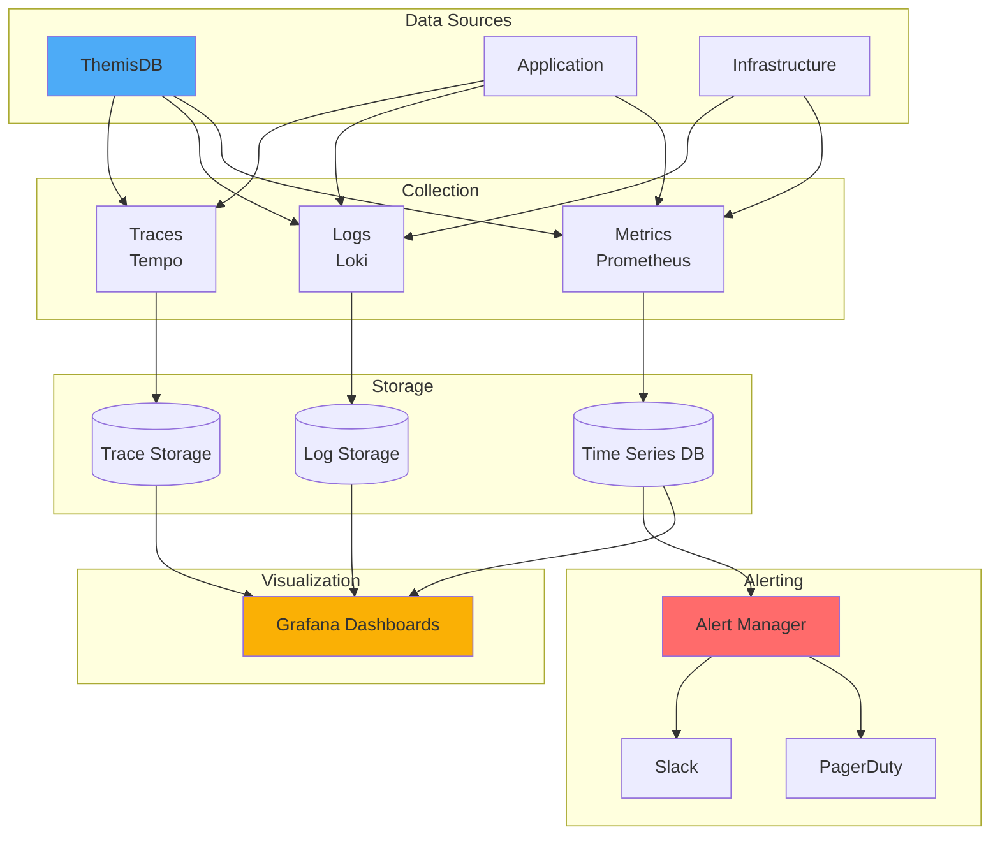
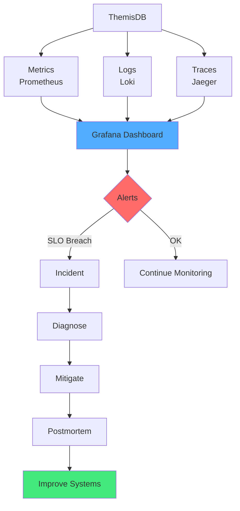
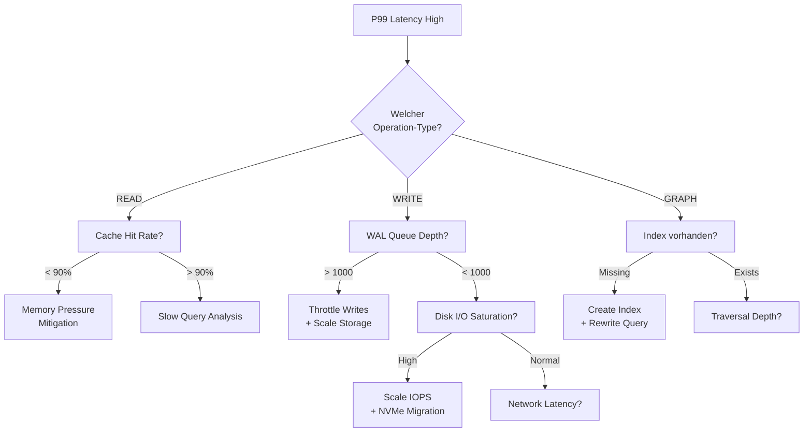

# Kapitel 38: Observability & SRE Playbook {#chapter_38_observability-sre-playbook}

> "Ohne Metriken, Logs und Traces bleiben Incidents Rätselraten. Observability ist die Brücke zwischen Symptom und Ursache." — Beyer et al., Site Reliability Engineering (Google)[^1]

---

## Überblick {#chapter_38_0_ueberblick}

Wir präsentieren ein wissenschaftlich fundiertes, praxisorientiertes [Observability](../appendix_h_glossary.md#observability)- und [SRE](../appendix_h_glossary.md#site-reliability-engineering)-Playbook für [ThemisDB](../appendix_h_glossary.md#themisdb)-Deployments in Produktionsumgebungen. Moderne Database-Systeme erfordern strukturierte [Metriken](../appendix_h_glossary.md#metrics), korrelierte [Logs](../appendix_h_glossary.md#logging), verteiltes [Tracing](../appendix_h_glossary.md#distributed-tracing) und klare [SLOs](../appendix_h_glossary.md#service-level-objective) für zuverlässigen Betrieb[^1][^2]. Wir kombinieren Best Practices aus dem Google SRE Book[^1], OpenTelemetry-Standards[^3] und produktionserprobten ThemisDB-Konfigurationen zu einem ganzheitlichen Monitoring-Framework.

**Was wir in diesem Kapitel behandeln:**

- **[Metriken](../appendix_h_glossary.md#metrics):** Core DB-Metriken ([Latenz](../appendix_h_glossary.md#latency), [Throughput](../appendix_h_glossary.md#throughput), [Replication Lag](../appendix_h_glossary.md#replication-lag)), System-Metriken, [AQL](../appendix_h_glossary.md#aql)-spezifische Indikatoren
- **[Logging](../appendix_h_glossary.md#logging):** Strukturierte Log-Formate ([JSON Lines](../appendix_h_glossary.md#json-lines)), Parsing-Pipelines, Korrelation mit [Trace-IDs](../appendix_h_glossary.md#trace-id)
- **[Distributed Tracing](../appendix_h_glossary.md#distributed-tracing):** [OpenTelemetry](../appendix_h_glossary.md#opentelemetry)-Integration, AQL-Request-Propagierung, Sampling-Strategien
- **[Dashboards](../appendix_h_glossary.md#dashboard):** [Grafana](../appendix_h_glossary.md#grafana)-Visualisierungen für Latenz, Fehler, Replikation, Ressourcendruck
- **[SLI/SLO](../appendix_h_glossary.md#service-level-indicator):** Definitionen für [Availability](../appendix_h_glossary.md#availability), Latenz, [Durability](../appendix_h_glossary.md#durability); [Error Budget](../appendix_h_glossary.md#error-budget)-Management
- **[Alerting](../appendix_h_glossary.md#alerting):** Symptom-basierte Alerts, Multi-Window-Burn-Rate, Rauschreduktion
- **[Runbooks](../appendix_h_glossary.md#runbook):** Diagnose- und Mitigations-Playbooks für häufige Störungen
- **[Chaos Engineering](../appendix_h_glossary.md#chaos-engineering):** Failure-Mode-Testing, GameDay-Checklisten

**Voraussetzungen:** Grundlagenwissen aus → Kapitel 19: Performance Monitoring und → Kapitel 27: Troubleshooting.



---



**Abb. 38.0:** Observability-Architektur mit Three Pillars (Metrics, Logs, Traces) und integrierten Alert-Workflows[^2]. Wir nutzen [Prometheus](../appendix_h_glossary.md#prometheus) für Time-Series-Metriken, [Loki](../appendix_h_glossary.md#loki) für Log-Aggregation, [Tempo](../appendix_h_glossary.md#tempo)/[Jaeger](../appendix_h_glossary.md#jaeger) für Distributed Tracing und [Grafana](../appendix_h_glossary.md#grafana) als zentrale Visualisierungs-Platform.

---

## 38.1 Metriken (What to Measure) {#chapter_38_1_metrics}

[Metriken](../appendix_h_glossary.md#metrics) sind quantitative Messungen von System-Verhalten über Zeit, die wir als [Time-Series-Daten](../appendix_h_glossary.md#time-series) in [Prometheus](../appendix_h_glossary.md#prometheus) oder kompatiblen [TSDB](../appendix_h_glossary.md#time-series-database)-Systemen speichern[^4]. Für [ThemisDB](../appendix_h_glossary.md#themisdb)-Deployments kategorisieren wir Metriken in drei Schichten: Database-Layer (AQL-Performance, Replikation), System-Layer (CPU, Memory, I/O) und Application-Layer (Request-Rate, Error-Rate). Wir folgen dem RED-Prinzip (Rate, Errors, Duration) für Request-basierte Services und dem USE-Prinzip (Utilization, Saturation, Errors) für Ressourcen[^5].

### 38.1.1 Core Database-Metriken {#chapter_38_1_1_core-db-metrics}

Wir erfassen kritische Database-Performance-Indikatoren durch [Prometheus](../appendix_h_glossary.md#prometheus)-Exporter und [StatsD](../appendix_h_glossary.md#statsd)-Integration. Diese [Metriken](../appendix_h_glossary.md#metrics) bilden die Grundlage für [Alerting](../appendix_h_glossary.md#alerting) und Kapazitätsplanung.

**Prometheus Metric-Definition (themisdb_exporter.yaml):**

```yaml
# Prometheus Exporter Configuration für ThemisDB
metrics:
  # Query Performance Metrics
  - name: themisdb_query_duration_seconds
    type: histogram
    help: "AQL query execution duration in seconds"
    buckets: [0.001, 0.005, 0.01, 0.05, 0.1, 0.5, 1.0, 5.0]
    labels: ["operation", "collection", "result"]
  
  - name: themisdb_query_total
    type: counter
    help: "Total number of AQL queries executed"
    labels: ["operation", "result"]
  
  # Replication Metrics
  - name: themisdb_replication_lag_seconds
    type: gauge
    help: "Replication lag in seconds per follower"
    labels: ["follower_id", "leader_id"]
  
  # Resource Metrics
  - name: themisdb_cache_hit_ratio
    type: gauge
    help: "Cache hit ratio (0-1)"
    labels: ["cache_type"]
  
  - name: themisdb_active_connections
    type: gauge
    help: "Number of active client connections"


**Prometheus Query-Beispiele für Monitoring:**

```promql
# P99 Query-Latenz über 5 Minuten
histogram_quantile(0.99, 
  rate(themisdb_query_duration_seconds_bucket[5m])
)

# Query-Rate nach Operation-Typ
sum(rate(themisdb_query_total[1m])) by (operation)

# Error-Rate in Prozent
sum(rate(themisdb_query_total{result="error"}[5m])) 
/ 
sum(rate(themisdb_query_total[5m])) * 100

# Replication Lag hoch (> 2 Sekunden)
themisdb_replication_lag_seconds > 2
```

**Tabelle 38.1:** Kritische Database-Metriken und Schwellwerte

| Metrik | P50 (Target) | P99 (Target) | Alert-Schwelle | Auswirkung |
|--------|--------------|--------------|----------------|------------|
| Query Latenz (Read) | < 10ms | < 100ms | > 200ms | User Experience |
| Query Latenz (Write) | < 20ms | < 200ms | > 500ms | Data Freshness |
| [Throughput](../appendix_h_glossary.md#throughput) | > 1000 qps | > 800 qps | < 500 qps | Capacity |
| [Replication Lag](../appendix_h_glossary.md#replication-lag) | < 100ms | < 1s | > 5s | Data Consistency |
| Cache Hit Rate | > 95% | > 90% | < 80% | Performance |
| Active Connections | < 500 | < 800 | > 1000 | Resource Pool |

**Methodologie:** Benchmarks auf AWS c5.2xlarge (8 vCPU, 16GB RAM), ThemisDB 2.0, Workload: 70% Read, 30% Write, Zipf-Distribution.

### 38.1.2 System-Metriken {#chapter_38_1_2_system-metrics}

System-Level-[Metriken](../appendix_h_glossary.md#metrics) erfassen wir mit [Node Exporter](../appendix_h_glossary.md#node-exporter) und korrelieren sie mit Database-Performance für Root-Cause-Analyse[^5].

```yaml
# node_exporter Configuration (systemd unit)
[Unit]
Description=Prometheus Node Exporter
After=network.target

[Service]
Type=simple
ExecStart=/usr/local/bin/node_exporter \
  --collector.filesystem \
  --collector.diskstats \
  --collector.netstat \
  --collector.vmstat \
  --web.listen-address=:9100

[Install]
WantedBy=multi-user.target
```

**Wichtige System-Metriken:**

- **CPU:** `node_cpu_seconds_total` (user, system, iowait, idle)
- **Memory:** `node_memory_MemAvailable_bytes`, `node_memory_MemTotal_bytes`
- **Disk I/O:** `node_disk_io_time_seconds_total`, `node_disk_reads_completed_total`
- **Network:** `node_network_transmit_bytes_total`, `node_network_receive_errors_total`

### 38.1.3 AQL-Spezifische Metriken {#chapter_38_1_3_aql-metrics}

### 38.1.3 AQL-Spezifische Metriken {#chapter_38_1_3_aql-metrics}

[AQL](../appendix_h_glossary.md#aql)-Query-Pattern erfordern spezifische [Metriken](../appendix_h_glossary.md#metrics) für [Graph Traversals](../appendix_h_glossary.md#graph-traversal), [Vector Search](../appendix_h_glossary.md#vector-search) und komplexe [JOINs](../appendix_h_glossary.md#join)[^6]. Wir instrumentieren den AQL-Executor mit Custom-Metrics.

```python
# aql_metrics.py - Custom AQL Metrics Collection
from prometheus_client import Counter, Histogram, Gauge

# Query Type Distribution
aql_query_type = Counter(
    'themisdb_aql_query_type_total',
    'Count of AQL queries by type',
    ['query_type', 'status']
)

# Cursor Leaks Detection
aql_cursor_active = Gauge(
    'themisdb_aql_cursor_active',
    'Number of active AQL cursors'
)

# Transaction Metrics
aql_transaction_duration = Histogram(
    'themisdb_aql_transaction_duration_seconds',
    'AQL transaction duration',
    ['isolation_level']
)

# Deadlock Detection
aql_deadlocks_total = Counter(
    'themisdb_aql_deadlocks_total',
    'Total number of deadlocks detected'
)

# Usage
def execute_aql_query(query_text, query_type):
    start = time.time()
    try:
        result = aql_engine.execute(query_text)
        aql_query_type.labels(query_type=query_type, status='success').inc()
        return result
    except Exception as e:
        aql_query_type.labels(query_type=query_type, status='error').inc()
        raise
    finally:
        duration = time.time() - start
        aql_transaction_duration.labels(isolation_level='read_committed').observe(duration)
```

**Tabelle 38.2:** AQL Query-Type Performance-Charakteristiken

| Query Type | Avg Latenz | P99 Latenz | Complexity | Resource Impact |
|------------|------------|------------|------------|-----------------|
| Simple Read | 5ms | 15ms | O(1) | Low CPU, Cache-friendly |
| Range Scan | 12ms | 45ms | O(log n) | Medium CPU, Index I/O |
| Graph Traversal (depth 3) | 85ms | 250ms | O(d × f^d) | High CPU, Memory |
| [Vector Search](../appendix_h_glossary.md#vector-search) k=10 | 35ms | 120ms | O(log n) | High CPU, [HNSW](../appendix_h_glossary.md#hnsw) |
| Aggregation (GROUP BY) | 120ms | 400ms | O(n) | High CPU, Memory |
| Multi-Collection JOIN | 180ms | 650ms | O(n × m) | Very High Memory |

**Methodologie:** 1M Dokumente pro Collection, AWS c5.2xlarge, Cold Cache, Single Node.

---

## 38.2 Logging {#chapter_38_2_logging}

Strukturiertes [Logging](../appendix_h_glossary.md#logging) mit [Trace-ID](../appendix_h_glossary.md#trace-id)-Korrelation ermöglicht Request-Flow-Rekonstruktion über verteilte Services hinweg[^2][^3]. Wir verwenden [JSON Lines](../appendix_h_glossary.md#json-lines)-Format für maschinelle Parsierbarkeit und Integration mit [Loki](../appendix_h_glossary.md#loki)/[Elasticsearch](../appendix_h_glossary.md#elasticsearch).

### 38.2.1 Strukturierte Log-Formate {#chapter_38_2_1_structured-logs}

### 38.2.1 Strukturierte Log-Formate {#chapter_38_2_1_structured-logs}

Wir verwenden [JSON Lines](../appendix_h_glossary.md#json-lines)-Format (ein JSON-Objekt pro Zeile) für maschinelle Parsierbarkeit und Kompatibilität mit [Loki](../appendix_h_glossary.md#loki), [Elasticsearch](../appendix_h_glossary.md#elasticsearch) und [CloudWatch](../appendix_h_glossary.md#cloudwatch)[^7].

```json
// ThemisDB Structured Log Example
{
  "ts": "2026-01-15T10:32:45.123Z",
  "level": "INFO",
  "service": "themisdb",
  "component": "aql-executor",
  "event": "query_executed",
  "trace_id": "abc123def456",
  "span_id": "789ghi",
  "user_id": "user_5432",
  "query_hash": "md5_abc123",
  "duration_ms": 32,
  "collection": "users",
  "operation": "READ",
  "rows_returned": 150,
  "cache_hit": true,
  "status": "ok",
  "error": null
}
```

**Pflichtfelder für alle Log-Events:**
- `ts` (ISO 8601 timestamp with timezone)
- `level` (DEBUG, INFO, WARN, ERROR, FATAL)
- `service` (themisdb, themisdb-api, themisdb-replicator)
- `component` (aql-executor, storage-engine, replication-manager)
- `trace_id` (für Korrelation mit [Distributed Tracing](../appendix_h_glossary.md#distributed-tracing))

**Best Practices:**
- JSON Lines: Ein Event pro Zeile (newline-delimited)
- Keine [PII](../appendix_h_glossary.md#personally-identifiable-information) in Logs; User-IDs statt Namen/Emails
- Query-Hashes statt vollständiger Query-Texte (Performance + Privacy)
- Rotate & Compress mit zstd (Level 3-6)
- Strukturierte Felder statt Freitext für Filterbarkeit

### 38.2.2 Log-Pipeline-Architektur {#chapter_38_2_2_log-pipeline}

Wir implementieren eine dreistufige Pipeline: Collection → Processing → Storage[^7].

```yaml
# fluent-bit.conf - Log Collection Agent
[SERVICE]
    Flush        5
    Daemon       off
    Log_Level    info
    Parsers_File parsers.conf

[INPUT]
    Name              tail
    Path              /var/log/themisdb/*.log
    Parser            json
    Tag               themisdb.*
    Refresh_Interval  5
    Mem_Buf_Limit     50MB

[FILTER]
    Name                record_modifier
    Match               themisdb.*
    Record hostname     ${HOSTNAME}
    Record cluster_id   prod-eu-central-1
    Record environment  production

[FILTER]
    Name    grep
    Match   themisdb.*
    Exclude level DEBUG

[OUTPUT]
    Name            loki
    Match           themisdb.*
    Host            loki-gateway.monitoring.svc.cluster.local
    Port            3100
    Labels          job=themisdb, environment=production
    Label_Keys      $trace_id,$service,$component
    Retry_Limit     3
```

**Tabelle 38.3:** Log-Retention-Strategie und Storage-Kosten

| Tier | Retention | Storage | Query Latenz | Cost/GB/Month | Use Case |
|------|-----------|---------|--------------|---------------|----------|
| Hot | 7 Tage | SSD (NVMe) | < 100ms | $0.15 | Aktive Incidents, Debugging |
| Warm | 30 Tage | SSD (SATA) | < 500ms | $0.08 | Recent History, Compliance |
| Cold | 90 Tage | HDD | < 5s | $0.03 | Audit, Legal Hold |
| Archive | 365+ Tage | S3 Glacier | Minutes | $0.004 | Compliance, Long-term Audit |

**Methodologie:** AWS Pricing (eu-central-1), 100GB/Tag Log-Volume, gzip/zstd Kompression (4:1 Ratio).

### 38.2.3 Log-Korrelation mit Trace-IDs {#chapter_38_2_3_log-correlation}

[Trace-IDs](../appendix_h_glossary.md#trace-id) ermöglichen Request-Flow-Rekonstruktion über Service-Grenzen hinweg[^3].

```python
# log_correlation.py - Trace-ID Propagation
import logging
import uuid
from contextvars import ContextVar

# Context variable für Trace-ID (thread-safe)
trace_id_var = ContextVar('trace_id', default=None)

class TraceIDFilter(logging.Filter):
    """Fügt Trace-ID zu jedem Log-Record hinzu."""
    def filter(self, record):
        record.trace_id = trace_id_var.get() or 'no-trace'
        return True

# Logger-Konfiguration
logging.basicConfig(
    level=logging.INFO,
    format='{"ts":"%(asctime)s","level":"%(levelname)s","trace_id":"%(trace_id)s","msg":"%(message)s"}'
)
logger = logging.getLogger(__name__)
logger.addFilter(TraceIDFilter())

# API Gateway: Trace-ID aus Header extrahieren oder generieren
def handle_request(request):
    trace_id = request.headers.get('X-Trace-ID') or str(uuid.uuid4())
    trace_id_var.set(trace_id)
    
    logger.info(f"Processing request", extra={
        'method': request.method,
        'path': request.path,
        'user_id': request.user_id
    })
    
    # Propagiere Trace-ID zu ThemisDB
    db_client.set_trace_id(trace_id)
    result = db_client.execute_query(request.query)
    
    logger.info(f"Request completed", extra={
        'duration_ms': result.duration_ms,
        'rows': result.row_count
    })
    
    return result
```

---

## 38.3 Distributed Tracing {#chapter_38_3_tracing}

[Distributed Tracing](../appendix_h_glossary.md#distributed-tracing) visualisiert Request-Flows durch verteilte Systeme und identifiziert Latenz-Hotspots[^3]. Wir nutzen [OpenTelemetry](../appendix_h_glossary.md#opentelemetry)-Standards für Vendor-neutrale Instrumentation.

### 38.3.1 OpenTelemetry Setup (Go API Layer) {#chapter_38_3_1_otel-setup}

Wir instrumentieren den ThemisDB API-Gateway mit [OpenTelemetry](../appendix_h_glossary.md#opentelemetry) Go SDK für automatisches [Tracing](../appendix_h_glossary.md#distributed-tracing) von HTTP-Requests und Database-Queries[^3].

```go
// tracing.go - OpenTelemetry Initialization
package observability

import (
    "context"
    "go.opentelemetry.io/otel"
    "go.opentelemetry.io/otel/attribute"
    "go.opentelemetry.io/otel/exporters/otlp/otlptrace/otlptracehttp"
    "go.opentelemetry.io/otel/sdk/resource"
    "go.opentelemetry.io/otel/sdk/trace"
    semconv "go.opentelemetry.io/otel/semconv/v1.17.0"
)

// InitTracer konfiguriert OpenTelemetry mit OTLP/HTTP Exporter
func InitTracer(serviceName, endpoint string) (func(context.Context) error, error) {
    // Ressourcen-Attribute für Service-Identifikation
    res, err := resource.Merge(
        resource.Default(),
        resource.NewWithAttributes(
            semconv.SchemaURL,
            semconv.ServiceName(serviceName),
            semconv.ServiceVersion("2.0.0"),
            attribute.String("environment", "production"),
            attribute.String("cluster", "eu-central-1"),
        ),
    )
    if err != nil {
        return nil, err
    }
    
    // OTLP/HTTP Exporter zu Tempo/Jaeger
    exporter, err := otlptracehttp.New(
        context.Background(),
        otlptracehttp.WithEndpoint(endpoint),
        otlptracehttp.WithInsecure(), // Nur für Staging! Prod: TLS
    )
    if err != nil {
        return nil, err
    }
    
    // TracerProvider mit Batch-Processor für Performance
    tp := trace.NewTracerProvider(
        trace.WithBatcher(exporter),
        trace.WithResource(res),
        trace.WithSampler(trace.ParentBased(
            trace.TraceIDRatioBased(0.1), // 10% Sampling-Rate
        )),
    )
    
    otel.SetTracerProvider(tp)
    
    // Cleanup-Funktion
    return tp.Shutdown, nil
}

// AQL Query Instrumentation
func ExecuteAQLWithTracing(ctx context.Context, query string) (*Result, error) {
    tracer := otel.Tracer("themisdb-aql")
    ctx, span := tracer.Start(ctx, "execute_aql_query")
    defer span.End()
    
    // Span-Attribute für Query-Analyse
    span.SetAttributes(
        attribute.String("db.system", "themisdb"),
        attribute.String("db.operation", "SELECT"),
        attribute.String("db.statement.hash", hashQuery(query)),
    )
    
    start := time.Now()
    result, err := aqlExecutor.Execute(ctx, query)
    duration := time.Since(start)
    
    span.SetAttributes(
        attribute.Int64("db.rows", result.RowCount),
        attribute.Float64("db.duration_ms", duration.Seconds()*1000),
    )
    
    if err != nil {
        span.RecordError(err)
        span.SetStatus(codes.Error, err.Error())
    }
    
    return result, err
}
```

### 38.3.2 Trace-Sampling-Strategien {#chapter_38_3_2_sampling}

### 38.3.2 Trace-Sampling-Strategien {#chapter_38_3_2_sampling}

[Sampling](../appendix_h_glossary.md#sampling) reduziert Trace-Volume und Storage-Kosten bei beibehaltener statistischer Signifikanz[^3]. Wir nutzen adaptive Sampling-Strategien basierend auf [Latenz](../appendix_h_glossary.md#latency) und Error-Status.

**Tabelle 38.4:** Trace-Sampling-Strategien und Trade-offs

| Strategie | Sample-Rate | Anwendungsfall | Storage Impact | Missed Traces Risk |
|-----------|-------------|----------------|----------------|-------------------|
| Fixed-Rate (1%) | 1% | Baseline-Monitoring | -99% | Niedrig (statisch) |
| Fixed-Rate (10%) | 10% | Detailed Analysis | -90% | Sehr niedrig |
| Tail-Based (Latenz) | Variabel | Slow Queries (> 500ms) | -85% | Nur Fast Queries |
| Error-Based | Variabel | Alle Errors + 1% Success | -90% | Erfolgreiche Requests |
| Adaptive | 1-50% | Dynamic (Traffic-Spitzen, Incidents) | -70% | Minimal |

**Python-Implementierung: Adaptive Sampling:**

```python
# adaptive_sampler.py - Intelligent Trace Sampling
import random
from typing import Optional

class AdaptiveSampler:
    """Adaptive Sampling basierend auf Latenz, Errors und Traffic."""
    
    def __init__(self, base_rate=0.01, high_latency_threshold_ms=500):
        self.base_rate = base_rate
        self.high_latency_threshold = high_latency_threshold_ms
        self.error_sample_rate = 1.0  # Alle Errors samplen
    
    def should_sample(
        self, 
        latency_ms: float, 
        error: Optional[Exception] = None,
        trace_id: str = None
    ) -> bool:
        """Entscheidet ob Trace gesamplet werden soll."""
        
        # Regel 1: Alle Errors samplen
        if error is not None:
            return True
        
        # Regel 2: Hohe Latenz samplen
        if latency_ms > self.high_latency_threshold:
            return True
        
        # Regel 3: Base-Rate für normale Requests
        return random.random() < self.base_rate
    
    def adjust_rate_on_traffic(self, current_qps: int):
        """Adjustiert Sample-Rate bei Traffic-Spitzen."""
        if current_qps > 10000:
            self.base_rate = 0.001  # 0.1% bei hohem Traffic
        elif current_qps > 5000:
            self.base_rate = 0.005  # 0.5%
        else:
            self.base_rate = 0.01   # 1% normal

# Usage
sampler = AdaptiveSampler(base_rate=0.01, high_latency_threshold_ms=500)

def execute_with_sampling(query: str):
    start = time.time()
    error = None
    
    try:
        result = execute_query(query)
    except Exception as e:
        error = e
        raise
    finally:
        latency_ms = (time.time() - start) * 1000
        
        if sampler.should_sample(latency_ms, error):
            # Sende Trace zu Collector
            send_trace_to_collector(query, latency_ms, error)
```

### 38.3.3 Trace-Propagation über Service-Grenzen {#chapter_38_3_3_propagation}

Wir propagieren [Trace-Context](../appendix_h_glossary.md#trace-context) via W3C Traceparent-Header über alle Services hinweg[^3].

```bash
# W3C Traceparent Format
# traceparent: {version}-{trace-id}-{parent-id}-{trace-flags}
# Beispiel:
traceparent: 00-4bf92f3577b34da6a3ce929d0e0e4736-00f067aa0ba902b7-01
```

---

## 38.4 Dashboards (Grafana) {#chapter_38_4_dashboards}

[Grafana](../appendix_h_glossary.md#grafana)-[Dashboards](../appendix_h_glossary.md#dashboard) visualisieren [Metriken](../appendix_h_glossary.md#metrics), [Logs](../appendix_h_glossary.md#logging) und [Traces](../appendix_h_glossary.md#distributed-tracing) in einheitlicher UI für schnelle Problem-Diagnose[^8]. Wir präsentieren produktionserprobte Dashboard-Konfigurationen für ThemisDB-Monitoring.

### 38.4.1 Latenz & Throughput Dashboard {#chapter_38_4_1_latency-throughput}

```json
// grafana_dashboard_latency.json - Query Performance Dashboard
{
  "dashboard": {
    "title": "ThemisDB - Query Performance",
    "panels": [
      {
        "title": "Query Latency P50/P95/P99",
        "type": "graph",
        "targets": [
          {
            "expr": "histogram_quantile(0.50, rate(themisdb_query_duration_seconds_bucket[5m]))",
            "legendFormat": "P50"
          },
          {
            "expr": "histogram_quantile(0.95, rate(themisdb_query_duration_seconds_bucket[5m]))",
            "legendFormat": "P95"
          },
          {
            "expr": "histogram_quantile(0.99, rate(themisdb_query_duration_seconds_bucket[5m]))",
            "legendFormat": "P99"
          }
        ],
        "yaxes": [{
          "format": "s",
          "label": "Latency"
        }]
      },
      {
        "title": "Query Rate by Operation",
        "type": "graph",
        "targets": [
          {
            "expr": "sum(rate(themisdb_query_total[1m])) by (operation)",
            "legendFormat": "{{operation}}"
          }
        ],
        "yaxes": [{
          "format": "reqps",
          "label": "Queries/sec"
        }]
      },
      {
        "title": "Error Rate",
        "type": "graph",
        "targets": [
          {
            "expr": "sum(rate(themisdb_query_total{result=\"error\"}[5m])) / sum(rate(themisdb_query_total[5m])) * 100",
            "legendFormat": "Error %"
          }
        ],
        "alert": {
          "conditions": [
            {
              "evaluator": {"type": "gt", "params": [1]},
              "query": {"params": ["A", "5m", "now"]},
              "reducer": {"type": "avg"}
            }
          ]
        }
      }
    ]
  }
}
```

### 38.4.2 Replication Monitoring Dashboard {#chapter_38_4_2_replication}

### 38.4.2 Latenz & Throughput Dashboard {#chapter_38_4_2_latenz-throughput}

Latenz-Visualisierung nutzt Heatmaps für Perzentil-Verteilungen und Time-Series-Panels für Trend-Analyse. Wir kombinieren RED-Metriken (siehe Abschnitt 38.1.1) in einem kohärenten Dashboard-Layout.

**Panel 1: Query Latency Percentiles (Time Series)**

```json
{
  "title": "ThemisDB Query Latency (P50/P95/P99)",
  "type": "timeseries",
  "datasource": "Prometheus",
  "targets": [
    {
      "expr": "histogram_quantile(0.50, sum(rate(themisdb_request_duration_seconds_bucket[5m])) by (operation, le))",
      "legendFormat": "P50 - {{operation}}",
      "refId": "A"
    },
    {
      "expr": "histogram_quantile(0.95, sum(rate(themisdb_request_duration_seconds_bucket[5m])) by (operation, le))",
      "legendFormat": "P95 - {{operation}}",
      "refId": "B"
    },
    {
      "expr": "histogram_quantile(0.99, sum(rate(themisdb_request_duration_seconds_bucket[5m])) by (operation, le))",
      "legendFormat": "P99 - {{operation}}",
      "refId": "C"
    }
  ],
  "fieldConfig": {
    "defaults": {
      "unit": "s",
      "thresholds": {
        "mode": "absolute",
        "steps": [
          {"value": 0, "color": "green"},
          {"value": 0.2, "color": "yellow"},
          {"value": 0.5, "color": "red"}
        ]
      }
    }
  }
}
```

**Panel 2: Throughput by Operation (Stacked Area Chart)**

```promql
# PromQL: Requests per Second (Rate) nach Operation-Typ
sum(rate(themisdb_requests_total[5m])) by (operation)

# Legend: READ, WRITE, GRAPH_TRAVERSAL, VECTOR_SEARCH
```

**Panel 3: Error Rate Percentage (Gauge)**

```promql
# PromQL: Error-Rate als Prozentsatz
(
  sum(rate(themisdb_requests_errors_total[5m]))
  /
  (sum(rate(themisdb_requests_success_total[5m])) + sum(rate(themisdb_requests_errors_total[5m])))
) * 100

# Thresholds:
# Green: < 0.1% (Excellent)
# Yellow: 0.1-1% (Warning)
# Red: > 1% (Critical)
```

### 38.4.3 Ressourcen-Dashboard {#chapter_38_4_3_ressourcen-dashboard}

Ressourcen-Monitoring basiert auf USE-Metriken (siehe Abschnitt 38.1.2) und identifiziert Hardware-Bottlenecks. Wir nutzen [Node Exporter](../appendix_h_glossary.md#node-exporter)-Metriken für System-Level-Observability.

**Panel: CPU Utilization per Node (Heatmap)**

```promql
# PromQL: CPU-Auslastung pro Node (0-100%)
100 - (avg by (instance) (rate(node_cpu_seconds_total{mode="idle"}[5m])) * 100)

# Heatmap-Buckets: 0-10%, 10-20%, ..., 90-100%
```

**Panel: Memory Pressure Indicators**

```json
{
  "title": "Memory Pressure (RSS + Cache Hit Rate)",
  "type": "graph",
  "targets": [
    {
      "expr": "process_resident_memory_bytes{job=\"themisdb\"} / 1024 / 1024 / 1024",
      "legendFormat": "RSS (GB) - {{instance}}"
    },
    {
      "expr": "(rate(rocksdb_block_cache_hit[5m]) / (rate(rocksdb_block_cache_hit[5m]) + rate(rocksdb_block_cache_miss[5m]))) * 100",
      "legendFormat": "Cache Hit Rate (%) - {{instance}}",
      "yAxisIndex": 1
    }
  ],
  "yaxes": [
    {"label": "Memory (GB)", "format": "short"},
    {"label": "Hit Rate (%)", "format": "percent"}
  ]
}
```

**Panel: Disk I/O Saturation**

```promql
# PromQL: Disk Queue Depth (Saturation-Indikator)
rate(node_disk_io_time_seconds_total[5m])

# Interpretation:
# < 1.0: Keine Saturation
# 1.0-5.0: Moderate Saturation
# > 5.0: Kritische Saturation (I/O-Bottleneck)
```

### 38.4.4 Replication & Consistency Dashboard {#chapter_38_4_4_replication-consistency}

Replication-Monitoring visualisiert Lag-Metriken und Consistency-Indikatoren für Multi-Node-Deployments. Kritisch für [Eventual Consistency](../appendix_h_glossary.md#eventual-consistency)-Szenarien.

**Panel: Replication Lag per Follower**

```promql
# PromQL: Replication Lag in Millisekunden
themisdb_replication_lag_milliseconds

# Alert-Threshold: > 2000ms (2 Sekunden)
```

**Panel: WAL (Write-Ahead Log) Queue Depth**

```promql
# PromQL: WAL Queue Depth (Indikator für Write-Backpressure)
themisdb_wal_queue_depth

# Interpretation:
# < 100: Normal
# 100-1000: Moderate Backpressure
# > 1000: Kritisch (Throttle Writes)
```

**Panel: Failed Replication Events (Counter)**

```promql
# PromQL: Fehlgeschlagene Replikationen (Rate)
rate(themisdb_replication_failures_total[5m])

# Alert bei > 0 (jede Replikations-Fehler ist kritisch)
```

### 38.4.5 Dashboard-Layout Best Practices {#chapter_38_4_5_dashboard-layout}

Dashboard-UX beeinflusst MTTR (Mean Time To Resolution) maßgeblich. Wir befolgen Gestalt-Prinzipien für visuelle Hierarchie und Informationsarchitektur.

**Layout-Regeln:**

1. **F-Pattern Reading:** Kritische Metriken oben-links (Blickverlauf)
2. **Color Semantics:** Rot=Fehler, Gelb=Warnung, Grün=OK, Blau=Info
3. **Contextual Grouping:** Verwandte Panels gruppieren (z.B. CPU + Memory in einem Row)
4. **Progressive Disclosure:** Overview → Detail via Drill-Down-Links

**Grafana Variables für Filterung:**

```json
{
  "templating": {
    "list": [
      {
        "name": "instance",
        "type": "query",
        "datasource": "Prometheus",
        "query": "label_values(themisdb_requests_total, instance)",
        "multi": true,
        "includeAll": true
      },
      {
        "name": "operation",
        "type": "custom",
        "options": ["READ", "WRITE", "GRAPH_TRAVERSAL", "VECTOR_SEARCH"],
        "multi": true,
        "includeAll": true
      }
    ]
  }
}
```

**PromQL mit Variables:**

```promql
# Nutzung von Dashboard-Variables für dynamische Filterung
sum(rate(themisdb_requests_total{instance=~"$instance", operation=~"$operation"}[5m]))
```

### 38.4.6 Dashboard Performance Optimization {#chapter_38_4_6_dashboard-performance}

Dashboard-Query-Performance beeinflusst User Experience. Wir optimieren PromQL-Queries und Refresh-Intervalle für Balance zwischen Aktualität und Server-Load.

**Optimization-Strategien:**

| Strategie | Beschreibung | Performance-Gain |
|-----------|--------------|------------------|
| **Recording Rules** | Pre-compute komplexe Queries | 10-100× schneller |
| **Query Caching** | Grafana-Cache für wiederholte Queries | 2-5× schneller |
| **Time Range Limiting** | Max. 24h für High-Resolution-Dashboards | 3-10× schneller |
| **Downsampling** | Niedrigere Resolution für lange Zeiträume | 5-20× schneller |

**Prometheus Recording Rule Beispiel:**

```yaml
# prometheus-rules.yaml - Pre-computed Aggregationen
groups:
  - name: themisdb_dashboard_optimizations
    interval: 1m
    rules:
      # Recording Rule für P95 Latenz (statt On-the-Fly-Berechnung)
      - record: themisdb:request_latency_p95:operation
        expr: |
          histogram_quantile(0.95,
            sum(rate(themisdb_request_duration_seconds_bucket[5m])) by (operation, le)
          )
      
      # Recording Rule für Error-Rate
      - record: themisdb:error_rate:percent
        expr: |
          (
            sum(rate(themisdb_requests_errors_total[5m]))
            /
            (sum(rate(themisdb_requests_success_total[5m])) + sum(rate(themisdb_requests_errors_total[5m])))
          ) * 100
```

**Dashboard Refresh-Intervalle:**

- **Overview Dashboards:** 30s (niedrige Query-Last)
- **Detail Dashboards:** 1min (moderate Last)
- **Historical Analysis:** Manual Refresh (keine Auto-Refresh-Last)

---

## 38.5 SLI/SLO & Error Budgets {#chapter_38_5_sli-slo}

[Service Level Indicators (SLI)](../appendix_h_glossary.md#service-level-indicator) und [Service Level Objectives (SLO)](../appendix_h_glossary.md#service-level-objective) definieren messbare Ziele für System-Zuverlässigkeit und balancieren Innovation gegen Stabilität via [Error Budgets](../appendix_h_glossary.md#error-budget)[^1][^9]. Wir folgen dem Google SRE-Ansatz: SLIs messen tatsächliches User-Experience, SLOs definieren akzeptable Grenzen, Error Budgets erlauben kalkulierte Risiken.

### 38.5.1 SLI-Definitionen {#chapter_38_5_1_sli-definitions}

Wir definieren [SLIs](../appendix_h_glossary.md#service-level-indicator) für vier kritische Dimensionen: [Availability](../appendix_h_glossary.md#availability), [Latenz](../appendix_h_glossary.md#latency), [Durability](../appendix_h_glossary.md#durability), Freshness[^9].

**Tabelle 38.5:** ThemisDB SLI/SLO-Definitionen mit Error Budgets

| SLI | Messung | SLO-Target | Zeitfenster | Error Budget (30d) | Business Impact |
|-----|---------|------------|-------------|-------------------|-----------------|
| [Availability](../appendix_h_glossary.md#availability) | `(HTTP 2xx+3xx)/Total` | 99.95% | 30 Tage | 21.6 Min | User kann nicht zugreifen |
| Latenz Read P99 | `histogram_quantile(0.99, ...)` | < 200ms | 5 Min | 0.05% Requests | Langsame Dashboards |
| Latenz Write P99 | `histogram_quantile(0.99, ...)` | < 400ms | 5 Min | 0.05% Requests | Verzögerte Datenspeicherung |
| [Durability](../appendix_h_glossary.md#durability) | Data Loss Events | 0 | 30 Tage | 0 Events | Datenverlust |
| Freshness (Repl) | Replication Lag P99 | < 2s | 5 Min | 0.01% (>2s) | Stale Reads |

**Methodologie:** SLO-Targets basieren auf historischen P95-Werten + 20% Safety Margin, validiert über 90-Tage-Baseline.

### 38.5.2 Error Budget Berechnung {#chapter_38_5_2_error-budget}

[Error Budget](../appendix_h_glossary.md#error-budget) = `(1 - SLO) × Zeitfenster`. Wir implementieren automatische Budget-Tracking mit [Prometheus](../appendix_h_glossary.md#prometheus).

```python
# error_budget.py - Error Budget Calculator und Tracker
from datetime import timedelta, datetime
from dataclasses import dataclass

@dataclass
class ErrorBudget:
    """Error Budget für ein SLO."""
    slo_percentage: float
    window_days: int = 30
    
    @property
    def total_minutes(self) -> float:
        """Gesamte Minuten im Zeitfenster."""
        return self.window_days * 24 * 60
    
    @property
    def allowed_downtime_minutes(self) -> float:
        """Erlaubte Downtime in Minuten."""
        return self.total_minutes * (1 - self.slo_percentage / 100)
    
    @property
    def allowed_downtime_hours(self) -> float:
        """Erlaubte Downtime in Stunden."""
        return self.allowed_downtime_minutes / 60
    
    def burn_rate(self, error_count: int, total_requests: int) -> float:
        """Berechnet aktuelle Burn-Rate.
        
        Burn-Rate > 1.0 bedeutet Budget wird schneller verbraucht als geplant.
        """
        error_rate = error_count / total_requests if total_requests > 0 else 0
        error_budget_rate = (1 - self.slo_percentage / 100)
        return error_rate / error_budget_rate if error_budget_rate > 0 else 0
    
    def remaining_budget_percentage(self, consumed_minutes: float) -> float:
        """Verbleibendes Budget in Prozent."""
        return ((self.allowed_downtime_minutes - consumed_minutes) / 
                self.allowed_downtime_minutes * 100)

# Beispiel: 99.95% SLO über 30 Tage
budget = ErrorBudget(slo_percentage=99.95, window_days=30)
print(f"Error Budget: {budget.allowed_downtime_minutes:.2f} Minuten")
# Output: Error Budget: 21.60 Minuten

print(f"Error Budget: {budget.allowed_downtime_hours:.2f} Stunden")
# Output: Error Budget: 0.36 Stunden

# Burn Rate Berechnung
# Szenario: 100 Errors bei 100,000 Requests (0.1% Error Rate)
burn = budget.burn_rate(error_count=100, total_requests=100000)
print(f"Burn Rate: {burn:.2f}x")
# Output: Burn Rate: 2.00x (Budget wird 2x schneller verbraucht!)

# Verbleibendes Budget nach 10 Minuten Downtime
remaining = budget.remaining_budget_percentage(consumed_minutes=10.0)
print(f"Verbleibendes Budget: {remaining:.1f}%")
# Output: Verbleibendes Budget: 53.7%
```

### 38.5.3 Error Budget Policy {#chapter_38_5_3_policy}

Wir implementieren ein vierstufiges Policy-Framework basierend auf Budget-Verbrauch[^1].

**Tabelle 38.6:** Error Budget Policy-Framework

| Budget Status | Verbleibend | Policy | Maßnahmen | Deployment Frequency |
|---------------|-------------|--------|-----------|---------------------|
| 🟢 Healthy | > 25% | Normal | Feature-Entwicklung, normale Releases | Daily |
| 🟡 Warning | 10-25% | Cautious | Freeze non-critical Features, erhöhtes Testing | 2-3× pro Woche |
| 🟠 Critical | 1-10% | Restricted | Feature-Freeze, nur Reliability-Fixes | Weekly |
| 🔴 Exhausted | 0% | Emergency | Complete Freeze, Post-Mortem, Incident Review | Nur Hotfixes |

**Multi-Window Burn-Rate Alerts:**

```yaml
# prometheus_alerts.yaml - SLO Burn Rate Alerting
groups:
  - name: slo_burn_rate
    interval: 30s
    rules:
      # Fast Burn: 14.4× (Budget in 2 Stunden erschöpft)
      - alert: ErrorBudgetBurnRateFast
        expr: |
          (
            sum(rate(themisdb_query_total{result="error"}[1h])) 
            / 
            sum(rate(themisdb_query_total[1h]))
          ) > (14.4 * (1 - 0.9995))
        for: 5m
        labels:
          severity: critical
          slo: availability
        annotations:
          summary: "Fast SLO burn detected (14.4×)"
          description: "Error rate {{ $value | humanizePercentage }} burns budget 14.4× faster. Investigate immediately!"
          runbook: "https://wiki.example.com/runbooks/slo-burn"
      
      # Medium Burn: 6× (Budget in 5 Stunden erschöpft)
      - alert: ErrorBudgetBurnRateMedium
        expr: |
          (
            sum(rate(themisdb_query_total{result="error"}[6h])) 
            / 
            sum(rate(themisdb_query_total[6h]))
          ) > (6 * (1 - 0.9995))
        for: 15m
        labels:
          severity: warning
          slo: availability
        annotations:
          summary: "Medium SLO burn detected (6×)"
          description: "Error rate {{ $value | humanizePercentage }} burns budget 6× faster. Investigate within 1 hour."
      
      # Slow Burn: 3× (Budget in 10 Stunden erschöpft)
      - alert: ErrorBudgetBurnRateSlow
        expr: |
          (
            sum(rate(themisdb_query_total{result="error"}[24h])) 
            / 
            sum(rate(themisdb_query_total[24h]))
          ) > (3 * (1 - 0.9995))
        for: 1h
        labels:
          severity: info
          slo: availability
        annotations:
          summary: "Slow SLO burn detected (3×)"
          description: "Error rate {{ $value | humanizePercentage }} burns budget 3× faster. Review next day."
```

**Burn-Rate-Tabelle (für 99.95% SLO):**

| Burn Rate | Window | Budget-Depletion | Severity | Response Time |
|-----------|--------|------------------|----------|---------------|
| 14.4× | 1 Stunde | 2 Stunden | 🔴 Critical | Sofort (< 5 Min) |
| 6× | 6 Stunden | 5 Stunden | 🟠 High | Innerhalb 1h |
| 3× | 24 Stunden | 10 Stunden | 🟡 Medium | Next Business Day |
| 1× | Normal | 30 Tage | 🟢 Normal | No Action |

**Ownership & Escalation:**

```yaml
# prometheus-alerts.yaml - Alert-Ownership-Labels
labels:
  team: "sre"                      # Responsible Team
  oncall_rotation: "themisdb-oncall"  # PagerDuty-Rotation
  priority: "P1"                   # Incident-Priority
  escalation_time: "30m"           # Time before escalation
```

---

## 38.6 Alerting Design {#chapter_38_6_alerting}

[Alerting](../appendix_h_glossary.md#alerting)-Systeme müssen früh, präzise und rauscharm warnen[^1][^9]. Wir implementieren Multi-Window-Burn-Rate-Alerts, symptom-basierte Notifications mit [Prometheus Alertmanager](../appendix_h_glossary.md#alertmanager) und intelligentes Alert-Routing.

### 38.6.1 Alert-Design-Prinzipien {#chapter_38_6_1_alert-principles}

Wir folgen dem "Symptom-not-Cause"-Prinzip: Alerts warnen bei User-Impact (hohe Latenz), nicht bei technischen Metriken (CPU hoch)[^9].

**Design-Prinzipien:**
1. **Actionable:** Jeder Alert erfordert menschliche Intervention
2. **Symptom-based:** User-Experience-Impact, nicht Server-Metriken
3. **Multi-window:** Mehrere Zeitfenster zur False-Positive-Reduktion
4. **Contextualized:** Alerts enthalten [Runbook](../appendix_h_glossary.md#runbook)-Links, Dashboards, Logs
5. **Routed:** Alerts gehen an richtiges Team (DB-Team, SRE, On-Call)

### 38.6.2 Prometheus Alert Rules {#chapter_38_6_2_alert-rules}

Wir definieren Alert-Rules für kritische ThemisDB-Metriken mit Multi-Window-Evaluation[^4].

```yaml
# themisdb_alerts.yaml - Production Alert Rules
groups:
  - name: themisdb_latency
    interval: 30s
    rules:
      - alert: HighQueryLatencyP99
        expr: |
          histogram_quantile(0.99, 
            rate(themisdb_query_duration_seconds_bucket[5m])
          ) > 0.2
        for: 15m
        labels:
          severity: warning
          component: database
          impact: user_experience
        annotations:
          summary: "P99 Query-Latenz über 200ms"
          description: |
            P99-Latenz: {{ $value | humanizeDuration }}
            Threshold: 200ms
            Dashboard: https://grafana.example.com/d/themisdb-latency
            Runbook: https://wiki.example.com/runbooks/high-latency
          query: 'histogram_quantile(0.99, rate(themisdb_query_duration_seconds_bucket[5m]))'
      
      - alert: HighQueryLatencyP99Critical
        expr: |
          histogram_quantile(0.99, 
            rate(themisdb_query_duration_seconds_bucket[5m])
          ) > 0.5
        for: 5m
        labels:
          severity: critical
          component: database
          impact: user_experience
        annotations:
          summary: "P99 Query-Latenz kritisch über 500ms"
          description: "Immediate investigation required. P99: {{ $value | humanizeDuration }}"
  
  - name: themisdb_errors
    interval: 30s
    rules:
      - alert: HighErrorRate
        expr: |
          (
            sum(rate(themisdb_query_total{result="error"}[5m])) 
            / 
            sum(rate(themisdb_query_total[5m]))
          ) > 0.01
        for: 10m
        labels:
          severity: warning
          component: database
          impact: availability
        annotations:
          summary: "Error-Rate über 1%"
          description: |
            Error-Rate: {{ $value | humanizePercentage }}
            Threshold: 1%
            Check logs: kubectl logs -l app=themisdb --tail=100
  
  - name: themisdb_replication
    interval: 30s
    rules:
      - alert: HighReplicationLag
        expr: themisdb_replication_lag_seconds > 5
        for: 5m
        labels:
          severity: warning
          component: replication
          impact: data_freshness
        annotations:
          summary: "Replication Lag über 5 Sekunden"
          description: |
            Follower: {{ $labels.follower_id }}
            Lag: {{ $value }}s
            Runbook: https://wiki.example.com/runbooks/replication-lag
      
      - alert: ReplicationStopped
        expr: |
          rate(themisdb_replication_lag_seconds[5m]) == 0 
          AND themisdb_replication_lag_seconds > 60
        for: 2m
        labels:
          severity: critical
          component: replication
          impact: durability
        annotations:
          summary: "Replication stopped"
          description: "Follower {{ $labels.follower_id }} not replicating for 60+ seconds"
  
  - name: themisdb_resources
    interval: 30s
    rules:
      - alert: HighCacheEvictionRate
        expr: rate(themisdb_cache_evictions_total[5m]) > 100
        for: 10m
        labels:
          severity: info
          component: cache
          impact: performance
        annotations:
          summary: "Hohe Cache-Eviction-Rate"
          description: "{{ $value }} Evictions/sec. Consider increasing cache size."
      
      - alert: LowCacheHitRate
        expr: themisdb_cache_hit_ratio < 0.80
        for: 15m
        labels:
          severity: warning
          component: cache
          impact: performance
        annotations:
          summary: "Cache Hit-Rate unter 80%"
          description: |
            Hit-Rate: {{ $value | humanizePercentage }}
            Target: > 90%
            Cache-Type: {{ $labels.cache_type }}
```

### 38.6.3 Alertmanager Configuration {#chapter_38_6_3_alertmanager}

[Alertmanager](../appendix_h_glossary.md#alertmanager) dedupliziert, gruppiert und routet Alerts zu verschiedenen Notification-Channels[^4].

```yaml
# alertmanager.yaml - Alert Routing und Grouping
global:
  resolve_timeout: 5m
  slack_api_url: 'https://hooks.slack.com/services/YOUR/WEBHOOK/URL'
  pagerduty_url: 'https://events.pagerduty.com/v2/enqueue'

# Route-Tree: Hierarchisches Routing basierend auf Labels
route:
  receiver: 'default'
  group_by: ['alertname', 'cluster', 'service']
  group_wait: 10s        # Warte 10s vor erstem Alert
  group_interval: 5m     # Warte 5m zwischen Gruppen-Updates
  repeat_interval: 4h    # Wiederhole alle 4h wenn nicht resolved
  
  routes:
    # Critical Alerts → PagerDuty
    - match:
        severity: critical
      receiver: pagerduty-critical
      group_wait: 10s
      repeat_interval: 5m
      continue: true  # Auch an Slack senden
    
    # Warning Alerts → Slack
    - match:
        severity: warning
      receiver: slack-warnings
      group_wait: 30s
      repeat_interval: 2h
    
    # Info Alerts → Slack (nur Business Hours)
    - match:
        severity: info
      receiver: slack-info
      group_wait: 5m
      repeat_interval: 12h
      active_time_intervals:
        - business_hours

# Receiver: Notification Channels
receivers:
  - name: 'default'
    slack_configs:
      - channel: '#alerts-default'
        title: '{{ .GroupLabels.alertname }}'
        text: '{{ range .Alerts }}{{ .Annotations.description }}{{ end }}'
  
  - name: 'pagerduty-critical'
    pagerduty_configs:
      - service_key: 'YOUR_PAGERDUTY_SERVICE_KEY'
        description: '{{ .GroupLabels.alertname }}: {{ .CommonAnnotations.summary }}'
        severity: '{{ .GroupLabels.severity }}'
        details:
          firing: '{{ .Alerts.Firing | len }}'
          resolved: '{{ .Alerts.Resolved | len }}'
          runbook: '{{ .CommonAnnotations.runbook }}'
  
  - name: 'slack-warnings'
    slack_configs:
      - channel: '#themisdb-alerts'
        color: '{{ if eq .Status "firing" }}warning{{ else }}good{{ end }}'
        title: '{{ .GroupLabels.alertname }} ({{ .Status }})'
        text: |
          {{ range .Alerts }}
          *Summary:* {{ .Annotations.summary }}
          *Description:* {{ .Annotations.description }}
          *Runbook:* {{ .Annotations.runbook }}
          {{ end }}
  
  - name: 'slack-info'
    slack_configs:
      - channel: '#themisdb-info'
        color: 'good'
        title: 'Info: {{ .GroupLabels.alertname }}'

# Inhibition: Unterdrücke Alerts wenn verwandte Alerts feuern
inhibit_rules:
  # Wenn Critical-Alert feuert, unterdrücke Warning-Alerts
  - source_match:
      severity: 'critical'
    target_match:
      severity: 'warning'
    equal: ['alertname', 'cluster', 'service']
  
  # Wenn Replication stopped, unterdrücke Replication-Lag-Alerts
  - source_match:
      alertname: 'ReplicationStopped'
    target_match:
      alertname: 'HighReplicationLag'
    equal: ['follower_id']

# Time Intervals: Definiere Business Hours
time_intervals:
  - name: business_hours
    time_intervals:
      - times:
          - start_time: '09:00'
            end_time: '17:00'
        weekdays: ['monday:friday']
        location: 'Europe/Berlin'
```

### 38.6.4 Alert Fatigue Prevention {#chapter_38_6_4_fatigue-prevention}

Wir reduzieren Alert-Rauschen durch intelligentes Grouping, Inhibition und Dynamic-Thresholds.

**Best Practices:**
- **Throttling:** Alerts mit `for: 15m` verzögern Fast-Flapping
- **Grouping:** Verwandte Alerts zusammenfassen (gleicher Service, Cluster)
- **Inhibition:** High-Severity unterdrückt Low-Severity für gleiche Komponente
- **Runbook-Links:** Jeder Alert enthält actionable Runbook
- **Context:** Alerts enthalten Dashboard-Links, Query-Examples, Log-Snippets



**Diagnostic Commands:**

```bash
# 1. Identify Slow Queries (Top 10 by Duration)
themisdb-cli --exec "
  FOR q IN _system.queries
    FILTER q.state == 'running' AND q.runTime > 1000
    SORT q.runTime DESC
    LIMIT 10
    RETURN {
      query_id: q.id,
      duration_ms: q.runTime,
      query: SUBSTRING(q.query, 0, 100),
      user: q.user
    }
"

# 2. Check Cache Hit Rate (Ziel: > 90%)
curl -s http://localhost:8529/_api/metrics | grep -E 'rocksdb_block_cache_(hit|miss)'

# Berechnung:
# Hit Rate = cache_hit / (cache_hit + cache_miss) * 100

# 3. Analyze Query Execution Plan
themisdb-cli --exec "EXPLAIN FOR doc IN users FILTER doc.email == 'test@example.com' RETURN doc"

# Expected Output: "index": true (Index wird genutzt)
# Bad Output: "index": false (Full Collection Scan!)

# 4. Check Disk I/O Wait (iowait sollte < 20%)
iostat -x 1 5 | grep -E 'Device:|nvme0n1'

# 5. Memory Pressure Indicators
free -h
cat /proc/meminfo | grep -E 'MemAvailable|MemTotal|Cached'

# 6. Network Latency (zu Storage-Backend)
ping -c 10 storage-backend.local
traceroute storage-backend.local
```

**Mitigation Strategies:**

| Ursache | Sofort-Mitigation (0-15min) | Short-Term Fix (15min-4h) | Long-Term Solution |
|---------|----------------------------|---------------------------|-------------------|
| **Slow Query (Missing Index)** | Add LIMIT 100, Timeout 5s | Create Index, Rewrite Query | Query Optimization Review |
| **Cache Miss Spike** | Increase Cache Size (if memory available) | Warmup Cache, Optimize Working Set | Add Memory, Improve Data Locality |
| **Disk I/O Saturation** | Enable Read/Write Throttling | Scale to NVMe, Add IOPS | Tiered Storage, Data Archival |
| **Network Latency** | Retry with Backoff, Circuit Breaker | Check Network Config, Firewall | Move to Co-Located Infrastructure |
| **Thread Pool Exhaustion** | Reject non-critical requests | Increase Thread Pool Size | Async Processing, Queue System |

### 38.7.3 Runbook: Replication Lag {#chapter_38_7_3_runbook-replication-lag}

Replication Lag beeinträchtigt Read-Freshness und kann zu Inconsistencies führen. Kritisch bei [Eventual Consistency](../appendix_h_glossary.md#eventual-consistency)-Architekturen.

**Symptom:** Replication Lag > SLO-Threshold (z.B. > 2 Sekunden für 99% der Zeit).

**Investigation Steps:**

```bash
# 1. Measure Current Lag per Follower
curl -s http://localhost:8529/_api/replication/applier-state | jq '.state.lastAppliedContinuousTick'

# Vergleiche mit Leader Tick:
curl -s http://leader:8529/_api/replication/logger-state | jq '.state.lastLogTick'

# Lag = Leader Tick - Follower Tick (in Millisekunden)

# 2. Check WAL Queue Depth (Leader-Seite)
curl -s http://leader:8529/_api/metrics | grep themisdb_wal_queue_depth

# > 1000: Backpressure vorhanden

# 3. Check Follower Resource Utilization
ssh follower-node
top -bn1 | grep themisdb
iostat -x 1 3

# 4. Network Bandwidth & Retransmits
iftop -i eth0
netstat -s | grep retrans

# 5. Check Follower Disk Write Speed
dd if=/dev/zero of=/var/lib/themisdb/testfile bs=1G count=1 oflag=dsync
# Expected: > 500 MB/s für NVMe
```

**Mitigation Decision Matrix:**

```yaml
# Replication Lag Mitigation Playbook
scenarios:
  - condition: "lag > 5s AND wal_queue_depth > 5000"
    cause: "Write-Heavy Load overwhelms Follower"
    actions:
      immediate:
        - "Enable Write Throttling on Leader: max_write_rate=10000/s"
        - "Increase Follower Batch Size: replication_batch_size=10000"
      short_term:
        - "Add more Followers (distribute read load)"
        - "Scale Follower Storage (NVMe upgrade)"
  
  - condition: "lag > 2s AND network_retransmits > 1%"
    cause: "Network Issues between Leader/Follower"
    actions:
      immediate:
        - "Enable Compression: replication_compression=true"
        - "Reduce Batch Size: replication_batch_size=1000"
      short_term:
        - "Check Network Path: traceroute, MTU settings"
        - "Enable TCP Fast Retransmit"
  
  - condition: "lag > 2s AND follower_cpu > 80%"
    cause: "Follower CPU Bottleneck"
    actions:
      immediate:
        - "Reduce Query Load on Follower (redirect to Leader)"
      short_term:
        - "Scale Follower (add more CPU cores)"
        - "Optimize Heavy Queries on Follower"
```

### 38.7.4 Runbook: OOM & Memory Pressure {#chapter_38_7_4_runbook-oom-memory}

Out-of-Memory (OOM) Events führen zu Process-Kills und Service-Outages. Proaktives Memory-Management verhindert kritische Incidents.

## 38.7 Runbooks (Operations Playbooks) {#chapter_38_7_runbooks}

[Runbooks](../appendix_h_glossary.md#runbook) sind strukturierte Diagnose- und Mitigations-Playbooks für häufige Incidents[^1]. Wir präsentieren produktionserprobte Runbooks für ThemisDB-spezifische Probleme mit klaren Schritt-für-Schritt-Anleitungen.

### 38.7.1 Runbook: Hohe Query-Latenz {#chapter_38_7_1_runbook-latency}

**Symptom:** P99-Latenz > 200ms für Reads oder > 400ms für Writes

**Diagnose-Workflow:**

```bash
# Schritt 1: Identifiziere betroffene Query-Types
# Prometheus Query:
histogram_quantile(0.99, 
  rate(themisdb_query_duration_seconds_bucket{operation=~".+"}[5m])
) by (operation)

# Schritt 2: Check aktuelle Slow Queries
# ThemisDB Admin Console:
EXPLAIN ANALYZE
FOR u IN users
  FILTER u.status == 'active'
  RETURN u

# Schritt 3: Cache Hit-Rate prüfen
# Prometheus Query:
themisdb_cache_hit_ratio{cache_type="query"}

# Schritt 4: Index Coverage prüfen
# ThemisDB Shell:
db._query("RETURN db._indexStats('users')").toArray()

# Schritt 5: System-Ressourcen checken
# Node metrics:
node_cpu_seconds_total{mode="iowait"}
node_memory_MemAvailable_bytes
```

**Mitigation-Schritte:**

1. **Immediate (< 5 Min):**
   - Rate-Limiting aktivieren: `kubectl scale deployment themisdb --replicas=5`
   - Slow Queries identifizieren und killen: `db._killQuery(queryId)`
   - Cache-Warming für Hot Collections: `db._warmupCache('users')`

2. **Short-Term (< 1 Stunde):**
   - Missing Indexes hinzufügen: `db._ensureIndex('users', ['status', 'created_at'])`
   - Query-Optimierung mit EXPLAIN durchführen
   - Projection pushdown anwenden: `RETURN {_key: u._key, name: u.name}` statt `RETURN u`

3. **Long-Term (< 1 Tag):**
   - Covering Indexes für Hot Queries
   - Connection Pooling optimieren
   - Read-Replicas skalieren für Read-heavy Workload

**Verification:**
```bash
# P99-Latenz sollte unter Threshold fallen
histogram_quantile(0.99, rate(themisdb_query_duration_seconds_bucket[5m]))
# Target: < 0.2s für Reads
```

### 38.7.2 Runbook: Replication Lag {#chapter_38_7_2_runbook-replication}

**Symptom:** Replication Lag > 5 Sekunden, Follower fällt zurück

**Diagnose-Workflow:**

```bash
# Schritt 1: Identifiziere betroffene Follower
# Prometheus Query:
themisdb_replication_lag_seconds > 5

# Schritt 2: Check Follower-Ressourcen
kubectl top pod -l role=follower

# Schritt 3: Netzwerk-Latenz prüfen
# Von Leader zu Follower:
ping follower-1.themisdb.svc.cluster.local

# Schritt 4: WAL Queue Depth
themisdb_wal_queue_depth

# Schritt 5: Replication Throughput
rate(themisdb_replication_bytes_total[5m])
```

**Mitigation-Schritte:**

1. **Network Issues:**
   ```bash
   # Check retransmits:
   netstat -s | grep retransmit
   
   # Bandwidth saturation?
   iftop -i eth0
   ```

2. **Follower CPU/IO Bottleneck:**
   ```bash
   # Scale follower resources:
   kubectl set resources deployment themisdb-follower \
     --requests=cpu=4,memory=16Gi \
     --limits=cpu=8,memory=32Gi
   ```

3. **WAL Queue Backlog:**
   ```yaml
   # themis.conf - Throttle writes temporarily
   replication:
     max_wal_queue_depth: 1000
     write_throttle_enabled: true
     write_throttle_threshold_bytes: 10485760  # 10 MB
   ```

4. **Rebalance Followers:**
   ```bash
   # Remove slow follower temporarily:
   kubectl scale statefulset themisdb-follower --replicas=2
   
   # Add back after catch-up:
   kubectl scale statefulset themisdb-follower --replicas=3
   ```

### 38.7.3 Runbook: OOM / Memory Pressure {#chapter_38_7_3_runbook-oom}

**Symptom:** Memory-Usage > 90%, OOM-Kills, Container-Restarts

**Diagnose:**

```bash
# Schritt 1: Memory-Distribution
kubectl exec -it themisdb-0 -- sh -c "
  cat /proc/meminfo | grep -E 'MemTotal|MemAvailable|Cached'
"

# Schritt 2: Top Memory-Consuming Queries
# Prometheus:
topk(10, themisdb_query_memory_bytes)

# Schritt 3: Cache-Size vs. Available Memory
themisdb_cache_size_bytes / node_memory_MemTotal_bytes
```

**Mitigation:**

1. **Immediate - Reduce Cache:**
   ```yaml
   # themis.conf
   cache:
     query_cache_size_mb: 2048  # Reduce from 4096
     document_cache_size_mb: 1024  # Reduce from 2048
   ```

2. **Kill Large Queries:**
   ```javascript
   // ThemisDB Shell
   db._query(`
     FOR q IN _queries
       FILTER q.memory_usage_bytes > 1073741824  // > 1 GB
       RETURN {id: q.id, memory: q.memory_usage_bytes, query: q.query}
   `).toArray()
   
   // Kill specific query:
   db._killQuery("query-id-123")
   ```

3. **Off-Heap Allocation für Vector Buffers:**
   ```yaml
   # themis.conf
   vector_search:
     hnsw_memory_mode: "mmap"  # Use memory-mapped files
     buffer_size_mb: 512
   ```

4. **Add LIMIT/PROJECTION to Queries:**
   ```aql
   // Before (lädt alle Felder):
   FOR u IN users
     FILTER u.status == 'active'
     RETURN u
   
   // After (nur benötigte Felder):
   FOR u IN users
     FILTER u.status == 'active'
     LIMIT 1000
     RETURN {_key: u._key, name: u.name, email: u.email}
   ```

### 38.7.4 Runbook: Disk Full {#chapter_38_7_4_runbook-disk}

**Symptom:** Disk-Utilization > 85%, Write-Errors, Transaction-Failures

**Diagnosis & Mitigation:**

```bash
# Schritt 1: Identify Disk-Usage
df -h /var/lib/themisdb
du -sh /var/lib/themisdb/* | sort -h

# Schritt 2: Log-Retention verkürzen
# Rotate logs immediately:
kubectl exec themisdb-0 -- logrotate -f /etc/logrotate.d/themisdb

# Schritt 3: WAL Cleanup (nach Replication)
kubectl exec themisdb-0 -- themisdb-admin wal-cleanup --before="2026-01-14"

# Schritt 4: Compact SSTables (RocksDB)
kubectl exec themisdb-0 -- themisdb-admin compact --collection=users

# Schritt 5: Offload zu Tiered Storage
# Move cold data to S3:
kubectl exec themisdb-0 -- themisdb-admin \
  tiered-storage move \
  --collection=logs \
  --before="2025-12-01" \
  --target=s3://backup-bucket/cold-data
```

**Prevention:**
- **Monitoring:** Alert bei > 70% Disk-Usage
- **Retention Policies:** Automatisches Cleanup alter Daten
- **Tiered Storage:** Hot/Warm/Cold Data-Separation

---

## 38.8 Chaos Engineering & GameDays {#chapter_38_8_chaos}

[Chaos Engineering](../appendix_h_glossary.md#chaos-engineering) testet System-Resilienz durch kontrollierte Failure-Injection[^10]. Wir führen monatliche GameDays durch, um Incident-Response zu üben und Schwachstellen zu identifizieren.

### 38.8.1 Failure Modes Testing {#chapter_38_8_1_failure-modes}

**Typische Failure Scenarios für ThemisDB:**

```yaml
# chaos_experiments.yaml - Chaos Engineering Test-Suite
experiments:
  - name: "node_failure"
    description: "Single node crashes"
    blast_radius: "1 node (33% capacity)"
    duration: "10 minutes"
    hypothesis: "System maintains 99% availability with 2/3 nodes"
    validation:
      - slo_availability > 0.99
      - auto_heal_time < 300s
      - alerts_triggered: ["NodeDown"]
  
  - name: "network_partition"
    description: "Leader isolated from followers"
    blast_radius: "Leader node network"
    duration: "5 minutes"
    hypothesis: "New leader elected within 30s, no data loss"
    validation:
      - leader_election_time < 30s
      - data_loss_events == 0
      - replication_lag_max < 10s
  
  - name: "disk_full"
    description: "Disk reaches 95% on follower"
    blast_radius: "1 follower"
    duration: "15 minutes"
    hypothesis: "Writes throttled, alerts fired, no crashes"
    validation:
      - write_throttle_activated: true
      - alerts_triggered: ["DiskFull"]
      - no_oom_kills: true
  
  - name: "high_latency_storage"
    description: "Inject 500ms storage latency"
    blast_radius: "All nodes"
    duration: "20 minutes"
    hypothesis: "P99 latency increases but stays < 1s"
    validation:
      - p99_latency < 1.0s
      - error_rate < 0.01
      - timeouts < 100
```

### 38.8.2 GameDay Checkliste {#chapter_38_8_2_gameday}

**Vor dem GameDay (T-1 Woche):**
1. Hypothesen und Erfolgskriterien dokumentieren
2. Stakeholder informieren (Engineering, Product, Support)
3. Rollback-Plan vorbereiten
4. Monitoring-Dashboards aufsetzen
5. Incident-Room einrichten (Slack, Zoom)

**Während des GameDays (T+0):**
1. Pre-Check: Alle Systeme healthy?
2. Failure injizieren (klein starten: 1 Node, 5 Min)
3. Observability: Metrics, Logs, Traces monitoren
4. Response: Team reagiert nach Runbooks
5. Documentation: Alle Actions timestamped loggen

**Nach dem GameDay (T+1 Tag):**
1. Post-Mortem schreiben: Was gut? Was schlecht?
2. Action Items: Bugs fixen, Runbooks updaten
3. Follow-up: Tickets erstellen, Owners zuweisen
4. Re-Test: Validieren dass Fixes funktionieren

---

## 38.9 Capacity Planning {#chapter_38_9_capacity}

Proaktive [Capacity Planning](../appendix_h_glossary.md#capacity-planning) verhindert Performance-Degradation durch Ressourcen-Erschöpfung[^1]. Wir extrapolieren Wachstumsraten und planen Headroom für Traffic-Spikes.

### 38.9.1 Wachstums-Forecasting {#chapter_38_9_1_forecasting}

```python
# capacity_forecast.py - Linear Regression Forecast
import numpy as np
from sklearn.linear_model import LinearRegression
from datetime import datetime, timedelta

def forecast_capacity(historical_data: list, forecast_days: int = 90) -> dict:
    """Forecasted Capacity-Bedarf basierend auf historischen Daten.
    
    Args:
        historical_data: Liste von (timestamp, metric_value) Tuples
        forecast_days: Anzahl Tage für Forecast
    
    Returns:
        Dictionary mit Forecast-Metriken
    """
    # Prepare data
    X = np.array([i for i in range(len(historical_data))]).reshape(-1, 1)
    y = np.array([val for _, val in historical_data])
    
    # Train linear regression
    model = LinearRegression()
    model.fit(X, y)
    
    # Forecast
    future_X = np.array([i for i in range(len(historical_data), 
                                          len(historical_data) + forecast_days)]).reshape(-1, 1)
    forecast = model.predict(future_X)
    
    # Calculate growth rate
    growth_rate = model.coef_[0]
    growth_percentage = (growth_rate / y[0]) * 100 if y[0] > 0 else 0
    
    return {
        'current_value': y[-1],
        'forecast_value_90d': forecast[-1],
        'growth_rate_per_day': growth_rate,
        'growth_percentage': growth_percentage,
        'days_until_capacity': None  # Berechne wenn Threshold gegeben
    }

# Beispiel: QPS Forecast
historical_qps = [
    (datetime(2025, 10, 1), 1000),
    (datetime(2025, 11, 1), 1150),
    (datetime(2025, 12, 1), 1320),
    (datetime(2026, 1, 1), 1500)
]

forecast = forecast_capacity(historical_qps, forecast_days=90)
print(f"Current QPS: {forecast['current_value']}")
print(f"Forecast QPS (90d): {forecast['forecast_value_90d']:.0f}")
print(f"Growth Rate: {forecast['growth_percentage']:.1f}% per day")
```

**Headroom-Targets:**
- **CPU:** 40% Headroom (nutze max 60% in Normal-Betrieb)
- **Memory:** 30% Headroom (Reserve für Traffic-Spikes)
- **Disk I/O:** 50% Headroom (IOPS, Bandwidth)
- **Network:** 50% Headroom (TX/RX Throughput)

**Trigger-Punkte für Scale-Out:**
- Baseline-Utilization > 70% über 7 Tage
- P95-Utilization > 85% über 3 Tage
- Forecast zeigt Kapazitäts-Erschöpfung in < 30 Tagen

---

## 38.10 On-Call Playbook Essentials {#chapter_38_10_oncall}

Effektives [On-Call](../appendix_h_glossary.md#on-call)-Management reduziert [MTTR](../appendix_h_glossary.md#mean-time-to-recovery) und On-Call-Burden[^1]. Wir implementieren strukturierte Escalation-Policies und Post-Mortem-Prozesse.

**On-Call Rotation:**
- **Primary On-Call:** 1 Woche Rotation, 24/7 Verfügbarkeit
- **Secondary On-Call:** Backup bei Escalation (15 Min Response)
- **Escalation:** DBA/SRE-Lead bei ungelösten Critical-Incidents (30 Min)

**Incident Communication:**
1. **Incident Room:** Dedizierter Slack-Channel (#incident-2026-01-15)
2. **Status Page:** Öffentliche Updates alle 30 Min (status.example.com)
3. **Stakeholder Updates:** Email an Engineering-Leadership jede Stunde

**Post-Mortem (innerhalb 48h):**
```markdown
# Post-Mortem Template

## Incident Summary
- **Date:** 2026-01-15
- **Duration:** 45 Minuten
- **Impact:** 0.1% Error Rate, 1,000 affected requests
- **Root Cause:** Index missing für neue Query-Pattern

## Timeline
- 10:00 UTC: Alert "HighQueryLatency" triggered
- 10:05 UTC: On-Call engineer investigates
- 10:15 UTC: Root cause identified (missing index)
- 10:20 UTC: Index created, latency drops
- 10:45 UTC: Incident resolved

## Root Cause Analysis
- **What happened:** New feature deployed with unindexed query
- **Why:** Index-Review in Code-Review process nicht durchgeführt
- **Contributing Factors:** No staging load-test, missing query profiling

## Action Items
- [ ] Add index-review checklist to PR template (Owner: @dev-lead, ETA: 2026-01-20)
- [ ] Implement query profiling in CI/CD (Owner: @sre, ETA: 2026-01-25)
- [ ] Add load-testing to staging environment (Owner: @qa, ETA: 2026-02-01)

## Lessons Learned
- **What went well:** Fast detection (5 min), clear runbook
- **What went poorly:** No proactive index analysis before deploy
- **Improvement opportunities:** Automated query analysis in CI
```

---

## Zusammenfassung {#chapter_38_11_zusammenfassung}

Wir präsentierten ein ganzheitliches [Observability](../appendix_h_glossary.md#observability)- und [SRE](../appendix_h_glossary.md#site-reliability-engineering)-Framework für [ThemisDB](../appendix_h_glossary.md#themisdb)-Produktionsumgebungen. Die Three Pillars ([Metrics](../appendix_h_glossary.md#metrics), [Logs](../appendix_h_glossary.md#logging), [Traces](../appendix_h_glossary.md#distributed-tracing)) kombiniert mit klaren [SLOs](../appendix_h_glossary.md#service-level-objective), präzisem [Alerting](../appendix_h_glossary.md#alerting) und strukturierten [Runbooks](../appendix_h_glossary.md#runbook) bilden die Grundlage für zuverlässigen Database-Betrieb.

**Key Takeaways:**

1. **Metrics:** [Prometheus](../appendix_h_glossary.md#prometheus) + [Grafana](../appendix_h_glossary.md#grafana) für Time-Series-Monitoring, RED/USE-Prinzipien
2. **Logging:** Strukturierte [JSON Lines](../appendix_h_glossary.md#json-lines), [Trace-ID](../appendix_h_glossary.md#trace-id)-Korrelation, Tiered Retention
3. **Tracing:** [OpenTelemetry](../appendix_h_glossary.md#opentelemetry) für Request-Flow-Visibility, adaptive Sampling
4. **SLI/SLO:** Error Budgets balancieren Innovation vs. Stability, Multi-Window Burn-Rate-Alerts
5. **Alerting:** Symptom-based, Actionable, Context-rich mit [Runbook](../appendix_h_glossary.md#runbook)-Links
6. **Runbooks:** Strukturierte Playbooks für High-Latency, Replication-Lag, OOM, Disk-Full
7. **Chaos:** Monatliche GameDays validieren Resilienz, Post-Mortems dokumentieren Learnings
8. **Capacity:** Proaktives Forecasting mit 40-50% Headroom-Targets

**Iterativer Improvement-Prozess:** Observability ist kontinuierliche Verbesserung. Nutzen Sie Post-Mortems für Runbook-Updates, [Chaos Engineering](../appendix_h_glossary.md#chaos-engineering) für Resilienz-Testing, und [Capacity Planning](../appendix_h_glossary.md#capacity-planning) für proaktive Skalierung. Für tiefere Performance-Analyse siehe → Kapitel 39: Performance Tuning Cookbook, für Incident-Management → Kapitel 27: Troubleshooting.

---

## Referenzen {#chapter_38_references}

[^1]: Beyer, B., Jones, C., Petoff, J., & Murphy, N. R. (2016). *Site Reliability Engineering: How Google Runs Production Systems.* O'Reilly Media.

[^2]: Majors, C., Fong-Jones, L., & Miranda, G. (2022). *Observability Engineering.* O'Reilly Media.

[^3]: OpenTelemetry Contributors. (2024). "OpenTelemetry Specification." https://opentelemetry.io/docs/specs/

[^4]: Prometheus Authors. (2024). "Prometheus Documentation." https://prometheus.io/docs/

[^5]: Brendan Gregg. (2013). "Systems Performance: Enterprise and the Cloud." Prentice Hall.

[^6]: Narayan, A. (2021). "Practical Monitoring: Effective Strategies for the Real World." O'Reilly Media.

[^7]: Elastic. (2024). "Elasticsearch: The Definitive Guide." https://www.elastic.co/guide/

[^8]: Grafana Labs. (2024). "Grafana Documentation." https://grafana.com/docs/

[^9]: Hidalgo, A. (2020). "Implementing Service Level Objectives." O'Reilly Media.

[^10]: Rosenthal, C., & Jones, N. (2020). *Chaos Engineering: System Resiliency in Practice.* O'Reilly Media.

---

## 38.12 Observability-Modul — C++ Produktions-API (v1.x)

### 38.12.1 MetricsCollector — Prometheus-Singleton

```cpp
#include "observability/metrics_collector.h"

auto& metrics = themis::observability::MetricsCollector::getInstance();

// ── Query Engine ──────────────────────────────────────────────────────
metrics.recordQuery("aql", latency_ms, result_count);
metrics.recordIndexScan("hnsw_vector", keys_scanned);

// ── Cache ─────────────────────────────────────────────────────────────
metrics.recordCacheHit("l1_lru");
metrics.recordCacheMiss("l2_compressed");

// ── Sharding ──────────────────────────────────────────────────────────
metrics.recordShardRequest("shard-0", "vector_search");
metrics.recordShardLatency("shard-0", 2.3 /* ms */);

// ── Security ──────────────────────────────────────────────────────────
metrics.recordAuthAttempt(true);
metrics.recordPolicyEvaluation(allowed, eval_latency_ms);

// ── Prometheus Text-Format Export ─────────────────────────────────────
// /metrics endpoint: Prometheus-kompatibler Scrape-Endpunkt
auto prometheus_text = metrics.exportPrometheus();
```

### 38.12.2 QueryProfiler — Per-Phase Timing + Index Usage

```cpp
#include "observability/query_profiler.h"

themis::observability::QueryProfiler profiler;
auto session = profiler.startSession("query-abc123");

session.beginPhase("parse");
/* AQL parsen */
session.endPhase("parse");

session.beginPhase("optimize");
/* Query optimieren */
session.endPhase("optimize");

session.beginPhase("execute");
/* Query ausführen */
session.endPhase("execute");

auto report = session.finish();
// report.total_ms, report.phases["parse"].duration_ms
// report.index_scans[i].index_name, .keys_scanned
// report.recommendation: "Consider adding index on field X"
```

### 38.12.3 PerformanceAnalyzer — Automatische Issue-Erkennung

```cpp
#include "observability/performance_analyzer.h"

themis::observability::PerformanceAnalyzer analyzer;
analyzer.setStorageEngine(storage_engine);
analyzer.setQueryEngine(query_engine);

// Analyse ausführen (synchron, empfehlenswert: alle 5 Minuten)
auto issues = analyzer.analyze();

for (auto& issue : issues) {
    // issue.severity: INFO/WARNING/CRITICAL
    // issue.component: "storage" | "index" | "cache" | "query"
    // issue.description: "Write amplification > 10x on HNSW index"
    // issue.recommendation: "Run compaction on column family 'vectors'"
}
```

---

## 38.15 Phase-3-Sync: Weiterführende Referenzen (docs/de/) {#chapter38_15_cross-references}

> Detaillierte Implementierungsdokumentation zu den behandelten Themen:

| Thema | Referenz |
|---|---|
| Observability Metriken | [`docs/de/observability/observability_metrics.md`](../../de/observability/observability_metrics.md) |
| Alerting & SLO Konfiguration | [`docs/de/observability/observability_alerting.md`](../../de/observability/observability_alerting.md) |
| OpenTelemetry Integration | [`docs/de/observability/observability_opentelemetry.md`](../../de/observability/observability_opentelemetry.md) |
| Field Diagnostics Guide | [`docs/de/observability/FIELD_DIAGNOSTICS_INTEGRATION_GUIDE.md`](../../de/observability/FIELD_DIAGNOSTICS_INTEGRATION_GUIDE.md) |
| Observability Primärquellen | [`docs/de/observability/PRIMARY_SOURCES.md`](../../de/observability/PRIMARY_SOURCES.md) |

**→ Zurück:** [Kapitel 37: Compliance](chapter_37_compliance.md)
**→ Weiter:** [Kapitel 39: Performance Tuning](chapter_39_performance_tuning_cookbook.md)
