# Content Processing

**Content-Processing, Geo-Funktionen und Plugins**

[← Zurück zur Übersicht](namespace-klassen-uebersicht.md)

---

### Content Processing

**Content-Processing, Geo-Funktionen und Plugins**

```mermaid
classDiagram
    %% Content Processing

    class themis_content {
        <<namespace>>
        +26 classes
        +46 structs
        +0 enums
        +262 functions
    }

    class themis_content_ArchiveStrategy {
        +ArchiveStrategy
    }
    themis_content <-- themis_content_ArchiveStrategy

    class themis_content_EncryptedArchivePolicy {
        +EncryptedArchivePolicy
    }
    themis_content <-- themis_content_EncryptedArchivePolicy

    class themis_content_ArchiveFormat {
        +ArchiveFormat
    }
    themis_content <-- themis_content_ArchiveFormat

    class themis_content_ArchiveMember {
        <<struct>>
        +ArchiveMember
    }
    themis_content <-- themis_content_ArchiveMember

    class themis_content_ArchiveMetadata {
        <<struct>>
        +ArchiveMetadata
    }
    themis_content <-- themis_content_ArchiveMetadata

    class themis_content_ArchiveExtractionResult {
        <<struct>>
        +ArchiveExtractionResult
    }
    themis_content <-- themis_content_ArchiveExtractionResult

    class themis_content_ArchiveProcessorResult {
        <<struct>>
        +ArchiveProcessorResult
    }
    themis_content <-- themis_content_ArchiveProcessorResult

    class themis_content_ArchiveProcessorConfig {
        <<struct>>
        +ArchiveProcessorConfig
    }
    themis_content <-- themis_content_ArchiveProcessorConfig

    note for themis_content "... und 64 weitere Klassen"

    class themis_plugins_image {
        <<namespace>>
        +4 classes
        +12 structs
        +0 enums
        +37 functions
    }

    class themis_plugins_image_ImageFormat {
        +ImageFormat
    }
    themis_plugins_image <-- themis_plugins_image_ImageFormat

    class themis_plugins_image_BackendType {
        +BackendType
    }
    themis_plugins_image <-- themis_plugins_image_BackendType

    class themis_plugins_image_ImageMetadata {
        <<struct>>
        +ImageMetadata
    }
    themis_plugins_image <-- themis_plugins_image_ImageMetadata

    class themis_plugins_image_EmbeddingResult {
        <<struct>>
        +EmbeddingResult
    }
    themis_plugins_image <-- themis_plugins_image_EmbeddingResult

    class themis_plugins_image_CaptionResult {
        <<struct>>
        +CaptionResult
    }
    themis_plugins_image <-- themis_plugins_image_CaptionResult

    class themis_plugins_image_DetectionResult {
        <<struct>>
        +DetectionResult
    }
    themis_plugins_image <-- themis_plugins_image_DetectionResult

    class themis_plugins_image_BoundingBox {
        <<struct>>
        +BoundingBox
    }
    themis_plugins_image <-- themis_plugins_image_BoundingBox

    class themis_plugins_image_SegmentationResult {
        <<struct>>
        +SegmentationResult
    }
    themis_plugins_image <-- themis_plugins_image_SegmentationResult

    note for themis_plugins_image "... und 10 weitere Klassen"

    class themis_geo {
        <<namespace>>
        +4 classes
        +7 structs
        +0 enums
        +36 functions
    }

    class themis_geo_IGeoOpsExtension {
        +IGeoOpsExtension
    }
    themis_geo <-- themis_geo_IGeoOpsExtension

    class themis_geo_GeometryInfo {
        <<struct>>
        +GeometryInfo
    }
    themis_geo <-- themis_geo_GeometryInfo

    class themis_geo_SpatialBatchInputs {
        <<struct>>
        +SpatialBatchInputs
    }
    themis_geo <-- themis_geo_SpatialBatchInputs

    class themis_geo_SpatialBatchResults {
        <<struct>>
        +SpatialBatchResults
    }
    themis_geo <-- themis_geo_SpatialBatchResults

    class themis_geo_ISpatialComputeBackend {
        +ISpatialComputeBackend
    }
    themis_geo <-- themis_geo_ISpatialComputeBackend

    class themis_geo_IGeoRegistry {
        +IGeoRegistry
    }
    themis_geo <-- themis_geo_IGeoRegistry

    class themis_geo_GeometryType {
        +GeometryType
    }
    themis_geo <-- themis_geo_GeometryType

    class themis_geo_Coordinate {
        <<struct>>
        +Coordinate
    }
    themis_geo <-- themis_geo_Coordinate

    note for themis_geo "... und 3 weitere Klassen"

    class themis_plugins {
        <<namespace>>
        +4 classes
        +3 structs
        +0 enums
        +27 functions
    }

    class themis_plugins_PluginType {
        +PluginType
    }
    themis_plugins <-- themis_plugins_PluginType

    class themis_plugins_PluginCapabilities {
        <<struct>>
        +PluginCapabilities
    }
    themis_plugins <-- themis_plugins_PluginCapabilities

    class themis_plugins_IThemisPlugin {
        +IThemisPlugin
    }
    themis_plugins <-- themis_plugins_IThemisPlugin

    class themis_plugins_PluginManifest {
        <<struct>>
        +PluginManifest
    }
    themis_plugins <-- themis_plugins_PluginManifest

    class themis_plugins_PluginManager {
        +PluginManager
    }
    themis_plugins <-- themis_plugins_PluginManager

    class themis_plugins_PluginEntry {
        <<struct>>
        +PluginEntry
    }
    themis_plugins <-- themis_plugins_PluginEntry

    class themis_plugins_PluginRegistry {
        +PluginRegistry
    }
    themis_plugins <-- themis_plugins_PluginRegistry

    class themis_plugins_PluginRegistrar {
        +PluginRegistrar
    }
    themis_plugins <-- themis_plugins_PluginRegistrar

    class themis_exporters {
        <<namespace>>
        +2 classes
        +10 structs
        +0 enums
        +19 functions
    }

    class themis_exporters_JSONLFormat {
        <<struct>>
        +JSONLFormat
    }
    themis_exporters <-- themis_exporters_JSONLFormat

    class themis_exporters_Style {
        +Style
    }
    themis_exporters <-- themis_exporters_Style

    class themis_exporters_JSONLLLMConfig {
        <<struct>>
        +JSONLLLMConfig
    }
    themis_exporters <-- themis_exporters_JSONLLLMConfig

    class themis_exporters_FieldMapping {
        <<struct>>
        +FieldMapping
    }
    themis_exporters <-- themis_exporters_FieldMapping

    class themis_exporters_WeightConfig {
        <<struct>>
        +WeightConfig
    }
    themis_exporters <-- themis_exporters_WeightConfig

    class themis_exporters_QualityFilter {
        <<struct>>
        +QualityFilter
    }
    themis_exporters <-- themis_exporters_QualityFilter

    class themis_exporters_StructuredGeneration {
        <<struct>>
        +StructuredGeneration
    }
    themis_exporters <-- themis_exporters_StructuredGeneration

    class themis_exporters_AdapterMetadata {
        <<struct>>
        +AdapterMetadata
    }
    themis_exporters <-- themis_exporters_AdapterMetadata

    note for themis_exporters "... und 5 weitere Klassen"

    class themis_importers {
        <<namespace>>
        +3 classes
        +3 structs
        +0 enums
        +25 functions
    }

    class themis_importers_ImportStats {
        <<struct>>
        +ImportStats
    }
    themis_importers <-- themis_importers_ImportStats

    class themis_importers_ImportOptions {
        <<struct>>
        +ImportOptions
    }
    themis_importers <-- themis_importers_ImportOptions

    class themis_importers_IImporter {
        +IImporter
    }
    themis_importers <-- themis_importers_IImporter

    class themis_importers_PostgreSQLImporter {
        +PostgreSQLImporter
    }
    themis_importers <-- themis_importers_PostgreSQLImporter

    class themis_importers_TableSchema {
        <<struct>>
        +TableSchema
    }
    themis_importers <-- themis_importers_TableSchema

    class themis_importers_PostgreSQLImporterPlugin {
        +PostgreSQLImporterPlugin
    }
    themis_importers <-- themis_importers_PostgreSQLImporterPlugin

```

#### Statistik: Content Processing

| Namespace | Klassen | Funktionen | Variablen |
|-----------|---------|------------|-----------|
| `themis::content` | 79 | 262 | 451 |
| `themis::plugins::image` | 18 | 37 | 134 |
| `themis::geo` | 12 | 36 | 22 |
| `themis::plugins` | 8 | 27 | 29 |
| `themis::exporters` | 13 | 19 | 63 |
| `themis::importers` | 6 | 25 | 29 |

---
