# Core & Infrastructure

**Kern-Komponenten, Storage-Layer und Transaktionsverwaltung**

[← Zurück zur Übersicht](namespace-klassen-uebersicht.md)

---

### Core & Infrastructure

**Kern-Komponenten, Storage-Layer und Transaktionsverwaltung**

```mermaid
classDiagram
    %% Core & Infrastructure

    class themis {
        <<namespace>>
        +199 classes
        +188 structs
        +0 enums
        +854 functions
    }

    class themis_TaskType {
        +TaskType
    }
    themis <-- themis_TaskType

    class themis_LLMProvider {
        +LLMProvider
    }
    themis <-- themis_LLMProvider

    class themis_LLMConfig {
        <<struct>>
        +LLMConfig
    }
    themis <-- themis_LLMConfig

    class themis_LLMRequest {
        <<struct>>
        +LLMRequest
    }
    themis <-- themis_LLMRequest

    class themis_LLMResponse {
        <<struct>>
        +LLMResponse
    }
    themis <-- themis_LLMResponse

    class themis_Deviation {
        <<struct>>
        +Deviation
    }
    themis <-- themis_Deviation

    class themis_ComplianceIssue {
        <<struct>>
        +ComplianceIssue
    }
    themis <-- themis_ComplianceIssue

    class themis_Recommendation {
        <<struct>>
        +Recommendation
    }
    themis <-- themis_Recommendation

    note for themis "... und 252 weitere Klassen"

    class themis_storage {
        <<namespace>>
        +5 classes
        +5 structs
        +0 enums
        +37 functions
    }

    class themis_storage_SecuritySignatureManager {
        +SecuritySignatureManager
    }
    themis_storage <-- themis_storage_SecuritySignatureManager

    class themis_storage_BlobStorageType {
        +BlobStorageType
    }
    themis_storage <-- themis_storage_BlobStorageType

    class themis_storage_BlobRef {
        <<struct>>
        +BlobRef
    }
    themis_storage <-- themis_storage_BlobRef

    class themis_storage_IBlobStorageBackend {
        +IBlobStorageBackend
    }
    themis_storage <-- themis_storage_IBlobStorageBackend

    class themis_storage_BlobStorageConfig {
        <<struct>>
        +BlobStorageConfig
    }
    themis_storage <-- themis_storage_BlobStorageConfig

    class themis_storage_BlobStorageManager {
        +BlobStorageManager
    }
    themis_storage <-- themis_storage_BlobStorageManager

    class themis_storage_NlpMetadataExtractor {
        +NlpMetadataExtractor
    }
    themis_storage <-- themis_storage_NlpMetadataExtractor

    class themis_storage_ExtractedMetadata {
        <<struct>>
        +ExtractedMetadata
    }
    themis_storage <-- themis_storage_ExtractedMetadata

    note for themis_storage "... und 1 weitere Klassen"

    class themis_index {
        <<namespace>>
        +5 classes
        +6 structs
        +0 enums
        +28 functions
    }

    class themis_index_SpatialIndexManager {
        +SpatialIndexManager
    }
    themis_index <-- themis_index_SpatialIndexManager

    class themis_index_MortonEncoder {
        +MortonEncoder
    }
    themis_index <-- themis_index_MortonEncoder

    class themis_index_RTreeConfig {
        <<struct>>
        +RTreeConfig
    }
    themis_index <-- themis_index_RTreeConfig

    class themis_index_SpatialResult {
        <<struct>>
        +SpatialResult
    }
    themis_index <-- themis_index_SpatialResult

    class themis_index_Status {
        <<struct>>
        +Status
    }
    themis_index <-- themis_index_Status

    class themis_index_Metrics {
        <<struct>>
        +Metrics
    }
    themis_index <-- themis_index_Metrics

    class themis_index_IndexStats {
        <<struct>>
        +IndexStats
    }
    themis_index <-- themis_index_IndexStats

    class themis_index_SidecarEntry {
        <<struct>>
        +SidecarEntry
    }
    themis_index <-- themis_index_SidecarEntry

    class themis_transaction {
        <<namespace>>
        +1 classes
        +2 structs
        +0 enums
        +15 functions
    }

    class themis_transaction_SnapshotManager {
        +SnapshotManager
    }
    themis_transaction <-- themis_transaction_SnapshotManager

    class themis_transaction_Snapshot {
        <<struct>>
        +Snapshot
    }
    themis_transaction <-- themis_transaction_Snapshot

    class themis_transaction_SnapshotStats {
        <<struct>>
        +SnapshotStats
    }
    themis_transaction <-- themis_transaction_SnapshotStats

    class themis_memory {
        <<namespace>>
        +0 classes
        +0 structs
        +0 enums
        +14 functions
    }

    class themis_memory_HugePageSize {
        +HugePageSize
    }
    themis_memory <-- themis_memory_HugePageSize

```

#### Statistik: Core & Infrastructure

| Namespace | Klassen | Funktionen | Variablen |
|-----------|---------|------------|-----------|
| `themis` | 410 | 854 | 1251 |
| `themis::storage` | 11 | 37 | 75 |
| `themis::index` | 11 | 28 | 28 |
| `themis::transaction` | 3 | 15 | 20 |
| `themis::memory` | 1 | 14 | 20 |

---
