# ThemisDB Namespace und Klassen Übersicht

Dieses Dokument bietet eine detaillierte Übersicht über die Namespace-Struktur von ThemisDB
und zeigt, welche Klassen sich in welchem Namespace befinden.

**Generiert am:** 2026-01-15T13:24:14.835192
**Namespaces gesamt:** 122
**Klassen gesamt:** 2,316
**Funktionen gesamt:** 5,747
**Variablen gesamt:** 9,761

---

## 1. Namespace Hierarchie

Die folgende Grafik zeigt die hierarchische Struktur der ThemisDB Namespaces:

```mermaid
graph TD
    %% ThemisDB Namespace Hierarchy

    themis["themis<br/>410c 854f"]
    themis --> themis_ProcessMiningFunctions["ProcessMiningFunctions<br/>0c 1f"]
    themis --> themis_ReservedFields["ReservedFields<br/>0c 0f"]
    themis_ReservedFields --> themis_ReservedFields_SystemCollections["SystemCollections<br/>25c 23f"]
    themis --> themis_acceleration["acceleration<br/>32c 105f"]
    themis --> themis_analytics["analytics<br/>43c 63f"]
    themis_analytics --> themis_analytics_server["server<br/>1c 0f"]
    themis --> themis_aql["aql<br/>5c 27f"]
    themis --> themis_auth["auth<br/>10c 19f"]
    themis_auth --> themis_auth_security["security<br/>7c 16f"]
    themis --> themis_build_info["build_info<br/>2c 6f"]
    themis --> themis_content["content<br/>79c 262f"]
    themis --> themis_document["document<br/>0c 0f"]
    themis --> themis_edition["edition<br/>2c 5f"]
    themis --> themis_errors["errors<br/>3c 10f"]
    themis --> themis_examples["examples<br/>6c 24f"]
    themis --> themis_experimental["experimental<br/>9c 24f"]
    themis --> themis_exporters["exporters<br/>13c 19f"]
    themis --> themis_geo["geo<br/>12c 36f"]
    themis --> themis_graphql["graphql<br/>20c 50f"]
    themis --> themis_importers["importers<br/>6c 25f"]
    themis --> themis_index["index<br/>11c 28f"]
    themis_index --> themis_index_api["api<br/>1c 0f"]
    themis_index --> themis_index_security["security<br/>1c 0f"]
    themis_index --> themis_index_server["server<br/>1c 5f"]
    themis --> themis_license["license<br/>1c 6f"]
    themis --> themis_llm["llm<br/>191c 545f"]
    themis_llm --> themis_llm_applications["applications<br/>6c 11f"]
    themis_llm --> themis_llm_auth["auth<br/>1c 0f"]
    themis_llm --> themis_llm_kernels["kernels<br/>3c 5f"]
    themis_llm --> themis_llm_lora["lora<br/>60c 154f"]
    themis_llm --> themis_llm_monitoring["monitoring<br/>10c 47f"]
    themis_llm --> themis_llm_testing["testing<br/>11c 41f"]
    themis --> themis_memory["memory<br/>1c 14f"]
    themis --> themis_modules["modules<br/>7c 33f"]
    themis --> themis_network["network<br/>6c 37f"]
    themis --> themis_observability["observability<br/>4c 36f"]
    themis --> themis_performance["performance<br/>28c 145f"]
    themis_performance --> themis_performance_phase3["phase3<br/>25c 52f"]
    themis --> themis_plugins["plugins<br/>8c 27f"]
    themis_plugins --> themis_plugins_image["image<br/>18c 37f"]
    themis_plugins --> themis_plugins_rpc["rpc<br/>9c 16f"]
    themis --> themis_projects["projects<br/>6c 19f"]
    themis --> themis_query["query<br/>85c 115f"]
    themis_query --> themis_query_functions["functions<br/>351c 522f"]
    themis_query --> themis_query_index["index<br/>2c 0f"]
    themis --> themis_rcu["rcu<br/>5c 26f"]
    themis --> themis_rpc["rpc<br/>15c 16f"]
    themis --> themis_security["security<br/>37c 134f"]
    themis_security --> themis_security_server["server<br/>2c 4f"]
    themis --> themis_server["server<br/>84c 305f"]
    themis --> themis_sharding["sharding<br/>97c 249f"]
    themis_sharding --> themis_sharding_server["server<br/>4c 18f"]
    themis --> themis_simd["simd<br/>0c 2f"]
    themis --> themis_storage["storage<br/>11c 37f"]
    themis_storage --> themis_storage_content["content<br/>2c 24f"]
    themis --> themis_themis["themis<br/>0c 0f"]
    themis_themis --> themis_themis_core["core<br/>1c 4f"]
    themis_themis --> themis_themis_llm["llm<br/>7c 25f"]
    themis_themis --> themis_themis_server["server<br/>0c 0f"]
    themis --> themis_timeseries["timeseries<br/>1c 0f"]
    themis_timeseries --> themis_timeseries_index["index<br/>2c 0f"]
    themis --> themis_transaction["transaction<br/>3c 15f"]
    themis --> themis_updates["updates<br/>13c 30f"]
    themis --> themis_utils["utils<br/>70c 261f"]
    themis_utils --> themis_utils_governance["governance<br/>3c 5f"]
    themis --> themis_version["version<br/>0c 4f"]
    themis --> themis_voice["voice<br/>7c 12f"]
    themis --> themis_wire["wire<br/>6c 36f"]
    themisdb["themisdb<br/>0c 0f"]
    themisdb --> themisdb_analytics["analytics<br/>39c 81f"]
    themisdb --> themisdb_backpressure["backpressure<br/>23c 76f"]
    themisdb --> themisdb_llm["llm<br/>2c 4f"]
    themisdb_llm --> themisdb_llm_TargetModules["TargetModules<br/>7c 24f"]
    themisdb --> themisdb_query["query<br/>0c 0f"]
    themisdb_query --> themisdb_query_functions["functions<br/>23c 66f"]
    themisdb --> themisdb_replication["replication<br/>37c 104f"]
    themisdb --> themisdb_server["server<br/>1c 14f"]
    themisdb --> themisdb_sharding["sharding<br/>23c 99f"]
    themisdb_sharding --> themisdb_sharding_optimizations["optimizations<br/>11c 12f"]
    themisdb --> themisdb_streaming["streaming<br/>26c 78f"]
    themisdb --> themisdb_temporal["temporal<br/>4c 11f"]
```




---

## 2. Detaillierte Klassen-Übersicht

Die folgende Grafik zeigt die wichtigsten Namespaces mit ihren Klassen:

```mermaid
classDiagram
    %% ThemisDB Namespace and Class Overview
    %% Generated from namespace analysis

    class themis {
        <<namespace>>
        +199 classes
        +188 structs
        +0 enums
        +854 functions
    }

    class themis_TaskType {
        +TaskType
    }
    themis <-- themis_TaskType

    class themis_LLMProvider {
        +LLMProvider
    }
    themis <-- themis_LLMProvider

    class themis_LLMConfig {
        <<struct>>
        +LLMConfig
    }
    themis <-- themis_LLMConfig

    class themis_LLMRequest {
        <<struct>>
        +LLMRequest
    }
    themis <-- themis_LLMRequest

    class themis_LLMResponse {
        <<struct>>
        +LLMResponse
    }
    themis <-- themis_LLMResponse

    class themis_Deviation {
        <<struct>>
        +Deviation
    }
    themis <-- themis_Deviation

    class themis_ComplianceIssue {
        <<struct>>
        +ComplianceIssue
    }
    themis <-- themis_ComplianceIssue

    class themis_Recommendation {
        <<struct>>
        +Recommendation
    }
    themis <-- themis_Recommendation

    class themis_Prediction {
        <<struct>>
        +Prediction
    }
    themis <-- themis_Prediction

    class themis_FiveRCheck {
        <<struct>>
        +FiveRCheck
    }
    themis <-- themis_FiveRCheck

    class themis_FraudAnalysis {
        <<struct>>
        +FraudAnalysis
    }
    themis <-- themis_FraudAnalysis

    class themis_Flags {
        <<struct>>
        +Flags
    }
    themis <-- themis_Flags

    class themis_LLMProcessAnalyzer {
        +LLMProcessAnalyzer
    }
    themis <-- themis_LLMProcessAnalyzer

    class themis_CacheStats {
        <<struct>>
        +CacheStats
    }
    themis <-- themis_CacheStats

    class themis_Impl {
        <<struct>>
        +Impl
    }
    themis <-- themis_Impl

    note for themis "... and 245 more classes"

    class themis_llm {
        <<namespace>>
        +55 classes
        +114 structs
        +0 enums
        +545 functions
    }

    class themis_llm_AdapterCompatibilityValidator {
        +AdapterCompatibilityValidator
    }
    themis_llm <-- themis_llm_AdapterCompatibilityValidator

    class themis_llm_ValidationLevel {
        +ValidationLevel
    }
    themis_llm <-- themis_llm_ValidationLevel

    class themis_llm_CompatibilityCheck {
        <<struct>>
        +CompatibilityCheck
    }
    themis_llm <-- themis_llm_CompatibilityCheck

    class themis_llm_CheckType {
        +CheckType
    }
    themis_llm <-- themis_llm_CheckType

    class themis_llm_ValidationResult {
        <<struct>>
        +ValidationResult
    }
    themis_llm <-- themis_llm_ValidationResult

    class themis_llm_ModelSpec {
        <<struct>>
        +ModelSpec
    }
    themis_llm <-- themis_llm_ModelSpec

    class themis_llm_VersionParts {
        <<struct>>
        +VersionParts
    }
    themis_llm <-- themis_llm_VersionParts

    class themis_llm_ModelMigrationAssistant {
        +ModelMigrationAssistant
    }
    themis_llm <-- themis_llm_ModelMigrationAssistant

    class themis_llm_MigrationStrategy {
        +MigrationStrategy
    }
    themis_llm <-- themis_llm_MigrationStrategy

    class themis_llm_MigrationPlan {
        <<struct>>
        +MigrationPlan
    }
    themis_llm <-- themis_llm_MigrationPlan

    class themis_llm_AdapterVersion {
        <<struct>>
        +AdapterVersion
    }
    themis_llm <-- themis_llm_AdapterVersion

    class themis_llm_AdapterSignature {
        <<struct>>
        +AdapterSignature
    }
    themis_llm <-- themis_llm_AdapterSignature

    class themis_llm_AdapterProvenance {
        <<struct>>
        +AdapterProvenance
    }
    themis_llm <-- themis_llm_AdapterProvenance

    class themis_llm_TrainingConfig {
        <<struct>>
        +TrainingConfig
    }
    themis_llm <-- themis_llm_TrainingConfig

    class themis_llm_QualityMetrics {
        <<struct>>
        +QualityMetrics
    }
    themis_llm <-- themis_llm_QualityMetrics

    note for themis_llm "... and 135 more classes"

    class themis_server {
        <<namespace>>
        +54 classes
        +28 structs
        +0 enums
        +305 functions
    }

    class themis_server_AdminApiHandler {
        +AdminApiHandler
    }
    themis_server <-- themis_server_AdminApiHandler

    class themis_server_AuditLogEntry {
        <<struct>>
        +AuditLogEntry
    }
    themis_server <-- themis_server_AuditLogEntry

    class themis_server_AuditQueryFilter {
        <<struct>>
        +AuditQueryFilter
    }
    themis_server <-- themis_server_AuditQueryFilter

    class themis_server_AuditApiHandler {
        +AuditApiHandler
    }
    themis_server <-- themis_server_AuditApiHandler

    class themis_server_CacheApiHandler {
        +CacheApiHandler
    }
    themis_server <-- themis_server_CacheApiHandler

    class themis_server_SseConnectionManager {
        +SseConnectionManager
    }
    themis_server <-- themis_server_SseConnectionManager

    class themis_server_ChangefeedApiHandler {
        +ChangefeedApiHandler
    }
    themis_server <-- themis_server_ChangefeedApiHandler

    class themis_server_ContentApiHandler {
        +ContentApiHandler
    }
    themis_server <-- themis_server_ContentApiHandler

    class themis_server_DiffApiHandler {
        +DiffApiHandler
    }
    themis_server <-- themis_server_DiffApiHandler

    class themis_server_Request {
        <<struct>>
        +Request
    }
    themis_server <-- themis_server_Request

    class themis_server_Response {
        <<struct>>
        +Response
    }
    themis_server <-- themis_server_Response

    class themis_server_ErrorApiHandler {
        +ErrorApiHandler
    }
    themis_server <-- themis_server_ErrorApiHandler

    class themis_server_ExportApiHandler {
        +ExportApiHandler
    }
    themis_server <-- themis_server_ExportApiHandler

    class themis_server_ExportJob {
        <<struct>>
        +ExportJob
    }
    themis_server <-- themis_server_ExportJob

    class themis_server_FeedbackAPIHandler {
        +FeedbackAPIHandler
    }
    themis_server <-- themis_server_FeedbackAPIHandler

    note for themis_server "... and 56 more classes"

    class themis_sharding {
        <<namespace>>
        +41 classes
        +45 structs
        +0 enums
        +249 functions
    }

    class themis_sharding_PrometheusMetrics {
        +PrometheusMetrics
    }
    themis_sharding <-- themis_sharding_PrometheusMetrics

    class themis_sharding_WALApplier {
        +WALApplier
    }
    themis_sharding <-- themis_sharding_WALApplier

    class themis_sharding_WALManager {
        +WALManager
    }
    themis_sharding <-- themis_sharding_WALManager

    class themis_sharding_ReplicationCoordinator {
        +ReplicationCoordinator
    }
    themis_sharding <-- themis_sharding_ReplicationCoordinator

    class themis_sharding_AdminAPI {
        +AdminAPI
    }
    themis_sharding <-- themis_sharding_AdminAPI

    class themis_sharding_Endpoints {
        <<struct>>
        +Endpoints
    }
    themis_sharding <-- themis_sharding_Endpoints

    class themis_sharding_ShardTopology {
        +ShardTopology
    }
    themis_sharding <-- themis_sharding_ShardTopology

    class themis_sharding_DataMigrator {
        +DataMigrator
    }
    themis_sharding <-- themis_sharding_DataMigrator

    class themis_sharding_AutoRebalancer {
        +AutoRebalancer
    }
    themis_sharding <-- themis_sharding_AutoRebalancer

    class themis_sharding_OperationStatus {
        <<struct>>
        +OperationStatus
    }
    themis_sharding <-- themis_sharding_OperationStatus

    class themis_sharding_RemoteExecutor {
        +RemoteExecutor
    }
    themis_sharding <-- themis_sharding_RemoteExecutor

    class themis_sharding_CloudAgentOperation {
        <<struct>>
        +CloudAgentOperation
    }
    themis_sharding <-- themis_sharding_CloudAgentOperation

    class themis_sharding_CloudAgentResult {
        <<struct>>
        +CloudAgentResult
    }
    themis_sharding <-- themis_sharding_CloudAgentResult

    class themis_sharding_CloudAgent {
        +CloudAgent
    }
    themis_sharding <-- themis_sharding_CloudAgent

    class themis_sharding_Statistics {
        <<struct>>
        +Statistics
    }
    themis_sharding <-- themis_sharding_Statistics

    note for themis_sharding "... and 61 more classes"

    class themis_content {
        <<namespace>>
        +26 classes
        +46 structs
        +0 enums
        +262 functions
    }

    class themis_content_ArchiveStrategy {
        +ArchiveStrategy
    }
    themis_content <-- themis_content_ArchiveStrategy

    class themis_content_EncryptedArchivePolicy {
        +EncryptedArchivePolicy
    }
    themis_content <-- themis_content_EncryptedArchivePolicy

    class themis_content_ArchiveFormat {
        +ArchiveFormat
    }
    themis_content <-- themis_content_ArchiveFormat

    class themis_content_ArchiveMember {
        <<struct>>
        +ArchiveMember
    }
    themis_content <-- themis_content_ArchiveMember

    class themis_content_ArchiveMetadata {
        <<struct>>
        +ArchiveMetadata
    }
    themis_content <-- themis_content_ArchiveMetadata

    class themis_content_ArchiveExtractionResult {
        <<struct>>
        +ArchiveExtractionResult
    }
    themis_content <-- themis_content_ArchiveExtractionResult

    class themis_content_ArchiveProcessorResult {
        <<struct>>
        +ArchiveProcessorResult
    }
    themis_content <-- themis_content_ArchiveProcessorResult

    class themis_content_ArchiveProcessorConfig {
        <<struct>>
        +ArchiveProcessorConfig
    }
    themis_content <-- themis_content_ArchiveProcessorConfig

    class themis_content_ArchiveProcessor {
        inherits: IContentProcessor
        +ArchiveProcessor
    }
    themis_content <-- themis_content_ArchiveProcessor

    class themis_content_ContentManager {
        +ContentManager
    }
    themis_content <-- themis_content_ContentManager

    class themis_content_IngestionJobStatus {
        +IngestionJobStatus
    }
    themis_content <-- themis_content_IngestionJobStatus

    class themis_content_IngestionJobType {
        +IngestionJobType
    }
    themis_content <-- themis_content_IngestionJobType

    class themis_content_IngestionJob {
        <<struct>>
        +IngestionJob
    }
    themis_content <-- themis_content_IngestionJob

    class themis_content_AsyncIngestionConfig {
        <<struct>>
        +AsyncIngestionConfig
    }
    themis_content <-- themis_content_AsyncIngestionConfig

    class themis_content_AsyncIngestionWorker {
        +AsyncIngestionWorker
    }
    themis_content <-- themis_content_AsyncIngestionWorker

    note for themis_content "... and 57 more classes"

    class themis_utils {
        <<namespace>>
        +29 classes
        +32 structs
        +0 enums
        +261 functions
    }

    class themis_utils_AuditLogger {
        +AuditLogger
    }
    themis_utils <-- themis_utils_AuditLogger

    class themis_utils_GraphIndexManager {
        +GraphIndexManager
    }
    themis_utils <-- themis_utils_GraphIndexManager

    class themis_utils_AdjacencyInfo {
        <<struct>>
        +AdjacencyInfo
    }
    themis_utils <-- themis_utils_AdjacencyInfo

    class themis_utils_Status {
        <<struct>>
        +Status
    }
    themis_utils <-- themis_utils_Status

    class themis_utils_PathResult {
        <<struct>>
        +PathResult
    }
    themis_utils <-- themis_utils_PathResult

    class themis_utils_PathConstraints {
        <<struct>>
        +PathConstraints
    }
    themis_utils <-- themis_utils_PathConstraints

    class themis_utils_EdgeInfo {
        <<struct>>
        +EdgeInfo
    }
    themis_utils <-- themis_utils_EdgeInfo

    class themis_utils_Aggregation {
        +Aggregation
    }
    themis_utils <-- themis_utils_Aggregation

    class themis_utils_TemporalAggregationResult {
        <<struct>>
        +TemporalAggregationResult
    }
    themis_utils <-- themis_utils_TemporalAggregationResult

    class themis_utils_VectorIndexManager {
        +VectorIndexManager
    }
    themis_utils <-- themis_utils_VectorIndexManager

    class themis_utils_Metric {
        +Metric
    }
    themis_utils <-- themis_utils_Metric

    class themis_utils_Result {
        <<struct>>
        +Result
    }
    themis_utils <-- themis_utils_Result

    class themis_utils_AttributeFilter {
        <<struct>>
        +AttributeFilter
    }
    themis_utils <-- themis_utils_AttributeFilter

    class themis_utils_Op {
        +Op
    }
    themis_utils <-- themis_utils_Op

    class themis_utils_AttributeFilterV2 {
        <<struct>>
        +AttributeFilterV2
    }
    themis_utils <-- themis_utils_AttributeFilterV2

    note for themis_utils "... and 49 more classes"

    class themis_query {
        <<namespace>>
        +12 classes
        +64 structs
        +0 enums
        +115 functions
    }

    class themis_query_ASTNode {
        <<struct>>
        +ASTNode
    }
    themis_query <-- themis_query_ASTNode

    class themis_query_Expression {
        <<struct>>
        +Expression
    }
    themis_query <-- themis_query_Expression

    class themis_query_Query {
        <<struct>>
        +Query
    }
    themis_query <-- themis_query_Query

    class themis_query_ASTNodeType {
        +ASTNodeType
    }
    themis_query <-- themis_query_ASTNodeType

    class themis_query_BinaryOperator {
        +BinaryOperator
    }
    themis_query <-- themis_query_BinaryOperator

    class themis_query_UnaryOperator {
        +UnaryOperator
    }
    themis_query <-- themis_query_UnaryOperator

    class themis_query_LiteralExpression {
        <<struct>>
        +LiteralExpression
    }
    themis_query <-- themis_query_LiteralExpression

    class themis_query_FieldAccessExpression {
        <<struct>>
        +FieldAccessExpression
    }
    themis_query <-- themis_query_FieldAccessExpression

    class themis_query_BinaryOpExpression {
        <<struct>>
        +BinaryOpExpression
    }
    themis_query <-- themis_query_BinaryOpExpression

    class themis_query_UnaryOpExpression {
        <<struct>>
        +UnaryOpExpression
    }
    themis_query <-- themis_query_UnaryOpExpression

    class themis_query_FunctionCallExpression {
        <<struct>>
        +FunctionCallExpression
    }
    themis_query <-- themis_query_FunctionCallExpression

    class themis_query_LiteralExpr {
        <<struct>>
        inherits: Expression
        +LiteralExpr
    }
    themis_query <-- themis_query_LiteralExpr

    class themis_query_VariableExpr {
        <<struct>>
        inherits: Expression
        +VariableExpr
    }
    themis_query <-- themis_query_VariableExpr

    class themis_query_FieldAccessExpr {
        <<struct>>
        inherits: Expression
        +FieldAccessExpr
    }
    themis_query <-- themis_query_FieldAccessExpr

    class themis_query_BinaryOpExpr {
        <<struct>>
        inherits: Expression
        +BinaryOpExpr
    }
    themis_query <-- themis_query_BinaryOpExpr

    note for themis_query "... and 61 more classes"

    class themis_performance {
        <<namespace>>
        +18 classes
        +9 structs
        +0 enums
        +145 functions
    }

    class themis_performance_CicadaRecord {
        +CicadaRecord
    }
    themis_performance <-- themis_performance_CicadaRecord

    class themis_performance_CicadaTransaction {
        +CicadaTransaction
    }
    themis_performance <-- themis_performance_CicadaTransaction

    class themis_performance_ReadEntry {
        <<struct>>
        +ReadEntry
    }
    themis_performance <-- themis_performance_ReadEntry

    class themis_performance_WriteEntry {
        <<struct>>
        +WriteEntry
    }
    themis_performance <-- themis_performance_WriteEntry

    class themis_performance_ContentionManager {
        +ContentionManager
    }
    themis_performance <-- themis_performance_ContentionManager

    class themis_performance_MergePolicy {
        +MergePolicy
    }
    themis_performance <-- themis_performance_MergePolicy

    class themis_performance_WorkloadStats {
        +WorkloadStats
    }
    themis_performance <-- themis_performance_WorkloadStats

    class themis_performance_DostoevskeyLSM {
        +DostoevskeyLSM
    }
    themis_performance <-- themis_performance_DostoevskeyLSM

    class themis_performance_MergeCost {
        <<struct>>
        +MergeCost
    }
    themis_performance <-- themis_performance_MergeCost

    class themis_performance_WorkloadMonitor {
        +WorkloadMonitor
    }
    themis_performance <-- themis_performance_WorkloadMonitor

    class themis_performance_PerformanceFeatureFlags {
        +PerformanceFeatureFlags
    }
    themis_performance <-- themis_performance_PerformanceFeatureFlags

    class themis_performance_Frontier {
        +Frontier
    }
    themis_performance <-- themis_performance_Frontier

    class themis_performance_Edge {
        <<struct>>
        +Edge
    }
    themis_performance <-- themis_performance_Edge

    class themis_performance_LigraProcessor {
        +LigraProcessor
    }
    themis_performance <-- themis_performance_LigraProcessor

    class themis_performance_WorkStealingQueue {
        +WorkStealingQueue
    }
    themis_performance <-- themis_performance_WorkStealingQueue

    note for themis_performance "... and 13 more classes"

    class themis_security {
        <<namespace>>
        +16 classes
        +20 structs
        +0 enums
        +134 functions
    }

    class themis_security_HSMConfig {
        <<struct>>
        +HSMConfig
    }
    themis_security <-- themis_security_HSMConfig

    class themis_security_HSMSignatureResult {
        <<struct>>
        +HSMSignatureResult
    }
    themis_security <-- themis_security_HSMSignatureResult

    class themis_security_HSMPerformanceStats {
        <<struct>>
        +HSMPerformanceStats
    }
    themis_security <-- themis_security_HSMPerformanceStats

    class themis_security_HSMKeyInfo {
        <<struct>>
        +HSMKeyInfo
    }
    themis_security <-- themis_security_HSMKeyInfo

    class themis_security_HSMProvider {
        +HSMProvider
    }
    themis_security <-- themis_security_HSMProvider

    class themis_security_Impl {
        +Impl
    }
    themis_security <-- themis_security_Impl

    class themis_security_SessionEntry {
        <<struct>>
        +SessionEntry
    }
    themis_security <-- themis_security_SessionEntry

    class themis_security_HSMPKIClient {
        +HSMPKIClient
    }
    themis_security <-- themis_security_HSMPKIClient

    class themis_security_ThreatLevel {
        +ThreatLevel
    }
    themis_security <-- themis_security_ThreatLevel

    class themis_security_ScanResult {
        <<struct>>
        +ScanResult
    }
    themis_security <-- themis_security_ScanResult

    class themis_security_AggregatedScanResult {
        <<struct>>
        +AggregatedScanResult
    }
    themis_security <-- themis_security_AggregatedScanResult

    class themis_security_IMalwareScanner {
        +IMalwareScanner
    }
    themis_security <-- themis_security_IMalwareScanner

    class themis_security_MalwareScanConfig {
        <<struct>>
        +MalwareScanConfig
    }
    themis_security <-- themis_security_MalwareScanConfig

    class themis_security_MalwareFilterManager {
        +MalwareFilterManager
    }
    themis_security <-- themis_security_MalwareFilterManager

    class themis_security_ScannerStatus {
        <<struct>>
        +ScannerStatus
    }
    themis_security <-- themis_security_ScannerStatus

    note for themis_security "... and 18 more classes"

    class themis_storage {
        <<namespace>>
        +5 classes
        +5 structs
        +0 enums
        +37 functions
    }

    class themis_storage_SecuritySignatureManager {
        +SecuritySignatureManager
    }
    themis_storage <-- themis_storage_SecuritySignatureManager

    class themis_storage_BlobStorageType {
        +BlobStorageType
    }
    themis_storage <-- themis_storage_BlobStorageType

    class themis_storage_BlobRef {
        <<struct>>
        +BlobRef
    }
    themis_storage <-- themis_storage_BlobRef

    class themis_storage_IBlobStorageBackend {
        +IBlobStorageBackend
    }
    themis_storage <-- themis_storage_IBlobStorageBackend

    class themis_storage_BlobStorageConfig {
        <<struct>>
        +BlobStorageConfig
    }
    themis_storage <-- themis_storage_BlobStorageConfig

    class themis_storage_BlobStorageManager {
        +BlobStorageManager
    }
    themis_storage <-- themis_storage_BlobStorageManager

    class themis_storage_NlpMetadataExtractor {
        +NlpMetadataExtractor
    }
    themis_storage <-- themis_storage_NlpMetadataExtractor

    class themis_storage_ExtractedMetadata {
        <<struct>>
        +ExtractedMetadata
    }
    themis_storage <-- themis_storage_ExtractedMetadata

    class themis_storage_SecuritySignature {
        <<struct>>
        +SecuritySignature
    }
    themis_storage <-- themis_storage_SecuritySignature

    class themis_geo {
        <<namespace>>
        +4 classes
        +7 structs
        +0 enums
        +36 functions
    }

    class themis_geo_IGeoOpsExtension {
        +IGeoOpsExtension
    }
    themis_geo <-- themis_geo_IGeoOpsExtension

    class themis_geo_GeometryInfo {
        <<struct>>
        +GeometryInfo
    }
    themis_geo <-- themis_geo_GeometryInfo

    class themis_geo_SpatialBatchInputs {
        <<struct>>
        +SpatialBatchInputs
    }
    themis_geo <-- themis_geo_SpatialBatchInputs

    class themis_geo_SpatialBatchResults {
        <<struct>>
        +SpatialBatchResults
    }
    themis_geo <-- themis_geo_SpatialBatchResults

    class themis_geo_ISpatialComputeBackend {
        +ISpatialComputeBackend
    }
    themis_geo <-- themis_geo_ISpatialComputeBackend

    class themis_geo_IGeoRegistry {
        +IGeoRegistry
    }
    themis_geo <-- themis_geo_IGeoRegistry

    class themis_geo_GeometryType {
        inherits: uint32_t
        +GeometryType
    }
    themis_geo <-- themis_geo_GeometryType

    class themis_geo_Coordinate {
        <<struct>>
        +Coordinate
    }
    themis_geo <-- themis_geo_Coordinate

    class themis_geo_MBR {
        <<struct>>
        +MBR
    }
    themis_geo <-- themis_geo_MBR

    class themis_geo_GeoSidecar {
        <<struct>>
        +GeoSidecar
    }
    themis_geo <-- themis_geo_GeoSidecar

    class themis_geo_EWKBParser {
        +EWKBParser
    }
    themis_geo <-- themis_geo_EWKBParser

    class themis_network {
        <<namespace>>
        +3 classes
        +3 structs
        +0 enums
        +37 functions
    }

    class themis_network_WireProtocolServer {
        +WireProtocolServer
    }
    themis_network <-- themis_network_WireProtocolServer

    class themis_network_Stats {
        <<struct>>
        +Stats
    }
    themis_network <-- themis_network_Stats

    class themis_network_Session {
        +Session
    }
    themis_network <-- themis_network_Session

    class themis_network_RateLimitState {
        <<struct>>
        +RateLimitState
    }
    themis_network <-- themis_network_RateLimitState

    class themis_index {
        <<namespace>>
        +5 classes
        +6 structs
        +0 enums
        +28 functions
    }

    class themis_index_SpatialIndexManager {
        +SpatialIndexManager
    }
    themis_index <-- themis_index_SpatialIndexManager

    class themis_index_MortonEncoder {
        +MortonEncoder
    }
    themis_index <-- themis_index_MortonEncoder

    class themis_index_RTreeConfig {
        <<struct>>
        +RTreeConfig
    }
    themis_index <-- themis_index_RTreeConfig

    class themis_index_SpatialResult {
        <<struct>>
        +SpatialResult
    }
    themis_index <-- themis_index_SpatialResult

    class themis_index_Status {
        <<struct>>
        +Status
    }
    themis_index <-- themis_index_Status

    class themis_index_Metrics {
        <<struct>>
        +Metrics
    }
    themis_index <-- themis_index_Metrics

    class themis_index_IndexStats {
        <<struct>>
        +IndexStats
    }
    themis_index <-- themis_index_IndexStats

    class themis_index_SidecarEntry {
        <<struct>>
        +SidecarEntry
    }
    themis_index <-- themis_index_SidecarEntry

    class themis_transaction {
        <<namespace>>
        +1 classes
        +2 structs
        +0 enums
        +15 functions
    }

    class themis_transaction_SnapshotManager {
        +SnapshotManager
    }
    themis_transaction <-- themis_transaction_SnapshotManager

    class themis_transaction_Snapshot {
        <<struct>>
        +Snapshot
    }
    themis_transaction <-- themis_transaction_Snapshot

    class themis_transaction_SnapshotStats {
        <<struct>>
        +SnapshotStats
    }
    themis_transaction <-- themis_transaction_SnapshotStats

```

---

## 3. Top Namespaces

| Namespace | Klassen | Funktionen | Variablen |
|-----------|---------|------------|-----------|
| `themis` | 410 | 854 | 1251 |
| `themis::query::functions` | 351 | 522 | 1130 |
| `themis::llm` | 191 | 545 | 1162 |
| `themis::server` | 84 | 305 | 366 |
| `themis::sharding` | 97 | 249 | 465 |
| `themis::content` | 79 | 262 | 451 |
| `themis::utils` | 70 | 261 | 276 |
| `themis::llm::lora` | 60 | 154 | 336 |
| `themis::query` | 85 | 115 | 226 |
| `themis::performance` | 28 | 145 | 121 |
| `themis::security` | 37 | 134 | 177 |
| `themisdb::replication` | 37 | 104 | 152 |
| `themis::acceleration` | 32 | 105 | 114 |
| `themis::analytics::server::sharding::index::server` | 7 | 126 | 140 |
| `themisdb::sharding` | 23 | 99 | 130 |
| `themisdb::analytics` | 39 | 81 | 164 |
| `themis::analytics` | 43 | 63 | 145 |
| `themisdb::streaming` | 26 | 78 | 119 |
| `themisdb::backpressure` | 23 | 76 | 126 |
| `themisdb::query::functions` | 23 | 66 | 77 |
| `themis::performance::phase3` | 25 | 52 | 58 |
| `themis::graphql` | 20 | 50 | 64 |
| `themis::llm::monitoring` | 10 | 47 | 23 |
| `themis::plugins::image` | 18 | 37 | 134 |
| `themis::llm::testing` | 11 | 41 | 81 |
| `themis::ReservedFields::SystemCollections` | 25 | 23 | 139 |
| `themis::geo` | 12 | 36 | 22 |
| `themis::storage` | 11 | 37 | 75 |
