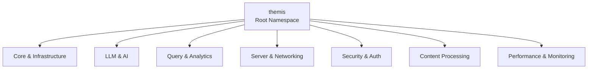

# ThemisDB Namespace und Klassen Übersicht

Dieses Dokument bietet eine thematisch organisierte Übersicht über die Namespace-Struktur
von ThemisDB und zeigt, welche Klassen sich in welchem Namespace befinden.

**Generiert am:** 2026-01-15
**Namespaces gesamt:** 122
**Klassen gesamt:** 2,316
**Funktionen gesamt:** 5,747
**Variablen gesamt:** 9,761

## Übersicht

Die Dokumentation ist in thematische Bereiche unterteilt für bessere Lesbarkeit:

- **[Core & Infrastructure](namespace-core.md)** - Kern-Komponenten, Storage-Layer und Transaktionsverwaltung
- **[LLM & AI Integration](namespace-llm.md)** - Large Language Model Integration und KI-Funktionalität
- **[Query & Analytics](namespace-query.md)** - Query-Processing, Analytics und AQL-Parser
- **[Server & Networking](namespace-server.md)** - Server-Komponenten, Netzwerk und Clustering
- **[Security & Authentication](namespace-security.md)** - Sicherheit, Authentifizierung und Autorisierung
- **[Content Processing](namespace-content.md)** - Content-Processing, Geo-Funktionen und Plugins
- **[Performance & Monitoring](namespace-performance.md)** - Performance-Optimierungen und Monitoring

## Namespace-Hierarchie (Übersicht)

Die folgende vereinfachte Grafik zeigt die Hauptnamespaces:

