# LLM & AI Integration

**Large Language Model Integration und KI-Funktionalität**

[← Zurück zur Übersicht](namespace-klassen-uebersicht.md)

---

### LLM & AI Integration

**Large Language Model Integration und KI-Funktionalität**

```mermaid
classDiagram
    %% LLM & AI Integration

    class themis_llm {
        <<namespace>>
        +55 classes
        +114 structs
        +0 enums
        +545 functions
    }

    class themis_llm_AdapterCompatibilityValidator {
        +AdapterCompatibilityValidator
    }
    themis_llm <-- themis_llm_AdapterCompatibilityValidator

    class themis_llm_ValidationLevel {
        +ValidationLevel
    }
    themis_llm <-- themis_llm_ValidationLevel

    class themis_llm_CompatibilityCheck {
        <<struct>>
        +CompatibilityCheck
    }
    themis_llm <-- themis_llm_CompatibilityCheck

    class themis_llm_CheckType {
        +CheckType
    }
    themis_llm <-- themis_llm_CheckType

    class themis_llm_ValidationResult {
        <<struct>>
        +ValidationResult
    }
    themis_llm <-- themis_llm_ValidationResult

    class themis_llm_ModelSpec {
        <<struct>>
        +ModelSpec
    }
    themis_llm <-- themis_llm_ModelSpec

    class themis_llm_VersionParts {
        <<struct>>
        +VersionParts
    }
    themis_llm <-- themis_llm_VersionParts

    class themis_llm_ModelMigrationAssistant {
        +ModelMigrationAssistant
    }
    themis_llm <-- themis_llm_ModelMigrationAssistant

    note for themis_llm "... und 142 weitere Klassen"

    class themis_llm_lora {
        <<namespace>>
        +21 classes
        +32 structs
        +0 enums
        +154 functions
    }

    class themis_llm_lora_FeedbackPlugin {
        +FeedbackPlugin
    }
    themis_llm_lora <-- themis_llm_lora_FeedbackPlugin

    class themis_llm_lora_BaseFeedbackPlugin {
        +BaseFeedbackPlugin
    }
    themis_llm_lora <-- themis_llm_lora_BaseFeedbackPlugin

    class themis_llm_lora_PrivacyFilterPlugin {
        +PrivacyFilterPlugin
    }
    themis_llm_lora <-- themis_llm_lora_PrivacyFilterPlugin

    class themis_llm_lora_ContentValidationPlugin {
        +ContentValidationPlugin
    }
    themis_llm_lora <-- themis_llm_lora_ContentValidationPlugin

    class themis_llm_lora_TrainingTriggerPlugin {
        +TrainingTriggerPlugin
    }
    themis_llm_lora <-- themis_llm_lora_TrainingTriggerPlugin

    class themis_llm_lora_CacheAwareWeightingPlugin {
        +CacheAwareWeightingPlugin
    }
    themis_llm_lora <-- themis_llm_lora_CacheAwareWeightingPlugin

    class themis_llm_lora_LoRAAdapterManager {
        +LoRAAdapterManager
    }
    themis_llm_lora <-- themis_llm_lora_LoRAAdapterManager

    class themis_llm_lora_AdapterEntry {
        <<struct>>
        +AdapterEntry
    }
    themis_llm_lora <-- themis_llm_lora_AdapterEntry

    note for themis_llm_lora "... und 38 weitere Klassen"

    class themis_llm_monitoring {
        <<namespace>>
        +5 classes
        +4 structs
        +0 enums
        +47 functions
    }

    class themis_llm_monitoring_PrometheusExporter {
        +PrometheusExporter
    }
    themis_llm_monitoring <-- themis_llm_monitoring_PrometheusExporter

    class themis_llm_monitoring_MetricType {
        +MetricType
    }
    themis_llm_monitoring <-- themis_llm_monitoring_MetricType

    class themis_llm_monitoring_MetricDefinition {
        <<struct>>
        +MetricDefinition
    }
    themis_llm_monitoring <-- themis_llm_monitoring_MetricDefinition

    class themis_llm_monitoring_MetricValue {
        <<struct>>
        +MetricValue
    }
    themis_llm_monitoring <-- themis_llm_monitoring_MetricValue

    class themis_llm_monitoring_LLMMetricsCollector {
        +LLMMetricsCollector
    }
    themis_llm_monitoring <-- themis_llm_monitoring_LLMMetricsCollector

    class themis_llm_monitoring_GrafanaDashboardGenerator {
        +GrafanaDashboardGenerator
    }
    themis_llm_monitoring <-- themis_llm_monitoring_GrafanaDashboardGenerator

    class themis_llm_monitoring_DashboardConfig {
        <<struct>>
        +DashboardConfig
    }
    themis_llm_monitoring <-- themis_llm_monitoring_DashboardConfig

    class themis_llm_monitoring_MetricsServer {
        +MetricsServer
    }
    themis_llm_monitoring <-- themis_llm_monitoring_MetricsServer

    note for themis_llm_monitoring "... und 1 weitere Klassen"

    class themis_llm_testing {
        <<namespace>>
        +3 classes
        +8 structs
        +0 enums
        +41 functions
    }

    class themis_llm_testing_ProductionValidator {
        +ProductionValidator
    }
    themis_llm_testing <-- themis_llm_testing_ProductionValidator

    class themis_llm_testing_ValidationConfig {
        <<struct>>
        +ValidationConfig
    }
    themis_llm_testing <-- themis_llm_testing_ValidationConfig

    class themis_llm_testing_ValidationResult {
        <<struct>>
        +ValidationResult
    }
    themis_llm_testing <-- themis_llm_testing_ValidationResult

    class themis_llm_testing_ProductionMetrics {
        <<struct>>
        +ProductionMetrics
    }
    themis_llm_testing <-- themis_llm_testing_ProductionMetrics

    class themis_llm_testing_LiveStats {
        <<struct>>
        +LiveStats
    }
    themis_llm_testing <-- themis_llm_testing_LiveStats

    class themis_llm_testing_QualityTest {
        <<struct>>
        +QualityTest
    }
    themis_llm_testing <-- themis_llm_testing_QualityTest

    class themis_llm_testing_PerformanceRegressionDetector {
        +PerformanceRegressionDetector
    }
    themis_llm_testing <-- themis_llm_testing_PerformanceRegressionDetector

    class themis_llm_testing_Baseline {
        <<struct>>
        +Baseline
    }
    themis_llm_testing <-- themis_llm_testing_Baseline

    note for themis_llm_testing "... und 3 weitere Klassen"

    class themis_llm_applications {
        <<namespace>>
        +2 classes
        +4 structs
        +0 enums
        +11 functions
    }

    class themis_llm_applications_ThemisHelpLoRA {
        +ThemisHelpLoRA
    }
    themis_llm_applications <-- themis_llm_applications_ThemisHelpLoRA

    class themis_llm_applications_Impl {
        +Impl
    }
    themis_llm_applications <-- themis_llm_applications_Impl

    class themis_llm_applications_FeedbackItem {
        <<struct>>
        +FeedbackItem
    }
    themis_llm_applications <-- themis_llm_applications_FeedbackItem

    class themis_llm_applications_PerformanceMetrics {
        <<struct>>
        +PerformanceMetrics
    }
    themis_llm_applications <-- themis_llm_applications_PerformanceMetrics

    class themis_llm_applications_FeedbackStats {
        <<struct>>
        +FeedbackStats
    }
    themis_llm_applications <-- themis_llm_applications_FeedbackStats

```

#### Statistik: LLM & AI Integration

| Namespace | Klassen | Funktionen | Variablen |
|-----------|---------|------------|-----------|
| `themis::llm` | 191 | 545 | 1162 |
| `themis::llm::lora` | 60 | 154 | 336 |
| `themis::llm::monitoring` | 10 | 47 | 23 |
| `themis::llm::testing` | 11 | 41 | 81 |
| `themis::llm::applications` | 6 | 11 | 40 |

---
