# Performance & Monitoring

**Performance-Optimierungen und Monitoring**

[← Zurück zur Übersicht](namespace-klassen-uebersicht.md)

---

### Performance & Monitoring

**Performance-Optimierungen und Monitoring**

```mermaid
classDiagram
    %% Performance & Monitoring

    class themis_performance {
        <<namespace>>
        +18 classes
        +9 structs
        +0 enums
        +145 functions
    }

    class themis_performance_CicadaRecord {
        +CicadaRecord
    }
    themis_performance <-- themis_performance_CicadaRecord

    class themis_performance_CicadaTransaction {
        +CicadaTransaction
    }
    themis_performance <-- themis_performance_CicadaTransaction

    class themis_performance_ReadEntry {
        <<struct>>
        +ReadEntry
    }
    themis_performance <-- themis_performance_ReadEntry

    class themis_performance_WriteEntry {
        <<struct>>
        +WriteEntry
    }
    themis_performance <-- themis_performance_WriteEntry

    class themis_performance_ContentionManager {
        +ContentionManager
    }
    themis_performance <-- themis_performance_ContentionManager

    class themis_performance_MergePolicy {
        +MergePolicy
    }
    themis_performance <-- themis_performance_MergePolicy

    class themis_performance_WorkloadStats {
        +WorkloadStats
    }
    themis_performance <-- themis_performance_WorkloadStats

    class themis_performance_DostoevskeyLSM {
        +DostoevskeyLSM
    }
    themis_performance <-- themis_performance_DostoevskeyLSM

    note for themis_performance "... und 20 weitere Klassen"

    class themis_acceleration {
        <<namespace>>
        +21 classes
        +8 structs
        +0 enums
        +105 functions
    }

    class themis_acceleration_BackendType {
        +BackendType
    }
    themis_acceleration <-- themis_acceleration_BackendType

    class themis_acceleration_BackendCapabilities {
        <<struct>>
        +BackendCapabilities
    }
    themis_acceleration <-- themis_acceleration_BackendCapabilities

    class themis_acceleration_IComputeBackend {
        +IComputeBackend
    }
    themis_acceleration <-- themis_acceleration_IComputeBackend

    class themis_acceleration_IVectorBackend {
        +IVectorBackend
    }
    themis_acceleration <-- themis_acceleration_IVectorBackend

    class themis_acceleration_IGraphBackend {
        +IGraphBackend
    }
    themis_acceleration <-- themis_acceleration_IGraphBackend

    class themis_acceleration_IGeoBackend {
        +IGeoBackend
    }
    themis_acceleration <-- themis_acceleration_IGeoBackend

    class themis_acceleration_PluginLoader {
        +PluginLoader
    }
    themis_acceleration <-- themis_acceleration_PluginLoader

    class themis_acceleration_BackendRegistry {
        +BackendRegistry
    }
    themis_acceleration <-- themis_acceleration_BackendRegistry

    note for themis_acceleration "... und 22 weitere Klassen"

    class themis_performance_phase3 {
        <<namespace>>
        +9 classes
        +15 structs
        +0 enums
        +52 functions
    }

    class themis_performance_phase3_QueryPlan {
        <<struct>>
        +QueryPlan
    }
    themis_performance_phase3 <-- themis_performance_phase3_QueryPlan

    class themis_performance_phase3_QueryResult {
        <<struct>>
        +QueryResult
    }
    themis_performance_phase3 <-- themis_performance_phase3_QueryResult

    class themis_performance_phase3_BaoOptimizer {
        +BaoOptimizer
    }
    themis_performance_phase3 <-- themis_performance_phase3_BaoOptimizer

    class themis_performance_phase3_Stats {
        <<struct>>
        +Stats
    }
    themis_performance_phase3 <-- themis_performance_phase3_Stats

    class themis_performance_phase3_Impl {
        <<struct>>
        +Impl
    }
    themis_performance_phase3 <-- themis_performance_phase3_Impl

    class themis_performance_phase3_PageType {
        +PageType
    }
    themis_performance_phase3 <-- themis_performance_phase3_PageType

    class themis_performance_phase3_BwTreePage {
        <<struct>>
        +BwTreePage
    }
    themis_performance_phase3 <-- themis_performance_phase3_BwTreePage

    class themis_performance_phase3_LeafPage {
        <<struct>>
        +LeafPage
    }
    themis_performance_phase3 <-- themis_performance_phase3_LeafPage

    note for themis_performance_phase3 "... und 12 weitere Klassen"

    class themis_observability {
        <<namespace>>
        +3 classes
        +1 structs
        +0 enums
        +36 functions
    }

    class themis_observability_LatencyTracker {
        +LatencyTracker
    }
    themis_observability <-- themis_observability_LatencyTracker

    class themis_observability_MetricsCollector {
        +MetricsCollector
    }
    themis_observability <-- themis_observability_MetricsCollector

    class themis_observability_Histogram {
        <<struct>>
        +Histogram
    }
    themis_observability <-- themis_observability_Histogram

```

#### Statistik: Performance & Monitoring

| Namespace | Klassen | Funktionen | Variablen |
|-----------|---------|------------|-----------|
| `themis::performance` | 28 | 145 | 121 |
| `themis::acceleration` | 32 | 105 | 114 |
| `themis::performance::phase3` | 25 | 52 | 58 |
| `themis::observability` | 4 | 36 | 6 |

---
