# Query & Analytics

**Query-Processing, Analytics und AQL-Parser**

[← Zurück zur Übersicht](namespace-klassen-uebersicht.md)

---

### Query & Analytics

**Query-Processing, Analytics und AQL-Parser**

```mermaid
classDiagram
    %% Query & Analytics

    class themis_query_functions {
        <<namespace>>
        +345 classes
        +4 structs
        +0 enums
        +522 functions
    }

    class themis_query_functions_FirstFunction {
        +FirstFunction
    }
    themis_query_functions <-- themis_query_functions_FirstFunction

    class themis_query_functions_LastFunction {
        +LastFunction
    }
    themis_query_functions <-- themis_query_functions_LastFunction

    class themis_query_functions_NthFunction {
        +NthFunction
    }
    themis_query_functions <-- themis_query_functions_NthFunction

    class themis_query_functions_PushFunction {
        +PushFunction
    }
    themis_query_functions <-- themis_query_functions_PushFunction

    class themis_query_functions_PopFunction {
        +PopFunction
    }
    themis_query_functions <-- themis_query_functions_PopFunction

    class themis_query_functions_ShiftFunction {
        +ShiftFunction
    }
    themis_query_functions <-- themis_query_functions_ShiftFunction

    class themis_query_functions_UnshiftFunction {
        +UnshiftFunction
    }
    themis_query_functions <-- themis_query_functions_UnshiftFunction

    class themis_query_functions_SliceFunction {
        +SliceFunction
    }
    themis_query_functions <-- themis_query_functions_SliceFunction

    note for themis_query_functions "... und 341 weitere Klassen"

    class themis_query {
        <<namespace>>
        +12 classes
        +64 structs
        +0 enums
        +115 functions
    }

    class themis_query_ASTNode {
        <<struct>>
        +ASTNode
    }
    themis_query <-- themis_query_ASTNode

    class themis_query_Expression {
        <<struct>>
        +Expression
    }
    themis_query <-- themis_query_Expression

    class themis_query_Query {
        <<struct>>
        +Query
    }
    themis_query <-- themis_query_Query

    class themis_query_ASTNodeType {
        +ASTNodeType
    }
    themis_query <-- themis_query_ASTNodeType

    class themis_query_BinaryOperator {
        +BinaryOperator
    }
    themis_query <-- themis_query_BinaryOperator

    class themis_query_UnaryOperator {
        +UnaryOperator
    }
    themis_query <-- themis_query_UnaryOperator

    class themis_query_LiteralExpression {
        <<struct>>
        +LiteralExpression
    }
    themis_query <-- themis_query_LiteralExpression

    class themis_query_FieldAccessExpression {
        <<struct>>
        +FieldAccessExpression
    }
    themis_query <-- themis_query_FieldAccessExpression

    note for themis_query "... und 68 weitere Klassen"

    class themis_analytics {
        <<namespace>>
        +9 classes
        +27 structs
        +0 enums
        +63 functions
    }

    class themis_analytics_DiffEngine {
        +DiffEngine
    }
    themis_analytics <-- themis_analytics_DiffEngine

    class themis_analytics_ChangeType {
        +ChangeType
    }
    themis_analytics <-- themis_analytics_ChangeType

    class themis_analytics_Change {
        <<struct>>
        +Change
    }
    themis_analytics <-- themis_analytics_Change

    class themis_analytics_DiffStats {
        <<struct>>
        +DiffStats
    }
    themis_analytics <-- themis_analytics_DiffStats

    class themis_analytics_DiffResult {
        <<struct>>
        +DiffResult
    }
    themis_analytics <-- themis_analytics_DiffResult

    class themis_analytics_DiffOptions {
        <<struct>>
        +DiffOptions
    }
    themis_analytics <-- themis_analytics_DiffOptions

    class themis_analytics_CachedDiff {
        <<struct>>
        +CachedDiff
    }
    themis_analytics <-- themis_analytics_CachedDiff

    class themis_analytics_Token {
        <<struct>>
        +Token
    }
    themis_analytics <-- themis_analytics_Token

    note for themis_analytics "... und 31 weitere Klassen"

    class themis_aql {
        <<namespace>>
        +4 classes
        +1 structs
        +0 enums
        +27 functions
    }

    class themis_aql_DocsAssistantFunctions {
        +DocsAssistantFunctions
    }
    themis_aql <-- themis_aql_DocsAssistantFunctions

    class themis_aql_Impl {
        +Impl
    }
    themis_aql <-- themis_aql_Impl

    class themis_aql_LLMAQLHandler {
        +LLMAQLHandler
    }
    themis_aql <-- themis_aql_LLMAQLHandler

    class themis_aql_BatchInferRequest {
        <<struct>>
        +BatchInferRequest
    }
    themis_aql <-- themis_aql_BatchInferRequest

```

#### Statistik: Query & Analytics

| Namespace | Klassen | Funktionen | Variablen |
|-----------|---------|------------|-----------|
| `themis::query::functions` | 351 | 522 | 1130 |
| `themis::query` | 85 | 115 | 226 |
| `themis::analytics` | 43 | 63 | 145 |
| `themis::aql` | 5 | 27 | 11 |

---
