# Security & Authentication

**Sicherheit, Authentifizierung und Autorisierung**

[← Zurück zur Übersicht](namespace-klassen-uebersicht.md)

---

### Security & Authentication

**Sicherheit, Authentifizierung und Autorisierung**

```mermaid
classDiagram
    %% Security & Authentication

    class themis_security {
        <<namespace>>
        +16 classes
        +20 structs
        +0 enums
        +134 functions
    }

    class themis_security_HSMConfig {
        <<struct>>
        +HSMConfig
    }
    themis_security <-- themis_security_HSMConfig

    class themis_security_HSMSignatureResult {
        <<struct>>
        +HSMSignatureResult
    }
    themis_security <-- themis_security_HSMSignatureResult

    class themis_security_HSMPerformanceStats {
        <<struct>>
        +HSMPerformanceStats
    }
    themis_security <-- themis_security_HSMPerformanceStats

    class themis_security_HSMKeyInfo {
        <<struct>>
        +HSMKeyInfo
    }
    themis_security <-- themis_security_HSMKeyInfo

    class themis_security_HSMProvider {
        +HSMProvider
    }
    themis_security <-- themis_security_HSMProvider

    class themis_security_Impl {
        +Impl
    }
    themis_security <-- themis_security_Impl

    class themis_security_SessionEntry {
        <<struct>>
        +SessionEntry
    }
    themis_security <-- themis_security_SessionEntry

    class themis_security_HSMPKIClient {
        +HSMPKIClient
    }
    themis_security <-- themis_security_HSMPKIClient

    note for themis_security "... und 25 weitere Klassen"

    class themis_auth {
        <<namespace>>
        +4 classes
        +6 structs
        +0 enums
        +19 functions
    }

    class themis_auth_KerberosConfig {
        <<struct>>
        +KerberosConfig
    }
    themis_auth <-- themis_auth_KerberosConfig

    class themis_auth_PrincipalMapping {
        <<struct>>
        +PrincipalMapping
    }
    themis_auth <-- themis_auth_PrincipalMapping

    class themis_auth_GSSAPIAuthResult {
        <<struct>>
        +GSSAPIAuthResult
    }
    themis_auth <-- themis_auth_GSSAPIAuthResult

    class themis_auth_GSSAPIAuthenticator {
        +GSSAPIAuthenticator
    }
    themis_auth <-- themis_auth_GSSAPIAuthenticator

    class themis_auth_JWTClaims {
        <<struct>>
        +JWTClaims
    }
    themis_auth <-- themis_auth_JWTClaims

    class themis_auth_JWTValidatorConfig {
        <<struct>>
        +JWTValidatorConfig
    }
    themis_auth <-- themis_auth_JWTValidatorConfig

    class themis_auth_JWTValidator {
        +JWTValidator
    }
    themis_auth <-- themis_auth_JWTValidator

    class themis_auth_security {
        <<namespace>>
        +2 classes
        +5 structs
        +0 enums
        +16 functions
    }

    class themis_auth_security_USBAdminAuthenticator {
        +USBAdminAuthenticator
    }
    themis_auth_security <-- themis_auth_security_USBAdminAuthenticator

    class themis_auth_security_AuthMiddleware {
        +AuthMiddleware
    }
    themis_auth_security <-- themis_auth_security_AuthMiddleware

    class themis_auth_security_AuthContext {
        <<struct>>
        +AuthContext
    }
    themis_auth_security <-- themis_auth_security_AuthContext

    class themis_auth_security_AuthResult {
        <<struct>>
        +AuthResult
    }
    themis_auth_security <-- themis_auth_security_AuthResult

    class themis_auth_security_TokenConfig {
        <<struct>>
        +TokenConfig
    }
    themis_auth_security <-- themis_auth_security_TokenConfig

    class themis_auth_security_JWTConfig {
        <<struct>>
        +JWTConfig
    }
    themis_auth_security <-- themis_auth_security_JWTConfig

    class themis_auth_security_Metrics {
        <<struct>>
        +Metrics
    }
    themis_auth_security <-- themis_auth_security_Metrics

```

#### Statistik: Security & Authentication

| Namespace | Klassen | Funktionen | Variablen |
|-----------|---------|------------|-----------|
| `themis::security` | 37 | 134 | 177 |
| `themis::auth` | 10 | 19 | 38 |
| `themis::auth::security` | 7 | 16 | 23 |

---
