# Server & Networking

**Server-Komponenten, Netzwerk und Clustering**

[← Zurück zur Übersicht](namespace-klassen-uebersicht.md)

---

### Server & Networking

**Server-Komponenten, Netzwerk und Clustering**

```mermaid
classDiagram
    %% Server & Networking

    class themis_server {
        <<namespace>>
        +54 classes
        +28 structs
        +0 enums
        +305 functions
    }

    class themis_server_AdminApiHandler {
        +AdminApiHandler
    }
    themis_server <-- themis_server_AdminApiHandler

    class themis_server_AuditLogEntry {
        <<struct>>
        +AuditLogEntry
    }
    themis_server <-- themis_server_AuditLogEntry

    class themis_server_AuditQueryFilter {
        <<struct>>
        +AuditQueryFilter
    }
    themis_server <-- themis_server_AuditQueryFilter

    class themis_server_AuditApiHandler {
        +AuditApiHandler
    }
    themis_server <-- themis_server_AuditApiHandler

    class themis_server_CacheApiHandler {
        +CacheApiHandler
    }
    themis_server <-- themis_server_CacheApiHandler

    class themis_server_SseConnectionManager {
        +SseConnectionManager
    }
    themis_server <-- themis_server_SseConnectionManager

    class themis_server_ChangefeedApiHandler {
        +ChangefeedApiHandler
    }
    themis_server <-- themis_server_ChangefeedApiHandler

    class themis_server_ContentApiHandler {
        +ContentApiHandler
    }
    themis_server <-- themis_server_ContentApiHandler

    note for themis_server "... und 63 weitere Klassen"

    class themis_sharding {
        <<namespace>>
        +41 classes
        +45 structs
        +0 enums
        +249 functions
    }

    class themis_sharding_PrometheusMetrics {
        +PrometheusMetrics
    }
    themis_sharding <-- themis_sharding_PrometheusMetrics

    class themis_sharding_WALApplier {
        +WALApplier
    }
    themis_sharding <-- themis_sharding_WALApplier

    class themis_sharding_WALManager {
        +WALManager
    }
    themis_sharding <-- themis_sharding_WALManager

    class themis_sharding_ReplicationCoordinator {
        +ReplicationCoordinator
    }
    themis_sharding <-- themis_sharding_ReplicationCoordinator

    class themis_sharding_AdminAPI {
        +AdminAPI
    }
    themis_sharding <-- themis_sharding_AdminAPI

    class themis_sharding_Endpoints {
        <<struct>>
        +Endpoints
    }
    themis_sharding <-- themis_sharding_Endpoints

    class themis_sharding_ShardTopology {
        +ShardTopology
    }
    themis_sharding <-- themis_sharding_ShardTopology

    class themis_sharding_DataMigrator {
        +DataMigrator
    }
    themis_sharding <-- themis_sharding_DataMigrator

    note for themis_sharding "... und 68 weitere Klassen"

    class themisdb_replication {
        <<namespace>>
        +20 classes
        +11 structs
        +0 enums
        +104 functions
    }

    class themisdb_replication_VectorClock {
        +VectorClock
    }
    themisdb_replication <-- themisdb_replication_VectorClock

    class themisdb_replication_HybridLogicalClock {
        +HybridLogicalClock
    }
    themisdb_replication <-- themisdb_replication_HybridLogicalClock

    class themisdb_replication_CRDTMerger {
        +CRDTMerger
    }
    themisdb_replication <-- themisdb_replication_CRDTMerger

    class themisdb_replication_ConflictResolver {
        +ConflictResolver
    }
    themisdb_replication <-- themisdb_replication_ConflictResolver

    class themisdb_replication_MMNodeState {
        +MMNodeState
    }
    themisdb_replication <-- themisdb_replication_MMNodeState

    class themisdb_replication_ConflictType {
        +ConflictType
    }
    themisdb_replication <-- themisdb_replication_ConflictType

    class themisdb_replication_Timestamp {
        <<struct>>
        +Timestamp
    }
    themisdb_replication <-- themisdb_replication_Timestamp

    class themisdb_replication_MMWriteEntry {
        <<struct>>
        +MMWriteEntry
    }
    themisdb_replication <-- themisdb_replication_MMWriteEntry

    note for themisdb_replication "... und 23 weitere Klassen"

    class themisdb_sharding {
        <<namespace>>
        +5 classes
        +17 structs
        +0 enums
        +99 functions
    }

    class themisdb_sharding_AutoRecoveryConfig {
        <<struct>>
        +AutoRecoveryConfig
    }
    themisdb_sharding <-- themisdb_sharding_AutoRecoveryConfig

    class themisdb_sharding_HealthStatus {
        <<struct>>
        +HealthStatus
    }
    themisdb_sharding <-- themisdb_sharding_HealthStatus

    class themisdb_sharding_AutoRecoveryManager {
        +AutoRecoveryManager
    }
    themisdb_sharding <-- themisdb_sharding_AutoRecoveryManager

    class themisdb_sharding_Stats {
        <<struct>>
        +Stats
    }
    themisdb_sharding <-- themisdb_sharding_Stats

    class themisdb_sharding_PredictiveConfig {
        <<struct>>
        +PredictiveConfig
    }
    themisdb_sharding <-- themisdb_sharding_PredictiveConfig

    class themisdb_sharding_ShardMetrics {
        <<struct>>
        +ShardMetrics
    }
    themisdb_sharding <-- themisdb_sharding_ShardMetrics

    class themisdb_sharding_FailurePrediction {
        <<struct>>
        +FailurePrediction
    }
    themisdb_sharding <-- themisdb_sharding_FailurePrediction

    class themisdb_sharding_PredictiveFailureDetector {
        +PredictiveFailureDetector
    }
    themisdb_sharding <-- themisdb_sharding_PredictiveFailureDetector

    note for themisdb_sharding "... und 13 weitere Klassen"

    class themis_network {
        <<namespace>>
        +3 classes
        +3 structs
        +0 enums
        +37 functions
    }

    class themis_network_WireProtocolServer {
        +WireProtocolServer
    }
    themis_network <-- themis_network_WireProtocolServer

    class themis_network_Stats {
        <<struct>>
        +Stats
    }
    themis_network <-- themis_network_Stats

    class themis_network_Session {
        +Session
    }
    themis_network <-- themis_network_Session

    class themis_network_RateLimitState {
        <<struct>>
        +RateLimitState
    }
    themis_network <-- themis_network_RateLimitState

```

#### Statistik: Server & Networking

| Namespace | Klassen | Funktionen | Variablen |
|-----------|---------|------------|-----------|
| `themis::server` | 84 | 305 | 366 |
| `themis::sharding` | 97 | 249 | 465 |
| `themisdb::replication` | 37 | 104 | 152 |
| `themisdb::sharding` | 23 | 99 | 130 |
| `themis::network` | 6 | 37 | 54 |

---
